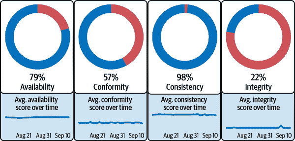

# 第八章：在规模上操作你的解决方案

在这最后一章中，我们将讨论当你将自动化数据质量监控解决方案投入运行并长期维护时可能面临的挑战。我们将重点放在清晰定义问题上，让你的用例和需求指引你选择适合团队的方法。

操作自动化数据质量监控这样的技术解决方案遵循一般模式。首先是获取平台的过程，可以是自建也可以是从第三方购买。然后是初始配置和启用，以便您的团队能够成功使用平台的所有功能。一旦一切都运行良好，“最终”阶段是持续使用平台来促进组织的目标——在这种情况下，是长期改善和维护数据质量。我们按照这些阶段的顺序构建了这一章节。现在，让我们深入了解如何达到数据质量卓越的稳定状态。

# 自建还是购买

一旦组织全面了解到他们正在面临的问题，并研究了解决方案空间中的选项，他们就需要做出决策：是自建还是购买？

建设并不一定意味着从头开始建设，而且很少如此。小团队可能采取的常见策略是围绕基于规则的数据质量评估的开源软件包（如 Great Expectations 或 Deequ）构建自己的平台。完全控制数据质量计划的路线图有其优势：

+   你将能够为你最关心的指标调整你的 ML 模型。

+   你可以从用户体验的角度设计通知和可视化。

+   如果你已经为管理数据构建了其他内部系统，比如定制数据目录，那么使你的 DIY 数据质量监控平台与这些系统兼容可能比与供应商集成更容易。

+   你将完全控制优化成本、运行时间和平台的其他性能特征。

+   你可以构建你需要的功能，包括供应商可能不提供的定制功能。

+   你不会为任何不必要的东西付费。

另一方面，DIY 方法的缺点通常会阻止企业选择这条路线，即使他们拥有庞大的工程团队：

+   你需要从业务的核心竞争力中分出时间，专注于构建由复杂的 ML 模型驱动的复杂平台。这通常包括聘请有才华的工程师和数据科学家，他们可能对构建新的耀眼事物感兴趣，但不太愿意留下来维护它。

+   大型企业的不同团队可能会使用不同的技术构建自己的定制解决方案。要整合这些并在组织的不同部分具有相同的数据质量透明度会很困难。

+   您的团队将负责平台的全天候支持和维护，以及培训和引入新用户。

+   数据环境不断变化。为了跟上步伐，您需要随时间推进您的平台创新，增加新功能并迭代您的模型。

+   供应商专注于优化数据质量监控平台的性能和成本，这是他们业务的核心。除非您的工程师经验丰富且积极主动，否则可能会得到次优的指标。

+   通常，自制系统只会生成未被采纳的电子邮件。除了检测数据质量问题外，您需要设计一个复杂的用户体验界面，包括可视化，以使通知可操作，并帮助根本原因分析。这往往是业务意识到项目太复杂无法内部解决的时候。

随着数据质量监控的供应商生态系统的发展，对于那些尚未专注于构建数据平台的企业来说，购买选项变得越来越有吸引力。总体运营成本通常低于企业自行开发和维护的成本。通过供应商，企业可以立即开始提升数据质量，而不必等待内部平台的建设完成，后者通常需要一年或更长时间。

云数据仓库越来越多地为企业添加数据质量监控功能。这是有道理的，您应该评估它们提供的内容与您的首选供应商之间的差异。请记住，数据仓库和数据湖并不专注于数据质量监控，因此可能没有动力在这一问题上进行创新，提供最佳用户体验或解决边缘案例的需求。

这里许多团队额外关注的问题是锁定。他们可能使用多个数据仓库/数据湖，并且不希望为了数据质量而需在多个地方查阅数据。或者如果他们想后期迁移数据，他们关心在新平台上重现所有规则、检查、通知和流程的切换成本。

## 供应商部署模型

企业对外部供应商的主要关注点之一是安全性和数据隐私。因此，关注供应商的部署模型至关重要，因为这将极大影响数据的保护程度。一般有三种部署选项（某些供应商可能只提供其中一种或几种），它们在平台安全性和控制方面有很大的差异。

### SaaS

使用供应商进行数据质量监控的最简单方法是采用 SaaS 部署。这可能就像在公司网站上注册，添加信用卡支付，并输入您希望用于访问云数据仓库的凭据一样简单。

然而，SaaS 部署模型引入了严重的安全和隐私风险。SaaS 平台需要对您希望监控的数据具有无限制的读取访问权限。即使解决方案仅使用摘要统计信息来检测数据质量问题，也需要数据样本来帮助找出问题的根本原因。此外，许多组织担心分享其仓库的元数据，因为表和列名可能提供战略或竞争情报，这些情报并非公开。对于大型组织来说，这种暴露通常是不能接受的。

### 完全在 VPC 内或本地部署

与 SaaS 相对的是完全在虚拟私有云（in-VPC）或本地部署（on-prem）的监控解决方案部署，这意味着整个监控应用运行在由客户控制的安全云端或本地环境内。

像 Docker 和 Kubernetes 这样的新技术使得管理和扩展这些在 VPC 内部部署比过去更加容易。升级仍然可以自动进行，客户无需参与。例如，可以将新版本发布到带有标签的 Docker 注册表，指示适合哪些客户。然后，应用内运行的自动化服务将查找部署的新标签并自动升级部署。有关更多详细信息，请参考图 7-3。

完全在 VPC 内或本地环境可以配置为一系列安全姿态：

允许或禁止远程访问

允许供应商远程访问部署通常对客户有利，可以提供更高质量的支持并协助解决任何配置或问题。然而，如果数据仓库中存储了特别敏感的数据，则可能无法实现（或者可能需要承包商关系）。

没有任何信息的出口

最敏感的客户可能希望阻止所有数据离开部署。这意味着一切；例如，供应商将无法从系统获取异常报告或任何遥测数据。这可能会显著增加客户的监控和维护负担，以及供应商所需的部署或支持费用。

大多数企业和关注安全和隐私的客户选择完全在 VPC 内部部署。值得注意的是，从管理角度来看，in-VPC 是一个更复杂的选择 —— 如果您的组织不习惯管理这种部署方式，可能会在起步阶段遇到学习曲线。但对许多公司来说，投入时间和资源来完全控制数据和元数据存储和处理的位置是值得的。完全在 VPC 内部部署是确保这种控制的唯一方法。

### 混合

在 SaaS 和完全在 VPC 之间的极端之间，还有第三条路。混合解决方案试图通过将查询和数据分析层放置在客户环境内（在 VPC 中），而将展示和用户交互层保留在供应商的云中（SaaS），来结合 SaaS 和在 VPC 中的优点。

然而，考虑到数据质量监控的性质，这与 SaaS 并没有太大不同。客户的数据仍然经常会离开他们的环境。为了工具提供重要的透明度和数据质量问题周围的上下文，需要向用户展示数据的汇总统计和样本。并且元数据也需要被暴露，即使只是描述用户在界面中检查的表格和列。

在实践中，我们发现混合解决方案必须在以下两种方式之间做出妥协：要么削弱用户体验，要么面临将敏感数据暴露到客户环境之外的风险。

表 8-1 展示了这些部署模型。

表 8-1\. 供应商部署模型

| 部署模型 | 查询和数据分析层 | 展示和用户交互层 | 部署复杂性 | 您的数据可以暴露给供应商吗？ |
| --- | --- | --- | --- | --- |
| SaaS | 在他们的环境中 | 在他们的环境中 | 最简单 | 是 |
| Hybrid | 在你的环境中 | 在他们的环境中 | 一些复杂性 | 是 |
| 完全在 VPC 中 | 在你的环境中 | 在你的环境中 | 最复杂 | 否 |

# 配置

与任何复杂的技术解决方案一样，你构建或购买的数据质量监控平台可能会有一系列需要在初始化时指定的选项。如果你处理大量数据，像是监控哪些表格以及在这些表格中检查哪些数据这样的配置决策尤为重要。你在这里的决定可以保护你免受飙升的数据仓库成本或供应商费用的影响，并确保你的解决方案即使对于有数十亿记录的表格也能继续良好运行。

在考虑到这些问题的情况下，我们将详细讨论大多数企业在设置他们的解决方案时遇到的问题：

+   如何确定哪些表格最重要

+   如何决定监控表格中的具体数据

+   如何避免手动配置所有内容

## 确定哪些表格最重要

虽然可以仅使用表格元数据实施整个数据仓库的广泛可观测性，但是查询实际数据*值*的自动化检查需要更多的计算资源来运行。因此，通常最好确定哪些表格最重要，并仅为这些表格配置“深度”数据质量监控（请参见表 3-1，这是很多公司如何进行这种分解的示例）。从最重要的数据开始也将有助于更快地接纳团队成员，并在扩展工具使用之前建立信任。

如何识别这些关键表格呢？对于较小的组织来说，数据团队可能很明显地知道哪些表格最重要。对于大型组织来说，这种知识可能分散在整个组织中，并且随着时间的推移，收集和维护变得更加困难。通常情况下，对表格中数据质量最关心的人是这些数据的消费者。一个能够让那些对某个表格拥有最深专业知识的人员轻松设置监控的工具，将增强组织在决定监控哪些表格时的灵活性。

你可能还想查看来自数据仓库的 SQL 查询日志。通过这种方式，你可以确定哪些表格（以及列和段）被自动化系统、临时分析师查询或商业智能报告平台最频繁地查询。这种“热度”是最重要数据的一个很好的代理。

## 决定监控表格中的哪些数据

对于大表格（特别是数十亿行），经常监控整个表格可能会非常昂贵。为了保持解决方案具有成本效益，你的平台应该只监控最近的数据。如果你总是仅查询最近一段时间的数据（通常昨天的数据就足够了，尽管有时需要更高的频率），你的监控将大大减少对底层数据仓库的负载，从而节省资金和运行时间。

在大多数情况下，如果仅监控最近的数据，你仍然可以覆盖到大多数导致数据质量问题的原因，因为这些问题通常只发生在最新进入表格的数据中。当然，也有例外情况，例如当历史数据被就地更新时，这些表格需要不同的监控策略，如在“就地更新表格”中讨论的那样。

要监控最新的数据，你需要按时间对数据进行分区。虽然这听起来可能很简单，但在某些情况下，由于数据仓库的要求或数据的来源，可能会变得相当复杂。想要了解我们遇到的许多不同时间分区方案的小样例，请参见图 4-3。

另一个复杂情况：有些表格可能没有可以用来识别“最近”记录的时间列。在这种情况下，除了让自动化监控系统在每次更新时检查整个表格并建立数据快照以比较表格随时间变化外，没有其他选择。

## 大规模配置

如果你有 10,000 张表格，逐一通过界面手动配置显然不合理。此外，你可能有数百或数千个现有的自定义数据质量规则和检查（例如在 dbt 中），你可能希望将它们迁移到你的新自动化平台上。

This is another reason, alongside those mentioned in Chapter 6, that your data quality solution should include a robust API with hooks to configure tables for monitoring and add, delete, or update custom checks programmatically. A CLI can be particularly helpful here, as well as the ability to specify configurations via YAML files.

When configurations are specified programmatically, they can be maintained in a version control system like Git. For critical data, this may be helpful for auditing purposes or for ensuring checks are reviewed and approved through a code-review process before being applied to production.

That said, you can’t expect to lock down and control all configurations programmatically. You’ll need to also allow users to make adjustments and add checks to tables as needed, including business users who may not be comfortable with writing code. So, we suggest that you provide two options: configuration by code as well as self-service configuration via a UI.

# Enablement

Both during and after your initial configuration, you’ll be introducing your monitoring platform to many different types of stakeholders and, most likely, multiple teams as well. The more people who use the tool, the more people will be invested in improving data quality at your organization. This is a great thing, but it comes with the challenges of managing a large, diverse user base. In this section, we’ll describe best practices you can implement for a successful enablement.

## User Roles and Permissions

Different systems will have different roles and permissions for their software. For example, a vendor solution might have admins who can fully configure tables, down to viewers who can only look at the results of data quality checks.

It’s best to define these roles and permissions very early on. Who will be given the admin roles, and will there be a backup if they go on leave? Will each team have its own admin, or will one person be responsible for all of the configuration? What role will new users get by default when they join a team? If someone has a problem with access, how do they escalate this?

Additionally, you may want to think about whether different teams or divisions within an organization should be siloed in terms of what tables they can access in your tool. It’s safest to give access only to what a user needs. For example, not all users will need access to sensitive tables containing HR information.

## Onboarding, Training, and Support

推出数据质量监控平台到您的组织需要仔细考虑和规划，有许多不同的路径可以选择。例如，您可以使数据质量成为一个从顶层向下的倡议，立即在数十个团队中推广。另一方面，您可以从小处着手，专注于让一个或两个团队成功，并通过早期成功推动全组织的病毒式采纳。我们看到这两种方法都奏效了——正确的选择取决于您的文化、您的需求紧急程度、您拥有的资源数量以及团队之间的紧密联系程度。

不论细节如何，我们看到以下一般策略帮助企业引入新员工团体、培训他们成功，并确保长期支持用户：

初始启动和需求收集

即使在推出之前，也应该举行一个启动会议，包括数据工程、数据科学和将受到平台影响的业务用户等利益相关者。理想情况下，您已经在与出席者中实现了数据质量监控的认同，但这也是一个团结您的团队并将其与业务成果联系起来的地方。这也是您应该分享入职计划和时间表、听取关注和愿望清单以及展示平台演示的阶段。

现场培训会议

在启动后，通常会计划在接下来的几周内安排一到三次现场培训会议。会议通常与各个团队对应，因为您业务中的每个组织可能具有非常不同的使用案例和要求。您应该邀请那些将积极使用工具的员工，特别是那些涉及配置和设置的员工。根据您的构建与购买决策，建设和管理平台的供应商或内部团队将主持这些会议。（如果与供应商合作，随着时间的推移，您可能会积累足够的内部经验，从而能够自行进行培训。）

有时，现场培训会伴随内部工作会议，根据需要帮助团队整合所学内容，并就适合他们具体需求的数据质量监控检查和配置达成一致。

随需课程

尤其对于拥有许多团队需要引入的大型公司而言，随需培训课程非常有帮助，这可能是一些书面教程和视频演示的结合，以适应不同的学习风格。这使用户可以按自己的节奏进行学习，并为难以通过现场培训扩展的主题提供额外的资源。

办公时间

在入职阶段及其后，许多团队发现有可能参加与供应商/负责内部团队每周办公时间的选项很有帮助。这使用户能够与熟悉数据质量监控平台的专家面对面讨论任何问题。为了促进学习，这些讨论可以记录并分享。

持续支持

无论是来自维护平台的内部团队还是外部供应商，都应该有人负责持续支持。这可能包括一个专门的 Slack 频道，用于直接访问平台专家，以及定期会议来审查平台路线图和功能更新（定期发布说明也应向用户提供）。支持平台的人员应建立错误、性能和基础设施问题的监控，并针对解决的 SLA 设定目标（例如，在一小时内解决 P1 问题）。

入职、培训和支持最终不仅仅是减少摩擦的一种方式；它们是提高你组织中与数据质量相关的参与度的方法。它们帮助宣传平台并在内部传播，识别出可能根本不是最初需求评估的相关团队，并利用监控解决方案的机会。上述最佳实践也有助于缓解人们悄悄失败并放弃尝试使用工具的常见问题。

# 随着时间的推移提高数据质量

最终，您投资于数据质量监控，因为您希望提高组织中的数据质量。虽然拥有一个优秀的数据质量监控平台是一个起点，但这并不是全部。有一些策略可以确保您的组织持续改进并创建一个从一开始就真正投资于数据质量的文化。

## 计划

您需要确定并致力于超越任何单一工具或界面的数据健康计划，并改变与数据工作的方式。

例如：

+   进行第三方数据源的审计。你的企业正在使用哪些？哪些正在被监视？

+   投资于与您的数据质量监控工具集成的额外数据基础设施，例如数据目录。

+   创建文档，例如运行手册，用于调试问题。这减少了只存在于某个团队或个人之间的信息孤岛问题（当人们更换团队或离开公司时，信息会丢失）。

+   确保每张表都有明确的负责人和清晰的通知渠道以及分类处理过程，如第六章中描述的。

+   开发数据生产者和数据消费者之间的合同，以明确数据方面的期望（例如，什么构成了延迟交付，或者数据更新时通知谁）。

我们发现，投资于数据质量监控本身通常会在组织中建立数据健康的动力，就像首次投资健康一样，比如承诺定期锻炼，可能会启动各种相关的变化，比如改善更加营养的饮食。

## 指标

当您投资于提高数据质量时，您很可能会对衡量进展的方式感兴趣。这对于许多不同的原因都很重要，无论是帮助鼓励其他团队使用您的工具，还是向高级领导展示影响。

### 分类和解决方案

成功的最重要指标之一不仅是检测到的数据质量问题数量，还有这些问题的严重程度以及*解决它们的速度*。致力于分类和解决问题将决定监控投资的回报价值的成败。

为此，建立一个清晰的流程来处理检测到的数据质量问题以及持续改进和迭代这一流程至关重要。在数据质量问题的响应时间上建立 SLA，并确保清晰地在团队之间进行沟通。

### 高管仪表板

高级领导通常从数据质量平台的高层指标仪表板中受益。这可能包括仓库覆盖率水平，每周检测到问题数量的趋势，或者问题最多的表格。有关更多仪表板可视化和详细信息，请参考第三章。

### 评分卡

跟踪数据质量倡议进展的另一种方式是为每个表格提供一个数据质量评分卡，将表格健康的不同方面结合成单一值、百分比或等级。

例如，为了汇编一个表格的评分卡，每次在该表格上运行数据质量监控时，您可以为通过的检查给予积分，并扣除未通过的检查的积分。您可能希望为每个数据质量检查分配一个权重，因为并非所有检查都同等重要。一种做法是使用检查的优先级水平（高、普通或低，参见第六章），因此高优先级的检查对表格的整体数据质量评分影响最大。

评分卡提供了对表格数据质量的一览，并允许您快速比较表格。当表格可以链接到组织信息时，评分卡成为了了解哪些团队、业务部门或数据仓库正在提高数据质量，哪些正在落后的一种方式。因为这些原因，评分卡不仅在监控平台内非常有效，而且在与数据目录等其他系统集成时也同样如此。

在制定评分卡时，您通常需要做出艰难的产品和用户体验决策。例如，您可能会决定将数据质量分数分为解释表格需要改进的类别，例如在图 8-1 中。然而，定义哪些类别以及如何将检查分类到这些类别中的决定远非简单。

###### 图 8-1\. 一个数据质量评分卡的示例，其中分数分配在四个类别中，并随时间跟踪。

在实践中，评分卡很少是一刀切的。至少，数据质量平台应提供 API 或数据导出功能，允许组织提取构建此类评分卡所需的数据。例如，每次检查运行的历史记录，以及检查的优先级和相关标签，以及检查是否通过或失败，可以作为简单评分卡的基础。这些数据还可以与组织已有的其他数据合并，用于构建他们自己的定制数据治理仪表盘。

# 从混乱到清晰

![OpenAI. (2023). ChatGPT（2023 年 9 月 25 日版本）[大型语言模型]。 https://chat.openai.com](assets/adqm_08in01.png)

OpenAI. (2023). ChatGPT（2023 年 9 月 25 日版本）[大型语言模型]。[*https://chat.openai.com*](https://chat.openai.com)

现在您已经掌握了解决运营挑战的工具，您将为改变公司数据质量的故事迈出坚实的一步。

我们很高兴您在本书中花时间学习如何实现大规模自动化数据质量监控。总结一下，这段旅程带领我们走过了：

第一章

为什么数据质量很重要以及错误如何影响您的业务

第二章

一个综合的数据质量解决方案的外观，以及为什么这必须超越基于规则的测试，包括与机器学习的自动化集成

第三章

如何评估您的业务从这样的解决方案中获得的投资回报率

第四章

一种利用机器学习实现大规模自动化数据质量监控的算法

第五章

调整和测试您的模型，确保其在实际数据中表现良好

第六章

如何实施通知并避免常见的过度警报问题

第七章

为何以及如何将您的监控与其他数据工具和系统集成

第八章

部署您的解决方案，接纳用户，并持续改善数据质量

如今许多企业在没有足够质量控制的情况下运营数据工厂。传统方法未能应对现代企业每天处理的大量数据。幸运的是，随着数据堆栈的其余部分现代化，数据质量监控也在不断发展。正如本书所述，利用机器学习自动化数据质量监控是一种强大的解决方案，可以积极地检测和解释潜藏在最重要数据中的问题，影响到机器学习模型、BI 仪表盘，最终影响到推动底线的决策。

在本书中，我们开放地分享了许多内容，包括杰里米在 Anomalo 刚刚起步时希望知道的事情，因为我们相信数据质量的民主化。我们希望更多与数据打交道的人，无论是从事问题解决的从业者，还是对在不稳定基础上建设感到担忧的高级管理层，都能知道有一条前进的道路。这是一条通向更高士气、更好商业成果的道路，让你能够信任公司依赖的数据。现在，你已经准备好迈出下一步了。
