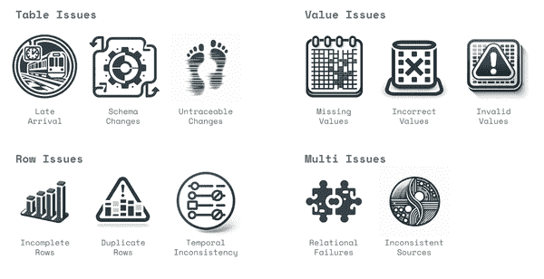

# 附录：数据质量问题的类型

本附录提供了关于现实世界中常见的数据质量问题类型的额外信息。这个列表对于评估您正在构建或购买的数据质量监控解决方案非常有帮助。最终，您将希望为组织中每个重要数据集的每种问题类型确定并解决策略。

对于每个数据质量问题，我们将提供一个示例，常见原因的总结，这些问题通常如何影响分析（使用数据和人类进行决策）和机器学习（使用数据和算法自动化流程），以及我们对如何最佳监控数据源这些问题的建议。

###### 图 A-1\. 分成四类别的数据质量问题 (DALL-E 3)

如图 A-1 所示，我们已将本附录中的问题分成四个广泛的类别，显示出问题影响数据的*级别*。

+   表格问题

    影响整个表的问题，并不限于单个行或值：

    数据迟到

    当数据迟到并且在系统需要数据时不能及时提供给消费系统时

    模式变更

    当数据结构发生变化，比如新增或删除列，列名变更，列的数据类型变更，或者半结构化列中的 JSON 模式变更时

    无法追踪的变更

    当表中的记录以无法事后审计的方式进行就地更新时

+   行问题

    影响表中整行数据的问题：

    不完整的行

    当数据到达，但应该存在的行数只有一部分存在时，通常是数据的某个特定部分缺失

    重复行

    当同一行数据在数据中出现多次，而实际上只打算出现一次时

    时间上的不一致性

    当相关数据记录的时间或顺序存在差异或不一致时

+   数值问题

    影响数据特定值或单元格的问题：

    缺失值

    当数据集中某列的数值未填充，而是显示为 NULL、零、空字符串或其他代表缺失数据的标志值时

    不正确的值

    当某列的数值不正确，可能是记录级别的编码问题，或者结构性错误导致某些或所有记录被错误表示时

    无效值

    当数值未能符合指定格式、约束或业务规则时

+   多重问题

    多表关系问题：

    关系失败

    当两个数据源之间的关系完整性失败，导致某些记录的重复或缺失连接时

    不一致的来源

    当时间或不同数据源的数据值存在差异时，本应相同的数据。

请注意，这些问题不一定是独立的，因为其中一些可能既是潜在问题的原因，*也是*其症状，因此它们可能同时发生。例如，源表可能迟到，导致数据转换中的关系失败，并在事实表中缺少数据。

我们尽可能详尽地列出了这些问题。但请注意，我们明确排除了*语义*问题，这可能涵盖数据在技术上是正确的，但被用户误解的情况，以及*可访问性*问题，其中数据虽然正确，但无法访问。这两者都是可以通过数据目录和访问控制平台解决的重要数据治理问题。

# 表问题

## 迟到到达

### 定义

数据迟到，并且在系统需要数据时，消费系统无法获取数据。

### 例子

将 web 应用程序事件日志从 S3 移动到数据仓库的系统停止处理新的日志记录，因此分析师登录查看关于用户行为的仪表板时，最近一天没有事件数据。

### 原因

+   上游没有生成任何数据，可能是捕获点（日志未工作）或上游系统或第三方的处理故障或中断。

+   负责将数据加载到数据仓库的系统出现问题，可能是因为中断或处理数据时遇到严重异常。

+   负责数据转换的系统出现问题，可能是因为中断或应用转换逻辑时发生严重失败（例如，在数据仓库中的 SQL 查询开始抛出异常）。

+   生产数据的管道因上游其他数据质量问题而停止发布；迟到的数据意味着向最终用户提示当前周期的数据尚未准备好供使用。

### 分析影响

+   当数据延迟时，仪表板通常会显示异常——可能有可视化图表无法渲染，或在仪表板上显示错误，或显示 NULL 或 0 值。

+   用户通常会意识到数据丢失，并稍后返回查看仪表板。如果这种情况经常发生，用户会开始对数据的可用性失去信心，并寻找其他来源或在没有数据的情况下做出决策。

+   操作用例（例如分析当前营销活动或当前站点行为）将受到最近周期的迟到数据的不成比例影响。

### ML 影响

+   *模型训练。*通常不会受到影响，因为模型训练通常是基于长时间的数据历史进行。

+   *模型推断。* 迟到的数据通常会导致 ML 特征为 NULL 或 0，而不是应该有的有意义值。或者，迟到的数据可能意味着 ML 模型正在使用已过时的数据。在这两种情况下，这会引入偏差到 ML 模型中，可能导致预测大幅变化。

### 如何监控

+   一种方法是使用表观测监控。按照定期时间表，收集表最后更新的元数据。然后建立时间序列模型来预测下一次更新应何时到达，并在更新延迟时发出警报。然而，这可能会忽略表正在原地更新但新记录仍未到达的情况；也可能忽略表被删除并替换但没有新记录的情况。

+   最健壮的方法是查询数据最新时间分区的可用性。观察随时间记录到达所需的时间，然后再次建立时间序列模型来预测记录应该到达的时间（或日期），并在未发生时发出警报。

+   注意，除了使用时间序列模型外，您还可以设置表应何时更新或数据应何时到达的硬性 SLA。这在您需要数据按指定时间到达的用户或系统的情况下非常有利。但请注意，这在大规模情况下将很难维护。

## 模式变更

### 定义

数据的结构变更，如新增或删除列、列名称更改、列数据类型更改或半结构化列中 JSON 架构的更改。

### 示例

某列名称令人困惑，因此工程团队决定将其重命名以使其更清晰。然而，下游数据处理系统依赖于该列名称，并且也没有进行更改，导致数据处理失败（数据延迟或不完整）或数据丢失。

### 原因

+   这些变更的根本原因几乎总是有意为之，旨在扩展、优化或重构运行时捕获的数据。

+   生产应用程序的数据框架（例如 Django）具有确保这些变更在整个应用程序中传播的强大机制（所谓的“迁移”），但这不会扩展到摄取这些应用程序发出的数据的系统中，必须手动考虑。

+   JSON 格式数据因其灵活性而受到重视，可以捕获新数据而无需在当前系统或下游应用程序中进行迁移。然而，任何依赖该 JSON 数据结构的下游应用程序可能会受到这些变更的影响。这些变更通常更频繁且监管不严。

### 分析影响

+   简单来说，模式变更将使列不可用，并且仅仅破坏依赖它们的仪表板。

+   在更复杂的情况下，模式变更是看起来缺失数据或分布变更的根本原因，因此表现为这种方式。

### ML 影响

+   *模型训练*。当模式发生变化时，适当地回填历史数据可能是不可能的（例如，如果新信息正在被捕捉或类型以有损方式发生变化）。在这些情况下，机器学习模型将因为其数据随时间不一致而变得不那么强大。

+   *模型推断*。如果发生模式更改，并且模型尚未重新训练以适应这些更改，那么模型可能会失败（因为数据不符合预测的正确格式或形状），或者可能进行狂野的预测，因为更改后的数据被强制转换为 NULL 或其他标志值或填充值。

### 如何监控

+   可以使用验证规则明确说明给定表的模式应该是什么。然而，长时间内保持这种验证非常困难。

+   一种更自动化的方法是在某个固定的节奏下对模式数据进行快照（我们在 Anomalo 每天都这样做），并自动检测不良变化，例如列被删除或重命名。

## 不可追溯的变化

### 定义

表中的记录以不可追溯的方式直接更新，无法在事后审计。

### 示例

一个数字广告公司只存储其广告活动的当前状态。广告活动通常会延长，但原始结束日期没有历史记录，因为它们不断被覆盖。基于预计广告活动结束日期的报告是不可靠的。虽然广告活动的开始日期不应更改，但它们也可能被覆盖。在运行期间，广告活动还可以更名。当分析师日复一日地生成报告时，他们的数字不匹配，无法追溯到原因。

### 原因

+   维度数据通常会被直接更新以显示客户或位置的当前状态。位置的属性可能会更改，例如它是否开放或暂时关闭，或者客户可以在不同州份有新地址。如果不跟踪这些更改的时间，基于当前维度表版本的历史报告可能是不正确的。

+   客户交易或索赔数据可能会在原地更新，当交易开始时创建一个初始记录。各种字段最初将作为 NULL 值，因为它们是未知的（例如最终发货日期或索赔金额）。然后，随着这些事件的逐渐了解，记录会被更新。这导致数据始终具有更多最近记录的 NULL 值。

+   数据管道可以“重新运行”，以纠正错误和之前确定的问题，而不保留不正确数据的记录以进行比较。

+   表格可能具有数据架构，整个表格每天被截断和重新加载，掩盖了哪些记录实际上发生了更改。

+   注意，一些数据仓库支持“时间旅行”的概念，以便在最近的某个时间点上查看表的历史。这可以帮助缓解这些问题的影响，但支持通常仅限于非常近期的时间段，并且可能难以扩展到用于机器学习应用程序的记录级时间旅行。

### 分析影响

+   在这些表上进行的数据分析就像建立在流动沙上一样，因为连续两天运行相同的查询不会提供相同的结果。分析师无法重建导致前一天运行的条件。

+   数据段的度量可能由于维度数据的变化，在报告中显示出从一天到下一天不一致的值，导致分析师对数据失去信任。

+   由于分析师无法重建过去的世界，历史分析变得不可能。

+   随时间计算的度量可能因为最近数据不完整而显示出突然的尖锐变动，而较早的记录已经完成更新。

### 机器学习影响

+   *模型训练。* 在原地更新数据而不保留完整的更改审计日志会消除可能对 ML 模型有价值的大量信息信号。

    最糟糕的情况是，对历史数据的更新会“泄漏”关于模型试图预测的响应的信息。例如，如果每次下订单时都更新客户表，则此数据不能用于预测客户将来是否会再次下订单。如果是这样，那么最近的更改（或更完整的记录）的存在将是一个非常强烈的信号，表明客户在过去有过购买行为。但这不会推广到未来的预测中。

+   *模型推断。* 模型通常是在完全成熟的历史数据（所有原地更新已完成）上训练的。这是可以接受的，但前提是模型随后将用于预测*同样*完全成熟的数据。实际上，这很少发生，模型将用于仍然不完整的数据，并且模型的结果将非常偏向。

### 如何监控

+   可靠地检测这个问题的唯一方法是比较从给定表中随时间抽取的数据摘要统计或样本，用于特定一组记录。这组记录可以是随机选择的主键集，或者可以是使用 SQL WHERE 子句指定的特定时间窗口，查询日期或数据的时间分区。

+   然后，您可以监控随时间推移行数的漂移（数据随时间原地删除或添加），或者关键统计数据的漂移，如数据质量或业务指标。

+   一个更健壮的方法是反复从给定时间分区的数据中取样，并使用机器学习来检测数据分布漂移的差异。这可以自动识别在原地更新的特定列和数据段。

# 行问题

## 不完整的行

### 定义

数据到达，但应该存在的行数只有一小部分。通常缺少特定数据段。

### 例子

给定某一天数据的所有记录已经到达，除了一个国家的记录，由于该国家的第三方正在发生故障而延迟处理。

### 原因

+   可能通过不同的过程或供应商收集不同分段的数据。例如，来自不同区域的数据来自不同的云可用区。或者使用不同的工具收集不同类型的事件。

+   就分段单独收集或处理数据而言，通常会发生仅有一个或少数几个分段捕获、传输或加载数据失败或延迟的情况，而不是所有分段。

### 分析影响

+   对于数据中评估的任何指标，缺失的分段可能高于或低于该指标的平均水平，这将相应地使指标出现偏差。例如，如果 Android 事件中的交易收入较低，并且这些事件丢失，则整体交易收入将高于预期。

+   当指标以这种方式出现偏差时，可能导致团队得出错误的结论。例如，任何最近的业务变更可能会“怪罪”导致的指标变化。

+   导致数据不完整的分段越小，诊断不完整性根本原因就越困难。如本文所述的偏见指标可能会成为新常态。

+   一旦问题被识别出来，可能无法对不完整的数据进行补填，从而在数据中留下永久的伤痕。

+   仪表板显示指标的分段细分可能出现问题，因为某个特定分段突然在仪表板上消失，导致团队忽视仪表板作为可靠的真实数据来源。

### ML 影响

+   *模型训练。* 在罕见情况下，数据的某个分段可能会长时间丢失而未被检测到。在这些情况下，数据将缺失于训练数据集中，模型将无法学习如何处理该数据段。然后，当模型用于预测来自该数据段的记录时，它们可能会非常不可靠。

+   *模型推理。* 如果在预测时未处理某个分段的记录，则这些预测将无法供业务使用。这可能导致消费者的默认非个性化行为，或者决策系统转为基于规则的行为，所有这些都将表现不佳。

### 如何监控

+   表观察方法可用于监控不完整的行；然而，由于使用了元数据，它们只能检测表的*整体*行数变化，并不像对于特定时间分区添加的行数变化那样敏感。

+   更稳健的方法是使用 SQL 查询和表中的分区时间列来计算时间分区（天或小时）的行数。然后，您可以使用时间序列模型检测表行数中是否有意外下降。

+   无监督的 ML 模型非常擅长检测数据中是否存在某个特定分段已消失或比预期少得多的情况。

+   对于数据的非常高基数部分（例如，商店 POS 系统），通过连接到包含所有商店的维度表，明确确认所有商店是否已包含可能是必要的。

## 重复行

### 定义

当数据行被意外加载多次时，同一行在数据中出现多次，而实际上只有意出现一次。

### 例子

信用卡支付交易数据集与每种支付交易类型的元数据参考表连接。这个参考数据集是手动在 Excel 中维护的，并且在有更改时偶尔会被删除和重新加载。因错误添加了一个支付类型两次而不是直接编辑。这些数据被加载，现在该类型的所有信用支付交易都与两条参考记录连接，导致数千个交易在下游重复。

### 原因

+   如信用卡例子所示，单个表中引入一个重复记录的微小变化，可能在数据连接到其他表后扩散成大量重复。因此，重复数据往往会扩散，如果连接到自身（例如，匹配一些行或与其他表），可能会呈指数级扩展。

+   重复的一个常见原因是同一记录被多次加载到数据仓库中。当系统加载数据时出现故障，并且数据工程师必须手动恢复加载操作时，就可能发生这种情况。同一个文件或其部分可能会被无意中加载两次。

+   重复数据还可能源自分布式系统中的日志记录。这些系统通常能够容忍单个节点的故障，并且通常保证任务“至少执行一次”。然而，这意味着由于分布式系统中的通信问题，它们有可能运行多次。结果可能是重复记录（可能具有不同的时间戳）。

### 分析影响

+   重复数据往往会导致分析结果夸大——记录计数会高于预期，基于总和的统计数据也会如此。这可能会使企业的绩效看起来更好，或者对你正在聚合的任何实体有过高评价。

+   重复数据还会对任何平均统计数据产生偏差，因为重复的记录在比较时将有效地获得更大的权重。

### ML 影响

+   *模型训练。*

    +   当数据在训练数据中随机重复（这种情况很少见）时，它不太可能对模型结果产生实质性偏差。事实上，许多算法使用随机抽样行，这些行不会受随机重复数据的影响。

    +   然而，如果重复数据存在偏差，那么模型将学会更多地关注这些重复记录。在极端情况下，它将会记住它们（因为它们出现得如此频繁），并且对其预测具有不合理的高置信度。

    +   最糟糕（也是最常见）的情况是，在进行训练和测试拆分之前，数据重复。这将导致一些记录同时出现在训练数据和测试数据中（因为它们出现两次，这在一定程度上是可能的）。这种从训练数据到测试数据的记录“泄漏”将导致对模型性能的无效估计。这可能会导致训练模型选择了与数据不匹配的模型，在生产中的表现远远不如开发模型时的表现。

+   *模型推理。*

    +   推理时间的重复数据对机器学习模型本身并不构成问题。然而，无论哪个系统消费模型的预测，都必须处理重复的记录。

    +   这通常意味着决策系统会尝试为同一实体多次做出相同的决策。这可能导致重复发送电子邮件、重复发放优惠券、重复创建贷款申请等问题。

### 如何监控

+   可以通过创建一个验证规则来检测重复行，该规则确保数据在主键列上是唯一的，或者在定义主键的一组列上是唯一的。但是，这需要专家测试并为每个感兴趣的表定义这个规则。

+   更可扩展的方法是自动识别那些随时间一直是唯一的列，并在任何这些列中出现意外重复值时进行警报。

## 时间不一致性

### 定义

相关数据记录的时间或顺序存在差异或不一致。

### 示例

营销团队正在分析用户首次访问网站时所采取的步骤序列。跟踪的关键事件包括用户首次访问的第一个页面、创建帐户时、首次将商品添加到购物车时以及首次完成交易时。然而，与添加商品到购物车相关的某个分布式系统正在经历性能下降，因此积累了长时间的购物车添加日志队列。所捕获的时间戳是记录日志时的时刻，而不是商品在用户浏览器中被添加的时刻。结果是，有时第一次添加的商品会出现在第一次完成交易之后。分析将这些记录排除为无效记录，并减少了已添加商品到购物车的用户完成交易的计算百分比。

### 原因

+   这些问题最常见的原因是事件的时间戳要么不正确，要么使用错误的时间戳（如上例中，我们使用的是记录的时间戳，而不是客户端事件的时间戳）。

+   这些问题的另一个非常常见的原因是，同一张表中不同列使用不同时区的“墙上时间”存储。例如，记录更新的时间戳存储在协调世界时（UTC）中，而交易时间存储在发生交易的本地时间中。

+   这类时间问题也常常会因 SQL 逻辑错误而悄悄潜入数据的下游转换。例如，分析工程师可能会错误地获取用户在第一次会话中将商品添加到购物车的最大时间，而不是最小时间。对于在其首次会话中进行多次交易的用户来说，这也会导致添加到购物车的时间晚于交易时间。

### 分析影响

+   当事件的时间顺序不准确时，计算事件发生所需时间的结果就会出现偏差。这可能导致对关键活动完成所需时间的估算出现分析错误。俗话说，时间就是金钱，因此这些不准确性可能导致次优甚至价值破坏的决策。

+   在某些情况下，事件顺序可能会变得不可能（用户结账而未将任何商品添加到购物车中）。如果移除这些不可能的记录，则结果会因其缺失而出现偏差。

+   如果包括它们，可能会产生极端后果。例如，我们曾看到由于时间戳转换问题导致事件被预定到遥远的未来。当这些事件的时间计算并与其他时间平均后，可能会完全混淆计算并导致不合理的结论。

### ML 影响

+   *模型训练.*

    +   事件发生所需的时间可能是机器学习模型的非常重要的信号（客户完成动作所需的时间或内部流程所需的时间）。这些不准确性往往会使模型误以为这些事件比实际重要性低。

    +   更为棘手的情况是，当事件本身成为你试图预测的内容的一部分时。例如，如果你正在预测交付需要多长时间，而这一度量受到不正确时间数据的偏倚，那么整个模型可能会受到偏倚，并且在实际应用中表现不佳。

+   *模型推断**.* 在预测时，这些时间上的不一致将表现为错误的数值，这会对其他类型的字符串或数值数据一样产生不利影响。

### 如何监控

+   可以创建复杂的验证规则，通过表自连接，计算事件之间的顺序或到达时间间隔，然后设置明确的保护措施来保证事件顺序或到达时间的顺序性。

+   无监督机器学习算法可以检测到这些问题的一些表现形式，只要数据被重塑为每个实体或交易一行，具有多列事件和时间戳序列。算法将能够学习这些列之间的关系，并识别是否存在意外的变化。

# 值问题

## 缺失值

### 定义

数据集中某列的数值未填充，而是出现了 NULL、零、空字符串或其他标志性值，表示数据缺失。

### 示例

在一个汽车保险数据集中，每个保险政策都有一列显示被保险车辆的车门数量。这列数据为空（例如，对于摩托车而言车门无关紧要），但突然之间出现了更多的空值，因为一个第三方车辆信息源不完整，导致左连接失败，引入了本应具有车门数量的车辆的空值。在数据库中，NULL 可能会成为一个重载概念：它可以表示值不适用（摩托车没有车门）、未知（车辆类型尚未确定）或缺失（已知车辆但车门数量字段尚未填充）。

### 原因

+   缺失数据可能出现在事件捕获的数据收集点上（例如，记录被写入），但对事件的测量（例如，事件的背景或关键结果）未被捕获。

+   数据移动时，缺失数据也可能会渗入数据中，例如，如果数据加载到的系统期望替代数据类型，那么值可能会被强制转换为新数据类型，无法强制转换的值可能会变成缺失数据。

+   缺失数据通常也会通过左连接引入。例如，当一组交易左连接到一个维度表时，如果连接键在维度表中不存在，那么从维度表到交易的任何数据都将缺失这些键的数据。

+   缺失数据也可能积累，从而导致在粒度级别上的少量缺失数据在聚合级别上变成更大的缺失数据比例。例如，在某些平台上，如果计算包含缺失值的列的总和，则总和的结果可能是缺失的。因此，一个在交易级别上只有 1%缺失的数据集，在按客户、产品或地理位置聚合时，可能会变成 10%或 50%的缺失数据。

### 分析影响

+   缺失数据常常会导致分析结果出现偏差。最常见的处理方法是将缺失数据从分析中移除。如果数据是随机缺失的，那么结果将会更加嘈杂。

+   但是，大多数数据不会随机缺失；它们缺失是有具体原因的。通常缺失的记录与数据集的其他部分相关联，这些部分可能在任何分析指标下具有显著更高或更低的数值。这将导致分析中的向下或向上偏差，这可能会影响决策。

### ML 影响

+   *模型训练。*

    +   缺失的原始数据通常会转化为缺失或默认值（如 0）增加的 ML 特征。

    +   在某些情况下，由于只能应用于少量观测值，某个特征对模型的重要性会大大降低。这将限制模型的能力，因为它无法像应该学习的那样多地从这个特征中学习。

    +   在极端情况下，缺失数据可能与响应结果相关联，这是由于引入缺失数据的方式所导致的特殊情况。例如，SQL bug 导致某个字段仅在用户流失时变为缺失。然后，将此字段用于模型预测流失将会误导模型认为缺失数据导致了流失。这将使得模型在预测时非常不可靠。

    +   最后，缺失数据可能会出现在响应本身中（我们不知道我们试图预测的结果）。这将导致该数据在建模过程中被完全删除，这将限制模型的强度并使其在以前具有此缺失模式的记录的未来任何预测上产生偏差。

+   *模型推理。*

    +   在预测时，当模型接收到其不期望的缺失数据时，这些缺失值可能会导致模型完全无法进行预测，从而停止系统的正常运行。为了避免这种情况，缺失值通常被强制转换为数值（通常为 0），如果该值在训练数据中不经常出现或者出现在非常不同的情况下，可能会导致极其不准确的预测。

    +   在其他情况下，模型可以优雅地处理缺失值（例如，基于树的模型可以在该特征上进行分割整合），但如果缺失的原因与训练数据中的缺失方式不同，预测结果仍然会存在偏差。

### 如何监控

+   可以使用验证规则检测数据是否缺失，并使用指标监控缺失数据的百分比。然而，这两者都需要进行大量的维护和细心处理。

+   无监督机器学习在检测数据突然缺失方面非常有效。

## 不正确的值

### 定义

由于记录级别的错误编码问题或结构错误误代表了部分或所有记录，某一列中的值是不正确的。

### 示例

社交媒体平台正在追踪执行特定操作的用户百分比（例如，喜欢、分享或回复内容）。应用程序代码标记具体操作，并为了更精细地分析用户行为，应用程序将一个标签分成两个，以捕捉某些行为的更细微差别（例如，“分享”现在变成“带评论分享”或“直接分享”）。然而，这种变更并未明确告知所有下游用户，因此一些查询寻找旧的聚合标签开始在最近的数据周期中返回零记录。

### 原因

+   最明显的不正确数值的原因是在数据录入点处错误捕获数据，通常是人类在表单中输入数据时，而表单上又没有足够的控制。例如，用户可能输入一个无效或错误的地址。总体而言，随着现代应用程序中输入验证方法的改善，这些问题变得越来越少见。然而，系统之间仍可能存在差异，主数据管理（MDM）工具可用于管理和协调这类信息。

+   更系统性的不正确值的原因是生成数据的系统（应用程序或第三方）在生成、记录或处理数据的方式上进行了变更，从而影响了特定记录的值。过去以特定字符串值表示的记录现在可能有新的字符串值，或者它们的数值发生了与被测量数量无关的变化。

+   在某些情况下，这些变更是误导数据的“错误”，可以在上游系统中修复。但在其他情况下，它们是有意的变更，可能是为了改进数据的细化程度或单位。例如，财务交易金额可能从美元变为欧元。或者产品尺寸可能从英寸测量变为厘米。

+   不正确的值也可能由于数据处理方式的变更而进入数据集。例如，SQL 可能用于在数据仓库内转换数据集。该 SQL 需要定期更改，以适应输入数据的新特性、SQL 输出的新要求，或者适应其他上游变更。每次 SQL 的更改都可能引入无效值的风险，例如在`CASE WHEN`语句中犯错误，错误地重新分类字符串值。

### 分析影响

+   当个别记录的值编码不正确时，对分析影响不大，因为分析通常使用聚合数据。然而，当大量值不正确时，基于该数据的统计或可视化可能会严重偏倚。

+   例如，许多分析查询将严格专注于数据的片段，并使用`WHERE` SQL 子句将计算缩小到行的子集。当数值不正确时，这些 SQL 查询将完全错过数据，或者将其包含在不应包含的地方。这可能导致量和统计数据大幅变化，因为这些子集与通常情况下的不同（通常如此）。

+   当数值不正确时，所有这些数值的分析计算也会有本质上的错误。计算总和、均值或其他统计量都会因错误编码引入的记录百分比和方差量而存在偏差。

### ML 影响

+   *模型训练。*

    +   当数值无效时，ML 模型仍会尝试学习无效值与其试图预测的结果之间的关系。在最好的情况下，这种关系不存在，数据只是没有像它本应有的那样有用，因此模型的性能将低于其本应有的水平（可能导致误报或漏报）。

    +   但是如果变量很重要，那么无效值几乎肯定会影响模型在结果和数据之间学习的关系。这可能导致模型将值与不真实的结果相关联。一旦数据质量问题得到解决，模型将开始表现得非常不稳定。

+   *模型推理。*

    +   每当模型遇到不正确的数值时，都会影响模型的预测。预测的幅度取决于受影响数据在模型中的重要性（在进行预测时数据被赋予的“权重”），以及数据编码中的错误幅度（这里的幅度实际上是指受影响记录的预测差异有多大）。

    +   在实践中，这可以从可忽略的（浮点精度的微小变化可能不会产生实质影响，或者对模型预测不重要的类别的错误编码可能不会有影响）到完全破坏受影响记录的预测，导致极端错误的决策。

### 如何监控

+   验证规则可以编码用户对给定列中的值类型的期望，考虑到列中的其他数据，但这需要极大的谨慎和维护。

+   时间序列模型可以用来监测列中每个常见值的可用记录的百分比，并且可以检测是否存在意外的漂移。然而，这种方法最好只用于重要表中少数几个关键列，并且不能处理具有数值、时间或其他高基数值的列。

+   无监督机器学习模型非常擅长检测由不正确值引起的数据分布意外变化，尤其是这些变化影响了大量行。

## 无效值

### 定义

值未符合指定格式、约束或业务规则。

### 示例

一个客户信息的主机系统以 YYYYMMDD 字符串格式导出日期。这些数据被加载到 Snowflake 中，其中市场活动被配置为根据客户的出生日期发送电子邮件。在主机系统进行配置更改后，现在日期以 DDMMYYYY 格式导出。在 Snowflake 中，这导致出生日期远在过去，导致用户的年龄范围永远不会被选择用于市场活动，从而导致营销活动和新客户获取显著下降。

### 原因

+   许多数据格式问题在数据提取和加载的早期阶段就被捕获，因为数据类型与加载到表中期望的数据类型不一致。例如，字符串格式的整数在加载到期望日期格式为数值类型的表时会报错。

+   但是，在列的格式约束内，值的格式仍可能与用户或下游系统预期的格式不一致。这在字符串列中最为常见，除了需要有效的字符集和可能有长度限制之外，很少强制执行其他类型的规则。在 JSON 或其他嵌套数据中出现格式不正确也很常见（有关更多信息，请参见第三章）。

+   格式问题最常见于捕获或记录数据的系统发生更改时，导致格式突然改变。例如，第三方可能决定开始以(XXX) XXX-XXXX 格式而不是 XXX-XXX-XXXX 格式表示美国电话号码。

+   在其他情况下，格式问题是由于同一企业内部对格式的标准不一致而引起的。当数据分别在每个组织中存储和处理时，这些不一致可能并不重要。但一旦数据汇总到单一的数据仓库或数据湖中，这些格式问题就会对数据使用者造成严重影响。

+   最后，可能存在不符合企业现有约束条件的无效数据。例如，可能不可能存在负货币交易（公司向客户购买产品）。在这些情况下，问题更多是数据本身不正确，而且比其他不正确的值更为明显，因为这些值本身是不允许的。

### 分析影响

+   不正确或不一致的格式化数据会显著拖累分析团队，因为他们必须在想要以一致的方式联接、合并或聚合数据时纠正这些格式问题。这可能需要临时处理，大大减慢了生成分析和洞察的时间。

+   在其他情况下，当数据无效时，效果与其他无效数据相同，只是对最终用户更加显而易见。

### ML impact

+   *模型训练。*

    +   高基数的字符串数据通常不直接用作 ML 模型的输入，除非它们在对数据进行自然语言处理时，这在许多情况下可以对格式变化具有弹性。

    +   然而，如果在这些数据上进行特征工程处理，格式不一致的数据会损害模型在训练时对不同格式数据段的泛化能力。通常情况下，进行特征工程的工程师会发现这一点，就像分析团队一样，他们只需多做一些工作来克服这个问题。

+   *模型推断。*

    +   当字符串列的格式意外改变时，从该列计算的特征也可能会改变，这将导致 ML 模型出现突然的反应，并导致预测表现不稳定。

### 如何监控

+   可以使用验证规则找到无效值，主题专家会表达数据预期格式。

+   无监督机器学习可以检测值格式的变化，特别是如果它可以使用字符串值的模式识别作为 ML 模型的输入。

+   无效值经常导致下游 SQL 由于类型转换问题而报错，这使得直接监控它们变得困难；使用`TRY_CAST`的验证规则可以帮助明确捕捉这些错误，特别是在表的上游形式上，其中所有列类型都被视为变体。

# 多问题

## 关系失败

### Definition

两个数据源之间的关系完整性对一些记录失败，导致重复或缺失的连接。

### 示例

一家电商公司希望分析哪些营销渠道推动了最多的订单量。一个包含营销归因数据的表与另一个包含客户订单信息的表进行左连接。然而，由于上游日志记录问题，所有首次使用安卓设备进行互动的客户的归因数据均丢失。结果是许多订单被丢弃，且所有结果均不包含安卓数据。

### Causes

+   关系失败的最常见原因实际上是其他数据质量问题——要连接的其中一张表中的数据要么缺失要么重复，导致连接失败或者每个连接键产生的记录数比预期值多或少。

+   关系失败的一个更微妙的原因是使用的标识符本身具有数据质量问题，这可能是不兼容的格式或不正确的值。例如，为了保护用户的隐私，用户的电子邮件地址可能会被哈希为字母数字字符串，但仍然提供了一种一致的用户标识方法。如果一个源开始使用与其他源不同的哈希算法，那么连接将彻底失败。

+   最后，在某些情况下，连接逻辑上是不正确的。例如，如果两个表在一个月的日期列上进行连接，但一个源使用的是日历日期，而另一个源使用的是银行工作日日期，连接将失败（每个月的日历天数多于银行工作日，因此记录将丢失）。

### 分析影响

+   关系失败的净结果通常是不完整的行（记录被丢弃），缺失的值（左连接导致 NULL 值），或重复的行（连接不是一对一，因此有导致行数激增的笛卡尔连接）。对分析的影响与这些其他数据质量问题的影响相同。

### ML 影响

+   *模型训练。* 其影响将根据连接失败的净影响而异（请参见“不完整行”，“缺失值”或“重复行”部分）。

+   *模型推断。* 其影响将根据连接失败的净影响而异（请参见“不完整行”，“缺失值”或“重复行”部分）。

### 如何监控

+   可以使用表达预期的连接语义的验证规则来监视对这些连接语义的遵守（至少一个记录，恰好一个记录，或多个记录作为连接的结果）。

+   在其他情况下，这些问题可以通过无监督的 ML 模型捕获，这些模型应用于具有关系问题的表或视图的结果。

## 不一致的来源

### 定义

时间或数据源之间的数据值差异应当是相同的，但实际上存在差异。

### 例子

在一个源关系数据库内，将复杂的财务数据转换、连接、聚合和汇总，以生成内部财务指标。相同的原始数据被导出到云数据仓库，然后经过类似的转换和聚合，生成应当完全相同的报告，这些报告将分发给管理层和投资者。然而，在基于源关系数据构建的内部工具和数据仓库生成的外部报告之间存在关键财务数据的差异。

### 原因

+   当相同的数据以不同的方式处理，或通过不同的系统处理时，可能会在一个数据处理路径中引入数据质量问题，而另一个路径则不存在这些问题。这可能表现为管道末端产生的聚合数据存在差异。

+   也可能存在逻辑上的不一致性，这是通过不同语言编写的代码、不同团队编写的代码或同一团队在不同时间编写的代码引入的。这些不一致性最终将显示在数据本身中。

### 分析影响

+   当应该相同的数据不一致时，通常意味着两个数据集中的一个或两个质量较差。我们讨论过的任何其他数据质量问题都可能出现在原始、中间或最终数据集中。这些问题将导致基于这些数据的任何分析中产生错误的决策和无效的洞察。

+   在某些情况下，不一致可能太小，对决策没有实质性影响。然而，这些不一致通常会降低最终用户对数据的信任，因为他们将手动尝试调和个别统计数据，并且如果发现差异，会质疑数据的完整性或处理过程。

### ML 影响

+   *模型训练.* 最大的 ML 影响是在构建模型的训练数据与推断时使用的数据不一致时。这通常发生在 ML 工程师使用存储在数据仓库或数据湖中的历史数据构建训练数据集时。当将基于该数据构建的模型投入生产时，它可能会接收来自源系统的实时数据。这些数据可能与最初用于训练的原始数据不一致，这可能导致模型在生产中表现非常糟糕。

+   *模型推断.* 请参阅上面关于模型训练的答案，因为这里的主要问题是训练和推断中使用的数据不一致。

### 如何监控

+   可以使用验证规则为每个表格计算汇总统计信息，并在不同来源之间比较这些汇总统计信息。这些统计信息也可以按时间或业务部门进行分段。

+   无监督 ML 也可以用来比较从两个来源抽取的随机记录样本，并总结值的分布和关系的差异。

+   最后，你可以逐个比较两个来源之间的记录，但这通常非常消耗计算资源，因为每个记录必须从每个来源移动到第三平台，然后在内存中比较记录。这还需要为每个来源识别一个主键，以便能够有效地将记录连接在一起。

+   最后但并非最不重要的是，如果您能以确定性方式对数据进行排序，那么您可以计算数据的加密哈希值，并比较这些哈希值。然而，这也是非常耗费计算资源的，而且不能清楚地显示出差异的具体位置或其重要性。这些数值本身也必须完全相同，并以相同的方式转换为字符串值，这在不同平台之间是非常具有挑战性的。
