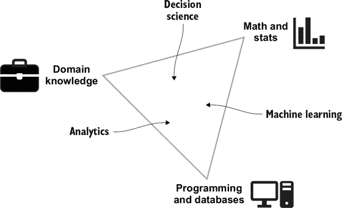
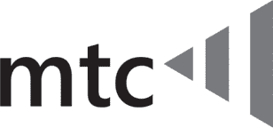
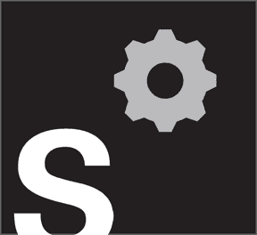
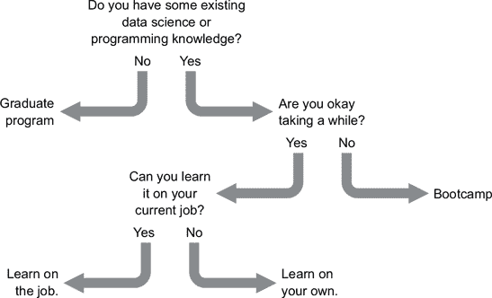
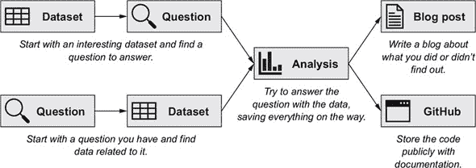

## 第一部分. 数据科学入门

如果您在谷歌上搜索“如何成为一名数据科学家”，您可能会遇到一份长长的技能清单，从统计建模到用 Python 编程，再到有效沟通和制作演示文稿。一份工作描述可能描述的是一个接近统计学家角色的职位，而另一位雇主则寻找拥有计算机科学硕士学位的人。当您寻找获得这些技能的方法时，您会发现从回学校攻读硕士学位到参加训练营，再到开始在您当前的工作中开始数据分析的各种选择。将这些路径组合起来，可能会感觉难以逾越，尤其是对于那些还没有确定他们甚至是否想成为数据科学家的人来说。

好消息是，没有哪位数据科学家拥有所有这些技能。数据科学家们共享一个知识基础，但他们各自都有自己专长，以至于许多人无法互换工作。本书的第一部分旨在帮助您了解所有这些类型的数据科学家是什么，以及如何做出最佳决定来开始您的职业生涯。到这一部分结束时，您应该已经准备好所需的技能和理解，以便开始您的求职之旅。

第一章涵盖了数据科学的基础知识，包括您需要为这份工作准备的技能和不同类型的数据科学家。第二章详细介绍了数据科学家在五类公司中的角色，以帮助您更好地了解这份工作的样子。第三章涵盖了获得成为数据科学家所需技能的途径以及每种途径的优缺点。最后，第四章涵盖了如何创建数据科学项目组合，以获得实际进行数据科学工作的经验，并创建一份可以向潜在雇主展示的组合。

## 第一章. 什么是数据科学？

*本章涵盖*

+   数据科学的主要三个领域

+   不同类型的数据科学工作

“21 世纪最性感的工作。” “美国最好的工作。”数据科学家，这个在 2008 年之前甚至不存在的头衔，现在成为了雇主难以招聘足够的人手，求职者都力争成为的职业。这种炒作有很好的理由：数据科学是一个快速增长的领域，2019 年在美国的中位基本工资超过 10 万美元 ([`mng.bz/XpMp`](http://mng.bz/XpMp))。在一家好公司，数据科学家享有很大的自主权，并且不断学习新事物。他们利用自己的技能来解决重大问题，例如与医生合作分析药物试验，帮助一支运动队挑选新球员，或者重新设计小工具业务的定价模式。最后，正如我们在第三章 chapter 3 中所讨论的，成为数据科学家没有唯一的方法。人们来自各行各业，因此你不会因为你在本科时选择了什么专业而受到限制。

但并非所有数据科学工作都是完美的。公司和求职者都可能有不切实际的期望。对于刚开始接触数据科学的公司来说，他们可能会认为一个人就能解决所有数据问题，例如。当最终聘请到数据科学家时，他们可能会面临一个永无止境的任务清单。他们可能被要求立即实施一个机器学习系统，而在此之前没有任何工作来准备或清理数据。可能没有人来指导或帮助他们，甚至没有人能理解他们所面临的问题。我们将在第五章 chapters 5 和第七章 7 中更深入地讨论这些问题，我们将帮助你避免加入那些可能不适合新数据科学家的公司，并在第九章 chapter 9 中建议你如果陷入不利局面应该怎么做。

从另一方面来看，求职者可能会认为他们的新职业生涯永远不会无聊。他们可能期望利益相关者会例行公事地遵循他们的建议，数据工程师可以立即解决任何数据质量问题，以及他们将获得最快的计算资源来实施他们的模型。然而，在现实中，数据科学家花大量时间清理和准备数据，以及管理其他团队的期望和优先事项。项目并不总是能顺利进行。高级管理层可能会向客户做出关于你的数据科学模型可以提供什么的非现实承诺。一个人的主要工作可能是与一个过时的数据系统打交道，这个系统无法自动化，每周需要花费数小时进行令人厌烦的工作，仅为了清理数据。数据科学家可能会在遗留分析中注意到许多统计或技术错误，这些错误有实际后果，但没有人感兴趣，他们工作负担过重，没有时间尝试修复它们。或者，数据科学家可能被要求准备支持高级管理层已经做出的决定的报告，因此他们可能会担心如果给出独立的答案就会被解雇。

这本书旨在引导你通过成为数据科学家和发展你职业生涯的过程。我们希望确保你，作为读者，能够获得成为数据科学家的大部分好处，并避免大多数陷阱。也许你正在从事相邻领域的工作，如市场营销分析，并想知道如何进行转换。或者，也许你已经是一名数据科学家，但你在寻找新工作时并不认为你的第一次求职搜索做得很好。或者，你希望通过在会议上发言、为开源项目做出贡献或成为独立顾问来进一步你的职业生涯。无论你的水平如何，我们相信你会发现这本书很有帮助。

在前四章中，我们涵盖了获得数据科学技能和建立个人作品集以克服需要经验才能获得经验这一悖论的主要机会。第二部分 展示了如何撰写一份能够获得面试机会的求职信和简历，以及如何建立你的网络以获得推荐。我们介绍了研究已经证明可以为你赢得最佳报价的谈判策略。

当你在数据科学领域工作时，你将需要编写分析报告，与利益相关者合作，甚至可能将模型投入生产。第三部分 帮助你了解所有这些流程看起来是什么样子，以及如何为自己设定成功的基础。在第四部分中，你将找到在项目不可避免地失败时如何重新振作的策略。当你准备好时，我们将在这里引导你通过决定将你的职业生涯引向何方：晋升为管理层，继续作为个人贡献者，或者甚至成为独立顾问。

在开始这段旅程之前，你需要清楚数据科学家是做什么的以及他们从事的工作。数据科学是一个涵盖许多类型工作的广泛领域，你对这些领域之间的差异理解得越好，你在这些领域的发展就会越好。

### 1.1. 什么是数据科学？

*数据科学*是使用数据尝试理解和解决现实世界问题的实践。这个概念并不是全新的；自从零的发明以来，人们一直在分析销售数据和趋势。然而，在过去十年中，我们获得了比以前指数级更多的数据。计算机的出现有助于生成所有这些数据，但计算也是我们处理大量信息的唯一方式。通过计算机代码，数据科学家可以转换或汇总数据，进行统计分析，或训练机器学习模型。这些代码的输出可能是供人类消费的报告或仪表板，或者可能是将被部署以持续运行的机器学习模型。

如果一家零售公司难以决定在哪里开设新店，例如，它可能会请一位数据科学家来进行分析。数据科学家可以查看历史数据，了解在线订单发送到的地点，从而了解客户需求。他们还可能将客户位置数据与来自人口普查记录的当地人口和收入信息相结合。有了这些数据集，他们可以找到新店的最佳位置，并创建一个 Microsoft PowerPoint 演示文稿，向公司的零售运营副总裁提出他们的建议。

在另一种情况下，同一家零售公司可能希望通过向客户推荐商品来增加在线订单的规模。数据科学家可以加载历史网络订单数据，创建一个机器学习模型，该模型可以预测在购物车中当前商品的最佳推荐商品。创建该模型后，数据科学家将与公司的工程团队合作，确保每次客户购物时，新的机器学习模型都能提供推荐的商品。

当许多人开始研究数据科学时，他们面临的一个挑战是感到需要学习的东西太多，比如编码（但应该学习哪种语言？）、统计学（但在实践中哪些方法最重要，哪些主要属于学术领域？）、机器学习（机器学习与统计学或 AI 有何不同？）以及他们想要工作的行业领域的专业知识（如果你不知道你想在哪里工作怎么办？）。此外，他们还需要学习商业技能，比如如何有效地向从其他数据科学家到 CEO 的各种受众传达结果。这种焦虑可能会因招聘启事中要求拥有博士学位、多年的数据科学经验和一系列统计和编程方法的专长而加剧。你如何可能学会所有这些技能？你应该从哪个开始？基础是什么？

如果你已经研究过数据科学的各个领域，你可能对 Drew Conway 的流行数据科学 Venn 图很熟悉。在 Conway 绘制该图时（当时），数据科学被认为是数学和统计知识、领域专业知识和黑客技能（即编程）的交集。这张图常被用作定义数据科学家是什么的基石。从我们的角度来看，数据科学的组成部分与他提出的略有不同（图 1.1）。

##### 图 1.1. 构成数据科学技能及其如何组合形成不同角色的技能

我们将 Conway 原始的 Venn 图改成了三角形，因为并不是说你要么有这项技能，要么没有；而是你可能拥有这项技能的程度与其他领域的人不同。虽然确实所有三种技能都是基本的，并且你需要达到一定的程度，但你不需要在所有这些技能上都是专家。我们在三角形内放置了不同类型的数据科学专业。这些专业不一定总是与职位名称一一对应，即使它们确实对应，不同的公司有时也会称它们为不同的名称。

那么，这些组成部分各自意味着什么呢？

#### 1.1.1. 数学/统计学

在基本层面上，数学和统计知识是数据素养。我们将这种素养分解为三个知识层级：

+   ***技术存在——*** 如果你不知道某件事是可能的，你就无法使用它。如果一个数据科学家试图将相似的客户分组，知道统计方法（称为*聚类*）可以做到这一点将是第一步。

+   ***如何应用这些技术——*** 尽管数据科学家可能了解许多技术，但他们也需要能够理解应用这些技术的复杂性——不仅要知道如何编写代码来应用这些方法，还要知道如何配置它们。如果数据科学家想使用如*k*-均值聚类这样的方法来分组客户，他们就需要了解如何在 R 或 Python 这样的编程语言中实现*k*-均值聚类。他们还需要了解如何调整方法的参数，例如，通过选择要创建多少组。

+   ***如何选择尝试哪些技术——*** 由于在数据科学中可以使用许多可能的技术，因此对于数据科学家来说，能够快速评估一种技术是否能够很好地工作非常重要。在我们的客户分组示例中，即使数据科学家专注于聚类，他们仍然需要考虑几十种不同的方法和算法。与其尝试每种方法，他们需要能够快速排除方法，并专注于少数几种。

这些技能在数据科学角色中经常被使用。考虑一个不同的例子，假设你在一家电子商务公司工作。你的业务伙伴可能对哪些国家的平均订单价值最高感兴趣。如果你有可用数据，这个问题很容易回答。但与其只是展示这些信息并让客户自己得出结论，你可以深入挖掘。如果你从国家 A 有一个订单价值 100 美元，而从国家 B 有 1000 个订单，平均价值为 75 美元，那么国家 A 的平均订单价值更高是正确的。但你是否确信这意味着你的业务伙伴应该肯定投资于国家 A 的广告以增加订单数量？可能不会。你只有国家 A 的一个数据点，可能它是一个异常值。如果国家 A 有 500 个订单，你可能会使用统计测试来查看订单价值是否显著不同，这意味着如果在这个指标上 A 和 B 之间真的没有差异，你不太可能看到你所看到的差异。在这个一段长的例子中，对哪些方法合理、应该考虑什么以及哪些结果被认为不重要进行了许多不同的评估。

#### 1.1.2\. 数据库/编程

*编程和数据库*指的是从公司数据库中提取数据以及编写干净、高效、可维护的代码的能力。这些技能在很多方面与软件开发者需要了解的知识相似，但数据科学家需要编写进行开放式分析而不是产生预定义输出的代码。每个公司的数据堆栈都是独特的，因此对于数据科学家来说，不需要一套特定的技术技能。但总的来说，你需要知道如何从数据库中获取数据以及如何清理、操作、总结、可视化和共享数据。

在大多数数据科学工作中，R 或 Python 是主要语言。R 是一种起源于统计学的编程语言，因此它在统计分析、建模、可视化和生成带有结果的报告方面通常表现最强。Python 是一种最初作为通用软件开发语言开始的编程语言，并在数据科学中变得非常流行。Python 因其能够更好地处理大型数据集、进行机器学习和支持实时算法（如亚马逊的推荐引擎）而闻名。但多亏了许多贡献者的工作，这两种语言的性能现在几乎相当。数据科学家正在成功使用 R 来构建每周运行数百万次的机器学习模型，他们也在 Python 中制作整洁、易于展示的统计分析。

R 和 Python 之所以成为数据科学中最受欢迎的语言，有几个原因：

+   它们是免费和开源的，这意味着许多人，而不仅仅是单一的公司或团体，都会贡献你可以使用的代码。它们拥有许多用于数据收集、操作、可视化、统计分析和学习机器学习的包或*库*（代码集）。

+   重要的是，由于每种语言都有如此庞大的追随者群体，当数据科学家遇到问题时很容易找到帮助。尽管一些公司仍然使用 SAS、SPSS、STATA、MATLAB 或其他付费程序，但许多公司正开始转向 R 或 Python。

尽管大多数数据科学分析都是在 R 或 Python 中进行的，但你通常需要与数据库合作以获取数据。这就是 SQL 语言发挥作用的地方。SQL 是大多数数据库用来在数据库内部操作数据或提取数据的编程语言。考虑一位想要分析公司数亿条客户订单记录的数据科学家，以预测每天订单的变化。首先，他们可能会编写一个 SQL 查询来获取每天订单的数量。然后，他们会使用这些每日订单计数在 R 或 Python 中进行统计预测。因此，SQL 在数据科学社区中非常受欢迎，不了解它很难取得太大进展。

另一项核心技能是使用*版本控制*——一种跟踪代码随时间变化的方法。版本控制允许你存储文件；将它们回滚到之前的时间点；并查看谁更改了哪些文件，如何更改，以及何时更改。这项技能对于数据科学和软件工程至关重要，因为如果有人意外更改了导致你的代码崩溃的文件，你希望有回滚或查看更改的能力。

Git 是迄今为止最常用的版本控制系统，通常与基于网络的 Git 代码托管服务 GitHub 一起使用。Git 允许你保存（*提交*）你的更改，同时查看项目的整个历史记录以及每次提交后的变化。如果两个人分别在不同的文件上工作，Git 确保不会有人不小心删除或覆盖他人的工作。在许多公司，尤其是那些拥有强大工程团队的公司，如果你想共享你的代码或将某些内容投入生产，你将需要使用 Git。

| |
| --- |

**没有编程，你能成为数据科学家吗？**

只使用 Excel、Tableau 或其他具有图形界面的商业智能工具，就可以完成大量数据工作。虽然你不需要编写代码，但这些工具声称具有与 R 或 Python 等语言类似的许多功能，许多数据科学家有时也会使用它们。但它们能成为完整的数据科学工具包吗？我们说不。实际上，很少有公司拥有一个不需要编程的数据科学团队。即使情况不是这样，编程也有优于使用这些工具的优势。

编程的第一个优势是可重复性。当你编写代码而不是使用点击式软件时，你可以在数据变化时随时重新运行它，无论是每天还是六个月后。这个优势也与版本控制相关：在你每次更改代码时，你不需要重命名文件，你可以保持一个文件，但查看其整个历史记录。

第二个优势是灵活性。例如，如果 Tableau 没有可用的图形类型，你将无法创建它。但通过编程，你可以编写自己的代码来创建工具的创建者和维护者从未想过的事情。

Python 和 R 等开源语言的第三个也是最后一个优势是社区贡献。数千人创建 *包*，并将它们公开发布在 GitHub 和/或 CRAN（对于 R）以及 pip（对于 Python）上。你可以下载这些代码，并用于解决你自己的问题。你不需要依赖一家公司或一组人添加功能。

| |
| --- |

#### 1.1.3\. 业务理解

> *任何足够先进的技术都与魔法无法区分。*
> 
> *亚瑟·C·克拉克*

说到数据科学的工作方式，企业对数据科学的理解各不相同。通常，管理层只是想要完成某事，并转向其数据科学独角兽来实现这一目标。数据科学的核心技能之一是知道如何将业务情况转化为数据问题，找到数据答案，并最终提供业务答案。例如，一个商人可能会问：“为什么我们的客户在离开？”但并没有“为什么客户离开”的 Python 包可以导入——你需要自己推断如何用数据来回答这个问题。

商业理解是您的数据科学理念与现实世界的实际需求相结合的地方。仅仅想要特定的信息，而不了解数据在你所在公司是如何存储和更新的，是不够的。如果你的公司是一个订阅服务，数据在哪里？如果有人更改了他们的订阅，会发生什么？那个订阅者的行会被更新，还是会在表中添加另一行？你是否需要处理数据中的任何错误或不一致？如果你不知道这些问题的答案，你将无法对像“2019 年 3 月 2 日我们有多少订阅者？”这样的基本问题给出准确的答案。

商业理解还帮助你了解应该提出哪些问题。当利益相关者问“我们接下来应该做什么？”时，这有点像被问“我们为什么没有更多的钱？”这样的问题。这类问题需要更多的问题。对核心业务（以及涉及的个性）的理解可以帮助你更好地分析情况。你可能还会跟进问“你希望得到关于哪个产品线的指导？”或者“你希望看到我们某个受众群体有更多的参与吗？”

商业理解的另一个方面是培养一般商业技能，例如能够根据不同的受众调整你的演示和报告。有时，你会在一个充满统计学博士的房间里讨论更好的方法论，有时你会在一个 20 年前没有上过数学课的副总裁面前。你需要向你的听众传达信息，既不要轻视他们，也不要过于复杂化。

最后，随着你变得更加资深，你的工作的一部分是确定业务可以从数据科学中获得哪些好处。如果你一直想为你的公司建立一个预测系统，但从未得到管理层的支持，成为管理层的一部分可以帮助解决这个问题。高级数据科学家会寻找可以实施机器学习的地方，因为他们了解其局限性和能力，以及哪些类型的任务会从自动化中受益。

| |
| --- |

**数据科学会消失吗？**

在关于数据科学是否会在十年或二十年后仍然存在的疑问背后，有两个主要担忧：工作可能会自动化，以及数据科学被过度炒作，就业市场泡沫可能会破裂。

诚然，数据科学流程的某些部分可以自动化。自动机器学习（AutoML）可以比较不同模型的表现，并执行某些数据准备的部分（例如缩放变量）。但这些任务只是数据科学过程中的一个小部分。你通常需要自己创建数据，例如；几乎很少有一开始就完美干净的数据等待你使用。此外，创建数据通常需要与其他人交谈，例如用户体验研究人员或工程师，他们将进行调查或记录可以驱动你分析的用户行为。

关于就业市场泡沫爆发的可能性，一个很好的比较是 20 世纪 80 年代的软件工程。随着计算机变得更便宜、更快、更普遍，人们担心很快计算机就能做任何事情，程序员将不再需要。但相反的情况发生了，现在美国有超过 120 万软件工程师([`mng.bz/MOPo`](http://mng.bz/MOPo))。尽管像网站管理员这样的头衔消失了，但从事网站开发、维护和改进工作的人比以往任何时候都多。

我们相信数据科学将会有更多的专业化，这可能会导致通用头衔数据科学家的消失，但许多公司仍处于学习如何利用数据科学的早期阶段，还有很多工作要做。

### 1.2\. 数据科学的不同类型职位

你可以将数据科学（在第 1.1 节中介绍）的三个核心技能混合搭配到多个职位中，所有这些职位都有一定的理由被称为数据科学家。从我们的角度来看，这些技能主要通过以下三种方式混合在一起：分析学、机器学习以及决策科学。这些领域各自为公司服务不同的目的，并且从根本上提供不同的事物。

在寻找数据科学职位时，你应该更多地关注职位描述和面试中的要求，而不是职位名称。看看数据科学角色的背景，例如他们之前的工作和学位。你可能会发现，从事类似工作的人可能有完全不同的职位，或者拥有相同数据科学家头衔的人可能做着完全不同的事情。正如我们在本书中讨论不同类型的数据科学职位时所说，请记住，公司实际使用的职位名称可能会有所不同。

#### 1.2.1\. 分析学

一个*分析师*将数据呈现给合适的人。在公司设定了年度目标后，你可能会将这些目标放在仪表板上，以便管理层可以每周跟踪进度。你也可以添加一些功能，让经理们能够轻松地按国家或产品类型分解数字。这项工作涉及大量的数据清洗和准备，但通常在解释数据方面的工作较少。虽然你应该能够发现并修复数据质量问题，但使用这些数据的决策主要是由业务伙伴做出的。因此，分析师的职责是从公司内部获取数据，有效地格式化和整理它，然后将这些数据交付给其他人。

由于分析师的角色不涉及很多统计学和机器学习，有些人和企业可能会认为这个角色不属于数据科学领域。但大部分工作，例如设计有意义的可视化以及决定特定的数据转换，都需要与其他类型的数据科学角色中使用的相同技能。分析师可能会被分配一个任务，例如“创建一个自动仪表板，显示我们的订阅者数量随时间的变化，并允许我们过滤数据，仅显示特定产品或特定地理区域的订阅者。”分析师必须在公司内找到适当的数据，想出如何适当地转换数据（例如，将每日新订阅转换为每周新订阅），然后创建一组有意义的仪表板，这些仪表板视觉上吸引人，并且每天自动更新，不会出错。

简短规则：分析师创建的是 *提供数据的仪表板和报告*。

#### 1.2.2\. 机器学习

一位 *机器学习工程师* 开发机器学习模型并将它们投入生产，在那里它们会持续运行。他们可能会优化电子商务网站搜索结果的排名算法，创建一个推荐系统，或者监控生产中的模型以确保其性能自部署以来没有下降。机器学习工程师在创建能够说服人们相信某事的可视化方面花费的时间较少，而在数据科学编程工作上花费的时间更多。

与其他类型的数据科学职位相比，这个角色的一个重大区别是，工作输出主要是为机器消费的。例如，你可能会创建被转换成其他机器的应用程序编程接口（API）的机器学习模型。在许多方面，你将比其他数据科学角色更接近软件开发者。尽管任何数据科学家遵循最佳编码实践都是有益的，但作为机器学习工程师，你必须这样做。你的代码必须高效、经过测试，并且编写得让其他人能够与之协作。因此，许多机器学习工程师来自计算机科学背景。

在机器学习工程师的角色中，一个人可能会被要求创建一个机器学习模型，该模型能够实时预测网站上客户实际完成订单的概率。机器学习工程师必须在公司找到历史数据，在它上面训练一个机器学习模型，将该模型转换为 API，然后部署该 API，以便网站可以运行该模型。如果该模型因某种原因停止工作，机器学习工程师将被要求修复它。

简短规则：机器学习工程师创建的是 *持续运行的模型*。

#### 1.2.3\. 决策科学

**决策科学家**将公司的原始数据转化为帮助公司做出决策的信息。这项工作依赖于对不同数学和统计方法的深入理解以及对企业决策的熟悉。此外，决策科学家必须能够制作引人注目的视觉化和表格，以便他们与之交谈的非技术人员能够理解他们的分析。尽管决策科学家做了很多编程工作，但他们的工作通常只运行一次以进行特定分析，因此他们可以容忍代码的低效或难以维护。

决策科学家必须了解公司内部其他人的需求，并找出如何生成建设性的信息。例如，营销总监可能会要求决策科学家帮助他们决定在公司的假日礼品指南中应该突出哪些类型的产品。决策科学家可能会调查哪些产品在没有被突出展示在礼品指南中时销售良好，与用户研究团队讨论进行调查，并使用行为科学原理进行分析，以提出最佳建议的项目。结果可能是一个 PowerPoint 演示文稿或报告，用于与产品经理、副总裁和其他商业人士分享。

决策科学家经常利用他们对统计学的了解来帮助公司在不确定性下做出决策。例如，决策科学家可能负责运行他们公司的实验分析系统。许多公司运行在线实验，或 A/B 测试，以衡量一个变化是否有效。这种变化可能只是添加一个新按钮，也可能像改变搜索结果的排名系统或完全重新设计一个页面那样复杂。在 A/B 测试期间，访客被随机分配到两个或更多条件之一，例如一半访客分配到旧版主页，即**控制组**，另一半分配到新版本，即**处理组**。然后比较访客进入实验后的行为，以查看处理组中执行期望行为的比率是否更高，例如购买产品。

由于随机性，控制组和处理组中的指标完全相同的情况很少见。假设你抛了两枚硬币，一枚有 52 次出现正面，另一枚有 49 次出现正面。你会得出第一枚硬币更有可能出现正面的结论吗？当然不会！但一个商业伙伴可能会看到一项实验，看到转化率在控制组是 5.4%，在处理组是 5.6%，并宣布处理组是成功的。决策科学家在那里是为了帮助解释数据，执行实验设计的最佳实践，等等。

简短规则：决策科学家创建的分析会产生**推荐**。

#### 1.2.4. 相关职位

尽管前面几节讨论的三个领域是数据科学职位的主要类型，但你可能会看到一些其他独特的角色，这些角色并不属于这些类别。我们在这里列出这些工作，因为了解现有的职位是好事，因为你可能需要与这些职位上的同事合作。话虽如此，如果你对其中任何一个角色感兴趣，这本书中的材料可能对你来说不那么相关。

##### 商业智能分析师

商业智能分析师的工作与分析师的工作类似，但他们通常使用的统计和编程专业知识较少。他们可能选择 Excel 而不是 Python 作为工具，并且他们可能永远不会制作统计模型。尽管他们的工作职能与分析师相似，但由于工具和技术限制，他们创建的输出较为简单。

如果你想要从事机器学习或编程，或者应用统计方法，商业智能分析师的职位可能会非常令人沮丧，因为这样的职位不会帮助你获得新技能。此外，这些工作的薪水通常低于数据科学工作，并且被认为不那么有威望。但是，商业智能分析师的工作可以是一个很好的入门点，特别是如果你之前没有在商业环境中处理过数据。如果你想从商业智能分析师开始，并成长为数据科学家，寻找那些你可以学习一些可能没有掌握的技能的职位，比如用 R 或 Python 进行编程。

##### 数据工程师

数据工程师专注于保持数据库中的数据维护，并确保人们能够获取他们所需的数据。他们不运行报告，进行分析或开发模型；相反，他们保持数据整洁地存储和格式化在结构良好的数据库中，以便其他人可以进行这些操作。数据工程师可能负责维护大型云数据库中的所有客户记录，并根据要求向该数据库添加新表。

数据工程师与数据科学家有很大不同，他们更为罕见且需求更高。数据工程师可能帮助构建公司内部实验系统的数据后端组件，并在作业开始运行时间过长时更新数据处理流程。其他数据工程师开发和监控批处理和流式环境，从数据收集到处理再到数据存储进行管理。

如果你对数据工程感兴趣，你需要强大的计算机科学技能；许多数据工程师曾是软件工程师。

##### 研究科学家

一位*研究科学家*开发和实施新的工具、算法和方法，通常供公司内的其他数据科学家使用。这类职位几乎总是需要博士学位，通常在计算机科学、统计学、定量社会科学或相关领域。研究科学家可能会花费数周时间研究和尝试方法来提高在线实验的效力，比如在自动驾驶汽车中提高图像识别的 1%准确性，或者构建一个新的深度学习算法。他们甚至可能会花时间撰写可能很少在公司内部使用但有助于提升公司声望（理想情况下）并推进该领域的研究论文。由于这些职位需要非常具体的背景，所以我们在这本书中不重点介绍它们。

### 1.3. 选择你的道路

在第三章中，我们讨论了获得数据科学技能的一些选择，每个选择的利弊，以及一些在选择它们时的建议。在这个时候，开始反思你想要专攻的数据科学领域是很好的。你已经在哪个领域有经验？我们见过前工程师、心理学教授、市场营销经理、统计学学生和社会工作者成为数据科学家。很多时候，你在其他工作和学术领域获得的知识可以帮助你成为一个更好的数据科学家。如果你已经在数据科学领域，现在反思一下你处于三角形的哪个部分。你对它满意吗？你想转到一个不同类型的数据科学工作吗？转型通常是可行的。

**Vicki Boykis：任何人都能成为数据科学家吗？**

在数据科学周围的所有乐观情绪（以及新闻文章中列出的高薪）中，很容易看出为什么它提供了吸引人的职业机会，尤其是随着数据科学职位名称的范围和范围持续扩大。但对于这个领域的新进入者来说，重要的是要有一个现实、细致的观点，了解数据科学市场在未来几年将走向何方，并据此进行调整。

当前影响数据科学领域的有几个趋势。首先，数据科学作为一个领域已经存在了十年，因此已经走过了炒作周期的早期阶段：大众媒体炒作、早期采用和整合。它被过度炒作，在媒体上被广泛讨论，被硅谷公司以及其他公司采用，而现在我们正处于大型公司高增长采用阶段，以及像 Spark 和 AutoML 这样的数据科学工作流程工具集的标准化。

其次，因此，新数据科学家的供应过剩，他们来自训练营、大学中新设立的数据科学项目或在线课程。任何特定数据科学职位的候选人数量，尤其是在入门级，已经从每个职位 20 人左右增长到 100 人或更多。现在看到每个空缺职位有 500 份简历已不再罕见。

第三，工具集的标准化、劳动力的充足供应以及对在该领域有更多经验的人的需求，意味着数据科学职位名称的分配方式发生了变化，以及数据科学职位和描述的等级制度的形成。例如，在一些公司，“数据科学家”可能意味着创建模型，但在一些公司则意味着主要运行 SQL 分析，这与数据分析师的职位名称过去所代表的工作相当。

这对那些想要进入数据科学领域的新手来说意味着几件事情。首先也是最重要的一点，他们可能会发现就业市场极其竞争激烈且人满为患，尤其是对于那些对整个行业（如大学毕业生）来说是新手，或者是从其他行业转行过来，与成千上万的类似候选人竞争的人。其次，他们可能会申请的工作并不真正反映数据科学，正如博客文章和流行媒体所描述的那样——仅仅是编写和实施算法。

考虑到这些趋势，了解这一点很重要，那就是可能很难在最初从一堆简历中脱颖而出，进入最终的面试环节。尽管你在本书中读到的策略可能看起来工作量很大，但它们将帮助你脱颖而出，这在新的、竞争激烈的数据科学环境中是必要的。

| |
| --- |

### 1.4. 与 Airbnb 数据科学家罗伯特·张的访谈

罗伯特·张（Robert Chang）是 Airbnb 的数据科学家，在那里他从事 Airbnb Plus 产品的相关工作。他之前在 Twitter 工作，在那里他负责增长团队，进行产品分析、创建数据管道、运行实验和创建模型。你可以在[`medium.com/@rchang`](https://medium.com/@rchang)找到他的数据工程博客文章、他对新和有抱负的数据科学家的建议以及他在 Airbnb 和 Twitter 的工作。

#### 你的第一次数据科学之旅是怎样的？

我的第一份工作是担任《华盛顿邮报》（The Washington Post）的数据科学家。回想起 2012 年，我准备离开学术界进入工业界，但我不确定自己想要做什么。我希望成为一名数据可视化科学家，因为我被《纽约时报》（The New York Times）的工作所打动。当我参加学校的职业博览会，看到《华盛顿邮报》正在招聘时，虽然我天真无邪，但我只是想当然地认为他们肯定在做与《纽约时报》类似的事情。我申请了，并且得到了这份工作，没有做更多的尽职调查。

如果你想要一个不如何开始数据科学职业生涯的例子，我肯定会自告奋勇！我得到这份工作希望做数据可视化或建模，但很快我就意识到我的工作更像是数据工程师。我大部分的工作是构建 ETL（提取、转换、加载）管道，重新运行 SQL 脚本，并确保报告能够运行以便我们可以向高管报告顶级指标。这在当时非常痛苦；我意识到我所想要做的事情与公司真正需要的不一致，最终我离开了这份工作。

但在我随后的几年里在 Twitter 和 Airbnb 工作期间，我意识到我所看到的是常态而不是例外。当你正在构建数据能力时，你必须一层层地构建。Monica Rogati 写过一篇著名的博客文章，关于数据科学需求层次结构，这非常准确([`mng.bz/ad0o`](http://mng.bz/ad0o))。但当时，我太新了，无法真正欣赏到真实、现场的数据科学工作是如何进行的。

#### 人们应该在一个数据科学职位中寻找什么？

如果你正在寻找数据科学职位，你应该关注公司的数据基础设施状况。如果你加入一个只有大量未存储在数据仓库中的原始数据的公司，可能需要几个月甚至几年才能达到可以进行有趣的分析、实验或机器学习的程度。如果你不期望做这些，那么你与公司阶段和你的组织贡献意愿之间将存在根本的不一致。

要评估这一点，你可以提出类似的问题：“你们有数据基础设施团队吗？他们存在了多久？数据栈是什么？你们有数据工程团队吗？他们如何与数据科学家合作？当你正在构建新产品时，你们有对日志进行仪表化、构建数据表并将它们放入数据仓库的流程吗？”如果这些都没有，你将成为负责构建这些的团队的一员，你应该预期会在这上面花费相当多的时间。

第二件事是要寻找的是人。你应该关注三种类型的人。假设你不想成为第一个数据科学家，你希望加入一个有经验领导者的数据科学组织。有经验的领导者知道如何构建和维护良好的基础设施和工作流程，以便数据科学家能够高效工作。其次，寻找一个支持持续学习的经理。最后，当你刚开始工作时，与一个非常实际的科技负责人或高级数据科学家合作非常重要。对于你的日常工作来说，这个人会给你最大的帮助。

#### 成为数据科学家需要哪些技能？

我认为这取决于你在寻找什么样的工作以及雇主设定的标准。一般来说，顶级公司有很高的标准，有时是不合理的，因为很多人试图加入公司。他们通常在寻找独角兽——这样的人既有 R 或 Python 的数据处理技能，又有构建 ETL 管道、数据工程、实验设计和构建模型并将其投入生产的经验。这给候选人带来了很大的压力！虽然这些都是你可以最终学习并且可能对你解决任何问题都有用的技能，但我认为它们进入数据科学领域并不是必需的。

如果你懂 R 或 Python 以及一点 SQL，你已经处于一个相当不错的位置进入数据科学领域。如果你能通过提前学习更多东西来规划你的职业生涯，那总是有帮助的，但我认为那不是必需的。对学习的热爱更为重要。如果你试图被顶级科技公司雇佣，你需要更多一点，但这更多的是为了信号效应，而不是你真正在工作中需要的东西。区分你在数据科学职业生涯开始时需要的核心技能和如果你想进入一个竞争激烈的品牌公司所希望拥有的其他技能是有帮助的。

### 摘要

+   数据科学技能组合因人和职位而异。尽管一些知识是基本的，但数据科学家不需要在每个相关领域都是专家。

+   数据科学工作有不同的关注领域：将正确、清洗过的数据放在利益相关者面前（分析）；将机器学习模型投入生产（机器学习）；以及使用数据做出决策（决策科学）。

## 第二章 数据科学公司

*本章涵盖*

+   招聘数据科学家的公司类型

+   每种公司类型的优缺点

+   你可能在不同的工作中看到的科技栈

如第一章所述，数据科学是一个广泛的领域，有很多不同的角色：研究科学家、机器学习工程师、商业智能分析师等等。尽管你作为数据科学家所做的工作取决于你的角色，但它同样受到你所在公司的影响。大公司与小公司、科技与传统行业、新兴与成熟可以影响项目焦点、支持技术和团队文化。通过了解一些公司原型，当你寻找工作地点时，无论是你的第一份数据科学工作还是第 n 份工作，你都会准备得更好。

本章的目标是让您了解一些典型的公司日常工作的情况。我们将介绍五家虚构的公司，这些公司雇佣数据科学家。这些公司都不是真实的，但它们都基于研究和我们自己的工作经验，并且它们展示了可以广泛应用的的基本原则。尽管没有两家公司完全相同，但了解这五种典型模式应该有助于您评估潜在的雇主。

尽管这些刻板印象是基于我们在这些行业看到的趋势，但它们当然不是绝对的。您可能会发现一家完全打破我们这里所说的模式的公司——或者公司中一个与公司本身截然不同的特定团队。

尽管本章中的公司是虚构的，但您将看到的所有摘要都是由在真实公司工作的真实数据科学家撰写的！

### 2.1\. MTC：大型科技公司

+   类似于：谷歌、Facebook 和微软

+   公司成立时间：20 年

+   员工人数：80,000

MTC 是一家拥有巨大影响力的科技公司，销售云服务、消费者生产力软件（如文本编辑器）、服务器硬件以及无数一次性商业解决方案。该公司积累了大量财富，并用它来资助非同寻常的研究和开发（R&D）项目，如自动驾驶滑板车和虚拟现实（VR）技术。他们的研发项目经常成为新闻头条，但技术工作团队的大多数成员都是工程师，他们在现有产品上进行渐进式改进，增加更多功能，改进用户界面，并推出新版本。

#### 2.1.1\. 您的团队：MTC 中的众多团队之一

MTC 拥有近千名数据科学家，遍布公司各个部门。这些数据科学家主要分为团队，每个团队支持不同的产品或部门，或者个别地被安置在非数据科学团队中，以全面支持该团队。例如，有一个团队的数据科学家专注于 VR 头戴设备，第二个团队的数据科学家专注于市场营销，第三个团队的数据科学家专注于 VR 头戴设备和市场营销，而 VR 头戴设备供应链团队也有自己的数据科学家。

如果您是这些数据科学团队的一员，当您加入时，您将很快完成入职。大型组织每天都会雇佣新员工，因此公司应该有标准流程来为您提供笔记本电脑和访问数据的权限，以及培训您如何使用任何特殊工具。在团队中，您将负责为您特定的关注领域进行数据科学工作。这个领域可能包括创建报告和图表，供高管使用以证明项目的资金合理性。它也可能包括构建机器学习模型，这些模型将被转交给软件开发人员投入生产。

你们团队可能规模庞大，成员经验丰富。由于 MTC 是一家大型、成功的科技公司，它拥有广泛的足迹，可以吸引许多优秀的招聘对象。你们的团队规模庞大，因此团队内部的人可能在进行几乎无关的任务；例如，一个人可能在使用 R 为一位主管进行探索性分析，而另一个人可能为姐妹团队在 Python 中构建机器学习模型。团队的规模既是祝福也是诅咒：你们有一大批专家数据科学家可以讨论想法，但他们中大多数人可能对你正在从事的特定任务不熟悉。此外，你们团队有一个既定的等级制度。职位更高的人因为他们在该领域的经验更丰富，以及与 MTC 不同部门打交道经验更丰富，所以更容易被听取意见。

你们团队所做的工作可能是一个健康的平衡，既要保证公司运营，例如制作月度报告和提供季度机器学习模型更新，也要进行新的项目，比如创建一个前所未有的预测。团队的经理需要在满足其他团队对数据科学工作的短期需求，以及进行创新但未提出要求的可能带来长期利益的工作之间取得平衡。凭借 MTC 的大量现金储备，公司能够承担比其他公司更多的创新和研发工作，这一点也体现在愿意尝试有趣的新数据科学项目上。

#### 2.1.2\. 技术：先进，但公司内部各自为政

MTC 是一个庞大的组织，对于如此规模的组织来说，在整个公司使用不同类型的科技是不可避免的。一个部门可能将订单和客户数据存储在 Microsoft SQL Server 数据库中；另一个部门可能使用 Apache Hive 来保存记录。更糟糕的是，不仅存储数据的技术是分离的，而且数据本身也可能是分离的。一个部门可能按电话号码索引客户记录；而另一个部门可能使用电子邮件地址来索引客户。

大多数与 MTC 规模相当的公司都有自己的定制技术栈。因此，作为 MTC 的数据科学家，你必须学习特定于 MTC 的查询和使用数据的具体方法。学习这些专业工具对于在 MTC 内部获得更多权限大有裨益，但你获得的知识无法转移到其他公司。

作为数据科学家，你可能会使用几种可能的工具。由于 MTC 规模庞大，它为 R 和 Python 等主要语言提供了大量支持，许多人都在使用这些语言。一些团队也可能使用 SAS 或 SPSS 等付费语言，但这种情况较为罕见。如果你想使用你喜欢的但其他人很少使用的非主流语言，比如 Haskell，你是否能够使用取决于你的经理。

机器学习栈根据你在公司中的不同部分而有很大差异。一些团队使用微服务和容器来高效地部署模型，而其他团队则拥有过时的生产系统。用于部署软件的技术栈多样性使得连接到其他团队的 API 变得困难；没有中央位置可以了解和学习正在发生的事情。

#### 2.1.3\. MTC 的优缺点

在 MTC 担任数据科学家意味着在一家令人印象深刻的公司拥有一份令人印象深刻的工作。因为 MTC 是一家科技公司，人们知道数据科学家是做什么的以及你能做哪些有益的事情。对你角色的普遍理解使得工作变得容易得多。公司中数据科学家的数量众多意味着，如果你遇到困难，你可以依赖一个庞大的支持网络，以及顺畅的公司加入流程和获取所需资源的途径。你很少会发现自己孤立无援。

周围有很多数据科学家也有缺点。技术栈复杂且难以导航，因为很多人以多种方式构建了它。你可能被要求重新创建的分析可能是由一个不再在身边的人用你不知道的语言编写的。由于周围有那么多其他数据科学家，你可能会发现很难脱颖而出并引起注意。而且，你可能发现很难找到一个有趣的项目来工作，因为许多明显的项目已经被其他人启动。

因为 MTC 是一家成立已久的公司，在那里工作能给你带来更多的职业保障。虽然裁员的风险始终存在，但为 MTC 工作并不像在初创公司工作，那里的资金可能随时会枯竭。此外，在大公司中，管理者更倾向于为某人寻找新的团队而不是解雇他们；解雇会引发各种法律复杂问题，需要为终止决定提供彻底的支持。

MTC 的一个既是优点又是缺点的是，人们在公司内部担任许多专业化的角色。数据工程师、数据架构师、数据科学家、市场研究人员等等，都执行与数据科学相关的不同角色，这意味着你会有很多人可以移交工作。例如，你不太可能被迫创建自己的数据库。这种情况对于移交超出你专业范围的工作来说很棒，但也意味着你不能扩展你的技能。

MTC 的另一个缺点是官僚主义。在大公司中，为了获得对新技术、参加会议和启动项目等的批准，可能需要走很长的命令链。更糟糕的是，你多年来一直在努力的项目可能会因为两位高管之间的争斗而被取消，你的项目成为附带损害。

MTC 是一家非常适合数据科学家的大公司，他们希望通过使用尖端技术来解决大问题——无论是希望进行分析的决策科学家，还是希望构建和部署模型的机器学习工程师。大型公司有许多问题需要解决，并且有预算来尝试新事物。你可能无法自己做出重大决策，但你会知道你已经做出了贡献。

对于希望成为决策者并掌控全局的数据科学家来说，MTC 不是一个好的选择。这家大型公司已经建立了必须遵循的方法、协议和结构。

### 2.2. HandbagLOVE：一家成熟的零售商

+   类似于：Payless，Bed Bath & Beyond，和 Best Buy

+   公司年龄：45 年

+   规模：15,000 名员工（10,000 名在零售店，5,000 名在总部）

HandbagLOVE 是一家遍布美国 250 个地点的零售连锁店，所有门店都销售手提包和钱包。该公司历史悠久，拥有众多专家，他们精通如何布置商店和提升客户体验。该公司在采用新技术方面一直比较缓慢，在拥有第一个网站和第一个应用程序之前，花费了很长时间。

最近，HandbagLOVE 的销售量有所下降，因为亚马逊和其他在线零售商蚕食了其市场份额。意识到形势不妙，HandbagLOVE 一直在寻求通过技术来改善状况，投资了在线应用程序和亚马逊 Alexa 技能，并试图利用其数据的价值。HandbagLOVE 已经聘请了财务分析师多年，他们计算了其订单和客户的复杂汇总统计数据，但直到最近，公司才开始考虑聘请数据科学家来更好地理解客户行为。

新成立的数据科学团队是在之前为公司的绩效指标制作 Excel 报告的财务分析师的基础上建立的。随着 HandbagLOVE 补充了受过训练的数据科学家，团队开始提供更复杂的产品：使用 R 进行的客户增长月度统计预测，允许高管更好地理解销售的交互式仪表板，以及将客户分组成对营销有帮助的群体。

尽管该团队已经创建了机器学习模型来支持新的报告和分析，但 HandbagLOVE 距离将机器学习模型部署到持续运行的生产环境中还远。其网站和应用程序上的任何产品推荐都是由第三方机器学习产品支持的，而不是在公司内部构建的。数据科学团队中有人谈论改变这种状况，但没有人知道这还需要多少年。

#### 2.2.1. 您的团队：一个努力成长的的小团队

团队主要倾向于那些能够进行报告而不是接受机器学习培训的数据科学家，因为机器学习还非常新。当团队成员需要现代统计和机器学习方法时，他们不得不自学，因为周围没有人已经了解这些方法。这种自学很好，因为人们有机会学习对他们来说有趣的新技术。缺点是，使用的一些技术方法可能效率低下，甚至错误，因为没有专家来检查工作。

HandbagLOVE 为数据科学家制定了晋升到高级职位的通用路径。不幸的是，这些职业路径并不特定于数据科学；它们是从其他职位（如软件开发）复制粘贴的高层次目标，因为没有人真正知道应该有哪些指标。为了在职业生涯中进步，你必须说服你的经理你已经准备好了，并且幸运的话，你的经理可以批准晋升你。另一方面，如果团队最终扩大，你将很快成为团队中的高级成员。

因为数据科学团队为公司各部门（如市场营销、供应链和客户服务）提供报告和模型，团队成员在公司中享有很高的知名度。这一事实使团队在公司内部获得了极大的尊重，反过来，数据科学团队内部也充满了团队精神。团队规模和在公司中的影响力水平使得数据科学家比在其他公司拥有更大的影响力。数据科学团队成员与高级管理人员会面并参与讨论并不罕见。

#### 2.2.2. 你的技术：一个开始变化的遗留技术栈

在谈论 HandbagLOVE 的技术时，你经常会听到这样的话：“嗯，一直都是这样。”订单和客户数据存储在一个直接连接到收银机技术的 Oracle 数据库中，并且 20 年来没有改变。系统已经远远超出了其极限，并且已经添加了许多修改。尽管如此，系统仍然在运行。其他数据也收集并存储在中央数据库中：来自网站的数据、客户服务电话的数据以及促销和营销电子邮件的数据。所有这些服务器都位于现场（*on-prem*），而不是在云端，一个 IT 团队负责维护它们。

通过将所有数据存储在一个大型服务器上，你可以自由地以任何方式连接和合并数据。尽管你的查询有时需要很长时间或使系统过载，但通常你可以找到一种解决方案来获取可用的结果。绝大多数分析都是在你的笔记本电脑上完成的。如果你需要更强大的计算机来训练模型，获取它可能会很麻烦。公司没有机器学习技术栈，因为它没有内部机器学习。

#### 2.2.3\. HandbagLOVE 的优缺点

在 HandbagLOVE，你拥有很大的影响力和能力去做你认为明智的事情。你可以从提出建立客户终身价值模型，构建它，并在公司内部使用它开始，而不需要说服太多人让你实施你的想法。这种自由，是由于公司规模和数据科学的新颖性相结合的结果，是非常有回报的；你被赋予了极大的权力去做你认为最好的事情。这种权力的缺点是，你没有很多人可以求助。你必须负责找到让事情运转的方法，或者处理事情不顺利时的后果。

技术栈过时，你将不得不花费大量时间来解决这个问题，这不是很好的时间利用方式。你可能想使用更新的技术来存储数据或运行模型，但你不会得到技术支持来做这件事。如果你不能完全自己设置任何新技术，你将不得不不使用它来应对。

数据科学家的薪水可能不会像在大公司，尤其是科技公司那样高。HandbagLOVE 没有足够的现金来支付高薪的数据科学家。此外，公司也不需要最好的最好的人——只需要能够做基本工作的人。话虽如此，薪水不会很糟糕；它肯定会比公司里拥有相似工作经验的大多数人的薪水要高。

对于那些渴望拥有自由去做他们认为正确的事情，但又可能不感兴趣使用最先进方法的科学家来说，HandbagLOVE 是一个很好的工作场所。如果你习惯使用标准统计方法并制作更平凡的报告，HandbagLOVE 应该是一个舒适的职业成长之地。如果你真正只对使用最前沿的机器学习方法感兴趣，你不会在 HandbagLOVE 找到很多可以做的项目；同样，你也不会在那里找到很多了解你所谈论内容的人。

### 2.3\. Seg-Metra：早期初创公司

+   类似于：你未曾听说的一千家失败的初创公司

+   公司年龄：3 年

+   规模：50 名员工

Seg-Metra 是一家年轻的公司，它销售的产品帮助客户公司通过为独特的客户细分市场定制来优化其网站。Seg-Metra 将其产品销售给企业，而不是消费者。在其短暂的历史早期，Seg-Metra 获得了几个知名客户的青睐，开始使用这个工具，这帮助公司从风险投资家那里获得了更多资金。现在，手头有数百万美元，公司正寻求快速扩大规模并改进产品。

创始人向投资者推销的最大改进是将基本的机器学习方法添加到产品中。这项改进被推销给投资者为“尖端人工智能”。有了这笔新资金，创始人正在寻找机器学习工程师来构建他们所推销的内容。他们还需要决策科学家开始报告工具的使用情况，以便公司更好地了解在产品中需要做出哪些改进。

#### 2.3.1\. 您的团队（哪个团队？）

根据数据科学家被雇佣的时间，他们可能会成为公司第一位数据科学家。如果不是第一位，他们将是第一批几位数据科学招聘人员之一，并可能向第一位被雇佣的人汇报。由于团队的初创性，将很少有或没有协议——没有确立的编程语言、最佳实践、存储代码的方式或正式会议。

任何方向都将来自第一位数据科学家招聘。团队的氛围很可能由他们的仁慈程度决定。如果那个人愿意进行团队讨论并信任其他团队成员，整个数据科学团队将决定诸如使用哪种语言等问题。如果那个人是控制型的并且不乐于倾听，他们将自行做出这些决定。

这样的非结构化环境可以创造出巨大的团队精神。整个数据科学团队努力工作，努力让新技术、方法和工具工作，并可以形成深厚的纽带和友谊。另一方面，那些拥有权力的人可能会对那些没有权力的人施加巨大的情感虐待，因为公司规模很小，几乎没有问责制。无论 Seg-Metra 的增长结果如何，这个早期阶段公司的数据科学家都将面临一段颠簸而狂野的旅程。

团队的工作可能会因当天的情况而变得既迷人又令人沮丧。很多时候，数据科学家正在做他们第一次的分析，例如第一次尝试使用客户购买数据来细分客户或部署第一个神经网络到生产环境中。这些首次分析和工作任务之所以令人兴奋，是因为它们在公司内部是未知的领域，数据科学家们得以成为先驱。在其他日子里，工作可能会非常艰苦，例如当演示必须在投资者面前准备，而模型前一天还没有收敛时。即使公司有数据，基础设施可能组织得如此混乱，以至于数据无法实际使用。尽管工作很混乱，但所有这些任务意味着数据科学家在 Seg-Metra 工作期间能够非常快速地学习大量技能。

#### 2.3.2\. 技术：拼凑在一起的尖端技术

作为一家年轻的公司，Seg-Metra 没有维护老旧遗留技术的束缚。Seg-Metra 还希望给投资者留下深刻印象，而当你的技术栈令人印象深刻时，这要容易得多。因此，Seg-Metra 采用最新的、最优秀的方法进行软件开发、数据存储和收集、以及分析和报告。数据存储在现代云技术中，所有操作均不在本地进行。数据科学家直接连接到这些数据库，并在配备 GPU 处理的大型亚马逊网络服务（AWS）虚拟机实例上构建机器学习神经网络模型。这些模型通过现代软件工程方法进行部署。

初看之下，技术栈确实令人印象深刻。但公司如此年轻且发展迅速，不同技术之间的协同问题不断出现。当数据科学家突然发现云存储中缺失数据时，他们必须等待超负荷工作的数据工程师来修复它（如果他们足够幸运的话，能有一个数据工程师）。如果 Seg-Metra 有一个专门的开发运维（DevOps）团队来帮助保持一切正常运行，那将是非常好的，但到目前为止，预算已经花在其他地方了。此外，技术安装得如此之快，即使公司年轻，要监控所有这些也相当困难。

#### 2.3.3\. Seg-Metra 的优缺点

作为一家成长中的初创公司，Seg-Metra 具有很强的吸引力。公司的发展提供了各种有趣的数据科学工作，以及一个迫使数据科学家快速学习的环境。这类职位可以教授那些能够加速数据科学职业生涯的技能——比如在有限约束下按时完成任务、与非数据科学家有效沟通，以及知道何时推进项目或决定项目不值得继续。特别是在职业生涯早期，培养这些技能可以使你比只在大型公司工作的人更有吸引力。

在 Seg-Metra 工作的另一大优点是能够使用最新的技术。使用最新技术应该会让你的工作更加愉快：假设，新技术的出现比旧技术更好。通过学习最新技术，你也应该拥有一个更加令人印象深刻的简历，为未来的工作做好准备。希望使用新技术的企业会希望你能帮助他们指引方向。

虽然薪酬不如大型公司，尤其是科技公司具有竞争力，但这份工作确实提供了有潜在价值的股票期权。如果公司最终上市或被出售，这些期权可能价值数十万美元或更多。不幸的是，这种情况发生的概率介于当选市议会和当选美国国会之间。所以，只有当你喜欢赌博时，这个事实才是一个优点。

在 Seg-Metra 工作的一个缺点是你必须非常努力工作。每周工作 50 到 60 小时并不罕见，公司期望每个人都尽其所能贡献。在公司的眼中，如果大家不团结一致，公司就不会成功，那么你真的会成为那个一年中用完所有假期时间的人吗？这种环境可能非常有毒，容易受到滥用，导致大量员工过度劳累。

这家公司波动性很大，依赖寻找新客户和投资者的帮助来维持运营，这使得 Seg-Metra 面临低就业保障的风险。任何一年，公司都可能决定裁员或完全倒闭。这些变化可能毫无预警地发生。对于有家庭的人来说，工作不稳定尤其困难，这也导致了公司人口结构偏向年轻。如果想要与一个更加多元化、经验丰富的团队一起工作，年轻的劳动力也可能是一个缺点。

总体而言，在 Seg-Metra 工作提供了与有趣技术一起工作、快速学习和有很小机会赚大钱的好机会。但这样做需要付出巨大的努力，并可能面临一个有毒的环境。因此，这家公司最适合那些想要积累经验然后离开的数据科学家。

**罗德里戈·丰特内阿尔巴·卡尔特斯，一家小型政府咨询公司首席数据科学家**

我所在的公司为政府机构、武装力量、执法部门和一些私人客户提供数据分析、数据科学和移动解决方案。我是首席数据科学家，也是公司唯一负责数据科学项目的人。我们那里没有数据工程师、数据整理员或其他任何数据科学角色，因为该部门相对较新。相反，我们有数据库管理员、软件开发人员和系统集成人员，我同时担任系统/软件架构师和开源开发者。这看起来可能有些奇怪，并且肯定给我带来了压力，但出人意料地效果很好。

我工作中一个奇怪的故事：我参与了一个项目，该项目涉及使用来自许多环境变量的历史信息，例如每日天气条件。由于研究区域没有安装气象站，因此缺乏关键所需的数据。项目处于危险之中，客户决定如果他们的人找不到信息，将在一周内关闭项目。

我决定飞到那个地区并采访一些渔民，并询问他们如何知道出海是安全的。他们说他们通常会派一艘船通过无线电传输天气状况。我参观了一个广播电台，他们从 1974 年开始就有手写的通信记录。我实施了一个能够识别手写笔记并提取有用信息的算法，然后实施了一个自然语言处理管道，可以分析字符串。多亏了去现场发现这些不寻常的数据，项目才得以挽救。

| |
| --- |
| |

**Gustavo Coelho，一家小型初创公司的数据科学负责人**

我在过去 11 个月里在一家相对较新的初创公司工作，该公司专注于将人工智能应用于人力资源管理。我们预测候选人的未来表现或他们被特定公司录用的可能性。这些预测旨在帮助加快招聘流程。我们在模型中非常依赖偏差缓解。这是一家小型公司；我们共有 11 人；数据科学团队由包括我在内的 5 人组成。整个公司都致力于帮助数据科学团队将训练好的模型投入生产。

在一家小型初创公司工作让我有机会学习新概念并将其应用到日常生活中。我喜欢思考如何最佳地建立我们的数据科学流程，以便我们能够扩展规模并给予数据科学家更多的自由，让他们专注于数据科学。人力资源不是一个技术敏感的领域，因此项目超过一半的时间都花在向客户解释解决方案并帮助他们适应新概念上。当我们最终获得批准时，还需要花费大量时间与客户的 IT 部门协调，以整合到我们的数据管道中。

| |
| --- |

### 2.4\. Videory：后期成功的科技初创公司

+   类似于：Lyft、Twitter 和 Airbnb

+   公司年龄：8 年

+   规模：2,000 人

Videory 是一家后期成功的科技初创公司，运营一个基于视频的社会网络。用户可以上传 20 秒的视频并与公众分享。公司刚刚上市，每个人都对此感到非常兴奋。Videory 的规模并不接近 MTC，但作为一个社交网络，它做得很好，每年都在扩大客户群。它对数据敏感，可能已经拥有数据分析师或科学家几年了，甚至从公司成立之初就有。团队中的数据科学家非常忙碌，他们进行数据分析、报告，支持业务，以及创建机器学习模型，帮助将人与艺术家配对以委托工作。

#### 2.4.1\. 团队：专业但具有灵活性

Videory 目前还处于一个可以将在一个超大型会议室聚集所有数据科学家的阶段。考虑到公司的规模，团队可能采用集中式模型。每个数据科学家都向数据科学经理汇报，并且都在组织的单一大型部门中。中央数据科学团队帮助公司内的其他团队，但最终，团队会设定自己的优先事项。一些数据科学家甚至在进行内部长期学术研究项目，这些项目没有立即的收益。

由于公司规模的原因，Videory 的数据科学团队中存在专业化。在那些进行重型机器学习、统计学或分析的人之间也有一些划分。Videory 规模足够小，以至于随着时间的推移，可以在这些小组之间进行切换。数据科学家通常有一些互动——例如培训课程、月度会议和共享的 Slack 频道——这在像 MTC 这样的公司中是不可能的，因为公司规模太大，无法让所有人一起交谈。子团队可能会使用不同的工具，一群拥有博士学位的人会发表学术论文并做更多理论工作。

#### 2.4.2\. 技术：努力避免陷入遗留代码的泥潭

Videory 有很多遗留代码和技术，可能至少有一些是内部开发的工具。公司可能试图跟上技术发展，并计划切换到新的系统或用新技术补充现有系统。与大多数公司一样，数据科学家几乎肯定会查询 SQL 数据库来获取数据。公司可能还有一些商业智能工具，因为有很多非数据科学消费者。

作为 Videory 的数据科学家，你肯定会学到一些新东西。所有这些公司都有大量数据以及处理这些数据的系统。仅仅使用 SQL 是不够的；公司每月需要处理数十亿事件。当你需要提取一些存储在 SQL 数据库之外的定制数据时，你可能需要尝试使用 Hadoop 或 Spark。

数据科学通常在 R 或 Python 中进行，如果遇到困难，有大量的专家可以提供帮助。机器学习通过现代软件开发实践部署，例如使用微服务。由于公司作为一家成功的初创公司而闻名，那里有很多有才华的人，他们使用最前沿的方法。

#### 2.4.3\. Videory 的优缺点

Videory 对数据科学家来说可能是一个合适的大小；足够多的其他数据科学家可以提供指导和支持，但团队又足够小，你可以认识每个人。数据科学在公司层面被认可为重要，这意味着你的工作可以得到副总裁甚至可能是 C 级高管（CEO、CTO 等）的认可。你将拥有数据工程师来支持你的工作。数据管道有时可能会变慢，甚至出现故障，但你不需要负责修复它们。

在拥有 1000 多人以上的组织中，你需要处理不可避免的政冶问题。你可能会受到压力，要生成符合人们期望的数据（他们可以向老板汇报以获得奖金）或面对关于某事物可以多快开发的不切实际期望。你也可能因为经理的要求而从事业务实际上并不需要的事情。有时，你可能会觉得自己没有方向，或者时间被浪费了。虽然这不会像在早期初创公司那样改变很多，但组织仍然会发生变化；一个季度的优先事项可能在下一个季度被完全忽视。

尽管 Videory 的其他数据科学家在大多数数据科学主题上可能比你更有知识，但你可能会很快成为某个特定领域的专家，比如时间序列分析。如果你喜欢指导他人和教学，这种情况会很好，尤其是如果你的工作支持通过阅读论文或参加课程来深入了解你的特定专业领域。但当你觉得没有人能检查你的工作或推动你学习新事物时，这可能会很困难。你总是有更多东西要学习，但你学到的东西可能不在你想要专注的领域。

总体而言，Videory 提供了其他原型中的一些好处。它足够大，以至于在需要时周围有可以提供帮助和协助的人，但又不至于大到让请求陷入官僚主义的疯狂或部门在范围上重叠。在公司工作的数据科学家有很多学习的机会，但由于角色的专业化，他们没有尝试一切的机会。对于寻找一个安全赌注、提供成长机会但不会带来压倒性机会的数据科学家来说，这是一个绝佳的地方。

**Emily Bartha，一家中型初创公司的首位数据科学家**

我在一家中型初创公司工作，我们的产品专注于保险领域。作为首位数据科学家，我有机会帮助定义我们围绕使用数据和将机器学习引入产品中的战略。我在公司的数据团队中，因此我与数据工程师以及我们的数据产品经理紧密合作。

我一天的工作生活从与数据团队的晨会开始。我们讨论当天计划做什么，以及任何阻碍或依赖关系。我花很多时间挖掘数据：可视化、创建报告，并调查数据的质量问题或怪异之处。我也花很多时间在文档上。当我编码时，我使用 GitHub，就像工程团队的其他成员一样，并且团队成员会审查我的代码（我也会审查他们的代码）。我还花了一整天的时间参加会议或与团队成员的桌面协作。

在过去为大型公司工作过，我喜欢在小型公司工作！这里有很多自由来主动采取行动。如果你有一个想法，并想努力使之成为现实，没有人会阻碍你。寻找已经对数据工程进行投资的公 司。当我到达时，已经有几位数据工程师和一个关于仪器、数据收集和存储的策略。在小型公司工作，事情不断变化，优先级也在转移，这使得适应性变得很重要。那些喜欢深入一个项目并为之工作数月的人可能不会喜欢在初创公司工作，因为通常需要开发出足够好的解决方案并继续进行下一件事。

| |
| --- |

### 2.5. 全球航空航天动力学：巨大的政府承包商

+   类似于：波音、雷神和洛克希德·马丁

+   公司年龄：50 年

+   规模：15 万人

全球航空航天动力学（GAD）是一家庞大而富有的公司，每年通过各种政府合同带来数十亿美元的年收入。该公司从战斗机和导弹到智能交通灯系统，开发了一切。公司通过各个部门遍布全国，其中大多数部门之间并不交流。GAD 已经存在了几十年，许多在那里工作的人也已经在那里工作了数十年。

GAD 在数据科学方面进展缓慢。大多数工程部门一直在收集数据，但他们在理解如何将其应用于他们非常规范的现有流程方面遇到了困难。由于工作的性质，代码需要极其不可能出现错误，并且需要无情地测试，因此实施一个在实时情况下具有有限可预测性的机器学习模型的想法，充其量是冒险的。总的来说，公司的工怍进度缓慢；科技界的口号“快速行动，打破事物”与 GAD 的心态正好相反。

随着人工智能、机器学习的兴起以及使用数据来转型企业的需求，GAD 的执行官们准备开始招聘数据科学家。数据科学家出现在组织的各个团队中，执行诸如分析工程数据以改善报告、构建机器学习模型以投入产品以及作为服务提供商帮助 GAD 客户解决问题的任务。

#### 2.5.1\. 团队：工程师海洋中的数据科学家

尽管他们的角色取决于他们在 GAD 的哪个部门以及他们正在从事哪个项目，但平均而言，数据科学家是工程师团队中的一个人。最多，你的团队可能有二到三个数据科学家。数据科学家的职责是支持工程师进行数据分析、模型构建和产品交付。团队中的大多数工程师对数据科学只有非常模糊的了解；他们记得大学里的回归分析，但不知道收集数据或特征工程的基础，也不知道验证模型或模型部署的困难。当事情出错时，你将很少有资源来帮助你，但由于如此少的人理解你的工作，其他人可能不会注意到事情正在出错。

团队中的许多工程师已经在公司工作了十年或更长时间，因此他们拥有丰富的机构知识。他们也更可能持有“自从我到这里以来，我们就是这样做事的，为什么我们要改变？”的心态。这种态度将使数据科学家提出的思想更难得到实施。国防工业的缓慢性质意味着人们往往比其他地方工作得少；人们每周打卡 40 小时，但轻松地低于这个总数并不罕见。在其他公司，你可能因为任务太多而感到不堪重负，而在 GAD，压力来自于没有足够的工作可做和感到无聊。

提拔和加薪非常公式化，因为管理者必须遵循规则以减少偏见（从而降低 GAD 被起诉的可能性）并且因为这是几十年来一直的做法。获得加薪和提拔在很大程度上取决于你在公司工作了多少年。成为一个极其努力工作的人可能会使你的下一次晋升提前一年或使你获得略高的奖金，但一个初级数据科学家迅速晋升为高级数据科学家的可能性很小。另一方面，员工很少被解雇。

#### 2.5.2\. 技术：老旧、硬化且处于安全锁定状态

虽然 GAD 内部各个小组的技术栈差异很大，但它们都倾向于相对较旧，是本地部署而不是云部署，并且覆盖了安全协议。因为涉及的数据涵盖了战斗机性能等主题，所以公司必须确保数据不会泄露。此外，公司需要对其使用的任何技术承担法律责任，以防万一出现问题，因此开源通常会受到冷遇。例如，与 PostGRES SQL 相比，Microsoft SQL Server 价格更高，但 GAD 愿意支付额外的费用，因为他们知道如果出现安全漏洞，他们可以联系微软来处理。

实际上，这种设置看起来像是数据存储在由 IT 团队管理的 SQL Server 数据库中，这个团队对谁可以访问什么非常吝啬。数据科学家可以访问数据，但他们必须在具有有限互联网访问权限的特殊服务器上运行 Python，这样任何库都不会秘密将数据发送到外国。如果数据科学家想使用特殊的开源软件，IT 和安全部门批准的可能性很小，这使得数据科学家的工作变得更加困难。

如果代码需要部署到生产系统，它通常会以传统的方式部署。GAD 正在开始采用将机器学习代码投入生产的现代方法。

#### 2.5.3\. GAD 的优缺点

在 GAD 工作的好处是数据科学职位工作节奏缓慢、舒适且安全。工作节奏不太严格意味着你晚上回家时更有可能剩下精力。你工作时经常会发现自己有闲暇时间，可以用来阅读数据科学博客和文章，而不会有人抱怨。由于知道数据科学基础知识的人很少，所以质疑你的人也会更少。而且由于 GAD 是一个庞大的组织，非常担心法律责任，所以你必须表现非常糟糕才能被解雇。

在 GAD 工作的缺点是，你不太可能学会像在其他公司那样多的新技能。你可能会被分配到一个项目上多年，因此该项目使用的技术和工具很快就会变得陈旧。更糟糕的是，你学会的技能将是过时的技术，这些技能无法转移到其他机构。尽管你不太可能被解雇，但你也不太可能得到晋升。

如果你发现有一个团队在做你喜欢的项目，而且你不想让工作成为你的生活，那么 GAD 是一个很好的工作场所。许多人因为舒适而为 GAD 工作了几十年，他们对舒适感到满意。但如果你需要挑战来保持前进的动力，GAD 可能不适合你。

**Nathan Moore，一家公用事业公司的数据分析经理**

我所在的公司为数十万人提供和销售电力，公司部分由政府拥有。公司本身拥有约 1,000 名员工，分布在许多不同的职能中。我的工作涉及调查和原型设计新的数据源，并与数据库专家合作清理和记录当前的数据源。我们有一系列遗留系统和新的项目正在进行，所以总有事情要做。

目前，一天的工作包括会议、审查 ETL 规范、尝试在 Twitter 上找到的新机器学习技术、对报告提供反馈、学习使用 JIRA 和 Confluence，以及回复大量电子邮件。过去我曾参与模型开发和评估、在夜间处理失败时的数据分析，以及向政府提交关于该行业审查的提案。

我们规模足够大，拥有一个优秀的分析师团队，可以处理各种项目，从日常报告到大型客户细分项目。我在业务中有很多机会流动，并且在这里工作了 11 年。但是，由于我们拥有数十亿美元的资产，公司内部风险规避程度很高，变革步伐有点缓慢。我们有一个足够大的 IT 部门，可以支持日常功能，但任何重大项目，如系统升级，都意味着非优先改进的资源稀缺。每一件事都需要得到证明，并预留预算，而且有很多政治因素需要应对。

### 2.6. 整合一切

当你在寻找工作公司时，会发现许多公司以各种方式与这些公司相似。在申请工作和面试过程中，尝试理解在这些公司工作的优缺点可能会有所帮助 (表 2.1)。

##### 表 2.1. 招聘数据科学家的公司总结

| 标准 | MTC | HandbagLOVE | Seg-Metra | Videory | GAD |
| --- | --- | --- | --- | --- | --- |
| 大型技术 | 零售商 | 初创公司 | 中型技术 | 国防 |
| --- | --- | --- | --- | --- |
| 官僚主义 | 很多 | 很少 | 无 | 一些 | 很多 |
| 技术栈 | 复杂 | 过时 | 易损 | 混合 | 古老 |
| 自由度 | 很少 | 很多 | 极大 | 很多 | 无 |
| 薪资 | 极佳 | 合理 | 差 | 极佳 | 合理 |
| 工作保障 | 极佳 | 合理 | 差 | 合理 | 极佳 |
| 学习机会 | 很多 | 一些 | 很多 | 很多 | 很少 |

### 2.7. 与 Google 量化用户体验研究员 Randy Au 的访谈

Randy Au 在 Google Cloud 团队工作。在数据科学领域专注于人类行为超过十年，他在 [`medium.com/@randy_au`](https://medium.com/@randy_au) 博客上分享如何思考在初创公司和不同类型的公司工作。

#### 大公司和小公司之间有大的差异吗？

是的。通常情况下，这更多是组织结构和结构性的。在公司中，由于规模的变化，文化会在某些点上发生变化。在一个 10 人的初创公司里，每个人都做所有的事情，因为每个人都戴着所有的帽子。同时，在 20 人左右的时候，事情开始专业化。你开始得到三到四人的团队专注于特定的事情。人们可以更深入地思考某些事情，而且你不需要了解公司的所有事情。在 80 到 100 人左右的时候，现有的团队不再能够扩展。然后，在事情周围会有更多的流程。你不再了解公司里的每个人。你不知道每个人在忙什么，因此需要更多的开销来达到共识。超过 150 到 200 人之后，就几乎不可能了解公司周围的情况，因此官僚机构必须存在。然后你进入谷歌，那里有 10 万人。在那里，你不知道公司的大部分人在做什么。

公司越小，你越有可能与公司里的每个人互动。在一个 40 人的公司里，我会和 CEO 一起坐在我的桌子前，我们一起探索一个数据集。这种情况在谷歌永远不会发生。但是，你是否能够接受在许多初创公司中常见的情景，即你正在建造一辆 F1 赛车，同时也在驾驶它，每个人都争论你是否应该有一个方向盘？当你是一家小公司的数据人员时，方法并不那么重要；你只是在尝试挤压所有数据，从中获得一些见解。不要求过于严谨也是可以的，这样你可以更快地做出决策。

#### 公司的行业是否会有差异？

一些行业历史上一直有数学或数据人才。例如，保险公司有精算师。这些人已经存在了一百年，他们真的非常了解统计数据。如果一个保险公司要引入数据科学家，他们的观点会有所不同。他们已经为极其有才华的统计人员建立了一个内置结构。他们将在其他地方填补一个空缺：可能是在大数据方面，或者在优化他们的网站等方面。

金融行业也有一个长期的传统，那就是拥有量化分析师。我记得有一次量化金融面试失败，因为他们进行了一次代码测试。但作为数据科学家，我只是确保我的代码是功能性的，并给出正确的答案；我不会太过于考虑性能，直到它成为一个问题。他们的代码测试实际上是在测试你的性能，并因为你不够高效而扣分。我想，“哦，是的，你们在金融行业。我明白了。”

我认为如果你和所有从事数据科学工作的人交谈，绝大多数都是那些在做这种一点也不性感的基础工作的沉默的大多数。我写的关于初创公司数据科学的文章收到了大量的回复，人们说：“是的，这就是我的生活。”这不是人们谈论数据科学时谈论的内容。它不是那种性感的“我从这篇 arXiv 论文中应用了一个新的闪亮的算法。”我认为我在过去 12 年的工作中没有在 arXiv 论文中应用过任何东西。我还在使用回归，因为回归真的有效！我认为这就是现实。

你将要去清理你的数据；我认为即使是 Facebook 和 Google 这样的公司，也没有人不需要清理数据。可能清理数据会稍微容易一些，因为数据周围有结构。但是，不，你将不得不清理数据。这是生活的事实。

#### 你对刚开始从事数据科学的人有什么最终建议？

了解你的数据。这确实需要很长时间——如果是复杂系统，可能需要六个月到一年或更长时间。但你的数据质量是你宇宙的基础。如果你不了解你的数据，你将做出一些非常奇怪的说法，关于一些你的数据根本不允许你说的东西。有些人会说：“哦，我有访问我网站的独特 cookie 数量，这等于独特的人数。”但这不是真的。那些使用多个设备或浏览器的人怎么办？

为了真正了解你的数据，你需要和有领域知识的人交朋友。当我做财务报告时，我和财务人员交朋友，这样我就可以学习会计关于如何命名事物以及事物减法顺序的惯例。也许你从这一个 IP 得到了 5000 万页的数据，而另一个人可能会意识到那是 IBM。你可能不会知道所有这些，但可能有人会知道。

### 摘要

+   许多类型的公司都会雇佣数据科学家。

+   数据科学工作各不相同，很大程度上取决于每个公司的行业、规模、历史和团队文化。

+   理解你正在考虑的公司类型是很重要的。

## 第三章：获取技能

*本章涵盖*

+   学习数据科学的不同方式

+   理解什么因素造就了一个优秀的学术项目或训练营

+   选择最适合你的路线

现在你已经决定成为一名数据科学家，你需要获得这些技能！不要害怕：想知道如何学习数据科学家的技能是成为数据科学家过程中的一个普遍部分。有很多方法可以做到这一点，从观看 YouTube 视频到获得学位，很多人会告诉你他们所做的方法是唯一正确的路径。更糟糕的是，你可能会因为必须学习的内容量而感到不知所措，比如算法、编程语言和统计方法——然后再加上不同的商业领域。仅仅想到这一点就可能会让你情绪上感到疲惫。

好消息是，获得所需技能主要有四种方法。每种方法都有其优点和缺点，但当你把它们列出来时，通常就会清楚哪种方法最适合你。在本章结束时，你应该了解不同的方法，经过一些反思后，你应该能够决定最适合你情况的路线。你可以做到这一点！

本章中介绍的数据科学技能获取的四种方法是

+   获得数据科学或相关领域的硕士学位

+   参加数据科学训练营（一个 8 至 15 周的高强度课程）

+   在当前工作中进行数据科学工作

+   通过在线课程和数据科学书籍自学

我们将在本章中详细介绍所有这些方法。

| |
| --- |

**如果你没有大学毕业怎么办？**

本章的大部分内容假设你已经大学毕业，很可能获得了技术学位。如果你不符合这一标准，不要担心；本章的大部分内容仍然适用，但你在阅读时需要做一些调整。

如果你还没有大学毕业，你可能会想在遵循本章步骤之前先获得一个本科学位。你的最佳选择是相关技术学位，这种学位会教你一些数据科学技能，例如数学、统计学或计算机科学。如果你选择这些专业之一，尽量利用任何灵活的学分要求来填补你在数据科学技能方面的空白。现在一些学校提供数据科学本科学位，这将使你在大学毕业后非常适合找工作。完成学位后，你应该能够直接从学校获得数据科学工作（特别是如果你遵循本书第一部分和第二部分的指导）。你也可以选择遵循本章中列出的额外步骤，例如自学额外的数据科学技能或在第一份工作中进行数据科学工作。

如果你以非技术学位大学毕业，本章的指南仍然适用。然而，获得数据科学硕士学位可能是一个非常好的主意，因为较长的学习时间将给你更多时间来提升你的技术技能。你可能倾向于获得第二个技术本科学位，但无论如何都要避免这种方法。获得第二个学位既昂贵又耗时；此外，你还可以通过其他方式获得这些知识。

| |
| --- |

### 3.1. 获得数据科学学位

许多学院提供数据科学研究生学位，项目涵盖计算机科学、统计学和商业等主题的混合。由于这些项目是硕士学位项目，它们通常需要两年时间，费用为 70,000 美元或更多。与大多数研究生项目一样，你可以选择在工作的同时以较慢的速度完成项目，或者可能以在线课程的形式上课。尽管许多学校提供实际的数据科学学位，但根据你的兴趣，你可能会选择获得计算机科学、统计学、商业分析、运筹学或与数据科学非常接近的学位。

数据科学学位的好处在于它非常全面；由于项目的长度和你在其中的时间，你应该拥有作为初级数据科学家开始所需的所有知识。通过课程和项目，你将获得使用统计和机器学习方法的经验，以及实际编程经验。如果你进入项目时没有太多编程经验，你应该能够在路上学会（尽管你可能需要额外上一两门课程）。

数据科学研究生学位有几个缺点：

+   他们的费用极其高昂，无论是学费还是作为全职学生期间无法赚取收入和获得直接工作经验的机会成本。研究生项目在金钱和时间上都比其他选项贵一个数量级。在你感觉准备好转行之前花费数年学习是你生命中的一大笔时间，而且如果你在途中决定不想成为数据科学家，你就无法收回那笔钱或时间。

+   如果你来自与数据科学相关的背景，例如软件开发，或者在该领域有大量的本科课程，研究生项目会教你很多你已经知道的东西。这意味着在一个长期的项目中，你可能只能获得少量有用的新信息——这是一个巨大的缺点，可能会让你觉得项目令人沮丧。

+   这些项目是由学术教授讲授的。大多数学术教授在整个职业生涯中都从事学术研究，这使得他们教授的材料往往与工业界使用的内容大相径庭。例如，一个特别不投入的教授可能会使用旧的语言如 SPSS，或者不理解现代工具如版本控制。这种情况在数据科学学位项目之外尤为常见。一些大学会从工业界引进人来授课，但这些人对教学可能知之甚少。直到你进入项目，你才能判断项目中有多少使用了现代技术。在申请过程中，尽量寻找机会与当前或前任学生交谈，以了解项目及其对职业的实用性。

#### 3.1.1\. 选择学校

当你开始寻找研究生数据科学项目时，你可能会很快被可供选择的项目数量所淹没。更糟糕的是，你可能会发现你的邮箱里充满了不同项目的传单，你可能会接到招聘人员的烦人电话。根据你想要做的工作量，你可能应该申请三到十个这样的项目。申请太少，你可能会发现你一个都进不去；申请太多，你会发现自己在研究生申请上投入了过多的时间（和申请费）。

为了决定申请哪些学校，考虑以下指标：

+   ***你对地点和生活方式的满意度[非常重要]—*** 你可能会在全国各地寻找研究生项目，但如果你去洛杉矶的学校而不是纽约州上州，你的学校外的生活会大不相同。如果气候、与朋友的距离或生活成本不适合你，那么无论项目有多好，你都会感到不快乐。

+   ***该项目的课程涵盖哪些主题[重要]—*** 由于数据科学是如此新颖，大学之间的课程可能会有很大的不同。这种情况还特别复杂，因为项目所在的系；例如，以计算机科学为基础的数据科学项目将侧重于方法和算法，而商学院项目将更多地侧重于应用，并依赖于案例研究。检查课程材料是否涵盖了你的技能组合中的弱点（参考第一章)。

+   ***项目中有多少项目工作[重要]—*** 项目涉及的项目越多，你将越多地了解数据科学在实际中的运作方式，你将越为行业做好准备。（项目在第四章中有详细说明。）重大的项目也是很好的简历内容，这可以帮助你在研究生期间获得实习机会，或者在你之后找到第一份工作。

+   ***毕业生最终去向[重要]—*** 通常，学校会提供关于学生毕业后去向的统计数据，例如有多少百分比的人进入学术界或 500 强公司。这些统计数据可能很有信息量，但学校会展示使它们看起来最好的指标，即使这些指标可能是误导性的（这是讽刺的，因为理解构成误导性统计数据的是什么是一项你作为数据科学家将学习的技能）。如果可能的话，尝试通过 LinkedIn 联系一些项目校友，以获得对毕业生表现的客观看法。特别是如果你想在大型公司工作，你可以研究哪些公司在该校直接招聘。即使这些公司不招聘，你仍然可以申请工作，但你的求职申请可能会得到较少的考虑。

+   ***资金[罕见但非常重要]—*** 在罕见的情况下，学校为硕士学生提供资金，支付你的课程费用，有时如果你是某个课程的助教，还会额外提供津贴。如果你被提供津贴，我们强烈建议你接受；不需要自己支付学费并获得工资，这在财务上比你自己支付账单要好得多。如果资金涉及教学，你还将受益于被迫学会如何与一群人沟通，这对你的数据科学职业生涯将有所帮助。不利的一面是，教学需要花费大量时间，这可能会分散你的学习注意力。

+   ***该课程与当地企业的联系紧密程度[中等重要]—*** 如果学校与当地公司，尤其是科技公司有很多合作，那么学校与社区的联系就会更加紧密。这种联系将使你更容易获得实习或工作机会，并在课堂上提供更多有趣的学习材料。同时，这也降低了教授们与学术界外使用的方法脱节的可能性。

+   ***入学要求[不太重要]—*** 一些学校要求你必须修过某些课程才能被录取。大多数项目要求你必须修过一些数学课程，例如线性代数，以及一些编程课程，例如 Java 入门。如果你缺少一两个必需的课程，你可能能够在项目中进行豁免或补修课程。如果你没有任何先决条件，或者学校要求特定的本科学位（如计算机科学），那么该项目可能不适合你。

+   ***学校的声望[一点也不重要]—*** 除非你被斯坦福或麻省理工学院等极其著名的学校录取，否则雇主不会关心学校的知名度。声望主要在你打算进入学术界而不是工业界时才有意义，但如果是这种情况，你应该获得博士学位而不是硕士学位（并且也应该阅读不同的书籍）。学校的声望仅对那些学校提供的强大校友网络有用。

+   ***你的导师[非常重要，但……]——*** 如果你考虑的硕士项目包含论文或学位论文部分，你将有一个来自学校的导师引导你完成。拥有一个与你的工作风格和兴趣领域相似、且不是虐待狂的导师，将很容易在成功完成项目与失败之间做出区别。不幸的是，在进入学校之前很难知道你会与哪位导师配对，更不用说他们的个性如何了。所以尽管这一点非常重要，但你只能在此基础上做出有限的决策。然而，如果项目完全是基于课程或只有一个毕业设计项目，导师就不会很重要。

当你列出你的学校名单时，尝试制作一个电子表格，列出不同学校在每个指标上的表现。但是当你拥有所有数据时，你可能发现很难客观地排名学校。你究竟如何说一个你不愿意居住的城市中的学校，但与行业联系紧密的学校，和一个你愿意居住的城市中的学校，哪个更好或更差？我们建议你放弃寻找客观的“最佳”学校的想法。相反，将学校分为“喜爱”、“喜欢”和“一般”，然后只申请你喜爱的和喜欢的学校。

**在线硕士项目**

越来越多的学校提供在线硕士项目，使得你可以在不进入大学校园的情况下学习所需的一切。这个项目的明显好处是，在线上课比每周花费数小时去大学要方便得多。此外，在线项目在启动时并没有那么多的污名，所以你不必担心雇员是否会认为你的学位是合法的。缺点是，如果你完全在线进行，保持对项目和材料的参与度要困难得多。当你有问题时，与教授互动会更难，更容易半心半意地听课而不做作业。从某种意义上说，在线项目的便利性也可能成为其劣势：你不会有那么大的动力坚持下去。如果你认为你有能力在线项目中保持承诺和专注，这可以是一个很好的选择；只是要小心风险。

#### 3.1.2\. 进入学术项目

要进入一个学术项目，你需要申请。如果你熟悉申请硕士项目，数据科学硕士学位的申请流程与其它类似。第一步是撰写你的申请。学校通常在秋季宣布如何申请，包括截止日期和所需材料。研究生院的申请通常需要以下内容：

+   *一至两页的意向书*，说明为什么你适合这个项目。在这封信中，尽可能多地强调你将如何为项目做出贡献。例如，在数据科学所需的某些技能方面有经验或你完成的相关工作的例子都非常有用。尽量避免使用陈词滥调，比如“我从小时候就对数据科学感兴趣。”关于撰写优秀的研究生入学论文的资源很多，你的本科学校也可能有一个部门可以帮助你完成这项任务。*

+   *一份从你的本科院校出具的证明，表明你有参加该项目的必要先决条件。你的学校网站应该有如何获取这份证明的说明，但请注意，这通常需要付费，并且需要一周或更长时间才能送达。不要把这项任务拖到最后一刻！*

+   *符合最低水平的语言技能和数学能力的**研究生入学考试（GRE）成绩**。理论上，对于任何进入数据科学项目的人来说，数学 GRE 应该很容易，因为数学是数据科学的基础。然而，许多人自从高中以来就没有见过棘手的数学问题，所以学习是非常好的主意。语言测试可能更难，可能需要大量的学习。GRE 需要你去一个特殊的地方参加考试，并且安排起来可能很麻烦，所以要积极主动，尽量早点参加考试。如果你的母语不是英语，你可能需要获得英语作为外语（TOEFL）或国际英语语言测试系统（IELTS）的最低分数。*

+   *三封推荐信*，说明为什么你适合这个研究生项目。这些信可以是来自你的教授或如果你的工作与数据科学有间接关系，可以是你的老板。理想情况下，写信的人应该能够讨论你为什么是一个好的数据科学家，所以他们应该看到你表现出色。尽量避免那些只能说出“这个人在我的课上得了 A”的大学教授和那些在技术环境中对你的工作了解不多的雇主。如果你是正在阅读这本书的本科生，现在可能是通过参加办公时间、参加研讨会和加入学术俱乐部来更好地了解你的教授的好时机。

这些材料需要时间来整理，如果你同时申请多所学校，整理它们可能会变成一份全职工作。大多数申请在 12 月到 2 月之间截止，你会在 2 月或 3 月得到回复。如果你被录取，你有直到 4 月的时间来决定你是否想加入这个项目。当你的录取通知到来时，不要过于担心哪所学校是“最好的”——只要选择一个你认为你会快乐的地方！

#### 3.1.3\. 总结学术学位

将所有这些因素综合起来，数据科学的硕士课程非常适合那些想要接受广泛教育并且负担得起的人。这些人可能来自一个他们没有做过很多编程或技术工作的领域，比如市场营销。硕士课程将允许他们以合理的速度学习数据科学的所有组成部分。

硕士课程对已经拥有许多所需技能的人来说并不合适；这些课程时间太长，费用太高，不值得。此外，教师不是行业专家，所以他们传授的少量新知识可能甚至不太相关。你可能需要在硕士课程期间通过实习获得行业经验，以增强学位本身。

如果你认为在成为数据科学家之前你需要接受广泛的培训，那就去尝试吧；开始寻找你喜欢的学校。如果你觉得获得更多的教育将会是很多工作，而且肯定有更简单的方法，考虑下一节中的选项。

| |
| --- |

**我需要博士学位才能获得数据科学工作吗？**

可能不会。

博士学位需要多年才能获得，并且专注于培训学生成为教授。你必须花费多年时间进行研究，以找到一种比之前略好一点的新方法或解决方案。你需要在学术期刊上发表文章，并在一个非常具体的领域推进最先进的研究。但正如第一章和 2 章所展示的，数据科学家所做的很少像学术研究那样。数据科学家对找到优雅、最先进解决方案的关注远不如快速找到足够好的解决方案。

许多数据科学工作职位要求有博士学位。但博士课程中获得的技能很少是工作所必需的；通常，博士学位的要求是公司认为该职位具有声望的信号。你可以从硕士或本科学位课程中学到的材料将非常适合绝大多数数据科学工作。

此外，获得博士学位会带来巨大的机会成本。如果需要七年时间才能毕业，你本可以在一家公司工作七年，提高你的数据科学技能，并且赚取更多的钱。

你可以去获得博士学位然后成为一名数据科学家，但不要让任何人告诉你你需要这个学位。

| |
| --- |

### 3.2. 参加训练营

*基地营*是由 Metis 和 Galvanize 等公司举办的为期 8 至 15 周的密集课程。在基地营期间，你每天将花费超过 8 个小时学习数据科学技能、聆听行业演讲者和参与项目。课程结束时，你通常会在一群寻找数据科学家的公司代表面前展示一个毕业项目。理想情况下，你的演示将为你赢得面试，然后是工作机会。

基地营在很短的时间内教你大量的知识，这意味着它们非常适合那些已经拥有大部分数据科学所需技能但需要更多技能的人。考虑一下那些作为神经科学家工作并作为其工作一部分进行编程的人。数据科学基地营可以教他们诸如逻辑回归和 SQL 数据库等主题。凭借他们的科学背景和这些基础知识，他们应该准备好获得数据科学工作。有时，基地营最好的部分不是知识本身，而是从项目中获得的自信，即你实际上能够完成这项工作。

#### 3.2.1. 你将学到什么

一个好的基地营有一个高度优化的课程大纲，旨在教你获得数据科学工作所需的知识——没有更多。该计划不仅包括技术技能，还包括参与项目和与人建立联系的机会。以下部分提供了更多关于你应期待基地营涵盖的内容的详细信息。

##### 技能

基地营是现有教育的绝佳补充。通过参加基地营，你将能够快速获得数据科学工作，而无需在项目中花费两年时间（如果你去攻读硕士学位的话）。如果你已经拥有非数据科学领域的硕士学位，这个事实可能特别吸引人。在基地营中，你通常会获得以下技能：

+   ***基础统计学——*** 这项技能包括使用数据做出预测的方法，例如线性回归和逻辑回归，以及你可以在工作中使用的测试方法，例如 t 检验。由于时间范围非常有限，你不会深入了解这些方法为什么有效，但你将学会很多关于如何使用它们的知识。

+   ***机器学习方法——*** 该项目将涵盖随机森林和支持向量机等机器学习算法，并展示如何通过将数据分为训练组和测试组以及使用交叉验证来使用它们。你可能会学习特定案例的算法，例如自然语言处理或搜索引擎。如果你对其中任何一词都不理解，那么你可能非常适合参加基地营！

+   **R 或 Python 的中级编程——**你将学习数据在数据框中如何存储以及如何通过汇总、过滤和绘图来操作它。你将学习如何使用所选程序中的统计和机器学习方法。虽然你可能学习了 R 或 Python，但你可能不会两者都学，所以如果你在第一份工作中需要它，你可能需要在训练营结束后再学习另一种语言。

+   **现实世界的应用案例——**你不仅会学习算法，还会学习人们在哪里使用它们——例如，使用逻辑回归来预测客户何时停止订阅产品，或者使用聚类算法来细分客户以进行营销活动。这些知识对于找工作非常有用，并且关于应用案例的问题经常出现在面试中。

##### 项目

训练营有一个高度以项目为基础的课程。你不会每天花八个小时听课，而是大部分时间都在从事可以帮助你理解数据科学并开始自己的数据科学作品集（第四章的主题）的项目。这比学术教育有很大的优势，因为你的技能将与你在行业成功所需的东西相匹配，这通常与基于项目的工 作相似。

在一个项目中，你首先收集数据。你可以通过使用公司创建的用于提取数据的 Web API，从网站上抓取信息，或者使用来自政府网站等地方现有的公共数据集来收集这些数据。接下来，你将数据加载到 R 或 Python 中，编写脚本以操作数据，并在其上运行机器学习模型。然后，你将使用结果来创建演示文稿或报告。

项目中的这些步骤都不需要训练营。实际上，本书的第四章完全是关于你如何可以独立完成数据科学项目。话虽如此，将项目作为训练营的一部分意味着你将会有指导老师引导你，并在事情出错时帮助你。如果你独自工作，保持动力是很困难的，如果没有可以求助的人，很容易陷入困境。

##### 网络关系

许多人从训练营成功过渡到谷歌和 Facebook 等公司的工作。训练营保留校友网络，你可以利用这些网络进入这些公司的大门。训练营在课程期间可能会邀请数据科学演讲者，以及来自行业的人士来观看你的最终演示。所有这些人都可以作为联系，帮助你获得在他们公司的工作机会。拥有进入拥有数据科学职位的公司的途径，在找工作时可以起到决定性的作用，因此强调训练营的这一优势是值得的。

除了在课程中认识人之外，你还可以使用 LinkedIn 等工具来联系你的训练营校友。这些人可能能够帮助你找到在他们公司的工作，或者至少为你指出一个合适的公司方向。

对于所有这些联系，你必须主动，这可能意味着在演讲者演讲后与他们交谈，或者在社交网络上向之前没有交谈过的人发送消息。这个过程可能会让人感到害怕，尤其是如果你不特别擅长与陌生人进行社交互动，但这是为了从训练营中获得最大价值所必需的。查看第六章以获取撰写有效网络请求的技巧。

#### 3.2.2\. 成本

与自学相比，训练营的一个显著缺点是成本：学费通常在$15,000 到$20,000 之间。虽然你可能能够获得奖学金来支付部分学费，但你还得考虑在项目期间无法全职（甚至兼职）工作的机会成本。此外，你可能在训练营结束后几个月内都在求职市场上。你无法在训练营期间申请，因为你太忙，而且还没有学到这些技能，即使是一个成功的数据科学职位申请过程也可能从申请到开始日期需要几个月。总的来说，你可能会因为训练营而失业六到九个月。如果你能在空闲时间自学数据科学或在工作中学习，你就可以继续工作而不必支付学费，这可以为你节省数万美元。

#### 3.2.3\. 选择项目

根据你所在的地方，你可能只有少数几个训练营的选择。如果你想参加面对面的训练营，即使是大城市可能也只有几个项目。如果你不住在大城市，但想参加训练营，你可能不得不暂时搬到大城市，这可能会增加项目的成本，并使其变得更为动荡。

另外，还有针对数据科学的在线训练营可供选择。但是请注意：与研究生项目一样，面对面训练营的一个好处是，你周围会有很多人来激励你并帮助你保持专注。如果你参加在线课程，你将失去这个好处，这可能会使在线训练营成为免费或廉价公开在线课程所能提供的相同课程的$20,000 版本。

在你所在地区选择训练营时，考虑查看他们的教室，与一些讲师交谈，看看你在哪里感到最舒适。但要注意：在学术界和训练营中，很多人都在寻找从那些想成为数据科学家的人身上快速赚钱的机会。如果你不小心，你可能会完成一个根本无法帮助你找到工作的项目，并留下数万美元的债务。对于训练营来说，与校友交谈非常重要。你在领英上看到成功的毕业生了吗？如果是的话，与这些人交谈，了解他们对经验的看法。如果你在领英上找不到完成该项目的校友，这个事实就是一个巨大的红旗。

#### 3.2.4\. 总结数据科学训练营

对于想要转行并且已经了解一些数据科学基础知识的人来说，训练营可以是非常好的项目。它们也对那些刚刚离开学校，想在求职时拥有几个数据科学项目的人来说很有用。然而，训练营并不是为了让你从 0 到 60；大多数训练营都有竞争性的入学要求，你需要有编程和统计学基础背景才能进入，并从项目中获得最大收益。

### 3.3\. 在你公司内获得数据科学工作

你可能会发现自己从事与数据科学相关的工作。一种不寻常但通常非常有效的学习数据科学的方法是在你的当前工作中越来越多地做数据科学工作。也许你是一位商人，给数据科学报告添加商业视角，并可以开始添加自己的图表。或者也许你在金融行业工作，制作你可以转移到 R 或 Python 的电子表格。

考虑一个假设的 Amber，一个在市场调研部门工作了几年的人，负责对客户进行调研，并使用市场调研图形用户界面（GUI）来汇总调研结果。Amber 有社会学背景，在本科期间做了一些编程。他们经常与数据科学部门合作，传递调研数据，帮助数据科学家理解这些数据，以便他们可以在模型中使用它。随着时间的推移，Amber 开始为数据科学团队做一些工作——在这里做一些 R 语言的特征提取，在那里做一些可视化创建。很快，数据科学团队越来越依赖 Amber。在这段时间里，他们真正提高了团队成员的编程和数据科学技能。一年后，他们全职加入数据科学团队，放弃了市场调研工作。

在您当前的工作中尝试进行一些数据科学工作是一个很好的方法，因为它风险低且具有内置的动力。您不是在尝试参加一个昂贵的训练营或学位课程，您需要为此辞职；您只是试图在您能做的地方添加一些数据科学工作。而且，您在自己的工作中进行数据科学工作是有动力的，因为您将要做的工作对他人来说是有价值的。随着时间的推移，您可以做更多数据科学工作，直到最终，它成为您唯一的工作，而不是参加教育项目然后突然换工作。

前市场研究员，现在是数据科学家 Amber 有几个优势：

+   他们与数据科学部门已有合作关系，该部门提供了指导。

+   他们掌握了编程和数据可视化的基础知识。

+   他们有足够的动力在他们的工作中学习数据科学技术。

+   数据科学部门能够提供一些小项目，他们可以应对，随着时间的推移，这些项目逐渐增长，使 Amber 能够成为一名数据科学家。

当您试图在您的公司做更多数据科学工作时，寻找您可以找到的小数据科学项目和帮助您的人。像创建报告或自动化现有报告这样简单的事情可以教会您很多关于数据科学的知识。

如果您选择这条道路，请注意一个重要事项：永远不要成为他人的负担。直接的负担可能非常明显，例如反复要求人们为您创建清洗后的数据集，或者不那么明显，例如不断要求某人审阅您已完成的工作。您还可以通过向团队添加新工具无意中造成负担。如果您在金融行业，除了您之外，每个人都使用 Microsoft Excel（您现在使用 R），您已经使管理团队变得更加复杂。甚至请求别人为您做您能做的事情也是一种负担，因为这样他们就需要为您找到可以做的事情。在学习这些技能时，请务必小心，不要为他人制造问题。

**两种对话视角**

*您说的话:* “我很乐意尽我所能提供帮助；请告诉我如何！谢谢！”

*你认为他们听到的内容是:* “我是一个渴望为您工作的人。您可以交给我那个您长时间保留的既令人兴奋又简单易懂的项目，我会为您完成它！”

*他们实际听到的内容是:* “嗨！我想有所帮助，但我不知道您的需求是什么。我也不清楚我的技能与您的工作量相比如何，所以祝您好运，找到我能做的任务。另外，如果您 somehow 找到适合我的完美任务，您可能需要多次审阅它，直到它变得完美。所有这些工作都将占用您已经很少的可用时间。谢谢！”

要使这条道路可行，您需要采用一些关键策略：

+   ***主动一些——*** 你能在别人要求之前完成更多的工作，你就越能变得更加独立，减少负担。数据科学团队可能有一个任务，比如标记数据或制作简单的报告，这些任务耗时且无趣。你可以提出帮助完成这些工作。但要注意，不要只是盲目地跳进去自己动手做：你可能会以一种对团队没有任何价值但给了团队重新做你工作的机会的方式完成任务。然而，如果你能启动任务并获取其他人的意见，你可能会为团队节省很多时间。

+   ***一次学习一项新技能——*** 不要试图一次性学习关于数据科学的全部内容。找到你通过工作想要学习的一项单一技能，然后学习它。例如，你可能想学习如何使用 R 制作报告，因为数据科学团队经常这样做。通过找到一个可以帮助团队的小项目，你可以掌握这项技能并将其添加到你的工具箱中。从那里，你可以学习不同的数据科学技能。

+   ***明确你的意图——*** 很快就会很明显，你是在试图承担额外的工作来学习成为数据科学家。如果你主动，并让数据科学团队知道你对学习更多感兴趣，团队就能计划让你帮忙。此外，团队成员对你的不成熟会更有理解，因为他们曾经也是新手，也在学习。

+   ***避免过于积极——*** 帮助一个人成为数据科学家是一项巨大的工作量，而且通常，数据科学团队已经非常忙碌。如果你发现团队没有时间或精力来帮助你，不要把它当作个人问题。虽然偶尔检查一下团队是否失去了联系是可以的，但如果你的请求过于坚持，团队会很快感到不舒服。成员们会认为你与其说是一个潜在的资源，不如说是一个麻烦。

**当没有机会时**

你可能会发现自己处于一个没有机会在当前角色中使用数据科学的情况。可能你的工作限制阻止了你使用 R 或 Python，或者尝试实施数据科学技术。在这些情况下，你可能不得不采取极端措施。辞职去参加训练营或研究生学位是风险但有效的方法，可以让你摆脱当前的角色并进入数据科学领域。你也可以尝试在空闲时间自学，但这种方法有很多缺点（见第 3.4 节）。另一个选择是尝试在你所在的领域找到一份新工作，这样你可以在那个职位上学习更多。但当你到达新工作时，你能否得到你承诺的灵活性，这没有保证。

没有任何一种选择是容易的，但不幸的是，这就是现状的现实。进入数据科学职位需要付出努力，但这种努力可能非常值得。

| |
| --- |

#### 3.3.1. 工作中学习总结

在工作中学习可以成为成为一名数据科学家的一种有效方式，前提是你有一份可以应用数据科学技能的工作，并且周围有可以指导你的人。如果这些条件都满足，那么这条路是非常好的，但对于许多人来说，这些条件并不具备。如果你认为这条路对你来说是可行的，我们强烈建议你尝试一下。工作通常不允许在工作中学到东西，所以如果你有机会，一定要抓住它。

### 3.4. 自学

有大量的书籍涵盖了数据科学（比如，嗯，这本书），以及许多在线课程。这些书籍和网站承诺通过一种实用（并且价格合理）的方式教授数据科学的基础知识和深入的技术技能。这些课程和书籍——以及所有数据科学博客、教程和 Stack Overflow 的回答——可以为人们提供足够的基础，使他们可以自学数据科学。

这些自学的学习材料非常适合学习个别技能。例如，如果你想了解如何进行深度学习，一本书可以是一个很好的学习方式。或者，如果你想了解 R 和 Python 的基础知识，你可以参加在线课程开始学习。

完全通过自学在线课程和书籍来学习数据科学，就像通过 YouTube 视频自学演奏乐器或在没有老师的情况下学习任何其他东西一样：这种方法的价值主要取决于你的毅力。学习新技能可能需要数百或数千个小时。当最好的 TikTok 视频就在另一个标签页上时，投入数千个小时来学习数据科学是非常困难的。同时，也很难知道从哪里开始。如果你想学习数据科学中的所有内容，谁能告诉你应该先读哪本书（比如，嗯，这本书）？

自学意味着你没有老师或榜样。由于没有可以提问的老师，就像在学术项目或训练营中那样，你将无法立即理解你做错了什么，或者知道下一步该做什么。在无方向或走错路所花费的时间是理解材料的障碍。对抗没有老师最好的方式是找到一个你可以提问的人群。一个很好的例子是托马斯·莫克发起的 TidyTuesday 项目([`github.com/rfordatascience/tidytuesday`](https://github.com/rfordatascience/tidytuesday))；每周二，有抱负的数据科学家和实践中的数据科学家使用 R 来解决数据科学问题。

如果你决定走自主学习的路线，做一些有建设性的工作是很重要的。读书和看视频很好，但你从自己的数据科学工作和从中学习到的会更多。换句话说，阅读关于自行车的书籍可能会有教育意义，但如果你不真正骑上自行车，你永远也学不会骑自行车。确保找到一个你想要做的项目，比如从一个数据集中找到有趣的结果，创建一个机器学习模型和 API，或者使用神经网络生成文本。在第四章中，我们将更详细地介绍这些类型的项目。对于其他学习数据科学的方法，项目可以是建立个人作品集，但对于自主学习，项目是至关重要的。

#### 3.4.1. 总结自学

自主学习很困难——虽然可能，但很困难。你需要能够确定你想要学习的顺序，保持足够的动力来学习技能，并且在没有导师或老师帮助的情况下完成这一切。你也会发现自己比使用其他方法更难在简历上展示你的资格。由于可能出现很多问题，以及很多人无法保持专注，这种方法是我们最不推荐成为数据科学家的途径。如果你想掌握一项或一项技术，走这条路可能更可行，但学习成为数据科学家所需的所有技能是一条艰难的道路。

### 3.5. 选择决定

你如何在这四条截然不同的数据科学途径之间做出选择？这个过程因人而异，但我们建议回答三个问题(图 3.1)：

1.  *你已经有一些数据科学知识了吗？* 特别是，你是否至少在轻量级课程之外使用过至少一种编程语言？你知道如何从 SQL 数据库查询数据吗？你知道像线性回归这样的东西是什么吗？

    1.  如果你回答“不，我有很多东西要学”，你可能最适合一个学术项目，比如硕士学位。这个项目将在足够长的时间内教授你所有这些主题，以便它们真正扎根。

    1.  如果你回答“是的，我知道这些内容”，请继续到问题 2。

1.  *你愿意花上一年的时间或更长时间来掌握必要的数据科学技能，而不是为了更快地找到数据科学工作而失业六到九个月吗？* 当你专注于学习时，快速学习新技能是很困难的；如果你同时全职工作，那就更难了。你能否接受这条路可能会更长，这样你就可以继续全职工作？

    1.  如果你回答“不，我必须快速行动”，参加一个训练营。三个月后，你将掌握大量的数据科学知识，并准备好开始寻找新工作，这可能需要额外三到六个月的时间。

    1.  如果你的答案是“是的，我想慢慢来”，请继续到问题 3。

1.  *你能在当前的工作中学习数据科学吗？* 你能在当前的角色中做数据科学的事情吗，比如进行一些分析，将一些数据存储在 SQL 中，或者尝试使用 R 或 Python？有没有一个团队可以指导你或给你一些小任务？

    1.  如果你的答案是“是的，我可以在工作中学习”，尝试这样做，并利用你的工作作为跳板进入数据科学。

    1.  如果你的答案是“不，我的工作没有机会”，那么是时候拿起书本和在线课程了。

##### 图 3.1\. 决定选择哪种数据科学教育路线的流程

虽然这些问题应该为你提供一个起点，但你不必做出最终决定。你可以先独立阅读书籍，如果你发现你想要更快地学习，可以转向训练营。你还可以在尝试在当前工作中做数据科学的同时，晚上获得硕士学位。没有一种完美的答案；重要的是找到适合你的方法，如果某件事不起作用，就改变它，直到它起作用。

当你选择了你的路线，就是时候去遵循它了！报名参加那个硕士学位课程，加入那个训练营，或者购买那些书籍并开始阅读。为了这本书的目的，我们假设时间过去了，你已经成功学习了成为一名数据科学家所需的基本技能。在接下来的几章中，你将使用这些技能来创建一个可以帮助你获得第一份数据科学工作的数据科学作品集。

### 3.6\. 访谈：Julia Silge，RStudio 的数据科学家和软件工程师

Julia Silge 因其在数据科学方面的热门博客文章以及她与 David Robinson 共同开发的 tidytext 包而闻名，该包是 R 中 NLP 的基石，下载量已超过 70 万次。她和 Robinson 还合著了《使用 R 进行文本挖掘：整洁方法》（O’Reilly）。Julia 曾在 Stack Overflow 担任数据科学家多年，现在在 RStudio 开发开源机器学习工具。

#### 在成为数据科学家之前，你在学术界工作过；你在那里学到的技能如何帮助你作为数据科学家？

当我作为一名学者进行研究时，我的一些日子花在收集现实世界数据上。这段经历教会了我思考数据是如何被创建的过程。在这种情况下，它是由一个我可以触摸的物理过程创建的。我实际上可以看到导致数据杂乱无章或为什么在某个晚上我们没有获得数据点的原因。我看到了与我几年在处理网络数据的技术公司工作的直接平行；有一些过程产生了那些数据，我必须仔细思考我们如何记录那些数据以及这个过程如何顺利进行或出错。与真实世界数据相关的经验现在指导我开发机器学习工具的方法。

在成为数据科学家之前，我还学习了一组技能，那就是沟通和教学。我曾是一名大学教授多年，我也曾担任过与客户打交道的角色。在这些角色中，我练习了将一个概念尝试传递给另一个人的技能。我坚信，这是大多数数据科学家角色的一部分。如果我们训练了一些模型或进行了一些统计分析，那么它的价值与我们能够解释这个模型或分析的意义、工作原理或如何在更广泛的环境中实施它相比，就小得多。

#### 当你决定成为一名数据科学家时，你使用了什么方法来学习新技能？

我确实认为学术项目、训练营和在线材料都是针对不同情况下的不同人的绝佳选择。鉴于我已经有了博士学位，我不想再回学校并花更多的钱。我必须承认，我申请了几次训练营，但他们都拒绝了我！当我决定进入数据科学领域时，我所感知的是，我可以做那份工作，但我需要向其他人证明我能做到。我还需要更新我的机器学习知识以及一些技术，因为当我还在研究生院时，现代机器学习还没有真正进入天体物理学。

我选择了在线课程和大量自学这条路。我开玩笑说，我参加了当时存在的每一个 MOOC（大规模开放在线课程）：数量真的很多。我在一份工作中稍微有点失业，大约花了六个月的时间，然后我全力以赴地投入在线课程。我已经离开学校很长时间了，我对这些材料感到非常兴奋。我甚至有一段时间没有进行数据分析，所以重新进入数据分析领域真的很令人兴奋！

#### 你在进入数据科学领域之前就知道你想要做什么类型的工作吗？

当我提前查看我的选择并看到人们都在做什么时，比如人们谈论“分析”与“构建”数据科学，我绝对认为自己是一个分析型的人。我觉得自己更像是一个科学家，而不是工程师——一个致力于理解事物和回答问题的人，而不是那么专注于构建事物。我的职业生涯就是从这里开始的。在我大部分时间里，我是 Stack Overflow 唯一的 data scientist，我和一个非常有才华、知识渊博的数据工程师团队一起工作。作为唯一的 data scientist，我的工作既是数据分析又是模型构建。现在，我在从事开源工具的工作，我的头衔是“软件工程师”，我花在构建上的精力比分析上的更多。

#### 你会向那些想要获得数据科学家技能的人推荐什么？

我要强烈强调的一点是，你需要证明你能胜任这份工作。这可能会因人而异。这个领域还足够年轻，人们不确定成为数据科学家意味着什么，谁可以成为数据科学家；它仍然非常不明确。关于这个角色意味着什么，仍然有很多不确定性，而且这些职位薪酬很高，公司招聘错误的风险感知非常高，因此公司非常规避风险。公司需要确保候选人能够胜任这份工作。我看到的一些人展示他们能胜任工作的方式是通过开源贡献、在当地聚会中就他们完成的项目发表演讲，以及在博客或 GitHub 个人资料上开发项目作品集。对我来说，我学习了所有我需要学习的 MOOCs 和其他东西，并开始了一个关于所有这些项目的博客。我设想的是，这些项目和博客文章将成为我们在面试中可以讨论的内容。

### 摘要

+   学习成为数据科学家所需技能的四种经过验证的途径是学术项目、训练营、在你当前工作中学习技能，以及自学。

+   这些方法在教授的材料、所需时间和所需的自我激励水平方面都有权衡。

+   为了选择适合自己的道路，花时间反思你已经拥有的技能、你的优势所在以及你拥有的资源。

## 第四章：构建作品集

*本章涵盖*

+   创建一个吸引人的数据科学项目

+   开始写博客

+   全部示例项目的详细教程

你现在已经完成了一个训练营、一个学位课程、一系列在线课程，或者在你当前工作中的一系列数据项目。恭喜你——你准备好去获得数据科学家的工作了！对吗？

嗯，也许吧。本书的第二部分全部关于如何寻找、申请以及获得数据科学职位，你当然可以现在就开始这个流程。但另一个步骤真的可以帮助你成功：构建作品集。一个**作品集**是一系列你可以向他人展示的数据科学项目，以便他们可以看到你能做什么样的数据科学工作。

一个强大的投资组合有两个主要部分：GitHub 仓库（简称“repos”）和博客。GitHub 仓库托管项目的代码，而博客展示了您的沟通技巧和您数据科学工作的非代码部分。大多数人不想阅读数千行代码（您的仓库）；他们希望快速了解您所做的是什么以及为什么它很重要（您的博客）。而且谁知道呢——您甚至可能吸引来自世界各地的数据科学家阅读您的博客，这取决于主题。正如我们在本章的第二部分所讨论的，您不必仅仅写关于您所做的分析或构建的模型；您还可以解释一种统计技术，为文本分析方法编写教程，甚至分享职业建议（例如您如何选择学位课程）。

这并不是说您需要拥有一个博客或充满项目的 GitHub 仓库才能成为一名成功的数据科学家。实际上，大多数数据科学家都没有，而且人们经常在没有投资组合的情况下找到工作。但创建一个投资组合是帮助您脱颖而出、练习您的数据科学技能并变得更好的绝佳方式。我们也希望这会很有趣！

本章将引导您了解构建良好投资组合的过程。第一部分是关于进行数据科学项目并在 GitHub 上组织它。第二部分将介绍开始和分享博客的最佳实践，以便您能从所做的工作中获得最大价值。然后我们将向您展示我们实际完成的两个项目，以便您可以看到整个过程。

### 4.1. 创建项目

数据科学项目始于两件事：一个有趣的数据集和一个关于它的提问。例如，您可以取政府的人口普查数据，并问“全国的人口统计数据是如何随时间变化的？”问题和数据的结合是项目的核心（图 4.1），有了这两样东西，您就可以开始进行数据科学了。

##### 图 4.1. 创建数据科学项目的流程

#### 4.1.1. 寻找数据和提出问题

当您在考虑要使用哪些数据时，最重要的是找到对您有趣的数据。您为什么想使用这些数据？您选择数据的方式是展示您个性或您从前的工作或学习中获得的领域知识。例如，如果您从事时尚行业，您可以查看关于时装周的文章，看看过去 20 年风格是如何变化的。如果您是一位热情的跑步者，您可以展示您的跑步是如何随时间变化的，也许还可以看看您的跑步时间是否与天气有关。

您不应该做的事情是使用泰坦尼克号数据集、MNIST 或任何其他流行的入门级数据集。这并不是说这些学习体验不好；它们可以是好的，但您可能找不到任何新颖的内容，这会令雇主感到惊讶和好奇，或者让他们更多地了解您。

有时候，一个问题会引导你找到你的数据集。例如，你可能对大学专业性别分布随时间的变化以及这种变化是否与毕业后的中位数收入相关感兴趣。然后你会去谷歌尝试找到那个数据来源的最佳来源。

但也许你没有一个迫切的问题，你一直在等待数据科学技能来回答。在这种情况下，你可以从浏览数据集开始，看看你是否能提出任何有趣的问题。以下是一些建议，你可以从这里开始：

+   ***[Kaggle.com](http://Kaggle.com)—*** Kaggle 最初是一个数据科学竞赛的网站。公司发布数据集和问题，通常为最佳答案提供奖金。由于这些问题涉及试图预测某些事情的机器学习模型，例如某人是否会违约或一栋房子的售价是多少，用户可以根据它们在保留测试集上的表现来比较模型，并为每个模型获得一个性能指标。Kaggle 还有讨论论坛和“内核”，人们在这里分享他们的代码，这样你就可以了解其他人如何处理数据集。因此，Kaggle 有数千个数据集，附带问题和其他人分析它们的示例。Kaggle 的最大优点也是最大的缺点：通过给你一个（通常已清理的）数据集和问题，它为你做了很多工作。你还有数千人正在解决相同的问题，因此很难做出独特的贡献。一种使用 Kaggle 的方法是取一个数据集，但提出不同的问题或进行探索性分析。但通常我们认为，Kaggle 最适合通过解决一个项目然后看到你与其他人的表现相比如何来学习，从而从他们的模型中学到东西，而不是作为你作品集的一部分。

+   ***新闻中的数据集—*** 最近，许多新闻公司开始公开他们的数据。例如，[FiveThirtyEight.com](http://FiveThirtyEight.com)，一个专注于民意调查分析、政治、经济和体育博客的网站，发布了可用于文章的数据，甚至直接从文章网站链接到原始数据。尽管这些数据集通常需要手动清理，但它们出现在新闻中意味着可能有一个明显的问题与它们相关。

+   ***APIs—*** APIs（应用程序编程接口）是开发者工具，允许您直接从公司获取数据。您知道如何输入一个 URL 并访问一个网站吗？APIs 就像 URL 一样，但与网站不同，您会得到数据。一些提供有用 API 的公司示例包括*《纽约时报》*和 Yelp，它们分别允许您获取他们的文章和评论。一些 API 甚至有 R 或 Python 包，专门使与它们一起工作变得更容易。例如，rtweet for R 允许您快速获取 Twitter 数据，以便您可以找到带有特定标签的推文，了解京都的热门话题，或者查看斯蒂芬·金喜欢的推文。请记住，您使用这些 API 的方式有局限性和服务条款。例如，目前 Yelp 每天限制您调用 5000 次，因此您将无法获取所有评论。APIs 非常适合从多个来源提供极其强大、组织良好的数据。

+   ***政府公开数据—*** 许多政府数据都可以在线获取。您可以使用人口普查数据、就业数据、一般社会调查以及大量的地方政府数据，例如纽约市的 911 电话或交通计数。有时，您可以直接下载这些数据作为 CSV 文件；在其他时候，您需要使用 API。您甚至可以向政府机构提交信息自由法案请求以获取未公开列出的数据。政府信息很棒，因为它通常很详细，涉及不寻常的主题，例如西雅图每只动物的注册宠物名称数据。政府信息的缺点是它通常格式不佳，例如存储在 PDF 文件中的表格。

+   ***您的数据—*** 您可以在许多地方下载有关您自己的数据；社交媒体网站和电子邮件服务是其中两个大来源。但如果你使用应用程序来跟踪你的身体活动、阅读列表、预算、睡眠或其他任何事情，你通常也可以下载这些数据。也许你可以基于你与配偶的电子邮件构建一个聊天机器人。或者，你可以查看你在推文中使用的最常见单词以及这些单词随时间的变化。也许你可以跟踪你一个月的咖啡因摄入量和锻炼情况，看看你是否可以预测你睡得多少以及睡得好不好。使用你自己的数据的优点是，你的项目保证是独一无二的：没有人之前看过这些数据！

+   ***网络爬虫——*** 网络爬虫是一种从没有 API 的网站上提取数据的方法，本质上是通过自动化访问网页并复制数据来实现的。你可以创建一个程序，搜索电影网站上的 100 位演员名单，加载他们的演员资料，复制他们出演的电影列表，并将这些数据放入电子表格中。不过，你必须小心：爬取网站可能违反网站的使用条款，你可能会被禁止访问。你可以检查网站的 robots.txt 文件来了解允许做什么。你还要对网站友好：如果你频繁地访问一个网站，你可能会让它崩溃。但假设服务条款允许这样做，并且你在访问之间留出时间，爬取可以是一种获取独特数据的好方法。

什么让一个副项目变得有趣？我们的建议是选择一个探索性分析，其中任何结果都可能教会读者一些东西或展示你的技能。你可能会创建一个按类别着色的西雅图 311 电话互动地图；这个地图清楚地展示了你的可视化技能，并显示了你能写出出现的模式。另一方面，如果你尝试预测股市，你可能做不到，而且如果你有负面结果，雇主很难评估你的技能。

另一个提示是看看你在谷歌搜索问题时会出现什么。如果前几个结果都是报纸文章或博客文章，它们正好回答了你提出的问题，你可能需要重新考虑你的方法。有时，你可以扩展他人的分析或引入其他数据，为分析增加另一层，但你可能需要从头开始这个过程。

#### 4.1.2\. 选择方向

建立一个作品集不需要投入大量时间。在这里，完美是优秀的敌人。有比没有好；雇主首先寻找的证据是你能够编码并就数据进行沟通。你可能担心人们会看到你的代码并嘲笑，或者会说，“哇，我们以为这个人可能还不错，但看看他们的糟糕代码！”这种情况非常不可能发生。一个原因是雇主会根据资历水平调整他们的期望：如果你是一个初学者数据科学家，你不需要像计算机科学专业的学生那样编码。一般来说，更大的担忧是你根本不会编码。

还应该考虑我们在第一章中涵盖的数据科学领域。你想要在可视化方面专长吗？使用 D3 制作一个交互式图表。你想要进行自然语言处理吗？使用文本数据。机器学习？预测某事。

使用你的项目强迫自己学习新知识。进行这种类型的动手分析将揭示你知识中的空白。当你真正感兴趣的数据在网络上时，你会学习网络爬虫。如果你认为某个特定的图表看起来很丑，你会学习如何制作更好的可视化。如果你是自学，做一个项目是克服不知道下一步该学什么的无助感的不错方式。

自主驱动的项目常见的一个问题是范围过广。*范围过广*是指想要做所有的事情或者随着项目的进行不断添加更多内容。你总是可以继续改进/编辑/补充，但这样你永远不会完成。一个策略是像好莱坞一样思考，创作续集。你应该给自己提出一个问题并回答它，但如果认为以后可能想要重新审视它，你可以在研究结束时留下一个问题或进一步调查的主题（或者如果你必须的话，“待续……？”）。

另一个问题是无法进行转型。有时，你想要的数据不可用。或者数据量不足。或者你无法清理它。这些情况令人沮丧，在这个时候放弃很容易。但尝试找出如何挽救项目是值得的。你是否已经完成了足够的工作来写一篇博客教程，比如你是如何收集数据的？雇主寻找那些从错误中学习并且不怕承认错误的人。仅仅展示出了什么问题，以便其他人可能避免相同的命运，这仍然是有价值的。

#### 4.1.3\. 填写 GitHub README

也许你在一个训练营或学位项目中，你已经在做自己的项目。你甚至已经将代码提交到了 GitHub。这足够了吗？

不！一个有用的 GitHub 仓库的最小要求是填写 README 文件。你有一些问题需要回答：

+   ***项目是什么？*** 它使用什么数据？它回答了什么问题？输出是什么：一个模型、一个机器学习系统、一个仪表板或一份报告？

+   ***如何组织仓库？*** 这个问题当然意味着，仓库实际上是以某种方式组织起来的！有各种各样的系统，但一个基本的做法是将你的脚本分成几个部分：获取（如果相关）你的数据，清理它，探索它，以及最终的分析。这样，人们就可以根据他们感兴趣的内容找到相应的部分。这也暗示了，当你去公司工作时，你会保持你的工作井然有序。公司不希望冒风险雇佣你，然后在交接项目时，你给某人一个没有注释的、5,000 行的脚本，他们可能无法理解和使用。良好的项目管理也有助于未来的你：如果你以后想重用代码的一部分，你会知道去哪里找。

但尽管进行一个项目并在文档化的 GitHub 仓库中公开它是好事，但要真正理解代码为什么重要却非常困难。在你完成一个项目后，下一步是写一篇博客文章，这样人们就会知道你做的事情为什么酷和有趣。没有人关心 pet_name_analysis.R，但每个人都关心“我用 R 找到了最愚蠢的宠物名字！”

### 4.2\. 开始写博客

博客允许你展示你的思考和项目，但它们也可以提供你工作的非技术视角。我们知道，我们知道——你刚刚学到了所有这些伟大的技术知识！你想要展示它们！但成为一名数据科学家几乎总是意味着向非专业人士传达你的结果，而博客将为你提供将数据科学过程转化为商业语言的经验。

#### 4.2.1\. 可能的主题

假设你已经创建了一个博客。人们真的会对你的项目感兴趣吗？你甚至还没有数据科学家的头衔；你怎么能教别人任何东西呢？

有一个值得记住的好方法是，你最适合教那些比你晚一步的人。在你刚刚学习一个概念，比如为你的包使用持续集成或制作一个 TensorFlow 模型之后，你仍然理解你所遇到的误解和挫折。多年以后，很难回到那个初学者的心态。你有没有遇到过一个显然非常聪明但完全无法传达概念的教师？你并不怀疑他们知道这个主题，但他们无法为你分解它，似乎他们很沮丧，因为你没有立刻就明白。

尝试将你的受众想象成六个月前的你。从那时起你学到了什么？你希望有哪些资源可用？这个练习也是庆祝你进步的好方法。在数据科学领域有这么多东西要学习，很容易觉得你永远做得不够；停下来看看你已经取得的成就是一件好事。

你可以将数据科学博客文章分为四个类别：

+   ***代码密集型教程***— 教程向读者展示如何在 Python 中进行诸如网络爬取或深度学习等操作。读者通常会是其他有志或正在实践的数据科学家。尽管我们称这些教程为“代码密集型”，但你通常仍然希望文本行数与代码行数相当，甚至更多。代码通常不是自我解释的；你需要引导读者了解每个部分的作用、为什么要这样做以及结果是什么。

+   ***理论密集型教程—*** 这些教程向读者传授统计或数学概念，例如什么是经验贝叶斯或主成分分析是如何工作的。它们可能包含一些方程或模拟。与代码密集型教程一样，你的受众通常是其他数据科学家，但你应该写得更通顺，以便任何有一定数学背景的人都能跟上。理论密集型教程特别适合展示你的沟通技巧；有一种刻板印象认为，许多技术人员，尤其是那些拥有博士学位的人，无法很好地解释概念。

+   ***你完成的一个有趣项目—*** 正如我们在第 4.1 节中希望说服你的那样，你不必只专注于突破性的医学图像识别工作。你也可以找出哪些《暮光之城》电影只使用了莎士比亚的《暴风雨》中的单词。例如，我们采访过的 Julia Silge，她在第三章中使用了神经网络生成听起来像简·奥斯汀的文字。这些博客文章可以更多地关注结果或过程，具体取决于你项目中哪部分最有趣。

+   ***撰写你的经验。*** 你不必仅仅写关于教程或数据科学项目的博客。你可以在数据科学聚会或会议上谈谈你的经历：你发现哪些演讲有趣，给第一次参加的人提供建议，或者一些演讲者分享的资源。这类帖子可能对那些考虑在第二年参加相同活动或因物流或财务原因无法参加会议的人有帮助。同样，这类博客文章可以让潜在雇主了解你的思维和沟通方式。

#### 4.2.2. 物流

但你应该在哪里放置你的有趣写作？对于博客，你有两个主要选择：

+   ***创建你自己的网站。*** 如果你使用 R 语言，我们建议使用 blogdown 包，它允许你使用 R 代码创建一个博客网站（很酷，对吧？）。如果你使用 Python，Hugo 和 Jekyll 是两个选项，两者都允许你创建静态博客网站，并附带其他人构建的一系列主题，让你可以用 Markdown 编写博客文章。我们建议你不要过于担心你的主题和风格；只需选择一个你喜欢的。没有什么比因为过于关注博客的外观而停止写博客更糟糕的了。简单可能是最好的选择；更换主题可能会很麻烦，所以最好不要选择你可能在六个月内厌倦的主题。

+   **使用 Medium 或其他博客平台。**Medium 是一个免费的在线发布平台。公司通常不创作内容；相反，它为数十万作者托管内容。如果你想要快速开始，Medium 和类似网站是不错的选择，因为你不需要担心托管或建立网站；你只需点击“新建文章”，开始写作并发布。当人们搜索诸如“数据科学”或“Python”等博客网站时，你也可以获得更多的流量。但一个担忧是，你处于平台的控制之下。例如，如果公司改变其商业模式并将所有内容都放在付费墙后面，你将无法做任何事情来保持你的博客文章免费。你也无法创建一个真正的个人简介部分或添加其他内容，例如包含你发表过演讲的链接页面。

人们关于博客的常见问题之一是多久需要发布一次文章，以及文章应该有多长。这些事情无疑是个人选择。我们见过有些人拥有微型博客，每周发布多篇简短的文章。其他人则可能几个月才发布一篇文章，并发布较长的文章。确实有一些限制；你确实想确保你的文章不会开始变得像《尤利西斯》那样冗长。如果你的文章非常长，你可以将其分成几个部分。但你希望展示你能够简洁地沟通，因为这是数据科学的核心技能之一。高管甚至你的经理可能不想或不需要听到你所有的尝试或尝试过的 20 种不同方法。尽管你可能选择包含你尝试的简要总结，但你需要迅速切入主题并展示你的最终路径。不过，有一个例外，那就是如果你的最终方法会令读者感到惊讶。例如，如果你没有使用最流行的库来解决一个问题，你可能想解释你没有这样做是因为你发现那个库不起作用。

你是否担心没有人会阅读你的博客，所有的工作都将付诸东流？好吧，无论如何拥有一个博客的一个原因就是它有助于你的求职申请。你可以在简历上添加指向你博客文章的链接，在提及数据科学项目时展示给面试官看，尤其是如果这些文章包含漂亮的交互式可视化或仪表板的话。拥有成百上千的读者并不重要。如果你在 Medium 上获得点赞或者在数据科学公司的通讯中受到推荐，那当然很好，但更重要的是拥有一个愿意阅读、重视并参与你内容的受众，而不是追求高流量指标。

这并不是说没有任何方法可以建立读者群。首先，你应该宣传自己；尽管这是一个陈词滥调，但拥有一个#品牌对于长期建立网络是有用的。即使某件事看起来很简单，但由于这个领域的规模很大，它可能对一群实际的数据科学家来说还是新鲜的。你想要工作的公司的人甚至可能会阅读你的东西！Twitter 是一个开始的好地方；你可以在发布文章时分享新闻，并使用适当的标签来获得更广泛的读者群。

但即使没有人（除了你的合作伙伴和宠物）阅读你的博客，你的博客也是很有价值的。撰写博客文章是一种很好的练习；它迫使你整理你的思路。就像亲自教学一样，它也有助于你意识到你不知道的东西比你想象的要多。

### 4.3. 在示例项目上工作

在本节中，我们将带你了解两个示例项目，从最初的构想到分析，再到最终的公开成果。我们将使用本书作者实际完成的项目：为数据科学自由职业者创建一个网站应用程序，帮助他们找到最合适的职位，以及通过在一个禁止的牌照数据集上训练来学习神经网络。

#### 4.3.1. 数据科学自由职业者

***Emily Robinson***

##### 问题

当我还是一个有抱负的数据科学家时，我对一些数据科学家赚取额外收入的一种方式产生了兴趣：自由职业。*自由职业*是为你未受雇于的人做项目，无论是另一个人还是一家大公司。这些项目从几小时到几个月的全职工作不等。你可以在像 UpWork 这样的自由职业网站上找到许多自由职业工作，但由于数据科学是一个非常广泛的领域，该类别的工作可能从网站开发到 Excel 分析，再到对 TB 级数据的自然语言处理。我决定看看我是否可以帮助自由职业者从数千个职位中筛选出最适合他们的职位。

##### 分析

为了收集数据，我使用了 UpWork 的 API 来抓取当前可用的职位以及数据科学和分析类别中每个人的资料。最终我得到了 93,000 名自由职业者和 3,000 个职位。虽然 API 使得获取数据相对容易（因为我不需要进行网络爬取），但我仍然需要编写函数来进行数百次 API 调用，处理 API 调用失败的情况，然后将数据转换成我可以使用的形式。但这个过程的优势在于，因为数据不是现成的，所以没有数百人同时在同一个项目上工作，这在我使用 Kaggle 竞赛的数据时可能会发生。

在我整理好数据之后，我进行了一些探索性分析。我研究了教育水平和国家如何影响自由职业者的收入。我还制作了一个图表，展示了自由职业者列出的技能之间的相关性，这显示了不同类型的自由职业者：网页开发者（PHP、jQuery、HTML 和 CSS）、金融和会计（财务会计、簿记和财务分析）以及数据收集（数据录入、线索生成、数据挖掘和网页抓取），以及“传统”的数据科学技能集（Python、机器学习、统计学和数据分析）。

最后，我创建了一个介于个人资料文本和职位文本之间的相似度评分，并将该评分与技能重叠（自由职业者和职位都列出了技能）结合起来，为自由职业者和职位创建一个匹配评分。

##### 最终产品

在这种情况下，我没有写博客文章。相反，我制作了一个交互式网络应用程序，用户可以输入他们的个人资料文本、技能和职位要求（例如，职位发布者的最低反馈评分以及工作所需的时间），然后可用的职位将被筛选以满足这些要求，并按与用户的匹配度进行排序。

我没有让完美成为优秀的敌人；我有许多方法可以使这个项目变得更好。我只提取了一次职位，由于我是在四年前做这个项目的，所以应用程序仍然可以使用，但那些职位已经不再可用。为了使应用程序长期有价值，我需要每晚提取职位并更新列表。我还可以制作一个更复杂的匹配算法，加快应用程序的初始加载时间，并使外观更华丽。但尽管有这些限制，项目实现了几个重要的目标。它表明我可以将一个项目交给人们互动，而不是仅限于我笔记本电脑上静态的分析。它有一个实际的应用场景：帮助自由职业者找到工作。并且它带我经历了整个数据科学项目周期：收集数据、清理数据、进行探索性分析和生成最终输出。

#### 4.3.2\. 在冒犯性车牌上训练神经网络

***Jacqueline Nolis***

##### 问题

随着我作为一个数据科学家的成长，当我看到一些关于人们训练神经网络生成新乐队名称、新宝可梦和奇怪烹饪食谱的搞笑博客文章时，我总是感到沮丧。我认为这些项目很棒，但不知道如何自己完成它们！有一天，我想起我听说过一个数据集，包含了亚利桑那州因过于冒犯而被拒绝的所有定制车牌。如果我能得到这个数据集，它将非常适合最终学习如何制作神经网络——我可以制作自己的冒犯性车牌（图 4.2）！

##### 图 4.2\. 冒犯性车牌生成神经网络样本输出

##### 分析

在向亚利桑那州交通部提交公开记录请求后，我得到了数千个冒犯性牌照的列表。我对神经网络一无所知，所以在收到数据后，我开始在网上寻找描述如何制作神经网络的博客文章。作为一个主要的 R 用户，我很高兴找到了 RStudio 的 Keras 包，用于在 R 中创建神经网络。

我将数据加载到 R 中，然后查看了 RStudio Keras 包的示例，该示例用于使用神经网络生成文本。我将代码修改为适用于牌照数据；RStudio 的示例是用于生成长文本序列的，但我想在七位数的牌照上训练。这意味着从每个牌照中为我的模型创建多个训练数据点（每个数据点预测牌照中的每个字符）。

接下来，我训练了神经网络模型，尽管一开始并没有成功。放下项目一个月后，我回来意识到我的数据处理并不完全正确。当我解决这个问题后，神经网络生成的结果非常出色。最终，尽管我没有对 RStudio 的示例做太多修改，但到头来，我在创建和使用神经网络方面感到更加自信。

##### 最终产品

我写了一篇关于项目的博客文章，介绍了我是如何获取数据的，如何处理数据以便为神经网络做准备，以及我是如何修改 RStudio 示例代码以适应我的需求。这篇博客文章非常符合“我是神经网络的新手，以下是我学到的内容”的风格；我没有假装我已经知道所有这些是如何工作的。作为博客文章的一部分，我制作了一张图片，将我的神经网络模型的文本输出变成了亚利桑那州的牌照样式。我还把代码放在 GitHub 上。

自从写了那篇博客文章并公开了我的代码后，许多人已经修改了它来创建他们自己的有趣神经网络。从这个古怪的项目中学到的知识最终帮助我为客户咨询项目制作了具有高影响力的机器学习模型。仅仅因为原始工作并不严肃，并不意味着其中没有价值！

### 4.4. 数据科学家大卫·罗宾逊访谈

大卫·罗宾逊是 R 语言中 tidytext 包和 O’Reilly 出版的《使用 R 进行文本挖掘》一书的合著者（与朱莉娅·西尔格合著）。他还是自出版电子书《实证贝叶斯导论：来自棒球统计学的例子》和 R 包 broom 和 fuzzyjoin 的作者。他在普林斯顿大学获得了定量和计算生物学博士学位。罗宾逊在他的受欢迎的博客[`varianceexplained.org`](http://varianceexplained.org)上撰写有关统计学、数据分析、教育和 R 编程的文章。

#### 你是如何开始写博客的？

我是在申请博士后期末附近的工作时开始写博客的，因为我意识到我在互联网上展示我的编程或统计技能的内容并不多。当我启动我的博客时，我记得我有一种明显的恐惧，那就是一旦我写完我准备好的几篇帖子，我就没有新的想法了。但令我惊讶的是，我一直在想出我想写的新东西：我想分析的数据集，我想分享的观点，以及我想教授的方法。从那时起，我已经持续稳定地写博客四年了。

#### 你从公开工作中获得了哪些具体的机会？

我确实是通过我在网络上公开发表的某篇文章找到了我的第一份工作。Stack Overflow 是基于我在 Stack Overflow 统计网站上的一个回答来联系我的。我写那个回答已经好几年了，但那里的某些工程师发现了它，并对它印象深刻。那次经历真的让我坚信生产公开作品的重要性，因为有时候好处可能会在几个月或几年后显现出来，带来我从未预料到的机会。

#### 你认为哪些人特别受益于公开工作？

对于那些简历可能无法展示他们的数据科学技能，并且没有典型背景，如拥有博士学位或数据分析经验的人来说，公开工作特别有益。当我评估候选人时，如果他们没有那些类型的资历，很难说他们能否胜任这份工作。但我最喜欢的评估候选人的方式是阅读他们在网上所做的分析。如果我能看看某人创建的一些图表，他们如何解释故事，以及他们如何深入数据，我就可以开始了解他们是否适合这个角色。

#### 你对公开工作的价值观念是如何随着时间的推移而改变的？

我以前看待项目的方式是，你只要继续工作，就会稳步取得进步。在研究生期间，一个想法并不是很有价值，但后来它变成了一些代码，一个草案，一个完成的草案，最后是一篇发表的论文。我认为在这个过程中，我的工作正在逐渐变得更有价值。

从那时起，我意识到我完全想错了。你电脑上任何仍然存在的东西，无论它多么完整，都是毫无价值的。如果它没有出现在世界上，那么到目前为止它已经被浪费了，而世界上任何存在的东西都更有价值。让我意识到这一点的是我在研究生期间开发的一些论文，我从未发表过。我投入了大量的工作，但我总觉得它们还不够成熟。多年以后，我已经忘记了它们的内容，我找不到它们，而且它们没有为世界增添任何东西。如果在这个过程中我写了几篇博客文章，发了几条推文，也许还制作了一个非常简单的开源软件包，所有这些都会在过程中增加价值。

#### 你是如何为你的数据分析帖子想出想法的？

我养成了一种习惯，每次我看到数据集，我都会下载它，快速看一下，运行几行代码来获取数据的感受。这有助于你培养一点数据科学品味，通过足够多的项目，你就能感受到哪些数据片段会产生有趣的写作，哪些可能值得放弃。

我的建议是，无论何时看到分析数据的机会，即使它不是你当前的工作，或者你认为它可能对你没有兴趣，也要快速看一下，看看你能在几分钟内找到什么。选择一个数据集，决定一个固定的时间，做所有你能做的分析，然后发布。这可能不是一篇完全精炼的文章，你可能找不到你希望找到的所有东西，也无法回答你想要回答的所有问题。但通过设定一个目标，即一个数据集变成一篇文章，你可以开始养成这个习惯。

#### 你对有抱负和初级数据科学家有什么最后的建议？

不要担心跟上该领域的最新进展。当你开始从事数据科学和机器学习工作时，很容易认为你应该开始使用深度学习或其他高级方法。但记住，这些方法是为了解决该领域的一些最困难的问题而开发的。这些不一定是你作为数据科学家，尤其是在你职业生涯早期会遇到的问题。你应该从非常舒适地转换和可视化数据开始；使用各种包进行编程；并使用统计技术，如假设检验、分类和回归。在开始担心前沿概念之前，理解这些概念并熟练应用它们是值得的。

### 摘要

+   在 GitHub 仓库和博客中分享数据科学项目组合可以帮助你找到工作。

+   有很多地方可以找到适合侧项目的优质数据集；最重要的是选择对你来说有趣且有点不寻常的东西。

+   你不必只写关于你的侧项目的博客；你也可以分享教程或你在训练营、会议或在线课程中的经验。

### 第 1-4 章资源

#### 书籍

*《用 R 进行实用数据科学》，第 2 版，由 Nina Zumel 和 John Mount（Manning Publications）著*

这本书是使用 R 作为主要工具的数据科学入门。它是你目前持有的书的绝佳补充，因为它深入探讨了工作的技术组成部分。它通过处理数据集，思考你可以提出的问题以及如何提出这些问题，然后解释结果。

*《数据科学实战：来自一线的直言》，由 Cathy O’Neil 和 Rachel Schutt（O’Reilly Publications）著*

这本书是数据科学的一个介绍，理论与实践相结合。它从广泛的角度审视该领域，并试图从多个角度来探讨，而不是仅仅是一系列案例研究。

《R 语言人人可用》，第 2 版，作者贾里德·兰德尔，《Pandas 语言人人可用》，作者丹尼尔·陈（Addison-Wesley Data and Analytics）

《R 语言人人可用》和《Pandas 语言人人可用》是 Addison-Wesley 数据分析和分析系列中的两本书。它们涵盖了从基本函数到高级分析和数据科学问题解决的使用 R 和 Python（通过 pandas）。对于那些觉得需要帮助学习这些主题中任何一个的人来说，这些书籍是极好的资源。

《像数据科学家一样思考：逐步解决数据科学过程》，作者布莱恩·戈德塞特（Manning Publications）

《像数据科学家一样思考》是一本关于数据科学的入门书籍，它围绕数据科学工作的实际操作来构建。这本书从定义问题和制定计划开始，解决数据科学问题，然后向他人展示你的发现。这本书最适合那些理解数据科学技术基础但新于长期项目工作的人。

《得到你想要的：聪明学生的硕士或博士学位指南》，罗伯特·L·彼得斯（Farrar, Straus and Giroux）

如果你已经决定去读研究生以获得硕士或博士学位，你将面临一段漫长而艰苦的旅程。理解如何通过考试和资格，坚持研究，以及快速完成都是你没有直接学到的事情。尽管这本书相当古老，但它教授的关于如何成功的方法至今仍然适用于研究生院。

《鸟瞰：写作与生活指南》，安妮·拉莫特（Anchor）

《鸟瞰：写作与生活指南》是写作的指南，但也是生活的优秀指南。书名来源于安妮·拉莫特父亲对她哥哥说的一句话，当时她哥哥因为要写一份关于他有三个月时间完成的鸟类的报告而感到焦虑：“鸟儿一个接一个，兄弟。就一个接一个来。”如果你一直在与完美主义或确定可以写什么作斗争，这本书可能就是为你准备的。

#### 博客文章

《训练营排名》，Switchup.org

[`www.switchup.org/rankings/best-data-science-bootcamps`](https://www.switchup.org/rankings/best-data-science-bootcamps)

Switchup 根据学生评价提供前 20 名训练营的列表。虽然你可能想要带着怀疑的态度看待这些评价和排序，但这个博客仍然是选择申请哪些训练营的一个可靠的起点。

《数据科学、机器学习和人工智能之间的区别是什么？》，大卫·罗宾逊

[`varianceexplained.org/r/ds-ml-ai`](http://varianceexplained.org/r/ds-ml-ai)

如果你对于数据科学、机器学习和人工智能之间的区别感到困惑，这篇帖子提供了一种有用的方法来区分它们。尽管没有普遍认同的定义，但我们喜欢这种分类法，其中数据科学产生洞察力，机器学习产生预测，而人工智能产生行动。

*在考虑攻读博士学位之前你需要知道什么*，作者：Rachel Thomas

[`www.fast.ai/2018/08/27/grad-school`](https://www.fast.ai/2018/08/27/grad-school)

如果你认为你需要博士学位才能成为数据科学家，那么先阅读这篇博客。Thomas 概述了获得博士学位（在潜在的心理健康成本和职业机会成本方面）的重大成本，并驳斥了你需要博士学位才能在深度学习领域进行前沿研究的神话。

*考虑在数据科学领域写博客？这里有一些技巧和可能的益处*，作者：Derrick Mwiti

[`mng.bz/gVEx`](http://mng.bz/gVEx)

如果第四章没有说服你博客的好处，那么这篇帖子可能会。Mwiti 还提供了一些使你的帖子引人入胜的绝佳技巧，包括使用项目符号和新的数据集。

*《如何构建数据科学作品集》*，作者：Michael Galarnyk

[`mng.bz/eDWP`](http://mng.bz/eDWP)

这是一篇优秀的、详细的关于如何制作数据科学作品集的文章。Galarnyk 不仅展示了应该包含（和不应该包含）哪些类型的项目到作品集中，还介绍了如何将它们融入你的简历并分享它们。
