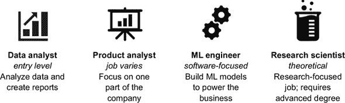
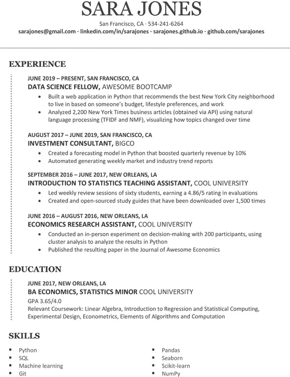
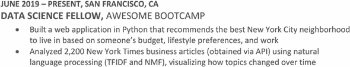
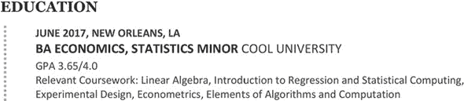
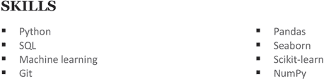
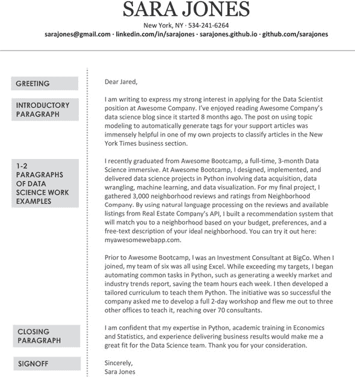
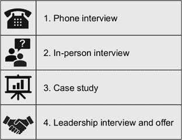

## 第二部分. 找到你的数据科学工作

现在你已经准备好获得数据科学工作了，是时候去做了。本书的这一部分涵盖了你需要了解的所有内容，以进行一次成功的求职，从寻找空缺职位开始，到谈判和接受工作邀请结束。由于数据科学领域的性质，数据科学的求职过程有一些独特的特点。我们将为你准备解析许多意味着“数据科学家”的职位发布以及公司对带回家做的案例研究有什么期望。尽管这部分内容特别适用于那些之前没有数据科学工作经验的人，但这些材料对于初级和高级数据科学家来说仍然可以作为复习之用。

第五章涵盖了搜索数据科学职位以及如何处理令人眼花缭乱的职位发布。第六章教你如何创建强大的数据科学简历和求职信，提供基于你的材料的示例以及背后的原则。第七章全部关于你从数据科学工作中可以期待什么以及如何准备，从最初的电话筛选到最后的现场会议。第八章将指导你在收到公司的工作邀请时应该说什么，包括如何决定是否接受它以及为什么以及如何谈判。

## 第五章. 寻找：为你找到合适的职位

*本章涵盖*

+   寻找可能适合的空缺职位

+   解码职位描述以了解这些角色的真实情况

+   选择申请的职位

你已经拥有了技能，也拥有了作品集；你所缺少的只是数据科学工作！不过，你应该预期到求职过程需要一些时间。即使是成功的求职申请，通常也需要从申请到获得录用至少一个月的时间，更常见的是几个月。但通过在本章中介绍一些最佳实践，我们希望使这个过程尽可能不痛苦。

在本章中，我们专注于如何寻找数据科学工作。首先，我们涵盖了你可以找到工作的所有地方，确保你不会无意中缩小你的选择范围。然后，我们向你展示如何解码这些描述，以了解你实际上需要哪些技能（剧透：不是所有技能），以及这些工作可能是什么样的。最后，我们展示如何利用你在前四章中获得的数据科学技能和公司原型知识来选择最适合你的职位。

### 5.1. 寻找工作

在担心如何制作“完美”的简历和求职信之前，你需要知道将它们发送到哪里！LinkedIn、Indeed 和 Glassdoor 等职位发布板是开始搜索的好地方。查看多个网站是值得的，因为并非所有公司都会在每个网站上发布职位。如果你是技术领域中的少数群体成员，你也应该寻找专门针对你的职位网站，例如 POCIT 和 Tech Ladies，分别针对有色人和技术领域的女性。你申请的职位类型也可能影响你寻找的地方；例如，有针对特定类型公司的职位发布板，如初创公司（AngelList）和技术公司（Dice）。

确保广泛浏览。如第一章所述，数据科学工作除了数据科学家之外还有许多不同的名称。不同的公司对类似职位使用不同的名称，甚至有些公司还在改变其职位名称的含义，所以去年是数据分析师的人，明年可能就是数据科学家了，而职责却没有变化！

你可能会遇到的某些职位名称示例（图 5.1）包括

+   ***数据分析师***—— 这个职位通常是一个初级职位，如果你没有科学、技术、工程或数学（STEM）学位，并且之前没有为公司进行过任何数据分析，那么这是一个进入该领域的绝佳起点。正如我们在第 5.1.1 节后面讨论的那样，你确实需要非常小心地对待数据分析师职位，以确保该职位将涉及编程、统计学或机器学习。

+   ***定量、产品、研究或其他类型的分析师***—— 与数据分析师相比，这些职位的职责多样性更大。你可能正在做与公司中的数据科学家完全相同类型的工作，或者你可能整天都在使用传统的微软 Excel 电子表格。

+   ***机器学习工程师***—— 如标题所暗示的，这些工作专注于数据科学的机器学习部分，通常需要强大的工程背景。如果你拥有计算机科学学位或者一直担任软件工程师，这个职位可能非常适合你。

+   ***研究科学家***—— 这些职位通常需要博士学位，尽管如果你拥有计算机科学、统计学或相关领域的硕士学位，可能会有一些协商空间。

##### 图 5.1\. 在搜索时可能遇到的某些不包含“数据科学”字样的职位名称

当你开始搜索时，尝试在这些招聘网站上简单地搜索一下 *数据*，并花一个小时阅读职位帖子。这项工作将帮助你更好地了解你所在地区有哪些行业代表，以及哪些类型的职位是开放的。你将发现一些模式，这将让你更快地浏览新的职位列表。寻找与你匹配良好的工作，而不是所有可用的职位，将范围缩小到可管理的数量。不要过于担心职位的名称；使用描述来评估是否合适。

极力避免将求职视为一场数字游戏。如果你在像纽约或旧金山这样的大科技城市或多个城市寻找工作，你会找到数百个职位列表。检查职位列表可能会迅速成为一种痴迷，因为它是一种简单的方法来感觉有成效（“我今天阅读了 70 个职位描述！”）。就像使用 Twitter 和 Facebook 一样，不断检查更新可能会上瘾。每三天到五天检查一次通常不会增加价值。每月只检查一次可能会意味着你错过了一个好机会，但没有任何公司会在职位发布到招聘网站后的两天内填补这个职位。

如果你对特定的公司感兴趣，请查看他们网站上的职业页面。就像你应该搜索多个职位名称一样，检查不同的部门。一些公司可能会将数据科学放在金融、工程或其他部门，所以如果你不检查那里，你就找不到它们。

| |
| --- |

##### 应届毕业生

当你寻找工作时，寻找具体标题为“应届毕业生”、“初级”、“助理”和“入门级”的职位。同时查看你的职业中心以获得帮助，并参加校园上的任何招聘会。

| |
| --- |

#### 5.1.1\. 解读描述

当你开始阅读职位描述时，数据科学职位发布可能似乎分为两类：

+   ***商业智能分析师职位——*** 在这类角色中，你将使用商业智能工具，如 Excel 和 Tableau，可能还会用到一点 SQL，但通常你不需要编写代码。如果你想提高你的编码技能、机器学习工具箱或统计学和数据工程知识，这些工作可能不适合你。

+   ***独角兽——*** 在极端的另一端，你有一个职位列表，要求应聘者拥有计算机科学博士学位，并且已经作为数据科学家工作了五年以上；是尖端统计学、深度学习和与商业伙伴沟通的专家；并且有处理从生产级机器学习到创建仪表板到运行 A/B 测试的广泛责任经验。这类职位描述通常意味着公司不知道它在寻找什么，并期望数据科学家在没有任何支持的情况下解决所有问题。

虽然如此，请放心：我们承诺这里不仅仅只有这两种类型的工作。更好的思考这些工作的方式是考虑经验。公司是否在寻找一个人来建立自己的部门，但目前还没有数据管道基础设施？或者它是否在寻找其目前高效的数据科学团队的第五位成员，希望这个新人能立即做出贡献，但并不期望他们同时成为数据操作、商务沟通和软件开发方面的专家？为了做到这一点，你需要仔细阅读职位描述，并弄清楚雇主真正在寻找什么。假设你正在查看领养猫的列表，而猫 Honeydew Melon 被描述为“喜欢询问你的日常生活。”你需要意识到这个描述实际上意味着她会不断地喵喵叫以吸引注意，这可能会对你的家庭造成不利。

在职位描述中，一些需要留意的著名短语包括“努力工作，尽情玩耍”，这意味着你需要长时间工作，并预期会参加非正式的公司活动（如去酒吧），以及“自我启动者且独立”，这意味着你不会得到很多支持。通过了解如何读出言外之意，你可以确保申请到正确的职位。

首先要记住的是，职位描述通常是带有一定灵活性的愿望清单。如果你满足了 60%的要求（也许你缺少一年的所需工作经验，或者没有与公司技术栈的一个组件合作过），但其他方面都很合适，你仍然应该申请这份工作。绝对不要过于担心加分项或“加分项”。此外，对工作经验年的要求只是必要技能的代理；如果你在研究生院编码过，这段经历可能也会被计算在内。但话虽如此，如果你是一个来自市场营销领域的有抱负的数据科学家，申请需要五年数据科学家工作经验、Spark 和 Hadoop 熟练度以及将机器学习模型部署到生产环境中的经验的资深数据科学家职位可能并不是最好的时间利用方式；公司正在寻找不同层次的经验和资质。

| |
| --- |

##### 学位要求

许多数据科学家职位要求拥有“定量学科”学位（如统计学、工程学、计算机科学或经济学）。如果你没有这些学位之一，你还能申请这些工作吗？一般来说，可以。我们将在第六章（chapter 6）中更深入地讨论这个话题，但如果你在这些领域（包括在训练营或在线）上过课，你可以强调这一点。如果你遵循了第四章（chapter 4）中的建议，通过建立作品集和撰写博客文章，你可以将这些项目展示给雇主，作为你能完成工作的证据。

| |
| --- |

数据科学职位发布中的一个复杂问题是不同的词可能意味着相同的意思。机器学习和统计学因这一点而臭名昭著。一家公司可能要求有回归或分类的经验，而另一家则要求有监督学习的经验，但总体来说，这些术语是等效的。A/B 测试、在线实验和随机对照试验也是如此。如果你不熟悉某个术语，谷歌一下；你可能会发现你已经在不同的名称下做过这项工作！如果你没有在发布中提到的特定技术方面工作过，看看你是否做过类似的事情。例如，如果列表中提到了亚马逊网络服务（AWS），而你使用过微软 Azure 或谷歌云，那么你就有处理云计算服务的技能。

了解如何解码职位描述的另一个好处是能够检测到红旗（第 5.1.2 节）。没有公司会直接说在该公司工作不好。你越早识别出可能不好的工作环境，就越好，所以你会在职位描述中寻找任何警告信号。

#### 5.1.2\. 寻找红旗

找工作是一条双向的道路。在这个过程中，你可能觉得公司拥有所有权力，而你需要证明自己值得。但——是的，你——也可以有所选择。最终陷入一个有毒的工作场所或令人昏昏欲睡的工作，这是一个非常困难的情况。尽管你不可能总是仅从职位描述中就能判断出这种情况，但你可以留意一些警告信号：

+   ***没有描述——*** 第一个警告信号是公司或工作本身没有描述——只有要求列表。那些组织已经忘记了招聘是一个双向过程，并且没有考虑你。或者他们可能被数据科学炒作所吸引，只想拥有数据科学家，而不做任何设置，以便他们可以高效工作。

+   ***广泛、广泛的要求——*** 第二个警告信号是前面提到的独角兽描述（第 5.1.1 节）。尽管那个例子是极端的，但你应该对任何将决策科学、分析和机器学习中的两种或三种工作类型描述为主要职责的职位描述保持警惕。尽管期望每个角色都有基本能力是正常的，但没有人能够在专家级别上填补所有这些角色。即使有人能够做到，他们也没有时间做所有的事情。

+   ***不匹配——*** 最后，寻找职位要求和职位描述之间的不匹配。雇主是否要求有深度学习经验，但工作职能却是制作仪表板、与利益相关者沟通和进行实验？如果是这样，公司可能只是想要一个能够使用最新工具的人，或者是一个拥有斯坦福大学人工智能博士学位的“著名”数据科学家，而实际上他们无法使用这种专业知识。

#### 5.1.3\. 设定你的期望

虽然你应该对潜在的工作有一定的标准，但你不想要求完美。有志于成为数据科学家的年轻人有时会这样看待他们的道路：“步骤 1-98：学习 Python、R、深度学习、贝叶斯统计、云计算、A/B 测试、D3。步骤 99：获得数据科学工作。步骤 100：盈利。”这个例子是夸张的，但数据科学炒作的一部分是对该领域工作方式的理想化。毕竟，数据科学家是“美国最好的工作”([`mng.bz/pyA2`](http://mng.bz/pyA2))，拥有六位数的薪水和高工作满意度。你可能会想象每天都能与最聪明的同事一起解决该领域最有趣的问题。所需的数据将始终可用且已清洗，你遇到的任何问题都将立即由工程师团队解决。你的工作将完全如描述的那样，你将永远不会做那些你最不感兴趣的数据科学工作部分。

不幸的是，这种情景只是一个幻想。正如我们希望这本书的第一部分（part 1）能让你相信在进入这个领域之前不需要知道一切，公司也不可能是完美的独角兽。这本书没有以你找到数据科学工作作为结尾是有原因的。尽管成为数据科学家是一项伟大的成就，你应该为之自豪，但数据科学是一个你将永远在学习的领域。模型会失败，职场政治可能会破坏你过去一个月的工作，或者你可能需要花费数周时间与工程师和产品经理合作来收集所需的数据。

对于那些在数据科学领域广为人知或特别知名的公司，理想化它们特别容易。也许你参加过一场讲座，其中一位公司员工给你留下了深刻印象。也许你已经关注了那个人的博客数月，知道他们在该领域的最前沿。也许你阅读了一篇文章，说该公司有休息舱、美食和许多友好的办公犬。但无论是什么吸引了你，很可能也吸引了其他有志于成为数据科学家的年轻人；这些公司大多数对空缺职位都有数百份申请，并且可以设定比实际工作所需更高的标准。无论如何，你所了解的工作可能完全属于另一个部门，而空缺的职位实际上可能并不吸引人。

即使有现实的期望，你很可能在第一次数据科学职位上不会得到你梦想的工作。在行业内过渡或把数据科学带入你当前的角色更容易；即使你最终想离开你的领域，你可能也需要从一个可以发挥你其他技能的位置开始。这并不意味着你不应该有一些要求和偏好，但你将需要有一定的灵活性。在科技行业，即使一年或两年后换工作也是很正常的，所以你不会承诺签下接下来的 15 年。但你在进入这个领域之前，并不能确切知道你想要什么，而且你甚至可以从糟糕的工作中学到东西，所以不要过于焦虑。

#### 5.1.4. 参加 Meetups

虽然职位发布板是寻找开放职位的一种常见方式，但它们通常不是最有效的申请地方。正如我们在第六章中讨论的那样，在线提交冷门申请通常响应率非常低。根据 2017 年 Kaggle 的调查([`www.kaggle.com/surveys/2017`](https://www.kaggle.com/surveys/2017))，已经作为数据科学家就业的人寻找和获得工作的两种最常见方式是通过招聘人员和朋友、家人和同事。通过参加 Meetups 是建立这种网络的一个好方法。

Meetups 通常是在工作日晚上举行的面对面会议。通常会有一个演讲者、讨论小组或一系列演讲者就与活动相关的话题进行演讲。Meetups 应该是免费的或者只收取象征性的费用，有时这些费用会用于食物。有些 Meetups 可能只有 20 人参加；而有些可能让一个房间坐满 300 人。有些每月都会举行会议；而有些一年只开几次会。有些鼓励成员在会议结束后留在场地交谈或去附近的酒吧见面；而有些则专注于演讲本身。有些非常具体，例如 Python 中的高级自然语言处理；而有些可能一个月提供时间序列的介绍，下一个月则提供高级深度学习模型。尝试几个 Meetups 看看你最喜欢什么是有价值的。话题很重要，但你想找到一个让你感到受欢迎并且喜欢与其他参会者交谈的地方。几乎所有 Meetups 都有[`www.meetup.com`](https://www.meetup.com)上的账户，所以你可以搜索数据科学、机器学习、Python、R 或分析，以找到你所在地区的相关 Meetups。

许多数据科学 Meetups 在会议开始时留有时间让人们宣布他们是否在招聘。走上前去和这些人交谈；招聘是他们工作的一部分，即使他们当前的开职空缺不适合你，他们也可能能给你提供好的建议或建议其他地方去寻找。

你也可能遇到另一位在您感兴趣的公司或子行业工作的参会者。你可以询问他们是否有时间进行一次信息面试，这样你就可以了解更多关于该领域的知识。信息面试并不是（或者，更确切地说，不应该是一种）被动攻击性的寻找推荐的方式；相反，这是一种了解公司并获得在行业内部人士建议的极好方式。尽管我们在第六章中讨论了被推荐工作的优点，但我们不建议向刚刚认识的人请求推荐。这对他们来说是一个强烈的请求，没有人喜欢感觉自己被利用。如果有人告诉你在他们公司有一个空缺，并表示他们可以为你推荐，那是一个巨大的加分项，但即使他们不这样做，你也能从信息面试中获得很多收获。

参加聚会还有其他很多好处。首先，它们让你能够找到当地志同道合的人。如果你刚刚搬到新城市或刚刚从大学毕业，你可能会觉得自己在这个城镇是个陌生人。参加聚会是发展你的职业生涯和建立社交圈的好机会。你可以利用聚会来建立人脉或建立一些可能帮助你从具体的数据科学问题到求职推荐或一般指导的联系人。此外，虽然一些聚会会在网上发布他们的演讲记录，但其他聚会则不会，所以亲自参加是唯一听到那个演讲的方式。

不幸的是，聚会可能会有一些缺点。加入只有几个人的聚会可能会让人感到害怕，他们都是经验丰富且/或彼此认识的人。冒名顶替综合症肯定会悄悄出现，但你应该努力克服它，因为没有什么地方比一个良好的聚会更受欢迎了。最后，尽管聚会提供了了解当地数据科学场景的好机会，但它们可能会变得封闭或缺乏多样性，这取决于组织者的开放程度以及特定聚会与多元化社区的联系程度。

#### 5.1.5\. 使用社交媒体

如果你不住在或靠近城市，附近可能没有数据科学聚会。在这种情况下，Twitter 和 LinkedIn 是开始建立你网络的好地方。当你关注了几位知名数据科学家后，你经常会发现更多值得关注的人，因为你会看到谁经常被转发或提及。你也可以开始为自己树立名声。

我们喜欢以几种方式使用 Twitter：

+   ***分享工作——*** 当你写了一篇优秀的博客文章时，你希望人们能看到它！通过链接到你的作品并附上简短描述来自我推广是完全正常的。

+   **分享他人的工作——** 你是否读过一些精彩的内容？是否有一个包节省了你数小时的挫败感？是否在演讲中看到过一个特别有帮助的幻灯片？如果是这样，帮助其他人达到启迪也是一件好事。在第六章中，我们讨论了联系他人的最佳方法之一：提及你从他们的工作中获得了哪些益处。在帖子中提及创作者是一种很好的方式，可以让他们以积极的方式注意到你。如果你在分享一个演讲，检查会议或聚会是否有标签；在推文中使用该标签是一种很好的方式，可以让它获得更多的曝光。

+   **寻求帮助——** 你是否遇到了一个你（和谷歌）都无法解决的问题？很可能其他人也遇到了相同的问题。根据问题的类型，可能有一些特定的论坛或网站，你可以提问，或者你可以通过使用相关的标签来发出一个一般性的呼吁。

+   **分享技巧——** 并非所有事情都值得写一篇博客文章，但如果你有一个快速的技巧，分享它。这个话题可能感觉像是“每个人”都知道的，但请记住：刚开始的人并不了解所有事情。甚至那些已经使用某种语言多年的人可能也不知道有新的方法来做某事。

如果你能够公开你的求职过程，你还可以在社交媒体上发布你正在寻找工作，并询问是否有人有任何线索。即使你可能还没有强大的数据科学社交网络，你可能有朋友、前同学和同事，他们可能了解他们公司内的职位。这种方法在社交媒体平台上通常效果更好，比如 LinkedIn 或 Twitter，但即使是 Facebook 这样的社交媒体网络也可能与机会有所联系。

在职业生涯的早期，你可能会觉得还没有建立起自己的社交网络；看起来社交网络是那些已经拥有数据科学工作的人所拥有的！解决方案是在寻找工作的时候建立社交网络，甚至在之前就着手这样做。你越能跳出舒适区，在会议、聚会、学术机构、烧烤等活动场合与人交谈，你下一次寻找工作时就会越有准备。

**保持管道充满活力**

在求职过程中，一个常见的错误是将希望寄托在单一的机会上，而不在其他地方继续申请和面试。但如果那个机会失败了怎么办？你不想不得不从零开始再次开始求职过程。你希望在每个阶段都有多个机会：你发送的申请、人力资源筛选、带回家的案例研究和面对面面试。直到你接受了书面的工作邀请，不要认为这个过程已经结束。

拥有多个机会也有助于你应对拒绝。在求职过程中，拒绝几乎是不可避免的，而且很难不把它当作是对你个人价值的一种指示。在某些情况下，你可能甚至都没有收到拒绝的通知；你只是从未收到公司的回复。但导致你未能得到工作的许多原因都超出了你的控制范围。公司可能已经关闭了职位而没有招聘任何人，选择了内部候选人，或者在你还在早期阶段时就接受了其他人。拒绝会让人受伤，尤其是来自你非常感兴趣的公司，你应该花点时间来处理你的感受。但拥有其他选择将有助于保持你的动力和进步。

最后，拥有多个潜在的选择使你更容易拒绝一份工作。也许你已经通过了人力资源筛选和案例研究，却发现公司里没有数据工程师；尽管公司规模很大，但数据科学团队只有几个人；或者公司所寻找的与它所宣传的非常不同。尽管你不应该等待完美的数据科学职位（因为这样的职位不存在），但你可能有一些不可协商的要求，如果你看到这些要求可以在其他工作中得到满足，那么坚持这些要求会容易得多。

| |
| --- |

### 5.2. 决定申请哪些工作

到现在为止，你应该有一份至少包含 12 份你多少有些兴趣并且可能适合的工作列表。你是否会立即申请所有这些工作？

嗯，有些人确实会申请几十甚至上百份工作。他们试图玩概率游戏，认为如果对任何一份工作的回应概率是 10%，那么尽可能多地申请公司将给他们带来最多的回应。但他们是在一个谬误下运作：如果你有限量的精力和时间，将它们分散在 100 份申请上而不是 10 份上，会使每一份申请都变得更弱。我们在第六章中讨论了如何根据每个职位定制你的申请，但这只有在你有选择性地申请时才可能。为 50 家公司做这件事几乎是不可能的。

| |
| --- |

##### R 和 Python

如果公司要求你使用 Python 而你知道 R，或者反过来，你应该申请这份工作吗？虽然掌握一种语言确实会让学习另一种语言更容易，但你在第一份数据科学家的工作中已经学到了很多东西：与利益相关者合作、内部政治、统计学、数据集等等。即使你能得到这份工作，在学习新语言的同时还要学习其他东西可能会很困难。因此，我们通常建议只申请使用你主要语言的工作。如果知道其中一种语言是一个加分项，而另一种语言不是必需的，你可能需要谨慎一些；这份工作描述可能意味着你实际上不会编码。最后，一些工作要求两种语言。你在这里也想要小心一些；通常，这种要求意味着人们使用其中一种语言，而不是每个人都知道两种语言，这可能会使协作变得困难。这种类型的工作可以成功，但务必在面试中询问语言的使用比例。如果你是 20 人团队中唯一两个使用 Python 的人，提高你的编程技能将会很困难。

| |
| --- |

你可能想要回顾一下前两章中学到的关于数据科学公司类型和数据科学工作的内容。你想要尝试数据科学的各个方面，这个月调整推荐系统，下个月创建终身价值模型吗？如果是这样，你可能想要为一家最近开始做数据科学的公司工作，因为更成熟的公司会有专门的角色。另一方面，大型科技公司也有大量的数据工程师，所以获取常规数据既快又容易。

其中一些可以从公司的一些基本事实中明显看出；例如，一个 10 人的初创公司不太可能有一个成熟的数据科学系统。但你怎么能了解更多呢？

首先，看看公司是否有数据科学博客。通常只有科技公司才有这种类型的博客，但阅读这些帖子对于了解数据科学家实际做什么非常有价值。你对于公司博客上特定帖子的积极想法也可以包括在你对该公司的求职信中（在第六章中介绍）。如果你从未听说过这家公司，花些时间在其网站上看看。当你知道公司做什么以及它是如何赚钱的，你就可以开始猜测它需要什么样的数据科学工作了。最后，如果你对一家公司真的很感兴趣，看看该公司是否有数据科学家在博客中谈论他们的工作，或者是否就它发表过演讲。

在阅读关于一家公司的时候，记得要考虑对你来说通常重要的事情。是否有时在家工作的能力很重要？关于休假天数呢？如果你想参加会议，公司是否提供差旅预算和休假时间？此外，阅读公司对自己所说的内容可以告诉你它的价值观。它是否谈论桌球、办公室里的啤酒和提供的晚餐？这样的公司可能充满了年轻的员工。或者它是否强调灵活的工作时间或家庭休假？这样的公司可能更友好地对待父母。在第八章 Chapter 8 中，我们讨论了你可以协商的不仅仅是薪水，但在这个阶段，你至少可以看看公司是否宣传了与你的优先事项相符的福利。

现在你已经列出了一个可管理的潜在工作清单，是时候开始申请了！在第六章中，我们带你了解如何制作一份优秀的简历和求职信，包括如何针对每个职位进行定制。

### 5.3. 与 Kaggle 的开发倡导者贾斯汀·莫斯蒂帕克的访谈

贾斯汀·莫斯蒂帕克来自分子生物学背景，在成为非营利性数据科学爱好者之前，她曾是一名公立学校的教师。在这次采访的时候，她是教学信托的数据科学部主管。你可以在她的网站上找到关于非营利性数据科学、学习 R 的建议以及其他主题的文章，[`www.jessemaegan.com`](https://www.jessemaegan.com)。

#### 你对开始找工作有什么建议？

想想你对数据科学家这个头衔有多依赖。如果你决定不关心你被称为什么，而是专注于你正在做的工作，你将会有更多的灵活性来寻找工作。一些非数据科学家的关键词包括*分析*、*分析师*和*数据*。虽然你可能需要筛选更多的信息，但你可能会找到一个像“研究和评估”这样的职位，你符合这个职位的资格，但如果你只是寻找数据科学家的工作，你可能永远不会遇到它。

在寻找工作时，关注你作为数据科学家想做什么。对我来说，我不太喜欢从网站点击中计算投资回报。我问自己，“我关心哪些事业？哪些组织与这些事业一致？”我非常关心女童子军，他们恰好在寻找分析师职位，所以我能够进入并做那份工作。当我想要更多地进入教育领域时，这种情况在教学信托也发生了。

#### 你如何建立你的社交网络？

当我过渡到数据科学时，我做了很多长时间失败的事情。我是那个每天在 Twitter 上转发每篇看到的数据科学文章的人，每天发布 20 篇没有互动的文章。你应该考虑你想见的人，为什么，你为那种关系带来的价值，以及对你来说什么是真实的。考虑打造你的品牌，不一定是以严格的方式，但确保你在网上和社交媒体空间中的表现对你来说是真实的。对我来说，我意识到我不能成为一个完美的数据科学家，等到我知道数据科学的全部内容才上社交媒体，因为那将永远不会发生。我决定相反，我会谈论我正在学习的事情，并公开这个过程，这就是我建立我的网络的方式。

#### 如果你觉得自己没有信心申请数据科学工作，你会怎么做？

如果你正在培养技能，可以用 Python 或 R 进行一些分析，并且掌握了基础知识，你应该专注于如何让自己适应承担风险和失败。作为数据科学家，你必须经历很多失败。如果你担心在求职过程中承担风险和失败，那么当你对一个模型承担风险而模型没有成功时会发生什么？你需要接受模糊性和迭代的概念。你必须申请并尝试；你将会被拒绝，但这很正常！我经常被拒绝，这只是经验的一部分。

#### 如果有人认为“我没有达到任何工作的全部要求资格”，你会对他说什么？

一些研究表明，某些群体特别是觉得他们需要达到 100%的资格，而其他群体则说“我达到了 25%？我在申请！”争取那些 25%合格者的信心，然后去尝试。但你可能也在解码职位描述的语言上遇到了障碍。例如，假设列出了一个离散的技能，比如有 10 年使用 SQL 数据库的工作经验。你可能认为“我没有那个；我有 7 年使用 Microsoft Access 的工作经验。”但我认为那仍然是一种可转移的技能。作为申请者，你需要告诉自己“我可能没有这项具体技能，但我有一种与之非常相似的技能。我需要看看 SQL，看看我的技能的可转移性如何，并告诉这家公司我在 Microsoft Access 上取得的惊人成就，以及他们应该雇佣我，因为我知道我可以用 SQL 做到这一点，甚至更多。”

#### 你对有志于成为数据科学家的人有什么最后的建议？

你需要培养你的沟通技巧和适应变化的能力。你应该能够以尊重你交谈的人的专业知识并展示你存在的目的是使他们的生活更轻松的方式，在组织的各个层面进行沟通。

我所说的“随遇而安”，是指能够说出类似这样的话：“我不会那样处理那个问题或这个项目，但我能理解你的观点。让我们那样尝试，也许我可以这样修改。”你也需要灵活，因为人们还在摸索数据科学。组织需要数据科学家，但他们不知道如何使用他们。你服务于组织的利益；如果他们的需求发生了变化，你需要发展和适应以满足这些需求。

最后，要知道你的工作描述可能会改变。你必须能够说，“这不是我想做的事情，但我该如何使它对我有利？”你不能说，“我是神经网络的最佳人选，但我没有在做神经网络，所以显然，这份工作很糟糕。”你需要知道你承担的任何职位都会随着公司需求的变化而变化和发展。

### 摘要

+   在招聘板上搜索像*数据*这样的通用术语，并专注于描述，而不是标题。

+   不要担心是否满足 100%的职位要求。

+   记住，求职过程是双向的。留意红旗，并思考你想要做什么样的数据科学。

## 第六章：申请：简历和求职信

*本章涵盖*

+   编写引人注目的简历和求职信

+   针对每个职位定制你的申请

你有一份你感兴趣的空缺职位列表；现在是你让雇主知道你存在的时候了！几乎每个职位都会要求你提交一份简历：一份夸大了你的技能和经验的清单。大多数职位也会要求你提交一封求职信：一封一页纸的信件，说明你为什么应该被考虑这份工作。你可以快速记下你以前的工作，并写一封模板信说你对公司感兴趣，但在这个情况下，投入更多努力可能是你能否获得面试的决定性因素。

在本章中，我们首先确保你的基础简历和求职信尽可能有效，涵盖最佳实践和应避免的常见错误。然后我们向你展示如何将那份“完美”的简历和求职信针对每个职位进行精炼。最后，我们向你展示如何通过建立人脉，将你精心准备的应用送到招聘经理手中，而不是让简历堆成山。

| |
| --- |

##### 注意

简历的唯一目标是说服一个只是粗略浏览你简历的人，你值得面试。

| |
| --- |

本章的关键主题是，你需要迅速说服一个人你有资格担任该职位。公司招聘人员通常为每个数据科学职位收到数百份简历。此外，由于数据科学涵盖了如此多的不同类型的工作，申请这些职位的人的技能范围也会很大。这一行为强化了这样一个观念：你的材料必须说“嘿，你正在阅读这个，你可以停止浏览这堆庞大的简历，因为你已经找到了你正在寻找的具有所需技能的人。”但能够证明你有资格并不是一件容易的事情。

尽管建立人脉和个性化你的申请需要时间，但它们比仅仅花一个小时写一份基本的求职信和简历，然后一键申请几十份工作要好得多。你更有可能得到面试机会，因为你的申请将与公司的要求相匹配。当你到达面试阶段（第七章的主题）时，你将能够给出一个很好的答案来回答常见的提问：“你为什么对这个职位感兴趣？”

### 6.1\. 简历：基础知识

你的简历的目标不是让你得到工作；而是让你得到面试机会。负责面试流程的招聘人员如果引入明显不符合工作资格的人，会遇到麻烦，而当人们符合资格时，他们会受到赞扬。你的简历需要向读者展示你符合该职位的资格，以便招聘人员感到舒适地继续推进流程。

这个目标与创建一个包含你所有经历的目录截然不同，不幸的是，这是许多缺乏经验的简历作者的目标。虽然你确实想通过省略最近的工作来避免简历上的空白，但你可以在与数据科学无关的部分上花费较少的时间。即使你有大量的数据科学经验，你也应该专注于突出最相关的职位。如果你有一个多页的简历，大多数招聘人员没有时间阅读全部内容；他们也无法确定应该阅读哪些部分。没有人会告诉你：“嗯，我们本来会雇佣你的，但你没有在你的简历上写上高中时的救生员工作，所以我们不能雇佣你。”

在面试过程中，你将有足够的时间深入讨论你的工作、教育和数据科学项目。目前，你需要关注对你申请的职位最相关的信息。在整个过程中，你将专注于那些能让你在众多申请者中脱颖而出的优秀品质，但在第一步，关注符合招聘经理或招聘人员期望是很重要的。

考虑到这一点，我们将介绍简历的基本结构，如何在结构内创建良好的内容，以及如何考虑众多流传的简历规则。大量内容可以应用于工业界的任何技术职位，但我们将尽可能关注数据科学领域的独特之处。我们还为您制作了一份示例简历，供您作为参考使用（图 6.1）。

##### 图 6.1. 数据科学求职者的示例简历

#### 6.1.1. 结构

在本节中，我们将逐一分析示例简历的各个部分，并详细介绍您希望包含的内容。

##### Section: 联系信息

包括您的联系信息是必要的，这样招聘人员才能联系您！您至少需要包括您的名字、电话号码和电子邮件。除此之外，您还可以提供链接，以便他们可以找到更多关于您的信息，包括社交媒体资料，如 LinkedIn，在线代码库如 GitHub，以及个人网站和博客。为了确定要添加什么内容，请自问：“如果有人点击它，他们会对我有更高的评价吗？”例如，从第四章中的项目组合链接是一个非常好的选择。但一个 GitHub 资料库，除了克隆了一个教程项目外空无一物，则不是。如果您有任何公开可用的数据科学工作，请尝试找到一种方法在这里展示它。

通常，您还希望包括您居住的城市和州，这样招聘人员就会知道您就在附近，可以通勤到工作地点，或者如果您得到了这份工作，您可能需要搬迁。一些公司由于搬迁新员工的费用问题而犹豫不决，所以如果您不住在附近且不想承担这个风险，您可以考虑不提供您的位置信息。

如果您的法定姓名与您常用的姓名不匹配，您可以使用您的常用名。在流程的后期，您需要让公司知道您的法定姓名，用于背景调查等事宜，但在申请时您并不需要使用您的法定姓名。

最后，不要使用可能冒犯人的电子邮件地址（例如 i_hate_python @gmail.com）或可能过期的地址（如学校电子邮件地址）。

##### Section: 经验

这个部分是用来展示你通过之前的工作、实习或训练营证明自己适合这份工作的。如果你的过往工作与数据科学相关，例如软件工程，那很好：在你的简历中花相当一部分篇幅来描述这些工作。如果一份工作与数据科学无关，例如担任艺术史教授，你仍然应该列出这些工作，但不要花太多时间描述它们。对于你担任过的每一个职位，列出公司名称、开始和结束的月份和年份、你的职位名称，以及至少一个项目符号（对于最相关的职位，可以列出两个或三个）来描述你所做的工作。如果你是应届毕业生或近期毕业生，你可以包括实习和大学里的研究工作。

这个部分应该是你简历中最大的部分，可能占据一半的空间。它通常也是最重要的，因为这是招聘人员首先会查看的地方，以确定你是否具有与招聘职位相关的数据科学经验。由于正确处理这一部分的重要性，我们将在第 6.1.2 节中深入探讨如何为这一部分创建最佳内容。

##### 部分：教育

在这个部分，你列出你的教育经历，理想情况下，以展示你有一套对数据科学工作有用的技能。如果你在高中之后上学，即使你没有获得学位，也要列出你的学校（们）、日期（与你的工作经验相同的格式），以及你的研究领域。如果你是即将从学校毕业的第一份工作，并且你的平均成绩很高（高于 3.3），你可以列出它；否则，就省略它。如果你是近期毕业生，并且你学习了统计学、数学、计算机科学，或任何涉及它们的课程（如社会科学研究方法或工程），你可以列出这些课程。

招聘人员非常想知道你是否有一个与数据科学相关的学习领域，例如数据科学、统计学、计算机科学或数学学位。他们也会对你的学位水平感兴趣。由于许多数据科学主题直到研究生水平的项目才会涉及，拥有研究生学位会有帮助。招聘人员通常不会关心你上的学校，除非它非常著名或声望很高，即使如此，如果你毕业几年以上，这个证书也不会很重要。然而，如果招聘人员看到你有训练营、证书或在线课程，这会很好，因为它们表明你继续了你的教育。

尽管你的简历中的教育部分可以为招聘人员提供有价值的信息，但你不能通过做任何事情来改善这一部分，除非出去获得额外的学位或证书，这一点我们在第三章中已经讨论过了。

##### 部分：技能

这一部分是你可以明确列出所有在数据科学环境中可以贡献的相关技能的地方。理想情况下，招聘人员会看到这一部分，点头说“是的，很好”，因为你将列出与工作相关的技能。在数据科学简历中，在这一部分应列出两种类型的技能：

+   ***编程/数据库技能——*** 这些技能可以是编程语言，如 Python 和 SQL，框架和环境，如.NET 或 JVM，工具，如 Tableau 和 Excel，或生态系统，如 Azure 和亚马逊网络服务（AWS）。

+   ***数据科学方法——*** 第二种类型是数据科学方法，如回归和神经网络。因为你可以列出许多可能的方法，所以尽量专注于几个关键的技能，这些技能共同表明你掌握了基本技能和一些特殊技能。例如，“回归、聚类方法、神经网络、调查分析”等，这表明你掌握了基础和深度。

尽量不要列出七个或八个以上的技能，以免让人感到不知所措，也不要列出与工作无关的技能（例如，你在研究生期间使用的晦涩的学术编程语言）。

只列出你在工作中感到舒适的技能，而不是五年前就不再接触且不想再次学习的语言。如果你的简历上有所列出的技能，招聘人员有权询问这些技能。如果你查看的数据科学职位发布要求某些技能——这些技能你都有——确保列出它们！这些信息正是招聘人员所寻找的。

我们建议你不要使用星级评分、数字或其他方法来尝试表明你在每个技能上的强弱。一方面，评分没有任何意义：任何人都可以给自己打 5/5 分。如果你给自己打满分，招聘经理可能会认为你不诚实或自我反思能力差；如果你给自己打低分，他们可能会怀疑你的能力。此外，不清楚你如何看待每个等级。5/5 分是否意味着你认为自己是世界上最好的，知道如何完成高级任务，或者在某些技能上比同事更出色？如果招聘经理确实想让你自我评估不同技能的水平，他们会在面试中询问你。

不要列出软技能，如批判性思维和人际交往能力；尽管这些对于成为一名成功的数据科学家至关重要，但在简历上列出它们是没有意义的，因为任何人都可以做到。如果你确实想突出你在这些领域的技能，请在简历的经验部分讨论你如何在具体实例中使用这些技能。此外，你不需要列出申请者都应具备的基本技能，例如使用 Microsoft Office 套件。

##### 部分：数据科学项目（可选）

如果您在工作之外进行了数据科学项目，您可以为此创建一个部分。这个部分非常适合那些工作经验较少但同时在一边或在学校或训练营中进行了项目的人。您基本上是在告诉招聘人员：“尽管我可能没有太多相关的工作经验，但这并不重要，因为我已经完成了整个数据科学过程。”

对于每个项目，您需要一个标题，描述您所做的工作以及您是如何做的，以及结果。实际上，数据科学项目在结构和内容上应该看起来像工作，因此第 6.1.2 节上生成内容的每一项都适用于它们。理想情况下，您将有一个指向博客文章或至少指向包含信息 README 文件的 GitHub 仓库的链接。数据科学是一个技术领域，其中仅展示您所做的工作就非常容易，而这个部分是这样做的一个绝佳地方。如果您有足够的相关工作经验，您可以跳过这个部分，但在面试中仍然可以谈论项目。

##### 部分：出版物（可选）

如果您在硕士或博士课程中发表了与数据科学相关的论文，您应该包括它们。如果您在其他领域发表了论文，即使是定量领域，如物理学或计算生物学，您也可以包括它们，但只需简要提及。因为这些与数据科学没有直接关系，阅读它们的人除了知道您足够努力以获得发表机会外，不会从这些出版物中获得太多。您可以在经验部分列出您在研究期间完成的相关工作，例如“创建了一种每分钟分析数百万 RNA 序列的算法。”但即使是在您领域内享有盛誉的、招聘经理从未听说过的期刊上发表的论文，也不会单独走得很远。

##### 其他部分

您可以添加其他部分，例如如果您赢得了 Kaggle 比赛或获得了奖学金或研究员职位，可以添加荣誉和奖项，但这些不是必需的。您不需要包括参考文献；与参考文献的交谈将在过程后期进行，并且如果您进展到那个阶段，您可以分享这些信息。目标陈述通常不需要，并且鉴于您的简历中的其他信息，它们是重复的。例如，“寻找开发 A/B 测试和建模技能的 Python 经验丰富的数据科学家”这样的说法不会让招聘人员更加兴奋！

##### 整合信息

通常，您将联系信息放在顶部，然后是下一个最重要的部分。如果您在学校或刚刚毕业，您可能需要将教育信息放在顶部；如果您没有相关的工作或教育背景，请将数据科学项目放在顶部；否则，将工作经验放在那里。在您的工作和教育部分中，按逆时间顺序列出您的经验，从最近的到最远的。

我们已经看到了许多有效的数据科学简历格式。在这个领域，你在设计上有一点点自由；没有接近标准的格式。尽管如此，你始终希望专注于使你的简历易于快速扫描。因为招聘人员花在简历上的时间很少，你不想让他们花时间去弄清楚如何找到你的最新工作。不要让你的设计分散你的内容；考虑别人会如何看待它。一些好的做法包括

+   清晰的章节标题，以便于在它们之间跳转

+   更多空白，以便更容易阅读内容

+   突出显示重要词汇，例如你在每家公司担任的职位名称

如果像空白和标题这样的想法让你感到不知所措，就坚持使用你在网上找到的简历模板，或者咨询一位设计专家。

通常，你希望将简历限制在一页之内。这种做法有两个目的：鉴于你的简历将被快速浏览，你希望确保招聘人员将这段时间花在你认为最有价值的信息上，并且这表明你能够简洁地表达，并了解哪些经验是你最想分享的。如果有人提交了一份 17 页的简历（我们确实见过），这强烈表明他们不知道自己过去的哪些经历使他们成为合适的候选人，并且他们认为别人有义务花时间阅读它。

最后，确保你在简历中保持一致性。如果你在教育部分缩写月份名称，那么在工作经验部分也要缩写。虽然你可以为标题和正文文本使用不同的字体和大小，但不要从项目符号切换到项目符号的格式。使用过去时态表示以前的位置，现在时态表示当前的位置。这些事情表明你注重细节，并且（再次）帮助读者快速处理你的内容，因为他们不会因为字体或风格的变化而分心。单一的不一致性不太可能让你失去面试机会，但有时，细节可以决定一切。

| |
| --- |

##### 校对

仔细校对你的简历至关重要！几个拼写错误或语法错误可能会导致你的申请被（比喻性地）扔进垃圾桶。为什么这么严厉？当招聘人员正在筛选数百份简历时，有两种简历会脱颖而出：一种是明显出色的（罕见的），另一种是容易剔除的。后者需要一些经验法则，除了明显不符合要求的简历外，带有拼写错误的简历也是剔除申请人的一个简单理由。数据科学工作需要注重细节和检查你的工作；如果你在申请时连自己的最佳状态都无法做到这一点，那么这个事实说明了你工作中的什么？除了在文字处理软件中使用拼写检查功能外，至少让另一个人仔细阅读你的申请。

| |
| --- |

#### 6.1.2. 深入到经验部分：生成内容

我们希望确定你的工作和教育历史的日期和标题是足够容易的。但你是如何想出那些简洁的项目符号来描述你的工作经验（或数据科学项目）的呢？

人们在他们简历上犯的常见错误是仅仅列出他们的工作职责，例如“使用 SQL 和 Tableau 为高管生成报告”或“为 30 名学生中的三个班次教授微积分。”这种方法的两个问题是：它只说明了你负责什么，而没有说明你取得了什么成就或你是如何做到的，并且可能没有以与数据科学相关的方式构建。对于前两个例子，你可以将同样的工作描述为“使用 Tableau 和 SQL 自动化生成销售预测报告，每周节省四小时的工作时间”或“为 90 名学生教授微积分，平均评分为 9.5/10，85%的学生在 BC 微积分 AP 考试中获得了 4 或 5 分。”

尽可能地，你希望用可以转移到数据科学领域的技能来解释你的经验。即使你没有在数据科学或分析领域工作，你是否处理过任何数据？招聘经理愿意考虑数据科学角色之外的经验仍然相关，但你必须解释为什么它们应该相关。如果你的任何工作可以与收集和理解数据相关联，你应该投入巨大的努力来创建一个简洁的故事，讲述你所做的事情。你是否为天体物理学博士分析了 100GB 的恒星数据？你是否管理了 30 个 Excel 文件来规划面包店的员工配置？许多活动都涉及使用数据来理解问题。

你是否使用过像 Google Analytics、Excel 或 Survey Monkey 这样的工具？即使这些工具可能不是这份工作所要求的，处理任何类型的数据都是相关的。你使用了哪些沟通技巧？你是否解释过技术或专业概念，比如在博士研究讨论中或向公司其他部门解释？如果提出可转移的技能有困难，不要担心；关于如何写好项目符号的其余建议仍然有帮助。但如果你还没有这样做，你应该考虑你的教育或副项目如何展示数据科学技能，尤其是如果你的工作经验无法做到这一点。

对于你几年前担任的相对不相关的职位，只列一个项目符号是可以的。但如果你不想在简历上留下几个月的空缺，通常你不想从简历中省略任何工作。如果你在职场工作了一段时间并且有很多工作，只列出最近的三到四个职位是可以的。

你可能会发现，这个过程对你目前的工作来说比五年前的工作要容易得多。一个很好的做法是保持一个你成就和主要项目的清单。当你每天在一份工作中，逐步取得进步时，当你退一步看时，可能会忘记整体是多么令人印象深刻。人们知道你的简历不是一个详尽的列表，所以他们不会想“她花了 15 个月时间建立了一个自动化的跟踪和评分销售线索的系统，为他们的销售团队每周节省了超过 20 小时的体力劳动。”他们会想“哇，我们需要这样一个系统！”

通常，要点可以分为两大类。第一类是重大成就，例如“创建了一个仪表板来监控所有正在进行的实验并执行功效计算。”第二类是平均数或总数，例如“实施了并分析了 60 多个实验，产生了超过 3000 万美元的额外收入。”

在任何情况下，每个要点都应该以动词开头，并且（理想情况下）应该是可量化的。与其说“我为客户做了演示”，不如写“为 500 强高管制作了 20 多个演示。”如果你能量化你产生的影响那就更好了。写“在电子邮件营销活动中进行了 20 次 A/B 测试，导致点击率提高了 35%，总体归因销售额提高了 5%。”比“在电子邮件营销活动中进行了 20 次 A/B 测试。”更有说服力。

### 6.2. 覆盖信：基本要点

尽管简历的目的是向招聘经理提供你工作经验和教育的相关事实，但求职信的目的是帮助他们了解你作为一个人。你的求职信是你解释你如何研究公司并强调你为什么是这份工作的绝佳人选的地方。如果你的简历没有显示一条直线路径，求职信可以汇总一切并解释这些部分是如何组合起来使你成为这份工作的优秀候选人的。即使只是表明你知道公司是什么，你读过它的关于页面，或者你使用过它的产品（如果它对个人可用），这也很有帮助。你的求职信是你帮助招聘经理理解那些不适合要点列表的事情的最好工具。

与简历不同，求职信可能是可选的。但如果公司有一个提交的地方，就提交；有些公司如果候选人没有写求职信，就会淘汰他们。公司要求你写一些特定的事情，比如你最喜欢的监督学习技术，这种情况并不少见。这样的要求通常是为了检查人们是否阅读并遵循了职位描述的要求，而不是发送一份通用的求职信。你肯定想让公司知道你能遵循指示。

了解求职信的目的是帮助公司更好地了解你，我们常见的一个错误是在求职信中只关注公司能为你做什么。不要说，“这对我的职业生涯将是一个巨大的进步。”招聘经理的工作不是帮助尽可能多的职业生涯，而是招聘那些能帮助公司的人。向他们展示你能如何做到这一点。即使这份工作将是你的第一个数据科学工作，你有什么相关经验？你能分享哪些成就记录（即使它们与数据科学无关），以便清楚地表明你工作努力并实现目标？不要贬低自己；尽量广泛地思考你如何让自己对公司有吸引力。

就像你的简历一样，你的求职信应该简短；通常是一页纸的三分之四到一页。专注于你的优势。如果工作描述列出了四种技能，而你擅长其中的两种，就谈谈这两种！不要为缺乏的技能找借口。

图 6.2 展示了一个求职信的例子。

##### 图 6.2. 一个带有突出显示不同组件的求职信示例

#### 6.2.1. 结构

求职信的规则不如简历明确。但话虽如此，这里有一个良好的通用结构供你参考：

+   ***问候语——*** 理想情况下，找出该职位的招聘经理或招聘人员是谁。首先看工作描述本身；那个人的名字可能已经列出。即使只列出了电子邮件地址，你也可以通过一些在线搜索来找出招聘人员。否则，检查领英和公司网站，看看是否其中之一是团队领导。即使你最终目标过高——可能是将成为你直接上级（经理的经理）的部门副总裁——你仍然表明你做了研究。最后，如果你找不到名字，将你的信件地址写为“尊敬的 *部门名称招聘经理*”（例如，“尊敬的数据分析招聘经理”）。“尊敬的先生或女士”这个说法是过时的，且过于笼统。

+   ***开场段落——*** 介绍你自己，说明你感兴趣的位置，并简要解释你对公司和角色的兴奋之处。如果公司有一个数据科学博客，或者其数据科学家在他们的工作中发表过演讲或撰写过博客文章，这个段落是提到你看过或读过那些内容的绝佳地方。将你从那些演讲中学到的内容与你为什么对这个职位或公司感到兴奋联系起来。

+   ***一至两段关于数据科学工作的例子——*** 将你之前的成就与这个角色联系起来。对你的简历中提到的事情添加细节，并深入探讨一个角色或副项目的具体例子。遵循“展示而非讲述”的原则；不要只是写你是一个“注重细节、有组织的问题解决者”，而是提供一个你在工作中展现这种品质的例子。

+   ***结尾段落*** 感谢招聘人员的时间和考虑。通过解释为什么你适合该职位来总结你的资格。

+   ***结束语*** “此致敬礼”，“最好的祝愿”和“感谢您的考虑”都是很好的结束语。避免写得太随意或过于友好，例如“干杯”或“最温暖的问候”。

### 6.3\. 量身定制

前两个部分概述了撰写有效求职信和简历的一般规则。但区分自己与其他候选人的最佳方式是根据你申请的职位定制这些文件。

首先筛选你的数据科学简历的人可能不是该职位的经理；甚至可能不是人！在大型公司中，申请跟踪系统会自动筛选简历中的关键词，突出包含这些单词的简历。这样的系统可能不会将“线性建模”视为满足“回归”经验要求，人类读者也可能不会；人力资源人员可能只得到了职位描述和寻找有希望的候选人的指示。你不想冒招聘人员不理解你使用“k-最近邻”的项目意味着你有聚类分析经验的风险，或者*NLP*是*自然语言处理*的缩写。你希望有人能够轻松地在你的简历和职位描述之间来回查看，找到你经验中与要求完全匹配的内容。虽然你不想让你的简历充斥着技术术语，但你确实想使用几次关键词（如*R*或*Python*）来帮助简历通过这些筛选。

我们建议你准备一份“主简历”和求职信，以便从中提取，而不是每次都从头开始。如果你正在申请不同类型的职位，这种方法尤其有帮助。如果有些工作强调机器学习，而另一些则强调探索性分析，那么如果你有现成的要点和相关关键词，就会容易得多。你的主简历和求职信可以超过一页，但请确保你提交的简历和求职信始终不超过一页。

量身定制你的申请以适应职位并不意味着你需要为每个要求都准备一个要点或技能。正如我们在第五章中讨论的那样，职位描述通常是愿望清单；试着找出哪些列出了工作的核心技能。有时，公司会方便地将技能和经验分为“要求”和“加分项”，即使他们没有这样做，你也可能从工作职责的描述中判断出哪些是哪些。尽管公司希望找到在所有方面都得到加分的人，但大多数公司不会对此抱有期待。

一个例外是大型科技公司以及知名且快速发展的初创公司。这些公司收到很多候选人，正在寻找拒绝人的理由。他们非常担心误判，即雇佣一个表现不佳或只是平均水平的人。他们并不真的关心误判——不雇佣一个优秀的人——因为他们有很多优秀的人才在管道中。对于这些公司，你通常确实需要满足 90%的要求，如果不是 100%。

### 6.4. 推荐信

公司网站和招聘网站都有一个可以申请的地方，有时如果你在招聘网站上保存了简历，甚至可以一键申请。不幸的是，因为这种方式申请太容易了，你的简历往往最终会堆成几百甚至几千份类似的冷门申请。这就是为什么我们建议在你用尽其他选项之前不要这样申请。阅读职位发布是一个了解有哪些工作可做的绝佳方式，但最好的方式是有人为你打开大门。

你想尝试使用大多数公司的隐藏后门：推荐信。*推荐信*意味着一名现任员工推荐某人担任某个职位，通常是通过一个特殊系统提交该人的申请和信息。许多公司提供推荐奖金，如果他们推荐的人接受了工作邀请，公司会支付员工几千美元。公司喜欢推荐的人，因为他们已经过筛选：一个已经在公司工作并且（据推测）表现良好的人认为这个人会是一个合适的候选人。即使某人没有正式推荐你，能够在你的求职信中写道“我和[明星员工 X]讨论了这个职位”，并且让那个人告诉招聘经理注意你的简历，这也是巨大的好处。

你如何找到可以为你推荐的人？首先，查看 LinkedIn 看看你是否认识在你想去的公司工作的人。即使你已经有一段时间没有和那个人说话了，用礼貌的信息联系也是完全可以的。接下来，寻找之前在同一公司工作过或去过同一所学校的人。如果你提到一些共同点，你更有可能收到冷消息的回复。最后，寻找二度联系人，看看你和谁有共同点。如果你和任何共同联系人关系良好，联系那个人看看他们是否愿意为你介绍。

如果你联系的是数据科学家，花点时间了解他们所做的工作。他们是否有博客、Twitter 账号或 GitHub 仓库，他们在那里分享了自己的工作？ServiceNow 的数据科学家 Mark Meloon 在他的博客帖子“攀登关系阶梯以获得数据科学工作”([`mng.bz/O95o`](http://mng.bz/O95o))中写道，最有效的信息是将对他已发布内容的赞美与提出更多问题相结合的请求。这样，你也会避免询问他们已经公开谈论过的事情，并可以专注于获取你在其他地方找不到的建议。

记住，不仅数据科学领域的人可以帮助你。虽然其他数据科学家最好能告诉你他们公司的工作情况，但任何职位的人都可以为你提供参考。如果你认识的人在你想要申请的公司工作，就联系他们！至少，他们还可以为你提供对公司文化的洞察。

| |
| --- |

**撰写有效的信息**

在他的博客帖子“你有时间进行简短聊天吗？”([`mng.bz/YeaK`](http://mng.bz/YeaK))中，Indeed.com 的高级数据科学经理 Trey Causey 概述了一些有效联系不认识的人以讨论你的项目、求职或职业选择的建议。遵循这些指南，你更有可能得到回复，进行富有成效的会议，并为持续的关系打下良好的基础：

+   为你想要讨论的内容制定一个议程，并将其包含在电子邮件中。

+   提出几个时间（包括 30 分钟后的结束时间）和靠近对方工作地点的地点。

+   买他们的午餐或咖啡。

+   提前到达那里。

+   根据你发送的议程，为你的对话设定具体的问题和目标。不要只是询问“你能给我什么建议”。

+   注意时间，并在你用完请求的所有时间后通知他们；如果他们想继续交谈，他们会。

+   感谢他们，并跟进你们讨论的任何内容。

下面是 Trey 如何将这些内容整合到一个示例信息中的方法：

> “嗨，Trey。我读了你关于数据科学面试的博客帖子，希望这周能在派克广场的 Storyville 请你喝咖啡，向你提出一些关于你帖子的问题。
> 
> 我目前正在接受采访，关于白板编码的部分对我来说非常有趣。我很想听听你对如何改进白板编码问题的看法，以及分享一些我自己的经验。
> 
> 我目前正在接受采访，关于白板编码的部分对我来说非常有趣。我很想听听你对如何改进白板编码问题的看法，以及分享一些我自己的经验。
> 
> 你能抽出 30 分钟的时间吗——比如说，下周的周二或周三？感谢你写那篇帖子！”

| |
| --- |

### 6.5. 对 Kristen Kehrer 的采访，数据科学讲师和课程创建者

克里斯滕·凯赫勒是加州大学伯克利分校扩展学院的数据科学讲师，Emeritus 管理学院教师，Data Moves Me, LLC 的创始人。Data Moves Me 帮助数据科学团队向利益相关者传达机器学习模型结果，以便业务可以自信地做出决策。她拥有应用统计学硕士学位，是即将出版的书籍《数据科学之母》（自出版）的合著者。

#### 你估计自己修改过简历多少次？

哦，成千上万次！我来自一个蓝领家庭，我爸爸是消防员，我妈妈在家照顾家务，所以我从未学过如何为行业写一份优秀的简历。但当我从研究生院毕业时，我通过向他人求助做得还不错。我总是喜欢记录下我工作的任何新项目或我可以添加到简历中的任何有趣的事情。我不是那种两三年不更新简历的人。最近，我原来的公司在我被裁员时支付了一个职业教练的费用。我得以了解简历的最佳实践以及如何有效地定位自己以获得一份好工作。

我绝对建议人们经常更新简历。尤其是如果你在同一地方工作了一段时间，试图思考你可以添加到简历中的所有相关事情是非常困难的。例如，我合著了几篇在医疗保健行业获奖的海报。这并不是我申请的每个职位都相关的，但如果我申请的是医疗保健职位，我希望能够引用这项研究。如果我没有记录下来，我就无法记住我的合著者是谁，或者海报的标题是什么。

#### 你看到人们常犯哪些错误？

太多了！有一份四页的简历，上面还写着他们曾是游泳教练。另一件是没意识到申请跟踪系统无法很好地解析某些内容。如果人们在简历上放图标或图表，那么在许多较老的自动化系统中可能会显示为一大团东西，最终可能导致你被自动拒绝。我也不喜欢人们放，比如说，三个星号代表 Python，因为你没有给人们提供任何背景信息，而且无论你为哪种技能放两个星号，你都是在说你不擅长那件事。

#### 你会根据你申请的职位调整你的简历吗？

我对此并不痴迷。但现在几乎所有中等或大型公司都使用申请跟踪系统，你希望能够在匹配关键词方面排名很高。如果我看到某个特定的工作描述中提到了我做过的事情，但措辞略有不同，我就会修改几个词来匹配他们在工作描述中使用的话语。

#### 你推荐哪些策略来描述简历上的工作？

我告诉人们优化他们的简历以匹配他们想要的工作，而不是他们已经拥有的工作。你不需要列出你曾经做过的所有事情。相反，想想你做了什么，你可以将其重新定位为数据科学。例如，如果你是一名数学老师，你一直在向非技术受众解释技术或数学材料。或者也许你在某个项目中工作过，尽管它不是在分析领域，但你不得不跨多个团队进行跨职能工作。总的来说，你想要能够展示你能够解决问题，自我管理，有效沟通，并取得成果。最后，你可以使用副项目来突出你的技术专长和所采取的主动性。

#### 你对有志成为数据科学家的人有什么最终建议？

你需要开始申请数据科学职位。太多的人只是不断地上在线课程，因为他们认为他们需要知道成千上万的事情才能成为数据科学家，但事实是，你将开始一份工作，你仍然需要学习更多。即使十年后，我仍然有更多东西要学习。通过申请，你会从市场上获得反馈。如果你的简历没有人回应，可能是因为你没有很好地定位自己，或者可能是因为你的技能还不够。从几个人那里收集一些反馈，然后选择一个领域来专注，比如能够用 Python 自动化流程。专注于这个领域，将其添加到你的简历中，并申请更多。你需要申请，获得回应，迭代并前进，直到你找到工作。

### 摘要

+   你的简历并不是你曾经做过的一切的详尽清单。你需要它来获得面试机会，而不是工作本身，所以请确保它与职位描述紧密匹配。

+   求职信让你展示你对一个组织的兴趣以及你的经验如何使你能够做出有价值的贡献。

+   与目前在该公司工作的人交谈，尤其是如果他们是数据科学家，是了解具体职位空缺和公司文化的最佳方式。

## 第七章. 面试：预期内容及应对策略

*本章涵盖*

+   面试官在寻找什么

+   常见的面试问题类型

+   与公司沟通时的适当礼仪

如果你停下来思考面试的过程，你可能会意识到它有多么棘手：你需要向完全陌生的人展示，你会在一个你只从职位描述中看过几段文字的角色中做得很好。在面试中，你可能会被问到关于不同技术的各种技术问题，其中一些你可能之前从未使用过。此外，在面试过程中，你需要了解足够多的公司信息，以便能够决定你是否*想要*在那里工作。你必须在短短几个小时里完成所有这些事情，同时还要表现得专业和得体。这足以让你感到严重的焦虑。

好消息是，有了正确的准备和心态，数据科学面试可以从引起恐慌到可管理、可忍受，甚至可能是一种愉快的体验。

在本章中，我们将向您介绍面试官在寻找什么，以及如何调整您的思维方式以符合他们的需求。我们讨论技术性和非技术性问题，以及一个数据科学案例研究。最后，我们讨论如何表现以及您应该向面试官提出哪些问题。有了这些信息，您应该为即将到来的挑战做好充分准备。

### 7.1. 公司想要什么？

当公司员工在面试空缺职位候选人时，他们寻找的是一个关键人物：

> *能够胜任这份工作的人*。

这就是他们唯一寻找的人。公司不是在寻找回答最多面试问题正确或拥有最多学位或年数的人。他们只想找到能够完成需要完成的工作并帮助团队实现其目标的人。

但要完成一项工作需要什么？嗯，有几件事：

+   ***具备必要的技能—*** 必要的技能可以是技术性的，也可以是非技术性的。在技术方面，你需要理解我们在第一章中提到的技能：一些数学和统计学的组合，以及数据库和编程。在非技术方面，你需要具备一般商业洞察力，以及项目管理、人员管理、视觉设计和其他与角色相关的技能。

+   ***易于合作—*** 如果你说了冒犯性的话，表现得防御性，或者有其他任何会使其他人难以与你互动或协作的性格缺陷，公司不会想雇佣你。这意味着在面试期间（实际上总是如此），你将想要表现得和善、有同情心和积极。这并不意味着你的面试官想要和你喝啤酒。这只是意味着你未来的团队成员需要看到你是一个他们愿意与之共事的人。

+   ***能够完成任务—*** 拥有完成工作的技能是不够的；你必须能够使用它们！你需要能够在工作中找到问题的解决方案并实施这些解决方案。数据科学有很多地方可能会让人陷入困境，比如整理混乱的数据、思考问题、尝试不同的模型和整理结果。能够克服每一个这些挑战的人，在完成工作方面会比那些坐着等待帮助而不寻求帮助的人做得更好。那些试图让一切完美的人也会在这个部分遇到困难：永远无法称你的工作为完成意味着你永远无法将工作投入使用。

了解公司对候选人的这三项要求，你就准备好进入面试流程了。当我们探讨面试的工作流程和经常出现的问题时，我们将以这三个想法为框架进行讨论。

#### 7.1.1. 面试过程

虽然不同公司的面试具体流程可能有所不同，但面试通常遵循一个基本的模式。这个模式旨在最大化公司从候选人那里获得的信息量，同时最小化公司内部人员运行面试所需的时间。进行面试的人通常很忙，有很多面试要安排，并希望允许对候选人进行公平的比较，因此流程被简化并保持一致。以下是面试过程中可以期待的基本概述（图 7.1）：

1.  ***初步电话筛选——*** 这种筛选通常是一个 30 分钟（有时是 60 分钟）的电话面试，由技术招聘人员负责：这个人有很多筛选候选人的经验，了解技术术语，但自己并不从事技术工作。从公司的角度来看，这次面试的目标是检查你是否有可能符合这份工作的要求。招聘人员希望筛选掉那些显然不适合的人，比如那些根本不具备资格（没有所需的技能）或者听起来粗鲁或刻薄（无法与他人良好合作）的人。在技术方面，面试官正在检查你是否可能具备所需的最基本技能，而不是你在这些技能上是否最擅长。他们更有可能问“你之前使用过线性回归吗？”而不是“你是如何计算伽马分布的最大似然估计的？”第一次电话面试后，公司偶尔会要求进行另一轮电话面试，由更技术性的筛选人员进行。如果初步电话筛选进展顺利，几周内，你将……

1.  ***现场面试——*** 这种面试通常持续两到六个小时，构成了面试过程的主要部分。在这次访问中，你将有机会看到你将工作的地点，并见到你将一起工作的人。这次面试给公司提供了更多时间来深入了解你的背景、你的技能，以及作为数据科学家的你对希望和梦想。在访问期间，你将由多个人进行面试，每个人都会就不同的话题提问，有些是技术性的，有些是非技术性的。这次面试的目标是通过技术问题确保你具备必要的技能，以及通过行为问题以及你的表现来确保你是一个可以合作的人。如果这次面试进展顺利，那么是时候……

    ##### 图 7.1. 访谈过程的四个步骤

    

1.  ***案例研究——*** 你将得到一个关于现实世界问题的描述以及与之相关的数据。你将在周末的现场或家中得到时间来分析数据，尝试解决问题，并撰写一份关于它的报告。然后你将向招聘团队展示你的报告。这个练习向团队展示了你具备必要的技能（通过你的报告质量），以及你能够完成任务（通过你在报告中完成的工作量）。并非所有公司都需要这一步骤；有时，他们会用关于你过去工作的演示来代替。如果你的案例研究报告做得好，你将……

1.  ***最终领导面试和录用通知——*** 这场面试是与高级经理、总监或其他团队领导进行的。目的是让领导批准你适合这个职位和团队。如果领导面试一开始就发生了，这意味着数据科学团队认为你很合适，因此这种面试很少会推翻这种批准。请注意，这次面试通常在案例研究之后立即进行，但也可能在第一次现场面试的开始或结束时进行。假设一切顺利，你将在不到两周内得到录用通知！

当这个过程涉及所有这些步骤时，你通常会在提交简历后的三周到两个月之间收到录用通知书。正如你所看到的，面试过程的每个部分都是为了实现公司不同的目标而设计的。

在接下来的章节中，我们将深入探讨这个过程的每个部分，展示你如何在每种环境中展示你的技能和能力。

### 7.2\. 第一步：初步电话筛选面试

你与公司的第一次互动很可能是与招聘人员进行的 30 分钟电话通话。给人留下良好的第一印象非常重要。然而，根据公司的规模，你将要交谈的人可能与你将要工作的数据科学团队无关，因此你的目标是向公司展示你能够胜任这项工作，而不仅仅是你是这份工作的最佳人选。

为什么？在这场电话面试中，你要与之交谈的人的工作是筛选掉不合格的候选人。当招聘人员与候选人交谈时，他们试图评估是否有必要让数据科学团队的成员与该候选人交谈。很多时候，人们申请的工作他们没有相应的技能（或者谎称拥有所需的技能），因此招聘人员想要阻止他们继续前进。作为候选人，你的目标是让招聘人员明白，你至少对这份职位有最基本的资格。

招聘人员可能会问你这类问题：

+   **请介绍一下你自己.—**（这实际上不是一个问题，但通常被当作一个问题。）招聘人员要求你用一到两分钟的时间概述你的背景。他们想听你描述与手头工作相关的工作经验。例如，如果你申请的是决策科学职位，他们想了解你的学术背景以及你参与过的任何分析工作或项目。你的回答长度应该在一到两分钟之间。如果你的回答不到一分钟，你会显得没有足够的内容，而如果超过两分钟，你会显得不知道如何总结故事。

+   **你熟悉哪些技术？—** 招聘人员正在检查你是否具备完成这项工作的技术经验。除了这个问题之外，你应该预料到会被问到关于你对数学和统计学的熟悉程度、数据库和编程以及商业领域的问题（参考第一章）。你还需要提到任何与职位或工作公告中提到的技术相关的技术。如果你没有完全符合工作公告的要求（比如 Python 而不是 R），那没关系；只需诚实地说明这一点。如果你恰好知道公司使用的更多技术栈，也许是从与那里工作的人交谈中得知的，那么尽量围绕这个事实来构建你的回答。

+   **你为什么对这个职位感兴趣？—** 招聘人员试图了解最初是什么吸引了你加入这家公司。一个经过深思熟虑的回答表明你做了功课并且能够完成任务。如果你回答“我只是点击了 LinkedIn 上每个数据科学职位的‘申请’”，这会显示出你的判断力不足。不要过度思考这类问题；只需展示你了解公司做什么，并且对这个职位有真正的兴趣。尽可能地将这个职位与你自己的背景和兴趣联系起来。

尽管招聘人员会问你关于你自己和你的背景的问题，但这次通话也是你更好地了解该职位本身的一个机会。招聘人员至少应该花上 10 分钟来谈论你面试的职位和团队。在这段时间里，提出问题，以便你能确定你想要这份工作，并且可以展示你对这个职位的真诚兴趣。这些问题可以包括诸如出差、公司的文化、团队如何变化、团队的重点以及为什么这个职位会开放等问题。

在电话交谈中，招聘人员可能会试图了解你的薪资期望，无论是直接的（“你期望的薪资是多少？”）还是间接的（“你目前赚多少钱？”）。为了从积极的角度看待这种方法，招聘人员是在确保公司能够负担得起满足你的薪资期望，以免浪费时间面试那些不会接受公司提供的工作的人。从消极的角度来看，招聘人员可能试图将你的薪资锁定在低于公司所能提供的水平，因为你向他们提供了你的期望信息。尽可能避免在过程更深入之前讨论薪资。第八章涵盖了薪资谈判。

在电话中，确保询问下一步是什么以及时间表。招聘人员可能会说：“我们将会邀请你进行面试，我们将在一周内知道是否会发生。”询问“下一步是什么？”是完全正常和合适的事情。不要直接询问招聘人员你是否会进入下一轮面试。这个问题可能会让他们感到尴尬，并可能让他们感到不舒服——而且他们可能也没有做出决定的权限。

如果电话面试进展顺利，你将被要求进入现场面试。

### 7.3. 步骤 2：现场面试

这一步是面试过程的核心。公司邀请你到现场进行面试，并为此预订了数小时。你请了一天假，穿上了一些比平时更好的衣服，然后出发了。

| |
| --- |

**面试时应穿什么**

面试中的一个经常被讨论和辩论的方面是应该穿什么去面试。对于数据科学职位来说，这个问题由于工作可能属于各种行业，每个行业都有其独特的文化和着装规范而变得更加复杂。对某个面试来说完全合适的着装，可能对下一个面试来说就完全不合适了。

你最好的选择是在安排面试时询问你的招聘人员人们通常穿什么去面试，以及公司的总体着装规范。招聘人员希望你能成功，不应该误导你。否则，尝试与该公司或类似公司工作的人交谈。如果所有其他方法都失败了，假设官僚行业（金融、国防、医疗保健等）有严格的着装规范，而年轻的公司或科技公司（初创公司、大型科技公司）有宽松的着装规范。避免极端的着装（凉鞋、短裤、鸡尾酒礼服、高顶帽）；穿一些让你感到舒适的衣服。

| |
| --- |

这次面试的目的是帮助公司了解你是否能够胜任他们招聘的工作，并且能否做得很好。根据公司和职位的不同，可能会有三到十个人来参加面试，每个人都有自己的优势和劣势。公司希望找到最合适的人选——或者第一个面试且对这份工作相当擅长的人。

在整个面试过程中，强化你能够胜任这份工作的观点。这个概念与成为最聪明的候选人、拥有最多年经验的候选人或使用过最多类型技术的候选人不同。相反，你希望成为一个既能合理合作、又有足够技能完成工作、又能完成任务的人。

在这些多个小时的面试中会发生什么？现场面试通常包括以下内容：

+   **参观工作场所和团队介绍——** 公司希望让你了解在那里工作的感受，并可能通过免费饮料和零食（如果有的话）给你留下深刻印象。这部分时间不到 15 分钟，但最好能四处看看，看看你是否会喜欢在那里工作。工作空间是否安静且易于工作？人们看起来是否合理地快乐和友好？笔记本电脑是否已经使用了八年？在这次参观过程中，你经常会和公司的人进行一些闲聊。注意！这次对话是面试的一部分；如果你表现得不好或刻薄，你可能会错失工作机会。目标是表现得和善，但最重要的是，做真实的自己（除非你的真实自我是个混蛋）。

+   **一个或多个技术面试——** 这部分时间可能从 30 分钟到数小时不等，取决于公司的严格程度。你将被问到许多问题，可能需要在白板上或电脑上完成工作。（我们将在第 7.4.1 节和附录中详细介绍这些问题。）这次面试的目的不是让面试官了解你了解的最深奥的话题或你是否能解决最棘手的问题。目的是看看你是否具备完成工作的最低必要技能，所以你的目标是展示你所需要的。

+   ***一次或多次行为面试——*** 行为面试的目的是了解你与他人的相处如何以及你完成任务的能力如何。你将被问到很多关于你的经历的问题，包括你如何处理困难的情况以及你如何确保项目顺利完成。你可能会被问到非常一般的工作问题，例如“告诉我你处理与困难同事相处的一次经历”，到更具体的数据科学问题，例如“你如何处理模型失败的数据科学项目？”这些问题不一定有正确或错误的答案；它们将留给面试官进行解释。

##### 小贴士

在你的现场面试当天之前，你可以询问招聘人员或招聘经理面试将是什么样的。至少，他们应该给你一个日程表，显示你将和谁交谈以及他们将讨论哪些主题。如果你询问，他们可能能够提供一些关于面试的技术和行为部分的具体细节。这些信息将帮助你做好准备。

经历现场面试在情感上是非常消耗人的。你将不得不迅速从考虑技术问题切换到关于你自己和你的梦想的问题，同时以专业和友好的方式展示自己。根据公司的规模，可能有一人或多人会对你进行面试，你希望给每个人留下好印象。在面试期间管理紧张情绪的最好方法之一是记住，面试官也是人，他们也希望你能表现得很好，就像你希望的那样。他们是你的盟友，而不是你的对手。

在接下来的几节中，我们将深入探讨面试的不同部分。本章的这一部分将探讨现场面试的不同部分，但请查看附录以获取详细的面试问题和示例答案，以及如何思考这些问题。

#### 7.3.1. 技术面试

对于许多数据科学家来说，技术面试是整个面试过程中最令人恐惧的部分。很容易想象自己站在白板前，面对一个你不知道如何回答的问题，并知道你将无法得到这份工作。（仅仅写下这句话就引发了作者的焦虑！）

要最好地理解如何处理技术面试，你需要重新思考你对它的看法。如果你已经阅读了这本书的第四章（kindle_split_014.html#ch04）并创建了一个数据科学作品集，那么你已经通过了技术面试。这次面试的目的是看看你是否具备成为数据科学家所需的技能，并且根据定义，你因为已经做了数据科学而具备这些技能！如果在面试中，你发现自己因为无法回答一个棘手的问题而被评判，那么这是一个迹象表明面试官做得不好，而不是你。你具备必要的技能，你有经验，这部分面试是为了让你表达这些事实。如果面试不允许你这样做，那不是你的错。

在这个过程中，你试图向面试官展示你*具备完成这项工作所需的技能*。展示你有一套技能与完美回答每一个问题是非常不同的活动。一个人可以给出面试官想听的准确答案，但在面试中表现不佳，或者他们可以给出错误的答案，但表现良好。考虑以下两个面试问题的答案：

> *面试官:* 什么是*k*-折交叉验证？
> 
> *答案 A:* 你随机将数据分成*k*个均匀的组，并将其作为*k*个模型的测试数据。
> 
> *答案 B:* 你随机抽取一个数据样本，并将其作为模型测试数据*k*次。然后你取这些模型的平均值并使用它。这种方法实际上是一种处理过拟合的方法，因为你有一系列具有不同训练数据的模型。我在我的作品集的主要项目中使用了这种方法来预测房价。

技术上，答案 A 是正确的，而答案 B 则不是（这是交叉验证，但不是技术上的*k*-折，因为数据没有被分成均匀的组）。尽管如此，答案 A 只向面试官提供了面试者知道定义的信息，而答案 B 则显示了候选人知道这个术语，知道为什么使用它，并且有实际经验。这个例子说明了为什么在面试期间，考虑如何传达你具备这些技能的事实是如此重要。

具体来说，你可以在数据科学技术面试中做一些事情来向面试官传达你具备这些技能：

+   ***解释你的思考过程—*** 尽可能不要只是给出答案；也要解释你为什么得到这个答案。给出解释可以展示面试官你是如何思考这个主题的，并且即使你没有给出正确答案，也可以表明你正在正确的轨道上。有一点需要注意：虽然大声重复问题可能感觉有帮助（比如“嗯……这里线性回归会起作用吗？”），但一些面试官可能会将这种行为视为你知识不足的迹象。练习直接回答问题，并练习如何从一开始就构建你的思考过程。

+   ***参考你的经验—*** 通过谈论你完成的项目或工作，你反复将对话建立在你的现实世界实践技能上。这种方法可以使含糊的回答更加可信和具体，或者如果你的回答有些偏离，提供另一个谈话话题。然而，你必须适度地采取这种做法；如果你花太多时间谈论过去而不是谈论手头的问题，你可能会显得在回避问题。

+   ***如果你不知道答案，要开放和诚实—*** 在面试中，完全有可能（也是正常的！）不知道每个问题的答案。尽量坦率地解释你关于答案的*已知*信息。例如，如果你被问到“什么是半连接？”而你不知道答案，你可以说：“我以前没听说过这种连接方式，但我怀疑它可能与内连接有关。”对于你不知道的事情保持开放的态度，比自信地给出错误答案要好；面试官通常对那些不知道自己不知道的人持谨慎态度。

| |
| --- |

##### TIP

在回答面试问题时，你的本能可能是尽可能快地回答。试着克服这种本能；等待给出一个强有力的回答比快速给出一个薄弱的回答要好得多。在面试的压力下，很难放慢你的说话速度，所以事先练习回答问题，以便更加自在。

| |
| --- |

以下是在技术面试中你可能会遇到的一般类型的问题。再次提醒，请查看附录中的示例面试问题和答案。

+   ***数学和统计学—*** 这些问题测试你对学术主题的理解程度，这些学术主题是数据科学工作必要的基石。它们包括

    +   ***机器学习—*** 这个主题包括对不同机器学习算法（如 k 均值、线性回归、随机森林、主成分分析、支持向量机）的了解，不同使用机器学习算法的方法（如交叉验证、提升），以及在实践中使用它们的通用专业知识（例如，当某些算法倾向于失败时）。

    +   ***统计学—*** 你可能会被问到纯粹是统计学的问题，特别是如果你的工作是在回答这些问题的领域，比如实验。这些问题可以包括统计测试（如 t 检验）、术语的定义（如方差分析和*p*值），以及关于概率分布的问题（如找到指数随机变量的期望值）。

    +   ***组合数学—*** 这个数学领域涵盖了与计数相关的一切。这个领域中的逻辑问题包括像“如果一个袋子里有六个不同颜色的弹珠，如果你不替换地取出两个，有多少种组合？”这样的问题。这些问题与数据科学家的工作关系不大，但面试官有时认为这些答案可以提供对你解决问题的能力的洞察。

+   ***数据库和编程—*** 这些问题测试你在数据科学工作中计算机相关部分的有效性。它们包括

    +   ***SQL—*** 在几乎任何数据科学面试中，你都会被问到关于使用 SQL 查询数据库的问题。这种知识对于大多数工作都是必需的，熟悉 SQL 表明你应该能够快速开始你的新角色。预期会被问到关于如何为样本数据编写 SQL 查询的问题。例如，你可能会被给一个包含多个班级学生成绩的表格，并要求找出每个班级得分最高的学生。

    +   ***R/Python—*** 根据公司不同，你可能会被要求通过编写伪代码来回答一般的编程问题，或者使用 R 或 Python（公司使用的任何一种语言）来解决特定问题。如果你知道 R 但公司使用 Python（或反之），请不要担心；通常，公司愿意在岗位上雇佣并培训新语言，因为很多知识是可以迁移的。预期会被问到需要编写代码的问题（例如：“你将如何使用 R/Python 过滤表格，只包含得分列高于 75 分位数的行？”）。

+   ***商业领域专业知识—*** 这些问题高度依赖于你申请的公司。它们被用来了解你对公司所做工作的熟悉程度。尽管你可以在工作中获得这些知识，但公司更希望你已经具备这些知识。以下是一些在不同行业中使用的示例问题：

    +   ***电子商务公司—*** 电子邮件的点击率是多少？它与打开率相比如何，应该如何不同地考虑它们？

    +   ***物流—*** 如何优化生产队列？在运营工厂时需要考虑哪些因素？

    +   ***非营利组织—*** 非营利组织应如何尝试衡量捐赠者增长？你如何判断捐赠者过多且未续费的情况？

+   ***棘手的逻辑问题—*** 除了与数据科学相关的问题之外，你可能在面试中遇到一些一般的脑筋急转弯问题。这些问题据称旨在测试你的智力和即兴思考的能力。实际上，这些问题并没有做到这一点。谷歌进行了一项大规模研究([`mng.bz/G4PR`](http://mng.bz/G4PR))，发现这类问题无法预测候选人将如何在职场上表现；它们只是让面试官感觉聪明。这些问题通常类似于“美国所有酒店中洗发水瓶的总数是多少？”你经常可以通过谷歌搜索来查看大型公司是否使用这类问题（以及哪些问题）。

恰确地说，你将被问哪些问题以及你能花多少时间在上面很难说；这些因素高度依赖于公司和面试你的人。尽力保持冷静和自信地回答问题，即使你不能回答其中的一些问题。如果面试官在你给出部分答案时与你交谈，他们可能认为你做得很好，并可能愿意为你指明正确的方向。通常，问题设计得覆盖了如此多的主题，以至于没有数据科学家能够回答所有问题，所以按照设计，你将有一些问题无法回答。

**面试面试官**

每次你在现场面试中遇到新人时，他们会在结束时说“你有什么问题要问我吗？”这个问题是你唯一获得关于工作坦率信息的机会之一，所以要明智地利用时间！你可以了解更多关于使用的技术和工作，以及团队如何运作。你的问题表明你对公司有真诚的兴趣，所以提前思考问题是值得的。以下是一些例子：

+   “*你使用哪些技术，你是如何培训新员工的？”* 如果面试还没有详细讨论技术栈，这个问题就很好。答案将让你了解公司是否有正式的培训流程，或者希望员工自己掌握知识。

+   *“我们的团队的利益相关者是谁，他们之间的关系如何？”* 你在问谁将决定工作的方向。如果关系不好，你可能会成为利益相关者需求的奴隶，即使这违背了你的判断。

+   *“你如何对数据科学工作进行质量控制？”* 因为团队不想发布含有错误的工作，所以在他们的流程中应该有一些检查。在实践中，许多数据科学团队没有进行检查，当事情出错时，他们会责怪工作的创作者。这种工作场所是有毒的，应该避免！

#### 7.3.2\. 行为面试

行为面试旨在测试你的人际交往能力，并让团队中的数据科学家更好地了解你和你背景。尽管技术问题通常集中在一段时间内的一两个块中，但行为问题可能会在整个现场面试过程中出现：在人力资源代表的一个小时会议中，技术面试官的十分钟结束问题，或者在你等待另一个人到来时与一个员工的闲聊。所以，随时准备回答行为问题。

这里有一些你应该预料到的面试问题的例子。你可以在附录的 A.4 节（section A.4）中找到更多行为问题及其答案：

+   *“请告诉我你自己的情况。”* 这个“问题”出现在电话筛选过程中，也可能在每次你与新人交谈时出现。再次强调，尽量给出一到两分钟的总结，但这次，根据你正在与之交谈的人来调整。

+   *“你参与过什么项目，你从中学到了什么？”* 这个问题旨在展示你是否能够回顾你历史上的一个项目，并对它进行反思。你是否处理了哪些做得好和哪些做得不好的地方？

+   *“你最大的弱点是什么？”* 这个问题很令人恼火，因为它似乎从博弈论的角度来看，你想要给出一个尽可能不显示弱点的答案。在实践中，面试试图做的是检查你是否了解自己的局限性，并且是否有你正在积极努力改进的领域。

注意，所有这些问题都非常开放，没有正确或错误的答案。但有一些表达方式可以显著改善你的答案被接受的方式。

对于这些问题中的大多数，特别是那些询问你的经历的问题，你的答案应该遵循一个一般的框架：

1.  用你自己的话解释这个问题，以表明你理解了它。

1.  解释一个发生这种情况的经历，重点关注问题存在的原因。

1.  描述你采取的行动来解决该问题，以及结果。

1.  总结一下你学到了什么。

考虑这个请求：“请告诉我一次你向利益相关者交付了某项成果，但得到了负面结果。”一个可能的回答可能是：“所以你是在问我一次我因为我的工作让某人失望的情况 [*1. 回答问题*]？那是在我上一份工作中发生的，我需要写一份关于客户增长的报告。我们的团队同时处理了很多不同的请求，所以我几乎没有时间专注于一个来自一位董事长的请求。当我提交了一份只花了一天时间完成的报告时，那位董事长对它非常失望 [*2. 描述问题*]。首先，我为没有达到她的期望而道歉；然后我和她一起商讨如何缩小请求的范围，同时仍然满足她的需求 [*3. 提供解决方案*]。从这个经历中，我学到了最好是在无法满足他们的请求时尽早通知他们，这样我们可以达成一个双方都满意的解决方案 [*4. 你学到的*]。”

行为面试问题的一个好处是它们都很相似，所以你可以提前准备答案！如果你有三个或四个故事，涵盖了在具有挑战性的环境中工作、处理困难同事和管理失败的情况，你可以利用这些故事来应对大多数面试问题。这种方法比即兴编故事要轻松得多。如果你有时间，你可以大声向朋友讲述这些职业故事，以学习如何最好地构建它们。

几乎在每一次面试中，你都会被要求描述一个过去的项目，因此做好充分的准备是值得的。一个理想的项目故事应涵盖本节列出的要点：这是一个充满挑战的情况，你在其中克服了困难，特别是难以相处的团队成员，然后找到了解决方案。理想情况下，这个故事还应符合四步回答风格。

诚然，找到一个包含每个有趣转折和转折的项目故事往往很困难，尤其是如果你是一个有抱负的数据科学家。如果你发现自己缺乏答案，试着讲述一个关于你项目组合中项目的简单故事。即使是“我想分析一个有趣的数据库会很有趣，所以我获得了它，清理了它，并发现了一个有趣的博客结果”这样的答案也能向面试官展示你能够完成分析任务。

回答行为问题最好的技巧是许多人已经探索过的。你可以思考到使用确切措辞的方法和每个答案花费的时间。尽管如此，大多数技巧并不特定于数据科学，因此你可以通过阅读关于面试的通用书籍和文章来轻松地深入探讨。我们在接下来的资源部分提供了建议第八章。

### 7.4. 第 3 步：案例研究

如果你现场面试表现良好，你将被要求完成一个案例研究：一个小型项目，展示你在实践中如何做好数据科学。数据科学团队中的人会给你一个数据集，一个用它解决的问题，以及一个解决它的时间期限。你可能被要求在现场面试期间解决这个问题，有几个小时的时间工作，或者你可能被给予更长的时间，比如一个周末，这样你可以在家里完成这项工作。你通常可以自由使用你最熟悉的编程语言或工具，尽管公司可能会限制你使用它所使用的工具。当你的时间结束时，你将向数据科学团队的一组人进行简短的展示或讨论你的结果。以下是一些案例研究的例子：

+   给定一家公司发送的促销电子邮件数据和订单数据，确定哪些电子邮件营销活动表现最好，以及公司未来应该如何不同地营销。

+   给定包含公司被提及的 20,000 条推文的文本，将这些推文分组到你认为对营销团队有用的主题中。

+   在公司网站上运行了一个昂贵的 A/B 测试，但进行到一半时，数据收集不再持续。取实验数据看看是否能从中得出任何价值。

注意到在每个案例研究中，目标并不是直接的数据科学问题。例如，“哪个活动表现最好？”这类问题在商业环境中是有意义的，但并没有一个“哪个活动表现最好？”的算法可以应用。这些案例研究作为面试工具是有用的，因为它们要求你从问题的开始到解决方案的整个过程。

话虽如此，公司到底在好的案例研究中想看到什么呢？他们想知道以下几件事：

+   *你能将一个模糊的、开放式的问题找出一些解决方法吗？* 很可能你不会解决这个问题，但只要你在合理的方向上做出尝试，你就表明了你拥有技术技能并且能够完成任务。

+   *你能处理杂乱的真实世界数据吗*？你将获得的数据可能需要过滤、创建连接、特征工程和处理缺失元素。通过给你一个复杂的数据集，公司是在让你做那种你会在工作中做的事情。

+   *你能构建一个分析结构吗？* 公司想知道你是否以有条理、深思熟虑的方式查看数据，或者调查与当前任务无关的事情。

+   *你能制作一份有用的报告吗？* 你将不得不创建一份关于你工作的演示文稿，以及可能的 Jupyter 笔记本或 R markdown 报告。公司想知道你是否能制作出对业务有用的东西，并构建一个有用的叙事结构。

好消息是，制作优秀案例研究所需的技能和技术与制作优秀项目组合所需的技能和技术完全相同：从数据和一个模糊的问题中产生输出。如果你制作了一篇博客文章，那就更好了；这模仿了为面试案例研究创建演示文稿的过程！

你需要考虑项目组合和案例研究问题之间的一些细微差别：

+   在案例研究中，你有限的时间来做分析。这个时间可以由日历来设定，比如从你得到材料的那天起的一周，或者由工作时间来设定，比如不超过 12 小时。这么短的时间意味着你需要策略性地考虑在哪里花费你的时间。一般来说，数据清洗和准备步骤比数据科学家预期的要长得多。仅仅是将表格连接起来，从字符串中过滤掉格式错误的字符，以及将数据加载到开发环境中就需要花费很多时间，而且通常这部分工作不会给公司留下深刻印象。如果你这意味着分析时间太少，尽量不要过分专注于以最佳方式准备数据。

+   与案例研究的另一个不同之处在于，你将根据你的结果展示来评判，所以你希望有一个经过精心打磨的演示，展示真正有趣的结果。然而，创建演示的行为可能会感觉既无趣又不如分析本身重要，因此许多数据科学家都会推迟创建演示，直到最后一刻。推迟到最后一刻是错误的，因为你可能会发现时间不够，或者当你没有时间做出改变时，分析可能不像你希望的那样有趣。尽可能早地开始制作演示，并在分析进展的过程中构建它。

+   与案例研究的一个不同之处在于，你有一个极其具体的受众：你向他们展示的那一小群人。在项目组合中，你实际上不知道谁会查看它，但在案例研究中，你可以针对你的分析进行高度定位。如果可能的话，当你第一次得到案例研究时，询问案例研究演示的受众是谁。如果受众成员都是数据科学家，你可以使你的演示更加技术化，例如包括你使用的机器学习方法的细节以及你为什么选择它们。如果受众是商业利益相关者，尽量减少技术组件，更多地关注你的发现如何影响商业决策。如果受众是数据科学家和商业利益相关者的混合体，尽量包含足够每种类型的细节，这样如果小组中的某位成员主导了讨论，你就有足够的材料来安抚他们。

演示本身通常包括 20 到 30 分钟的展示你的发现，以及 10 到 15 分钟来自观众对你方法和发现的问题。练习你的演示并计划在演示的每一部分你想说什么是个好主意。练习也有助于你遵守分配的时间；你不想只讲 5 分钟或连续讲 50 分钟。在问答环节，你将面临各种主题的问题。你可能从回答关于你模型中参数的问题直接跳到关于你发现业务影响的问题。一个好的做法是在回答问题之前花点时间思考，这样你可以找到自己的方向并思考你的回答。如果你没有确信的答案，通常最好给出某种形式的“我不确定，但……”然后提出一些你如何找到答案的想法。如果可能的话，添加你确实知道的相关背景。

### 7.5. 步骤 4：最后的面试

当案例研究结束后，很可能是在你进行案例研究的同一次办公室访问中，你将进行最后一次面试。这次面试将与做出最终决定的人进行，比如数据科学团队的经理或工程总监。根据公司如何运行面试流程，这个人可能已经准备好有关你在早期阶段表现的信息，或者他们可能对此一无所知。这次面试的目的是让这个人批准你的雇佣。

在最终面试中，你很难知道会被问到哪些问题，因为这些取决于将要面试你的人。一个技术型的人可能会关注你的技术经验和你拥有的技能，而一个商业人士可能会询问你的问题解决方法。无论面试你的人是哪种类型，你都应该期待一些与行为面试风格相同的问题，例如“你如何处理困难的情况和解决问题？”对于这些问题，保持开放、诚实和真诚将大有裨益。

| |
| --- |

**跟进**

在面试过程的每个阶段之后，你可能会倾向于以某种形式联系公司的人。跟进可以显示出你对所遇到的人的感激之情，同时也能让你更多地了解流程的进展。然而，如果你做得不好，联系可能会显得粗鲁或绝望，这可能会危及你获得工作的机会。你可以根据你在流程中的位置使用以下三种方法之一进行跟进：

+   ***在公司任何人联系你之前——*** 如果你已经发送了申请但还没有收到回复，不要跟进。没有回复是公司不感兴趣的迹象。

+   ***在接触但尚未亲自见面之前——*** 在电话面试之后，只有在你不确定自己在流程中的状态时，你才应该跟进。如果已经过了公司所说的下一步行动的时间，你只能发送一封电子邮件进行跟进。在这种情况下，只需要求更新状态即可。

+   ***在亲自接触之后——*** 你可以（但绝对不需要或应该）给面试过你的人发送一封简短的感谢信。如果你在他们所说的回复时间内没有收到回复，你也可以给招聘人员发送电子邮件，要求更新情况。

| |
| --- |

### 7.6. 报价

如果一切顺利，在你的最终面试后的一周或两周内，你将接到公司某人的电话，通知你公司将向你发出报价。恭喜你！

在第八章中，我们更详细地讨论了什么因素使一份工作机会变得优秀，如何比较不同数据科学工作的报价，以及如何要求公司提高其报价。

很不幸，也可能会有失望的情况；你可能会得不到公司的录用通知。在为失去这份潜在的工作感到悲伤一段时间后，你可以将这种情况视为一个学习的机会，了解你可以在哪些方面为下一次面试做出改进。如果你只通过了初步的电话筛选，这可能意味着你的基本资质不适合特定的职位。在这种情况下，你应该考虑调整你申请的职位。如果你参加了现场面试或案例研究，但没有更进一步，那么很可能有特定的原因说明你不适合该公司或该职位；尝试推断你下一次面试可以关注的点。如果你通过了最后的面试但没有得到工作，这通常意味着你非常适合这个职位，但有人恰好更适合。在这种情况下，你除了继续申请类似职位外，别无他法。你不应该联系公司询问为什么你没有被录用；你不太可能得到一个诚实的答案，这个问题会被视为不专业。

### 7.7. 与星巴克高级决策科学家瑞安·威廉姆斯的访谈

瑞安·威廉姆斯最近从一家营销和销售咨询公司的数据科学经理职位转型，在那里他负责数据科学面试流程。现在在星巴克，他作为公司分析和洞察团队的一部分，帮助星巴克奖励计划进行决策。他在华盛顿大学获得了统计学和经济学双学位。在加入星巴克之前，他的职业生涯专注于咨询行业。

#### 你需要做些什么才能在面试中表现出色？

重要的是要充分准备。面试中涉及到的技能集非常具体。很多人认为他们可以随意走进面试，他们的经验自然会自然地展现出来。我自己也有过这种感觉，我也见过其他人带着这种心态走进面试。但是，对于像“请告诉我们你曾经遇到过的沟通困难”这样的问题，除非你真的准备好了，否则你可能会胡言乱语，绕圈子。面试中确实需要一定的技能，而准备这些技能的方法是查阅你将要面对的典型问题。无论你在哪里面试，你都会遇到一些行为问题，你都会遇到一些技术问题，你都会遇到一些商业案例问题。

所以要了解常见的面试行为问题。了解人们将要问的技术问题类型，并理解商业案例类型的问题。除非你以正确的方式准备好展示你的经验，否则你并不一定会在面试中获得那个机会。

#### 你如何处理不知道答案的情况？

我记得的一个案例是，我在一家较大的科技公司面试，他们问了我很多越来越难的统计问题。到了他们问我一个超级学术问题的时候，我想是这样一个问题：给定一个特定的概率分布函数，你将如何使用它的矩生成函数来找到分布的峰度？我可能很……这可能是我在大学时可能回答的问题，但现在我肯定不能。

话虽如此，当我给出答案时，面试官显然很失望。我本可以对此大加抱怨，但我并不高兴，因为我觉得这类问题更多的是 trivia，而不是展示我思考能力的问题。拥有一份工作意味着你在解决未知问题的能力上的机智。这并不是关于你进入一个房间就已知所有需要知道的事情的能力。

#### 如果你对你的回答得到负面反馈，你应该怎么做？

有情感因素，你会因为无法回答问题而不高兴，但你必须不要让这破坏你的面试。自然地，你会继续思考你本可以做些什么来正确解决这个问题，而不是思考你如何回答下一个问题。但你真的需要能够继续前进，并保持对将来将要遇到的问题的敏锐。

我想说，如果你遇到那种问题，你需要面试公司。他们在问你很多问题，但你应该利用他们问你的问题来推断这实际上是不是你想要工作的公司。对我来说，一个认为数据科学家能够三次推导出矩生成函数以获得峰度的公司，不一定是我觉得最适合我的工作环境。

#### 进行面试教会了你关于作为面试官的一些什么？

当我被面试时，我对被问到的类型的问题以及我在面试中提出的问题的类型都更加深思熟虑。在我自己面试别人之前，我总是直接看待面试问题。被面试的感觉就像是在参加考试，因为面试官在提问，而我以为我只需要正确回答。我没有评估被问到的类型的问题，而现在我对此更加警觉。这位面试官问的问题是不是很多 trivia？他们是否希望我白板很多编程问题？他们是否关心我在数据科学角色中所关心的事情？

### 摘要

+   对于数据科学来说，大多数公司的面试流程都是相似的。

+   对于现场面试，预期会有技术和行为问题。

+   准备好进行数据科学案例研究。

+   抽出时间准备和练习常见面试主题的答案。

+   在面试期间，了解你想要了解的公司和角色的信息。

## 第八章. 报价：了解什么可以接受

*本章涵盖*

+   处理初始报价

+   有效谈判你的报价

+   在两个“好”选项之间做出选择

恭喜！你得到了数据科学工作的报价。这是一个巨大的成就，你绝对应该花点时间来品味它。在过去几个月甚至几年里，你已经做了很多工作才达到这个阶段。

本章将帮助你回应和决定你收到的报价。尽管你可能非常兴奋，但在你得到报价时，你*不应该*立即说“是的！我什么时候可以开始？”并非所有数据科学工作都是相同的。你在申请时已经有所选择，但你可能在面试中发现了引起你关注的事情。或者，你可能有一个对你来说是硬性要求的福利，比如为你的家人提供良好的医疗保险，你需要仔细查看报价细节。即使你确信你想接受报价，你也不应该立即说“好”：你想要谈判！在你得到报价但尚未接受的时候，是你最有权力的时刻。现在，这个雇主终于找到了一个它非常兴奋的人（你！），公司希望关闭这笔交易。招聘是非常昂贵的；人力资源和数据科学团队评估申请人和面试他们需要花费大量时间，而且每个没有新员工加入的星期，公司都无法从那个（假设的）人的工作中受益。利用这个机会，要求对你重要的事情，无论是更高的薪水、每周一次在家工作，还是参加会议的更高预算。

### 8.1. 流程

通常，报价流程是这样的：

1.  *公司告诉你有一个报价即将到来。* 它希望你能尽快了解报价，以免你先接受其他公司的报价。

1.  *公司提出报价。* 通过电子邮件或电话（随后是电子邮件），公司会告诉你关于薪资、开始日期和其他对你决策必要的事项的细节。通常，它也会给你一个你必须接受或拒绝报价的日期。

1.  *你给出初步回应。* 如第 8.2 节所述，除非你绝对确定你不想接受这份工作，否则我们建议你表达你的热情，并要求几天到一周的时间来考虑报价，而不是立即说“好”。当你与公司进行下一次对话时，你将开始谈判过程(第 8.3 节)。

1.  *争取你能得到的最佳报价。* 当你谈判时，你可能立即得到答复，但通常，公司需要一些时间来告诉你是否可以给你更好的报价。

1.  *决定这个报价是否足够吸引你，并给出你的最终决定。*

### 8.2. 接收工作邀请

您收到的电话或电子邮件，邀请您接受工作，通常来自您一直在合作的招聘经理、招聘人员或人力资源人员。然而，无论您此时与谁打交道，您的回复都应该是相同的。

首先表达您对这份工作邀请感到非常高兴和兴奋。如果您听起来对在那里工作不感兴趣，公司可能会担心即使您接受了这份工作，您也不会在那里待很长时间，也不会贡献您最好的工作。

| |
| --- |

##### 当您非常失望时

尽管我们通常建议在您拥有所有书面细节并思考了几天之后再开始谈判，但如果您对这份工作邀请非常失望，您可能想要开始讨论这一点。假设薪资比您预期的低 25%。您可以从说类似这样的话开始：“非常感谢。我真的很兴奋能有机会在 Z 公司工作，并且从事我将会做的工作。但我想诚实地说我期望的薪资比实际低得多。我知道在纽约市，像我这样的硕士学位和五年工作经验的人的市场薪资范围在 X 到 Y 之间。我们能为这份工作做些什么，使薪资更接近这个范围？”您也可以使用更高的竞争性报价或更高的当前薪资作为要求更多薪资的理由。如果您认为薪资会立即让您拒绝这份工作，而不是您会接受但想要谈判 5%更多薪资的工作，那么保留这种策略。无论您是多么优秀的谈判者或候选人，获得 20%的加薪可能都是不可能的，而且最好是尽早而不是晚些时候发现这一点。

| |
| --- |

公司应该告诉您，您将通过电子邮件收到详细信息，如果没有这样做，您应该要求提供。这个请求有两个目的：

+   您可以坐下来，花时间阅读所有内容并考虑整个套餐，而无需在电话中疯狂记笔记，并在之后试图辨认您的笔迹。

+   您应该在收到书面文件之前，永远不要认为这份工作邀请是正式的。大多数情况下，您不会有问题，但您不希望因为电话中的误解而认为您接受了一定的薪资和福利套餐，后来却发现并非如此。

当您收到工作邀请时，它应该包括您的职位、薪资、提供的任何期权或股票单位，以及福利套餐。如果它没有包含您需要的详细信息，例如健康保险福利的完整说明，您也可以要求提供这些信息。

最后，你应该有一个指定的时间窗口来接受邀请。这个时间窗口至少应该是一周；如果少于这个时间，请要求一周。最好的做法是自信地说：“我需要几天时间来考虑这件事。”如果你无法如此坚定地表达你的信念，这是一个与某人讨论情况的好时机，比如伴侣、家庭成员或幸运的金鱼。有一个外部的决策者和约束力是有帮助的。这样，招聘人员或经理就知道他们不能立即给你施加压力。

有时候，公司会给你一个“爆炸性”的邀请，这意味着你必须在一周内做出回应；否则，邀请将被撤回。截止日期不应该是在那个最初的电话通话中需要立即做出回应，但可能只是 24 小时后。通常，你可以通过说“我知道我们都希望这是一个完美的匹配。选择我的下一家公司是一个重大的决定，我需要一周时间来仔细考虑。”来推迟截止日期。在最坏的情况下，公司可能会因为某些原因拒绝等待你完全评估邀请。如果你发现自己处于这种情况，那是一个巨大的红旗。一个不愿意尊重你在这一领域需求的公司，在其他领域也不会尊重你的需求。通过给你一个很短的时间窗口，公司知道它在给你施加压力，这会导致更多的焦虑，并可能导致你做出糟糕的决定。尽管许多人正在申请数据科学工作，但公司仍在努力寻找合适的人选，所以一个这样对待申请者的公司可能内部有些奇怪的事情发生。

如果你正在与其他公司面试，让那些公司知道你已经收到一份工作邀请以及你需要何时做出回应。如果你已经进入面试的最后阶段，那些公司可能会加快流程，以便在你需要决定当前工作邀请之前给你发送一份邀请。当你收到另一份工作邀请时更新其他公司是完全正常的；他们会感激你的。当你联系他们时，再次强调你对他们的兴奋以及你将在那里做的工作。有些公司可能无法采取任何行动，但至少你已经给了他们一个机会。再次强调，由于公司通常很难找到要雇佣的数据科学家，如果他们找到了一个他们喜欢的人，他们通常可以迅速行动。

### 8.3. 谈判

许多人不喜欢谈判工作邀请。一个原因是它被认为是一个零和游戏：如果你得到，他们就会失去。另一个原因是它感觉自私和贪婪，尤其是如果邀请比你的当前工作更好。很容易看待一个情况，并感觉你不需要比公司最初提供的更多钱，而且你很幸运能得到任何邀请。但当你处于这种情况时，你有责任尽你所能最大化你的邀请。

你——是的，就是你——是这份工作最适合的人选。我们都会面临冒牌货综合症，但公司看到的正是这份工作所需要的你。正如我们在本章开头提到的，此时，你处于谈判的最有利位置。而且公司期望你进行谈判！你需要做好准备。合适的薪水与你之前赚了多少或公司最初可能提供多少无关；相反，它取决于公司为你这样的技能集提供多少。确保你得到与你的同龄人相同的薪水，总薪酬符合你的期望，并且获得对你来说最重要的福利。你有机会在五分钟的电话中让你的薪水增加 5%；你可以忍受这种不适长达那么长时间。

在数据科学领域，谈判的需求尤其强烈，因为该领域的薪水差异巨大。因为这个领域非常新，而且许多不同类型的角色都包含在数据科学中，所以没有明确的标准来界定人们的薪水。当一个人称自己为数据科学家而另一个人称自己为机器学习工程师时，即使两个人的技能集相同，他们的薪水也可能差异很大。随着人们转向新的、薪水更高的工作，这种薪水差异会进一步放大。此时，一个人的收入与其资格和能力之间几乎没有相关性。

#### 8.3.1. 什么是可以协商的？

在谈判工作报价时，许多人首先想到的是薪水。在你进入最终面试轮次之前，你应该研究的不只是数据科学家的一般薪水，还包括该行业、公司所在的城市，以及如果公司已有数据科学家，那么特定公司的薪水。尽管报价可能是一个很大的薪水跳跃，但请记住，你希望在新公司得到与你的同龄人相似的薪水。你在面试过程中没有义务让公司知道你的当前薪水，在一些城市和州，公司询问薪水是非法的。如果你在 Glassdoor 上发现平均数据科学家的薪水是你的一半，那真是太好了。

在面试过程中，如果你被问到你目前的收入或你的薪资期望，尽量避免给出答案，因为你可能会因为公司知道它可以满足你的期望而得到较低的报价。你可以尝试回答：“目前，我更专注于找到一个与我技能和经验相匹配的职位。我相信如果我们找到合适的匹配，我们可以就整体薪酬方案达成协议。”如果对方继续追问，比如通过说他们需要知道以确保你不会期望超出所提供范围的东西，你可以回答：“我理解你想要确保我的期望与你的薪酬范围相匹配。这个职位的薪酬范围是多少？”你也可以说：“我需要向招聘经理/高级数据科学家/任何你将在面试流程中遇到的人（你现在没有与之交谈的人）提出更多问题，以便在提供现实的期望之前更好地了解这个职位的内容。”如果对方拒绝给出范围，并且你不给出数字就不继续前进，这是一个不好的信号。如果你因为喜欢这家公司并且已经多次尝试回避而绝对需要给出答案，可以说些像这样的话：“虽然我当然很灵活，但根据整体方案，我知道根据我的研究和经验，X 美元到 Y 美元是像我这样经验和教育背景的人的标准。”

| |
| --- |

**凯特琳·休顿：关于欺骗者综合征**

进行重大的职业转变是许多人——甚至经验丰富的资深数据科学家！——感到欺骗者综合征痛苦的时候。*欺骗者综合征*是对你成就的怀疑和对被揭露为骗子的担忧。特别是薪资谈判尤其棘手：这是一个高风险的情况，是确定你价值的一个实际练习。你对自身价值的感受几乎肯定会影响到你的决策，因此，重要的是要克服欺骗者综合征的感觉，这样你才能对你带来的所有东西保持客观和自信。

欺骗者综合征在数据科学领域尤为常见。根据你询问的对象，数据科学家可能是分析师/统计学家/工程师/机器学习专家/可视化专家/数据库专家/商业专家的组合，每个角色本身都是一个深度的职位。它也是一个不断扩展的领域，其中可能存在很大的压力，需要跟上新技术的发展。因此，当我们把它简化一下，我们就有来自各种背景的人进入一个应用广泛的新领域，这个领域的边界并不明确（因此，他们在该领域的整体知识中不可避免地存在差距），而且技术变化的速度比一个人能够跟上得快。如果这感觉对于一个单个人来说压力很大，那是因为确实如此！

这使我们来到了我对抗冒名顶替综合症的方法，那就是专注于我的独特经验和它如何使我与众不同，而不是将自己与一个不可能实现的数据科学家理想进行比较。为了达到这个目标，我接受了这样一个事实：我永远无法学习到数据科学中所有需要知道的东西——我将永远不知道每一个算法、每一项技术、每一个酷炫的软件包，甚至不知道每一种语言——这是完全可以接受的。（在这个多元化和不断发展的领域中，没有人会知道所有这些事情——这也是完全可以接受的！）

此外，我和你都知道一些别人不知道的事情，并且有别人没有的经验。你所拥有的知识和经验既与其他人重叠，也使你区别于其他人，但并不是其他人的子集。专注于你自己的独特经验。毕竟，你必须为之努力，而且记住这一点对于使你区别于其他数据科学家来说很重要。

当你在进行薪资谈判的过程中，如果你发现自己面对自己的冒名顶替综合症，花一分钟时间想想你学到的所有技能、你解决的问题以及你将带给未来团队的宝贵资产。你的经验是有价值的，你应该为此得到合理的报酬。不要害怕要求你应得的。

你不应该因为要求得到你认为合理的报酬而感到难过。你认为合理的报酬不应该由你以前赚过多少钱来定义——而应该是你希望在新的职位上赚多少钱。公司通常会提供一个较低的金额，预计你会协商到他们预期支付新员工的金额，因此至少得到 5%的加薪是很常见的。

但你可以协商的不仅仅是薪水。首先，还有其他直接的经济利益，例如签字费、搬迁补贴和股票。签字费对公司来说比同样数额的加薪更容易给予，因为它是一次性的。搬迁补贴也是如此；如果你需要搬家，询问公司的搬迁政策。如果公司规模很大，可能有一个标准的搬迁套餐，甚至可能与特定的搬家公司合作以提供帮助。即使是小型公司也可能能给你一些东西；除非你询问，否则你不会知道。

但你可以比这更广泛地考虑。回顾一下你在求职过程中的想法。对你来说什么才是重要的？有些事情很难协商；例如，医疗保险选择和 401(k)匹配通常由人力资源部门设定，对同一职位上的每个人都是标准化的。你希望在选择申请和面试的公司时，更早地考虑这些事情。对于非初创公司，你通常可以在 Glassdoor 上找到员工评价，其中包含有关福利包的信息。但你现在可以要求很多东西，例如

+   灵活或远程工作的时间表

+   更早的评估（六个月而不是一年），这可能会让你更快地得到加薪

+   教育福利

+   参加会议的预算

当你这样做时，要记住组织的限制。例如，非营利组织可能没有太多空间协商薪水，但他们可能在工作时间或休假上更加灵活。如果一个公司的数据团队已经分布在全国各地，那么它更有可能让你每月在家工作几天，而不是一个所有员工都在同一个办公室的公司。确保你要求的内容是书面形式并且得到尊重。你不想协商一个早期审查，但当你开始工作时却从未得到。还要记住，这类非薪水谈判可能只会带来边际上的调整。如果薪水远远低于你想要的水平，这些变化不可能使报价变得可以接受。

#### 8.3.2\. 你可以协商多少

你最好的谈判筹码是竞争性报价。竞争性报价让公司知道你的服务在更高的价格上有市场，并且你有另一个去处。如果你发现自己有两个报价，最好是做出这样的陈述：“我非常愿意和你一起工作，但公司 ABC 给我提供了更多的报价。你们能匹配这个吗？”不要撒谎；如果你试图对两家公司都说同样的话，这可能会很容易让你陷入困境。

你拥有的另一个筹码是你的当前工作。大多数公司都知道你不会愿意接受减薪。如果你在公司相对满意或者有更好的福利，就要利用这个筹码。即使报价有更高的薪水，也要记住计算你从福利中获得的价值。假设你的当前雇主提供 3%的 401(k)匹配，而提供报价的公司则没有。这个匹配实际上将你的薪水提高了 3%，与新的公司提供的薪水相比。或者，也许你的公司支付你全部的健康保险保费，而在提供报价的公司，你需要每月支付 200 美元的健康保险费用给你的家人。这个事实在从收入较低的行业过渡到数据科学时可能特别有帮助，因此你的薪水将大幅增加，但你将失去当前工作中获得的一项福利。你可以提出这些观点作为你要求更高薪水的理由。

当评估你的技能价值时，考虑你的背景如何独特地适合你的新工作。你不必一定是经验丰富的数据科学家。如果你是今年在斯坦福大学获得人工智能博士学位的三个人之一，那将是非常棒的。但假设你的工作机会是成为帮助销售的数据科学家，而你之前就在销售行业工作。拥有这样的领域知识是一个巨大的优势，即使是经验更丰富的数据科学家也可能无法为这个职位带来。当你看到职位发布时，如果这个职位看起来像是为你量身定做的，那么你很可能拥有更大的议价能力。

有时候，很难完全理解一份工作邀请的全貌。例如，如果您需要搬家，您应该考虑搬家费用以及生活成本的变动。在休斯顿的 9 万美元年薪会比在纽约市的 9.5 万美元年薪走得更远。把所有额外的福利都算进去。像良好的医疗保险计划或 401(k)匹配这样的福利可能价值数千或数万美元。一般来说，不要为了薪水而忽视了整体情况。

如果你谈判并得到了你要求的一切，公司期望你接受！只有在你满足所有条件时会接受邀请的情况下，你才开始谈判过程。否则，为什么费那个劲？一个可能的原因是你有另一个你真的很想接受的邀请，而且这个邀请越好，你就能在谈判中争取到更多。然而，这种策略风险极高，你需要小心，以免破坏关系。即使你从未在用作杠杆的公司工作过，面试你的员工或发出邀请的人可能会记住。

一家公司因为谈判而撤回邀请的情况非常罕见。如果真的发生了，那可能是一个你绝对不想在那里工作的信号。尊重地谈判是完全正常的；因为这种原因拒绝候选人是一个巨大的红旗。把这看作是避免了一个糟糕的情况。

**关于 RSU、期权和员工股票购买计划的简要入门**

这个侧边栏故意被称作“简要入门”，而不是“全面概述”。我们强烈建议对您求职信中包含的任何内容进行更多研究。

通常，以下所有项目在四年内分摊，第一年有一个“悬崖期”。*悬崖期*意味着如果你在一年内离开公司，你将一无所获。相反，你将在一周年纪念日一次性获得一年的全部。在那之后，他们通常在接下来的三年中每季度或每月分摊：

+   ***限制性股票单位 (RSUs)—*** 你会在提供的方案中看到分配给你的 RSU 的金额。如果你将你提供方案时的股票价格除以这个金额，你将得到随着时间的推移而实现的股票数量。如果股票的价值上升，你的薪酬也会上升。当股票实现时，你将获得当时作为股票的股票；你的公司通常会保留一部分作为税收的股票。假设你得到了一份价值 40,000 美元的方案，分四年实现，其中第一年有一个一年的 cliff。目前，股票的交易价格是每股 100 美元，所以一年后你将获得 100 股，之后每个季度获得 25 股。在你工作一年后，你将获得 65 股（35 股保留用于税收）。在那个时刻，只要你遵守公司规则，你可以用你的股票做任何你想做的事情。（通常，你只能在特定时期内出售股票，例如。）如果你在一家私营公司工作，实现的方式相同，但你通常无法出售你的股票，直到公司上市或被收购。

+   ***股票期权—*** 期权赋予你以指定的行权价格购买一定数量股票的“选择权”，这个价格通常是期权授予时股票的公平市场价值。如果股票后来的交易价格远高于这个价格，那是个好消息；如果你能以每股 10 美元的价格购买股票，而它现在的交易价格是 30 美元，那么你只需立即买入和卖出这些股票，就能立刻赚取 200 美元！然而，如果股票的交易价格没有超过行权价格，那么它就一文不值；如果你可以在市场上以 5 美元的价格购买股票，你就不想以 10 美元的价格行使购买股票的期权。对于一家成长迅速的公司，期权对早期员工来说非常好，但它们也可能像彩票一样。只要你的公司保持私有，期权就有有限的价值，即使公司上市，股票的价格也可能低于你的期权价值。与 RSU 不同，RSU 通常是有价值的，期权可能永远不值钱。

+   ***员工股票购买计划 (ESOPs)—*** 这些计划允许你以折扣价购买公司股票。你通过工资扣除向计划贡献资金，然后在购买日使用你的资金购买公司的股票。这些计划提供两个好处：

    +   股票价格的折扣，可能高达 15%。

    +   回顾条款。如果在提供期初和购买日期之间，股票价格已经上涨，你可以以较低的价格支付。假设在提供期初，公司的股票价值为 10 美元。你一年内贡献了 9,000 美元，然后达到了购买日期。以 10%的折扣率，你可以购买 1,000 股（9,000 美元/9 美元）。如果现在的股票价格是 20 美元，那么这 1,000 股的价值是 20,000 美元，这意味着你可以出售它们并获得 11,000 美元的利润！

### 8.4. 谈判策略

现在我们已经概述了大局，我们将逐一介绍一些具体的谈判技巧：

+   ***记得首先表现出你的感激和兴奋之情***。我们希望你们都是这样！你希望公司感受到你是站在它这一边的，并且你们正在共同努力寻找解决方案。感觉不到你们在一起工作是一个反对在那里工作的红旗。

+   ***做好准备***。在电话通话之前，准备关于你想要在提议中改变什么以及你想要的总体薪酬的笔记。在那一刻的热情中，很容易脱口而出一个比你想要的数字更低的数字，以使对方在那个时刻感到高兴。有笔记可以帮助你避免这种情况。

+   ***倾听对方告诉你的内容***。如果他们强调他们不谈判薪水，但薪酬对你来说很重要，你可以询问更多选项或签字奖金。尝试与他们合作找到解决方案，而不是在你的立场上一动不动。虽然谈判可能感觉像是一场零和游戏，但它不必是这样！对你来说非常重要的事情可能对公司来说并不那么重要，例如，所以公司很容易给予。记住，公司希望你在你的角色中取得成功并感到快乐。

+   ***不要显得你只关注金钱***（即使你确实是）。这种态度可能会给人留下不好的印象。你想要表现出你对将要从事的工作、公司的使命以及你的新同事感到有动力。看起来你只是为了钱可能会在招聘人员心中留下不好的印象，他们更有可能担心你会抓住机会跳槽到更高的薪水。

+   ***尽量保持集体焦点***。例如，不要说“我真的很需要更多的期权”，而是说“我真的很兴奋于贵公司的长期增长前景以及我如何能帮助你成功。这就是为什么我对通过拥有一些额外的期权来更加投入感兴趣。”

+   ***将你的愿望打包在一起，而不是一点一点地提出***。这样，招聘人员就能全面了解你想要什么，而不是每次你们解决一个问题，另一个问题可能就会出现。话虽如此，你可以保留你愿意接受的替代方案。你可能会要求更高的薪水、更多的期权以及一周有一天在家工作的能力，但如果公司无法提供薪水，你可以询问签字奖金。如果可能的话，也可以列出每项对你来说的重要性。

+   ***避免自我贬低***。你之前在这一章中读到过关于你很棒的部分？再读一遍。不要通过说“我知道我之前没有作为数据科学家工作过”或“我知道我没有博士学位，但……”来贬低自己。你正好拥有公司正在寻找的东西，否则它就不会给你提供工作机会了！

你可以在许多文章和书籍中找到更多关于如何有效谈判的建议和研究，我们也在附录中分享了一些我们最喜欢的。

| |
| --- |

##### 女性谈判

一段时间里，普遍的研究理论是“女性不问”。这个理论是提出女性工资低于男性的原因之一：它认为女性不谈判工作机会或要求加薪。然而，最近的研究表明，至少在某些领域，女性和男性一样会谈判；她们只是不太可能成功。不幸的是，存在一些偏见。我们在这部分讨论的一些策略，例如具有集体焦点（例如，使用“我们”而不是“我”），对女性特别有益。

| |
| --- |

### 8.5. 如何在两个“好”的工作机会之间做出选择

收到两个（或更多！）好的工作机会是一个很好的问题！但你仍然必须做出选择。当然，拥有多个工作机会并不总是导致这个问题。有时，你更喜欢其中一个工作，所以决定很容易。但如果你不是这种情况，你会怎么做？

第一步是回到第 8.3 节。谈判！如果你更喜欢其中一个公司而不是另一个，但有一些对你来说是决定性的问题，看看公司是否可以改变这种情况。诚实地表达你的需求。如前所述，那个竞争性的报价是一个很好的杠杆，使你更有可能得到你想要的东西。

接下来，你可以要求再次与招聘经理或潜在同事见面，以获取更多信息。也许你没有询问一周平均有多少次会议，你将和多少个团队一起工作，请求是如何优先处理的，或者任何其他有助于评估这家公司是否是一个你愿意工作的地方的信息。

当你在考虑一个工作机会时，要考虑长远。你可能会有短期关注的问题：如果你有高额的学生贷款或者即将组建家庭，你可能想要接受薪酬最高的工作机会，这样你可以开始偿还债务或储蓄。但如果你足够幸运，能够超越眼前的财务问题，你想要专注于最大化长期潜力。你将在每家公司做什么样的工作？如果一份工作能给你提供培训，让你在下一份工作中晋升两级，而另一份工作则让你做你在训练营的第一天就学到的内容，你不应该仅仅因为公司有更好的休假套餐就接受后者。记住，数据科学领域的薪资可以从一个职位跳到另一个职位，涨幅高达 30%到 40%。如果你的简历略显单薄，而这个工作是一个很好的机会来给它加上一个知名的名字，你可能会为了一年或两年接受稍微低一点的薪水。

最后，不要害怕让较小的因素影响你。一份工作是否涉及更短的通勤或更宽敞的办公室？如果两家公司都满足你的最低标准，并且在最重要的决定因素上相似，你就可以开始考虑较小的因素。

在这种情况下，考虑多个生活选择可能是合理的。你是接受激动人心但风险较高的初创公司工作，还是坚持你合理的政府承包商工作？你是接受让你管理人员的提议，还是继续作为独立贡献者工作？

通常，你没有客观的方法来决定哪条路线更好。在你接受提议之前，你无法判断新工作是否适合你。在你成为经理之前，你无法知道你是否喜欢管理。这是生活中令人沮丧的事实。

如果你发现自己在这类决策上感到挣扎，反思这样一个事实可能会有所帮助：你只能尽你所能利用你拥有的信息。你不能期望自己能预知未来。如果你做出了决定，最终对结果不满意，你可以从中走出来。你可以辞职，在换城市后搬回来，或者回到独立贡献者的状态。生活很复杂，即使是从那些没有达到你期望的结果的道路中，你也可以学到很多东西。

当你做出决定时，优雅地拒绝其他任何提议。这是礼貌的做法，而且数据科学界很小。你不想因为说“我简直不能相信你给了我这么低的报价；你是一家糟糕的公司，完全不道德”而拒绝提议，然后发现你大声斥责的那个人五年后是你的梦想工作的招聘经理。

### 8.6. 布鲁克·沃森·马杜布翁武访谈，ACLU 高级数据科学家

布鲁克·沃森·马杜布翁武是美国公民自由联盟（ACLU）的高级数据科学家，她在那里为与民权相关的问题提供定量支持，为诉讼和倡导团队提供服务。她拥有流行病学硕士学位，之前曾担任研究科学家。

#### 在考虑提议时，除了薪水之外，你还应该考虑什么？

在进入这个过程之前了解你的优先事项是有帮助的。比较薪水很容易，但你还想比较在各个地方工作的日常或月度体验。我倾向于将工作方面的考虑分为三个类别：生活方式、学习和价值观。

生活方式是指工作如何与你的生活其他部分互动的日常方式。我将住在哪里？我能远程办公吗？我会工作到晚上和周末吗？我能去旅行吗？我必须旅行吗？我能获得哪些医疗保健、儿童护理和退休投资选项？我是否有照顾家庭的灵活性？这就是生活方式的范畴。

还有学习这一块。我会在这个职位上成长吗？有什么系统可以确保我成长？我是否乐于从我的老板和团队那里学习？

最后，我会考虑公司或组织的价值观和使命以及具体的团队。这个组织和这个团队是否致力于与我价值观相符的事情？这个团队是否重视包容性？这是一个我想要继续构建的产品或团队吗？这三个桶中的每一个在不同的时间都可能具有不同的重要性水平。

我之前在另一个角色中已经谈判过职位名称的变更，你也可以为诸如教育资源和会议资源、在家办公日、旅行支持或股权等事项进行谈判。数据科学是一个不断发展的广阔领域，因此我认为保护你每天的时间来继续发展你的技能也很重要。

#### 你有哪些准备谈判的方法？

在过去，我非常不习惯谈论自己的价值并为自己辩护。这是我整个职业生涯都在努力改变的事情。真正有帮助的是在你身边有盟友。让一个亲密的朋友与你一起练习谈判，让他们扮演你的角色。许多人，包括我自己，发现为朋友辩护比为自己辩护要容易得多。倾听别人如何描述你的优势和需求可以非常有动力，这真的有助于你进入那种心态。问问自己，“我会如何谈论一个我所爱的人，我知道他非常适合这个角色，并且我希望他成功？”这就是你应该谈论自己的方式。

#### 如果你已经收到一个提议，但还在等待另一个，你会怎么做？

如果你已经与一家你等待的公司进行了所有或大部分的面试流程，那么告诉他们你有另一个提议通常不会造成伤害。你也可以通过要求一周或两周的时间来审查细节并与家人讨论提议来从提供方那里争取更多时间。进一步谈判、询问关于福利的详细问题，以及要求与团队成员讨论工作或文化都是你可以采取的行动，以实现收集更多关于该职位的信息和争取更多时间的双重目的。

但如果你在另一家公司的面试过程中还处于非常早期阶段，你可能无法加快进程，你必须将桌上的提议与你的当前情况进行比较。如果你刚刚毕业或处于求职状态，你可能没有等待的财务自由。但如果你目前有工作，并且对桌上的提议不感兴趣，那么在你找到更好的匹配之前留在当前职位可能对你来说是有价值的。我的第一个数据科学职位并不合适，尽管我非常渴望进入这个领域，但我还是值得等待一个更好的匹配。

#### 你对有抱负和初级数据科学家有什么最后的建议？

我建议有抱负的初级数据科学家保持对头衔的开放态度。我认为数据科学家这个头衔对人们有一种吸引力，尤其是对于那些在大学时数据科学专业还不存在的情况下成长起来的人来说。他们可能会觉得，如果他们毕业后没有立即找到数据科学家的职位，他们就算失败了。但是，数据科学家的日常职能可能存在于数据分析师、研究员或许多其他类型的角色中，这可以成为你磨练技能的一个非常好的证明平台。我在成为数据科学家之前，作为研究助理，后来作为研究科学家，多年来一直在积累我的编码技能，而且这项工作同样有趣和吸引人。即使是作为本科生时的数据录入工作，也塑造了我对数据收集决策如何影响分析可能性的思考。只要你愿意边学边做，就没有什么工作太小。

### 摘要

+   不要立即接受提议：将细节写成书面文件，并要求一些时间来仔细考虑这个提议。

+   谈判，谈判，再谈判！你可以要求更高的薪水或其他货币福利，但不要忘记像灵活的工作时间表和会议预算这样的东西。

+   当你在权衡两个不错的提议时，要记住考虑每个提议的长期潜力，而不仅仅是初始薪水。

### 第五章至第八章资源

#### 书籍

*《我会教你如何变得富有》，第 2 版，* by Ramit Sethi (Workman Publishing Company)

这个系列包括博客、书籍、视频以及几种其他媒体，它们都有助于找工作。Sethi 提供了关于如何思考面试并给出受欢迎的回答的宝贵资源。这些资源还包括薪资谈判、要求加薪和其他可能在你为自己辩护时发生的棘手对话的工具。

*《你的降落伞是什么颜色？2020：求职者和职业转变者的实用手册》，* by Richard N. Bolles (Ten Speed Press)

这本书是寻找新工作的指南。就像本书的第五章到第八章一样，它涵盖了理解你想要的工作、进行搜索、制作简历、面试和谈判等内容。这本书为你提供了一个关于如何广泛思考寻找工作的好视角，尽管书中没有具体针对技术工作（更不用说数据科学工作了）。

*《编码面试指南》，* by Gayle Laakmann McDowell (CareerCup)

*《编码面试指南》* 是一本致力于帮助软件工程师找到工作的书，包括近 200 个面试问题和答案。尽管其中许多问题与数据科学不相关，但其中很多是相关的，尤其是如果你在寻找像机器学习工程师这样以编码为基础的工作。

#### 博客文章和课程

*“申请数据科学工作的建议”，* by Jason Goodman

[`mng.bz/POlv`](http://mng.bz/POlv)

这是一篇关于从申请数据科学工作中学到的经验教训以及如何进行概括的精彩博客帖子。这篇帖子涵盖了第五章到第八章中的许多概念，但结合了他个人在过程中的感受。 

*“如何撰写求职信：永恒的最佳建议”，作者：Muse 编辑*

[`mng.bz/Jzja`](http://mng.bz/Jzja)

虽然第六章提供了撰写求职信的指导，但拥有多个视角是件好事。这篇博客帖子涵盖了那一章中没有涉及的话题，例如如何不担心自吹自擂。

*“提升你的简历水平”，作者：Kristen Kehrer*

[`datamovesme.com/course_description/up-level-your-resume`](https://datamovesme.com/course_description/up-level-your-resume)

我们第六章的受访者创建了这个付费课程，旨在帮助有志于成为数据科学家的人优化他们的简历和求职信，以便通过申请跟踪系统（即机器人筛选器）和招聘人员。如果你在第一轮面试中得到的邀请不多，这个课程可能适合你。

*“如何量化你的简历要点（当你不与数字打交道时）”，作者：Lily Zhang*

[`www.themuse.com/advice/how-to-quantify-your-resume-bullets-when-you-dont-work-with-numbers`](https://www.themuse.com/advice/how-to-quantify-your-resume-bullets-when-you-dont-work-with-numbers)

如果你正在为如何使你的简历经验要点量化而感到困扰，这篇帖子可以帮到你。它涵盖了三种量化经验的方法：范围、频率和规模。

*“女性如何在谈判中获得她们想要的”，作者：Suzanne de Janasz 和 Beth Cabrera*

[`hbr.org/2018/08/how-women-can-get-what-they-want-in-a-negotiation`](https://hbr.org/2018/08/how-women-can-get-what-they-want-in-a-negotiation)

这篇来自《哈佛商业评论》的博客帖子探讨了女性如何在谈判薪资和工作报价时克服针对她们的固有偏见。这个话题对于女性来说值得深思，因为更有效地谈判的价值会在整个职业生涯中累积。

*“谈判工作报价的十项规则”，作者：Haseeb Qureshi*

[`haseebq.com/my-ten-rules-for-negotiating-a-job-offer`](https://haseebq.com/my-ten-rules-for-negotiating-a-job-offer)

这篇博客帖子深入探讨了如何成功谈判工作报价。当你处于求职的该阶段时，拥有正确的信息可能意味着数千美元的差异，所以当你接近这个阶段时，请查看这篇帖子。
