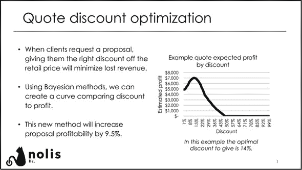
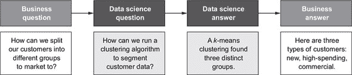
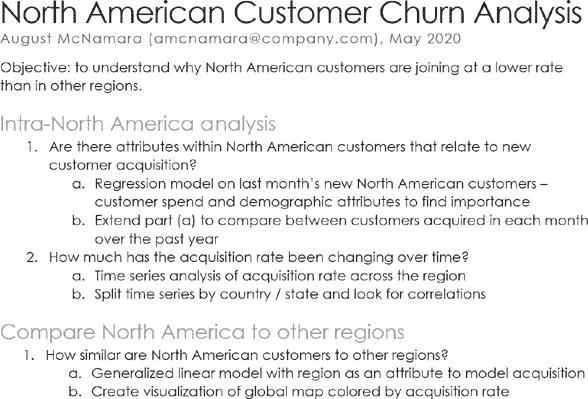
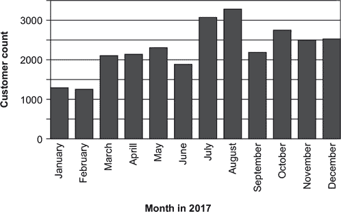
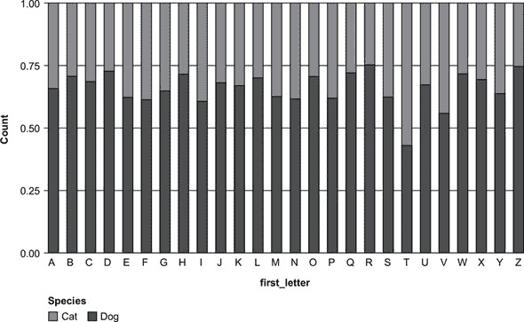
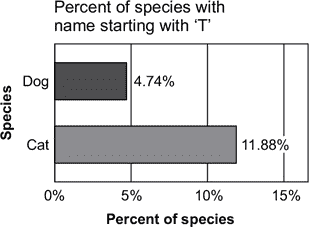
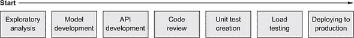

## 第三部分。适应数据科学

开始你的第一份数据科学工作是一项相当大的成就，但这只是你数据科学职业生涯的开始。作为数据科学家在公司工作与作为爱好或课程的一部分进行数据科学工作有很大不同。你可能需要掌握各种其他概念，从公司礼仪到将代码正确部署到生产中的正确方法。你对这个角色期望与实际工作之间的巨大差异可能会让你感到震惊。本书的这一部分旨在提供一个舒适的缓冲区，以减轻这种冲击。通过阅读这部分，你将了解数据科学工作中的期望，并更好地为出色地完成工作做好准备。

第九章讲述了工作的前几个月，从最初的几天你可能感到完全迷茫，到随着你对角色、同事和数据的了解而逐渐适应。第十章通过在开始时制定和执行计划，提供了一份创建良好分析（大多数数据科学角色的大部分）的指南。第十一章讨论了将机器学习模型投入生产，介绍了对于更基于工程的数据科学角色至关重要的概念，如单元测试。第十二章深入探讨了与利益相关者合作这一极其相关的工作任务，这通常是数据科学工作中人们最难以应对的部分。

## 第九章。工作的前几个月

*本章涵盖*

+   作为数据科学家，你前几周可以期待什么

+   如何通过建立关系和提问来提高生产力

+   如果你处于不良的工作环境中，应该怎么做

在本章中，我们将向您介绍您在前几个月可以期待什么，以及如何利用这些时间为自己设定成功的基础。这些月份将对工作的进展产生巨大影响；这是你建立一套系统和支持网络的机会，这将使你能够成功。尽管每个数据科学工作都不同，但一些广泛的模式和原则适用于任何工作。

当你开始工作时，你本能地想要尽可能多地完成任务。抵制这种本能。你需要确保你不仅完成了任务，而且是以正确的方式完成的。当你开始工作时，询问如何做某事是最容易的时候，因为你不需要了解你新公司中的流程。经理们有时会忘记你没有你前任可能拥有的制度知识，所以你可能被分配去做对你来说没有意义的事情。你可能能够通过欺骗的方式完成前几项任务，但通过早期提问并了解如何处理你的工作流程，你会得到更好的服务。

### 9.1. 第一个月

你在一家公司的前一个月与在另一类组织的前一个月将看起来非常不同。大型和小型公司对入职的态度几乎完全相反。图 9.1 比较了你可能期望在两家公司的情况：一家拥有大量数据科学家的巨型公司，以及一家没有或几乎没有数据科学团队的公司。（在第二章中，这些例子分别是 MTC 和 Seg-Metra。）这两个例子突出了光谱的两端，但你所工作的公司可能位于两者之间。

##### 图 9.1\. 在大型组织的入职就像通过一条生产线，而小型公司则更加随意。（来自 Twemoji 项目的 Twitter 表情符号）

#### 9.1.1\. 大型组织的入职：一台运转良好的机器

你是本周开始工作的几十个人之一。在上周，你收到了一封电子邮件，告诉你去哪里、什么时候到达以及需要携带什么。现在，你开始了一个正式的多日入职流程，与来自不同部门的同事一起。你被发放了笔记本电脑，并开始设置它。你听取了关于公司文化、人力资源政策和公司组织结构的介绍。一切运行得像钟表一样精准；公司之前已经成功入职了成千上万的员工。

在数据科学方面，你将得到帮助来设置你的编码环境。很可能会有一份清单或详尽的文档，列出了你需要完成的所有步骤以获取数据访问权限。同时，还有一个中心存储库，包含旧报告和数据文档，供你阅读和吸收。没有人期望你立刻就能做出很多贡献；尽管你的同事很高兴你能加入团队，但他们知道你需要时间来适应。你将被期望花几周时间完成所有培训，并获得对系统的访问批准。你可能觉得这个过程太慢，难以感到有成效，但在这个环境中，缓慢的开始是自然的。

如果你被分配了一项待办事项列表或任务，你应该认真对待，但更多地关注过程而不是结果。成熟的数据科学团队通常有自己的独特之处，你需要去适应。在这个阶段提问不仅好，而且对于你以后的工作能力至关重要。前几个月是你了解之前的工作内容，了解同事节奏的机会。

#### 9.1.2\. 小公司的入职：什么是入职？

“哦，你今天开始？”如果你加入了一个小型初创公司，不要惊讶如果一切都没有准备好，包括你的笔记本电脑。你可能需要自己弄清楚如何访问数据。当你进入时，可能会发现数据并没有很好地针对你的工作进行了优化，在一个包含 10 万行的小表上执行 SQL 查询需要六分钟才能完成。了解公司的入职培训可能需要几周时间，如果有的话，因为可能一周内开始工作的人数不足以频繁地举办这些会议。

目前还没有关于数据科学的标准可以谈论。没有人会告诉你应该使用哪种编程语言，或者如何去接近和构建一个分析。然而，你将被要求迅速开始获得结果。与大型组织不同，你不必担心无法产生生产力；你将立即被要求这样做。但你确实需要担心的是，你可能会无意中做错事情，而没有人会告诉你，几个月后发现你的（错误）工作已经被依赖。这就是为什么在你不具备新手的退路之前，仍然迫切需要提问并努力站稳脚跟。从危机到危机会迅速让你筋疲力尽，所以努力建立自己的流程，这将使你能够长期成功。

#### 9.1.3\. 理解和设定期望

在你最初的几周里，你可以做的一件最重要的事情是与你的经理开会，讨论优先事项。这次会议很重要，因为它让你了解你应在工作中努力实现的目标。在一些数据科学工作中，优先事项是为特定的利益相关者提供分析，以帮助增长业务的某个部分。在其他数据科学工作中，目标是创建高性能的网站模型。在某些工作中，这两个目标可能都适用，也可能都不适用。

你可能会觉得你应该已经从职位发布和面试过程中知道了工作期望。尽管这有时是正确的，但在面试过程和开始工作之间可能会发生很多变化。面试官可能没有与你相同的进度，或者在你加入之前，组织可能已经发生了变化。通过尽早与你的经理交谈，你将获得最新的信息，并有时间进行讨论。

理想情况下，你的经理对你将要做的事情有一个愿景，但愿意听取你的优先事项和优势。一起，你们想要定义工作中的成功意味着什么。通常，你的成功与让你的团队和/或经理成功紧密相连；如果数据科学团队的成员没有共同努力实现同一个目标，那么相互支持可能会很困难。为了定义你自己的成功，你需要了解团队试图解决的问题以及绩效是如何评估的。你将通过进行实验来提高转化率，从而帮助产生更多收入，还是将创建一个机器学习模型来帮助客服代表预测客户的关注点，目标是减少每个请求的平均处理时间？

绩效目标通常并不意味着“创建一个 99%准确率的机器学习模型”或“在你的分析中使用最新的统计模型”。这些工具帮助你解决问题；它们本身不是目标。如果你的模型和分析处理的是人们不关心的问题，那么它们基本上是无用的。认为开发最高性能的模型是目标是那些进入第一份数据科学工作的人中常见的误解。这个误解之所以常见，是因为许多学术研究和教育课程涵盖了制作准确模型的各种方法。然而，最终，对于大多数数据科学工作来说，拥有高度准确的模型并不足以成功。模型的有用性、洞察力水平和可维护性通常更为重要。（第十章和第十一章更详细地讨论了这些观点。）

在你开始新工作的时候，你无法知道公司对工作职责的期望是什么。有些公司重视团队合作；你可能需要同时处理几个项目，但需要在接到通知的瞬间放下手中的工作去帮助同事。其他公司则要求你定期交付成果，忽略电子邮件或 Slack 消息以完成项目是可以接受的。了解你是否达到期望的方法是与直接上司定期开会。在大多数公司，你将每周进行一次一对一的会议，以便讨论你正在处理的工作或任何问题。这些会议的存在是为了让你了解你是否把时间花在了对老板来说重要的事情上。当你可以得到明确的反馈时，为什么还要猜测期望是什么？以短期块状思考将帮助你确保在大型绩效评估来临时，你走在正确的轨道上。

| |
| --- |

**为成功做好准备**

除非你在一个非常小的公司，否则将有一个正式的绩效评估流程，所以一定要询问这个流程包含哪些内容以及何时进行。一种常见的做法是每六个月进行一次评估，可能伴随着薪资增长和晋升。许多公司将这种评估作为 360 度评估过程，你不仅会从你的经理那里得到直接反馈，还会从你的同事那里得到反馈。如果情况是这样，找出你是否可以选择同事，或者你的经理选择他们，这样你就可以了解你的最重要的利益相关者是谁。

更成熟的数据科学团队可能有一个矩阵，显示你将被评估的领域以及在每个不同资历水平上对每个领域的期望。例如，一个领域可能是技术专长。初级数据科学家可能只需要具备基础知识并展示他们在学习；中级数据科学家可能有一个专长领域；而资深数据科学家可能是公司在某个领域（如 A/B 测试或编写大数据作业）的首选人员。如果不存在这样的矩阵，看看你是否可以和你的经理一起提出几个领域。

无论系统如何，都要和你的经理制定一个计划，在你第一个三个月结束时进行一次评估，如果这不是常规做法。这次评估将帮助你确保你和你的经理意见一致，提供更新，并规划你接下来的前六个月和一年。

定义成功的目的是不是你需要在你的前几个月里在每个领域都表现出色。事实上，大多数公司不会对在该公司工作不到六个月的人进行正式的绩效评估，因为大部分时间都花在了入门阶段。相反，定义成功是确保你在了解你的角色并开始工作时，带着大局观去行动。

| |
| --- |

#### 9.1.4. 了解你的数据

当然，你也需要了解数据科学的部分。如果你的公司已经从事数据科学有一段时间了，一个很好的开始是阅读员工撰写的报告。报告不仅会告诉你公司保留的数据类型（并给你提供关键见解），还会告诉你应该如何沟通你的结果以及语气和风格。数据科学家的大部分工作是将信息传达给非技术同事，通过阅读报告，你会对那些同事的非技术程度有一个感觉。看看作者如何简化或复杂化某些概念，这样你在撰写自己的报告时就不太可能过度或不足解释。

然后，你需要了解数据存储的位置并获得访问权限。获得这种访问权限包括知道哪个表包含你想要的数据，也许还知道哪个数据系统拥有它。可能最常访问的数据生活在 SQL 数据库中，但两年前的活动数据生活在 HDFS（Hadoop 分布式文件系统）中，你需要使用另一种语言来访问。

仔细审视你将定期处理的数据，但要以开放的心态进入。一些表格可能有文档（可能是与数据打包在一起，或者是在关于数据的报告中）解释潜在的质量问题或古怪之处。首先阅读这些文档，因为它们会防止你调查那些后来证明已经被解决的问题的“神秘”问题。然后查看几行数据和汇总统计信息。这些信息可以帮助你避免“陷阱”，比如发现某些订阅将在未来开始，或者某个列经常有缺失值。当你发现未记录的惊喜时，通常最好的方法是向该表格的专家咨询。如果你们公司足够大，那个人可能是一位数据科学家，或者是一位收集数据的人。你可能会发现惊喜是一个需要修复的真实问题，或者它可能最终证明是预期的。例如，未来开始的订阅可能是那些被暂停并设定在那天重新启动的。或者，你在今年五月份发现的去年新年促销活动的优惠券可能是因为支持团队在五月份发放的。

一些公司在将用于测试的数据与真实数据分开方面做得比其他公司好，尽管其他人没有多想就将数据合并在一起。在后一种情况下，你想要四处询问是否应该排除某些订单或由测试账户或特殊商业合作伙伴产生的活动。同样，一些数据集包括具有截然不同行为的用户。例如，美国航空公司曾经提供一种包括同伴票的终身通行证。拥有通行证的人之一为陌生人、宠物或他的小提琴使用了同伴票，并且可能一天内多次飞行。虽然你可能没有这么极端的人，但新成立的企业提供后来看起来很愚蠢的优惠（如 100 美元十年的访问权限）并不罕见，并且可能需要在你的分析中考虑这些优惠。

在整个调查数据的过程中，你正在了解你的数据整体处于什么状态。如果你在一家较小的公司，你可能会发现你需要与工程师合作收集更多数据，这样整体数据才能变得有用。如果你在一家较大的公司，你将需要解读数十个表格，以查看你想要的东西是否存在。也许你正在寻找跨越 12 个数据库的具有“订单”列的表格。理想情况下，应该有关于核心业务指标（如交易或订阅）的详细记录、维护良好的表格。但其他不那么重要的数据集可能不会是这样，如果你打算专注于其中一个不太详细记录的领域，你应该尝试了解更多信息。

确保你了解数据是如何到达你的手中的。如果你正在处理像网站数据这样的东西，它很可能会通过多个系统从网站传输到你可以使用的数据库。这些系统中的每一个都可能以某种方式改变数据。当数据收集突然停止时，你想要知道在哪里尝试找到问题（而不是对此感到恐慌）。但是有些地方的数据是人们手动输入的，比如医院里的医生或调查结果。在这些情况下，你不必太担心管道，而更多的是要理解数据的许多属性以及人类可能输入错误的地方。几乎在任何地方，你都会不得不处理一些数据杂乱。

在你继续前进的过程中，尝试写下数据中的任何“陷阱”，并制作一个映射，显示一切所在的位置。在工作的过程中很难记住这些事实，而且许多公司都没有一个很好的文档或数据发现系统。正如注释代码有助于你未来的自己和他人理解其目的一样，记录数据提供了巨大的回报。尽管将这种文档保存在你的笔记本电脑上是可以的，但最好的做法是将它存储在一个公司中每个人都可以访问的地方。你将帮助未来的新员工，甚至那些不熟悉该特定领域的公司内的当前数据科学家。

| |
| --- |

**Elin Farnell：从学术界到工业界的思考**

在学术界担任数学家八年之后，当我意识到我最看重的我的工作的一些方面正是工业界数据科学职位的核心时，我开始考虑转向工业界。我的两个研究项目是在国防部和国防能源部的资助下与一家工程公司合作的。我喜欢这些项目的原因是我们研究小组得以解决有趣的数学问题，同时知道我们所开发的内容将用于解决现实世界中的问题。我也欣赏有机会学习新的数学内容以解决问题，并与跨学科团队合作。在我从学术界转向工业界的最近一次转变中，我的新职业道路的某些方面与我的先前经验形成鲜明对比：

+   ***广度与深度权衡—*** 在学术界，对于早期职业研究人员来说，一个首要任务通常是建立一个以深度、狭窄子领域为中心的研究计划。另一方面，在工业界，目标通常是解决广泛的问题，这意味着了解和利用你领域内广泛的一系列工具。这两种环境都可以以不同的方式带来回报。这种广度与深度权衡在学术界的表现程度取决于机构和研究领域，或者在工业界的团队和项目焦点。你的个人偏好在这个广度与深度谱上的位置可以帮助你评估各种工作机会。

+   ***自主性—*** 在学术界，你在选择要专注的研究项目方面拥有很大的自主性。在工业界，人们期望你解决雇主希望你解决的问题（通常在解决问题的方法上有很大的灵活性）。正如我在引言段落中提到的，这种自上而下的问题定义的好处是，它伴随着你所做的工作将对现实世界产生积极影响的认知。还应注意的是，工业界有增加自主性的机制；许多职位允许数据科学家提出未来工作的新领域，内部或外部的资助工作也可以为新项目开辟时间和资源。

+   ***工作与生活平衡—*** 从那些在两个世界都工作过的人以及我到目前为止的个人经验来看，我认为在工业界工作与生活平衡通常更好。在学术界，通常很难设定界限，而且很自然地，你会在每个晚上和周末把工作带回家。虽然在工业界，超出标准工作时间的工作也很常见，但它更多地是由截止日期驱动的，并且往往分阶段进行。你所发现的工作与生活平衡极其依赖于特定机构或公司的文化，以及你个人如何参与和贡献这种文化。我认识在两种环境中都发现管理困难的人，也认识在两种环境中都成功找到健康平衡的人。

### 9.2\. 变得高效

最终，你应该让你的经理看起来很好，减轻他们的工作量，但在开始时，你会使事情变得更难，这是预期的。达到完全高效需要比你想象的更长的时间。在这个时候感到沮丧是正常的，但请记住，你正在处理大量来自新环境的认知负荷。你试图了解（可能未明说的）关于人们午餐时间多长、工作时间是什么、使用哪种沟通方式、是否每个人都离开办公桌时关闭笔记本电脑等等的规范。除此之外，你还有一个整个数据系统需要了解。

需要强调的是，认为你必须快速且尽早证明自己的假设是一个容易犯的错误，例如“我需要更快地完成所有事情，否则他们会怀疑为什么雇佣我。”这是一个冒牌者综合症（第八章）的例子。除非你在一个真正功能失调的公司，否则它期望你有一些适应期。与其快速证明自己，不如专注于在更长的时间内（数月而非数周）定位自己以提供价值。一开始，你可能会向公司提出更多要求（“我能获得这个权限吗？为什么这个查询这么慢？”）而不是你给出的回报（以报告、分析和模型的形式）。

话虽如此，你仍然可以在早期提供一些价值。关注简单且完全描述性的问题，例如“我们客户的规模分布是怎样的？”或“我们每周有多少用户是活跃的？”在这个过程中，你会熟悉公司的数据，也会发现一些等待的陷阱。在与经理的会面中，展示一些你的正在进行中的工作，以便你可以看到你是否正在正确的方向上。投入大量时间却发现自己在回答错误的问题，使用老板讨厌的方法，或者使用错误的数据源，这是令人沮丧的。

关注简单的问题还可以防止你在试图回答一个复杂的问题而没有先学习所有数据细节的情况下得出错误的结论。这种情况可能具有挑战性，因为如果你的利益相关者对数据科学是新手，他们可能会问一些像“你能预测哪些销售交易会成交吗？”或“我们如何最大化用户保留率？”这样的问题。但正如我们将在第十二章中讨论的，作为数据科学家，你的一个工作就是深入挖掘业务问题，找到其背后的数据问题。如果人们对基本事实（例如，有多少用户进行了第二次购买或有多少人点击了广告）不了解或存在误解，他们就不会提出正确的问题。

两种策略可以帮助你更快地变得高效：提问和建立关系。提问有助于你更快地了解你的工作细节。建立关系使你能够理解你在组织中的角色背景。

#### 9.2.1\. 提问

在你的职业生涯中，最大的阻碍之一就是害怕提问或说“我不知道”。正如我们之前所说，数据科学是一个如此庞大的领域，没有人知道一切，甚至不知道 20%！而且你也不可能知道你公司数据的所有复杂性。你的经理更愿意你提问并占用几分钟别人的时间，而不是在原地打转几天。一个有用的问题可以是任何技术问题（例如，“我们在 A/B 测试中检测收入变化时使用哪种统计测试？”）或者业务问题（例如，“哪个团队负责这个产品？”）。

话虽如此，并不是所有问题都是平等的。以下是一些提出更好问题的建议：

+   *尝试观察公司的问题文化来学习。* 人们是在现场、Slack 频道、论坛还是通过电子邮件提问？选择正确的渠道意味着你不太可能打扰到别人。你还可以向你的经理提出关于如何提问的元问题。

+   *表现出你的主动性是好的。* 你可以说“我研究了这个问题，并找到了这三点”或者“这听起来像 X。是吗？”通过自己做一些研究，你可能能够自己回答问题，并且你将能够以更好的理解提出问题。

+   *当你能快速找到答案时，不要提问。* 除非你在与某人一起工作或讨论问题时提到这个话题，否则你想要避免提出那些在谷歌的第一个 Stack Overflow 结果就能找到答案的问题（例如，“在 R 中，向量和列表有什么区别？”）。

+   *找到专家并考虑他们的时间。* 虽然你的一些问题可能是通用的，但你可能也会有非常技术性的问题。找出谁是各种统计或编程方法的专家是很重要的，因为这些人是你通常需要从他们那里获得答案的人。你不希望成为这类人的负担（或任何人），所以如果你意识到你对某个人有很多问题，试着安排与他们见面。如果他们有几个时间限制的会议，而不是每隔几分钟就提问，人们不太可能感到被逼迫。了解那个人的风格也有帮助。公司里有些人有支持他人的角色，但如果那个人还需要有交付成果，看看他们是否有日历上标出某些他们无法联系的时间，并尊重这些时间。

+   *避免以提问的方式表达批评，*例如，“你为什么用这种方式编写这个请求，而不是我在本科时学到的明显更好的方式？”试着真正理解事情为什么会这样做。如果公司已经存在了一段时间，那么会有很多技术债务。例如，如果一个大型公司有物理服务器，将那些数据迁移到云上可能需要几十个工程师超过半年的工作。当人们问“我们为什么不直接做 X？这很简单，可以节省我们很多时间”时，他们通常假设其他人不理解问题或者觉得它很紧急。但它们不这么做的原因可能是因为你不知道的事情，比如法律限制。

+   *与另一个人合作。*一种很好的学习方式是与他人配对。你不仅可以提问并得到答案，还可以看到人们是如何找到这些答案的。对于技术问题，与某人配对也是一种了解他们的编码环境并学习新技术的途径。即使你的问题是如何获取数据，你也可以了解这些数据在哪个表中，他们是如何知道哪个表的，也许还有一些编码技巧。你的最终目标是尽可能多地通过了解在哪里查找来自己回答问题。

+   *列一个清单。*最后，如果你有一些不需要立即回答的问题，试着保持一个可能有用知识的清单，比如数据更新的频率，查询的大小限制，以及某些数据在本地服务器上可以追溯到多远。然后与你的导师或经理一起讨论这些事项。这种方法可以防止你一次又一次地打扰某人，如果不小心，这可能会变得很烦人。

#### 9.2.2\. 建立关系

在你新的工作环境中感到舒适的一个重要部分是建立支持网络。有些人比其他人更容易做到这一点，但你要确保你与人们进行一些非技术性的交谈。在大多数情况下，这意味着与之前从未交谈过的人安排会议，以便了解他们及其工作。这段时间并没有浪费；如果你知道的不只是名字和职位，那么这让你和你的同事在相互依赖时感到更加舒适。

接触你认识的人可能会感到有些令人畏惧，但你可以利用你的问题作为与某人开始对话的方式。人们喜欢帮助他人并感到自己知识渊博，所以不要害怕在礼貌友好的提问中使用问题。当你认识了几个人，即使是最大的办公室也会显得不那么令人生畏。向将与你密切合作的人发消息询问是否可以安排一个 30 分钟的会议来相互了解也是正常的。如果你在一个大办公室工作，请你的经理列出你应该认识的人。

在任何规模的办公室中，了解谁可以回答特定问题都是一件好事。可能有人是公司 SQL 方面的最佳人选，而另一个人可能负责实验系统。当你面临技术难题时，知道该找谁求助非常有帮助，而那个人通常不是你的经理。你至少也应该向你的跳级上司自我介绍——不是为了让你说你上司的坏话，而是因为让自己被这个人认识，当他们在与你的上司讨论你时会更容易。

类似地，你应该尝试结识你将要与之共事的所有利益相关者。如果数据科学团队人数少于十人，尽量与他们每个人单独见面。如果你将与数据工程师或其他数据人员合作，与他们交谈。这些会议可以是非正式的，但对你来说，重要的是不要仅仅作为一个电子邮件签名存在。即使你主要远程工作，也尽量使用视频会议系统，这样人们可以看到你的脸。

在正式会议和社交机会，如午餐期间，都要多听。结识那些在数据相关领域工作的人（这可能是从工程到金融，再到销售运营和市场营销分析等一切领域），了解他们目前的工作方式。不要急于发表“我能做得更好”这样的声明，也不要过早做出承诺，比如“我们将为你建立一个机器学习平台来做这件事。”只需专注于收集信息和思想。而且别忘了，事情不总是和工作有关。了解他们的个人生活也很不错，无论是询问他们的周末计划、最喜欢的电视剧还是爱好。

最后一点建议：和办公室经理交朋友。办公室经理控制着许多能让你的一天变得更好的事情：零食、午餐订单、洗手间里有什么类型的护手霜等等。他们还拥有最艰难、最不受感激的工作之一，所以确保他们感到被感激。

| |
| --- |

**导师和赞助**

“寻找导师”是职业建议中最常见的一条，但它可能令人沮丧，难以付诸行动。确实，拥有一个导师——一个能为你提供职业建议的人——可以帮助你解决棘手的问题并做出更好的决定。但与学习编程或提高沟通技巧不同，获得导师的过程并不涉及你可以参加的课程或可以阅读的书籍。那么，你该如何找到一位导师呢？

幸运的是，导师关系不一定是长期的关系。安吉拉·巴萨（我们在第十六章中采访了她，链接）列出了一群愿意回答问题并指导数据科学新手的[数据助手网站](http://datahelpers.org)。导师可能不是你可以随时打电话寻求关于每个职业困境的人，但你可能会找到一个能帮助你解决特定问题的人，比如练习行为面试或制作你的第一个 R 包。

有一类人甚至可以对你的职业生涯产生更大的影响：赞助者。*赞助者*是那些给人机会的人，无论是通过资助他们的项目、为他们争取晋升、向他们介绍重要人物，还是确保他们被分配到有助于他们成长的有挑战性的项目。与导师相比，你需要向赞助者展示你将如何利用他们提供的机会。例如，如果有人推荐你在会议上发言，而你从未回应组织者或给出明显没有准备好的演讲，你的行为会反映出推荐者的不佳。你不必之前做过同样的事情，但如果你能展示你做过类似的事情（例如，发表过聚会演讲），并且在与赞助者的沟通中反应迅速、礼貌，你就可以建立他们对你的信心，相信你会把工作做好。

如果你希望某人成为长期的导师或赞助者，要让他们了解你如何遵循他们的建议或利用他们帮助你的机会。许多人之所以成为导师或赞助者，是因为他们想帮助他人，听到你从中受益的消息对他们来说是一种满足。而且，如果你除了需要东西时从不与他们沟通，他们可能会觉得你只是在利用他们，而没有人愿意这样。

许多关于赞助和指导的文章都是关于在公司内寻找那些人，这对于在大型组织中工作的人来说尤为重要。但是，数据科学家经常每隔几年就换工作，数据科学社区有足够的小子领域，你可以开始建立积极的声誉，并找到公司外的赞助者和导师，他们会在你换多份工作时一直支持你。

### 9.3. 如果你是最初的数据科学家

到目前为止本章的所有内容都适用于任何数据科学家职位的最初几个月，但成为组织中第一个数据科学家会带来自己独特的一套挑战。鉴于这个领域的新颖性和许多小公司缺乏数据科学家的情况，成为第一个并不罕见。出于这些原因，作为公司第一个数据科学家，你在开始时应该特别做好准备。

当你开始新的职位时，将完全没有先例。没有人决定是否使用 Python、R 或其他编程语言。没有人想出如何管理工作。是否应该使用敏捷等软件开发实践来决定要做什么工作，或者你应该随心所欲地做任何你想做的事情？代码应该如何管理？是否应该购买 GitHub 专业许可证或使用 Microsoft TFS 服务器，或者你可以在笔记本电脑上不备份地将所有文件保存在 My Documents 文件夹中？

因为没有先例，你做的每一件事都将隐含地成为先例。例如，如果你碰巧喜欢用晦涩的编程语言 F#来做工作，你就是在强迫下一个数据科学家去学习 F#。对你来说，最好的做法是做出对未来的团队有利的决定，这可能意味着使用比你最喜欢的编程语言更常见的编程语言。这种方法必须与过度关注未来可能对现在造成严重损害的事实相平衡。如果你花了三个月时间设置一个漂亮的管道，以便自动与其他数据科学家共享报告，但五年内都没有雇佣第二个数据科学家，那么这项工作就是徒劳的。每天，无论是直接还是间接，你都会做出具有重大影响的决策。

除了要自己弄清楚角色外，你还得向组织推销数据科学。因为公司之前没有数据科学家，大多数人不会理解你为什么在那里。人们越快理解你的角色，就越有可能想要与你合作并保留数据科学家的职位。这些对话也是关于管理期望的。正如我们之前讨论过的，有些人认为数据科学基本上就是魔法，他们认为他们的第一个数据科学家可以立即解决公司的一些最大问题。你需要设定关于（a）数据科学能够做什么以及（b）这些目标可以多快达到的切实可行的期望。因此，你的工作将需要你不断地向人们解释数据科学的一般情况，以及你具体能做些什么来帮助业务。如果你是团队中的第 20 个数据科学家，安静地坐在角落里工作几个月可能是可以接受的，但作为第一个数据科学家，你肯定不能这样做。

虽然成为第一个数据科学家的工作比其他职位要多得多，风险也更大，但它也有巨大的回报。通过做出技术决策，你可以选择更符合你意愿的事情。通过向组织推销数据科学，你可以获得更好的知名度和更大的影响力。随着数据科学团队的成长，你将有机会成为团队的负责人，这对职业发展大有裨益。

### 9.4. 当工作不是承诺的那样

进入数据科学工作并发现它与你预期的相去甚远可能会令人沮丧。经过数月的工作，你终于进入了这个领域，现在你可能不得不重新开始。更糟糕的是，你可能担心快速离职会在你的简历上留下糟糕的印象。这意味着你不得不投入一年时间吗？管理一个糟糕的环境和决定是否离职是具有挑战性的。在接下来的章节中，我们将讨论两个主要类别的问题：工作本身很糟糕，工作环境有毒。尽管没有灵丹妙药可以解决这些问题，但我们将探讨一些可能的缓解策略。

#### 9.4.1\. 工作本身很糟糕

首先，仔细审视你的期望。问题是否类似于“我的所有数据都没有清理！我仅仅在数据准备上就花了两天时间！数据工程师不可能立即修复所有问题！”这些问题将是每个数据科学角色的组成部分。即使是拥有数百名工程师的最大公司的数据科学家也会遇到这些问题；数据量如此之大，不可能全部都经过完美的审查。尽管核心表应该干净且文档齐全，但你很可能会在你的子领域中遇到需要改进或与他人合作收集的数据。

检查你的期望是否现实的另一种方法是与其他数据科学家进行交流。如果你获得了相关学位或参加了训练营，询问你的同龄人或校友网络中的人对你的工作环境有何看法。如果你还没有认识很多数据科学家，如果你在一个小镇或农村地区，尝试参加聚会或加入在线社区。（我们在第五章中深入讨论了这一主题。）如果你的公司中的其他数据科学家之前有数据科学工作，看看他们是否能给你一个这个工作与其他工作的比较想法。

另一种情况可能是工作单调乏味。你被雇佣来做的工作可能是预测，例如，但在实践中，你每个月只是按一下别人现有预测模型的重启按钮。在这种情况下，看看你能否在组织中开展一些副项目或自动化一些流程。如果工作无聊但并不耗时，利用这个机会做一些与数据科学相关的事情。继续通过副项目、撰写博客文章或参加在线课程来构建你的数据科学作品集。这些策略将帮助你为你的下一个角色定位。

最后，你甚至可以从糟糕的工作中学到东西。你能否调整你的工作，使其包含更多你可以从中学习的事情？你可以在哪些方面进行改进？也许你的同事不会帮助你学习如何编写更好的代码，但你能否了解在构建数据科学团队时容易犯的错误？在你公司里很可能有一些聪明且善良的人，那么是什么让工作变得糟糕？通过学习你不喜欢的东西，你将知道在下次求职时要注意什么，并更好地准备避免错误，如果你开始组建自己的数据科学团队的话。

#### 9.4.2. 工作环境有毒

第 9.4.1 节 讨论了一个不好但可以管理的情况。但如果你遇到的是真正有毒的工作环境怎么办？如果你的经理和利益相关者对预期完全不切实际，并威胁要解雇你，因为你没有在预测终身价值上取得进展，而他们没有相关数据？或者当你的答案不符合公司的期望时，你会受到惩罚？对于数据科学新手的公司可能期望你撒点数据科学魔法来解决公司的核心问题。他们可能会告诉你“建立一个模型来判断文本是否写得很好”——这是一个领域内没有人接近解决的问题。在这种情况下，你需要调整公司的期望，否则你可能会觉得自己一直表现不佳。在这种情况下为自己发声是困难的，但通常任何公司都有合理且聪明的人在工作。如果他们说，“如果你是一个更好的数据科学家，你就能做到这一点”，那是一个巨大的红旗。即使一个经验更丰富的数据科学家能够解决这个问题，公司也应该在设计和招聘这个角色时就认识到这一点。

可能问题在于人们和团队没有协作。他们可能不是在寻找可以提供帮助的地方，而是试图相互破坏。他们只关注如何取得进步，甚至可能将公司在成功视为零和游戏：如果你或你的团队做得好，他们的就是输。除了创造一个不健康的环境外，这种情况通常会导致大量工作浪费，因为你可能最终会重复别人的项目，因为他们不会与你分享他们的数据或学习成果。

问题可能根本与数据科学部分无关；环境可能存在性别歧视、种族歧视、恐同或其它敌意。你没有理由每天去上班都感到不舒服。即使你没有受到公开的敌意骚扰，在会议中被忽视，被使用错误的代词，或者被问“但你**真正**来自哪里？”所有这些都会累积起来。

不幸的是，解决这类问题通常需要高层领导的参与和每个人的积极参与。但工作场所的恶劣环境往往表明领导层不存在，甚至可能积极加剧问题。如果问题根源在于一个人，理想情况下，其他人会认识到这一点，这个人将被移除。但如果问题是普遍存在的，那么改变它可能几乎是不可能的，作为一个初级员工尝试改变它可能会迅速导致疲惫不堪。在这些情况下，你需要仔细思考是否需要离职。

#### 9.4.3. 决定离职

决定是否离职是一个非常个人化的决定。虽然没有人能给你一个简单的流程图，让你轻松地做出决定，但我们可以提供一些问题供你思考，以指导你的决定：

+   你是否有足够的储蓄，有一个有第二收入的伴侣可以支持你，或者在你没有其他工作的情况下可以向你借款的家庭成员？

+   你的工作是否影响了你的健康或工作之外的生活？

+   如果问题是工作上的，你是否已经与你的经理讨论过这些问题，并尝试解决它们？

+   是否有可能转换团队或角色——如果现在不行，那么在几个月内呢？

如果这些问题的答案让你觉得你需要离职，一个选择是立即开始寻找其他工作。但你可能担心简历上短暂的就业经历会看起来如何，或者你该如何向面试官解释。如果你只工作了几个星期，而且是从上一份工作直接过来的，考虑联系你的前经理。你的职位可能还没有被填补，如果你离开时留下了好印象，你可能能够回去。

如果你正在寻找新的工作，以下是一些在面试中谈论你短暂工作经历的小贴士：

+   ***等待面试官提出这个话题。*** 不要觉得你需要主动谈论它；这可能不是问题，尤其是因为公司显然对此感兴趣。（你已经到达了面试阶段！）

+   ***找出一些你可以谈论的积极经验和学习经历。*** 这些经验和教训可能是一个你参与的项目、对行业的接触，或者来自高级领导的指导。

+   ***当被问及为什么这么快就离开时，保持简短和中立。*** 你处于一个困难的情况，因为你想要诚实地说明你离开的原因，以及这不是你自己的过错，但如果你过于坦率，面试官可能会不公平地认为你难以共事。因此，你的最佳选择是给出一个模糊的“我的工作要求与我预期的不同，我无法利用我的技能和专业知识为公司带来利益”并就此打住。如果你对想要的工作环境有所了解，可以分享。也许你是公司第一位数据科学家，你意识到你想要成为更大团队的一部分。

如果你已经决定离开，查看第十五章以获取如何优雅地离开的信息，包括在你全职工作的同时寻找新工作，并以良好的方式离开。

但也许你不能离开，因为你的签证与你的工作场所挂钩，或者在你所在的小镇上，只有这家公司在做数据科学。如果你处于这种情况，这里有一些提示：

+   ***记住，你不是你的工作。*** 你不需要为公司做出的糟糕决定承担责任。除非你处于领导职位，否则你很可能对公司所做的事情几乎没有控制权。

+   ***尽量保持健康。*** 不要牺牲睡眠、锻炼以及与朋友和家人的时间。

+   ***与某人交谈。*** 可能那个人是你的伴侣、朋友或治疗师。他们可能会给你提供建议，但仅仅倾听你也会有所帮助。

+   ***考虑一下是否要报告个人骚扰。*** 如果你被某个人骚扰，考虑向人力资源部门报告他们。确保你记录下你的报告。不要亲自去人力资源部门；发送电子邮件并收到回复，以便你有这个过程的相关记录。最终，你可能想要指出对你说过的一些特定的事情，书面记录将会很有帮助。如果你在美国，如果公司没有采取行动，你可以向平等就业机会委员会提起诉讼。不幸的是，报告骚扰并非没有风险：尽管这样做是非法的，但公司会通过拖延员工的职业发展或甚至解雇他们来报复报告骚扰。即使你不想报告骚扰，也考虑记录下你经历的任何骚扰，以防你以后决定报告。

+   ***考虑一下是否可以跳出思维定势，考虑离开公司。*** 可能你觉得你不能离开，因为你唯一的选择是去一个不那么有威望的公司、获得一个较低的职位，或者暂时耗尽你的储蓄。但不要低估留在有毒环境中的负面影响：如果你可以做出短期牺牲来离开，从长远来看，离开可能是有价值的。

我们希望您永远不会遇到这种情况，但拥有一些“紧急情况破窗”的信息总归是方便的。请记住，在数据科学领域更换工作是很常见的（我们将在第十五章中进一步讨论），因此没有必要因为工作场所让您感到不舒服而留在那里。

### 9.5. Spotify 数据科学家 Jarvis Miller 的访谈

Jarvis Miller 在 Spotify 的个性化任务中担任数据科学家，专注于提高每位用户的收听体验。当这次采访进行时，他正在 BuzzFeed 担任数据科学家。他于 2018 年以统计学硕士学位毕业。

#### 你在第一份数据科学工作中遇到了哪些让你惊讶的事情？

让我惊讶的两件事是，我作为一个作家可以提升多少，以及我需要在不使用行话的情况下向业务解释我的数据科学贡献。我有一种想法，因为利益相关者一直与数据科学家合作，他们已经学会了理解这种语言，因此我实际上不需要改变解释事物的方式。我意识到这绝对不是事实，我无法简单地说，“我对这些数据进行了逻辑回归以进行分类……”在成为一个更好的作家方面，我开始在撰写报告时充实故事；提高我的数据讲故事能力；并以一种产品经理、设计师和完全不接触技术利益相关者都能理解的方式解释事物。

我来自学术界，在那里我觉得一切关乎你是否在一天结束时找到了结果；你是在截止日期前开始工作还是提前很久规划，这并不重要。在工业界，你有一个大的整体目标，但你需要找出如何将其分解成版本。你让第一个版本运行起来，发布它，了解它是否表现良好，然后在未来的季度中可能对其进行改进。我习惯于一直做到完成。但在这里，我必须学习如何优先考虑项目的各个部分，然后将其完成。我学会了记录我所做的工作以及下一版本中需要完成的工作；然后使其可共享，无论是通过将报告放入共享文件夹，还是制作一个应用程序，让人们可以使用我的工作并了解它应该做什么。

#### 你遇到了哪些问题？

发表意见是我真正感到困难的事情。当我开始的时候，我在做一个孤立的项目，我汇报的人在新泽西，而我自己在洛杉矶。如果我感到困惑，我不知道我是应该立即给他们发消息还是等到我们的会议。我知道我不想让阻碍我的工作的事情分散我的注意力，但我不确定什么时候某件事是阻碍。我认为这是数据科学家中一个普遍的问题，尤其是对于边缘化群体或从不同领域转换过来的人来说。他们可能觉得因为他们是新手或者不是专家，所以他们不能表达不满或者发表意见。如果我能回到过去，我会早点讨论我感到孤立以及我不确定在这个公司中沟通是如何进行的。

#### 你能告诉我们你第一个项目的情况吗？

其中一个项目是重新设计我们的 A/B 测试平台，这是一个非常广泛的问题。我开始的时候，先列出一个名单，与这些人交谈，了解他们在 BuzzFeed 的工作内容、工作方式以及 A/B 测试如何融入这个工作流程。然后我们讨论了具体的工具：他们不喜欢它什么，为什么，以及他们使用它时的工作流程？不幸的是，这导致了承担过多的问题。很多人提出了多个建议，我给了它们相同的权重，最终导致了 50 件我需要做的事情。但我的经理让我将这些建议分成必需品和加分项，包括为什么这些被优先考虑。他建议列出项目的整体目标，并根据它们对目标的贡献以及它们需要的时间来给想法加权。

#### 对于前几个月，你最大的建议会是什么？

记住，你被雇佣的原因：他们尊重你的观点，并且他们认为他们可以帮助你学习，同时也可以从你那里学到东西。如果你有意见，尽量让某人知道。如果你讨厌在大组里发言，也许可以给一个人发消息，和他们讨论一下，在你向更大的群体表达之前来回交换想法。

这不仅适用于工作的技术方面。对我来说，在我和经理的一对一会议的前几分钟，我不想立即跳入我已经做了什么。我想要几分钟时间进行轻松的交谈，以减轻压力并澄清我的思路。我知道这有助于我的生产力，我的公司希望我高效，所以我应该让他们知道。你的意见是被重视的，值得分享，尤其是如果你是关于你喜欢如何被对待或者你如何在这个角色中发挥最大效能并茁壮成长，因为他们不知道你像你自己一样了解你，你的高效将使每个人受益。

### 摘要

+   不要担心立即变得完全高效。相反，专注于建立关系、工具以及你对数据的理解，这将使你在长期内变得高效。

+   如果你处于一个糟糕的工作环境中，尽量努力争取控制权以减轻对健康和职业的影响。

## 第十章\. 制作有效的分析

*本章涵盖*

+   规划分析

+   思考代码、数据和项目结构

+   将分析结果交付给客户

本章是在关注决策科学和数据分析的数据科学家背景下编写的——这些人使用数据为业务提供想法和建议。尽管机器学习工程师在构建和部署模型之前也需要进行分析，但围绕利益相关者管理和精美可视化的一些内容不太相关。如果你是机器学习工程师并且正在阅读这本书，请不要担心；本章对你仍然非常有用，你将喜欢第十一章，它涵盖了将模型部署到生产中的内容。

许多数据科学工作的核心是制作*分析*：使用数据尝试解释业务状况或解决业务问题的简短文档。现代公司建立在报告和分析的基础上。做出决策的人如果没有数据支持他们的选择，会感到不舒服，而数据科学家是找到数据意义中最好的人之一。分析对于构建机器学习工具也很重要，因为在一个机器学习模型可以构建之前，需要理解数据集的上下文。制作一个能够将大量公司数据转化为简洁结果，从而阐明当前问题的分析是非常困难的，实际上是一门艺术。一个人如何能够期望自然地知道如何从包含数百万条历史信息的表格中找出有意义的数学关系，业务关心的是什么，以及如何弥合两者之间的差距呢？确定什么是数学上有意义的，业务关心的是什么，以及如何弥合两者之间的差距，不是你应该期望自然知道如何做的事情。

在本章中，我们将介绍如何构建分析的基础知识，以便你了解如何为公司提供有意义的分析。通过使用本章中的技能，你应该能够更快地在你数据科学职业生涯中成长。

究竟什么是分析？分析通常是一套 PowerPoint 演示文稿、PDF 或 Word 文件，或者 Excel 电子表格，可以与非数据科学家共享，包含从数据中得出的见解和展示这些见解的视觉化。图 10.1 是分析中可能找到的幻灯片的一个示例。分析通常需要一到四周的时间来完成，数据科学家需要收集数据，对其运行统计方法的代码，并制作最终结果。完成之后，代码直到几个月后分析必须重新运行，或者可能永远不会被再次触及。以下是一些分析的示例：

+   分析客户调查数据，以查看哪些产品满意度最高

+   查看订单来源地的数据，以挑选出新建工厂的位置

+   使用历史航空业数据来预测哪些城市需要更多通往它们的航线

##### 图 10.1。分析 PowerPoint 演示文稿的一个示例幻灯片

这些例子具有不同的技术复杂度；一些只需要总结和可视化数据，而另一些则需要优化方法或机器学习模型，但所有这些都能回答一个一次性的问题。

**报告与进行分析的区别**

报告和分析相似但不相同。*报告*是定期生成的东西，版本之间没有太多结构性的变化。例如，月度财务报告可能是一个大型 Excel 电子表格，每月更新新的数字。报告的目的是让人们了解指标是如何变化的。分析是一次性进行的，用于回答更深层次的问题。客户获取分析可能是在 R 上完成的工作，研究新客户如何购买产品，结果放入 PowerPoint 演示文稿中。报告通常充满数字和指标，而分析则侧重于提供单一的主要结果。大多数好的分析的特点也适用于好的报告，因此在本章中，我们使用分析一词来指代两者，除非明确说明否则。

那么，什么是一个好的分析？一个好的分析具有以下五个特点：

+   ***它回答了问题。*** 分析始于有人提出问题，因此为了使分析有意义，它需要提供答案。如果提出的问题是“这两个网站哪个导致更多客户购买产品？”，分析应该显示哪个网站导致更多销售。这个答案甚至可以是“我们没有足够的信息来告诉您”，但它必须是直接回答问题的。

+   ***它做得快。*** 对商业问题的回答将影响有截止日期的决定。如果分析花费的时间太长，决策将不会基于分析做出。一个常见的期望是分析将在一个月内完成。

+   ***它可以被分享。*** 分析需要被分享，不仅是要分析的人，还要分享给其他人。例如，如果分析涉及图表，图表不能仅仅存在于 R 或 Python 脚本中；它必须是一种人们可以理解的形式，比如 PowerPoint。

+   ***它是自包含的。*** 因为无法预测谁会看到分析结果，所以它需要独立理解。图表和表格必须有清晰的描述，坐标轴应该有标签，分析中的解释应该写下来，并且分析应尽可能避免引用其他工作。

+   ***可以重新访问。*** 大多数问题将来还会被再次提出。有时，回答这些问题意味着要再次做完全相同的工作，比如重新运行聚类。有时，你需要在其他地方使用这种方法，比如将输入数据从欧洲客户更改为亚洲客户。

这些特质汇总成一般主题“一个好的分析是帮助非数据科学家完成工作的东西。”

本章的其余部分按时间顺序组织，从分析初始请求开始，以提交的报告结束。尽管并非每个分析都会遵循这些步骤，但大多数都会（或应该会）。随着你对制作分析越来越熟悉，你可能倾向于跳过一些步骤，但那些捷径正是资深数据科学家犯错误的原因。

| |
| --- |

**不同类型数据科学家的分析**

根据你的数据科学家角色，你将进行分析的情况会有很大差异：

+   ***决策科学家——*** 对于这类数据科学家来说，制作分析是工作的核心功能。决策科学家不断深入数据以回答问题，并且这些问题需要传达给业务。分析是实现这一目标的关键工具。

+   ***机器学习工程师——*** 虽然机器学习工程师专注于创建和部署模型，但分析仍然是分享模型表现如何的有用工具。分析用于展示构建新模型的价值或模型随时间的变化。

+   ***分析师——*** 分析师，他们是专注于业务指标和 KPI 的数据科学家，通常发现自己要制作很多报告。他们为公司创建了一系列重复的数据，通常在 Excel、SQL、R 或 Python 中。尽管这些分析专家会制作分析，但他们需要比其他角色更多地考虑工作的可维护性，因为他们必须频繁地重复这些工作。

| |
| --- |

### 10.1. 请求

分析始于对回答一个业务问题的请求。来自业务不同部门的人或你的经理会向你提出类似的问题，比如“你能看看为什么 12 月份欧洲的 widget 销量低吗？”或者“我们的中小企业客户的行为是否与我们的大型客户不同？”根据提问者的技术专长水平，你可能得到一个定义不明确的要求（“为什么销量下降？”）或一个精确的要求（“哪些属性与较低的订单平均价值相关？”）。

分析是围绕业务问题构建的，但你不能在业务问题上进行数据科学。数据科学问题是诸如“你如何聚类这些数据点？”和“我们如何预测销售额？”之类的问题。数据科学家必须将那个业务问题转化为数据科学问题，回答数据科学问题，并给出业务答案。这项工作很棘手。理解数据科学问题和业务问题之间的关系需要结合对当前问题的经验以及理解不同统计方法的结果可能如何有用。这个从业务问题到数据科学问题问答再到最终回到业务答案的工作流程是由 Renee Teate 设计的，她也在本书的第十四章（[kindle_split_027.html#ch14]）中接受了采访。

图 10.2 展示了这个过程，图形化地展示了业务问题来自利益相关者，他们想知道如何针对不同客户进行市场营销。数据科学家必须弄清楚这个请求在数学意义上的含义——在这个例子中，是客户数据的聚类。当这个过程完成后，数据科学家有一个数据科学答案（例如一组聚类的数据点）。最后，数据科学家必须将这个答案转换成业务能够理解的东西，比如“新客户”或“高消费群体”这样的分组。

##### 图 10.2. 由 Renee Teate 设计的用数据科学回答业务问题的过程

在你开始查看数据和编写代码来解决数据科学问题之前，你必须做一些基础工作，以便最好地理解业务问题。你需要了解分析背景，以便最好地提供有用的东西。谁在请求进行这项分析，他们与团队的关系是什么？他们的动机是什么？他们是否有非常具体的问题想要得到解答，或者有一个模糊的、一般的问题，并希望数据可能对它有用？看起来你甚至可能拥有解决这个问题的数据吗？如果不是，需要什么才能获得它？提问不仅有助于你理解如何解决问题，还有助于你理解它将用于什么目的。许多数据科学家花费了数周时间进行数据分析，结果却发现根本不需要它，因为利益相关者只是“好奇”。

这些问题通常在与提出请求的人以及任何参与工作的人举行的 30 至 60 分钟的启动会议上得到解答。作为进行分析的人，你可能不是组织会议的人，但如果你的日程上似乎没有安排会议，那么安排一次会议是值得的。如果你之前还没有见过提出分析请求的人，这次会议是介绍自己和了解他们工作的好时机。

一个假设的基础知识示例可能如下：

+   ***谁请求分析？*** 小部件产品团队的 Julia 请求的。

+   ***动机是什么？*** 本月小部件销售额下降了 10%，业务团队不知道原因。

+   ***请求是什么？*** 团队希望使用数据来查看小部件销售额下降是否集中在国家的一个部分。

+   ***将做出什么决定？*** 决定是是否应该停止小部件产品的销售。

+   ***我们是否有所需的数据？*** 是的，分析需要客户订单的邮寄编码，这在订单数据库中是可用的。

知道你是否拥有能够合理回答问题的数据非常重要。你最不希望做的事情就是花几周时间进行数据分析，结果却发现没有任何东西可以用作成果。

在没有数据的情况下，一个例子可能如下：在一家零售公司，股东想知道每个客户下了多少订单，但由于客户用现金支付，无法使用现有数据来确定每个订单的制作者。在这种情况下，最好对所有相关人员坦诚，并告知他们他们所要求的内容是不可能的。其他人可能会提出使用数据的替代方法，这些方法可能足够接近你希望的结果，或者你可能需要解释为什么这些替代方案也不可行。如果可能的话，提出一个计划，以便将来能够获取所需的数据。在前面的例子中，一个忠诚度计划可以使订单与特定客户相关联，从而解决数据问题，尽管创建该计划需要时间。

其他问题，例如请求者是谁以及他们为什么提出请求，对于制定分析计划是有用的。

### 10.2. 分析计划

对于数据科学家来说，没有什么比直接深入数据来回答问题更有趣的了。让我们加载数据！分组！总结！拟合模型并绘制结果！不幸的是，由于有无限种总结和建模数据的方法，你可能会花几周时间与数据打交道，结果却发现你产生的任何东西都无法回答提出的商业问题。意识到你没有做任何相关的事情是最糟糕的。而且这种情况经常发生在数据科学家身上，尤其是那些还没有被烧过几次的初级数据科学家。

解决这个问题的方法之一是设置一个护栏，以确保你保持在正确的轨道上并从事相关的工作。分析计划就是这个护栏。其理念是在你开始查看数据之前，写下你计划用数据做的一切。然后，随着分析进程的推进，你记录下你完成了计划中的多少。当你完成了计划上的所有事项，你就完成了！你不仅有一种方法知道你是否偏离了计划，而且还有一个跟踪进度和自我监督的工具。你甚至可以在与经理的会议中使用它来讨论事情进展情况。

制定分析计划时，你希望计划中的工作是可以执行的。“按地区进行线性回归销售”是你可以编写代码来执行的事情，而“找出销售下降的原因”则不是你可以直接做的事情；它是做其他事情的结果。如果计划中的任务是可执行的，那么判断你是否在取得进展会很容易。它也会使分析工作更容易，因为你不必担心下一步要做什么。相反，你将能够查看分析计划并选择下一个要完成的任务。

对于制定你最初的几个分析计划，我们强烈建议使用以下模板：

+   ***顶部——*** 列出分析的标题、你是谁（以防分析将被与他人分享），以及分析的目标。

+   ***部分——*** 每个部分应该是分析中的一个大主题。每个部分内完成的分析工作应该是自包含的（不依赖于其他部分的工作），因此应该有可能让不同的人完成每个部分。每个部分都应该有一个任务列表。

+   ***一级列表项——*** 一级列表项应该是每个提出的问题。这个部分将帮助每个人记住你为什么要做那项具体工作，如果所有问题都得到了成功回答，那么主部分的题目应该被认为是已被理解。

+   ***二级列表项——*** 二级列表应包含实际要完成的任务，这些任务可以在工作过程中勾选。例如，这些任务可以是运行模型的类型，描述应该足够具体，以便在任何时候都能具体地说出工作是否已完成。

图 10.3 展示了一个分析计划的例子，在这种情况下是评估北美地区客户流失的原因。在顶部是标题、目标和数据科学家的联系信息，以防材料被传阅。计划的每个部分都涵盖分析的不同组成部分（例如，要么在北美进行分析，要么与其他地区进行比较）。子部分（编号）是分析中的问题，最低部分（字母编号）是要完成的特定任务。

##### 图 10.3。一个分析计划的例子

当你制定分析计划时，应与你的经理和提出请求的利益相关者分享。他们应该提出改进建议或批准这项工作。一个批准的分析计划为工作提供了一个达成共识的基础。如果你在分析后，利益相关者询问你为什么那样做，你可以参考分析计划和原始目标。

很可能在你进行分析的过程中，你会意识到你在分析计划中遗漏了一些重要内容，或者有一个你之前没有考虑过的新想法。这完全没问题；只需更新计划，并让利益相关者知道你正在做出更改。由于你有时间限制，你可能不得不从现有计划中删除一个不太重要的任务。但再次强调，分析计划是有用的，因为它围绕要删除的内容进行对话，而不是让你尝试完成不可能的大量工作。

### 10.3\. 进行分析

在分析计划获得批准后，你就可以开始进行实际的分析工作了！这项工作从导入数据开始，以便你可以对其进行操作和清理。然后你通过汇总、聚合、修改、可视化和建模数据来反复转换数据。当数据准备就绪时，你将这项工作传达给其他人。

在以下章节中，我们将简要介绍你在工作环境中进行数据分析时应注意的一些考虑因素。也有专门针对这个主题的整本书，也可以教你如何使用你选择的编程语言进行数据分析。

#### 10.3.1\. 导入和清理数据

在你能够处理分析计划中的问题之前，你需要将数据放在你可以操作的地方，并且以你可以使用的格式。这通常意味着能够将其加载到 R 或 Python 中，但也可能包括使用 SQL 或其他语言。几乎总是，这项任务会花费你比预期更长的时间。在这个过程中可能会出现许多惊喜。其中一些许多恐怖的事情包括

+   在你特定的集成开发环境（IDE）中连接公司数据库的问题

+   不正确的数据类型问题（例如，数字作为字符串）

+   奇怪的时间格式问题（例如，“年-日-月”而不是“年-月-日”）

+   需要格式化的数据（也许每个订单 ID 都以“ID-”开头，你需要将其删除）

+   数据中缺失的记录

更糟糕的是，这些工作对非技术人员来说看起来都没有生产力；你无法向利益相关者展示一个如何使数据库驱动程序工作的令人信服的图表，他们也不会理解字符串操作如何帮助他们解决业务问题。所以尽管这项任务很繁琐，你仍然希望尽快开始进行数据探索。

在处理导入和整理数据的过程中，考虑你有一个双重任务：尽可能少花时间在不需要的事情上，尽可能多花时间在将来有帮助的工作上。如果你有一列存储为字符串的日期，并且怀疑你永远不会需要这一列，那么不要浪费时间将其转换为正确的日期和时间格式。另一方面，如果你确实认为你需要这一列，那么请尽快完成这项工作，因为你希望为分析准备一套干净的数据。事先很难判断什么是有用的，但如果你发现自己花了很多时间在某个事情上，问问自己你是否真的需要它。

在导入和整理数据时，你可能会发现自己因为某个问题，比如连接数据库，而陷入困境长达数日。如果你发现自己处于这种情况，你有三个选择：(1)寻求帮助，(2)找到一种方法将问题完全避免，或者(3)继续尝试自己解决问题。如果你能这样做，选择(1)是很好的：一个资深人士可能能够快速找到解决方案，并且你可以从他们的做法中学习。选择(2)也很好；比如使用平面.csv 文件而不是数据库连接，这样你就可以开始分析，从而提供商业价值。选择(3)——不断尝试——是你应该尽量避免的。如果你在单个问题上花费了数日，你会看起来无法提供价值。如果你遇到无法克服的问题，与你的经理讨论应该怎么做；不要只是不断尝试并希望问题会自行解决。

在加载数据并格式化后，你可能会开始使用它，并发现奇怪的数据。“奇怪的数据”是指任何超出基本假设的数据。例如，如果你正在查看历史航空航班数据，并发现一些航班在起飞前降落，这将是奇怪的，因为通常飞机是先起飞的！其他奇怪之处可能包括从商店销售价格负数的商品到显示一个工厂生产的物品数量是另一个类似工厂的千倍以上的制造数据。这些类型的奇怪异常在现实世界的数据中经常出现，而且在你亲自查看数据之前，无法预测它们。

如果你发现自己处于一个有奇怪数据的情况，不要忽视它！最糟糕的事情就是假设数据是好的，然后在经过数周的分析工作后，发现数据并不好，你的工作就白费了。相反，与你的利益相关者或负责你使用的数据的人交谈，询问他们是否意识到这些奇怪之处。在许多情况下，他们已经知道这些情况，并建议你忽略它们。在航空数据示例中，你可能只需删除起飞前降落的航班数据。

如果最终发现这种奇怪现象是未知的并且可能危及分析，你需要调查如何挽救它。如果你要进行一个比较收入和成本的分析，并且奇怪的是，你的一半数据缺失了成本，你需要看看你是否可以仅使用现有的成本或仅使用收入来工作。从某种意义上说，这种方法变成了一种分析中的分析；你正在做一个迷你分析，看看原始分析是否甚至可行。

#### 10.3.2. 数据探索和建模

在分析的数据探索和建模部分，你一点一点地通过分析计划并尝试完成工作。以下各节提供了一个处理每个点的通用框架。

##### 使用通用的摘要和转换

大多数分析工作可以通过摘要和转换数据来完成。例如，“我们每个月有多少客户？”这样的问题可以通过获取客户数据，按月分组，然后计算每个月的独特客户数量来回答。这项技术不需要统计方法或机器学习模型——只需要转换。

很容易认为这并不是真正的数据科学，因为它不需要任何超出大量算术的东西，但通常正确地进行转换是非常有价值的。公司中的大多数其他人最初都没有访问数据，没有有效地进行转换的能力，或者不知道应该进行哪些转换。

根据数据，你可能想加入一些统计方法，比如找到不同百分位数水平上的值或计算标准差。

##### 可视化数据或创建摘要表格

在进行适当的转换后，创建可视化或摘要表格以更好地了解数据中正在发生的事情。继续前面的例子，如果你有每个月的客户数量，你可以创建一个条形图来查看它们是如何变化的。这个图可以让你很容易地看到数据中的模式，而不仅仅是将数据框打印到屏幕上。

图 10.4 展示了一个示例摘要可视化，显示了每个月的整体客户数量。通过这个图表，人们可以很容易地看到客户数量略有上升趋势。

##### 图 10.4. 一个示例摘要表格

你选择的实际可视化很大程度上取决于手头的数据。你可能想使用折线图、箱线图或许多其他选择之一。根据你试图理解的内容，你还可以创建数据表而不是图表。请参考本书本部分的资源部分，以获取可以帮助你为数据选择正确类型图表的资源。请注意，当你制作可视化时，你可能会意识到你需要改变转换步骤中的某些步骤。你可能会在步骤之间来回多次。

因为你会迭代可视化并持续转换数据，所以你必须平衡你删除平庸的以保持代码清洁的愿望和保存一切以防万一的愿望。最佳实践是尽可能多地保存，前提是（1）你在进行进一步更改后，旧代码不会出错，并且（2）你可以清楚地标明哪些结果是“好的”。避免在分析中保留无效的代码或大量被注释掉的代码区域；这些情况使代码维护变得极其困难。使用版本控制（如 git 和 GitHub）可以进一步增强这种方法；通过每次向分析添加新内容时持续提交，你将能够记录你所做的工作，并在代码突然出错时回滚代码。

##### 需要时创建模型

如果你发现数据中存在表明建模是个好主意的模式，那就去做吧！例如，可能需要对客户数量应用时间序列模型来预测下一年度的客户数量。在创建模型时，你将希望输出结果并可视化它们，以了解模型的准确性和有用性。你可能创建出比较预测结果与实际值的图表，或者展示诸如准确度得分和特征重要性值等指标。

如果你创建了可能用于分析之外的机器学习模型，例如可能被投入生产（第十一章[kindle_split_023.html#ch11]有所涉及），请确保你将构建模型的代码与一般分析工作隔离开。因为将来，你只想使用模型，你需要能够轻松地从制作一般可视化图表的代码中提取出那段代码。

##### 重复

你应该为分析计划的每个点完成这些步骤。在这些步骤中，你可能会有关于要分析的新想法，或者意识到你原本认为合理的问题实际上并不合理。这时，你应该调整你的分析计划并继续你的工作。

很可能不同的分析计划点之间是相关的，所以你在某个点使用的代码将在另一个点重复。投入精力构建你的分析计划，以便你可以重复运行相同的代码，并且计划的一部分更新可以即时推广到其他部分。你的目标是创建一套你可以维护的代码；你可以轻松修改它，而无需花费大量时间跟踪复杂的代码。

#### 10.3.3. 探索和建模的重要要点

数据探索和建模工作极其依赖于你试图解决的问题。你用于尝试聚类数据的数学和统计技术与你用于预测或尝试优化决策的技术大不相同。尽管如此，遵循一些广泛的指导方针可以在一个不错的分析和一个出色的分析之间产生差异。

##### 专注于回答问题

如在第 10.2 节讨论中所述，通过做不支持目标的工作来浪费时间是非常容易的。如果你正在分析客户订单以查看你是否可以预测一个客户永远不会回来，你可能会让一个神经网络模型工作得相当不错，然后花上几周时间调整超参数。如果利益相关者只想知道模型最初是否可行，那么调整超参数以使模型略微更有效率是没有帮助的。在超参数调整上花费的几周时间本可以用来做更相关的事情。

在进行分析时，保持专注于分析计划和回答商业提出的问题非常重要。这意味着不断地问自己“这相关吗？”这个问题应该是你每次制作图表或表格时都要考虑的。如果你发现自己反复认为你正在做的事情是相关的，那很好。在更可能的情况中，你偶尔会发现自己认为“这个图表（或表格）没有用”，你可能需要调整你的工作。首先，尝试停止你正在做的事情，以不同的方法来处理问题。如果你试图根据客户的消费来分组客户，尝试进行聚类。通过采取截然不同的方法，你更有可能成功，而不是仅仅稍微改变你正在做的事情。其次，与你的经理或项目利益相关者交谈；可能你正在使用的数据对于解决当前的问题并不有效。

在你进行分析的那几周里，你应该稳步建立一个真正相关且（理想情况下）遵循分析计划的成果集合。

##### 使用简单的方法而不是复杂的方法

复杂的方法是如此令人兴奋！为什么要在可以使用随机森林时使用线性回归？为什么要在可以使用神经网络时使用随机森林？这些方法已被证明比普通的回归或*k*-均值聚类表现更好，而且更有趣。所以当人们要求你用数据解决商业问题时，当然你应该提供尽可能最好的方法。

不幸的是，复杂的方法伴随着许多缺点，而这些缺点仅从关注其准确性是看不到的。当你进行数据分析时，目标不是获得最佳可能的准确度或预测；而是以业务人员能够理解的方式回答问题。这意味着你需要解释你得到的结果的原因。使用简单的线性回归，很容易提供每个特征对结果贡献的图表，而使用其他方法，描述模型如何产生结果可能非常困难，这使得业务人员更难相信你的结果。更复杂的方法在设置上也更加耗时；调整和运行神经网络需要一段时间，而线性回归则相对快速。

因此，当你进行数据分析时，尽可能选择简单的方法，无论是在模型中还是在转换和聚合中。例如，与其剪除一定比例的异常值，不如进行对数变换或取中位数而不是平均值。如果线性回归效果合理，就没有必要花费时间构建神经网络来略微提高准确度。尽可能坚持使用简单方法可以使结果更容易被其他人理解，也更容易为你自己辩护和调试。

##### 考虑探索性图表与共享图表

数据科学家选择可视化数据有两个不同的原因：用于探索和用于共享。当你制作探索性图表时，目的是帮助数据科学家理解数据中正在发生的事情。只要数据科学家能理解，一个复杂且标签不佳的图表是可以接受的。当你制作共享图表时，目标是让对数据不太了解的人能够得到数据科学家试图传达的具体观点。在这里，图表必须简单明了才能有效。在进行分析时，你应该使用大量的探索性图表，但这些图表不应用于共享。

考虑一个基于虚构数据的城市宠物名字的例子：一位数据科学家想要了解宠物名字开头的字母是否与宠物的种类（猫或狗）有关。数据科学家加载了数据并制作了这个可视化，显示了每个字母对应的以该字母开头的猫和狗的数量分布（图 10.5）。

##### 图 10.5\. 分析前清理的示例可视化

如果你仔细观察图 10.5，你会注意到 T 条上的猫的数量比狗的数量多得多——这对数据科学家来说是一个有意义的发现。然而，这个图表并不是你想要展示给利益相关者的；图表中有很多内容，乍一看并不清楚其目的。

图 10.6 展示了以不同、更易于分享的方式绘制相同的数据。在这个版本中，很明显，猫有 12%的几率拥有以 T 开头的名字，而狗只有 5%的几率。现在，这些相同的数据可以分享。

##### 图 10.6。与图 10.5 相同的数据，绘制以突出字母 T 的重要性

##### 持续准备分享

分析的结果可以采取不同的形式，选择哪种形式通常取决于目标受众。如果分析是要提交给商业人士，通常使用幻灯片或可编辑文档。PowerPoint 或 Word（或 Google Slides 或 Google Docs）是一个不错的选择，因为任何人都可以查看它（只要他们有 Microsoft Office 套件的前两者），并且它可以包含大量的图表、表格和文本描述。如果分析是针对技术人员的，您可以提供 Jupyter Notebook 或 R Markdown 输出 HTML 文件。这些方法很好，因为它们通常需要较少的工作来润色（也就是说，您不需要花费时间在幻灯片上对齐图表）。如果分析需要向财务人员提交大量数据表格，Excel 可能是最佳选择。当最终用户需要从结果中提取数字并对其进行进一步计算时，Excel 是一个伟大的工具。您应该在分析制作过程的早期就决定您期望提供哪种类型的输出，以避免后续的返工。

根据分析范围的大小，您需要定期与您正在为其进行分析的人沟通，并向他们展示您的工作。这种方法可以防止出现这种情况：您独自花费数周时间进行一项分析，而当交付的时候，利益相关者指出了一些使您所有工作无效的问题（例如，“您看了客户销售数据，但忘记了考虑退货。”）。在这种情况下，如果这项问题在开始时就已指出，您就能避免浪费大量工作。除了避免不良情况外，利益相关者通常可以通过建议可能的关注领域或尝试的方法来做出贡献。从某种意义上说，在整个分析过程中与利益相关者保持沟通类似于软件开发中的敏捷概念：持续改进工作，而不是发布一个巨大的软件版本。

与利益相关者进行频繁的检查是个好主意，但数据科学家往往忽视这一点。与某人进行检查的缺点是工作必须能够展示给非数据科学家；它必须达到足够的完善程度，以便展示时不尴尬。需要的东西包括带有清晰标签和意义的图表、错误最少的代码，以及关于正在发生的事情的基本故事。因此，数据科学家很容易认为“我会推迟分享我的工作，直到我把它完善，然后我会推迟完善它直到以后。”不要这样做！从长远来看，这几乎总是会导致更多的工作。通过持续保持一定的完善程度，以便你可以分享你的代码，你最终会得到一个更好的产品。

##### 单键运行

正如只运行一个脚本就可以加载数据并准备数据一样，你的分析应该只需要一键即可运行。在 Python 中，这意味着拥有一个 Jupyter Notebook，它可以自动加载数据并进行分析而不会出错。在 R 中，有一个 R Markdown 文件，它可以加载数据，进行分析，并输出 HTML 文件、Word 文档或 PowerPoint 演示文稿。

在进行分析时，你希望避免在脚本之外运行过多的代码或以错误的顺序运行脚本。这些做法使得当你重新运行整个脚本时，它更有可能出现错误。进行一些临时的编码是可以的，但请确保你可以无错误地重新运行你的文件。这种做法将帮助你保持你的结果可以持续与他人分享，并确保你在分析结束时花费更少的时间修复脚本。

### 10.4. 总结

根据分析的利益相关者，你的代码输出可能足以满足要求，或者你可能需要进一步工作并制作最终版本。如果需要经过精心打磨的最终版本，例如 PowerPoint 演示文稿，你可能需要在制作分析时进行最终级别的打磨，以确保遵循公司风格指南。最重要的是，你需要为最终文档构思一个叙述，以便未参与工作的人可以完全理解工作的结论、所做的工作以及为什么这样做。

构建这个叙述是制作良好最终文档的第一步。你打算讲述什么样的故事？你将如何介绍问题，解释你的工作如何提供解决方案（或没有提供），以及讨论下一步？有无数种方式可以构建一个叙述，但一种简单的方法是考虑你将如何向一个以前从未见过这项工作的人大声解释工作。考虑你要告诉他们的故事，并尝试通过你的文档讲述这个故事。反复问自己这些问题：“我所展示的内容是否会被我的观众理解？”和“我能做些什么来改进这个？”最终，你会达到一个你对自己的内容感到满意的程度。

你还需要在你的文档中添加文本——通常是为了解释你的叙述或为什么每个图表值得分享。再次强调，尽量让没有你那样背景的人也能理解。让文本回答“我所展示的内容对业务有何帮助？”这个问题。不同的公司对包含多少文本有不同的标准；有些公司希望有详细的描述来解释一切，而其他公司则对几句话感到满意。尽量多解释一些，因为你可以稍后删减内容。

当你认为你的材料准备好了，你将想要进行一些同行评审，以检查在发送给利益相关者之前是否有小错误。考虑让熟悉工作背景的团队成员检查它，看看是否一切都合理。根据你的公司，你的经理可能要求你与他们一起这样做，以便他们可以给你一个认可。

#### 10.4.1. 最终演示

当你的分析得到经理的认可后，你应该与利益相关者安排一次会议，亲自交付你的分析。在这次会议中，你将想要引导他们了解每个组成部分，描述你所做的工作、你所学到的以及你选择不去探究的内容。你将花费大量时间与数据一起创建分析，因此你应该很舒服地解释它并回答问题。

根据利益相关者的不同，你可能会在整个演示过程中被问及问题，或者他们可能会把问题留到会议结束。问题可能从平静好奇（“为什么你使用数据集 X 而不是数据集 Y？”）到批评和担忧（“为什么这些结果与其他团队的工作不一致？你的代码中是否有错误？”）。如何处理这些问题在很多方面与在面试中回答问题（第七章）相似：坦率地说明你所知道的和不知道的。说你需要调查某事是可以的。尽可能开放地说明你的理由（“我们使用数据集 X 是因为它涵盖了我们所关心的时间段”），当你不知道某事时（“我不确定为什么它们与其他团队不一致；我会调查一下”）。尽管如此，大多数时候，这些会议都是平静且没有冲突的！

无论您的分析有多好，您不可避免地会遇到形式为“嗯，关于 _____ 怎么样？”的问题，其中空白处是您在分析中没有考虑到的。有人可能会问“嗯，如果在分析中只使用上个月的数据会怎么样？”这是人们由于数据科学性质的自然反应：您总能找到更多切割数据的方法和可能有用的想法。这在分析结果不确定的情况下尤其常见。在这些情况下，提出请求的人通常希望介入，希望某些东西可能会突然证明是决定性的。

作为数据科学家，在这些情况下，您能做的最好的事情是尝试温和地抵制这些请求。尽管这些请求有时证明是有用的，但它们也可能导致没有得出新的结论，让您在尝试解决这些问题时浪费数天时间。作为数据科学家，您应该对什么可能是有价值的信息有最好的了解，如果您认为某件事没有用，您可以坚持这个结论。通常，当您进行数据分析时，您试图解决的商业问题非常抽象，您永远无法给出一个真正确定的答案。就像您在进行分析时不得不避免尝试一种方法又一种方法以找到结果一样，在分析之后，您必须知道何时停止。

#### 10.4.2\. 将工作封存

当最终的分析交付并获得批准后，您将被要求快速转向下一组工作，例如另一项分析。然而，在这样做之前，采取一些小步骤将使您未来的生活更加容易。有很大可能性，在未来的某个时候，几个月或几年后，您将被要求使用更新的数据重新进行这项分析。如果您花时间记录您的工作，完成重复分析将会容易得多。步骤如下：

+   ***双重检查您是否可以重新运行整个分析。*** 之前，我们讨论了使您的分析成为一个一键运行；在这个时候，您应该进行最后一次检查，以验证分析仍然有效。

+   ***注释您的代码。*** 因为您可能多年都不会再次查看您的代码，即使是轻量级的注释也能帮助您记住如何使用或修改您的代码。

+   ***添加一个 README 文件。*** README 文件是一个简单的文本文件，概述了分析的目的、为什么进行这项分析以及如何运行它。

+   ***安全存储您的代码。*** 如果您正在使用 git 和 GitHub，您已经完成了这项工作，但如果不是的话，考虑一下有人如何在很长时间后访问代码。

+   ***确保数据安全存储。*** 确认所有数据文件都存储在安全的地方，除了您的笔记本电脑之外，例如云服务（例如 OneDrive、共享网络驱动器或 AWS S3）。此外，存储在数据库中的数据集应理想地检查以确保它们不会被删除。

+   **输出存储在共享位置**。人们共享分析的最常见方式是作为电子邮件附件，但这并不是存档的好方法。将你的结果放在其他团队成员和业务其他部分的人都可以访问的地方。

当这项工作全部完成时，你可以说分析真正完成了。随着你进行越来越多的分析，你会发现最适合你的方法和技巧，并且你会越来越擅长快速完成它们。

### 10.5. 与希尔丽·帕克（Hilary Parker）的访谈，Stitch Fix 的数据科学家

希尔丽·帕克（Hilary Parker）在 Stitch Fix 工作，这是一家在线个性化服装服务公司，她创建机器学习模型来帮助向客户推荐服装。此前，她曾在 Etsy 担任高级数据分析师。她拥有约翰霍普金斯大学布隆伯格公共卫生学院生物统计学博士学位。

#### 思考他人如何帮助你的分析？

几乎每次分析我都是从试图理解“谁想要什么？”开始的。例如，这项工作是否是因为产品经理需要做出决定，而他们觉得自己在没有得到这个实验的分析之前无法做出决定？或者是因为我们试图推动一个战略愿景，为了让人们感到舒适，我们需要展示我们认为这将使 X 美元在 Y 年内增加？我确保坐下来与最终的分析消费者交谈，了解他们的背景。

当你进行展示时，最重要的是理解观众和他们所处的位置以及他们的目标。他们是否想要了解细节？对他们来说什么最有说服力？如果他们渴望更多信息，你可以提供更多统计细节，但如果他们开始分心，你想要减少这些细节。

#### 你是如何构建你的分析的？

我认为以易于接近的方式构建分析很重要。我确保我在顶部有一个简短的摘要，并且我不会制作复杂的图表，因为大多数人无法快速吸收它们。我也不会为分析制作意识流笔记本，我在行业环境中看到很多人这样做。笔记本中的注释看起来像文本，所以你添加越来越多的注释并交付它。你最终交付的是一个“这是我的起点，这是我的终点”的东西。但实际上，你实际上想要将其颠倒为“这是结论，而在附录中，你可以看到我是如何开始的。”记住，有人会阅读它，而最容易被快速制作出来的东西可能不是最易读的。我非常关注最终格式，以至于它成为了过程的一部分。我永远不需要翻译一个大笔记本并使其变得漂亮；我一直在制作这个漂亮的东西。

#### 在最终版本中，你进行什么样的润色？

我认为颜色主题可以走得很远。许多公司都会有他们的企业颜色主题；Stitch Fix 在我们的品牌中有一个颜色主题。我们有一些 ggplot2 模板，可以从我们的调色板中导入颜色。像这样的事情非常有效，因为它让公司的人感到熟悉。我们还有与 Google Slides 演示文稿相同的事情。人们使用 Google Slides 模板，因为当你这样做的时候，它看起来很漂亮。

我还认为“不要过度”。我在 Stitch Fix 的早期项目中，负责推出我们的加大码服装线。我们需要进行一些快速分析，以了解我们是否发出了正确的尺码。我花了很多时间构建我的小系统，来展示我们将如何交付分析。我对开发一个每*x*小时动态更新以显示变化的可重复网站感到非常兴奋。但最终，与我合作的人并没有太多地查看它。我过于兴奋地构建网站，而没有与合作伙伴保持联系。分析的美学很容易过度。做你需要做的，但不要做得太多。

#### 你如何处理人们要求调整分析的情况？

最近我读了很多关于设计思维的文章，这在设计环境中经常发生。那里的态度是我自己采取的：人们不擅长沟通，他们不会退后一步进行抽象思考。在设计界，人们会来告诉你他们想要什么，你不能字面理解他们的话。你必须帮助他们界定问题。这就是设计师增值的一部分：他们从整体和系统性的角度思考问题，并以不同的方式构建框架，直到找到有意义的框架。

我认为数据科学家和统计学家也是这样。有人会要求一些特征，因为他们试图表达不安，这是表达的一种方式。但你必须弄清楚这种不安的原因。你是说你不希望做出这个决定吗？这是否导致了犹豫？这个决定的最终结果会是什么？几乎每次作为数据科学家，你都在与消费者互动。你必须不断地不仅仅是做他们说的，而是要弄清楚这个人实际上想说什么。他们所说的事情的根本原因是什么？这是否是分析应该解决的问题？可能会有很多事情发生，真正重要的是对整个情况有一个鸟瞰视角，而不是一直迭代到永远。

### 摘要

+   分析是突出结论并封装数据科学应用于解决商业问题的重要特征的文档。它们对于数据科学家至关重要。

+   一个优秀的分析需要理解业务问题和数据如何解决它。

+   在进行分析时，始终考虑最终目标，使用简单的方法和清晰的视觉呈现，并准备好分享你的工作。

+   管理创建分析的过程对于保持工作专注于目标并确保有一个明确的终点非常重要。

## 第十一章\. 将模型部署到生产环境中

*本章涵盖*

+   构建用于生产的机器学习模型

+   理解 API 是什么以及它们如何有帮助

+   部署机器学习模型

本章旨在涵盖机器学习工程师的工作的基本概念——这个人创建机器学习模型并将它们部署给业务使用。如果你的工作涉及创建分析和报告，可能会觉得这些材料很可怕。不要害怕！决策科学家和机器学习工程师之间的差距比看起来要小，本章将有助于介绍这些概念。

有时候，数据科学项目的目的并不是用数据来回答问题；而是创建一个使用机器学习模型来完成有用工作的工具。虽然你可以进行一个分析来了解人们倾向于一起购买哪些商品，但制作一个向网站上的客户推荐最佳商品的程序是不同的任务。将机器学习模型转化为可以被业务的其他部分（如网站或呼叫中心）使用的模型的工作通常很复杂，涉及到数据科学家、软件工程师和产品经理。

在本章中，我们将讨论如何思考如何制作产品的一部分模型，以及如何将它们从你的笔记本电脑上移到它们可以运行的地方。

在我们深入这个主题之前，有两个小注解：

+   由于创建在生产环境中运行的代码的任务相当技术性，本章比其他章节更技术性。由于我们希望这些主题对不太熟悉软件开发概念的读者来说更容易理解，我们将更多地关注概念和想法，而不是技术细节。

+   由于我们更关注概念，有时我们会做出一些可能不是 100%正确的概括性陈述。这个决定是一个有意为之的决定，旨在帮助提高可读性。如果你已经熟悉这些主题，并能想到一个反驳我们所写内容的反例——你可能是对的！

### 11.1\. 什么是部署到生产环境？

当人们说“部署到生产环境”时，他们的意思是将代码放入某种系统，使其能够持续运行，通常作为面向客户的产品的一部分。部署是一个动词；它是将代码移动到不同系统的行为。而生产是一个名词；它是产品代码运行的地方。处于生产状态的代码需要能够以最小的错误或问题运行，因为如果代码停止工作，客户会注意到。

尽管软件开发者已经将代码部署到生产环境中几十年了，但数据科学家，特别是机器学习工程师，训练机器学习模型并将其部署到生产环境中的情况越来越普遍。将机器学习模型训练用于生产与将模型作为分析的一部分进行训练相似，但在模型训练完成后，还需要进行大量步骤才能使其准备好投入生产。通常，为生产构建模型的行为始于分析。首先，你需要理解数据并获得业务支持；然后你才能考虑部署到生产环境。因此，这两个行为是相当交织在一起的。

为了更好地理解将代码部署到生产环境意味着什么，这里有一个简短的例子。假设一家公司的业务利益相关者认为客户流失太多，并要求数据科学家分析客户流失情况。作为分析的一部分，数据科学家构建了一个模型，并显示有几个关键指标可以指示流失。业务利益相关者非常喜欢这个分析，并意识到如果客服代表知道哪些客户可能流失，他们可以提供折扣以尝试留住他们。

在这一点上，数据科学家需要将模型部署到生产环境。在数据科学家笔记本电脑上运行的模型必须以某种方式在客户每次联系支持时运行，以计算流失的可能性。在笔记本电脑上，模型需要几分钟的时间来评估许多客户，但在生产环境中，这个模型必须在客户拨打电话的那一刻运行，从公司的其他部分拉取客户数据，并使用这些数据进行评级。

大多数生产中的机器学习模型都是相似的：它们需要几乎实时地工作来做出预测或根据提供的数据对某物进行分类。著名的例子包括 Netflix 的电影推荐模型，它预测一个人会喜欢哪些电影；Facebook 的人脸识别模型，它接受一个图像，在其中找到面孔，并将这些面孔与身份匹配；以及 Google 的 Gmail 自动完成模型，它接受你正在撰写的文本，并预测下一个单词。

用于生产的模型需要经过几个重要的步骤。首先，模型需要被编码以处理代码运行时可能发生的任何场景，这样它们就较少出错。当你进行分析时，可以过滤掉少量奇怪的数据，不将其输入模型，而不会影响分析结果。在生产模型中，代码需要运行，无论输入数据多么奇怪。例如，如果自然语言处理模型在运行表情符号时崩溃，这可能对分析目的来说是完全可以接受的，因为你只需忽略带有表情符号的输入数据。对于生产模型，如果代码在出现表情符号时崩溃，这可能会使机器学习模型支持的产品也崩溃。想象一下，如果你每次输入表情符号时，Gmail 网页都会崩溃，会发生什么。生产模型需要能够自行处理奇怪的情况，或者代码需要在模型之前修复特殊的奇怪情况。

生产模型也必须是可维护的。因为它们在产品中持续使用，有时需要在新数据上重新训练，或者以某种方式编码，以便它们能够自动重新训练。它们需要方法来监控它们的工作效果，以便公司的人可以判断它们是否不再工作得很好，或者突然完全停止工作。而且因为它们可能会运行多年，它们需要以符合其他模型标准的方式编码，并且可以随着时间的推移进行更新。在一个长时间不再使用的编程语言中编码一个模型，而几乎没有人知道这种语言，这对分析来说是不好的，对生产模型来说则是灾难性的。查看图 11.1，以了解创建和部署生产级机器学习模型的示例流程。

##### 图 11.1\. 创建生产级机器学习产品的示例流程

本章的其余部分涵盖了三个概念：如何创建适合生产环境的机器学习模型，如何将其部署到生产环境，以及如何保持其长期运行。

**不同类型数据科学家的生产**

你需要考虑生产系统的程度因数据科学家的类型而异：

+   ***机器学习工程师——*** 这基本上就是你的整个工作。当你作为机器学习工程师的角色感到舒适时，你应该对这一章中讨论的所有内容都感到舒适。

+   ***分析师——*** 分析师可能必须根据他们报告的复杂性处理生产系统。如果分析团队定期创建一致的报告，最好是使报告系统实现生产化。通过使其报告能够自动刷新，分析团队就可以自由地做其他工作。这对于仪表板尤其如此，预期系统处于生产状态，并自行更新。

+   ***决策科学家——*** 由于决策科学家的工作大多是临时的，因此创建生产系统的机会并不多。但如果决策科学家创建的模型被转交给机器学习工程师进行生产化，那么对生产系统的更好理解将有所帮助。决策科学家还可以从 Shiny 或 Dash 等库中创建交互式工具，这些工具需要在生产系统中部署和维护。

| |
| --- |

### 11.2. 制作生产系统

基于机器学习模型的生成系统开始于为分析创建机器学习模型的相同步骤；你需要找到合适的数据，进行特征选择，训练模型，并获得业务支持。当这些步骤完成后，还需要进行更多的工作：

1.  模型需要转换为其他程序可以使用的格式。通常，这是通过创建代码来实现的，该代码允许模型作为 API 从公司中的其他系统中访问，就像访问一个网站一样。

1.  模型需要添加代码来处理可能被输入的许多可能输入。这确保了模型不会因为意外输入而崩溃，并且尽可能减少停机时间。这一步骤需要向模型添加测试，以确保其正确处理所有可能需要处理的数据。

1.  该模型被部署到测试环境中以确保其正确运行。API 被测试以确保其工作正常，并且能够处理当其上线时可能遇到的流量量。

当所有这些步骤都完成后，模型最终被部署到生产环境中。

#### 11.2.1. 收集数据

当你收集数据以训练用于分析的模型时，你需要找到一组合适的历史数据，其中包含良好的信号。尽管这对于生成模型也是必要的，但通常这还不够，因为模型的实时组件需要被考虑。考虑之前的例子，其中一家公司需要一个在生产中实时预测客户是否会离开的模型。如果将客户流失模型用于分析，几个月前收集的客户属性（购买次数、首次购买以来的年数等）对于模型来说是非常好的。因为生产模型需要实时预测客户是否会离开，所以需要编写代码来找出在模型被调用时客户属性是什么。如果客户 #25194 正在联系客户支持，模型的代码需要知道在那个确切时刻客户下了多少订单，以便模型可以做出判断。

使用历史数据训练模型和运行时向模型提供实时数据之间的差异可能非常显著。由于数据收集的技术原因，数据可能需要数小时或数天才能被放入数据科学家可以访问的数据库或存储位置。或者，可能存在数据实时可用但历史值未存储的情况。例如，可能有一种方法可以查询客户是否目前在海外，但关于客户是否曾经是国际客户的数据并未存储。

当你在寻找数据以创建用于生产的模型时，考虑模型运行时需要哪些实时数据。这些数据是否足够新鲜以供使用？是否可以通过数据库连接或其他某人可以设置的方法访问？由于数据集问题，机器学习项目失败并不罕见。

#### 11.2.2. 构建模型

当你拥有合适的数据集时，你可以开始构建机器学习模型。这是一个广泛的话题；如果你想学习如何构建机器学习模型，从特征工程到模型训练和验证，有很多书籍和互联网资源可供参考。然而，当制作专门用于生产的模型时，你需要记住以下几点。

##### 重视模型性能

因为其他系统将依赖于你的模型在传递给它的任何数据上有效工作，你需要了解模型在所有情况下将如何工作。假设你正在制作一个机器学习模型，作为分析客户感兴趣的产品的一部分，例如预测客户将购买的产品。如果你构建的模型正确预测了 99%的购买，但 1%的时间预测客户会订购尼古拉斯·凯奇临时纹身，那么这个模型将是一个巨大的成功。通过理解大多数客户，你可以帮助业务做出明智的营销决策。另一方面，如果你打算将此模型部署到公司网站上显示推荐产品，那么这 1%可能会造成灾难性后果，导致你失去客户（至少是那些不欣赏尼古拉斯·凯奇无与伦比的魅力的客户）。在生产系统中，边缘情况发生的情况非常重要，但在分析中则不然。

##### 构建一个简单的模型

一旦模型部署到生产环境中并运行，以便客户与之互动，你不可避免地会遇到模型做一些奇怪的事情，而你又想了解原因的情况。如果模型是客户流失模型，它可能会预测阿拉斯加的每个客户都会因为某些未知原因流失。或者，一个户外产品网站的推荐引擎可能只会推荐皮划艇。在这种情况下，你需要深入挖掘以试图弄清楚发生了什么，以及模型是否需要以某种方式更改。

如果你使用一个简单的模型，如线性回归，那么追踪用于做出预测的计算应该是相当直接的。如果你使用一个复杂的模型，如集成或提升模型，那么理解正在发生的事情就变得困难得多。尽管你应该使用足够复杂的模型来解决你的问题，但你应该尽可能使用最简单的可接受模型，即使是以牺牲准确性为代价。

一个有趣的现实世界的故事涉及 Netflix Prize。Netflix 举办了一场比赛，看看是否有团队能够创建一个算法，将其电影推荐结果提高 10%，2009 年，该公司为此颁发了 100 万美元的奖金。正如一篇《Wired》文章所述（[`www.wired.com/2012/04/netflix-prize-costs`](https://www.wired.com/2012/04/netflix-prize-costs)），Netflix 最终并没有真正使用获奖算法。该算法是一种结合了许多模型的集成方法，运行和调试它的工程复杂性非常高，以至于使用它并不值得提高的准确性。尽管 Netflix 为拥有一个准确模型付出了高昂的代价，但公司意识到，有些事情比准确性更重要。如果 Netflix 拥有其庞大的数据科学家和工程师团队，不维护一个高度复杂的模型，很难说许多公司应该这样做。

#### 11.2.3\. 使用 API 提供模型服务

到本书写作之时，大多数机器学习模型都是以应用程序编程接口（API）的形式提供服务。这意味着机器学习模型代码可以在一个计算机系统上运行，而其他系统在需要模型在其数据上运行时可以连接到它。如果一个公司有一个运行购物网站的系统，并希望添加一个机器学习模型以预测客户可能取消订阅时提供折扣，那么它不必试图将机器学习代码放入网站代码中，而是可以设置一个包含机器学习模型的第二个系统，并且网站可以定期查询它。

将一个系统的不同部分拆分成小型微服务在软件工程中非常流行，这在许多书中都有深入探讨。对于数据科学家来说，重要的概念是设置一个仅运行模型的计算机系统，以便其他系统可以使用它。

现代 API 是通过网络服务实现的——通俗地说就是 REST API。REST API 基本上是一个微型网站，但与网站返回 HTML 在浏览器中渲染不同，它返回数据，通常是格式化的文本。这些请求使用 HTTP 协议，这与网络浏览器使用的协议相同（这也是为什么网站地址以 http://或 https://开头）。例如，一个天气 API 可以设置成，如果你访问 URL http://*exampleweather.com*/seattle_temperature，该网站会返回西雅图的温度（45）。对于一个机器学习模型 API，你想要访问特定的网站并获取预测。在机器学习模型的情况下，在公司网络中某个地方可能有一个网站可以预测客户是否会离开。像 http://*internalcompany.com*/predict?customer=1234 这样的网站会返回一个介于`0`和`1`之间的数字，代表该客户离开的概率。

设计 API 涉及做出决策，例如哪些 URL 返回什么数据以及使用什么类型的请求。使设计对用户易懂是让人们真正使用它的重要部分，因此，在思考界面和创建模型时，往往需要投入同样多的精力。

将机器学习模型作为 API 网络服务运行有几个好处：

+   因为它是一个网络 API，公司中的任何东西都可以使用该模型，包括运行分析的生命系统和其他数据科学家。在网站上使用的相同的客户流失预测模型可以被进行决策科学的人查询。

+   因为它的工作方式就像网站一样，几乎任何现代技术都可以连接模型，无论技术平台如何。如果模型是用 R 编写的，它仍然可以被 Node.js 编写的网站或使用 Python 的另一位分析师使用。此外，因为它作为自己的网站托管，如果模型由于某种原因停止工作，它不太可能拖累其他产品。如果公司的购物网站使用该模型，突然无法连接，购物网站仍然应该运行。

#### 11.2.4\. 构建 API

API 非常适合机器学习模型，但需要一些额外的编码。R 和 Python 都有相应的包——分别是 Plumber 和 Flask，它们会为您完成这些编码工作。当您使用这些包运行 R 或 Python 脚本时，该脚本会将您的函数暴露在您计算机上的一个端点上。您可以指定，访问 URL http://*yourwebsite.com*/predict 将运行您的机器学习 R 或 Python 函数，并返回函数的结果。然后您可以通过网页浏览器调用您的代码！假设您在笔记本电脑或台式计算机上运行此代码，如果您通过调整防火墙允许外部流量，其他人就可以调用您的 API。但一旦您停止运行 API 托管程序（R 或 Python），就没有人能够运行您的模型了。

虽然 R 和 Python 都使得将模型作为 API 提供服务变得容易，但需要做出一些设计决策，例如在 API 请求中需要传递哪些数据给模型。假设您正在创建一个模型，根据客户与公司的服务年限、他们在公司花费的金额以及他们联系客户服务中心的次数来预测客户流失的可能性。一个可能的 API 设计是让用户在 URL 中提供客户的唯一 ID 进行请求。例如，要查找 ID 为 1234 的客户，您可以访问 http://*yourwebsite.com*/predict?customer_id=1234。另一种选择是让用户自己查找所有客户信息，然后将这些信息作为请求的主体。因此，对于一个服务年限为 1.7 年、总花费为 1,257 美元、联系客户服务中心三次的客户，您可以发送一个请求到 http://*yourwebsite.com*/predict，其中请求的主体为`{"tenure":1.7,"spend":1257,"calls":3}`。

这两种选项对于 API 设计都是有效的，但一种需要您的 API 完成查找客户详细信息的工作，而另一种则让 API 用户去查找这些信息。单独做出这些决定通常不是一个好主意；您能将可能使用您的 API 的人更多地纳入决策过程，他们就越有可能对 API 感到满意。

在您设计完 API 后，去和将要使用它的人交谈，并向他们展示它是如何工作的。他们应该能够对您的设计提供反馈。理想情况下，您还应该与他们分享 API 的文档。

**关于 Plumber：一个将 R 代码作为 Web API 提供的 R 包（杰夫·艾伦**）

*杰夫·艾伦在 RStudio 工作，是 R 包 plumber 的创建者，该包允许人们使用 R 创建 Web API，以便机器学习模型可以在整个组织中使用。*

plumber 不是由一个决定投入大量工程师和资金来创建它的公司开始的；它的起源更加朴素。2012 年，我在一个研究中心的生物统计学小组工作。这个小组在他们的分析中大量使用 R，并邀请我来帮助他们创建更好的软件。主要来说，我们有三个不同的受众：

+   其他使用 R 并希望利用或评估我们所开发方法的生物统计学家

+   非技术用户，例如临床医生，他们只需要我们的分析结果来回答像“哪种药物对这个患者最有效？”这样的问题

+   想要利用我们的分析但对其不感兴趣或没有计算资源来运行我们的 R 代码的技术用户

第一组受众是最容易服务的；R 自带了一个强大的打包系统，允许你将代码和数据打包成其他人可以共享和使用的包。当时，第二组受众的服务稍微有些困难。如今，Shiny 是解决这个问题的明显解决方案，并为 R 用户提供了一个方便的方式，继续在 R 中工作，构建丰富的交互式网络应用程序，这些应用程序可以被非技术用户消费。

这第三组受众一直很难满足。一些用户已经用另一种语言（如 Java）编写了现有的应用程序，但希望从他们的服务中调用我们的一些 R 函数。其他人有一个简单的自动化流程，并希望利用我们定义的一些计算密集型的 R 函数。在所有这些情况下，他们真正想要的是可以远程调用并依赖我们内部进行所有 R 处理，然后将结果发送给他们的东西。简而言之，他们想要一个 R 的远程 API。

实际上，过了几年我才有机会开始开发将成为 plumber 的包，但我带着这种动力。在大多数组织中，有一群人不知道 R，但会从他们的数据科学家在 R 中创建的分析中受益。对于许多人来说，需要一个程序化和结构化的接口，而网络 API 提供了一个优雅的解决方案。幸运的是，Shiny 包的作者已经解决了创建一个高性能网络服务器的大部分难题，该服务器可以被 R 包用来服务 HTTP 请求。剩下的部分是创建一个接口，用户可以通过它定义他们 API 的结构和行为。

我希望 plumber 为那些技术受众提供解决方案，这样这些程序化用户就能像其他上述受众一样有效地从 R 中受益。随着我多年来观察 plumber 在功能和用途上的增长，我认为它已经能够触动 R 用户的心弦。因为 R 可以方便地通过 API 表现出来，它现在已经在其他更熟悉传统 IT 组织的编程语言中赢得了一席之地。看着人们使用 plumber 完成我从未能做的事情，这很有趣。

#### 11.2.5\. 文档

当你有一个工作的 API 时，是编写其文档的好时机。在流程的早期就拥有文档，随着时间的推移维护 API 会更容易。事实上，在编写第一行代码之前就编写关于 API 的文档是一种很好的实践。在这种情况下，文档就是创建 API 的蓝图，而将使用你的模型的人有足够的时间为此做好准备。

API 文档的核心是对 API 请求的规范：可以向哪些端点发送什么数据，以及期望得到什么反馈？这份文档允许其他人编写调用 API 的代码，并了解可以期待什么。这份文档应包含大量细节，例如

+   端点 URL：（[`www.companywebsite.com/example`](http://www.companywebsite.com/example)）

+   请求中需要包含的内容

+   响应的格式和内容

这份文档可以存储在任何文本文档中，但也有一些标准的模板来存储它，例如 OpenAPI 文档。一个 *OpenAPI 文档* 是编写 API 规范文件的规范，可以很容易地被用户或计算机系统理解。

理想情况下，你不会是永远维护 API 运行的人，因此你还需要记录 API 在你的系统上运行的要求以及如何在其他地方安装它。这份文档将允许接手的人自己使代码工作，并根据需要做出更改。

最后，你希望有一些文档说明模型存在的原因以及其背后的基本方法。当你不再从事产品开发工作时，这份文档对于了解为什么创建它非常有用。

#### 11.2.6\. 测试

在将机器学习模型投入生产并让客户依赖它之前，确保模型能够正常工作是非常重要的。当机器学习模型被训练时，其中的一个过程是检查模型输出并确保准确性，这很有帮助，但并不足以完全确定模型是否能够工作。相反，模型需要经过测试，以确保它能够处理可能收到的任何输入而不会失败。如果一个即将投入生产的流失率模型有一个接受数字客户 ID 作为输入的 API，如果客户 ID 为空？或者是一个负数？或者是一个单词*customer*？如果在这些情况下 API 返回用户不期望的响应，那可能会很糟糕。如果不良输入导致 API 崩溃，那可能是灾难性的。因此，提前发现的问题越多，越好。

测试有很多种类型，但为了创建生产级的机器学习模型，一种特别重要的类型是单元测试——测试代码的每个小组件以确保系统在实际中能够工作。在机器学习 API 的情况下，这通常意味着测试 API 的每个端点在不同条件下是否按预期行为。这种测试可以包括接收作为输入的极大数值、负数或包含奇怪单词的字符串。每个场景都被转换为一个测试。对于一个将文本分类为正面或负面情绪的机器学习模型，测试可能是“当输入是 I love you 时，我们期望 API 响应为正面。”另一个测试可能是，如果输入是一个数字，比如 27.5，代码返回一个无法计算的结果而不是崩溃。

除了测试 API 端点之外，你还可以单独测试代码中的函数。目标是实现 100%的覆盖率，这意味着 API 中的每一行代码都已被测试以确保其正确运行。每次模型即将部署时，都会检查测试，如果任何测试失败，就必须解决这些问题。

人们很容易将测试视为没有时间去做的事情，但通常它是捕捉模型在客户面前之前重大问题的唯一方法。与构建机器学习模型的任务相比，编写大量检查似乎是一种忙碌的工作，但它极其重要，不应被忽视。

#### 11.2.7\. 部署 API

如果你有一个可以在你的笔记本电脑上运行的机器学习模型，将其转换为在笔记本电脑上运行的 API 并不费多少功夫。不幸的是，有时你可能想关掉笔记本电脑或用它来看 Netflix，所以让 API 在笔记本电脑上持续运行并不是一个长期策略。为了让 API 以稳定的方式持续运行，它需要存在于某个服务器上，这样它才能始终运行。将代码移动到服务器上运行的过程就是我们所说的部署。设置服务器以使代码始终运行需要比仅仅创建 API 更多的工作。

| |
| --- |

**术语*服务器*** 

当你听到“服务器”这个词时，它可能会让你感到害怕，就像是一种普通人不懂的特殊电脑。实际上，服务器只是一台普通的电脑，比如笔记本电脑，但它运行在没有屏幕的地方。人们不会走到服务器前登录，而是通过其他电脑远程连接，这就像站在它面前一样。服务器几乎运行着与笔记本电脑相同的操作系统——Windows 或经过轻微调整的 Linux。如果你远程连接到服务器，它看起来应该非常熟悉，有 Windows 的相同开始菜单或 Linux 的终端。

服务器的优点是人们通常会让它们运行，而且它们往往存在于比家庭办公室更安全的地方。但没有任何理由你不能拿一台旧的家庭 PC，把它放在你的壁橱里，并把它当作服务器来对待；许多软件工程爱好者就是这样做的。

当人们谈论使用像亚马逊网络服务（AWS）、微软 Azure 和谷歌云平台（GCP）这样的云服务时，他们的意思是他们正在使用从亚马逊、微软和谷歌租用的服务器。但仅仅因为你为这些服务支付了大公司，并不意味着电脑是不同的。你可以把它们想象成昂贵的天空笔记本电脑。

| |
| --- |

你有两种基本方式将 API 部署到服务器：在虚拟机上运行或在容器中放置。

##### 部署到虚拟机

*企业级服务器*通常是既非常强大又非常昂贵的机器。很少有必要让这些强大的机器专门用于单一任务，因为对于大多数任务来说，这将是过度配置。相反，服务器将同时执行许多任务，但如果一个任务崩溃导致电脑崩溃，进而导致其他无关任务也崩溃，那将是灾难性的。虚拟机是解决这个问题的方法，因为它们是电脑的模拟。大型昂贵的电脑将同时运行许多其他电脑的模拟。如果一个模拟崩溃了，没问题；其他的还在工作。在几乎所有情况下，虚拟机都可以像普通电脑一样对待；如果你登录到一台电脑，除非你在寻找它，否则你无法分辨出那是一台虚拟机。每次你使用 AWS、Azure 或 GCP 访问电脑时，你都是在连接到一个虚拟机。如果你要求你的 IT 部门为你获取服务器，他们可能会为你创建一个本地虚拟机。

虚拟机很棒，因为它们是模拟：你可以轻松地打开或关闭它们。你还可以拍摄快照，这样你就可以回到早期版本，或者同时运行多个副本。你可以与他人分享快照，他们也可以运行它。或者，你可以闭上眼睛，假装虚拟机是一台普通的旧笔记本电脑，并且通常过得很好（假设你闭着眼睛使用笔记本电脑）。

由于虚拟机是一台普通的计算机，将你的代码部署到机器的最简单方法是安装 R 或 Python，安装你需要的库，将你的代码复制到其中，然后运行你的代码。这些步骤与你在笔记本电脑上运行你的 API 时使用的步骤相同！如果你想对 API 进行更改，只需将代码的新版本复制到虚拟机中，然后运行你的代码。确实，你只需遵循这些步骤就可以将系统部署到生产环境中：

1.  启动一个虚拟机。

1.  安装运行机器学习模型 API 所需的程序和代码。

1.  开始运行你的 API。

考虑到人们经常谈论制作生产系统的复杂性，你能够如此轻易地以最基本的方式完成它，这真是令人震惊。

使用这种简单的方法将代码复制粘贴到虚拟机并按下运行按钮，一个主要的问题是你每次进行更改时都必须手动移动代码。这个过程既费时又容易出错。很容易忘记移动代码，或者失去对虚拟机上哪个版本的控制。

*持续集成*（CI）是指在代码提交到代码库时自动重新编译代码的实践。CI 工具可以监控 Git 代码库，查看何时进行了更改，然后根据这些信息重新构建软件。如果你使用 R 或 Python，重新编译可能不是必要的，但构建过程可以运行诸如重新运行单元测试等步骤。*持续部署*（CD）是指将持续集成工具的输出自动部署到生产系统中的实践。CI/CD 指的是同时使用这两种实践。

因此，CI/CD 工具会检查你的代码库是否有更改，如果发现一些更改，就会运行你的构建过程（例如检查单元测试），然后将生成的代码移动到虚拟机。作为数据科学家，你不必担心对虚拟机进行更改；CI/CD 工具会为你完成这项工作。自己设置 CI/CD 工具并不是一件容易的事情，但如果你的公司有一个软件开发团队，那么他们很可能已经设置了这些工具，你可以使用它们。

使用虚拟机的另一个改进是同时运行多个虚拟机。如果你预计你的 API 将会获得大量流量，你可以复制虚拟机，同时运行所有这些虚拟机，并将流量随机分配到一台机器。此外，你可以监控每个虚拟机的活跃程度，根据需要启动和停止额外的机器副本。这种技术被称为 *自动扩展*。尽管这对于大型系统来说很实用，但自动扩展的设置可能有些麻烦，如果你需要它，你也很可能处于需要软件开发人员帮助的情况。

##### 部署到 Docker 容器

设置和运行虚拟机可能相当麻烦。因为每个虚拟机都是一台计算机的模拟，设置起来就像设置一台普通计算机一样令人烦恼。你必须安装每个程序，更改每个驱动程序，并确保机器配置正确。记录所有必要的步骤真的很困难，如果其他人重复这个过程，很容易出错。另一个问题是，由于每个虚拟机都是一台计算机的模拟，因此这些机器需要占用大量空间，因为它们必须包含一台普通计算机所做的一切。

Docker 是解决这些问题的方案。使用 Mike Coleman 在 Docker 博客中的比喻（[`www.docker.com/blog/containers-are-not-vms`](https://www.docker.com/blog/containers-are-not-vms)）：如果一个充满虚拟机的服务器是一个社区的房子，那么 Docker 容器就是一栋楼里的公寓。尽管每个公寓都是一个完全可居住的单位，但公寓共享诸如热水器等服务。与虚拟机相比，Docker 容器的设置要容易得多，运行效率也更高。

Docker 允许你轻松地指定机器的设置方式，并且通过在不同的机器之间共享规范，你可以共享资源。这使得生产系统的创建和维护比使用虚拟机要容易得多，这也是 Docker 为什么能横扫软件开发世界的原因。

要理解 Docker，重要的是要了解三个概念：

+   *dockerfile* 是一个包含设置模拟机器所需所有步骤的文本文件。这些步骤可以包括“安装 Python 3”或“将保存的模型文件复制到机器上”。大多数步骤与 Linux bash 命令完全相同，所以如果你习惯于阅读这些命令，那么 dockerfile 应该会感觉熟悉。

+   Docker *镜像* 是 Docker 按照 dockerfile 的步骤构建和存储计算机状态快照的结果。

+   当 Docker 从镜像中取出并开始运行时，就创建了一个 *容器*。一个正在运行的容器可以连接并像使用正常物理计算机一样使用镜像中指定的程序和数据。

Docker 相比传统的部署方法有很多优势，但使用 Docker 将机器学习模型部署到生产中可能只有在组织中的其他人也在使用 Docker 容器的情况下才会有效。如果是这样，公司将会有知道如何创建 Docker 容器、部署它并监控它是否持续工作的人。如果不是这样，很可能会因为机器学习模型以非标准方式部署而受到抵制。

由于 Docker 容器比虚拟机更复杂，如果您以前从未部署过代码，那么从虚拟机开始可能更容易。即使您不能使用 Docker 将模型部署到生产环境中，使用 Docker 进行可重复分析也有很多好处。在某个时候至少获得一些使用该工具的经验绝对是值得的，即使您现在不清楚您是否有职业上的需求。

#### 11.2.8. 压力测试

如果许多系统将要使用您的模型，或者如果某个系统将要同时多次使用您的模型，您需要确保 API 在压力下不会失败。这种失败可能是因为 API 运行的系统耗尽了内存，因为系统处理每个请求需要太长时间，导致队列越来越长，或者因为任何其他可怕的事情。

确保这种情况不会发生的最简单方法是运行一个*压力测试*——这是一种同时向 API 发送大量请求并观察 API 表现的方式。通常，您会运行至少是您预期看到数量的两倍的请求。如果 API 能够优雅地处理这些请求，那么您就成功了。但如果它崩溃了，那么您就会知道您需要使代码更高效，扩大系统规模，或进行其他更改。

### 11.3. 保持系统运行

即使您的 API 成功部署并投入使用，这也不够。（永远都不够。）要么您，要么组织中的其他人将负责继续确保 API 正常工作。一些公司有一个开发运维（DevOps）团队，其宗旨是确保 API 始终正常工作。即使 API 运行良好，您可能仍希望出于其他原因进行调整。以下几节讨论了 API 维护过程中的三个重要考虑因素。

#### 11.3.1. 监控系统

持续监控模型的表现是个好主意。每小时它接收多少请求？模型的预测是否仍然准确？是否有任何错误发生？跟踪这些指标的最简单方法是让您的 API 包含日志记录和遥测功能。*日志记录*是记录工具内部问题的数据——例如，每次模型出现错误时。*遥测*是记录发生的事件，例如每次请求或特定预测时。此外，还可以设置在出现问题时发出警报。

日志记录可以简单到每次事件发生时 API 将信息写入文件。然后，要检查日志，您只需进入 Docker 容器或虚拟机。遥测通常涉及将事件信息发送到远程位置（例如集中式服务器），这样许多系统的遥测数据就集中在一个地方。然后您可以创建一个仪表板，以便实时查看和监控遥测数据。

警报工具被用来确保当出现问题时，公司的人会知道。这些警报可以是当特定事件发生时自动发送的电子邮件或 Slack 消息。如果模型 API 有一个用于请求接收时的遥测事件，并且整个一天都没有请求发生，可以发送一个警报电子邮件通知某人系统没有接收流量，但可能应该接收。

这些不同的监控系统通常会被联合使用，公司试图标准化以便能够以相同的方式监控所有公司的 API。正如本章的大部分内容，你能够更多地利用你组织的标准，你的工具就会更有用。

#### 11.3.2\. 重新训练模型

通常情况下，在机器学习模型投入生产一段时间后，它可能会开始表现不佳。机器学习模型是在数据上训练的，随着时间的推移，这些数据变得不那么相关。例如，用于预测客户流失的机器学习模型可能会因为新地区的客户开始与公司互动而表现不佳。当模型表现不佳时，就需要重新训练。

重新训练的最简单解决方案是，当模型表现不佳时，重复最初训练模型时采取的步骤，但加载更新的数据版本。这个过程可能意味着在计算机上加载 R 或 Python 中的数据，重新运行脚本，然后将模型以相同的方式投入生产。这种方法很棒，因为如果你做了一次，你可以再次做。事实上，许多重要的生产级机器学习系统在大公司中都是这样处理的。

你可以采取的一项措施是为此过程创建一个标准的工作时间表。而不是试图关注模型指标并依靠直觉来决定何时重新训练，设定一个每*n*周或每月进行一次的标准做法。这种做法消除了选择何时执行重要行为时的猜测。

更重要的是，按照标准时间表进行重新训练意味着你可以自动化这个过程。如果你有一个 Python 或 R 脚本，可以加载数据，构建模型，然后将其保存到某个地方，你可以设置一个系统自动按计划执行这些操作。事实上，这个重新训练系统本身也可以投入生产，这样你就不必花时间做这项工作了。这样的系统还可以测试新重新训练的模型是否与之前的模型表现一样好，或者更好；如果不是，它应该向数据科学家发送警报。像这样的高级重新训练过程越来越常见，云工具如 AWS SageMaker 也支持这些功能。

自动重新训练管道复杂且流行，但最终，只要你在重新训练模型，你就做得很好。数据科学家在构建模型、将其部署到生产环境中，并且随着时间的推移模型表现越来越差时停止关注，就会遇到麻烦。如果不继续监控模型的表现并在必要时进行修复，你就有可能对你的工作造成损害而不是帮助。要密切关注它。

#### 11.3.3\. 进行改动

如果你的生产模型对业务成功，你不可避免地想要对模型进行改动以改进它。你可能想要引入更多数据集或更改机器学习方法来提高 API 的性能，例如。你还会听到来自业务周围的人关于他们希望在模型中看到的功能或他们发现的模型问题的反馈。

正如在第十章讨论分析时提到的，这类“再加一点”的改动可能会带来真正的问题。即使这项工作很有趣或似乎对某人来说很重要，但做这项工作是否值得花费时间并不明确。如果将模型从 84% 准确率提高到 86% 需要三个月时间，那么你将失去三个月本可以用于其他事情的时间。或者，某个特定利益相关者认为重要的功能可能实际上并没有影响许多客户。在生产中的成功机器学习模型会吸引许多人的注意，作为帮助创建该模型的数据科学家，你应该努力确保用于改进模型的时间是值得的。

### 11.4\. 总结

本章涵盖了关于部署模型的大量概念，其中一些你可能已经熟悉，而另一些可能不熟悉。尽管并非所有这些主题都与你的工作相关，但了解它们的基本概念在将来可能需要时是非常有用的。你可以在书籍和网络上找到大量关于这些主题的好资源，特别是由于这些主题与软件工程有很多重叠。随着数据科学作为一个领域的持续变化，这些主题将保持重要性，并且值得继续学习。

### 11.5\. 与 T-Mobile 机器学习工程师 Heather Nolis 的访谈

Heather Nolis 是 T-Mobile AI 团队的一名机器学习工程师，在那里她帮助将 R 和 Python 模型投入生产，这些模型每周被点击数百万次。她拥有计算机科学硕士学位，以及神经科学和法语学士学位。

#### 在你们团队中，“机器学习工程师”是什么意思？

我将数据科学家创建的模型转化为团队维护的产品。长期以来，T-Mobile 有数据科学家会坐下来构建漂亮的模型和进行酷炫的分析，然后他们会将它们发送到软件工程部门以投入生产。这个想法是让这项工作产生真正的商业影响，但工程师实际上很难使用这项工作，因为数据科学家和工程师之间存在巨大的语言障碍。我的目标是坐在中间，这样我就可以理解分析中所有投入的东西或对给定模型重要的事情，然后将其传达给工程师。

#### 部署你的第一段代码是什么感觉？

我第一次部署是在我作为软件开发者的第一周。那是在一个已经存在的产品上，起初，我不明白为什么这会有风险。当你在一个电脑上编码时，如果你运行代码 50 次来测试它，那是可以的。但在生产环境中，如果一段代码有 bug，它可能会给公司造成巨大的问题，所以不仅仅是你在你的笔记本电脑上运行不工作的代码会给你带来不便。在我第一次发布时，我以为我已经完成了，实际上我不得不进行三个小时的集成测试，然后才允许发布。

#### 如果你在生产环境中遇到问题，会发生什么？

早期，我开发了一个基于 Twitter 的工具，它会推荐你在社交媒体上最近的 T-Mobile 商店。我用 Node.js 编写的，而我们团队根本不支持它，但我想，“我会为自己解决这个问题，并让人们知道这是可以做到的，然后有人更有资格的人可以将其工程化。”这就是我学到“有人更有资格的人可以将其工程化”实际上从未真正发生；我的代码是投入生产的代码。

我们发布了它，而且——由于我是 Node.js 的新手——它绝对不是漂亮的代码。它运行正常且安全，但由于生产经验有限，我缺乏信心认为它能在生产环境中运行。其他工程师也很紧张，因为这是一种我们尚未支持的语言。接下来的两个月，每次任何服务出现故障时，我都会被叫去。我必须在那里，因为我冒险在一个新的平台上用不同的语言发布了一些东西；人们认为任何奇怪的问题都来自我。

在那整整两个月里，每次我被通知时，我都觉得这是我的问题。但事实上，生产中出问题的从来不是我的代码！我认为这是要记住的事情：当你第一次将东西投入生产时，你可能会破坏一切，但别人的东西也可能不工作。这不仅仅是你的代码。当事情出错时，你不必害怕。

我还想谈谈将事物投入生产的问题：当然，我总是希望构建最漂亮的模型，拥有所有最酷的功能和特性，但这并不总是有助于构建我们想要的产品。最终，我们必须牺牲许多这些事物，以拥有能够持续运行的健壮代码。作为机器学习工程师，我的工作是理解这些权衡并推动产品的创建。

#### 你对与工程师合作的数据科学家有什么最终建议？

共同工作的两个关键是理解他们的语言并欣赏他们关心的事情。为了理解他们的语言，考虑一下，对你来说可能像正常句子一样的事情，对机器学习工程师来说就像他们走进你的房子，你有一个大型的、古老的 CRT 电视。他们在想：“我是不是回到了过去？”我最喜欢的例子之一是我们第一次在 T-Mobile 的 AI 团队中聘请数据科学家。有一次我问数据科学家：“我们不能把 R 模型作为 API 部署到生产中吗？”她问：“你想让我把 R 作为 Web 服务器运行吗？”我不得不退后一步，因为当我听到“Web 服务器”这个词时，我会听到“你好——我来自 20 世纪 80 年代！”我对此感到完全反感，尽管她的意思完全一样。

对于后者，最终，当数据科学家在构建准确模型时，他们会对自己的工作感到满意。让我，一个工程师，感到满意的是将东西投入生产，让其他人可以接触它。我真正看重的是可工作的代码。如果你可以去找一个工程师说，我设计了一个 API，并创建了一个指定所有输入和输出的文档，这表明你在考虑他们遇到的问题。

### 摘要

+   将模型部署到生产中是使模型持续运行的做法。

+   将模型放入 REST API 中允许其他系统使用它。

+   API 可以部署到虚拟机或作为 Docker 容器。

+   仔细观察贵公司如何管理代码、测试和生产系统的部署。

## 第十二章：与利益相关者合作

*本章涵盖*

+   与不同类型的利益相关者合作

+   与数据科学团队外的人交流

+   倾听以确保你的工作得到最佳利用

似乎数据科学家的工作主要是关于数据的，但大部分工作都围绕着人。数据科学家花费数小时倾听公司里的人谈论他们遇到的问题以及数据如何解决这些问题。数据科学家必须向人们展示他们的工作，以便他们可以使用从分析中获得的知识，或者信任机器学习模型。当出现问题时，例如项目延迟或数据不可用，就需要与人交谈，以确定下一步应该做什么。

卡尔·维格拉斯和乔伊·贝蒂在《软件需求》中将“利益相关者”定义为“一个积极参与项目、受其结果影响或可以影响其结果的个人、团体或组织。”对于数据科学家来说，利益相关者可以是那些在营销、产品开发或其他业务领域工作，并使用数据科学来做出决策的商人。利益相关者也可以是依赖数据科学家创建的机器学习模型来驱动他们的软件或确保数据正确收集的工程师。在某些情况下，利益相关者可能是高级管理人员。利益相关者可能来自公司各个部门，不同的利益相关者有不同的行为和需求。

在本章中，我们将探讨在数据科学项目中你将遇到的不同类型利益相关者的期望。然后，我们将介绍如何有效地与利益相关者合作，以及你应该如何思考与数据科学团队外的人的沟通。最后，我们将介绍优先处理利益相关者分配给你的工作的过程。

### 12.1. 类型化的利益相关者

在数据科学项目中，你可能会遇到的各种利益相关者都有他们自己的背景和动机。尽管利益相关者可以是几乎任何人，但根据你的项目有多奇怪，大多数利益相关者都会落入以下四个类别之一：商业、工程、领导和你的经理(图 12.1)。

##### 图 12.1. 本节涵盖的利益相关者类型

#### 12.1.1. 商业利益相关者

*商业利益相关者*是来自营销、客户服务或产品等部门的个人，他们负责监督商业决策。这些人就是那些要求分析以帮助他们做出更好的决策或机器学习模型以提高效率的人。这些角色中的人有着不同的背景：营销部门的人可能拥有 MBA 学位并来自广告公司，尽管客户服务部门的经理可能从社区大学的护理代理开始，拥有社区大学学位，然后逐步晋升。这些不同的职业路径将给每个人带来不同的与您合作的角度。

通常，商业利益相关者技术背景有限。他们可能擅长使用 Microsoft Excel，但除了一些例外，这也就是他们分析专长的极限。大多数商业利益相关者不知道如何使用 R 或 Python，或不同机器学习模型的优点。但如果有在过去十年中读过任何新闻文章，他们反复听到数据在决策中的价值以及数据科学的重要性。因此，商业利益相关者处于一个棘手的情况：他们必须依赖数据科学家提供他们做出决策或发布机器学习工具所需的关键信息，但他们没有自己的技术专长，因此必须相信数据科学家所说的内容是正确的。

通常，商业利益相关者会高度参与数据科学项目。他们在那里帮助启动项目并定义项目的目标。在项目进行期间，他们会查看中间结果并从业务角度提供反馈。在项目结束时，无论是交付最终分析还是部署模型，他们都会在场。因为他们是确保业务从数据科学工作中获得价值的人，所以他们必须始终参与其中。

作为数据科学家，你的工作是向他们提供他们业务部分所需的东西，比如分析、仪表盘，或者（偶尔）机器学习模型。你不仅要为他们做这项工作，还需要确保他们理解和信任它。如果你给他们一个带有复杂统计数据的表格而没有解释，他们就不会理解它，因此无法使用它。通过成为他们的可信赖的商业伙伴，你使他们能够使用数据，而他们则为你提供了在组织内部进行更多数据科学工作的途径。

与商业利益相关者最困难的情况往往是当他们不接受数据科学结果时，例如当一个数据科学家进行分析，而利益相关者回应说“哦，那不可能是对的。”当数据科学工作的事实和前提受到质疑时，利益相关者可能会切断数据科学家的工作循环。在这些情况下，你能做的最好的事情就是帮助他们理解你所做的一切以及你是如何做到的。通常，缺乏信念源于缺乏理解，通过讨论事情是如何完成的，你可能需要改变分析中的假设。

#### 12.1.2\. 工程利益相关者

工程团队负责维护公司交付的代码（以及可能的产品），当这些产品需要机器学习算法或数据科学分析时，他们就成了利益相关者。在某种程度上，与其它类型的利益相关者相比，工程师更容易合作，因为从文化上讲，他们与数据科学家有很多相似之处。就像数据科学家一样，他们从学校、训练营或在线课程中获得了技术背景。

尽管工程师拥有广泛的技术背景，但他们通常在数据科学工作的关键部分缺乏经验。尽管软件工程师编写代码，但他们通常有一个非常具体的目标，比如创建一个查询特定数据库的 API。软件开发者的工作并不具备数据科学家工作的探索性成分，因此花费数周时间试图理解数据和获得见解的想法对他们来说是陌生的。

当需要机器学习模型作为工程项目的部分时，工程师们往往会与数据科学家合作。这种合作通常是通过将机器学习模型转换为工程师在生产中使用的 API 来完成的（参见第十一章 chapter 11）。工程师们依赖数据科学家和机器学习工程师创建一个具有明确输入和输出、可靠使用且在生产中不会让他们感到惊讶的产品。作为一名数据科学家，你的任务是向工程利益相关者交付这些产品。你必须像工程师一样思考，并试图理解什么才是他们所需的最佳产品。

工程师们也依赖数据科学家来进行分析，这些分析有助于推动他们所构建的工具。数据科学家可以分析数据以帮助优先考虑功能，诊断工程系统中的错误，并评估面向客户的产品的性能，例如网站。在这些情况下，工程师们更接近业务利益相关者，因为他们需要数据科学家提供知识，以便做出正确的决策。

围绕数据科学工作的不确定性，工程师利益相关者往往会遇到困难。在开发软件产品时，你通常开始设计一个 API 或流程，然后去实施它。在设计过程中，你有明确的任务和对其应做什么的要求。然而，在数据科学方面，你进入产品创建时几乎没有期望。你不知道最终需要什么数据，因为你可能不知道对模型来说什么才是重要的。输出也不明确，因为输出通常取决于模型及其性能。甚至是否可行也不明确，因为你可能会发现没有模型足够准确以满足业务期望。

由于数据科学项目在开始时往往是不确定的，工程利益相关者常常对数据科学家早期能承诺的很少感到惊讶。因此，作为一名数据科学家，你需要格外小心地沟通过程，以便工程师在事情发生变化时不会感到太惊讶。确保尽早并经常地沟通数据科学过程以及你是如何遵循它的。当你让工程师了解数据科学的模糊性时，他们就不太可能对它们感到惊讶。

#### 12.1.3. 企业领导

公司的执行人员背景与商业利益相关者（或者如果他们领导一个技术组织，则是工程师）相似，但影响力范围要大得多。这些董事、副总裁和首席企业官员正在指导组织，他们需要数据来完成这项工作。数据科学家通常负责筛选数据，为执行人员提供他们完成工作所需洞见。如果数据科学家参与了一个机器学习是关键组成部分的大型项目，他们也可能对他们负责。

企业领导者非常忙碌，几乎没有时间去了解那些不影响他们的细节。这一事实导致与他们取得任何时间的难度极大，而且一旦获得时间，通常也很短暂。当你与高级执行人员会面时，他们通常希望直接切入要点并立即理解其影响。这是有道理的：他们是非常忙碌的人，他们需要做的越少去理解别人试图表达的意思，他们就能越专注于做出决策。

企业领导者通常在需要数据做出重大决策或希望更好地了解公司某部分时与数据科学家合作。有时，为商业利益相关者或其他人员完成的工作会展示给组织中的高级人员，直到顶层人员看到。在这些情况下，分析和报告可能需要反复打磨，随着级别的提高。在其他时候，执行人员可能要求进行特定的分析或完成特定的工作，而数据科学家的任务是创建一个即使是对第一次看到结果的人来说也能立即理解的东西。

根据组织的规模和文化，数据科学家在向执行利益相关者分享结果之前可能需要做大量工作。在一些组织中，团队会审查结果以确保它们与商业目标和组织信念一致。在更加轻松或规模较小的组织中，数据科学家可以直接为领导者创建工作。无论公司如何，工作都应该始终干净且无错误。

当工作呈现不清楚或不完整时，问题往往会出现。如果执行人员无法理解他们面前展示的内容，他们将没有耐心等待事情自行变得清晰。如果他们提出数据科学家无法回答的问题，他们可能会觉得这项工作不可靠。如果与执行人员的合作非常糟糕，并且执行人员无法原谅，这可能会对团队造成严重打击。

另一方面，如果执行人员喜欢结果或认为它们有价值，这可以成为数据科学家的一大福音。通过成为执行人员的信任伙伴，数据科学团队可以在组织中获得更多使用数据和机器学习的地方和理由的杠杆作用。

#### 12.1.4. 你的经理

根据手头的项目，你的经理有时也是利益相关者。如果你的经理分配给你一项任务，持续检查进度，并提出建议，那么他们实际上就是项目中的利益相关者。经理希望项目成功，因为（1）他们的工作是让你成功，（2）如果他们团队分配的项目做得好，这对他们来说是个好事情，（3）项目可能与经理为团队设定的更广泛目标相一致。

通常情况下，你的经理应该在你项目上给予指导和辅导。当你遇到困难时，你应该能够与你的经理讨论这些问题，你的经理应该帮助你找到最佳的行动方案。经理会帮助你把工作做到最好，通过告诉人们关于它的事情，通过帮助工作融入现有流程，以及通过思考新的机会来改进你的工作。

但经理也是利益相关者，因为他们依赖你完成工作。他们需要你交付你能做到的最好的工作，因为你的报告、模型和分析是经理分享的内容。因此，经理在双重角色中，既是你可以依赖寻求帮助的人，也是你必须为其工作的那个人。

由于这种双重角色，本章剩余部分的内容也与你经理相关。主要区别在于，与你的经理相处时，你可以放下防备，表现出更多的脆弱。对经理说“哇，我真的很困难地完成这项分析”是合理的，但你可能无法向一个高管利益相关者透露这样的信息。经理能够把你当作一个更有人性的人来对待，并提供建议，而其他利益相关者只是你工作的客户。

总体而言，对待经理就像对待你工作中的其他人一样：提供清晰的更新，持续沟通，并交付可展示的工作。但当你遇到麻烦时，首先向经理敞开心扉，因为他们想帮助你并了解何时需要帮助。

### 12.2. 工作与利益相关者合作

在你的数据科学项目中与利益相关者有效沟通时，有四个核心原则需要考虑：

+   理解利益相关者的目标

+   持续沟通

+   保持一致性

+   建立关系

以下章节将详细介绍这些原则。

#### 12.2.1. 理解利益相关者的目标

每个人在工作时都有自己的目标——他们每天去工作时想要实现的目标。这些目标既由一个人所从事的工作决定，也由他们的个人特质，如雄心和事业与生活的平衡愿望所决定。例如，一个高级工程师可能专注于完成当前项目，以便他们能够获得晋升。或者，一个高级管理人员可能知道他们很快就会离开公司，并希望在那时之前避免引起不必要的麻烦。这些目标塑造了人们在工作中的行为以及他们如何回应他人的行为。一个比预期花费更多时间的项目可能对以晋升为导向的工程师来说是个灾难，但对不想做任何事情的高级管理人员来说却是个大好事。

当你作为数据科学家与利益相关者合作时，了解他们的目标是至关重要的。同样的分析可能会得到好的或差的反应，这取决于利益相关者的视角。考虑一下对公司网站上销售的产品性能的分析。假设利益相关者是管理该产品的人，而你的分析发现该产品在南美洲的销量不佳。如果利益相关者的目标是让公司认为这个产品很棒，因为它是由他们提出的，那么分析可能会得到非常差的反应，因为它揭示了问题。另一方面，如果利益相关者的目标是保持整个产品组合的良好表现，知道哪个可能需要被砍掉是非常有帮助的。

当与利益相关者合作时，你应该尽快了解他们的目标和动机。你越快了解这些事情，就越不可能交付一些不必要的、反应不佳的东西。你有几种方法可以发现一个人的动机：

+   ***直接询问他们。*** 通过向利益相关者询问“对你来说什么最重要？”，你实际上是在为他们打开一扇门，让他们展示自己。人们公开说出的事情并不完整，但你通常可以通过这种方式抓住关键。此外，在初次见面时提出这个问题是完全正常的。

+   ***四处询问。*** 看看你的同事之前是否与该利益相关者合作过。向你的团队成员提出像“那么告诉我关于这个利益相关者的事情：他们有什么特点？”这样的问题可以让同事告诉你一些情况。记住，你想要避免八卦；不要在没有思考的情况下将同事告诉你的秘密告诉其他人。

+   **从利益相关者的行为中推断其动机。**有时，从利益相关者的行为中可以很清楚地看出他们的动机。例如，如果你展示的分析反映了他们管理的某个产品的不足，而他们表现得过于防御，这可能表明该产品对他们来说非常重要。这种方法的不利之处在于你必须通过互动来学习，因此你很容易犯错，但如果你无论如何都要与他们互动，你不妨花时间从这些错误中学习。

通过参与这些任务，你应该能够构建一个关于利益相关者的心理模型。他们会如何对不同分析结果或模型延迟做出反应？如果你能提前思考结果，你可以在沟通中更加周到。

注意，理解利益相关者的动机并不意味着你必须迎合他们。虽然理解他们的目标有助于你预测他们的反应，但可能存在你的目标与利益相关者的目标不一致的情况，你必须忽略他们的目标。例如，如果你的目标是成为最好的数据科学家，在分析显示某个产品表现不佳的情况下，诚实地分析并不要隐瞒你的发现对你最有利。了解利益相关者的需求可以为你提供帮助。

如果你发现自己不得不传达利益相关者不太可能接受的消息，通常的第一步是寻求支援。你的经理或团队中的资深成员能帮忙吗？通过让某人帮助你传达这个信息，他们可以处理任何政治上的后果或问题，而不是让你来处理。一个初级数据科学家并不需要成为公司政治和全局的专家。

当你必须独自处理一场棘手的对话时，最好尝试将其框架化为一次合作。想想你如何能与利益相关者站在同一阵线。消息可能很难听，但你可以尝试说服他们，你不是有意造成痛苦，而是试图从他们的角度看待情况，寻找克服当前问题的机会。在这种情况下，对话更多的是一种传统的商业谈判和讨论，而不是技术性的；它是关于让不同的方面达成共识。

**关键绩效指标 (KPIs)**

关键绩效指标（KPIs）和目标关键结果（OKRs）是团队或组织关注的指标，因为它们推动业务价值。例如，一个在线零售团队可能会将每月订单数量作为一个想要提高的数字。对于数据科学家来说，KPIs 非常有用，因为它们提供了对团队目标的具体量化。如果你能找到团队的 KPIs，你就能以如何影响他们的 KPIs 为依据来构建所有的分析和其它工作。如果一个分析或方法与 KPI 无关，团队可能不会感兴趣。

并非每个团队都有核心关键绩效指标（KPIs），有时它们会不断变化或定义不清，但如果你确实被赋予了 KPIs，最好不要忽视它们。它们通常是快速理解利益相关者目标的最简单方式。

#### 12.2.2. 持续沟通

对于数据科学家来说，担心自己要么沟通过多要么沟通不足是很常见的情况。“一天之内第三次给利益相关者发邮件是不是太多了？”当你再次按下发送按钮时，这样的想法可能会闪过你的脑海。或者，同样容易地，你可能会想，“我已经有一段时间没和我们的利益相关者谈过了。我想知道他们在想什么？”或者最糟糕的情况：你可能根本不考虑如何让利益相关者了解项目进展，导致利益相关者完全不知道项目进展如何。

对于数据科学家来说，几乎总是沟通不足。利益相关者依赖于沟通。电子邮件、会议和电话是利益相关者了解项目进展的唯一方式。如果没有足够的沟通，利益相关者可能会认为自己被排除在外，担心自己对项目进展的理解不够好。而且如果沟通不足，当数据科学家最终与利益相关者交谈时，利益相关者可能会因为他们的期望与现实相差甚远而感到震惊。

数据科学家应该向利益相关者传达几个信息：

+   数据科学家应该让利益相关者了解项目如何满足预期的进度。如果在项目开始时，看起来需要一个月来找到和清理数据，然后又需要一个月来构建模型，告诉利益相关者这个进度是否仍然是预期的。理想情况下，这是一个数据科学家在变化和延误发生时分享的系统。一个糟糕的情况是，利益相关者预期项目已经完成，但数据科学家还有数周或数月的工作要做，而他们没有分享这些信息。当利益相关者最终发现时，他们可能会感到沮丧，这是完全合理的。

+   数据科学家应该沟通项目进展情况，例如在项目中发现的数据科学家发现的结果，或者他们发现比预期更困难的地方。例如，由于数据库访问受限而陷入困境的问题，可能需要利益相关者的帮助才能解决。分享分析进展顺利的地方可能有助于利益相关者改进项目范围。如果项目似乎进展得非常糟糕，这也应该被传达出去。（第十三章提供了更多关于失败项目的信息。）

+   与项目进展情况不同，数据科学家应持续更新利益相关者关于工作如何影响业务以及接下来会发生什么的信息。数据科学家应该对到目前为止所做的工作如何改变项目轨迹有看法。例如，如果数据科学家在进行分析时发现了一些全新的东西，他们应该为业务制定一套关于如何处理这一发现的建议。

通常，创建这种持续沟通的最好方式是将它作为项目工作的默认方式。没有什么比数据科学家和利益相关者之间日历上的定期会议做得更好了。通过每周或每两周举行一次会议，你确保了必要的沟通。这种例行公事是一个强制函数：通过将其放在日历上，你迫使自己在每次会议中分享一些内容。对于每一次这样的会议，你应该准备好一份更新时间表、关于进展顺利或不好的笔记、要分享的工作部分以及建议的下一步行动。

作为数据科学家，你也应该养成在需要时直接给利益相关者发邮件的习惯。作为一名有抱负或初级数据科学家，你可能觉得向组织中资深人士提问非常令人畏惧。然而，大多数情况下，利益相关者乐于回答问题，如果这意味着你的工作会做得更好；这是他们在组织中的角色。如果你担心对方地位很高，邮件需要特别精心打磨，或者你认为问题听起来足够明显，以至于他们认为你不太懂，可以先让经理过目；这是经理的职责。根据利益相关者和项目的情况，你应该每周或大约一周左右给他们发一次邮件。

如果你的项目（比如你本以为存在的数据集）突然发生变化，你需要利益相关者的输入，有时，正确的做法是与他们安排一次电话或即兴会议。这类快速会议在需要时获取即时输入非常有用。在日历上安排此类会议之前，你需要问自己一个问题：“我真的需要利益相关者的输入吗？”如果发生变化，但你已知下一步该怎么做，你可能不需要占用他人的时间。如果你确实需要输入，那就去做吧。初级数据科学家容易犯的一个错误是默认认为其他人会安排会议，而不是他们自己。但你能越积极主动地推动项目进展，项目就会进行得越好。此外，这种情况是针对更高级别角色的良好培训，在这些角色中，这些行为是预期的。

通信的方法和原因应根据利益相关者的类型而变化。一般来说，商业利益相关者对能够提供指导和合作的会议感到满意。他们可能不是能够提供实际数据或帮助解决技术障碍的人。工程师可能对你有技术答案，但在决定项目或工作方向时，他们和你一样不确定。高管非常忙碌，通常只能在项目开始时设定宏伟目标，在项目结束时看到结论。

#### 12.2.3\. 保持一致性

想象一下你家附近的一家餐厅。有一天，你在那里点了一份墨西哥卷饼，他们很快端出了你吃过的最好的墨西哥卷饼。一个月后，你再次点墨西哥卷饼，但这次他们完全忘记了给肉调味。你去第三次，食物味道不错，但上来花了超过一个小时——比你预期的要长得多。你会想在这家餐厅吃饭吗？

企业依靠提供一致的产品来繁荣发展，作为数据科学家，你是在组织中的一个小型企业。利益相关者是你们的客户，如果你不能很好地为他们服务，他们就会停止向你寻求帮助。在你们的关系中提供一致性的一个方法是通过标准化你的工作。

在分析和报告的情况下，通过创建一个一致的框架来共享它们，你可以为你的利益相关者提供极大的帮助。如果你能尽可能保持从分析到分析的内容尽可能一致，利益相关者将能够专注于发现。以下是一些需要考虑标准化的方面：

+   **分析的结构——** 尽可能地，尝试为分析制定一个格式。从相同风格的“目标”和“数据”开始，并以类似的“结论”和“下一步行动”结束。你正在训练利益相关者如何阅读和思考这些材料。

+   ***分析的交付方式—*** 虽然你不必完全坚持这一点，但如果你的分析有一个文件类型，事情往往会更加顺利。这些文件可以是 PowerPoint、PDF、HTML 或其他类型。每次都应该将它们存储在同一个地方。你可以为你的分析创建一个 Dropbox、网络文件夹或其他共享工具。确保这个工具是利益相关者可以使用的；GitHub 仓库可能不太适用，尽管你可以为自己创建一个以保持版本控制。

+   ***分析的风格—*** 这个点可能看起来很小，但视觉的一致性可以走得很远。尽可能使用相同的颜色和模板（如果你的公司有颜色，那将加分）。

当你交付仪表板时，许多分析的一致性规则都适用于此处。你希望保持多个仪表板之间的样式和格式一致，并将它们全部存储在共享位置，以便人们能够记住如何访问它们。

对于 API 和机器学习成果，一致性体现在产品的设计上。随着数据科学团队 API 和模型的组合不断增长，跟踪每个模型的工作方式可能会变得极其困难。API 越一致，使用起来就越容易。一致性规则包括

+   ***输入的一致性—*** 你的模型和 API 如何接收数据应尽可能遵循相同的格式。例如，所有这些都可以接收具有相同参数名称的 JSON 对象。

+   ***输出的 consistency—*** 输出的结构应该与输入的结构以及团队创建的其他 API 的工作方式相一致。如果模型以 JSON 作为输入，它应该以 JSON 作为输出。

+   ***认证的一致性—*** 模型和 API 可能需要某种形式的认证以保障安全。无论你使用什么方法，都应该尽可能多地与 API 保持一致，特别是因为很容易忘记哪些凭证属于哪个 API。

除了帮助你的利益相关者外，所有这些一致性对你自己也会很有用！你越能标准化数据科学工作的所有这些部分，你就越不需要考虑它们（并且你就能更多地关注有趣的部分）。数据科学团队能够标准化的越多，工作在不同人之间传递就越容易。标准化对每个人都有好处。

**伊丽莎白·亨特，T-Mobile 技术战略实施高级副总裁：管理关系**

人与人之间的关系在任何商业互动中都扮演着重要但有时被忽视的角色。人们在潜意识中寻找社会和情感线索来建立稳定性、舒适感和联系，当他们找到这些线索时，他们往往更愿意接受新想法和经验。这种与个人的联系为你向他们展示任何信息提供了一个欢迎的环境。与某人建立良好关系的过程比大多数与工作相关任务的过程更不线性。有些人基于一般友好与人们迅速建立联系。而有些人则需要更长的时间，并且需要与人们进行多次深入的个性讨论。

这些年来，我发现我在职业生涯中的许多成功都取决于我花时间建立的关系，无论是某人在重要会议上的支持，还是一位高管倾听我的想法，或者有人为我提供新的机会。我职业成长的一个很大部分是努力工作和展示我工作的价值，但与人们建立个人联系为他们提供了很多关于我的背景信息，他们可以期待什么，他们愿意给予多少宽容，以及他们愿意从我相信而不是证据中接受多少。

作为一名内向者，建立关系对我来说不如其他人自然，我不得不努力去学习如何去做。回顾过去，我现在意识到我进行了一系列的小实验——我根据我所知道或观察到的如何与他人建立联系形成假设，测试这些假设是否有效，根据我了解到的关于他们的新信息进行调整，并在与他们互动中重复这个过程，直到我弄清楚是什么让他们兴奋，并能与他们建立良好的关系。这并不是说你应该为了别人改变自己，但对他人的舒适感有一些同理心会出奇地走得很远。

| |
| --- |

### 12.3. 工作优先级

作为一名试图支持组织的数据科学家，你经常需要决定你应该做什么任务。尽管有些团队有项目经理决定每个数据科学家应该做什么工作，但你仍然应该推荐下一个任务应该是什么。这些任务在主题和范围上可能会有很大的不同，每个任务可能来自不同的利益相关者。你可以将这些任务分为三个类别：

+   **直接来自利益相关者的快速任务——** 这些任务往往是小请求，例如“制作随时间变化的销售图表。”它们通常很紧急，因为它们不花太多时间，所以很难拒绝。但每个任务都会分散你更重要的工作注意力，随着请求的积累，进行有成效的工作变得越来越困难。

+   ***对业务有长期影响的项目——*** 这些项目是数据科学家工作的核心。构建仪表板、进行长篇分析以及创建投入生产的模型都属于这一类别。这些任务通常非常重要，但由于它们可能需要数周或数月才能完成，因此它们并不总是紧急的。

+   ***你认为具有长期效益的想法——*** 由于数据科学的性质，这些想法通常更技术性，例如创建一个机器学习模型来预测客户在主动联系支持之前会做什么。这一类别还包括使你更高效的工作，例如创建函数甚至库来更快地解决常见问题。如果某个手动流程每周需要花费数小时来运行，你可以自动化这个任务，虽然这对业务没有直接的好处，但间接地让你有更多时间去做其他事情。没有人要求你做这项工作，但感觉它很重要。

确定最重要的任务以及你可以推迟的任务可能很困难，尤其是在有多个人向你请求工作时。同时，对利益相关者非常重要的工作可能对整个业务并不重要。作为数据科学家，你很少有能力拒绝利益相关者的请求，因为他们通常是推动业务方向的人。所有这些都创造了一个环境，在这个环境中，你决定做什么可以极大地影响业务；它也限制了你可以选择做什么。

这个领域是许多数据科学家都感到困难的地方。当利益相关者提出请求时，自然希望取悦他们，不让他们失望。此外，他们提出的请求在智力上可能很有趣。然而，试图满足每一个请求是不切实际的，因为对答案的请求是无穷无尽的。此外，用数据回答一个问题通常会导致新的问题，因此满足请求通常会产生额外的工作，而不是减少剩余的工作量。

当你考虑要处理的可能任务时，关注两个问题是有帮助的：

+   ***这项工作会有影响吗？*** 知道这项分析的结果会对公司产生实质性的影响吗？任何结果会改变决策吗？这个机器学习模型会增加利润吗？

+   ***这项工作会做些新的事情吗？*** 你会反复应用现有的流程，还是会尝试不同的方法？

这两个问题的答案创造了四种工作类型的组合：

+   创新且具有影响力

+   不创新但具有影响力

+   创新但无影响力

+   既不创新也不具有影响力

在接下来的几节中，我们将详细探讨这些组合中的每一个。

#### 12.3.1. 创新且具有影响力的工作

改变业务流程的创新工作，是大多数数据科学家希望在整个职业生涯中从事的工作。一个例子项目可能是这样的：从未被数据科学家触及的库存数据，使用最先进的机器学习模型来优化产品订购，为公司节省数百万美元。这类项目在最佳状态下，能让你在《哈佛商业评论》或《连线》等杂志上获得关注。

不幸的是，很少有公司项目属于这一类别。为了生存，这些项目需要具备许多有利条件：

+   必须有足够的数据，以便数据科学方法有用。

+   数据中必须有模型能够捕捉到的有趣信号。

+   业务部分必须足够大或重要，以至于变化能够对底线产生影响（因此项目可能不是优化办公室的干擦笔库存）。

+   问题必须足够复杂或独特，以至于人们以前没有尝试过。

符合所有这些条件的公司问题集非常小。

这些项目很棒，因为它们在利益相关者和数据科学家中创造了兴奋感。利益相关者感到非常高兴，因为他们能看到项目明显的价值。数据科学家渴望尝试新的方法在新数据上，并看到结果。如果你找到一个属于这个类别的项目，尽你所能去培养它。这些项目可以定义一个人的职业生涯，但由于它们有很多要求，它们非常罕见，而且并不经常成功。

#### 12.3.2. 不创新但仍有影响力的工作

这些项目并不创新，但可以改变业务，例如说服团队推出产品的非常平凡的数据分析。通常，这种说服相当于提供证据，证明每个人都怀疑是真实的事情；这并不特别创新，但它会有帮助。在工程领域，这些项目可能是将已经在公司一个部门部署的模型重新部署到另一个部门。属于这一类别的另一种工作是简化耗时的工作。这类工作并不创新，但它确实改善了业务。

虽然这项工作并不光鲜，但重要的是它有助于业务。帮助利益相关者看到数据科学工作的价值，对于获得支持是非常好的。如果你有更多的支持，那么下次项目超预算或未能成功时，人们更有可能继续信任你。所以尽可能多地承担这些项目。

最终，数据科学家的职责是为公司提供价值，而不是去做那些对他们来说最迷人的工作。对于数据科学家来说，一项宝贵的技能是能够忍受这种有价值但并不有趣的工作。话虽如此，如果一份工作完全由你不喜欢且无法让你学到任何东西的项目组成，那么寻找另一份工作是完全合适的。在优先考虑工作时考虑工作满意度是完全可以接受的；只是确保这不是唯一的考虑因素。

#### 12.3.3\. 具有创新性但无影响力的工作

这项工作虽然具有创新性，但对业务没有用处，例如研究那些使用可能性很低的新的理论数据科学算法和方法。这些项目可以是象牙塔式的，人们可能会花几个月甚至几年时间闭门造车，这些工作不与其他团队互动，最终也不会被使用。这些项目可能会成为数据科学团队的巨大时间陷阱，最终花费数百万美元，却几乎没有什么成果可以展示。尽管有这些事实，这些项目仍然像飞蛾扑火一样吸引着数据科学家。

这些项目往往始于数据科学团队，关注的是方法论上的有趣性，而不是对业务有用的内容。数据科学家可能会阅读一篇概述新理论技术的论文，并说服团队的其他成员他们“必须”在自己的数据上尝试使用它。六个月后，很明显，这种方法并不像论文中所建议的那样好，即使它确实如此，业务中也没有人对算法将提供的结果有特别的需求。更糟糕的是，数据科学家已经转向了新的论文，这个过程又重复了。

通常，利益相关者甚至都不知道这些项目。最多，他们注意到团队中的某些数据科学家似乎在忙于做一些听起来非常困难的事情，但没有人解释过这是怎么回事。作为数据科学家，很容易觉得当你完成一个项目时，人们会发现它的用途。实际上，如果你不能立即看到项目的用途，利益相关者可能也不会。尽可能避免陷入这些可能对业务没有贡献的项目，这可能会让人们质疑你的价值。

#### 12.3.4\. 既不创新也不具有影响力的工作

不幸的是，数据科学家被要求做的许多工作既不创新也不具有影响力。最经典的例子是那些频繁更新且未自动化的报告，制作它们需要花费大量时间和精力，但没有人会在每次发布时都去阅读。这种工作需要大量的时间和精力来完成，但如果交付给许多利益相关者，没有人愿意站出来表示这项工作不再需要做了。随着时间的推移，随着企业收集越来越多的必要报告，生成所有这些报告所需的时间最终可能会压垮数据科学团队。

虽然报告是一种可能既不创新也不具有影响力的工作类型，但许多小型的单次请求都可能属于这一类别。喜欢数据和图表的行政人员可能会反复向数据科学团队提出请求，例如“为我制作一张按周划分的欧洲销售图表”或“找出过去 12 周订单下降最大的产品”。这些请求中的任何一个可能都不特别困难，但加在一起，它们会占用大量的带宽，并且可能不会为业务提供很大的价值。

这种情况之所以困难，是因为没有简单的答案。你可以尝试自动化那些耗时较多的报告和流程，但这项任务本身也需要很多时间，而且根据所使用的技术的不同，你可能只能获得有限的改进。例如，如果高级利益相关者反复提出请求，那么很难说不，否则可能会损害数据科学团队的地位。

尽管这些情况很困难，但作为数据科学家，你有责任尝试为你的时间得到有效利用进行辩护。如果许多这样的任务正在进行，你应该通过与管理层或利益相关者进行对话，明确表示这些任务可能不值得花费时间。他们可能已经知道这项工作并不特别有用，但通过持续讨论流程以及你认为应该如何改进，人们将不太愿意接受现状。如果不这样做，有时你能做的最好的事情就是首先尝试实施你的建议，然后再展示它们。

### 12.4. 结论

在项目进行的过程中，与利益相关者的合作是一个持续的过程。你需要理解他们的需求以及他们为什么提出这些需求。项目始于利益相关者的请求，但他们在项目过程中提出的要求很可能会发生变化，而你的责任就是跟上这些变化。你越能将你的项目与利益相关者的需求对齐，项目失败的可能性就越小。在第十三章中，我们讨论了数据科学项目失败时会发生什么，例如当利益相关者沟通出现问题时。

**Sam Barrows，Airbnb 的数据科学家：将请求转化为对话**

与利益相关者合作的一个有用工具是将请求转化为对话。你可能会经常有同事要求你完成特定的任务。而不要立即接受或拒绝这些请求，而是开始一个关于为什么提出这个请求的对话。这个请求旨在解决什么业务需求？是否有更好的方法来实现预期的结果？通过理解你收到的请求背后的动机，你更有可能做有意义的工作。

这种策略是实践基于利益的谈判，在谈判中，参与者关注的是解决他们潜在的利益，而不仅仅是他们更直接的需求。在这种情况下，直接需求是你收到的请求，而潜在利益是这些请求背后的商业动机，以及数据科学团队的目标。

### 12.5. Etsy 数据科学家 Sade Snowden-Akintunde 采访

Sade Snowden-Akintunde 在 Etsy 工作，她在实验设计和分析方面专长，旨在改善国际消费者的购物体验。她的专业领域包括 A/B 测试和实验、实施可靠的数据实践以及扩展数据基础设施。

#### 管理利益相关者为什么很重要？

很遗憾，如果你不能与非技术性的利益相关者沟通概念，那么你有多聪明都不重要。最终，许多公司是由可能没有你那样技术水平的人经营的。你需要能够用一种方式与他们沟通，既让他们觉得自己有能力，又在你需要的时候为你自己辩护。管理利益相关者可能是数据科学最重要的方面之一，但往往是最不被重视的。

#### 你是如何学会管理利益相关者的？

尝试和错误：我遇到过有效的情况和无效的情况，我注意到了。我认为我学到最重要的东西是，尽早沟通并重复自己非常重要，以确保人们理解你在说什么。在我的数据科学职业生涯早期，我假设如果我提了一次，有人同意，那么他们就知道我具体在说什么，但人们可能甚至不知道他们不理解你在说什么。

#### 你是否曾经遇到过与利益相关者难以相处的情况？

在我的职业生涯早期，我害怕为自己辩护，从我的实验设计者的角度来看。其他人会做我不理解的实验，但我没有说什么。然后我会在实验结束后尝试分析这些实验，但由于实验设计，结果很难解释。我应该从一开始就与利益相关者合作，沟通我如何最好地分析他们的工作，以及他们通过适当的实验设计能得到什么。我意识到，如果我想在最后能做得最好，我必须从一开始就说出自己的想法。

#### 初级数据科学家经常犯哪些错误？

我认为初级数据科学家认为人们会自动认识到他们工作的价值。这在来自学术背景的数据科学家中尤为常见。我们往往非常注重一切都要非常彻底，遵循科学方法。虽然这在学术界很重要，但仅仅努力工作并不一定能让人们认识到你工作的价值。你沟通的方式才是让人们认识到你工作价值的关键。

#### 你是否总是尝试解释数据科学中的技术部分？

这取决于利益相关者想要参与多少。我曾与不想参与任何技术工作的项目经理合作。如果我只是说“现在这个不工作”，他们会直接接受这个说法。我也曾与想要了解每个细节的项目经理合作，我发现他们确实会感到有些不知所措。有些人希望你能定期检查并告诉他们发生了什么，即使他们知道他们不理解，他们只是想感到自己是其中一员。所以我会确保他们感到自己是其中一员。

#### 你对初级或正在努力成为数据科学家的人有什么最后的建议？

我认为人们倾向于想要进入像数据科学这样的技术职业，因为他们认为你可以只关注逻辑元素，而不必处理人文元素。但事实并非如此。当人们考虑数据科学职业时，他们应该真正思考自己是否愿意为了沟通和做好工作而稍微放下一些自我。说“我想学习如何构建这个模型，我想学习 A/B 测试，我想学习所有这些技术事物”很容易，虽然这很好，但软技能才是你职业生涯中能让你走得更远的因素。

### 摘要

+   利益相关者以多种形式出现，有各种各样的需求。

+   与利益相关者建立关系，这样他们可以持续地依赖你。

+   保持持续的沟通，让利益相关者了解项目的时间表和困难。

### 第 9-12 章资源

#### 书籍

由 Eduard Tufte 著的《*美丽证据*》（Graphics Press）

爱德华·图费在数据可视化领域是一位传奇人物，他的书籍充满了关于如何思考图表和表格的详细指导。他还有其他书籍；你可以成套购买，或者更好的是，参加他作为巡回讲师举办的一日课程。不过，有一个警告：他的建议有时过于学术化。几乎不可能完成他建议的所有事情，同时还有时间做其他工作，除了制作可视化。

《*数据可视化基础：制作信息丰富且引人入胜的图形的入门指南*》，作者 Claus O. Wilke（O’Reilly Media）

如果爱德华·图费提供了关于通过可视化进行思考的学术概述，那么威尔克提供了实际应用的版本。这本书通过日常如何考虑可视化决策来引导读者。何时箱线图是好的？饼图是否真的像人们说的那样糟糕？这本书将引导你通过这些决策。

《*金字塔原理：写作与思考的逻辑*》，作者 Barbara Minto（Trans-Atlantic Publications）

这本书已经绝版多年（尽管你可以找到二手副本），但仍然被视为沟通技巧的基础之作。明托阐述了如何思考报告或演示的结构，以便与观众产生共鸣，提供了诸如按有意义的方式而不是按创建顺序排列内容等关键指导。明托曾是著名咨询公司麦肯锡的咨询顾问，书中充满了顾问们掌握的教训。

《*Web API 的设计*》，作者 Arnaud Lauret（Manning）

通过经验学习如何设计 API 是很常见的；最终，你会设计出足够的 API，设计开始变得合理。这本书就像是通过这个过程的一个捷径。它首先阐述了 API 是什么以及它们的结构；然后，它探讨了它们的 设计和最佳实践。它甚至涵盖了诸如 OpenAPI 文档等主题，以便你可以为你的 API 编写可共享的规范。

《*Amazon Web Services in Action*》，第 2 版，作者 Michael Wittig 和 Andreas Wittig（Manning）

《*Azure in Action*》，作者 Chris Hay 和 Brian H. Prince（Manning）

《*Google Cloud Platform in Action*》，作者 JJ Geewax（Manning）

这三本书分别介绍了如何使用亚马逊云服务、微软 Azure 和谷歌云平台。当你学习部署机器学习模型时，你会需要一个托管它们的地方，而这三个云服务提供商是主要的选择。你可以选择对你最有用的平台，然后使用相应的书籍来学习基础知识。

《*艰难对话：如何讨论最重要的事情*》，作者 Douglas Stone 等（Penguin Publishing）

沟通总是棘手的，但当话题激烈或人们投入很深时，就更加困难。这本书主要关于进行人们通常避免的对话。这本书为数据科学家提供了一套很好的技能，因为通常，数据科学家必须向他们合作的人提供不满意的结果。

《达成一致：不妥协的谈判》，由罗杰·费希尔、威廉·L·尤里和布鲁斯·帕顿（企鹅出版社）著

成为数据科学家需要大量的谈判，从说服团队给你数据访问权到敦促高管注意你的发现。在这些时刻能够成功地说服和谈判可能比任何技术技能都对你的成功更重要。“达成一致”是学习如何与利益相关者谈判并获得你想要的结果的绝佳资源。

《软件需求》，第三版，由卡尔·威格尔斯和乔伊·贝蒂（微软出版社）著

以一种业务可以理解的方式定义项目所需的内容是一项困难的任务。这本备受推崇的书籍涵盖了如何在项目过程中创建和管理需求。虽然需求收集不是数据科学中最光彩夺目的部分，但它可以决定项目的成败。

#### 博客

《生产中的 R》由杰克琳·诺利斯和希瑟·诺利斯著

[`mng.bz/YrAA`](http://mng.bz/YrAA)

这个三部分系列涵盖了使用 plumber 包在 R 中创建 API，将其作为 Docker 容器部署，然后使其企业化。提供的开源 R Docker 容器正在 T-Mobile 使用。

“给新和初级数据科学家的建议：我会几年前告诉自己什么”，由罗伯特·张著

[`mng.bz/zlyX`](http://mng.bz/zlyX)

在这篇受欢迎的文章中，我们的第一章访谈者罗伯特·张，概述了他在成为 Airbnb 高级数据科学家旅程中学习的六个核心原则。这些重要的见解可能需要你花费数年时间去学习，所以请走捷径，现在就开始应用它们。

“数据科学基础：了解你的数据。真的，真的了解它”，由兰迪·奥著

[`mng.bz/07Pl`](http://mng.bz/07Pl)

兰迪·奥，我们的第二章访谈者，给每个新数据人员提供以下建议：“了解你的数据，它的来源，它包含的内容，它的含义。一切从这里开始。”在这篇文章中，他概述了如何了解你的数据，从数据布局开始，到了解正在做出的收集决策。

“作为数据科学家如何与利益相关者合作：当我开始时我会告诉自己什么”，由山姆·巴罗斯著

[`mng.bz/KEPZ`](http://mng.bz/KEPZ)

我们在第十二章（“将请求转化为对话”）的边栏中分享了山姆关于作为数据科学家与利益相关者高效工作的七个技巧中的第一个，但其他六个也值得一读。
