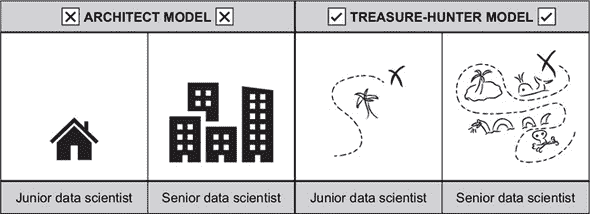
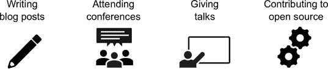

## 第四部分：在数据科学角色中成长

本书最后一部分是在你适应数据科学职位后可以使用的材料；它全部关于接下来会发生什么。这部分的主题最终会影响每一位数据科学家，但并不经常被讨论。很容易认为，如果你有一个稳定的数据科学工作，你就成功了，但你总有更多东西要学习。最后一部分的目标是提供材料，帮助你从初级数据科学家成长为高级数据科学家，并继续前进。

第十三章 讲述了如何处理失败的数据科学项目。这个话题对于经验丰富的数据科学家来说至关重要，因为随着你的职业生涯发展，你肯定会遇到失败。第十四章 讲述了如何加入数据科学社区，从撰写博客文章到参加会议。尽管这不是数据科学家的必要要求，但参与社区活动对于建立人脉和获得未来工作机会可以带来巨大的好处。第十五章 讨论了以最佳方式离开数据科学职位这一棘手任务。作为本书的最后一章，第十六章 讨论了高级数据科学家之后的一些主要职业道路，例如成为经理或技术负责人。

## 第十三章：当你的数据科学项目失败时

*本章涵盖的内容*

+   为什么数据科学项目往往会失败

+   当你的项目失败时你可以做什么

+   如何处理失败的负面情绪

大多数数据科学项目都是高风险的冒险。你试图预测别人从未预测过的事情，优化别人从未优化过的事情，或者理解别人从未看过的数据。无论你在做什么，你都是第一个做的人；这项工作几乎总是探索性的。因为数据科学家一直在做新的事情，你不可避免地会遇到一个发现你所希望的事情根本不可能的点。我们都必须面对我们的想法没有成功。失败是心碎和痛苦的；你想要停止思考数据科学，梦想着完全离开这个领域。

以一个公司为例，该公司正在构建一个机器学习模型，以在网站上推荐产品。可能的事件进程始于一系列会议，数据科学团队说服高管这个项目是个好主意。团队相信，通过使用关于客户及其交易的信息，他们可以预测客户接下来想买什么。高管们接受了这个想法，并批准了项目。许多其他公司都有这些模型，看起来很简单，所以项目应该会成功。

不幸的是，一旦团队开始工作，现实就会显现。也许他们会发现，由于公司最近更换了系统，交易数据仅限于过去几个月。或者也许团队运行了一个实验，发现看到推荐引擎的人并没有比没有看到的人购买更多东西。这些问题逐渐积累；最终，团队会因沮丧而放弃项目。

在本章中，我们将项目未能实现其目标定义为*失败*。在分析的情况下，项目可能会失败，因为它没有帮助利益相关者回答业务问题。对于生产机器学习问题，项目可能会失败，因为它没有被部署或者部署后不起作用。项目可以通过许多方式失败。

数据科学家往往不谈论项目失败，尽管这种情况极其常见。当项目失败时，数据科学家可能会感到脆弱。如果你的项目失败了，你可能会想：“如果我是更好的数据科学家，这种情况就不会发生了。”很少有人愿意分享质疑自己能力的经历。

从本质上讲，数据科学是研究和开发。每天，数据科学家都在分析以前从未分析过的数据，寻找可能存在也可能不存在的趋势。数据科学家试图在可能没有信号的数据上建立机器学习模型。这些任务不可能总是成功，因为新趋势和信号在任何领域都很少被发现。然而，在软件工程这样的领域，通常可以完成任务（尽管可能需要比计划更多的时间和资源）。

理解数据科学项目失败的原因以及失败时应该做什么很重要。你对失败项目的理解越深入，你就能避免更多的未来失败。通过调查哪些部分的项目是成功的，失败的项目也可以让你洞察到哪些部分会成功。你可能只需稍作努力，就能将一个失败的项目调整为组织内可能有用的东西。

在本章中，我们讨论了三个主题：为什么数据科学项目会失败，如何考虑项目风险，以及项目失败时应该做什么。我们讨论了大多数项目失败的主要原因，如何处理项目，以及如何处理你可能感受到的情绪。

### 13.1. 为什么数据科学项目会失败

数据科学项目似乎因为无数的原因而失败。从预算到技术，以及那些完成时间远超预期的任务，失败的原因有很多。最终，这些多种类型的失败可以归结为几个核心主题。

#### 13.1.1. 数据不是你想要的数据

在开始项目之前，你无法查看每个可能的数据来源。根据你对公司的了解，必须基于已知信息做出关于可用性的明智假设。当项目开始时，你通常会发现自己许多假设都是不成立的。也许数据不存在，没有以有用的格式存储，或者没有存储在你能够访问的地方。例如，如果你正在分析一个客户的年龄如何影响他们对忠诚度计划的使用，你可能会发现客户在加入计划时从未被询问过他们的年龄。这种失败可能会迅速结束一个项目。

| |
| --- |

**示例失败：忠诚度计划状态分析**

一家大型连锁餐厅市场部门的总监想要了解随着客户在公司忠诚度计划中的等级提升，他们的消费是否会有所不同。该计划有银、金和白金三个等级，总监想知道一个达到白金等级的人，在他们仅仅是银等级时是否以同样的方式购买。

数据科学团队同意调查这个请求，因为这个任务应该相当直接，而且他们之前从未处理过忠诚度数据。他们震惊地发现，过时的忠诚度计划数据库没有跟踪历史计划等级——只记录客户现在的等级。如果一个客户目前处于白金等级，就无法知道他们以前是银等级还是金等级。因此，分析变得不可能进行。

数据科学团队建议调整系统，但改变忠诚度计划数据库架构需要数百万美元，而且公司对此需求很小，因此没有进行任何更改，分析想法被放弃。

| |
| --- |

因为在你能做任何事情之前都需要数据，所以这些类型的问题是首先出现的主要问题。遇到这类问题时，常见的反应是内部协商，你试图通过数据中的漏洞来设计解决方案。你可能会说：“好吧，我们没有我们想要的十年数据，但也许一年的数据对模型来说足够了”并寄希望于最好的结果。有时，这种方法可能有效，但替代方案并不总是足够使项目可行。

当你提出一个项目时，你并不总是能访问到数据，甚至可能连对它的全面理解都没有（在咨询行业中，你只有在项目工作被销售后才能获取数据，这是一个特殊的问题）。此外，数据可能存在，但有一个关键的缺陷使其变得无用。数据可能存在于数据库表中，但客户 ID 可能已损坏，无法使用。数据集可能存在许多问题，因此在项目开始前检查所有这些问题都极其困难。因此，数据科学项目通常连启动阶段都难以通过。

你能越快获取数据并对其进行探索，就能越快地减轻数据不足的风险。避免这种错误的最佳情况是在开始项目之前获取数据样本。如果这不可行，那么次佳情况是在项目时间表中考虑到数据可能不佳的可能性。通过在项目早期设置一个“进行/不进行”的步骤，让利益相关者同意重新评估项目可行性，那么利益相关者对数据可能不佳感到惊讶的可能性就会降低。

如果你发现自己正苦于缺乏优质数据，你的选择有限。你可以尝试寻找替代数据源来替代，例如。也许你没有关于哪些产品被购买的数据，但你确实知道生产了多少产品，你可以用这个数据来代替。问题通常在于这些替代品与原始数据差异足够大，以至于会导致分析中出现真正的问题。

当你找不到可行的替代品时，有时你所能做的就是启动一个独立的项目来开始收集更好的数据。向网站和应用程序添加仪器和遥测，创建数据库来存储数据而不是将其丢弃，以及执行其他任务，可以帮助团队在未来收集到更好的数据后承担这项任务。

#### 13.1.2\. 数据没有信号

假设一个赌徒雇佣了一名数据科学家，希望利用统计学来赢得骰子游戏。赌徒掷一个六面的骰子 10,000 次并记录下结果；然后他支付数据科学家创建一个模型，该模型可以预测下一次掷骰子的结果。尽管数据科学家拥有大量数据，但无法预测下一次掷出的面，除非假设骰子是公平的（每个面有 1/6 的概率）。尽管数据科学家拥有大量数据，但其中没有信号表明下一次掷出的面。

这种数据中没有信号的问题在数据科学中非常普遍。假设你正在运营一个电子商务网站，并希望创建一个模型来预测哪些客户会根据他们的浏览器、设备和操作系统订购产品。在开始项目之前，你无法知道这些数据点是否真的可以用来预测客户是否会订购，或者数据是否缺乏信号，就像掷骰子数据那样。创建机器学习模型进行预测的行为是在测试数据，看它内部是否有信号，而且很可能没有信号。实际上，在许多情况下，有信号比没有信号更令人惊讶。

**示例失败：检测包含销售数据的网站上的错误**

一个假设的电子商务公司有一个问题：网站不断出现错误和漏洞。更糟糕的是，错误并不总是被 DevOps 或软件工程团队发现。有一次，错误是由市场营销团队发现的，他们注意到每日收入过低。当市场营销团队而不是 DevOps 或工程团队发现错误时，那是一个糟糕的情况。

数据科学团队着手在销售数据上使用统计质量控制技术，以便在收入如此低以至于网站上肯定存在错误时发出警报。他们有一份检测到错误的日期列表和历史上的收入数据。使用销售数据来预测错误似乎很简单。

不幸的是，收入每天可能变化的原因数量使得检测错误几乎不可能。收入可能因为星期几、一年中的哪个时期、市场营销的促销活动、全球事件或其他无数其他原因而降低。尽管市场营销曾经能够看到错误，但这个事实并不具有普遍性，因为数据中没有关于它的信号。

不幸的是，数据中没有信号可能会导致项目失败。如果一个项目是围绕在数据中寻找关系并据此做出预测来构建的，而那里没有关系，那么预测就无法进行。分析可能不会发现任何新的或有趣的东西，或者机器学习模型可能无法产生比随机机会更好的结果。

如果你似乎无法在噪声中找到信号，你有几种可能的出路：

+   ***重新定义问题。*** 你可以尝试重新定义问题，看看是否可以找到不同的信号。假设你有一系列文章，你正在尝试预测与用户最相关的文章。你可以将问题定义为一个分类问题，试图分类一组文章中哪一篇文章是最相关的。

+   ***更换数据源。*** 如果似乎没有什么能从数据中拉出信号，你可以尝试更换数据源。与之前没有好数据的失败点一样，向问题中添加新的数据源有时会创造出意外的信号。不幸的是，你通常从最有可能是有用的数据集开始，所以这种策略能救你的机会相当有限。

对于陷入这种困境的数据科学家来说，通常的做法是尝试使用更强大的模型来寻找信号。如果一个逻辑回归无法做出有意义的预测，他们就会尝试随机森林模型。如果一个随机森林模型不起作用，他们就会尝试神经网络。每种方法最终都会更加耗时和复杂。虽然这些方法对于获得更准确的预测可能是有用的，但它们不能从无中生有。

最常见的情况是，如果最简单的方法都无法检测到任何信号，那么更复杂的方法也同样无法做到。因此，最好是从简单的建模方法开始，以验证项目的可行性，然后再转向更复杂且耗时的方法，而不是一开始就使用复杂的方法然后逐渐简化。不要浪费几个月的时间构建越来越复杂的模型，希望下一个模型可能就是能拯救项目的那个。

#### 13.1.3. 客户最终并不需要它

无论模型或分析有多准确，重要的是它能为利益相关者提供价值。一项分析可能对数据科学家来说非常有趣，但对请求它的商业人士来说则不然。机器学习模型可以做出高度准确的预测，但如果该模型没有被部署和使用，它就不会提供太多价值。许多数据科学项目在数据科学工作完成后也失败了。

最终，数据科学分析、模型或仪表板都是一个产品。设计和创建产品是一种许多人都投入了数百年集体思考的实践。尽管如此，每年仍有数十亿美元被用于创建人们最终并不需要的产品。从新可口可乐到谷歌眼镜，一些高调的产品并没有赢得客户，一些低调的产品也没有。正如微软和诺基亚可以投入大量精力创建 Windows Phone，但客户最终并没有购买，数据科学家也可以创建出没有人使用的产品。

| |
| --- |

**示例失败：销售和营销活动价值预测**

一家零售公司启动了一个项目，旨在创建一个机器学习模型来预测未来广告活动将带来的投资回报率（ROI）。数据科学团队在看到市场和销售团队在制作预测整体价值的 Excel 电子表格方面遇到的困难后，决定构建这个模型。假设数据科学团队通过在客户层面使用机器学习和建模，创建了一个基于 Python 的模型，该模型可以更准确地预测活动的 ROI。

后来，数据科学团队发现，市场和销售团队创建带有 ROI 预测的 Excel 电子表格的唯一原因是为了让财务部门批准。财务团队只愿意与 Excel 合作；Python 对他们来说太过复杂。因此，这个工具没有被使用，因为数据科学团队没有考虑到客户的需求。需求不是最准确的预测，而是能够说服财务团队认为活动在财务上是可行的预测。

| |
| --- |

关于创建客户喜欢的产品的通用指导原则是花大量时间与客户交谈和合作。你越了解他们的需求、愿望和问题，你就越有可能制作出他们想要的产品。市场研究和用户体验研究是理解客户的不同方式，市场研究通过调查和焦点小组，用户体验研究通过用户故事、角色和测试。

尽管人们已经做了很多好的思考，但数据科学作为一个领域，由于没有理解客户需求而特别容易失败。无论什么原因，数据科学家在查看表格和图表时比他们走出去与人交谈要舒服得多。许多数据科学项目失败，因为数据科学家没有投入足够的精力与客户和利益相关者交谈，以了解他们真正的问题。相反，数据科学家跳入构建有趣的模型和探索数据。事实上，这种情况是我们选择将第十二章用于管理利益相关者的主要原因之一。我们希望你已经通过阅读那一章更好地理解了如何思考利益相关者关系，但如果你跳过了它，也许你应该去看看。

如果你发现自己处于产品似乎无法得到市场认可的情况，你能做的最好的事情就是与你的客户交谈。与客户交谈永远不会太晚。无论你的客户是商业利益相关者还是你公司的客户，沟通和理解都是有益的。如果你的产品对他们没有用处，他们能否告诉你为什么？你能否通过向产品添加新功能来潜在地解决问题？也许你可以通过将其与不同的数据集相结合来改变分析。也许你可以通过调整输出格式或运行速度来改进机器学习模型。除非你与人交谈，否则你永远不会知道。

这也涉及到最小可行产品（MVP）的概念，它在软件开发中被广泛使用。这个想法是，你越快能让产品工作并推向市场，你就越快能得到关于什么有效或无效的反馈，然后在此基础上进行迭代。在数据科学中，你越快让任何模型工作或完成任何分析，你就越快能向客户或利益相关者展示并得到他们的反馈。在模型上花费数月进行迭代会阻止你得到这种反馈。

在你的工作和设计构建过程中更好地理解客户，你就越不可能因为客户不想购买产品而失败。如果你最终以这种方式失败，最好的前进方式是开始沟通，试图找到解决方案。

### 13.2. 管理风险

有些项目比其他项目风险更大。使用团队之前已经处理过的数据，并以标准方式制作标准仪表板，成功的可能性相当高。在公司找到新的数据集，围绕它构建一个实时运行的机器学习模型，并以令人愉悦的用户界面向客户展示，这是一个风险较高的项目。作为数据科学家，你可以在任何时刻控制你承担的风险量。

风险的一个重要考虑因素是你在同一时间正在处理多少个项目。如果你正在处理一个风险较高的单一项目，并且该项目失败，从职业角度来看处理这个失败可能会非常困难。然而，如果你能够同时处理多个项目，你将能够降低风险。如果其中一个项目失败，你还有其他项目可以依靠。如果一个项目是一个极其复杂的机器学习模型，成功的可能性有限，你可以在同时进行更简单的仪表板和报告工作；那么，如果机器学习项目失败，你的利益相关者可能仍然会对报告感到满意。

拥有多个项目从利用角度来说也可能是有益的。数据科学项目有很多起止，从等待数据到等待利益相关者响应，甚至等待模型拟合。如果你因为某种原因在某一个项目上遇到了瓶颈，你将有机会在其他项目上取得进展。这甚至可以帮助你克服心理障碍；当你遇到瓶颈时，分散注意力可以是一种很好的刷新思维的方法。

另一种降低风险的方法是在项目中嵌入早期停止点。理想情况下，一个看起来可能失败的项目应该设计成如果到了某个点还没有成功，就会停止。例如，在一个数据是否存在尚不清楚的项目中，项目范围可以设定为如果经过一个月的搜索，找不到好的数据，则认为该项目不可行并取消。如果提前提出可能不会成功的预期，结束项目就不会那么令人惊讶，也不会那么昂贵。

从某种意义上说，项目提前结束也体现了数据科学是研究和开发的事实。因为数据科学充满了许多未知数，所以有计划地考虑在探索性工作中学习到更多，想法可能不会实现，这是有道理的。

虽然在项目组合中降低风险是值得的，但你不想完全去除它。数据科学就是关于承担风险的：几乎任何足够有趣的项目都会有大量的不确定性和未知因素。这些风险未知因素可能是因为没有人使用过新的数据集，公司中没有人在之前尝试过某种方法，或者利益相关者来自从未使用过数据科学的公司的某个部分。公司中许多有价值的数据科学贡献都来自尝试新事物的人，如果你作为一个数据科学家试图避免可能失败的项目，你也在避免可能的大成功。

尽管本章涵盖了数据科学项目失败的各种方式，但数据科学团队最终可能会因为承担的风险不足而集体失败。考虑一个提出了一些新项目想法和报告的数据科学团队，并发现它们是成功的，然后只通过更新和刷新以前的工作而停滞不前。尽管那些项目可能没有失败，因为它们正在向公司交付工作，但那个团队会错过数据科学的新领域。

### 13.3\. 当你的项目失败时你能做什么

如果你的数据科学项目失败了，这并不意味着你投入的所有时间都是浪费的。在第 13.2 节中，我们概述了一些你可以采取的潜在行动来扭转项目。但即使项目没有成功的可能性，你仍然可以采取一些步骤来最大限度地利用剩余的部分。在接下来的章节中，我们将为你提供一些处理项目失败时情绪的策略。

#### 13.3.1\. 如何处理项目

尽管项目可能失败了，但从中仍然可以学到很多知识和技术。以下步骤可以帮助你保留许多这些收益。

##### 记录经验教训

处理失败项目的第一步是评估你可以从中学习到什么。你需要向自己和团队提出一些重要的问题。

+   ***为什么失败了？*** 这个问题看起来几乎很明显，然而，通常情况下，直到你退后一步，从更大的角度来看待问题，你才能理解一个项目为什么会失败。通过与所有参与项目的相关人员讨论，你可以更好地诊断出了什么问题。公司 Etsy 流行了“无责后事”的概念——在某个项目失败后，团队可以讨论问题而不指责任何人的讨论。通过将问题视为团队工作方式中的缺陷（而不是个人的错误）造成的，你更有可能找到解决方案。没有惩罚的恐惧，人们会更愿意公开谈论所发生的事情。

+   **如何防止失败？** 当你理解导致失败的因素时，你可以了解如何避免未来类似的情况。例如，如果项目所需的数据不够好，那么通过更长的探索阶段可能就能防止失败。这些类型的教训有助于你的团队成长和成熟。

+   **你从数据和问题中学到了什么？** 即使项目失败了，你通常也会学到一些对未来有价值的东西。也许数据中没有信号，但为了达到那个点，你仍然需要合并一些新的数据集；现在你可以在其他项目中更容易地执行这些相同的合并。这些问题可以帮助你思考可以从项目中挽救的可能事物，并帮助你提出替代项目想法。

通过在会议中让团队讨论这些问题，并将结果保存在共享位置，你将能从失败的项目中获得更多价值。

##### 考虑调整项目

尽管项目本身可能失败了，但可能存在将其转变为有用事物的途径。例如，如果你试图建立一个检测公司收入异常的工具，并且失败了，你可能仍然能够使用相同的模型作为相当不错的预测工具。整个公司都是基于将一个失败的想法重新用于成功的事物而建立的。

调整产品需要与利益相关者和客户进行大量沟通。你实际上回到了产品设计过程的开始，试图弄清楚你的工作的良好用途。通过与利益相关者和客户交谈，你可以了解他们的问题，并看看你的工作是否对任何新事物有用。

##### 结束项目（切断并逃跑）

如果你无法调整项目，最好的办法就是结束它。通过明确取消项目，你让自己和团队能够转移到新的、更有希望的工作上。数据科学家永远想要继续工作在一个项目上，希望有一天它会成功，这是极其容易的。（那里有成千上万的算法；最终总会有一个起作用，对吧？）但如果你陷入试图让某件事起作用的困境，你最终会浪费不必要的努力。此外，一直做同样的事情直到永远也不是一件有趣的事情！虽然切断项目很困难，因为它需要你承认它不再值得努力，但从长远来看，这是值得的。

##### 与利益相关者沟通

数据科学家应该在数据科学项目的整个过程中与利益相关者进行沟通（参见第十二章），但如果项目失败，他们应该增加沟通的频率。尽管隐藏风险和问题以避免让利益相关者失望可能感觉更舒服，但遇到利益相关者惊讶地发现项目已经失败的情况可能会对职业生涯造成灾难。通过让利益相关者知道问题正在发生或项目无法继续前进，你是在向他们展示透明度并赢得信任。在帮助他们了解项目状态后，你们可以一起决定下一步行动。

如果你不确定如何与利益相关者沟通问题，你的经理应该是一个很好的资源。他们可以提出传达信息的方法，或者可能亲自带头传达。不同的人和组织喜欢以不同的方式传达信息，从用绿色/黄色/红色编码列出问题的电子表格到咖啡时间的对话。你的经理或团队中的其他人应该了解什么最有效。

对于你作为一个数据科学家来说，在传达项目失败时感到焦虑是很常见的；你感到非常情绪脆弱，并认为你处于弱势地位。尽管有时消息被接收得不好，但其他人通常愿意帮助你一起解决问题并决定下一步行动。在传达项目失败后，你可能会感到解脱，而不是痛苦。

#### 13.3.2\. 处理负面情绪

先暂时忘记项目和公司：你还需要考虑自己的福祉。项目失败在情感上是非常困难的！这是最糟糕的！如果不小心，一个失败的项目可能会真正地消耗你，并在项目结束后长时间困扰你。通过深思熟虑你对失败的反应以及你构建的故事，你可以为自己设定更长期的成功。

项目失败后的自然内心独白是：“如果我只是成为一个更好的数据科学家，项目就不会失败了。”这种想法是谬误：大多数数据科学项目失败是因为数据科学本质上基于尝试那些永远不可能成功的事情。大多数伟大的数据科学家都参与过，甚至领导过没有成功的项目。通过将失败项目的责任归咎于自己以及可能的数据科学不足，你是在将整个项目的重量都放在自己身上。但正如本章前面讨论的，数据科学项目失败有许多原因，而且很少是因为数据科学家的能力问题。担心项目失败是因为你，这种焦虑只是你心中的想法，并不是现实的反映。

如果你允许自己失败，并接受失败不是弱点的标志，你将更有能力从经验中学习。对自己和自己的技能有信心，会使你更容易思考失败及其原因，因为这样不会那么痛苦。话虽如此，自信和接受失败的能力需要时间、耐心和实践来获得，所以如果你发现自己很难建立信心，请不要感到惊讶。这是正常的！

这里关键的一点是，当项目失败时，你能为自己做的最好的事情就是理解失败不是对你技能的反映。项目失败的原因超出了你的控制范围，你将能够从失败中走出来。你越能将这些事情放在心上，失败就越容易接受。

我们将以数据科学的隐喻来结束这一章。对于有抱负的初级数据科学家来说，将专业数据科学家比作建筑师是很常见的。一个新手建筑师可能会设计简单的住宅，而一个经验丰富的建筑师可以建造摩天大楼，但如果其中任何一个建筑师的建筑倒塌，那将是职业生涯的终结。同样，看待数据科学家的一种方式是，他们构建越来越复杂的模型，但如果其中一个失败，他们的职业生涯就会受到威胁。在你阅读这一章之后，我们希望你能认识到*这并不是专业数据科学家的一个准确模型*。

一个更好的隐喻是，数据科学家就像一个寻宝者(图 13.1)。寻宝者出发寻找丢失的贵重物品，如果他们幸运的话，他们可能会找到一些！新手寻宝者可能会寻找标准商品，但经验丰富的猎人会找到最传奇的宝藏。数据科学家更像是一个寻宝者；他们寻找成功的模型，偶尔，他们的模型和分析是有效的！尽管资深数据科学家可能会处理更复杂或棘手的项目，但每个人都会不断失败，而这只是工作的一部分。

##### 图 13.1\. 数据科学的两种隐喻：建筑和寻宝

### 13.4\. 与 Pluralsight 数据科学和机器学习负责人 Michelle Keim 的访谈

Michelle Keim 领导着 Pluralsight 的数据科学和机器学习团队，Pluralsight 是一个企业技术学习平台，其使命是普及技术技能。她在波音、T-Mobile 和 Bridgepoint Education 等公司担任过数据科学团队的成长和领导工作，对数据科学项目为什么会失败以及如何处理失败有着深刻的理解。

#### 你在职业生涯中什么时候经历过失败？

我被拉去领导一个项目，目的是构建一套客户保留模型。我以为我已经与所有相关利益相关者交谈过，并理解了业务需求、团队的工作方式以及为什么这些模型是必要的。我们构建了模型，但很快发现没有人对它们感兴趣。问题是我们没有与实际使用输出的客户服务代表坐下来讨论；我之前只和领导层交谈过。我们提供了一份关于客户是否会离开的概率列表，但客户服务代表不知道如何处理这些信息。他们需要知道当客户面临离开的风险时，他们应该做什么，这与我们解决的问题非常不同。对我来说，最大的教训是，你真的需要深入到细节中，理解问题的用例。使用输出的人正在解决什么问题？

#### 在项目开始之前，你能看到哪些红旗？

我认为这部分是来自经验的本能。你看到的事情越多，你从失败中学习的机会越多，你就越知道要寻找哪些红旗。关键是保持你的周期短，这样你就有机会早点看到它们；你需要以频繁的速度引入反馈。

数据科学家往往会对他们的工作感到兴奋，却忘记了抬头看看。在一天结束时，不仅要理解你想要达到的目标，还要了解在不同阶段成功是什么样子，这非常重要。这样，你可以将你的工作与之对照，获取反馈，并在必要时进行转变。检查点让你能迅速知道你是否遗漏或误解了某些内容，并纠正方向，而不是在最后学习并不得不回溯。

#### 公司之间处理失败的方式有何不同？

这与公司的文化紧密相关。我建议求职者在寻找工作时，尽量了解公司是否有学习和持续反馈的文化。当你面试时，你有机会问面试官：你自己正在学习什么？这个机会是如何出现的？如果我要接受这个角色，我将如何获得反馈？这是否需要你主动寻求，还是已经规范化了？了解员工如何回应这些问题是非常有启发性的。

当你已经在一家公司工作时，你可以尝试回答一些问题，以了解是否存在健康的文化。项目完成后，是否有机会暂停并回顾？你是否在项目结束时尝试进行回顾性学习？你是否看到领导层在公司的各个层面使用开放沟通并承担责任？当强大的文化不存在时，你也会感受到恐惧。你会开始看到更多以自我为中心而不是以使命为中心的行为，这种不健康的行为会让你感到冲击。

#### 你如何判断你参与的项目是否正在失败？

如果你没有从一开始就定义什么是成功，你就无法知道你是否在失败。你试图达到的目标是什么，通往成功的道路上的检查点是什么样的？如果你不知道这些，你只是在猜测项目是否进展顺利。为了设定成功，你必须确保你已经与利益相关者合作，对这些问题有一个明确的答案。你需要知道你为什么要做这个项目，你试图解决什么问题，否则你将不知道你交付的价值，也不知道你的方法是否正确。数据科学家角色的一部分是带来你的专业知识，帮助界定问题和定义成功指标。

#### 你如何克服对失败的恐惧？

你需要记住，你实际上希望有一些失败；如果一切都很完美，你就永远学不到任何东西。你将如何成长？那些经历是必要的，因为没有替代品可以用来处理失败并接受它。确实，失败可能会很痛苦，你可能会问“哦，天哪，我该怎么办？”但当你看到自己反弹回来，从中学习，并将其转化为下一件事时，你获得的韧性将滚雪球般地转化为自信。如果你知道要期待某些事情出错，那么下次就会更容易。而且，如果你确保你经常得到反馈，你将能够在它们变得破坏性之前捕捉到你的失败。没有人期望完美。人们期望的是，你要诚实地承认你所不知道的，并通过提问和寻找反馈来不断学习。

### 摘要

+   数据科学项目通常因为数据不足、信号缺失或不符合客户需求而失败。

+   项目失败后，列出失败原因并考虑转型或结束项目。

+   项目失败并不反映数据科学家的质量。

+   数据科学家并不完全对项目失败负责。

## 第十四章 加入数据科学社区

*本章涵盖*

+   扩展你的项目集和博客文章

+   寻找并充分利用会议

+   在聚会或会议上发表出色的数据科学演讲

+   贡献开源项目

当你在数据科学工作中时，做得好可能会感觉是提升职业的唯一方式。但还有许多其他方式可以提升你的技能，特别是通过参与数据科学社区。在工作之外花时间进行活动，如发表演讲或贡献开源项目，对你的职业生涯可能非常有帮助。

在本章中，我们介绍了四种你可以加入社区的方式：扩大你的投资组合、参加会议、发表演讲以及为开源项目做贡献。我们提出了四种活动，以便你可以选择你最感兴趣的活动；很少有人有时间和精力做所有这些。尽管这些事情会占用你正常工作日之外的时间，但这并不意味着它们应该占据你的生活。在本章中，我们提供了关于如何有效地利用时间的建议，例如重用演讲、将博客文章转化为演讲，以及撰写关于你第一次开源贡献的博客文章。

虽然这些活动可能很有帮助并且极具回报，但你不必做这些事情才能拥有充实的数据科学职业生涯。许多数据科学家，包括那些在顶级公司担任高级职位的人，都不做这些事情。但我们都（作者）认为，成为社区的一部分在我们职业生涯的许多时候都帮助我们，包括获得工作机会和晋升。公开工作是你在其中投入的时间可以加倍回报的领域。

我们看到加入更广泛的数据科学社区有四个主要好处(图 14.1)：

+   **获得技能——** 通过参与社区，你可以学习到如果你仅仅依赖你的日常工作，就不会接触到的新的技术。创建开源项目是直接发展你的技术技能的活动，因为你将编写供他人使用的代码，并在一个技术项目上进行协作。但每个活动都有其益处。写博客是一个很好的方式，可以让你意识到自己知识的不足并获得反馈。发表演讲可以帮助你磨练你的演讲技巧，这可能会帮助你说服利益相关者你需要资金，或者他们应该支持你的项目。在会议上听到正确的演讲可能会解开一个重要项目，并为你节省数小时的工作时间。

+   **扩大你的网络——** 与社区建立联系是找到一群理解你困境的支持性同伴的绝佳方式。即使你在公司里有同伴，你也可能缺乏某个特定领域的专业知识，而社区成员的建议可以填补这一空白。你还可以了解在不同公司工作数据科学的情况。

+   **获得机会——** 你在社区中的参与度越高，你被要求帮助的项目、发表演讲或参与播客的机会就越多。你甚至可能因为有人通过你的在线工作找到你，或者在会议上遇到你而得到下一份工作。这是一个巨大的正反馈循环：演讲导致更多的演讲，项目导致更多的项目。这些机会可以提供信息、有趣且令人愉快。

+   **回馈——** 这对你个人的直接好处较少，但对社区的福祉更为重要。当你向导师询问如何回报他们的支持时，许多人会说：“将爱传递下去。帮助他人，并成为他们的导师。”成为社区的一部分可以使数据科学工作变得更加充实。通过完成帮助他人的任务，你会感到有价值，就像你不仅仅是为了工资而工作一样。

##### 图 14.1\. 本章中介绍的一些加入社区的方法

### 14.1\. 扩展你的作品集

现在你有了工作，并不意味着你可以忘记你为了得到这份工作而培养的所有优秀习惯。在第四章中，你学习了如何撰写博客文章和建立作品集。有工作并不意味着继续维护和扩展它们没有价值。在博客或副项目中工作不必成为负担；在本章中，我们讨论了新的主题和回收利用你的工作以从同一努力中获得多重用途的方法。

#### 14.1.1\. 更多博客文章

我们希望你在作为数据科学家的工作中学习到很多新东西。你如何在包含 30 亿行数据的表中优化 SQL 查询？你如何与营销人员有效地合作？有哪些策略可以开始导航数百张表格？

如果你在一个雇佣其他数据科学家的公司工作，你将直接从他们那里学习，无论是通过阅读他们的代码还是结对编程。在这个过程中做笔记是个好主意，因为你将获得大量新信息，而且你不太可能在几个月内全部记住。当你这样做的时候，为什么不和全班同学（在这种情况下，整个互联网）分享你的笔记呢？互联网上的陌生人并不是唯一会从中受益的人；撰写博客文章是巩固你学习的一个很好的方式。你甚至可能会在多年后参考你之前写的早期教程。

如果你遵循了我们在第四章中的建议，你应该已经有一个运行中的博客，上面有几篇文章。如果你没有，但你对开始一个博客感兴趣，我们建议你回到那一章并遵循那里的步骤。我们那里写的一切仍然适用；当你寻找第一份数据科学工作时使博客文章有效的相同策略，在你进入该领域工作后仍然有效。唯一的重大变化是，如果你在撰写关于你在工作中完成的项目（而不是你学到的通用编程、统计或人员管理技能）的文章时，你需要确保你没有分享任何机密或专有信息，并且遵循你公司对员工个人博客的任何其他规则（例如，首先通过公关部门发布帖子）。

如果你不想有自己的博客，看看你的公司是否有技术博客。即使过去的帖子都是围绕工程主题的，你也可以写一篇数据科学帖子。这可能需要一段时间才能获得批准，但走这条路的一个好处是，你可以在工作时间写下你的想法。即使你的公司没有公开的博客，它也应该有一些内部文档和培训。如果你发现你必须通过询问多个人或翻阅过时的说明来学习某些东西，你可以创建或更新一个带有清晰说明的资源，供未来的新员工使用。如果主题是会对公司外的人有帮助的（例如，不是专有内部工具或你的数据的描述），你以后可以将其变成博客文章或演讲。

#### 14.1.2. 更多项目

数据科学项目（我们也在第四章中讨论过）是你选择或创建一个数据集，然后分析它以回答问题的项目。例如，你可以使用 Twitter API 来分析关于数据科学会议的用户推文。在某些情况下，一个项目甚至不需要是一个分析；也许你可以通过构建一个 Slack 机器人来展示你的工程技能，允许用户互相“打分”，并在你设置的数据库中跟踪总分。

项目可能比博客文章更难跟上。根据你的行业，你的公司可能愿意甚至鼓励你用概括的方式描述你的工作。即使不是这样，你也可以写一些非技术性的帖子，比如如何处理商业利益相关者或你在就业市场的经验。然而，很少有公司会公开分享他们的数据，所以即使你能分享你做的某个精彩分析的代码，也没有太大意义，因为你无法分享数据或结果。如果你想分享你做的分析，你必须作为一个副项目，在完全属于自己的时间里完成。

话虽如此，偶尔做一些副项目是好的。一方面，当你想要换到下一份工作时，公司可能会要求你提供一个你做过数据分析的例子。如果你在公司工作了几年，你不想展示你在训练营或 MOOC 注册期间做的项目，因为你想要展示你在作为数据科学家工作期间技能是如何发展的。然而，寻找主题和撰写良好分析的原则与第四章中相同。

好消息是，一个项目不需要花费太多时间。我们在第四章中采访的 David Robinson，每周都会进行一次屏幕录制，记录他对一个他之前从未见过的数据集进行分析（来自 Tidy Tuesday 项目[`github.com/rfordatascience/tidytuesday/`](https://github.com/rfordatascience/tidytuesday/)）。这项分析花了他大约一个小时，因为他没有做任何准备，但当他将代码上传到 GitHub 时，它可以作为一个示例分析项目。现在，确实需要相当有经验的数据科学家才能如此快速地做出好的分析，但任何人都可以尝试为他们的分析设定时间限制，以帮助他们保持专注在分享结果（而不是在一个他们从未向任何人展示的项目上花费 14 个小时）。

### 14.2. 参加会议

有时候，成为社区的一部分意味着不得不离开家。大部分情况下，这意味着要参加会议，在那里，处于（或希望处于）相似行业或领域的人们聚集在一起讨论他们的工作。

会议通常是每年一次的活动，遍布全国乃至世界各地。数据科学领域有许多会议。Strata、rstudio::conf、PyData、EARL 和开放数据科学会议只是其中一些较大的会议，其中许多都有地区性的分支。你也许还会对与数据科学重叠的更广泛的技术会议感兴趣，例如 Write/Speak/Code、PyCon、Grace Hopper 和 SciPy。

会议通常持续两到四天，从早上早起到晚上都有安排，之后还有社交活动。它们可能是单轨（同一时间只进行一个演讲）或多轨，但它们都有多个演讲者。它们也可能非常昂贵——通常每天的票价在 300 到 700 美元之间。一些会议还提供半天到两天的研讨会，额外收费通常在每天 750 美元左右。

我们给出大致价格的一个原因是，有很多方式可以以低于全价的价格购买门票。如果你是某个代表性不足的群体的一员，寻找提供给 R-Ladies 或 PyLadies 等群体所有成员的奖学金或折扣代码。如果你在非营利组织或学术界工作，你也可能支付更少的费用，许多主要会议在提前购票时提供折扣。降低费用的另一个绝佳方式是发表演讲，因为会议通常会给你一张免费门票。最后，一些会议提供你可以申请的奖学金，这些奖学金可以覆盖你的门票费用，甚至可能覆盖你的全部费用，包括交通和住宿。

考虑到这种可能的高昂代价，你为什么要花时间和金钱（或者你雇主的钱）去参加，尤其是如果会议记录并将演讲放在网上？在这里，我们回到我们在本章开头讨论的主要好处之一：人脉。人脉可能有一个负面含义：有人四处走动，与房间里每个人都握手，希望遇到一个重要人物并从中获得一些东西。但最好的人脉是找到一群支持你的人。这种支持可能以非常具体的方式出现，比如有人把你介绍给你申请的公司里工作的人，或者无形中，比如终于进入一个房间里，大多数技术专家都是女性的感觉。

建立人脉最好是长期进行，所以即使你现在没有觉得需要帮助的事情，在你寻找新工作或开源项目的合作伙伴之前，打下这个基础也是极好的。

##### 着装规范

对于第一次参加的人来说，一个常见的问题是该穿什么。一般来说，会议是休闲装。对于特定的会议，看看你能否在 Twitter 或会议网站上找到会议的照片。但有一点需要注意，演讲者可能比观众穿得更正式；并不是所有演讲者都穿商务休闲装就意味着观众也是如此。如果你真的很困惑，带一些可以居中的东西，比如休闲装或 Polo 衫和深色牛仔裤。会议很少极端到你需要穿西装或 T 恤短裤才能融入，通常人们的着装会有一定的范围，所以你不太可能成为另类！

在这么多会议可供选择的情况下，你如何确定哪些会议值得参加？会议各不相同，但以下是一些需要考虑的轴：

+   ***学术方面—*** 一些会议，如 useR!、NeurIPS 和 JSM，在学术界或研究密集型行业工作中拥有大量参与者。在极端情况下，有些会议几乎所有的与会者都是研究生或教授。如果你在工业界，你可能不会发现很多演讲对你适用；尽管工业界的人可能在进行演讲，但这些演讲可能关于前沿的机器学习算法，只有在你是一家大型电子商务公司时才有用。

+   ***规模—*** 会议的规模可以从 150 人到数万人不等。我们建议从小型到中型会议开始——200 到 1500 人之间。较小的规模意味着导航起来不那么令人畏惧，你更有可能多次遇到同一个人，从而建立更牢固的联系。

+   ***招聘公司—*** 另一方面，你可能想去大型会议，因为你正在寻找工作。虽然你可以在任何会议上遇到招聘人员，但一些大型会议有招聘会，雇主会支付费用来设立展位并与潜在员工交谈。

+   ***会议级别—*** 大多数会议通常是面向在该领域工作或学习的人。例如，如果你对 R 语言一无所知，你可能不会从 rstudio::conf 中得到太多收获，这是一个由开发 R 的主要交互式开发环境（IDE）的公司举办的会议。会议演讲通常针对一般知识的中级水平，但具体知识的预期水平有所不同。例如，rstudio::conf 可能会有一场介绍时间序列包的演讲。你需要了解一些 R 语言才能理解演讲内容，但演讲者不会期望你有很多使用时间序列的经验。或者，关于在线实验的会议演讲可能是对定性研究如何补充定量方法的介绍。

+   ***多样性和包容性—*** 不幸的是，并非所有组织者都关心确保他们的会议对所有人都友好。如果你看到所有 45 位演讲者都是男性，你可以合理猜测参会者的群体可能看起来很相似。除了演讲者阵容，还要在网站上查看是否有行为准则。如果你需要某些便利设施，例如无障碍设施，可以在会议网站上查找电子邮件地址，并发送电子邮件询问。

+   ***专业领域—*** 正如数据科学有许多专业领域一样，会议也是如此。无论你是在寻找特定的语言还是领域，可能都有一场适合你的会议。

当你决定你感兴趣的会议类型后，在决定参加之前先查找会议的评论。如果你认识的人中没有去过的人，可以在 Twitter 或 LinkedIn 上询问。还可以查看会议的日程安排，如果尚未公布，可以查看上一年的日程安排。如果有演讲的录音，可以观看几场。你想要确保你的投资是值得的。不幸的是，一些会议没有很多优秀的演讲者。

参加这些会议对你的职业生涯和雇主都有帮助，雇主可以让你代表他们学习有助于你更好地完成工作的东西。因此，你可能能够说服你的公司全额或部分支付会议费用。一些公司有正式的会议或培训预算，这很好，因为这笔钱是为你的目的预留的，但如果你想要超出这个预算，将很难让公司为你破例。

除了成本之外，大多数会议至少部分发生在工作日，所以你将不得不请假一两天。你不想这从你的假期中扣除，对吧？你需要向你的经理证明，花一天时间在会议上而不是做你正常的工作是有价值的。一些公司可能有关于你可以参加多少天会议的政策，这可能是有形的，也可能不是。在科技公司，至少参加一个会议是很正常的，但其他行业可能没有这样的系统。

如果你需要向你的经理争取参加会议，以下是一些你应该关注的益处：

+   ***招聘——*** 招聘数据科学家可能需要花费数千美元甚至数万美元。最大的问题之一是让优秀的候选人首先申请。像谷歌和亚马逊这样的大科技公司以及热门初创公司可能会有优秀的候选人排队等候，但大多数公司没有那样的知名度。如果你在会议上遇到人，你就可以让你的公司名字出去。如果你在演讲，这种宣传效果会放大很多，我们在第 14.3 节中会讨论这一点。

+   ***知识——*** 你的经理想知道你在会议之后能做什么，这是你之前做不到的。如果你能通过撰写文章（这也可以成为博客文章！）或演示文稿与团队分享这些知识，那就更好了。首先，查看会议日程，并向你的经理报告那些将立即适用于解决你问题的演讲。但请记住，会议还有走廊路线：在演示之外发生的非正式对话。你可能会在那里遇到解决你面临问题的那个人！与正确的人交谈五到十分钟，可能就能抵消你门票的费用。

如果你住在或靠近大城市，寻找那里的会议，这样你就不必支付旅行或住宿费用。总的来说，当你向公司要求资金时，最好的策略是展示你在会议上学到的知识将如何帮助你实现业务胜利或产生影响。

#### 14.2.1\. 应对社交焦虑

工程师和科学家是社交笨拙的内向者，这是一个陈词滥调，但大多数人都会在某个时候经历社交焦虑。即使是最自信的人，走进一个满是陌生人的房间也不会感到完全自在。如果你紧张到在会议上躲在角落里整场会议都在看手机，你应该怎么办？

幸运的是，参加会议的优势在于你有一些现成的话题可以谈论！一般来说，一个有效的策略是提问；人们喜欢谈论自己。你可以问他们为什么参加这个讲座，他们在 X 编程有多长时间，或者他们是否以前来过这个会议。记住，很多人都会感到尴尬，不仅仅是你自己。如果你感到紧张，一个尝试与人交谈的好时机是在讲座开始前的几分钟，当你坐在座位上时。坐在某人旁边，开始交谈。如果你的担忧变成了糟糕的对话，你知道对话只能持续几分钟，因为讲座即将开始！

当你身处一个有很多人的房间时，寻找那些站在类似吃豆人形状的人：一个带有开口的圆圈。走到开口处站立，并尝试移动以使更多人有地方加入。你不必一到场就自我介绍；你可以等待对话中的间隙，甚至在没有介绍的情况下加入对话，尤其是如果群体很大。

我们在第八章中讨论了冒名顶替综合症，这也是它可能出现的另一个领域。你可能会遇到一个超出你理解能力的讲座。要记住的最重要的事情是，你不应该感到自己像冒名顶替者。如果人们对待你好像你不值得他们花时间，或者如果你不知道一个术语而感到震惊，或者他们做出贬低性的评论，那都是他们的责任。一些其他会议会非常欢迎。许多人喜欢帮助他人，并记得自己作为新人的感受。如果你发现自己不喜欢某个会议，尽量不要让这次经历阻止你再次参加。

尽管我们在本章中介绍了一些与人相识的策略，但在会议期间安排个人时间是完全正常的。与陌生人社交数日可能会感到疲惫。认为在会议的每一刻都需要做些有成效的事情是一种常见的错误，无论是参加讲座还是建立人脉。但事实并非如此！不要因为在一节会议期间选择独自散步而不是参加讲座而感到内疚；如果你花时间充电，整体上你会从会议中获得更多。

### 14.3. 演讲

演讲可以为你提供很多成长的机会，并为你参加更多演讲和会议提供优势。你可能面临的一个挑战是争取足够的时间去参加会议以提升技能和拓展人脉，但演讲是代表公司（除了演讲带来的经济利益，这可以减轻雇主的压力）的一个很好的方式。虽然你可能觉得你需要成为一个行业专家、一个出色的演讲者或一个社交达人才能进行演讲，但实际上并非如此。对内向的人来说，演讲实际上是一个很好的策略。在你演讲之后，人们会过来向你表示赞扬、提出后续问题，或者只是自我介绍。让你的演讲成为对话的主题是关于会议主题讨论的一般优势的增强版。

这一节本身可能就是一本书，实际上，在第十三章–第十六章的资源部分，我们推荐了一本关于公共演讲的书。我们想强调的是，进行良好演讲的标准比你想象的要低。你在这里不是在做一个 TED 演讲或在一个大型会议上做主题演讲。这些人有大量的经验，并且可能聘请了演讲教练。我们相信，如果你想做一个好的演讲，你应该专注于两件事：娱乐听众和激励他们。如果你在演讲时人们不感兴趣，将很难向他们传授任何东西。此外，人们可以从 20 分钟、30 分钟甚至 60 分钟的演讲中获得有限的数量收获。但如果你能激发人们进一步学习的欲望，并为观众提供开始学习的工具，你将传递了很多价值。

#### 14.3.1. 获得机会

你如何找到演讲的机会？最好的开始是寻找有提案征集（CFP）的会议。你可以提交你演讲的简要总结，称为摘要，会议组织者将从提交的摘要中选择演讲者。一些会议进行盲审，即他们选择摘要时不知道任何关于演讲者的情况，尽管其他会议要求了解更多关于你的信息。

当你在寻找演讲的会议时，应用与寻找参加的会议时相同的标准。如果你觉得参加一个有 10,000 人的会议听起来像是一场噩梦，你可能不想申请在那里演讲。此外，演讲是降低参加会议成本的一种很好的方式，所以为什么不在你真正想听其他演讲的会议上获得这种好处呢？确保询问你在网上或聚会中认识的人他们推荐哪些会议；优秀的较小型会议很容易被忽视。

一个好的摘要的第一部分是注意会议要求的内容。即使您写了一个最佳的 500 字摘要，如果组织者要求的是 150 字的摘要，您也不会被接受。同样，如果您向一个专注于统计学的会议提交关于数据工程的演讲，也会遇到这种情况。

总的来说，一个好的摘要有一个吸引人的开头句子：它吸引读者了解更多。然后您应该解释您正在解决的问题，并概述听众将学到什么。以下是从 Jacqueline 的一次演讲中的一个例子：

> *深度学习听起来复杂且困难，但实际上并非如此。多亏了像 Keras 这样的包，您只需几行代码就可以开始。一旦您理解了基本概念，您就能使用深度学习来制作 AI 生成的幽默内容！在这个演讲中，我将通过展示如何使用它来制作一个生成奇怪宠物名字的模型（如 Shurper、Tunkin Pike 和 Jack Odins）来介绍深度学习。如果您理解了如何进行线性回归，您就能理解如何创建有趣的深度学习项目。*

当您在构思摘要的想法时，一个很好的开始方式是思考您三个月、六个月或一年前是谁。您现在知道什么，当时希望知道？很容易觉得每个人都已经知道这些事情，但即使是您认为很基础的东西，比如如何使用 git 和 GitHub 或如何进行网络爬取，世界上有成千上万的人不知道这些，并且会从中受益。您也可以选择进入您的子领域，如果这对广大受众来说很有趣。也许您可以教如何制作交互式地图，使用针对快速数据分析的包，或解释广义线性模型是什么。您不需要是该领域的专家；事实上，刚刚学到一些东西的人往往是最好的老师。那些很久以前学到东西的人忘记了他们曾经是如何挣扎的，以及他们曾经有哪些误解。

另一个开始做演讲的绝佳方式是在当地的聚会中发言。看看是否有任何聚会正在举办闪电演讲活动，这些活动是一系列简短（通常五分钟）的演讲。这些活动的准备压力要小得多，因为一个晚上可能会有五到十位演讲者。这些活动通常明确欢迎第一次演讲者。如果没有计划闪电演讲之夜，但您忠实地参加了一个当地聚会，可以向组织者推荐一个闪电演讲活动！

| |
| --- |

**加布里埃拉·德·基罗兹：启动 R-Ladies**

当我在 2012 年从巴西搬到旧金山时，我对找到的资源数量感到惊讶。我很快发现了聚会场景，在接下来的几个月里，我几乎每晚都会参加聚会。免费学习和用餐：这是一个完美的组合，尤其是对于一个没有太多钱的学生来说。但大多数聚会都没有多元化的观众。我没有看到像我这样的人，也感觉不到受欢迎，所以我通常会待在角落里，不太与人互动。

过了一段时间，我觉得是时候回馈社区，并开始自己的聚会了。我对 R 语言充满热情，但我不想创建一个普通的 R 语言团体；我想创建一个（我和参与者）都能感到安全和受欢迎的团体，没有评判，我们能在观众中看到自己。这就是 R-Ladies 的诞生。2012 年 10 月，我举办了第一次活动，即 R 语言的介绍([`bit.ly/rladies-first`](http://bit.ly/rladies-first))，只有八个人出席。我有点失望，但很高兴能创造这个空间，并且有勇气用外语教授编程语言。

四年来，我是 R-Ladies 唯一的负责人。我负责组织、主持、教学、宣传、管理网站，寻找场地和赞助商。我会参加各种会议和活动，并介绍这个团体。我在社交网络上非常活跃，试图建立尽可能多的联系。不幸的是，我的大多数雇主都不会赞助我的工作，所以 R-Ladies 成了我的副业，这意味着我会在夜晚和周末花时间在上面。

领导 R-Ladies 给了我机会结识许多我从未想过在现实生活中会遇到的人。而且因为我在活动中需要教学，我在公众面前讲话变得更加自在。

对于想要创建自己社区的人来说，我建议以下几点：

+   *定义一个目标，并创建一个使命宣言*。这个社区的目标是什么？你试图实现什么？你为什么要创建它？社区的使命是什么？目标受众是谁？思考这些问题将帮助未来的成员理解他们为什么应该关心并加入。这也有助于影响决策，比如你是否想专注于特定的子群体，例如 R-Ladies 针对女性和性别少数群体所做的那样，或者你是否想吸引对这个话题感兴趣的所有人。

+   *建立社交渠道、网站和电子邮件*。建立一个 Twitter 账号、Facebook 页面、LinkedIn 群组、Instagram 个人资料，以及任何拥有大量用户的社交渠道。你还需要一个网站和电子邮件，这样人们可以轻松地联系你并了解更多关于这个团体的信息。

+   *创建一个标志*。拥有一个标志可以提高你的品牌和社区的认知度。有些人有更好的视觉记忆力，他们会记住你的标志。有了标志，你可以制作笔记本电脑贴纸，例如。笔记本电脑贴纸是表达自己、自己的信仰和所属社区的一种方式。这是一个大热门！

+   *考虑格式*。这将是主要演讲还是研讨会？所有活动都是现场进行，还是你将是一个拥有现场直播活动或咖啡聊天的在线社区？如果你的社区是一个技术社区，你希望赋予你的观众力量，那么研讨会将是一个很好的格式。主动学习是学习某物的最佳方式。

+   *使用一个平台* ([meetup.com](http://meetup.com) 或 [eventbrite.com](http://eventbrite.com)，例如)。你希望让人们容易找到并注册你的活动。一个集中的网站，如 [www.meetup.com](http://www.meetup.com) 或 [www.eventbrite.com](http://www.eventbrite.com)，当人们在搜索相关主题时，可以带来一些有机流量，并帮助你跟踪预期的出席人数。

建立社区需要时间和努力。你可能需要在下班后和周末工作，所以请确保这是一件你热衷于并相信其使命的事情。尽管工作很辛苦，但这是值得的。听到成功的故事，看到你的社区如何改变全球各地的当地社区，尤其是在服务不足的地方，是非常有回报的，也是极大的快乐来源。你感觉自己在为使世界变得更好而做出贡献。祝你在旅程中好运！

最后，你可能会通过你的博客吸引人们来你这里。对于邀请演讲者的会议，如果组织者中的一人阅读了一篇与会议主题完美契合的博客文章，他们可能会联系你，看看你是否可以就同一主题设计一场演讲。即使这种情况没有发生，博客文章也是向会议组织者展示你在没有先前演讲可指的情况下有效沟通的好方法。

就像最初的数据科学工作一样，最初的演讲机会是最难获得的。之后，你通常会经历一个滚雪球效应，尤其是如果你的演讲被录制了。录制演讲很棒，因为人们可能会看到你的演讲并联系你，而且一些会议邀请函（CFP）会要求提供先前演讲的录制视频。

#### 14.3.2\. 准备工作

当你有一个演讲活动时，你将想要花大量时间准备你的演讲。如果你以前从未公开演讲过，很容易低估这需要多少时间。是的，你可以在最后一刻拼凑一场演讲，通过制作每个幻灯片上只有五个要点，这些要点只是你对主题的想法，并在活动当天即兴发挥，但这是对你的观众不尊重，并且没有展示你最好的自己。这也不是建立成功的演讲副业的道路。

你想要对着真人练习演讲，而不仅仅是自己阅读幻灯片。找一个你信任其批评意见的人，向他们进行演讲。除非你是在进行一个非常技术性的演讲，否则你的评审员是否具备你所在主题的背景可能并不重要。他们可以提出一些使你的演讲更好的建议，例如使用更少的填充词或不要过多地挥动你的手臂。

你通常会得到一个演讲的时间框架，但这个时间框架可能会根据是否会有随后的问答环节而变得复杂。为了计算你需要准备多长时间，你通常应该为问答预留五分钟，然后倒推回去，但给自己计时进行演讲是个好主意。小心，因为当你在众人面前演讲时，有加快速度的诱惑。你可能还希望在额外时间的情况下在后面添加一些额外的幻灯片，因为你可能会发现自己在主要演讲中走得有点快。不过，如果你稍微超时几分钟，那通常是可以接受的；在下一场演讲之前，只是会有一个稍微长一点的休息时间。最坏的结果是，你的演讲时间过长，你可能会在结束之前被截断，或者超时结束，从而打乱下一场演讲者的时间。

由于任何演讲都需要做大量的工作，我们强烈建议重复使用演讲。在观众中不太可能存在重叠，尤其是在演讲在不同的城市或在一个多轨道会议（参会者可以选择去听同时进行的另一场演讲）的情况下。虽然认为每个人都观看了你的演讲记录可能会让你感到受宠若惊，但大多数人不会这么做。

在演讲当天，召集你的支持者。这个群体不需要仅限于你在数据科学领域的亲朋好友；邀请你的家人、伴侣以及你楼里的那位友好人士。如果活动是付费的，看看组织者是否会为家庭成员或伴侣提供入场券来参加你的演讲。艾米丽的祖父已经免费参加过她好几次演讲（这让其他观众感到非常高兴）。知道至少有一部分观众是站在你这边的是一件好事。

### 14.4. 贡献开源

对于那些喜欢成为社区一部分但不喜欢站在其他社区成员的房间里的人来说，开源可以满足这种需求。贡献开源可以共享想法，并在有相同热情的人之间培养社区感。在开源中创建一个项目可以引起很多兴趣，因为人们会推动你未曾考虑的新方向。同样，你也许能够扩展他人的工作，从而产生一个全新的项目。

R 和 Python 之所以繁荣，是因为志愿者不断地扩展和改进它们。在接下来的章节中，我们将讨论你如何成为那些志愿者之一；你也可以向赞助一些核心开发的组织提供财务支持。尽管 R 和 Python 可能免费使用，但维护和开发它们并不免费。R 基金会、Python 软件基金会和 NumFOCUS 是三个你可以捐赠以支持语言持续发展的组织（后两者在美国注册为慈善机构）。

#### 14.4.1. 为他人的工作做出贡献

加入开源项目可能感觉像是窥视别人的衣柜。那是他们的空间，你感觉像是一个入侵者，但开源就是为了这个目的而建立的，你必须克服这种感觉。相反，想象一下开源项目就像是在举办一场大型晚宴。你可能还不愿意负责准备主菜，但还有很多工作要做；你可以帮忙摆桌子，确保每个人都喝到水，或者事后收拾餐具。如果你尊重并热情，大多数创造者和维护者都会欢迎你的帮助。

开始贡献的一个好地方是文档。看看你喜欢的包的文档是否完善。你可能看到一些不完整、不清楚或误导性的内容。即使是修正一个错别字，在 GitHub 上发起一个 pull request 也是值得的。包和库的创造者喜欢看到更多关于它们的工作。这项工作可以节省他们的时间，而且作为一个刚刚学会使用这些工具的人，你将会有更好的视角来了解什么会激励和教导新用户。

如果你想要贡献代码，不要直接跳进去重写东西或提交一个新的函数。如果项目很大，可能有一个关于如何贡献或行为准则的指南。如果没有，观察一下仓库一段时间，以了解其流程。观察仓库也会告诉你项目是否被积极维护，还是长时间处于休眠状态。如果你决定你确实想要开始贡献代码，首先通过创建一个 issue 分享你想要添加或更改的内容。这样，你可以在做很多工作之前从维护者那里获得反馈。

在开源工作中工作是提高你的技术技能的最好方式之一，尤其是如果你在工作中不需要与一大群人合作的话。也许在你的工作 GitHub 仓库中，你不需要使用分支、信息性提交消息或标记。这没关系，但当你进入一个有数百个问题和数十人在同时工作的项目时，这些额外的工作开始变得更有意义。这些类型的实践确实增加了额外的约束，无论你是遵循风格指南还是维护者没有添加你创建的功能，因为它不够高效。最终，他们将是最终的决策者，直到你创建自己的项目。虽然这可能会令人沮丧，但你将学会许多你可以应用到自己的工作中的最佳实践。

**Reshama Shaikh: 奔跑者**

贡献开源可能看起来神秘且令人畏惧。开源冲刺，有时被称为*黑客马拉松*，是有组织的活动，为初学者提供了一个欢迎的空间。冲刺通常是持续一两天的事件，参与者会在 Python 或 R 库的 GitHub 仓库中处理提交的开源问题。这些问题可能与文档、错误修复、测试、功能请求等相关。

参与开源冲刺的好处有很多：

+   大多数开源贡献者是志愿者，因此社区参与是必不可少的，也是受欢迎的。

+   这是一个积极、动手实践的活动，旨在培养工程和编码技能。

+   贡献开源是一个极好的学习机会，可以提升你的数据科学技能并建立你的作品集。

+   这为与其他数据科学家和经验丰富的贡献者提供了宝贵的网络机会。

一个组织良好的冲刺将有效地利用人们的时间。准备工作确保初学者贡献者能够在冲刺结束时有所成就。寻找可用的资源集中存储库和准备工作，包括贡献文档、R 或 Python 安装说明、在活动前注册的工具（如 GitHub 账户或消息平台），以及为冲刺参与者特别准备的开源问题列表。记住，组织这些冲刺的人是志愿者；如果你发现其中一些项目缺失，请提出帮助。组织开源冲刺也是对开源的贡献。

开源冲刺的目标是提交拉取请求（PR），以解决开源问题。提交 PR 是一个来回的过程，通常需要几周时间才能合并。在冲刺后（通常是 5 到 10 小时）分配一些时间来跟进工作，并确保 PR 达到合并状态，这在 GitHub 仓库中表现为一个漂亮的紫色图标。

如果你感兴趣自己组织一个冲刺，我在我的博客上写了一个详细的指南，网址是[`reshamas.github.io/how-to-organize-a-scikit-learn-sprint`](https://reshamas.github.io/how-to-organize-a-scikit-learn-sprint)。

| |
| --- |

#### 14.4.2\. 创建自己的包或库

当你发现自己正在在项目之间复制函数或将它们发送给你的同事时，可能就是时候创建一个包或库了。一个包允许你将函数存储在一个地方，轻松地共享它们，并强制执行最佳实践，例如测试代码。许多公司都有内部包，包含用于使你的绘图颜色符合公司颜色的函数、访问数据或解决常见问题的函数。如果你认为其他人可能面临相同的问题，你可以在 GitHub 上分享你的包，这样其他人就可以下载和使用它。

在你尝试让公众使用某样东西之前，你需要确保你的所有代码都是有序的。仅仅因为某样东西在你运行一个任务时表现良好，并不意味着它在公众使用的压力下也能保持稳定。如果你的代码是你随意拼凑的，但你又不确定它是如何工作的，那么请不要邀请人们使用它。让你的包更广泛地有用可能需要更高级的编程，随着你改进或调整包以适应通用情况。确保你的基础工作已经被你信任的人阅读过。用户不会查看内部，所以如果你告诉他们这是一辆法拉利，当它一半时间是一辆高尔夫球车时，他们会感到失望。

当你已经测试了你的代码并且有人对其进行审查后，你仍然需要做一些工作来让人们了解它。你可以在社交媒体或你的博客上推广它，但即使如此，也可能进展缓慢。不要期望一夜之间成为明星；与其立即成功然后意识到你在基础代码中犯了一个错误，不如早点投入工作，使用户数量较少。如果某物最终被采用，这可能需要一段时间，但即使尝试传播好的工作也是一种善行。当然，成功的回报也是一种诅咒：如果人们开始依赖你的项目，那么停止开发它就变得非常困难。你会收到错误报告和功能请求，你必须认真考虑你是否会做出一个改变，这将破坏使用旧版本函数的报告。

| |
| --- |

##### 开源中的毒性

开源社区可能是有毒的。人们有过负面经历，他们因为种族、性别、民族或性取向而受到歧视、骚扰、轻视，或者只是感到不受欢迎。幸运的是，许多社区正在认识到这一事实，并积极努力使环境更具包容性。Python 的创造者 Guido van Rossum 承诺只指导女性和代表性不足的少数群体([`mng.bz/9wPo`](http://mng.bz/9wPo))。一些项目创建者将问题标记为“适合初学者”或“新手”，以鼓励那些刚开始接触开源的人做出贡献。虽然你应该始终优先考虑你的心理和情感健康，但包括来自代表性不足群体的人在内，许多人都在开源中有了积极的经历；一个负面经历并不是不可避免的。

### 14.5. 认识和避免燃尽

我们不是健康专家，所以我们参考世界卫生组织对*燃尽*的定义：一种“被概念化为由于长期工作场所压力没有得到成功管理而导致的综合症。”它列出的三个症状是“能量耗尽或疲劳感”、“与工作或与工作相关的负面或犬儒主义情绪”以及“工作效率降低”([`www.who.int/mental_health/evidence/burn-out/en`](https://www.who.int/mental_health/evidence/burn-out/en))。目前，我们关注的是来自你全职工作之外的压力，而不是来自你额外做的与职业相关的工作。

写这本书是我们两人完全独立于全职工作（对 Jacqueline 来说，也是独立于抚养幼儿）的事情。我们有时确实会嫉妒同事下班后什么也不做与数据科学相关的事情。对我们来说，回到我们决定承担这项额外工作的原因，看看我们是否仍在朝着我们的目标努力，是有帮助的。对于这本书来说，从来都不是为了赚钱。（用这些写作时间做咨询会更有利可图。）相反，我们想写这本书来帮助有抱负的和初级数据科学家，而这个使命一直激励着我们。随着我们发布章节，看到正面的影响特别有帮助。

如果你觉得自己快要燃尽了，首先问问自己是否有减少负担的方法。有一点值得记住的是，一旦你创造了某样东西，你不必保持那么活跃。如果你经营博客，你可能偶尔会想写一篇新文章，但你不必像最初那样频繁地写。来访问的人更有可能说“哇，这六篇文章对我真的很有帮助”，而不是“哦，她现在每六个月才发一次帖。”

在今天的兼职工作和忙碌被赞扬的文化中，感觉任何没有花在生产性工作上的时间都是浪费时间。这是非常有害的！我们都需要时间来重置。像去健身房和与朋友聚会这样的活动对这一点很有好处，但花时间看电视或以其他方式放松也是可以的。继续为那些与数据科学或赚钱无关的爱好留出时间，这样你就不会觉得你的整个生活都围绕着工作。

通过试图跟上别人，你会给自己增加很多压力。有句俗语说，社交媒体是别人的高光时刻，你不应该拿你的完整生活与之比较。同样，仅仅因为某人是大量制作软件包或博客文章的人，并不意味着你需要跟上那个人。对一些人来说，制作软件包、发表演讲或写博客文章是他们工作的一部分，甚至是全部职责！你能为你的职业生涯做的最好的事情就是确保你工作得足够可持续，以便长期坚持下去。

### 14.6. HelioCampus 数据科学总监 Renee Teate 采访

Renee Teate 在 Twitter 上以其超过 50,000 名粉丝而闻名，她是 @becomingdatasci 的数据科学 Renee。她还创建了一个播客、博客 ([www.becomingadatascientist.com](http://www.becomingadatascientist.com)) 和 [www.datasciguide.com](http://www.datasciguide.com)，这是一个在线数据科学学习目录。她经常参加并组织会议。

#### 在社交媒体上，成为其中的主要好处是什么？

Twitter 在很多方面都给了我帮助。我播客上的所有嘉宾实际上都是通过 Twitter 认识的。我发现了一些我认为在推特上谈论有趣事情的人，并认为如果他们能写有趣的事情，他们也能谈论有趣的事情。我列了一个名单，一次性发送了很多条直接消息，心想也许一半的人可能会感兴趣，我可以在将来安排。结果，他们每个人都答应了！

我经常被邀请通过 Twitter 在会议和聚会上发表演讲。当我发布内容时，我知道有观众，并且会得到回应。我遇到了很多很酷的人。除了建立人脉，我还用它来学习。我实际上在早期写了一篇关于我是如何使用 Twitter 来学习东西的博客文章，它主要关注的是掌握行业的术语。如果你开始关注某个行业的人并阅读他们链接的文章，你就会学到所有这些术语。如果有人说了我不知道的事情，我就会去查一下，弄清楚那是什么东西。通常，会有一个关于这个主题的教程或论文的链接，这真的有助于学习。

#### 你会怎么对那些说他们没有时间参与社区的人说？

我真的理解这一点，尤其是对于那些在工作之外有责任的人，比如照顾孩子或其他亲属。当我还在攻读硕士学位并全职工作时，我没有做其他任何事情。在这种情况下，我会建议找到一个你可以异步参与的在线社区。无论何时你有那么一点时间，比如你在某个地方的候诊室，你都可以阅读并回复一些推文，或者将有趣的文章标记为稍后阅读。即使你一年只能参加一次活动，也请选择一个与数据科学或你特定行业相关的会议，并努力参加。你可以在 LinkedIn 或其他社交媒体上继续与你在那里遇到的人保持联系，最终他们可以成为一个小团体，你们可以相互监督学习并分享资源。

#### 只生产少量内容是否有价值？

绝对有。我认为即使你只发布一篇博客文章，也会帮助你巩固这个主题，因为通过帮助他人理解某事，你就能学到东西。我多年来一直引用我的一些旧博客文章。当我写博客时，我会尽量让它对学习者普遍适用且有益，这样我就可以多次引用它，而不会很快过时。对于我的播客，我在过去一年半里只录制了两集。我忙于生活，开始在 HelioCampus 工作，就把播客放下了，一旦我承诺了其他事情，就很难再回到播客上了。它还在那里，我仍然计划制作更多集。但我已经不再为长时间的休息感到内疚了。我意识到，那些已经发布的集数对人们仍然有帮助，我总是可以在以后再捡起来。

#### 你第一次发布博客文章或发表演讲时担心过吗？

是的，我第一次发布博客文章或发表演讲时确实很担心，因为当人们查找你的名字时，他们会找到它，并将其与你联系起来。当然，这有点令人紧张。但有一件事我意识到，那些我已经从中获得价值的博客文章并不总是最技术先进、最完美无瑕的作品。我会阅读描述我想学习的内容的博客，以一种与我之前听到的方式略有不同，突然，材料就变得容易理解了。总会有人从你发布的内容中受益。

我还学会了不要过于在意那些持否定态度的人。无论发生什么，他们都会存在。我见过有人对已经从事数据科学多年的人发表负面评论。分析的方法有很多种，也许在某些原因下，某一种方法比另一种方法更好，但这并不意味着你的方法不是好方法。有时候，你只需要停止听那些批评者的话。

### 摘要

+   我们推荐四种方式来参与数据科学社区：建立你的博客和数据科学作品集，参加会议，发表演讲，以及为开源项目做贡献。

+   记住，你不需要参加任何社区活动就能拥有一个成功的职业生涯；选择对你有效的方法，并且不要担心跟上其他人。

## 第十五章：优雅地离职

*本章涵盖*

+   决定何时离职

+   理解求职与第一次数据科学工作的不同

+   通知离职和管理过渡

在一家公司工作 40 年，退休时带着金表和养老金的日子已经过去了。在大多数领域，现在在职业生涯中至少换几次公司是很常见的，在技术领域，人们可能每隔几年就换一次工作。离职有很多好的理由：你可能是在寻找加薪，不同的责任，加速学习，或者仅仅是想要尝试新鲜事物。决定你可能对一份新工作感兴趣是第一步，但你在这一步和真正采取行动之间还有额外的心理障碍需要克服。

总是会有一些不确定性，当你离开已知的工作去尝试新的角色时。无论你做了多少研究，无论你在面试中问了多少问题，你都无法真正知道那会是什么样子，直到你开始那份工作。你可以理解大的方面——薪水、公司规模和数据团队的架构——但你不会知道你每天的感受，直到你真正生活在其中。此外，你的当前工作可能并不完全糟糕。（如果真的很糟糕，我们建议回到第九章，在那里我们讨论了如果工作很糟糕或环境有毒时应该做什么。）你可能喜欢一些同事，知道在哪里寻求帮助，并且对在数据中导航感到舒适。你可以想出一些可能更好的事情。但有什么保证你认为会更好的新工作实际上会更好——或者它不会是更糟糕的事情？找到新工作真的值得承担风险和花费时间吗？

即使你决定想要离职，这些令人烦恼的疑虑也可能减缓你的求职进度。你可能还在处理很多不确定性。你应该如何进行第二次数据科学工作的求职？如果你得到了一个你想要接受的工作机会，你该如何告诉你的经理？你是否需要与每个你合作过的同事单独见面告诉他们你要离职？如果你得到了一份反要约，你应该接受吗？在你通知离职后的那最后几周你应该做什么？但如果你知道仅仅寻找更好的工作机会并不会阻止你改变主意，那么你的第二次（或第三次、第四次）工作的寻找就不必感到害怕。

我们提出了许多我们在考虑寻找新工作时问自己的问题。这种不确定性的数量可能会使所有但最坚韧的求职者瘫痪，但不用担心：我们在这里是为了帮助你成为这些人中的一员。

在本章中，我们将离职过程分为三个部分：决定离职、开始求职和提出辞职。其中一些指导适用于任何工作，但我们还讨论了一些更独特于数据科学的事情。转换数据科学工作是一个常见且通常有益的经历；许多人每一年到三年就会换一次工作，这让他们能够尝试数据科学的新领域，并大幅提高他们的薪资和其他福利。本章将帮助你使这一过渡尽可能轻松和无忧。

### 15.1. 决定离职

很遗憾，大多数时候你不会知道何时离职是正确的，有 100%的确定性。没有魔球可以告诉你该做什么，甚至没有一套你可以回答的问题来帮助你做出最终决定。在第八章中，我们讨论了在决定接受工作 offer 时，如何在两个好的生活选择之间做出选择，同样的推理方式也适用于这里。最终，你只能尽你所能利用你拥有的信息，而且很少有决定是完全不可逆转的。你也可以随时从新地方转换；你并没有签署一份 100 年的合同。

#### 15.1.1. 评估你的学习进度

什么信号表明是时候寻找新工作了？我们最大的建议是确保你一直在学习。不幸的是，当你在一个职位上停留时，你的学习可能会变得缓慢。在你最初的几个月里，你就像是在喝消防水龙带。几乎不可能**不**学到任何东西；至少，你正在了解公司的数据，从同事那里获得新的技术技能，并与商业利益相关者合作。但是，如果你在一年或两年后继续做同样的事情，你可能会达到一个平台期。

当你对工作的日常方面越来越熟悉时，看看你能做些什么来提高你的非技术技能。看看你是否能负责一个团队（或者至少一个实习生）并提高你的管理能力。虽然公司需要你做的工作可能有限制，但随着你在其中的经验积累，你通常可以找到更多时间来拓宽你的技能组合。也许你可以与数据工程团队合作，学习如何自己构建一些管道，而不是完全依赖工程师。虽然采取这种主动来推动自己并不适合每个人，但有时人们需要公司从外部激励他们接受新的挑战。如果你发现自己陷入了困境，无法摆脱，这可能意味着是时候改变环境了。

数据科学的一个令人兴奋之处在于，总有更多东西可以学习，但这个事实也使得工作具有挑战性。如果你不成长，找到你下一个职位将会更难。同时，高级数据科学家被期望在广度和深度上与初级数据科学家有显著不同的技能。我们在整本书中都强调，你不需要也不可能知道数据科学领域下的所有知识，但随着经验的积累，你被期望知道得更多。

#### 15.1.2\. 检查你与经理的一致性

在你切断联系并离开之前，确保你已经尽你所能告诉你的经理你想要改变的事情。在你看来可能无法解决的问题实际上可能有一个解决方案。也许你被一些可以自动化但不再具有挑战性的例行任务所困扰。你的经理可能会说你可以雇佣一个实习生来做这些工作。这个实习生可以得到一个学习经验，而你则可以稍微减轻一些工作负担并获得指导经验。或者也许数据科学团队主要做分析工作，而你真正想开始做生产机器学习。你的经理可能会为你安排与工程团队一起进行几个月的“训练营”；你可以在贡献你的分析知识的同时学习一些工程基础。

另一个问题是你自己的目标与你的经理的目标是否一致。加州大学圣地亚哥分校认知科学助理教授菲利普·郭（Philip Guo）写了一篇名为“你在哪条关键路径上？”的博客文章（[`www.pgbovine.net/critical-path.htm`](http://www.pgbovine.net/critical-path.htm)），在其中他讨论了了解你老板（或导师）的关键路径以及它是否与你的一致的重要性。“关键路径”意味着“对他们在特定时间点的职业发展或满足感至关重要的工作路径。”这关乎他们的成功与你的成功紧密相连。经理的时间和精力有限，如果你的关键路径重叠，他们更有可能关注你。

了解你与你的经理的目标一致性需要知道你自己的职业目标是什么。我们不是在谈论十年或甚至五年的计划；在这样的一个新且快速发展的领域，很难预知未来那么久的机会。但你想要如何度过接下来的几年？我们希望你在第一次求职时已经对此问题深思熟虑，但也许情况已经改变。你可能希望加入一个大型数据科学团队，但现在你发现几年后你更希望能够参与不同类型的项目，而不是被局限在一个领域。或者你可能专注于家庭，寻找一个允许你更多地进行朝九晚五工作的工作，而不是一个需要投入大量时间的初创公司工作。

总结来说，在考虑寻找新工作时需要考虑的一些关键因素是

+   你在你的当前职位上是否在学习？

+   你是否尝试过通过与你的经理讨论你的问题来改善你的日常体验？

+   你的经理是否专注于你的需求，并推动你的职业发展？

+   你是否花时间思考过你下一份工作中你想要和不需要的东西？

| |
| --- |

**在没有找到下一份工作的情况下离职**

你可能想在两次工作之间休息很长时间。大多数新雇主都希望你尽快开始工作；尽管你通常可以在离开当前工作和新工作开始之间得到一周或两周的时间（尤其是如果你已经计划了假期），但你不太可能得到更多。如果你梦想着在亚洲进行三个月的背包旅行，你可能需要在没有其他安排的情况下离职。

没有找到下一份工作就离职是冒险的。有财务风险，那就是在没有收入的情况下，你可能没有足够的储蓄度过不确定的时间。你愿意（或能够）依靠家庭成员的短期贷款或伴侣的收入吗？另一方面，当你目前有工作时，找工作更容易。其中一个原因是招聘经理对失业者的不公平偏见。另一个原因是你的谈判地位较弱：无论新雇主提供的是什么，都会比你现在的收入高，所以要求更高的薪酬更难。还有一个原因是，如果你已经休息了几个月，你可能没有保持你的技能，可能在技术面试中显得生疏。

如果你确实想休息一段时间，拥有一个强大的数据科学网络非常有帮助：熟悉你的工作并能帮你进入面试并和招聘经理交谈的人。你还想为面试前的时间制定计划，以复习你的技术技能。总的来说，除非你处于一个有毒的工作环境，否则我们建议在没有其他工作的情况下不要离职，除非你有计划在可能的长达数月的工作间隙中享受你感兴趣的时间。

| |
| --- |

### 15.2. 第一次工作后的求职差异

寻找第二份数据科学工作的许多基本步骤与第一次相同。但你现在有一些重要的优势，因为你已经拥有在数据科学领域工作的经验：

+   你将吸引更多的招聘人员主动来找你。为了增加招聘人员的兴趣，你可以进入你的 LinkedIn 个人资料，并选择显示招聘人员你愿意接受工作机会（而且不用担心——LinkedIn 会采取措施确保你的雇主看不到这一点）。

+   你已经更多地了解了你喜欢和不喜欢的工作方面。在你的职业生涯早期，你有机会转换专业：如果你做了很多数据工程工作但不喜欢，你可以去一个有数据工程师的大公司做这项工作。

+   进入第一轮招聘筛选会更容易。许多雇主使用某人是否持有相同的职位（或之前非常相似）作为快速筛选工具。

+   理想情况下，你在数据科学领域的网络更加发达。（如果不是，请回到第十四章。）

+   如果你仍然在职，你可能不想在 LinkedIn 或 Twitter 上发布你正在寻找新工作，但你可以开始悄悄地发出试探，让几个信任的人知道你在寻找工作。他们可能能够将你推荐到他们公司的职位，或者他们可能能够将你与他们认识正在招聘的人联系起来。

不要害怕申请工作，即使你在当前的工作中相当满意。有很多理由你可以说服自己不要改变。也许你担心你可能没有你认为其他人拥有的技能（“如果我有很多年的经验，但我没有通过技术带回家的案例研究怎么办？”）这仅仅是冒名顶替综合症在作祟（而且如果你从这个书中学到了什么，那就是要对抗那个不断告诉你你不如别人好的声音）。如果你没有通过技术筛选，那并不意味着你是失败者或“冒牌”数据科学家。外面有很多糟糕的面试问题并不能准确判断能力。此外，数据科学如此广泛，也许这些问题是在你之前没有工作过的领域。

你可能也会担心与工作朋友们的社交生活受到影响，或者担心新工作可能会让你离家更远。但无论你的担忧是什么，如果你不对可能改善你职业生涯的申请过程持开放态度，那都是对你自己的一种伤害。

#### 15.2.1. 决定你想要什么

你求职的第一步是列出你在当前工作中喜欢的事情。《设计你的生活：如何构建充实、快乐的生活》，比尔·伯内特和戴夫·伊万斯著（Knopf，2016 年），建议你在一周内，在每次活动前后都记下你预计会喜欢它的程度以及你实际上喜欢它的程度。你是否讨厌每天花几个小时开会，或者你实际上喜欢开会，因为它们给你的日子带来了结构？如果你在一个分布式数据科学团队中，你是否希望向数据科学经理汇报？你可以用这个列表来设计你的搜索。找到一个与你价值观相同或具有你所寻找的结构的公司。你不想申请一个你可能会遇到你现在不快乐的问题的公司。

在你的求职过程中，你可能会遇到职位名称的问题。在第五章中，我们讨论了不要过于关注职位名称。数据科学家有很多不同的职位名称，包括数据分析师、研究科学家、机器学习工程师和产品分析师。数据分析师是最常见的职位名称，可以被视为一个初级角色。如果你是数据科学家，你是否愿意接受高级数据分析师的职位？如果你是数据分析师，你是否应该专注于在你新的角色中晋升到数据科学家？

学习仍然是你寻找工作过程中最重要的因素。在你的新角色中，你会做什么？从五年的角度来思考，而不是仅仅关注接下来的两年。什么能让你在长期内取得成功？例如，能否从高级数据分析师的角色开始，然后过渡到数据科学家？在一家较小的科技公司工作能否让你学会如何处理网络数据，从而为你进入一家大型科技公司打下基础？

当你在考虑你的选择时，你必须保护你的市场价值。无论公平与否，数据科学家通常被认为比数据分析师更受尊敬，高级数据分析师的职位可能比数据科学家的职位薪酬要低。在你考虑下一个角色时，你需要平衡这些考虑因素。

#### 15.2.2. 面试

在你开始申请公司并接受面试后，你将不得不回答“你为什么离职？”如果你是从学校或训练营毕业后得到你当前的工作，你根本就没有被问过这个问题。

一个好的回答是你正在寻找挑战。另一个好的策略是假装这个问题是“你为什么想为我们工作？”如果你这样想象，你的回答将会是积极的（“我听说过你们机器学习团队的精彩事迹，非常渴望学习”）而不是消极的（“我之前的老板坚持用饼图展示我们的实验结果”）。如果你给出更具体的回答，确保它符合新雇主的要求。如果你面试的公司没有任何高级数据科学家，你不想说“我正在寻找一个我可以与之合作的拥有高级数据科学家的团队”。无论如何都要避免诋毁你当前的工作，一些雇主认为这种行为是不合格的，无论你在当前公司受到怎样的对待。

只因为你即将离开公司，并不意味着你不应该为在那里所做的工作感到自豪。你应该绝对谈论你参与过的项目或学到的技能。你可能会受到某些保密协议的约束，所以你不能直接展示你的代码或谈论你构建的推荐算法的参数，但你应该以一般的方式讨论你的贡献。一个很好的非具体回答是：“我用 Python 创建了一个聊天机器人，它可以生成对客户常见问题的回答，将客户服务代表与每位客户所需花费的平均时间减少了五分钟，并将客户满意度提高了 20%。”另一方面，如果你在一家私营公司工作，“我进行了 A/B 测试，将公司的总收入从 2000 万美元增加到 2300 万美元”是一个不好的回答，因为你正在披露私人财务信息。

你可能正在寻找使用不同技术的职位，无论是不同的云服务提供商、SQL 方言还是主要编程语言。在这种情况下，你想要使用与你在将工作经验以可迁移到数据科学的技能来表述时使用的策略相似的方法。假设你一直在使用 R 工作，而该公司使用 Python。你可以说：“我知道我需要一点时间来熟悉 Python 的语法，我已经开始通过在线课程来做这件事。但在我的四年 R 编程生涯中，我开发了网络应用程序，构建了软件包，并分析了大型数据集，所有这些都将使我迅速成为一名强大的 Python 程序员。”

我们在本章前面提到了冒名顶替综合症，但在准备面试时你必须对此格外小心。当你从大学毕业寻找第一份工作或转向数据科学的新职业时，很容易说“我还没有学到那一点。”（至少，如果你说服自己那很容易的话，是这样的。）然而，当你已经建立了一定的基础后，不知道某些东西可能会感到尴尬。如果你在面试中不知道某些东西，不要害怕承认。你可以说你还没有找到机会使用它，或者你希望了解更多关于它的信息，但那还不是你工作的一部分。假设你被问及机器学习算法，但你一直在从事统计建模、SQL、数据清洗和与利益相关者合作的工作，因为数据规模如此之大，机器学习是由专门的机器学习工程师完成的。没有人知道一切，我们希望到目前为止你作为一个数据科学家已经做得相当不错；对此要有信心。你可以展示你所做的工作，如果你之前研究过某个特定主题，即使你最近没有使用过这些知识，你也能更快地掌握。总是展示愿意学习比试图蒙混过关要好。

### 15.3. 在职期间寻找新工作

如果你成为数据科学家的道路包括参加训练营，你可能在失业期间进行工作搜索。如果你在学校，人们预期你可能需要为面试请假，并且你可能需要花时间准备简历或求职信（第六章）。然而，如果你是全职员工，你的经理通常不希望听到你需要请假去寻找新工作。那么你如何安排时间来做这件事呢？

任何时间都可以做的事情——比如更新你的简历和求职信、研究工作、提交申请以及处理带回家的作业——你应该利用自己的时间来做。你不想让别人看到你在做什么，而且你有责任继续在你当前的公司里做好你的工作。但是面试几乎总是在你的正常工作时间进行。如果面试是通过电话进行的，我们建议你在电话亭、会议室或你不会被偷听的地方接听电话。

然而，后续阶段的面试通常需要在现场进行。如果面试持续一个小时或两个小时，并且靠近你的办公室，你可以声称有医生预约。如果时间更长，而且你的公司允许你在家工作，你可以这样做，并且只工作半天（或者尝试稍后工作更多），但你需要确保在你面试期间不会有人期望你接电话或快速回应。你也可以尝试在一天快结束时安排面试，并在早上工作半天。

如果你在一个城市内寻找工作，安排面试当然更容易。如果你打算搬家，大多数公司会在工作日安排你进行面对面的面试。在这种情况下，很难避免请一天的全假，大多数人通常会在那天请病假。但正如你可以想象的那样，如果你有很多最终轮面试，这会很困难。

这也是我们建议有策略地申请工作的原因之一。如果你一周内有十二个电话面试和两个现场面试，很难在不被人注意到的情况下安排这些时间，而且你的工作表现几乎肯定会受到负面影响。你应该在两个阶段进行选择：首先申请，然后在初次电话之后推进。如果你在初创公司工作，但想在大公司工作，不要申请其他初创公司，即使工作描述看起来很棒。如果在初步电话筛选过程中，你发现这个职位更偏向数据工程，而你想做分析工作，即使面试官想继续，你也可以停止这个过程。

虽然你可以用面试来练习你不会接受的职位，但你不想做太多。经验丰富的数据科学家非常受欢迎，这意味着当你宣布你在寻找新工作时，你可能会从招聘人员和经理那里得到很多兴趣。这是一种很好的感觉：人们喜欢你！虽然享受这种感觉是可以的，但不要让自己在一个你知道不适合的公司面试过程中浪费时间。即使这很令人高兴，但这并不是一个好的时间利用方式。

当你在找工作时，很容易让当前的工作变得松懈。为了感觉良好地过渡到下一件事，你通常会思考你不喜欢的工作内容，这可能会消耗你的动力。但尽量继续做好工作；你有一天可能需要你经理的推荐，而且公司仍在支付你的工资。

在你的求职过程中，你可能会意识到，另一边的草地并不总是更绿。换句话说，你并没有找到任何你宁愿做当前工作的事情，或者所有的工资都低得多，提供的福利也更差，或者这些工作不会给你你目前享受的灵活性。决定取消你的求职是完全可以的！如果它让你对你的当前工作有了新的认识，那么它就不是浪费时间。如果你决定留下，我们建议回到我们在第 15.1.2 节中的建议：确保你已经尝试解决你当前工作中可以解决的问题。

| |
| --- |

**攻读研究生学位**

在从事数据科学工作后，你可能会决定想要回到学校接受更正式的学术培训，无论是继续全职工作并在晚上和周末上学，还是转而全职攻读学位。如果你正在考虑这件事，我们建议你回到第三章，在那里我们讨论了如何找到一个好的项目。

我们确实想提醒你，仔细考虑时间和金钱的投资是否值得，考虑到你已经证明你可以得到一个数据科学的工作。以下是一些回到学校可能合理的理由：你已经决定想要从事一个非常研究密集的职位，需要博士学位；你从你想要工作的公司得到了明确的反馈，你需要硕士学位（而不仅仅是你在职位描述中看到了它），或者你发现你的进步受到了某些技能缺乏的限制（例如算法的深入知识），而免费的在线选项对你不起作用。

如果你决定想要全职回学校学习，你通常可以比离职去另一份工作更开放地与你的经理讨论这一点。如果你在一家大公司工作，如果你的公司同意在你继续全职工作的同时兼职学习，或者在获得全职学位后同意回来工作，公司甚至可能支付你部分学费。即使不是这样，你的经理也可能为你写一封非常好的推荐信。一个好的经理知道学校为你提供了与工作完全不同的东西，并且应该支持你的选择。

| |
| --- |

### 15.4. 给出通知

如果你已经决定离职并接受了工作邀请，你需要通知你的经理。通常，除非情况非常紧急，否则你应该至少提前两周通知。尽管不太可能，但一旦你提出辞职，你的经理可能会告诉你你的最后一天就是今天。你应该为此做好准备，并确保你已经将工作电脑上的任何个人文件转发给了自己。

你的老板应该是第一个知道你要离开的人。与他们安排一次会议（称之为“职业讨论”，而不是“两周通知”），或者利用你每周的一对一时间。如果你与他们同处一地，你应该亲自通知他们；如果你不在同一地点，可以通过电话或视频通话通知他们；不要通过电子邮件通知。开始对话时，表达对他们帮助你以及你在公司拥有的机会的感激之情。向他们保证，你会尽你所能帮助他们过渡；你可以列出你的一些想法，比如注释你的代码或建议某人接管你的一部分工作，但确定这一点需要与你的经理合作。告诉你经理你要离开可能会让你感到焦虑，但请记住，换工作是职业生涯的正常部分。

#### 15.4.1. 考虑反提案

你的经理可能会试图通过提出反提案来劝说你留下，因为雇佣新人是昂贵且风险较高的。他们可能会要求你与你的跳级经理见面，这位经理有权力给你加薪、额外的股票期权、一次性奖金、加速审查或其他激励措施以留住你。

关于你是否应该接受当前公司的反提案，人们的意见不一。一方面，公司现在知道你是一个潜在的跳槽风险，可能不愿意给你重大的责任。这种情况也可能影响你与经理的关系。另一方面，公司可能愿意解决你离职的主要原因。解决方案可能是金钱上的，也可能是将你调到不同的团队工作。

我们希望我们已经向你强调了与经理保持开放沟通的重要性。如果你已经对你的经理坦诚，但仍觉得需要换一份新工作，那么通过反要约来实现你想要的改变的可能性不大。尽管我们不赞成将换工作作为最后的手段，并认为你应该在那时之前就做出离职的决定，但我们已经强调了在不满增长之前沟通你愿望的重要性。如果你已经做到了这一点，你应该知道最后一刻的变化不太可能改变整体的工作环境。

你的经理可能会强调你对团队的价值以及如果你离开，团队成员将面临多么困难的局面。这可能会让你感到内疚，尤其是如果你的老板或团队一直对你很好。但请记住，离开他们并不是背叛。毕竟，工作就是工作，尽管一些初创公司可能会说公司是你的家庭，但公司并不是你的家庭。尽管你应该始终尊重工作并尽力而为，但你没有义务无限期地在那家公司工作。而且，你只是离开一家公司，并不是死亡！如果你与同事关系亲密，你仍然可以社交，也许有一天甚至可以再次一起工作。

#### 15.4.2. 告知你的团队

与你的经理讨论他们希望如何让其他团队成员知道。他们可能会要求你等待几天，以便他们制定一个过渡计划，这样他们就可以在你告诉他们你要离开时与团队分享这个信息。他们可能会问你更喜欢在常规团队会议上告诉每个人，还是想与每个人单独见面。我们建议在考虑这个问题时考虑你团队的大小。如果你多年来一直与同五个人合作，你可能想分别告诉他们。另一方面，如果你在一个 20 人的数据科学家团队中工作，并与一打利益相关者合作，那么每个人单独见面半小时将会在情感上非常疲惫。

需要避免的一个错误是在与经理谈话之前就安排与人的会议，即使你安排这些会议是在与经理谈话之后。如果你的同事对你突然想要与他们见面表示怀疑，并询问这是否是因为你要离开，那将会非常尴尬：你将不得不在经理知道之前撒谎或告诉他们。

大多数人都会问为什么你要离开。确保你有一些话要说，并尽量保持积极，关注新的机会以及你在当前公司感激的事物。即使你已经和同事成为朋友，也要小心不要过于消极。记住，你可能在某个时候想回来，你不想被贴上离开时毁掉这个地方的标签。有些人与他们的经理关系非常亲密，但即使如此，你也不希望过多地谈论你当前工作的负面方面，因为这可能会损害你的友谊，通常也是不必要的。优雅离职的其他良好理由之一是，保持与过去同事和经理的良好关系在职业上可能非常有价值，因为你可能会再次遇到他们，或者以后需要他们的推荐。

当你说再见时，给人们一个在你离开后联系你的方式（电子邮件、LinkedIn、Twitter 等等）。对于同事来说，能够保持联系是件好事，这也是确保你成为自己和他人的功能性网络的好方法。

| |
| --- |

**离职前的清单**

在你离开之前，你想要确保你有几个行政事项：

+   如果你需要，例如关于你的股票期权的信息，人力资源的联系信息。

+   你只在公司电脑上有的任何个人照片、密码或文件。

+   员工福利和股票补偿门户登录信息。

+   员工协议、录用函和终止协议的副本。

+   如果你有剩余的假期，关于如何支付你的假期信息。

+   如果你不是立即开始新工作，你可以继续你的健康保险的选项。

+   如果你为健康或依赖护理的灵活储蓄账户做出了贡献，你可以在哪一天使用它（通常是你的最后一天或你最后一个月工作的最后一天）。这些资金是“用或失去”的资金，所以如果你不使用它们，它们就会消失。

| |
| --- |

#### 15.4.3. 使过渡更容易

最好的离职方式是尽可能使过渡过程变得容易。你可能找不到替代者，但在他们填补这个角色期间（如果他们选择这样做），你可以为团队的成功做好准备。为你的经理制作一个过渡文档，列出你的职责，哪些可以完成，哪些需要移交（以及关于谁可以接手的建议），以及哪些需要等到有人接替这个角色才能完成。除了通知接手项目的人之外，你可能还需要向外部合作伙伴或客户介绍，或者让他们知道你将不再处理这个项目。

尝试清理任何悬而未决的事情。如果你有一些可能对他人有用的工作，但只保存在你的电脑上，请将其添加到 git 仓库或与他人共享 Google 文档。在最后几周，你可能会得到很少的工作，因为人们知道你不会待很久。这给了你时间去做一些你可能之前因为过于繁忙而无法做的事情，比如记录你创建的所有流程。你可以做的事情还包括

+   ***添加教程—*** 你是否一直是某个特定主题的“求助”对象，比如如何组织财务数据或 A/B 测试的最佳实践？你的存在无法替代，但通过制作演示文稿、内部帖子或文档，你可以帮助填补你留下的部分空白。

+   ***整理你的文件—*** 即使你把所有东西都添加到 GitHub 上，如果“所有东西”是 100 个名为 random_stuff 和 misc_analyses 的文件，那也不会对任何人有帮助。虽然你可能最终需要在额外文件夹中存放一些文件，但尽量使文件易于导航，并在必要时添加解释。

+   ***为分析添加注释和解释—*** 理想情况下，对于任何有影响力的分析，你已经在报告中写下了发现，并链接到注释过的代码。如果你没有时间完成一些发现，但认为对某人继续这项工作有价值，你可以完善你的注释。虽然你不需要注释每一行代码，但解释数据中的某些意外（以及你是如何解决的）、你已经尝试过的事情，以及为什么选择分析方法，这些都可以是有帮助的。

你能做的最糟糕的事情就是忘记你是公司唯一知道如何做*x*的人，并且没有将其分配给其他人。如果你这样做，当你试图适应新工作时，你可能会接到关于如何完成工作的紧急电话和电子邮件。忘记你是特定系统的唯一密码持有者，即使在离开后，这也是一个容易陷入麻烦的方法。一些雇主不知道如何说“再见，祝你好运”，可能会打电话询问你正在工作的项目。为了你的精神健康，最好是能够将他们引到你的离职文档上，直到他们得到你不再在那里的暗示。即使他们没有跟进，如果你给他们留下了大量需要处理的事务，那么你在那里建立的社交网络对你来说也不会有很大的价值。

我们希望这一章使你清楚，尽管离职的不确定性可能会带来压力，但这个过程是正常的，并且有方法可以使它更加顺利。正如我们在本书中多次讨论的那样，你做出的少数决定是最终的。仅仅因为你开始寻找工作，并不意味着你必须离开，即使你离开了公司，几年后你可能会回来。在这个过程中最重要的事情是确保你专注于如何使你的工作最适合你的职业目标。

### 15.5. 谷歌工程经理安德玛·卡萨里的访谈

安德玛·卡萨里是谷歌云开发者关系团队的工程经理。之前，她在 SAP Concur 担任高级产品经理和数据科学家。她还在美国海军服役了五年，并拥有电子工程硕士学位。

#### 你怎么知道是时候开始寻找新工作了？

我对人们的建议是，了解他们想要做什么样的工作，以及这是否符合角色、产品、团队和公司的现状。对我来说，我在变革时期表现得非常好。我喜欢在项目启动阶段和构思阶段工作，但我同样喜欢看到产品走向衰落。另一方面，如果我花大部分时间优化模型以实现个位数百分比的增长或进行超参数调整的数据科学工作，那么效果可能不会很好。我还考虑团队凝聚力的阶段。你是想加入一个已经拥有强大纽带和文化的团队，还是想加入一个刚刚形成的团队？总的来说，我的角色、产品在这个产品生命周期中的位置，以及团队在形成文化还是适应文化中的位置，都会影响这个角色是否仍然适合我，或者我应该寻找更具挑战性的东西。

#### 你是否曾经开始寻找工作，然后决定留下来？

总是如此。当我审视其他角色时，我可能会发现我实际上可以在我的当前公司做的事情。出去寻找那些机会，而不是等待别人给我，这让我感到很兴奋。这符合我更广泛的哲学，即你的当前工作职责应该是一次与你的经理的对话。对于我管理的工程师，我试图进行开放和诚实的对话，让他们告诉我他们正在寻找的机会。然后我可以判断，这些机会是否存在于当前团队中，或者如果我们找不到，是否可以在团队之外找到一个 20%的项目。这样，他们就可以探索一下，看看这实际上是不是他们真正想做的事情。

#### 你看到人们在一个职位上待得太久了吗？

哦，是的。我见过一些人有一种英雄情结，他们觉得自己是唯一能做这份工作的人。真正的答案是，没有人会像你那样精确地执行你的工作，但这并不意味着别人不能做。有时候，某些人留在团队中可能会非常有害，因为他们记得团队曾经遇到的所有问题和小的决定。他们可能会指出：“我们两年前尝试过那个想法，但失败了，所以你不可能尝试。”但这可能会阻碍团队，因为他们没有专注于当前可能的事情——只是关注过去的决策。

我还见过一些人，他们对管理相当失望，他们花了很多时间只是在抱怨。当有关于事情进展的八卦时，他们总是敞开大门，这对公司来说是非常消极的。你不想让那些会把不满转化为影响整个团队的人存在。

最后，我见过一些人，他们的当前角色没有挑战性，只是简单地做他们被要求做的事情。当你刚开始时，这可能没问题，但对于有经验的人和领导者来说，我期望更多。我希望看到有经验的人产生更大的影响和改变。如果你看到一个问题，你应该考虑以可扩展、可重复和解决组织问题的方式解决它，而不仅仅是某种一次性修复。

#### 你能否换工作太频繁？

当我查看求职者时，我可能会质疑一个人是否工作不到一年。作为招聘经理，通过查看人们的职业任期，你试图了解的是他们是否会几个月后离开，因为招聘和入职是一个漫长且昂贵的流程。但尽管在其他行业中，你可能会看到两到三年作为最低标准，在技术领域，我认为这已经是很长时间了。两到三年在技术领域意味着多个项目和多轮周期，所以那时离开对我来说是有意义的；实际上，任何超过一年的情况都是如此。如果你必须因为你的心理或情感健康在一年前离开，这也是有道理的；任何工作都不值得冒险那些。

#### 你对有抱负和新的数据科学家有什么最后的建议？

找到你的社区和可以帮助你的人。我非常受益于有一个亲爱的朋友，他通过推荐我参加演讲机会和帮我分析工作机会来支持我。有一个有经验的人来讨论这些细节是无价的，并且真的帮助我理解了自己的价值，并让我在进入新职位时感到自信。对于寻找社区，有那么多你可以归属的地方，但可能也有一些地方你不会感到归属感。你不必待在一个让你感到不舒服的地方，无论是由于语言、聚集在那里的人，还是群体的焦点。如果你找不到让你感到舒适的空间，寻找一个你希望成为那种群体的一员的人，并询问他们是否可以帮助你组建一个。

### 摘要

+   在决定你是否应该寻找新工作的时候，你可以问自己四个问题：你是否仍在学习，你是否已经与你的经理交谈过，看看你的职责是否可以改变，你的经理的职业目标是否与你的一致，以及你是否考虑过你在下一角色中寻找（和不寻找）的东西。

+   虽然许多在成功的第一份数据科学工作搜索中的原则（你可以在本书的第二部分 part 2 中找到）仍然适用，但对于你的第二份工作，你也应该反思你在第一次工作中的喜好（以及不喜欢的地方）。准备好以尊重隐私的方式分享你的经验，并计划如何平衡面试和全职工作。

+   在你向你的经理提前两周通知后，专注于如何通过解决任何悬而未决的问题、记录任何目前只存在于你头脑中的内容以及分享任何有用的代码，使过渡对团队成员来说尽可能容易。

## 第十六章\. 向上攀登

*本章涵盖*

+   高级数据科学家之外的不同路径

+   可能职业轨迹的机会和风险

通过本书的最后部分，我们讨论了如何充实你的职业生涯：学会应对失败、加入社区和换工作。随着你的职业生涯加强，你最终会想要决定你的职业将走向何方。数据科学家随着职业的上升会有哪些选择并不明显；成为管理者是一种可能性，但并非唯一。

在本章中，我们讨论了数据科学家常见的三种职业发展路径——转向管理、成为技术领导者以及转向独立咨询，以及每种路径的利弊。

管理选项是人们在考虑职业发展时首先想到的。*管理者*是领导团队的人，包括招聘和晋升、制定战略和提供职业指导。*首席数据科学家*是掌握自己领域的人，公司依赖他们来解决复杂的技术问题。*独立顾问*是拥有足够技能和足够大网络的数据科学家，能够以自由职业为生。参见图 16.1 以了解本章路径的极高层次总结。

##### 图 16.1\. 本章的路径

随着你继续构建你的职业生涯，你将想要专注于选择这些路径之一。通过设定明确的目标，你更有可能实现你想要的东西。然而，当你越来越接近实现你想要的机会时，你可能会意识到这并不是你真正想要的东西。幸运的是，改变像成为管理者然后决定你不喜欢它，或者从行业到咨询然后再回到行业，并不罕见。尽管逆转你做出的决定可能很困难，但从中学习错误是个人快速成长的一种方式！

| |
| --- |

**了解你的水平**

随着你作为数据科学家的成长，你将获得宝贵的技能（如前 15 章所讨论的）。但随着你的技能集和专业成熟度的增长，在某个时刻，你将不再像初级数据科学家那样工作。确切知道何时发生这种转变很难，这使得决定何时争取晋升或新的职位名称变得困难。请记住，每家公司都有自己的级别和期望，所以相同的头衔在不同的公司可能意味着非常不同的事情。在公司内部，甚至可能有一个技能矩阵详细说明不同级别之间的差异，但人们可能对矩阵有不同的解读，而且总是存在模糊性。为了帮助您，以下是关于数据科学家不同级别期望的高层次指南：

+   ***初级数据科学家——*** 能够在明确任务方向的情况下完成数据科学任务的人。如果被告知使用聚类算法根据购买属性对新客户进行细分，初级数据科学家应该在经理的指导下完成这项任务。如果出现技术问题，例如代码中的错误或数据系统无法连接，他们可能需要咨询其他团队成员来解决这些问题。

+   ***高级数据科学家——*** 能够不仅完成数据科学任务，还能想出其他需要完成的任务的人。他们不仅能够通过聚类（如前所述）完成示例细分，还会意识到像相同的算法也可以用于现有客户（然后去做）这样的事实。他们擅长解决技术问题，是当其他人遇到问题时被引入的人。

+   ***高级数据科学家——*** 在高级数据科学家以上的级别，角色更多地转变为帮助他人。因此，当一个人持续地指导他人、制定策略并看到更大的图景时，他们通常会超越高级数据科学家。

### 16.1\. 管理路径

随着数据科学家职业生涯的深入，进入管理层似乎成了默认选项。这合乎逻辑，因为每个人都有一个他们要向其汇报的人。尽管如此，经理的日常任务仍然可能让人感到神秘。

经理是负责一个团队成功完成其目标的人。以下五项基本任务通常是，但不总是数据科学经理的工作：

+   ***确定团队的工作——*** 这项工作可以在战略层面进行，例如决定应该承担哪些大型项目。它也可以在更战术的层面进行，例如决定应该将哪些功能包含在产品中。

+   ***确定团队人员——*** 经理通常在人力资源和其他相关方的批准下决定谁应该被雇佣，谁应该被解雇。他们协调面试流程并在其中发表意见。

+   ***指导团队成员——*** 团队中的每个人都面临着独特的挑战，管理者帮助他们克服这些挑战。管理者会定期与每个人沟通，并提供建议和推荐，帮助他们解决问题。

+   ***解决团队问题——*** 如果团队遇到的问题阻碍了工作的进行（例如，如果另一个团队不愿意提供必要的数据访问），那么找到解决方案以便团队可以继续工作是管理者的职责。

+   ***管理项目——*** 管理者必须跟踪团队内部正在进行的工作，并确保一切按计划进行。尽管许多团队专门指派了项目经理来负责这项任务，但管理者仍然需要保持对工作的监督。

这些任务共同覆盖了广泛的工作范围，并涉及大量的责任。管理者需要与团队内外的人持续沟通。他们需要了解团队成员的表现、项目的进展以及即将发生的事情。这些任务累积起来是一份巨大的工作量，如果其中任何一项任务没有做好，整个团队都会受到影响。

需要注意的是，管理者的基本任务不是技术性的；管理者通常不会创建机器学习模型或提供帮助公司做决策的分析。管理者没有时间做这类工作——即使他们有时间，让向管理者汇报的数据科学家来做会更好。成为管理者意味着放弃许多最初驱动人们成为数据科学家的原因：使用数据解决有趣问题的愿望。相反，工作变成了支持其他人做这项工作。

#### 16.1.1\. 管理者的益处

成为管理者有很多好处。首先，如果你是一个讨厌别人做你认为愚蠢的工作的人，那么成为管理者意味着你可以影响情况，让更少愚蠢的工作被做。例如，如果你认为某个机器学习模型对公司有帮助，你可以指派团队去制作它；如果你认为这不是一个好主意，你可以确保团队避免它。能够选择团队的方向并看到团队成功是非常有成就感的。虽然你并不拥有完全的控制权——有时，上级要求做一些事情，或者你团队的人强烈建议做一些事情——但你有很大的发言权。

向管理层晋升通常会从独立贡献者那里获得最初的加薪。管理还打开了通往进一步角色的门：高级经理、总监或副总裁。每个角色都伴随着更高的薪酬和公司在更广泛的领导范围内。你甚至可能达到一个级别，在那里你监督的领域不仅仅是数据科学，比如客户研究或软件开发。你最终可能完全脱离数据科学领域，并在其他领域领导。

如果你喜欢教学和帮助他人，管理是一个非常适合你的角色。你工作中的大部分是帮助你的团队成员成功，通过与他们合作，教授你在职业生涯中学到的知识，并帮助他们解决困难。一位优秀的经理就像一位商业治疗师：他们会与一个人坐下来 60 分钟，帮助他们解决他们的问题。

最后，作为管理者，你可以拥有巨大的影响力范围。作为决定是否开发新产品或扩展到新国家的人，这真的很有趣！随着你在公司中的职位越来越高，你将能够影响越来越多的事情。如果你遵循这条道路，你有一天可能会管理一个公司。

#### 16.1.2. 管理的缺点

管理的最大缺点是你没有时间做数据科学。你的工作将充满诸如讨论数据科学、指导数据科学家和思考数据科学策略等活动，但你不会亲自进行数据科学。你的日子可能会被 30 分钟的会议填满，从决定团队战略到取悦利益相关者以获得资金，再到一对一的会议，帮助表现不佳的员工学习如何改进。

不再以数据科学为职业是一种缺点，原因有两个：

+   你可能成为数据科学家是因为你喜欢与数据工作，所以你正在放弃你长期训练的工作。

+   当你不从事数据科学时，随着时间的推移，你将变得缺乏实践，并脱离了最新的变化。如果你决定不喜欢管理并想回到个人贡献者的角色，你可能会发现你的数据科学技能已经退化。

另一个缺点是，你仍然受到上级管理的限制。你可能对你的团队战略有很好的想法，但这些想法可能会被你的上司否定。然后你必须带领你的团队走上司设定的道路，即使你并不认同。为了你团队中的人的利益，不得不保持对你不认同的工作的积极态度，这可能会非常令人沮丧。如果你让你的下属感受到你的挫折，你可能会降低他们的工作满意度。

成为管理者会让你有更多的事情要担心。你必须担心自己的表现，就像你作为一个个人贡献者时一样，但你还得担心你团队其他人的表现。你必须担心他们的职业满意度，你必须担心在你之上的政治环境。你必须担心团队是否会获得资金，以及一个进展缓慢的项目是否会取消。拥有这么多担忧，其中大多数都不在你的直接控制范围内，对于某些性格类型的人来说可能会非常具有压力。如果你有工作带回家的困难，那么管理可能不适合你。

最后，管理人与作为数据科学家所需的技能完全不同。当你转变为管理者时，你必须学习这些新技能，并回到工作的初学者状态。从工作出色转变为新手可能会很压力很大，也很痛苦。尽管你最终会掌握它，但成为一名优秀管理者的旅程是漫长的。

#### 16.1.3. 如何成为一名管理者

如果你是一名独立贡献者并想成为一名管理者，你需要找到机会发展和练习领导技能。这些技能包括与比你更年轻和年长的其他人良好合作，看到更大的图景，以及管理项目的时间表。

很遗憾，没有单一的途径可以学习这些技能；你所能做的最好的事情就是在你当前的工作中找到可以成长的机会。一个例子是在你的团队中启动一个小型倡议，需要有人负责，比如设置新的软件栈或协调新模型的推出。这些情况的重要部分在于你是领导者，是做出决策的人。一开始这可能感觉非常不自然；这种感觉是完全正常的，会逐渐消失。关于管理和商业的书籍可能会有所帮助，但只有在你有机会使用你所学到的知识时。

当你觉得自己已经具备了成为一名管理者的技能时，下一步就是寻找一个职位。

##### 在公司内部获得晋升

通常，成为管理者的最直接途径是在公司内部获得晋升。这种方式可能最容易，因为决定让你担任管理者角色的人是那些已经观察你在当前工作中技能增长的人。这条途径的困难之处在于公司需要新的管理者：要么你的当前管理者必须辞职或晋升，要么相关团队需要开放一个管理者职位。根据你的公司，这些情况可能很少发生，甚至从未发生。

##### 自己培养一个新的团队

另一条途径是通过自己培养团队来成为一名管理者。你可以在当前公司启动一个项目，最终需要更多的人手，或者成为一家新公司的首位数据科学家，然后在该公司培养团队。这条途径可以非常令人满足，因为通过自己培养团队，你可以在团队的人员构成和运作方式上拥有强大的影响力。这项工作要求你在正确的时间和地点，并且要成为一个足够强大的领导者，能够迅速发展整个团队的基础设施。有时，采取这种做法的人被称为球员-教练，因为他们既是团队的第一位独立贡献者，又成为他人的教练。不幸的是，创建自己团队的机会甚至比之前提到的路径还要稀少。

##### 在新公司获得管理者职位

最后一种方法是加入另一家公司的开放管理职位。这条途径依赖于能够证明你拥有管理技能，而之前并没有真正担任过管理者。在你的求职信和面试中，你需要谈论你作为独立贡献者所领导的所有项目和所指导的所有人。你应该能够通过分享你的简历时得到的关注程度来判断你是否有机会走这条路；公司急需优秀的数据科学管理者，所以如果你的简历看起来不错，你应该会得到回应。

| |
| --- |

**罗布·斯塔姆，负责监督 T-Mobile AI 团队的总监：学习管理**

在我的第一次全职管理角色经历中，我学到了很多关于如何成为一名管理者的知识。在那之前，我是一名产品经理，这意味着指导产品的方向和发展（但不涉及人员）。然后，作为一名新聘的高级经理，我必须监督几位不同的产品经理并帮助他们完成工作。我最终在这个角色中彻底失败了。我想成为一名高级经理并领导一个团队，但我没有停止做产品管理的工作。我没有让团队完成他们的工作；我一直在为他们做。

四个月的工作后，一位产品经理走进办公室告诉我，他们打算辞职，而我所做的事情就是原因。这对我是一个非常大的启示，那就是你不能既是管理者又继续尝试成为个人贡献者。这是第一次有人指出，管理者必须让他们的团队能够做出决策，这一点对我影响深远。

最终，我从那次经历中学习和成长，开始领导更大的团队和更大的项目。成为一名领导者是非常有回报的：我的工作是帮助我的团队发挥最佳水平，当我看到结果时，我感到非常满足。在 T-Mobile 的一个特别令人满意的项目是帮助 AI 团队从一个想法和一些资金开始，发展到一支大型团队的资助。虽然我没有设计产品或编写代码，但当团队遇到困难或需要资源，如资金或人员时，我能够帮助他们。这本身就是一种回报。

| |
| --- |

### 16.2. 主要数据科学家职位

主要数据科学家（或根据公司情况，可能是高级、首席、数据科学家 V、技术负责人或其他头衔）是组织中一个专家，其工作是在数据科学方面提供专业知识并帮助他人完成技术任务。成为管理者意味着逐渐减少数据科学的工作量，尽管作为主要数据科学家可以让你做更多。但除了自己进行数据科学（尽管你将做很多）之外，你还将被要求帮助其他数据科学家完成他们的工作。

主要数据科学家通常从初级数据科学家开始，晋升为高级数据科学家，并继续在这些角色之外成长。随着他们在数据科学职业生涯中的成长，他们在理解问题和解决问题的能力上变得更加经验丰富和成熟。很快，他们知道得如此之多，以至于当其他人遇到困难时，他们能够迅速介入并提供帮助。公司里的人都会来找他们，寻求关于如何处理问题以及什么可能有效（或无效）的建议。

主要数据科学家的工作涉及多个职责：

+   ***影响数据科学策略——*** 主要数据科学家必须制定解决数据科学问题的计划。建模支付欺诈是否可行？是否应该使用神经网络？经理负责想法和商业计划；主要数据科学家则负责如何实施。

+   ***指导初级数据科学家——*** 由于主要数据科学家拥有丰富的经验，他们有责任将他们所知道的知识与更年轻的员工分享。他们的成长与主要数据科学家自己的工作一样重要。

+   ***解决难题——*** 当数据科学团队受到一个棘手的技术问题困扰时，主要数据科学家是负责制定解决方案或宣布无法解决的问题的人。

与经理相比，主要数据科学家仍然非常从事数据科学工作。因此，这个角色非常适合那些热爱成为数据科学家的人。如果你所想的都是数据科学，并且你喜欢参加会议，成为社区的一员，以及了解更多关于技术和方法，你将作为主要数据科学家继续做这些事情。由于主要数据科学家对团队的重要性，这个角色需要一个人具有成熟度、责任感，以及在数据科学方面有足够的经验，以便在需要时快速适应新领域。

尽管主要数据科学家的工作与数据科学相关，但主要数据科学家很少从事个体贡献者工作，如进行单一分析或创建机器学习模型。这些任务需要大量的时间和统一焦点，而主要数据科学家必须将他们的工作分配到许多项目和领域。数据科学项目通常落在初级和高级数据科学家身上，尽管主要数据科学家负责协调和监督它们。

**要求晋升**

在某个时候，你可能会觉得自己已经准备好在更高的水平上工作，但你还没有得到晋升。这种情况可能会让人感到沮丧（你可以看到为什么你准备好了；为什么其他人不能呢！？），但这并不是没有希望的。为了帮助推进这个过程，你能做的最好的事情就是为自己辩护。让你的经理知道你对晋升到更高层次的位置感兴趣，并且你希望与你的经理一起制定一个达到那里的计划。如果你的经理很好，他们应该对此感到高兴：通过明确表示你准备好做出改变以实现下一个职位，你打开了关于如何实现这一点的对话。尽量设定一个具有具体日期的目标，比如下一个绩效评估周期，以晋升。目标应该尽可能具体，例如“在公司进行三次技术演示”或“独立创建和部署整个机器学习 API。”通过设定具有时间表的具体目标，你将能够持续讨论你是否在取得进展。

如果你的经理在告诉你为什么你还没有准备好，请认真倾听。虽然听到负面反馈很难，但你的经理对你的晋升所需条件有一个你不具备的视角。如果你的经理告诉你他们认为你准备好了，并想在晋升过程中为你辩护，尽量给他们提供尽可能多的关于你所做的一切以及你为什么能够胜任新工作的文件。这些文件可以帮助你的经理推动你前进。

如果你感觉无论做什么，都无法得到你寻求的晋升，这可能是一个迹象，表明是时候转到另一家公司了。有很多时候，人们习惯于看到某人在特定角色上，以至于他们不愿意冒险将这个人放到新的角色中。通过更换公司，你将有机会与一群没有对你能做什么有预期的人一起工作，他们可能会给你更多的机会。

#### 16.2.1\. 成为首席数据科学家的好处

首席数据科学家通常会遇到最有趣的问题。如果团队有一个全新的数据科学方法的想法，之前没有人尝试过，你将参与首次尝试。如果需要整合一个复杂的技术堆栈，你也会在那里。如果项目应该启动，但团队就是无法让模型工作，你也会在那里。置身于行动的中心可以是非常满足的。在技术方面很有趣，而且随着你一次又一次地证明自己的有用性，你会感到自己的价值得到了认可。团队会意识到简单的、琐碎的数据科学项目不值得你有限的时间，这意味着你将不得不比大多数数据科学家做更少的这类项目。

你的经理也会明白紧跟技术发展对你来说有多么重要，这意味着你很可能会有资金去参加会议，并有时间去尝试新技术。根据你的经理，你可能会被期望在会议上发表演讲来推广你的公司，但因为你一直在处理有趣的问题，你很可能已经完成了值得分享的工作。如果你向你的经理申请资源，比如尝试新云服务的资金，你通常会得到。你的经理会信任你有效地利用时间和预算，而不是浪费它，这不是每个数据科学家都能得到的。

你还将有机会一直谈论数据科学。因为你将指导资浅的数据科学家，你可以告诉他们不同的方法，与他们一起磨练他们的想法，并指出数据科学方法可能存在问题的领域。对于一个喜欢数据科学的人来说，这个角色可以相当有趣。

制定数据科学计划可以非常有力量。作为决定使用哪些类型模型、如何结构化数据和如何界定项目范围的人，你更有可能看到项目按照你想要的方式进行。而且因为你是一位数据科学专家，项目成功的可能性也更大！更资浅的数据科学家并不总是有机会设计数据科学方法、执行它并亲自看到结果，除非有人为他们做出关键决策。

#### 16.2.2. 首席数据科学家的缺点

作为首席数据科学家的最大问题是，当你遇到难题时，没有人可以求助。资浅的数据科学家通常有一个导师或高级数据科学家可以提问，或者他们甚至可以进行谷歌搜索来找到他们问题的答案。作为首席数据科学家，你可能在团队中没有比你更资深的数据科学家。你将面临的问题通常非常不寻常或独特，以前没有人遇到过，因此谷歌搜索也无法提供答案。因此，你需要能够在没有帮助的环境中工作，这对许多数据科学家来说可能是压倒性的。

尽管你将有机会参与最有趣的数据科学问题，但你可能也会面临最令人烦恼的问题。例如，如果一个数据集以数年来无人触碰的、格式糟糕的 .csv 文件形式存储在服务器上，且没有人为其了解的架构，你将被叫去弄清楚如何使用这些数据。这个问题其实并不有趣；它只是一个无人能导航的雷区。你将面临许多类似的问题，而且你可能无法将解决方案委托给其他人。

由于你的知识非常广泛，你将会非常受欢迎，并且非常忙碌。你经常会发现自己工作量超过了可用时间，不得不放弃一些有趣的项目，因为你没有足够的时间和精力去处理它们。很容易陷入一个习惯，那就是工作更长的时间，但仍然感觉做得不够。因为很多人依赖你，只有 40 小时的工作周或没有笔记本电脑的周假对你来说可能很难实现。如果你想要一份轻松愉快的工作，首席数据科学家可能不是你的选择。

#### 16.2.3\. 如何成为首席数据科学家

如果你作为数据科学家工作并继续发展你的职业生涯，你默认会变成首席数据科学家。这个角色是高级数据科学家角色的自然发展；它是该角色的扩展版。不幸的是，许多高级数据科学家在晋升到下一个级别时都遇到了困难。要具备成为首席数据科学家的资格，你需要足够强大的数据科学能力，能够有效地独立工作并领导他人。然后你需要突出你的能力和贡献，并找到公司里支持你的人，以便你作为团队的关键部分而广为人知。有了这些资格，你可以为晋升到这个更高的角色进行辩护。

要作为数据科学家独立工作，你需要能够独立处理完整的项目，而不需要外部指导。如果你的经理给你一个任务，比如“分析我们应该在哪里开设下一个零售店”，他们需要能够信任你可以在没有他人帮助的情况下完成这项工作，并且不会陷入困境而不告诉任何人。随着你作为数据科学家的成长，独立工作的能力应该随着你对工作的熟练程度而自然提高。为了加速这种成长，尝试注意自己在遇到困难时的反应以及你采取的行动。如果你寻求帮助，这种帮助提供了你独自无法完成的东西？你能够最大化自己解决问题的次数，那就越好。

随着你获得经验，你也应该关注你周围的数据科学家。他们面临什么问题，你能否帮助他们？如果你是更高级的数据科学家，那么初级员工可能正在处理你过去遇到过并解决的问题。你能找到更多技术指导的机会，你帮助他人的能力就会越强——这对首席角色来说是非常好的。

最后，随着新想法的出现，寻找您可以创造方法的情境。例如，如果公司想要找到零售店的位置，您可能会想出使用位置优化技术的想法。您的想法可能有效也可能无效，但如果有效，您会看起来很棒；如果无效，您将了解更多关于提出想法的知识。依赖其他数据科学家来制定方法很容易，但没有这种技能很难成为主要数据科学家。

### 16.3. 转向独立咨询

成为老板并拥有自己的公司是一个常见的梦想。在数据科学领域，这通常意味着成为一名独立顾问：拥有一个公司可以雇佣来处理专门数据科学项目的业务。从理论上讲，公司只有在需要解决重要问题的特殊技能时才会雇佣外部顾问。如果您在经营自己的公司，您可以保留所有的收入，因此不会在上面的肥猫高管那里损失任何钱。人们会雇佣您，因为他们相信您是一位伟大的数据科学家，因此您将因您的专业知识而受到重视。

作为一名独立顾问，您必须是一个完整的公司，这意味着您必须做很多事情，例如

+   **推广您的业务—** 您的公司除非人们了解您，否则无法获得新客户。这可能意味着参加会议、与老同事会面，或者创建如博客文章之类的促销材料。

+   **进行销售—** 当您找到一家公司有兴趣雇佣您的公司进行数据科学项目时，您需要与该公司的人见面，并为这项工作提出建议。如果您不能让他们对这个建议感兴趣，您将无法获得这项工作。

+   **执行项目—** 这项工作是您被雇佣进行的数据科学工作。它还包括项目管理，以确保事情按计划进行，并处理可能出现的任何情况（如数据质量差）。

+   **交付结果—** 当您创建了模型或完成了分析后，您需要向客户展示您所做的工作，并让他们接受它。如果他们喜欢，您可能会得到后续项目，如果不满意，您可能会失去这个客户。

+   **管理业务—** 企业需要做一些事情，比如缴纳税款、创建法律文件、跟踪账户和现金流，以及执行许多其他小任务，这些任务随着时间的推移会累积起来。

完成所有这些任务需要技能，这些技能远远超出了数据科学家的范畴，才能作为一个有效的顾问发挥作用。

根据你作为顾问得到的客户类型，你的工作可能一半是数据科学，另一半是所有其他维持业务运转的工作。工作将有一定的流程：你将为一家客户公司工作在一个项目上，随着项目的结束，你将接近与另一家不同公司的另一个项目的交易。此外，工作的到来将是不规则的：你可能会发现，在一个月内，有三家公司要求你投入时间，而下一个月，没有人有工作可提供。

寻找客户往往是独立顾问工作中最困难的部分，需要投入和强大的网络。大多数客户通常来自前同事或客户的推荐。知道顾问并能为其工作作证的人越多，接到的活就越多。因此，为了使顾问成功，许多人（理想情况下，那些有权力雇佣顾问的人）必须了解顾问的专业技能。不同公司和行业之间的联系网络越多样化，在不同时间接到工作的可能性就越大。拥有如此强大的网络要求顾问在之前已经与许多不同的公司合作过，要么是通过在职业生涯早期多次更换工作，要么是通过在一家大公司担任顾问。

如果你作为一个独立顾问取得了成功，你就有机会开始雇佣更多的人并扩大业务。公司可以从只有你一个人发展到拥有 5 人的团队，再到 100 人的组织。作为该组织的首席执行官和创始人，你将有机会按照你想要的模式和想要的文化来引领它。通过从所有其他顾问带来的收入中抽取一部分，你可能会发现自己变得富有。尽管这种结果很少见，但作为一个独立顾问，可能是本章中所有路径中最有利可图的。

#### 16.3.1 独立咨询的好处

作为一名独立顾问，你可以成为自己的老板，这意味着你可以选择是否接受可能的数据科学项目，采取什么方法，以及如何展示结果。你不必依赖任何人，这对某些人来说可能是极其自由的。如果你能控制成本，保持高收费，并保持一组稳定的客户，你的业务可能非常有利可图。你有机会赚到的钱是你在公司工作的两倍或更多。如果你想在家工作或休息一天，你有权力这样做，而无需与任何人争论。

你也拥有你所创造的东西的所有权。如果你想出一个有趣的解决问题的方法，你可以决定申请专利或者将其作为你公司的产品进行市场推广。没有人有权力拿走你的工作，而如果你为别人的公司工作，公司可以声称你的想法是其知识产权。如果你能够提出一系列有用的产品，这个产品组合可以让你维持多年。

咨询可以很有趣！在全国各地飞来飞去，帮助人们用你的想法，并以你自己的公司名义做所有这些事情，这有一种特别的刺激感。当许多人愿意为你的时间付费时，这可以是非常有成就感的。如果客户喜欢你提供的解决方案，并且知道是你自己做的这项工作，这也会感觉非常好。

#### 16.3.2\. 独立咨询的缺点

成为独立顾问的缺点令人震惊（实际上如此繁重，以至于在本节中我们将大量使用粗体字体）：

+   **独立咨询非常具有压力。** 你是否能在一个月内得到报酬完全取决于人们是否决定雇佣你，这通常是由于你无法控制的因素（例如公司预算）。相反，你可能会发现自己有比你能处理更多的任务，你必须决定哪个项目可以推迟。你通常必须在完全访问数据之前出售咨询项目，以查看项目是否可行，你必须想出如果不可行的话要做什么。作为顾问，有无数种方式会让你夜不能寐。

+   **独立咨询可能会让你破产。** 如果你成为全职独立顾问并且找不到机会，你会很快失去钱。即使你能签订咨询合同，大公司通常会在工作完成后 90 天或 120 天后支付，这可能是你开始后的半年之后。如果你无法处理这种现金流的巨大波动，你将无法成为顾问。

+   **你将没有人可以求助。** 如果你作为独立顾问独自工作，人们雇佣你是因为他们有一个无法解决的问题，所以可能没有人可以让你提出想法。你将独自一人。如果你在执行分析或使模型工作时有困难，你将被迫自己找到解决方案；否则，你必须告诉客户你失败了。

+   **你的工作不会太多是数据科学。** 你将花费在市场营销、谈判销售、撰写合同和会计上的时间与你在做数据科学上花费的时间相比将感觉非常巨大。仅仅成为一名强大的数据科学家是不够的；所有这些其他工作对于你的咨询公司生存是必要的。

#### 16.3.3\. 如何成为一名独立顾问

要成为一名独立顾问，你需要一套强大的数据科学技能，以及在工作中独立解决问题的记录。你还需要一个了解你能力的人脉网络，无论是通过在多家公司工作，或者（更好）通过在大型咨询公司工作。

你可以在业余时间通过做自由职业的数据科学工作来试探市场。建立一个网站，在 LinkedIn 上发帖，让人们知道你可以提供帮助。如果你能够找到客户，你会在晚上做自由职业工作时了解更多关于咨询的信息。如果你发现自己晚上没有精力工作，你可能不会喜欢做顾问。如果你无法找到自由职业客户，这可能意味着你的人脉不够广，你应该首先关注这一点。

如果你发现自己有太多的自由职业工作，以至于难以继续全职工作，那么现在是时候过渡到全职独立顾问了。在这个阶段，你可以开始专注于咨询，如果你能找到一组核心客户开始，你可以辞去工作，转向全职咨询。

**离开数据科学**

最后一条路是完全离开数据科学。也许你会发现这项工作不再有趣。也许工作量与你的工作/生活平衡需求不一致。也许你发现自己处于一个必须为了不道德的目的使用数据科学的职位，而你无法再继续这样做。有很多原因说明数据科学不是适合每个人的领域，这没有什么可耻的。

给出关于如何离开这个领域的建议是困难的，因为你的离开方式很大程度上取决于你将要进入的领域。数据科学简历对于软件开发或工程等相关领域来说是一个容易的招聘对象。而其他领域可能更难过渡。但正如你可以尽量让之前的工作听起来像数据科学一样（第六章），你也可以尽量让数据科学的工作听起来像另一个领域。

如果你真的离开了，你可能会发现自己想要在将来回来。在你离开数据科学之后，只要你能定期做一些小项目或者努力跟上这个领域的发展，当你准备好回来时，你应该能够赶上你错过的内容。在这种情况下，这就像是从这本书的开始重新开始，只是背景要强大得多。

尽管数据科学目前作为一个热门领域有很多营销和炒作，但不要让它让你觉得你必须留下来；你的幸福是最重要的。做对你正确的事情。

### 16.4. 选择你的道路

在本章中，我们介绍了三条在数据科学领域成长的道路，但你还有很多其他的选择。所有这些选择都可能令人不知所措，而且大多数情况下，在做出重大承诺之前，你无法尝试一条道路。你如何知道哪条职业道路适合你？

真相是，你无法知道。你无法知道哪个选择是“正确”的，因为没有正确的选择。这些决策取决于你正在与之合作的公司、你周围的人以及你在生活中的个人兴趣。你只能做出对你来说感觉最好的选择，不要过于担心错过的机会。

这本书中反复出现的一个观点。正如没有正确的方法来学习数据科学技能或一个正确的公司类型来工作一样，也没有最好的方法来导航你职业生涯的高级部分。你只能用你所拥有的知识来做对你最好的事情。我们希望这一章能为你提供足够的知识，使导航这些职业选择变得更容易一些。

### 16.5. 与 iRobot 数据科学、数据工程和机器学习负责人 Angela Bassa 的访谈

Angela Bassa 是 iRobot 的总监，她负责监督整个组织的数据工程、数据科学和机器学习工作。她之前曾担任顾问、高级经理和分析师总监，拥有数学学士学位。

#### 作为一名管理者，日常的生活是怎样的？

这实际上取决于组织的复杂性，这通常与其规模有关。当你有三个人时，你有三条连接他们的边；当你有七个人时，你需要指数级更多的边来确保每个人都相互连接。如果需要协调不同产品、团队、目标和时间表，那么将需要很多会议。我大约用三分之一的时间进行战略协调，以确保我们在正确的方式和正确的理由下做正确的事情。另外三分之一的时间用于与我的团队一起工作，通常是通过充当一个回声板，帮助他们提供背景或反馈。最后三分之一的时间是行政性的。例如，预算是否在计划之内？每个人是否都有他们报名参加的培训和发展所需的资金？如果即将举行一场非常有趣的女性会议，而我团队中有许多空缺，我会想要赞助那个会议吗？

#### 你应该从独立贡献者转变为管理者的迹象是什么？

决定成为一名管理者需要大量的自我反思、自我意识和开放心态。找到成为管理者最有可能成功的时间点与在专业和个人上都处于进行如此重大转变的位置有很大关系。管理是一个不同的职业：它有不同的技能组合和不同的风险特征。如果你作为一个个体贡献者犯了错误，你实际上只掌握着自己的命运。当你管理其他人时，你处理的责任是别人的医疗保健或别人支付租金的能力。但我确实认为任何人都可以成为管理者，如果你担心成为管理者，那么你可能是一个很好的候选人。

#### 你最终必须从独立贡献者的角色中过渡出来吗？

数据科学作为一个职业是如此的新兴，以至于选择进入这个职业的人仍然有很大的自我选择。我们中的许多人都是雄心勃勃的进取者：我们正在开辟一条全新的职业道路，因为我们就是这样的人。但如果你看看其他职业道路，比如会计，他们不会很快晋升；你可以绝对地成为一名高级会计师很长时间。可能发生的情况是，你可能会达到薪酬增长或知识增长的极限。如果这是你的职业目标之一，我认为喜欢自己现状的人没有问题。然而，仍有如此多的有才华的专业人士涌入数据科学作为职业，如果我发现有人渴望并为之努力，那么在决定要引进谁时，我更有可能偏向于这种性格类型。

#### 你对那些想成为技术领导但还没有准备好的人有什么建议？

找一个可以与你进行坦率和开放对话的人，这样你就不会只是在自己脑海中思考。这可以帮助你获得具体的反馈，并理解你需要提高的地方。拥有一个已经在技术领导角色中取得成功的人也可以帮助你理解他们需要达到并成功在那个位置上所需的东西。当你调查自己的技能组合时，你会看到自己的盲点。有趣的是：我们接受成长需要大量的沟通和协作，养育一个家庭需要整个村庄，但在专业上，我们期望每个人都能独自完成所有事情。最好的成长方式是找到那些支持你的人，并愿意听取他们的反馈。

#### 你对有抱负和初级数据科学家有什么最后的建议？

我的第一个建议是保持**谦逊**。很容易相信自己是山上的国王和王后，因为数据科学是“最性感”的职业，而且任何雇主都应该在我们走过时在我们脚下撒玫瑰花瓣。记住，要使产品成功需要许多人，而且仅仅因为数据科学处于聚光灯下并不意味着它更好或更特别。

第二个建议是保持**善良**。对自己严厉很容易，尤其是因为数据科学如此广泛，可以意味着许多不同的东西。如果您擅长分析但不太擅长机器学习工程，您可能会觉得自己不是一个“真正的”数据科学家。但您是！有无数种方式可以发光。

### 摘要

+   管理是一个适合那些想要帮助他人但愿意放弃数据科学的人的绝佳路径。遵循这条路径最终可能导致在公司中担任高级职位。

+   主数据科学家可以在技术方面领导，并需要对他人负责。这个角色是一个在帮助他人的同时保持技术的绝佳选择。

+   独立咨询压力很大，风险也很大，但可能也有回报。您需要强大的联系网络来持续找到工作。

### 第 13-16 章资源

#### 书籍

《日常事物的设计》，由唐·诺曼（Basic Books）著

这本经典书籍介绍了设计领域的想法，并讨论了如何在任何类型的工作中思考设计。能够理解用户以及设计如何影响他们的行为对于产品的成功至关重要。通过阅读这本书，您将更好地理解利益相关者的需求，并降低数据科学项目因不符合客户需求而失败的风险。

《自我同情：对自己温柔的力量》，由克里斯汀·内夫博士（HarperCollins Publishers）著

如果第十三章中讨论人们失败时心理上如何自我折磨的部分让您产生共鸣，您会想阅读这本书。它深入探讨了作者与自我批评的斗争以及她对自己温柔的过程。这是一条许多数据科学家都应该走的道路，这本书是通往这条道路的绝佳指南。

《揭秘公众演讲》，由拉拉·霍根（A Book Apart）著

拉拉·霍根是一位在工程领导力方面广受欢迎的公众演讲者，她写这本书是为了给人们提供实用的建议，帮助他们开始演讲。在这本简短而引人入胜的书中，她涵盖了从选择主题到制作演示文稿再到处理紧张情绪的各种策略。

《R 包》，第 2 版，由詹妮弗·布莱恩和哈德利·维克汉姆（O’Reilly Media）著

这本书涵盖了如何创建 R 包的细节，这是一种提升您自身工作流程的绝佳方式，以及如何回馈社区。截至 2020 年 1 月，这本书仍在开发中，但您可以在 [`r-pkgs.org`](https://r-pkgs.org) 找到正在进行的副本。

*《弹性管理》*，作者 Lara Hogan（A Book Apart）

这本书是一本优秀的、简短的指南，适合任何新任经理，其中包含了了解团队成员、指导、设定期望和处理挑战的建议和模板。即使你并不打算成为一名人事经理，如果你开始领导项目或在与团队成员沟通方面遇到困难，这本书也会非常有帮助。

*《经理之路：技术领导者导航成长与变革指南》*，作者 Camille Fournier（O’Reilly Media）

如果你正在考虑从数据科学家转向技术领导或管理者，这本书非常适合你。由前 Rent the Runway 首席技术官 Camille Fournier 撰写，这本书通过探讨如何思考管理者的工作并摆脱独立贡献者的心态来指导你。阅读这本书将帮助你理解可能需要自己花费数年才能弄清楚的想法。

*《E-Myth 重访》*，作者 Michael E. Gerber（HarperCollins 出版社）

尽管这本书与数据科学完全无关，但对于考虑成为独立顾问或以其他方式创业的人来说，这是一本极好的资源。它讨论了随着你经营业务，思考工作框架需要如何改变。你需要从专注于完成任务的人转变为必须系统化他们所做的一切以保持业务持续运行的人。

*《高产出管理》*，作者 Andrew S. Grove（Vintage）

经营一家企业是一项复杂的任务，需要大量的战略思考。*《高产出管理》*通过如送早餐这样易于理解的案例来分解概念，是那些想要了解更多关于企业管理的人的有用资源。这本书于 1983 年撰写，但自那时以来已经更新并经受了时间的考验。

### 博客

“与个人品牌和平共处”，作者 Rachel Thomas

[`www.fast.ai/2017/12/18/personal-brand`](https://www.fast.ai/2017/12/18/personal-brand)

Rachel Thomas 在数据科学领域和社交媒体上为自己做了出色的品牌建设，这篇博客文章提供了如何在保持自我舒适感的同时做到这一点的视角。

Lara Hogan 的博客

[`larahogan.me/blog`](https://larahogan.me/blog)

我们在前一节推荐了 Lara Hogan 的两本书，她的博客同样充满了关于你需要成功所需的软技能的宝贵建议。尽管她的大部分帖子都关注管理者，但她也提供了适用于任何人的建议，包括如果你的管理者不支持你时应该怎么做，如何提供反馈，以及在你思考“为什么领导就不能……？”时的情绪处理。

“幻灯片设计的艺术”，作者 Melinda Seckington

[`missgeeky.com/2017/08/04/the-art-of-slide-design`](https://missgeeky.com/2017/08/04/the-art-of-slide-design)

这个五部分系列（每个后续帖子都在底部有链接）是制作有效幻灯片的专家课程。Seckington 分享了幻灯片设计的原则——最大化信号，最小化噪音，使重要信息突出，展示和讲述，并保持一致性——并通过许多示例和反例来阐述这些原则。

“克服社交焦虑参加用户组”，作者 Steph Locke

[`itsalocke.com/blog/overcoming-social-anxiety-to-attend-user-groups`](https://itsalocke.com/blog/overcoming-social-anxiety-to-attend-user-groups)

如果社交焦虑阻碍了你参加聚会或会议，请查看 Steph Locke 的这篇帖子。她用简短实用的建议解决了常见的担忧，例如“我不知道任何人”或“我该如何与人交谈？”

“如何请求晋升”，作者 Rebecca Knight

[`hbr.org/2018/01/how-to-ask-for-a-promotion`](https://hbr.org/2018/01/how-to-ask-for-a-promotion)

本文分享了两位领导力教练关于如何请求晋升的建议。每个建议，如“播种种子”和“做一些研究”，都附带一段具体的例子。
