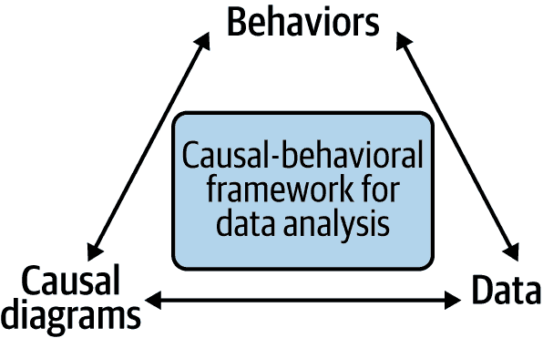
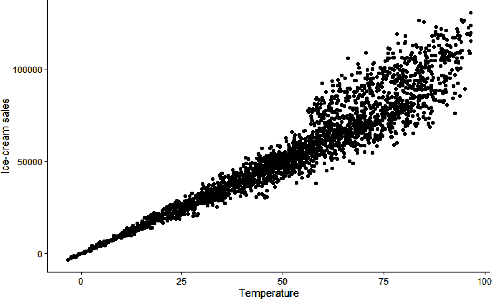
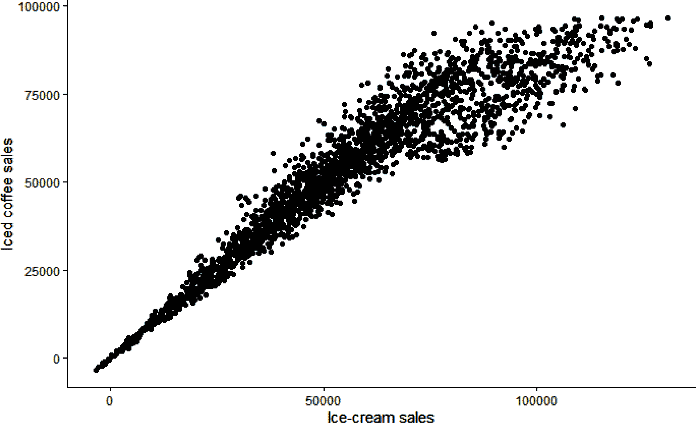
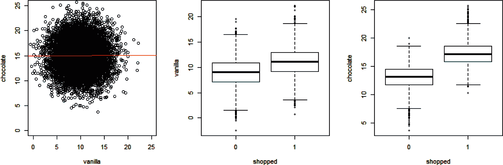
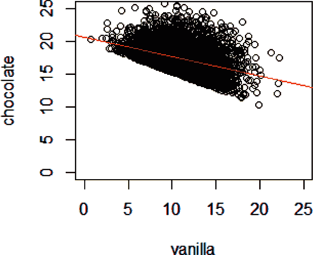

# 第一章：数据分析的因果行为框架

正如我们在前言中讨论的那样，理解驱动行为以便改变它们是应用分析的关键目标之一，无论是在商业、非营利组织还是公共组织中。我们想弄清楚为什么有人买了某样东西，为什么另一个人*没有*买。我们想知道为什么有人续订了他们的订阅，为什么有人选择联系客服而不是在线支付，为什么有人注册成为器官捐赠者，或者为什么有人给予非营利组织捐款。拥有这些知识使我们能够预测人们在不同情境下的行为，并帮助我们确定我们的组织可以采取什么措施来鼓励他们再次这样做（或者不这样做）。我认为通过将数据分析与行为科学思维和因果分析工具包相结合，可以最好地实现这一目标，从而创建一个被我称为“因果行为框架”的集成方法。在这个框架中，*行为*位于顶部，因为理解它们是我们的最终目标。通过使用*因果图*和*数据*来实现这种理解，它们形成了三角形的两个支柱（图 1-1）。



###### 图 1-1. 数据分析的因果行为框架

在本书的过程中，我们将探索三角形的每个支柱，并看到它们如何相互联系。在最后一章中，我们将通过一行代码实现我们所有工作的结合，而传统方法则会面临艰巨的任务：衡量客户满意度提高未来客户支出的程度。除了执行这些非凡的任务外，这种新框架还将使您能够更有效地执行诸如确定电子邮件营销活动或产品特性对购买行为的影响等常见分析。

在深入讨论之前，熟悉预测分析的读者可能会想知道为什么我推崇因果分析而不是预测分析。答案是，尽管预测分析在业务环境中已经（并将继续）非常成功，但在涉及人类行为的分析中，它们可能存在不足。特别是，采用因果方法可以帮助我们识别和解决“混杂”的问题，这在行为数据中非常常见。我将在本书的其余部分详细阐述这些观点。

# 为什么我们需要因果分析来解释人类行为

理解因果分析在分析领域中的位置将帮助我们更好地识别为何它在业务环境中是必需的。正如我们将看到的那样，这种需求源于人类行为的复杂性。

## 不同类型的分析

有三种不同类型的分析：描述性、预测性和因果性。描述性分析提供了数据的*描述*。简单来说，我把它看作是“是什么”或“我们已经测量到了什么”的分析。业务报告属于这一范畴。上个月有多少客户取消了他们的订阅？去年我们赚了多少利润？每当我们在计算平均数或其他简单指标时，我们都在隐含地使用描述性分析。描述性分析是最简单的分析形式，但也往往被人低估。许多组织实际上很难获得对其业务的清晰和统一的视图。要了解组织中这个问题的程度，只需向财务部门和运营部门提出同样的问题，然后衡量答案的差异有多大。

预测性分析提供了一个*预测*。我把它看作是“如果当前条件持续下去会怎样”或“我们还没有测量到的内容”的分析。大多数机器学习方法（例如，神经网络和梯度提升模型）属于这种类型的分析，并帮助我们回答诸如“下个月有多少客户会取消订阅？”和“那个订单是欺诈的吗？”等问题。在过去的几十年里，预测性分析已经改变了世界；企业雇佣的大量数据科学家就是其成功的证明。

最后，因果分析提供了数据的*原因*。我把它看作是“如果……会怎样？”或“在不同条件下将会怎样”的分析。它回答了诸如“下个月有多少客户会取消订阅，*除非我们给他们发优惠券*？”这样的问题。因果分析最著名的工具是 A/B 测试，又称随机实验或随机对照试验（RCT）。这是因为回答上述问题的最简单且最有效的方法是向随机选定的一组客户发送优惠券，然后查看与对照组相比有多少客户取消了订阅。

我们将在书的第四部分中讨论实验，但在此之前，在第二部分中，我们将看一看那个工具箱中的另一个工具，即因果图，它甚至可以在我们无法进行实验时使用。事实上，我一个目标就是让您更广泛地思考因果分析，而不仅仅是把它等同于实验。

###### 注意

虽然这些标签可能给人以整洁分类的印象，但实际上，在这三个类别之间存在更多的渐变，问题和方法在它们之间变得模糊。您还可能遇到其他术语，如*规范性分析*，它进一步模糊了界限，并添加了其他细微差别，但并没有显著改变整体情况。

## 人类是复杂的

如果预测性分析如此成功，而因果性分析使用的是与回归分析相同的数据分析工具，为什么不坚持使用预测性分析呢？简而言之，因为人类比风力发电机更复杂。人类行为：

具有多重原因

风力发电机的行为不受其个性，风力发电机社区的社会规范或其成长环境的影响，而任何单一变量对人类行为的预测能力几乎总是令人失望的，因为存在这些因素。

具有上下文相关性

对环境进行微小或表面的改变，比如改变选择的默认选项，可能会对行为产生很大的影响。从行为*设计*的角度来看，这是一种福祉，因为它使我们能够推动行为的变化，但从行为*分析*的角度来看，这是一种诅咒，因为这意味着每种情况在难以预测的方面都是独特的。

具有变量性（科学家会说是非确定性的）

同一个人在看似完全相同的情况下反复出现可能会表现出截然不同的行为，即使在控制了表面因素后也是如此。这可能是由于暂时的效应，比如情绪，或者长期效应，比如厌倦每天吃相同早餐。这两者都可以显著改变行为，但很难捕捉到。

具有创新性

当环境条件发生变化时，一个人可以转向一个他们以前从未表现过的行为，而且即使在最平凡的情况下也会发生这种情况。例如，你平时通勤的路上发生了一起车祸，所以你在最后一刻决定右转。

具有战略性

人类推断并对他人的行为和意图做出反应。在某些情况下，这可能意味着通过外部环境改变而被打乱的合作“修复”，使其更加牢固可预测。但在其他情况下，它可能涉及自愿模糊自己的行为，使其在像下棋这样的竞争性游戏中变得不可预测（或者欺诈！）。

人类行为的所有这些方面使其比物理物体的行为更不可预测。为了找到更可靠的分析规律，我们必须深入了解和衡量行为的原因。某人星期一早餐吃燕麦粥并采取了某条路线并不意味着他们星期二会做同样的事情，但您可以更有信心地说他们会有*一些*早餐，并会采取*某条*路线去上班。

# 混淆！让回归分析排除隐患的隐藏危险

我在前一节中提到，因果分析通常使用与预测分析相同的工具。然而，由于它们有不同的目标，这些工具的使用方式也不同。由于回归分析是这两种类型分析的主要工具之一，它可以很好地说明预测分析和因果分析之间的差异。对于预测分析适用的回归分析往往会对因果分析目的来说效果不佳，反之亦然。

预测分析的回归分析用于估计未知值（通常但不总是在未来）。它通过获取已知信息并使用各种因素来三角测量给定变量的最佳猜测值。重要的是预测值及其准确性，而不是预测是如何或为什么进行的。

因果分析也使用回归分析，但重点不在于估计目标变量的值。相反，重点在于该值的原因。从回归分析的角度来看，我们的兴趣不再是依赖变量本身，而是它与给定独立变量的关系。通过正确构建的回归分析，相关系数可以成为研究独立变量对依赖变量因果效应的便携式度量。

但是，对于此目的正确构建的回归分析意味着什么呢？为什么我们不能只是采用我们已经用于预测分析的回归分析，并将提供的系数视为因果关系的度量？我们不能这样做，因为回归分析中的每个变量都有可能修改其他变量的系数。因此，我们的变量组合必须经过精心设计，以不是创建最准确的预测，而是创建最准确的系数。两组变量通常是不同的，因为一个变量可以与我们的目标变量高度相关（因此具有高预测能力），而实际上不影响该变量。

在本节中，我们将探讨为什么这种视角上的差异很重要，以及为什么变量选择在行为分析中至关重要。我们将通过来自美国各地门店的虚构超市连锁企业 C-Mart 的一个具体例子来说明这一点。本书中使用的两家虚构公司之一，C-Mart 将帮助我们理解数字时代实体店公司数据分析的机遇和挑战。

## 数据

此章节的 [GitHub 文件夹](https://oreil.ly/BehavioralDataAnalysisCh1) 包含两个 CSV 文件，*chap1-stand_data.csv* 和 *chap1-survey_data.csv*，分别是本章两个例子的数据集。

Table 1-1 展示了关于 C-Mart 摊位上冰淇淋和冰咖啡销售日常水平的 *chap1-stand_data.csv* 文件中的信息。

表 1-1\. chap1-stand_data.csv 中的销售信息

| 变量名称 | 变量描述 |
| --- | --- |
| *冰淇淋销售额* | C-Mart 摊位的每日冰淇淋销售额 |
| *冰咖啡销售额* | C-Mart 摊位的日销量 |
| *夏季月份* | 表示日期是否在夏季月份的二进制变量 |
| *温度* | 当天和该摊位的平均温度 |

表 1-2 显示了来自 chap1-survey_data.csv 的路人通过 C-Mart 摊位调查的信息。

表 1-2\. 第一章调查数据在 chap1-survey_data.csv 中

| 变量名称 | 变量描述 |
| --- | --- |
| *香草口味* | 受访者对香草的口味偏好，0-25 |
| *巧克力口味* | 受访者对巧克力的口味偏好，0-25 |
| *购物* | 表示受访者是否曾在当地 C-Mart 摊位购物的二进制变量 |

## 为什么相关性不是因果关系：混杂因素的作用

C-Mart 在每家店铺都设有冰淇淋摊位。公司认为天气影响每日销量——或者用因果关系的术语来说，天气是销量的原因之一。换句话说，在其他条件不变的情况下，我们假设人们更可能在炎热的天气购买冰淇淋，这在直觉上是有道理的。这种信念得到了历史数据中温度和销量之间强相关性的支持，如图 1-3 所示（相应的数据和代码在本书的 GitHub 上）。



###### 图 1-3\. 根据观测温度销售冰淇淋的函数图

如前言所述，我们将使用回归作为主要的数据分析工具。运行冰淇淋销售额对温度的线性回归只需一行代码：

```py
## Python (output not shown)
print(ols("icecream_sales ~ temps", data=stand_data_df).fit().summary())
```

```py
## R
> summary(lm(icecream_sales ~ temps, data=stand_dat))
...
Coefficients:
             Estimate Std. Error t value Pr(>|t|)    
(Intercept) -4519.055    454.566  -9.941   <2e-16 ***
temps        1145.320      7.826 146.348   <2e-16 ***
...
```

对于本书的目的，在输出中最相关的部分是*系数*部分，它告诉我们估计的截距——理论上的零温度下的平均冰淇淋销售额为−4,519，这显然是一个不合理的外推。它还告诉我们温度的估计系数为 1,145，这意味着每增加一度温度，冰淇淋销售额预计会增加 1,145 美元。

现在，让我们假设我们处于十月一个特别温暖的周末，根据模型的预测，公司提前增加了冰淇淋摊位的库存。然而，尽管这个十月的这个星期销量比平时高，但却远低于模型预测的数量。糟糕！发生了什么？数据分析师应该被解雇吗？

发生的事情是，模型没有考虑到一个关键的事实：大部分冰淇淋的销售发生在夏季，孩子们放暑假的时候。回归模型根据可用的数据做出了最佳预测，但由于增加的冰淇淋销售（学生暑假）部分归因于温度，因为夏季月份与温度呈正相关。由于十月份的温度增加并没有突然导致暑假（对不起，孩子们！），所以我们在那个温度下看到的销售量比夏季日子要少。

从技术角度来看，年月份是我们在温度和销售额之间关系的混杂因素。*混杂因素*是引入回归中偏差的变量；当混杂因素存在于你分析的情况中时，这意味着将回归系数解释为因果关系将会导致不正确的结论。

让我们想象一下像芝加哥这样的地方，那里有大陆性气候：冬天非常寒冷，夏天非常炎热。当比较一个随机炎热的日子和一个随机寒冷的日子的销售额时，如果没有考虑到它们各自的年月，你很可能在比较放暑假的炎热夏季日子的销售额和放学孩子们的寒冷冬季日子的销售额；这会夸大温度与销售额之间的表面关系。

在这个例子中，我们也许会预期在寒冷天气下销售量一直被低估。事实上，在夏季月份存在一种范式转变，当必须完全通过温度来管理这种转变时，在线性回归中，温度的回归系数对于较高温度来说会过高，而对于较低温度来说则会过低。

## 太多的变量可能会破坏原来的关系

解决混杂因素问题的一个潜在方法是将尽可能多的变量添加到回归模型中。这种“什么都包括在内”的思维方式在统计学家中仍有支持者。在《因果之书》中，朱迪亚·珀尔和达纳·麦肯齐提到，“一位领先的统计学家最近甚至写道，‘避免对一些观察到的协变量进行条件化...是非科学的特别策略’”（珀尔和麦肯齐，2018 年，第 160 页）^(2)。这在数据科学家中也是非常普遍的。公平地说，如果你的目标只是预测一个变量，并且你有一个经过精心设计以在测试数据之外进行足够泛化的模型，并且你不关心为什么预测变量取特定值，那么这是一个完全有效的立场。但是，如果你的目标是理解因果关系以便采取行动，那么这种方法就不适用了。因此，仅仅是向模型添加尽可能多的变量不仅效率低下，而且可能完全适得其反并且误导性极大。

让我们通过我们的例子来演示这一点，通过添加一个我们可能倾向于包括但会使我们的回归产生偏见的变量。我创建了变量 *IcedCoffeeSales*，它与 *Temperature* 相关，但与 *SummerMonth* 不相关。让我们看看如果我们在 *Temperature* 和 *SummerMonth*（一个二进制变量，指示月份是否为 7 月或 8 月（1），或其他任何月份（0））之外添加这个变量会发生什么：

```py
## R (output not shown)
> summary(lm(icecream_sales ~ iced_coffee_sales + temps + summer_months))

```

```py
## Python 
print(ols("icecream_sales ~ temps + summer_months + iced_coffee_sales", 
             data=stand_data_df).fit().summary())
...
                    coef    std err     t      P>|t|    [0.025     0.975]
----------------------------------------------------------------------------
Intercept         24.5560   308.872   0.080    0.937   -581.127    630.239
temps          -1651.3728  1994.826  -0.828    0.408  -5563.136   2260.391
summer_months   1.976e+04   351.717  56.179    0.000   1.91e+04   2.04e+04
iced_coffee_sales  2.6500     1.995   1.328    0.184     -1.262      6.562
...
```

我们看到 *Temperature* 的系数从之前的例子中显著偏移，现在变为负值。*Temperature* 和 *IcedCoffeeSales* 的高 p 值通常被视为有问题的迹象，但由于 *Temperature* 的 p 值“更差”，分析师可能会得出应将其从回归中移除的结论。这怎么可能呢？

数据的真相（已知，因为我制造了这些关系并在这些关系周围随机化了数据）是，当天气炎热时，人们更有可能购买冰咖啡。在炎热的日子里，人们也更有可能购买更多冰淇淋。但单单购买冰咖啡本身并不会使顾客更有可能购买冰淇淋。夏季月份与购买冰咖啡也没有相关性，因为学童对冰咖啡需求不是一个重要因素（详见边栏中的数学细节）。

图 1-4 显示了冰咖啡销量与冰淇淋销量之间的正相关性，因为在天气变暖时两者都会增加，但在夏季增加的冰咖啡销量可以通过与温度变量的共同相关性来解释。当回归算法试图使用手头的三个变量解释冰淇淋销量时，温度变量对冰咖啡销量的解释能力被添加到温度变量中，而冰咖啡则被迫弥补温度的压倒性影响。尽管冰咖啡销量在统计上并不显著且系数相对较小，但销售额远高于温度的度数，因此最终冰咖啡销量抵消了温度系数的膨胀。



###### 图 1-4\. 冰咖啡销量与冰淇淋销量的绘图

在前面的例子中，将变量 *IcedCoffeeSales* 添加到回归中使得温度与冰淇淋销量之间的关系变得混乱。不幸的是，反过来也是可能的：在回归中包含错误的变量可能会产生虚假的关系。

继续我们在 C-Mart 的冰淇淋示例，假设类别经理有兴趣了解顾客口味，所以他们让一个员工站在店外，调查路过的人，问他们对香草冰淇淋和巧克力冰淇淋的喜爱程度（都在 0 到 25 的范围内），以及是否曾经购买过摊位上的冰淇淋。为了简化，我们假设该摊位只销售巧克力和香草口味的冰淇淋。

为了例子简单，让我们假设对香草口味和巧克力口味的喜好完全没有相关性。有些人喜欢其中一种但不喜欢另一种，有些人两种都喜欢，有些人一种比另一种*更喜欢*，等等。但所有这些偏好都会影响某人是否购买冰淇淋，这是一个二元（是/否）变量。

因为变量*购物*是二元的，所以如果我们想要衡量*Taste*变量之一对购物行为的影响，我们将使用 logistic 回归。由于这两个*Taste*变量是不相关的，如果我们将它们相互绘制，我们将看到一个没有明显相关性的常规云；然而，它们各自影响购物在冰淇淋摊的概率（图 1-5）



###### 图 1-5\. 左图：整体人群中对香草和巧克力的口味没有相关性；中图：在冰淇淋摊购物的人对香草的口味比不购物的人高；右图：对巧克力的口味结果相同

在第一个图中，我添加了一条最佳拟合线，几乎是平的，反映了变量之间缺乏相关性（相关系数等于 0.004，反映了抽样误差）。在第二和第三个图中，我们可以看到整体上购物者（*购物* = 1）对香草和巧克力的口味平均较高，这是合理的。

到目前为止，一切都很好。假设你收到调查数据后，你的商业伙伴告诉你，他们正在考虑为冰淇淋摊引入一个优惠券激励措施：购买冰淇淋时，您可以获得未来访问的优惠券。这种忠诚度激励措施不会影响从未在摊位购物过的受访者，因此相关人群是那些曾在商店购物过的人。商业伙伴正在考虑在优惠券上使用口味限制来平衡库存，但不知道口味选择会受多大影响。如果购买了香草冰淇淋的顾客得到了一张 50%折扣的巧克力冰淇淋优惠券，除了增加废纸回收箱中的纸张外，还能起到什么作用吗？喜欢香草冰淇淋的人又如何看待巧克力冰淇淋呢？

你重新绘制了同样的图表，这次限制数据为那些对购物问题回答“是”的人（图 1-6）。



###### 图 1-6\. 购物者对香草和巧克力的口味偏好

现在这两个变量之间有强烈的负相关（相关系数为-0.39）。发生了什么？来到你的摊位的香草爱好者会变成巧克力的讨厌者，反之亦然吗？当然不是。这种相关性是在你限制到顾客时人为创造的。

让我们回到我们真正的因果关系：某人对香草的喜好越强，他们越有可能在你的摊位上购物，巧克力也是如此。这意味着这两个变量有累积效应。如果某人对香草和巧克力冰淇淋的喜好都较弱，他们很少会在你的摊位上购物；换句话说，你的顾客中大多数对香草口味不强的人对巧克力口味非常强烈。另一方面，如果某人对香草口味很强，即使对巧克力口味不是很强，他们也可能会来你的摊位购物。你可以在之前的图表中看到这一点：对于香草的高值（比如超过 15），数据点中巧克力的值较低（低于 15），而对于香草的低值（低于 5），图表中的数据点只有巧克力的值较高（超过 17）。没有人的偏好发生了变化，但是对香草和巧克力口味都不强的人被排除在你的数据集之外。

这种现象的技术术语是[伯克森悖论](https://oreil.ly/KwJ1R)，但朱迪亚·珀尔（Judea Pearl）和丹娜·麦肯齐（Dana Mackenzie）用更直观的名称称之为“解释消除效应”。如果你的某个顾客非常喜欢香草味，这完全解释了他们为何在你的摊位购物，他们不“需要”对巧克力有很强的喜好。另一方面，如果你的某个顾客对香草味不够喜欢，这不能解释他们为何在你的摊位购物，他们必须对巧克力的喜爱高于平均水平。

伯克森悖论一开始是违反直觉且难以理解的。这可能导致数据偏差，这取决于数据的收集方式，甚至在开始任何分析之前就已经存在。一个经典的例子是，在看待医院患者群体与普通人群时，某些疾病表现出更高的相关性。实际上，发生的情况是，只有当两者同时存在时，某种疾病才足以使某人去医院；某人的健康状况只有在两种疾病同时存在时才会变得严重到需要住院。^(3)

# 结论

预测分析在过去几十年来取得了极大的成功，并且未来也将如此。另一方面，当试图理解和——更重要的是——改变人类行为时，因果分析提供了一个引人注目的替代方案。

然而，与预测分析不同，因果分析要求采用不同的方法。希望本章的例子已经让你相信，不能简单地将一堆变量放入线性回归或逻辑回归中，然后期待最好的结果（我们可能认为这是“把所有变量都包括进去，上帝会认出自己的”方法）。你可能仍然会好奇，其他类型的模型和算法是否对混淆因素、多重共线性和虚假相关性免疫？不幸的是，答案是否定的。如果有什么不同的话，这些模型的“黑匣子”性质意味着混淆因素可能更难以捕捉。

在下一章中，我们将探讨如何思考行为数据本身。

^(1) 公平地说，在许多情况下，它们*应该*不同，因为数据用于不同的目的并遵循不同的约定。但即使是你期望只有一个真正答案的问题（例如，“我们现在有多少名员工？”），通常也会显示出差异。

^(2) 你可能会想知道，前面提到的统计学家是唐纳德·鲁宾。

^(3) 从技术角度讲，这种情况略有不同，因为存在阈值效应而不是两个线性（或逻辑）关系，但包含错误变量可能导致人为相关性的基本原则仍然适用。
