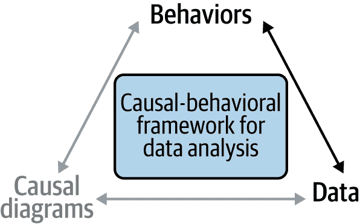
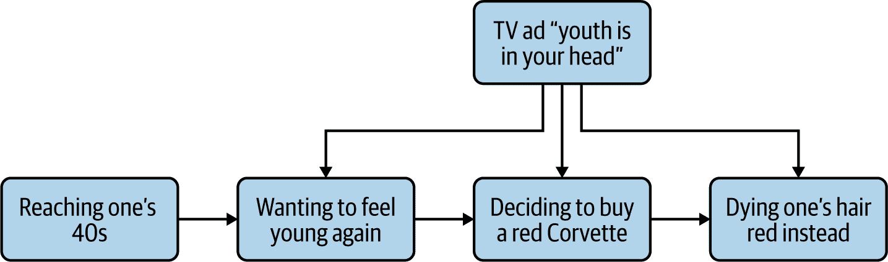
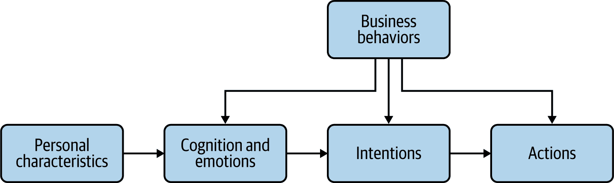

# 第二章. 理解行为数据

在第一章中，我们讨论了本书的核心目标是利用数据分析来了解驱动行为的原因。这需要理解数据和行为之间的关系，这在第一章中通过因果行为框架中的箭头表示（图 2-1）。

###### 图 2-1. 在本章中突出显示箭头的因果行为框架

请原谅这个流行文化的参考，但如果你看过《黑客帝国》，你会想起主角可以看着他周围的世界并看到其背后的数字。嗯，在本章中，你将学会看待你的数据并看到其背后的行为。

第一部分主要面向具有商业或数据分析背景的读者，并提供基本的“行为科学 101”介绍核心行为科学概念。如果你是经过训练的行为科学家，可能在这里找不到什么新东西，但你可能想浏览一下，以了解我使用的具体术语。

基于这种共识，第二部分将向你展示如何通过行为镜头来审视你的数据，并确定与每个变量相关的行为概念。在许多情况下，不幸的是，一开始一个变量与相应的行为只是松散相关的，因此我们还将学习如何“行为化”这样的偏离变量。

# 人类行为的基本模型

“行为”是一个我们非常熟悉的词，因为反复暴露，但很少，如果有的话，被正确定义。我曾经问过一个商业伙伴她试图鼓励什么行为，她的答案以“我们希望他们知道…”开始。在那一刻，我意识到两件事：（1）通过帮助澄清手头的目标，我可以为该项目增加比我最初预期的更多的价值，以及（2）我之前向她介绍的行为科学简介真的很糟糕，如果她仍然认为知道某事就是一种行为。希望这次我能做得更好，你能够从这一部分中学到增加组织价值的快乐。

实际上，我坚信行为思维的一个关键好处之一是让人们更加准确地思考他们试图做的事情。改变某人的想法并不等同于影响他们的行为，反之亦然。为此，我将提出一个简化但有希望可行的人类行为模型，首先以一个个人护理公司如何利用顾客的中年危机为例进行说明（图 2-2）。

###### 图 2-2. 我们关于中年危机的人类行为模型

在这个例子中，个人特征（进入 40 岁）导致情绪和思想（想要重新感受年轻），进而导致意图（决定购买一辆红色 Corvette）。这种意图可能会转化为相应的行为，也可能导致其他行动（比如染红头发），这取决于商业行为（播放电视广告）。

在某些情况下，我们可能试图影响的不是我们客户的行为，而是我们的员工、供应商等的行为。我们需要相应地调整这个模型，但直觉仍然是相同的：一方面，有一个我们试图影响行为的人类，另一方面，有我们的业务控制的所有过程、规则和决策（参见图 2-3）。

###### 图 2-3. 我们关于人类行为的一般模型

在这个模型中，个人特征影响认知和情绪，进而影响意图，从而影响行为。作为我们控制的过程、规则和决策的商业行为则影响这三类别。

在这里，有许多不同的模型，这其中没有一个是最终或神奇的。但是对于本书讨论的数据分析阶段而言，我觉得这五个组成部分最能对应你将会遇到的数据类型。让我们逐一来看看这些组成部分，回顾每个组成部分的定义，并探讨我们如何能够以道德的方式收集和处理关于每个组成部分的数据。

## 个人特征

收集和使用诸如年龄、性别和家庭状况等人口统计变量是应用分析的基础，而且理由充分：这些变量通常能很好地预测一个人会做什么。然而，作为行为数据分析师，我们需要更广泛和更精确地思考个人特征。对于我们的目的而言，我们将*个人特征*定义为所有我们对一个人拥有的信息，这些信息在我们分析的相关时间框架内变化很少或者变化很慢。

回到 C-Mart 冰淇淋摊的例子，这意味着包括诸如个性特征和生活方式习惯之类的因素。假设你的一个顾客具有很高的经验开放性，并且总是愿意尝试一些新的口味组合，比如蓝莓和奶酪；你可以合理地将这种特质视为你分析中的一个稳定个人特征，尽管心理学告诉我们，个性在某人一生中会以可预测的方式发生变化。另一方面，一个展望未来几十年的城市规划师可能不仅要考虑生活方式习惯逐渐变化，还要考虑这些变化方向本身是否在改变。在这个意义上，我把个人特征看作是“主要原因”，定义为避免无限回归：我们追踪它们的变化，但忽略它们自身的原因。

虽然人口统计变量在相对稳定性和首要性方面符合上述定义，但将它们视为认知、情感、意图和行为的原因可能并不立即清晰。有些读者甚至可能不愿意说年龄或性别导致某人做某事，因为这听起来可能像是社会决定论。

我认为我们可以通过在概率意义上将原因定义为“贡献因素”来解决这些问题。到了 40 岁并不是发生中年危机的必要条件，也不是充分理由；而发生中年危机也不是购买红色雪佛兰的必要条件，也不是充分理由。事实上，这两种因果关系与其他贡献因素紧密相连：年龄对存在主义困扰的贡献依赖于职业和家庭轨迹等社会模式（例如，某人进入劳动市场的年龄或者生第一个孩子的年龄，如果他们做了其中的任何一个），而通过消费来解决这些困扰则仅在有足够的可支配收入时才可能。这也取决于一个人受广告影响的程度。

如行为科学的格言所述，“行为是个体和环境的函数”，社会因素往往比人口统计变量更具有影响力。从因果建模和数据分析的角度来看，社会现象与个人特征之间的这种相互作用可以通过调节和中介的方式来捕捉（我们将在第十一章和第十二章进行探讨）。

在这个意义上，人口统计变量在行为数据分析中通常非常有用，因为它们的预测能力暗示了其他更心理和可操作的个人特征（它们是一个贡献因素）。例如，在美国和许多其他国家，执法和护理仍然是明显性别化的领域。注意到这种实证规律不太可能为你赢得任何赞扬。更有趣的问题是这种效应是如何发生的。例如，一个假设是这种效应源于关于权威和关怀的社会表征和规范。或者，也可以假设这种现象是因为缺乏其他角色模型而自我延续的。确定哪种假设是真实的（或者如果两种都是真实的，哪种更有说服力）可能会导致对高中生进行更有效的职业咨询。

### 收集数据与伦理考虑

人口统计信息在业务分析中广泛可得且被使用（甚至可以说被过度使用）。主要挑战在于识别和衡量其他个人特征，以便正确地分配它们对行为的影响，而不是不适当地归因于人口统计变量。市场和用户研究在这里非常有用。

从伦理角度来看，错误归因的影响也很重要：在许多情况下，歧视可以被视为有意或无意地将行为（当前或预测的）错误归因于人口统计变量。即使你的分析是正确的，你也需要确保它不会无意中加强优势和劣势的模式。

## 认知与情绪

*认知与情绪* 是我用来涵盖情绪、思维、心理模型和信念等心理状态的一个术语。你可以把它看作是客户大脑中除了意图和更持久的个人特征之外的所有事物。例如，潜在客户是否知晓您的公司及其产品或服务？如果知晓，他们对此有何看法？他们对银行运作的心理模型是什么？每当他们看到路上一辆光鲜亮丽的特斯拉时，他们是否会感到羡慕？

认知与情绪涵盖了所有这些，以及更模糊的商业术语和短语，如*客户满意度*（CSAT）和*客户体验*（CX）。CX 已成为业务的口号：许多公司都设有 CX 团队，并举办与此主题相关的会议、咨询和书籍。但它究竟是什么？你能够衡量它的原因和影响吗？可以，但这需要知识谦逊和愿意花时间进行侦查工作。

### 收集数据与伦理考虑

认知和情绪在两个方面类似于心理学的个人特征：它们通常不能直接观察，相关数据是通过调查或在用户体验（UX）观察期间收集的。重要的是要注意，除非你使用生理测量，否则你将依赖于 *陈述* 或 *观察到* 的测量。

这就带来了用户体验（UX）或人本设计与行为科学之间最大的区别之一：UX 的假设是人类知道他们想要什么，他们对某事感觉如何，以及为什么，而行为科学则从我们对自己头脑中发生的许多事情毫无察觉的假设开始。用一个法律比喻来说，行为科学家经常将某人说的话视为不可信，直到证明是可信的，而 UX 研究人员会将其视为诚实，直到证明是误导的。

但我不想夸大这种区别，实践中这种区别经常变得模糊不清，这取决于手头的情况。如果一位行为科学家被客户告知一个网站使用起来令人困惑和沮丧，他们将借鉴 UX 的做法，并相信客户确实体验到了负面情绪。相反，当进行基础产品研究时，一位技术娴熟的 UX 研究员通常会超越表达的意图，试图识别客户更深层次的需求。

从道德的角度来看，试图改变某人的认知和情绪显然是一个灰色地带。在这方面，我推荐的试金石是“NYT”测试：你的意图和方法是否善良且透明，以至于你的老板的老板看到它们出现在 *纽约时报* 的头版时不会介意？广告努力影响人们的想法和情绪，但我不指望会看到一个标题写着“公司花费数十亿让人们想要他们的东西”；无论如何都会引起大家的打哈欠。另一方面，“滑坡”——诸如“现在有三个人正在看这个房产！”之类的操纵性行为科学把戏——和老式的谎言是过不了这个测试的。这仍然留下了许多诚实的机会来应用行为科学：例如，以更符合客户心理模型的术语解释产品的好处，或者使购买体验更轻松或更愉快。因为本书的主题是数据分析而不是行为设计，所以我们只会看如何分析这种干预措施，而不是如何开发它们。

## 意图

当有人说“我要做 X 事情”，不管 X 是为一周的杂货购物还是预订假期，他们表达了一种 *意图*。因此，意图将我们带向行动的一步。

从技术上讲，意图是一种心理状态，可以被包括在先前的认知和情感类别中，但由于其在应用行为数据分析中的重要性，我认为它应该有自己的类别。除非你计划强迫客户走特定的路径（例如，从网站上删除电话号码以防他们给你打电话），否则你通常需要将他们的意图作为行为变化的导管。

此外，人们经常无法完成他们想做的事情，这个概念在行为科学中被称为意图行动差距（例如，想想新年决心经常被打破的情况）。因此，驱动客户行为的关键是确定潜在的反应是因为客户*不想*采取行动，还是因为意图和行动之间发生了某些事情。

### 数据收集和道德考虑

在业务的一般过程中，我们通常没有关于意图的直接数据。因此，大多数数据将来自客户的声明，通常通过两个来源：

调查

这些可以是“当时发生的”（例如，在访问网站或商店结束时）或异步的（例如，通过邮件、电子邮件或电话进行）。

用户体验观察

在这些用户体验观察中，UX 研究人员要求受试者经历某种体验，并收集关于他们意图的信息（通过要求他们在过程中大声思考或事后提问，比如，“那时你想做什么？”）。

或者，我们经常试图从观察到的行为中推断意图，这在分析中被称为“意图建模”。

从道德的角度来看，影响某人的意图是广告、营销和说服的黑暗艺术的目标。这是可行的，我真诚地相信在许多情况下甚至可以在道德上做到，正如 UX 和行为研究人员所努力的那样。但简单的事实是，这通常很难做到，而且可能适得其反。识别那些可以帮助客户弥合意图行动差距的地方则简单得多且更安全。换句话说，在我们的模型中，一个“痛点”通常反映了实现意图的障碍。

## 行动

*行动*是*行为*的基本单位，我经常交替使用这两个词。我经常告诉人们的经验法则是，如果你当时在房间里，应该能够观察到一个行动或行为，而不必问这个人。“在亚马逊上购买东西”是一个行动。在亚马逊上“阅读产品评论”也是行动。但“知道某事”或“决定在亚马逊购买某物”不是。除非你问他们或看到他们行动（这是一个结果但不是同一件事），否则你无法知道某人已经做出了决定。

行动或行为通常可以在不同的粒度级别上定义。“去健身房”是可观察的，在许多情况下这是一个可以接受的细节水平。如果你给人们寄送免费访问的优惠券并且他们到场，你已经达到了你的目标，不需要更深入地思考。然而，如果你正在开发一个健康应用程序，并且希望确保人们按照他们的计划保持进度，你需要比这更详细。我曾参加过行为科学家史蒂夫·温德尔的演讲，他在演示中详细讲解了“去健身房”的每一个步骤（穿上健身服装，去到车上，决定一旦到达健身房要做什么锻炼等）。如果你试图识别和解决行为障碍，这通常是你需要采用的详细程度。同样的情况也适用于网站或应用程序中的客户旅程。什么是“注册”意味着什么？他们需要检索和输入哪些信息？你要求他们做出哪些选择？

### 收集数据及道德考量

行动或行为数据通常代表可用客户数据中最大的类别，并且通常归类为“交易数据”。然而，在许多情况下，这些数据需要额外的处理才能真正反映出行为。我们将在本章的第二部分更详细地探讨这一点。

如果你的目标是员工行为（例如在人员分析或减少流失方面），数据可能会更加稀缺和难以获取，因为通常需要从业务流程软件中提取，并且可能并非常规记录。

让我们明言不讳：行为分析的最终目标是修改行为。在某些情况下，这可能非常简单：如果你从网站上删除客服电话号码，就会减少打电话给你的人数。这是否是一个好主意则是另一回事。显然，行为修改有时可能非常困难，正如行为改变的大量和增长的文献所示。^(1)

无论如何，修改行为的目标都伴随着道德责任。在这里，纽约时报的问题是我推荐的试金石。

## 业务行为

我们需要考虑的最后一个数据类别是*业务行为*：组织或其员工对客户（或员工行为是你的焦点的情况下）产生影响的事物。这包括：

+   通信，如电子邮件和信件

+   网站语言的更改或呼叫中心代表的对话路径的更改

+   业务规则，例如客户奖励的标准（例如，“如果客户在过去六个月内花费了 X 美元，请给他们寄送优惠券”）或招聘决策

+   个体员工的决策，例如将客户账户标记为潜在欺诈或提升另一名员工

### 收集数据

商业行为对行为数据分析师来说既是一种祝福又是一种诅咒。一方面，从干预设计的角度来看，它们是我们驱动个人行为的主要杠杆之一：例如，我们可以修改一封信的内容或电子邮件的频率，以说服客户按时付款。因此，商业行为是一种极其宝贵的工具，没有它，我们的工作将变得非常困难，而且当我们自己对商业行为进行更改时，通常很容易收集相应的数据。商业行为的另一个优势是，在数据收集方面没有太多道德考虑：组织通常可以在正常业务过程中自由收集关于其自身运营和员工行为的数据（尽管当然也有一些情况被认为是侵犯隐私）。

另一方面，从数据收集和分析的角度来看，商业行为可能是分析师的噩梦：就像水对鱼一样，它们可能对组织来说是看不见的，它们对个人行为的影响就变成了难以解决的噪音。这发生的原因有两个。

首先，许多组织，如果他们根本就追踪商业行为，往往不会像追踪客户行为那样以相同的详细程度进行追踪。假设 C-Mart 在 2018 年夏季试验性地缩短了营业时间，导致销售暂时下降。光凭数据就难以找出原因！许多业务规则，即使它们在软件中实现了，也根本没有以机器可读格式记录在任何地方。如果相应的数据确实已记录，通常仅存储在部门数据库（或更糟的是，Excel 文件）中，而不是企业数据湖中。

其次，商业行为可能会影响对客户行为变量的解释。最明显的例子就是 *诱惑*，即有意引入的摩擦和误导性沟通，以混淆客户。想象一下，在网站上有一个表格，当你输入你的电子邮件地址时，自动勾选了你在表格开始时取消选中的“我想接收营销邮件”的框。那个被勾选的框是否真的表示客户想要接收营销邮件？除了这些明显的例子之外，商业行为可能隐藏在许多客户行为背后，尤其是在销售领域。许多购买倾向模型应该注明“在我们的销售团队决定联系的人群中”。悖论的是，尽管销售代表的薪酬结构通常是商业领导者最着迷的杠杆之一，但它很少被纳入客户购买行为模型中。

最终，获取有关业务行为的可靠数据，尤其是随着时间推移，对于行为数据分析师来说可能是一项艰巨的挑战——但这也意味着这是他们在进行任何分析之前为组织创造价值的一种方式。

# 如何连接行为和数据

个人特征、认知和情感、意图、行为和商业行为：这些是我们可以用来代表和理解我们的世界的概念，作为行为数据分析师。然而，连接行为和数据并不简单地将手头的变量分配到这些桶中的一个。仅仅“涉及行为”并不足以使变量有资格成为“行为数据”；正如我们在前一节中看到的，例如，一个据称是关于客户行为的变量可能实际上只反映了一个业务规则。在本节中，我将为您提供一些提示，以使您的数据具有行为化，并确保它尽可能与其应该代表的定性现实密切匹配。

为了更具体化，我们将看看我们的第二个虚构公司，Air Coach and Couch（AirCnC），一个在线旅行和住宿预订公司。 AirCnC 的领导层已要求他们的分析师衡量客户满意度对未来购买行为的影响，即在预订后的六个月内的支出量（*M6Spend*），这是他们的关键绩效指标之一。我们将在本书结尾，在第十二章回答这个常见但棘手的业务问题。现在，我们只是看看如何开始构思这个问题。

## 培养行为完整性心态

由于行为科学在企业中尚属新兴，你通常会成为第一个将这种视角带入组织数据的人，而该数据很可能包含数十个，甚至数百个或上千个变量。这是一项艰巨的任务，但采取正确的心态将有助于你理清头绪并开始工作。

想象一下，你是一名新被指派负责维护一座桥梁的结构工程师。你可以从一端开始，逐英寸（或逐厘米）评估其完整性，直到到达另一端，然后制定一个十年计划来实现完美的结构完整性。与此同时，坑洼变得越来越严重，危及驾驶者的安全，损坏他们的车辆。更合理的方法是快速浏览一下，优先解决可以迅速修复的主要问题，并确定临时解决方案的地点，直到你有时间和预算来进行更多的结构性变更为止。

同样的思维方式也适用于你的数据。除非你碰巧是初创企业的第一批员工之一，否则你将处理现有数据和遗留流程。不要惊慌，也不要按字母顺序浏览你的表格列表。从一个具体的业务问题开始，并按照它们对业务问题重要性递减的顺序识别最可能不准确的变量：

1.  兴趣的原因和效果

1.  中介变量和调节变量，如果相关

1.  任何潜在的混杂因素

1.  其他非混杂独立变量（也称为协变量）

在过程中，你将不得不做出判断：例如，你应该在分析中包含某个变量吗？还是它定义得如此不清晰，以至于最好不要包含它？不幸的是，并没有清晰的标准来正确地做出这些决定；你将不得不依靠你的商业感觉和专业知识。然而，有一种明确错误的做法：假装它们不存在。一个变量将被包括或不包括在你的分析中，这是无法回避的事实。如果你的直觉倾向于包含它，那么记录为什么，描述潜在的错误源，并指出如果该变量被省略，结果会有何不同。正如一位用户体验研究员在与我友好交谈时所说，作为商业研究人员意味着不断地弄清楚“你能够做什么”。

## 不信任和验证

不幸的是，在许多情况下，数据记录的方式受业务和财务规则的驱动，以事务为中心，而不是以客户为中心。这意味着在证明无罪之前，你应该将变量视为可疑：换句话说，不要自动假设变量 *CustomerDidX* 表示客户做了 X。它可能意味着完全不同的事情。例如：

+   客户在不阅读提到他们同意 X 的详细信息的小字条款的情况下勾选了一个框。

+   客户没有说任何话，因此我们默认他们选择了 X。

+   客户声明他们做了 X，但我们无法验证。

+   我们从供应商那里购买了数据，表明客户在他们生活的某个时刻经常做 X。

即使客户实际上做了 X，我们也不能假设他们的意图。他们可能做了这个：

+   因为我们发送了他们一封提醒邮件

+   四次因为页面没有刷新

+   他们误以为自己真正想做 Y

+   一周前，但由于监管约束，我们今天才记录它。

换句话说，用《公主新娘》中的一句流行台词来说：“你一直在使用那个变量。我觉得它并不是你认为的意思。”

## 确定类别

正如 AirCnC 的领导所述，他们要求分析师了解 CSAT 对购买行为的影响，这是一个艰巨的任务。我们的第一步是弄清楚我们在谈论什么。

在我大学的第一年，我的哲学教授会给我们一些如“进步是什么？”和“人与机器”的论文题目。除此之外，如果我们卡壳了，他还提供了一些极好的建议：用他的话说，我们应该弄清楚，“这是哪本书的一章。” 矛盾的是，当一个问题看起来令人望而却步且难以解决时，询问它属于哪个更广泛的类别通常会有所帮助。

幸运的是，作为行为数据分析师，我们不需要在国会图书馆里漫游以寻找灵感；我们在本章节早期定制的分类就能发挥作用：

+   个人特征

+   认知和情感

+   意图

+   行为（又称行为）

+   商业行为和流程

让我们通过排除法进行。客户满意度并非固定不变，因此不属于个人特征的一部分。它既不是人们做的事情，也不是人们打算去做的事情，因此也不是行为或意图。最后，它也不仅仅是在业务层面上发生的事情，因此也不是商业行为或流程的一部分。因此，客户满意度是认知和情感的一部分，与它相似的客户体验也是如此。我们业务问题的第二个变量，“购买行为”，要分类起来容易得多：显然它是客户行为。

根据我的经验，许多商业分析项目失败或成果低迷，因为分析师没有澄清项目的核心。组织总是有一个主导的目标指标——公司的利润，非营利组织的客户结果等等。在更低层次上，部门通常有他们自己的目标指标，比如客户体验团队的净推荐值，IT 的停机百分比等等。如果业务伙伴要求您衡量或改善一个看似与这些目标指标无关的变量，通常意味着他们心中有一个隐含的可能有问题的行为理论将两者联系起来。

“客户参与度”，这是行为科学家经常被要求提高的另一个流行概念，是一个很好的例子。这并不是一个明确的概念，因为它可能真正指的是两种不同的事物：

+   一种行为，即与业务的广泛互动模式：如果客户 A 更频繁地登录网站并花费更多时间浏览，他被认为比客户 B 更参与其中。

+   一个认知或情感，比如当观众因为沉浸在电影或课程的流程中并渴望知道接下来会发生什么时，“参与”。

的确，我坚信对这两者之间的混淆解释了初创企业和更广泛的数字世界对参与度指标的吸引力，尽管它们可能具有误导性。例如，在第一种意义上，当我的洗衣机停止工作时，我与它的关系更为密切；但这并不转化为第二种意义上的愉悦和渴望。试图将参与作为行为来增加的组织通常对结果感到失望。当作为行为的参与不能转化为作为情感的参与时，它不会带来诸如更高忠诚度和留存率等期望的结果。

作为一个个人例子，一个商业伙伴曾经请我帮忙让员工进行某种培训。经过一些讨论，很快明确了她真正想要的是让员工遵守一个业务规则；她认为员工之所以不遵守是因为他们对规则了解不足。我们把项目重心转向了理解为什么员工不遵守规则以及如何鼓励他们这样做。简而言之：要警惕那些自我诊断的病人！

现在我们可以在我们的人类行为模型中重塑我们的业务问题：AirCnC 的领导们想知道认知/情感是否影响客户的行为，如果是的话，影响有多大。实际上，在绝大多数业务分析问题中，涉及的变量至少有一个是行为，要么是客户的行为，要么是业务的行为。如果我们给客户发送跟进电子邮件，他们会更满意吗？满意的客户更有可能购买吗？

如果在确定了相关变量的类别之后，其中没有一个属于客户或业务行为类别，这应该引起警觉。这表明一个没有明确“所以呢？”的业务问题。比如说，年长客户更满意。所以呢？我们要用这些信息做什么？业务结果是由行为驱动的，不管是我们自己的行为还是我们客户的行为。

一旦你确定了相关的行为，就该深入挖掘相应的变量了。

## 精炼行为变量

正如我之前提到的，一个变量“关于行为”并不等同于一个行为变量。通常你需要对它们进行转换，使它们真正成为行为变量。

让我们专注于客户行为，因为它们更直观，但逻辑类似适用于业务行为。一个良好的行为变量将具备以下特征：

可观察

正如在第一章中提到的，行为在原则上是可观察的。如果你在客户身边，你能*看见*他们这样做吗？在预订过程中放弃预订是可观察的；改变主意则不是。一个很好的线索是，如果它没有时间戳，那么它可能不够具体和细化。

个体化

企业经常依赖于汇总指标，如比率或比例（例如，取消账户的客户比例）。汇总指标可以提供有用的快照以供报告之用，但它们可能会受到偏见和混淆因素的影响，例如人口组成的变化（即客户组合），特别是当它们基于时间间隔计算时。

例如，假设一次成功的营销活动将大量新用户带到了 AirCnC 的网站上。同时假设在这个业务线上，相当大比例的新客户在第一个月取消了他们的账户。因此，在活动后的一个月里，AirCnC 的每日取消率可能会急剧上升，即使没有任何问题发生。一个好的经验法则是，健全的汇总变量建立在健全的个体变量基础之上。如果一个变量只在汇总时有意义，并且在个体水平上没有有意义的解释，那就是一个警示信号。在我们的例子中，取消率的有意义的个体对应物将是取消概率。在控制个体特征和与公司的任期时，这个指标将保持稳定，尽管有大量新客户的涌入。

原子

同样，企业经常会汇总一系列不同行为，这些行为有着共同的意图。例如，AirCnC 客户修改他们的账单地址可能有三种不同的方式：通过账户设置、在预订时编辑信息，以及联系客服中心。这些方式在观察客户时看起来可能不同，但在数据库中可能会以类似的方式记录。再次强调，我并不想暗示汇总的行为变量本质上是不好的。当然，有些分析需要使用二元变量*ChangedBillingInformation*。但至少，你应该了解可以采用的具体方式，并且尽可能检查你得出的总体结论是否适用于每一种方式。

在许多情况下，确定或创建令人满意的行为变量涉及到“亲手动手”。用于分析或研究目的的数据库通常提供了“精简过”的真实版本，如交易数据库中所示，仅列出最新的、经过审查的信息。这在大多数情况下是有道理的：如果客户预订了并取消了，并且已退款，我们不希望该金额计入*AmountSpent*变量。毕竟，从业务角度来看，AirCnC 并没有保留那笔钱。然而，从行为学角度来看，该客户与同一时间段内没有进行任何预订的客户是不同的，因此在某些分析中考虑这一点是相关的。不要去学习像 COBOL 这样的古老编程语言来访问最底层的数据库，但值得稍微深入你平常美丽表格之外的地方稍作探索。

## 理解背景

重申一下，“行为是人与环境的函数”是行为科学中的基本原理。尽管个人变量当然很重要，但我觉得分析师们往往过于依赖它们，因为它们易于获取，结果可能没有足够地考虑到背景变量。

通常理解人们行为背景的最佳方式是通过定性研究，如访谈和调查，这些见解可以用来生成新的变量。在这里，我将重点介绍如何从现有数据中提取背景信息：

这是时候了。

正如前面提到的，行为是可观察的。在理论上，甚至在实践中，都可以确定它发生的时刻，这要归功于时间戳。时间戳对于行为分析师来说是金子般珍贵的，因为它们提供直观且通常可操作的见解。毫不奇怪，没有现成的算法可以提取这些，只能依赖商业直觉和问题的特定性。我将给出寻找的最常见线索：

频率

在行为和更广泛地说，事件数据中，自然的倾向是查看*频率*，即单位时间内的事件/行为次数。不幸的是，频率数据有时会表现不佳，并展示出不反映行为变化的人为不连续性。例如，假设一个 AirCnC 的客户每年夏天和冬天都度假，这意味着每年预订两次。然而，有一年他们将冬季度假从 12 月改到了 1 月。我们将在前一年计算一次假期，而在后一年计算三次，即使行为实际上并没有改变。这种赶上现象——较长时间跟随较短时间，最好通过直接跟踪持续时间来理解。对于其他行为，过去的事就让它过去吧，频率将是更稳健的度量标准。

持续时间

持续时间也提供了一种衡量衰减效应的自然方法。很久以前发生的事情或您所做的事情往往比最近发生的事情效果小。这通常使持续时间成为一个良好的预测变量。如果一个顾客在五年前经历了糟糕的 AirCnC 体验后仍未离开，那么这可能不再对他们的决策产生太大影响，最好是根据它们发生的时间长短加权过去旅行的客户满意度，而不仅仅使用平均值。

连续性

同样，彼此非常接近的行为通常并非巧合，并且可以提供正在发生的事情的线索。一个顾客在尝试在线更改后打电话给 AirCnC 的呼叫中心以更改其账单信息，展示了与直接致电的顾客不同的行为。孤立的数据使全渠道分析项目变得艰巨，但成功将来自不同渠道的数据整合在一起将带来巨大回报。汇总行为数据的最佳方式之一是为“在做 X 后做 Z”创建变量。

社交日程

人们更可能在工作时间内，或在周一到周五的白天^(3)在路上，要么正在前往工作地点，要么正在从工作地点回家。一个周六上午悠闲地浏览度假目的地的顾客可能在孩子的体育练习场上。现代生活有其常识和时间表。由于其细粒度，通常最好从“每周小时”变量开始，而不是单独拥有“每天小时”和“每周天”的变量（当然是以当地时间为准）。根据您的业务线，您可以进一步将事物聚合成像“工作日晚上”等变量。

信息和“已知未知”

如果一棵树在森林中倒下并且在您的数据中记录下来，但没有顾客听到它，它会发出声音吗？您的组织和客户通常在不同时间点了解到事物。与行为相关的变量应始终反映进行该行为的人在执行该行为时可获得的信息。这可以简单地将“发送日期”替换为“预期收到日期”，适用于您发送给客户的邮件，反之亦然。人们不知道他们没有打开的电子邮件的内容。正如常识和行为逻辑的一部分，但它将有助于确保您的变量紧密契合相应的行为。

沉默的狗

有时人们会做一件事而不是另一件事，有时他们没有选择（或者他们没有看到）。人们*不*做的事情通常与他们所做的事情一样有趣。识别替代行为的一种方式是寻找分叉：如果行为 A 之后经常发生行为 B，那么还有哪些行为 C 在 A 之后也经常发生？反之亦然，如果行为 B 之后经常发生行为 D，是什么其他行为导致了行为 D？这可以帮助您识别“幸福路径”或者在完成任务的过程中迷失的客户。

更好地理解行为背景是行为视角为像 AirCnC 这样的业务分析项目带来价值的方式之一。AirCnC 的领导是否想要衡量客户对他们的在线预订体验、住宿或 AirCnC 的服务代表（还有许多其他可能性）的满意度？你可以在客户与 AirCnC 的第一次互动之后的任何时候询问客户他们的满意度，他们会给出一个答案，但这并不能保证这些答案意味着相同的事情，甚至是任何事情。

在我们的情况下，AirCnC 的领导真正想要了解的是在服务呼叫之后客户满意度的重要性。这将帮助他们确定是否应该更多投资于雇佣和培训高质量的代表，或者是否可以将服务外包给低工资的国家（提示：他们可能不应该这样做）。

# 结论

应用行为科学的乐趣和挑战之一是它涉及定性和定量分析之间的持续来回。本章的意图是为您提供一个关于人类行为的基本模型和可操作的技巧，以便您可以开始灵活运用这些技能并将行为与数据联系起来。这意味着即使在进行任何数据分析之前，您也可以通过改进其数据的行为完整性和澄清解决业务问题的方法为组织增加价值。

在本书的下一部分，我们将介绍因果行为框架的第三支柱，即允许我们建立行为之间关系的因果图。

^(1) 塞勒和桑斯坦的*Nudge*（2009）和艾尔的*Hooked: How to Build Habit-Forming Products*（2014）是关于这个主题的两个良好的参考书目之一。

^(2) 在此，我预先向结构工程师道歉，如果这个比喻严重误代表了他们的工作，这很可能会发生。诗意的许可和其他一切。

^(3) 当然，除非恰好发生全球大流行。
