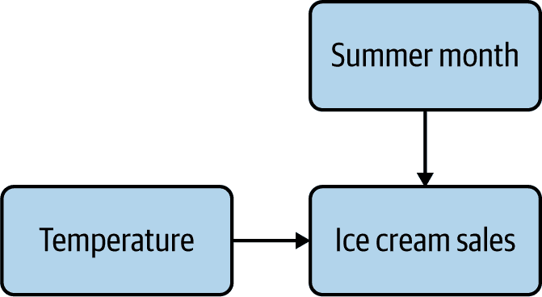
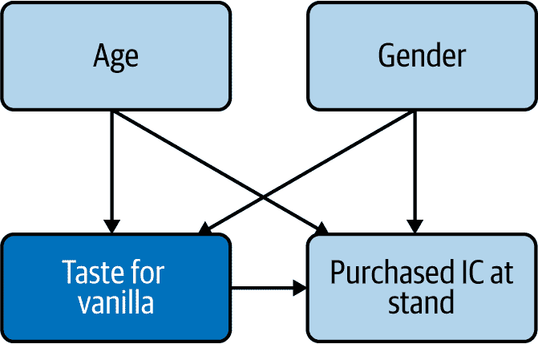

# 第三章\. 因果图简介

> 实际上，除了少数例外，相关确实意味着因果关系。如果我们观察到两个变量之间存在系统性关系，并且我们已经排除了这只是随机巧合的可能性，那么一定存在某种因果关系。当马来影子戏剧的观众在屏幕上看到一个实心的圆形影子时，他们知道某个三维物体产生了这个影子，尽管他们可能不知道这个物体是球体还是侧面的饭碗。对于统计学入门而言，一个更准确的口号应该是简单的相关性暗示着一个未解决的因果结构。
> 
> 比尔·希普利，《生物学中的因果与相关性》（2016）

因果图（CDs）很可能是大多数人从未听说过的分析工具中最强大的之一。因此，它们是因果行为框架的三个极点（顶点）之一（图 3-1）。它们提供了一种语言来表达和分析因果关系，特别适用于处理行为数据分析。

###### 图 3-1\. 数据分析的因果行为框架

在本章的第一部分中，我将展示 CD 如何从概念角度融入框架中，即它们如何与行为和数据连接。在第二部分中，我将描述 CD 中的三种基本结构：链式结构、分叉结构和碰撞结构。最后，在第三部分中，我们将看到可以应用于 CD 的一些常见转换。

# 因果图和因果行为框架

首先，让我们定义什么是 CD。CD 是变量的视觉表示，显示为方框，并显示它们之间的关系，表示为从一个框到另一个框的箭头。

在我们在第一章中的 C-Mart 示例中，变量 *IcedCoffeeSales* 受到一个单一原因 *Temperature* 的影响。图 3-2 展示了相应的因果图。

###### 图 3-2\. 我们的第一个因果图

每个矩形代表我们可以观察到的变量（我们在数据集中拥有的一个），它们之间的箭头表示因果关系的存在和方向。这里，*Temperature* 和 *IcedCoffeeSales* 之间的箭头表明前者是后者的原因。

然而，有时会有一个我们无法观察到的额外变量。如果我们仍然希望在因果图中显示它，我们可以用一个阴影矩形来表示^(1)（图 3-3）。

###### 图 3-3\. 带有未观察变量的因果图

在 图 3-3 中，*CustomerSweetTooth* 是 *IcedCoffeeSales* 的一个原因，这意味着甜食爱好者购买更多冰咖啡。然而，我们无法观察到顾客的甜食偏好程度。稍后我们将讨论因果分析中未观察到的混杂因素和更普遍地未观察到的变量的重要性。目前，我们只需要注意即使我们无法观察到特定变量，也可以通过将其表示为椭圆形包含在因果图中。

## 因果图表现行为

对因果图的第一种看法是将它们视为行为之间因果关系的表现，以及影响行为的现实世界中的其他现象（图 3-4）。从这个角度看，因果图的元素代表着存在并相互影响的真实“事物”。物理科学中的类比可以是磁铁、铁条和磁铁周围的磁场。你看不到磁场，但它确实存在，并影响铁条。也许你对磁场没有任何数据，也许你从未见过描述它的方程，但当你移动铁条时，你能感觉到它，并且你能对它的作用产生直觉。

###### 图 3-4\. CDs are connected to behaviors in our framework

当我们想要理解驱动行为的因素时，同样的观点适用。我们直观地理解人类有习惯、偏好和情感，尽管我们通常没有关于这些方面的数字数据。当我们说“乔买了花生是因为他饿了”时，我们依赖于我们对人类和乔的知识、经验和信念。我们把饥饿看作是一种真实存在的东西，即使我们没有测量乔的血糖或脑部活动。

在这里，我们对现实做出了因果性陈述：我们说如果乔不饿的话，他就不会买花生。因果性对我们对现实的直观理解非常基本，以至于即使是年幼的孩子在接触科学方法或数据分析之前也能做出正确的因果推论（通过使用“因为”这个词表明）。当然，直觉受到各种行为科学家所熟知的偏见的影响，即使它采取更为教育的形式，如常识或专业知识。但通常情况下，即使在没有数量数据的情况下，直觉也能在日常生活中很好地指导我们。

你可能担心使用 CDs 来表示对世界的直觉和信念引入了主观性，这当然是事实。但是因为 CDs 是思考和分析的工具，它们不必是“真实”的。你和我对 Joe 为什么买花生有不同的想法，这意味着我们可能会绘制不同的 CDs。即使我们完全同意什么导致什么，我们也不能在一个图表中表示所有东西及其关系；确定包含或排除哪些变量和关系涉及判断。在某些情况下，当数据可用时，它将有所帮助：我们将能够拒绝一个与手头数据不兼容的 CD。但在其他情况下，非常不同的 CDs 将与数据同样兼容，我们将无法在它们之间做出选择，特别是如果我们没有实验数据。

这种主观性可能看起来像是 CDs 的一个（可能是致命的）缺陷，但实际上却是一个特性，而不是错误。CDs 不会产生不确定性；它们只是反映了已经存在于我们世界中的不确定性。如果对当前情况有几种可能的解释看似同样有效，你应该明确地说明。另一种选择是允许那些在他们的头脑中有不同心理模型的人每个人都相信自己知道真相，并且其他人同意他们的看法，而实际上情况并非如此。至少公开不确定性将允许进行原则性讨论并指导您的分析。

## 因果图代表数据

尽管构建和解释 CDs 有一门艺术，但也有一门科学，我们可以利用 CDs 来表示数据中变量之间的关系（见图 3-5）。当这些关系完全是线性的或近似线性时，CDs 在线性代数中有明确的等价物。这意味着我们可以使用线性代数的规则和工具来验证我们如何操作和转换 CDs 的“合法性”，从而确保我们得出正确的结论。

###### 图 3-5\. CDs 也与数据相关联

线性要求可能看起来非常严格。然而，当某些关系不是线性的，但仍属于称为广义线性模型（GLM）的模型的广泛类别时，线性代数的一些规则和工具仍然适用。例如，逻辑回归模型就是一个 GLM。这意味着我们可以用 CDs 来表示和处理一个因果关系，其中影响变量是二进制的。如侧边栏所示，在这种情况下，数学变得更加复杂，但我们关于 CDs 的大多数直觉仍然成立。

从这个角度来看，从图 3-3 中连接*Temperature*和*IcedCoffeeSales*的因果图意味着：

*IcedCoffeeSales = β * Temperature + *ε**

这个线性回归意味着，如果温度增加一度，其他条件保持不变，那么冰咖啡的销售将增加*β*美元。因果图中的每个方框代表一个数据列，就像表格 3-1 中模拟数据一样。

表格 3-1\. 模拟数据，展示了我们因果图中的关系

| 日期 | *Temperature* | *IcedCoffeeSales* | *β* * *Temperature* | *ε* = *IcedCoffeeSales* – *β* * *Temperature* |
| --- | --- | --- | --- | --- |
| 6/1/2019 | 71 | $70,945 | $71,000 | $55 |
| 6/2/2019 | 57 | $56,969 | $57,000 | $31 |
| 6/3/2019 | 79 | $78,651 | $79,000 | -$349 |

对于熟悉线性代数符号的人，我们可以将前述方程重写为：

<math><mrow><mrow><mrow><mo>(</mo><mtable><mtr><mtd><mn>70</mn><mo>,</mo><mn>945</mn></mtd></mtr><mtr><mtd><mn>56</mn><mo>,</mo><mn>969</mn></mtd></mtr><mtr><mtd><mn>78</mn><mo>,</mo><mn>651</mn></mtd></mtr></mtable><mo>)</mo></mrow><mo>=</mo><mn>1000</mn><mo>*</mo><mrow><mo>(</mo><mtable><mtr><mtd><mn>71</mn></mtd></mtr><mtr><mtd><mn>57</mn></mtd></mtr><mtr><mtd><mn>79</mn></mtd></mtr></mtable><mo>)</mo></mrow><mo>+</mo><mrow><mo>(</mo><mtable><mtr><mtd><mn>55</mn></mtd></mtr><mtr><mtd><mn>31</mn></mtd></mtr><mtr><mtd><mo>−</mo><mn>349</mn></mtd></mtr></mtable><mo>)</mo></mrow></mrow></mrow></math>

从这个角度来看，因果图关注的是数据——变量及其之间的关系。这立即推广到多个原因。让我们绘制一个因果图，显示*Temperature*和*SummerMonth*都会导致*IceCreamSales*（图 3-8）。

###### 图 3-8\. 一个带有多个原因的因果图

将这个因果图转化为数学术语，得到以下方程式：

*IceCreamSales = β[*T*].Temperature + β[*S*].SummerMonth + ε*

显然，这个方程是标准的多元线性回归，但其基于因果图的解释方式有所不同。在因果框架之外，我们只能得出一个结论：“温度增加一度与冰淇淋销售额增加*β*[*T*]美元相关。”因为相关性并非因果关系，因此推断任何进一步的事实都是不合理的。然而，在回归模型基于因果图的情况下，如本例，我们可以做出显著更强的陈述——即，“除非这个因果图是错误的，否则温度增加一度将导致冰淇淋销售额增加*β*[*T*]美元”，这正是业务关心的。

如果你有数据科学等量化背景，你可能会倾向于关注因果图与数据之间的连接，而牺牲了与行为之间的联系。这当然是一条可行的道路，并且它已经产生了一整套称为概率图模型的统计模型类别。例如，已经开发了算法来在数据中识别因果关系，而不依赖于人类的专业知识或判断。然而，这个领域仍处于起步阶段，当应用到现实数据时，这些算法通常无法在几种可能导致极不同业务影响的因果图之间进行选择。商业常识通常可以更好地选择最合理的一种。因此，我坚信你最好使用本书框架中展示的混合方法，并接受你需要运用自己的判断的观点。因果图在你的直觉和数据之间来回推理——在许多情况下，这正是成功之道。

# 因果图的基本结构

因果图可以呈现出多种各样的形状。幸运的是，研究人员已经花了一段时间在因果性上，并为此带来了一些秩序：

+   因果图只有三种基本结构——链式结构、分叉结构和碰撞器结构——所有的因果图都可以表示为它们的组合。

+   将因果图看作家谱，我们可以轻松描述在图中相距较远的变量之间的关系，例如称其中一个为另一个的“后代”或“子节点”。

实际上，就是这样！我们现在将更详细地了解这些基本结构，并且一旦你熟悉了它们以及如何命名变量之间的关系，你将能够完全描述你所使用的任何因果图。

## 链式结构

链式结构是一个有三个框表示的因果图，代表三个变量，并且两个箭头直线连接这些框。为了向你展示一个例子，我将介绍我们 C-Mart 例子中的一个新的待处理物——那就是强大的甜甜圈。为了简单起见，让我们假设我们已经看到的变量只有一个影响到了甜甜圈的销售：*冰咖啡销售量*。那么 *温度*、*冰咖啡销售量* 和 *甜甜圈销售量* 是因果相关的 (图 3-9)。

###### 图 3-9\. 链式因果图

这张因果图之所以被称为链式结构，是因为两个箭头“同向”，即第一个箭头从一个框指向另一个框，第二个箭头从第二个框指向最后一个框。这张因果图扩展了 图 3-3 中的图示。它表示了温度导致冰咖啡销售，进而导致甜甜圈销售的事实。

让我们定义一些术语，以便描述变量之间的关系。在这个图表中，*Temperature* 被称为 *IcedCoffeeSales* 的*父亲*，而 *IcedCoffeeSales* 是 *Temperature* 的*子孙*。但是 *IcedCoffeeSales* 也是 *DonutSales* 的父亲，后者是其子孙。当一个变量与另一个变量有父/子关系时，我们称之为*直接关系*。当它们之间有中介变量时，我们称之为*间接关系*。变量数目的确切数量并不重要，因此您不必计算箱子的数量来描述它们之间关系的基本结构。

另外，我们说一个变量是另一个变量的*祖先*，如果第一个变量是另一个的父亲，后者可能是另一个的父亲，依此类推，最终我们的第二个变量是第一个变量的子孙。在我们的例子中，*Temperature* 是 *DonutSales* 的祖先，因为它是 *IcedCoffeeSales* 的父亲，后者又是 *DonutSales* 的父亲。非常合乎逻辑地，这使得 *DonutSales* 成为 *Temperature* 的*后代*（Figure 3-10）。

###### 图 3-10\. 链条中变量之间的关系

在这种情况下，*IcedCoffeeSales* 也是 *Temperature* 和 *DonutSales* 之间关系的*中介者*。我们将在第十二章中更深入地探讨中介作用。现在，让我们注意到，如果一个中介值不变，则链条中前面的变量不会影响链条中后面的变量，除非它们以其他方式相连。在我们的例子中，如果 C-Mart 遭遇冰咖啡短缺，我们预计在此期间，温度的变化不会对甜甜圈的销售产生任何影响。

### 折叠链条

上述因果图转化为以下回归方程：

*IcedCoffeeSales* = *β[T].Temperature*

*DonutSales* = *β[I].IcedCoffeeSales*

我们可以用第二个方程中的表达式替换 *IcedCoffeeSales*：

*DonutSales* = *β[I].(*β[T]Temperature*) = (*β[I]β[T]*)*Temperature*

但是 *β*[I]*β*[T] 只是两个常数系数的乘积，所以我们可以将其视为一个新系数： <math><mrow><mrow><mi>D</mi><mi>o</mi><mi>n</mi><mi>u</mi><mi>t</mi><mi>S</mi><mi>a</mi><mi>l</mi><mi>e</mi><mi>s</mi><mo>=</mo><msub><mrow><mover><mrow><mi>β</mi></mrow><mrow><mo>˜</mo></mrow></mover></mrow><mrow><mi>T</mi></mrow></msub><mn>.</mn><mi>T</mi><mi>e</mi><mi>m</mi><mi>p</mi><mi>e</mi><mi>r</mi><mi>a</mi><mi>t</mi><mi>u</mi><mi>r</mi><mi>e</mi></mrow></mrow></math>。我们已成功将 *DonutSales* 表示为 *Temperature* 的线性函数，这可以转化为因果图（Figure 3-11）。

###### 图 3-11\. 将一个 CD 折叠成另一个 CD

在这里，我们*折叠了一个链条*，也就是说，我们去除了中间的变量，并用从第一个变量到最后一个变量的箭头替换它。通过这样做，我们有效地简化了我们原始的因果图，专注于我们感兴趣的关系。当链条中的最后一个变量是我们感兴趣的业务指标，而第一个变量是可操作的时，这是有用的。在某些情况下，例如，我们可能对*Temperature*和*IceCoffeeSales*之间以及*IceCoffeeSales*和*DonutSales*之间的中间关系感兴趣，以管理定价或促销。在其他情况下，我们可能只对*Temperature*和*DonutSales*之间的关系感兴趣，例如，为了进行库存规划。

线性代数的传递性财产在这里也适用：如果*DonutSales*导致另一个变量，那么这个链条也可以围绕*DonutSales*折叠，依此类推。

### 扩展链条

显然，折叠操作可以反转：我们可以通过在中间添加*IceCoffeeSales*变量，从我们的最后一个 CD 回到前一个 CD。更一般地说，我们称之为*扩展链条*，每当我们在当前由箭头连接的两个变量之间注入中间变量时。例如，假设我们从*Temperature*和*DonutSales*的关系开始(图 3-11)。这种因果关系转化为方程*DonutSales* = *β[T]Temperature*。假设*Temperature*仅通过*IceCoffeeSales*影响*DonutSales*。我们可以在我们的 CD 中添加这个变量，这使我们回到了我们从图 3-8 开始的原始 CD(图 3-12)。

###### 图 3-12\. 将一个 CD 展开成另一个 CD

扩展链条可以帮助更好地理解特定情况中发生的事情。例如，假设温度增加了，但甜甜圈的销售量没有增加。这可能有两个潜在的原因：

+   首先，温度的增加并没有增加冰咖啡的销量，也许是因为店长更加积极地使用了空调。换句话说，在图 3-11 中，第一个箭头消失或减弱。

+   或者，温度的增加确实增加了冰咖啡的销售量，但冰咖啡的销售增长并没有增加甜甜圈的销售量，例如，因为人们正在购买新推出的饼干。换句话说，在图 3-11 中，第一个箭头保持不变，但第二个箭头消失或减弱。

根据实际情况，你可能会采取非常不同的纠正措施——要么关闭空调，要么改变饼干的价格。在许多情况下，查看链条中间的变量，即中介者，将帮助你做出更好的决策。

###### 注意

由于链条可以随意折叠或展开，通常我们不会明确指示何时进行折叠。通常假设任何箭头都可能被展开，以突出沿途的中介变量。

这也意味着之前提到的“直接”和“间接”关系的定义与 CD 的特定表示相关：当你折叠一个链条时，两个原本间接关系的变量现在有了直接关系。

## 分叉

当一个变量导致两个或更多效应时，这种关系形成了一个*分叉*。*温度*同时导致*冰咖啡销量*和*冰淇淋销量*，所以这种分叉的表示如图 3-13 所示。

###### 图 3-13\. 三个变量之间的分叉

这个 CD 显示，*温度*影响了*冰淇淋销量*和*冰咖啡销量*，但它们之间并没有因果关系。如果天气炎热，冰淇淋和冰咖啡的需求都会增加，但购买其中一种并不会导致你想购买另一种，也不会减少你购买另一种的可能性。

当两个变量有一个共同原因的情况非常频繁，但也可能存在潜在问题，因为这会在这两个变量之间创建一个相关性。当天气炎热时，我们会看到冰淇淋和冰咖啡的销量增加，而天冷时，很少有人会同时想要这两种产品。从预测角度来看，从*冰咖啡销量*预测*冰淇淋销量*的线性回归会有相当的预测性，但这里相关性并不等于因果关系，由于我们知道因果影响为 0，模型提供的系数将不准确。

另一种看待这种关系的方式是，如果 C-Mart 的冰咖啡短缺，我们不会预期看到冰淇淋销量的变化。更广义地说，说分叉是数据分析世界中的一大罪恶根源并不为过。每当我们观察到两个变量之间的相关性，而这种相关性不反映它们之间的直接因果关系（即彼此不是对方的原因），往往是因为它们共享一个共同原因。从这个角度来看，使用 CD 的主要好处之一是，它们可以非常清楚和直观地显示这些情况以及如何进行纠正。

分叉也是我们观察人口统计变量时的典型情况：年龄、性别和居住地都可能导致各种其他可能相互作用或者不会相互作用的变量。你可以把人口统计变量比如年龄想象成一个有很多分支的分叉。

当 CD 中间有叉路时，有时会出现一个问题，即你是否仍然可以将链条围绕它折叠。例如，假设我们有兴趣使用图 3-14 中的 CD 分析 *SummerMonth* 和 *IcedCoffeeSales* 之间的关系。

###### 图 3-14\. 带有叉路和链条的 CD

在这个 CD 中，*SummerMonth* 一侧有一个叉路，另一侧有 *IceCreamSales* 和 *Temperature*，但也有一个链条 *SummerMonth* → *Temperature* → *IcedCoffeeSales*。我们可以折叠链条吗？

在这种情况下，是的。我们将在第五章中看到如何确定一个变量是否是关系的混杂因素；在这里，我们只需说 *IceCreamSales* 不是 *SummerMonth* 和 *IcedCoffeeSales* 之间关系的混杂因素，这是我们感兴趣的关系。因此，我们可以简化我们的 CD（图 3-15）。

###### 图 3-15\. 前一个 CD 的折叠版本

同样，如果我们对 图 3-14 中 *SummerMonth* 和 *IceCreamSales* 之间的关系感兴趣，我们可以忽略 *IcedCoffeeSales*，但不能忽略 *Temperature*。

因为叉路对因果分析非常重要，有时我们会想要表示它们，即使我们不知道联合原因是什么。在这种情况下，我们将用一个双头箭头表示未知的叉路（图 3-16）。

###### 图 3-16\. 具有未知联合原因的叉路

双头箭头也看起来像两个变量互相导致。这是有意设计的，当我们观察到两个变量之间的相关性，但我们不知道哪个导致哪个时，我们也会使用双头箭头。因此，双头箭头包括两个变量 A 和 B 会呈现相关的三个可能原因：A 导致 B，B 导致 A，和/或 A 和 B 共享一个原因。有时我们会使用双头箭头作为一个占位符，直到我们澄清真正的原因；如果我们不关心原因，我们可能会在最终的 CD 中保留双头箭头。

## 碰撞器

世界上很少有只有一个原因的事物。当两个或更多变量导致相同的结果时，关系就形成了一个*碰撞器*。由于 C-Mart 的小吃店只销售两种口味的冰淇淋，巧克力和香草，代表口味和购买行为的因果图会显示对任一口味的食欲都会导致在该店购买冰淇淋的过去经历（图 3-17）。

###### 图 3-17\. 碰撞器的碰撞直径（CD）

碰撞器是常见的现象，它们也可能是数据分析中的问题。碰撞器在某种意义上是分叉的对立面，与它们相关的问题也是对称的：如果我们*不控制*共同原因，那么分叉就会成为问题，而如果我们*控制*共同影响，碰撞器就会成为问题。我们将在第五章中进一步探讨这些问题。

总结本节，链、分叉和碰撞器代表了因果图中三个变量之间可能的三种关系方式。然而，它们并非彼此互斥，事实上，在同一个因果图中同时展现这三种结构是相当常见的，正如我们在第一个例子中所看到的（图 3-18）。

###### 图 3-18\. 同时包含链、分叉和碰撞器的三变量因果图

在这里，*SummerMonth* 影响 *IceCreamSales* 和 *Temperature*，而 *Temperature* 本身又影响 *IceCreamSales*。这里的因果关系相对简单易懂，但是这个图表也包含了所有三种基本关系类型：

+   一个链：*SummerMonth* → *Temperature* → *IceCreamSales*

+   一个分叉，其中 *SummerMonth* 导致 *Temperature* 和 *IceCreamSales*

+   一个碰撞器，*IceCreamSales* 同时受 *Temperature* 和 *SummerMonth* 的影响

在这种情况下需要注意的另一件事是，变量之间可能存在多于一种关系。例如，*SummerMonth* 是 *IceCreamSales* 的父变量，因为直接从前者到后者存在箭头（直接关系）；但与此同时，*SummerMonth* 也通过链 *SummerMonth → Temperature → IceCreamSales*（间接关系）间接是 *IceCreamSales* 的祖先。所以你可以看到这些关系并不是排他的！

尽管一个因果图（CD）总是由这三种结构组成，但它并非静态的。通过修改变量本身及其关系，一个因果图可以被转换，我们现在就来看一下。

# 因果图的常见转换

链、分叉和碰撞器假定因果图中的变量是给定的。但是，就像链可以收缩或扩展一样，变量本身也可以被切片或聚合以“缩放”到特定行为和类别中。我们也可以决定修改箭头，例如在面对其他无法处理的循环时。

## 切片/解构变量

当你切片或解构一个变量以揭示其组成部分时，分叉和碰撞器经常会被创建。在先前的例子中，我们看过 *Temperature* 和 *DonutSales* 之间的关系，其中 *IcedCoffeeSales* 是中介者（图 3-19）。

###### 图 3-19\. 我们将切片的链

但也许我们想要根据类型分割*IcedCoffeeSales*，以更好地理解需求动态。这就是我所说的“切片”变量。这是允许的线性代数规则，因为我们可以将总冰咖啡销量表达为按类型销量的总和，比如美式和拿铁：

*IcedCoffeeSales* = *IcedAmericanoSales* + *IcedLatteSales*

现在我们的 CD 将成为图 3-20，左侧有一个分叉，右侧有一个碰撞器。

###### 图 3-20\. 一个链条，其中中介被切分了

现在，该变量的每个切片将有自己的方程式：

*IcedAmericanoSales* = *β[*TA*].Temperature*

*IcedLatteSales* = *β[TL].Temperature*

由于*温度*的影响完全被我们的*IcedCoffeeSales*切片所中介，我们可以创建如下的统一多元回归用于*DonutSales*：

*DonutSales* = *β[IA].IcedAmericanoSales + β[IL].IcedLatteSales*

这将使您能够更精细地了解发生了什么——当温度升高时，您是否应该计划这两种类型的销售增长？它们对*DonutSales*有相同的影响吗，还是您应该更青睐其中一种？

## 聚合变量

正如你可能猜到的那样，切分变量是可以反转的，而且更一般地，我们可以聚合那些具有相同因果关系的变量。这可以用于按产品、地区、业务线等进行聚合和分解数据分析。但它也可以更宽泛地用于表示那些没有精确定义的重要因果因素。例如，假设*年龄*和*性别*都影响*香草味*以及在 C-Mart 便利店购买冰淇淋的倾向，*PurchasedIceCream*（图 3-21）。

###### 图 3-21\. 年龄和性别分开显示

因为*年龄*和*性别*具有相同的因果关系，它们可以被聚合成一个*人口特征*变量（图 3-22）。

###### 图 3-22\. CD，其中年龄和性别被聚合成单一变量

在这种情况下，我们显然没有一个称为“人口特征”或“人口统计学”的单一列数据；我们只是在我们的 CD 中使用该变量作为一种简化，用于表示我们可能会或可能不会在以后深入探讨的各种变量。假设我们想要运行一项 A/B 测试并理解当前的因果关系。正如我们将在后面看到的那样，随机化可以使我们控制人口统计因素，这样我们就不必在分析中包含它们，但我们可能希望在没有随机化的情况下将它们包含在我们的 CD 中。如果有必要，我们总是可以扩展我们的图表以准确表示涉及的人口统计变量。然而，请记住，*任何变量都可以分割，但只有具有相同直接和间接关系的变量才可以聚合*。

## 循环如何处理？

在我们看到的三种基本结构中，两个给定框之间只有一条箭头。更一般地说，不可能通过按箭头方向两次到达相同的变量（例如，A → B → C → A）。一个变量可能是另一个变量的效果和另一个变量的原因，但不能同时是一个变量的原因和效果。

然而，在现实生活中，我们经常看到相互因果影响的变量。这种类型的 CD 被称为*循环*。循环可能由于多种原因而产生；在行为数据分析中最常见的两种是替代效应和反馈循环。幸运的是，当你遇到循环时，有一些解决方法可以帮助你应对。

### 理解循环：替代效应和反馈循环

替代效应是经济学理论的基石：顾客可能会根据产品的可用性和价格以及顾客对多样性的欲望来*替代*一种产品为另一种产品。例如，前来 C-Mart 便利店的顾客可能会根据不仅仅是温度，还包括特别促销以及本周喝咖啡的频率来选择冰咖啡或热咖啡。因此，从购买冰咖啡到购买热咖啡存在因果关系，反之亦然（图 3-23）。

###### 图 3-23\. 生成循环的替代效应 CD

###### 注意

需要注意的一点是箭头的方向显示了因果关系的方向（什么是原因，什么是结果），而不是效果的符号。在我们之前看过的所有因果图中，变量之间存在正相关关系，其中一个增加导致另一个增加。在这种情况下，关系是负的，其中一个变量的增加会导致另一个变量的减少。对于因果图来说，效果的符号并不重要，只要你正确地识别相关的因果关系，回归分析就能正确地排序系数的符号。

另一个常见的循环是反馈环路，其中一个人根据环境变化调整他们的行为。例如，C-Mart 的店长可能会关注等待队列的长度，如果现有的队列太长，会开设新的收银台，这样顾客就不会放弃并离开（图 3-24）。

###### 图 3-24\. 反馈环路生成循环的示例

### 管理循环

循环反映了通常复杂的研究和管理情况，因此专门涉及这一领域的研究，称为*系统思维*，已经为此目的而兴起。（2）为了准确处理循环，已经开发了复杂的数学方法，如结构方程建模，但是它们的分析超出了本书的范围。然而，如果我不给出任何解决方案，那就不尽职责，因此我将提到两个经验法则，这应该能避免你被循环困扰。

第一点是要密切关注时间。在几乎所有情况下，一个变量影响另一个变量需要一定的时间，这意味着你可以通过更细致的时间粒度来观察数据，从而“打破循环”，将其转变为“非循环”的因果图，即没有循环的因果图（然后可以用本书介绍的工具进行分析）。例如，假设店长在等待时间增加后需要 15 分钟来开新的收银台，而顾客调整他们的等待时间感知也需要 15 分钟。在这种情况下，通过澄清事物的时间顺序，我们可以在我们的因果图中分割等待时间变量（图 3-25）。

###### 图 3-25\. 将反馈环路分解为时间增量

我将一点一点地解释这个因果图。在左侧，我们有一个从平均等待时间指向等待顾客数量的箭头：

*NbCustomersWaiting(t* + 15mn) = *β[1].AvgWaitingTime(t)*

这意味着，例如，上午 9:15 等待的顾客数量将以上午 9:00 的平均等待时间作为函数表达。然后，上午 9:30 等待的顾客数量将与上午 9:15 的平均等待时间有相同的关系，依此类推。

同样，在右侧，我们有一个从平均等待时间到开放的排队线的箭头：

*NbLinesOpen(t* + 15mn) = *β[2].AvgWaitingTime(t)*

这意味着，上午 9:15 开放的排队线数量将以上午 9:00 的平均等待时间作为函数表达。然后，上午 9:30 开放的排队线将与上午 9:15 的平均等待时间有相同的关系，依此类推。

然后在中间，我们有从等待顾客数量和从开放的收银台数量到平均等待时间的因果箭头。为了简单起见，在这里假设线性关系，这将转化为以下方程：

*AvgWaitingTime(t)* = *β*[3].*NbCustomersWaiting(t)* + *β*[4].*NbLinesOpen(t)*

###### 注

实际上，在这种情况下假设线性关系是*非常*不可能成立的。对于队列或时间到事件变量（例如生存分析），已经开发了特定的模型。这些模型属于更广泛的广义线性模型类别，因此，我们的经验法则是它们在我们的目的下表现得像逻辑回归。

这意味着，顾客在上午 9:15 到达收银台排队时的平均等待时间取决于 9:15 时已经在场的顾客数量以及 9:15 时开放的收银台数量。然后，顾客在上午 9:30 到达收银台排队时的平均等待时间取决于 9:30 时已经在场的顾客数量以及 9:30 时开放的收银台数量，依此类推。

通过将变量分解为时间增量，我们已经能够创建一个没有严格意义上的循环的 CD。我们可以在不引入任何循环逻辑的情况下估计前述三个线性回归方程。

处理周期的第二条经验法则是简化你的 CD，并只保留你最感兴趣的因果路径上的箭头。反馈效应（其中一个变量影响刚刚影响它的变量）通常较小，往往比第一效应小得多，可以作为第一近似忽略。

在我们冰咖啡和热咖啡的例子中，当天气炎热时冰咖啡的销售增加可能会减少热咖啡的销售，这是一个你应该调查的合理担忧。然而，不太可能热咖啡销售的减少会进一步触发冰咖啡销售的增加，因此你可以在你的 CD 中忽略这种反馈效应（图 3-26）。

###### 图 3-26\. 简化 CD 图表，忽略某些关系

在图 3-26 中，我们删除了从热咖啡购买到冰咖啡购买的箭头，并将该关系视为一个合理的近似。

再次强调，这只是一个经验法则，并绝对不是对忽略循环和反馈效应的一揽子邀请。这些应该在您的完整因果图中完全表示，以指导未来的分析。

## 路径

在看到各种变量如何相互作用之后，我们现在可以介绍最后一个涵盖所有内容的概念：*路径*。我们说两个变量之间存在路径*如果它们之间有箭头连接，无论箭头的方向如何，并且路径中没有变量重复出现*。让我们看看我们之前见过的因果图（图 3-27）中的路径是什么样子的。

###### 图 3-27. 因果图中的路径

在前面的因果图中，从*SummerMonth*到*IcedCoffeeSales*有两条路径：

+   一条沿着链的路径*SummerMonth* → *Temperature* → *IcedCoffeeSales*

+   第二条路径通过*IceCreamSales*，*SummerMonth* → *IceCreamSales* ← *Temperature* → *IcedCoffeeSales*

这意味着一个链是一条路径，但分叉或碰撞器也是如此！还要注意，两个不同的变量之间可能会有多条路径共享一些箭头，只要它们之间至少有一个差异，就像这里的情况一样：从*Temperature*到*IcedCoffeeSales*的箭头出现在这两条路径中。

然而，以下路径不是*Temperature*和*IcedCoffeeSales*之间的有效路径，因为*Temperature*出现了两次：

+   *Temperature* ← *SummerMonth* → *IceCreamSales* ← *Temperature* → *IcedCoffeeSales*

这些定义的一个结果是，如果你在一个因果图中选择两个不同的变量，它们之间总会至少有一条路径。路径的定义可能看起来如此宽泛以至于没有用处，但正如我们将在第五章中看到的那样，路径实际上将在识别因果图中的混杂变量中发挥关键作用。

# 结论

相关性并非因果关系，因为混杂变量可能会在我们的分析中引入偏倚。不幸的是，正如我们通过例子所看到的那样，简单地将所有可用变量和乱七八糟的变量放入回归中并不足以解决混杂问题。更糟糕的是，控制错误的变量可能会引入虚假相关性并产生新的偏倚。

作为朝向无偏回归的第一步，我介绍了一种称为因果图的工具。因果图可能是你从未听说过的最佳分析工具。它们可以用来表示我们对真实世界中因果关系的直觉，以及我们数据中变量之间的因果关系；但最强大的是作为将我们的直觉和专家知识与观察数据相连接的桥梁，反之亦然。

CDs 可以变得错综复杂，但它们基于三个简单的构建模块：链、分叉和碰撞器。根据与线性代数一致的简单规则，它们还可以折叠或扩展、切片或聚合。如果你想了解更多关于 CDs 的内容，Pearl 和 Mackenzie（2018）是一本非常易读且令人愉快的书面介绍。

CDs 的全部威力将在 第五章 中显现，我们将看到它们允许我们在回归中最优地处理混杂因素，即使是非实验数据。但 CDs 在更广泛的范围内也很有帮助，帮助我们更好地思考数据。在接下来的章节中，当我们开始清理和准备数据进行分析时，它们将允许我们在分析之前减少数据中的偏差。这将为你提供在简单环境中更加熟悉 CDs 的机会。

^(1) 在 CDs 中，表示未观察变量最常见的方法是使用椭圆形而不是矩形。

^(2) 对感兴趣的读者推荐阅读 Meadows 和 Wright（2008）的《系统思维入门》，以及 Senge（2010）的《第五项修炼：学习型组织的艺术与实践》。
