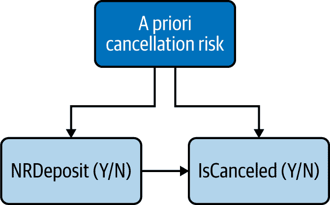
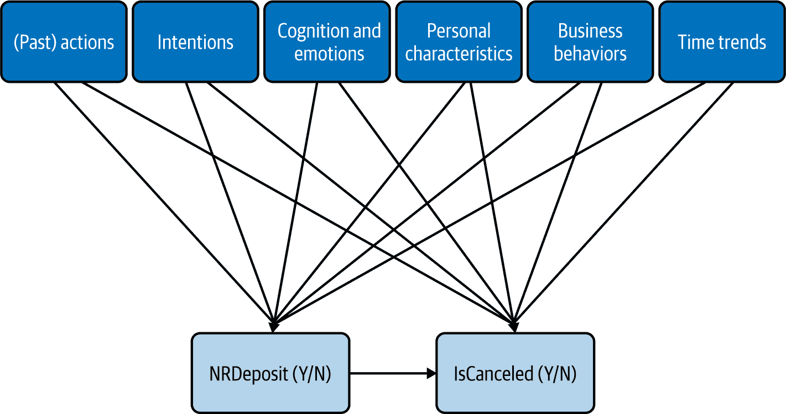
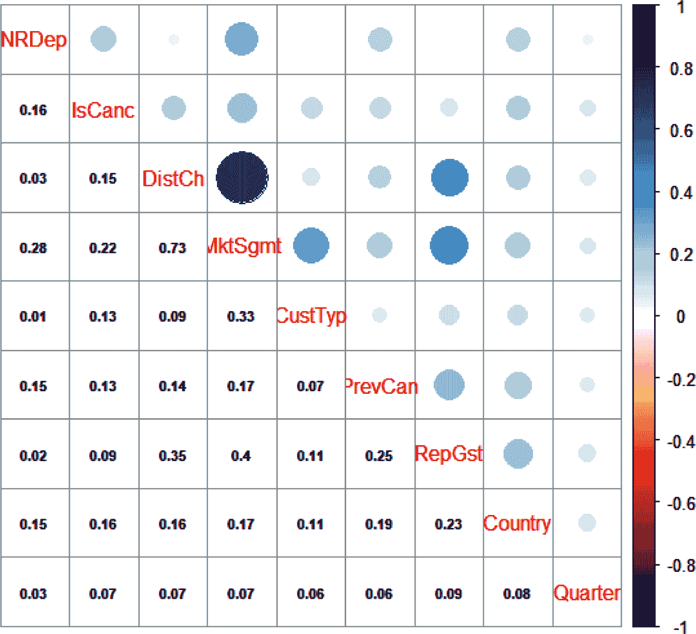

# 第四章。从头开始建立因果图

> 此时，您可能会想知道[因果图]的来源。这是一个很好的问题。这可能是一个问题。 [CD]应该是您研究的现象的关于其最先进知识的理论表示。这是一个专家认为是事物本身的东西，这种专业知识来自于多种来源。例如，经济理论，其他科学模型，与专家的交流，您自己的观察和经验，文献综述，以及您自己的直觉和假设。
> 
> Scott Cunningham，《因果推断：混音带》（2021）

本书的目标始终是衡量一个变量对另一个变量的影响，我们可以将其表示为“起始”CD（图 4-1）。


###### 图 4-1。最简单的 CD

一旦你画出那种关系，接下来会发生什么？你如何知道你应该包括哪些其他变量或不包括哪些变量？许多作者说你应该依靠专家知识，如果你在像经济学或流行病学这样的已建立领域工作的话，这是可以的。但在本书中，我的观点是，你很可能是你组织中的“行为科学家第一人”，因此你需要能够从一张空白的画布开始。

在本章中，我将概述一种配方，帮助您从图 4-1 的基本 CD 到一个可行的 CD。在我们进行这个过程的同时，请记住我们的最终目标是理解是什么推动行为，以便我们可以为我们的业务得出相关和可操作的结论。我们的目标不是建立对整个世界的完整和精确的知识。捷径和近似是公平的游戏，一切都应根据一个标准评估：这是否有助于我实现我的业务目标？

此外，我将概述的配方不是一个机械算法，你可以盲目地遵循到正确的 CD。相反，商业常识，常识和数据见解将是至关重要的。我们将在我们对手头因果关系的定性理解和数据中的定量关系之间来回反复，相互核对，直到我们觉得我们有一个令人满意的结果。在这里，“令人满意”是一个重要的词：在应用环境中，通常你不能告诉你的经理，你将在三年内给他们正确的答案。你需要在短期内给他们最不坏的答案，同时规划数据收集工作，以改进多年来的答案。

在接下来的部分中，我将为本章的业务问题及相关的兴趣变量提供介绍。然后，我们将按照以下步骤逐步构建相应的 CD，并逐步进行各个部分的描述：

+   确定可能/应该包含在 CD 中的变量。

+   确定是否应该包含变量。

+   根据需要迭代这个过程。

+   简化图表。

让我们开始吧！

# 业务问题和数据设置

在本节中，我们将使用一个位于同一城市内的两家酒店的实际预订数据集。数据和我们将使用的包将在下一小节中描述，并且我们将深入研究理解感兴趣的关系。

## 数据和包

本章的[GitHub 文件夹](https://oreil.ly/BehavioralDataAnalysisCh4)包含名为*chap4-hotel_booking_case_study.csv*的 CSV 文件，其中列出了表 4-1 中的变量。

表 4-1\. 数据文件中的变量

| 变量名 | 变量描述 |
| --- | --- |
| *NRDeposit* (NRD) | 二进制 0/1，预订是否有不可退还押金 |
| *IsCanceled* | 二进制 0/1，预订是否取消 |
| *DistributionChannel* | 分类变量，取值为“直接”，“公司”，“TA/TO”（旅行代理/旅行组织），“其他” |
| *CustomerType* | 分类变量，取值为“瞬时”，“瞬时-团体”，“合同”，“团体” |
| *MarketSegment* | 分类变量，取值为“直接”，“公司”，“在线 TA”，“离线 TA/TO”，“团体”，“其他” |
| *Children* | 整数，预订中的儿童人数 |
| *ADR* | 数值，平均每日费率，总预订金额/天数 |
| *PreviousCancellation* | 二进制 0/1，客户之前是否取消过预订 |
| *IsRepeatedGuest* | 二进制 0/1，客户是否之前曾在酒店预订过 |
| *Country* | 分类，客户的国家/地区 |
| *Quarter* | 分类，预订季度 |
| *Year* | 整数，预订年份 |

在本章中，除了前言中提到的标准包装外，我们还将使用以下包装：

```py
## R
library(rcompanion) # For Cramer V correlation coefficient function
library(car) # For VIF diagnostic function

```

```py
## Python
from math import sqrt # For Cramer V calculation
from scipy.stats import chi2_contingency # For Cramer V calculation
```

## 理解感兴趣的关系

我们将尝试回答这个问题：“押金类型是否影响预订的取消率？”正如图 4-2 所述。


###### 图 4-2\. 感兴趣的因果关系

让我们从按押金类型分类的基础取消率开始（我喜欢同时查看绝对数和百分比，以防某些类别的数值非常小）：

```py
## R (output not shown)
with(dat, table(NRDeposit, IsCanceled))
with(dat, prop.table(table(NRDeposit, IsCanceled), 1))

```

```py
## Python
table_cnt = dat_df.groupby(['NRDeposit', 'IsCanceled']).\
agg(cnt = ('Country', lambda x: len(x)))
print(table_cnt)

table_pct = table_cnt.groupby(level=0).apply(lambda x: 100 * x/float(x.sum()))
print(table_pct)
                        cnt
NRDeposit IsCanceled       
0         0           63316
          1           23042
1         0              55
          1             982
                            cnt
NRDeposit IsCanceled           
0         0           73.318048
          1           26.681952
1         0            5.303761
          1           94.696239
```

我们可以看到，绝大多数预订没有押金，取消率约为 27%。另一方面，有不可退还押金（*NRDeposit*）的预订取消率非常高。乍看之下，这种相关性令人惊讶。如果我们将政策改为对所有人“无需押金”，能减少取消率吗？行为常识告诉我们，更有可能的是，酒店为“高风险”预订请求不可退还押金，并且存在混杂变量，如图 4-3 中所示。



###### 图 4-3。因果关系可能会受到干扰

我们很快就从 Figure 4-2 转到 Figure 4-3，但这是一个重要的步骤：Figure 4-2 中的 CD 代表了一个基本的商业分析问题，“押金类型与取消率之间的因果关系是什么？”另一方面，Figure 4-3 中的 CD 代表了一个更加明智的行为假设：“不可退还的押金似乎会增加取消率，但这种关系可能会受到我们需要确定的因素的干扰。”

使用 CD 进行行为数据分析的一个好处是它们是一个很好的协作工具。你组织中任何对 CD 有最基本了解的人都可以看到 Figure 4-3，并说，“嗯，是的，我们要求假期预订支付不可退还的押金，这些押金经常因为天气原因而被取消，”或者其他任何行为知识的片段，否则你无法得到。

在这一点上，最好的下一步是进行随机实验：将可退还或不可退还的押金分配给一组随机样本的客户，您将能够确认或否定您的行为假设。然而，您可能无法这样做，或者还没有准备好。与此同时，我们将尝试通过确定要包括的相关变量来解除关系的混淆。

# 确定要包括的候选变量

在尝试确定要包括的潜在变量时，自然的倾向是从您可以获得的数据开始。这种倾向是误导性的，类似于醉酒的人不是在他们丢失的地方找钥匙，而是在路灯下找，因为那里更亮。这样做可能会忽略最重要的变量，因为它们不在你的视线范围内。你也更可能只是看到数据中的变量，并不质疑它们是否是现实世界中发生情况的最佳表示。

例如，数据中的分类变量很可能代表的是业务中心的观点，而不是客户中心的观点，因此将一些类别聚合在一起或甚至将不同变量合并为新变量可能更合适。在我们的案例中，有一个变量*MarketSegment*和一个用于预订中儿童数量的变量。通过查看数据，我们可以确认很少有公司客户会带着孩子来。因此，我们可以考虑创建一个新的分类变量，其中包括“没有孩子的公司”，“没有孩子的非公司”和“有孩子的非公司”，将带有孩子的公司客户视为值得进行单独调查的异常值（也许是量身定制服务的基础？）。

我们将从行为类别开始，而不是陷入“你看到的就是所有”的偏见^2，从动作向后开始，详细了解第二章中概述的行为类别。

+   行动

+   意图

+   认知与情绪

+   个人特征

+   业务行为

最后，每个类别中的变量可能受到时间趋势的影响，如线性趋势或季节性，因此我们将在本节末尾默认添加这些内容。为了加强对定性直觉的关注，我们不会在下一节关于验证关系的内容之前查看任何数据。通过这些类别替换我们的先验取消风险（以及其他潜在混杂因素），我们的 CD 现在看起来像是 图 4-4，其中添加了一堆未观察到的变量到我们的两个感兴趣的变量中。



###### 图 4-4\. 包含潜在变量类别的更新 CD

对于每个类别，我们现在将寻找可能成为我们两个感兴趣的变量之一的原因的变量。

## 行动

在寻找要包含在操作类别中的变量时，我们通常试图识别客户过去的行为，这些行为可能会影响酒店是否需要非退款押金（NRD）。

在这种情况下，一个明显的候选者是客户是否以前取消过。也许酒店更有可能要求那些过去曾经取消的客户支付非退款押金。同样可以想象，导致他们过去取消的原因也更可能导致他们将来取消。

更普遍地说，当我们感兴趣的变量之一本身就是一个行为时，过去的行为通常是一个很好的预测变量，即使只是作为未观察到的个人特征的代理。我们的数据中有两个与过去行为相关的变量：*PreviousCancellation* 和 *IsRepeatedGuest*。图 4-5 展示了我们更新的 CD，未更改的部分为灰色。


###### 图 4-5\. 在操作步骤结束时更新的 CD

这并不意味着这些是唯一相关的过去行为；它们只是我想到的并且我们有数据的唯一一些。希望你能想到其他的！

## 意图

意图在数据分析中很容易被忽视，因为它们通常在我们现有的数据中丢失。然而，它们是行为的最重要驱动因素之一，而且通常可以通过对客户和员工进行访谈来揭示。因此，它们代表了不仅仅查看现有可用数据，而是采用“首先关注行为”的方法的好处的最佳例证。

在这种情况下，我能想到两个意图：旅行的原因和取消的原因（图 4-6）。


###### 图 4-6\. 将意图添加到我们的 CD

请注意，我将*TripReason*表示为潜在混杂因素，即，它与我们感兴趣的两个变量都有箭头相连，而*CancellationReason*只影响*IsCanceled*。此时，这只是一个行为直觉，即取消原因不会影响押金类型。我的理由是，在存款时并不知道取消原因。

图 4-6 还展示了 CD 在行为分析中的多功能性：即使我们不知道任一情况下的具体原因列表，我们也可以在 CD 中记录这两个潜在变量，稍后我们将通过访谈确定它们。暂时来看，我们可以注意到我们数据中的三个变量似乎受到旅行原因的影响，并可以作为这样包括进去：*CustomerType*、*MarketSegment* 和 *DistributionChannel* (图 4-7)。我们也将在个人特征的小节中重新审视这些变量。


###### 图 4-7\. 意图步骤结束时更新的 CD

## 认知与情感

在尝试为分析确定相关社会、心理或认知现象时，我喜欢放大特定的决策点。在这里，客户进行预订和取消预订时就是这样的决策点。

在第一个决策点，顾客可能不明白他们的押金是不可退的，或者他们可能会忘记。在第二个决策点，他们可能将押金视为沉没成本，不会努力保留他们的预订 (图 4-8)。


###### 图 4-8\. 认知与情感步骤结束时更新的 CD

## 个人特征

如 第二章 中所述，人口统计变量通常并非因其本身而有价值，而是作为其他个人特征（如人格特质）的代理。因此，在这一步骤中的挑战是抵制数据中存在的任何人口统计变量的影响，并坚持我们的因果行为思维模式。在查看人口统计变量之前，首先考虑特质是一个很好的方法。

### 特质

基于我们对人格心理学的了解，导致取消行为的良好候选特质是责任心和神经质：似乎不太有组织和更为放松的人更有可能取消预订 (图 4-9)。


###### 图 4-9\. 具有个性特征更新的 CD

### 人口统计变量

我们早前注意到，我们的酒店有企业客户和非企业客户预订。除了旅行和取消的原因外，这还影响一些其他个人特征，例如价格弹性和收入，这两者会影响我们感兴趣的两个变量。让我们将这些归为“财务特征”类别。它们可能在我们的数据中有所体现，例如*CustomerType*、*MarketSegment*和*DistributionChannel*，以及其他几个变量，如*Children*、*ADR*（即每晚的平均价格）和*Country*（图 4-10）。


###### 图 4-10\. 使用人口统计变量更新的 CD

## 商业行为

商业行为在我们调查的关系中往往起着重要作用，但很容易被忽视和难以整合。

在这个例子中，业务规则显然起着重要作用，因为它们决定了哪些客户需要提供 NRD。从这个意义上说，它们影响*CD*中进入*NRDeposit*的*所有*箭头。我们可以根据它采取多种方式来考虑这种影响的形式。

一个业务规则可以明确地连接两个可观察变量（可能包括我们感兴趣的变量）。例如，在这里，我们可以想象一个业务规则，规定所有之前取消预订的客户现在必须提供 NRD。通过列出所有这些规则，我们可以确认或否认从一个观察变量直接进入*NRDeposit*的所有箭头。这也可能揭示涉及业务规则但尚未包含在我们数据中的变量：例如，我们可以想象，如果客户在预订时未提供身份证明，则必须支付 NRD。我说“尚未包含在我们数据中”，因为根据定义，任何作为业务规则一部分的标准都是可观察的，即使它没有被数据库捕获。^(3)

或者，一个业务规则可能最好表示为一个额外的中介变量。例如，如果在圣诞节期间的所有预订必须由 NRD 支持，我们可以创建一个*ChristmasHolidays*二元变量，该变量与*NRDeposit*相互作用。那个变量将会调节其他变量（如*CustomerType*或*Children*）对*NRDeposit*的影响。

我们不知道我们示例中的两家酒店应用了什么业务规则，因此我们必须将该子部分留作我们希望通过后续访谈探索的内容。

## 时间趋势

最后，我们的数据中可能存在一些全局时间趋势，例如需求 NRD 的预订数量逐步增加，以及与此同时的取消率逐步增加，但二者无关。此外，酒店行业的季节性非常强烈，可能存在一些周期性方面，我们希望能够捕捉到（图 4-11）。


###### 图 4-11\. 时间趋势步骤结束时的更新 CD

###### 注意

在这种情况下，*年份* 和 *季度* 变量仅捕捉趋势和周期。有时，也可以考虑包括二元变量以解释使某年突出或标志性变化的特定事件。一个明显的例子是 COVID-19，在灰尘落定后，它将被证明在某些行业是暂时的起伏，但在其他行业则是根本性的变革的开始。

加上这最后一个变量之后，图 4-11 现在有一系列候选变量，一些是可观察的，一些不是。在下一节中，我们将看到如何确认保留哪些可观察变量。

# 根据数据验证要包含的可观察变量

让我们看看我们在识别阶段结束时作为候选的可观察变量（图 4-12）。


###### 图 4-12\. 我们 CD 中的可观察变量，按类别（左）和数字（右）分割

在这个具体的例子中，所有这些可观察变量暂时都与我们感兴趣的两个变量有关。这是默认情况，但在某些情况下，您可能有非常强的先验理由，只将预测变量与您感兴趣的一个变量连接起来（例如，这是我们一些未观察到的变量的情况）。如果有疑问，我会谨慎一些，并包括这两种连接。

在 图 4-12 中，可观察变量被分为分类（CD 左侧）和数字（CD 右侧）。这两种数据类型需要不同的定量工具，因此我们将依次查看它们。

## 数字变量之间的关系

我们的第一步将是查看数据中所有数字变量的相关矩阵。一个有用但不那么干净的技巧是将二元变量转换为 0/1（如果它们还没有以这种格式存在），这样你可以将它们视为数字变量。这使你能够了解变量之间的相关性，但不要告诉你的统计学朋友！

查看你感兴趣的两个变量的行，可以让你看到它们与数据集中所有数值变量的相关性如何。一眼就能看到它还会显示出这些其他变量之间的任何大相关性。与感兴趣的因果相关性的强度可以帮助我们决定如何处理特定变量。

“强有多强？”这取决于情况。记住我们的目标是正确测量我们感兴趣的原因对我们感兴趣的效果的因果效应；作为一个经验法则，你可以认为与你感兴趣的原因和效果之间具有相同数量级（即逗号后第一个非零数字之间的零个数）的任何相关性都是“强”的。

正如你在 图 4-13 中所看到的，我们感兴趣的两个变量之间的相关系数为 0.16。第一列指示了与 *NRDeposit* 的相关性，第二列指示了与 *IsCanceled* 的相关性。*PreviousCancellation* 与我们感兴趣的变量的相关系数相同数量级（分别为 0.15 和 0.13）。类似地，*ADR* 与 *IsCanceled* 的相关系数在该标准下是显著的（0.13）。

“数量级”阈值的包含并不科学，可以根据手头变量的数量来调节松紧程度。如果少数变量通过了阈值而其他变量接近该阈值，那么包含它们是完全可以接受的。

你可能会反对说，一个变量与我们感兴趣的变量之一的相关性可能很低，但仍然是需要考虑的混杂因素。这是正确的，根据强有力的理论基础，即使与我们感兴趣的变量的相关性很弱，你也可以包含一个变量。然而，为了实际目的，通常应重点关注与我们感兴趣的变量至少具有中等相关水平的变量。


###### 图 4-13\. 数字和二进制变量的相关性矩阵

如果我们在 图 4-13 中包括所有绝对值为 0.1 或以上的相关性，并排除其他相关性，那么我们的 CD 现在就如同 图 4-14 中所示。


###### 图 4-14\. CD，更新了数字和二进制可观察变量的箭头

虽然相关矩阵只给出了对称系数，可以代表任何方向的箭头，但我运用了一些常识和业务知识来假设箭头的方向。酒店公司对时间没有掌控，所以我们可以假设*Years*是与它相关的变量的原因而不是结果，尽管这种影响可能通过中间变量（如随时间的社会趋势）传递。*IsRepeatedGuest*是*PreviousCancellation*的先决条件；因为它涉及过去事件，它也必须是*ADR*的原因或它们共享一个共同的原因。

###### 注意

不要忘记这只是一个*暂时的*CD：

+   这些相关性中有一些可能是假阳性（系数看起来比实际强，纯粹是因为随机性），反之亦然，一些较小的相关性可能是假阴性。

+   在这个阶段，我们暂时将相关性视为因果关系的证据。我们在图 4-14 中画的一些箭头本身可能反映了混杂关系。在充分衡量*NRDeposit*与*IsCanceled*之间的关系之后，我们可能希望或需要对其他关系（例如*IsRepeatedGuest*和*ADR*之间的关系）做同样的事情。

## 分类变量之间的关系

对于分类变量，同样的逻辑适用，唯一的复杂之处在于我们不能使用皮尔逊相关系数。然而，已经为分类变量开发了一个变体，[克莱默 V](https://oreil.ly/KAoIa)。在 R 中，它是在`rcompanion`包中实现的：

```py
## R
> with(dat, rcompanion::cramerV(NRDeposit, IsCanceled))
Cramer V 
   0.165
```

您可以看到，在二元变量的情况下，它产生的结果与直接应用皮尔逊相关系数的结果非常接近。不幸的是，它在 Python 中没有实现，但我提供了一个计算它的函数：

```py
## Python
def  CramerV(var1, var2):
    ...
    return V

V = CramerV(dat_df['NRDeposit'], dat_df['IsCanceled'])   
print(V)
0.16483946381640308
```

图 4-15 显示了相应的相关矩阵。

这种相关性产生了多种见解。查看底部行，我们可以看到*Quarter*与其他任何东西都没有明显相关性。这表明季节性对我们的分析不是一个相关因素。相反，可能一个季度作为时间单位太粗略，我们需要放大到特定的时间段，如圣诞节假期。我们可以从我们的 CD 中删除*Quarter*，并用一个未观察到的变量*Seasonality*替换它，作为未来研究的线索。

我们的三个客户段变量 *CustomerType*、*MarketSegment* 和 *DistributionChannel* 显示出混合模式，它们之间有些非常强的和一些弱的相关性。同样，它们与其他变量的相关性也参差不齐：例如，这三个变量中的每一个与 *Country* 的相关性都在 0.1X 数字范围内，但其中两个与 *RepeatedGuest* 的相关性较高（0.35 和 0.4），而第三个的相关性仅为 0.11。这表明这些变量不仅可以互换，而且它们捕捉了相同行为的某些方面。这需要进一步调查，并很可能创建新的变量。



###### 图 4-15\. 用于分类和二进制变量的相关矩阵

应用这些见解和仅包含大于 0.1 的相关性的相同标准后，我们的 CD 现在看起来像是 Figure 4-16。


###### 图 4-16\. 用于分类和二进制可观察变量的更新箭头的 CD

我们的 CD 开始变得适度复杂，但大部分可以通过几个行为参数来总结：

+   左侧的四个变量反映个人特征，它们彼此之间显著相关。我选择用双向箭头来反映这些相关性，因为试图确定箭头的方向是毫无意义的：*CustomerType* 不会比 *MarketSegment* 更多地导致另一种情况发生。实际上，在进行必要的访谈后，我们应该创建捕捉更深层次个人特征的新变量。

+   个人特征似乎会影响我们感兴趣的变量，可能导致一些混杂。

+   个人特征似乎影响了过去的行为 *IsRepeatedGuest* 和 *PreviousCancellation*。（同样，我基于业务知识对效果的方向做出假设。乍看之下，取消先前预订是否会导致某人改变国家或市场细分似乎不太可能。）一旦我们澄清了发挥作用的更深层个人特征的性质，我们可能决定将这些过去的行为纳入某些个人特征变量之下，隐式地创建行为人物（例如，“经常出差的商旅者（Y/N）”）。

## 数值和分类变量之间的关系

测量数值和分类变量之间的相关性比在同质类别内测量相关性更加繁琐。

说数值变量与分类变量之间存在相关性等同于说数值变量在分类变量的各类别间平均值不同。我们可以通过比较数值变量在分类变量的各类别间的平均值来检查是否如此。例如，我们预计客户的财务特征可能会影响预订的平均每日费率。最好在构建更好的客户分割变量之后再探索这种关系，但为了论证的目的，我们可以使用*CustomerType*：

```py
## R (output not shown)
> dat %>% group_by(CustTyp) %>% summarize(ADR = mean(ADR))
```

```py
## Python
dat_df.groupby('CustTyp').agg(ADR = ('ADR', np.mean))
Out[10]: 
                        ADR
CustTyp                    
Contract          92.753036
Group             84.361949
Transient        110.062373
Transient-Party   87.675056

```

我们可以看到，平均每日费率在不同客户类型之间有显著变化。

###### 注意

如果你不确定这些变化是否真正显著，或者它们只是反映了随机抽样误差，你可以使用 Bootstrap 为它们建立置信区间，如后文在第七章中解释的那样。

在我们的例子中，有两个数值变量，我们可能想要检查它们与分类变量的相关性：*ADR*和*Year*。我们发现*ADR*在不同客户类型之间有显著变化，但这些变化在时间上相对稳定，这就导致了我们的最终可观测变量的 CD（图 4-17）。

在这一点上，我想重申并扩展我早些时候的警告：在验证可观测变量时，我已经默认假设相关性等于因果关系。但也许这些关系本身是混杂的：个人特征变量与*PreviousCancellation*之间的相关性可能完全是由个人特征变量与*IsRepeatedGuest*之间的关系造成的。


###### 图 4-17. 可观测变量的最终 CD

举例来说，假设商务客户更有可能是重复客户。因此，他们看起来也可能比休闲客户有更高的取消率，即使在重复客户中，商务客户和休闲客户的取消率完全相同。

你可以把这些因果假设看作是善意的谎言：它们并非真实，但没关系，因为我们并不试图构建真实完整的 CD，我们只是试图解开**NRD**与取消率之间的关系。从这个角度来看，把箭头的方向搞对比有关联变量的不相关关系*重要得多。如果你仍然持怀疑态度，下一章的一个练习将进一步探讨这个问题。

# 逐步扩展因果图

在确认或否定基于数据的可观测变量之间的关系之后，我们得到了一个初步完整的 CD（图 4-18）。


###### 图 4-18\. 暂时完成的 CD，包括可观察和不可观察的变量，在可读性上将个人特征变量分组到一个标题下

从这里开始，我们将通过识别未观察到的变量的代理，以及进一步识别当前变量的原因，来迭代地扩展我们的 CD。

## 识别未观察到的变量的代理

未观察到的变量代表一种挑战，因为即使通过访谈或 UX 研究确认了它们，也不能直接在回归分析中考虑它们。

我们仍然可以通过访谈和研究来尝试在一定程度上减轻它们。例如，我们可能会发现，责任心确实与取消率较低相关，但同时也与请求确认电子邮件相关（图 4-19）。


###### 图 4-19\. 识别未观察到的变量的代理

当然，请求确认电子邮件并不仅仅是由责任心引起的——它也可能反映出意图的严肃性，对数字渠道的不熟悉等等。反过来，它可能通过提供有关预订的易于获取的信息而单独降低取消率。无论如何，如果我们发现这种行为与取消率呈负相关，我们可以利用这一洞察，例如向没有选择接收确认电子邮件的客户发送短信提醒。

通过头脑风暴和通过研究验证潜在未观察到的变量的代理，我们为可观察变量之间提供了有意义的连接。知道*RequestedConfirmation*通过*Conscientiousness*与*IsCanceled*相连接，为否则将是原始统计规律的行为基础提供了理由。

## 识别进一步的原因

我们还将通过识别“外部”变量的原因来扩展我们的 CD，即当前在我们的 CD 中没有任何父变量的变量。特别是，当我们有一个影响我们感兴趣的原因（可能间接影响）但不影响我们感兴趣的效果的变量*A*，以及另一个相反地影响我们感兴趣的效果但不影响我们感兴趣的原因的变量*B*时，*A*和*B*的任何联合原因会在我们的 CD 中引入混淆，因为该联合原因也是我们两个感兴趣变量的联合原因。

在我们的例子中，唯一没有任何父变量（可观察或不可观察）的可观察变量是*Year*，显然它不能有一个（除了可能是物理定律？），所以这一步不适用。

## 迭代

当您引入新变量时，您将为代理和进一步的原因创造新的机会。例如，我们新引入的*RequestedConfirmation*可能会受到*Conscientiousness*和*TripReason*的影响。这意味着您应继续扩展您的 CD，直到看起来能够涵盖您能想到的所有相关变量及其相互关系。

然而，这一过程存在显著的递减回报：随着您将 CD“向外扩展”，新添加的变量往往与您感兴趣的变量之间的相关性越来越小，因为沿途的噪声太多。这意味着考虑它们将逐渐解除您感兴趣的关系。

# 简化因果图

一旦决定停止迭代扩展 CD，最终步骤就是对其进行简化。事实上，您现在有一个希望准确而完整的图表，用于实际目的，但可能结构不一定最有助于满足业务需求。因此，我建议进行以下简化步骤：

+   当中间变量不重要或未被观察时，请折叠链条。

+   当您需要查找观察变量或想要跟踪另一个变量与图表的关系方式时，请扩展链条。

+   当您认为单个变量会包含有趣信息时（例如，与您感兴趣的变量的相关性主要由特定切片驱动），请切片变量。

+   结合变量以增强图表的可读性或当不同类型之间的变化并不重要时。

+   当您发现循环时，请通过引入中间步骤或确定重要关系的方面来打破它们。

在我们的示例中，我们可能会决定*IsRepeatedGuest*、*Children*和*Year*并未提供比*PreviousCancellation*和*ADR*更多的价值。事实上，我们可以放弃这三个变量，因为它们不会混淆我们感兴趣的关系（图 4-20）。


###### 图 4-20\. 简化后的最终 CD

您应该得到一个干净且（在某种程度上！）可读的图表，尽管它可能比我们迄今见过的图表要大一些。

如果这一过程看起来很长而有些乏味，那是因为它确实如此。深入了解您的业务非常重要，这是能够在无法进行实验时进行客户（或员工）行为因果推断的代价。

幸运的是，这个过程是非常累积和可转移的。一旦您为某项分析完成了这个过程，您对于对您业务重要的因果关系的认识就可以被重用于另一个分析。即使您第一次进行这个过程时不深入，您也可以只专注于一类混杂因素和原因；下一次您运行这个分析或类似的分析时，您可以从离开的地方继续，并对另一类进行更深入的挖掘，也许是关于客户体验的不同方面进行访谈。同样，一旦有人经历了这个过程，新的团队成员或员工可以非常容易和快速地获得相应的知识，并通过查看结果 CD 甚至只是记住要牢记的相关变量列表继续工作。

# 结论

用陈词滥调的话来说，构建 CD 是一门艺术和一门科学。我已尽力提供尽可能清晰的配方来实现这一点：

1.  从您试图衡量的关系开始。

1.  确定要包括的候选变量。也就是说，利用您的行为科学知识和业务专业知识来识别可能会影响您感兴趣的任一变量的变量。

1.  根据数据中的相关性确认要包括哪些可观察变量。

1.  通过不断添加可能的未观察变量的代理以及进一步增加到目前为止已包含的变量的进一步原因，逐步扩展您的 CD。

1.  最后，通过删除无关的关系和变量来简化您的 CD。

在这样做的过程中，始终牢记您的最终目标：衡量您感兴趣的原因对您感兴趣的效果的因果影响。我们将在下一章中看到如何使用 CD 来消除分析中的混杂因素，并获得对该影响的无偏估计。因此，最好的 CD 是那种能让您充分利用当前可用数据并推动有益的进一步研究的 CD。

^(1) Nuno Antonio, Ana de Almeida, 和 Luis Nunes, “Hotel booking demand data sets,” *Data in Brief*, 2019\. [*https://doi.org/10.1016/j.dib.2018.11.126*](https://doi.org/10.1016/j.dib.2018.11.126)

^(2) 这个色彩缤纷的标签是行为科学家丹尼尔·卡内曼推广的。

^(3) 想一想：否则规则会如何实施？
