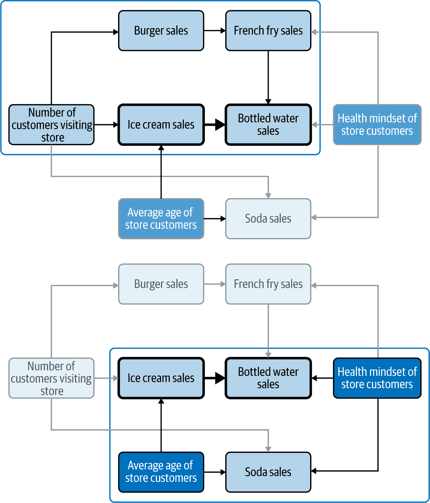

# 第五章：使用因果图解除数据分析中的混淆

因果关系对我们理解世界是如此基础性，以至于就连幼儿园的孩子也能直观地把握。然而，这种直觉和我们的数据分析可能会被混淆所误导，正如我们在第一章中看到的那样。如果我们不考虑我们感兴趣的两个变量的联合原因，那么我们会错误地解释正在发生的事情，而我们感兴趣的原因的回归系数也会出现偏差。然而，我们也看到了考虑错误变量的风险。这使得确定包括还是不包括哪些变量成为解除数据分析中最关键的问题之一，更广泛地说，是因果思维中最关键的问题之一。

可惜这是一个复杂的问题，各位作者提出了各种更多或更少扩展性的规则。在扩展性较高的一端，有一些规则偏向于谨慎和简单——你可以将它们看作是合理的“包罗万象”方法。在另一端，有些规则试图准确找出所需的变量，但这样做会增加复杂性和概念上的要求。

有趣的是，回答这个问题并不需要任何数据。也就是说，你可能想要或需要数据来建立正确的因果图，但一旦你拥有了正确的因果图，就无需查看任何数据来识别混淆。这使我们直接处于我们框架的因果图到行为边缘（图 5-1），因此在本章中我们不会使用任何数据。

相反，我将向您展示两个解除混淆的规则，它们各有利弊，“析取性因果准则”和“后门准则”，这样您可以根据您的情况选择使用哪一个。在下一节中，我将设立我们的业务问题，然后依次看看如何应用这两个准则。

###### 图 5-1。本章讨论行为与因果图之间的关系

# 业务问题：冰淇淋和瓶装水销售

我们本章的起点是 C-Mart 市场部发布的内部报告，题为“健康顾客”，追踪了向健康产品长期趋势的变化。基于该报告，C-Mart 推出了名为“您需要配有天然泉水的冰淇淋吗？”的快餐和冰淇淋特许经营的营销活动。我们的分析目标是获得冰淇淋销售对瓶装水销售影响的无偏估计。

通过利用现有数据和专用调查，市场分析团队建立了以下因果图，我们感兴趣的关系用粗体标出（图 5-2）。

###### 图 5-2\. 我们业务情境的 CD

这个 CD 相对复杂，不明显的混杂因素可能潜藏其中，因此让我们将其分解成更易处理的部分（Figure 5-3）。

###### 图 5-3\. 将我们的 CD 分解为概念块

这两个概念块仅是理解的教学工具：它们既不是排他的（我们感兴趣的关系同时包含在内），也不是穷尽的（有些箭头两者都没有涵盖）。

我们的第一个块位于 CD 的左上角，显示了冰淇淋销售和汉堡包和薯条销售之间通过客户数量的连接。在客流量更大和更繁忙的日子里，总体销售往往更高，这使得各种变量同时变动。此外，店员已被指示在冰淇淋和薯条销售中提供“您要不要来杯矿泉水？”的提示，以及在汉堡包销售中提供“您要不要薯条？”的提示。

我们的第二个块位于 CD 的右下角，显示了两个在调查中已确定但在个别销售水平上不可用的因素的影响：顾客的平均年龄（年龄较小的顾客和有孩子的顾客更有可能购买含糖产品）和顾客的健康意识（有健康意识的顾客更倾向于购买水，而不倾向于购买苏打水，在其他一切条件相等的情况下）。

###### 注意

在现实生活中的设置中，可以根据分析的需要自由地将大型或复杂的 CD 分解为块。只要在最后进行一些整理并检查从你感兴趣的原因到你感兴趣的效果的路径不包含在任何块中：你必须确保它们不会生成混杂，因为它们本身可能不是混杂，或者在分析概念块时已经处理了它们的混杂。

在这种情况下，目前尚不清楚我们感兴趣的冰淇淋销售与瓶装水销售之间是否存在混杂，以及如何解决。从技术上讲，在我们的 CD 中，我们没有任何同时导致这两者的共同原因。让我们转向我们的决策规则。

# 分离因果标准

分离因果标准是我们解除混杂的第一决策规则。像一个过于保护的父母一样，它超出了严格需要去除混杂的范围，使得它更简单易懂且易于应用。

## 定义

分离因果标准（DCC）指出：

> 在我们感兴趣的关系中，添加所有直接导致我们感兴趣的变量的回归变量，除了它们之间的中介变量，可以消除任何混杂。

## 第一个块

让我们从我们的冰淇淋例子的第一个区块开始分解这个定义：

1\. 所有直接导致我们感兴趣的变量的变量

这意味着我们应该包括任何只是直接导致*冰淇淋销售*的变量，例如*顾客数*。我们还应该包括任何只导致*瓶装水销售*的变量，例如*薯条销售*。最后，我们应该包括任何两者都导致的原因，但在这种情况下我们没有这样的变量。

2\. 除了它们之间的中介者

中介者是“传输”我们感兴趣的原因对我们感兴趣的效果的影响的变量。也就是说，它们是我们感兴趣的原因的子代和我们感兴趣的效果的父代。我们将在第十二章更详细地讨论中介者，所以现在我只想指出，我们需要*排除*它们在我们的控制列表之外，因为包括它们将取消我们试图捕捉的一些因果关系。在*冰淇淋销售*和*瓶装水销售*之间我们没有中介者（即，一个变量既是前者的子代又是后者的父代），所以在这一点上我们做得很好。

3\. 消除我们感兴趣的关系的任何混杂

如果我们包括第 1 点描述的变量但不包括第 2 点描述的变量，那么我们对*冰淇淋销售*对*瓶装水销售*效应的回归系数将不受我们第一个区块中的变量的混杂影响。

需要注意的是，DCC 是一个*充分*但不是*必要*的规则：应用它足以消除混杂，但我们并不一定需要。例如，如果我们有一个变量只是我们感兴趣的一个变量的原因，并且我们确信它与任何其他变量绝对没有任何联系，那么它不能是混杂因素，我们也不需要将其包括以消除混杂。

但当你没有这种确定性时，DCC 会让你免于苦苦思索哪个变量导致了哪个，以及什么是混杂因素。你可能会忽略一些变量之间的关系，或者认为有关系而实际上没有；你可能会认为一个变量是混杂因素，而实际上不是，反之亦然。只要你正确确定一个变量是否与你感兴趣的两个变量之一有直接因果关系，你就能正确决定是否将其包含在内。

例如，让我们看看从*顾客数*到*瓶装水销售量*的链路，途径*汉堡销售*和*薯条销售*。我们在第二章看到，链路是一个因果图，通过直线箭头连接变量（图 5-4）。

###### 图 5-4\. 我们第一个区块中的扩展链

当然，我们可以用箭头表示这条链条向上、向下或从右到左；关键是它们都是朝着同一个方向前进的，这使我们能够折叠这条链条，并将*NumberOfCustomers*视为*BottledWaterSales*的直接原因。但是*NumberOfCustomers*确实是*IceCreamSales*和*BottledWaterSales*的联合直接原因，也是它们关系的混杂因素（图 5-5）。

###### 图 5-5\. 折叠上链使 NumberOfCustomers 成为 BottledWaterSales 的直接原因

根据 DCC 的定义，将其应用于这个第一个区块意味着在我们的回归中包括*NumberOfCustomers*和*FrenchFrySales*作为控制变量。从图 5-5 中可以看出，这样做有效地中和了上链的混杂效应。更一般地说，因为链条可以随意扩展或折叠，所以最终是我们感兴趣的两个变量的原因（因此也是混杂因素）的变量可能被隐藏在 CD 中的一系列中间变量之后。

DCC 的美妙之处在于，即使市场团队忽略了从*NumberOfCustomers*到*BottledWaterSales*的上链，并且它没有被包含在 CD 中，包括*NumberOfCustomers*和*FrenchFrySales*的要求也会处理混杂问题。另一方面，根据图 5-5，我们可以看到仅包括*NumberOfCustomers*就足够了，而包括*FrenchFrySales*也是多余的。这是我在章节介绍中提到的权衡之一：DCC 是一个广泛的规则，即使在 CD 中存在错误，也会消除混杂，但代价是冗余和需要更多数据。现在让我们转向 CD 中的第二区块。 

## 第二区块

第二区块中的变量之间存在更复杂的关系（图 5-6）。

###### 图 5-6\. 第二区块

在这里，我们除了关注的变量外，唯一拥有数据的变量是*SodaSales*。它既不是*IceCreamSales*也不是*BottledWaterSales*的原因，因此 DCC 不会要求将其包括在回归中。然而，它会要求包括*AverageCustomerAge*和*CustomerHealthMindset*，而我们没有这些数据。这并不一定意味着混杂正在发生，但我们无法确定它没有发生。这是 DCC 的最大局限性：如果你没有关于你感兴趣的变量的一些原因的数据，它就无法帮助你。现在让我们转向背门准则。

# 背门准则

背门准则（BC）构成了控制混杂因素的另一种规则。与分离因果准则相比，它提供了非常不同的权衡：理解起来更复杂，并且需要具有完全准确的 CD，但它聚焦于实际的混杂因素，并且不需要在我们的回归中包含任何多余的变量。从形式上讲，控制这一规则确定的变量就足以消除混杂因素。

## 定义

背门准则表明：

> 如果两个变量之间存在至少一个未阻塞的非因果路径，从我们感兴趣的原因开始，它们之间的因果关系就会受到干扰。
> 
> 相反，要消除所有混杂因素，我们需要阻断所有非因果路径，从我们感兴趣的原因开始。

要理解这个定义，我们需要介绍或回顾一系列次要定义，在我们的示例中，与我们将在此重复的 CD 上下文相关（图 5-7）。

###### 图 5-7\. 我们业务情况下的 CD

首先，让我们回顾一下“路径”的定义：如果它们之间有箭头，不管箭头的方向如何，并且在这条路上没有变量出现两次，我们称之为存在路径。链是沿着三个或更多变量的路径，分叉和碰撞也是如此。从这个意义上说，CD 中的任意两个变量都至少通过一条路径相连，通常是几条。

例如，在我们的 CD 中，*NumberOfCustomers* 和 *BottledWaterSales* 之间有七条不同的路径：

+   *NumberOfCustomers* → *IceCreamSales* → *BottledWaterSales*

+   *NumberOfCustomers* → *BurgerSales* → *FrenchFrySales* → *BottledWaterSales*

+   *NumberOfCustomers* → *BurgerSales* → *FrenchFrySales* ← *CustomerHealthMindset* → *BottledWaterSales*

+   *NumberOfCustomers* → *BurgerSales* → *FrenchFrySales* ← *CustomerHealthMindset* → *SodaSales* ← *AverageCustomerAge* → *IceCreamSales* → *BottledWaterSales*

+   *NumberOfCustomers* → *SodaSales* ← *CustomerHealthMindset* → *BottledWaterSales*

+   *NumberOfCustomers* → *SodaSales* ← *CustomerHealthMindset* → *FrenchFrySales* → *BottledWaterSales*

+   *NumberOfCustomers* → *SodaSales* ← *AverageCustomerAge* → *IceCreamSales* → *BottledWaterSales*

请注意，*NumberOfCustomers* → *BurgerSales* → *FrenchFrySales* ← *CustomerHealthMindset* → *SodaSales* ← *NumberOfCustomers* → *IceCreamSales* → *BottledWaterSales* 不是一条路径，因为变量 *NumberOfCustomers* 在其中出现了两次，这是不允许的。

如果它是一个链，即其中所有的箭头都是朝着同一个方向的，那么路径就是“因果”的。标签“因果”指的是路径之间的因果关系，如果其中一个变量通过该路径导致另一个变量，则该路径是因果的。

前述列表中的路径 1 和 2 是因果关系的：它们是链条，代表*NumberOfCustomers*影响*BottledWaterSales*的通道。其他路径是*非因果关系*，因为它们每个都至少包含一个对撞机或叉路。请记住，对撞机是当两个变量导致同一个变量时的情况，而叉路是当两个变量被同一个变量导致时的情况。例如，路径 3 和 4 都在*FrenchFrySales*周围有一个对撞机，路径 4 还在*SodaSales*周围有一个对撞机，以及*CustomerHealthMindset*和*AverageCustomerAge*周围有两个叉路。

最后，我们将说，在我们的 CD 中，两个变量之间的路径如果是*阻塞*的，那么它要么是：

+   沿着那条路径的中介变量之一包括在我们的回归中，并且它不是一个对撞机，或者

+   在这条路径中，有一个对撞机，其核心变量未包含在我们的回归中。

否则，那条路径是*未阻塞*的。

阻塞或未阻塞的概念很难理解，因为它实际上包含了两件不同的事情：路径本身是否混杂以及它是否在我们的回归中被控制。你可以将未阻塞视为{混杂 *且* 未控制}，阻塞为{非混杂 *或* 已控制}。

混杂的最终根本原因始终是联合原因（图 5-8，左面板）。但是，由于我们可以随意折叠或扩展链条，这个混杂因素可能“隐藏”在许多中介变量背后（图 5-8，中间面板）。然而，我们无法在链条中间折叠对撞机，因为它会破坏箭头的方向（图 5-8，右面板）。因此，对撞机阻止了混杂，除非我们在回归中包括它，这样就中和了它。

###### 图 5-8。混杂因素是联合原因（左面板），但它可以隐藏在中介变量背后（中间面板），而对撞机阻止了我们折叠链条，因此消除了混杂（右面板）

## 第一个区块

现在我们已经看到了 BC 的定义，让我们看看它如何适用于因果图的第一个区块中的变量。记住，DCC 要求我们在回归中包括*NumbersOfCustomers*和*FrenchFrySales*作为控制变量。

我们可以从条件“从指向我们感兴趣的原因的箭头开始”开始应用 BC，这意味着我们感兴趣的原因的所有原因，这种情况下是*IceCreamSales*。在第一个区块中，只有一个，即*NumberOfCustomers*。

对于通过 *NumberOfCustomers* 的每条路径，让我们应用 BC 的其他条件。第一块内的 *IceCreamSales* 到 *BottledWaterSales* 的路径通过 *NumberOfCustomers* 是 *IceCreamSales* ← *NumberOfCustomers* → *BurgerSales* → *FrenchFrySales* → *BottledWaterSales*。这是 DCC 捕获并通过在我们的回归中包括 *NumberOfCustomers* 和 *FrenchFrySales* 来控制的路径。让我们检查一下条件：

+   那条路径是非因果的吗？是的，因为围绕 *NumberOfCustomers* 的分叉。

+   默认情况下那条路径被阻断了吗？不是的，因为在那条路径中没有碰撞器，并且我们尚未包括任何变量作为控制。

因此，这条路径混淆了我们感兴趣的关系，我们需要通过在我们的回归中包括该路径的任意一个非碰撞器变量来控制它。也就是说，BC 告诉我们，包括任何一个 (*NumberOfCustomers*, *BurgerSales*, *FrenchFrySales*) 就足以控制这条路径。然而，我个人建议选择哪个变量：每当你能包括那条路径的第一个变量，即你感兴趣的原因的原因，你应该这样做。在我们的例子中，这将是 *NumberOfCustomers*。选择这个原因的原因是它也会自动控制起始于该变量的任何其他混淆路径，这意味着我们甚至不必检查起始于该变量的任何其他路径。

正如你所看到的，BC 比 DCC 更经济，通过利用我们对该块中变量的完整和正确因果图的假设：而 DCC 要求我们包括 *NumberOfCustomers* 和 *FrenchFrySales*，BC 只需要包括 *NumberOfCustomers*，我们可以不检查任何其他路径就将第一块留下。

## 第二个阻止

请记住，DCC 对第二块中的变量保持沉默：我们不能包括变量 *AverageCustomerAge* 和 *CustomerHealthMindset*，因为我们没有相应的数据，因此我们不确定那里是否存在未受控制的混淆。BC 将使我们能够更加确定和精确。

*AverageCustomerAge* 是我们感兴趣的因果关系 *IceCreamSales* 的一个原因，因此让我们来检查路径 *IceCreamSales* ← *AverageCustomerAge* → *SodaSales* ← *CustomerHealthMindset* → *BottledWaterSales*：

+   那条路径是非因果的（即不是一个链）：它在 *AverageCustomerAge* 周围有一个分叉，在 *SodaSales* 周围有一个碰撞器，然后在 *CustomerHealthMindset* 周围有另一个分叉。

+   默认情况下它被阻塞了吗？是的，因为围绕 *SodaSales* 的碰撞器。

换句话说，这条路径并不是混杂因素，我们在回归中不需要控制它。更甚的是，将 *SodaSales* 包含在我们的回归中实际上会创建混杂，通过解除这条路径！

这个在对撞机周围有两个叉子的配置非常特殊，以至于有一个名字：M 型模式，我们可以通过重新排列我们的 CD（图 5-9）看到。不可否认，这个例子可能看起来有些刻意。但是，如果你觉得它过于人为和不真实，请注意，它是根据《为什么之书》中关于 2006 年实际烟草诉讼的一个例子改编的，那里包括了一个控制座椅安全带使用对估计吸烟对肺癌影响的偏差。

###### 图 5-9\. 在我们的 CD 中可视化 M 型模式

此外，因为所有从*IceCreamSales*到*BottledWaterSales*的路径都通过*AverageCustomerAge*也经过*SodaSales*，只要我们在回归中不包括*SodaSales*，它们都会被阻断。

在 CD 中找到混杂因素是一门科学：应用规则，你就会知道。但它也有它的捷径：已经确定了通过两个*IceCreamSales*的原因存在混杂的可能性，并确保任何混杂会被阻断，我们就不必检查每一条通过这两个原因到*IceCreamSales*的路径。当你建立和操作更多的 CD 时，你会学会发展一种直觉。如果你有疑问，你随时可以检查每条可能的路径的规则，确保你是正确的。

后门准则比排除性因果准则更精确，后门准则对我们的 CD 中的错误不那么鲁棒。为了论证起见，假设营销团队在构建 CD 时犯了一个错误，并错误地得出结论，即*SodaSales*导致*CustomerHealthMindset*而不是反过来（在这种特定情况下，从行为角度来看这并不太合理，但请忍耐），导致了图 5-10 中所代表的关系。

###### 图 5-10\. 第二个块如果有错误会是什么样子

在这种情况下，BC 会让我们错误地认为有混杂因素在起作用，并在我们的回归中包括*SodaSales*，引入了在此之前没有的混杂因素。

总结一下，BC 识别出通过两个直接导致*IceCreamSales*的原因有两条潜在的混杂途径。通过在我们的回归中包括*NumberOfCustomers*，我们处理了所有可能通过它产生的混杂路径。另一方面，通过*不*包括*SodaSales*，我们放过了一个碰撞器，通过*AverageCustomerAge*来处理任何通过*IceCreamSales*的混杂因素。

# 结论

揭示因果关系的混淆是行为数据分析的核心问题之一，也是解决“相关不等于因果”的泥潭的办法。在本章中，我们看到了两条混淆规则，*分离因素准则* 和 *背门准则*。第一条准则采取的立场是包括我们感兴趣变量的所有直接原因（除了中介因素）。第二条准则在应用中更为精准，直接针对混淆的机制，但在处理中错误容忍度较低。
