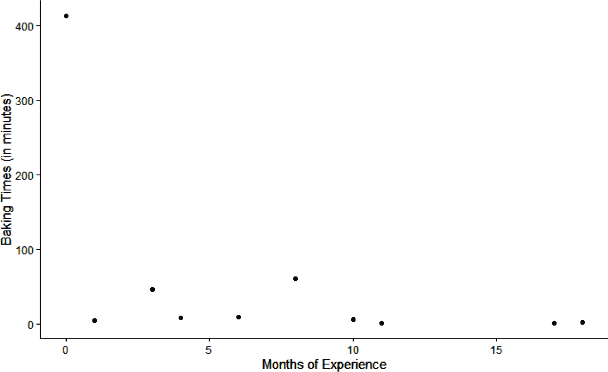
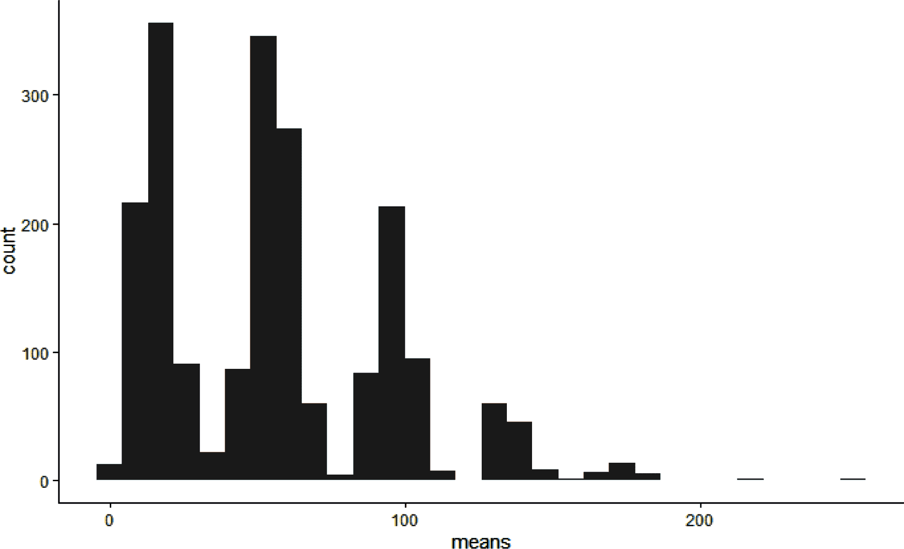
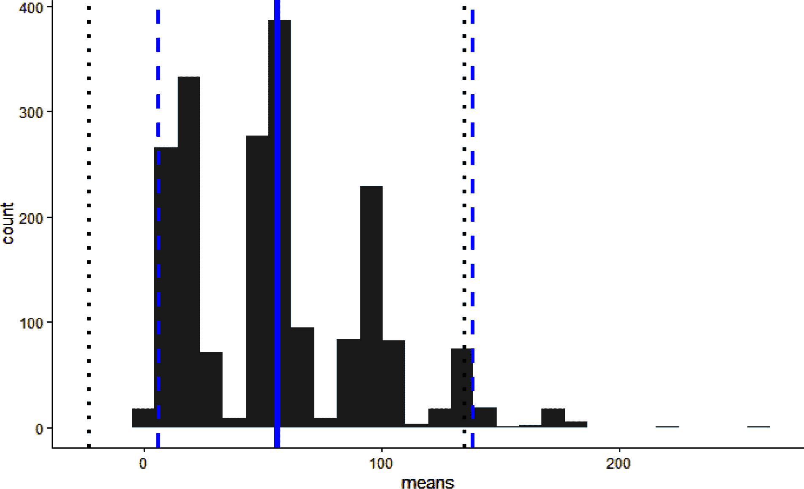
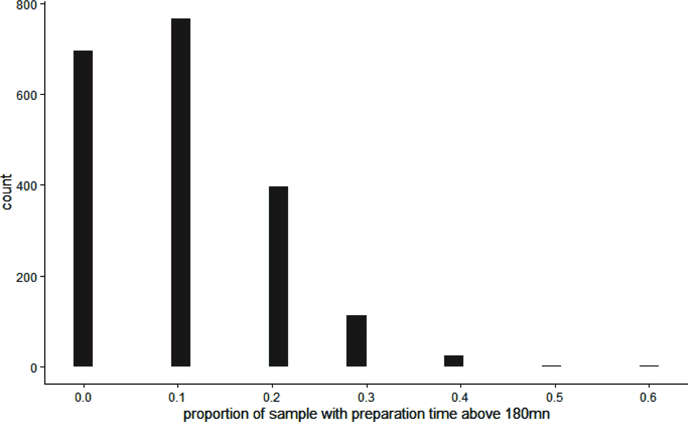
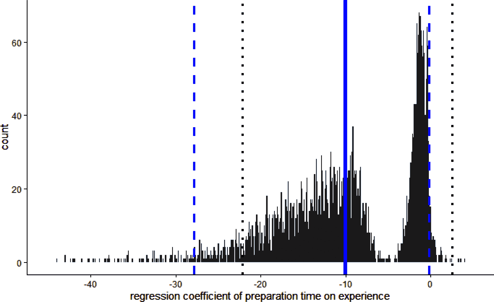
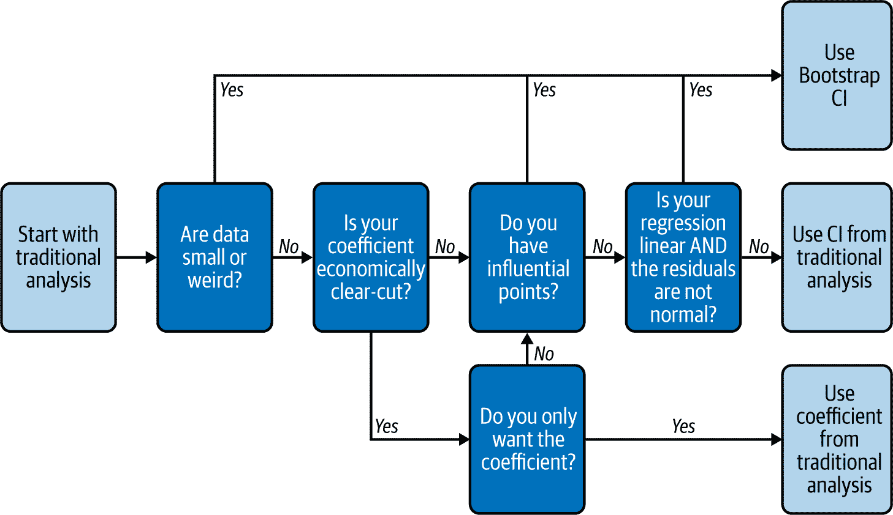
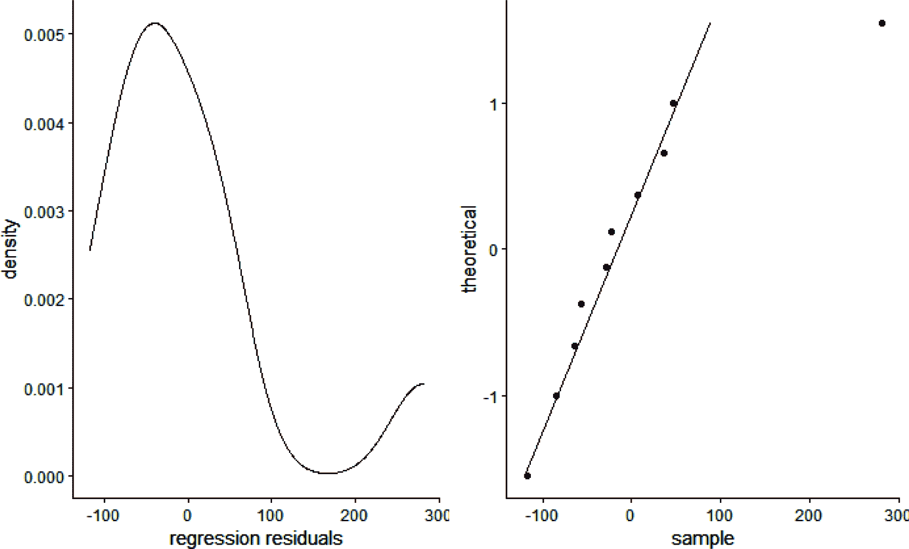
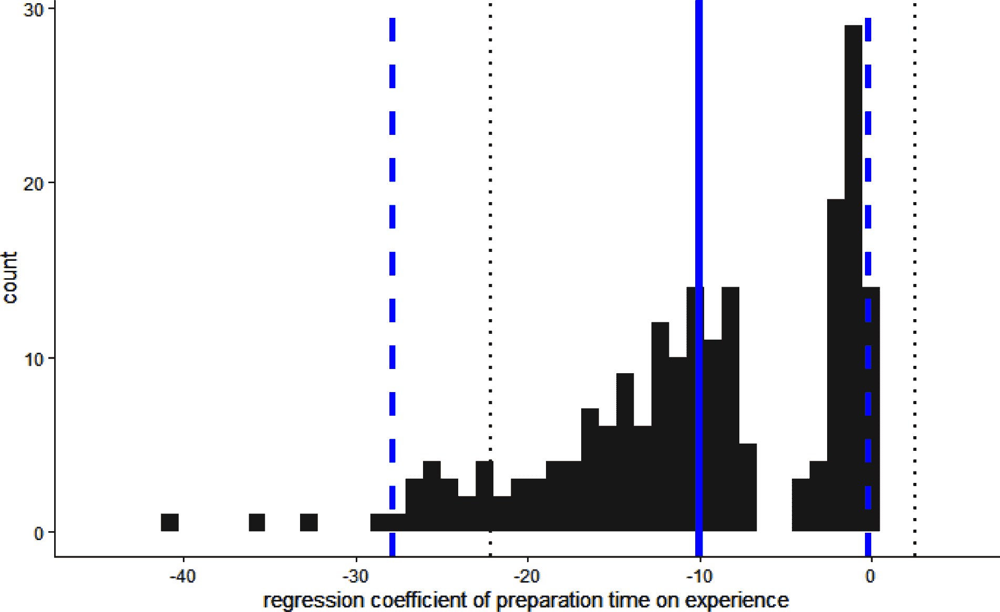

# 第七章：用自助法测量不确定性

有了理想的数据，您现在能够从行为数据中得出坚固的结论，并衡量业务/环境变化对人类行为的因果影响。但如果您有次优数据，该如何继续呢？在学术研究中，面对不确定的数据，人们总是可以回到零假设，并拒绝做出判断。但在应用研究中，没有零假设，只有可以选择的替代行动方案。

小样本量、形状奇特的变量或需要高级分析工具的情况（例如我们将在本书后面看到的层次建模）都可能导致不稳定的结论。当然，线性回归算法几乎在所有但极端情况下都会输出系数，但您应该信任它吗？您能否自信地建议您的老板将数百万美元押在它上面？

在本章中，我将向您介绍一种非常强大且通用的模拟工具——**自助法（Bootstrap）**，它将使我们能够从任何数据中得出坚固的结论，无论数据多么少或奇特。它的工作原理是基于随机数创建和分析您数据的稍微不同的版本。自助法的一个伟大特性是，通过应用它，您绝对不会出错：在传统统计方法最理想的情况下（例如对大型和表现良好的数据集运行基本线性回归），自助法可能速度较慢且不够准确，但仍然在接近范围内。但一旦您远离这种最理想的情况，自助法往往会迅速超越传统统计方法，常常优势明显。^(1) 因此，在本书的其余部分中，我们将广泛依赖它。特别是在设计和分析第四部分中的实验时，我们将使用它来构建比传统统计方法更直观的模拟 p 值等效物。

在第一节中，我们将集中进行探索性/描述性数据分析，并且我们将看到自助法在这个阶段已经可以派上用场。在第二节中，我们将在回归的背景下使用自助法。然后，我们将扩展我们的视角，讨论何时使用自助法以及您可以使用哪些工具来简化生活。

# 自助法简介：“自我拉抬”

虽然我们的最终目标是将自助法用于回归分析，但我们可以从更简单的描述统计的例子开始：获取样本数据集的均值。

## 包

在本章中，除了常见的包外，我们还将使用以下包：

```py
## Python
import statsmodels.api as sm # For QQ-plot
import statsmodels.stats.outliers_influence as st_inf # For Cook distance
```

## 商业问题：带有异常值的小数据

C-Mart 的管理层有兴趣了解其烘焙师准备定制蛋糕的时间，以便可能修订其定价结构。为此，他们要求 C-Mart 的工业工程师进行时间研究。正如其名称所示，时间研究（又称时间与动作研究）是直接观察生产过程以测量涉及任务的持续时间。考虑到这个过程耗时（故意的双关语），工程师选择了十家不同的店铺，这些店铺在某种程度上代表了 C-Mart 的业务。在每家店铺，他们观察一位烘焙师准备一块蛋糕。他们还记录了每位烘焙师的工作经验，以月计算。

总之，工程师有 10 个观察结果，并不是一个非常大的样本量。即使所有数据都非常一致地符合明确的关系，仅样本量就建议使用 Bootstrap。然而，在探索他们的数据时，工程师观察到存在一个异常值（图 7-1）。

我们在左上角有一个极端点，对应于一位新员工为企业撤退复杂蛋糕花了大部分时间的情况。工程师该如何报告他们研究的数据呢？他们可能会倾向于将最大的观测值视为异常值，这是委婉地说“丢弃它并假装它没有发生”的方式。但是，虽然这个观测结果不寻常，但并不是本质上的偏差。没有测量误差，并且这种情况可能偶尔发生。另一个选择是仅报告整体平均持续时间，为 56 分钟，但这样也会误导，因为它无法传达数据的变异性和不确定性。在这种情况下的传统建议是使用均值周围的置信区间。让我们通过回归来计算正常的 95% 置信区间。（在这种情况下使用回归是杀鸡用牛刀——有更简单的方法来计算平均值——但它将作为本章后续过程的温和介绍。）



###### 图 7-1\. 烘焙师经验与准备时间

我们首先运行回归 `times~1`，即仅带截距。然后我们提取该系数的估计结果，如果你对这个计算不熟悉，它等于我们因变量的平均值。我们还提取该系数的标准误差。正如你在任何统计课上学到的那样，正常 95% 置信区间的下限等于平均值减去 1.96 倍标准误差，上限等于平均值加上 1.96 倍标准误差：

```py
## R (output not shown)
lin_mod_summ <- summary(lm(times~1, data=dat))
est <- lin_mod_summ$coefficients[1,1]
se <- lin_mod_summ$coefficients[1,2]
LL <- est-1.96*se
UL <- est+1.96*se

```

```py
## Python
lin_mod = ols("times~1", data=data_df).fit()
est = lin_mod.params['Intercept']
se = lin_mod.bse['Intercept']
LL = est-1.96*se #Lower limit
UL = est+1.96*se #Upper limit
print("LL = ", LL)
print("UL = ",UL)

LL =  -23.040199740431333
UL =  134.64019974043134
```

不幸的是，本例中的 95%置信区间是[−23; 135]，这显然是荒谬的，因为持续时间不能是负数。这是因为传统的置信区间假设手头的变量围绕其均值呈正态分布，而在这种情况下是不正确的。我们可以想象，工程师的观众对负持续时间可能并不感兴趣，但这是 Bootstrap 可以解决的问题之一。

## 样本均值的 Bootstrap 置信区间

Bootstrap 允许我们充分利用我们可用的数据，并在样本大小或数据形状挑战的情况下得出合理的结论。它通过基于我们可用的数据创建多个虚构数据集来实现这一目的。比较这些数据集可以帮助我们去除噪音，并更准确地表示离群值的重要性。它还可以提供更紧密的置信区间，因为它消除了噪音造成的一些不确定性。

这与从一开始就选择较窄范围（例如选择 80%置信区间而不是 95%置信区间）不同，因为 Bootstrap 生成的数据集反映了给定可用数据的真实概率分布。不会有生成的数据集显示负持续时间，因为数据不反映这种可能性，但原始数据确实包含非常长的持续时间。因此，使用 Bootstrap 生成的置信区间预计将从范围的负侧去除更多内容，但可能不会从正侧去除或者甚至可能增加。

建立 Bootstrap 置信区间的过程在概念上很简单：

1.  我们通过从我们观察到的样本中有放回抽样来模拟相同大小的新样本。

1.  接着，对于每一个模拟样本，我们计算我们感兴趣的统计量（这里是均值，这是我们的工业工程师想要测量的量）。

1.  最后，我们通过查看第 2 步得到的数值的百分位数来构建我们的置信区间。

有放回抽样意味着每个值每次被抽中的概率都是相同的，无论它之前是否已经被抽中。

例如，从（A，B，C）有放回抽样等可能地产生（B，C，C）或（A，C，B）或（B，B，B），等等。因为每个位置有三种可能性，所以每个位置有 3 x 3 x 3 = 27 种可能的模拟样本。如果我们不进行放回抽样，这意味着一个值不能被抽取超过一次，唯一可能的组合将是原始样本的排列组合，如（A，C，B）或（B，A，C）。这将简单地意味着将值重新洗牌，这将是毫无意义的，因为均值（或任何其他感兴趣的统计量）将保持完全相同。

在 R 和 Python 中，有放回抽样非常简单：

```py
## R
boot_dat <- slice_sample(dat, n=nrow(dat), replace = TRUE)

```

```py
## Python
boot_df = data_df.sample(len(data_df), replace = True)
```

通过仅从我们观察到的样本中抽取新样本的美妙之处在于，它避免了对我们观察到的样本之外的数据做出任何分布假设。为了看到这意味着什么，让我们模拟 B = 2,000 个 Bootstrap 样本（为了避免混淆，我将始终使用 B 表示 Bootstrap 样本数量，N 表示样本大小），并计算每个样本的均值。我们的代码如下（R 和 Python 之间的调用号码是共享的）：

```py
## R
mean_lst <- list() 
B <- 2000
N <- nrow(dat)
for(i in 1:B){  
  boot_dat <- slice_sample(dat, n=N, replace = TRUE)
  M <- mean(boot_dat$times)
  mean_lst[[i]] <- M}
mean_summ <- tibble(means = unlist(mean_lst)) 

```

```py
## Python 
res_boot_sim = [] 
B = 2000
N = len(data_df)
for i in range(B): 
    boot_df = data_df.sample(N, replace = True)
    M = np.mean(boot_df.times)
    res_boot_sim.append(M)
```


首先，我初始化了一个空列表用于结果，以及 B 和 N。


然后我使用 `for` 循环从原始数据中有放回地抽取 Bootstrap 样本，每次计算均值并将其添加到结果列表中。


最后，在 R 中，我将列表重新格式化为 tibble，以便与 `ggplot2` 更轻松地使用。

图 7-2 显示了均值的分布情况。



###### 图 7-2\. 2,000 个样本均值的分布情况

正如您所见，直方图非常不规则：靠近原始数据集均值的大峰以及与某些模式对应的较小峰。鉴于我们的异常值有多极端，每个七个峰对应于它在 Bootstrap 样本中的重复次数，从零到六。换句话说，在第一个（最左边）峰的样本中没有出现它，在第二个峰的样本中出现一次，依此类推。值得注意的是，即使我们增加 Bootstrap 样本的数量，直方图的不规则性也不会消失（即，“峰谷”之间的低谷不会填满），因为它反映了我们数据的粗糙性，而不是我们随机过程的限制。在我们的数据内部的值范围如此极端，以至于当排除异常值时可能的最高均值仍然很少高到足以满足包含异常值时可能的最低均值。如果异常值的值减半，因此接近人群的其余部分，则直方图将显着平滑化，因为异常值计数峰的边缘将彼此重叠。

Bootstrap 样本数量仍然很重要，但原因不同：数量越多，您将能够看到非常不太可能的样本，因此极端值更多。例如，如果我们抽取了异常值 10 次，那么样本均值的绝对最大可能值将为 413，其概率为 (0.1)¹⁰（十分之一的十次方），这意味着大约每 100 亿个样本中会发生一次。通过我们仅有的 2,000 个样本，我们几乎看不到大约 200 左右的值。但是我们的样本的整体均值或中位数仍将保持相同，加上或减去可忽略的抽样变化。

这里有一些关于样本数量的一般指导原则：

+   100 到 200 个样本才能得到准确的中心估计（例如回归中的系数；它被称为“中心”，因为它大致处于置信区间的中心，与置信区间的边界或限制相反）

+   1,000 到 2,000 个样本才能获得准确的 90% 置信区间边界

+   5,000 个样本才能获得准确的 99% 置信区间边界

一般来说，从低处开始，如果有疑问增加数量然后再试一次。这与例如在数据上运行多次分析直到得到你喜欢的数字（也称为“ p 值破解”或“ p 破解”）根本不同；这更像是在查看图形时更改屏幕的分辨率。这对你的分析没有风险；它只是花费更多或更少的时间，这取决于你的数据量和计算机的计算能力。

根据我们拥有的数据，我们增加直方图的平滑度的唯一方法就是增加样本大小。然而，我们必须增加真实世界原始样本的大小，而不是自举样本的大小。为什么我们不能增加自举样本的大小（例如，从我们的 10 个值的样本中有放回地抽取 100 个值）？因为我们的目标不是创建新的样本，而是确定我们对均值的估计可能有多大偏差，当我们假设总体与我们的原始样本相似时。为了做到这一点，我们需要使用原始样本中的所有信息——不多不少。从我们的 10 个原始值中创建更大的样本将“假装”我们拥有比实际更多的信息。

工程师准备使用自举确定蛋糕制作持续时间的置信区间边界。这些边界是根据先前均值的*经验*分布确定的。这意味着他们不试图拟合统计分布（例如正态分布），而是可以简单地按大小顺序排列值，然后查看 2.5% 分位数和 97.5% 分位数，以找到双尾 95% 置信区间。使用 2,000 个样本，2.5% 分位数等于第 50 个最小均值的值（因为 2,000 * 0.025 = 50），而 97.5% 分位数等于较小到较大的第 1950 个均值的值，或第 50 个最大均值的值（因为两个尾部具有相同数量的值）。幸运的是，我们不必手动计算这些：

```py
## R (output not shown)
LL_b <- as.numeric(quantile(mean_summ$means, c(0.025)))
UL_b <- as.numeric(quantile(mean_summ$means, c(0.975)))

```

```py
## Python 
LL_b = np.quantile(mean_lst, 0.025)  
UL_b = np.quantile(mean_lst, 0.975)
print("LL_b = ", LL_b)
print("UL_b = ",UL_b)

LL_b =  7.4975000000000005
UL_b =  140.80249999999998
```

自举 95% 置信区间是 [7.50; 140.80]（加减一些抽样差异），这更加现实。图 7-3 显示了与 图 7-2 相同的直方图，但添加了均值的均值、正常置信区间边界和自举置信区间边界。



###### 图 7-3\. 2,000 个样本均值分布，均值均值（粗线）、正常 95%置信区间界限（虚线）和 Bootstrap 置信区间界限（虚线）

除了 Bootstrap 下限高于零之外，我们还可以注意到 Bootstrap 上限略高于正常上限，更好地反映了分布向右的不对称性。

## 自适应统计量的 Bootstrap 置信区间

当传统统计方法失效时，使用 Bootstrap 使我们能够建立合理的置信区间。我们还可以在没有其他方法的情况下使用它来建立置信区间。例如，让我们假设 C-Mart 的管理层正在考虑实施时间承诺——“三小时内完成蛋糕或打五折”，并想知道目前有多少蛋糕需要超过三小时烘焙。我们的估计将是样本百分比：在观察到的 10 个案例中有 1 个，即 10%。但我们不能就此打住，因为这个估计存在显著不确定性，我们需要传达这一点。10 次观察中的 10%比起 100 次或 1000 次观察中的 10%更不确定。

那么我们如何围绕那个 10%的值建立置信区间？当然是使用 Bootstrap。这个过程与之前完全相同，只是我们不再取每个模拟样本的平均值，而是测量样本中超过 180 分钟值的百分比：

```py
## R
promise_lst <- list()
N <- nrow(dat)
B <- 2000
for(i in 1:B){
  boot_dat <- slice_sample(dat, n=N, replace = TRUE)
  above180 <- sum(boot_dat$times >= 180)/N
  promise_lst[[i]] <- above180}
promise_summ <- tibble(above180 = unlist(promise_lst))
LL_b <- as.numeric(quantile(promise_summ$above180, c(0.025)))
UL_b <- as.numeric(quantile(promise_summ$above180, c(0.975)))
```

```py
## Python
promise_lst = []
B = 2000
N = len(data_df)
for i in range(B):
    boot_df = data_df.sample(N, replace = True)
    above180 =  len(boot_df[boot_df.times >= 180]) / N
    promise_lst.append(above180)
LL_b = np.quantile(promise_lst, 0.025)  
UL_b = np.quantile(promise_lst, 0.975)
```

结果的直方图显示在图 7-4 中。由于我们只有 10 个数据点，所以条形之间有“白色空间”，因此百分比是 10%的倍数。如果数据点更多，情况将不同；通常情况下，百分比将是 1/N 的倍数，其中 N 为样本大小（例如，如果有 20 个点，百分比将是 5%的倍数）。



###### 图 7-4\. 有超过 180 分钟准备时间的样本计数直方图

在 2000 个模拟样本中的约 700 个样本中，没有蛋糕的准备时间超过 180 分钟。约 750 个样本中，恰好有一个这样的蛋糕，依此类推。相应的 95%置信区间是[0; 0.3]：第 50 个最低值为 0，第 50 个最高值为 0.3。

换句话说，即使数据受限，我们也可以相当自信地说，超过三小时准备的蛋糕比例超过 30%的可能性非常低（尽管不是不可能）。对于仅有 10 次观察和如此独特的统计数据来说，这仍然是一个相当大的置信区间！

###### 注意

如果这个概念难以理解，您可以通过计算具有 10 次观察中 1 次成功的二项分布的置信区间来重新构思前述问题。在这种情况下，R 和 Python 提供了近似方法来计算置信区间。这些方法通常比我们的自举置信区间更保守（即更广），但差距不会很大。

使用自举法，工程师可以加强他们通常希望通过数据执行的分析。他们能够用有限的数据回答多种问题，并且具有相对可接受的确定性（和相应的可容忍不确定性）。

# 回归分析的自举法

尽管围绕均值建立置信区间可能很有用，但回归才是本书的重点，所以让我们看看如何利用自举法来实现这一目的。我们在 C-Mart 的工业工程师想要使用有关蛋糕准备的同一数据来确定经验对烘焙时间的影响。相应的因果图非常简单（图 7-5）。


###### 图 7-5\. 我们感兴趣关系的因果图

在没有显示任何混杂变量的因果图的情况下，对我们的数据进行回归是直接的。然而，得到的系数并不显著：

```py
## Python (output not shown)
print(ols("times~experience", data=data_df).fit().summary())
```

```py
## R 
mod <- lm(times~experience, data=dat)
mod_summ <- summary(mod)
mod_summ
...
Coefficients:
            Estimate Std. Error t value Pr(>|t|)  
(Intercept)  132.389     61.750   2.144   0.0644
experience    -9.819      6.302  -1.558   0.1578 
...
```

我们的估计系数为 −9.8，这意味着每增加一个月的经验，准备时间预计会减少 9.8 分钟。然而，基于回归标准误差的传统置信区间为 [–22.2; 2.5]。从传统的角度来看，这将是游戏结束：置信区间包含零，这意味着经验月份可能对烘焙时间有正面、负面或零影响，因此我们不会得出任何实质性结论。让我们看看自举法告诉我们的是什么。过程与之前完全相同：我们通过从原始样本中有放回地抽取大量次数的样本来模拟 10 个数据点的样本，然后保存回归系数。上次我们使用了 B = 2,000 个样本。这次让我们使用 B = 4,000，因为这使得相应的直方图看起来更加平滑（图 7-6）：

```py
## R (output not shown)
reg_fun <- function(dat, B){
  N <- nrow(dat)
  reg_lst <- list()
  for(i in 1:B){
    boot_dat <- slice_sample(dat, n=N, replace = TRUE)
    summ <- summary(lm(times~experience, data=boot_dat))
    coeff <- summ$coefficients['experience','Estimate']
    reg_lst[[i]] <- coeff}
  reg_summ <- tibble(coeff = unlist(reg_lst))
  return(reg_summ)}
reg_summ <- reg_fun(dat, B=4000)
```

```py
## Python (output not shown)
reg_lst = []
B = 4000
N = len(data_df)
for i in range(B):
    boot_df = data_df.sample(N, replace = True)
    lin_mod = ols("times~experience", data=boot_df).fit()
    coeff = lin_mod.params['experience']
    reg_lst.append(coeff)
LL_b = np.quantile(reg_lst, 0.025)  
UL_b = np.quantile(reg_lst, 0.975)
```



###### 图 7-6\. 准备时间对经验的回归系数分布，显示其均值（粗线）、自举置信区间边界（粗虚线）和正常置信区间边界（细点线）（B = 4,000 自举样本）

Bootstrap 的置信区间是[–28; –0.2]。正如您在图 7-6 中看到的那样，与对称正态边界相比，它再次是不对称的，左侧有一个长尾。分布的高度不规则形状反映了存在两个竞争假设：

+   靠近零的高而窄的峰是由不包含异常值的样本组成，因此它对应于异常值是不会重复的意外事件的观点。这是如果丢弃异常值时得到的置信区间。

+   左侧宽阔的平台是由包含异常值一次或多次的样本组成。它反映了异常值真正代表我们数据的假设，并且其真实频率可能甚至高于我们的小样本。

您可以将其视为数据驱动的场景分析。如果不存在这种模式会怎样？如果它主导了我们的数据会怎样？与其在丢弃异常值或让其驱动我们的结果之间做出选择，Bootstrap 允许我们一次考虑所有可能性。

除了构建置信区间外，我们还可以使用 Bootstrap 来确定等效的 p 值。如果您查看本节开头回归的输出，您将看到经验列中 p 值为 0.16（即具有标签 Pr(>|t|)的列）。您可能已经被告知，如果系数的 p 值小于 0.05（或在更严格的情况下为 0.01），则系数在统计上显著（即与零显著不同）。从数学上讲，p 值是这样的，即(1 减去 p 值)-置信区间的上界为零。在正常回归的情况下，零是 84%置信区间的上界。因为 84%小于 95%或 99%，经验不会被认为在统计上显著。相同的逻辑也可以用于 Bootstrap；我们只需计算 Bootstrap 样本中系数高于零的分数，并乘以 2，因为这是一个双侧检验:^(2)

```py
## Python (output not shown)
pval = 2 * sum(1 for x in reg_lst if x > 0) / B

```

```py
## R
reg_summ %>% summarise(pval = 2 * sum(coeff > 0)/n())
# A tibble: 1 x 1
    pval
  <dbl>
1 0.04
```

这意味着我们的经验性 Bootstrap p 值^(3)约为 0.04，而不是基于统计假设的传统 p 值 0.16。这是有帮助的，因为人们通常熟悉统计 p 值，而 Bootstrap p 值可以替代使用。从商业角度来看，我们现在可以确信回归系数在零和强负之间。此外，我们可以轻松计算任何其他阈值的等效 p 值（例如，如果我们想要使用−1 而不是零作为阈值），或者任何区间，例如[−1; +1]。

# 何时使用 Bootstrap

希望到目前为止，你已经被 Bootstrap 在小型和奇异数据集上的优点所说服。但是对于大型或均匀形状的数据集，应该总是使用 Bootstrap 吗？简短的答案是，使用它永远不会错，但可能不切实际或过度复杂。对于实验数据，我们将大量依赖于 Bootstrap，正如我们将在本书的第四部分 Part IV 中看到的那样。对于本章节的观察数据分析，情况更为复杂。Figure 7-7 展示了我们将使用的决策树。它可能看起来有点吓人，但在概念上可以分解为三个块：

+   如果你只需要一个中心估计（例如回归系数），并且传统估计的条件已经满足，你可以使用它。

+   如果你需要一个置信区间（CI），并且传统 CI 的条件已经满足，你可以使用它。

+   在任何其他情况或疑问时，请使用 Bootstrap CI。

让我们依次回顾这些块。



###### 图 7-7\. 使用 Bootstrap 的决策树

## 传统中心估计条件的充分性

首先要记住的是，Bootstrap 产生的中心估计或系数非常接近传统方法得到的估计（即如果你不知道 Bootstrap，你会做的那种）。因此，当传统估计只需一行代码时，直接从 Bootstrap 开始从来都没有意义。

然而，如果你的数据很小（通常少于 100 行）或在任何方面都很奇怪（例如有多个峰值或不对称），那么中心估计可能会误导。在这种情况下，你应该真正使用 Bootstrap 来计算置信区间，最好将其结果显示为直方图，就像我们在 Figure 7-6 中所做的那样。

同样地，如果系数接近边界或阈值，因此经济上不明确，你将需要使用一个 CI，中心估计将不足以满足需求。

即使事情如此清晰和明确，你可能仍然想要一个 CI，例如因为你的老板或商业伙伴要求它。

## 传统 CI 的充分性条件

如果你想要一个 CI，但你的数据并非如此小或奇怪，以至于需要 Bootstrap CI，那么问题就变成了传统 CI 是否可靠并且足够满足你的目的。在这种情况下，你需要运行两个测试：

+   检查是否存在影响力点。

+   检查回归残差的正态性（仅当回归是线性的时候）。

只有当你的数据没有影响力点，并且残差没有问题时，你才能使用传统 CI。

有影响力的点是指删除它将大幅改变回归结果的点，而[Cook's distance](https://oreil.ly/0OS4s)这一统计量精确地测量了这一点。对于我们这里的目的，知道数据点的 Cook's distance 超过一就被认为有影响力就足够了。R 和 Python 都有一行代码来计算关于回归模型的 Cook's distance：

```py
## Python (output not shown)
CD = st_inf.OLSInfluence(lin_mod).summary_frame()['cooks_d']
CD[CD > 1]
```

```py
## R
> CD <- cooks.distance(mod)
> CD[CD > 1]
     10 
1.45656
```

###### 注

按定义，影响力点不遵循其他点的相同模式（否则删除它不会显著改变回归结果）。这意味着影响力点总是一个异常值，但异常值并不总是一个影响力点：异常值远离其他点形成的云团，但仍可能接近没有它计算的回归线，并且具有较小的 Cook's distance。在我们的烘焙示例中，异常值点也是一个影响力点。

如果您的数据中有任何影响力点，表明标准的分布假设未被满足，使用 Bootstrap 方法可能更明智。

如果你的数据中没有影响力点，那么在线性回归情况下还需要进行第二项检查：确保回归残差近似正态分布。这不适用于逻辑回归，因为它的残差遵循伯努利分布而不是正态分布。这一检查同时回答了“非正态有多非正态？”和“大有多大？”这两个问题，因为它们是相关的：更大的数据可以抑制对正态性的轻微偏差，所以对于一百个数据点来说可能会有问题的非正态度，在十万个数据点的情况下可能就可以接受了。

提取回归残差并直观评估其正态性。在 R 中，我们通过应用函数`resid()`到我们的线性回归模型来获得残差：

```py
## R
res_dat <- tibble(res = resid(mod))
p1 <- ggplot(res_dat, aes(res)) + geom_density() + xlab("regression residuals")
p2 <- ggplot(res_dat, aes(sample=res)) + geom_qq() + geom_qq_line() + 
  coord_flip()
ggarrange(p1, p2, ncol=2, nrow=1)
```

Python 中的语法同样简单：首先从模型中获取残差，然后使用 Seaborn 包绘制密度图，再使用 statsmodels 包绘制 QQ 图：

```py
## Python 
res_df = lin_mod.resid
sns.kdeplot(res_df)
fig = sm.qqplot(res_df, line='s')
plt.show()
```

图 7-8 展示了我们在 R 中创建的两个图，一个是密度图，一个是 QQ 图。



###### 图 7-8\. 回归残差的密度图（左）和 QQ 图（右）

让我们首先看左边的密度图。对于正态密度，我们期望看到一个以零为中心的单峰曲线，左右对称的光滑递减的尾部。由于存在一个具有较大残差的异常值，显然这里并非如此，因此我们得出结论残差不是正态分布的。

右侧的图是一个 QQ 图（QQ 代表分位数-分位数），用`geom_qq()`或`qqplot()`绘制，显示了我们残差的值在 x 轴上和理论正态分布在 y 轴上。对于正态密度，我们期望所有点都在直线上或非常靠近直线，但由于异常值的存在，这里并非如此。

每当线性回归的残差不服从正态分布时，Bootstrap 将比传统方法提供更好的置信区间和 p 值结果。

总结一下，构建 Bootstrap 置信区间从来不会错，而且你总能依靠它们。但是当你只需要中心估计并且可以安全依赖它时，或者可以安全地依赖传统的置信区间时，就不必盲目地转向 Bootstrap 了。

最后，让我们稍微详细地看看如何确定要使用的 Bootstrap 样本数量。

## 确定 Bootstrap 样本数量

一旦决定使用 Bootstrap，你需要确定模拟中使用的样本数量。如果你只是想大致了解估计值的变异性，那么根据 Bootstrap 的“发明者”埃弗隆，B = 25 到 200 可以给出对主要估计值相当健壮的结果。把它看作是一个 75%的置信区间。你不会把它套上赌场，但它告诉你的不仅仅是一个平均值。

另一方面，假设你想要一个精确的 p 值或 95%的置信区间，因为不确定是否有关键阈值（通常为零）在其中或不在其中。那么你需要更大的 B，因为我们通常在 Bootstrap 分布的 2.5%最小值或最大值上看。使用 B = 200 时，双尾 95%置信区间的下限等于 200 * 2.5%，或第五小的值，同样地，上限等于第五大的值。五是一个相当小的数字。你很容易运气不好，得到五个比预期更小或更大的数字，从而打乱了你的置信区间边界。让我们通过仅使用 200 个样本重复上一节的 Bootstrap 回归来可视化这一点。如你在图 7-9 中看到的，分布的形状整体上与图 7-5 相似，但现在我们的置信区间的上限是*大于*零。



###### 图 7-9\. 准备时间对经验的回归系数分布，包括其均值（粗线）、Bootstrap 置信区间边界（粗虚线）和正态置信区间边界（细虚线）（B = 200 Bootstrap 样本）

因此，如果业务决策依赖于该边界与零点的关系，您需要通过增加 B 来确保准确估计。在这种情况下，通常接受使用 1,000 或甚至 2,000 个样本的指导方针。在 B = 2,000 时，2.5%分位数等于第 50 个值，因此成功的机会大得多。此外，在本章中使用的非常小的数据集中，即使模拟 4,000 个样本也不超过几秒钟，这就是我为什么使用了这么大的 B。

让我们总结何时使用 Bootstrap 处理观测数据，结合测试条件和样本数量：

+   始终从传统的回归模型开始获取主要估计值。

+   如果数据中少于 100 个数据点，则始终使用 B 在 25 到 200 之间的 Bootstrap 来评估该估计的不确定性。

+   对于 N > 100 的情况，请检查数据是否存在异常点（使用 Cook 距离）或非正态性（使用残差的密度图和 QQ 图）。如果有任何可疑情况，请再次使用 Bootstrap，主要估计使用 25 到 200 之间的 B。

+   无论 N 如何，如果需要精确的置信区间或达到的显著性水平（又称 p 值），请使用 1,000 到 2,000 之间的 B 进行另一次 Bootstrap 模拟。

+   一旦您对在数据上运行 Bootstrap 模拟所需的时间有了大致了解，并且对应的直方图或置信区间看起来如何，随时随地都可以增加 B 值。可以在夜间使用 B = 10,000 运行模拟，以获得一个精确的图表和精确的置信区间边界。

# 在 R 和 Python 中优化 Bootstrap

我已向您展示了如何“手动”应用 Bootstrap 算法，以便您了解其作用，但有些包可以用更少的代码行数运行得更快。它们还允许您使用改进版本的 Bootstrap，手动编码将变得不切实际。

## R：Bootstrap 包

`boot`包及其`boot()`函数为 Bootstrap 分析提供了一站式服务。尽管其简单性，它生成 Bootstrap 样本的方式并不直观，因此最好先单独查看该特性。

请记住，在早期关于回归分析 Bootstrap 的章节中，我在运行我们感兴趣的回归之前使用`slice_sample()`函数生成 Bootstrap 样本：

```py
## R
(...)
for(i in 1:B){
  boot_dat <- slice_sample(dat, n=N, replace = TRUE)
  summ <- summary(lm(times~experience, data=boot_dat))
(...)
```

生成 Bootstrap 样本的另一种方法是获取索引列表，使用替换抽样，然后根据该列表对数据进行子集操作：

```py
## R
> I <- c(1:10)
> I
 [1]  1  2  3  4  5  6  7  8  9 10
> J <- sample(I, 10, replace = TRUE)
> J
 [1] 10  3  1  1  6  1  9  3  4  3
> boot_dat <- dat[J,]
```

这是`boot()`函数中使用的方法。我们必须创建一个函数，该函数以我们的原始数据和索引列表 J 作为参数，并返回我们感兴趣的变量（这里是经验的回归估计）。`boot()`函数将负责为每次迭代生成该列表；我们只需在我们的函数中使用它来对数据进行子集操作：

```py
## R
boot_fun <- function(dat, J){
  Boot_dat <- dat[J,]
  summ <- summary(lm(times~experience, data=boot_dat))
  coeff <- summ$coefficients['experience','Estimate']
  return(coeff)
}
```

创建该函数后，我们将其作为参数 `statistic` 传递给 `boot()` 函数，以及我们的原始数据作为 `data`，以及自举样本的数量作为 `R`（用于复制）。`boot()` 函数返回一个对象，然后我们将该对象传递给 `boot.ci()` 函数以获取我们的置信区间：

```py
## R
> boot.out <- boot(data = dat, statistic = boot_fun, R = 2000)
> boot.ci(boot.out, conf = 0.95, type = c('norm', 'perc', 'bca'))
BOOTSTRAP CONFIDENCE INTERVAL CALCULATIONS
Based on 2000 bootstrap replicates

CALL : 
boot.ci(boot.out = boot.out, conf = 0.95, type = c("norm", "perc", 
    "bca"))

Intervals : 
Level      Normal             Percentile            BCa          
95%   (-25.740,   6.567 )   (-28.784,  -0.168 )   (-38.144,  -0.383 )  
Calculations and Intervals on Original Scale
```

`boot.ci()` 函数可以根据参数 `type` 返回各种置信区间。“norm”是基于正态分布的传统置信区间。“perc”是我们之前手工计算的百分位或分位数自举法。“bca”是偏差校正和加速的百分位自举法（BC[a]）。BC[a] 自举法通过利用部分统计特性改进了百分位自举法；这些超出了我们的范围。您可以在任何列出的参考资料中了解更多信息；总之，BC[a] 自举法被认为是使用自举模拟时的最佳实践。然而，从计算的角度来看，它可能相当苛刻，因此我建议先使用百分位自举法，一旦代码基本完成，再尝试切换到 BC[a] 自举法。

在目前的情况下，正态和百分位数置信区间与我们之前手工计算的结果非常接近，这是预期的。BC[a] 置信区间向左偏移，进一步加强了我们最初的结论，即系数很可能是强负数。

现在您已经理解了使用 `boot` 包背后的直觉，让我们创建一个可重复使用的函数：

```py
## R 
boot_CI_fun <- function(dat, metric_fun){
  #Setting the number of bootstrap samples
  B <- 100

  boot_metric_fun <- function(dat, J){
    boot_dat <- dat[J,]
    return(metric_fun(boot_dat))
  }
  boot.out <- boot(data=dat, statistic=boot_metric_fun, R=B)
  confint <- boot.ci(boot.out, conf = 0.90, type = c('perc'))
  CI <- confint$percent[c(4,5)]

  return(CI)
}
```

`boot_CI_fun()` 函数接受数据集和度量函数作为参数，并基于 100 个自举样本和百分位方法返回该数据集上该度量函数的 90% 置信区间。

## Python 优化

与 R 相比，Python 对分析师提供了非常不同的权衡：一方面，它具有较少的统计包，没有直接实现自举算法的 R `boot` 包的等价物。另一方面，从性能的角度来看，我发现它对初学者更加宽容。特别是对于自举法来说，因为初学者经常大量使用的 `for` 循环成本相对较低。因此，我预计 Python 用户能更充分地利用我们起步时的朴素实现。

但是，如果您需要在 Python 中为自举实现增加计算性能，可以全面采用“NumPy”：

```py
## Python
# Creating unique numpy array for sampling
data_ar = data_df.to_numpy()                                         
rng = np.random.default_rng()            

np_lst = []
for i in range(B): 
    # Extracting the relevant columns from array
    boot_ar = rng.choice(data_ar, size=N, replace=True)           
    X = boot_ar[:,1] 
    X = np.c_[X, np.ones(N)]
    Y = boot_ar[:,0]                                            

    ### LSTQ implementation
    np_lst.append(np.linalg.lstsq(X, Y, rcond=-1)[0][0]) 
```


我们将原始的 pandas 数据框转换为 NumPy 数组。


我们仅在循环外部初始化 NumPy 随机数生成器一次。


我们通过使用 NumPy 随机数生成器来创建我们的自举数据集，这比 pandas 的 `.sample()` 方法快得多。


我们从数组中提取预测列，并在接下来的一行中手动添加一个常数列作为截距（而`statsmodel`在此之前在后台为我们处理了这个）。


我们从数组中提取因变量列。


从右向左读取函数调用：我们使用`np.linalg.lstsq()`函数对预测变量和因变量数据进行线性回归模型拟合。参数`rcond=-1`消除了一个不重要的警告。对于这个特定模型，我们想要的值在`[0][0]`单元格中；您可以通过运行一次`np.linalg.lstsq(X, Y, rcond=-1)`并检查其输出来找到您需要的特定单元格。最后，我们将值附加到我们的结果列表中。

完全采用 NumPy 可以显著提高性能，对于较大的数据集可能提高约 50 倍。然而，我们的原始代码对于小数据集表现良好，并且更易读且更少出错。此外，如果您超越了简单的线性或逻辑回归，您将不得不在互联网上搜索您想要的算法的 NumPy 实现。但是，如果您需要在 Python 中改进您的 Bootstrap 代码的性能，现在您知道该如何做了。

# 结论

行为数据分析通常需要处理较小或较奇怪的数据。幸运的是，随着计算机模拟的出现，我们在 Bootstrap 中有了一个很好的工具来处理这种情况。Bootstrap 置信区间使我们能够正确评估估计值的不确定性，而无需依赖于关于数据分布的可能存在问题的统计假设。对于观测数据，当我们的数据表现出有影响力点或非正态性的迹象时，Bootstrap 是最有用的；否则，它通常是多余的。然而，对于实验数据，由于过度依赖于 p 值来做出决策，我们将会广泛使用它，正如我们将在本书的下一部分中看到的。

^(1) 请参阅 Wilcox（2010），其中显示了默认假设正态性的危险性。

^(2) 要了解原因，请注意，如果您有一个 90%的置信区间，那么每一侧将有 5%的值保留在外面，因为（1 − 0.9）/ 2 = 0.05。相反，如果您看到在一个置信区间上有 5%的值在一侧，则这是 90%的置信区间，因为（1 − 2 * 0.05）= 0.9。

^(3) 要完全准确，我们的 Bootstrap p 值最好称为 Bootstrap 实现的显著水平（ASL）。
