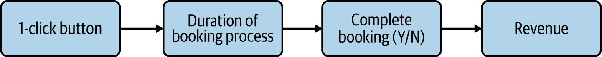
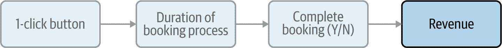
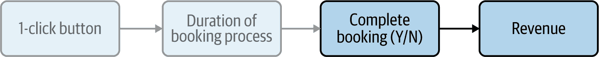
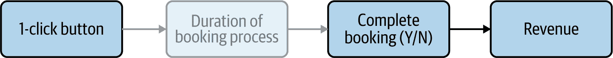
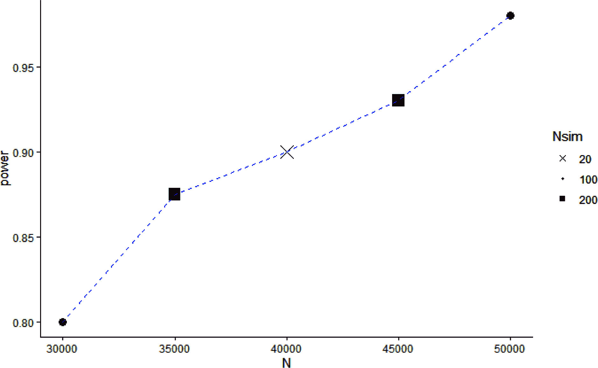
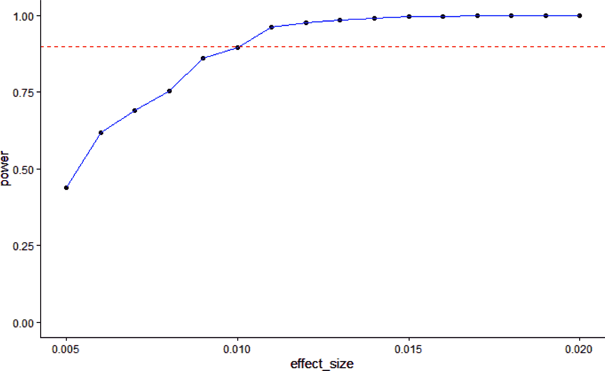

# 第八章。实验设计：基础知识

让我们从一个非常简单的实验开始探索实验：受领先在线商店的影响，AirCnC 的管理层决定增加一个“一键预订”按钮来提高 AirCnC 的预订率。正如我之前所讨论的，我们将客户分配到我们的实验组中，当他们连接到网站时，我们将一个一个地进行。这是最简单的实验类型，并且许多公司提供了界面，允许您在几分钟内创建并开始运行像这样的 A/B 测试。

这个简单的实验将为我们提供一个机会，通过这个过程而不陷入技术细节的困扰：

1.  第一步是计划实验。这是因果行为视角的重要性所在，它有助于确保您对成功的明确定义标准，并且您了解您正在测试什么以及您期望它如何影响您的目标指标。

1.  然后，在回顾了我们将在本章余下部分使用的数据和软件包之后，我将向您展示如何进行随机分配，并确定您实验的样本大小。

1.  最后，我们将分析实验的结果，在这种简单情况下将非常快速。

###### 注意

实验设计的词汇很大程度上归功于其统计学和科学根源。我会谈论“控制”和“处理”组，以及“干预”，这些可能听起来很可怕或者有点过火，实际上我们只是在讨论网站上按钮的位置或者折扣的数量。总体而言，当谈论实验时，我无法使用更简单的词汇；但是当你和你的商业伙伴谈论一个具体的实验时，我鼓励你使用与该实验相关的具体术语（例如“旧和新创意”，“折扣较低组和折扣较高组”等）。

轶事：有一次当我提出一个“干预”时，一位商业伙伴以为我是在暗示他们做得不好，我需要干预。这并不是一个开启富有成效和信任关系的最佳方式。与人相处时要以他们的方式为出发点，并努力用他们能理解的语言与他们沟通，而不是期望他们了解你的语言。

# 实验计划：变革理论

计划是实验设计的关键步骤。实验可能因为各种各样的原因而失败，其中许多你无法控制，比如实施过程出现问题；但糟糕的规划既是失败的频繁原因，又是你*可以*控制的原因。任何专门从事实验的人都有关于实验的恐怖故事，这些实验可能在技术上完美无缺，也可能完全毫无意义，因为人们对被测试的内容没有明确的认识。

最终，如果你只是在形式上行事而没有运用你的商业头脑和常识，那么任何流程都无法拯救你，但希望我即将概述的公式能够帮助你确保你已经覆盖了所有基础。我们将借鉴非营利组织和政府规划的概念，即*变革理论*（ToC）。简言之，您的 ToC 应通过行为变革将您正在做的事与您的最终业务目标和目标指标联系起来：

> 实施 [干预措施] 将帮助我们通过 [业务目标] 以 [目标指标] 为衡量标准，通过 [行为逻辑] 实现。

我将依次详细阐述这四个组成部分，但为了让你了解我们将要达到的目标，这是我们最终的变革理论的样子：

> 实施 [一个一键预订按钮] 将帮助我们通过 [预订概率] 减少 [预订过程时间] 以实现 [更高的收入]。

可以以 CD 格式表示，如 图 8-1 所示。



###### 图 8-1\. 我们的实验变革理论

让我们首先审视我们的业务目标和目标指标，然后再审视我们的干预措施，最后审视我们的行为逻辑。

## 业务目标和目标指标

你可能会感到惊讶，我先从业务目标和目标指标开始，而不是定义干预措施。毕竟，我们应该首先了解我们要测试什么吧？不幸的是，一个常见的失败原因是在没有清晰的目标意识的情况下决定测试某些东西（通常是最新的管理潮流或你老板的老板读到的东西）。

### 业务目标

第一步是为实验确定业务目标。公司通常试图增加利润，但仅仅把“更高利润”作为你的业务目标并不会很有帮助。相反，我建议再深入一层，使用诸如收入、成本、客户保留率等更具体但显然对公司有益的变量。这可能看起来是一个微不足道的步骤，但实际上可以凸显实验目标的分歧（例如，是减少成本还是增加收入？）。在这里，一键预订按钮实验的业务目标是更高的收入（图 8-2）。



###### 图 8-2\. 我们的业务目标是收入

### 目标指标

第二步是决定实验结束时如何衡量成功，即您的目标指标。这里存在一种权衡：一方面，您希望使用尽可能接近利润的指标，例如额外收入的美元或降低的成本；另一方面，您希望选择尽可能接近您干预的指标，以减少外部干扰。

在这一点上，你经常需要做出的妥协是使用“领先指标”——基本上是你最终感兴趣的变量的原因。例如，你最终可能关心客户的生命周期价值（LTV，即他们将与你的公司花费的总金额），但不得不接受三个月的预订金额。同样，注册可以用作使用的领先指标，使用可以用作购买金额的领先指标，等等。这将使你能够比使用长期业务指标更早地报告结果，同时仍然与你的业务目标有明确的联系。

但是，如果你的目标指标是操作指标而不是财务指标，情况可能会变得复杂。如果按钮缩短了某人预订旅行所需的时间，但在任何其他方面都没有增加预订量，这算成功吗？预订体验的满意度和净推荐分数又如何？这些可能无法直接转化为货币数字，但同时假设改善它们对你的业务有积极影响也并非不合理。有时，人们会非正式地选择操作指标作为实验的目标，并用一些模糊的手段假设这些指标最终会对公司的底线产生利益。当然，有了这本书，我们可以做得更好。我们可以通过观察性研究或专门的实验来验证和衡量短期操作指标与长期业务结果之间的因果关系，稍后我们会看到。

### 不良目标指标的陷阱

这里的目标再次是做出良好的商业决策。我不想成为货币数字的狂热者，因为这会过于限制，而且会排除大范围的业务改进。同时，你希望确保你有一个可追踪的可测量目标指标。在这里有几个潜在的陷阱是你应该避免的。

第一个是选择你无法可靠测量的东西。说“一键预订按钮使预订体验更容易”意味着什么？你会如何衡量它？事后问产品经理或产品所有者是否有改进并不是一种测量方法。“我们的客户评价网站导航更容易，通过访问结束时的两个问题调查来衡量”可能是一个不完美的代理指标，但至少可以测量。这就是为什么将业务目标和目标指标分开表达是有意义的：前者表达了你真正的意图，即使它不可测量，而后者清楚地显示了你打算测量什么。这样可以避免误解和目标变化。

第二个陷阱是列出一长串的指标，比如“成功将是预订率、预订金额、客户满意度或净推荐分数的改善”，甚至更糟糕的是，在看到结果后才确定成功的指标——例如，最初你认为实验会改善客户体验，但当结果出来时，客户体验没有改善而平均网站会话时长却有所改善。这种方法的问题在于它增加了误报的风险（在结果是随机巧合时称其为成功）。^(1) 但是，最多可以有两个或三个在实验之前明确定义的目标指标是可以的，只要你在分析结果时考虑到这一点（稍后会详细介绍）。有些人主张使用多个指标的综合（例如，加权平均），这被称为*总体评价标准*（OEC），但我个人觉得它往往会比帮助更多地使事情变得模糊。我更愿意鼓励你清楚地阐明你的变革理论以及各种指标之间的关系——例如，你是否期望 1 点击按钮能改善预订率*和*客户体验，或者是通过客户体验来改善预订率？

总之，在 1 点击按钮实验的情况下，我们可以直接使用预订收入作为我们的目标指标，但我们并不期望我们的干预会改变每次预订的平均金额，所以使用客户完成预订的概率更有意义（图 8-3）。



###### 图 8-3\. 添加目标指标，完成预订的概率

## 干预

一旦我们有了我们的业务目标和目标指标，我们就可以开始定义我们的干预措施。这里“1 点击按钮”的干预措施的想法来自公司管理层（图 8-4），但它也可以来自用户体验或行为研究：识别公司流程、产品和服务中的问题和改进机会确实是商业研究人员的主要任务之一，但这超出了本书的范围。



###### 图 8-4\. 添加干预，1 点击按钮

乍一看，“1 点击预订”按钮有什么比这更简单的呢？我们大多数人在在线零售商的网站上或其他地方都看到过它的实现，这个想法似乎非常简单明了。但是，一个商业想法，大家都觉得自己立即知道它是什么，与一个具体的实现之间可能存在很大的差距。如果你考虑一下如何实施细节，实际上有很多问题需要回答，每个问题都有多种可能的答案：

+   在流程的哪个环节，按钮变得可用？

+   按钮位于哪里？

+   按钮的外观是什么样的？它与页面上其他按钮的颜色相同，还是以鲜艳丰富的颜色突出？

+   按钮上写了什么？

+   我们需要哪些关于客户的信息才能使一键预订功能可用，以及如何确保我们已经获得了这些信息？

+   客户点击按钮后会发生什么？他们会被带到哪一页，如果有的话，他们还需要采取什么行动？

+   等等。

比如说，假设网站的颜色主题是淡绿色和蓝色，暗示自然和旅行，而新按钮是闪亮的红色。如果该按钮增加了预订量，可能是因为一键预订的吸引力，但也可能是因为客户难以看到普通预订按钮而放弃。在这种情况下，增加预订量的原因实际上是“更可见的预订按钮”，而不是“一键预订按钮”，但你不能区分这两者，因为一键预订按钮也更显眼。不幸的是，你永远不能只测试一个想法，因为你总是在测试它的实施的许多方面。

这里的教训是，A/B 测试是一个强大但局限的工具。你需要小心，不要做出或者让别人做出关于特定实验结果的夸大陈述。这绝对是说起来容易做起来难，因为业务伙伴通常希望得到广泛、清晰且没有任何小字条款的答案。话虽如此，甚至在你的报告中简单声明你正在测试特定实施方案而非一般性想法也是有用的，例如，“这个实验将测试在某些条件下添加一键预订按钮的影响，其结果不应被解读为适用于更广泛的预订按钮。”

更一般地说，我建议你测试尽可能小的干预。在这种情况下，你可以尝试在实施更大的一键预订按钮之前改变预订按钮的颜色或位置。你可能会遇到业务伙伴的阻力，他们经常希望一次运行多个改变的“综合”测试；在这种情况下，请明确表示你只是在测试这些改变不会破坏体验，而不是实际测量影响。一个更好的选择是在实验中测试相同概念的不同实施方式。如果四种稍有不同的一键预订按钮方案有相同的影响，你就可以更自信地得出关于一键预订的总体影响的结论；另一方面，如果它们有非常不同的影响，那么这表明实施方式非常重要，你需要非常小心地得出关于特定实施将如何泛化的结论。

## 行为逻辑

一旦我们知道我们的业务目标和目标指标，并且我们已经定义了我们的干预措施，最后一步是通过您的变革理论的行为逻辑将两者连接起来：我们的干预措施如何影响我们的目标指标？

这是实验失败的另一个令人惊讶的常见原因：已经确定了一个问题，并且有人决定实施他们最近考虑过的最新管理潮流，尽管不清楚它为什么会帮助解决这个具体的问题。或者有人决定更具吸引力和简单的用户界面（UI）将增加购买金额。为了对我们的实验有信心，您需要能够阐明一个合理的行为故事。[²] 在 1 点击预订的情况下，您可能假设客户识别了一个吸引人的预订，但在完成预订之前放弃，因为预订过程繁琐；1 点击按钮将通过缩短和简化预订过程影响预订的概率。这通常是您的 ToC 在 CD 中汇聚在一起的地方，就像我在本章开头展示给您的那个（图 8-5）。


###### 图 8-5. 我们变革理论的完整 CD

总的来说，阐明您的行为逻辑有两个好处。首先，它本身通常是可测试的。大量客户是否确实在开始预订和完成预订之间流失？如果是这样，从行为数据的角度来看，假设的逻辑是有意义的。但是，例如，大多数客户是否离开而没有开始特定产品的预订过程，例如，因为他们找不到自己喜欢的东西或者因为选项太多而感到不知所措，那么 AirCnC 试图解决的可能是错误的问题；提供 1 点击预订不太可能改善他们的数字。

提问自己：什么会证实或推翻我们的逻辑？如果是真的或假的，数据会是什么样子？如果你手头没有必要的数据，可能值得进行初步测试，例如，邀请 10 人进行用户体验测试，例如，观察他们在大声思考的同时尝试使用您的网站。这可能不能完全证实或推翻您的逻辑，但可能会给您一些指示，而且成本仅为考虑解决方案的开发成本的一小部分。正如阿尔伯特·爱因斯坦经常引用的一句话：“如果我有一个小时来解决一个问题，我会花 55 分钟思考问题，5 分钟思考解决方案。”

表达你的干预行为逻辑的第二个好处是，它通常会让你对潜在收益有所感知。如果处理中的问题得到解决，最佳情况下数字会是什么样子？假设所有在预订过程中放弃的客户都能通过 1 次点击预订完成，预订率会增加多少？这是实验角度的最佳情况，因为我们假设完全解决问题，但在现实中这是不太可能的。如果在这种情况下预订率的增加无法弥补实施 1 次点击预订的成本，那就别浪费时间测试了。

一旦确认你的最佳情况下的方案是有利可图的，你可以开始思考最可能的情况。我们期望 1 次点击预订能提高预订率多少？毫无疑问，这涉及到很多主观性和不确定性，但是在表达了起作用的行为机制之后，你通常可以做出合理的猜测。你真的期望 75%的人因为预订过程太长而放弃吗？此外，通过明确人们的假设和直觉，这也是一个有价值的练习。如果产品经理和用户体验研究员对于因为过程太长而放弃的客户的百分比有极大的分歧，你需要首先弥合这个差距。其中一方知道的是另一方不知道的吗？运用你的商业感和对流程的理解。如果大多数客户在过程中的确切步骤，例如支付时放弃，那么很可能是该特定步骤出了问题——人们不会同时失去耐心。然后你可以将预期的好处与实施解决方案的成本进行比较。这样还值得吗？

你也可以从另一个角度来考虑这个问题：首先确定解决方案的盈亏平衡点，即提高目标指标使得解决方案变得有利可图，然后考虑从行为角度来看这种改善是否现实。从心理学角度来看，从期望结果开始比从盈亏平衡点开始更好：如果从盈亏平衡点开始，你更有可能被其锚定，并找到理由证明其是可以实现的。然而，在许多情况下，你会首先知道盈亏平衡点，例如在初步成本效益分析中计算出来；你的公司或业务伙伴可能也会要求这样做，并拒绝首先考虑期望结果。不要太担心这个问题。无论你是根据期望结果还是最佳情况的结果工作，我们都需要它来确定我们实验的最小可检测效果。

重要的是，您的行为逻辑要与您的目标指标建立联系。不要把它留给“这将改善客户体验”。您如何知道这一点？如果您的逻辑是扎实的，您应该能够用因果图的术语表达它，其中至少一些效果是可观察的。

一个有用的经验法则可以帮助您表达您的逻辑是将您的业务指标分解成组成部分。例如，收入（或其大部分变体）可以分解为客户数量、购买的概率/频率、购买的数量和支付的价格。确定哪些组成部分可能会受到影响可以帮助您更好地阐述业务案例。如果您的业务合作伙伴担心客户数量的减少，并且建议的干预措施可能只会增加购买数量，您需要与他们澄清他们是否仍然会认为这是一种成功。这种方法还可以减少实验中的噪声；如果建议的干预措施可能只会增加购买数量，则您可以集中精力在这个指标上，而忽略价格支付中的某些随机波动。

# 数据和包

[本章的 GitHub 文件夹](https://oreil.ly/BehavioralDataAnalysisCh8)包含两个 CSV 文件，其中列出了表 8-1 中的变量。在表中，勾号（✓）表示该文件中存在的变量，而叉号（☓）表示缺失的变量。

表 8-1\. 我们数据中的变量

|  | 变量描述 | chap8-historical_data.csv | chap8-experimental_data.csv |
| --- | --- | --- | --- |
| *性别* | 分类，“男”/“女” | ✓ | ✓ |
| *时期* | 月份索引，在历史数据中为 1-32，在实验数据中为 33 | ✓ | ✓ |
| *季节性* | 年度季节性，介于 0 和 1 之间 | ✓ | ✓ |
| *月份* | 年份中的月份，1-12 | ✓ | ✓ |
| *已预订* | 二进制 0/1，目标变量 | ✓ | ✓ |
| *一键式* | 二进制 0/1，实验性处理 | ☓ | ✓ |

除了序言中列出的标准包之外，在本章中，我们还将使用以下包：

```py
## R
library(pwr) # For traditional power analysis
```

```py
## Python
import statsmodels.stats.proportion as ssprop # For the standardized effect size
import statsmodels.stats.power as ssp # For traditional power analysis
```

# 确定随机分配和样本大小/功效

一旦您建立并验证了实验的变革理论，下一步是确定您将如何进行随机分配以及需要多大的样本量。

根据我的经验，在特定环境中首次运行实验通常是一个重要的步骤。认真查看您的历史数据通常会带来令人惊讶的见解，这些见解可以重塑实验。此外，根据数据中的噪声和预期的影响大小（如果您正确地定义了实验的狭窄范围，则影响大小可能较小），发现您需要多大的样本量可能会让人感到谦卑。我仍然记得第一次得到数字后被告知我们需要进行一年的实验。

## 随机分配

随机分配的理论不可能更简单：每当客户到达相关页面时，他们应该以一定的概率看到当前版本的页面（在实验术语中称为“对照组”），并且以相反的概率看到带有一键预订按钮的版本（“处理组”）。

最直接的选择是 50%-50%的分配，直到达到目标样本大小，但如果您的交易量非常大，您可能希望使用不同的分割。比如，假设您管理一个每天有 1 亿次访问量的网站，并且确定您需要的样本大小为 200 万。您可以简单地选择 50%-50%，并在大约 30 分钟内完成实验。但是，如果您的处理出现了任何问题（例如，一个 bug 导致网站崩溃，虽然这是个极端案例），您将在意识到之前就有 100 万不满意的客户。此外，也许在这 30 分钟内的客户并不能代表您的全部客户群体（例如，中国此时大部分用户正在睡觉，而您主要得到的是美国访问者或者反过来）。在这种情况下，最好在一个更具代表性的时间段内获得您想要的 100 万次访问，比如一周或一个月（您不必担心对照组大于 100 万）。对于每天 1 亿次访问的网站来说，这将分别对应 99.86%-0.14%（因为 1 / (7 * 100) = 0.14%）和 99.97%-0.03%（因为 1 / (30 * 100) = 0.03%）。为了简单起见，我将在本章的其余部分假设 50%-50%的分割。

### 代码实现

从编码的角度来看，假设您没有使用能够为您处理此事的软件，这可以很容易地在 R 或 Python 中实现：

1.  每当新客户到达相关页面时，我们生成一个介于 0 和 1 之间的随机数。

1.  然后我们根据该随机数为客户分配一个组：如果 K 是我们想要的组数（包括对照组），那么所有随机数小于 1/K 的个体被分配到第一组；所有随机数介于 1/K 和 2/K 之间的个体被分配到第二组，依此类推。

在这里，K 等于 2，这转化为一个非常简单的公式：

```py
## R
> K <- 2
> assgnt = runif(1,0,1)
> group = ifelse(assgnt <= 1/K, “control”, “treatment”)
```

```py
## Python
K = 2
assgnt = np.random.uniform(0,1,1)
group = "control" if assgnt <= 1/K else "treatment"
```

### 随机分配的缺陷

然而，对于初学者来说，有一些微妙之处可能会导致问题。在本章中，我将涵盖两个问题：时间和分配的层次。

#### 随机分配时间

第一个问题是确定在过程中随机分配的合适时机。假设每当客户进入网站的第一页时，您会将他们分配到控制组或处理组中的一个。这些客户中许多人将永远不会达到预订的阶段，因此不会看到您的预订界面。这将极大地降低实验的有效性，因为您实际上只对样本的一部分进行实验。

在确定哪些客户应该参与实验以及何时将他们分配到实验组时，您应该考虑如果实验成功，如何实施治疗。您的实验设计应该包括与业务通常情况下实施时会看到治疗的相同人群，并且仅包括他们。例如，离开网站而未预订的访客仍不会看到按钮，而任何未来的促销或预订页面的更改将被构建为附加的“在按钮上方”，该按钮将始终存在。因此，非预订访客应该被排除在外，但促销客户应该被包括在内。

#### 随机分配级别

第二个挑战是确保随机分配发生在“正确”的行为级别上。我将通过一个例子来解释这意味着什么。假设一位访客进入 AirCnC 网站并开始预订，但然后因为某种原因离开网站（他们断开连接，是吃饭时间等），并稍后回到网站。他们应该看到相同的预订页面吗？如果他们第一次提供了 1 点击预订，他们第二次还应该被提供吗？

这里的问题在于，实际上可能有多个级别是有意义的。您可以在单个网站访问、预订、无论需要多少次访问，或客户帐户的级别上分配控制或处理（如果一个家庭中的几个人使用同一个帐户，则可能是同一个人）。不幸的是，在这里没有硬性规定，正确的方法必须根据情况逐案确定，考虑您想要得出的结论以及永久实施的情况。

在许多情况下，最好在最接近人类的级别上进行分配：如果无法区分家庭中的人员，则在客户账户上进行分配，或者如果每个人都有一个子账户，则在个别客户上进行分配，例如 Netflix。人类有持久的记忆，并且同一人的交替选项可能会令人困惑。在这里，这意味着我们的 AirCnC 客户应该在整个实验期间看到 1-click 按钮，而不管他们在此期间进行了多少次访问和预订。不幸的是，这意味着您不能仅仅在每次有人开始在网站上预订时象征性地掷骰子来确定他们的分配；您需要跟踪他们以前是否被分配过，并且如何分配。对于网站实验，可以通过 cookie 来实现这一点（假设客户允许使用 cookie！）。

###### 注意

您进行随机分配的级别应该与您计算样本量的级别相同。如果您在客户级别进行分配，并且客户平均每月访问三次，那么您将需要一个比如果在访问级别进行分配长三倍的实验时间。但您选择进行随机分配的级别应该决定您的样本量，而不是反过来！

无论您选择哪个级别，您都必须跟踪分配任务，以便稍后将其与业务结果联系起来。这就是为什么最佳实践是使用集中系统记录所有任务，并将其连接到数据库中的客户 ID，以便随时为客户提供一致的体验。

更广泛地说，这两个挑战所指向的是，业务实验的实施几乎总是一项复杂的技术工作。现在有各种供应商提供有点即插即用的解决方案，可以在幕后隐藏复杂性，尤其是对于网站实验。无论您依赖它们还是依赖您的内部技术人员，您都需要了解他们如何进行随机分配，以确保您得到您想要的实验。

检查系统是否正常工作的好方法是从 A/A 测试开始，其中存在随机分配，但两组看到的页面版本相同。这将允许您检查两组中确实有相同数量的人，并且它们在任何重要方面都没有差异。

## **样本量和功效分析**

一旦我们知道我们要测试什么以及如何测试，我们就需要确定我们的样本量。在某些情况下，例如我们的 1-click 预订实验，我们可以选择我们的样本量：我们可以决定实验要运行多长时间。在其他情况下，我们的样本量可能已经为我们定义好了，或者至少有其最大值。如果我们要在整个客户或员工人群中进行测试，我们不能仅仅为了实验而增加该人群！

无论我们处于什么样的情况，我们都将把样本大小与其他实验变量（如统计显著性）联系起来，而不是孤立地看待。了解这些变量如何相关至关重要，以确保我们的实验结果可用，并且我们从中得出正确的结论。不幸的是，这些是非常复杂和微妙的统计概念，并且它们并非为商业决策而开发。

符合本书精神，我将尽力在商业决策的背景下解释这些统计概念和惯例。然后，我将分享我对传统惯例的保留意见，并提出我对如何在传统框架内进行调整的建议。最后，我将描述一种曾慢慢获得动力的替代方法，我认为这种方法更为优越，即使用计算机模拟。

### 一点点不带数学的统计理论

当进行诸如“一键预订”按钮之类的实验时，我们的目标是做出正确的决策：我们应该实施它还是不实施？不幸的是，即使进行了实验（甚至进行了一百次），我们也无法百分之百确定我们是否做出了正确的决定，因为我们只有部分信息。当然，如果我们连续数年进行实验，可能会到达一个只有一百万分之一错误的机会的时候，但从来不会完全为零。此外，通常我们不希望连续数年进行实验，而是希望能进行其他实验！因此，实验的样本大小和我们的确定度之间存在权衡。

因为事后我们无法确定某个特定决策是正确的还是错误的，所以我们的方法是在实验之前尽量选择一个好的样本大小和一个好的决策规则。这里的“好”是什么意思呢？嗯，最理想的样本大小和规则应该是能够在长期内最大化我们的预期利润。相应的计算是可行的，但需要高级的方法，超出了本书的范围。^(3) 因此，我们将依赖以下措施：

+   假设我们的一键预订按钮确实提高了我们的预订率，那么我们正确实施该按钮的概率是多少？这被称为“真正阳性”概率。另一方面，如果有积极效果，但我们错误地得出没有效果的结论，则称为“假阴性”。

+   假设我们的一键预订按钮对我们的预订率没有明显影响（或者更糟糕的是，有负面影响！），那么我们错误地实施该按钮的概率是多少？这个概率称为“假正性”概率。另一方面，如果没有效果，并且我们正确地得出没有效果的结论，则称为“真负性”。

这些各种配置在 表 8-2 中总结。

表 8-2。在正确的情况下做出正确的决策

|  |  | 我们是否实施了 1-点击预订按钮？ |
| --- | --- | --- |
|  |  | **是** | **否** |
| **1-点击预订按钮是否增加了预订率？** | **是** | 真正阳性 | 假阴性 |
|  | **否** | 假阳性 | 真负性 |

我们希望我们的真正阳性和真负性率尽可能高，并且我们的假阳性和假阴性率尽可能低。然而，这个表格的简单性是具有误导性的，它实际上包含了无限多种情况：当我们说按钮增加了预订率时，这可能意味着增加了 1%，2%等等。另一方面，当我们说按钮不会增加预订率时，这可能意味着它完全没有效果，或者它以 1%，2%等速度降低预订率。所有这些效应大小都必须被考虑在内，以计算整体的真正阳性和真负性率，这将会变得太复杂。因此，我们将依赖于两个阈值。

第一个是所有科目的影响完全为零，也称为“尖锐零假设”（非尖锐零假设将是*平均*零效应跨科目）。对于这个值的假阳率称为我们实验的统计显著性。因为负面影响比零效应更容易捕捉，任何负值的假阳率至少将与统计显著性相同，并且较大的负效应将有更高的假阳率。学术研究中最常见的惯例是将统计显著性设置为 5%，尽管在某些领域如[粒子物理学](https://oreil.ly/U48vk)，有时可以低至 0.00005%。

第二个阈值设置在我们有兴趣测量的某些正效应上。例如，我们可能会说我们想选择一个样本大小，以便“合理确信”我们将捕捉到 1%的预订率增加，但是我们可以接受错过比这更小的效果。这个值通常称为“备择假设”，对于这个值的真正阳性率称为我们实验的统计功效。因为较大的效应更容易捕捉，任何更大值的真正阳性率至少会和统计功效一样大，并且更大的正效应将有更高的真正阳性率。“合理确信”传统上被认为是 80%。再次强调，这并不意味着你的实验“具有 80%的功效”，这个短语本身实际上是毫无意义的：对于某个更大的效应大小，实验也具有 90%的功效，对于某个更小的效应大小，实验具有 70%的功效，等等。

因此，根据传统惯例更新的我们的表格看起来像表 8-3。

表 8-3. 传统统计方法中使用的阈值

|  | 我们是否实施点击预订按钮？ |
| --- | --- |
|  | **是** | **否** |
| 点击预订按钮使预订率增加超过 1%。 | > 80%（较大的效果大小） | < 20%（较大的效果大小） |
| **点击预订按钮**使预订率**准确增加 1%**。 | **80%（统计功效）** | **20%（1 减去统计功效）** |
| 点击预订按钮使预订率增加少于 1%。 | < 80%（较大的效果大小） | > 20%（较大的效果大小） |
| **点击预订按钮对预订率完全没有影响。** | **5%（统计显著性）** | **95%（1 减去统计显著性）** |
| 点击预订按钮严格降低预订率。 | < 5%（较大的负面效果大小） | > 95%（较大的负面效果大小） |

我并不喜欢仅仅因为它是传统的而使用任意数字，你应该随心所欲地调整“80%功效”的约定以适应你的需求。对于相关阈值效果大小使用 80%的功效意味着，如果干预确实具有那种效果大小，平均而言，你有 20%的机会不实施干预，因为你错误地得到了负面结果。对于难以测试的大型和昂贵的干预措施，我的观点是 80%的功效太低了，我个人会设定目标为 90%的功效。另一方面，你想要的功效越高，你需要的样本量就越大。如果在半年时间内，你的竞争对手已经完全两次改进了他们的网站并且在吞食你的午餐，那么你可能不想花费半年时间来确保 1 点击按钮的价值。

在我个人的经验中，对于实际世界中的功效分析和样本大小确定，一个关键但常被忽视的考虑因素是组织测试速度：你一年内可以进行多少实验？在许多公司中，这个数字受到某人的时间限制（分析师或业务伙伴的时间）、公司的计划周期、预算限制等的限制，而不是受到可用客户数量的限制。如果你真的希望每年只能计划、测试和实施一次干预措施，那么你真的想要进行为期三个月的实验，然后在其余的一年里什么都不做吗？另一方面，如果你可以每周进行一次实验，那么你真的想要花费三个月的时间确保一个正面但普通的影响，而不是有 12 次机会追求一个大的影响吗？因此，在进行数学计算之后，你应该始终对你的实验持续时间进行一次健全性检查，并相应地进行调整。

关于统计显著性，传统方法引入了控制组和处理组之间的不对称性，统计显著性阈值为 95%。处理组必须通过的证据标准要比控制组高得多，默认情况下是实施的。假设你正在设置一个新的营销电子邮件活动，有两个选项可以测试。为什么应该让一个版本比另一个版本受益？另一方面，如果你的活动已经运行了几年，并且你已经进行了数百次测试，当前版本可能非常出色，而 5%的错误放弃的机会可能太高；在这种情况下，正确的阈值可能是 99%，而不是 95%。更广泛地说，依赖于对所有实验都相同的传统值，对我来说感觉像是错失了反思假阳性和假阴性的成本。对于易于逆转且实施成本最小的一键按钮，我也会将统计显著性阈值定为 90%。

总结来说，从统计学的角度来看，我们的实验可以用四个值来概括：

+   统计显著性，通常由希腊字母贝塔（β）表示

+   选择为备择假设的效应大小，又称最小可检测效应

+   统计功效，通常表示为 1 − α，其中α是所选备择效应大小的误差率

+   我们实验的样本量，用 N 表示

这四个变量被称为 B.E.A.N.（贝塔、效应大小、阿尔法、样本量 N），为实验确定它们称为“功效分析”。^(4) 对于我们的一键按钮实验，我们已经决定了前三个变量，现在只需确定样本量。接下来我们将看看如何使用传统的统计公式和计算机模拟来完成。

### 传统的功效分析

统计学家已经开发出了一些公式来确定特定统计测试所需的样本量。考虑到我们将依赖回归而不是测试，你可能会想知道为什么我们要使用这些公式。根据我的经验，这些公式会给出与“真实”所需样本量相同数量级的值。如果你不知道你的样本量应该是 100 还是 100,000，这是获取模拟的合理起始值的一种快速简便的方式（在这个特定示例中，我们最终会得到几乎完全相同的样本量！）。

比例检验是一种标准测试，计算相应样本量的公式在 R 和 Python 中都很容易找到。让我们首先看看 R 中的公式。

根据我们历史数据中的平均预订率 18.25%，选择的 1%效应大小将导致我们处理组的预订率预期为 19.25%。对于参数的标准值——统计显著性=0.05 和功效=0.8——在 R 中相应的公式为：

```py
## R
> effect_size <- ES.h(0.1925,0.1825)
> pwr.2p.test(h = effect_size, n = NULL, sig.level = 0.05, power = 0.8,
                      alternative = "greater")

     Difference of proportion power calculation for binomial distribution
                      (arcsine transformation) 

              h = 0.02562255
              n = 18834.47
      sig.level = 0.05
          power = 0.8
    alternative = greater

NOTE: same sample sizes
```

`pwr`包中所有功效分析函数的语法相同，只是效应大小的表示法在不同的公式中有所变化：

+   `h`是效应大小，基于我们希望观察到的比基线概率增加的概率。

+   `n`是每组的样本量。

+   `sig.level`是统计显著性水平。

+   `power`是统计功效，等于 1 − α。

在输入公式时，您应输入这些变量中的三个变量的值，并将其余一个设置为 NULL。在前述公式中，我们正在计算样本量，因此将`n` = NULL。

请注意，对于两个比例的检验，出于统计目的，效应大小取决于基线比率；相对于 10%或 90%的基线，从 50%的基线增加 5%更“重要”。幸运的是，`pwr`包提供了`ES.h()`函数，它将预期概率和基线概率转化为正确的效应大小公式。

还要注意公式末尾的参数：`alternative`表示您是否要运行单侧（`greater`或`less`）或双侧（`two.sided`）检验。只要我们的处理不会增加预订率，我们实际上不关心它是否与我们的对照有相同或更低的预订率；无论哪种方式，我们都不会实施它。这意味着我们可以通过设置`alternative = 'greater'`来运行单侧检验而不是双侧检验。

Python 的代码类似，使用`statsmodels.stats.proportion`包中的`proportion_effectsize()`函数：

```py
## Python
effect_size = ssprop.proportion_effectsize(0.194, 0.184)
ssp.tt_ind_solve_power(effect_size = effect_size, 
                       alpha = 0.05, 
                       nobs1 = None, 
                       alternative = 'larger', 
                       power=0.8)
Out[1]: 18950.818821558503
```

公式返回的样本量是每组 18,800（加减一些小的 R 和 Python 之间的差异），即 37,600 总数，这意味着我们可以在不到四个月的时间内达到必要的样本量。太容易了！使用统计显著性为 0.1 和功效为 0.9 将产生每组 20,000 的样本量，稍长一点。

在我之前部分概述的决策模型中，对于统计显著性为 0.1 和功效为 0.9 的总样本量 40,000 意味着什么？想象一下以下情况：

+   您运行了非常多的实验，总样本量为 40,000，如描述的那样。

+   在每种情况下，您的决策规则是，如果比例检验的统计数据的 p 值低于 0.1，那么您将实施 1 点击按钮。

+   在所有这些实验中，真实的效应大小为 1%。

那么你会发现一个显著的正结果，并在这些实验的 90%（即 0.9）中实施 1-点击按钮；在剩下的 10% 的实验中，你会得到一个空结果，并错误地拒绝实施 1-点击按钮。

对于回归，有一些等价的公式，但仅适用于最简单的情况，我发现即使在这些情况下，它们的复杂性远远超过了它们的实用性。尽管如此，作为我们模拟方法的概念步骤，让我们回顾一下传统的统计方法在回归决策模型方面会是什么样子。让我们在一些模拟数据上运行一个 logistic 回归：

```py
## R (output not shown)
exp_null_data <- hist_data %>%
  slice_sample(n=20000) %>%
  mutate(oneclick = ifelse(runif(20000)>0.5,1,0)) %>%
  mutate(oneclick = factor(oneclick, levels=c(0,1)))
summary(glm(booked ~ oneclick + age + gender, 
                     data = exp_null_data, family = binomial(link = "logit")))
```

```py
## Python 
exp_null_data_df = hist_data_df.copy().sample(2000)
exp_null_data_df['oneclick'] = np.where(np.random.uniform(0,1,2000)>0.5, 1, 0)
mod = smf.logit('booked ~ oneclick + age + gender', data = exp_null_data_df)
mod.fit(disp=0).summary()
...
               coef     std err    z      P>|z| [0.025    0.975]
Intercept      9.5764    0.621   15.412    0.000    8.359   10.794
gender[T.male] 0.1589    0.136    1.167    0.243    -0.108   0.426
oneclick       0.0496    0.136    0.365    0.715    -0.217   0.316
age           -0.3017    0.017  -17.434    0.000    -0.336  -0.268
...
```

传统的决策规则是，如果相应的系数（这里约为 0.0475）的 p 值小于 0.1，则认为 1-点击按钮的影响是显著的，并且实施它。由于在这个模拟数据中大约为 0.28，我们会认为效果不显著，并拒绝实施按钮（你的实际数字会随机变化，取决于你的模拟）。

根据这种方法确定我们分析的样本大小将包括确定样本大小，使得在大量的实验中有 90% 的实验中真实效果为 1% 的情况下，我们会得到回归系数的 p 值小于 0.1。但正如我在第七章中所描述的那样，这隐含地对我们的数据进行了统计假设，即数据服从正态分布，这可能会有问题，因此我们将使用 Bootstrap 模拟，正如我们现在将要看到的那样。

###### 注意

对于比例检验的样本大小公式仍然可以作为一个快速的第一步，因为其结果应该与最终需要的样本大小的数量级相同。比例检验的总样本量为 40,000 意味着除非你的其他预测变量具有疯狂的高预测能力，否则你所需的样本大小的数量级将为 10,000，而不是 1,000 或 100,000（即，你的样本大小将有五位数）。我们将从一个暂定样本大小为 20,000 的样本开始我们的模拟，并根据它给我们的有效功率调整该数字向上或向下。

### 没有统计学的功率分析：自助法模拟

当数据有限且计算是通过手工费力完成时，传统的统计分析是完全合理的。我坚信，它现在已经失去了其实用性：自助法模拟提供了一个更好地反映应用数据分析现实和需求的替代方案。一个实验能有多么错误（例如，说治疗比对照好 1%，而实际上它比对照差 10%）通常比差异为零的可能性更令商业伙伴担忧。^(5)

#### 连接模拟和统计理论

在使用 Bootstrap 模拟时，我们的决策规则不依赖于 p 值。相反，我们会在感兴趣系数的 Bootstrap 置信区间高于某个阈值时实施处理，通常是零。如果验证了统计功效分析的假设，Bootstrap 模拟会产生非常相似且直观相关的结果：

+   在无效果的尖锐零假设下，我们期望 90% 的置信区间在 90% 的时间内包含零，80% 的置信区间在 80% 的时间内包含零，依此类推。这一属性被称为置信区间的*覆盖率*，意味着我们用于定义置信区间的百分比相当于统计显著性，即 90% 的置信区间在每个方向上都将具有约 5% 的误报率。在 5% 的情况下，我们会观察到严格为负的置信区间，在另外 5% 的情况下会观察到严格为正的置信区间。

+   鉴于备择假设，即目标效应大小，我们可以将我们的功效定义为生成真阳性的模拟百分比。例如，如果我们将 1 次点击按钮的效应设定为 1%，模拟大量实验，并观察到我们的 Bootstrap 置信区间中有 75% 是严格为正的，则我们的功效为 75%。

###### 注意

正如我们将在下一章中看到的那样，如果传统统计功效分析的假设*未*验证，Bootstrap 置信区间的覆盖率可能会有所不同。也就是说，90% 的置信区间可能在 90% 的时间内包含零，也可能不包含。这种有效覆盖率代表了实际的假阳性风险，需要将其设置为所需的显著性水平。这只是一个提醒；我们将在 第九章 中详细讨论。

模拟提供了一种非常灵活但透明的方法来确定任何实验所需的样本量，无论数据多么奇怪或业务决策多么复杂。这些优势源于明确声明如何分析数据并编写相应代码，然后再实际运行实验之前，这提供了额外的检查和调整机会。这些好处的对应物是，我们将不得不自己编写更多的代码，而不是依赖现成的公式。我将尝试通过将其分解为直观函数来限制代码的复杂性。

#### 编写我们的分析代码

让我们首先创建一个函数，该函数将输出我们感兴趣的指标，即我们逻辑回归中的 *OneClick* 系数：

```py
## R
#Metric function
log_reg_fun <- function(dat){
  #Running logistic regression
  log_mod_exp <- glm(booked ~ oneclick + age + gender, 
                     data = dat, family = binomial(link = "logit"))
  summ <- summary(log_mod_exp)
  metric <- summ$coefficients['oneclick1', 'Estimate']
  return(metric)}
```

```py
## Python
def log_reg_fun(dat_df):
    model = smf.logit('booked ~ oneclick + age + gender', data = dat_df)
    res = model.fit(disp=0)
    coeff = res.params['oneclick']
    return coeff
```

这只是对我们前面分析的功能性包装，将该函数应用于我们的模拟数据集将返回相同的系数，约为 0.0475。

然后我们计算该指标的 Bootstrap 置信区间，重复使用来自 第七章 的函数：

```py
## R
boot_CI_fun <- function(dat, metric_fun){
  # Setting the number of bootstrap samples
  B <- 100

  boot_metric_fun <- function(dat, J){
    boot_dat <- dat[J,]
    return(metric_fun(boot_dat))}
  boot.out <- boot(data=dat, statistic=boot_metric_fun, R=B)
  confint <- boot.ci(boot.out, conf = 0.90, type = c('perc'))
  CI <- confint$percent[c(4,5)]
  return(CI)}
```

```py
## Python
def boot_CI_fun(dat_df, metric_fun, B = 100, conf_level = 0.9):
  #Setting sample size
  N = len(dat_df)
  conf_level = conf_level
  coeffs = []

  for i in range(B):
      sim_data_df = dat_df.sample(n=N, replace = True)
      coeff = metric_fun(sim_data_df)
      coeffs.append(coeff)

  coeffs.sort()
  start_idx = round(B * (1 - conf_level) / 2)
  end_idx = - round(B * (1 - conf_level) / 2)
  confint = [coeffs[start_idx], coeffs[end_idx]]  
  return(confint)
```

同样，我们将采取的决策规则是，只有在 Bootstrap 90% 置信区间严格为正（即不包括零）时我们才会实施该按钮：

```py
## R
decision_fun <- function(dat){
  boot_CI <- boot_CI_fun(dat, metric_fun)
  decision <- ifelse(boot_CI[1]>0,1,0)
  return(decision)}
```

```py
## Python
def decision_fun(dat_df, metric_fun, B = 100, conf_level = 0.9):
    boot_CI = boot_CI_fun(dat_df, metric_fun, B = B, conf_level = conf_level)
    decision = 1 if boot_CI[0] > 0  else 0
    return decision
```

这相当于实施按钮的决策规则，只有在 p 值低于 0.10 的阈值时才会实施。你可以自己检查，将这个函数应用到我们的模拟数据集返回 0，正如它应该的那样。

对于给定效应大小和样本大小，我们实验的功效定义保持不变：它是在大量这样的实验中，我们会实施按钮的百分比。现在让我们转向模拟这些大量实验！

#### 功效模拟

接下来，我们将编写我们的函数来运行单个模拟。代码工作如下（编号适用于 R 和 Python）：

```py
## R
> single_sim_fun <- function(dat, metric_fun, Nexp, eff_size, B = 100, 
                             conf.level = 0.9){

    #Adding predicted probability of booking 
    hist_mod <- glm(booked ~ age + gender + period, 
                    family = binomial(link = "logit"), data = dat)
    sim_data <- dat %>%
      mutate(pred_prob_bkg = hist_mod$fitted.values) %>%
      #Filtering down to desired sample size 
      slice_sample(n = Nexp) %>%
      #Random assignment of experimental groups          
      mutate(oneclick = ifelse(runif(Nexp,0,1) <= 1/2, 0, 1)) %>%
      mutate(oneclick = factor(oneclick, levels=c(0,1))) %>%
      # Adding effect to treatment group      
      mutate(pred_prob_bkg = ifelse(oneclick == 1, 
                                    pred_prob_bkg + eff_size, 
                                    pred_prob_bkg)) %>%
      mutate(booked = ifelse(pred_prob_bkg >= runif(Nexp,0,1),1, 0))

    #Calculate the decision (we want it to be 1)  
    decision <- decision_fun(sim_data, metric_fun, B = B, 
                           conf.level = conf.level)
return(decision)}
```

```py
## Python 
def single_sim_fun(Nexp, dat_df, metric_fun, eff_size, B = 100,
                   conf_level = 0.9):

    #Adding predicted probability of booking      
    hist_model = smf.logit('booked ~ age + gender + period', data = dat_df)
    res = hist_model.fit(disp=0)
    sim_data_df = dat_df.copy()
    sim_data_df['pred_prob_bkg'] = res.predict()
    #Filtering down to desired sample size   
    sim_data_df = sim_data_df.sample(Nexp)
    #Random assignment of experimental groups             
    sim_data_df['oneclick'] = np.where(np.random.uniform(size=Nexp) <= 0.5, 0, 1)
    # Adding effect to treatment group                      
    sim_data_df['pred_prob_bkg'] = np.where(sim_data_df.oneclick == 1, 
                                            sim_data_df.pred_prob_bkg + eff_size, 
                                            sim_data_df.pred_prob_bkg)
    sim_data_df['booked'] = np.where(sim_data_df.pred_prob_bkg >= \
                                     np.random.uniform(size=Nexp), 1, 0)

    #Calculate the decision (we want it to be 1)                    
    decision = decision_fun(sim_data_df, metric_fun = metric_fun, B = B, 
                            conf_level = conf_level)
    return decision
```


将预测的预订概率添加到数据中。


过滤到所需的样本大小。


分配实验组。


将效果添加到治疗组。


应用决策函数并返回其输出。

现在我们可以编写我们的功效函数，针对某个效应大小和样本大小。该函数反复生成实验数据集，然后对它们应用我们的决策函数；它返回我们将实施按钮的实验数据集的分数：

```py
## R
power_sim_fun <- function(dat, metric_fun, Nexp, eff_size, Nsim, 
                          B = 100, conf.level = 0.9){
  power_list <- vector(mode = "list", length = Nsim)
  for(i in 1:Nsim){
    power_list[[i]] <- single_sim_fun(dat, metric_fun, Nexp, eff_size, 
                                      B = B, conf.level = conf.level)}
  power <- mean(unlist(power_list))
  return(power)}
```

```py
## Python
def power_sim_fun(dat_df, metric_fun, Nexp, eff_size, Nsim, B = 100, 
                  conf_level = 0.9):
    power_lst = []
    for i in range(Nsim):
        print("starting simulation number", i, "\n")
        power_lst.append(single_sim_fun(Nexp = Nexp, dat_df = dat_df, 
                                        metric_fun = metric_fun, 
                                        eff_size = eff_size, B = B, 
                                        conf_level = conf_level))
    power = np.mean(power_lst)
    return(power)
```

你应该模拟多少数据集？20 是一个很好的起点；它将给你一个嘈杂的估计，但如果你得到 0 或 1 的功效，你就知道你需要调整你的样本大小：

```py
## Python (output not shown)
power_sim_fun(dat_df=hist_data_df, metric_fun = log_reg_fun, Nexp = int(4e4), 
              eff_size=0.01, Nsim=20)
```

```py
## R
> set.seed(1234)
> power_sim_fun(dat=hist_data, effect_size=0.01, Nexp=4e4, Nsim=20)
[1] 0.9
```

这个初步估计是 90%的功效；正如我所说的，传统的公式给出了一个合理的起点来开始你的模拟。然后我运行功效模拟函数，分别对 30,000 和 50,000 行进行了 100 次模拟，最后对 35,000 和 45,000 行进行了 200 次模拟。基本上，随着你获得越来越窄的样本大小区间，你希望通过增加模拟次数来提高精度。图 8-6 显示了我的连续迭代的结果。



###### 图 8-6. 不同样本大小的功效模拟

正如之前宣布的，我们在大约 40,000 处得到了 0.9 的功效。如果需要更精确的结果（例如，我们是否应该得到一个 38,000 的样本大小？41,000 呢？），我们可以继续运行模拟，但对于这个示例来说已经足够了。

现在我们确定了样本大小，我喜欢做的最后一件事是绘制在该样本大小下几个效应大小的功效曲线。这使我们更好地了解，假设实际效应大小为正，我们整体上获得积极结果的可能性有多大。它还允许您更好地向您的业务伙伴传达，您的实验的功效不仅仅定义为一个效应大小。在这里，我们可以看到，从 0.5%的效应到 2%的效应，实验的功效增加了（图 8-7）。



###### 图 8-7\. 在 N = 40,000 的各种效应大小下进行功效模拟，每个效应大小 200 次模拟，功效=0.9 的虚线

对于每个效应大小进行 200 次模拟，功效的估计值应该相当准确，尽管仍不完美，如曲线平滑度的缺失所示。换句话说，我们看到效应大小为 2%的功效为 1，并不意味着我们对该效应大小的功效确实是 100%，而是非常接近它。

###### 注意

提醒：如果你的变量相对平滑且近似正态分布，Bootstrap 置信区间的模拟统计显著性应该与正常置信区间非常接近。对于更奇怪的数据（多峰、胖尾等），这种情况可能不再成立，你一定要检查你的模拟统计显著性是否有较大偏差。

如果你愿意，也可以运行一个效应大小为零的模拟。这将给你分析的经验统计显著性。因为我们使用的是 Bootstrap 90%-CI，大约 5%的模拟应该会得出（错误地）实施 1 点击按钮的决策，这就是我们在这里观察到的。

###### 注意

这些绝不是大数据模拟，但它们足够耗时（最长一次在我的笔记本上花了大约半小时），你可能希望提高函数的性能，在做其他事情时让你的代码继续运行，或者两者兼顾。[GitHub 上的代码](https://oreil.ly/BehavioralDataAnalysis)包含我使用 R 中的`Rfast`和`doParallel`包，以及 Python 中的`joblib`和`psutil`包优化的函数。

# 分析与解释实验结果

在运行实验并收集相应数据后，你可以进行分析。经过所有为了功效估计而进行的模拟分析，最终的分析应该是小菜一碟。我们进行逻辑回归并确定相应的 Bootstrap 90%-CI。由于随机分配，我们知道 1 点击按钮的系数是无偏的——我们不需要控制任何混杂变量。然而，通过添加其他也是预订概率原因的变量，我们可以减少噪声，显著提高估计的准确性：

```py
## Python code (output not shown)
import statsmodels.formula.api as smf
model = smf.logit('booked ~ age + gender + oneclick', data = exp_data_df)
res = model.fit()
res.summary()
```

```py
## R
> log_mod_exp <- glm(booked ~ oneclick + age + gender, 
                     data = exp_data, family = binomial(link = "logit"))
> summary(log_mod_exp)

...
Coefficients:
             Estimate Std. Error z value    Pr(>|z|)    
(Intercept)  11.94701    0.22601  52.861     < 2e-16 ***
oneclick1     0.15784    0.04702   3.357    0.000789 ***
age          -0.39406    0.00643 -61.282     < 2e-16 ***
genderfemale -0.25420    0.04905  -5.182 0.000000219 ***
...
```

1 点击按钮的系数为 0.15784，Bootstrap 90%-CI 大约为[0.073; 0.250]。根据我们的决策规则，我们将继续实施 1 点击按钮。

逻辑回归中的系数并不直接可解释，我发现只使用比率比的推荐解决方案在辅助效果时帮助甚微。我更倾向于采用一个经验法则，即生成两份实验数据副本，一份将 1-点击按钮的变量设为每个人都是 1，另一份将其设为 0。通过比较我们的逻辑模型对这两个数据集预测的预订概率，我们可以计算一个非常接近于如果将治疗方案应用于每个人时观察到的效应的“平均”效应。这种方法虽然不科学，但很有用：

```py
## R (output not shown)
> diff_prob_fun <- function(dat, reg_model = log_mod_exp){
    no_button <- dat %>%                                   
      mutate(oneclick = 0) %>%                                                      
      mutate(oneclick = factor(oneclick, levels=c(0, 1))) %>%
      select(age, gender, oneclick)
    button <- dat %>%                                         
      mutate(oneclick = 1) %>% 
      mutate(oneclick = factor(oneclick, levels=c(0, 1))) %>%
      select(age, gender, oneclick)
    #Adding the predictions of the model 
    no_button <- no_button %>%                            
      mutate(pred_mod = predict(object=reg_model, newdata = no_button, 
                                type="response"))
    button <- button %>%
      mutate(pred_mod = predict(object=reg_model, newdata = button, 
                                type="response"))
    #Calculating average difference in probabilities
    diff <- button$pred_mod - no_button$pred_mod    
    return(mean(diff))}
> diff_prob_fun(exp_data, reg_model = log_mod_exp)
```

```py
## Python
def diff_prob_fun(dat_df, reg_model = log_mod_exp):

    #Creating new copies of data
    no_button_df = dat_df.loc[:, 'age':'gender'] 
    no_button_df.loc[:, 'oneclick'] = 0
    button_df = dat_df.loc[:,'age':'gender']                        
    button_df.loc[:, 'oneclick'] = 1

    #Adding the predictions of the model 
    no_button_df.loc[:, 'pred_bkg_rate'] = res.predict(no_button_df) 
    button_df.loc[:, 'pred_bkg_rate'] = res.predict(button_df)

    diff = button_df.loc[:,'pred_bkg_rate'] \    
    - no_button_df.loc[:,'pred_bkg_rate']
    return diff.mean()
diff_prob_fun(exp_data_df, reg_model = log_mod_exp)
0.007129714313551981
```


我们创建了一个名为`no_button`的数据集，其中我们将变量`oneclick`在所有行上设置为零（并将其转换为因子，以便后来的预测函数能够工作）。


我们创建了一个名为`button`的数据集，其中我们将变量`oneclick`在所有行上设置为一。


我们通过使用我们的模型`log_mod_exp`和`predict()`函数计算了每种情况下的预订预测概率。


我们计算了预测概率之间的差异。

我们可以看到，我们的实验人群中的平均效应约为 0.712pp，为正，但低于我们的 1pp 目标。像往常一样，让我们构建 Bootstrap 90%置信区间，大约为[0.705pp; 0.721pp]。这个区间非常窄，并且没有跨过零。因此，我们可以将我们的结果视为在 5%水平上在经验上具有统计显著性。在这种情况下，我们甚至可以更有信心：99.8%置信区间大约为[0.697pp; 0.728pp]，距离零很远，因此我们可以将我们的结果视为在(1 − 0.998) / 2 = 0.1%水平上具有显著性。

为了涵盖所有情况，让我们回顾一下我们的决策规则（表 8-4）。这样你就能看到根据观察到的估计效应在统计上显著与否以及经济上显著与否（这里被认为是 1pp 增加），我们该如何做出决策。在当前情况下，我会实施这个按钮，因为它有严格的正效应，而且实施成本较低。

表 8-4\. 1-点击预订按钮的决策规则

|  |  | 观察到的估计效应 |
| --- | --- | --- |
|  |  | **估计效应 <= 0** | **0 < 估计效应 < 1pp** | **估计效应 >= 1pp** |
| **观察到的结果的经验统计显著性** | **“高”（90% Bootstrap 置信区间未跨过 0）** | 不实施按钮 | 根据估计效应大小、成本和风险偏好决定是否实施按钮 **（我们这里的情况）** | 实施按钮 |
|  | **“低”（90% Bootstrap 置信区间跨过 0）** | 不实施按钮 | 不实施按钮 | 根据置信区间和风险偏好，实施按钮或进行新测试 |

最后要注意的是，我们实验人群的平均效应为 0.712pp，与我们的对照组和治疗组之间的简单差异相距甚远，大约为 0.337pp。这是由于我们两个实验组之间的随机差异。我们对照组的平均年龄为 40.63 岁，而治疗组为 40.78 岁。男性比例在治疗组也略高一些。在效应尺寸非常小的情况下，这些微小差异足以混淆直接比较两组：我们的样本量足够大，以至于我们的两组在绝对值上几乎相同，相差约 0.3pp，这在绝对意义上非常接近，但这大约是我们实验效应的一半。

不幸的是，在这个实验中，我们无法做任何关于这一点的调整，因为顾客在到来时是随机分配到两个组中的。但是，如果我们在实验开始时就知道整个实验样本，我们可以通过分层随机化来确保控制组和实验组尽可能相同，我们将在下一章中看到这一点。

# 结论

在本章中，我们看到了如何设计最简单形式的实验，即在线 A/B 测试和简单随机化。我强调了一个精心设计的实验远非仅仅是向客户推出网站或电子邮件的随机不同版本。您需要确定您的业务目标和目标指标，然后阐明您的干预如何通过行为逻辑与它们联系起来。总体而言，您的业务目标、目标指标、干预和行为逻辑共同构成了您实验的变革理论。

我们接着转向实验设计的定量方面。在这第一章关于实验中，随机分配非常简单，我花了更多时间在功效分析和样本大小计算上。虽然有统计公式可用，我更倾向于使用回归而不是统计检验作为分析工具，以及使用 Bootstrap 置信区间而不是 p 值作为我们估计系数周围不确定性的衡量标准，这导致使用功效模拟而不是公式。在这种情况下，两者的结果几乎相同，但在接下来的两章中，我们将进入更复杂的设计，其中没有可用的公式。

^(1) 这就是为什么制药试验以及越来越多的社会科学实验都是预注册的原因。您不能设定测试一个心脏病药物然后事后决定它对抗脱发有效，因为治疗组的患者发现他们的发际线向前移动；您需要进行第二个试验，本身也要预注册，以测试新的假设效应。

^(2) Wendel（2020）是了解行为障碍和驱动因素、建立强大行为逻辑的重要资源。

^(3) 如果你想知道，你需要使用贝叶斯方法。也许在本书的下一版中我会涉及这个话题！与此同时，[*Think Bayes*](https://www.oreilly.com/library/view/think-bayes/9781491945407/)（O’Reilly）由 Allen Downey 编写，是我所知道的关于这个主题最易于理解的入门之一。

^(4) 参见 Aberson（2019）。

^(5) Hubbard（2010）是一个很好的资源，如果你想更深入地思考如何在业务中设计有用的测量方法，即使信息非常有限。
