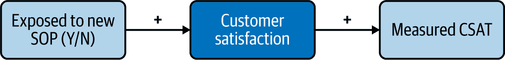
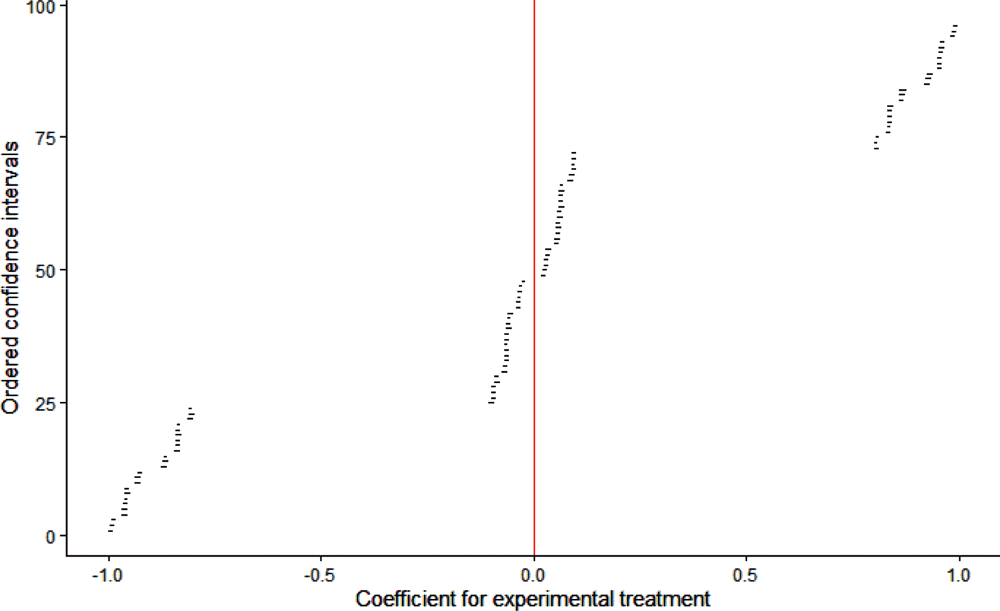
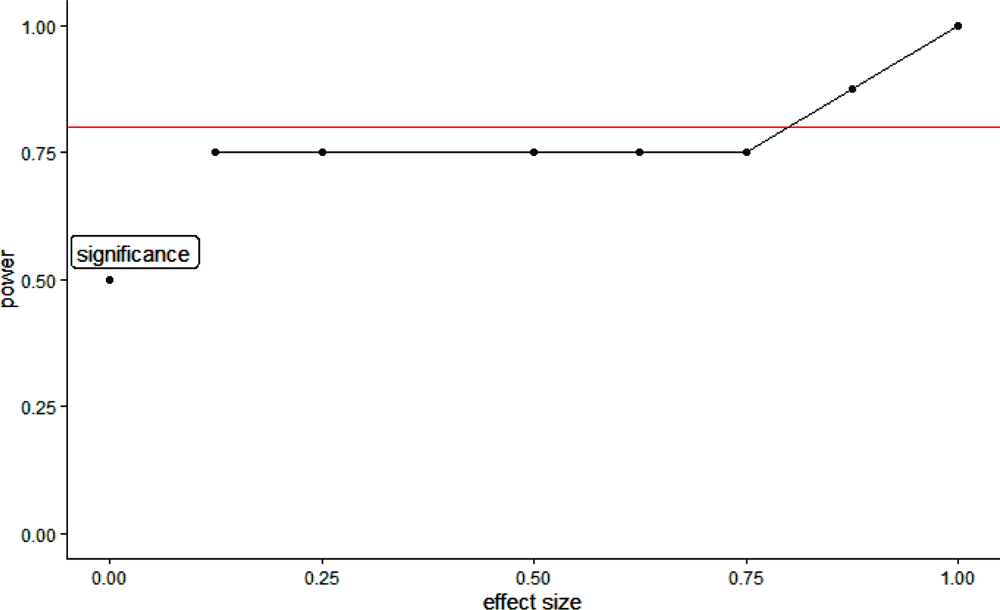
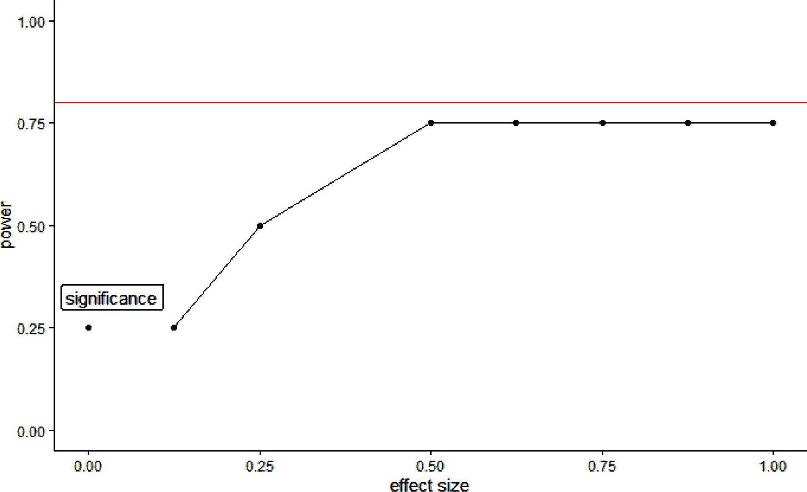

# 第十章：聚类随机化和分层建模

我们上次的实验虽然在概念上简单，但却说明了在商业实验中面临的一些后勤和统计困难。AirCnC 在全国各地有 10 个客户呼叫中心，代表处理预订过程中可能出现的任何问题（例如，付款未成功，房源与图片不符等）。在阅读了《哈佛商业评论》（HBR）关于客户服务的文章¹后，客户服务副总裁决定在标准操作程序（SOP）中实施变更：当出现问题时，呼叫中心代表不再重复道歉，而是在互动开始时道歉，然后进入“解决问题模式”，最后向客户提供几个选项。

这个实验面临多重挑战：由于后勤约束，我们只能在呼叫中心的层面上而非代表的层面上进行随机处理，并且在强制执行和测量遵从性方面存在困难。这当然不意味着我们不能或不应该进行实验！

关于随机化约束，我们将看到这使得标准线性回归算法不适用，因此我们应该改用分层线性建模（HLM）。

与以往一样，我们的方法将是：

+   规划实验

+   确定随机分配和样本大小/功率

+   分析实验

# 规划实验

在本节中，我将快速概述我们的变革理论，以为您提供一些必要的背景和行为基础：

1.  首先，商业目标和目标指标

1.  接下来，我们干预的定义

1.  最后，连接它们的行为逻辑

## 商业目标和目标指标

基于 HBR 文章，我们成功的标准或目标指标似乎很简单：客户满意度，由电话后通过电子邮件进行的一问调查来衡量。然而，我们很快会看到有复杂性存在，因此在讨论我们正在测试的内容后，我们需要重新审视它。

## 干预定义

我们正在测试的处理是代表是否接受了新的 SOP 培训并被指示实施。

第一个困难在于治疗的实施。我们根据过去的经验得知，要求代表对不同的客户应用不同的 SOP 非常具有挑战性：要求代表在电话之间随机切换流程会增加他们的认知负荷和不遵从的风险。因此，我们将不得不培训一些代表，并指示他们在所有电话中使用新的 SOP，同时保持其他代表使用旧的 SOP。

即使做出这种修正，遵从仍然面临风险：治疗组的代表可能不一致地实施新的 SOP，甚至根本不实施，而控制组的代表也可能不一致地应用旧的 SOP。显然，这将混淆我们的分析，并使治疗方法看起来与控制组的不同性不那么明显。减轻这个问题的一种方法是首先观察当前 SOP 的遵从情况，通过听取呼叫来运行试点研究，选择几个代表，对他们进行培训，并观察对新 SOP 的遵从情况。事后与试点研究中的代表进行总结讨论可以帮助识别误解和遵从的障碍。不幸的是，在人类进行治疗交付或选择的实验中，通常无法实现 100%的遵从。我们能做的最好努力是尽量测量遵从情况，并在得出结论时加以考虑。

最后，我们存在“泄漏”的风险，即我们的控制组和治疗组之间的“泄漏”。代表是人类，同一呼叫中心的代表之间会互动和交流。鉴于代表受到月平均客户满意度（CSAT）的激励，如果治疗组的代表开始看到显著更好的结果，那么同一呼叫中心的控制组的代表可能会开始改变他们的程序。让控制组的一些人应用治疗方法将混淆两组的比较，并使差异看起来比实际小。因此，我们将在呼叫中心级别应用治疗方法：同一呼叫中心的所有代表将分为治疗组或控制组。

应用在呼叫中心级别而不是在呼叫级别上的治疗对我们的成功标准有影响。如果我们的随机化单位是呼叫中心，那么我们应该在呼叫中心级别衡量 CSAT 吗？这看起来似乎是合理的，但这意味着我们不能使用任何关于个别代表或个别呼叫的信息。另一方面，衡量代表级别的平均 CSAT 甚至呼叫级别的 CSAT 将允许我们使用更多信息，但有两个问题：

+   首先，如果我们忽略了随机化不是在呼叫级别进行的事实，并使用标准功效分析，我们的结果将存在偏差，因为随机化与呼叫中心变量不可避免地相关；增加样本中的更多呼叫不会改变我们只有 10 个呼叫中心，因此只有 10 个随机化单位的事实。

+   其次，在我们的数据分析中，由于数据的嵌套结构，我们会遇到麻烦：假设每个代表只属于一个呼叫中心，我们的呼叫中心变量和代表变量之间会存在多重共线性（例如，我们可以为第一个呼叫中心的系数加 1，并在所有该呼叫中心的代表的系数中减去 1，而不改变回归的结果；因此回归的系数基本上是不确定的）。

幸运的是，这个问题有一个简单的解决方案：我们将使用分层模型，它识别我们数据的嵌套结构并适当处理，同时允许我们使用直到呼叫级别的解释变量。² 对于我们的目的，我们不会深入统计细节，只会看如何运行相应的代码和解释结果。分层模型是一个通用框架，可应用于线性和逻辑回归，因此我们仍然处于已知领域内。

## 行为逻辑

最后，这次实验成功的逻辑很简单：新的 SOP 将使客户在互动过程中感觉更好，这将转化为更高的测量 CSAT（图 10-1）。



###### 图 10-1. 我们实验的因果逻辑

# 数据和包

[本章的 GitHub 文件夹](https://oreil.ly/BehavioralDataAnalysisCh10)包含两个 CSV 文件，列出了表格 10-1 中的变量。勾号（✓）表示该文件中存在的变量，而叉号（☓）表示不存在的变量。

表格 10-1. 我们数据中的变量

|  | 变量描述 | chap10-historical_data.csv | chap10-experimental_data.csv |
| --- | --- | --- | --- |
| *Center_ID* | 10 个呼叫中心的分类变量 | ✓ | ✓ |
| *Rep_ID* | 193 名呼叫中心代表的分类变量 | ✓ | ✓ |
| *Age* | 客户呼叫时的年龄，20-60 | ✓ | ✓ |
| *Reason* | 呼叫原因，“支付”/“物业” | ✓ | ✓ |
| *Call_CSAT* | 客户对通话的满意度，0-10 | ✓ | ✓ |
| *Group* | 实验分配，“对照组”/“处理组” | ☓ | ✓ |

注意，这两个数据集还包含二元变量*M6Spend*，即在给定预订后六个月内用于后续预订的金额。这个变量仅在第十一章中使用。

在本章中，除了常见的包外，我们还将使用以下包：

```py
## R
library(blockTools) # For function block()
library(caret) # For one-hot encoding function dummyVars()
library(scales) # For function rescale()
library(lme4) # For hierarchical modeling
library(lmerTest) # For additional diagnostics of hierarchical modeling
library(nbpMatching) # To use 'optimal' algorithm in stratified randomization
library(binaryLogic) # For function as.binary()
```

```py
## Python
"# To rescale numeric variables
from sklearn.preprocessing import MinMaxScaler
# To one-hot encode cat. variables
from sklearn.preprocessing import OneHotEncoder"
```

# 分层建模介绍

当您的数据中包含分类变量时，可以使用分层模型（HMs）：

+   跨多个商店的客户交易

+   跨多个州的租赁物业

+   等等。

有些情况需要使用 HMs，因为你无法使用传统的分类变量。其中一个主要情况是，如果你有一个分类变量依赖于另一个分类变量（例如，素食者 = {“是”，“否”} 和 口味 = {“火腿”，“火鸡”，“豆腐”，“奶酪”}），即“嵌套”分类变量。然后，多重共线性问题使得使用 HMs 成为必要的方法。这也是为什么它们被称为“分层”模型，即使它们也可以应用于非嵌套的分类的原因之一。

除此之外，如果你有一个分类变量具有大量类别，比如我们示例中的呼叫中心代表 ID，特别是如果其中一些类别在你的数据中只有很少的行数，那么 HMs 也提供了一种更稳健的选择。不详细展开，这种稳健性来自 HMs 中系数的方式，它们包含了来自其他行的一些信息，使它们更接近总体平均值。让我们想象一下，在我们的数据中，一个呼叫中心代表只回答了一个呼叫，其客户满意度（CSAT）异常糟糕。由于该代表只有一个呼叫，我们无法确定该代表还是呼叫才是异常值。分类变量会将“异常性”100% 分配给代表，而 HM 会将其分配给代表和呼叫，即，我们期望该代表的 CSAT 与其他呼叫相比较低，但不像观察到的呼叫那样极端。

最后，在既可以应用分类变量又可以应用 HMs 的情况下（这基本上是任何你有几个非嵌套类别的分类变量的情况！），在解释上有一些细微差别可能会使你更喜欢其中之一。在概念上，分类变量是将数据分为具有内在差异的组，我们希望理解这些差异，而 HM 将组视为从潜在的无限组分布中随机抽取的样本。AirCnC 有 30 个呼叫中心，但它也可以有 10 个或 50 个，我们并不关心第 3 个呼叫中心和第 28 个呼叫中心之间的差异。另一方面，我们想知道与与物业问题相关的呼叫相比，与付款原因相关的呼叫的平均客户满意度是否更高或更低，我们不满意只知道组之间的标准差为 0.3。但再说一遍，这些是解释上的细微差别，所以不要想得太多。

## R 代码

让我们简单地回顾一下分层建模的语法，在一个简单的情境下，通过查看我们的历史数据中呼叫客户满意度的决定因素，暂时不考虑 *Rep_ID* 变量。R 代码如下：

```py
## R
> hlm_mod <- lmer(data=hist_data, call_CSAT ~ reason + age + (1|center_ID))
> summary(hlm_mod)
Linear mixed model fit by REML. t-tests use Satterthwaite's method
 ['lmerModLmerTest']
Formula: call_CSAT ~ reason + age + (1 | center_ID)
   Data: hist_data

REML criterion at convergence: 2052855

Scaled residuals: 
    Min      1Q  Median      3Q     Max 
-4.3238 -0.6627 -0.0272  0.6351  4.3114 

Random effects:
 Groups    Name        Variance Std.Dev.
 center_ID (Intercept) 1.406    1.186   
 Residual              1.122    1.059   
Number of obs: 695205, groups:  center_ID, 10

Fixed effects:
                   Estimate     Std. Error       df      t value   Pr(>|t|)    
(Intercept)       3.8990856    0.3749857      9.0938797   10.40 0.00000238 ***
reasonproperty    0.1994487    0.0026669 695193.0006122   74.79    < 2e-16 ***
age               0.0200043    0.0001132 695193.0008798  176.75    < 2e-16 ***
---
Signif. codes:  0 ‘***’ 0.001 ‘**’ 0.01 ‘*’ 0.05 ‘.’ 0.1 ‘ ’ 1

Correlation of Fixed Effects:
            (Intr) rsnprp
reasnprprty  0.000       
age         -0.011 -0.236
```

`lmer()` 函数的语法与传统的 `lm()` 函数类似，唯一的例外是我们需要在括号中输入聚类变量，这里是 `center_ID`，并在其前加上 `1|`。这允许我们的回归截距因呼叫中心而异。因此，我们有每个呼叫中心的一个系数；您可以将这些系数视为带有每个呼叫中心虚拟变量的标准线性回归中会获得的系数类似。

结果的“随机效应”部分涉及聚类变量。每个呼叫中心 ID 的系数未在摘要结果中显示（可以通过命令 `coef(hlm_mod)` 访问）。相反，我们得到数据在呼叫中心内部和呼叫中心之间变异性的度量，以方差和标准偏差的形式。在这里，呼叫中心之间的数据标准偏差为 1.185；换句话说，如果我们计算每个呼叫中心的 CSAT 均值，然后计算均值的标准偏差，我们将得到与您自己验证的相同值：

```py
## R
> hist_data %>%
    group_by(center_ID)%>%
    summarize(call_CSAT = mean(call_CSAT)) %>%
    summarize(sd = sd(call_CSAT))
`summarise()` ungrouping output (override with `.groups` argument)
# A tibble: 1 x 1
     sd
  <dbl>
1  1.18
```

残差的标准偏差，这里为 1.059，表示在考虑呼叫中心效应后，我们的数据中剩余的变异性有多大。比较两个标准偏差，我们可以看到呼叫中心效应占数据变异性的一半以上。

结果的“固定效应”部分应该看起来很熟悉：它指示了呼叫级别变量的系数。在这里，我们可以看到，打电话因“财产”问题的客户的平均 CSAT 比打电话因“支付”问题的客户高 0.199，并且我们的客户每增加一岁，平均电话 CSAT 就增加 0.020。

接下来，将 `rep_ID` 变量作为 `center_ID` 变量下嵌套的聚类变量加入：

```py
## R
> hlm_mod2 <- lmer(data=hist_data, 
                   call_CSAT ~ reason + age + (1|center_ID/rep_ID),
                   control = lmerControl(optimizer ="Nelder_Mead"))
> summary(hlm_mod2)
Linear mixed model fit by REML. t-tests use Satterthwaite's method
 ['lmerModLmerTest']
Formula: call_CSAT ~ reason + age + (1 | center_ID/rep_ID)
   Data: hist_data
Control: lmerControl(optimizer = "Nelder_Mead")

REML criterion at convergence: 1320850

Scaled residuals: 
    Min      1Q  Median      3Q     Max 
-5.0373 -0.6712 -0.0003  0.6708  4.6878 

Random effects:
 Groups           Name        Variance Std.Dev.
 rep_ID:center_ID (Intercept) 0.7696   0.8772  
 center_ID (Intercept) 1.3582   1.1654  
 Residual                     0.3904   0.6249  
Number of obs: 695205, groups:  rep_ID:center_ID, 193; center_ID, 10

Fixed effects:
                  Estimate   Std. Error            df t value   Pr(>|t|)    
(Intercept)     3.90099487   0.37397956      8.73974599   10.43 0.00000316 ***
reasonproperty  0.19952547   0.00157368 695010.05594912  126.79    < 2e-16 ***
age             0.01992162   0.00006678 695010.05053170  298.30    < 2e-16 ***
---
Signif. codes:  0 ‘***’ 0.001 ‘**’ 0.01 ‘*’ 0.05 ‘.’ 0.1 ‘ ’ 1

Correlation of Fixed Effects:
            (Intr) rsnprp
reasnprprty  0.000       
age         -0.007 -0.236
```

如您所见，通过在 `center_ID` 后添加 `rep_ID` 作为聚类变量，用 `/` 分隔它们来实现。还请注意，我收到一个警告，即模型未能收敛，因此我将优化算法更改为 "`Nelder_Mead`"。⁴ 固定效应的系数略有不同，但差别不大。

## Python 代码

虽然更为简洁，Python 代码的工作方式类似。主要区别在于组别用 `groups = hist_data_df["center_ID"]` 表示：

```py
## Python 
mixed = smf.mixedlm("call_CSAT ~ reason + age", data = hist_data_df, 
                   groups = hist_data_df["center_ID"])
print(mixed.fit().summary())
            Mixed Linear Model Regression Results
=============================================================
Model:              MixedLM Dependent Variable: call_CSAT    
No. Observations:   695205  Method:             REML         
No. Groups:         10      Scale:              1.1217       
Min. group size:    54203   Log-Likelihood:     -1026427.7247
Max. group size:    79250   Converged:          Yes          
Mean group size:    69520.5                                  
-------------------------------------------------------------
                   Coef. Std.Err.    z    P>|z| [0.025 0.975]
-------------------------------------------------------------
Intercept          3.899    0.335  11.641 0.000  3.243  4.556
reason[T.property] 0.199    0.003  74.786 0.000  0.194  0.205
age                0.020    0.000 176.747 0.000  0.020  0.020
Group Var          1.122    0.407                            
=============================================================
```

固定效应的系数（即截距、呼叫原因和年龄）与 R 代码中相同。随机效应方差的系数在固定效应的底部表达。在 1.122 处，与 R 值略有不同，这是由于算法的差异，但不会影响我们关心的系数。

在 Python 中，使用嵌套聚类变量的语法也有所不同。我们需要在单独的公式中表示较低级别、嵌套的变量（“方差分量公式”，我缩写为`vcf`）：

```py
## Python
vcf = {"rep_ID": "0+C(rep_ID)"}
mixed2 = smf.mixedlm("call_CSAT ~ reason + age", 
                   data = hist_data_df, 
                   groups = hist_data_df["center_ID"],
                   vc_formula=vcf)
print(mixed2.fit().summary())
            Mixed Linear Model Regression Results
=============================================================
Model:             MixedLM  Dependent Variable:  call_CSAT   
No. Observations:  695205   Method:              REML        
No. Groups:        10       Scale:               0.3904      
Min. group size:   54203    Log-Likelihood:      -660498.6462
Max. group size:   79250    Converged:           Yes         
Mean group size:   69520.5                                   
-------------------------------------------------------------
                   Coef. Std.Err.    z    P>|z| [0.025 0.975]
-------------------------------------------------------------
Intercept          3.874    0.099  38.992 0.000  3.679  4.069
reason[T.property] 0.200    0.002 126.789 0.000  0.196  0.203
age                0.020    0.000 298.301 0.000  0.020  0.020
rep_ID Var         1.904    0.303                            
=============================================================
```

方差分量公式的语法有些神秘，但直觉很简单。公式本身是一个字典，每个嵌套变量都是一个键。附加到每个键的值表示我们希望该变量具有随机截距或随机斜率（这里的随机意味着“按类别变化”）。随机截距是*分类*变量的 HM 等效，表示为`"0+C(var)"`，其中`var`是嵌套变量的名称，即与键相同。随机斜率超出了本书的范围，但例如，如果您希望年龄与通话满意度之间的关系对每个代表都有不同的斜率，方差分量公式将是`vcf = {"rep_ID": "0+C(rep_ID)", "age":"0+age"}`，第二种情况中不需要`C()`。

# 确定随机分配和样本大小/功效

现在我们已经计划了实验的定性方面，我们需要确定我们将使用的随机分配以及我们的样本大小和功效。在我们之前的两个实验中（第八章 和 第九章），我们有一些目标效应大小和统计功效，并根据此选择了样本大小。在这里，我们将增加一个细节，假设我们的业务伙伴只愿意进行一个月的实验⁵，他们感兴趣捕捉的最小可检测效应是 0.6（即，他们希望确保你有足够的能力捕捉到这个大小的效应，但他们愿意承担效应大小可能较低的风险）。

在这些约束条件下，问题是：我们有多大的能力捕捉这个样本量的差异？换句话说，假设这个差异确实等于 0.6，我们的决策规则将得出治疗组确实比对照组更好的结论的概率是多少？

正如前文所述，我们将使用分层回归分析我们的数据，这将稍微复杂化我们的功效分析，但让我们首先简要回顾一下随机分配的过程。

## 随机分配

即使我们事先不知道哪些客户会打电话，但对于随机分配来说并不重要，因为我们将在呼叫中心层面进行。 因此，我们可以预先进行，一次性分配控制组和治疗组。 像这样的分组实验中，分层尤其有用，因为我们要随机化的实际单位很少。 在这里，我们是在呼叫中心级别进行随机化的，因此我们希望根据中心的特征进行分层，例如代表数和呼叫指标的平均值。 这样做的代码是第九章中的代码的简化版本，分为数据准备函数和用于阻塞函数的包装器（示例 10-1）。

##### 示例 10-1\. 呼叫中心分层随机分配

```py
## R

# Function to prep the data
strat_prep_fun <- function(dat){
  # Extracting property-level variables
  dat <- dat %>%
    group_by(center_ID) %>%                                     
    summarise(nreps = n_distinct(rep_ID),
              avg_call_CSAT = mean(call_CSAT), 
              avg_age = mean(age),
              pct_reason_pmt = sum(reason == 'payment')/n()) %>%
    ungroup()

  #Isolating the different components of our data
  center_ID <- dat$center_ID  # Center identifier
  dat <- dat %>% select(-center_ID)
  num_vars <- dat %>%
    #Selecting numeric variables
    select_if(function(x) is.numeric(x)|is.integer(x)) 

  #Normalizing numeric variables                                   
  num_vars_out <- num_vars %>%
    mutate_all(rescale)

  #Putting the variables back together
  dat_out <- cbind(center_ID, num_vars_out)  %>%
    mutate(center_ID = as.character(center_ID)) %>%
    mutate_if(is.numeric, function(x) round(x, 4)) #Rounding for readability
  return(dat_out)}

block_wrapper_fun <- function(dat){

  prepped_data <- strat_prep_fun(dat)

  #Getting stratified assignment
  assgt <- prepped_data %>%                                   
    block(id.vars = c("center_ID"), n.tr = 2, 
          algorithm = "optimal", distance = "euclidean") %>%
    assignment() 
  assgt <- assgt$assg$`1` 
  assgt <- assgt %>%
    select(-'Distance')

  assgt <- as.matrix(assgt) %>% apply(2, function(x) as.integer(x))
  return(assgt)}  
```


我们按`center_ID`分组并总结我们的聚类变量：我们按中心计算代表人数，计算平均呼叫 CSAT 和客户年龄，并确定其原因是"`payment`"的呼叫的百分比。


我们将所有聚类变量重新缩放为 0 到 1 之间。


我们使用`blockTools`中的`block()`函数，使用`nbpMatching`包中的"`optimal'`算法（对于这么少的呼叫中心，我们可以承担额外的计算）。


我们从`block()`的输出中提取配对信息。

得到的配对信息是：

```py
## R
     Treatment 1 Treatment 2
[1,]           2           3
[2,]           8           9
[3,]           7           6
[4,]           1           5
[5,]          10           4
```

如前一章所述，Python 中没有`block`包的等效物，因此我们将使用我在前一章中描述的两个函数来实现这个目的，进行轻微调整（例如，我们在中心层级没有分类变量，因此不需要对它们进行独热编码）：

```py
## Python
def strat_prep_fun(dat_df):
  ...

def stratified_assgnt_fun(dat_df, K = 2):
  ...

stratified_assgnt_df = stratified_assgnt_fun(hist_data_df, K=2)
```

## 功效分析

使用标准统计公式进行功效分析（在这种情况下，它将是 T 检验的公式）会非常误导，因为它不会考虑到数据中存在的相关性。 Gelman 和 Hill（2006）为层次模型提供了一些具体的统计公式，但我不想沉迷于积累越来越复杂和狭窄的公式。 像往常一样，我们将运行模拟作为我们的万全之策来进行功效分析。

让我们首先定义我们的度量函数：

```py
## R
hlm_metric_fun <- function(dat){
  #Estimating treatment coefficient with hierarchical regression
  hlm_mod <- lmer(data=dat, 
                  call_CSAT ~ reason + age + group + (1|center_ID/rep_ID)
                  ,control = lmerControl(optimizer ="Nelder_Mead")
                  )
  metric <- fixef(hlm_mod)["grouptreat"]
  return(metric)}
```

```py
## Python
def hlm_metric_fun(dat_df):
    vcf = {"rep_ID": "0+C(rep_ID)"}
    h_mod = smf.mixedlm("call_CSAT ~ reason + age + group", 
                    data = dat_df, 
                    groups = dat_df["center_ID"],
                    re_formula='1',
                    vc_formula=vcf)
    coeff = h_mod.fit().fe_params.values[2]
    return coeff
```

这个函数返回我们的分层模型中治疗组的系数。 就像我们在前几章中所做的那样，现在让我们为我们的功效分析运行模拟，希望你现在对此很熟悉。 这里唯一需要考虑的额外事项是我们的数据是分层的，即聚类的。 这有两个含义。

首先，我们不能随意从历史数据中随机抽取电话。在我们的实验中，我们预期代表们几乎每个人每次都会接到几乎相同数量的电话；而在真正的随机抽取中，每个代表接到电话数量的变化会显著。我们预期代表们每月会处理大约 1,200 通电话；在真正的随机抽取中，一个代表处理 1,000 通电话，另一个处理 1,400 通电话的情况比在实际中更有可能发生。幸运的是，从编程的角度来看，可以在做随机抽取之前将我们的历史数据按照呼叫中心和代表级别进行分组，这样可以很容易地解决这个问题：

```py
## R
sample_data %<%- filter(dat, month==m) %>%dplyr::group_by(rep_ID) %>%
      slice_sample(n = Nexp) %>% dplyr::ungroup()
```

```py
## Python
sample_data_df = sample_data_df.groupby('rep_ID').sample(n=Ncalls_rep)\
            .reset_index(drop = True)
```

### 当随机性“受限”时使用排列组合

第二个含义在统计水平上更为深刻。我们正在使用分层抽样来配对相似的呼叫中心，并将每一对中的一个分配给对照组，另一个分配给处理组。这很好，因为我们减少了某些呼叫中心特征会偏倚我们分析的风险。但与此同时，这在我们的模拟中引入了一个固定效应：比如说呼叫中心 1 和 5 因为非常相似而被配对在一起。无论我们运行多少次模拟，其中一个将在对照组，另一个将在处理组；我们减少了可能的组合总数。在完全自由的随机化下，有 10!/(5! * 5!) ≈ 252 种不同的方式将 10 个呼叫中心均匀地分配到实验组中，这已经不算多了。而使用分层抽样，只有 2⁵ ≈ 32 种不同的分配方式，因为每个五对中有两种可能的分配方式：（对照组，处理组）和（处理组，对照组）。这意味着即使你运行了 32,000 次模拟，你只会看到 32 种不同的随机分配方式。此外，只有三个月的历史数据，我们每个代表只能生成三个完全不同的（即互斥的）样本，总共有 32 * 3 = 96 种不同的模拟。

这并不意味着我们不应该使用分层抽样；相反，分层抽样在我们实验人口较小的情况下更为关键！然而，这确实意味着如果你运行的模拟比你真正有的不同分配要多得多，那么这样做可能毫无意义，甚至可能具有误导性。

要理解其中的原因，让我们使用一个比喻：想象一个学生决定在考试前（例如 LSAT）扩展他们的词汇量。他们购买了一本学习词典，并计划每天随机查阅其中一个词的定义十次，直到累计一千次，以学习一千个单词。但问题在于：他们的词典里只有 96 个单词！这意味着无论学生多少次查阅随机单词，他们的词汇量都不能增加超过 96 个单词。多次阅读一个单词的定义确实有助于更好地理解和记忆它，但这与查看更多单词的定义是不同的。这也意味着随机查阅定义是一种非常低效的方法。简单地按顺序逐个查阅这 96 个单词要好得多。

这种逻辑同样适用于模拟：通常我们从历史数据中随机抽取来构建模拟实验数据集，而且我们（正确地）将多个模拟重复的概率视为可以忽略不计。在当前情况下，如果我们有一百个呼叫中心，每个中心有一千名代表和十年的数据，我们可以自信地进行数百甚至数千次实验模拟而不用担心。由于我们呼叫中心和代表人数有限，我们最好系统地研究有限的可能性。

让我们看看如何用代码实现这一点。我们有呼叫中心的配对（参见前一小节的 Figure 10-2），我们需要遍历这些配对的 32 种可能的排列组合。第一对由呼叫中心 #7 和 #2 组成，所以一半的模拟将使 #7 成为对照组， #2 成为治疗组，而另一半将使 #2 成为对照组， #7 成为治疗组，依此类推。因此，第一次模拟可能将呼叫中心（7, 9, 3, 10, 4）作为对照组，而第二次模拟将呼叫中心（2, 9, 3, 10, 4）作为对照组。

我们将使用一个技巧来帮助我们轻松地穿过排列。这并不是很复杂，但它依赖于二进制数的性质，这些性质并不直观，因此请准备好并忍耐。任何整数都可以用二进制基数表示为一串零和一。0 是 0，1 是 1，2 是 10，3 是 11，依此类推。这些可以左填充为零，以具有恒定数量的数字。我们希望数字的位数等于对数对的数量，在这里是 5。这意味着 0 是 00000，1 是 00001，2 是 00010，3 是 00011。我们可以用 5 位二进制数表示的最大整数是 31。请注意，这不是巧合，包括 0 作为 00000，我们可以用 5 位二进制数字表示 32 个不同的整数，而 32 就是我们要实现的排列数。因此，我们可以决定第一个模拟，我们将其称为“模拟 00000”，在图 10-2 中的对照组是（7, 9, 3, 10, 4）。从那里开始，每当模拟号码的二进制形式中与对中对应的数字是 1 时，我们就会在对照组和治疗组之间交换一对。例如，对于模拟 10000，我们将交换呼叫中心#7 和#2，得到控制组（2, 9, 3, 10, 4）。这里的魔法发生了：通过从 00000 到 11111，我们将看到所有可能的五对排列！

### 排列的代码

由于 Python 和 R 之间的索引差异（前者从 0 开始，后者从 1 开始），因此 Python 中的代码要简单一些，因此让我们从相应的代码片段开始：

```py
## Python
for perm in range(Nperm):
    bin_str = f'{perm:0{Npairs}b}'            
    idx = np.array([[i for i in range(Npairs)],                     
                    [int(d) for d in bin_str]]).T
    treat = [stratified_pairs[tuple(idx[i])] for i in range(Npairs)] 

    sim_data_df = sample_data_df.copy()
    sim_data_df['group'] = 'ctrl'    
    sim_data_df.loc[(sim_data_df.center_ID.isin(treat)),'group']\
        = 'treat'
```


我们将排列计数器`perm`转换为二进制字符串。在 Python 中，有几种方法可以实现这一点。我在这里使用了 F-string。F-string 的语法是`f'{exp}'`，其中表达式`exp`在格式化为字符串之前进行评估。在表达式内部，`Npairs`也位于大括号之间，因此它在传递给表达式之前首先进行评估；在第一次评估之后，`exp`等于`perm:05b`。冒号左边的第一个术语是要格式化的数字；冒号后面的字母表示要使用的格式，在这里是`b`表示二进制；紧挨着数字左边的数字表示要使用的总位数（这里是 5）；最后，数字左边的任何字符都是用于填充的（这里是 0）。


我们将二进制字符串的数字与`idx`矩阵中的对数计数器匹配。因此，“00000”在 Python 中变为<math><mrow><mrow><mo>(</mo><mtable><mtr><mtd><mn>0</mn></mtd><mtd><mn>0</mn></mtd></mtr><mtr><mtd><mn>1</mn></mtd><mtd><mn>0</mn></mtd></mtr><mtr><mtd><mn>2</mn></mtd><mtd><mn>0</mn></mtd></mtr><mtr><mtd><mn>3</mn></mtd><mtd><mn>0</mn></mtd></mtr><mtr><mtd><mn>4</mn></mtd><mtd><mn>0</mn></mtd></mtr></mtable><mo>)</mo></mrow></mrow></math>在转置后。


我们将`idx`的行作为索引传递，以指示每对中的哪个元素进入治疗组。也就是说，为了指示第一对的第一个元素应该进入治疗组，我们传递 [0, 0]。对于 00000，我们总是将每对的第一个元素放入治疗组。对于最后一个排列 11111，我们将每对的第二个元素放入治疗组，与 00000 的分配相反。以更复杂的例子来说，对于排列编号为 7 的排列，其二进制格式为 00111，在前两对中将第一个元素放入对照组，最后三对中将第二个元素放入对照组。


最后，我们更新了模拟实验数据集，根据其中心 ID 将每行分配到对照组或治疗组。

这个过程在 R 中基本相同，语法上有一些差异：

```py
## R
permutation_gen_fun <- function(i, stratified_pairs){
  Npairs <- nrow(stratified_pairs)
  bin_str <- as.binary(i, n=Npairs)   
  idx <- matrix(c(1:Npairs, bin_str), nrow = Npairs)
  idx[,2] <- idx[,2] + 1                                          
  treat <- stratified_pairs[idx]                            
  return(treat)}
```


将`perm`转换为二进制格式在 R 中使用 `as.binary()` 函数完成，该函数以第一个参数为要转换的数字，第二个参数为我们想要的总位数（即对数，这里是 5）。


因为 R 中的索引从 1 开始而不是从 0 开始，我们需要将`idx`矩阵第二列的所有元素加 1。因此，对于第一个排列 00000，其中每对的第一个元素进入对照组，`idx`矩阵为 <math><mrow><mrow><mo>(</mo><mtable><mtr><mtd><mn>1</mn></mtd><mtd><mn>1</mn></mtd></mtr><mtr><mtd><mn>2</mn></mtd><mtd><mn>1</mn></mtd></mtr><mtr><mtd><mn>3</mn></mtd><mtd><mn>1</mn></mtd></mtr><mtr><mtd><mn>4</mn></mtd><mtd><mn>1</mn></mtd></mtr><mtr><mtd><mn>5</mn></mtd><mtd><mn>1</mn></mtd></mtr></mtable><mo>)</mo></mrow></mrow></math>。对于排列 11111，第二列将由 2 组成；对于 00111，它将由 11222 组成。


我们将`idx`的行作为索引传递，以指示每对中的哪个元素进入治疗组。

`permutation_gen_fun()` 函数返回治疗组的中心 ID 列表，然后可以在随机分配函数中使用。

### 功率曲线

现在，我们解决了可能样本量有限的问题，可以继续进行功率分析。请记住，业务伙伴希望在一个月内完成实验，这意味着大约需要 230,000 通话的样本量。我们不再计算 CSAT 0.6 分的阈值所需的样本量和所需功率，而是采用给定的样本量，计算我们在这个阈值下的功率。

让我们首先看统计显著性。请记住，在上一章中，我们的估计器“不自信”：90% 的置信区间超过了 90% 的时间都包括零。即使使用 40% 的置信区间，也只有少量的误报。在这里，我们面临相反的问题：我们的估计器“过于自信”，因为 90% 的置信区间几乎从不包括零，实际上从未包括过：我们的覆盖率为零。图 10-2 展示了从最低到最高排名的 96 个置信区间。



###### 图 10-2\. 90% 置信区间无效果

我们在 图 10-3 中看到的情况类似于我们在 第七章 中看到的情况，即数据非常有限导致图表中出现不连续性。在这里，随机误差永远不会完全对齐，导致置信区间永远不包括零。相反，我们有四个紧密聚集的置信区间群，尽管我们的置信区间分布在零周围是对称的（即，我们的估计器是无偏的），并且其中一半置信区间非常接近零。从实际的角度来看，这意味着如果我们进行实验，我们不应期望真实值包含在我们的置信区间内。

这并不意味着我们的实验注定要失败，而是我们不应信任我们的置信区间边界，而应依赖我们的决策规则。使用接受任何严格正值置信区间的默认决策规则，我们的显著性为 50%：因为一半的置信区间低于零，另一半高于零，在一半的情况下，我们会观察到一个负系数，并正确地得出结论，即治疗组不比对照组好。图 10-3 绘制了这种决策规则下不同效应大小的功效曲线。



###### 图 10-3\. 决策阈值为 0 的不同效应大小的功效曲线

正如你所见，我们的功效非常快地达到了 75%，基本上就在刚刚低于零的置信区间群被移动到稍高于零的位置时。之后，我们的功效在一定范围内保持稳定，包括我们的阈值效应大小为 0.6，直到强烈负置信区间群依次移动到高于零的位置。然后，我们的功效接近于 100%，对于效应大小为 1 或更高的情况，我们几乎不太可能看到一个负置信区间。

我们可以向业务伙伴反馈，我们的置信区间不可靠，因此误报的风险很大，但误检的风险非常低。在当前情况下，我们可以通过设定更严格的决策规则，并且只在观察到效应大小为 0.25 或以上时实施干预来做得更好。图 10-4 展示了该决策规则的功效曲线。



###### 图 10-4. 决策阈值为 0.25 的不同效应大小的功效曲线

正如我们在图 10-4 中所见，通过增加我们的决策阈值，我们降低了功效曲线的左侧。这意味着在小效应大小时有更低的显著性（即较低的假阳性风险），但以牺牲较高的错误否定率（即更高的假阴性风险）为代价。然而，功效曲线的右侧大部分保持不变，这意味着我们对于检测 0.6 效应的能力仍然为 75%。

让我们回顾一下我们的功效分析告诉我们的内容。由于我们计划使用分层随机分配有限数量的有效实验单元（即呼叫中心），我们的实验具有严格的结构，限制了可能的结果。这使得单独的置信区间本身不可靠。然而，我们可以调整我们的决策规则以更高的阈值（即只有观察到 0.25 或更高的效应时，我们才会实施我们的干预）。通过这样做，我们可以在零效应大小的情况下减少假阳性风险，同时保持对目标效应大小的功效足够高。这仍然是一个功效不足的实验，但这是我们作为实验者能提供的最好方案，而我们的业务伙伴将不得不决定他们对这些机会的看法。

###### 警告

注意我们决策阈值 0.25 和目标效应 0.6 之间的差异。根据定义，决策阈值的功效始终为 0.5，我们的目标是在 0.6 效应大小上获得尽可能多的功效。

# 分析实验结果

一旦我们完成实验，我们就可以收集和分析数据。在事先定义了度量函数的基础上，现在分析就像简单地将其应用于我们的实验数据，然后获取其值的 Bootstrap 90%置信区间一样：

```py
## R (output not shown)
> coeff <- hlm_metric_fun(exp_data)
> print(coeff)
> hlm_CI <- boot_CI_fun(exp_data, hlm_metric_fun)
> print(hlm_CI)
```

```py
## Python
coeff = hlm_metric_fun(exp_data_df)
print(coeff)
hlm_CI = boot_CI_fun(exp_data_df, hlm_metric_fun)
print(hlm_CI)
0.477903237163797
[0.47434045128179986, 0.4815858577196438]
```

我们的置信区间非常窄，且完全高于 0.25。根据我们的功效分析，真实效应大小不太可能落在该置信区间内，但它可能比该值更低或更高，因此我们预期的效应大小等于 0.48。因为这高于我们的决策阈值，所以我们会实施这项干预，尽管预期效应大小低于我们的目标。有趣的是，该置信区间远小于基于正态近似得到的那个置信区间（即系数±1.96 * 系数标准误），部分原因是分层随机化。

# 结论

这就是我们实验设计之旅的结束。在本书的最后部分，我们将看到一些高级工具，这些工具将允许我们深入分析实验数据，但是我们刚刚看到的呼叫中心实验已经是现实生活中实验复杂性的极限了。无法在最低层级进行随机化，并且有一个预先确定的实验运行时间是不愉快但并不罕见的情况。在办公室或商店而不是顾客或员工级别进行随机化是常见的，以避免后勤复杂性和实验组之间的“泄漏”。如果你希望从实验中得到有用的结果，那么利用仿真进行功效分析和分层随机分配几乎是不可避免的；希望现在你已经完全具备了这样做的能力。

设计和运行实验在我看来是行为科学中最有趣的部分之一。当一切顺利时，您可以清晰地衡量业务举措或行为科学干预的影响。但要使一切顺利本身就不是一件小事。流行媒体和商业供应商经常传达这样一种印象，即实验可以像“插入并播放，检查 5%显著性，然后完成！”那么简单，但这是误导的，我试图解决了几个由此产生的误解。

首先，统计显著性和功效经常被误解，这可能导致实验浪费和次优决策。我相信，在应用设置中，放弃 p 值而选择 Bootstrap 置信区间会导致更正确和更相关的结果和解释。

其次，将实验视为纯技术和数据分析问题比采用因果行为方法更容易但成果较少。使用因果图允许您更清楚地表达什么是成功，以及是什么让您相信您的治疗会成功。

在现场实施实验充满困难（请参阅 Bibliography 获取更多资源），不幸的是，每个实验都是不同的，因此我只能给您一些通用建议：

+   运行现场实验是一门艺术和科学，没有什么可以取代对特定环境的经验。起初从更小更简单的实验开始。

+   首先，在一个小的试点组上实施治疗，然后观察一段时间并进行广泛的反馈。这将使您尽可能地确保人们理解治疗并相对正确和一致地应用它。

+   努力想象所有事情可能出错的方式，并防止它们发生。

+   认识到事情可能出错，尽管如此，还是要在实验中增加灵活性（例如，计划“缓冲”时间，因为事情会比你想象中花费更长时间——人们可能需要一周时间来正确实施治疗，数据可能会延迟等）。

¹ “‘对不起’ 不足以”，《哈佛商业评论》，2018 年 1 月至 2 月。

² 如果你想了解更多关于这类模型的信息，Gelman 和 Hill（2006）是该主题的经典参考文献。

³ 如果你真的想知道，这些系数是呼叫中心平均客户满意度和整体数据平均客户满意度的加权平均值。

⁴ 对于数值模拟，你的情况可能有所不同。感谢 Jessica Jakubowski 建议另一种规格：`lmerControl(optimizer ="bobyqa", optCtrl=list(maxfun=2e5))`。

⁵ 这对你的实验设计不利吗？当然。这不现实吗？非常不幸，并非如此。就像我在做顾问时常说的那样，客户始终是客户。

⁶ 感叹号表示数学运算符阶乘。如果你想更好地理解基础数学，请参阅[此 Wikipedia 页面](https://oreil.ly/I5PTW)。
