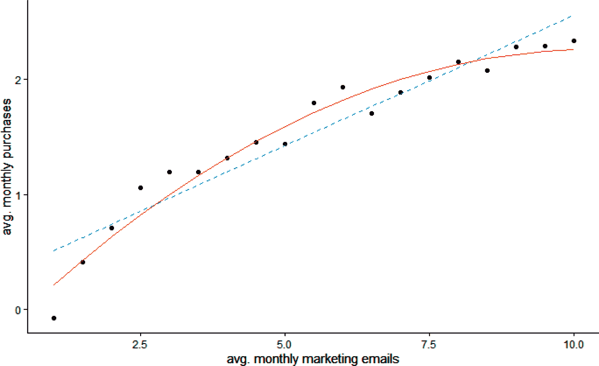
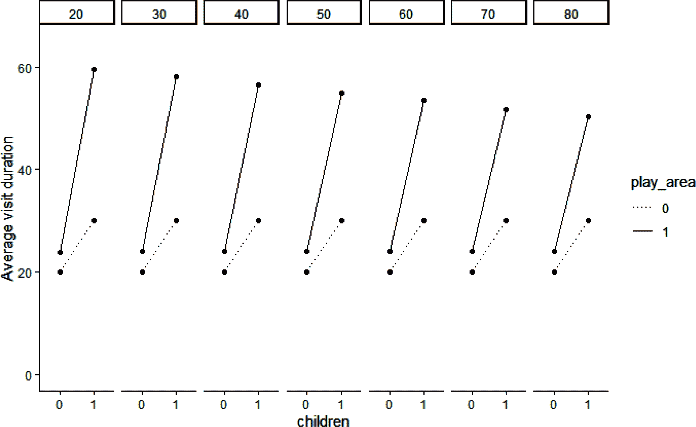

# 第十一章\. 温和性介绍

将因果和行为视角结合的最令人满意的方面之一是，一个在一种视角下看起来完全无关的事物在另一种视角下可能是完全相同的事物。简单来说，当你有合适的工具时，很多事情*确实都是钉子*。

到目前为止，我们已经使用因果图来理解平均情况下行为的驱动因素：如果温度升高一度，保持所有相关变量恒定，C-Mart 冰淇淋的销量会增加多少？但很多时候，我们不仅仅对那个总体平均感兴趣，我们希望进一步细分：

+   这个数字对德克萨斯州和威斯康星州的摊位适用吗？如果不是，这意味着我们的数据显示了*分段*的机会。

+   这个数字对巧克力和香草冰淇淋适用吗？如果不是，这意味着温度和冰淇淋口味之间存在*交互作用*。

+   这个数字对低温和高温一样适用吗？如果不是，这意味着温度对销售的影响存在*非线性*。

我们在本章将看到的工具被社会科学家称为温和性分析，它将允许我们以完全相同的方式处理这三种类型的问题。

在查看本章数据和软件包后的第一节，我们将进行温和性的介绍，并看看它如何适用于各种行为情况。因为数学在所有情况下保持不变，我已经收集了所有实际和技术考虑事项，将在最后一节进行审查。

# 数据和软件包

本章的[GitHub 文件夹](https://oreil.ly/BehavioralDataAnalysisCh11)包含 CSV 文件*chap11-historical_data.csv*，其中列出了表 11-1 中的变量。

表 11-1\. 我们数据中的变量

| 变量名称 | 变量描述 |
| --- | --- |
| *天* | 天索引，1-20 |
| *商店* | 商店索引，1-50 |
| *儿童* | 二进制 0/1，顾客是否带有幼儿 |
| *年龄* | 客户年龄，20-80 |
| *访问持续时间* | 商店访问持续时间，单位为分钟，3-103 |
| *游乐区* | 二进制 0/1，店铺级别，店内是否设有游乐区 |
| *杂货购买* | 每次访问中在杂货购买上的花费，单位为美元，0-324 |

在本章中，我们只会使用通用软件包，没有特定于章节的软件包。

# 温和性的行为类型

温和的正式定义非常简单：它是回归中两个预测变量的乘积。例如，我先前建议过冰淇淋的销售在德克萨斯州和威斯康星州可能会因温度每升高一度而有所增加或减少；这在数学上可以表达如下：

*冰淇淋销售* = *β[t]*.*温度* + *β[s].状态* + *β[ts]*.(*温度* * *状态*)

温和性可用于理解以下所有行为现象，我们将依次审查：

+   分段

+   互动

+   非线性（即自我调节）

## 分割

建立相关的客户分段是市场分析的关键任务，也更广泛地是业务分析。我们将讨论如何在观察数据和实验数据中进行这项工作。

### 观察数据的分割

我们的起点将是 C-Mart 的例子：该公司最近在部分商店引入了游乐区，并且有兴趣了解它如何影响顾客的访问持续时间。由因果图支持的回归分析给出了一个平均因果效应：在我们的数据中所有顾客访问中，商店内有游乐区对访问持续时间的影响是什么？然而，平均值可能具有误导性，并且会隐藏我们人群各个分段之间的大差异。例如，可以合理假设对于有儿童的顾客，游乐区的存在更可能影响访问持续时间。在我们的回归分析中如何考虑这一点呢？您可能认为简单地将 *Children* 作为 *VisitDuration* 的另一个预测因素包含进去就可以了，如图 11-1 所示。


###### 图 11-1\. 包括 Children 作为 VisitDuration 的预测因素

该方法的问题在于，它考虑了 *Children* 对 *VisitDuration* 的影响，*无论是否有游乐区*，反之亦然：在进行回归分析时，每个变量都是独立考虑的。每个系数都被设定为最小化总体残差距离，但系数必须对每个变量不考虑其他变量的值而言是相同的。这意味着，*PlayArea* 对 *VisitDuration* 的系数及因此所测得的效应，在数学上被强制成为其在顾客有和没有儿童时的效应的加权平均。同样地，顾客有儿童对效应的测量，也被看作是顾客有游乐区和没有游乐区时效应的加权平均。这可以通过查看相应的方程来确认。我们刚刚画出的 CD 方程显示在 Equation 11-1 中（通常为简单起见，我们省略了常数系数 *β*[0]）。

##### 方程 11-1\.

*VisitDuration* = *β*[0] + *β[p].PlayArea* + *β[c].Children*

因为 *PlayArea* 和 *Children* 都是二进制变量，所以根据它们是否等于 0 或 1，我们有四种可能的情况：

1.  *β*[0] 是在没有儿童且没有游乐区的商店中顾客的平均访问持续时间（我们简称为 C = 0, P = 0）。

1.  *β*[0] + *β[c]* 是在没有游乐区但有儿童的商店中顾客的平均访问持续时间（C = 1, P = 0）。

1.  *β*[0] + *β[p]* 是在有游乐区但没有儿童的商店中顾客的平均访问持续时间（C = 0, P = 1）。

1.  *β*[0] + *β[p]* + *β[c]* 是带有孩子顾客在带有游乐区的商店（C = 1，P = 1）的平均访问持续时间。

这意味着无论顾客是否携带孩子，添加游乐区对影响都没有差异，我们可以轻松验证：

如果*Children* = 0，添加游乐区的影响是：

*VisitDuration(C* = [0]，*P* = 1) - *VisitDuration(C* = 0，*P* = 0) = (*β*[0] + *β[p]*) - (*β*[0]) = *β[p]*

如果*Children* = 1，添加游乐区的影响是：

*VisitDuration(C* = 1，*P* = 1) - *VisitDuration(C* = 1，*P* = 0) = (*β*[0] + *β[c]* + *β[p]*) - (*β*[0] + *β[c]*) = *β[p]*

这两个方程之间的差异（即为有孩子的顾客比没有孩子的顾客增加游乐区增加访问持续时间的更多量）根据定义为：

[(*β*[0] + *β[c]* + *β[p]*) - (*β*[0])] - [(*β*[0] + *β[p]*) - (*β*[0])] = *β[p]* - *β[p]* = 0

从另一个角度看，我们有四个方程，对应四个平均值，但只有三个系数。一旦我们根据前三个方程设置了*β*[0]，*β[c]*和*β[p]*，如果发现（C = 1，P = 1）的平均访问持续时间不等于*β*[0] + *β[p]* + *β[c]*，我们就陷入了困境。我们的算法会尽力找到能够最小化回归误差的值，但我们的估计会有偏差。不幸的是，这恰恰是我们试图解决的问题！换句话说，简单地将*Children*作为回归中的一个变量并不能解释*Children*和*PlayArea*之间的相互作用。通过这些方程我们无法确定游乐区的存在是否更多地影响了带有孩子的顾客的访问持续时间。

这就是中介的作用。我们可以通过添加第四个系数来解决问题，用于解释*PlayArea*和*Children*的交互作用（见 Equation 11-2）。

##### 方程式 11-2。

*VisitDuration* = *β*[0] + *β[p].PlayArea* + *β[c].Children* + *β[i].(PlayArea* * *Children*)

对于(C = 1，P = 1)的方程式变为*VisitDuration* = *β*[0] + *β[p]* + *β[c]* + *β[i]*，我们可以调整系数*β[i]*来解释交互效应。现在我们有：

+   如果*Children* = 0，添加游乐区的影响是（*β*[0] + *β[p]*）- (*β*[0]) = *β[p]*。

+   如果*Children* = 1，添加游乐区的影响是（*β*[0] + *β[c]* + *β[p]* + *β[i]*）- (*β*[0] + *β[c]*) = *β[p]* + *β[i]*。

这两个方程的差异是：

[(*β*[0] + *β[c]* + *β[p]* + *β[i]*) - (*β*[0])] - [(*β*[0] + *β[p]* + *β[i]*) - (*β*[0])] = *β[p]* + *β[i]* - *β[p]* = *β[i]*

添加游乐区会使有孩子的顾客的访问持续时间增加*β[i]*分钟*更多*，而对没有孩子的顾客则少。

方程 11-2 中的乘法项通常在 CD 上用一个箭头来表示，箭头中间是原始箭头的结束位置（图 11-2）。在这种情况下，变量 *Children* 被称为 *调节变量*，*PlayArea* 和 *VisitDuration* 之间的关系是 *调节的*。


###### 图 11-2\. PlayArea 对 VisitDuration 的影响由顾客是否带孩子来进行调节

回归软件识别调节作用，并通常包括一个快捷方式：如果只包括两个变量的乘积，软件将识别出你想要计算这些变量的系数：

```py
## Python (output not shown)
ols("duration~play_area * children", data=hist_data_df).fit().summary()
```

```py
## R
> summary(lm(duration~play_area * children, data=hist_data))
...
Coefficients:
                     Estimate Std. Error t value Pr(>|t|)    
(Intercept)          19.98760    0.01245  1605.5   <2e-16 ***
play_area1            3.95907    0.02097   188.8   <2e-16 ***
children1            10.01527    0.02017   496.6   <2e-16 ***
play_area1:children1 20.98663    0.03343   627.8   <2e-16 ***
...
```

###### 注

当你使用上文描述的快捷方式时，你选择的软件将添加 *PlayArea* 和 *Children* 作为 *VisitDuration* 的单独预测变量，并且作为 方程 11-2 的估计结果。但是，是否不使用 *Children* 作为一个单独的项来估算这个方程会更好呢？也就是说：

*VisitDuration* = *β*[0] + *β[p].PlayArea* + *β[i].(PlayArea * Children)*

简短的回答：不需要。有关更多详细信息，请参考 Hayes (2017) 等参考文献，但基本上，为了使系数达到你想要的效果，请在回归中包括调节变量和被调节变量作为单独的变量，即使它们的系数在经济或统计上并不显著。不要通过软件将它们去除；这是一个特性，而不是错误。

这个回归中的系数与我们列出的四种情况的平均值匹配：

+   不带孩子去没有游乐区的商店的顾客的平均访问时长是 *β*[0]，也就是截距的系数，即 20 分钟。

+   不带孩子去有游乐区的商店的顾客的平均访问时长是 *β*[0] + *β[p]*，即截距和 *PlayArea* 的系数之和，大约是 20 + 4 = 24 分钟。

+   带孩子去没有游乐区的商店的顾客的平均访问时长是 *β*[0] + *β[c]*，即截距和 *Children* 的系数之和，大约是 20 + 10 = 30 分钟。

+   带孩子去有游乐区的商店的顾客的平均访问时长是 *β*[0] + *β[c]* + *β[p]* + *β[i]*，即截距、*PlayArea*、*Children* 和 *PlayArea* 和 *Children* 之间的交互项的系数之和，大约是 20 + 4 + 10 + 21 = 55 分钟。

换句话说，有游乐区对带孩子的顾客的平均访问时长有很大影响，对不带孩子的顾客的平均访问时长也有一个较小但不可忽视的影响（可能是因为可以轻松无忧地购物）。

这可以用图 11-3 中的视觉表示，*Children*变量的值位于 x 轴上，*VisitDuration*位于 y 轴上，我们有两条线，每个*PlayArea*值对应一条。换句话说，两条线末端的四个点代表我们刚刚看到的四种情况，它们的 y 值与系数匹配。

如果我们的两个变量之间没有交互效应，那么两条线将是平行的，因为有游乐区会将平均访问时长向上移动同样的增量。它们不平行的事实表明*PlayArea*对带有孩子的顾客影响更大。


###### 图 11-3\. 交互作用的视觉表示

如果你想把这个图与我们的数学联系起来，左侧两点（对于 C = 0）之间的距离等于*β[p]*，而右侧两点（C = 1）之间的距离是*β[p]* + *β[i]*。

调节分析的见解使我们能够更好地定位我们的行动，例如，如果 C-Mart 想确定在哪些商店建设下一个游乐区。尽管个别系数*β[p]*有助于确定游乐区是否在总体上值得投资，但对于商店的优先顺序完全无关紧要。在选择商店时，需要确定与*PlayArea*变量具有最强交互作用的商店和顾客特征，然后确定哪家商店会因增加游乐区而产生最大的“提升”。

或者，在已经设有游乐区的商店中，调节分析将允许 C-Mart 确定向哪些潜在顾客推广邮件以宣传游乐区的存在。

### 分割实验数据

分割实验数据的过程与我们刚刚用于观测数据的过程几乎完全相同。因此，我不会重复定量分析，只会指出一些需要注意的细微差别和微妙之处。

在进行实验时，我们通常不仅关心测量样本中治疗的平均效果，还关心确定效果特别强或弱的群体。发送信件或培训员工可能很昂贵；即使财务成本微不足道，如电子邮件一样，也可能存在无形成本，比如让顾客感到恼火。因此，我们通常只想将治疗应用于其有效的人群。

超越成本考虑，个性化是将特定消息或处理针对我们客户群体的特定部分的关键理由。个性化消息的核心理念是目标群体之外的个体可能不会做出反应，甚至可能对消息产生负面反应。如果你有一条适合所有人的消息，那很好，但这并不是个性化。例如，一张促销滑冰刀券可能会惹恼大多数对此无用的人。面向户外爱好者的广告可能会激怒安静的书虫，反之亦然。个性化意味着你在某个子群体上提高了效果，但在另一个子群体上效果降低。

在市场分析中，这种方法通常被称为“提升”分析或建模，因为我们试图识别哪些客户群体对于特定的广告活动或处理能够最大程度地增加他们采取行动的倾向（例如购买或投票），*而不管他们的初始倾向如何*。这最后一点通常会引起混淆，因此值得进一步解释：识别具有高倾向性的客户可能会有其用途，但不能仅此作为定位的依据。

比如，假设你比较年轻客户（30 岁以下）和老年客户（60 岁以上）：

+   第一组如果不发送电子邮件，采取行动的概率为 20%，如果发送电子邮件，则为 40%。

+   第二组如果不发送电子邮件，采取行动的概率为 80%，如果发送电子邮件，则为 90%。

对于第一组年轻客户而言，发送电子邮件的效果平均要比对第二组老年客户发送更加有效：这将显著增加采取行动的客户总数。

然而，在现实生活中，由于缺乏适当的对照组，这一事实经常会被掩盖。如果你只给第二组发送电子邮件，并将他们的行为与其他人口进行比较，那么这将大大夸大电子邮件活动的表现效果。

从数学上讲，确定一个高有效处理群体意味着找到是处理变量对感兴趣效果的调节变量的人群特征。在这种意义上，调节分析为我们提供了一个关于提升分析、个性化和更广泛的定位的强大和统一的概念框架。

## 互动

我们绘制的用于表示分割的 CD 是不对称的：变量*PlayArea*直接指向*VisitDuration*，而变量*Children*则指向第一个箭头。然而，我们的回归方程却是完全对称的；没有任何迹象表明这两个变量中哪个是调节变量，哪个是被调节变量。严格来说，我们可以解释方程 11-2 意味着*Children*是原因，*PlayArea*是调节变量。

其中一种表达方式比另一种“正确”吗？当我们有一个个人特征和涉及调节的商业或行为变量时，通常会表示个人特征（例如，是否有子女）为调节变量，并称之为分割。也就是说，游乐区的影响在有子女的客户段和没有子女的客户段之间是不同的。

另一方面，如果两个类型相同的变量之间存在调节，例如两个个人特征或两个业务干预，那么在它们之间引入不对称是没有意义的。例如，我们可以想象，拥有游乐区和休息区都独立地增加了访问时长（对于有子女的客户来说是游乐区，对于没有子女的客户来说是休息区），但是同时拥有两者的效果比它们各自的效果之和更大，因为有子女的客户现在可以使用休息区。在这种情况下，我们可以通过像图 11-4 中描述的那样将箭头连接起来表示调节，并称之为*交互作用*。


###### 图 11-4\. 表示对称交互作用

该 CD 的方程将是：

*VisitDuration* = *β*[0] + *β[p].PlayArea* + *β[l].LoungeArea* + *β[p][l].(PlayArea * LoungeArea*)

如您所见，该方程与分割的方程完全相同，如果我们愿意，我们可以将*LoungeArea*称为*PlayArea*对*VisitDuration*的影响的调节变量（或反之）。概念上，交互作用让我们思考“整体大于部分之和”的情况，例如互补行为。

###### 注意

顺便说一句，我相信一些新型和更复杂的机器学习方法，如随机森林、XGBoost 或神经网络的一些力量来自于它们捕捉这种相互作用的能力。通过在回归中包含相互作用，我们可以减少性能差距，同时保持回归中我们与因果关系的可解释性。

## 非线性关系

在许多情况下，原因和结果之间的关系并非线性。它可能具有经济学家所称的“递减收益”：你花费的成本越多，得到的回报越少。例如，一个满意的客户可能比一个不满意的客户购买更多，但一个狂热的客户可能购买的并不比一个快乐的客户多得多。对客户每月发送一封营销邮件可能会增加购买量，但是相比发送 10 封邮件，发送 11 封邮件可能并不会帮助太多，就像图 11-5 左侧面板中描述的那样 Figure 11-5。

相反，因果关系可能存在递增回报，例如初创公司宣传的网络效应：AirCnC 在其网站上拥有的房源越多，吸引的客户就越多；然后，其客户群越广，房主提供其房源的动机就越高，依此类推，就像图 11-5 右侧所示。


###### 图 11-5\. 变量之间的非线性关系：左侧是递减回报，右侧是递增回报

###### 注意

从数学上讲，左侧的曲线是凹的，右侧的曲线是凸的。一个常见的错误是认为这样的关系不能用线性回归表示。实际上，对于回归来说，“线性”的关键在于预测变量与系数的线性关系，而不是变量本身。*Y* = *β*[1].e^(X[1]) + *β*[2].e^(X[2])是一个正确的线性回归，因为将每个系数乘以 2 会将 Y 乘以 2。相反，*Y* = *e*^(*β*[1])^(.X[1]) + *β*[2]*X*[2]不是一个正确的线性回归，因为 Y 与系数没有线性关系。

通过将解释变量取平方（即二次项），我们可以解决变量之间的非线性关系。例如，我们可以将我们刚讨论的营销电子邮件与购买之间的关系建模为：

*购买* = *β*[0] + *β*[1].邮件 + *β*[2].邮件*²

添加二次项可以显著提高回归的准确性。在图 11-6 中，您可以看到实线曲线代表具有二次项的线性回归的最佳拟合线比虚线更接近数据点。在这里，每月额外的电子邮件具有递减的影响，这意味着二次项在回归中具有负系数。



###### 图 11-6\. 线性（虚线）和二次（实线）最佳拟合线

然而，二次项无非是一个变量与自身的交互作用。换句话说，两个变量之间的非线性因果关系可以重新构建为自我调节（图 11-7）。


###### 图 11-7\. 表达自我调节

从概念上讲，这意味着每月增加一个额外的电子邮件对当前的业务通常发送的电子邮件数量具有不同的影响。

代码中包含自我调节的语法是：

```py
## R 
summary(lm(Purchases ~ Emails + I(Emails²), data=dat))
```

```py
## Python
model = ols("Purchases ~ Emails + I(Emails**2)", data=dat_df)
print(model.fit().summary())
```

在 R 和 Python 中，通过使用身份函数`I()`来完成，这可以防止线性回归算法尝试解释平方项，而只是将其传递给一般求解器。在 R 中，平方项用符号^表示（1），而在 Python 中用两个乘法符号表示。这也意味着自我调节与传统调节完全相同的验证方式：我们将建立一个 Bootstrap 置信区间，确定是否包含零以及是否在经济上显著。

总结我们对调节的探索，我们看到了它的三种类型，数学上是相同的，但基于涉及的变量类型有不同的解释：

分割

在分割个人特征（例如人口统计变量）中，会调节商业行为的效果，比如实验干预（此时被称为提升分析）。

互动

在互动中，我们观察到同一性质变量之间的调节，例如两个人口统计变量或两个行为变量。

非线性

非线性导致一个变量自我调节其对另一个变量的因果影响。

现在我们对调节的行为解释有了清晰的理解，让我们转向其应用的细节。

# 如何应用调节

正如我们在前一节中讨论的那样，通过将两个变量的乘积添加到回归中，调节可以用来捕捉各种行为效应。在本节中，我们将转向技术考虑：

+   何时寻找调节

+   如何验证它

+   调节的调节

+   如何解释调节回归中各个变量的系数

## 何时寻找调节？

由于调节有很多可能的应用，很容易到处寻找，但作为二阶效应（即对效应的影响），调节通常产生较小的系数，并且存在高假阳性的风险。这在实验数据中尤为真实，因为有强烈的动机寻找显著效应：“确实，电子邮件活动的平均效果几乎为零，但看看堪萨斯州三十岁男性的响应率！”

假设你开始分析观察数据或设计实验。在什么时候应该考虑调节，以及如何将其整合到分析中？首先，我将讨论实验设计阶段。无论数据是观察性的还是实验性的，数据分析阶段的过程都是相同的，所以我将在之后同时涵盖这两种情况。最后，我将涵盖非线性，这很简单：因为只涉及一个变量，你不必真正担心潜在的风险，可以在分析中自由地包含非线性。

### 在实验设计阶段包括调节。

我将区分两种情况，这将需要不同的方法：

+   你的分析的主要对象是主效应，不管有没有调节，调节是你分析的次要对象。

+   你的分析的主要对象是适度。

如果您设计一个实验，其主要目标不是测量调节效应，我的建议很简单：利用调节的可能性来完善您的变化理论，但不要试图调整样本大小。

在第四部分中，我们看到在运行实验之前，您应该通过因果图明确您的变化理论。在这种情况下，重点是平均因果效应，即实验处理在整体上的平均效应，但在许多情况下，我们可以通过调节来完善这一逻辑。

在第八章中，我们设计了一个实验，希望通过提供“1-点击预订”来增加 AirCnC 的预订率。可以想象，这种效应可能会受到年龄的调节影响（图 11-8）。


###### 图 11-8\. 年龄调节的实验处理

我们改变理论的行为逻辑是，1-点击按钮将缩短预订流程的时间，这本身影响了完成预订的可能性。这意味着在调节方面有两种可能性：年龄调节了 1-点击按钮对预订时间的影响，或者调节了预订时间对完成预订的影响，或者两者都有（图 11-9）。


###### 图 11-9\. 年龄可能调节两个因果关系

将我们的行为逻辑和潜在的调节因素结合起来非常强大，因为它使我们能够在实验进行之前思考行为影响，并在某些情况下进行分析。

让我们从 CD 左侧的第一个关系开始，即“1-click”按钮和预订持续时间之间的关系。我们在历史数据中没有关于“1-click”按钮的任何数据，因此无法直接测量这种调节效应。然而，如果我们在历史数据中看到年龄和预订持续时间之间的（非混杂的）相关性，这就在一定程度上支持这个想法，因为它暗示了年龄影响了正在发生的认知过程。另一方面，如果年龄与预订持续时间无关，调节将依赖于年轻和年长客户对按钮本身的不同反应。虽然这并非不可能，但这是一条“较窄”的行为路径，根据奥卡姆剃刀原理，最简单的解释通常是正确的。更重要的是，这是一条可测试的行为路径。例如，如果你将婴儿潮一代的样本带入用户体验实验室，并发现他们不信任“1-click”过程，因为他们想要经历所有步骤，那么调节就是非常可能的，你可以将实验对象定位为年轻客户，或至少过采样他们。

对于第二个关系，即预订持续时间与预订完成之间的关系，我们在历史数据中拥有所有必需的变量，这意味着我们可以在甚至运行实验之前确认或否定调节效应，其准确性比单个实验的有限样本量高得多。同样，如果我们确认存在调节效应，我们可以相应调整我们的实验设计（例如，根据调节的方向，仅针对年轻或年长客户）。

这里有一个更广泛的经验教训：通过表达干预的行为逻辑，我们通常可以扩展我们的干预与我们在 CD 中感兴趣的效果之间的链条，通过识别一个或多个已经有数据的中介者来进行这种扩展。然后，我们可以探索中介者与最终效果之间的关系是否被调节。此外，我们还可以探索这种关系是否是自我调节的。在我们的例子中，也许预订率在某一点之前不受预订持续时间的影响，但之后急剧下降，例如，顾客可能并不在乎预订需要 30 秒还是 45 秒，但如果超过 2 分钟，他们会大量放弃这一过程（见图 11-10）。


###### 图 11-10\. 中介者与最终效果之间的关系是自我调节的

###### 注

在识别历史数据中的调节变量的过程中，你必须牢记，“相关不意味着因果关系”适用，并且你正在观察的关系可能是混杂的，如图 11-11 所示。


###### 图 11-11\. *Income*是持续时间和预订率之间关系的混杂变量

###### 注

在这种情况下，*Income*的混杂效应会使*Duration*和*Booking*之间的关系偏离真实的因果效应（这是您通过一键式按钮实验将要采取行动的）。因此，在评估调节效应时，您需要控制混杂效应。

对于像*Age*这样在我们实验分配之前就可以观察到的变量，我们可以直接将其用于分配本身。例如，我们可以将我们的实验限制在某个年龄段以下的客户，我们预计会产生最大的效果。

显然，在客户开始预订过程之前，我们无法观察*BookingDuration*，这意味着我们不能在实验分配中使用它。然而，我们可以尝试识别目标变量的代理：例如，也许预订在周末比工作日长。然后，我们可以使用这些代理来定义我们的实验人群，比如仅对周末的客户运行我们的实验。如果代理和目标变量密切相关，这将很有效，例如，在周末也有一些较短的预订，但 90%的较长持续时间预订发生在周末。相反，如果两个变量只有松散的关系，例如，60%的较长持续时间预订发生在周末，那么您在实验中观察到的结果可能无法很好地推广到工作日的较长持续时间预订。

如果调节不是您实验的主要焦点，即您尚未测量未调节效应。这是因为检测调节和交互作用的能力明显低于检测主效应的能力，这意味着测量调节所需的样本量会显著更大（考虑增加 10-20 倍甚至更多）。这对于尚未确认的平均效应而言，花费大量时间来探索调节的可能性并不划算。

因此，我建议您首先运行第一次实验，重点是准确测量平均未调节效应，然后再测量结果中的调节效应。如果发现任何有希望的调节效应，由于实验未能捕捉到它，其置信区间很可能很大地跨越零点。如果从经济学的角度来看，这种调节效应似乎足够有前景，那么可以运行第二个实验来适当地测量它。

一旦您知道未调节效应大小，您可以决定进行专门测量或确认调节的实验。确定适当样本大小的过程仍然相同：您将设定目标功效和假设/目标效应大小，然后确定在不同样本大小下重复模拟中的假阴性比例，正如我们在以前的功效分析中所做的那样。唯一的区别是，您将使用您的先验知识作为主效应大小，并仅为调节设定目标效应大小。

### 在数据分析阶段包括调节

您手头有一些数据，可能是观察性的，也可能是您运行的实验。如何在不遇到假阳性的情况下识别相关的调节效应？您将不得不进行渔猎探险，即尝试包括一个变量的调节项，然后是另一个变量，依此类推。接下来，我将提供几条指南，以最小化假阳性的风险。

首先，当您试图调节分类变量对数值变量的影响时，我将为您提供一个粗略但强大的理性检查。数值效应的要求仅意味着您正在进行线性而不是逻辑回归。分类原因的要求可能看起来非常严格，但它适用于所有实验性任务（即实验性任务始终是二元或分类变量）。此外，如果您的原因是数值型的，您可以通过取其四分位数来将其离散化：

```py
## R
hist_data <- hist_data %>% mutate(age_quart = ntile(age, 4))
```

```py
## Python
hist_data_df['age_quart'] = pd.cut(hist_data_df['age'], 4, 
                                   labels=['q4', 'q3', 'q2', 'q1'],
                                   include_lowest=True)
```

理性检查是比较您感兴趣的效应在由您感兴趣的原因定义的组之间的标准差。如果在治疗组（对于实验数据）中标准差显著较高，或者在观察性数据中各组之间差异较大，这表明可能存在调节的可能性，您可以有合理的信心继续您的渔猎探险。如果各组之间的标准差相似，则表明没有调节效应；如果您愿意，仍然可以尝试几个潜在的调节变量，但需要对它们有坚实的理论基础。

在这种情况下，“有意义地更高”或“相似”意味着什么？如果您想要严格的理由，可以运行一些统计测试来帮助您确定观察到的差异是否在统计上异常，例如布朗-福斯斯试验^(2)。就我个人而言，我建议您简单地直观判断：相对于组间均值差异，这种差异在经济上是否有意义？

回到 C-Mart 商店游乐区的示例，代码如下：

```py
## R (output not shown)
> hist_data %>% group_by(play_area) %>% summarize(mean = mean(duration), 
                                               sd = sd(duration))
```

```py
## Python
 hist_data_df.groupby('play_area').agg(M = ('duration', lambda x: x.mean()),
    SD = ('duration', lambda x: x.std()))
Out[22]: 
                   M         SD
play_area                      
0          23.803928   6.970786
1          36.360939  17.111469
```

在这个例子中，标准差相差 10 分钟绝对是 C-Mart 有兴趣探索的内容，因为组间均值差异大约是 13 分钟。

###### 注意

显然，假阳性的风险随着类别数量的增加而增加。如果您的主要原因是州或职业，那么您可能会看到一些标准差在全面范围内的变化，只是由于随机性和特殊情况。因此，我只会在第一次有相当强的理由的情况下才会考虑这种变量的调节。

减少假阳性风险并使任何可能发现的调节更有意义的一种方法是，将您的分类变量替换为相关数值变量的四分位数。例如，州的政治倾向或平均收入，职业的女性比例或平均教育水平。说 25%收入最低的州比 25%收入最高的州的购买标准差小是一个比说加利福尼亚州的标准差高于密西西比州更健壮且可操作的洞察更多的方法。

假设您的数据通过了这个第一步的合理性检查，第二步是确定调节效应的上限。这里的关键直觉是，调节只能“重新分配”平均效果；它不会增加它。通过视觉示例可以更清楚地说明这一点，以*Children*作为*PlayArea*对*VisitDuration*效果的潜在调节因素。图 11-12 显示了游乐区在我们数据中的平均效果（11.92 分钟），柱子的宽度表示我们人口中没有和有儿童的顾客比例。


###### 图 11-12\. 不同有无儿童顾客的游乐区的平均效果

假设游乐区对没有儿童的顾客没有任何负面效果（即它不会产生负面效果），这从行为角度来看是一个合理的假设，尤其是如果游乐区适当隔音的话。这意味着，最多的情况下，整个平均效果来自有儿童的顾客，调节会将整个左侧柱的面积重新分配到右侧柱上，如图 11-13 所示。


###### 图 11-13\. 完全来自有儿童顾客的平均效果

在这种“最极端的情况”下，让我们计算有儿童顾客群体中的效果大小。根据平均值的定义，我们有：

*平均效果大小* = (*各个个体效果大小的总和*) / (*顾客总数*)

让我们将分子中的有儿童和没有儿童的顾客分开：

*平均效果大小* = (*没有儿童顾客的各个个体效果大小总和 + 有儿童顾客的各个个体效果大小总和*) / (*顾客总数*)

如果我们假设对没有孩子的客户没有影响，则分子中的第一项等于零：

*平均效应大小* =（*具有孩子的客户的个体效应大小总和*）/（*客户总数*）

让我们将等式的两边都乘以客户总数：

*平均效应大小* * *客户总数* = *具有孩子的客户的个体效应大小总和*

然后将等式的两边都除以具有孩子的客户数量：

*平均效应大小* * *客户总数* / *具有孩子的客户数量* = *具有孩子的客户的平均效应大小*

*平均效应大小* * *1* / *客户中具有孩子的比例* = *具有孩子的客户的平均效应大小*

为了提高可读性并在前面的示例中插入数字，我们交换了左右两边：

*具有孩子的客户的平均效应大小* = 11.92 * 1 / 0.387 = 30.8

换句话说，针对具有孩子的客户的平均效应大小不能高于 30.8 分钟的*访问时长*，考虑到总体平均效应大小。如果这个数字对经济利益来说太低，那么测量*PlayArea*和*Children*之间的调节就没有意义。除了这个具体的例子之外，公式*平均效应大小/段中客户的比例*可以应用于任何潜在的调节因素：如果你的客户群体中男女平分，这意味着最多，一种性别的效果是平均效果的两倍，另一种性别没有效果。希望某种方式一种性别会有三倍于平均效果，或者调节将增加两种性别的效果是一种幻想，数学上不可能的。换句话说，我们倾向于关注具有高于平均效应大小的群体，这是可以理解的原因，但对应的是具有低于平均效应大小的群体。

这意味着你搜索潜在的调节因素应该从具有强有力的行为基础或在过去的分析中被发现具有影响力的变量开始，并且产生的子组足够大。超过一定程度的组大小不平等后，搜索就变得毫无意义：如果你有一个将你的客户群体分为 90％-10％的变量，那么即使代表你客户群体 10％的群体根本没有效果，这最多也只会将 90％群体的效果增加到 1/0.9 = 111％的平均效果，增加了 11％。

更广泛地说，调节不能拯救平均效果一般般。它只应该被寻求以给你的治疗方案增加一点点力量；例如，如果你的达到了它的盈亏平衡值或目标值的 90％，或者如果你处于高交易量的环境中，并且你正在尝试提取任何你能够的效率提升。

对于每个你想要测试的变量，过程是相同的。首先，运行一个回归，其中包含实验处理变量和潜在调节变量之间的交互作用。然后，如果发现一个足够大的交互效应，通过构建一个 Bootstrap CI 来确认它。

在这种方式下测试大量假设时，有一些规则，比如邦费隆尼校正，可以减少误报的风险。但出于两个原因，我不建议它们：

1.  它们通常依赖于零假设统计检验框架，具有正态性假设，显式或隐式地。

1.  它们可能过于保守，并且在增加假阴性的风险方面是不可接受的。

相反，我建议在可能的情况下通过后续实验验证有潜力的子群体。如果调节效应足够大以至于有商业价值，那么应该考虑进行进一步验证。如果你正在处理实验数据，重复实验在概念上是直接的。如果你正在处理观察数据，你应该运行哪种实验可能并不立即清楚。然而，你的调节效应要有任何经济价值，就必须意味着你计划做一些不同的事情。否则，它只是餐会上的一个有趣细节。不论你要做的是什么，你可能可以以某种方式随机化它，现在你有了一个实验。

在这个过程中的一个关键成功因素是恰当地向业务伙伴传达这样重复测试的结果应被视为暂时性假设，而不是已经证明的事实。当一个实验因为它本来就是一个长期的尝试而产生了零结果时，他们不应该感觉你没有交付。还要记住，由于过程的性质，最终的效果大小可能比你在第一次尝试中发现的要小。

### 非线性

非线性，即自我调节，在与其他形式的调节相比，代表了一个特殊情况，因为根据定义，只有一个调节变量在考虑范围内，这限制了误报的风险。此外，误报的后果通常是有限的，只要你不从可用数据范围外推断。例如，如果你基本上基于年收入在 25,000 到 75,000 美元之间的顾客测量收入对购买的影响，然后为年收入 25 万美元的顾客推断，即使不考虑调节，误报的风险和后果也是高的（总之，这样推断是一个可怕的想法）。

因此，如果您的数据至少有几百行，通常可以定期测试您感兴趣的原因以进行自我调节。该变量必须是数值型，因为分类变量进行自我调节是不合理的。然后，您应该通过构建 Bootstrap 置信区间来验证自我调节效应，我们稍后将在本节中看到。

除了改进回归模型的拟合度和考虑直观行为效应，例如递减回报之外，将自我调节纳入回归模型中可以提醒您存在隐藏的调节变量。

让我们看一个 C-Mart 的例子：访问持续时间和杂货购买之间的关系。可以想象，非常短的访问代表有针对性的购物行程以购买特定物品，而较长的行程更可能是杂货购物。这将使访问原因成为 *访问持续时间* 和 *杂货购买* 之间关系的混淆因素（图 11-14）。


###### 图 11-14\. 访问原因是访问持续时间和杂货购买之间关系的混淆因素

但同时，*访问原因* 可能会理论上调节 *访问持续时间* 对 *杂货购买* 的影响。如果你去商店买生日礼物或锤子，让你在店里逗留更长时间（例如添加一个游乐区）不太可能诱使你购买晒干番茄，而这在你进行杂货购物时可能会起作用（图 11-15）。


###### 图 11-15\. 访问原因调节访问持续时间对杂货购买的影响

如果我们能观察到访问原因，我们就能将其添加到我们的 CD 中，并且它将成为一个明显的混淆+调节案例。假设我们不能观察访问原因，我们只能留下以下可观察的事实：

+   *杂货购买* 与 *访问持续时间* 正相关（既因为真实效应，也因为访问原因的混淆效应）。

+   增加访问持续时间对较长访问的杂货购买影响更大，而对较短访问的影响较小。

换句话说，*访问持续时间* 和 *杂货购买* 之间的关系表现出非线性。自我调节项将提高我们回归的准确性，因此我们应该包含它。

更一般地说，每当您有一个看似自我调节的变量而又没有明确的行为基础时，您都应该探索可能既是该变量的原因又是调节变量的隐藏变量的可能性。

总结一下，寻找相关的调节变量是行为分析的重要部分，但像大多数工具一样，它往往更多的是艺术而非科学。在实验设计阶段，我们可以通过历史数据中调节的中介变量或通过我们的处理进行用户体验测试来加深我们的行为逻辑。在数据分析阶段，钓鱼探险可以发现有前景的潜在调节变量；而自举法置信区间有助于减少假阳性的风险，跟进实验最终是你成功的最佳保证。相反，自我调节则安全地探索并定期包括。

## 多个调节变量

为了简单起见，到目前为止，我只展示了一个调节变量，但效果可能有多个调节变量。从一个调节变量到多个调节变量的转变很简单；需要牢记的主要细微之处是调节变量是否彼此互动。

### 平行调节变量

回到我们的 C-Mart 示例，我们可以想象另一个人口统计变量*年龄*也分别调节了*游乐区*对*访问时长*的影响，如图 11-16 所示。


###### 图 11-16\. 游乐区对访问时长的影响具有两个调节变量

相应的回归方程式如方程式 11-3 所示。

##### 方程式 11-3\.

*访问时长* = *β*[0] + *β[p].游乐区* + *β[c].孩子* + *β[a].年龄* + *β[pc].(游乐区 * 孩子)* + *β[pa].(游乐区 * 年龄)*

注意，即使*年龄*到*访问时长*之间没有箭头，方程式中仍包括*年龄*的个体项。前面提供的警告在这里仍然适用，你需要在回归中包含所有个体项。

方程式 11-3 的解释将是：

+   *游乐区*对*访问时长*的影响对有和没有孩子的客户也不同。

+   *游乐区*对*访问时长*的影响在年轻和年长客户之间不同。这两个调节效应是彼此独立的。

*年龄*是一个数值变量，因此其解释必须相应调整：*游乐区 * 年龄* 的系数代表了年龄相差一年的客户之间*游乐区*对*访问时长*影响的差异。根据手头的业务问题，我们可以选择：

+   如果我们想要对*访问时长*进行精确、因果合理的估计，我们应该保持其数值化，例如确定向某个商店添加游乐区后我们可以预期的销售增长。

+   或通过适当的“分箱”方式使其分类化。例如，我们可以将*年龄*转换为“小于 20 岁”，“20 至 40 岁”，“40 岁以上”等分段，使相应的系数更容易用于分段目的的解释。

总之，*Children*和*Age*形成了一个二维人口统计分割，使我们能够比较例如 28 岁有孩子的人与 45 岁无孩子的人的平均访问持续时间。

因为这两种调节效应彼此独立，我们可以通过对方程 11-3 进行自助法回归来独立验证每一个调节效应，并查看每个调节变量的置信区间（请参见下一小节）。

###### 注：

这也意味着这两个调节变量之间没有顺序之分，它们可以互换使用：在图 11-16 中，*Children*排在前面，但*Age*同样可以先出现。这并不重要。

多个调节变量之间的逻辑同样适用于相同性质变量之间的交互作用。例如，我们可以让*Children*与*Age*和*Gender*都进行交互作用（图 11-17）。


###### 图 11-17\. 年龄和性别都与儿童有交互作用

对应的回归方程为：

*VisitDuration* = *β*[0] + *β[c].Children* + *β[a].Age* + *β[g].Gender* + *β[ca]*.(*Children* * *Age*) + *β[cg]*.(*Children* * *Gender*)

最后，回归可以包括多个每个自我调节的变量。在这里，分析将独立进行每一个变量。

总体而言，添加多个独立的调节变量非常简单，但有时也有必要假设这些调节变量之间存在交互作用，接下来我们将详细讨论。

### 交互作用的调节变量

分析*PlayArea*对*VisitDuration*的影响时，可以理解其受到*Children*和*Age*的共同调节。但在有儿童的顾客中，我们也可以想象，访问持续时间的增加取决于顾客的年龄，例如，如果祖父母不像父母那样带孩子去玩区，那么*Children*对*PlayArea*对*VisitDuration*的调节效应本身也会受到*Age*的调节，这在社会科学中称为“调节的调节”（图 11-18）。


###### 图 11-18\. 调节的调节

图 11-19 展示了调节调节的作用，每个子图代表我们顾客中的一个年龄组。我们可以看到，从年轻到老的顾客，*Children*对*PlayArea*对*VisitDuration*的影响逐渐减弱（说起来很拗口！），因为 C=1 的两点之间的距离在子图中逐渐减小。



###### 图 11-19\. 不同年龄组之间的调节调节

相应的方程如下所示：

*VisitDuration* = *β*[0] + *β[p].PlayArea* + *β[c].Children* + *β[a].Age* + *β[pc]*.(*PlayArea * Children*) + *β[pa]*.(*PlayArea * Age*)+ *β[ca]*.(*Children * Age*)+ *β[pca]*.(PlayArea * Children * Age)

这个方程与 方程 11-3 相同，只是最后增加了一个三向项。让我们进行回归分析（注意我只输入了回归中的三向交互项，软件会自动添加所有单独的变量和两向交互项）。

```py
## R (output not shown)
> summary(lm(duration~play_area * children * age, data=hist_data))
```

```py
## Python
ols("duration~play_area * children * age", data=hist_data_df).fit().summary()

...
                        coef     std err    t        P>|t|    [0.025   0.975]
-----------------------------------------------------------------------------
Intercept              20.0166    0.037  534.906    0.000    19.943    20.090
play_area               3.9110    0.063   62.014    0.000     3.787     4.035
children                9.9983    0.061  165.012    0.000     9.880    10.117
play_area:children     29.1638    0.101  290.105    0.000    28.967    29.361
age                    -0.0006    0.001   -0.820    0.412    -0.002     0.001
play_area:age           0.0010    0.001    0.806    0.420    -0.001     0.003
children:age            0.0003    0.001    0.297    0.767    -0.002     0.003
play_area:children:age -0.1637    0.002  -86.139    0.000    -0.167    -0.160
...
```

我们输出中的三元项系数是负的，经济上也是有意义的，90% 的置信区间大约是 [–0.1671 ; –0.1590]，这个区间足够狭窄，让我们对它不可能接近于零感到自信。

调节的调节遵循简单调节的相同逻辑和规则。因此，它是对称的，这意味着我们可以解释 *Age* 作为调节 *Children* 的调节效果，或者可以看作是 *Children* 调节 *Age* 的调节效果。

从行为角度来看，调节的调节的解释取决于底层逻辑是分段还是交互：

+   如果我们有两个个人特征变量调节一个业务特征或业务行为，我们将其解释为分段。例如，这种情况出现在游乐区，其中 *Children* 和 *Age* 调节了 *PlayArea* 变量的效果。直观地说，这意味着我们有一个二维分段，其中一个维度的调节效果沿着另一个维度增加或减少（例如，当 *Age* 增加时，有孩子的调节效果减少）。

+   对于三个同类型的变量，我们将其解释为三个变量之间的三向交互作用，如 图 11-20 中所示。


###### 图 11-20\. 三个业务特征变量之间的三向交互作用

区分的重点不是学究式的，而是提醒您跟踪分析目标。在回归中找到和验证预测变量之间的调节确实很好，但您打算如何利用这些信息呢？您可以改变业务行为，有时也可以改变业务特征，但您只能针对客户的个人特征进行定位。同样地，如果您发现某种客户行为调节了业务行为的效果（例如，交叉销售电子邮件营销在最近到店的客户中效果最佳），这些信息可以用来定位展现这种行为的客户，或者鼓励客户首先表现出这种行为。

###### 注意

严格来说，调节的调节也可以应用于非线性，通过具有立方项（例如，*Purchases* = *β*[0] + *β*[1]*.Emails* + *β*[2]*.Emails*² + *β*[3].*Emails*³），但这种情况非常罕见，更多是一个缺乏实际应用的好奇心。

此时，您可能已经开始头痛。调节效应很快会变得非常复杂。我向您展示了三路交互以让您知道这是可能的，但我不会在没有合理强大的行为基础的情况下走这条路。除此之外，理论上我们可以有五路甚至十二路的交互效应（“调节的调节…”），但是仅仅加入尽可能多的交互项会导致虚假阳性，最终形成令人眼花缭乱但无意义的模型。简单直接的调节效应通常已经足够，而且可以在增加的复杂性成本下为分析增添显著的力量。

## 使用自助法验证调节效应

到目前为止，我们只看了调节项的回归系数，而没有看 p 值。但是和任何其他回归系数一样，我们的调节系数也受到不确定性和抽样变异性的影响。在调节中更加重要考虑不确定性，因为它是“二阶”效应（即对变量的效应的效应），通常比“一阶”效应小得多。

让我们回到 C-Mart 玩耍区的例子。我们对*PlayArea*和*Children*之间的调节效应的估计系数为*β[pc]* = 21。像往常一样，我们将使用自助法模拟来确定我们观察到的值的确定程度。让我们从可用的历史数据中每次抽取 1,000 个随机样本，每个样本包含 10,000 行，并运行与上一节相同的回归。交互系数的值分布显示在图 11-21 中。


###### 图 11-21\. 交互系数的自举值分布（1k 个 10k 行样本）

在第七章中，我们看到增加样本数量可以增加直方图的平滑度和置信区间估计的准确性，增加样本大小可以减少值的离散度。我们是否需要进行这些操作取决于手头的业务问题：

+   如果问题是，“是否存在任何调节效应？”（即，系数*β[pc]*是否与零不同？），那么图 11-21 已经让我们能够明确回答“是”，并且没有必要深入挖掘。

+   如果问题更为不确定，例如，“我们有多大把握交互系数高于 20.5？”那么我们将不得不增加样本大小。现在，直方图超过 20.5 朝左边延伸（而且相当多）。低于 20.5 的每个值代表一个 Bootstrap 模拟，其中调节系数低于该阈值。接下来，让我们增加 Bootstrap 样本大小至 20 万行（图 11-22）。


###### 图 11-22\. 与交互系数相关的 Bootstrap 值分布（20 万行的 1 千个样本）

正如您所看到的，这些值现在更加集中在 21 附近，并且安全地远离 20.5。第二次模拟足以回答我们的业务问题。

在当前情况下，我们的历史数据中总共约有 600,000 行，因此在通过干跑验证代码后，我们本可以直接跳转到这个样本大小，而几乎不会遇到什么麻烦（请记住，您不应该使用比您抽样数据量更大的 Bootstrap 样本大小）。但如果您的历史数据有 1,000 万或 1 亿行呢？如果不是几分钟内回答您的业务问题，您将花费数小时或数天等待模拟那么大数量样本的结果；当然，您的最终置信区间将非常窄，例如[20.9999; 21.0001]，但如果问题仅是“高于 20.5 吗？”那将是完全浪费时间。这就是为什么我想向您展示逐步增加 Bootstrap 样本大小的过程，而不是直接跳转到您的历史数据大小。

总结一下，运行小规模 Bootstrap 模拟以确保您的代码正确运行后，应根据需要增加样本数量或样本大小来回答您的业务问题。这个迭代过程的额外好处是激发您的批判意识，避免您自动运行分析。这适用于所有形式的调节：分割（包括实验数据的分割），交互和自调节。

## 解释个别系数

我在本章中多次提到，参与调节的变量必须作为回归中的个别变量包括，即使您不打算使用它们或它们看起来不显著。然而，如果您想使用它们，这涉及到一些微妙之处，我们现在将进行审查。

让我们开始比较以下两个回归（为简单起见，仅包括*年龄*，而不是*游戏区域*之外的变量）：

*访问时长* = *β*[0] + *β*[*p*0].*游戏区域* + *β*[*a*0].*年龄*

and

*访问时长* = *β*[1] + *β*[*p*1].*游戏区域* + *β*[*a*1].*年龄* + *β*[*pa*1].(*游戏区域 * 年龄*)

乍一看，第二个方程的解释似乎与第一个方程相同，只是增加了调节项。但事实并非如此。*β*[*p*0] 和 *β*[*p*1] 并不相等，也没有相同的含义，*β*[*a*0] 和 *β*[*a*1] 也是如此。

让我们通过绘制 1,000 个数据点的样本来直观地显示差异，为了可读性，将它们表示在 *Age * VisitDuration* 平面上（图 11-23 和 11-24）。在这两幅图中，都绘制了两条回归线：一条是有游乐区的顾客，另一条是没有游乐区的顾客。

图 11-23 表示第一个没有调节项的方程。这两条线的斜率相同，等于 *β*[*a*0] = -0.024，而两条线之间的（常数）距离等于 *β*[*p*0] = 12.56。


###### 图 11-23\. 1,000 个数据点的样本和回归线，带有游乐区（实心点，实线）和没有游乐区（交叉点，虚线），没有调节项

图 11-24 展示了第二个方程的对应图。这些线不是平行的。这意味着我们不能只说，“*β*[*p*1]代表两条回归线之间的垂直距离”，我们必须说明我们测量这个垂直距离的年龄。同样地，我们不能只说“*β*[*a*1]代表这些回归线的斜率”，我们必须选择我们正在引用的这些线（即，我们必须说明我们测量该斜率的*PlayArea*的值）。

这对于商业角度来看有重要的影响。如果商业伙伴问，“游乐区对访问时长有何影响？”而你依赖于第一个没有调节项的方程，你可以回答，“该影响等于 *β*[*p*0]。”然而，如果你已经确定这两个变量之间存在显著的调节效应，并且你想依赖于第二个方程（正如你应该的那样），你的答案应该是商业伙伴所畏惧的“嗯，这取决于”。

幸运的是，只要稍加注意，这个问题可以很容易地通过两种可能的方式解决：

+   设置有意义的参考点

+   在业务决策层面计算影响


###### 图 11-24\. 1,000 个数据点的样本和回归线，带有游乐区（实心点，实线）和没有游乐区（交叉点，虚线），带有调节项

### 设置有意义的参考点

第一个解决方案是为我们的变量设置有意义的参考点。首先让我们回到我们的方程，并适度进行：

*VisitDuration* = *β*[1] + *β*[p1].*PlayArea* + *β*[a1].*Age* + *β*[pa1].(*PlayArea * Age*)

如果我们将客户的年龄设置为零，则我们的新生客户的预计访问时长为*β*[1]（没有游乐区）和*β*[1] + *β*[p1]（有游乐区）。因此，*β*[p1]实际上是游乐区对年龄为零客户访问时长的影响。然而，新生儿客户并非我们的主要目标，我们可以通过对*Age*变量进行归一化来进一步改进。一个典型的方法是将其设置为我们数据集中的平均年龄：

```py
## R
> centered_data <- hist_data %>% mutate(age = age - mean(age))
```

```py
## Python
centered_data_df = hist_data_df.copy()
centered_data_df['age'] = centered_data_df['age'] \
    .subtract(centered_data_df['age'].mean())
```

这样做会将*PlayArea*的系数从 15.85 减少到 12.56，我们可以说，“游乐区对访问时长的影响是 12.56 分钟 *对我们数据中平均客户年龄的影响*。” 同样，因为*PlayArea*是一个二元变量，*β*[a1]通常是没有游乐区客户的线斜率。您可以通过颠倒*PlayArea*的级别（即将 1 或“Y”设置为默认值，0 或“N”设置为变更值，具体取决于二元变量的构成方式）来改变这一点：

```py
## R
> centered_data <- hist_data %>%
    mutate(play_area = factor(play_area, levels=c('1','0')))
```

```py
## Python
centered_data_df['play_area'] = centered_data_df['play_area']
```

改变*PlayArea*的默认级别将*β*[a1]的系数从 0 改变到−0.07（在图 11-24 中上部实线的斜率）。

你应该如何设置变量的默认值？这取决于手头的业务问题以及变量的性质：

+   在某些情况下，数值变量的相关默认值不是平均值，而是最小值、最大值或相关子组的平均值（例如，有孩子客户的平均年龄，或者有游乐区店铺客户的平均年龄与全局平均值相比）。特别是在处理诸如儿童数量或呼叫数量等计数变量时，零可能比平均值更好作为参考点。

+   对于二元变量，相关默认值通常是现状。例如，在考虑增加新游乐区时，您将为*PlayArea*设置默认值为 0，而在考虑现有游乐区时，您将为其设置 1。

+   对于如性别或州等分类变量，除非有一个有意义的参考点，你可以将其默认设置为最常见的类别。

为涉及适度的所有变量设置有意义的参考点具有计算简单性的优势，通常也很直接。然而，随着涉及变量数量的增加，这种方法可能会迅速变得繁琐。例如，假设我们将性别和州之间的交互添加到我们的回归模型中：

*VisitDuration* = *β*[1] + *β*[p1].*PlayArea* + *β*[a1].*Age* + *β*[pa1].(*PlayArea * Age*) + *β*[g1].*Gender* + *β*[s1].*State* + *β*[gs1].(*Gender * State*)

现在*β[p]*[1]代表参考年龄和性别、参考状态下的顾客对游乐区的影响。“对于 43 岁加州女性顾客，游乐区的影响为 10”已经有点啰嗦了，如果变量不独立的话，可能会变得毫无意义：我们有比男性更多的女性顾客，我们在加州的顾客比其他州多，总体平均年龄为 43 岁并不意味着我们有很多 43 岁的女性加州顾客，甚至一个也没有。这就引出了另一种解决方案，在我们的样本中计算平均效果。

### 在业务决策层面计算效果

从科学的角度来看，前一种方法的主要优势之一是它提供了一个系数的单一数字，这个数字可以推测地应用于完全不同的情况，或者至少可以与其他情况中得到的数字进行比较。然而，应用分析的目标并不是为了测量而测量，而是为了指导业务决策（如果你正在进行数据分析，但不知道可能出现什么决策，那么你需要与你的经理交流，因为你们中至少有一个人的工作做得不对）。因此，另一种替代方法是计算您感兴趣的效果变量的价值，无论有没有这个决定。

比如说，C-Mart 眼下需要做的决定是在哪个店铺设置游乐区。为了回答这个问题，我们无需确定游乐区的单一“平均”效果，实际上这样做反而会事倍功半。相反，对于今天没有游乐区的每个店铺，我们可以直接确定如果添加游乐区，额外平均访问时长会增加多少。流程如下（标注数字在 R 和 Python 中通用）：

```py
## Python (output not shown)
def business_metric_fun(dat_df):
    model =  ols("duration~play_area * (children + age)", data=dat_df) 
    res = model.fit(disp=0)
    action_dat_df = dat_df[dat_df.play_area == 0].copy()           
    action_dat_df['pred_dur0'] = res.predict(action_dat_df)   
    action_dat_df.play_area = 1                                   
    action_dat_df['pred_dur1'] = res.predict(action_dat_df)         
    action_dat_df['pred_dur_diff'] = \                             
        action_dat_df.pred_dur1 - action_dat_df.pred_dur0
    action_res_df = action_dat_df.groupby(['store_id']) \    
        .agg(mean_dur_diff=('pred_dur_diff', 'mean'), 
             tot_dur_diff=('pred_dur_diff', 'sum'))
    return action_res_df
action_res_df = business_metric_fun(hist_data_df)
action_res_df.describe()
```

```py
## R
business_metric_fun <- function(dat){
  mod_model <- lm(duration~play_area * (children + age), data=dat)  
  action_dat <- dat %>%
    filter(play_area == 0)    
  action_dat <- action_dat %>%
    mutate(pred_dur0 = predict(mod_model, action_dat)) %>%  
    mutate(play_area = factor('1', levels=c('0', '1')))   
  action_dat <- action_dat %>%
    mutate(pred_dur1 = predict(mod_model, action_dat)) %>% 
    mutate(pred_dur_diff = pred_dur1 - pred_dur0) %>%   
    dplyr::group_by(store_id) %>%     
    summarise(mean_d = mean(pred_dur_diff), sum_d = sum(pred_dur_diff))
  return(action_dat)}
action_summ_dat <- business_metric_fun(hist_data)
summary(action_summ_dat)

    store_id      mean_d          sum_d       
 3      : 1   Min.   :10.41   Min.   :109941  
 4      : 1   1st Qu.:11.26   1st Qu.:129817  
 5      : 1   Median :11.80   Median :143079  
 7      : 1   Mean   :11.95   Mean   :144616  
 8      : 1   3rd Qu.:12.25   3rd Qu.:155481  
 9      : 1   Max.   :14.43   Max.   :207647  
 (Other):27
```


运行并保存模型以便用于预测。


选择今天没有游乐区的店铺。


在当前情况下添加预测访问时长`pred_dur0`。


将二进制变量*PlayArea*从`0`更改为`1`。


确定添加游乐区后的预测访问时长`pred_dur1`。


计算两者之间的差异。


在店铺级别进行聚合，可以查看额外平均或总时长（平均更直观，但总数与业务结果更直接相关，因为它有利于较大的店铺）。

我们随后可以选择具有游乐区最高收益的商店。关键是，您可以自行检查，在过程的开始处将数值变量居中会导致完全相同的最终结论。从数学上讲，这是因为我们正在从差异中减去两个项中的相同数量：

(*VisitDuration*[*i*1] - *mean*(*VisitDuration*)) - (*VisitDuration*[*i*][0] - *mean*(*VisitDuration*)) = *VisitDuration[i]*[1] - *VisitDuration[i]*[0]

这里 *VisitDuration[i]*[1] 和 *VisitDuration[i]*[0] 分别是预测的访问持续时间，无论是否有游乐区（不考虑当前条件）。因此，从决策中心的角度来看，参考点和居中，或缺乏居中，都是无关紧要的，您不必再担心这一点。

总结一下：添加调节项会改变所涉变量的各个系数的值和解释。这是因为调节的定义是这些系数在“任何地方”都不相同，而调节会改变它们被测量的基准值。因此，必须将各个系数的解释视为与所涉变量的相关参考点（通过居中可以调整）或整个数据集相关，但与手头的决策相关。

# 结论

行为科学的一个关键原则之一是“行为是个人和环境的函数”。通常认为这句话意味着我们可以通过改变环境来影响行为。这当然是真的，但我也喜欢把它看作是一个提醒，即平均值只是平均值，勤奋的行为分析师应该通过调节分析进行深入挖掘。特别是，我认为最近一些经典心理学实验未能复制的失败最好不是解释为“没有效果”，而是“效果受到人口特征（即个人）和实验条件（即环境）的强烈调节”。

这可能看起来只是学术上的问题，但事实并非如此。在商业环境中，许多双方都拿出了以案例为支持证据的激烈讨论，这些讨论可以有益地以调节的方式重新构建。东海岸真实的情况在西海岸可能并不适用。一个培训计划可能对经验不足的员工有效，但对有经验的员工无效，反之亦然。根据定义，没有调节的回归将无法阐明这两种情况中的任何一种。

这使得调节分析成为行为分析工具中非常有价值但经常被忽视的补充。在本章中，我们看到它可以在观察和实验数据中非常简单地应用：在回归模型中添加两个变量之间的乘法项。在下一章，也是最后一章，我们将转向另一个关键的行为数据分析工具，中介分析。

^(1) 插字符号是你键盘上 6 键的符号。

^(2) 在 R 中作为[`onewaytests` package](https://oreil.ly/iq7KN)的`bf.test()`函数提供，并在 Python 中作为`scipy`包的`stats.levene()`函数提供，其中参数`center='median'`。
