# 第一章：从文本数据中获得早期见解

在每个数据分析和机器学习项目中的第一个任务是熟悉数据。事实上，对数据有基本了解始终是获得稳健结果的关键。描述性统计提供可靠且稳健的见解，并有助于评估数据质量和分布。

在考虑文本时，词语和短语的频率分析是数据探索的主要方法之一。虽然绝对词频通常不太有趣，但相对或加权频率却是如此。例如，当分析政治文本时，最常见的词可能包含许多明显和不足为奇的术语，如*人民*、*国家*、*政府*等。但是，如果比较不同政治党派甚至同一党派政客文本中的相对词频，你可以从中学到很多不同之处。

# 你将学到什么，我们将构建什么

本章介绍了文本统计分析的蓝图。它可以让你快速入门，并介绍了后续章节中需要了解的基本概念。我们将从分析分类元数据开始，然后专注于词频分析和可视化。

学习完本章后，你将具备关于文本处理和分析的基础知识。你将知道如何对文本进行标记化、过滤停用词，并使用频率图和词云分析文本内容。我们还将介绍 TF-IDF 加权作为一个重要概念，该概念将在本书后面用于文本向量化时再次提到。

本章的蓝图侧重于快速结果，并遵循“保持简单，傻瓜！”的原则。因此，我们主要使用 Pandas 作为数据分析的首选库，结合正则表达式和 Python 核心功能。第四章将讨论用于数据准备的高级语言学方法。

# 探索性数据分析

探索性数据分析是系统地检查聚合级别数据的过程。典型方法包括数值特征的摘要统计以及分类特征的频率计数。直方图和箱线图将说明值的分布，时间序列图将展示其演变。

自然语言处理中，包含新闻、推文、电子邮件或服务呼叫等文本文档的数据集被称为*语料库*。对这样一个语料库的统计探索具有不同的方面。一些分析侧重于元数据属性，而其他分析则处理文本内容。图 1-1 展示了文本语料库的典型属性，其中一些包含在数据源中，而另一些可以计算或推导得出。文档元数据包括多个描述性属性，这些属性对聚合和筛选非常有用。类似时间的属性对理解语料库的演变至关重要。如果有的话，与作者相关的属性允许您分析作者群体，并将这些群体相互比较。

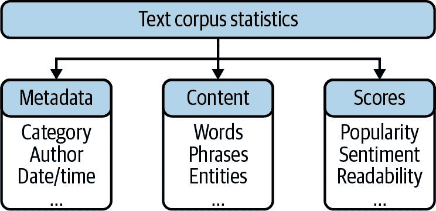

###### 图 1-1\. 文本数据探索的统计特征。

内容的统计分析基于词语和短语的频率。通过第四章中描述的语言数据预处理方法，我们将扩展分析的范围到特定的词类和命名实体。此外，文档的描述性分数可以包含在数据集中或通过某种特征建模推导得出。例如，回复用户帖子的数量可以作为受欢迎程度的一种衡量标准。最后，通过本书后面描述的某种方法，可以确定有趣的软事实，如情感或情绪分数。

需要注意的是，在处理文本时，绝对数字通常并不是非常有趣的。仅仅因为单词*问题*出现了一百次，并不包含任何相关信息。但是，*问题*的相对频率在一周内翻了一番可能是引人注目的。

# 引入数据集

分析政治文本，无论是新闻还是政党纲领或议会辩论，都可以为国家和国际议题提供有趣的见解。通常，多年来的文本是公开可用的，因此可以获取对时代精神的洞察。让我们来看看作为政治分析师的角色，他想要了解这样一个数据集的分析潜力。

为此，我们将使用[联合国大会辩论数据集](https://oreil.ly/lHHUm)。该语料库由哈佛大学的米哈伊洛夫、巴图罗和达桑迪于 2017 年创建，“用于理解和衡量世界政治中的国家偏好”。联合国几乎所有的 200 个国家在年度大会上都有机会就全球议题如国际冲突、恐怖主义或气候变化发表意见。

Kaggle 上的原始数据集以两个 CSV 文件的形式提供，一个大文件包含演讲内容，一个小文件包含演讲者信息。为简化事务，我们准备了一个单独的压缩 CSV 文件包含所有信息。您可以在我们的 [GitHub 代码库](https://oreil.ly/btap-code) 中找到准备代码及其结果文件。

在 Pandas 中，可以使用 `pd.read_csv()` 加载 CSV 文件。让我们加载文件并显示`DataFrame`的两条随机记录：

```py
file = "un-general-debates-blueprint.csv"
df = pd.read_csv(file)
df.sample(2)

```

`输出：`

|   | 会话 | 年份 | 国家 | 国家名称 | 演讲者 | 职位 | 文本 |
| --- | --- | --- | --- | --- | --- | --- | --- |
| 3871 | 51 | 1996 | PER | 秘鲁 | 弗朗西斯科·图德拉·范·布鲁赫尔·道格拉斯 | 外交部长 | 在此，我首先要向您和本届大会转达秘鲁人民的问候和祝贺…… |
| 4697 | 56 | 2001 | GBR | 英国 | 杰克·斯特劳 | 外交部长 | 请允许我热情地祝贺您，先生，您担任第五十六届大会主席一职。\n 这... |

第一列包含记录的索引。会话号和年份的组合可以视为表的逻辑主键。`country` 列包含标准化的三位字母国家 ISO 代码，接着是关于演讲者及其职位的两列。最后一列包含演讲文本。

我们的数据集很小，仅包含几千条记录。这是一个很好的数据集，因为我们不会遇到性能问题。如果您的数据集较大，请参考“处理大型数据集” 了解更多选项。

# 蓝图：使用 Pandas 获取数据概览

在我们的第一个蓝图中，我们仅使用元数据和记录计数来探索数据分布和质量；我们还没有查看文本内容。我们将按以下步骤进行操作：

1.  计算汇总统计信息。

1.  检查缺失值。

1.  绘制有趣属性的分布图。

1.  比较不同类别之间的分布。

1.  可视化时间发展。

在分析数据之前，我们至少需要了解一些关于`DataFrame`结构的信息。表 1-1 显示了一些重要的描述性属性或函数。

表 1-1\. Pandas 数据框信息获取命令

| `df.columns` | 列名列表 |   |
| --- | --- | --- |
| `df.dtypes` | 元组（列名，数据类型） | 在 Pandas 1.0 版本之前，字符串被表示为对象。 |
| `df.info()` | 数据类型及内存消耗 | 使用 `memory_usage='deep'` 可以获得文本的良好内存消耗估算。 |
| `df.describe()` | 汇总统计信息 | 对于分类数据，请使用 `include='O'` 参数。 |

## 计算列的汇总统计信息

Pandas 的`describe`函数为`DataFrame`的列计算统计摘要。它可以在单个系列上工作，也可以在整个`DataFrame`上工作。在后一种情况下，默认输出限于数值列。当前，我们的`DataFrame`只包含会话号和年份作为数值数据。让我们添加一个新的数值列到`DataFrame`中，该列包含文本长度，以获取关于演讲长度分布的额外信息。我们建议使用`describe().T`来转置结果，以在表示中交换行和列：

```py
df['length'] = df['text'].str.len()

df.describe().T

```

`Out:`

|   | 计数 | 平均值 | 标准差 | 最小值 | 25% | 50% | 75% | 最大值 |
| --- | --- | --- | --- | --- | --- | --- | --- | --- |
| 会话 | 7507.00 | 49.61 | 12.89 | 25.00 | 39.00 | 51.00 | 61.00 | 70.00 |
| 年份 | 7507.00 | 1994.61 | 12.89 | 1970.00 | 1984.00 | 1996.00 | 2006.00 | 2015.00 |
| 长度 | 7507.00 | 17967.28 | 7860.04 | 2362.00 | 12077.00 | 16424.00 | 22479.50 | 72041.00 |

`describe()`，没有额外的参数，计算值的总数、均值和标准差，以及只有数值列的[五数总结](https://oreil.ly/h2nrN)。`DataFrame`包含`session`、`year`和`length`的 7,507 个条目。对于`year`和`session`来说，均值和标准差没有太多意义，但最小值和最大值仍然很有趣。显然，我们的数据集包含了从 1970 年到 2015 年的第 25 届至第 70 届联合国大会的演讲。

对非数字列的摘要可以通过指定`include='O'`（`np.object`的别名）来生成。在这种情况下，我们还会得到计数、唯一值的数量、最顶部的元素（如果有很多具有相同出现次数的话，则获取其一个）及其频率。由于唯一值的数量对文本数据来说没有用，所以让我们只分析`country`和`speaker`列：

```py
df[['country', 'speaker']].describe(include='O').T

```

`Out:`

|   | 计数 | 唯一 | 最顶部 | 频率 |
| --- | --- | --- | --- | --- |
| 国家 | 7507 | 199 | ITA | 46 |
| 发言者 | 7480 | 5428 | 谢悠姆·梅斯芬 | 12 |

数据集包含来自 199 个独特国家和显然 5,428 位发言者的数据。国家数量是有效的，因为此列包含标准化的 ISO 代码。但计算像`speaker`这样的文本列的唯一值通常不会得到有效结果，如下一节将展示的。

## 检查缺失数据

通过查看前表中的计数，我们可以看到`speaker`列存在缺失值。因此，让我们使用`df.isna()`（`df.isnull()`的别名）来检查所有列的空值，并计算结果的摘要：

```py
df.isna().sum()

```

`Out:`

```py
session            0
year               0
country            0
country_name       0
speaker           27
position        3005
text               0
length             0
dtype: int64

```

我们需要谨慎使用`speaker`和`position`列，因为输出告诉我们这些信息并不总是可用的！为了避免任何问题，我们可以用一些通用值来替换缺失值，比如`unknown speaker`或`unknown position`，或者只是空字符串。

Pandas 提供了 `df.fillna()` 函数来实现这一目的：

```py
df['speaker'].fillna('unknown', inplace=True)

```

但即使是现有的值可能也存在问题，因为同一演讲者的姓名有时拼写不同甚至含糊不清。以下语句计算包含演讲者列中 `Bush` 的所有文档的每位演讲者的记录数量：

```py
df[df['speaker'].str.contains('Bush')]['speaker'].value_counts()

```

`Out:`

```py
George W. Bush        4
Mr. George W. Bush    2
George Bush           1
Mr. George W Bush     1
Bush                  1
Name: speaker, dtype: int64

```

除非我们解决这些歧义，否则对发言者姓名的任何分析都会产生错误结果。因此，最好检查分类属性的不同值。了解到这一点后，我们将忽略演讲者信息。

## 绘制数值分布图

用于可视化数值分布的一种方式是使用 [箱线图](https://oreil.ly/7xZJ_) 来展示数值分布的五数概括。Pandas 内置的绘图功能能够轻松生成这种图表。让我们看一下 `length` 列的箱线图：

```py
df['length'].plot(kind='box', vert=False)

```

`Out:`

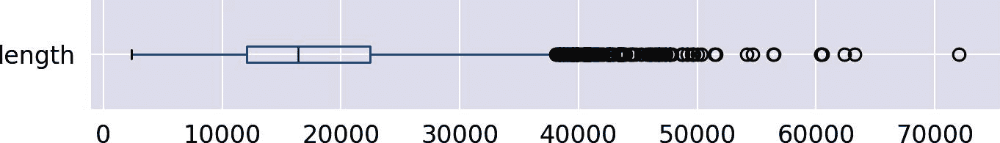

正如这个图表所示，50% 的演讲（中间的箱子）长度大约在 12,000 到 22,000 个字符之间，中位数约为 16,000，并且右侧有很多异常值的长尾。该分布显然是左偏的。通过绘制直方图，我们可以获取更多细节：

```py
df['length'].plot(kind='hist', bins=30)

```

`Out:`

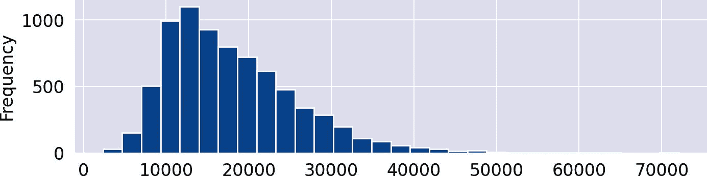

对于直方图，`length` 列的值范围被划分为 30 个等宽的间隔，即*柱状*。y 轴显示每个柱中的文档数量。

## 比较不同类别的数值分布

当不同数据子集被检查时，数据的特殊性通常会变得明显。用于比较不同类别分布的一种优秀可视化方式是 Seaborn 的 [`catplot`](https://oreil.ly/jhlEE)。

我们展示箱线图和小提琴图，以比较联合国安全理事会五个常任理事国演讲长度的分布（图 1-2）。因此，`sns.catplot` 的 x 轴类别是 `country`：

```py
where = df['country'].isin(['USA', 'FRA', 'GBR', 'CHN', 'RUS'])
sns.catplot(data=df[where], x="country", y="length", kind='box')
sns.catplot(data=df[where], x="country", y="length", kind='violin')

```

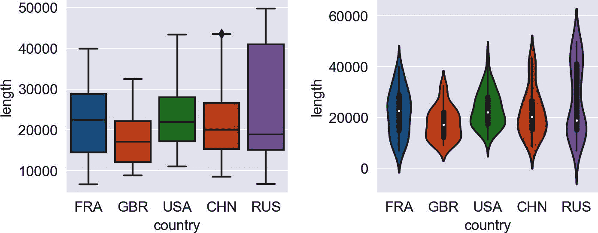

###### 图 1-2\. 箱线图（左）和小提琴图（右），展示了选定国家演讲长度的分布情况。

小提琴图是箱线图的“平滑”版本。通过小提琴体的宽度来可视化频率，同时箱线仍然可见于小提琴内部。这两种图表显示，对于俄罗斯而言，演讲长度的值分布范围要比英国大得多。但是，如俄罗斯的多个峰值存在只有在小提琴图中才能明显看出。

## 时间序列的可视化发展

如果您的数据包含日期或时间属性，将数据随时间的发展进行可视化通常会很有趣。首先，可以通过分析每年演讲次数来创建时间序列。我们可以使用 Pandas 的分组函数 `size()` 来返回每个组的行数。通过简单地附加 `plot()`，我们可以可视化生成的 `DataFrame`（图 1-3，左侧）：

```py
df.groupby('year').size().plot(title="Number of Countries")

```

时间轴反映了联合国成员国数量的发展，因为每个国家每年只有一次发言机会。事实上，联合国今天有 193 个成员国。有趣的是，随着更多国家参与辩论，所需的演讲长度也在减少，如下面的分析所显示（见图 1-3，右图）：

```py
df.groupby('year').agg({'length': 'mean'}) \
  .plot(title="Avg. Speech Length", ylim=(0,30000))

```

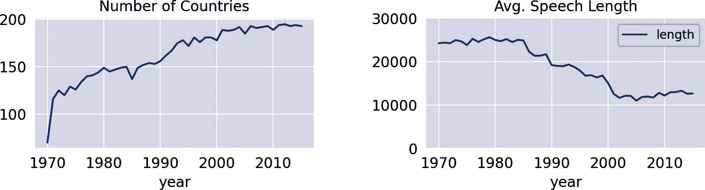

###### 图 1-3\. 随时间变化的国家数量和平均演讲长度。

###### 注意

Pandas 数据框不仅可以在 Jupyter 笔记本中轻松可视化，还可以通过内置函数导出到 Excel (*.xlsx*)、HTML、CSV、LaTeX 和许多其他格式。甚至还有一个`to_clipboard()`函数。查看[文档](https://oreil.ly/HZDVN)获取详情。

# 蓝图：构建一个简单的文本预处理流水线

元数据分析，如类别、时间、作者和其他属性，可以为语料库提供一些初步见解。但更有趣的是深入挖掘实际内容，探索不同子集或时间段中的常见词语。在本节中，我们将开发一个基本的蓝图，准备文本进行快速的初步分析，由一系列步骤组成（见图 1-4）。由于每个操作的输出形成下一个操作的输入，这样的顺序也称为*处理流水线*，将原始文本转换为一系列标记。


###### 图 1-4\. 简单的预处理流水线。

这里呈现的流水线包括三个步骤：大小写转换为小写、分词和停用词去除。这些步骤将在第四章中深入讨论和扩展，我们将使用 spaCy。为了保持快速和简单，我们在这里基于正则表达式构建自己的分词器，并展示如何使用任意的停用词列表。

## 使用正则表达式进行分词

*分词*是从字符序列中提取单词的过程。在西方语言中，单词通常由空格和标点符号分隔。因此，最简单和最快的分词器是 Python 的本地`str.split()`方法，它以空格分割。更灵活的方式是使用正则表达式。

正则表达式和 Python 库`re`和`regex`将在第四章中详细介绍。在这里，我们希望应用一个简单的模式来匹配单词。在我们的定义中，单词至少包含一个字母以及数字和连字符。纯数字被跳过，因为它们几乎只代表这个语料库中的日期、讲话或会话标识符。

频繁使用的表达式`[A-Za-z]`不适合匹配字母，因为它会忽略像*ä*或*â*这样的重音字母。更好的选择是 POSIX 字符类`\p{L}`，它选择所有 Unicode 字母。请注意，我们需要使用[`regex`库](https://oreil.ly/hJ6M2)而不是`re`来处理 POSIX 字符类。以下表达式匹配由至少一个字母组成的标记（`\p{L}`），前后是任意的字母数字字符（`\w`包括数字、字母和下划线）和连字符（`-`）的序列：

```py
import regex as re

def tokenize(text):
    return re.findall(r'[\w-]*\p{L}[\w-]*', text)

```

让我们尝试使用语料库中的一个示例句子：

```py
text = "Let's defeat SARS-CoV-2 together in 2020!"
tokens = tokenize(text)
print("|".join(tokens))

```

`输出：`

```py
Let|s|defeat|SARS-CoV-2|together|in

```

## 处理停用词

文本中最常见的词是诸如限定词、助动词、代词、副词等常见词汇。这些词称为*停用词*。停用词通常不携带太多信息，但由于其高频率而隐藏了有趣的内容。因此，在数据分析或模型训练之前通常会删除停用词。

在本节中，我们展示如何丢弃预定义列表中包含的停用词。许多语言都有通用的停用词列表，并且几乎所有的自然语言处理库都集成了这些列表。我们将在这里使用 NLTK 的停用词列表，但你可以使用任何单词列表作为过滤器。^(2) 为了快速查找，你应该总是将列表转换为集合。集合是基于哈希的数据结构，类似于字典，具有几乎恒定的查找时间：

```py
import nltk

stopwords = set(nltk.corpus.stopwords.words('english'))

```

我们从给定列表中移除停用词的方法，封装成下面展示的小函数，通过简单的列表推导来实现检查。作为 NLTK 的列表只包含小写词汇，因此将标记转换为小写：

```py
def remove_stop(tokens):
    return [t for t in tokens if t.lower() not in stopwords]

```

通常，您需要将领域特定的停用词添加到预定义的列表中。例如，如果您正在分析电子邮件，术语*dear*和*regards*可能会出现在几乎所有文档中。另一方面，您可能希望将预定义列表中的某些词视为非停用词。我们可以使用 Python 的两个集合运算符`|`（并集/或）和`-`（差集）添加额外的停用词并排除列表中的其他词：

```py
include_stopwords = {'dear', 'regards', 'must', 'would', 'also'}
exclude_stopwords = {'against'}

stopwords |= include_stopwords
stopwords -= exclude_stopwords

```

NLTK 的停用词列表保守，仅包含 179 个词。令人惊讶的是，*would*不被视为停用词，而*wouldn’t*却是。这说明了预定义停用词列表常见的问题：不一致性。请注意，删除停用词可能会显著影响语义目标分析的性能，详细说明请参见“为什么删除停用词可能是危险的”。

除了或替代固定的停用词列表外，将每个在文档中出现频率超过 80%的单词视为停用词也可能很有帮助。这些常见词汇会使内容难以区分。scikit-learn 向量化器的参数`max_df`，如第五章中所述，正是为此而设计。另一种方法是根据词类别（词性）过滤单词。这个概念将在第四章中解释。

## 用一行代码处理流水线

让我们回到包含语料库文档的`DataFrame`。我们想要创建一个名为`tokens`的新列，其中包含每个文档的小写化、标记化文本，而且没有停用词。为此，我们使用一个可扩展的处理流程模式。在我们的案例中，我们将所有文本转换为小写，进行标记化，并去除停用词。通过简单扩展这个流程，可以添加其他操作：

```py
pipeline = [str.lower, tokenize, remove_stop]

def prepare(text, pipeline):
    tokens = text
    for transform in pipeline:
        tokens = transform(tokens)
    return tokens

```

如果我们将所有这些放入一个函数中，它就成为了 Pandas 的`map`或`apply`操作的完美用例。在数学和计算机科学中，接受其他函数作为参数的函数（如`map`和`apply`）称为*高阶函数*。

表 1-2\. Pandas 高阶函数

| 函数 | 描述 |
| --- | --- |
| `Series.map` | 逐个元素作用于 Pandas 的`Series` |
| `Series.apply` | 与`map`相同，但允许额外参数 |
| `DataFrame.applymap` | 逐个元素作用于 Pandas 的`DataFrame`（与`Series`上的`map`相同） |
| `DataFrame.apply` | 作用于`DataFrame`的行或列，并支持聚合 |

Pandas 支持在系列和数据框上的不同高阶函数（表 1-2）。这些函数不仅可以让您以一种易于理解的方式指定一系列的功能数据转换，而且可以轻松并行化。例如，Python 包[`pandarallel`](https://oreil.ly/qwPB4)提供了`map`和`apply`的并行版本。

像[Apache Spark](https://spark.apache.org)这样的可扩展框架支持更加优雅的数据框操作。事实上，在分布式编程中，`map`和`reduce`操作基于函数式编程的同一原理。此外，许多编程语言，包括 Python 和 JavaScript，都有针对列表或数组的本地`map`操作。

使用 Pandas 的一个高阶操作，应用功能转换变成了一行代码。

```py
df['tokens'] = df['text'].apply(prepare, pipeline=pipeline)

```

现在`tokens`列包含每个文档中提取的令牌的 Python 列表。当然，这个额外的列基本上会将`DataFrame`的内存消耗翻倍，但它允许您直接快速访问令牌以进行进一步分析。尽管如此，以下蓝图设计的方式使得令牌化也可以在分析过程中即时执行。通过这种方式，性能可以用内存消耗来交换：要么在分析前进行一次令牌化并消耗内存，要么在分析过程中动态令牌化并等待。

我们还添加了另一列，包含令牌列表的长度，以便后续摘要使用：

```py
df['num_tokens'] = df['tokens'].map(len)

```

###### 注意

`tqdm`（阿拉伯语中“进展”的发音是*taqadum*）是 Python 中优秀的进度条库。它支持传统的循环，例如使用`tqdm_range`替代`range`，并且通过提供在数据框上的`progress_map`和`progress_apply`操作支持 Pandas。^(3) 我们在 GitHub 上的相关笔记本使用这些操作，但在本书中我们仅使用纯粹的 Pandas。

# 词频分析的蓝图

频繁使用的单词和短语可以帮助我们基本了解讨论的主题。然而，词频分析忽略了单词的顺序和上下文。这就是著名的词袋模型的理念（参见第 5 章）：所有单词都被扔进一个袋子里，它们在里面翻滚成一团乱麻。原始文本中的排列被丢失，只有词项的频率被考虑进来。这个模型对于情感分析或问题回答等复杂任务效果不佳，但对于分类和主题建模却表现出色。此外，它是理解文本内容起点良好的一种方式。

在本节中，我们将开发多个蓝图来计算和可视化词频。由于原始频率过高导致不重要但频繁出现的单词占主导地位，因此我们在过程末尾还将引入 TF-IDF。我们将使用`Counter`来实现频率计算，因为它简单且速度极快。

## 蓝图：使用计数器计数单词

Python 的标准库中内置了一个名为`Counter`的类，它正如其名字所示：用来计数。^(4) 使用计数器的最简单方式是从一个项目列表创建它，本例中是代表单词或标记的字符串。生成的计数器基本上是一个包含这些项目作为键和它们频率作为值的字典对象。

让我们通过一个简单的例子来说明它的功能：

```py
from collections import Counter

tokens = tokenize("She likes my cats and my cats like my sofa.")

counter = Counter(tokens)
print(counter)

```

`Out:`

```py
Counter({'my': 3, 'cats': 2, 'She': 1, 'likes': 1, 'and': 1, 'like': 1,
         'sofa': 1})

```

计数器需要一个列表作为输入，因此任何文本都需要预先进行令牌化。计数器的好处在于它可以通过第二个文档的令牌列表进行增量更新。

```py
more_tokens = tokenize("She likes dogs and cats.")
counter.update(more_tokens)
print(counter)

```

`Out:`

```py
Counter({'my': 3, 'cats': 3, 'She': 2, 'likes': 2, 'and': 2, 'like': 1,
         'sofa': 1, 'dogs': 1})

```

要查找语料库中最频繁出现的单词，我们需要从所有文档中的单词列表创建一个计数器。一个简单的方法是将所有文档连接成一个巨大的标记列表，但对于较大的数据集来说这不可扩展。对于每个单个文档，调用计数器对象的`update`函数要高效得多。

```py
counter = Counter()

df['tokens'].map(counter.update)

```

我们在这里做了一个小技巧，将 `counter.update` 放入 `map` 函数中。奇迹发生在 `update` 函数内部。整个 `map` 调用运行得非常快；对于 7500 篇联合国演讲，仅需约三秒，并且与标记总数成线性关系。原因是一般而言字典和特别是计数器都实现为哈希表。单个计数器相对于整个语料库来说非常紧凑：它只包含每个单词一次以及其频率。

现在，我们可以使用相应的计数器函数检索文本中最常见的单词：

```py
print(counter.most_common(5))

```

`输出：`

```py
[('nations', 124508),
 ('united', 120763),
 ('international', 117223),
 ('world', 89421),
 ('countries', 85734)]

```

为了进一步处理和分析，将计数器转换为 Pandas `DataFrame` 要方便得多，这正是以下蓝图函数最终要做的。标记构成 `DataFrame` 的索引，而频率值存储在名为 `freq` 的列中。行已排序，使得最常见的单词出现在前面：

```py
def count_words(df, column='tokens', preprocess=None, min_freq=2):

    # process tokens and update counter
    def update(doc):
        tokens = doc if preprocess is None else preprocess(doc)
        counter.update(tokens)

    # create counter and run through all data
    counter = Counter()
    df[column].map(update)

    # transform counter into a DataFrame
    freq_df = pd.DataFrame.from_dict(counter, orient='index', columns=['freq'])
    freq_df = freq_df.query('freq >= @min_freq')
    freq_df.index.name = 'token'

    return freq_df.sort_values('freq', ascending=False)

```

该函数的第一个参数是一个 Pandas `DataFrame`，第二个参数是包含标记或文本的列名。由于我们已经将准备好的标记存储在包含演讲内容的 `DataFrame` 的列 `tokens` 中，我们可以使用以下两行代码计算包含单词频率并显示前五个标记的 `DataFrame`：

```py
freq_df = count_words(df)
freq_df.head(5)

```

`输出：`

| 标记 | 频率 |
| --- | --- |
| 国家 | 124508 |
| 联合 | 120763 |
| 国际 | 117223 |
| 世界 | 89421 |
| 国家 | 85734 |

如果我们不想对一些特殊分析使用预先计算的标记，我们可以使用自定义预处理函数作为第三个参数来动态标记文本。例如，我们可以通过文本的即时标记化生成并计数所有具有 10 个或更多字符的单词：

```py
    count_words(df, column='text',
                preprocess=lambda text: re.findall(r"\w{10,}", text))
```

`count_words` 的最后一个参数定义了要包含在结果中的最小标记频率。其默认值设置为 2，以削减出现仅一次的偶发标记的长尾部分。

## 蓝图：创建频率图

Python 中有几十种生成表格和图表的方法。我们喜欢 Pandas 和其内置的绘图功能，因为它比纯 Matplotlib 更容易使用。我们假设由前述蓝图生成的 `DataFrame` `freq_df` 用于可视化。基于这样一个 `DataFrame` 创建频率图现在基本上变成了一行代码。我们再添加两行格式化代码：

```py
ax = freq_df.head(15).plot(kind='barh', width=0.95)
ax.invert_yaxis()
ax.set(xlabel='Frequency', ylabel='Token', title='Top Words')

```

`输出：`

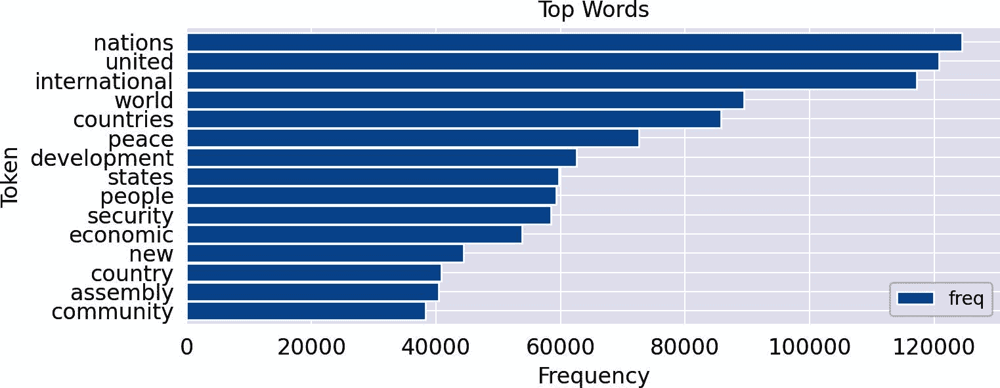

使用水平条 (`barh`) 来显示词频极大地提高了可读性，因为单词在 y 轴上以可读的形式水平显示。 y 轴被反转以将顶部的单词放置在图表的顶部。 可以选择修改坐标轴标签和标题。

## 蓝图：创建词云

像之前显示的频率分布图一样，详细显示了标记频率的信息。 但是，对于不同的时间段、类别、作者等进行频率图的比较是相当困难的。 相比之下，词云通过不同字体大小来可视化频率。 它们更容易理解和比较，但缺乏表格和条形图的精确性。 您应该记住，长单词或带有大写字母的单词会吸引不成比例的高关注度。

Python 模块 [`wordcloud`](https://oreil.ly/RV0r5) 从文本或计数器生成漂亮的词云。 使用它的最简单方法是实例化一个词云对象，带有一些选项，例如最大单词数和停用词列表，然后让 `wordcloud` 模块处理标记化和停用词移除。 以下代码显示了如何为 2015 年美国演讲的文本生成词云，并显示生成的图像与 Matplotlib：

```py
from wordcloud import WordCloud
from matplotlib import pyplot as plt

text = df.query("year==2015 and country=='USA'")['text'].values[0]

wc = WordCloud(max_words=100, stopwords=stopwords)
wc.generate(text)
plt.imshow(wc, interpolation='bilinear')
plt.axis("off")

```

然而，这仅适用于单个文本，而不是（可能很大的）文档集。 对于后一种用例，首先创建一个频率计数器，然后使用函数 `generate_from_frequencies()` 要快得多。

我们的蓝图是在此函数周围做了一点小包装，以支持由 `count_words` 创建的 Pandas `Series` 包含的频率值。 `WordCloud` 类已经有许多选项可以微调结果。 我们在以下函数中使用了其中一些来演示可能的调整，但您应该查看详细文档：

```py
def wordcloud(word_freq, title=None, max_words=200, stopwords=None):

    wc = WordCloud(width=800, height=400,
                   background_color= "black", colormap="Paired",
                   max_font_size=150, max_words=max_words)

    # convert DataFrame into dict
    if type(word_freq) == pd.Series:
        counter = Counter(word_freq.fillna(0).to_dict())
    else:
        counter = word_freq

    # filter stop words in frequency counter
    if stopwords is not None:
        counter = {token:freq for (token, freq) in counter.items()
                              if token not in stopwords}
    wc.generate_from_frequencies(counter)

    plt.title(title)

    plt.imshow(wc, interpolation='bilinear')
    plt.axis("off")

```

该函数有两个方便的参数来过滤单词。 `skip_n` 跳过列表中前 *n* 个单词。 显然，在联合国语料库中，像 *united*、*nations* 或 *international* 这样的单词位于列表的前列。 可视化之后，过滤掉特定但无趣的频繁单词可能更有帮助。 第二个过滤器是一个（额外的）停用词列表。 有时，仅在可视化时过滤掉特定频繁但无趣的单词是有帮助的。 ^(5)

因此，让我们来看看 2015 年的演讲（图示 1-5）。 左侧的词云可视化了最常见的单词，未经过滤。 而右侧的词云则将整个语料库中最频繁的 50 个单词视为停用词：

```py
freq_2015_df = count_words(df[df['year']==2015])
plt.figure()
wordcloud(freq_2015_df['freq'], max_words=100)
wordcloud(freq_2015_df['freq'], max_words=100, stopwords=freq_df.head(50).index)

```

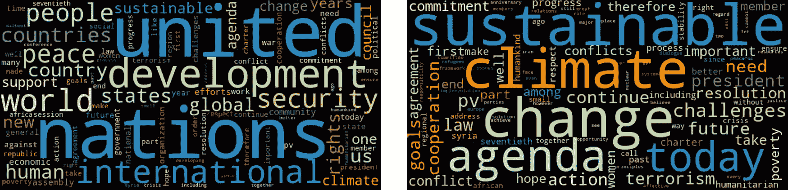

###### 图 1-5\. 2015 年演讲的词云，包含所有单词（左）和不包含 50 个最频繁单词（右）。

显然，正确的词云在去除了语料库中最频繁出现的词后，更好地展示了 2015 年的主题，但仍然存在像 *today* 或 *challenges* 这样频繁且不具体的词语。我们需要一种方法来减少这些词语的权重，如下一节所示。

## 蓝图：TF-IDF 排名

如图 1-5 所示，可视化最频繁出现的词通常并不会带来深刻的洞见。即使去除停用词，最常见的词通常是显而易见的特定领域术语，在数据的任何子集（切片）中都相似。但我们希望更加重视那些在给定数据切片中比“通常”更频繁出现的词语。这样的切片可以是语料库的任何子集，例如单篇演讲、某个十年的演讲，或者来自某个国家的演讲。

我们希望突出显示那些在切片中实际词频高于其总概率所表明的词语。有多种算法可以衡量词语的“惊讶”因素。其中一种最简单但效果最好的方法是将词频与逆文档频率结合（见侧边栏）。

让我们定义一个函数来计算语料库中所有术语的 IDF。它几乎与 `count_words` 相同，不同之处在于每个标记仅在每个文档中计算一次（`counter.update(set(tokens))`），并且在计数后计算 IDF 值。参数 `min_df` 用作罕见词的长尾过滤器。该函数的结果再次是一个 `DataFrame`：

```py
def compute_idf(df, column='tokens', preprocess=None, min_df=2):

    def update(doc):
        tokens = doc if preprocess is None else preprocess(doc)
        counter.update(set(tokens))

    # count tokens
    counter = Counter()
    df[column].map(update)

    # create DataFrame and compute idf
    idf_df = pd.DataFrame.from_dict(counter, orient='index', columns=['df'])
    idf_df = idf_df.query('df >= @min_df')
    idf_df['idf'] = np.log(len(df)/idf_df['df'])+0.1
    idf_df.index.name = 'token'
    return idf_df

```

IDF 值需要一次性计算整个语料库（不要在此处使用子集！），然后可以在各种分析中使用。我们使用此函数创建一个包含每个标记 IDF 值的 `DataFrame` (`idf_df`)：

```py
idf_df = compute_idf(df)

```

由于 IDF 和词频 `DataFrame` 都有一个由标记组成的索引，我们可以简单地将两个 `DataFrame` 的列相乘，以计算术语的 TF-IDF 分数：

```py
freq_df['tfidf'] = freq_df['freq'] * idf_df['idf']

```

让我们比较基于词频的词云和语料库中第一年和最后一年演讲的 TF-IDF 分数。我们去除了一些代表各自辩论会话次数的停用词。

```py
freq_1970 = count_words(df[df['year'] == 1970])
freq_2015 = count_words(df[df['year'] == 2015])

freq_1970['tfidf'] = freq_1970['freq'] * idf_df['idf']
freq_2015['tfidf'] = freq_2015['freq'] * idf_df['idf']

#wordcloud(freq_df['freq'], title='All years', subplot=(1,3,1))
wordcloud(freq_1970['freq'], title='1970 - TF',
          stopwords=['twenty-fifth', 'twenty-five'])
wordcloud(freq_2015['freq'], title='2015 - TF',
          stopwords=['seventieth'])
wordcloud(freq_1970['tfidf'], title='1970 - TF-IDF',
          stopwords=['twenty-fifth', 'twenty-five', 'twenty', 'fifth'])
wordcloud(freq_2015['tfidf'], title='2015 - TF-IDF',
          stopwords=['seventieth'])

```

通过 TF-IDF 加权的词云在 图 1-6 中生动展示了其威力。尽管 1970 年和 2015 年最常见的词几乎相同，但 TF-IDF 加权的可视化强调了政治主题的差异。

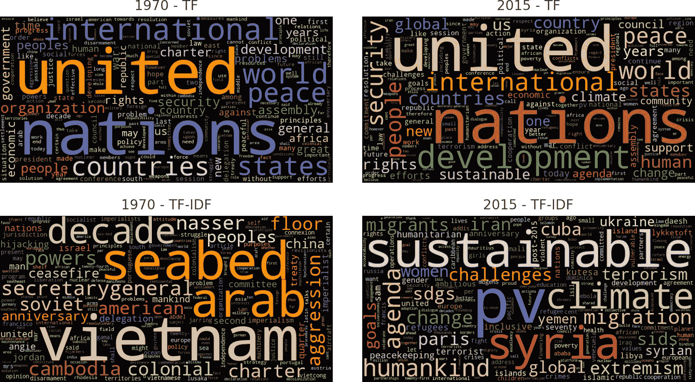

###### 图 1-6\. 两个选定年份演讲中，按纯计数（上）和 TF-IDF（下）加权的词语。

有经验的读者可能会想知道，为什么我们要自己实现计算单词数和计算 IDF 值的函数，而不是使用 scikit-learn 的 `CountVectorizer` 和 `TfidfVectorizer` 类。实际上，有两个原因。首先，向量化器为每个单个文档生成加权词频向量，而不是数据集的任意子集。其次，结果是矩阵（适合机器学习），而不是数据框架（适合切片、聚合和可视化）。最终，为了生成 图 1-6 中的结果，我们将不得不编写大致相同数量的代码行，但错过了从头介绍这一重要概念的机会。scikit-learn 的向量化器将在 第五章 中详细讨论。

# 蓝图：寻找关键词上下文

词云和频率图是视觉总结文本数据的强大工具。然而，它们通常也会引发关于为什么某个术语如此突出的问题。例如，前面讨论的 *2015 TF-IDF* 词云显示了术语 *pv*、*sdgs* 或 *sids*，您可能不知道它们的含义。为了弄清楚这一点，我们需要一种检查这些词在原始未准备文本中实际出现情况的方法。一种简单而聪明的方法是关键词上下文分析（KWIC 分析）。它生成显示关键词左右上下文的等长文本片段列表。以下是 *sdgs* 的 KWIC 列表示例，它为我们解释了这个术语：

```py
5 random samples out of 73 contexts for 'sdgs':
 of our planet and its people. The   SDGs   are a tangible manifestation of th
nd, we are expected to achieve the   SDGs   and to demonstrate dramatic develo
ead by example in implementing the   SDGs   in Bangladesh. Attaching due impor
the Sustainable Development Goals (  SDGs  ). We applaud all the Chairs of the
new Sustainable Development Goals (  SDGs  ) aspire to that same vision. The A

```

显然，*sdgs* 是 SDGs 的小写版本，SDGs 代表“可持续发展目标”。通过相同的分析，我们可以了解 *sids* 代表“小岛屿发展中国家”。这是解释 2015 年主题的重要信息！*pv* 则是一个标记化的人为产物。实际上，它是引用参考文献的剩余部分，例如 *(A/70/PV.28)*，表示“第 70 届大会，28 号议事录”，即第 70 届大会的第 28 次发言。

###### 注意

当您遇到不认识或不理解的令牌时，请务必深入了解细节！通常它们携带重要信息（如 *sdgs*），您作为分析师应能够解释。但您也经常会发现 *pv* 等人为产物。如果与您的分析无关，则应将其丢弃或正确处理。

KWIC 分析已在 NLTK 和 textacy 中实现。我们将使用 textacy 的 [`KWIC` 函数](https://oreil.ly/-dSrA)，因为它快速且适用于未标记化的文本。因此，我们可以搜索跨越多个标记的字符串，如“气候变化”，而 NLTK 无法做到。NLTK 和 textacy 的 KWIC 函数仅适用于单个文档。要将分析扩展到 `DataFrame` 中的若干文档，我们提供以下函数：

```py
from textacy.text_utils import KWIC

def kwic(doc_series, keyword, window=35, print_samples=5):

    def add_kwic(text):
        kwic_list.extend(KWIC(text, keyword, ignore_case=True,
                              window_width=window, print_only=False))

    kwic_list = []
    doc_series.map(add_kwic)

    if print_samples is None or print_samples==0:
        return kwic_list
    else:
        k = min(print_samples, len(kwic_list))
        print(f"{k} random samples out of {len(kwic_list)} " + \
              f"contexts for '{keyword}':")
        for sample in random.sample(list(kwic_list), k):
            print(re.sub(r'[\n\t]', ' ', sample[0])+'  '+ \
                  sample[1]+'  '+\
                  re.sub(r'[\n\t]', ' ', sample[2]))

```

该函数通过将`map`应用于每个文档来迭代收集关键字上下文的关键字上下文，这是我们已经在单词计数蓝图中使用过的技巧，非常有效，并且还可以对更大的语料库进行 KWIC 分析。 默认情况下，该函数返回形式为`(left context, keyword, right context)`的元组列表。 如果`print_samples`大于 0，则会打印结果的随机样本。^(8) 当您处理大量文档时，采样尤其有用，因为列表的前几个条目否则将来自单个或非常少量的文档。

之前的*sdgs*的 KWIC 列表是通过以下调用生成的：

```py
kwic(df[df['year'] == 2015]['text'], 'sdgs', print_samples=5)

```

# 蓝图：分析 N-Grams

仅仅知道气候是一个常见的词并不能告诉我们太多关于讨论主题的信息，因为，例如，*climate change*和*political climate*有完全不同的含义。 即使是*change climate*也不同于*climate change*。 因此，将频率分析从单个词扩展到两个或三个词的短序列可能会有所帮助。

基本上，我们正在寻找两种类型的词序列：化合物和搭配词。 *化合物*是具有特定含义的两个或更多个词的组合。 在英语中，我们发现以封闭形式出现的化合物，例如*earthquake*；以连字符形式出现的化合物，例如*self-confident*；以及以开放形式出现的化合物，例如*climate change*。 因此，我们可能需要将两个标记视为单个语义单位。 相反，*搭配词*是经常一起使用的词。 通常，它们由形容词或动词和名词组成，例如*red carpet*或*united nations*。

在文本处理中，我们通常处理 bigrams（长度为 2 的序列），有时甚至是 trigrams（长度为 3）。 大小为 1 的 n-grams 是单个单词，也称为*unigrams*。 坚持保持<math alttext="n less-than-or-equal-to 3"><mrow><mi>n</mi> <mo>≤</mo> <mn>3</mn></mrow></math>的原因是，不同的 n-grams 数量随着*n*的增加呈指数增长，而它们的频率以相同的方式减少。 到目前为止，大多数 trigrams 在语料库中只出现一次。

以下函数优雅地生成了一组标记序列的 n-gram：^(9)

```py
def ngrams(tokens, n=2, sep=' '):
    return [sep.join(ngram) for ngram in zip(*[tokens[i:] for i in range(n)])]

text = "the visible manifestation of the global climate change"
tokens = tokenize(text)
print("|".join(ngrams(tokens, 2)))

```

`输出：`

```py
the visible|visible manifestation|manifestation of|of the|the global|
global climate|climate change

```

如您所见，大多数 bigrams 包含了像介词和冠词之类的停止词。 因此，建议构建不含停用词的 bigrams。 但是我们需要小心：如果首先删除停止词然后构建 bigrams，则会生成原始文本中不存在的 bigrams，例如示例中的“manifestation global”。 因此，我们在所有标记上创建 bigrams，但仅保留不包含任何停止词的 bigrams，使用此修改后的`ngrams`函数：

```py
def ngrams(tokens, n=2, sep=' ', stopwords=set()):
    return [sep.join(ngram) for ngram in zip(*[tokens[i:] for i in range(n)])
            if len([t for t in ngram if t in stopwords])==0]

print("Bigrams:", "|".join(ngrams(tokens, 2, stopwords=stopwords)))
print("Trigrams:", "|".join(ngrams(tokens, 3, stopwords=stopwords)))

```

`输出：`

```py
Bigrams: visible manifestation|global climate|climate change
Trigrams: global climate change

```

使用此`ngrams`函数，我们可以向我们的`DataFrame`添加一个包含所有 bigrams 的列，并应用单词计数蓝图以确定前五个 bigrams：

```py
df['bigrams'] = df['text'].apply(prepare, pipeline=[str.lower, tokenize]) \
                          .apply(ngrams, n=2, stopwords=stopwords)

count_words(df, 'bigrams').head(5)

```

`输出：`

| 标记 | 频率 |
| --- | --- |
| 联合国 | 103236 |
| 国际社会 | 27786 |
| 大会 | 27096 |
| 安全理事会 | 20961 |
| 人权 | 19856 |

您可能已经注意到我们在标记化过程中忽略了句子边界。因此，我们将生成最后一个句子的最后一个词和下一个句子的第一个词的无意义双字词。这些双字词不会很频繁，所以它们对数据探索并不重要。如果我们想要避免这种情况，我们需要识别句子边界，这比词标记化要复杂得多，在这里并不值得努力。

现在让我们扩展我们基于 TF-IDF 的单字词分析，包括双字词。我们添加了双字词的 IDF 值，计算了所有 2015 年演讲的 TF-IDF 加权双字词频率，并从结果的 `DataFrame` 生成了一个词云：

```py
# concatenate existing IDF DataFrame with bigram IDFs
idf_df = pd.concat([idf_df, compute_idf(df, 'bigrams', min_df=10)])

freq_df = count_words(df[df['year'] == 2015], 'bigrams')
freq_df['tfidf'] = freq_df['freq'] * idf_df['idf']
wordcloud(freq_df['tfidf'], title='all bigrams', max_words=50)

```

正如我们在图 1-7 左侧的词云中看到的那样，*气候变化*是 2015 年的一个常见双字词。但是，为了理解*气候*的不同上下文，了解仅包含*气候*的双字词可能会很有趣。我们可以在*气候*上使用文本过滤器来实现这一点，并再次将结果绘制为词云（图 1-7，右侧）：

```py
where = freq_df.index.str.contains('climate')
wordcloud(freq_df[where]['freq'], title='"climate" bigrams', max_words=50)

```

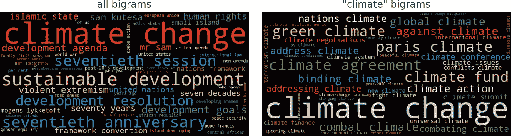

###### 图 1-7. 所有双字词和包含单词*climate*的双字词的词云。

这里介绍的方法创建并加权所有不包含停用词的 n-gram。初步分析的结果看起来相当不错。我们只关心不频繁出现的双字词的长尾部分。还有更复杂但计算成本更高的算法可用于识别搭配词，例如在[NLTK 的搭配词查找器](https://oreil.ly/uW-2A)中。我们将在第四章和第十章展示识别有意义短语的替代方法。

# 蓝图：比较时间间隔和类别之间的频率

你肯定知道[Google 趋势](http://trends.google.com)，你可以跟踪一些搜索词随时间的发展。这种趋势分析按日计算频率，并用线状图可视化。我们想要跟踪我们的 UN 辩论数据集中某些关键词随着年份的变化情况，以了解诸如气候变化、恐怖主义或移民等主题的重要性增长或减少的情况。

## 创建频率时间线

我们的方法是计算每个文档中给定关键词的频率，然后使用 Pandas 的 `groupby` 函数汇总这些频率。以下函数是第一个任务的。它从标记列表中提取给定关键词的计数：

```py
def count_keywords(tokens, keywords):
    tokens = [t for t in tokens if t in keywords]
    counter = Counter(tokens)
    return [counter.get(k, 0) for k in keywords]

```

让我们通过一个小例子来演示功能：

```py
keywords = ['nuclear', 'terrorism', 'climate', 'freedom']
tokens = ['nuclear', 'climate', 'climate', 'freedom', 'climate', 'freedom']

print(count_keywords(tokens, keywords))

```

`输出：`

```py
[1, 0, 3, 2]

```

正如你所见，该函数返回一个单词计数的列表或向量。事实上，它是一个非常简单的关键词计数向量化器。如果我们将此函数应用于我们`DataFrame`中的每个文档，我们将得到一个计数的矩阵。接下来显示的蓝图函数`count_keywords_by`正是这样的第一步。然后，该矩阵再次转换为一个`DataFrame`，最终按提供的分组列进行聚合和排序。

```py
def count_keywords_by(df, by, keywords, column='tokens'):

    freq_matrix = df[column].apply(count_keywords, keywords=keywords)
    freq_df = pd.DataFrame.from_records(freq_matrix, columns=keywords)
    freq_df[by] = df[by] # copy the grouping column(s)

    return freq_df.groupby(by=by).sum().sort_values(by)

```

这个函数非常快，因为它只需处理关键词。在笔记本电脑上，对早期的四个关键词进行统计只需两秒钟。让我们来看看结果：

```py
freq_df = count_keywords_by(df, by='year', keywords=keywords)

```

`输出：`

| nuclear | terrorism | climate | freedom | year |
| --- | --- | --- | --- | --- |
| 1970 | 192 | 7 | 18 | 128 |
| 1971 | 275 | 9 | 35 | 205 |
| ... | ... | ... | ... | ... |
| 2014 | 144 | 404 | 654 | 129 |
| 2015 | 246 | 378 | 662 | 148 |

###### 注意

即使在我们的例子中只使用了属性`year`作为分组标准，但蓝图函数允许您跨任何离散属性比较单词频率，例如国家、类别、作者等。事实上，您甚至可以指定一个分组属性列表，以计算例如按国家和年份计数。

生成的`DataFrame`已经完全准备好用于绘图，因为每个关键词都有一个数据系列。使用 Pandas 的`plot`函数，我们得到了一个类似于 Google 趋势的漂亮折线图（参见图 1-8）：

```py
freq_df.plot(kind='line')

```

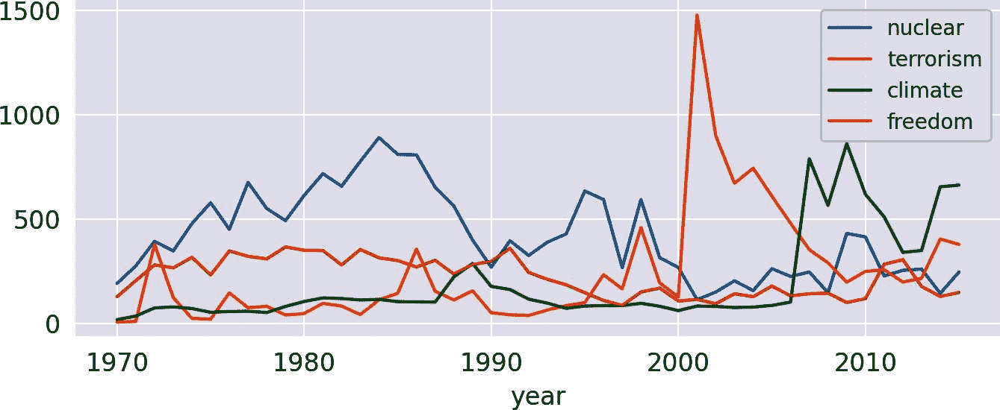

###### 图 1-8。每年选定词汇的频率。

注意 1980 年代“核”词的高峰，表明了军备竞赛，以及 2001 年恐怖主义的高峰。引人注目的是，“气候”主题在 1970 年代和 1980 年代已经引起了一些关注。真的吗？好吧，如果你用 KWIC 分析（“蓝图：寻找上下文关键词”）检查一下，你会发现在那些年代，“气候”一词几乎完全是以比喻意义使用的。

## 创建频率热图

假设我们想分析全球危机的历史发展，比如冷战、恐怖主义和气候变化。我们可以选择一些显著词汇，并像前面的例子中那样通过线图来可视化它们的时间线。但是，如果线图超过四五条线，它们会变得令人困惑。一个没有这种限制的替代可视化方法是热图，如 Seaborn 库所提供的。因此，让我们为我们的过滤器添加更多关键词，并将结果显示为热图（参见图 1-9）。

```py
keywords = ['terrorism', 'terrorist', 'nuclear', 'war', 'oil',
            'syria', 'syrian', 'refugees', 'migration', 'peacekeeping',
            'humanitarian', 'climate', 'change', 'sustainable', 'sdgs']

freq_df = count_keywords_by(df, by='year', keywords=keywords)

# compute relative frequencies based on total number of tokens per year
freq_df = freq_df.div(df.groupby('year')['num_tokens'].sum(), axis=0)
# apply square root as sublinear filter for better contrast
freq_df = freq_df.apply(np.sqrt)

sns.heatmap(data=freq_df.T,
            xticklabels=True, yticklabels=True, cbar=False, cmap="Reds")

```

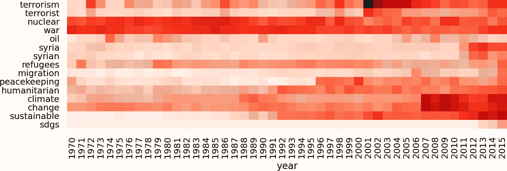

###### 图 1-9。随时间变化的词频热图。

对于这种分析，有几点需要考虑：

任何类型的比较都应优先使用相对频率。

如果每年或每个类别的令牌总数不稳定，绝对术语频率可能存在问题。例如，在我们的例子中，如果越来越多的国家每年都在发言，绝对频率自然会上升。

谨慎解释基于关键词列表的频率图表。

虽然图表看起来像是主题的分布，但事实并非如此！可能还有其他代表相同主题的词语，但未包含在列表中。关键词也可能有不同的含义（例如，“讨论的气候”）。高级技术如主题建模（第八章）和词嵌入（第十章）在这里可以提供帮助。

使用亚线性缩放。

由于频率值差异很大，对于频率较低的令牌可能很难看到任何变化。因此，你应该对频率进行亚线性缩放（我们应用了平方根 `np.sqrt`）。视觉效果类似于降低对比度。

# 结语

我们展示了如何开始分析文本数据。文本准备和标记化的过程被保持简单以获得快速结果。在第四章中，我们将介绍更复杂的方法，并讨论不同方法的优缺点。

数据探索不仅应该提供初步的见解，而且实际上应该帮助您对数据产生信心。你应该记住的一件事是，你应该总是确定任何奇怪令牌出现的根本原因。KWIC 分析是搜索这类令牌的一个好工具。

对于内容的初步分析，我们介绍了几种词频分析的蓝图。术语的加权基于术语频率或术语频率和逆文档频率（TF-IDF）的组合。这些概念稍后将在第五章中继续讨论，因为 TF-IDF 加权是机器学习中标准的文档向量化方法之一。

文本分析有很多方面在本章中我们没有涉及：

+   作者相关的信息可以帮助识别有影响力的作家，如果这是你的项目目标之一的话。作者可以通过活动、社交分数、写作风格等来区分。

+   有时候比较不同作者或不同语料库在相同主题上的可读性是很有趣的。[`textacy` 库](https://oreil.ly/FRZJb)有一个名为 `textstats` 的函数，可以在一次遍历文本中计算不同的可读性分数和其他统计数据。

+   一个有趣的工具，用于识别和可视化不同类别之间的特征术语（例如政党）是 Jason Kessler 的[`Scattertext`](https://oreil.ly/R6Aw8)库。

+   除了纯 Python 之外，你还可以使用交互式的视觉工具进行数据分析。Microsoft 的 PowerBI 有一个不错的词云插件和许多其他选项来生成交互式图表。我们提到它是因为在桌面版中免费使用，并支持 Python 和 R 用于数据准备和可视化。

+   对于较大的项目，我们建议设置搜索引擎，如[Apache SOLR](https://oreil.ly/LqPvG)，[Elasticsearch](https://elastic.co)，或[Tantivy](https://oreil.ly/NCz1g)。这些平台创建了专门的索引（还使用 TF-IDF 加权），以便进行快速全文搜索。Python API 适用于所有这些平台。

^(1) 查看[Pandas 文档](https://oreil.ly/XjAKa)获取完整列表。

^(2) 您可以类似地处理 spaCy 的列表，使用`spacy.lang.en.STOP_WORDS`。

^(3) 查看[文档](https://oreil.ly/gO_VN)获取更多细节。

^(4) NLTK 类[`FreqDist`](https://oreil.ly/xQXUu)派生自`Counter`，并添加了一些便利功能。

^(5) 注意，如果调用`generate_from_frequencies`，`wordcloud`模块会忽略停用词列表。因此，我们需要额外进行过滤。

^(6) 例如，scikit-learn 的`TfIdfVectorizer`会添加`+1`。

^(7) 另一种选择是在分母中添加+1，以避免未见术语导致的除零。这种技术称为*平滑*。

^(8) textacy 的`KWIC`函数中的参数`print_only`类似工作，但不进行抽样。

^(9) 查看斯科特·特里格利亚的[博文](https://oreil.ly/7WwTe)了解解释。
