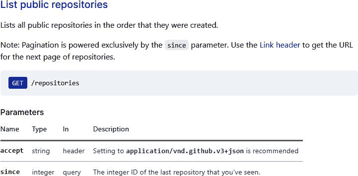
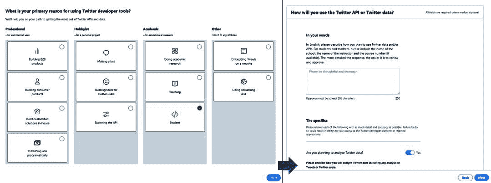
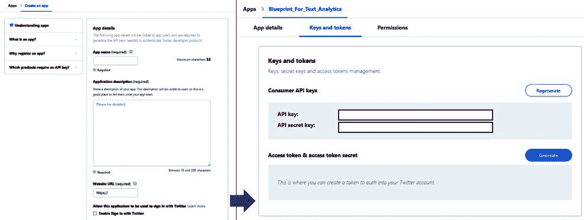
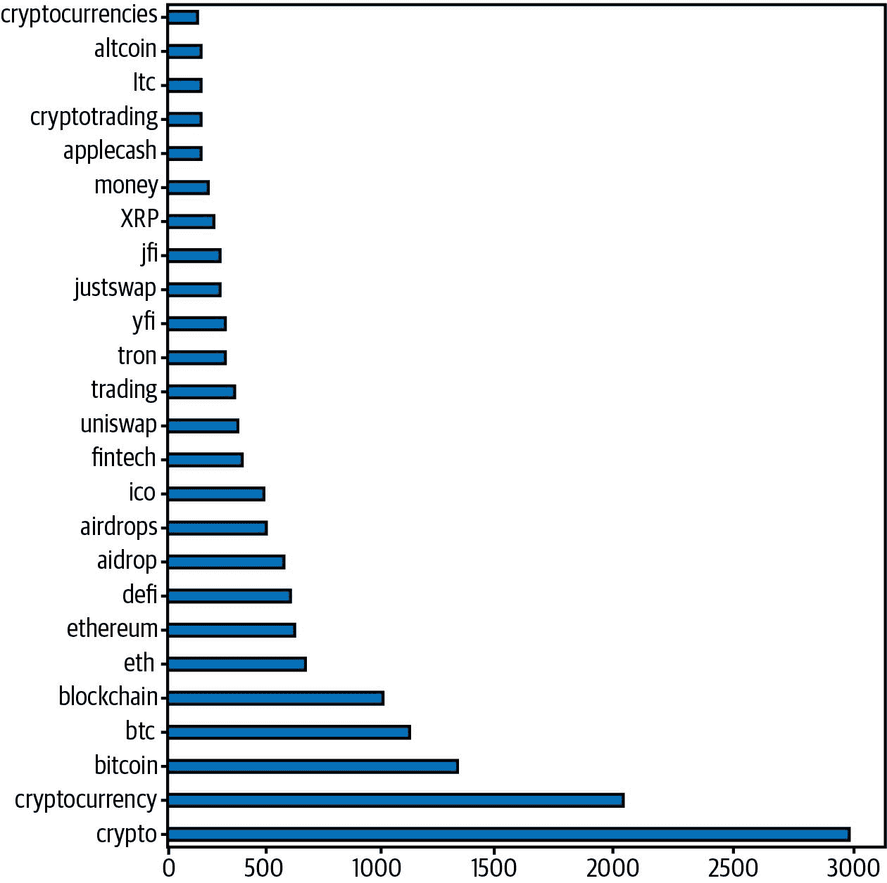

# 第二章：使用 API 提取文本洞见

当您想要确定研究问题的方法或开始进行文本分析项目时，数据的可用性通常是第一个障碍。一个简单的谷歌搜索或更具体的[数据集搜索](https://oreil.ly/SJoyG)将提供精选数据集，我们将在本书的后续章节中使用其中一些。根据您的项目，这些数据集可能是通用的，不适合您的用例。您可能需要创建自己的数据集，而应用程序编程接口（API）是以编程方式自动提取数据的一种方法。

# 你将学到什么，我们将构建什么

在本章中，我们将概述 API，并介绍从流行网站（如[GitHub](https://github.com)和[Twitter](https://twitter.com)）提取数据的蓝图。您将了解如何使用身份验证令牌，处理分页，了解速率限制，并自动化数据提取。在本章末尾，您将能够通过对任何已识别服务进行 API 调用来创建自己的数据集。虽然这些蓝图以 GitHub 和 Twitter 等具体示例为例，但它们可以用来处理任何 API。

# 应用程序编程接口

API 是允许软件应用程序或组件在无需知道它们如何实现的情况下进行通信的接口。API 提供一组定义和协议，包括可以进行的请求类型，要使用的数据格式以及预期的响应。 API 是开发人员在构建网站，应用程序和服务时常用的一组软件接口。例如，当您几乎与任何服务注册新帐户时，将要求您使用一次性代码或链接验证您的电子邮件地址或电话号码。通常，开发人员会使用认证服务提供的 API 来启用此功能，而不是构建整个流程。这允许将服务提供的核心功能与使用 API 构建其他必要但不唯一的功能分离。您可以阅读[Zapier](https://oreil.ly/e9iUI)提供的关于 API 的直观非技术介绍，以更好地理解。

编程 API 如何与文本分析项目中的数据连接？除了允许基本功能如身份验证外，网站上的常见功能也作为 API 提供，为我们提供了另一种访问数据的方式。例如，第三方工具利用 API 在社交媒体上创建帖子或添加评论。我们可以使用这些相同的 API 将这些信息读取并存储在本地以创建我们的数据集。例如，假设你是一家消费品公司的分析师，希望评估市场营销活动的表现。你可以使用 [Twitter 搜索 API](https://oreil.ly/PCJsx) 提取数据，过滤包含活动口号或标签的推文，并分析文本以了解人们的反应。或者考虑到你被培训提供商要求帮助确定新课程的未来技术领域。一种方法是使用 [StackOverflow API](https://oreil.ly/kMsGs) 提取关于正在提问的问题的数据，并使用文本分析识别出新兴主题。

使用 API 是优于对网站进行抓取的首选方法。它们被设计为可调用的函数，易于使用，并且可以自动化。特别是在处理频繁变化的数据或项目必须反映最新信息时，它们特别推荐使用。在使用任何 API 时，重要的是花时间仔细阅读文档。文档提供了关于具体 API 调用、数据格式、参数以及用户权限、速率限制等其他详细信息。

###### 注意

并非所有 API 都是免费提供的，有些提供者有不同的计划以支持不同类型的客户。例如，Twitter API 有标准版、高级版和企业版。标准版是公共 API（任何具有开发者帐户的人都可以使用），而高级版和企业版则仅供付费客户使用。在本章中，我们将仅使用公共 API。

# 蓝图：使用 Requests 模块从 API 中提取数据

随着基于 HTTP 标准驱动的 Web 的普及，URL 往往是 API 的主要规范。我们将使用包含在标准 Python 发行版中的 requests 库作为访问和提取 API 数据的主要方式。为了说明这一蓝图，我们将使用 [GitHub API](https://oreil.ly/oUIG1)。GitHub 是一个流行的代码托管平台，其中托管了几个开源项目，如 Python、scikit-learn、TensorFlow，以及本书的代码。假设您想确定不同编程语言（如 Python、Java 和 JavaScript）的流行程度。我们可以从 GitHub 提取关于流行存储库使用的语言的数据，并确定每种语言的普及程度。或者考虑您的组织正在 GitHub 上托管一个项目，并希望确保用户和贡献者遵守行为准则。我们可以提取贡献者编写的问题和评论，并确保不使用冒犯性语言。在这个蓝图中，我们将阅读和理解 API 的文档，发出请求，解析输出，并创建一个可用于解决我们用例的数据集。

我们想要调用的第一个 API 是列出 GitHub 上的所有存储库。REST API 文档的入口点可以在 [GitHub](https://oreil.ly/oUIG1) 上找到。您可以搜索特定方法（也称为*端点*）或导航到 [GitHub 页面](https://oreil.ly/8HM5v) 查看其详细信息，如图 2-1 所示。



###### 图 2-1\. 列出公共存储库的 API 文档。

如文档所述，这是一个使用`GET`方法的调用，将按创建顺序提供存储库列表。让我们使用`requests.get`方法进行调用，并查看响应状态：

```py
import requests

response = requests.get('https://api.github.com/repositories',
                        headers={'Accept': 'application/vnd.github.v3+json'})
print(response.status_code)

```

`Out:`

```py
200

```

[200 响应代码](https://httpstatuses.com/200)表示对 API 的调用成功。我们还可以评估响应对象的编码，以确保正确处理它。响应对象中包含的重要元素之一是`headers`对象。它是一个字典，包含更详细的信息，如服务器名称、响应时间戳、状态等。在下面的代码中，我们只提取了 API 返回的内容类型和服务器详细信息，但建议您查看此对象的所有元素。大部分信息都在详细的 API 文档中，但检查响应是确保正确解析响应的另一种方式：

```py
print (response.encoding)
print (response.headers['Content-Type'])
print (response.headers['server'])

```

`Out:`

```py
utf-8
application/json; charset=utf-8
GitHub.com

```

查看响应参数，我们了解到响应遵循 UTF-8 编码，并且内容以 JSON 格式返回。内容可以直接通过 `content` 元素访问，它以字节形式提供有效载荷。由于我们已经知道响应是一个 JSON 对象，因此我们还可以使用 `json()` 命令来读取响应。这将创建一个列表对象，其中每个元素都是一个仓库。我们展示了响应中的第一个元素，用于识别[创建的第一个 GitHub 仓库](https://oreil.ly/L9b6L)。出于简洁起见，我们将输出限制为前 200 个字符：

```py
import json
print (json.dumps(response.json()[0], indent=2)[:200])

```

`输出：`

```py
{
  "id": 1,
  "node_id": "MDEwOlJlcG9zaXRvcnkx",
  "name": "grit",
  "full_name": "mojombo/grit",
  "private": false,
  "owner": {
    "login": "mojombo",
    "id": 1,
    "node_id": "MDQ6VXNlcjE=",

```

虽然前一个响应包含仓库列表，但在寻找特定编程语言时并不有用。使用搜索 API 可能更好，我们将在下一步中使用它：

```py
response = requests.get('https://api.github.com/search/repositories')
print (response.status_code)

```

`输出：`

```py
422

```

上一个请求未成功，因为返回了 [422 状态码](https://httpstatuses.com/422)。此代码表示请求正确，但服务器无法处理请求。这是因为我们没有提供任何搜索查询参数，如 [文档](https://oreil.ly/5EtSw) 中所述。在查看响应之前，检查和理解状态非常重要。您可以在 [HTTP 规范](https://oreil.ly/SG6tf) 中查看每个状态码的详细定义。

假设我们想要识别用 Python 编写的与数据科学相关的 GitHub 仓库。我们将通过添加第二个参数 `params` 并附上搜索条件来修改请求。搜索查询需要按照 [GitHub 文档](https://oreil.ly/jNCff) 中描述的规则构建。根据这些规则，我们的搜索查询被编码为查找 `data_science`，将 `language` 过滤为 Python (`language:python`)，并将两者组合 (`+`)。这个构造的查询作为参数 `q` 传递给了 params。我们还传递了包含 `Accept` 参数的参数 `headers`，其中我们指定了 `text-match+json`，以便响应包含匹配的元数据并以 JSON 格式提供响应：

```py
response = requests.get('https://api.github.com/search/repositories',
    params={'q': 'data_science+language:python'},
    headers={'Accept': 'application/vnd.github.v3.text-match+json'})
print(response.status_code)

```

`输出：`

```py
200

```

如 API 文档中为 `/search/repositories` 端点提供的示例所述，响应包含一个带有 `total_count`、`incomplete_results` 和 `items` 的字典。重要的是要注意，此响应格式与我们之前看到的 `/repositories` 端点不同，我们必须相应地解析此结构。在这里，我们列出了搜索返回的前五个仓库的名称：

```py
for item in response.json()['items'][:5]:
    printmd('**' + item['name'] + '**' + ': repository ' +
            item['text_matches'][0]['property'] + ' - \"*' +
            item['text_matches'][0]['fragment'] + '*\" matched with ' + '**' +
            item['text_matches'][0]['matches'][0]['text'] + '**')

```

`输出：`

```py
DataCamp: repository description - "*DataCamp data-science courses*" matched with
data

data-science-from-scratch: repository description - "*code for Data Science From
Scratch book*" matched with Data Science

data-science-blogs: repository description - "*A curated list of data science
blogs*" matched with data science

galaxy: repository description - "*Data intensive science for everyone.*" matched
with Data

data-scientist-roadmap: repository description - "*Tutorial coming with "data
science roadmap" graphe.*" matched with data science

```

我们已经看到如何发出请求并解析响应。现在考虑监控存储库中的评论并确保它们符合社区指南的用例。我们将使用[列出存储库问题](https://oreil.ly/9l-fy)端点来实现这一目标。在这里，我们必须指定所有者和存储库名称以获取所有问题评论，响应将包含该存储库中所有评论的列表。让我们为流行的深度学习框架 PyTorch 存储库发出此请求：

```py
response = requests.get(
    'https://api.github.com/repos/pytorch/pytorch/issues/comments')
print('Response Code', response.status_code)
print('Number of comments', len(response.json()))

```

`Out:`

```py
Response Code 200
Number of comments 30

```

尽管我们看到响应成功，但返回的评论数量仅为 30 个。PyTorch 是一个受欢迎的框架，拥有许多合作者和用户。在浏览器中查看存储库的问题页面将显示评论数量要多得多。那么，我们缺少了什么？

## 分页

这是许多 API 用于限制响应中元素数量的技术。存储库中的评论总数可能很大，尝试响应所有评论将耗时且成本高昂。因此，GitHub API 实现了分页概念，每次仅返回一页，本例中每页包含 30 个结果。响应对象中的`links`字段提供了响应中页面数的详细信息。

```py
response.links

```

`Out:`

```py
{'next': {'url': 'https://api.github.com/repositories/65600975/issues/
comments?page=2',
  'rel': 'next'},
 'last': {'url': 'https://api.github.com/repositories/65600975/issues/
comments?page=1334',
  'rel': 'last'}}

```

`next`字段为我们提供了下一页的 URL，该页包含下一个 30 个结果，而`last`字段提供了指向最后一页的链接，显示了总共有多少搜索结果。每页 30 个结果的数量也在文档中指定，并且通常可以配置到某个最大值。这对我们意味着什么？为了获取所有结果，我们必须实现一个函数，该函数将解析一页上的所有结果，然后调用下一个 URL，直到到达最后一页。这是一个递归函数，我们检查是否存在`next`链接并递归调用相同的函数。每页的评论都附加到`output_json`对象中，最终返回。为了限制我们检索的评论数量，我们使用过滤器参数仅获取自 2020 年 7 月以来的评论。根据文档，日期必须使用 ISO 8601 格式指定，并使用`since`关键字作为参数提供：

```py
def get_all_pages(url, params=None, headers=None):
    output_json = []
    response = requests.get(url, params=params, headers=headers)
    if response.status_code == 200:
        output_json = response.json()
        if 'next' in response.links:
            next_url = response.links['next']['url']
            if next_url is not None:
                output_json += get_all_pages(next_url, params, headers)
    return output_json

out = get_all_pages(
    "https://api.github.com/repos/pytorch/pytorch/issues/comments",
    params={
        'since': '2020-07-01T10:00:01Z',
        'sorted': 'created',
        'direction': 'desc'
    },
    headers={'Accept': 'application/vnd.github.v3+json'})
df = pd.DataFrame(out)

print (df['body'].count())
df[['id','created_at','body']].sample(1)

```

`Out:`

```py
3870

```

|   | id | created_at | body |
| --- | --- | --- | --- |
| 2176 | 286601372 | 2017-03-15T00:09:46Z | @soumith 能否解释哪个依赖项出了问题？我找不到你提到的 PR。 |

通过使用递归分页函数，我们已经捕获了 PyTorch 仓库约 3,800 条评论，并且在之前的表格中看到了其中一个示例。我们创建的数据集可以用于应用文本分析蓝图，例如识别不符合社区指南的评论并标记进行审查。它还可以通过在程序化的时间间隔运行来增强，以确保始终捕获最新的评论。

## 速率限制

在提取评论时可能注意到的一个问题是，我们只能检索到大约 3,800 条评论。然而，实际的评论数量要多得多。这是由于 API 应用了速率限制。为了确保 API 能够继续为所有用户提供服务并避免对基础设施造成负载，供应商通常会实施速率限制。速率限制指定了在特定时间范围内可以向端点发出多少请求。GitHub 的[速率限制策略](https://oreil.ly/PH7hm)如下所述：

> 对于未经身份验证的请求，速率限制允许每小时最多 60 次请求。未经身份验证的请求与发起请求的用户相关联的是来源 IP 地址，而不是用户本身。

使用 `head` 方法可以从 API 中仅检索头部信息，然后查看 `X-Ratelimit-Limit`、`X-Ratelimit-Remaining` 和 `X-RateLimit-Reset` 头部元素中的信息，这些信息包含在响应对象的头部部分中。

```py
response = requests.head(
    'https://api.github.com/repos/pytorch/pytorch/issues/comments')
print('X-Ratelimit-Limit', response.headers['X-Ratelimit-Limit'])
print('X-Ratelimit-Remaining', response.headers['X-Ratelimit-Remaining'])

# Converting UTC time to human-readable format
import datetime
print(
    'Rate Limits reset at',
    datetime.datetime.fromtimestamp(int(
        response.headers['X-RateLimit-Reset'])).strftime('%c'))

```

`Out:`

```py
X-Ratelimit-Limit 60
X-Ratelimit-Remaining 0
Rate Limits reset at Sun Sep 20 12:46:18 2020

```

`X-Ratelimit-Limit` 指示每个时间单位内（在本例中为一小时）可以发出多少个请求，`X-Ratelimit-Remaining` 是仍然可以在不违反速率限制的情况下进行的请求数量，而 `X-RateLimit-Reset` 则指示速率将重置的时间。不同的 API 端点可能具有不同的速率限制。例如，GitHub 搜索 API 拥有[每分钟的速率限制](https://oreil.ly/95Fw7)。如果通过超出速率限制的请求来超过速率限制，则 API 将以状态码 403 响应。

在进行 API 调用时，我们必须遵守速率限制，并调整我们的调用方式，以确保不会过载服务器。就像在之前的例子中从仓库中提取评论一样，我们每小时可以允许进行 60 次 API 调用。我们可以依次发起请求，从而快速耗尽限制，这就是我们先前的蓝图的工作方式。下面展示的函数 `handle_rate_limits` 会减慢请求速度，以确保它们在整个时间段内被间隔地发起。它通过应用休眠函数将剩余请求均匀分布在剩余时间内来实现这一点。这将确保我们的数据提取蓝图遵守速率限制，并且将请求间隔化，以确保所有请求的数据都被下载：

```py
from datetime import datetime
import time

def handle_rate_limits(response):
    now = datetime.now()
    reset_time = datetime.fromtimestamp(
        int(response.headers['X-RateLimit-Reset']))
    remaining_requests = response.headers['X-Ratelimit-Remaining']
    remaining_time = (reset_time - now).total_seconds()
    intervals = remaining_time / (1.0 + int(remaining_requests))
    print('Sleeping for', intervals)
    time.sleep(intervals)
    return True

```

网络通信，包括 API 调用，可能因多种原因失败，例如中断的连接、DNS 查询失败、连接超时等。默认情况下，requests 库不实现任何重试机制，因此我们蓝图的一个很好的补充是实现一个重试策略的实现。这将允许在指定的失败条件下重试 API 调用。可以使用`HTTPAdapter`库来实现，它允许更精细地控制正在进行的底层 HTTP 连接。在这里，我们初始化一个适配器，其中包含指定失败尝试时的五次重试策略。我们还指定了这些重试仅在接收到错误状态码 [500](https://httpstatuses.com/500)、[503](https://httpstatuses.com/503) 和 [504](https://httpstatuses.com/504) 时才执行。此外，我们还指定了`backoff_factor`¹的值，该值确定了在第二次尝试后的指数增加时间延迟，以确保我们不会过度请求服务器。

每个请求对象都创建一个默认的`Sessions`对象，它管理和持久化跨不同请求的连接设置，如 cookies、认证和代理，应该是无状态的。到目前为止，我们依赖于默认的`Sessions`对象，但是为了使用我们的重试策略覆盖连接行为，我们必须指定一个自定义适配器，这将使我们能够使用重试策略。这意味着我们将使用新的`http Session`对象来发起我们的请求，如下面的代码所示：

```py
from requests.adapters import HTTPAdapter
from requests.packages.urllib3.util.retry import Retry

retry_strategy = Retry(
    total=5,
    status_forcelist=[500, 503, 504],
    backoff_factor=1
)

retry_adapter = HTTPAdapter(max_retries=retry_strategy)

http = requests.Session()
http.mount("https://", retry_adapter)
http.mount("http://", retry_adapter)

response = http.get('https://api.github.com/search/repositories',
                   params={'q': 'data_science+language:python'})

for item in response.json()['items'][:5]:
    print (item['name'])

```

`Out:`

```py
DataCamp
data-science-from-scratch
data-science-blogs
galaxy
data-scientist-roadmap

```

将所有这些内容整合在一起，我们可以修改蓝图以处理分页、速率限制和重试，如下所示：

```py
from requests.adapters import HTTPAdapter
from requests.packages.urllib3.util.retry import Retry

retry_strategy = Retry(
    total=5,
    status_forcelist=[500, 503, 504],
    backoff_factor=1
)

retry_adapter = HTTPAdapter(max_retries=retry_strategy)

http = requests.Session()
http.mount("https://", retry_adapter)
http.mount("http://", retry_adapter)

def get_all_pages(url, param=None, header=None):
    output_json = []
    response = http.get(url, params=param, headers=header)
    if response.status_code == 200:
        output_json = response.json()
        if 'next' in response.links:
            next_url = response.links['next']['url']
            if (next_url is not None) and (handle_rate_limits(response)):
                output_json += get_all_pages(next_url, param, header)
    return output_json

```

如果你仔细查看速率限制的文档，你会发现根据所使用的身份验证类型有不同的速率限制。到目前为止，我们的所有请求都是未经认证的请求，速率限制较低。我们可以通过注册账户将我们的数据提取应用程序标识给 GitHub。然后，我们可以对 API 发出经过身份验证的请求，从而增加速率限制。这种做法确保未经认证的用户或欺诈性应用程序无法滥用 API，大多数 API 提供者都不允许未经身份验证的方式访问 API。

这个蓝图展示了如何使用简单的 Python requests 模块从任何 API 中提取数据，并创建自己的数据集。这是大多数 API 请求工作的基本方式，适用于一次性分析和新数据源的初步探索。回到我们的用例，如果你想要识别流行的深度学习框架以便开始学习，那么这个蓝图将是一个不错的选择。或者假设您的组织已经有了销售预测模型，您想评估添加财经市场新闻对该模型准确性的影响。假设有一个提供财经新闻的 API，你可以轻松地创建一个数据集，应用文本分析蓝图，并测试其对模型的相关性。

# 蓝图：使用 Tweepy 提取 Twitter 数据

为了使开发人员更容易使用其 API，许多流行服务提供了多种编程语言的包，或者至少有一个或多个社区支持的模块。虽然 API 得到官方支持，但这些包是维护良好的 Python 模块，包含了额外的功能，使它们易于使用。这意味着你可以专注于你想要提取的数据类型，而不是 API 调用、身份验证等技术细节。在这个蓝图中，我们将使用一个名为[Tweepy](https://oreil.ly/yZOU7)的社区开发和支持的 Python 模块来从 Twitter 中提取数据。Twitter 维护了一个[不同语言的库列表](https://oreil.ly/lwrFM)，其中包括几个 Python 的库。我们选择了 Tweepy，因为它得到了积极的维护并被许多研究人员使用。虽然这个蓝图使用 Tweepy 从 Twitter API 中提取数据，但所描述的步骤对于任何其他 API 都是类似的。

我们之前描述了如何使用 Twitter 分析新营销活动的有效性。另一个用例可能是执行文本分析，以了解加密货币的流行度和情感，以预测其在经济中的采纳和价值。Twitter 是一个社交媒体网络，用户可以即时分享短消息，经常在实时反应世界事件中，如重大灾难或流行的体育赛事。用户还可以添加地理位置信息，这使我们能够了解某个城市或地理区域中最流行的当前事件。在由政府实施的 COVID-19 封锁期间，一些研究人员使用 Twitter 数据了解病毒的传播以及封锁的影响，并将这些作为经济健康的预测变量之一。

###### 警告

请注意，在使用像 Twitter 这样的公共 API 时，您将从许多用户的公共时间线检索数据，这些数据可能包含强烈甚至冒犯性的语言，包括脏话。请注意此点，并根据您的用例适当处理数据。

## 获取凭证

使用任何 API 的第一步是验证自己或您的应用程序。Twitter 要求其 API 的所有用户都注册为开发者，并提供使用 API 的原因的详细信息。这有助于他们识别您并防止任何未经授权的访问。您必须 [注册自己作为开发者](https://oreil.ly/vEnJp)。如果您还没有 Twitter 账户，则还需要创建一个账户。您将被要求说明创建开发者账户的目的，并回答关于如何使用 Twitter API 的其他问题。图 2-2 显示了这些屏幕的示例。请提供详细的回答，以确保 Twitter 充分了解您创建开发者账户的目的。例如，在这个蓝图中，我们希望使用 API 提取推文以说明其操作方式。由于我们只打算使用提取功能，因此问题“您的应用程序是否会使用推文、转推、喜欢、关注或直接消息功能？”不适用并且可以取消选择。在继续之前，您必须阅读并理解每个问题。请注意，这些要求对每个 API 都可能有所不同，并且可能会随时更改。



###### 图 2-2\. 创建 Twitter 开发者账户的注册流程示意图。

现在您已经拥有开发者账户，下一步是创建应用程序。应用程序的凭证在进行 API 调用时使用，因此指定创建应用程序的原因非常重要。您需要提供应用程序名称、创建原因以及与应用程序相关联的网站 URL。如果您将此应用程序用于研究和学习目的，则可以在应用程序描述中说明，并提供与项目相关的大学页面或 GitHub 存储库的 URL。一旦 Twitter 批准了应用程序，您可以转到 *Keys and tokens* 标签，如 图 2-3 所示，那里会显示 *API key* 和 *API secret key* 字段。请注意，这些是在进行 API 调用时用于身份验证的凭证，不要泄露它们是非常重要的。



###### 图 2-3\. 创建 Twitter 应用程序并获取凭证。

## 安装和配置 Tweepy

[Tweepy](https://oreil.ly/OHfnn) 的项目存储库和 [文档](https://oreil.ly/lDDo1) 是关于使用 Tweepy 的所有信息的最佳来源。我们可以通过在终端中输入 **`pip install tweepy`** 来安装 Tweepy。接下来，我们必须使用 `tweepy.AppAuthHandler` 模块对应用进行 Twitter API 的身份验证，我们使用前一步骤中获取的 API 密钥和 API 秘密密钥进行此操作。最后，我们实例化 `tweepy.API` 类，它将用于进行所有后续对 Twitter API 的调用。一旦连接建立，我们可以确认 API 对象的主机和版本。请注意，由于我们对公共信息的只读访问感兴趣，我们使用 [仅应用程序身份验证](https://oreil.ly/4oWbP)：

```py
import tweepy

app_api_key = 'YOUR_APP_KEY_HERE'
app_api_secret_key = 'YOUR_APP_SECRET_HERE'

auth = tweepy.AppAuthHandler(app_api_key, app_api_secret_key)
api = tweepy.API(auth)

print ('API Host', api.host)
print ('API Version', api.api_root)

```

`输出:`

```py
API Host api.twitter.com
API Version /1.1

```

## 从搜索 API 中提取数据

假设我们想分析加密货币的感知并确定其受欢迎程度。我们将使用搜索 API 检索提到这一点的所有推文以创建我们的数据集。Twitter API 也使用分页来返回多页结果，但我们不会实现自己的管理方式，而是使用 Tweepy 库提供的 `Cursor` 对象来遍历结果。我们将搜索查询传递给 API 对象，并另外指定要提取的推文的语言（在这种情况下为英语）。我们选择只检索 100 项，并通过将结果加载为 JSON 对象来创建 `DataFrame`：

```py
search_term = 'cryptocurrency'

tweets = tweepy.Cursor(api.search,
                       q=search_term,
                       lang="en").items(100)

retrieved_tweets = [tweet._json for tweet in tweets]
df = pd.json_normalize(retrieved_tweets)

df[['text']].sample(3)

```

|   | 文本 |
| --- | --- |
| 59 | 嗨！我一直在使用 OKEx，它让购买、出售和存储加密货币（如比特币）变得非常简单和安全。… https://t.co/4m0mpyQTSN |
| 17 | 今天连接上📉 #getconnected #bitcointrading #Bitcoin #BitcoinCash #bitcoinmining #cryptocurrency https://t.co/J60bCyFPUI |
| 22 | RT @stoinkies: 我们已经有了超过 100 位关注者！\n 赠品时间！\n 关注 + 转推 + 喜欢此推文 = 赢取 200 个 Dogecoin！\n 每个参与者还将获得… |

我们已成功完成了 API 调用，并可以在上一个表格中看到检索到的推文的文本，这些推文已显示出有趣的方面。例如，我们看到了 *RT* 这个词的使用，它表示转推（用户分享了另一条推文）。我们看到了表情符号的使用，这是该媒体的一个强烈特征，并且还注意到一些推文被截断了。Twitter 实际上对每条推文所包含的字符数施加了限制，最初为 140 个字符，后来扩展到了 280 个字符。这导致创建了一个 [扩展的推文对象](https://oreil.ly/fvl-3)，我们必须在使用 Tweepy 检索结果时显式指定它。此外，您必须知道，Twitter 搜索 API 的标准版本仅提供过去一周的结果，必须注册高级或企业版本才能获得历史推文。

###### 注意

每个终端点，Twitter 指定了`count`的最大值。这是单个响应页面返回的最大结果数。例如，搜索终端点指定了`count=100`的最大值，而`user_timeline`的最大值为`count=200`。

让我们扩展我们的搜索，包括与加密货币主题相关的其他关键字，比如`crypto`，并且暂时过滤转发。这是通过在搜索词中附加带有减号的`filter`关键字来完成的。我们还指定了希望使用`tweet_mode=extended`参数获取所有推文的全文。[标准搜索 API](https://oreil.ly/4IGcB)只搜索过去七天内发布的最新推文样本，但即使这样也可能是一个大数字，为了避免长时间等待来运行蓝图，我们限制了自己的推文数到 12,000 条。我们指定了参数`count=30`，这是一次调用中可以检索到的最大推文数。因此，我们必须进行 400 次这样的调用来获取我们的数据集，同时考虑到速率限制。这在 API 规定的每 15 分钟 450 个请求的速率限制内。在尝试这个蓝图时，可能会超过这个速率限制，因此我们通过设置`wait_on_rate_limit`参数启用 Tweepy 提供的自动等待功能。我们还设置了`wait_on_rate_limit_notify`以便在这种等待时间内得到通知。如果您在速率限制内，以下函数应该在约五分钟内执行完毕：

```py
api = tweepy.API(auth,
                 wait_on_rate_limit=True,
                 wait_on_rate_limit_notify=True,
                 retry_count=5,
                 retry_delay=10)

search_term = 'cryptocurrency OR crypto -filter:retweets'

tweets = tweepy.Cursor(api.search,
                       q=search_term,
                       lang="en",
                       tweet_mode='extended',
                       count=30).items(12000)

retrieved_tweets = [tweet._json for tweet in tweets]

df = pd.json_normalize(retrieved_tweets)
print('Number of retrieved tweets ', len(df))
df[['created_at','full_text','entities.hashtags']].sample(2)

```

`Out:`

```py
Number of retrieved tweets  12000
```

|   | created_at | full_text | entities.hashtags |
| --- | --- | --- | --- |
| 10505 | Sat Sep 19 22:30:12 +0000 2020 | Milk 被创造出来是为了让流动性提供者（持有 LP 代币的人）受益，因为他们可以在 SpaceSwap 抵押 LP 代币，作为奖励他们会得到 MILK 代币以及 0.3%的 UniSwap 佣金。\n\n👇👇👇\nhttps://t.co/M7sGbIDq4W\n#DeFi #加密货币 #UniSwap #另类币 | [{'text’: ‘DeFi', ‘indices’: [224, 229]}, {'text’: ‘加密货币', ‘indices’: [230, 236]}, {'text’: ‘UniSwap', ‘indices’: [246, 254]}, {'text’: ‘另类币', ‘indices’: [256, 261]}] |
| 11882 | Sat Sep 19 20:57:45 +0000 2020 | 您可以从我们的策划活动中获得股息。参与的最低要求是 2000 #steem 代理... 通过代理，您不会失去本金。我们可以用#bitcoin 和所有主要的#加密货币处理支付... #加密货币\nhttps://t.co/4b3iH2AI4S | [{'text’: ’steem', ‘indices’: [86, 92]}, {'text’: ‘bitcoin', ‘indices’: [195, 203]}, {'text’: ‘cryptocurrencies', ‘indices’: [218, 235]}, {'text’: ‘加密货币', ‘indices’: [239, 244]}] |

API 提供了大量信息，如前两条推文的示例所示，其中包含推文发送日期、推文内容等重要元素。Twitter 还返回了多个实体，如包含在推文中的标签，查看讨论加密货币时使用哪些标签将会很有趣：

```py
def extract_entities(entity_list):
    entities = set()
    if len(entity_list) != 0:
        for item in entity_list:
            for key,value in item.items():
                if key == 'text':
                    entities.add(value.lower())
    return list(entities)

df['Entities'] = df['entities.hashtags'].apply(extract_entities)
pd.Series(np.concatenate(df['Entities'])).value_counts()[:25].plot(kind='barh')

```

上述代码创建了 图 2-4 中显示的图表，显示了与加密货币一起使用的重要标签。其中包括比特币和以太坊等加密货币的示例，以及它们的交易简码 *btc* 和 *eth*。还涉及到诸如 *交易* 和 *空投* 等相关活动。还提到了诸如 *金融科技* 和 *applecash* 的实体。乍一看，它已经让您了解到正在讨论的各种术语和实体，交易简码的存在表明这些推文中可能包含一些市场信息。虽然这只是一种实体的简单计数，但我们可以使用此数据集应用更高级的文本分析技术来确定关于加密货币的流行情绪及其实体之间的关系。请注意，由于 Twitter 搜索运行的时间以及 API 的随机选择，结果可能会有所不同。



###### 图 2-4\. 讨论加密货币时使用的常见标签。

## 从用户时间线提取数据

搜索并不是与 Twitter 互动的唯一方式，我们也可以使用 API 按特定用户或账户提取推文。这可能是像著名名人或世界领导人这样的个人，也可能是像体育队这样的组织。例如，假设我们想比较两个流行的一级方程式车队，梅赛德斯和法拉利的推文。我们可以提取他们发送的所有推文，并对比它们的个别风格和它们关注的主要主题。我们提供账户的用户名（`MercedesAMGF1`），以检索此账户发送的所有推文：

```py
api = tweepy.API(auth, wait_on_rate_limit=True, wait_on_rate_limit_notify=True)

tweets = tweepy.Cursor(api.user_timeline,
                       screen_name='MercedesAMGF1',
                       lang="en",
                       tweet_mode='extended',
                       count=100).items(5000)

retrieved_tweets = [tweet._json for tweet in tweets]
df = pd.io.json.json_normalize(retrieved_tweets)
print ('Number of retrieved tweets ', len(df))

```

`Out:`

```py
Number of retrieved tweets  3232

```

正如您所见，尽管我们请求了 5,000 条推文，但我们只能检索到大约 3,200 条。这是 API 设置的一个 [限制](https://oreil.ly/RaNaQ)。让我们也使用他们的账户用户名 (`ScuderiaFerrari`) 检索法拉利车队的推文：

```py
def get_user_timeline(screen_name):
    api = tweepy.API(auth,
                     wait_on_rate_limit=True,
                     wait_on_rate_limit_notify=True)
    tweets = tweepy.Cursor(api.user_timeline,
                           screen_name=screen_name,
                           lang="en",
                           tweet_mode='extended',
                           count=200).items()
    retrieved_tweets = [tweet._json for tweet in tweets]
    df = pd.io.json.json_normalize(retrieved_tweets)
    df = df[~df['retweeted_status.id'].isna()]
    return df

```

```py
df_mercedes = get_user_timeline('MercedesAMGF1')
print ('Number of Tweets from Mercedes', len(df_mercedes))
df_ferrari = get_user_timeline('ScuderiaFerrari')
print ('Number of Tweets from Ferrari', len(df_ferrari))

```

`Out:`

```py
Number of Tweets from Mercedes 180
Number of Tweets from Ferrari 203

```

###### 警告

Tweepy 实现中的一个怪癖是，在转发的情况下，`full_text` 列会被截断，必须使用 `retweeted_status.full_text` 列来检索推文的所有字符。对于我们的用例，转发并不重要，我们通过检查 `retweeted_status.id` 是否为空来过滤它们。然而，根据用例的不同，您可以添加条件，在转发的情况下将 `full_text` 列替换为 `retweeted_status.full_text` 列。

移除转发后，每个团队句柄的推文数量显著减少。我们将重复使用来自第一章的词云蓝图，并使用函数 `wordcloud` 快速可视化两个团队的推文，并识别他们关注的关键词。梅赛德斯的推文似乎主要关注车队参与的比赛，如 *tuscangp*、*britishgp* 和 *race*、*day*。另一方面，法拉利的推文则宣传他们的商品，如 *ferraristore*，以及车手，如 *enzofitti* 和 *schumachermick*。

```py
from blueprints.exploration import wordcloud

plt.figure()
wordcloud(df_mercedes['full_text'],
          max_words=100,
          stopwords=df_mercedes.head(5).index)

wordcloud(df_ferrari['full_text'],
          max_words=100,
          stopwords=df_ferrari.head(5).index)

```

`Out:`


## 从流 API 提取数据

一些 API 提供接近实时的数据，也可以称为 *流数据*。在这种情况下，API 希望将数据“推送”给我们，而不是像我们目前所做的那样等待“获取”请求。Twitter Streaming API 就是一个例子。该 API 实时提供发送的推文样本，并可以根据多个标准进行过滤。由于这是持续的数据流，我们必须以不同的方式处理数据提取过程。Tweepy 在 `StreamListener` 类中已经提供了基本功能，其中包含 `on_data` 函数。每当流 API 推送新推文时，将调用此函数，并且我们可以根据特定用例定制它以实施特定逻辑。

继续以加密货币用例为例，假设我们想要对不同加密货币的情绪进行持续更新以进行交易决策。在这种情况下，我们将追踪提到加密货币的实时推文，并持续更新其流行度分数。另一方面，作为研究人员，我们可能对分析用户在重大现场事件（如超级碗或选举结果公布）期间的反应感兴趣。在这种情况下，我们将监听整个事件的持续时间，并将结果存储以进行后续分析。为了使此蓝图通用化，我们创建了如下所示的 `FileStreamListener` 类，它将管理流入推文的所有操作。对于 Twitter API 推送的每条推文，将调用 `on_data` 方法。在我们的实现中，我们将传入的推文收集到批次中，每批 100 条，然后带有时间戳写入文件。可以根据系统可用的内存选择不同的批次大小。

```py
from datetime import datetime
import math

class FileStreamListener(tweepy.StreamListener):

    def __init__(self, max_tweets=math.inf):
        self.num_tweets = 0
        self.TWEETS_FILE_SIZE = 100
        self.num_files = 0
        self.tweets = []
        self.max_tweets = max_tweets

    def on_data(self, data):
        while (self.num_files * self.TWEETS_FILE_SIZE < self.max_tweets):
            self.tweets.append(json.loads(data))
            self.num_tweets += 1
            if (self.num_tweets < self.TWEETS_FILE_SIZE):
                return True
            else:
                filename = 'Tweets_' + str(datetime.now().time()) + '.txt'
                print (self.TWEETS_FILE_SIZE, 'Tweets saved to', filename)
                file = open(filename, "w")
                json.dump(self.tweets, file)
                file.close()
                self.num_files += 1
                self.tweets = []
                self.num_tweets = 0
                return True
        return False

    def on_error(self, status_code):
        if status_code == 420:
            print ('Too many requests were made, please stagger requests')
            return False
        else:
            print ('Error {}'.format(status_code))
            return False

```

要访问流 API，基本的应用程序认证是不够的。我们还必须提供用户认证，这可以在之前显示的同一页找到。这意味着流 API 请求是由我们创建的应用程序代表用户（在本例中是我们自己的帐户）发出的。这也意味着我们必须使用 `OAuthHandler` 类，而不是我们目前使用的 `AppAuthHandler`：

```py
user_access_token = 'YOUR_USER_ACCESS_TOKEN_HERE'
user_access_secret = 'YOUR_USER_ACCESS_SECRET_HERE'

auth = tweepy.OAuthHandler(app_api_key, app_api_secret_key)
auth.set_access_token(user_access_token, user_access_secret)
api = tweepy.API(auth, wait_on_rate_limit=True, wait_on_rate_limit_notify=True)

```

在初始化`FileStreamListener`对象时，我们还指定了希望提取的最大推文数。这充当停止条件，如果未指定，则进程将持续运行，直到用户终止或由于服务器错误而停止。我们通过传递认证对象（`api.auth`）和管理流的对象（`fileStreamListener`）来初始化 Twitter 流。我们还要求提供扩展推文。完成这些步骤后，我们可以使用过滤函数并提供想要跟踪的关键字来开始跟踪流中的实时推文：

```py
fileStreamListener = FileStreamListener(5000)
fileStream = tweepy.Stream(auth=api.auth,
                           listener=fileStreamListener,
                           tweet_mode='extended')
fileStream.filter(track=['cryptocurrency'])

```

如果你希望在单独的线程中运行提取器，可以将关键字`async=True`传递给过滤函数，这将在单独的线程中持续运行。一旦它运行一段时间并存储了推文，我们可以像以前一样将其读入 Pandas 的`DataFrame`中。当发生错误时，`FileStreamListener`不会尝试重试，而是仅打印错误`status_code`。建议您实现失败处理并自定义`on_data`方法以适应使用情况。

这些蓝图仅提供了访问流行 API 进行数据提取的指导。由于每个 API 都不同，相应的 Python 模块提供的功能也会不同。例如，[Wikipedia](https://oreil.ly/zruJt)是另一个用于提取文本数据的流行来源，而[`wikipediaapi`](https://oreil.ly/Eyon3)是支持此数据提取的 Python 模块之一。可以通过命令**`pip install wikipediaapi`**来安装它，由于这是一个公开可用的数据源，因此不需要进行身份验证或生成访问令牌。您只需要指定维基百科的版本（语言）和您要提取数据的主题名称。以下代码片段显示了下载“加密货币”维基百科条目的步骤，并显示了该文章的前几行：

```py
import wikipediaapi

wiki_wiki = wikipediaapi.Wikipedia(
        language='en',
        extract_format=wikipediaapi.ExtractFormat.WIKI
)

p_wiki = wiki_wiki.page('Cryptocurrency')
print (p_wiki.text[:200], '....')

```

`Out:`

```py
A cryptocurrency (or crypto currency) is a digital asset designed to work
as a medium of exchange wherein individual coin ownership records are stored
in a ledger existing in a form of computerized da ....

```

# 结语

在本章中，我们首先介绍了蓝图，这些蓝图利用 Python 的 requests 库进行 API 调用和数据提取。我们还介绍了如何处理分页结果、速率限制和重试。这些蓝图适用于任何类型的 API，并且非常适合如果您希望控制和定制数据提取的多个方面。在下一组蓝图中，我们使用了 Tweepy 从 Twitter API 提取数据。这是一个由社区开发的 Python 库的示例，支持流行的 API，并提供经过测试的功能。您通常不必担心实现自己的分页或回退策略，因此这是少了一个要担心的事情。如果您的使用情况需要从流行的 API 获取数据，那么使用这样一个现成的包非常方便。

¹ 延迟被定义为 `time_delay={backoff factor} * (2 ** ({number of total retries} - 1))`，在连续调用之间引入。
