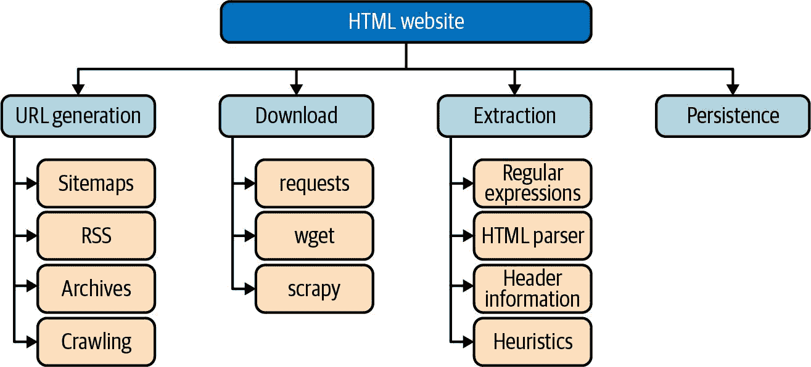
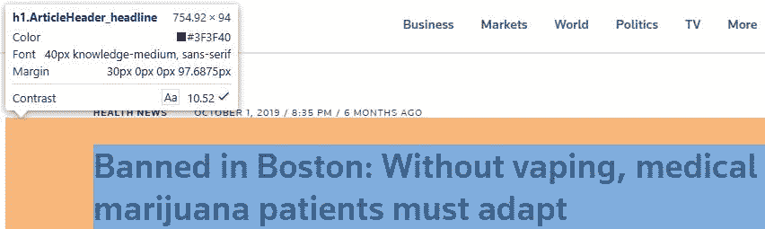
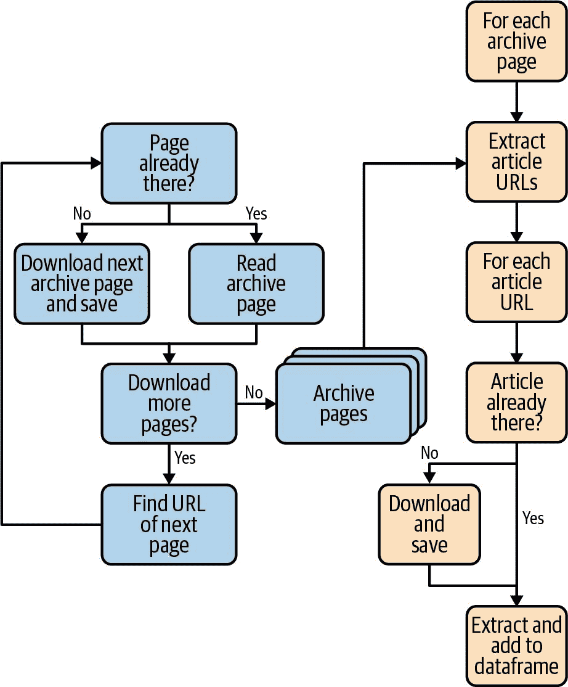

# 第三章：网站抓取和数据提取

经常会发生这样的情况，你访问一个网站并发现内容很有趣。如果只有几页，可能可以自己阅读所有内容。但是一旦有大量内容，就不可能自己阅读所有内容了。

要使用本书描述的强大文本分析蓝图，首先必须获取内容。大多数网站不会有“下载所有内容”按钮，因此我们必须找到一个巧妙的方法来下载（“抓取”）页面。

通常我们主要对每个网页的内容部分感兴趣，对导航等不太感兴趣。一旦我们在本地有了数据，我们可以使用强大的提取技术来将页面分解为标题、内容以及一些元信息（发布日期、作者等）。

# 你将学到的内容及我们将要构建的东西

在本章中，我们将向你展示如何从网站获取 HTML 数据，并使用强大的工具从这些 HTML 文件中提取内容。我们将以一个特定数据源，路透社新闻存档中的内容为例。

在第一步中，我们将下载单个 HTML 文件，并使用不同的方法从每个文件中提取数据。

通常你不会对单个页面感兴趣。因此，我们将建立一个蓝图解决方案。我们将下载并分析一个新闻存档页面（其中包含所有文章的链接）。完成后，我们将知道所引用文档的 URL。然后你可以下载这些 URL 的文档并提取它们的内容到 Pandas 的`DataFrame`中。

学习完本章后，你将对下载 HTML 和提取数据的方法有一个很好的概述。你将熟悉 Python 提供的不同内容提取方法。我们将看到一个完整的示例，用于下载和提取数据。对于你自己的工作，你将能够选择一个合适的框架。在本章中，我们将提供用于提取经常使用的元素的标准蓝图，你可以重复使用。

# 抓取和数据提取

网站抓取是一个复杂的过程，通常包括三个不同阶段，如图 3-1 所示。



###### 图 3-1。抓取过程概述。

在第一步中，我们必须生成网站所有有趣的 URL。然后，我们可以使用不同的工具从相应的 URL 下载页面。最后，我们将从下载的页面中提取“净”数据；在此阶段我们也可以使用不同的策略。当然，永久保存提取的数据是至关重要的。在本章中，我们使用 Pandas 的`DataFrame`，它提供了各种持久化机制。

# 介绍路透社新闻存档

假设我们对分析当前和过去的政治局势感兴趣，并正在寻找适当的数据集。我们希望找到一些趋势，揭示一个词或主题何时首次引入等等。为此，我们的目标是将文档转换为一个 Pandas `DataFrame`。

显然，新闻头条和文章非常适合作为这些需求的数据库。如果可能的话，我们应该找到一个档案，可以追溯几年，甚至几十年。

一些报纸拥有这样的档案，但大多数也会有一定的政治偏见，如果可能的话，我们希望避免这种情况。我们正在寻找尽可能中立的内容。

这就是我们决定使用路透社新闻档案的原因。路透社是一家国际新闻组织，作为新闻机构运作；换句话说，它向许多不同的出版物提供新闻。它成立了一百多年，档案中有大量新闻文章。由于许多原因，它是内容的良好来源：

+   它在政治上是中立的。

+   它拥有大量的新闻档案。

+   新闻文章被分类在不同的部分中。

+   焦点不在于特定的地区。

+   几乎每个人都会在那里找到一些有趣的头条新闻。

+   它对下载数据有宽松的政策。

+   它的连接速度非常快。

# URL 生成

要从路透社档案下载内容，我们需要知道内容页面的 URL。一旦知道了 URL，下载本身就很容易，因为有强大的 Python 工具可以实现这一点。

乍一看，找到网址似乎很容易，但实际上往往并非如此简单。这个过程称为*URL 生成*，在许多爬行项目中，这是最困难的任务之一。我们必须确保不会系统性地错过网址；因此，在开始时仔细思考这个过程至关重要。如果正确执行，URL 生成也可以节省大量时间。

# 在下载之前

注意：有时下载数据是非法的。规则和法律情况可能取决于数据托管的国家及其下载到的国家。通常，网站会有一个名为“使用条款”或类似的页面，值得一看。

如果数据只是临时保存，同样的规则也适用于搜索引擎。就像 Google 等搜索引擎无法阅读和理解它们索引的每一页的使用条款一样，有一个非常老的协议称为[robots 排除标准](https://oreil.ly/IWysG)。使用这个的网站在顶级有一个名为*robots.txt*的文件。这个文件可以自动下载和解释。对于单个网站，也可以手动读取并解释数据。经验法则是，如果没有`Disallow: *`，你应该被允许下载和（暂时）保存内容。

有许多不同的可能性：

爬取

从网站的主页（或某一部分）开始，下载同一网站上的所有链接。爬行可能需要一些时间。

URL 生成器

编写一个 URL 生成器是一个稍微复杂一点的解决方案。这在像论坛、博客等分级组织内容的地方最为适用。

搜索引擎

请求搜索引擎获取特定的 URL，并仅下载这些特定的 URL。

网站地图

一个名为[*sitemap.xml*](https://oreil.ly/XANO0)的标准，最初是为搜索引擎而设计的，是一个有趣的替代方案。一个名为 *sitemap.xml* 的文件包含网站上所有页面的列表（或子站点的引用）。与 *robots.txt* 相反，文件名并非固定，有时可以在 *robots.txt* 中找到。最好的猜测是在网站的顶级目录中查找 *sitemap.xml*。

RSS

[RSS 格式](https://oreil.ly/_aOOM)最初是为新闻订阅而设计，并且仍然广泛用于订阅内容频繁变化的来源。它通过 XML 文件工作，不仅包含 URL，还包括文档标题，有时还有文章摘要。

专业程序

通过使用在 GitHub 上可用的专门程序（如 [Facebook 聊天下载器](https://oreil.ly/ThyNf) 用于 Facebook 聊天，[Instaloader](https://oreil.ly/utGsC) 用于 Instagram 等），简化从社交网络和类似内容的下载数据。

在以下各节中，我们将重点放在 *robots.txt*、*sitemaps.xml* 和 RSS 订阅上。本章稍后，我们将展示使用 URL 生成器的多阶段下载。

# 注意：如果有 API 可用，请使用 API 下载数据

使用 API 而不是生成 URL、下载内容和提取内容，更简单且更稳定。关于此，您将在 第二章 中找到更多信息。

# 蓝图：下载和解释 robots.txt

在网站上找到内容通常并不那么容易。为了看到前面提到的技术实际操作，我们将查看 Reuters 新闻档案。当然，（几乎）任何其他网站都会以类似的方式工作。

正如讨论的，[*robots.txt*](https://www.reuters.com/robots.txt) 是一个很好的起点：

```py
# robots_allow.txt for www.reuters.com
# Disallow: /*/key-developments/article/*

User-agent: *
Disallow: /finance/stocks/option
[...]
Disallow: /news/archive/commentary

SITEMAP: https://www.reuters.com/sitemap_index.xml
SITEMAP: https://www.reuters.com/sitemap_news_index.xml
SITEMAP: https://www.reuters.com/sitemap_video_index.xml
SITEMAP: https://www.reuters.com/sitemap_market_index.xml
SITEMAP: https://www.reuters.com/brandfeature/sitemap

User-agent: Pipl
Disallow: /
[...]

```

有些用户代理程序不被允许下载任何内容，但其他用户可以这样做。我们可以用 Python 程序来检查这一点：

```py
import urllib.robotparser
rp = urllib.robotparser.RobotFileParser()
rp.set_url("https://www.reuters.com/robots.txt")
rp.read()
rp.can_fetch("*", "https://www.reuters.com/sitemap.xml")

```

`Out:`

```py
True

```

# 蓝图：从 sitemap.xml 查找 URL

Reuters 甚至友好地提到了新闻 [站点地图](https://reuters.com/sitemap_news_index.xml) 的 URL，实际上只包含对 [其他站点地图文件](https://www.reuters.com/sitemap_news_index1.xml) 的引用。让我们下载它。撰写时的节选如下：¹

```py
[...]
<url>
  <loc>https://www.reuters.com/article/
us-health-vaping-marijuana-idUSKBN1WG4KT</loc>
  <news:news>
    <news:publication>
      <news:name>Reuters</news:name>
      <news:language>eng</news:language>
    </news:publication>
    <news:publication_date>2019-10-01T08:37:37+00:00</news:publication_date>
    <news:title>Banned in Boston: Without vaping, medical marijuana patients
               must adapt</news:title>
    <news:keywords>Headlines,Credit RSS</news:keywords>
  </news:news>
</url>
[...]

```

最有趣的部分是带有 `<loc>` 的行，因为它包含文章的 URL。过滤掉所有这些 `<loc>` 行将导致一个可以随后下载的新闻文章 URL 列表。

由于 Python 拥有一个非常丰富的库生态系统，找到一个站点地图解析器并不难。有几种可用，比如[`ultimate-sitemap-parser`](https://oreil.ly/XgY9z)。然而，这种解析器下载整个站点地图层次结构，对于我们来说有点过于复杂，因为我们只需 URL。

将*sitemap.xml*转换为 Python 中称为`dict`的关联数组（哈希）非常容易：²

```py
import xmltodict
import requests

sitemap = xmltodict.parse(requests.get(
          'https://www.reuters.com/sitemap_news_index1.xml').text)

```

让我们在实际下载文件之前检查一下`dict`中有什么内容³：

```py
urls = [url["loc"] for url in sitemap["urlset"]["url"]]
# just print the first few URLs to avoid using too much space
print("\n".join(urls0:3))

```

`Out:`

```py
https://www.reuters.com/article/us-japan-fukushima/ex-tepco-bosses-cleared-
over-fukushima-nuclear-disaster-idUSKBN1W40CP
https://www.reuters.com/article/us-global-oil/oil-prices-rise-as-saudi-supply-
risks-come-into-focus-idUSKBN1W405X
https://www.reuters.com/article/us-saudi-aramco/iran-warns-against-war-as-us-
and-saudi-weigh-response-to-oil-attack-idUSKBN1W40VN

```

我们将在下一节中使用这些 URL 列表并下载它们的内容。

# 蓝图：从 RSS 中找到 URL

由于路透社是一个新闻网站，它也通过 RSS 提供其文章的访问。几年前，如果你可以订阅这个源，浏览器会在 URL 旁边显示一个 RSS 图标。虽然那些日子已经过去，但现在仍然不难找到 RSS 源的 URL。在网站底部，我们可以看到一行带有导航图标的内容，如图 3-2 所示。

⁴，在 Python 中可以轻松解析如下：

```py
import feedparser
feed = feedparser.parse('http://feeds.reuters.com/Reuters/worldNews')

```

RSS 文件的具体格式可能因网站而异。然而，大多数情况下，我们会找到标题和链接作为字段⁵：

```py
[(e.title, e.link) for e in feed.entries]

```

`Out:`

```py
[('Cambodian police search for British woman, 21, missing from beach',
  'http://feeds.reuters.com/~r/Reuters/worldNews/~3/xq6Hy6R9lxo/cambodian-
police-search-for-british-woman-21-missing-from-beach-idUSKBN1X70HX'),
 ('Killing the leader may not be enough to stamp out Islamic State',
  'http://feeds.reuters.com/~r/Reuters/worldNews/~3/jbDXkbcQFPA/killing-the-
leader-may-not-be-enough-to-stamp-out-islamic-state-idUSKBN1X7203'), [...]
]

```

在我们的情况下，我们更感兴趣的是包含在`id`字段中的“真实”URL：

```py
[e.id for e in feed.entries]

```

`Out:`

```py
['https://www.reuters.com/article/us-cambodia-britain-tourist/cambodian-
police-search-for-british-woman-21-missing-from-beach-
idUSKBN1X70HX?feedType=RSS&feedName=worldNews',
 'https://www.reuters.com/article/us-mideast-crisis-baghdadi-future-analys/
killing-the-leader-may-not-be-enough-to-stamp-out-islamic-state-
idUSKBN1X7203?feedType=RSS&feedName=worldNews',
 'https://www.reuters.com/article/us-britain-eu/eu-approves-brexit-delay-
until-january-31-as-pm-johnson-pursues-election-
idUSKBN1X70NT?feedType=RSS&feedName=worldNews', [...]
]

```

太好了，我们找到了一种替代方法，可以在没有*sitemap.xml*的情况下获取 URL 列表。

有时你仍会遇到所谓的[*Atom feeds*](https://oreil.ly/Jcdgi)，它们基本上以不同的格式提供与 RSS 相同的信息。

如果你想要实现一个网站监控工具，定期查看路透社新闻（或其他新闻源）或 RSS（或 Atom）是一个不错的方法。

如果你对整个网站感兴趣，寻找*sitemap.xml*是一个绝佳的主意。有时可能会很难找到（提示可能在*robots.txt*中），但多数情况下额外努力去找它几乎总是值得的。

如果找不到*sitemap.xml*并且你计划定期下载内容，那么转向 RSS 是一个很好的第二选择。

在可能的情况下，尽量避免对 URL 进行爬取。这个过程很难控制，可能需要很长时间，并且可能得到不完整的结果。

# 下载数据

乍一看，下载数据可能看起来是网页抓取过程中最困难和耗时的部分。通常情况下，并非如此，因为您可以以高度标准化的方式完成它。

在本节中，我们展示了使用 Python 库和外部工具下载数据的不同方法。特别是对于大型项目，使用外部程序具有一些优势。

与几年前相比，今天的互联网速度快得多。大型网站已经通过使用内容交付网络做出了反应，这可以将它们的速度提高几个数量级。这对我们非常有帮助，因为实际的下载过程并不像过去那样慢，而是更多地受限于我们自己的带宽。

# 蓝图：使用 Python 下载 HTML 页面

要下载 HTML 页面，需要知道 URL。正如我们所见，URL 包含在站点地图中。让我们使用这个列表来下载内容：

```py
%%time
s = requests.Session()
for url in urls[0:10]:
    # get the part after the last / in URL and use as filename
    file = url.split("/")[-1]

    r = s.get(url)
    if r.ok:
        with open(file, "w+b") as f:
            f.write(r.text.encode('utf-8'))
    else:
        print("error with URL %s" % url)

```

`Out:`

```py
CPU times: user 117 ms, sys: 7.71 ms, total: 124 ms
Wall time: 314 ms

```

根据您的互联网连接速度不同，可能需要更长时间，但下载速度相当快。通过使用会话抽象，我们通过利用保持活动状态、SSL 会话缓存等来确保最大速度。

# 在下载 URL 时使用适当的错误处理

下载 URL 时，您正在使用网络协议与远程服务器通信。可能会发生许多种错误，例如 URL 更改、服务器未响应等。这个例子只是显示了一个错误消息；在实际生活中，您的解决方案可能需要更加复杂。

# 蓝图：使用 wget 下载 HTML 页面

用于大规模下载页面的好工具是[wget](https://oreil.ly/wget)，这是一个几乎所有平台都可用的命令行工具。在 Linux 和 macOS 上，`wget`应该已经安装或可以通过包管理器轻松安装。在 Windows 上，可以在[*https://oreil.ly/2Nl0b*](https://oreil.ly/2Nl0b)获取到一个端口。

`wget`支持 URL 列表进行下载和 HTTP 保持活动状态。通常，每个 HTTP 请求需要单独的 TCP 连接（或 Diffie-Hellman 密钥交换；参见“高效下载的技巧”）。`wget`的`-nc`选项将检查文件是否已经下载过。这样，我们可以避免重复下载内容。现在我们随时可以停止进程并重新启动而不会丢失数据，这在 Web 服务器阻止我们、互联网连接中断等情况下非常重要。让我们将上一个蓝图中的 URL 列表保存到文件中，并将其用作下载的模板：

```py
with open("urls.txt", "w+b") as f:
    f.write("\n".join(urls).encode('utf-8'))

```

现在去你的命令行（或 Jupyter 中的终端标签）并调用`wget`：

```py
wget -nc -i urls.txt

```

`-i`选项告诉`wget`要下载的 URL 列表。看到`wget`由于`-nc`选项跳过现有文件（很有趣）以及下载速度的快慢。

`wget`也可以用于递归下载网站，使用选项`-r`。

# 锁定的危险！

要小心，这可能导致长时间运行的进程，最终可能导致您被锁定在网站外。在尝试递归下载时，将`-r`与`-l`（递归级别）结合使用通常是一个好主意。

有几种不同的下载数据的方式。对于中等数量的页面（如几百到一千页），直接在 Python 程序中下载是标准的方式。我们推荐使用`requests`库，因为它易于使用。

下载超过几千页通常最好通过多阶段过程来完成，首先生成 URL 列表，然后通过专用程序（如`wget`）在外部下载它们。

# 提取半结构化数据

在接下来的部分中，我们将探讨从路透社文章中提取数据的不同方法。我们将从使用正则表达式开始，然后转向完整的 HTML 解析器。

最终我们将对多篇文章的数据感兴趣，但作为第一步，我们将集中精力在一篇文章上。让我们以[“波士顿禁用：没有电子烟，医用大麻患者必须适应”](https://oreil.ly/jg0Jr)为例。

# 蓝图：使用正则表达式提取数据

浏览器将是剖析文章的最重要工具之一。首先打开 URL 并使用“查看源代码”功能。在第一步中，我们可以看到标题很有趣。查看 HTML，标题被`<title>`和`<h1>`包围。

```py
[...]
<title>Banned in Boston: Without vaping, medical marijuana patients
must adapt - Reuters</title>
[...]
<h1 class="ArticleHeader_headline">Banned in Boston: Without vaping,
medical marijuana patients must adapt</h1>
[...]

```

# HTML 代码随时间变化

本节描述的程序使用了在撰写本书时当前的 HTML 代码。但是，出版商可以随时更改其网站结构甚至删除内容。一个替代方法是使用来自[网络档案馆](https://archive.org)的数据。路透社网站在那里被镜像，快照被保留以保持布局和 HTML 结构。

还要查看该书的 GitHub 存档。如果布局发生了变化，并且程序无法再正常工作，那里将提供替代链接（和网站地图）。

通过正则表达式，可以以编程方式提取标题而无需使用其他库。让我们首先下载文章并将其保存到名为*us-health-vaping-marijuana-idUSKBN1WG4KT.html*的本地文件中。

```py
import requests

url = 'https://www.reuters.com/article/us-health-vaping-marijuana-idUSKBN1WG4KT'

# use the part after the last / as filename
file = url.split("/")[-1] + ".html"
r = requests.get(url)
with open(file, "w+b") as f:
    f.write(r.text.encode('utf-8'))

```

提取标题的 Python 蓝图可能如下所示：

```py
import re

with open(file, "r") as f:
  html = f.read()
  g = re.search(r'<title>(.*)</title>', html, re.MULTILINE|re.DOTALL)
  if g:
    print(g.groups()[0])

```

`输出：`

```py
Banned in Boston: Without vaping, medical marijuana patients must adapt - Reuters

```

`re`库没有完全整合到 Python 字符串处理中。换句话说，它不能作为字符串的方法调用。由于我们的 HTML 文档由许多行组成，因此我们必须使用`re.MULTILINE|re.DOTALL`。有时需要级联调用`re.search`，但这确实使代码难以阅读。

在 Python 中，使用`re.search`而不是`re.match`至关重要，这与许多其他编程语言不同。后者试图匹配整个字符串，并且由于在`<title>`之前和`</title>`之后有数据，它会失败。

# 蓝图：使用 HTML 解析器进行提取

文章还有更多有趣的部分，使用正则表达式提取起来很繁琐。在文章中有文本，与之相关的出版日期以及作者的名称。使用 HTML 解析器（⁶）可以更容易地实现这一点。幸运的是，Python 包 Beautiful Soup 可以很好地处理这些任务。如果尚未安装 Beautiful Soup，请使用`pip install bs4`或`conda install bs4`进行安装。Beautiful Soup 很宽容，也可以解析通常在管理不善的网站上找到的“不良”HTML。

接下来的几节利用了新闻档案中所有文章具有相同的结构这一事实。幸运的是，这对大多数大型网站来说是真实的，因为这些页面不是手工制作的，而是由内容管理系统从数据库生成的。

### 提取标题/头条

在 Beautiful Soup 中选择内容使用所谓的选择器，在 Python 程序中需要提供这些选择器。找到它们有些棘手，但有结构化的方法可以解决。几乎所有现代浏览器都支持 Web Inspector，用于查找 CSS 选择器。在加载文章时在浏览器中打开 Web Inspector（通常按 F12 键即可），然后单击 Web Inspector 图标，如图 3-3 所示。


###### 图 3-3\. Chrome 浏览器中的 Web Inspector 图标。

悬停在标题上，您将看到相应的元素突出显示，如图 3-4 所示。



###### 图 3-4\. 使用 Web Inspector 的 Chrome 浏览器。

单击标题以在 Web Inspector 中显示它。它应该看起来像这样：

```py
<h1 class="ArticleHeader_headline">Banned in Boston: Without vaping, medical
marijuana patients must adapt</h1>

```

使用 CSS 表示法，⁷可以通过`h1.ArticleHeader_headline`选择此元素。Beautiful Soup 理解到：

```py
from bs4 import Beautiful Soup
soup = Beautiful Soup(html, 'html.parser')
soup.select("h1.ArticleHeader_headline")

```

`Out:`

```py
[<h1 class="ArticleHeader_headline">Banned in Boston: Without vaping, medical
marijuana patients must adapt</h1>]

```

Beautiful Soup 使得这更加简单，让我们可以直接使用标签名：

```py
soup.h1

```

`Out:`

```py
<h1 class="ArticleHeader_headline">Banned in Boston: Without vaping, medical
marijuana patients must adapt</h1>

```

通常，前一个 HTML 片段中最有趣的部分是没有 HTML 混杂物围绕的真实文本。Beautiful Soup 可以提取这部分内容：

```py
soup.h1.text

```

`Out:`

```py
'Banned in Boston: Without vaping, medical marijuana patients must adapt'

```

请注意，与正则表达式解决方案相比，Beautiful Soup 已经去除了不必要的空格。

不幸的是，这对标题的效果不太好：

```py
soup.title.text

```

`Out:`

```py
'\n                Banned in Boston: Without vaping, medical marijuana patients
must adapt - Reuters'

```

在这里，我们需要手动剥离数据并消除`- Reuters`后缀。

### 提取文章正文

与之前描述的查找标题选择器的过程类似，您可以轻松找到选择器`div.StandardArticleBody_body`中的文本内容。在使用`select`时，Beautiful Soup 返回一个列表。从底层的 HTML 结构可以明显看出，该列表仅包含一个项目，或者我们只对第一个元素感兴趣。在这里我们可以使用方便的方法`select_one`：

```py
soup.select_one("div.StandardArticleBody_body").text

```

`Out:`

```py
"WASHINGTON (Reuters) - In the first few days of the four-month ban [...]"

```

### 提取图像标题

但是，请注意，除了文本之外，此部分还包含带有可能单独相关的标题的图片。因此，再次使用 Web Inspector 悬停在图片上并找到相应的 CSS 选择器。所有图片都包含在 `<figure>` 元素中，因此让我们选择它们：

```py
soup.select("div.StandardArticleBody_body figure img")

```

`Out:`

```py
[, ]

```

仔细检查结果，此代码仅包含一个图像，而浏览器显示许多图像。这是在网页中经常可以找到的一种模式。图像的代码不在页面本身中，而是由客户端 JavaScript 后添加。技术上这是可能的，尽管不是最佳的风格。从内容的角度来看，如果图像源包含在原始生成的服务器页面中，并通过 CSS 后来可见，那将更好。这也将有助于我们的提取过程。总之，我们更感兴趣的是图像的标题，因此正确的选择器应该是将 `img` 替换为 `figcaption`。

```py
soup.select("div.StandardArticleBody_body figcaption")

```

`Out:`

```py
[<figcaption><div class="Image_caption"><span>FILE PHOTO:
  An employee puts down an eighth of an ounce marijuana after letting a
  customer smell it outside the Magnolia cannabis lounge in Oakland,
  California, U.S. April 20, 2018. REUTERS/Elijah Nouvelage</span></
  div></figcaption>,

 <figcaption class="Slideshow_caption">Slideshow<span class="Slideshow_count">
  (2 Images)</span></figcaption>]

```

### 提取 URL

在下载许多 HTML 文件时，如果它们未单独保存，通常很难找到文件的原始 URL。此外，URL 可能会更改，通常最好使用标准的（称为 *canonical*）URL。幸运的是，有一个 HTML 标签称为 `<link rel="canonical">`，可以用于此目的。该标签不是强制性的，但它非常常见，因为搜索引擎也会考虑它，有助于良好的排名：

```py
soup.find("link", {'rel': 'canonical'})['href']

```

`Out:`

```py
'https://www.reuters.com/article/us-health-vaping-marijuana-idUSKBN1WG4KT'

```

### 提取列表信息（作者）

查看源代码，文章的作者在 `<meta name="Author">` 标签中提到。

```py
soup.find("meta", {'name': 'Author'})['content']

```

`Out:`

```py
'Jacqueline Tempera'

```

然而，这只返回了一个作者。阅读文本，还有另一个作者，但不幸的是，这并未包含在页面的元信息中。当然，可以通过在浏览器中选择元素并使用 CSS 选择器再次提取：

```py
sel = "div.BylineBar_first-container.ArticleHeader_byline-bar \
 div.BylineBar_byline span"
soup.select(sel)

```

`Out:`

```py
[<span><a href="/journalists/jacqueline-tempera" target="_blank">
  Jacqueline Tempera</a>, </span>,
 <span><a href="/journalists/jonathan-allen" target="_blank">
  Jonathan Allen</a></span>]

```

提取作者姓名非常直接：

```py
[a.text for a in soup.select(sel)]

```

`Out:`

```py
['Jacqueline Tempera, ', 'Jonathan Allen']

```

### 语义和非语义内容

与前面的例子相比，`sel` 选择器不是 *语义* 的。选择是基于布局类似的类。目前这种方式效果不错，但如果布局改变，很可能会出现问题。因此，如果代码不仅仅是一次性或批处理运行，而且将来还应该运行，则最好避免这些类型的选择。

### 提取链接的文本（章节）

这一部分很容易提取。再次使用 Web Inspector，我们可以找到以下 CSS 选择器：

```py
soup.select_one("div.ArticleHeader_channel a").text

```

`Out:`

```py
'Politics'

```

### 提取阅读时间

通过 Web Inspector 可以轻松找到阅读时间：

```py
soup.select_one("p.BylineBar_reading-time").text

```

`Out:`

```py
'6 Min Read'

```

### 提取属性（ID）

拥有唯一标识文章的主键是有帮助的。ID 也出现在 URL 中，但可能需要一些启发式和高级分割才能找到它。使用浏览器的查看源代码功能并搜索此 ID，我们看到它是文章容器的 `id` 属性：

```py
soup.select_one("div.StandardArticle_inner-container")['id']

```

`Out:`

```py
'USKBN1WG4KT'

```

### 提取归属信息

除了作者外，文章还有更多的归属。它们可以在文本末尾找到，并放置在一个特殊的容器中：

```py
soup.select_one("p.Attribution_content").text

```

`Out:`

```py
'Reporting Jacqueline Tempera in Brookline and Boston, Massachusetts, and
Jonathan Allen in New York; Editing by Frank McGurty and Bill Berkrot'

```

### 提取时间戳

对于许多统计目的来说，知道文章发布的时间非常关键。这通常在部分旁边提到，但不幸的是它是以人类可读的方式构建的（如“3 天前”）。这可以被解析，但很繁琐。知道真实的发布时间后，可以在 HTML 头元素中找到正确的元素：

```py
ptime = soup.find("meta", { 'property': "og:article:published_time"})['content']
print(ptime)

```

`Out:`

```py
2019-10-01T19:23:16+0000

```

一个字符串已经很有帮助了（特别是在后面我们将看到的表示法中），但 Python 提供了将其轻松转换为日期时间对象的功能：

```py
from dateutil import parser
parser.parse(ptime)

```

`Out:`

```py
datetime.datetime(2019, 10, 1, 19, 23, 16, tzinfo=tzutc())

```

如果更相关的话，也可以对`modified_time`而不是`published_time`执行相同操作。

仅使用正则表达式进行粗略提取。HTML 解析器速度较慢，但使用起来更加简单且更稳定。

通常，查看文档的语义结构并使用具有语义类名的 HTML 标签是有意义的，以找到结构元素的值。这些标签的优势在于它们在大量网页上都是相同的。因此，只需要实现一次其内容的提取，就可以重复使用。

除了极端简单的情况外，尽量在可能的情况下使用 HTML 解析器。以下侧栏讨论了几乎在任何 HTML 文档中都可以找到的一些标准结构。

# 蓝图：爬虫

到目前为止，我们已经看过如何下载网页并使用 HTML 解析技术提取内容。从业务角度来看，查看单个页面通常并不那么有趣，但是你想要看到整体图片。为此，你需要更多的内容。

幸运的是，我们掌握的知识可以结合起来下载内容档案或整个网站。这通常是一个多阶段的过程，首先需要生成 URL，下载内容，找到更多 URL，依此类推。

本节详细解释了其中一个这样的“爬虫”示例，并创建了一个可扩展的蓝图，可用于下载成千上万（甚至百万）页。

## 引入使用案例

解析单个路透社文章是一个不错的练习，但路透社档案规模更大，包含许多文章。也可以使用我们已经涵盖的技术来解析更多内容。想象一下，你想要下载和提取，例如，一个带有用户生成内容的整个论坛或一个包含科学文章的网站。正如之前提到的，通常最难找到正确的文章 URL。

不过在这种情况下并非如此。可以使用*sitemap.xml*，但路透社慷慨地提供了一个专门的存档页面[*https://www.reuters.com/news/archive*](https://www.reuters.com/news/archive/)。还提供了分页功能，因此可以向前回溯时间。

图 3-5 展示了下载存档部分（称为*爬虫*）的步骤。该过程如下：

1.  定义应下载存档的页数。

1.  将存档的每一页下载到名为*page-000001.html*、*page-000002.html*等文件中，以便更轻松地检查。如果文件已经存在，则跳过此步骤。

1.  对于每个*page-*.html*文件，提取引用文章的 URL。

1.  对于每个文章的网址，将文章下载到本地的 HTML 文件中。如果文章文件已经存在，则跳过此步骤。

1.  对于每个文章文件，提取内容到一个`dict`中，并将这些`dict`组合成一个 Pandas 的`DataFrame`。



###### 图 3-5\. 爬虫流程图。

在更通用的方法中，可能需要在步骤 3 中创建中间网址（如果有年份、月份等的概述页面）才能最终到达文章网址。

该过程的构造方式使得每个步骤都可以单独运行，并且只需要执行一次下载。这被证明非常有用，特别是当我们需要提取大量文章/网址时，因为单个缺失的下载或格式不正确的 HTML 页面并不意味着必须重新开始整个下载过程。此外，该过程随时可以重新启动，并且仅下载尚未下载的数据。这称为*幂等性*，在与“昂贵”的 API 交互时经常是一个有用的概念。

最终的程序看起来是这样的：

```py
import requests
from bs4 import Beautiful Soup
import os.path
from dateutil import parser

def download_archive_page(page):
    filename = "page-%06d.html" % page
    if not os.path.isfile(filename):
        url = "https://www.reuters.com/news/archive/" + \
              "?view=page&page=%d&pageSize=10" % page
        r = requests.get(url)
        with open(filename, "w+") as f:
            f.write(r.text)

def parse_archive_page(page_file):
    with open(page_file, "r") as f:
        html = f.read()

    soup = Beautiful Soup(html, 'html.parser')
    hrefs = ["https://www.reuters.com" + a['href']
               for a in soup.select("article.story div.story-content a")]
    return hrefs

def download_article(url):
    # check if article already there
    filename = url.split("/")[-1] + ".html"
    if not os.path.isfile(filename):
        r = requests.get(url)
        with open(filename, "w+") as f:
            f.write(r.text)

def parse_article(article_file):
    with open(article_file, "r") as f:
        html = f.read()
    r = {}
    soup = Beautiful Soup(html, 'html.parser')
    r['id'] = soup.select_one("div.StandardArticle_inner-container")['id']
    r['url'] = soup.find("link", {'rel': 'canonical'})['href']
    r['headline'] = soup.h1.text
    r['section'] = soup.select_one("div.ArticleHeader_channel a").text    
    r['text'] = soup.select_one("div.StandardArticleBody_body").text
    r['authors'] = [a.text
                    for a in soup.select("div.BylineBar_first-container.\
 ArticleHeader_byline-bar\
                                          div.BylineBar_byline span")]
    r['time'] = soup.find("meta", { 'property':
                                    "og:article:published_time"})['content']
    return r

```

定义了这些函数后，它们可以用参数调用（这些参数可以很容易地更改）：

```py
# download 10 pages of archive
for p in range(1, 10):
    download_archive_page(p)

# parse archive and add to article_urls
import glob

article_urls = []
for page_file in glob.glob("page-*.html"):
    article_urls += parse_archive_page(page_file)

# download articles
for url in article_urls:
    download_article(url)

# arrange in pandas DataFrame
import pandas as pd

df = pd.DataFrame()
for article_file in glob.glob("*-id???????????.html"):
    df = df.append(parse_article(article_file), ignore_index=True)

df['time'] = pd.to_datetime(df.time)

```

## 错误处理和生产质量软件

为简单起见，本章讨论的所有示例程序都不使用错误处理。然而，对于生产软件，应使用异常处理。由于 HTML 可能会经常变化且页面可能不完整，错误可能随时发生，因此大量使用 try/except 并记录错误是一个好主意。如果出现系统性错误，应找出根本原因并消除它。如果错误只是偶尔发生或由于格式不正确的 HTML 导致的，您可能可以忽略它们，因为这可能也是由服务器软件引起的。

使用前面描述的下载和保存文件机制，提取过程随时可以重新启动，也可以单独应用于某些有问题的文件。这通常是一个很大的优势，有助于快速获得干净的提取数据集。

生成 URL 通常与提取内容一样困难，并且经常与之相关。在许多情况下，这必须重复多次以下载例如分层内容。

在下载数据时，始终为每个网址找到一个文件名并保存到文件系统中。你将不得不比你想象中更频繁地重新启动这个过程。避免反复下载所有内容非常有用，特别是在开发过程中。

如果您已经下载并提取了数据，您可能希望将其持久化以供以后使用。一种简单的方法是将其保存在单独的 JSON 文件中。如果您有很多文件，使用目录结构可能是一个不错的选择。随着页面数量的增加，即使这样也可能扩展性不佳，最好使用数据库或其他列存储数据存储解决方案。

# 密度基础文本提取

从 HTML 中提取结构化数据并不复杂，但很繁琐。如果您想从整个网站提取数据，那么值得付出努力，因为您只需针对有限数量的页面类型实施提取。

但是，您可能需要从许多不同的网站提取文本。针对每个网站实施提取并不具有良好的可扩展性。有一些元数据可以很容易找到，比如标题、描述等。但是文本本身并不那么容易找到。

从信息密度的角度来看，有一些启发式方法允许提取文本。其背后的算法测量了*信息密度*，因此自动消除了重复信息，如标题、导航、页脚等。实施起来并不简单，但幸运的是在名为[`python-readability`](https://oreil.ly/AemZh)的库中已经提供了。其名称源自一个现在已经被废弃的浏览器插件 Readability，它的构想是从网页中移除混乱内容，使其易于阅读，这正是这里所需要的。要开始使用，我们首先必须安装`python-readability`（**`pip install readability-lxml`**）。

## 使用 Readability 提取路透社内容

让我们看看这在路透社示例中是如何工作的。我们保留已下载的 HTML，当然您也可以使用文件或 URL：

```py
from readability import Document

doc = Document(html)
doc.title()

```

`Out:`

```py
'Banned in Boston: Without vaping, medical marijuana patients must adapt -
Reuters'

```

如您所见，这很容易。可以通过相应元素提取标题。但是，该库还可以执行一些附加技巧，例如查找页面的标题或摘要：

```py
doc.short_title()

```

`Out:`

```py
'Banned in Boston: Without vaping, medical marijuana patients must adapt'

```

那已经相当不错了。让我们来看看它在实际内容中的表现如何：

```py
doc.summary()

```

`Out:`

```py
'<html><body><div><div class="StandardArticleBody_body"><p>BOSTON (Reuters) -
In the first few days of [...] </p>

<div class="Attribution_container"><div class="Attribution_attribution">
<p class="Attribution_content">Reporting Jacqueline Tempera in Brookline
and Boston, Massachusetts, and Jonathan Allen in New York; Editing by Frank
McGurty and Bill Berkrot</p></div></div></div></div></body></html>'

```

数据仍然保留了一些 HTML 结构，这对于包含段落的部分很有用。当然，可以再次使用 Beautiful Soup 提取正文部分：

```py
density_soup = Beautiful Soup(doc.summary(), 'html.parser')
density_soup.body.text

```

`Out:`

```py
'BOSTON (Reuters) - In the first few days of the four-month ban on all vaping
products in Massachusetts, Laura Lee Medeiros, a medical marijuana patient,
began to worry.\xa0 FILE PHOTO: An employee puts down an eighth of an ounce
marijuana after letting a customer smell it outside the Magnolia cannabis
lounge in Oakland, California, U.S. [...]

Reporting Jacqueline Tempera in Brookline and Boston, Massachusetts, and
Jonathan Allen in New York; Editing by Frank McGurty and Bill Berkrot'

```

在这种情况下，结果是非常好的。在大多数情况下，`python-readability`表现得相当不错，并且避免了实施过多特殊情况的需要。然而，使用此库的成本是不确定性。它是否总是按预期方式工作，例如无法提取结构化数据（如时间戳、作者等）（尽管可能存在其他启发式方法）？

## 摘要 密度基础文本提取

基于密度的文本提取在使用启发式和关于 HTML 页面信息分布的统计信息时非常强大。请记住，与实施特定提取器相比，结果几乎总是更差。但是，如果您需要从许多不同类型的页面或者您根本没有固定布局的存档中提取内容，那么这种方法可能是值得一试的。

与结构化方法相比，执行详细的质量保证工作更加重要，因为启发式和统计方法有时可能会走错方向。

# 一体化方法

[*Scrapy*](https://scrapy.org) 是另一个 Python 包，提供了一体化的爬虫和内容提取方法。其方法与前文描述的方法类似，尽管 Scrapy 更适合下载整个网站，而不仅仅是其中的一部分。

Scrapy 的面向对象、整体方法确实很好，并且代码易读。但是，重新启动爬虫和提取而不必重新下载整个网站确实非常困难。

与前文描述的方法相比，下载还必须在 Python 中进行。对于页面数量庞大的网站，无法使用 HTTP keep-alive，并且 gzip 编码也很困难。这两者可以通过像 wget 这样的工具在模块化方法中轻松集成外部下载。

# 蓝图：使用 Scrapy 爬取路透社存档

让我们看看如何在 Scrapy 中下载存档和文章。请继续安装 Scrapy（可以通过 **`conda install scrapy`** 或 **`pip install scrapy`** 进行安装）。

```py
import scrapy
import logging

class ReutersArchiveSpider(scrapy.Spider):
    name = 'reuters-archive'

    custom_settings = {
        'LOG_LEVEL': logging.WARNING,
        'FEED_FORMAT': 'json',
        'FEED_URI': 'reuters-archive.json'
    }

    start_urls = [
        'https://www.reuters.com/news/archive/',
    ]

    def parse(self, response):
        for article in response.css("article.story div.story-content a"):
            yield response.follow(article.css("a::attr(href)").extract_first(),
                                  self.parse_article)
        next_page_url = response.css('a.control-nav-next::attr(href)').\
                        extract_first()
        if (next_page_url is not None) & ('page=2' not in next_page_url):
            yield response.follow(next_page_url, self.parse)

    def parse_article(self, response):
        yield {
          'title': response.css('h1::text').extract_first().strip(),
          'section': response.css('div.ArticleHeader_channel a::text').\
                     extract_first().strip(),
          'text': "\n".join(response.\
                  css('div.StandardArticleBody_body p::text').extract())
        }

```

Scrapy 以面向对象的方式工作。对于每个所谓的 spider，都需要实现一个从 `scrapy.Spider` 派生的类。Scrapy 添加了大量的调试输出，在上一个示例中通过 `logging.WARNING` 进行了减少。基类自动使用 `start_urls` 调用解析函数 `parse`。该函数提取文章的链接并调用 `parse_article` 函数进行 `yield`。该函数又从文章中提取一些属性并以 `dict` 形式 `yield` 返回。最后，爬取下一页的链接，但在获取第二页之前停止。

`yield` 在 Scrapy 中有双重功能。如果 `yield` 一个 `dict`，它将被添加到结果中。如果 `yield` 一个 `Request` 对象，则会获取并解析该对象。

# Scrapy 和 Jupyter

Scrapy 优化用于命令行使用，但也可以在 Jupyter 笔记本中调用。由于 Scrapy 使用了（古老的） [Twisted 环境](https://oreil.ly/j6HCm)，所以在笔记本中无法重新启动爬取，因此您只有一次机会（否则必须重新启动笔记本）：

```py
# this can be run only once from a Jupyter notebook
# due to Twisted
from scrapy.crawler import CrawlerProcess
process = CrawlerProcess()

process.crawl(ReutersArchiveSpider)
process.start()

```

以下是一些值得一提的事情：

+   一体化方法看起来既优雅又简洁。

+   由于大部分编码都花在提取文章数据上，这些代码必须经常更改。为此，必须重新启动爬虫（如果在 Jupyter 中运行脚本，则还必须启动 Jupyter 笔记本服务器），这极大地增加了周转时间。

+   JSON 可以直接生成是件好事。请注意，由于 JSON 文件是追加的，如果在启动爬虫进程之前不删除文件，可能会导致无效的 JSON。这可以通过使用所谓的 jl 格式（JSON 行）来解决，但这只是一个变通方法。

+   Scrapy 提出了一些不错的想法。在我们的日常工作中，我们并不使用它，主要是因为调试很困难。如果需要持久化 HTML 文件（我们强烈建议这样做），它会失去很多优势。面向对象的方法很有用，可以在不用太多精力的情况下在 Scrapy 之外实现。

由于 Scrapy 也使用 CSS 选择器来提取 HTML 内容，基本技术与其他方法相同。不过，在下载方法上有相当大的差异。由于 Twisted 作为后端，会产生一些额外开销，并施加特殊的编程模型。

仔细考虑是否适合您项目需求的一体化方法。对于某些网站，可能已经有现成的 Scrapy 爬虫可供使用和重用。

# 爬取可能遇到的问题

在爬取内容之前，考虑可能的版权和数据保护问题总是值得的。

越来越多的 Web 应用程序使用像 [React](https://reactjs.org) 这样的框架构建。它们只有一个单页面，并通过 API 传输数据。这通常导致禁用 JavaScript 后网站无法工作。有时，专门为搜索引擎构建的特定 URL 对于爬取也很有用。通常可以在 *sitemap.xml* 中找到这些内容。您可以尝试在浏览器中关闭 JavaScript，然后查看网站是否仍然可用。

如果需要 JavaScript，可以通过使用浏览器的 Web Inspector 在 Network 标签中查找请求，并在应用程序中点击。有时，JSON 用于数据传输，这使得与 HTML 相比提取通常更加容易。但是，仍然需要生成单独的 JSON URL，并可能有额外的参数以避免[跨站请求伪造（CSRF）](https://oreil.ly/_6O_Q)。

请求可能会变得非常复杂，比如在 Facebook 时间线上，Instagram 或 Twitter 上。显然，这些网站试图保留他们的内容，避免被爬取。

对于复杂情况，通过使用 [Selenium](https://oreil.ly/YssLD)（一个最初用于自动化测试 Web 应用程序的框架）或者 [无头浏览器](https://oreil.ly/CH2ZI) 可以“远程控制”浏览器可能很有用。

像 Google 这样的网站会尝试检测自动下载尝试并开始发送验证码。其他网站也可能会发生这种情况。大多数情况下，这与特定的 IP 地址绑定在一起。然后必须使用正常的浏览器“解锁”网站，并且自动请求之间应该发送较长的间隔。

避免内容提取的另一种方法是使用混淆的 HTML 代码，其中 CSS 类的名称完全是随机的。如果名称不变，最初找到正确的选择器可能会更费力，但之后应该会自动运行。如果名称每天都更改（例如），内容提取将变得非常困难。

# 总结与建议

网络抓取是一种强大且可扩展的获取内容的技术。必要的 Python 基础设施以非常出色的方式支持抓取项目。请求库和 Beautiful Soup 的组合很舒适，对于中等规模的抓取工作效果很好。

正如我们在整章中所看到的，我们可以将大型抓取项目系统地分解为 URL 生成和下载阶段。如果文档数量变得非常大，那么与请求相比，外部工具如`wget`可能更合适。一旦所有内容都被下载，就可以使用 Beautiful Soup 来提取内容。

如果想要最小化等待时间，所有阶段都可以并行运行。

无论如何，你都应该了解法律方面的问题，并且要表现得像一个“道德的抓取者”，尊重*robots.txt*中的规则。

¹ 路透社是一个新闻网站，每天都在变化。因此，运行代码时会得到完全不同的结果！

² 你可能需要先用**`pip install xmltodict`**安装该包。

³ 路透社是一个新闻网站，内容不断更新。请注意，你的结果肯定会有所不同！

⁴ 就在撰写本文的时候，路透社停止提供 RSS 源，引发了公众的强烈抗议。我们希望 RSS 源会得到恢复。本章的 Jupyter 笔记本 [在 GitHub 上](https://oreil.ly/Wamlu) 使用了来自互联网档案馆的 RSS 源的存档版本。

⁵ 正如之前所述，路透社是一个动态生成的网站，你的结果会有所不同！

⁶ HTML 不能用[正则表达式](https://oreil.ly/EeCjy)解析。

⁷ 参见 Eric A. Meyer 和 Estelle Weyl 的*CSS：权威指南，第 4 版*（O'Reilly，2017）
