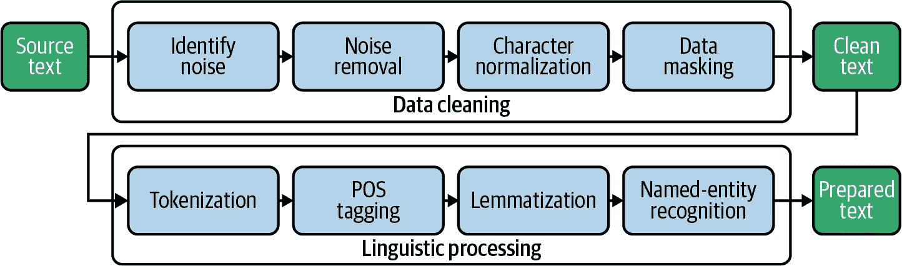
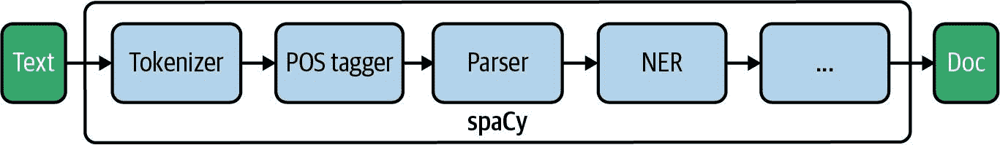
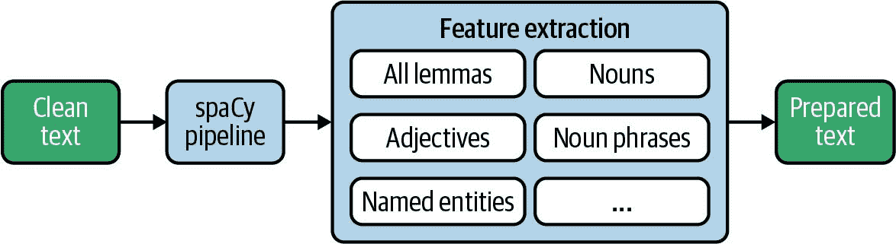
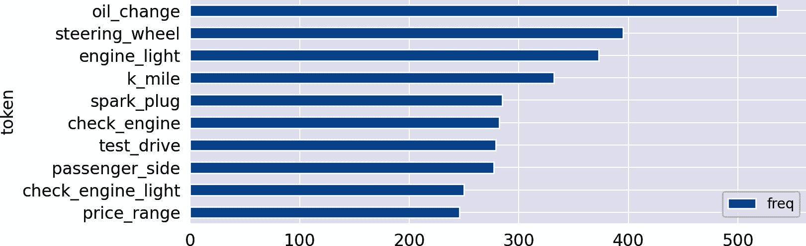

# 第四章。为统计和机器学习准备文本数据

从技术上讲，任何文本文档都只是一系列字符。为了在内容上构建模型，我们需要将文本转换为一系列单词或更一般地说，被称为*标记*的有意义的字符序列。但仅仅这样是不够的。想象一下单词序列*New York*，它应该被视为一个单一的命名实体。正确地识别这样的单词序列作为复合结构需要复杂的语言处理。

数据准备或一般的数据预处理不仅涉及将数据转换为可以用于分析的形式，还涉及消除干扰噪声。什么是噪声，什么不是，这取决于您将要执行的分析。在处理文本时，噪声呈现不同的形式。原始数据可能包括应在大多数情况下移除的 HTML 标记或特殊字符。但是，频繁出现的具有很少含义的单词，所谓的*停用词*，会给机器学习和数据分析引入噪声，因为它们使得检测模式变得更加困难。

# 您将学到什么以及我们将要构建什么

在本章中，我们将为文本预处理流水线开发蓝图。该流水线将接受原始文本作为输入，对其进行清理、转换，并提取文本内容的基本特征。我们首先使用正则表达式进行数据清理和标记化，然后专注于使用*spaCy*进行语言处理。spaCy 是一个功能强大的自然语言处理库，具有现代 API 和最先进的模型。对于一些操作，我们将利用*textacy*，这是一个提供一些很好的附加功能，特别是用于数据预处理的库。我们还会在有需要时指向 NLTK 和其他库。

在学习本章之后，您将了解数据准备的必需和可选步骤。您将学会如何使用正则表达式进行数据清理，以及如何使用 spaCy 进行特征提取。通过提供的蓝图，您将能够快速为自己的项目建立数据准备流水线。

# 数据预处理流水线

数据预处理通常涉及一系列步骤。通常，这个序列被称为*流水线*，因为您将原始数据输入到流水线中，并从中获得转换和预处理后的数据。在第一章中，我们已经构建了一个简单的数据处理流水线，包括标记化和停用词去除。我们将在本章中使用术语*流水线*作为处理步骤序列的通用术语。图 4-1 概述了我们将在本章中为预处理流水线构建的蓝图。



###### 图 4-1。文本数据预处理的典型预处理步骤流水线。

我们管道中的第一个主要操作块是*数据清理*。我们首先识别并删除文本中的噪声，如 HTML 标记和不可打印字符。在*字符标准化*过程中，特殊字符，如重音符号和连字符，被转换为标准表示。最后，如果 URL 或电子邮件地址与分析无关或存在隐私问题，则可以屏蔽或删除它们。现在文本已经清洁到足以开始语言处理了。

这里，*分词* 将文档分割成单独的标记列表，例如单词和标点符号。*词性标注* 是确定词的类别的过程，无论它是名词、动词、冠词等。*词形还原* 将屈折词映射到它们的不变词根，即词素（例如，“are” → “be”）。*命名实体识别* 的目标是在文本中识别对人物、组织、地点等的引用。

最后，我们希望创建一个包含准备好的用于分析和机器学习的数据的数据库。因此，所需的准备步骤因项目而异。您可以决定在问题特定管道中包含哪些以下蓝图。

# 介绍数据集：Reddit 自发帖子

处理文本数据在处理用户生成内容（UGC）时特别具有挑战性。与专业报告、新闻和博客中的精心编辑的文本相比，社交媒体中的用户贡献通常很短，并包含大量缩写、标签、表情符号和拼写错误。因此，我们将使用在 Kaggle 上托管的[Reddit 自发帖子](https://oreil.ly/0pnqO)数据集。完整数据集包含大约 100 万条带有标题和内容的用户帖子，分为 1,013 个不同的子版块，每个子版块包含 1,000 条记录。我们将仅使用汽车类别中包含的 20,000 条帖子的子集。本章准备的数据集是第十章中单词嵌入分析的基础。

## 将数据加载到 Pandas

原始数据集由两个单独的 CSV 文件组成，一个包含帖子，另一个包含一些有关子版块的元数据，包括类别信息。这两个文件都通过 `pd.read_csv()` 加载到 Pandas 的 `DataFrame` 中，然后合并为一个单一的 `DataFrame`。

```py
import pandas as pd

posts_file = "rspct.tsv.gz"
posts_df = pd.read_csv(posts_file, sep='\t')

subred_file = "subreddit_info.csv.gz"
subred_df = pd.read_csv(subred_file).set_index(['subreddit'])

df = posts_df.join(subred_df, on='subreddit')

```

## 蓝图：标准化属性名称

在我们开始处理数据之前，我们将将数据集特定的列名称更改为更通用的名称。我们建议始终将主要的 `DataFrame` 命名为 `df`，并将要分析的文本列命名为 `text`。对于常见变量和属性名称的此类命名约定，使得在不同项目中重用蓝图代码变得更容易。

让我们来看看该数据集的列列表：

```py
print(df.columns)

```

`输出：`

```py
Index(['id', 'subreddit', 'title', 'selftext', 'category_1', 'category_2',
       'category_3', 'in_data', 'reason_for_exclusion'],
      dtype='object')

```

对于列重命名和选择，我们定义一个名为 `column_mapping` 的字典，其中每个条目定义了当前列名到新名称的映射。映射到 `None` 的列和未提及的列将被丢弃。这种转换的字典非常适合文档化并易于重复使用。然后使用这个字典来选择和重命名我们想要保留的列。

```py
column_mapping = {
    'id': 'id',
    'subreddit': 'subreddit',
    'title': 'title',
    'selftext': 'text',
    'category_1': 'category',
    'category_2': 'subcategory',
    'category_3': None, # no data
    'in_data': None, # not needed
    'reason_for_exclusion': None # not needed
}

# define remaining columns
columns = [c for c in column_mapping.keys() if column_mapping[c] != None]

# select and rename those columns
df = df[columns].rename(columns=column_mapping)

```

如前所述，我们将数据限制在汽车类别中：

```py
df = df[df['category'] == 'autos']

```

让我们简要看一下样本记录，以对数据有个初步印象：

```py
df.sample(1).T

```

|  | 14356 |
| --- | --- |
| id | 7jc2k4 |
| subreddit | volt |
| title | 2017 伏特行车记录仪 |
| text | Hello.<lb>我正在考虑购买一款行车记录仪。<lb>有人有推荐吗？<lb><lb>我一般寻找一款可充电的，这样我就不必把电线引到点烟器里去了。<lb>除非有关于如何正确安装不露电线的说明。<lb><lb><lb>谢谢！ |
| category | autos |
| subcategory | chevrolet |

## 保存和加载 DataFrame

在每个数据准备步骤之后，将相应的 `DataFrame` 写入磁盘作为检查点非常有帮助。Pandas 直接支持多种[序列化选项](https://oreil.ly/VaXTx)。像 CSV 或 JSON 这样的文本格式可以轻松导入到大多数其他工具中。然而，数据类型信息丢失（CSV）或仅保存基本信息（JSON）。Python 的标准序列化格式 `pickle` 受到 Pandas 支持，因此是一个可行的选择。它速度快且保留所有信息，但只能由 Python 处理。“Pickling” 一个数据帧很简单；您只需指定文件名：

```py
df.to_pickle("reddit_dataframe.pkl")

```

然而，我们更倾向于将数据帧存储在 SQL 数据库中，因为它们为您提供 SQL 的所有优势，包括过滤、连接和从许多工具轻松访问。但与 `pickle` 不同，只支持 SQL 数据类型。例如，包含对象或列表的列不能简单地以这种方式保存，需要手动序列化。

在我们的示例中，我们将使用 SQLite 来持久化数据帧。SQLite 与 Python 集成良好。此外，它只是一个库，不需要服务器，因此文件是自包含的，并且可以在不同团队成员之间轻松交换。为了更大的功能和安全性，我们建议使用基于服务器的 SQL 数据库。

我们使用 `pd.to_sql()` 将我们的 `DataFrame` 保存为 SQLite 数据库中的 `posts` 表。`DataFrame` 索引不会被保存，任何现有数据都会被覆盖：

```py
import sqlite3

db_name = "reddit-selfposts.db"
con = sqlite3.connect(db_name)
df.to_sql("posts", con, index=False, if_exists="replace")
con.close()

```

可以使用 `pd.read_sql()` 轻松恢复 `DataFrame`：

```py
con = sqlite3.connect(db_name)
df = pd.read_sql("select * from posts", con)
con.close()

```

# 清洁文本数据

当处理用户请求或评论时，相对于精心编辑的文章，通常需要处理一些质量问题：

特殊格式和程序代码

文本可能仍然包含特殊字符、HTML 实体、Markdown 标记等。这些残留物应提前清理，因为它们会复杂化标记化并引入噪音。

问候语、签名、地址等。

个人交流通常包含毫无意义的客套话和称呼姓名的问候语，这些通常对分析无关紧要。

回复

如果你的文本中包含重复问题文本的答案，你需要删除重复的问题。保留它们会扭曲任何模型和统计数据。

在本节中，我们将演示如何使用正则表达式识别和删除数据中的不需要的模式。查看以下侧边栏，获取有关 Python 中正则表达式的更多详细信息。

看看 Reddit 数据集中的以下文本示例：

```py
text = """
After viewing the [PINKIEPOOL Trailer](https://www.youtu.be/watch?v=ieHRoHUg)
it got me thinking about the best match ups.
<lb>Here's my take:<lb><lb>[](/sp)[](/ppseesyou) Deadpool<lb>[](/sp)[](/ajsly)
Captain America<lb>"""

```

如果这段文本经过清理和润色，结果肯定会有所改善。有些标签只是网页抓取的产物，所以我们会将它们清除掉。因为我们对 URL 和其他链接不感兴趣，所以我们也会丢弃它们。

## 蓝图：使用正则表达式识别噪音

在大型数据集中识别质量问题可能会很棘手。当然，你可以并且应该查看一部分数据的样本。但很可能你不会发现所有的问题。更好的方法是定义粗略模式，指示可能存在的问题，并通过程序检查完整数据集。

下面的函数可以帮助您识别文本数据中的噪音。我们所说的*噪音*是指所有非纯文本的东西，可能会干扰进一步的分析。该函数使用正则表达式搜索一些可疑字符，并将它们在所有字符中的份额作为杂质的分数返回。非常短的文本（少于`min_len`个字符）将被忽略，因为在这里，单个特殊字符将导致显著的杂质并扭曲结果。

```py
import re

RE_SUSPICIOUS = re.compile(r'[&#<>{}\[\]\\]')

def impurity(text, min_len=10):
    """returns the share of suspicious characters in a text"""
    if text == None or len(text) < min_len:
        return 0
    else:
        return len(RE_SUSPICIOUS.findall(text))/len(text)

print(impurity(text))

```

`Out:`

```py
0.09009009009009009

```

在精心编辑的文本中，你几乎永远不会找到这些字符，因此通常情况下得分应该非常低。对于前面的文本示例，根据我们的定义，约 9%的字符是“可疑的”。当然，搜索模式可能需要适应包含特殊字符的语料库或类似标记的文本。然而，它不需要完全匹配；它只需要足够好以指示潜在的质量问题。

对于 Reddit 数据，我们可以用以下两个语句获取最“不纯净”的记录。请注意，我们使用 Pandas 的`apply()`而不是类似的`map()`，因为它允许我们向应用的函数传递额外的参数，如`min_len`。^(1)

```py
# add new column to data frame
df['impurity'] = df['text'].apply(impurity, min_len=10)

# get the top 3 records
df[['text', 'impurity']].sort_values(by='impurity', ascending=False).head(3)

```

|  | 文本 | 杂质 |
| --- | --- | --- |
| 19682 | 我在考虑购买一辆 335i，行驶 39,000 英里，CPO 保修还剩 11 个月。我询问了交... | 0.21 |
| 12357 | 我打算租用带导航包的 a4 高级版自动挡。<lb><lb>车辆价格：<ta... | 0.17 |
| 2730 | Breakdown below:<lb><lb>Elantra GT<lb><lb>2.0L 4 缸<lb><lb>6 速手动变速器<lb>... | 0.14 |

显然，有许多像`<lb>`（换行符）和`<tab>`（制表符）这样的标签包含在内。让我们利用我们在第一章中的单词计数蓝图，结合简单的正则表达式分词器，来检查是否还有其他标签：

```py
from blueprints.exploration import count_words
count_words(df, column='text', preprocess=lambda t: re.findall(r'<[\w/]*>', t))

```

| 频率 | 词元 |
| --- | --- |
| <lb> | 100729 |
| <tab> | 642 |

现在我们知道，尽管这两个标签很常见，但它们是唯一的标签。

## 蓝图：使用正则表达式去除噪音

我们的数据清理方法包括定义一组正则表达式，并识别问题模式及相应的替换规则。^(2) 蓝图函数首先用它们的纯文本表示替换所有 HTML 转义符（例如`&amp;`），然后用空格替换特定模式。最后，修剪空白序列：

```py
import html

def clean(text):
    # convert html escapes like &amp; to characters.
    text = html.unescape(text)
    # tags like <tab>
    text = re.sub(r'<[^<>]*>', ' ', text)
    # markdown URLs like [Some text](https://....)
    text = re.sub(r'\[([^\[\]]*)\]\([^\(\)]*\)', r'\1', text)
    # text or code in brackets like [0]
    text = re.sub(r'\[[^\[\]]*\]', ' ', text)
    # standalone sequences of specials, matches &# but not #cool
    text = re.sub(r'(?:^|\s)[&#<>{}\[\]+|\\:-]{1,}(?:\s|$)', ' ', text)
    # standalone sequences of hyphens like --- or ==
    text = re.sub(r'(?:^|\s)[\-=\+]{2,}(?:\s|$)', ' ', text)
    # sequences of white spaces
    text = re.sub(r'\s+', ' ', text)
    return text.strip()

```

###### 警告

要小心：如果您的正则表达式定义不够精确，您可能会在此过程中意外删除有价值的信息而未注意到！重复符号`+`和`*`尤其危险，因为它们匹配无界字符序列，可能会删除大部分文本。

让我们对前面的示例文本应用`clean`函数并检查结果：

```py
clean_text = clean(text)
print(clean_text)
print("Impurity:", impurity(clean_text))

```

`输出：`

```py
After viewing the PINKIEPOOL Trailer it got me thinking about the best
match ups. Here's my take: Deadpool Captain America
Impurity: 0.0

```

看起来不错。一旦处理了第一个模式，您应该再次检查清理后文本的杂质，并在必要时添加进一步的清理步骤：

```py
df['clean_text'] = df['text'].map(clean)
df['impurity']   = df['clean_text'].apply(impurity, min_len=20)

```

```py
df[['clean_text', 'impurity']].sort_values(by='impurity', ascending=False) \
                              .head(3)

```

|  | 清理文本 | 杂质 |
| --- | --- | --- |
| 14058 | Mustang 2018、2019 年还是 2020 年？必备条件！！1\. 信用评分达到 780 分以上，以获得最低的利率！2\. 加入信用社来为车辆融资！3\. 或者找一个贷款人来为车辆融资... | 0.03 |
| 18934 | 在经销商那里，他们提供了一个车内照明的选项，但我在网上找不到任何相关信息。有人得到了吗？它看起来怎么样？有人有照片。不确定这是什么意思... | 0.03 |
| 16505 | 我正在看四辆凯曼，价格都差不多。主要区别在于里程、年限，还有一款不是 S 型。https://www.cargurus.com/Cars/inventorylisting/viewDetailsFilterV... | 0.02 |

即使根据我们的正则表达式，最肮脏的记录现在看起来也非常干净。但除了我们搜索的粗糙模式之外，还有更微妙的字符变体可能会引起问题。

## 蓝图：使用 textacy 进行字符归一化

注意以下句子，其中包含与字母变体和引号字符相关的典型问题：

```py
text = "The café “Saint-Raphaël” is loca-\nted on Côte dʼAzur."

```

重音字符可能会带来问题，因为人们并不一致地使用它们。例如，tokens `Saint-Raphaël` 和 `Saint-Raphael` 将不会被识别为相同的。此外，文本经常包含由于自动换行而分隔的单词。像文本中使用的花哨 Unicode 连字符和撇号这样的字符对于标记化来说可能是个问题。针对所有这些问题，规范化文本并用 ASCII 等效物替换重音字符和花哨字符是有意义的。

我们将使用 [*textacy*](https://textacy.readthedocs.io) 来实现这一目的。textacy 是一个与 spaCy 配套使用的 NLP 库，它将语言学部分交给 spaCy，专注于预处理和后处理。因此，其预处理模块包括了一系列用于规范化字符以及处理常见模式（如 URLs、电子邮件地址、电话号码等）的函数，我们将在下面使用它们。表 4-1 展示了 textacy 预处理函数的一部分。所有这些函数都可以独立于 spaCy 在纯文本上工作。

表 4-1\. textacy 预处理函数子集

| 功能 | 描述 |
| --- | --- |
| `normalize_hyphenated_words` | 重新组合被连字符分隔的单词 |
| `normalize_quotation_marks` | 用 ASCII 等效物替换所有类型的花哨引号 |
| `normalize_unicode` | 统一 Unicode 中不同格式的重音字符 |
| `remove_accents` | 尽可能用 ASCII 替换重音字符，否则删除它们 |
| `replace_urls` | 类似于 URLs，比如 https://xyz.com |
| `replace_emails` | 将电子邮件替换为 _EMAIL_ |
| `replace_hashtags` | 类似于标签 #sunshine |
| `replace_numbers` | 类似于数字 1235 |
| `replace_phone_numbers` | 类似于电话号码 +1 800 456-6553 |
| `replace_user_handles` | 类似于用户句柄 @pete |
| `replace_emojis` | 用 _EMOJI_ 替换表情符号等 |

我们这里展示的蓝图函数，使用 textacy 标准化了花哨的连字符和引号，并通过它来去除重音：

```py
import textacy.preprocessing as tprep

def normalize(text):
    text = tprep.normalize_hyphenated_words(text)
    text = tprep.normalize_quotation_marks(text)
    text = tprep.normalize_unicode(text)
    text = tprep.remove_accents(text)
    return text

```

当这个应用到之前的例句时，我们得到以下结果：

```py
print(normalize(text))

```

`输出:`

```py
The cafe "Saint-Raphael" is located on Cote d'Azur.

```

###### 注意

鉴于 Unicode 规范化有许多方面，您可以查看其他库。例如，[*unidecode*](https://oreil.ly/eqKI-) 在这方面表现出色。

## 蓝图：基于模式的数据屏蔽与 textacy

文本，尤其是用户写的内容，经常包含不仅是普通单词，还有多种标识符，比如 URLs、电子邮件地址或电话号码等。有时我们特别对这些项感兴趣，例如分析提及最频繁的 URLs。然而，在许多情况下，出于隐私或无关紧要的原因，删除或屏蔽这些信息可能更为合适。

textacy 提供了一些方便的 `replace` 函数用于数据屏蔽（参见 表 4-1）。大部分函数基于正则表达式，可以通过 [开源代码](https://oreil.ly/Ly6Ce) 轻松访问。因此，每当需要处理这些项中的任何一个时，textacy 都有一个相应的正则表达式可以直接使用或根据需要进行调整。让我们通过一个简单的调用来说明这一点，以找到语料库中最常用的 URL：

```py
from textacy.preprocessing.resources import RE_URL

count_words(df, column='clean_text', preprocess=RE_URL.findall).head(3)

```

| token | freq |
| --- | --- |
| www.getlowered.com | 3 |
| http://www.ecolamautomotive.com/#!2/kv7fq | 2 |
| https://www.reddit.com/r/Jeep/comments/4ux232/just_ordered_an_android_head_unit_joying_jeep/ | 2 |

对于我们在本数据集中要执行的分析（见 第十章），我们对这些 URL 不感兴趣。它们更多地代表了一个干扰因素。因此，我们将用 `replace_urls` 替换文本中的所有 URL，实际上这只是调用了 `RE_URL.sub`。textacy 所有替换函数的默认替换是用下划线括起来的通用标记，如 `_URL_`。您可以通过指定 `replace_with` 参数选择自己的替换。通常情况下，不完全移除这些项是有意义的，因为这样可以保持句子的结构不变。下面的调用演示了这一功能：

```py
from textacy.preprocessing.replace import replace_urls

text = "Check out https://spacy.io/usage/spacy-101"

# using default substitution _URL_
print(replace_urls(text))

```

`Out:`

```py
Check out _URL_

```

为了最终完成数据清理，我们对数据应用标准化和数据屏蔽函数：

```py
df['clean_text'] = df['clean_text'].map(replace_urls)
df['clean_text'] = df['clean_text'].map(normalize)

```

数据清理就像打扫你的房子一样。你总会发现一些脏角落，而且你永远也不可能把房子完全打扫干净。所以当它足够干净时你就停止清理了。这就是我们目前对数据的假设。在后续的过程中，如果分析结果受到剩余噪音的影响，我们可能需要重新进行数据清理。

最后，我们将文本列重命名为 `clean_text` 变成 `text`，删除杂质列，并将 `DataFrame` 的新版本存储在数据库中。

```py
df.rename(columns={'text': 'raw_text', 'clean_text': 'text'}, inplace=True)
df.drop(columns=['impurity'], inplace=True)

con = sqlite3.connect(db_name)
df.to_sql("posts_cleaned", con, index=False, if_exists="replace")
con.close()

```

# 分词

我们已经在 第一章 中引入了一个正则表达式分词器，它使用了一个简单的规则。然而，在实践中，如果我们希望正确处理一切，分词可能会相当复杂。考虑下面的文本片段作为例子：

```py
text = """
2019-08-10 23:32: @pete/@louis - I don't have a well-designed
solution for today's problem. The code of module AC68 should be -1.
Have to think a bit... #goodnight ;-) 😩😬"""

```

显然，定义词和句边界的规则并不是那么简单。那么什么是一个标记？不幸的是，没有明确的定义。我们可以说，一个标记是一个在语义分析中有用的语言单元。这个定义意味着分词在某种程度上依赖于应用程序。例如，在许多情况下，我们可以简单地丢弃标点符号，但如果我们想要保留表情符号像 `:-)` 用于情感分析，则不行。对于包含数字或标签的标记也是如此。尽管大多数分词器，包括 NLTK 和 spaCy 中使用的分词器，都基于正则表达式，但它们应用的规则相当复杂，有时是语言特定的。

我们将首先为基于分词的正则表达式开发我们自己的蓝图，然后简要介绍 NLTK 的分词器。spaCy 中的分词将在本章的下一节作为 spaCy 综合处理的一部分进行讨论。

## 蓝图：正则表达式分词

分词的有用函数包括`re.split()`和`re.findall()`。前者在匹配表达式时将字符串分割，而后者提取所有匹配特定模式的字符序列。例如，在第一章中，我们使用 POSIX 模式`\[\w-]*\p{L}\[\w-]*`和`regex`库来查找至少包含一个字母的字母数字字符序列。scikit-learn 的`CountVectorizer`默认使用模式`\w\w+`进行分词。它匹配所有由两个或更多字母数字字符组成的序列。应用于我们的示例句子时，它产生以下结果：^(3)

```py
tokens = re.findall(r'\w\w+', text)
print(*tokens, sep='|')

```

`输出：`

```py
2019|08|10|23|32|pete|louis|don|have|well|designed|solution|for|today
problem|The|code|of|module|AC68|should|be|Have|to|think|bit|goodnight

```

遗憾的是，所有特殊字符和表情符号都丢失了。为了改善结果，我们添加了一些表情符号的额外表达式，并创建了可重用的正则表达式`RE_TOKEN`。`VERBOSE`选项允许对复杂表达式进行可读格式化。以下是`tokenize`函数和示例说明其用法：

```py
RE_TOKEN = re.compile(r"""
 ( [#]?[@\w'’\.\-\:]*\w     # words, hashtags and email addresses
 | [:;<]\-?[\)\(3]          # coarse pattern for basic text emojis
 | [\U0001F100-\U0001FFFF]  # coarse code range for unicode emojis
 )
 """, re.VERBOSE)

def tokenize(text):
    return RE_TOKEN.findall(text)

tokens = tokenize(text)
print(*tokens, sep='|')

```

`输出：`

```py
2019-08-10|23:32|@pete|@louis|I|don't|have|a|well-designed|solution
for|today's|problem|The|code|of|module|AC68|should|be|-1|Have|to|think
a|bit|#goodnight|;-)|😩|😬

```

这个表达式应该能够在大多数用户生成内容上产生合理的结果。它可用于快速为数据探索分词，正如在第一章中所解释的那样。对于 scikit-learn 向量化器的默认分词，它也是一个很好的替代选择，该向量化器将在下一章中介绍。

## 使用 NLTK 进行分词

让我们简要了解一下 NLTK 的分词器，因为 NLTK 经常用于分词。标准的 NLTK 分词器可以通过快捷方式`word_tokenize`调用。它在我们的示例文本上产生以下结果：

```py
import nltk

tokens = nltk.tokenize.word_tokenize(text)
print(*tokens, sep='|')

```

`输出：`

```py
2019-08-10|23:32|:|@|pete/|@|louis|-|I|do|n't|have|a|well-designed
solution|for|today|'s|problem|.|The|code|of|module|AC68|should|be|-1|.
Have|to|think|a|bit|...|#|goodnight|;|-|)||😩😬
```

该函数在内部结合了`TreebankWordTokenizer`和`PunktSentenceTokenizer`。它适用于标准文本，但在处理标签或文本表情符号时存在缺陷。NLTK 还提供了`RegexpTokenizer`，它基本上是`re.findall()`的包装器，具有一些附加的便利功能。此外，NLTK 中还有其他基于正则表达式的分词器，如`TweetTokenizer`或多语言`ToktokTokenizer`，您可以在本章的[GitHub](https://oreil.ly/zLTEl)笔记本中查看。

## 分词建议

如果您的目标是在特定领域的标记模式上达到高精度，您可能需要使用自定义正则表达式。幸运的是，您可以在开源库中找到许多常见模式的正则表达式，并根据自己的需求进行调整。^(4)

一般情况下，您应该注意应用程序中的以下问题案例，并定义如何处理它们：^(5)

+   包含句点的标记，比如`Dr.`、`Mrs.`、`U.`、`xyz.com`

+   连字符，比如`rule-based`

+   缩写词（连接词缩写），如 `couldn't`、`we've` 或 `je t'aime`

+   数字表达式，如电话号码（`(123) 456-7890`）或日期（`2019 年 8 月 7 日`）

+   表情符号，主题标签，电子邮件地址或网址

常见库中的分词器特别在这些标记方面有所不同。

# 使用 spaCy 进行语言处理

spaCy 是一个强大的语言数据处理库。它提供了一个集成的处理组件流水线，默认包括分词器、词性标注器、依存解析器和命名实体识别器（详见 图 4-2）。分词基于复杂的语言相关规则和正则表达式，而所有后续步骤都使用预训练的神经模型。



###### 图 4-2\. spaCy 的自然语言处理流水线。

spaCy 的哲学是在整个处理过程中保留原始文本。而不是转换它，spaCy 添加了信息层。用于表示处理过的文本的主要对象是 `Doc` 对象，它本身包含了 `Token` 对象的列表。任何一组标记的选择都会创建一个 `Span`。每种这些对象类型都有逐步确定的属性。

在本节中，我们将解释如何使用 spaCy 处理文档，如何处理标记及其属性，如何使用词性标签以及如何提取命名实体。我们将在 第 12 章 深入探讨 spaCy 更高级的概念，其中我们编写自己的管道组件，创建自定义属性，并使用解析器生成的依存树进行知识提取。

###### 警告

本书示例的开发使用的是 spaCy 版本 2.3.2\. 如果您已经在使用仍在开发中的 spaCy 3.0，那么您的结果可能会略有不同。

## 实例化管道

让我们开始使用 spaCy。作为第一步，我们需要通过调用 `spacy.load()` 并指定要使用的模型文件来实例化 spaCy 的 `Language` 类的对象。^(6) 在本章中，我们将使用小型英语语言模型 `en_core_web_sm`。通常用于 `Language` 对象的变量是 `nlp`：

```py
import spacy
nlp = spacy.load('en_core_web_sm')

```

现在这个 `Language` 对象包含了共享的词汇表、模型和处理管道。您可以通过该对象的属性检查管道组件：

```py
nlp.pipeline

```

`输出:`

```py
[('tagger', <spacy.pipeline.pipes.Tagger at 0x7fbd766f84c0>),
 ('parser', <spacy.pipeline.pipes.DependencyParser at 0x7fbd813184c0>),
 ('ner', <spacy.pipeline.pipes.EntityRecognizer at 0x7fbd81318400>)]

```

默认的处理流程包括标注器、解析器和命名实体识别器（`ner`），所有这些都是依赖于语言的。分词器没有明确列出，因为这一步骤总是必要的。

spaCy 的分词速度相当快，但所有其他步骤都基于神经模型，消耗大量时间。与其他库相比，spaCy 的模型速度是最快的。处理整个流程大约需要 10 到 20 倍于仅仅进行分词的时间，每个步骤所占的时间相似。例如，对 1,000 个文档进行分词如果需要一秒钟，标记、解析和命名实体识别可能会额外花费五秒钟。如果处理大型数据集，这可能成为问题。因此，最好关闭你不需要的部分。

通常你只需要分词器和词性标注器。在这种情况下，你应该像这样禁用解析器和命名实体识别：

```py
nlp = spacy.load("en_core_web_sm", disable=["parser", "ner"])

```

如果你只需要分词器而不需要其他东西，你也可以简单地在文本上调用 `nlp.make_doc`。

## 文本处理

通过调用 `nlp` 对象执行流水线。调用返回一个 `spacy.tokens.doc.Doc` 类型的对象，一个访问 token、span（token 范围）及其语言标注的容器。

```py
nlp = spacy.load("en_core_web_sm")
text = "My best friend Ryan Peters likes fancy adventure games."
doc = nlp(text)

```

spaCy 是面向对象的同时也是非破坏性的。原始文本始终保留。当你打印 `doc` 对象时，它使用 `doc.text`，这个属性包含原始文本。但 `doc` 也是一个 token 的容器，你可以像对待迭代器一样使用它们：

```py
for token in doc:
    print(token, end="|")

```

`Out:`

```py
My|best|friend|Ryan|Peters|likes|fancy|adventure|games|.|

```

每个 token 实际上是 spaCy 类 `Token` 的对象。Token 和 doc 都有许多用于语言处理的有趣属性。Table 4-2 显示了每个流水线组件创建的这些属性。^(7)

表 4-2\. spaCy 内置流水线创建的属性选择

| 组件 | 创建 |
| --- | --- |
| 分词器 | `Token.is_punct`, `Token.is_alpha`, `Token.like_email`, `Token.like_url` |
| 词性标注器 | `Token.pos_` |
| 依赖解析器 | `Token.dep_`, `Token.head`, `Doc.sents`, `Doc.noun_chunks` |
| 命名实体识别器 | `Doc.ents`, `Token.ent_iob_`, `Token.ent_type_` |

我们提供了一个小型实用函数 `display_nlp`，生成包含 token 及其属性的表格。在内部，我们为此创建了一个 `DataFrame`，并将文档中的 token 位置用作索引。默认情况下，此函数跳过标点符号。Table 4-3 显示了我们示例句子的输出：

```py
def display_nlp(doc, include_punct=False):
    """Generate data frame for visualization of spaCy tokens."""
    rows = []
    for i, t in enumerate(doc):
        if not t.is_punct or include_punct:
            row = {'token': i,  'text': t.text, 'lemma_': t.lemma_,
                   'is_stop': t.is_stop, 'is_alpha': t.is_alpha,
                   'pos_': t.pos_, 'dep_': t.dep_,
                   'ent_type_': t.ent_type_, 'ent_iob_': t.ent_iob_}
            rows.append(row)

    df = pd.DataFrame(rows).set_index('token')
    df.index.name = None
    return df

```

表 4-3\. spaCy 文档处理的结果，由 `display_nlp` 生成

|  | text | lemma_ | is_stop | is_alpha | pos_ | dep_ | ent_type_ | ent_iob_ |
| --- | --- | --- | --- | --- | --- | --- | --- | --- |
| 0 | My | -PRON- | True | True | DET | poss |  | O |
| 1 | best | good | False | True | ADJ | amod |  | O |
| 2 | friend | friend | False | True | NOUN | nsubj |  | O |
| 3 | Ryan | Ryan | False | True | PROPN | compound | PERSON | B |
| 4 | Peters | Peters | False | True | PROPN | appos | PERSON | I |
| 5 | likes | like | False | True | VERB | ROOT |  | O |
| 6 | fancy | fancy | False | True | ADJ | amod |  | O |
| 7 | adventure | adventure | False | True | NOUN | compound |  | O |
| 8 | games | game | False | True | NOUN | dobj |  | O |

对于每个标记，您可以找到词元、一些描述性标志、词性标签、依赖标签（这里未使用，但在第十二章中使用），以及可能有关实体类型的信息。`is_<something>` 标志是基于规则创建的，但所有词性、依赖和命名实体属性都基于神经网络模型。因此，这些信息总是存在一定的不确定性。用于训练的语料库包含新闻文章和在线文章的混合体。如果您的数据具有相似的语言特征，则模型的预测非常准确。但是，如果您的数据非常不同——例如，您正在处理 Twitter 数据或 IT 服务台工单——您应该意识到这些信息是不可靠的。

###### 警告

spaCy 使用带有下划线的标记属性约定，例如 `pos_` 返回可读的文本表示。不带下划线的 `pos` 返回 spaCy 的词性标签的数值标识符。^(8) 这些数值标识符可以作为常量导入，例如 `spacy.symbols.VERB`。请确保不要混淆它们！

## 蓝图：自定义标记化

标记化是管道中的第一步，一切都依赖于正确的标记。在大多数情况下，spaCy 的标记器表现良好，但有时会在井号、连字符和下划线上分割，这并不总是您想要的。因此，可能需要调整其行为。让我们以以下文本作为例子：

```py
text = "@Pete: choose low-carb #food #eat-smart. _url_ ;-) 😋👍"
doc = nlp(text)

for token in doc:
    print(token, end="|")

```

`Out:`

```py
@Pete|:|choose|low|-|carb|#|food|#|eat|-|smart|.|_|url|_|;-)|😋|👍|

```

spaCy 的标记器完全基于规则。首先，它在空格字符上分割文本。然后，它使用由正则表达式定义的前缀、后缀和中缀分割规则来进一步分割剩余的标记。异常规则用于处理语言特定的异常情况，如 *can’t*，应该分割为 *ca* 和 *n’t*，词元为 *can* 和 *not*。^(9)

如您在示例中所见，spaCy 的英文标记器包含一个中缀规则，用于在连字符处拆分。此外，它还有一个前缀规则，用于拆分类似 `#` 或 `_` 的字符。它对以 `@` 开头的标记和表情符号也适用。

一种选项是在后处理步骤中使用 `doc.retokenize` 合并标记。然而，这并不能修复任何计算错误的词性标签和句法依赖，因为这些依赖于标记化。因此，更改标记化规则并在一开始创建正确的标记可能会更好。

对于这个问题，最好的方法是创建自己的分词器变体，具有单独的中缀、前缀和后缀分割规则。^(10) 下面的函数以“最小侵入”方式创建了一个具有单独规则的分词器对象：我们只是从 spaCy 的默认规则中删除了相应的模式，但保留了主要部分的逻辑：

```py
from spacy.tokenizer import Tokenizer
from spacy.util import compile_prefix_regex, \
                       compile_infix_regex, compile_suffix_regex

def custom_tokenizer(nlp):

    # use default patterns except the ones matched by re.search
    prefixes = [pattern for pattern in nlp.Defaults.prefixes
                if pattern not in ['-', '_', '#']]
    suffixes = [pattern for pattern in nlp.Defaults.suffixes
                if pattern not in ['_']]
    infixes  = [pattern for pattern in nlp.Defaults.infixes
                if not re.search(pattern, 'xx-xx')]

    return Tokenizer(vocab          = nlp.vocab,
                     rules          = nlp.Defaults.tokenizer_exceptions,
                     prefix_search  = compile_prefix_regex(prefixes).search,
                     suffix_search  = compile_suffix_regex(suffixes).search,
                     infix_finditer = compile_infix_regex(infixes).finditer,
                     token_match    = nlp.Defaults.token_match)

nlp = spacy.load('en_core_web_sm')
nlp.tokenizer = custom_tokenizer(nlp)

doc = nlp(text)
for token in doc:
    print(token, end="|")

```

`Out:`

```py
@Pete|:|choose|low-carb|#food|#eat-smart|.|_url_|;-)|😋|👍|

```

###### 警告

在修改分词的过程中要小心，因为它们的影响可能会很微妙，修复一组案例可能会破坏另一组案例。例如，通过我们的修改，像`Chicago-based`这样的标记将不再被分割。此外，如果 Unicode 字符的连字符和破折号没有被规范化，可能会出现问题。

## 蓝图：处理停用词

spaCy 使用语言特定的停用词列表直接在分词后为每个标记设置`is_stop`属性。因此，过滤停用词（以及类似的标点符号标记）非常容易：

```py
text = "Dear Ryan, we need to sit down and talk. Regards, Pete"
doc = nlp(text)

non_stop = [t for t in doc if not t.is_stop and not t.is_punct]
print(non_stop)

```

`Out:`

```py
[Dear, Ryan, need, sit, talk, Regards, Pete]

```

可以通过导入`spacy.lang.en.STOP_WORDS`来访问包含超过 300 个条目的英文停用词列表。当创建一个`nlp`对象时，该列表被加载并存储在`nlp.Defaults.stop_words`下。我们可以通过设置 spaCy 词汇表中相应单词的`is_stop`属性来修改 spaCy 的默认行为:^(11)

```py
nlp = spacy.load('en_core_web_sm')
nlp.vocab['down'].is_stop = False
nlp.vocab['Dear'].is_stop = True
nlp.vocab['Regards'].is_stop = True

```

如果我们重新运行上一个示例，我们将得到以下结果：

```py
[Ryan, need, sit, down, talk, Pete]

```

## 蓝图：基于词性提取词元

*词形还原*是将单词映射到其未屈折根的过程。像*housing*、*housed*和*house*这样的词被视为相同，对于统计、机器学习和信息检索具有许多优势。它不仅可以改善模型的质量，还可以减少训练时间和模型大小，因为词汇量如果只保留未屈折形式会更小。此外，将单词类型限制为特定类别，如名词、动词和形容词，通常也是有帮助的。这些词类型称为*词性标签*。

让我们首先深入了解词形还原。可以通过`lemma_`属性访问标记或跨度的词元，如下例所示：

```py
text = "My best friend Ryan Peters likes fancy adventure games."
doc = nlp(text)

print(*[t.lemma_ for t in doc], sep='|')

```

`Out:`

```py
-PRON-|good|friend|Ryan|Peters|like|fancy|adventure|game|.

```

正确地分配词元需要查找字典和对单词的词性的知识。例如，名词*meeting*的词元是*meeting*，而动词*meet*的词元是*meet*。在英语中，spaCy 能够做到这种区分。然而，在大多数其他语言中，词形还原纯粹基于字典，忽略了词性依赖。请注意，像*I*、*me*、*you*和*her*这样的人称代词在 spaCy 中总是得到词元`-PRON-`。

在这份蓝图中我们将使用的另一个标记属性是词性标记。表 4-3 显示 spaCy 文档中的每个标记都有两个词性属性：`pos_` 和 `tag_`。 `tag_` 是从用于训练模型的标记集中提取的标记。对于 spaCy 的英语模型，它们是在 OntoNotes 5 语料库上训练的，这是宾夕法尼亚树库标记集。对于德语模型，这将是斯图加特-图宾根标记集。 `pos_` 属性包含通用词性标记集的简化标记。^(12) 我们建议使用此属性，因为其值将在不同模型之间保持稳定。表 4-4 显示了完整的标记集描述。

表 4-4\. 通用词性标记

| Tag | 描述 | 例子 |
| --- | --- | --- |
| ADJ | 形容词（描述名词） | 大的，绿色的，非洲的 |
| ADP | 介词（前置词和后置词） | 在，上 |
| ADV | 副词（修改动词或形容词） | 非常，确切地，总是 |
| AUX | 助动词（伴随动词） | 能（做），是（在做） |
| CCONJ | 连接连词 | 和，或，但是 |
| DET | 限定词（关于名词） | 这个，一个，所有（事物），你的（想法） |
| INTJ | 感叹词（独立词，感叹词，表达情感） | 嗨，是的 |
| NOUN | 名词（普通名词和专有名词） | 房子，电脑 |
| NUM | 基数 | 九，9，IX |
| PROPN | 专有名词，名字或名字的一部分 | 彼得，柏林 |
| PRON | 代词，代替名词 | 我，你，我自己，谁 |
| PART | 粒子（只有与其他单词一起才有意义） |  |
| PUNCT | 标点符号字符 | ，。； |
| SCONJ | 从属连词 | 在…之前，因为，如果 |
| SYM | 符号（类似单词） | $，© |
| VERB | 动词（所有时态和方式） | 去，去过，思考 |
| X | 任何无法分配的东西 | grlmpf |

词性标记是作为单词过滤器的出色选择。在语言学中，代词、介词、连词和限定词被称为*功能词*，因为它们的主要功能是在句子内创建语法关系。名词、动词、形容词和副词是内容词，句子的意义主要取决于它们。

通常，我们只对内容词感兴趣。因此，我们可以使用词性标记来选择我们感兴趣的单词类型，并且丢弃其余部分。例如，可以生成一个仅包含文档中名词和专有名词的列表：

```py
text = "My best friend Ryan Peters likes fancy adventure games."
doc = nlp(text)

nouns = [t for t in doc if t.pos_ in ['NOUN', 'PROPN']]
print(nouns)

```

`输出：`

```py
[friend, Ryan, Peters, adventure, games]

```

我们可以很容易地为此目的定义一个更通用的过滤器函数，但是 textacy 的 `extract.words` 函数方便地提供了此功能。它还允许我们根据词性和其他标记属性（如 `is_punct` 或 `is_stop`）进行过滤。因此，过滤函数允许同时进行词性选择和停用词过滤。在内部，它的工作原理与我们之前展示的名词过滤器所示的方式相同。

以下示例展示了如何从样本句子中提取形容词和名词的标记：

```py
import textacy

tokens = textacy.extract.words(doc,
            filter_stops = True,           # default True, no stopwords
            filter_punct = True,           # default True, no punctuation
            filter_nums = True,            # default False, no numbers
            include_pos = ['ADJ', 'NOUN'], # default None = include all
            exclude_pos = None,            # default None = exclude none
            min_freq = 1)                  # minimum frequency of words

print(*[t for t in tokens], sep='|')

```

`Out:`

```py
best|friend|fancy|adventure|games

```

最终，我们提取过滤后的词元列表的蓝图函数只是这个函数的一个小包装。通过转发关键字参数（`**kwargs`），这个函数接受与 textacy 的`extract.words`相同的参数。

```py
def extract_lemmas(doc, **kwargs):
    return [t.lemma_ for t in textacy.extract.words(doc, **kwargs)]

lemmas = extract_lemmas(doc, include_pos=['ADJ', 'NOUN'])
print(*lemmas, sep='|')

```

`Out:`

```py
good|friend|fancy|adventure|game

```

###### 注意

使用词元而不是屈折词通常是个好主意，但并非总是如此。例如，在情感分析中，“好”和“最好”会产生不同的效果。

## 蓝图：提取名词短语

在第一章中，我们说明了如何使用 n-gram 进行分析。n-gram 是句子中*n*个连续词的简单枚举。例如，我们之前使用的句子包含以下二元组：

```py
My_best|best_friend|friend_Ryan|Ryan_Peters|Peters_likes|likes_fancy
fancy_adventure|adventure_games

```

许多这些二元组对于分析并不十分有用，例如，`likes_fancy`或`my_best`。对于三元组而言情况可能会更糟。但是我们如何检测具有实际含义的词序列呢？一种方法是对词性标记应用模式匹配。spaCy 具有一个相当强大的[基于规则的匹配器](https://oreil.ly/VjOJK)，而 textacy 则提供了一个便捷的[基于模式的短语提取包装器](https://oreil.ly/Xz70U)。以下模式提取带有前置形容词的名词序列：

```py
text = "My best friend Ryan Peters likes fancy adventure games."
doc = nlp(text)

patterns = ["POS:ADJ POS:NOUN:+"]
spans = textacy.extract.matches(doc, patterns=patterns)
print(*[s.lemma_ for s in spans], sep='|')

```

`Out:`

```py
good friend|fancy adventure|fancy adventure game

```

或者，您可以使用 spaCy 的`doc.noun_chunks`进行名词短语提取。但是，由于返回的块还可能包括代词和限定词，因此此功能不太适合用于特征提取：

```py
print(*doc.noun_chunks, sep='|')

```

`Out:`

```py
My best friend|Ryan Peters|fancy adventure games

```

因此，我们根据词性模式定义了我们的名词短语提取蓝图。该函数接受一个`doc`，一组词性标记以及一个分隔字符，用于连接名词短语中的单词。构造的模式搜索由形容词或名词后跟名词序列组成的短语。返回的是词元。我们的例子提取所有由形容词或名词后跟名词序列组成的短语：

```py
def extract_noun_phrases(doc, preceding_pos=['NOUN'], sep='_'):
    patterns = []
    for pos in preceding_pos:
        patterns.append(f"POS:{pos} POS:NOUN:+")
    spans = textacy.extract.matches(doc, patterns=patterns)
    return [sep.join([t.lemma_ for t in s]) for s in spans]

print(*extract_noun_phrases(doc, ['ADJ', 'NOUN']), sep='|')

```

`Out:`

```py
good_friend|fancy_adventure|fancy_adventure_game|adventure_game

```

## 蓝图：提取命名实体

*命名实体识别*指的是在文本中检测人物、地点或组织等实体的过程。每个实体可以由一个或多个标记组成，例如*旧金山*。因此，命名实体由`Span`对象表示。与名词短语类似，检索命名实体的列表以供进一步分析也很有帮助。

如果你再次查看表 4-3，你会看到用于命名实体识别的标记属性，`ent_type_`和`ent_iob_`。`ent_iob_`包含了一个标记是否开始一个实体（`B`）、是否在一个实体内部（`I`）或是否在外部（`O`）的信息。与遍历标记不同，我们还可以直接通过`doc.ents`访问命名实体。在这里，实体类型的属性被称为`label_`。让我们通过一个例子来说明这一点：

```py
text = "James O'Neill, chairman of World Cargo Inc, lives in San Francisco."
doc = nlp(text)

for ent in doc.ents:
    print(f"({ent.text}, {ent.label_})", end=" ")

```

`Out:`

```py
(James O'Neill, PERSON) (World Cargo Inc, ORG) (San Francisco, GPE)

```

spaCy 的`displacy`模块还提供命名实体识别的可视化，这大大增强了结果的可读性，并在视觉上支持误分类实体的识别：

```py
from spacy import displacy

displacy.render(doc, style='ent')

```


命名实体被正确识别为一个人物、一个组织和一个地缘政治实体（GPE）。但请注意，如果您的语料库缺乏明确的语法结构，则命名实体识别的准确性可能不会很高。详细讨论请参阅“命名实体识别”。

对于特定类型的命名实体提取，我们再次利用 textacy 的一个便利函数：

```py
def extract_entities(doc, include_types=None, sep='_'):

    ents = textacy.extract.entities(doc,
             include_types=include_types,
             exclude_types=None,
             drop_determiners=True,
             min_freq=1)

    return [sep.join([t.lemma_ for t in e])+'/'+e.label_ for e in ents]

```

例如，使用此函数我们可以检索`PERSON`和`GPE`（地缘政治实体）类型的命名实体：

```py
print(extract_entities(doc, ['PERSON', 'GPE']))

```

`Out:`

```py
["James_O'Neill/PERSON", 'San_Francisco/GPE']

```

# 大型数据集上的特征提取

现在我们了解了 spaCy 提供的工具，我们最终可以构建我们的语言特征提取器了。图 4-3 说明了我们要做的事情。最终，我们希望创建一个可用作统计分析和各种机器学习算法输入的数据集。一旦提取完成，我们将在数据库中持久化预处理好的“即用”数据。



###### 图 4-3\. 使用 spaCy 从文本中提取特征。

## 蓝图：创建一个函数来获取所有内容

此蓝图函数将前面章节中的所有提取功能结合起来。它将我们想要提取的所有内容整齐地放在代码中的一个位置，这样如果您在此处添加或更改内容，后续步骤无需调整：

```py
def extract_nlp(doc):
    return {
    'lemmas'          : extract_lemmas(doc,
                                     exclude_pos = ['PART', 'PUNCT',
                                        'DET', 'PRON', 'SYM', 'SPACE'],
                                     filter_stops = False),
    'adjs_verbs'      : extract_lemmas(doc, include_pos = ['ADJ', 'VERB']),
    'nouns'           : extract_lemmas(doc, include_pos = ['NOUN', 'PROPN']),
    'noun_phrases'    : extract_noun_phrases(doc, ['NOUN']),
    'adj_noun_phrases': extract_noun_phrases(doc, ['ADJ']),
    'entities'        : extract_entities(doc, ['PERSON', 'ORG', 'GPE', 'LOC'])
    }

```

该函数返回一个包含我们想要提取的所有内容的字典，如本例所示：

```py
text = "My best friend Ryan Peters likes fancy adventure games."
doc = nlp(text)
for col, values in extract_nlp(doc).items():
    print(f"{col}: {values}")

```

`Out:`

```py
lemmas: ['good', 'friend', 'Ryan', 'Peters', 'like', 'fancy', 'adventure', \
         'game']
adjs_verbs: ['good', 'like', 'fancy']
nouns: ['friend', 'Ryan', 'Peters', 'adventure', 'game']
noun_phrases: ['adventure_game']
adj_noun_phrases: ['good_friend', 'fancy_adventure', 'fancy_adventure_game']
entities: ['Ryan_Peters/PERSON']

```

返回的列名列表将在接下来的步骤中需要。我们不是硬编码它，而是简单地调用`extract_nlp`并传入一个空文档来检索列表：

```py
nlp_columns = list(extract_nlp(nlp.make_doc('')).keys())
print(nlp_columns)

```

`Out:`

```py
['lemmas', 'adjs_verbs', 'nouns', 'noun_phrases', 'adj_noun_phrases', 'entities']

```

## 蓝图：在大型数据集上使用 spaCy

现在我们可以使用此函数从数据集的所有记录中提取特征。我们获取并添加在本章开头创建和保存的清理文本及其标题：

```py
db_name = "reddit-selfposts.db"
con = sqlite3.connect(db_name)
df = pd.read_sql("select * from posts_cleaned", con)
con.close()

df['text'] = df['title'] + ': ' + df['text']

```

在开始自然语言处理处理之前，我们初始化要填充值的新`DataFrame`列：

```py
for col in nlp_columns:
    df[col] = None

```

spaCy 的神经模型受益于在 GPU 上运行。因此，在开始之前，我们尝试在 GPU 上加载模型：

```py
if spacy.prefer_gpu():
    print("Working on GPU.")
else:
    print("No GPU found, working on CPU.")

```

现在我们需要决定使用哪个模型和流水线组件。记住要禁用不必要的组件以提高运行时效率！我们坚持使用默认流水线的小型英语模型，并使用我们自定义的分词器，在连字符上进行分割：

```py
nlp = spacy.load('en_core_web_sm', disable=[])
nlp.tokenizer = custom_tokenizer(nlp) # optional

```

在处理较大数据集时，建议使用 spaCy 的批处理来获得显著的性能提升（在我们的数据集上大约提升了 2 倍）。函数`nlp.pipe`接受一个文本的可迭代对象，在内部作为一个批次处理它们，并按照输入数据的顺序生成处理过的`Doc`对象列表。

要使用它，我们首先必须定义一个批处理大小。然后我们可以循环处理这些批次并调用`nlp.pipe`。

```py
batch_size = 50

for i in range(0, len(df), batch_size):
    docs = nlp.pipe(df['text'][i:i+batch_size])

    for j, doc in enumerate(docs):
        for col, values in extract_nlp(doc).items():
            df[col].iloc[i+j] = values

```

在内部循环中，我们从处理过的`doc`中提取特征，并将这些值写回到`DataFrame`中。在没有使用 GPU 的数据集上，整个过程大约需要六到八分钟，在 Colab 上使用 GPU 时大约需要三到四分钟。

新创建的列非常适合使用来自第一章的函数进行频率分析。让我们来检查汽车类别中提到最频繁的名词短语：

```py
count_words(df, 'noun_phrases').head(10).plot(kind='barh').invert_yaxis()

```

`Out:`



## 持久化结果

最后，我们将完整的`DataFrame`保存到 SQLite 中。为此，我们需要将提取的列表序列化为以空格分隔的字符串，因为大多数数据库不支持列表：

```py
df[nlp_columns] = df[nlp_columns].applymap(lambda items: ' '.join(items))

con = sqlite3.connect(db_name)
df.to_sql("posts_nlp", con, index=False, if_exists="replace")
con.close()

```

结果表提供了一个坚实且可以直接使用的基础，用于进一步的分析。实际上，我们将在第十章再次使用这些数据来训练从提取的词形中得到的词向量。当然，预处理步骤取决于您要对数据执行什么操作。像我们的蓝图生成的单词集合这样的工作非常适合进行基于词袋向量化的任何类型的统计分析和机器学习。您将需要根据依赖于单词序列知识的算法来调整这些步骤。

## 关于执行时间的注意事项

完整的语言处理确实*非常*耗时。事实上，仅处理 20,000 个 Reddit 帖子就需要几分钟的时间。相比其他库，虽然 spaCy 处理速度非常快，但标记、解析和命名实体识别却是代价昂贵的。因此，如果您不需要命名实体，您应该明确地禁用解析器和命名实体识别，以节省超过 60%的运行时间。

使用`nlp.pipe`批处理数据并使用 GPU 是加快 spaCy 数据处理速度的一种方法。但是，一般来说，数据准备也是并行化的一个完美候选项。在 Python 中并行任务的一个选项是使用[`multiprocessing`](https://oreil.ly/hoqxv)库。特别是对于数据框操作的并行化，还有一些可伸缩的替代方案值得一试，即[Dask](https://dask.org)、[Modin](https://oreil.ly/BPMLh)和[Vaex](https://oreil.ly/hb66b)。[pandarallel](https://oreil.ly/-PCJa)是一个直接向 Pandas 添加并行应用运算符的库。

无论如何，观察进展并获取运行时估计都是有帮助的。正如在第一章中已经提到的那样，*tqdm*库是一个非常好的工具，因为它为迭代器和数据框操作提供了[进度条](https://oreil.ly/Rbh_-)。我们的 GitHub 笔记本在可能的情况下都使用了 tqdm。

# 还有更多

我们从数据清洗开始，经历了整个语言处理的流程。然而，还有一些方面我们没有详细涉及，但可能对您的项目有帮助，甚至是必要的。

## 语言检测

许多语料库包含不同语言的文本。每当您处理多语言语料库时，您必须选择其中一个选项：

+   如果其他语言仅代表可以忽略的少数群体，则将每个文本都视为语料库主要语言（例如英语）。

+   将所有文本翻译为主要语言，例如，通过使用谷歌翻译。

+   识别语言并在接下来的步骤中进行依赖语言的预处理。

有一些优秀的语言检测库。我们推荐使用 Facebook 的[fastText 库](https://oreil.ly/6QhAj)。fastText 提供了一个预训练模型，可以快速准确地识别 176 种语言。我们在本章的[GitHub 仓库](https://oreil.ly/c3dsK)中提供了一个使用 fastText 进行语言检测的额外蓝图。

textacy 的`make_spacy_doc`函数允许您在可用时自动加载相应的语言模型进行语言处理。默认情况下，它使用基于[Google 的紧凑语言检测器 v3](https://oreil.ly/mJLfx)的语言检测模型，但您也可以接入任何语言检测功能（例如，fastText）。

## 拼写检查

用户生成的内容常常存在很多拼写错误。如果拼写检查器能自动纠正这些错误，那将会很棒。[SymSpell](https://oreil.ly/puo2S)是一个流行的拼写检查器，有一个[Python 端口](https://oreil.ly/yNs_k)。然而，正如您从智能手机上了解到的那样，自动拼写纠正可能会引入有趣的错误。因此，您确实需要检查质量是否真正得到了提高。

## 令牌标准化

通常，相同术语存在不同拼写方式或要特别对待和统计相同的术语变体。在这种情况下，标准化这些术语并映射到共同标准是很有用的。以下是一些示例：

+   美国或 U.S. → 美国

+   点击泡沫 → 点 com 泡沫

+   慕尼黑 → 慕尼黑

您可以使用 spaCy 的短语匹配器将这种规范化作为后处理步骤集成到其管道中。如果您不使用 spaCy，则可以使用简单的 Python 字典将不同拼写映射到其规范化形式。

# 总结和建议

“垃圾进，垃圾出”是数据项目中经常提到的问题。这在文本数据中尤为突出，因为文本数据本身就存在噪音。因此，数据清洗是任何文本分析项目中最重要的任务之一。花足够的精力确保高质量的数据，并进行系统化的检查。在本节中，我们展示了许多解决质量问题的方案。

可靠分析和稳健模型的第二个前提是规范化。许多文本机器学习算法基于词袋模型，该模型根据单词频率生成文档间的相似度概念。一般来说，当进行文本分类、主题建模或基于 TF-IDF 进行聚类时，最好使用词形还原后的文本。在更复杂的机器学习任务（如文本摘要、机器翻译或问答系统）中，模型需要反映语言的多样性，因此应避免或仅在必要时使用这些规范化或停用词去除方法。

^(1) Pandas 操作`map`和`apply`已在《蓝图：构建简单文本预处理流水线》中详细解释。

^(2) 专门用于 HTML 数据清理的库，如 Beautiful Soup，已在第三章中介绍。

^(3) 星号操作符（*）将列表展开为`print`函数的单独参数。

^(4) 例如，查看[NLTK 的推特分词器](https://oreil.ly/R45_t)用于文本表情符号和 URL 的正则表达式，或查看 textacy 的[编译正则表达式](https://oreil.ly/i0HhJ)。

^(5) 有关概述，请参阅[Craig Trim 的《Tokenization 艺术》](https://oreil.ly/LyGvt)。

^(6) 查看[spaCy 的网站](https://oreil.ly/spaCy)，了解可用模型的列表。

^(7) 查看[spaCy 的 API](https://oreil.ly/cvNhV)获取完整列表。

^(8) 查看[spaCy 的 API](https://oreil.ly/EpmEI)获取完整的属性列表。

^(9) 查看[spaCy 的分词使用文档](https://oreil.ly/HMWja)获取详细信息和说明性示例。

^(10) 查看[spaCy 的分词器使用文档](https://oreil.ly/45yU4)获取详细信息。

^(11) 通过这种方式修改停用词列表可能在 spaCy 3.0 中被弃用。相反，建议创建各语言类的修改子类。本章的[GitHub 笔记本](https://oreil.ly/CV2Cz)提供详细信息。

^(12) 有关更多信息，请参阅[通用词性标签](https://oreil.ly/lAKtm)。
