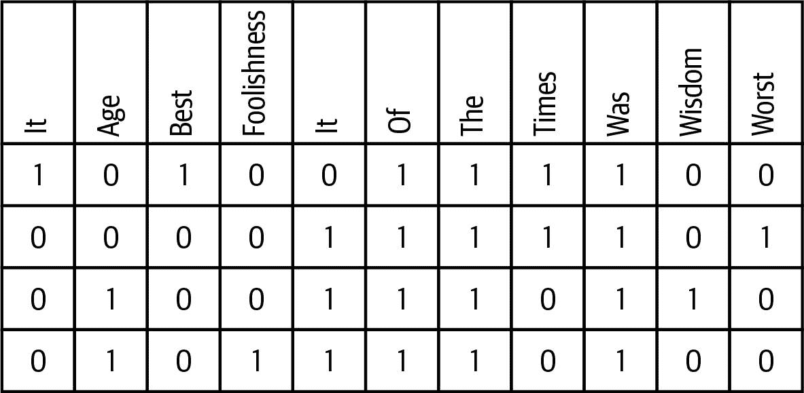
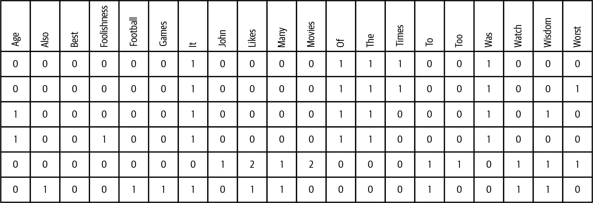
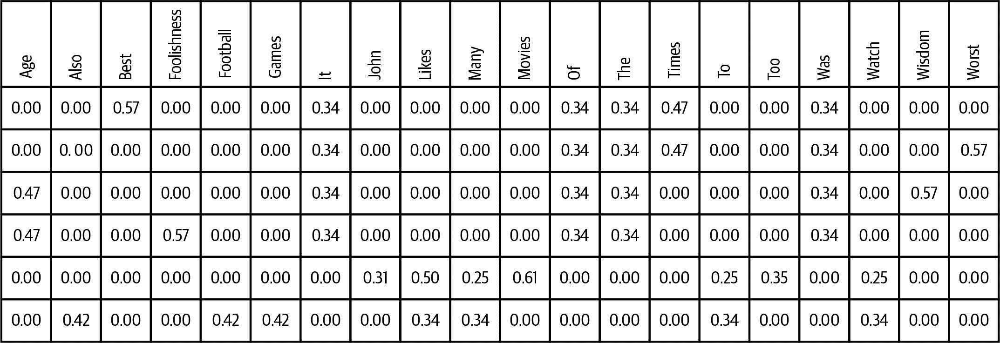
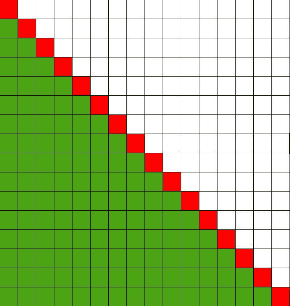
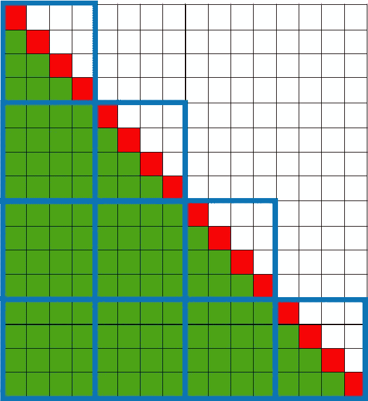

# 第五章：特征工程和句法相似性

正如我们在第一章中看到的那样，文本与结构化数据有着显著的不同。最引人注目的差异之一是，文本由单词表示，而结构化数据（大部分情况下）使用数字。从科学角度来看，数学研究的几个世纪已经对数字有了非常好的理解和复杂的方法。信息科学吸收了这些数学研究，并在此基础上发明了许多创造性的算法。机器学习的最新进展已经将许多以前非常特定的算法泛化，并使其适用于许多不同的用例。这些方法直接从数据中“学习”，并提供了一个无偏见的视角。

要使用这些工具，我们必须找到文本到数字的映射。考虑到文本的丰富性和复杂性，显然单一的数字无法代表文档的含义。需要更复杂的东西。在数学中，实数的自然扩展是一组实数，称为*向量*。几乎所有文本分析和机器学习中的文本表示都使用向量；详见第六章。

向量存在于向量空间中，大多数向量空间具有额外的属性，如范数和距离，这对我们是有帮助的，因为它们暗示了相似性的概念。正如我们将在后续章节中看到的，测量文档之间的相似性对于大多数文本分析应用至关重要，但它本身也很有趣。

# 您将学到什么，我们将构建什么

在本章中，我们将讨论文档的向量化。这意味着我们将把非结构化文本转换为包含数字的向量。

有很多方法可以用来向量化文档。由于文档向量化是所有机器学习任务的基础，我们将花一些时间来设计和实现我们自己的向量化器。如果您需要一个专门用于自己项目的向量化器，您可以将其用作蓝图。

随后，我们将关注两种已在 scikit-learn 中实现的流行模型：词袋模型和 TF-IDF 改进模型。我们将使用这些方法下载大量文档数据集并进行向量化。正如您将看到的那样，数据量和可扩展性可能会带来许多问题。

尽管向量化是更复杂的机器学习算法的基础技术，它也可以单独用于计算文档之间的相似性。我们将详细讨论其工作原理、优化方法以及如何实现可扩展性。对于更丰富的词表示，请参阅第十章，对于更上下文化的方法，请参阅第十一章。

在学习了本章后，您将了解如何使用单词或组合作为*特征*将文档转换为数字（*向量*）。¹ 我们将尝试不同的文档向量化方法，您将能够确定适合您用例的正确方法。您将了解文档相似性为何重要以及计算它的标准方法。我们将通过一个包含许多文档的示例详细介绍如何有效地向量化它们并计算相似性。

第一部分通过实际构建一个简单的向量化器介绍了向量化器的概念。这可以作为您在项目中必须构建的更复杂的向量化器的蓝图。计算单词出现次数并将其用作向量称为*词袋模型*，并且已经创建了非常多功能的模型。

与数据集（拥有超过 1,000,000 个新闻标题）一起，我们在 TF-IDF 部分介绍了一个用例，并展示了可扩展的蓝图架构。我们将建立一个文档向量化的蓝图和文档的相似性搜索。更具挑战性的是，我们将尝试识别语料库中最相似（但非完全相同）的标题。

# 用于实验的玩具数据集

非常令人惊讶的是，许多实验证明，对于许多文本分析问题，只需知道单词是否出现在文档中就足够了。不必理解单词的含义或考虑单词顺序。由于底层映射特别简单且计算速度快，我们将从这些映射开始，并使用单词作为特征。

对于第一个蓝图，我们将集中在方法上，因此使用查尔斯·狄更斯的小说[*双城记*](https://oreil.ly/rfmPH)中的几句话作为玩具数据集。我们将使用以下句子：

+   最好的时代已经来临。

+   最坏的时代已经过去。

+   智慧的时代已经来临。

+   愚蠢的时代已经过去。

# 蓝图：建立您自己的向量化器

由于向量化文档是本书后续章节的基础，我们深入探讨了向量化器的工作原理。通过实现我们自己的向量化器来最好地实现这一点。如果您需要在自己的项目中实现自定义向量化器或需要根据特定要求调整现有向量化器，可以使用本节中的方法。

为了尽可能简化，我们将实现所谓的*单热向量化器*。该向量化器通过记录单词是否出现在文档中来创建二进制向量，如果出现则为 1，否则为 0。

我们将开始创建一个词汇表并为单词分配编号，然后进行向量化，并在此二进制空间中分析相似性。

## 枚举词汇表

从单词作为特征开始，我们必须找到一种将单词转换为向量维度的方法。从文本中提取单词通过标记化完成，如第二章中解释的那样。²

因为我们只关心一个单词是否出现在文档中，所以我们只需列举这些单词：

```py
sentences = ["It was the best of times",
             "it was the worst of times",
             "it was the age of wisdom",
             "it was the age of foolishness"]

```

```py
tokenized_sentences = [[t for t in sentence.split()] for sentence in sentences]
vocabulary = set([w for s in tokenized_sentences for w in s])

import pandas as pd
pd.DataFrame([[w, i] for i,w in enumerate(vocabulary)])

```

`输出：`

| 它 | 0 |
| --- | --- |
| 年龄 | 1 |
| 最好 | 2 |
| 愚蠢 | 3 |
| 它 | 4 |
| 的 | 5 |
| 的 | 6 |
| 时代 | 7 |
| 是 | 8 |
| 智慧 | 9 |
| 最坏 | 10 |

正如你所看到的，单词根据它们第一次出现的顺序进行了编号。这就是我们所说的“字典”，包括单词（词汇表）及其相应的编号。现在，我们可以使用这些数字而不是单词来排列它们到以下向量中。

## 文档向量化

要比较向量、计算相似性等等，我们必须确保每个文档的向量具有相同的维度。为了实现这一点，我们对所有文档使用相同的词典。如果文档中不包含某个词，我们就在相应的位置放置一个 0；否则，我们将使用 1。按照惯例，行向量用于表示文档。向量的维度与词典的长度一样大。在我们的例子中，这不是问题，因为我们只有少数几个词。然而，在大型项目中，词汇表很容易超过 10 万个词。

让我们在实际使用库之前计算所有句子的一热编码：

```py
def onehot_encode(tokenized_sentence):
    return [1 if w in tokenized_sentence else 0 for w in vocabulary]

onehot = [onehot_encode(tokenized_sentence)
         for tokenized_sentence in tokenized_sentences]

for (sentence, oh) in zip(sentences, onehot):
    print("%s: %s" % (oh, sentence))

```

`输出：`

```py
[0, 1, 1, 0, 0, 1, 1, 0, 0, 1, 1]: It was the best of times
[1, 1, 1, 0, 0, 0, 1, 1, 0, 1, 0]: it was the worst of times
[0, 1, 1, 0, 1, 0, 0, 1, 1, 1, 0]: it was the age of wisdom
[0, 1, 1, 1, 1, 0, 0, 1, 0, 1, 0]: it was the age of foolishness

```

对于每个句子，我们现在计算了一个向量表示。将文档转换为一热向量时，我们丢失了关于单词在文档中出现频率及顺序的信息。

### 超出词汇表的文档

如果我们尝试保持词汇表固定并添加新文档会发生什么？这取决于文档的单词是否已经包含在词典中。当然，可能所有单词都已知：

```py
onehot_encode("the age of wisdom is the best of times".split())

```

`输出：`

```py
[0, 1, 0, 0, 1, 0, 1, 0, 1, 1, 1]

```

然而，反之也完全可能。如果我们试图将只包含未知单词的句子向量化，我们会得到一个零向量：

```py
onehot_encode("John likes to watch movies. Mary likes movies too.".split())

```

`输出：`

```py
[0, 0, 0, 0, 0, 0, 0, 0, 0, 0, 0]

```

这个句子在语料库中与其他句子没有“交互”。从严格的角度来看，这个句子与语料库中的任何句子都不相似。对于单个句子来说，这没有问题；如果这种情况经常发生，需要调整词汇表或语料库。

## 文档-词项矩阵

将每个文档的行向量排列成一个矩阵，其中行枚举文档，我们得到了文档-词项矩阵。文档-词项矩阵是所有文档的向量表示，也是本书中几乎所有机器学习任务的最基本构建块。在本章中，我们将用它来计算文档相似性：

```py
pd.DataFrame(onehot, columns=vocabulary)

```

`输出：`



注意：对于文档-词项矩阵，使用列表和数组在词汇量较小时效果最佳。对于大词汇量，我们将不得不找到更聪明的表示方式。Scikit-learn 负责此事，并使用所谓的稀疏向量和矩阵来自[SciPy](https://oreil.ly/yk1wx)。

### 计算相似性

计算文档之间的相似性是通过计算对应位置的共同 1 的数量来进行的。在一热编码中，这是一种非常快速的操作，因为可以通过对向量进行`AND`运算并计算结果向量中的 1 的数量来计算。让我们计算前两个句子的相似性：

```py
sim = [onehot[0][i] & onehot[1][i] for i in range(0, len(vocabulary))]
sum(sim)

```

`Out:`

```py
4

```

我们经常会遇到的另一种计算相似性的可能方式是使用两个文档向量的*标量积*（通常称为*点积*）。标量积通过将两个向量的对应分量相乘并将这些乘积相加来计算。通过观察乘积只有在两个因子都为 1 时才为 1 的事实，我们有效地计算了向量中共同 1 的数量。让我们试一试：

```py
np.dot(onehot[0], onehot[1])

```

`Out:`

```py
4

```

## 相似性矩阵

如果我们有兴趣找出所有文档之间的相似性，有一个很棒的快捷方式可以只用一个命令计算所有的数值！从前一节的公式推广，我们得出文档 *i* 和文档 *j* 的相似性如下：

<math alttext="upper S Subscript i j Baseline equals normal d Subscript i Baseline dot normal d Subscript j"><mrow><msub><mi>S</mi> <mrow><mi>i</mi><mi>j</mi></mrow></msub> <mo>=</mo> <msub><mi mathvariant="normal">d</mi> <mi>i</mi></msub> <mo>·</mo> <msub><mi mathvariant="normal">d</mi> <mi>j</mi></msub></mrow></math>

如果我们想要使用之前的文档-词项矩阵，我们可以将标量积写成一个和：

<math alttext="upper S Subscript i j Baseline equals sigma-summation Underscript k Endscripts upper D Subscript i k Baseline upper D Subscript j k Baseline equals sigma-summation Underscript k Endscripts upper D Subscript i k Baseline left-parenthesis upper D Superscript upper T Baseline right-parenthesis Subscript k j Baseline equals left-parenthesis normal upper D dot normal upper D Superscript upper T Baseline right-parenthesis Subscript i j"><mrow><msub><mi>S</mi> <mrow><mi>i</mi><mi>j</mi></mrow></msub> <mo>=</mo> <msub><mo>∑</mo> <mi>k</mi></msub> <msub><mi>D</mi> <mrow><mi>i</mi><mi>k</mi></mrow></msub> <msub><mi>D</mi> <mrow><mi>j</mi><mi>k</mi></mrow></msub> <mo>=</mo> <msub><mo>∑</mo> <mi>k</mi></msub> <msub><mi>D</mi> <mrow><mi>i</mi><mi>k</mi></mrow></msub> <msub><mrow><mo>(</mo><msup><mi>D</mi> <mi>T</mi></msup> <mo>)</mo></mrow> <mrow><mi>k</mi><mi>j</mi></mrow></msub> <mo>=</mo> <msub><mrow><mo>(</mo><mi mathvariant="normal">D</mi><mo>·</mo><msup><mrow><mi mathvariant="normal">D</mi></mrow> <mi>T</mi></msup> <mo>)</mo></mrow> <mrow><mi>i</mi><mi>j</mi></mrow></msub></mrow></math>

因此，这只是我们的文档-词项矩阵与其转置的矩阵乘积。在 Python 中，这现在很容易计算（输出中的句子已添加，以便更轻松地检查相似性）：³

```py
np.dot(onehot, np.transpose(onehot))

```

`Out:`

```py
array([[6, 4, 3, 3],       # It was the best of times
       [4, 6, 4, 4],       # it was the worst of times
       [3, 4, 6, 5],       # it was the age of wisdom
       [3, 4, 5, 6]])      # it was the age of foolishness

```

显然，最高的数值位于对角线上，因为每个文档最相似于它自己。矩阵必须是对称的，因为文档 *A* 与 *B* 的相似性与 *B* 与 *A* 的相似性相同。除此之外，我们可以看到第二个句子平均来说与所有其他句子最相似，而第三个和最后一个文档成对最相似（它们仅相差一个单词）。如果忽略大小写，第一个和第二个文档也是如此。

理解文档向量化器的工作原理对于实现自己的向量化器至关重要，但也有助于欣赏现有向量化器的所有功能和参数。这就是为什么我们实现了我们自己的向量化器。我们详细查看了向量化的不同阶段，从构建词汇表开始，然后将文档转换为二进制向量。

后来，我们分析了文档之间的相似性。事实证明，它们对应向量的点积是一个很好的度量。

独热向量在实践中也被广泛使用，例如在文档分类和聚类中。然而，scikit-learn 还提供了更复杂的向量化器，在接下来的几节中我们将使用它们。

# 词袋模型

独热编码已经为我们提供了文档的基本表示形式作为向量。然而，它没有处理文档中单词的出现次数。如果我们想计算每个文档中单词的频率，那么我们应该使用所谓的*词袋*表示法。

尽管有些简单，但这些模型被广泛使用。对于分类和情感检测等情况，它们表现合理。此外，还有像潜在狄利克雷分配（LDA）这样的主题建模方法，显式地需要词袋模型。⁴

## 蓝图：使用 scikit-learn 的 CountVectorizer

不必自己实现词袋模型，我们使用 scikit-learn 提供的算法。

注意到相应的类被称为`CountVectorizer`，这是我们在 scikit-learn 中进行特征提取的第一次接触。我们将详细查看这些类的设计及其方法调用的顺序：

```py
from sklearn.feature_extraction.text import CountVectorizer
cv = CountVectorizer()

```

我们来自独热编码的示例句子实际上非常简单，因为我们的数据集中没有句子包含多次单词。让我们再添加一些句子，并以此为基础使用 `CountVectorizer`。

```py
more_sentences = sentences + \
                 ["John likes to watch movies. Mary likes movies too.",
                  "Mary also likes to watch football games."]

```

`CountVectorizer` 分为两个明显的阶段：首先它必须学习词汇表；之后它可以将文档转换为向量。

### 拟合词汇表

首先，它需要学习词汇表。现在这更简单了，因为我们可以直接传递包含句子的数组：

```py
cv.fit(more_sentences)

```

```py
CountVectorizer(analyzer='word', binary=False, decode_error='strict',
                dtype=<class 'numpy.int64'>, encoding='utf-8', input='content',
                lowercase=True, max_df=1.0, max_features=None, min_df=1,
                ngram_range=(1, 1), preprocessor=None, stop_words=None,
                strip_accents=None, token_pattern='(?u)\\b\\w\\w+\\b',
                tokenizer=None, vocabulary=None)

```

不要担心所有这些参数；我们稍后会讨论重要的参数。让我们首先看看 `CountVectorizer` 使用的词汇表，这里称为*特征名称*：

```py
print(cv.get_feature_names())

```

`Out:`

```py
['age', 'also', 'best', 'foolishness', 'football', 'games',
 'it',  'john', 'likes', 'mary', 'movies', 'of', 'the', 'times',
 'to', 'too', 'was', 'watch', 'wisdom', 'worst']

```

我们已经创建了一个词汇表和所谓的特征，使用 `CountVectorizer`。方便地，词汇表按字母顺序排序，这使我们更容易决定是否包含特定单词。

### 将文档转换为向量

在第二步中，我们将使用 `CountVectorizer` 将文档转换为向量表示：

```py
dt = cv.transform(more_sentences)

```

结果是我们在上一节中已经遇到的文档-术语矩阵。然而，它是一个不同的对象，因为 `CountVectorizer` 创建了一个稀疏矩阵。让我们来检查一下：

```py
dt

```

`Out:`

```py
<6x20 sparse matrix of type '<class 'numpy.int64'>'
with 38 stored elements in Compressed Sparse Row format>

```

稀疏矩阵非常高效。它只需保存 38 个元素，而不是存储 6 × 20 = 120 个元素！稀疏矩阵通过跳过所有零元素来实现这一点。

让我们试着恢复我们先前的文档-术语矩阵。为此，我们必须将稀疏矩阵转换为（稠密的）数组。为了使其更易读，我们将其转换为 Pandas 的 `DataFrame`：

```py
pd.DataFrame(dt.toarray(), columns=cv.get_feature_names())
```

`Out:`



文档-词项矩阵看起来与我们的单热向量化器非常相似。但请注意，列是按字母顺序排列的，并且注意第五行有几个 2。这源自文档`"John likes to watch movies. Mary likes movies too."`，其中有很多重复词语。

## 蓝图：计算相似性

现在在文档之间找到相似性更加困难，因为仅仅计算文档中共同出现的 1 不再足够。一般来说，每个词的出现次数可能更多，我们必须考虑这一点。不能使用点积来做这个，因为它也对向量的长度（文档中的词数）敏感。此外，欧氏距离在高维向量空间中并不是很有用。这就是为什么通常使用文档向量之间的角度作为相似性的度量。两个向量之间的夹角的余弦定义如下：

<math alttext="normal c normal o normal s left-parenthesis bold a comma bold b right-parenthesis equals StartFraction bold a dot bold b Over StartAbsoluteValue EndAbsoluteValue bold a StartAbsoluteValue EndAbsoluteValue dot StartAbsoluteValue EndAbsoluteValue bold b StartAbsoluteValue EndAbsoluteValue EndFraction equals StartFraction sigma-summation a Subscript i Baseline b Subscript i Baseline Over StartRoot sigma-summation a Subscript i Baseline a Subscript i Baseline EndRoot StartRoot sigma-summation b Subscript i Baseline b Subscript i Baseline EndRoot EndFraction"><mrow><mi>cos</mi> <mrow><mo>(</mo> <mi>𝐚</mi> <mo>,</mo> <mi>𝐛</mi> <mo>)</mo></mrow> <mo>=</mo> <mfrac><mrow><mi>𝐚</mi><mo>·</mo><mi>𝐛</mi></mrow> <mrow><mo>|</mo><mo>|</mo><mi>𝐚</mi><mo>|</mo><mo>|</mo><mo>·</mo><mo>|</mo><mo>|</mo><mi>𝐛</mi><mo>|</mo><mo>|</mo></mrow></mfrac> <mo>=</mo> <mfrac><mrow><mo>∑</mo><msub><mi>a</mi> <mi>i</mi></msub> <msub><mi>b</mi> <mi>i</mi></msub></mrow> <mrow><msqrt><mrow><mo>∑</mo><msub><mi>a</mi> <mi>i</mi></msub> <msub><mi>a</mi> <mi>i</mi></msub></mrow></msqrt> <msqrt><mrow><mo>∑</mo><msub><mi>b</mi> <mi>i</mi></msub> <msub><mi>b</mi> <mi>i</mi></msub></mrow></msqrt></mrow></mfrac></mrow></math>

Scikit-learn 通过提供`cosine_similarity`实用函数简化了这个计算。让我们来检查前两个句子的相似性：

```py
from sklearn.metrics.pairwise import cosine_similarity
cosine_similarity(dt[0], dt[1])

```

`Out:`

```py
array([[0.83333333]])

```

与早期章节中手工相似性比较起来，`cosine_similarity`提供了一些优势，因为它被适当地标准化，并且值只能在 0 到 1 之间。

计算所有文档的相似性当然也是可能的；scikit-learn 已经优化了`cosine_similarity`，因此可以直接传递矩阵：

```py
pd.DataFrame(cosine_similarity(dt, dt)))
```

`Out:`

|   | 0 | 1 | 2 | 3 | 4 | 5 |
| --- | --- | --- | --- | --- | --- | --- |
| 0 | 1.000000 | 0.833333 | 0.666667 | 0.666667 | 0.000000 | 0.000000 |
| 1 | 0.833333 | 1.000000 | 0.666667 | 0.666667 | 0.000000 | 0.000000 |
| 2 | 0.666667 | 0.666667 | 1.000000 | 0.833333 | 0.000000 | 0.000000 |
| 3 | 0.666667 | 0.666667 | 0.833333 | 1.000000 | 0.000000 | 0.000000 |
| 4 | 0.000000 | 0.000000 | 0.000000 | 0.000000 | 1.000000 | 0.524142 |
| 5 | 0.000000 | 0.000000 | 0.000000 | 0.000000 | 0.524142 | 1.000000 |

同样，矩阵在对角线上具有最高值是对称的。很容易看出文档对 0/1 和 2/3 最相似。文档 4/5 与其他文档没有任何相似性，但它们彼此之间有些相似性。回顾这些句子，这正是人们所期望的。

词袋模型适用于各种用例。对于分类、情感检测和许多主题模型，它们会偏向于最频繁出现的词语，因为它们在文档-词项矩阵中的数值最高。通常这些词语并不带有太多意义，可以定义为停用词。

由于这些方法高度依赖领域特定，更通用的方法会“惩罚”那些在所有文档语料库中出现太频繁的词语。这被称为*TF-IDF 模型*，将在下一节讨论。

# TF-IDF 模型

在我们之前的例子中，许多句子以“这是时候”开头。这在很大程度上增加了它们的相似性，但实际上，您通过这些词获得的实际信息很少。TF-IDF 通过计算总词出现次数来处理这一点。它会减少常见词的权重，同时增加不常见词的权重。除了信息理论的测量[⁵]之外，在阅读文档时，您还可以观察到：如果遇到不常见的词，作者很可能想要用它们传达重要信息。

## 使用 TfidfTransformer 优化文档向量

如我们在第二章中所见，与计数相比，更好的信息衡量方法是计算倒排文档频率，并对非常常见的单词使用惩罚。TF-IDF 权重可以从词袋模型计算出来。让我们再次尝试使用先前的模型，看看文档-术语矩阵的权重如何变化：

```py
from sklearn.feature_extraction.text import TfidfTransformer
tfidf = TfidfTransformer()
tfidf_dt = tfidf.fit_transform(dt)
pd.DataFrame(tfidf_dt.toarray(), columns=cv.get_feature_names())

```

`Out:`



正如您所见，有些词已经被缩小了（例如“it”），而其他词则没有被缩小那么多（例如“wisdom”）。让我们看看对相似性矩阵的影响：

```py
pd.DataFrame(cosine_similarity(tfidf_dt, tfidf_dt))

```

`Out:`

|   | 0 | 1 | 2 | 3 | 4 | 5 |
| --- | --- | --- | --- | --- | --- | --- |
| 0 | 1.000000 | 0.675351 | 0.457049 | 0.457049 | 0.00000 | 0.00000 |
| 1 | 0.675351 | 1.000000 | 0.457049 | 0.457049 | 0.00000 | 0.00000 |
| 2 | 0.457049 | 0.457049 | 1.000000 | 0.675351 | 0.00000 | 0.00000 |
| 3 | 0.457049 | 0.457049 | 0.675351 | 1.000000 | 0.00000 | 0.00000 |
| 4 | 0.000000 | 0.000000 | 0.000000 | 0.000000 | 1.000000 | 0.43076 |
| 5 | 0.000000 | 0.000000 | 0.000000 | 0.000000 | 0.43076 | 1.000000 |

我们确实达到了期望的效果！文档对 0/1 和 2/3 仍然非常相似，但数字也减少到一个更合理的水平，因为文档对在*重要词语*上有所不同。现在常见词的权重较低。

## 引入 ABC 数据集

作为实际的用例，我们将使用一份来自 Kaggle 的[数据集](https://oreil.ly/hg5R3)，其中包含新闻标题。标题源自澳大利亚新闻源 ABC，时间跨度为 2003 至 2017 年。CSV 文件只包含时间戳和标题，没有标点符号，且全部小写。我们将 CSV 文件加载到 Pandas 的`DataFrame`中，并查看前几个文档：

```py
headlines = pd.read_csv("abcnews-date-text.csv", parse_dates=["publish_date"])
print(len(headlines))
headlines.head()

```

`Out:`

```py
1103663
```

|   | 发布日期 | 新闻标题 |
| --- | --- | --- |
| 0 | 2003-02-19 | ABA 决定不授予社区广播许可证... |
| 1 | 2003-02-19 | 澳大利亚 ACT 州的火灾目击者必须意识到诽谤问题 |
| 2 | 2003-02-19 | A G 呼吁举行基础设施保护峰会 |
| 3 | 2003-02-19 | 空中新西兰员工在澳大利亚罢工要求加薪 |
| 4 | 2003-02-19 | 空中新西兰罢工将影响澳大利亚旅客 |

此数据集中有 1,103,663 个标题。请注意，标题不包括标点符号，并且全部转换为小写。除了文本之外，数据集还包括每个标题的出版日期。

正如我们之前看到的，可以使用词袋模型（在 scikit-learn 术语中的*计数向量*）计算 TF-IDF 向量。由于使用 TF-IDF 文档向量非常常见，因此 scikit-learn 创建了一个“快捷方式”来跳过计数向量，直接计算 TF-IDF 向量。相应的类称为`TfidfVectorizer`，我们将在下面使用它。

在下面的内容中，我们还将`fit`和`transform`的调用组合成了`fit_transform`，这样做很方便：

```py
from sklearn.feature_extraction.text import TfidfVectorizer
tfidf = TfidfVectorizer()
dt = tfidf.fit_transform(headlines["headline_text"])

```

这可能需要一段时间，因为需要分析和向量化许多文档。查看文档-术语矩阵的维度：

```py
dt

```

`输出：`

```py
<1103663x95878 sparse matrix of type '<class 'numpy.float64'>'
with 7001357 stored elements in Compressed Sparse Row format>

```

行数是预期的，但是列数（词汇表）非常大，几乎有 100,000 个单词。通过简单的计算可以得出，对数据进行天真的存储会导致 1,103,663 * 95,878 个元素，每个浮点数使用 8 字节，大约使用 788GB 的 RAM。这显示了稀疏矩阵的令人难以置信的有效性，因为实际使用的内存只有“仅”56,010,856 字节（大约 0.056GB；通过`dt.data.nbytes`找到）。这仍然很多，但是可以管理。

不过，计算两个向量之间的相似性又是另一回事了。Scikit-learn（以及其基础 SciPy）针对稀疏向量进行了高度优化，但是进行示例计算（前 10,000 个文档的相似性）仍然需要一些时间：

```py
%%time
cosine_similarity(dt[0:10000], dt[0:10000])

```

`输出：`

```py
CPU times: user 154 ms, sys: 261 ms, total: 415 ms

Wall time: 414 ms

array([[1.      , 0.      , 0.      , ..., 0.        , 0.        , 0.        ],
       [0.      , 1.      , 0.      , ..., 0.        , 0.        , 0.        ],
       [0.      , 0.      , 1.      , ..., 0.        , 0.        , 0.        ],
       ...,
       [0.      , 0.      , 0.      , ..., 1.        , 0.16913596, 0.16792138],
       [0.      , 0.      , 0.      , ..., 0.16913596, 1.        , 0.33258708],
       [0.      , 0.      , 0.      , ..., 0.16792138, 0.33258708, 1.        ]])

```

在接下来的章节中进行机器学习时，许多这些线性代数计算是必要的，并且必须一遍又一遍地重复。通常操作随着特征数量呈二次方增长（O(N²)）。优化矢量化，通过移除不必要的特征，不仅有助于计算相似性，而且对于可扩展的机器学习至关重要。

## 蓝图：降低特征维度

现在我们已经为我们的文档找到了特征，并用它们来计算文档向量。正如我们在示例中看到的，特征数量可能会非常大。许多机器学习算法需要大量计算，并且随着特征数量的增加而扩展，通常甚至是多项式的。因此，特征工程的一部分侧重于减少这些真正必要的特征。

在本节中，我们展示了如何实现这一点的蓝图，并衡量了它们对特征数量的影响。

### 移除停用词

首先，我们可以考虑删除具有最少含义的词语。尽管这取决于领域，但通常有一些最常见的英语单词列表，常识告诉我们通常可以忽略它们。这些词被称为*停用词*。常见的停用词包括冠词、助动词和代词。有关更详细的讨论，请参阅第四章。在删除停用词时要小心，因为它们可能包含在特殊文本中具有特定领域含义的某些词语！

由于几乎任何语言中都有几百个常见的停用词，因此这并没有极大地减少维度。然而，由于停用词非常常见，这应该显著减少存储元素的数量。这导致内存消耗更少，并且计算速度更快，因为需要相乘的数字更少。

让我们使用标准的 spaCy 停用词，并检查对文档-术语矩阵的影响。请注意，我们将停用词作为命名参数传递给 `TfidfVectorizer`：

```py
from spacy.lang.en.stop_words import STOP_WORDS as stopwords
print(len(stopwords))
tfidf = TfidfVectorizer(stop_words=stopwords)
dt = tfidf.fit_transform(headlines["headline_text"])
dt

```

`Out:`

```py
305
<1103663x95600 sparse matrix of type '<class 'numpy.float64'>'
with 5644186 stored elements in Compressed Sparse Row format>

```

仅使用 305 个停用词，我们成功将存储的元素数量减少了 20%。矩阵的维数几乎相同，但由于确实出现在标题中的 95,878 - 95,600 = 278 个停用词较少，列数更少。

### 最小频率

查看余弦相似度的定义，我们可以很容易地看到，只有当两个向量在相应索引处具有非零值时，它们的分量才会有贡献。这意味着我们可以忽略所有出现少于两次的词！`TfidfVectorizer`（以及 `CountVectorizer`）有一个称为 `min_df` 的参数。

```py
tfidf = TfidfVectorizer(stop_words=stopwords, min_df=2)
dt = tfidf.fit_transform(headlines["headline_text"])
dt

```

`Out:`

```py
<1103663x58527 sparse matrix of type '<class 'numpy.float64'>'
with 5607113 stored elements in Compressed Sparse Row format>

```

显然，有很多单词仅出现一次（95,600 - 58,527 = 37,073）。这些单词也应该只存储一次；通过存储元素数量的检查，我们应该得到相同的结果：5,644,186 - 5,607,113 = 37,073。在执行此类转换时，集成这些合理性检查总是很有用的。

# 丢失信息

注意：通过使用 `min_df=2`，我们在向量化此文档语料库的标题时没有丢失任何信息。如果我们计划以后用相同的词汇量向量化更多文档，我们可能会丢失信息，因为在原始文档中仅出现一次的单词，在新文档中再次出现时，将无法在词汇表中找到。

`min_df` 也可以采用浮点值。这意味着一个词必须在至少一部分文档中出现。通常情况下，即使对于较低的 `min_df` 数量，这也会显著减少词汇量：

```py
tfidf = TfidfVectorizer(stop_words=stopwords, min_df=.0001)
dt = tfidf.fit_transform(headlines["headline_text"])
dt

```

`Out:`

```py
<1103663x6772 sparse matrix of type '<class 'numpy.float64'>'
with 4816381 stored elements in Compressed Sparse Row format>

```

这种转换可能过于严格，导致词汇量过低。根据文档的数量，您应将 `min_df` 设置为一个较低的整数，并检查对词汇表的影响。

### 最大频率

有时文本语料库可能有一个特殊的词汇表，其中有很多重复出现的术语，这些术语太特定，不能包含在停用词列表中。对于这种情况，scikit-learn 提供了`max_df`参数，可以消除语料库中过于频繁出现的术语。让我们看看当我们消除所有至少在 10% 的标题中出现的词时，维度是如何减少的：

```py
tfidf = TfidfVectorizer(stop_words=stopwords, max_df=0.1)
dt = tfidf.fit_transform(headlines["headline_text"])
dt

```

`Out:`

```py
<1103663x95600 sparse matrix of type '<class 'numpy.float64'>'
with 5644186 stored elements in Compressed Sparse Row format>

```

将`max_df`设置为低至 10% 的值并没有消除任何一个词！⁶我们的新闻标题非常多样化。根据您拥有的语料库类型，尝试使用`max_df`可能非常有用。无论如何，您都应该始终检查维度如何变化。

## 蓝图：通过使特征更具体来改进特征

到目前为止，我们只使用了标题的原始词，并通过停用词和频率计数减少了维度。我们还没有改变特征本身。通过语言分析，有更多的可能性。

### 进行语言分析

使用 spaCy，我们可以对所有标题进行词形还原，并只保留词形还原形式。这需要一些时间，但我们预计会找到一个更小的词汇表。首先，我们必须进行语言分析，这可能需要一些时间才能完成（参见第四章了解更多细节）：

```py
import spacy

nlp = spacy.load("en")
nouns_adjectives_verbs = ["NOUN", "PROPN", "ADJ", "ADV", "VERB"]
for i, row in headlines.iterrows():
    doc = nlp(str(row["headline_text"]))
    headlines.at[i, "lemmas"] = " ".join([token.lemma_ for token in doc])
    headlines.at[i, "nav"] = " ".join([token.lemma_ for token in doc
                     if token.pos_ in nouns_adjectives_verbs])

```

## 蓝图：使用词形还原代替单词进行文档向量化

现在，我们可以使用词形还原对数据进行向量化，并查看词汇表的减少情况：

```py
tfidf = TfidfVectorizer(stop_words=stopwords)
dt = tfidf.fit_transform(headlines["lemmas"].map(str))
dt

```

`Out:`

```py
<1103663x71921 sparse matrix of type '<class 'numpy.float64'>'
with 5053610 stored elements in Compressed Sparse Row format>

```

节省近 25,000 个维度是很多的。在新闻标题中，对数据进行词形还原可能不会丢失任何信息。在其他用例中，比如第十一章，情况完全不同。

## 蓝图：限制词类

使用之前生成的数据，我们可以限制自己只考虑名词、形容词和动词进行向量化，因为介词、连词等被认为带有很少的意义。这会再次减少词汇量：

```py
tfidf = TfidfVectorizer(stop_words=stopwords)
dt = tfidf.fit_transform(headlines["nav"].map(str))
dt

```

`Out:`

```py
<1103663x68426 sparse matrix of type '<class 'numpy.float64'>'
with 4889344 stored elements in Compressed Sparse Row format>

```

在这里几乎没有什么可以获得的，这可能是因为标题主要包含名词、形容词和动词。但是在您自己的项目中，情况可能完全不同。根据您分析的文本类型，限制词类不仅会减少词汇量，还会减少噪音。建议先尝试对语料库的一小部分进行操作，以避免由于昂贵的语言分析而导致长时间等待。

## 蓝图：移除最常见的单词

根据我们的学习，去除频繁出现的词可以导致文档-词矩阵的条目大大减少。在进行无监督学习时尤其有用，因为通常不会对常见的、无足轻重的常用词感兴趣。

为了进一步减少噪音，我们现在尝试消除最常见的英文单词。请注意，通常还会涉及可能具有重要含义的单词。有各种各样的单词列表；它们可以很容易地在互联网上找到。[来自 Google 的列表](https://oreil.ly/bOho1)非常流行，并直接可在 GitHub 上获取。Pandas 可以直接读取该列表，只需告诉它是一个没有列标题的 CSV 文件。然后，我们将指示`TfidfVectorizer`使用该列表作为停用词：

```py
top_10000 = pd.read_csv("https://raw.githubusercontent.com/first20hours/\
google-10000-english/master/google-10000-english.txt", header=None)
tfidf = TfidfVectorizer(stop_words=set(top_10000.iloc[:,0].values))
dt = tfidf.fit_transform(headlines["nav"].map(str))
dt

```

`Out:`

```py
<1103663x61630 sparse matrix of type '<class 'numpy.float64'>'
with 1298200 stored elements in Compressed Sparse Row format>

```

正如您所见，矩阵现在减少了 350 万个存储的元素。词汇量减少了 68,426 - 61,630 = 6,796 个词，因此 ABC 标题中甚至有超过 3,000 个最常见的英文单词没有被使用。

删除频繁单词是从数据集中去除噪音并集中于不常见单词的优秀方法。但是，刚开始使用时应该小心，因为即使频繁单词也有意义，并且它们在您的文档语料库中可能也具有特殊含义。我们建议额外执行这样的分析，但不应仅限于此。

## 蓝图：通过 N-Grams 添加上下文

到目前为止，我们仅使用单词作为特征（我们文档向量的维度），作为我们向量化的基础。使用这种策略，我们失去了大量的上下文信息。使用单词作为特征不尊重单词出现上下文。在后续章节中，我们将学习如何通过像词嵌入这样的复杂模型克服这种限制。在我们当前的示例中，我们将使用一种更简单的方法，并利用单词组合，即所谓的*n-grams*。两个词的组合称为*bigrams*；三个词的组合称为*trigrams*。

幸运的是，`CountVectorizer`和`TfidfVectorizer`具有相应的选项。与前几节试图减少词汇量的做法相反，我们现在通过词组增强词汇量。有许多这样的组合；它们的数量（以及词汇量）几乎与*n*的指数级增长。⁷ 因此，我们要小心，并从 bigrams 开始：

```py
tfidf = TfidfVectorizer(stop_words=stopwords, ngram_range=(1,2), min_df=2)
dt = tfidf.fit_transform(headlines["headline_text"])
print(dt.shape)
print(dt.data.nbytes)
tfidf = TfidfVectorizer(stop_words=stopwords, ngram_range=(1,3), min_df=2)
dt = tfidf.fit_transform(headlines["headline_text"])
print(dt.shape)
print(dt.data.nbytes)

```

`Out:`

```py
(1103663, 559961)
67325400
(1103663, 747988)
72360104

```

尽管 RAM 大小并没有增加太多，但将特征维度从 95,600 增加到 2,335,132 甚至 5,339,558 是相当痛苦的。对于某些需要特定上下文信息的任务（如情感分析），n-grams 非常有用。但是，始终注意维度是非常有用的。

还可以将 n-grams 与语言特征和常见单词结合起来，大大减少词汇量：

```py
tfidf = TfidfVectorizer(ngram_range=(1,2),
        stop_words=set(top_10000.iloc[:,0].values))
dt = tfidf.fit_transform(headlines["nav"].map(str))
dt

```

`Out:`

```py
<1103663x385857 sparse matrix of type '<class 'numpy.float64'>'
with 1753239 stored elements in Compressed Sparse Row format>
Compared to the original bigram vectorization with min_df=2 above,
there are just 82,370 dimensions left from 67,325,400

```

Scikit-learn 提供了许多不同的向量化器。通常，从`TfidfVectorizer`开始是个不错的主意，因为它是最多才多艺的之一。

### TfidfVectorizer 的选项

TF-IDF 甚至可以关闭，因此可以无缝切换到`CountVectorizer`。由于参数众多，找到完美的选项可能需要一些时间。

找到正确的特征集通常是乏味的，并需要通过`TfidfVectorizer`的（许多）参数进行实验，如`min_df`、`max_df`或通过 NLP 简化文本。在我们的工作中，我们已经通过将`min_df`设置为`5`和`max_df`设置为`0.7`获得了良好的经验。最终，这些时间的投资是非常值得的，因为结果将严重依赖于正确的向量化。然而，并没有金弹，这种*特征工程*严重依赖于使用情况和向量计划使用。

TF-IDF 方法本身可以通过使用次正常术语频率或归一化所得到的向量来改进。后者对于快速计算相似性非常有用，我们将在本章后面演示其使用。前者主要适用于长文档，以避免重复单词获得过高的权重。

#### 非常仔细地考虑特征维度

在我们以前的例子中，我们使用了单词和二元组作为特征。根据使用情况，这可能已经足够了。这对于像新闻这样有常见词汇的文本效果很好。但是，您经常会遇到特殊词汇的情况（例如科学出版物或写给保险公司的信函），这将需要更复杂的特征工程。

#### 要牢记维度的数量。

正如我们所见，使用诸如`ngram_range`之类的参数可能会导致大的特征空间。除了 RAM 使用情况外，这也将成为许多机器学习算法的问题，因为会导致过拟合。因此，当更改参数或向量化方法时，始终考虑（增加）特征维度是一个好主意。

# ABC 数据集中的语法相似性

相似性是机器学习和文本分析中最基本的概念之一。在这一部分中，我们将看一些在 ABC 数据集中找到相似文档的具有挑战性的问题。

在上一节中查看可能的向量化之后，我们现在将使用其中的一种方法来计算相似性。我们将提供一个蓝图，展示如何从 CPU 和 RAM 的角度高效执行这些计算。由于我们处理大量数据，因此必须广泛使用[NumPy 库](https://numpy.org)。

在第一步中，我们使用停用词和二元组对数据进行向量化：

```py
# there are "test" headlines in the corpus
stopwords.add("test")
tfidf = TfidfVectorizer(stop_words=stopwords, ngram_range=(1,2), min_df=2, \
                        norm='l2')
dt = tfidf.fit_transform(headlines["headline_text"])

```

现在我们可以将这些向量用于我们的蓝图。

## 蓝图：查找最接近虚构标题的标题

假设我们想要在我们的数据中找到一个与我们记得的标题最接近的标题，但只是粗略地。这很容易解决，因为我们只需对我们的新文档进行向量化：

```py
made_up = tfidf.transform(["australia and new zealand discuss optimal apple \
 size"])

```

现在我们必须计算与语料库中每个标题的余弦相似度。我们可以通过循环来实现这一点，但使用 scikit-learn 的`cosine_similarity`函数会更容易：

```py
sim = cosine_similarity(made_up, dt)

```

结果是一个“语料库中的头条数量” × 1 矩阵，其中每个数字表示与语料库中文档的相似性。使用`np.argmax`给出最相似文档的索引：

```py
headlines.iloc[np.argmax(sim)]

```

`Out:`

```py
publish_date           2011-08-17 00:00:00
headline_text    new zealand apple imports
Name: 633392, dtype: object

```

最相似的头条中没有*苹果的大小*和*澳大利亚*，但它确实与我们虚构的头条有些相似。

## 蓝图：在大型语料库中找到两个最相似的文档（更加困难）

当处理多个文档的语料库时，您可能经常会被问到“是否有重复？”或“这之前提到过吗？” 这些问题都归结为在语料库中查找最相似（甚至可能是完全相同）的文档。我们将解释如何实现这一点，并再次以我们的示例数据集 ABC 来说明。头条的数量将被证明是一个挑战。

您可能会认为在语料库中找到最相似的文档就像计算所有文档之间的`cosine_similarity`一样简单。但是，这是不可能的，因为 1,103,663 × 1,103,663 = 1,218,072,017,569。即使是最先进的计算机的 RAM 也无法容纳超过一万亿个元素。完全可以执行所需的矩阵乘法，而无需等待太长时间。

显然，这个问题需要优化。由于文本分析经常需要处理许多文档，这是一个非常典型的挑战。通常，第一个优化步骤是深入研究所有需要的数字。我们可以轻松地观察到文档相似性关系是对称和标准化的。

换句话说，我们只需要计算相似矩阵的次对角线元素（图 5-1）



###### 图 5-1\. 需要在相似矩阵中计算的元素。只有对角线以下的元素需要计算，因为它们的数量与对角线上的元素镜像相同。对角线上的元素都是 1。

这将把元素数量减少到 1,103,663 × 1,103,662 / 2 = 609,035,456,953，可以在循环迭代中计算，并保留只有最相似的文档。然而，单独计算所有这些元素并不是一个好选择，因为必要的 Python 循环（每次迭代仅计算一个矩阵元素）会消耗大量 CPU 性能。

不是计算相似矩阵的各个元素，我们将问题分成不同的块，并一次计算 10,000 × 10,000 个 TF-IDF 向量的相似子矩阵⁸。每个这样的矩阵包含 100,000,000 个相似度，仍然适合在 RAM 中。当然，这会导致计算太多元素，我们必须对 111 × 110 / 2 = 6,105 个子矩阵执行此操作（参见图 5-2）。

从前面的部分，我们知道迭代大约需要 500 毫秒来计算。这种方法的另一个优点是利用数据局部性，使我们更有可能在 CPU 缓存中拥有必要的矩阵元素。我们估计一切应该在大约 3,000 秒内完成，大约相当于一小时。



###### 图 5-2\. 将矩阵分成子矩阵，我们可以更轻松地计算；问题被分成块（这里是 4 × 4），块内的白色和对角线元素在计算时是冗余的。

我们能否改进这一点？是的，事实上，可以实现另一个 10 倍的加速。这通过使用 `TfidfVectorizer` 的相应选项来对 TF-IDF 向量进行归一化来实现。之后，可以使用 `np.dot` 计算相似性：⁹

```py
%%time
np.dot(dt[0:10000], np.transpose(dt[0:10000]))

```

`输出：`

```py
CPU times: user 16.4 ms, sys: 0 ns, total: 16.4 ms
Wall time: 16 ms
<10000x10000 sparse matrix of type '<class 'numpy.float64'>'
with 1818931 stored elements in Compressed Sparse Row format>

```

每次迭代中，我们保存最相似的文档及其相似性，并在迭代过程中进行调整。为了跳过相同的文档（或更精确地说，具有相同文档向量的文档），我们只考虑相似性 `< 0.9999`。事实证明，在稀疏矩阵中使用 `<` 关系是极其低效的，因为所有不存在的元素都被假定为 0。因此，我们必须富有创造性地寻找另一种方法：

```py
%%time
batch = 10000
max_sim = 0.0
max_a = None
max_b = None
for a in range(0, dt.shape[0], batch):
    for b in range(0, a+batch, batch):
        print(a, b)
        r = np.dot(dt[a:a+batch], np.transpose(dt[b:b+batch]))
        # eliminate identical vectors
        # by setting their similarity to np.nan which gets sorted out
        r[r > 0.9999] = np.nan
        sim = r.max()
        if sim > max_sim:
            # argmax returns a single value which we have to
            # map to the two dimensions
            (max_a, max_b) = np.unravel_index(np.argmax(r), r.shape)
            # adjust offsets in corpus (this is a submatrix)
            max_a += a
            max_b += b
            max_sim = sim

```

`输出：`

```py
CPU times: user 6min 12s, sys: 2.11 s, total: 6min 14s
Wall time: 6min 12s

```

幸运的是，这没有花太多时间！`max_a` 和 `max_b` 包含具有最大相似性的标题的索引（避免相同的标题）。让我们来看一下结果：

```py
print(headlines.iloc[max_a])
print(headlines.iloc[max_b])

```

`输出：`

```py
publish_date                                2014-09-18 00:00:00
headline_text    vline fails to meet punctuality targets report
Name: 904965, dtype: object
publish_date                         2008-02-15 00:00:00
headline_text    vline fails to meet punctuality targets
Name: 364042, dtype: object

```

使用块计算方法，我们在几分钟内计算了近万亿的相似性。由于我们找到了相似但不相同的文档，因此结果是可以解释的。不同的日期表明这些绝对也是不同的标题。

## 蓝图：查找相关词汇

到目前为止，我们已经分析了文档的相似性。但语料库在隐含中具有更多信息，具体而言是有关相关词汇的信息。在我们的意义上，如果单词在相同的文档中使用，则它们是相关的。如果这些单词经常一起出现在文档中，那么它们应该“更”相关。举个例子，考虑单词 *zealand*，它几乎总是与 *new* 一起出现；因此，这两个单词是*相关的*。

我们希望与文档-术语矩阵而非文档-术语矩阵一起工作，这只是其转置形式。我们不再取行向量，而是取列向量。但是，我们需要重新向量化数据。假设两个词很少使用，并且它们恰好同时出现在同一标题中。它们的向量将是相同的，但这不是我们要寻找的情况。例如，让我们考虑一个名为 *扎福德·毕布罗克斯* 的人，在两篇文章中提到了他。我们的算法将为这些词分配 100%的相关分数。尽管这是正确的，但不是非常显著。因此，我们只考虑出现至少 1000 次的单词，以获得良好的统计显著性：

```py
tfidf_word = TfidfVectorizer(stop_words=stopwords, min_df=1000)
dt_word = tfidf_word.fit_transform(headlines["headline_text"])

```

词汇量非常小，我们可以直接计算余弦相似性。将行向量变为列向量，我们只需转置矩阵，使用 NumPy 的方便 `.T` 方法：

```py
r = cosine_similarity(dt_word.T, dt_word.T)
np.fill_diagonal(r, 0)

```

如果要找到最大条目，最简单的方法是将其转换为一维数组，通过 `np.argsort` 获取排序元素的索引，并恢复用于词汇查找的原始索引：

```py
voc = tfidf_word.get_feature_names()
size = r.shape[0] # quadratic
for index in np.argsort(r.flatten())[::-1][0:40]:
    a = int(index/size)
    b = index%size
    if a > b:  # avoid repetitions
        print('"%s" related to "%s"' % (voc[a], voc[b]))

```

`Out:`

```py
"sri" related to "lanka"
"hour" related to "country"
"seekers" related to "asylum"
"springs" related to "alice"
"pleads" related to "guilty"
"hill" related to "broken"
"trump" related to "donald"
"violence" related to "domestic"
"climate" related to "change"
"driving" related to "drink"
"care" related to "aged"
"gold" related to "coast"
"royal" related to "commission"
"mental" related to "health"
"wind" related to "farm"
"flu" related to "bird"
"murray" related to "darling"
"world" related to "cup"
"hour" related to "2014"
"north" related to "korea"

```

很容易解释这些结果。对于一些词组合（如 *气候变化* ），我们已经恢复了频繁的二元组。另一方面，我们还可以看到在标题中并未相邻的相关词汇，如 *饮酒* 和 *驾驶* 。通过使用转置的文档-术语矩阵，我们进行了一种 *共现分析* 。

## 长时间运行程序的技巧，如句法相似性

以下是长时间运行程序的一些效率提示：

在等待过长之前进行基准测试

在对整个数据集进行计算之前，通常先运行单个计算并推断整个算法将运行多长时间以及需要多少内存是非常有用的。您应该努力理解随着复杂性增加运行时间和内存消耗的增长方式（线性、多项式、指数）。否则，您可能不得不等待很长时间，然后发现几个小时（甚至几天）后仅完成了 10%的进度而内存已经耗尽。

尝试将问题分解为较小的部分

将问题分解为较小的块可以极大地帮助。正如我们在新闻语料库中最相似文档中所见，这样的运行只需大约 20 分钟，并且没有使用大量内存。与朴素方法相比，我们将在长时间运行后发现内存不足。此外，通过将问题分解为部分，您可以利用多核架构甚至将问题分布在多台计算机上。

# 总结与结论

在本节中，我们已准备好向量化和句法相似性的蓝图。几乎所有文本相关的机器学习项目（如分类、主题建模和情感检测）都需要文档向量作为其基础。

结果表明，特征工程是实现这些复杂机器学习算法出色性能的最强大杠杆之一。因此，尝试不同的向量化器，调整它们的参数，并观察生成的特征空间是一个绝佳的主意。确实有很多可能性，而且有充分的理由：尽管优化这一步骤需要一些时间，但通常是非常值得的，因为分析管道后续步骤的结果将极大受益于此。

本章中使用的相似性度量仅作为文档相似性的示例。对于更复杂的需求，还有更复杂的相似性算法，你将在后续章节中了解到。

在信息检索中，寻找相似文档是一个众所周知的问题。还有更复杂的评分方法，如[BM25](https://oreil.ly/s47TC)。如果你需要一个可扩展的解决方案，非常流行的[Apache Lucene](http://lucene.apache.org)库（它是像[Apache Solr](https://oreil.ly/R5y0E)和[Elasticsearch](https://oreil.ly/2qfAL)这样的搜索引擎的基础）利用这一点，在生产场景中用于非常大的文档集合。

在接下来的章节中，我们将经常重新讨论相似性。我们将探讨如何整合单词语义和文档语义，并利用预先训练过的大型文档语料库来实现最先进的性能，使用迁移学习。

¹ 在后面的章节中，我们将探讨向量化单词（第十章）和文档（第十一章）的其他可能性。

² 有更复杂的算法来确定词汇，比如[SentencePiece](https://oreil.ly/A6TEl)和[BPE](https://oreil.ly/tVDgu)，如果你想减少特征数，这些都值得一看。

³ 令人困惑的是，`numpy.dot`既用于点积（内积），也用于矩阵乘法。如果 Numpy 检测到两个行向量或列向量（即一维数组）具有相同的维度，它计算点积并生成一个标量。如果不是，而且传递的二维数组适合矩阵乘法，它执行这个操作并生成一个矩阵。所有其他情况都会产生错误。这很方便，但涉及到很多启发式方法。

⁴ 更多关于 LDA 的内容请参见第八章。

⁵ 例如，参见[熵的定义](https://oreil.ly/3qTpX)，作为不确定性和信息的度量。基本上，这表明低概率值比更可能的值包含更多信息。

⁶ 当然，这与已使用的停用词列表有关。在新闻文章中，最常见的词通常是停用词。在特定领域的文本中，情况可能完全不同。使用停用词通常是更安全的选择，因为这些列表是经过精心策划的。

⁷ 如果所有词组合都可能且被使用，它将呈指数级增长。但由于这种情况不太可能发生，维度会以次指数级增长。

⁸ 我们选择了 10,000 个维度，因为生成的矩阵可以保持在内存中（即使在中等硬件上也应该可以使用大约 1 GB 的内存）。

⁹ 通过使用处理器特定的库，例如在 Anaconda 中订阅 Intel 频道，可以显著加快所有计算。这将使用 AVX2、AVX-512 等指令以及并行化。[MKL](https://oreil.ly/pa1zj) 和 [OpenBlas](https://oreil.ly/jZYSG) 是线性代数库的不错选择。
