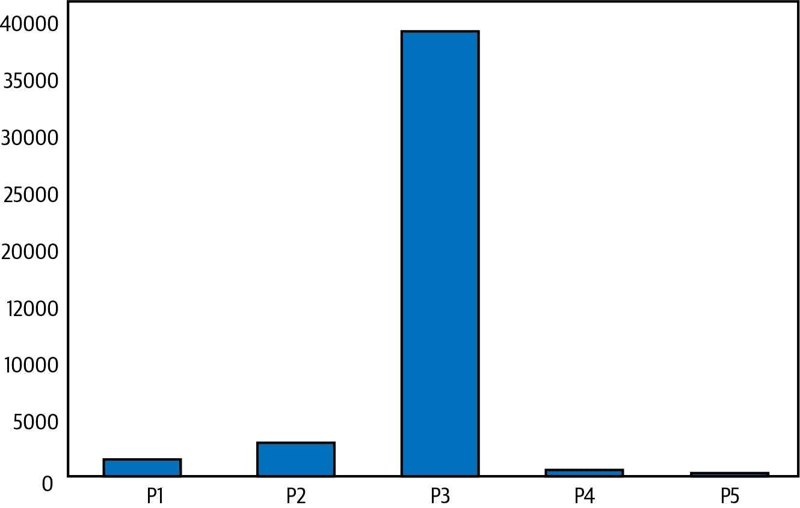
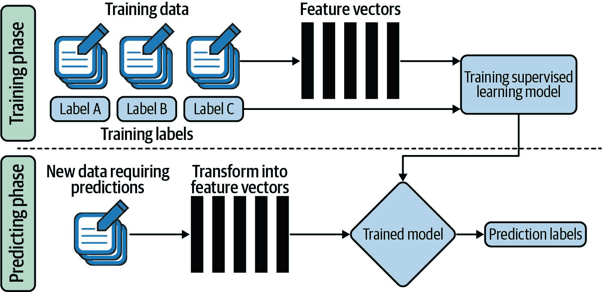
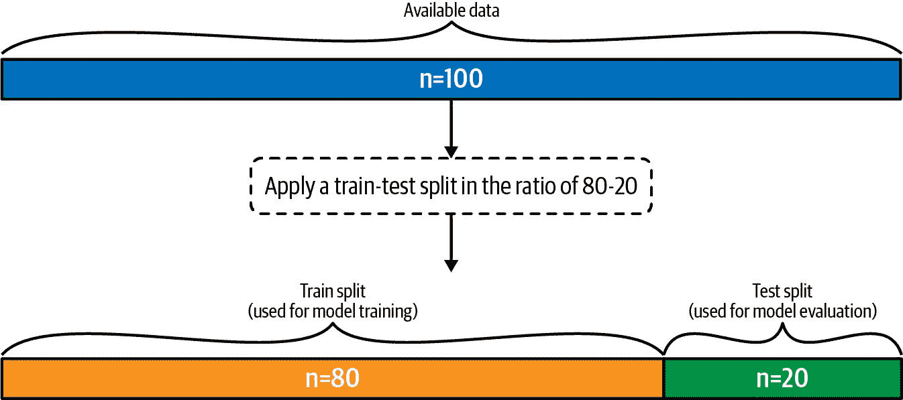
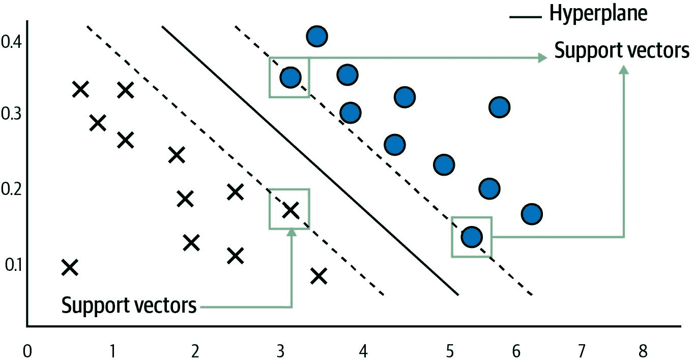
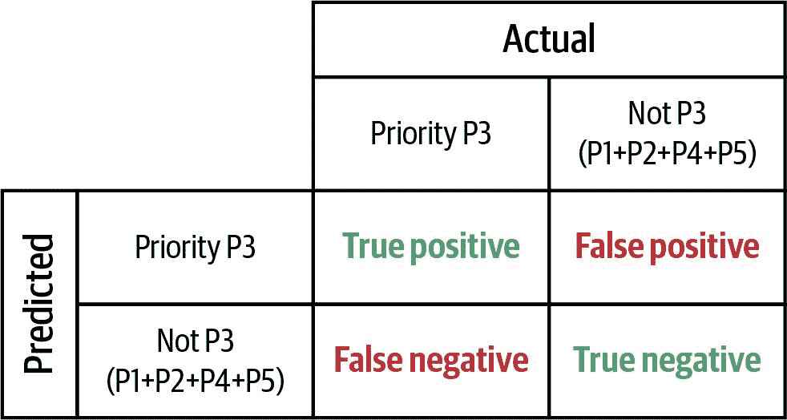
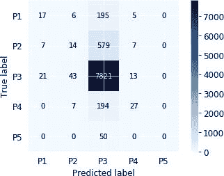
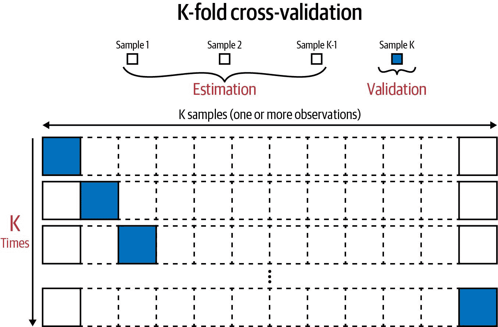

# 第六章 文本分类算法

互联网通常被称为巨大的促成者：它通过在线工具和平台帮助我们在日常生活中取得很多成就。另一方面，它也可能是信息超载和无休止搜索的来源。无论是与同事、客户、合作伙伴还是供应商进行沟通，电子邮件和其他消息工具都是我们日常工作生活中固有的一部分。品牌通过社交媒体平台如 Facebook 和 Twitter 与客户互动，并获取产品的宝贵反馈。软件开发者和产品经理使用类似[Trello](https://trello.com)的工单应用程序来跟踪开发任务，而开源社区则使用[GitHub](https://github.com)的问题跟踪和[Bugzilla](https://bugzilla.org)来追踪需要修复的软件缺陷或需要添加的新功能。

虽然这些工具对完成工作很有用，但它们也可能变得无法控制，并迅速成为信息泛滥的源头。许多电子邮件包含推广内容、垃圾邮件和营销通讯，通常会分散注意力。同样，软件开发者很容易被大量的错误报告和功能请求淹没，这些会降低他们的生产力。为了充分利用这些工具，我们必须采用分类、过滤和优先处理更重要信息与不太相关信息的技术。文本分类是其中一种技术，可以帮助我们实现这一目标。

最常见的例子是由电子邮件提供商提供的垃圾邮件检测。在这种文本分类应用中，每封收件箱中的电子邮件都会被分析，以确定其是否包含有意义和有用的内容，或者是否是无用的无关信息。这样一来，邮件应用程序就可以仅展示相关和重要的电子邮件，过滤掉不太有用的信息泛滥。另一个应用是分类进入的客户服务请求或软件错误报告。如果我们能够对它们进行分类并分配给正确的人员或部门，那么它们将会更快地得到解决。文本分类有多种应用场景，在本章中，我们将开发一个可以跨多个应用场景应用的蓝图。

# 您将学到什么以及我们将构建什么

在本章中，我们将使用监督学习技术构建文本分类的蓝图。我们将使用包含某个软件应用程序错误报告的数据集，并使用这个蓝图来预测这些错误的优先级及特定模块。学习完本章后，您将了解如何应用监督学习技术，将数据分为训练和测试部分，使用准确度指标验证模型性能，并应用交叉验证技术。您还将了解二元分类和多类分类等不同类型的文本分类。

# 引入 Java 开发工具 Bug 数据集

软件技术产品通常很复杂，并且由几个互动组件组成。例如，假设您是一个开发 Android 应用程序播放播客的团队的一部分。除了播放器本身外，还可以有诸如库管理器、搜索和发现等单独的组件。如果用户报告无法播放任何播客，则需要意识到这是一个需要立即解决的关键 bug。另一位用户可能会报告他们喜欢的播客未显示的问题。这可能不那么关键，但重要的是确定这是否需要由库管理团队处理，或者实际上是搜索和发现团队的问题。为了确保快速响应时间，准确分类问题并将其分配给正确的团队至关重要。Bug 是任何软件产品不可避免的一部分，但快速响应将确保客户满意并继续使用您的产品。

在本章中，我们将使用蓝图对 Java 开发工具（JDT）[开源项目](https://eclipse.org/jdt) 中开发期间提出的 bug 和问题进行分类。JDT 项目是 Eclipse 基金会的一部分，该基金会开发 Eclipse 集成开发环境（IDE）。JDT 提供了开发人员使用 Eclipse IDE 编写 Java 代码所需的所有功能。JDT 用户使用 Bugzilla 工具报告 bug 和跟踪问题，Bugzilla 是一款流行的开源 bug 跟踪软件，也被 Firefox 和 Eclipse 平台等其他开源项目使用。包含所有这些项目的 bug 的数据集可以在 [GitHub](https://oreil.ly/giRWx) 上找到，我们将使用 JDT 项目的 bug 数据集。

以下部分加载了一个包含 JDT bug 数据集的 *CSV* 文件。该数据集包含 45,296 个 bug 和每个 bug 的一些可用特征。我们列出了报告的所有特征的列表，并更详细地查看了其中一些，以了解 bug 报告的具体内容：

```py
df = pd.read_csv('eclipse_jdt.csv')
print (df.columns)
df[['Issue_id','Priority','Component','Title','Description']].sample(2)

```

`输出：`

```py
Index(['Issue_id', 'Priority', 'Component', 'Duplicated_issue', 'Title',
       'Description', 'Status', 'Resolution', 'Version', 'Created_time',
       'Resolved_time'],
      dtype='object')

```

|   | 问题编号 | 优先级 | 组件 | 标题 | 描述 |
| --- | --- | --- | --- | --- | --- |
| 38438 | 239715 | P3 | UI | TestCaseElement 的属性测试器不存在 | I20080613-2000; ; 不确定这是否属于 JDT/Debug 还是 Platform/Debug。; ; 我今天在我的错误日志中看到了这个错误消息多次，但我还不确定如何重现它。; ; -- 错误详细信息... |
| 44129 | 395007 | P3 | UI | [package explorer] Java 包文件夹上不可用的刷新操作 | M3.; ; 对于普通源文件夹，F5（刷新）作为上下文菜单项可用，但对于 e4 Java 包资源管理器中的 Java 包文件夹则不可用。; ; 请恢复 3.x 的功能。 |

根据前表显示的细节，我们可以看到每个 bug 报告包含以下重要特征：

问题编号

用于跟踪 bug 的问题的主键。

优先级

这个从 P1（最关键）到 P5（最不关键）变化，并定义了 bug 的严重程度（一个分类字段）。

组件

这指的是项目中特定的架构部分，bug 出现的地方。这可以是 UI、APT 等（一个分类字段）。

标题

这是用户输入的简短摘要，简要描述 bug（一个全文字段）。

描述

这是对产生 bug 的软件行为及其对使用影响的更详细描述（一个全文字段）。

在创建 bug 报告时，用户遵循 JDT Bugzilla 网站上提到的指南。这些指南描述了用户在提出 bug 时需要提供的信息，以便开发人员能够快速解决问题。该网站还包括帮助用户确定给特定 bug 分配优先级的指南。我们的蓝图将使用这些 bug 报告开发一个监督学习算法，该算法可用于自动为未来提出的任何 bug 分配优先级。

在前一节中，我们对数据集和每个 bug 报告的各种特征有了高层次的理解。现在让我们更详细地探索单个 bug 报告。我们随机抽样一个单个 bug（您可以选择不同的 `random_state` 值以查看不同的 bug），并转置结果，以便更详细地显示结果。如果不进行转置，描述特性将以截断的方式显示，而现在我们可以看到所有内容：

```py
df.sample(1).T

```

`Out:`

|   | 11811 |
| --- | --- |
| Issue_id | 33113 |
| Priority | P3 |
| Component | 调试 |
| Title | 评估 URLClassLoader 中的 for 循环挂起问题 |
| Description | 调试 HelloWorld 程序中断到断点。在 DisplayView 中；突出显示并；显示以下代码片段：；； for (int i = 0; i < 10; i++) {； System.out.println(i);； }；； 而不仅仅报告没有明确的返回值；调试器在； URLClassLoader；显然尝试加载 int 类。您需要多次单击“继续”按钮，直到评估完成。DebugView 不显示暂停的原因（线程仅标记为“评估”）。如果关闭“挂起未捕获异常”偏好设置，此行为将不会发生。 |
| Status | 验证通过 |
| Resolution | 已修复 |
| Version | 2.1 |
| Created_time | 2003-02-25 15:40:00 -0500 |
| Resolved_time | 2003-03-05 17:11:17 -0500 |

从上表中我们可以看到，这个错误是在调试组件中引发的，程序在评估`for`循环时会崩溃。我们还可以看到，用户给了一个中等优先级（P3），这个错误在一周内被修复了。我们可以看到，这个错误的报告者遵循了指南并提供了大量信息，这也帮助软件开发人员理解和识别问题并提供修复。大多数软件用户知道，他们提供的信息越多，开发人员理解问题并提供修复就越容易。因此，我们可以假设大多数错误报告包含足够的信息，以便我们创建一个监督学习模型。

输出图描述了不同优先级的错误报告分布情况。我们可以看到大多数错误被分配了 P3 级别。尽管这可能是因为 Bugzilla 将 P3 作为默认选项，但更可能的是这反映了用户在选择其错误报告的优先级时的自然倾向。他们认为该错误不具有高优先级（P1），同时又不希望他们的错误报告完全不被考虑，因此选择了 P5。这在许多现实现象中都有所体现，并通常称为正态分布，其中大多数观测值位于中心或平均值处，而末端的观测值较少。这也可以被视为钟形曲线的可视化。

```py
df['Priority'].value_counts().sort_index().plot(kind='bar')

```

`Out:`



优先级为 P3 与其他优先级之间的巨大差异是构建监督学习模型的问题，并被称为*类别不平衡*。因为类别 P3 的观察数量比其他类别（P1、P2、P4 和 P5）大一个数量级，文本分类算法对 P3 错误的信息要比其他优先级（P1、P2、P4 和 P5）多得多：我们将看到优先级特征的类别不平衡如何影响我们的解决方案，并试图在蓝图中稍后克服这一问题。这与人类学习某些东西相似。如果你见过更多的某种结果的例子，你会更多“预测”相同的结果。

在下面的片段中，我们可以看到针对 JDT 的每个组件报告了多少个错误。UI 和核心组件比文档或 APT 组件报告的错误要多得多。这是预期的，因为软件系统的某些组件比其他组件更大更重要。例如，文档组件包括软件的文档部分，被软件开发人员用来理解功能，但可能不是一个工作组件。另一方面，核心组件是 JDT 的一个重要功能组件，因此分配给它的错误要多得多：

```py
df['Component'].value_counts()

```

`Out:`

```py
UI       17479
Core     13669
Debug    7542
Text     5901
APT      406
Doc      299
Name: Component, dtype: int64

```

# 蓝图：构建文本分类系统

我们将逐步构建文本分类系统，并将所有这些步骤结合起来，提供一个统一的蓝图。这种*文本分类*系统属于更广泛的*监督学习*模型类别。*监督学习*是指一类机器学习算法，它使用标记的数据点作为训练数据，来学习独立变量和目标变量之间的关系。学习这种关系的过程也称为*训练机器学习模型*。如果目标变量是连续的数值变量，如距离、销售单位或交易金额，我们会训练一个*回归*模型。然而，在我们的情况下，目标变量（优先级）是一个类别变量，我们将选择一个*分类*方法来训练监督学习模型。该模型将使用标题或描述等独立变量来预测错误的优先级或组件。监督机器学习方法旨在学习从输入到输出变量的映射函数，数学上定义如下：

<math alttext="y equals f left-parenthesis upper X right-parenthesis"><mrow><mi>y</mi> <mo>=</mo> <mi>f</mi> <mo>(</mo> <mi>X</mi> <mo>)</mo></mrow></math>

在上述方程中，<math alttext="y"><mi>y</mi></math> 是输出或目标变量，<math alttext="f"><mi>f</mi></math> 是映射函数，<math alttext="upper X"><mi>X</mi></math> 是输入变量或一组变量。

由于我们使用包含标记目标变量的数据，这被称为*监督学习*。图 6-1 说明了监督学习模型的工作流程。工作流程分为两个阶段：训练阶段和预测阶段。训练阶段从包含训练观测（如错误报告）和相关标签（我们想要预测的优先级或软件组件）的训练数据开始。虽然许多训练观测的特征可以直接使用，但仅此可能不足以学习映射函数，我们希望增加领域知识以帮助模型更好地理解关系。例如，我们可以添加一个显示错误报告何时报告的特征，因为如果错误在周初报告，则很可能更快修复。这一步骤称为*特征工程*，其结果是每个文档的一组*特征向量*。监督学习模型的训练步骤接受特征向量及其相关标签作为输入，并试图学习映射函数。在训练步骤结束时，我们得到了映射函数，也称为训练模型，可以用来生成预测。

在预测阶段，模型接收到一个新的输入观察值（例如一个错误报告），并且像在训练阶段应用的方式一样转换文档以生成特征向量。新的特征向量被馈送到训练好的模型中以生成预测结果（例如一个错误的优先级）。通过这种方式，我们实现了一种预测标签的自动化方式。



###### 图 6-1\. 用于分类的监督学习算法工作流程。

文本分类是一个监督学习算法的示例，其中我们使用文本数据和文本向量化等自然语言处理技术来为给定的文档分配一个分类目标变量。分类算法可以归为以下几类：

二元分类

实际上，这是多类分类的特殊情况，其中一个观察值可以有两个值中的任何一个（二元）。例如，给定的电子邮件可以标记为垃圾邮件或非垃圾邮件。但是每个观察值只会有一个标签。

多类分类

在这种类型的分类算法中，每个观察值与一个标签相关联。例如，错误报告可以从优先级的五个类别 P1、P2、P3、P4 或 P5 中选择一个单一值。类似地，当尝试识别错误报告所在的软件组件时，每个错误可以属于六个类别之一（UI、核心、调试、文本、APT 或 Doc）。

多标签分类

在这种类型的分类算法中，每个观察值可以分配给多个标签。例如，一篇单一的新闻文章可以被标记为多个标签，如安全性、技术和区块链。可以使用多个二元分类模型来生成最终结果，但我们不会在我们的蓝图中涵盖此部分。

## 第一步：数据准备

在继续构建文本分类模型之前，我们必须执行一些必要的预处理步骤来清洁数据，并以适合机器学习算法应用的方式格式化数据。由于我们的目标是根据标题和描述来识别错误报告的优先级，我们只选择与文本分类模型相关的列。我们还使用 `dropna` 函数删除任何包含空值的行。最后，我们组合标题和描述列以创建单个文本值，并且应用 第四章 中的文本清洁蓝图来删除特殊字符。在删除特殊字符后，我们过滤掉那些文本字段少于 50 个字符的观察值。这些错误报告填写不正确，并且包含的问题描述很少，对于训练模型没有帮助：

```py
df = df[['Title','Description','Priority']]
df = df.dropna()
df['text'] = df['Title'] + ' ' + df['Description']
df = df.drop(columns=['Title','Description'])
df.columns

```

`输出：`

```py
	Index(['Priority', 'text'], dtype='object')

```

然后：

```py
	df['text'] = df['text'].apply(clean)
	df = df[df['text'].str.len() > 50]
	df.sample(2)

```

`输出：`

|   | 优先级 | 文本 |
| --- | --- | --- |
| 28311 | P3 | 需要在生成文件时重新运行 APT 反依赖项 如果生成的文件满足另一个文件中的缺失类型，我们应在该文件上重新运行 APT，以修复新类型。当前的 Java 编译执行了正确的操作，但 APT 没有。需要跟踪具有缺失类型的文件，并在回合结束时重新编译生成新类型的文件。为了良好的性能，需要跟踪名称，并仅编译那些生成的缺失类型。 |
| 25026 | P2 | 外部化字符串向导：可用性改进 M6 测试通过 由于大多数 Java 开发者不会面对 Eclipse 模式，我会将复选框移动到 Accessor 类的区域下方。此外，如果工作空间中不存在 org.eclipse.osgi.util.NLS，向导不应提供此选项。这将避免普通 Java 开发者面对此选项。 |

我们可以从前面两个缺陷报告的文本特征总结中看到，我们的清理步骤已删除了许多特殊字符；我们仍然保留了形成描述的代码结构和语句的大部分。这是模型可以用来理解缺陷的有用信息，也会影响其是否属于更高优先级的因素。

## 第二步：训练-测试分离

在训练监督学习模型的过程中，我们试图学习一个最接近真实世界行为的函数。我们利用训练数据中的信息来学习这个函数。随后，评估我们学到的函数与真实世界行为的接近程度至关重要，因此我们将整个数据集划分为训练集和测试集来实现这一目标。我们通常使用百分比划分数据，其中较大份额分配给训练集。例如，如果数据集有 100 个观测值，并且按 80-20 的比例进行训练-测试分离，则训练集将包含 80 个观测值，测试集将包含 20 个观测值。模型现在在训练集上进行训练，仅使用这 80 个观测值来学习函数。我们将使用这 20 个观测值的测试集来评估学习到的函数。如图 6-2 所示，这一过程进行了说明。

在训练阶段：

<math alttext="y Subscript t r a i n Baseline equals upper F left-parenthesis upper X Subscript t r a i n Baseline right-parenthesis"><mrow><msub><mi>y</mi> <mrow><mi>t</mi><mi>r</mi><mi>a</mi><mi>i</mi><mi>n</mi></mrow></msub> <mo>=</mo> <mi>F</mi> <mrow><mo>(</mo> <msub><mi>X</mi> <mrow><mi>t</mi><mi>r</mi><mi>a</mi><mi>i</mi><mi>n</mi></mrow></msub> <mo>)</mo></mrow></mrow></math>

在评估过程中：

<math alttext="y Subscript p r e d i c t i o n Baseline equals upper F left-parenthesis upper X Subscript t e s t Baseline right-parenthesis"><mrow><msub><mi>y</mi> <mrow><mi>p</mi><mi>r</mi><mi>e</mi><mi>d</mi><mi>i</mi><mi>c</mi><mi>t</mi><mi>i</mi><mi>o</mi><mi>n</mi></mrow></msub> <mo>=</mo> <mi>F</mi> <mrow><mo>(</mo> <msub><mi>X</mi> <mrow><mi>t</mi><mi>e</mi><mi>s</mi><mi>t</mi></mrow></msub> <mo>)</mo></mrow></mrow></math>



###### 图 6-2. 以 80-20 比例划分的训练-测试集。

模型仅看到训练集中的 80 个观测数据，并且学到的函数现在应用于完全独立和未见过的测试集上以生成预测。我们知道测试集中目标变量的真实值，并将这些与预测进行比较，以真实地评估学到的函数的表现以及它与真实世界行为的接近程度：

<math alttext="a c c u r a c y equals e r r o r normal bar m e t r i c left-parenthesis y Subscript p r e d i c t i o n Baseline comma y Subscript t r u e Baseline right-parenthesis"><mrow><mi>a</mi> <mi>c</mi> <mi>c</mi> <mi>u</mi> <mi>r</mi> <mi>a</mi> <mi>c</mi> <mi>y</mi> <mo>=</mo> <mi>e</mi> <mi>r</mi> <mi>r</mi> <mi>o</mi> <mi>r</mi> <mo>_</mo> <mi>m</mi> <mi>e</mi> <mi>t</mi> <mi>r</mi> <mi>i</mi> <mi>c</mi> <mo>(</mo> <msub><mi>y</mi> <mrow><mi>p</mi><mi>r</mi><mi>e</mi><mi>d</mi><mi>i</mi><mi>c</mi><mi>t</mi><mi>i</mi><mi>o</mi><mi>n</mi></mrow></msub> <mo>,</mo> <msub><mi>y</mi> <mrow><mi>t</mi><mi>r</mi><mi>u</mi><mi>e</mi></mrow></msub> <mo>)</mo></mrow></math>

在测试分割上评估学习到的模型提供了文本分类模型错误的无偏估计，因为测试分割中的观察结果是从训练观察结果中随机抽样的，不是学习过程的一部分。测试分割将在模型评估过程中使用，并且有几种可以用来衡量此错误的度量标准，这将在“第 4 步：模型评估”中讨论。

我们使用`sklearn.model_selection.train_test_split`函数来实现训练-测试分割，并将`test_size`参数设为 0.2（表示我们的数据的 20%作为测试分割）。此外，我们还必须指定我们的自变量和目标变量，该方法会返回一个包含四个元素的列表；前两个元素是自变量拆分为训练和测试分割，后两个元素是目标变量拆分。该函数的一个重要参数是`random_state`。这个数字影响着如何对行进行抽样，因此哪一组观察结果进入训练分割，哪一组观察结果进入测试分割。如果提供不同的数字，80-20 分割将保持不变，但不同的观察结果将进入训练和测试分割。重要的是要记住，要复制相同的结果，你必须选择相同的`random_state`值。例如，如果你想要检查在添加新的自变量后模型的变化情况，你必须能够比较添加新变量前后的准确度。因此，你必须使用相同的`random_state`，以便确定是否发生了变化。要注意的最后一个参数是`stratify`，它确保目标变量的分布在训练和测试分割中保持不变。如果这个分布没有保持不变，那么训练分割中某个类别的观察结果可能会有更多，这不符合训练数据中的分布，导致模型学习一个不现实的函数：

```py
X_train, X_test, Y_train, Y_test = train_test_split(df['text'],
                                                    df['Priority'],
                                                    test_size=0.2,
                                                    random_state=42,
                                                    stratify=df['Priority'])

print('Size of Training Data ', X_train.shape[0])
print('Size of Test Data ', X_test.shape[0])

```

`输出：`

```py
Size of Training Data  36024
Size of Test Data  9006

```

## 第三步：训练机器学习模型

创建文本分类蓝图的下一步是使用适当的算法训练监督式机器学习模型。当处理文本分类时，SVM 是一种常用的算法之一，我们将首先介绍该方法，然后说明为什么它非常适合我们的任务。

考虑一个在 X-Y 平面上的点集，每个点属于两个类别中的一个：十字或圆圈，如图 6-3 所示。支持向量机通过选择一条清晰地分隔这两个类别的直线来工作。当然，可能存在几条这样的直线（用虚线选项表示），算法选择能在最靠近的十字和圆圈点之间提供最大分离的直线。这些最靠近的十字和圆圈点称为*支持向量*。在示例中，我们能够识别出一个能够清晰分隔十字和圆圈点的超平面，但实际情况中可能难以实现这一点。例如，可能有几个圆圈点位于极左侧，这时生成超平面就不可能了。算法通过允许一定灵活性的容差参数`tol`来处理这种情况，并在决定超平面时接受误分类点的错误。



###### 图 6-3\. 简单二维分类示例中的超平面和支持向量。

在继续运行支持向量机模型之前，我们必须将文本数据准备成算法可以使用的合适格式。这意味着我们必须找到一种方法将文本数据表示为数值格式。最简单的方法是计算每个词在一个缺陷报告中出现的次数，并将所有词的计数组合起来，为每个观察结果创建一个数值表示。这种技术的缺点是常见的单词将有很大的值，并可能被误认为是重要特征，这种情况并非真实。因此，我们采用首选选项，即使用词频逆文档频率（TF-IDF）向量化来表示文本，详细解释请参见第五章。

```py
tfidf = TfidfVectorizer(min_df = 10, ngram_range=(1,2), stop_words="english")
X_train_tf = tfidf.fit_transform(X_train)

```

在前一步执行的 TF-IDF 向量化生成了一个稀疏矩阵。当处理文本数据时，SVM 算法更为适用，因为它更适合处理稀疏数据，相比其他算法如[随机森林](https://oreil.ly/uFkYZ)。它们还更适合处理纯数值型输入特征（就像我们的情况），而其他算法则能够处理数值和分类输入特征的混合。对于我们的文本分类模型，我们将使用由 scikit-learn 库提供的`sklearn.svm.LinearSVC`模块。实际上，SVM 可以使用不同的核函数进行初始化，线性核函数在处理文本数据时推荐使用，因为可以考虑到大量线性可分的特征。它也更快速适应，因为需要优化的参数更少。scikit-learn 包提供了线性 SVM 的不同实现，如果你有兴趣，可以通过阅读“SVC Versus LinearSVC Versus SGDClassifier”来了解它们之间的区别。

在以下代码中，我们使用特定的`random_state`初始化模型，并指定了容差值为 0.00001。这些参数是针对我们使用的模型类型具体指定的，我们将在本章后面展示如何为这些参数值找到最优值。现在，我们从指定一些默认值开始，然后调用`fit`方法，确保使用我们在前一步创建的向量化独立变量：

```py
model1 = LinearSVC(random_state=0, tol=1e-5)
model1.fit(X_train_tf, Y_train)

```

`Out:`

```py
LinearSVC(C=1.0, class_weight=None, dual=True, fit_intercept=True,
          intercept_scaling=1, loss='squared_hinge', max_iter=1000,
          multi_class='ovr', penalty='l2', random_state=0, tol=1e-05,
          verbose=0)

```

在执行上述代码后，我们使用训练数据拟合了一个模型，结果显示了生成的模型的各种参数。由于我们只指定了`random_state`和容差，大多数参数都是默认值。

## 第四步：模型评估

现在我们有一个可以用来预测测试集中所有观测目标变量的模型。对于这些观测，我们也知道真实的目标变量，因此我们可以计算我们模型的表现。有许多可以用来量化我们模型准确性的指标，在本节中我们将介绍其中三个。

验证我们的文本分类模型最简单的方法是通过准确率：模型正确预测数量与观测总数的比率。数学上可以表示如下：

<math alttext="upper A c c u r a c y equals StartFraction upper N u m b e r o f c o r r e c t p r e d i c t i o n s Over upper T o t a l n u m b e r o f p r e d i c t i o n s m a d e EndFraction"><mrow><mi>A</mi> <mi>c</mi> <mi>c</mi> <mi>u</mi> <mi>r</mi> <mi>a</mi> <mi>c</mi> <mi>y</mi> <mo>=</mo> <mfrac><mrow><mi>N</mi><mi>u</mi><mi>m</mi><mi>b</mi><mi>e</mi><mi>r</mi><mi>o</mi><mi>f</mi><mi>c</mi><mi>o</mi><mi>r</mi><mi>r</mi><mi>e</mi><mi>c</mi><mi>t</mi><mi>p</mi><mi>r</mi><mi>e</mi><mi>d</mi><mi>i</mi><mi>c</mi><mi>t</mi><mi>i</mi><mi>o</mi><mi>n</mi><mi>s</mi></mrow> <mrow><mi>T</mi><mi>o</mi><mi>t</mi><mi>a</mi><mi>l</mi><mi>n</mi><mi>u</mi><mi>m</mi><mi>b</mi><mi>e</mi><mi>r</mi><mi>o</mi><mi>f</mi><mi>p</mi><mi>r</mi><mi>e</mi><mi>d</mi><mi>i</mi><mi>c</mi><mi>t</mi><mi>i</mi><mi>o</mi><mi>n</mi><mi>s</mi><mi>m</mi><mi>a</mi><mi>d</mi><mi>e</mi></mrow></mfrac></mrow></math>

为了衡量模型的准确性，我们使用训练好的模型生成预测并与真实值进行比较。为了生成预测，我们必须对独立变量的测试集应用相同的向量化，然后调用训练模型的预测方法。一旦我们有了预测结果，我们可以使用下面展示的`accuracy_score`方法来自动生成这个度量，通过比较测试集的真实值和模型预测值来完成：

```py
X_test_tf = tfidf.transform(X_test)

Y_pred = model1.predict(X_test_tf)
print ('Accuracy Score - ', accuracy_score(Y_test, Y_pred))

```

`Out:`

```py
Accuracy Score -  0.8748612036420165

```

如您所见，我们取得了 87.5%的高准确率，表明我们有一个能够准确预测缺陷优先级的好模型。请注意，如果您使用不同的`random_state`初始化模型，则可能得到不同但相似的分数。始终比较训练模型与基线方法（可能基于简单的经验法则或业务知识）的表现是个好主意。我们可以使用`sklearn.svm.DummyClassifier`模块，它提供诸如`most_frequent`的简单策略，基线模型始终预测出现频率最高的类别，或者`stratified`，它生成符合训练数据分布的预测：

```py
clf = DummyClassifier(strategy='most_frequent')
clf.fit(X_train, Y_train)
Y_pred_baseline = clf.predict(X_test)
print ('Accuracy Score - ', accuracy_score(Y_test, Y_pred_baseline))

```

`输出：`

```py
Accuracy Score -  0.8769709082833667

```

我们可以清楚地看到，我们训练的模型并未增加任何价值，因为其表现与始终选择 P3 类别的基线相当。我们还需深入挖掘模型在不同优先级上的表现如何。它在预测 P1 或 P5 优先级方面表现更好吗？为了分析这一点，我们可以使用另一个评估工具，称为*混淆矩阵*。混淆矩阵是一个网格，比较了所有分类观察的预测值与实际值。混淆矩阵最常见的表示是针对只有两个标签的二元分类问题。

我们可以通过将一个类别视为 P3，将另一个类别视为所有其余类别，来修改我们的多类别分类问题以适应这种表示。让我们看看图 6-4，这是一个仅预测特定缺陷是否具有优先级 P3 的混淆矩阵的示例表示。



###### 图 6-4. 优先级 P3 和非 P3 的混淆矩阵。

行代表预测结果，列代表实际值。矩阵中的每个单元格都是落入该格的观察计数：

真阳性

预测为正且确实为正的观察计数。

真阴性

预测为负且确实为负的观察计数。

假阳性

预测为正但实际为负的观察计数。

假阴性

预测为负但实际为正的观察计数。

基于此列表，我们可以使用以下方程自动推导出准确度度量：

<math alttext="upper A c c u r a c y equals StartFraction left-parenthesis upper T r u e upper P o s i t i v e plus upper T r u e upper N e g a t i v e right-parenthesis Over left-parenthesis upper T r u e upper P o s i t i v e plus upper T r u e upper N e g a t i v e plus upper F a l s e upper P o s i t i v e plus upper F a l s e upper N e g a t i v e right-parenthesis EndFraction"><mrow><mi>A</mi> <mi>c</mi> <mi>c</mi> <mi>u</mi> <mi>r</mi> <mi>a</mi> <mi>c</mi> <mi>y</mi> <mo>=</mo> <mfrac><mrow><mo>(</mo><mi>T</mi><mi>r</mi><mi>u</mi><mi>e</mi><mi>P</mi><mi>o</mi><mi>s</mi><mi>i</mi><mi>t</mi><mi>i</mi><mi>v</mi><mi>e</mi><mo>+</mo><mi>T</mi><mi>r</mi><mi>u</mi><mi>e</mi><mi>N</mi><mi>e</mi><mi>g</mi><mi>a</mi><mi>t</mi><mi>i</mi><mi>v</mi><mi>e</mi><mo>)</mo></mrow> <mrow><mo>(</mo><mi>T</mi><mi>r</mi><mi>u</mi><mi>e</mi><mi>P</mi><mi>o</mi><mi>s</mi><mi>i</mi><mi>t</mi><mi>i</mi><mi>v</mi><mi>e</mi><mo>+</mo><mi>T</mi><mi>r</mi><mi>u</mi><mi>e</mi><mi>N</mi><mi>e</mi><mi>g</mi><mi>a</mi><mi>t</mi><mi>i</mi><mi>v</mi><mi>e</mi><mo>+</mo><mi>F</mi><mi>a</mi><mi>l</mi><mi>s</mi><mi>e</mi><mi>P</mi><mi>o</mi><mi>s</mi><mi>i</mi><mi>t</mi><mi>i</mi><mi>v</mi><mi>e</mi><mo>+</mo><mi>F</mi><mi>a</mi><mi>l</mi><mi>s</mi><mi>e</mi><mi>N</mi><mi>e</mi><mi>g</mi><mi>a</mi><mi>t</mi><mi>i</mi><mi>v</mi><mi>e</mi><mo>)</mo></mrow></mfrac></mrow></math>

这不过是所有预测正确与总预测数的比率而已。

### 精确率和召回率

使用混淆矩阵的真正价值在于精确率和召回率等其他度量，这些度量能够更深入地了解模型在不同类别下的表现。

让我们考虑正（P3）类，并考虑精确率：

<math alttext="upper P r e c i s i o n equals StartFraction upper T r u e upper P o s i t i v e Over left-parenthesis upper T r u e upper P o s i t i v e plus upper F a l s e upper P o s i t i v e right-parenthesis EndFraction"><mrow><mi>P</mi> <mi>r</mi> <mi>e</mi> <mi>c</mi> <mi>i</mi> <mi>s</mi> <mi>i</mi> <mi>o</mi> <mi>n</mi> <mo>=</mo> <mfrac><mrow><mi>T</mi><mi>r</mi><mi>u</mi><mi>e</mi><mi>P</mi><mi>o</mi><mi>s</mi><mi>i</mi><mi>t</mi><mi>i</mi><mi>v</mi><mi>e</mi></mrow> <mrow><mo>(</mo><mi>T</mi><mi>r</mi><mi>u</mi><mi>e</mi><mi>P</mi><mi>o</mi><mi>s</mi><mi>i</mi><mi>t</mi><mi>i</mi><mi>v</mi><mi>e</mi><mo>+</mo><mi>F</mi><mi>a</mi><mi>l</mi><mi>s</mi><mi>e</mi><mi>P</mi><mi>o</mi><mi>s</mi><mi>i</mi><mi>t</mi><mi>i</mi><mi>v</mi><mi>e</mi><mo>)</mo></mrow></mfrac></mrow></math>

此指标告诉我们预测的正例中实际上是正例的比例，或者说我们的模型在预测正类时的准确性。如果我们希望对我们的正面预测有把握，那么这是一个必须最大化的指标。例如，如果我们将电子邮件分类为垃圾邮件（正类），那么我们必须在这方面做到准确；否则，一封好的电子邮件可能会意外地发送到垃圾邮件文件夹。

源自混淆矩阵的另一个衡量指标是召回率：

<math alttext="upper R e c a l l equals StartFraction upper T r u e upper P o s i t i v e Over left-parenthesis upper T r u e upper P o s i t i v e plus upper F a l s e upper N e g a t i v e right-parenthesis EndFraction"><mrow><mi>R</mi> <mi>e</mi> <mi>c</mi> <mi>a</mi> <mi>l</mi> <mi>l</mi> <mo>=</mo> <mfrac><mrow><mi>T</mi><mi>r</mi><mi>u</mi><mi>e</mi><mi>P</mi><mi>o</mi><mi>s</mi><mi>i</mi><mi>t</mi><mi>i</mi><mi>v</mi><mi>e</mi></mrow> <mrow><mo>(</mo><mi>T</mi><mi>r</mi><mi>u</mi><mi>e</mi><mi>P</mi><mi>o</mi><mi>s</mi><mi>i</mi><mi>t</mi><mi>i</mi><mi>v</mi><mi>e</mi><mo>+</mo><mi>F</mi><mi>a</mi><mi>l</mi><mi>s</mi><mi>e</mi><mi>N</mi><mi>e</mi><mi>g</mi><mi>a</mi><mi>t</mi><mi>i</mi><mi>v</mi><mi>e</mi><mo>)</mo></mrow></mfrac></mrow></math>

此指标告诉我们实际正值中被我们的模型识别的比例。高召回率意味着我们的模型能够捕捉现实中大多数的正类分类。这在成本未识别正例很高的情况下尤为重要，例如，如果一个患者患有癌症但我们的模型未能识别出来。

从前面的讨论中，我们可以得出结论，无论模型的应用是什么，精确度和召回率都是重要的指标。*F1 分数*是一个创建这两个度量的调和平均值的指标，也可以用作评估模型整体准确性的代理：

<math alttext="upper F Baseline 1 upper S c o r e equals StartFraction 2 asterisk left-parenthesis upper P r e c i s i o n asterisk upper R e c a l l right-parenthesis Over left-parenthesis upper P r e c i s i o n plus upper R e c a l l right-parenthesis EndFraction"><mrow><mi>F</mi> <mn>1</mn> <mi>S</mi> <mi>c</mi> <mi>o</mi> <mi>r</mi> <mi>e</mi> <mo>=</mo> <mfrac><mrow><mn>2</mn><mo>*</mo><mo>(</mo><mi>P</mi><mi>r</mi><mi>e</mi><mi>c</mi><mi>i</mi><mi>s</mi><mi>i</mi><mi>o</mi><mi>n</mi><mo>*</mo><mi>R</mi><mi>e</mi><mi>c</mi><mi>a</mi><mi>l</mi><mi>l</mi><mo>)</mo></mrow> <mrow><mo>(</mo><mi>P</mi><mi>r</mi><mi>e</mi><mi>c</mi><mi>i</mi><mi>s</mi><mi>i</mi><mi>o</mi><mi>n</mi><mo>+</mo><mi>R</mi><mi>e</mi><mi>c</mi><mi>a</mi><mi>l</mi><mi>l</mi><mo>)</mo></mrow></mfrac></mrow></math>

现在我们已经对混淆矩阵有了理解，让我们回到我们的蓝图，并添加评估训练模型的混淆矩阵的步骤。请注意，早期的表示被简化为二元分类，而我们的模型实际上是一个多类分类问题，因此混淆矩阵会相应地改变。例如，我们模型的混淆矩阵可以通过函数`confusion_matrix`生成，如下所示：

```py
Y_pred = model1.predict(X_test_tf)
confusion_matrix(Y_test, Y_pred)

```

`输出：`

```py
array([[  17,    6,  195,    5,    0],
       [   7,   14,  579,    7,    0],
       [  21,   43, 7821,   13,    0],
       [   0,    7,  194,   27,    0],
       [   0,    0,   50,    0,    0]])

```

这也可以通过使用`plot_confusion_matrix`函数以热图形式进行可视化，如下所示：

```py
plot_confusion_matrix(model1,X_test_tf,
                      Y_test, values_format='d',
                      cmap=plt.cm.Blues)
plt.show()

```



我们可以使用与前述相同的方法为每个类别定义精确度和召回率，但现在还将包括被错误分类到其他类别的观察计数。

例如，类别 P3 的精度可以计算为正确预测的 P3 值（7,821）与所有预测的 P3 值（195 + 579 + 7,821 + 194 + 50）的比率，结果如下：

*精确度（P3）* = 7,821 / 8,839 = 0.88

类似地，P3 的召回率可以计算为正确预测的 P3 值与所有实际 P3 值（21 + 43 + 7,821 + 13 + 0）的比率，结果如下：

*召回率（P2）* = 7,821 / 7,898 = 0.99

直接确定这些度量的更简单方法是使用 scikit-learn 的`classification_report`函数，它可以自动计算这些值：

```py
print(classification_report(Y_test, Y_pred))

```

`输出：`

```py
              precision    recall  f1-score   support

          P1       0.38      0.08      0.13       223
          P2       0.20      0.02      0.04       607
          P3       0.88      0.99      0.93      7898
          P4       0.52      0.12      0.19       228
          P5       0.00      0.00      0.00        50

    accuracy                           0.87      9006
   macro avg       0.40      0.24      0.26      9006
weighted avg       0.81      0.87      0.83      9006

```

根据我们的计算和之前的分类报告，一个问题变得明显：尽管 P3 类别的召回率和精确度值相当高，但其他类别的这些值很低，甚至在某些情况下为 0（P5）。模型的整体准确率为 88%，但如果我们硬编码我们的预测始终为 P3，这也将在 88%的时间内是正确的。这清楚地表明我们的模型并未学习到太多显著的信息，而只是预测了多数类别。这凸显了在模型评估期间，我们必须分析几个指标，而不能仅依赖准确率。

### 类别不平衡

模型表现如此的原因是由于我们之前观察到的优先级类别中的*类别不平衡*。尽管 P3 优先级有接近 36,000 个错误，但其他优先级类别的错误数量只有大约 4,000 个，其他情况更少。这意味着当我们训练我们的模型时，它只能学习 P3 类别的特征。

有几种技术可以用来解决类别不平衡的问题。它们属于上采样和下采样技术的两类。上采样技术是指用于人工增加少数类观测数量（例如我们例子中的非 P3 类别）的方法。这些技术可以从简单地添加多个副本到使用 SMOTE 等方法生成新观测数据。^(1) 下采样技术是指用于减少多数类观测数量（例如我们例子中的 P3 类别）的方法。我们将选择随机下采样 P3 类别，使其观测数量与其他类别相似：

```py
# Filter bug reports with priority P3 and sample 4000 rows from it
df_sampleP3 = df[df['Priority'] == 'P3'].sample(n=4000)

# Create a separate DataFrame containing all other bug reports
df_sampleRest = df[df['Priority'] != 'P3']

# Concatenate the two DataFrame to create the new balanced bug reports dataset
df_balanced = pd.concat([df_sampleRest, df_sampleP3])

# Check the status of the class imbalance
df_balanced['Priority'].value_counts()

```

`Out:`

```py
P3    4000
P2    3036
P4    1138
P1    1117
P5    252
Name: Priority, dtype: int64

```

请注意，在执行下采样时，我们正在丢失信息，这通常不是一个好主意。但是，每当遇到类别不平衡的问题时，这会阻止我们的模型学习正确的信息。我们尝试通过使用上采样和下采样技术来克服这一问题，但这将始终涉及到数据质量的妥协。虽然我们选择了一种简单的方法，请查看下面的侧边栏，了解处理这种情况的各种方法。

# 文本分类最终蓝图

现在，我们将结合到目前为止列出的所有步骤，创建我们的文本分类蓝图：

```py
# Loading the balanced DataFrame

df = df_balanced[['text', 'Priority']]
df = df.dropna()

# Step 1 - Data Preparation

df['text'] = df['text'].apply(clean)

# Step 2 - Train-Test Split
X_train, X_test, Y_train, Y_test = train_test_split(df['text'],
                                                    df['Priority'],
                                                    test_size=0.2,
                                                    random_state=42,
                                                    stratify=df['Priority'])
print('Size of Training Data ', X_train.shape[0])
print('Size of Test Data ', X_test.shape[0])

# Step 3 - Training the Machine Learning model

tfidf = TfidfVectorizer(min_df=10, ngram_range=(1, 2), stop_words="english")
X_train_tf = tfidf.fit_transform(X_train)

model1 = LinearSVC(random_state=0, tol=1e-5)
model1.fit(X_train_tf, Y_train)

# Step 4 - Model Evaluation

X_test_tf = tfidf.transform(X_test)
Y_pred = model1.predict(X_test_tf)
print('Accuracy Score - ', accuracy_score(Y_test, Y_pred))
print(classification_report(Y_test, Y_pred))

```

`Out:`

```py
Size of Training Data  7634
Size of Test Data  1909
Accuracy Score -  0.4903090623363017
              precision    recall  f1-score   support

          P1       0.45      0.29      0.35       224
          P2       0.42      0.47      0.44       607
          P3       0.56      0.65      0.61       800
          P4       0.39      0.29      0.33       228
          P5       0.00      0.00      0.00        50

    accuracy                           0.49      1909
   macro avg       0.37      0.34      0.35      1909
weighted avg       0.47      0.49      0.48      1909

```

根据结果，我们可以看到我们的准确率现在达到了 49%，这不太好。进一步分析，我们可以看到对于 P1 和 P2 优先级，精确度和召回率值已经提高，这表明我们能够更好地预测具有这些优先级的错误。然而，显然对于 P5 优先级的错误，这个模型并没有提供任何信息。我们看到这个模型比使用*分层*策略的简单基线模型表现更好，如下所示。尽管早期的模型具有更高的准确性，但实际上并不是一个好模型，因为它是无效的。这个模型也不好，但至少呈现了一个真实的画面，并告诉我们我们不能用它来生成预测：

```py
clf = DummyClassifier(strategy='stratified')
clf.fit(X_train, Y_train)
Y_pred_baseline = clf.predict(X_test)
print ('Accuracy Score - ', accuracy_score(Y_test, Y_pred_baseline))

```

`输出：`

```py
Accuracy Score -  0.30434782608695654

```

下面是一些我们模型对这些优先级的预测准确的示例：

```py
# Create a DataFrame combining the Title and Description,
# Actual and Predicted values that we can explore
frame = { 'text': X_test, 'actual': Y_test, 'predicted': Y_pred }
result = pd.DataFrame(frame)

result[((result['actual'] == 'P1') | (result['actual'] == 'P2')) &
       (result['actual'] == result['predicted'])].sample(2)

```

`输出：`

|   | 文本 | 实际 | 预测 |
| --- | --- | --- | --- |
| 64 | Java 启动器：如果只有一个元素，不要提示要启动的元素。我想通过选择它并单击调试工具项来调试一个 CU。我被提示选择一个启动器，然后我还必须在第二页上选择唯一可用的类。第二步是不必要的。第一页上的下一步按钮应该被禁用。注意：DW，第一次在工作空间中启动某个东西时，你必须经历这种痛苦...这是由于调试器对不同语言是可插拔的。在这种情况下，启动器选择是通用调试支持，选择要启动的类是特定于 Java 调试支持。为了促进懒加载插件并避免启动器对可启动目标进行详尽搜索，启动器选择页面不会轮询可插拔的启动页面，以查看是否可以使用当前选择完成。一旦你为项目选择了默认启动器，启动器选择页面就不会再打扰你。移至非活动状态以供 6 月后考虑 |
| 5298 | 快速步进 toString 当您快速步进并选择一个对象显示详细信息时，我们会在日志中得到异常。这是因为 toString 尝试在步骤进行时进行评估。我们必须允许在评估过程中进行步进，所以这是一个棘手的时间问题。 </log-entr | P1 | P1 |

以下是模型预测不准确的情况：

```py
result[((result['actual'] == 'P1') | (result['actual'] == 'P2')) &
       (result['actual'] != result['predicted'])].sample(2)

```

`输出：`

|   | 文本 | 实际 | 预测 |
| --- | --- | --- | --- |
| 4707 | Javadoc 向导：默认包存在问题 20020328 1. 空项目。在默认包中创建 A.java 2. 启动导出向导选择默认包按下完成按钮 3. 创建失败 javadoc：包 A 的源文件不存在 为包 A 加载源文件... 1 个错误 不知道这是否是一般的 javadoc 问题 | P1 | P2 |
| 16976 | 断点条件编译器不应关心非 NLS 字符串 我有一个项目，在这个项目中，我设置了编译器选项，将非外部化字符串的使用设置为警告。当我想在包含字符串对象.equals 的断点条件上设置条件时，由于编译错误，我总是在这一点上中断……然后我不得不这样写我的条件：boolean cond = object.equals //$NON-NLS-1$ return cond 以避免这个问题。调试器是否可以使用特定的编译器，它将忽略当前项目/工作区的编译器选项，而仅使用默认的选项呢？ | P2 | P3 |

我们的模型不准确，从观察预测结果来看，不清楚描述和优先级之间是否存在关系。为了提高模型的准确性，我们必须执行额外的数据清理步骤，如词形还原，去除噪声标记，修改`min_df`和`max_df`，包括三元组等。我们建议您修改“大数据集上的特征提取”中提供的当前`clean`函数，并检查其性能。另一种选择是确定所选模型的正确超参数，在下一节中，我们将介绍交叉验证和网格搜索技术，这些技术可以帮助我们更好地理解模型性能，并得出优化的模型。

# Blueprint: 使用交叉验证估算实际准确度指标

在训练模型之前，我们创建了一个训练-测试分离，以便能够准确评估我们的模型。根据测试分离，我们得到了 48.7%的准确度。然而，我们希望提高这个准确度。我们可以使用的一些技术包括添加额外的特征，如三元组，添加额外的文本清理步骤，选择不同的模型参数，然后在测试分离上检查性能。我们的结果始终基于一个我们使用训练-测试分离创建的单个留出数据集。如果我们返回并更改`random_state`或`shuffle`我们的数据，那么我们可能会得到一个不同的测试分离，对于相同的模型可能会有不同的准确度。因此，我们严重依赖于给定的测试分离来确定我们模型的准确度。

*交叉验证* 是一种技术，允许我们在数据的不同分割上进行训练和验证，以便最终训练的模型在*欠拟合*和*过拟合*之间取得适当的平衡。欠拟合是指我们训练的模型未能很好地学习底层关系，并对每个观察结果进行类似的预测，这些预测与真实值相去甚远。这是因为所选模型复杂性不足以建模现象（错误的模型选择）或者学习关系的观察样本不足。过拟合是指选择的模型非常复杂，在训练过程中很好地拟合了底层模式，但在测试数据上产生显著偏差。这表明训练的模型在未见数据上泛化能力不强。通过使用交叉验证技术，我们可以通过在数据的多个分割上进行训练和测试，意识到这些缺点，并得出模型更真实的性能。

有许多交叉验证的变体，其中最广泛使用的是 K 折交叉验证。图 6-5 展示了一种 K 折策略，我们首先将整个训练数据集分成 K 份。在每次迭代中，模型在不同的 K-1 折数据集上进行训练，并在保留的第 K 折上进行验证。整体性能被视为所有保留的 K 折上性能的平均值。通过这种方式，我们不仅仅基于一个测试分割来评估模型的准确性，而是基于多个这样的分割，同样我们也在多个训练数据的分割上进行模型训练。这使我们可以利用所有观察样本来训练我们的模型，因为我们不需要单独的保留测试分割。



###### 图 6-5\. 一种 K 折交叉验证策略，每次训练模型时选择不同的留出集（阴影部分）。其余集合形成训练数据的一部分。

要执行交叉验证，我们将使用 scikit-learn 中的`cross_val_score`方法。它的参数包括需要拟合的模型、训练数据集以及我们想要使用的折数。在这种情况下，我们使用五折交叉验证策略，根据训练观测数和计算基础设施的可用性，这可以在 5 到 10 之间变化。该方法返回每次交叉验证迭代的验证分数，并且我们可以计算所有验证折叠中得到的平均值。从结果中，我们可以看到验证分数从 36%变化到 47%不等。这表明我们之前在测试数据集上报告的模型准确率是乐观的，并且是特定的训练测试分割方式的产物。从交叉验证中得到的更实际的准确率平均分为 44%。执行此练习以理解任何模型的真实潜力非常重要。我们再次执行向量化步骤，因为我们将使用整个数据集，而不仅仅是训练分割：

```py
# Vectorization

tfidf = TfidfVectorizer(min_df = 10, ngram_range=(1,2), stop_words="english")
df_tf = tfidf.fit_transform(df['text']).toarray()

# Cross Validation with 5 folds

scores = cross_val_score(estimator=model1,
                         X=df_tf,
                         y=df['Priority'],
                         cv=5)

print ("Validation scores from each iteration of the cross validation ", scores)
print ("Mean value across of validation scores ", scores.mean())
print ("Standard deviation of validation scores ", scores.std())

```

`输出：`

```py
Validation scores from each iteration of the cross validation
[0.47773704 0.47302252 0.45468832 0.44054479 0.3677318 ]
Mean value across of validation scores  0.44274489261393396
Standard deviation of validation scores  0.03978852971586144

```

###### 注意

使用交叉验证技术允许我们使用所有观测数据，而不需要创建单独的保留测试分割。这为模型提供了更多的学习数据。

# 蓝图：使用网格搜索执行超参数调优

*网格搜索*是一种通过评估不同作为模型参数的参数来提高模型准确性的有用技术。它通过尝试不同的超参数组合来最大化给定指标（例如准确率）来实现这一目标。例如，如果我们使用`sklearn.svm.SVC`模型，它有一个名为[`kernel`](https://oreil.ly/30Xsq)的参数，可以采用几个值：`linear`、`rbf`（径向基函数）、`poly`（多项式）等等。此外，通过设置预处理流水线，我们还可以测试不同的`ngram_range`值用于 TF-IDF 向量化。当我们进行网格搜索时，我们提供要评估的参数值集，并结合交叉验证方法来训练模型，从而确定最大化模型准确性的超参数集。这种技术的最大缺点是它对 CPU 和时间要求高；换句话说，我们需要测试许多可能的超参数组合，以确定表现最佳的数值集。

为了测试我们模型的超参数的正确选择，我们首先创建了一个`training_pipeline`，在其中定义我们想要运行的步骤。在这种情况下，我们指定了 TF-IDF 向量化和 LinearSVC 模型训练。然后，我们定义了一组参数，我们希望使用变量`grid_param`进行测试。由于参数值特定于管道中的某个步骤，因此在指定`grid_param`时，我们使用步骤的名称作为前缀。例如，`min_df`是向量化步骤使用的参数，因此称为`tfidf__min_df`。最后，我们使用`GridSearchCV`方法，该方法提供了测试整个管道的多个版本以及不同超参数集合的功能，并生成交叉验证分数，从中选择性能最佳的版本：

```py
training_pipeline = Pipeline(
    steps=[('tfidf', TfidfVectorizer(stop_words="english")),
            ('model', LinearSVC(random_state=42, tol=1e-5))])

grid_param = [{
    'tfidf__min_df': [5, 10],
    'tfidf__ngram_range': [(1, 3), (1, 6)],
    'model__penalty': ['l2'],
    'model__loss': ['hinge'],
    'model__max_iter': [10000]
}, {
    'tfidf__min_df': [5, 10],
    'tfidf__ngram_range': [(1, 3), (1, 6)],
    'model__C': [1, 10],
    'model__tol': [1e-2, 1e-3]
}]

gridSearchProcessor = GridSearchCV(estimator=training_pipeline,
                                   param_grid=grid_param,
                                   cv=5)
gridSearchProcessor.fit(df['text'], df['Priority'])

best_params = gridSearchProcessor.best_params_
print("Best alpha parameter identified by grid search ", best_params)

best_result = gridSearchProcessor.best_score_
print("Best result identified by grid search ", best_result)

```

`Out:`

```py
Best alpha parameter identified by grid search  {'model__loss': 'hinge',
'model__max_iter': 10000, 'model__penalty': 'l2', 'tfidf__min_df': 10,
'tfidf__ngram_range': (1, 6)}
Best result identified by grid search  0.46390780513357777

```

我们评估了两个`min_df`和`ngram_range`的值，并使用两组不同的模型参数。在第一组中，我们尝试了 l2 `model_penalty`和 hinge `model_loss`，最多进行了 1,000 次迭代。在第二组中，我们尝试改变正则化参数`C`和模型的`tolerance`值。虽然我们之前看到了最佳模型的参数，但我们也可以检查生成的所有其他模型的性能，以了解参数值之间的相互作用。您可以查看前五个模型及其参数值如下：

```py
gridsearch_results = pd.DataFrame(gridSearchProcessor.cv_results_)
gridsearch_results[['rank_test_score', 'mean_test_score',
                    'params']].sort_values(by=['rank_test_score'])[:5]

```

|   | rank_test_score | mean_test_score | params |
| --- | --- | --- | --- |
| 3 | 1 | 0.46 | {'model__loss’: ‘hinge', ‘model__max_iter’: 10000, ‘model__penalty’: ‘l2', ‘tfidf__min_df’: 10, ‘tfidf__ngram_range’: (1, 6)} |
| 2 | 2 | 0.46 | {'model__loss’: ‘hinge', ‘model__max_iter’: 10000, ‘model__penalty’: ‘l2', ‘tfidf__min_df’: 10, ‘tfidf__ngram_range’: (1, 3)} |
| 0 | 3 | 0.46 | {'model__loss’: ‘hinge', ‘model__max_iter’: 10000, ‘model__penalty’: ‘l2', ‘tfidf__min_df’: 5, ‘tfidf__ngram_range’: (1, 3)} |
| 1 | 4 | 0.46 | {'model__loss’: ‘hinge', ‘model__max_iter’: 10000, ‘model__penalty’: ‘l2', ‘tfidf__min_df’: 5, ‘tfidf__ngram_range’: (1, 6)} |
| 5 | 5 | 0.45 | {'model__C’: 1, ‘model__tol’: 0.01, ‘tfidf__min_df’: 5, ‘tfidf__ngram_range’: (1, 6)} |

# 蓝图总结与结论

让我们通过将其应用于不同的分类任务来总结文本分类的蓝图步骤。如果您还记得，我们在本章开头提到，为了能够快速修复错误，我们必须确定错误的优先级，并将其分配给正确的团队。可以通过识别错误属于软件的哪个部分来自动执行分配。我们已经看到，错误报告有一个名为`Component`的功能，其中的值包括`Core`、`UI`和`Doc`。这有助于将错误分配给正确的团队或个人，从而加快解决速度。这项任务类似于确定错误优先级，并将帮助我们理解蓝图如何应用于任何其他应用程序。

我们用以下更改更新蓝图：

+   附加步骤，包括网格搜索以确定最佳超参数，并限制测试的选项数量以增加运行时

+   使用`sklearn.svm.SVC`函数的额外选项来比较性能并尝试非线性核函数

```py
# Flag that determines the choice of SVC and LinearSVC
runSVC = True

# Loading the DataFrame

df = pd.read_csv('eclipse_jdt.csv')
df = df[['Title', 'Description', 'Component']]
df = df.dropna()
df['text'] = df['Title'] + df['Description']
df = df.drop(columns=['Title', 'Description'])

# Step 1 - Data Preparation
df['text'] = df['text'].apply(clean)
df = df[df['text'].str.len() > 50]

if (runSVC):
    # Sample the data when running SVC to ensure reasonable run-times
    df = df.groupby('Component', as_index=False).apply(pd.DataFrame.sample,
                                                       random_state=21,
                                                       frac=.2)

# Step 2 - Train-Test Split
X_train, X_test, Y_train, Y_test = train_test_split(df['text'],
                                                    df['Component'],
                                                    test_size=0.2,
                                                    random_state=42,
                                                    stratify=df['Component'])
print('Size of Training Data ', X_train.shape[0])
print('Size of Test Data ', X_test.shape[0])

# Step 3 - Training the Machine Learning model
tfidf = TfidfVectorizer(stop_words="english")

if (runSVC):
    model = SVC(random_state=42, probability=True)
    grid_param = [{
        'tfidf__min_df': [5, 10],
        'tfidf__ngram_range': [(1, 3), (1, 6)],
        'model__C': [1, 100],
        'model__kernel': ['linear']
    }]
else:
    model = LinearSVC(random_state=42, tol=1e-5)
    grid_param = {
        'tfidf__min_df': [5, 10],
        'tfidf__ngram_range': [(1, 3), (1, 6)],
        'model__C': [1, 100],
        'model__loss': ['hinge']
    }

training_pipeline = Pipeline(
    steps=[('tfidf', TfidfVectorizer(stop_words="english")), ('model', model)])

gridSearchProcessor = GridSearchCV(estimator=training_pipeline,
                                   param_grid=grid_param,
                                   cv=5)

gridSearchProcessor.fit(X_train, Y_train)

best_params = gridSearchProcessor.best_params_
print("Best alpha parameter identified by grid search ", best_params)

best_result = gridSearchProcessor.best_score_
print("Best result identified by grid search ", best_result)

best_model = gridSearchProcessor.best_estimator_

# Step 4 - Model Evaluation

Y_pred = best_model.predict(X_test)
print('Accuracy Score - ', accuracy_score(Y_test, Y_pred))
print(classification_report(Y_test, Y_pred))

```

`输出：`

```py
Size of Training Data  7204
Size of Test Data  1801
Best alpha parameter identified by grid search  {'model__C': 1,
'model__kernel': 'linear', 'tfidf__min_df': 5, 'tfidf__ngram_range': (1, 6)}
Best result identified by grid search  0.739867279666898
Accuracy Score -  0.7368128817323709
              precision    recall  f1-score   support

         APT       1.00      0.25      0.40        16
        Core       0.74      0.77      0.75       544
       Debug       0.89      0.77      0.82       300
         Doc       0.50      0.17      0.25        12
        Text       0.61      0.45      0.52       235
          UI       0.71      0.81      0.76       694

    accuracy                           0.74      1801
   macro avg       0.74      0.54      0.58      1801
weighted avg       0.74      0.74      0.73      1801

```

基于准确性和分类报告，我们实现了 73%的准确性，我们可以得出结论，该模型能够更准确地预测软件组件所指的 Bug，而不是优先级。虽然部分改进归功于网格搜索和交叉验证的额外步骤，但大部分只是因为模型能够识别描述与其所指的组件之间的关系。组件功能并没有显示出我们之前注意到的同等级别的类不平衡问题。但是，即使在组件内部，我们也可以看到对 Doc 软件组件的差结果，该组件的观察数量较其他组件少。另外，与基线相比，我们可以看到这个模型在性能上有所提高。我们可以尝试平衡我们的数据，或者我们可以做出一个明智的商业决策，即模型更重要的是预测那些具有较多 Bug 的软件组件：

```py
clf = DummyClassifier(strategy='most_frequent')
clf.fit(X_train, Y_train)
Y_pred_baseline = clf.predict(X_test)
print ('Accuracy Score - ', accuracy_score(Y_test, Y_pred_baseline))

```

`输出：`

```py
Accuracy Score -  0.38534147695724597

```

让我们也尝试了解这个模型如何进行预测，看看它在哪些方面表现良好，在哪些方面失败。我们首先将采样两个预测准确的观察结果：

```py
# Create a DataFrame combining the Title and Description,
# Actual and Predicted values that we can explore
frame = { 'text': X_test, 'actual': Y_test, 'predicted': Y_pred }
result = pd.DataFrame(frame)

result[result['actual'] == result['predicted']].sample(2)

```

`输出：`

|   | 文本 | 实际 | 预测 |
| --- | --- | --- | --- |
| 28225 | 移动静态初始化程序缺乏原子撤销。当移动方法时，可以使用单个撤销命令原子地撤销移动。但是当移动静态初始化程序时，只能在源文件和目标文件中发出 Undo 命令来撤销。 | UI | UI |
| 30592 | 断点命中时，调试视图窃取焦点 M5 - I20060217-1115 当您调试具有断点的程序时，当调试器命中断点时，按下 Ctrl+Sht+B 不会删除断点，即使该行看起来已经获得焦点。要实际删除断点，必须在编辑器中单击正确的行并重新按下键 | Debug | Debug |

我们可以看到，当将错误分类为 Debug 组件时，描述中使用了诸如*debugger*和*breakpoint*之类的术语，而当将错误分类为 UI 时，我们看到了*Undo*和*movement*的指示。这似乎表明训练好的模型能够学习描述中的单词与相应软件组件之间的关联。让我们也看看一些预测错误的观察结果：

```py
result[result['actual'] != result['predicted']].sample(2)

```

`输出：`

|   | 文本 | 实际 | 预测 |
| --- | --- | --- | --- |
| 16138 | @see 标签上的行包装创建了一个新的警告，即无效的参数声明。在启用了 javadoc 检查的 eclipse 3.0M5 中，行包装将导致警告 Javadoc: Invalid parameters declaration 这将导致警告: /** * @see com.xyz.util.monitoring.MonitoringObserver#monitorSetValue */ 这样不会: /** * @see com.xyz.util.monitoring.MonitoringObserver#monitorSetValue * | 文本 | 核心 |
| 32903 | 创建字符串数组后，eclipse 无法识别对象的方法。在任何程序中键入这些行。 String abc = new String {a b c} System。在 System 后。eclipse 将不会列出所有可用的方法 | 核心 | UI |

在这里，要识别不正确分类的原因更加困难，但如果我们想要提高模型的准确性，我们必须进一步分析。在建立模型之后，我们必须调查我们的预测并理解为什么模型做出这些预测。有几种技术可以用来解释模型的预测，这将在第七章中更详细地讨论。

# 结语

本章中，我们提出了在构建监督文本分类模型的不同步骤中执行的蓝图。它始于数据准备步骤，包括如有必要的类平衡。然后我们展示了创建训练和测试分割的步骤，包括使用交叉验证作为到达模型准确度的首选技术。然后我们介绍了网格搜索作为验证不同超参数设置以找到最优组合的技术之一。监督学习是一个广泛的领域，有多种应用，如贷款违约预测、广告点击预测等。这个蓝图提供了一个端到端的技术，用于构建监督学习模型，并且也可以扩展到文本分类以外的问题。

# 进一步阅读

+   James Bergstra 和 Yoshua Bengio 的文章“Random Search for Hyper-Parameter Optimization.” 2012 年. [*http://www.jmlr.org/papers/volume13/bergstra12a/bergstra12a.pdf*](http://www.jmlr.org/papers/volume13/bergstra12a/bergstra12a.pdf).

+   R. Berwick 的文章“An Idiot’s guide to Support Vector Machines.” [*http://web.mit.edu/6.034/wwwbob/svm-notes-long-08.pdf*](http://web.mit.edu/6.034/wwwbob/svm-notes-long-08.pdf).

+   Ron Kohavi 的文章“A Study of CrossValidation and Bootstrap for Accuracy Estimation and Model Selection.” [*http://ai.stanford.edu/~ronnyk/accEst.pdf*](http://ai.stanford.edu/~ronnyk/accEst.pdf).

+   Sebastian Raschka 的文章“Model Evaluation, Model Selection, and Algorithm Selection in Machine Learning.” 2018 年. [*https://arxiv.org/pdf/1811.12808.pdf*](https://arxiv.org/pdf/1811.12808.pdf).

^(1) Nitesh Chawla 等人的文章“Synthetic Minority Over-Sampling Technique.” *人工智能研究杂志* 16 (2002 年 6 月). [*https://arxiv.org/pdf/1106.1813.pdf*](https://arxiv.org/pdf/1106.1813.pdf).
