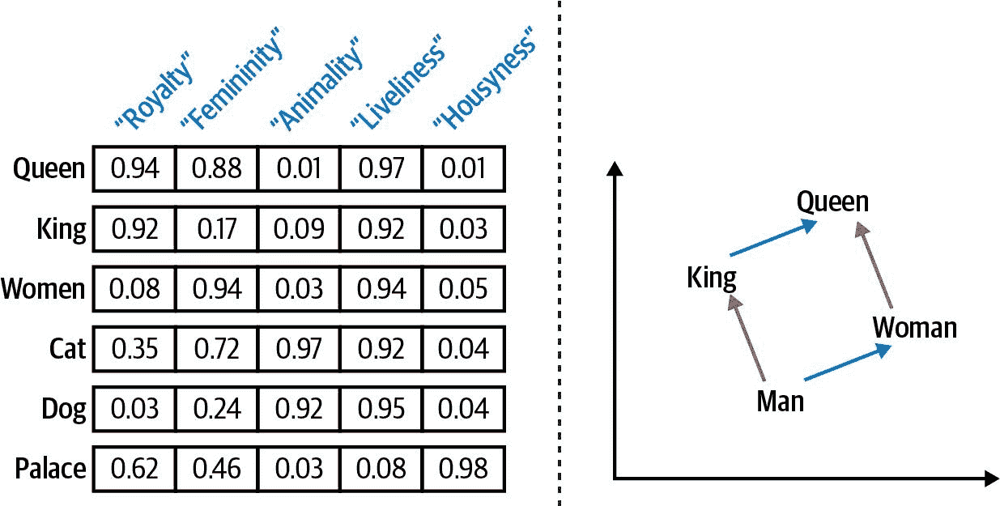
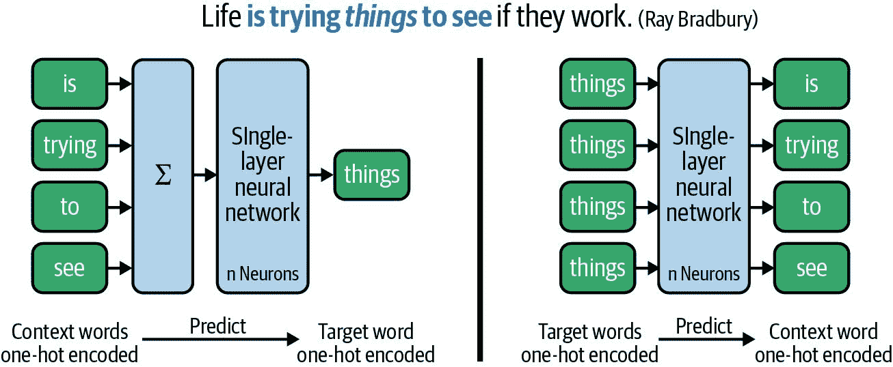
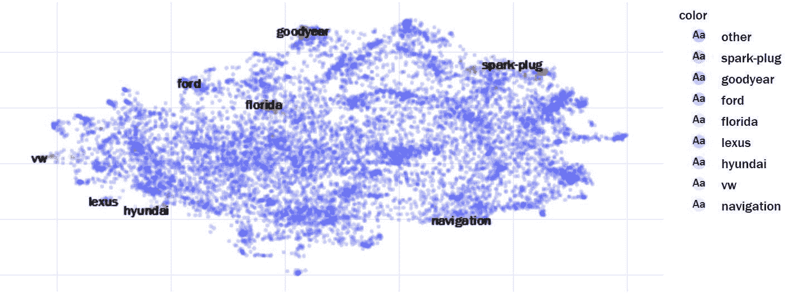
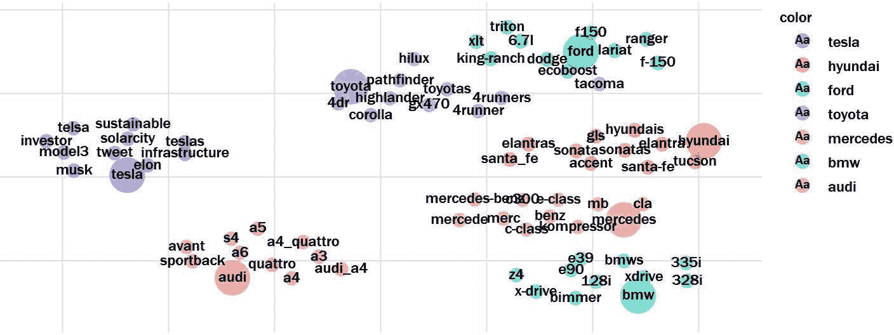
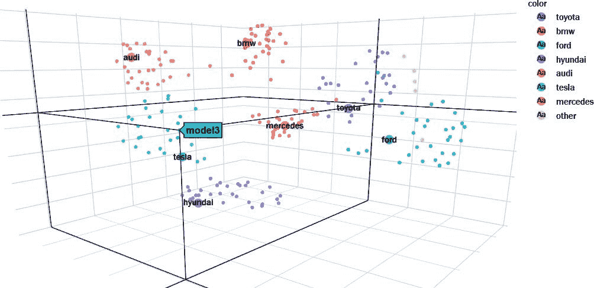
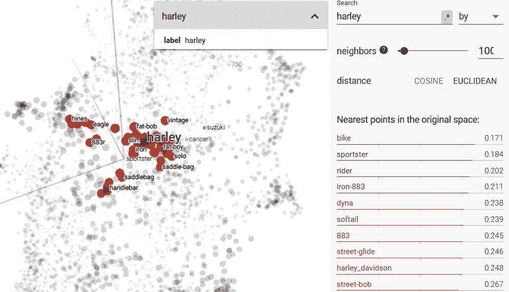
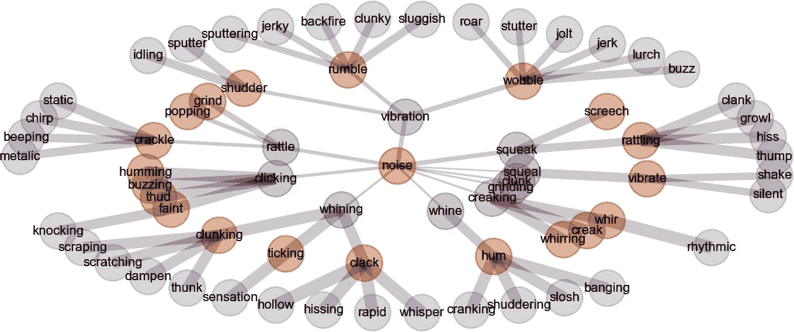
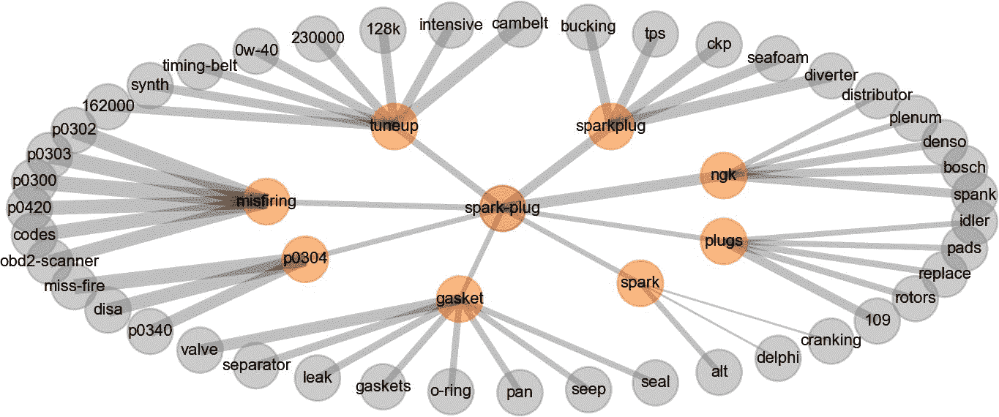

# 第十章。利用词嵌入探索语义关系

相似性的概念对所有机器学习任务都是基础性的。在第五章中，我们解释了如何基于词袋模型计算文本相似性。给定两个文档的 TF-IDF 向量，它们的余弦相似度可以轻松计算，我们可以使用这些信息来搜索、聚类或分类相似的文档。

然而，在词袋模型中，相似性的概念完全基于两个文档中共同单词的数量。如果文档没有共享任何标记，文档向量的点积以及因此的余弦相似度将为零。考虑以下关于一部新电影的两条社交平台评论：

> “多么美妙的电影。”
> 
> “这部电影很棒。”

显然，尽管使用完全不同的词语，这些评论具有类似的含义。在本章中，我们将介绍词嵌入作为捕捉单词语义并用于探索语义相似性的一种手段。

# 您将学到什么以及我们将构建什么

对于我们的用例，我们假设我们是市场研究人员，希望使用关于汽车的文本来更好地理解汽车市场中的一些关系。具体而言，我们想探索汽车品牌和型号之间的相似性。例如，品牌 A 的哪些型号与品牌 B 的特定型号最相似？

我们的语料库包括 Reddit 自我帖子数据集汽车类别中的 20 个子社区，这在第四章中已经使用过。每个子社区都包含关于 Mercedes、Toyota、Ford 和 Harley-Davidson 等品牌的汽车和摩托车的 1,000 条帖子。由于这些帖子是用户编写的问题、答案和评论，我们实际上可以了解到这些用户隐含地认为什么是相似的。

我们将再次使用[Gensim 库](https://oreil.ly/HaYkR)，这在第八章中已经介绍过。它提供了一个良好的 API 来训练不同类型的嵌入，并使用这些模型进行语义推理。

学习本章后，您将能够使用词嵌入进行语义分析。您将知道如何使用预训练的嵌入，如何训练自己的嵌入，如何比较不同的模型以及如何可视化它们。您可以在我们的[GitHub 代码库](https://oreil.ly/W1ztU)中找到本章的源代码以及部分图像。

# 语义嵌入的理由

在前几章中，我们使用 TF-IDF 向量化我们的模型。这种方法易于计算，但也有一些严重的缺点：

+   文档向量具有由词汇量大小定义的非常高的维度。因此，向量非常稀疏；即大多数条目为零。

+   它在短文本（如 Twitter 消息、服务评论和类似内容）中表现不佳，因为短文本中共同词的概率较低。

+   高级应用例如情感分析、问答或机器翻译需要准确捕捉单词的实际含义以正确工作。

尽管词袋模型在分类或主题建模等任务中表现出色，但仅当文本足够长且有足够的训练数据时。请记住，词袋模型中的相似性仅基于显著共同单词的存在。

而*嵌入*则是一个密集的数值向量表示对象，捕捉某种*语义*相似性。当我们在文本分析的背景下讨论嵌入时，我们必须区分单词嵌入和文档嵌入。*单词嵌入*是单个单词的向量表示，而*文档嵌入*是代表文档的向量。在这一章节中，我们将重点关注单词的密集向量表示。

## 单词嵌入

嵌入算法的目标可以定义如下：给定一个维度<math alttext="d"><mi>d</mi></math>，找到单词的向量表示，使得具有相似含义的单词具有相似的向量。维度<math alttext="d"><mi>d</mi></math>是任何单词嵌入算法的超参数。通常设置在 50 到 300 之间。

维度本身没有预定义或人类可理解的含义。相反，模型从文本中学习单词之间的潜在关系。图 10-1（左）展示了这一概念。我们对每个单词有五维向量。这些维度中的每一个代表单词之间某种关系，使得在这一维度上相似的单词具有类似的值。所示的维度名称是对这些值的可能解释。



###### 图 10-1\. 密集向量表示语义相似性的标注（左）可用于回答类比问题（右）。我们对向量维度命名为“Royalty”等来展示可能的解释。^(1)

训练的基本思想是在相似上下文中出现的单词具有相似的含义。这被称为*分布假设*。例如，以下描述*tesgüino*的句子：^(2)

+   桌子上有一瓶 ___。

+   每个人都喜欢 ___。

+   开车前不要 ___。

+   我们用玉米制造 ___。

即使不了解*tesgüino*这个词，通过分析典型语境，你也能对其含义有相当好的理解。你还可以识别语义上相似的单词，因为你知道它是一种酒精饮料。

## 使用单词嵌入进行类比推理

真正令人惊讶的是，用这种方法构建的词向量使我们能够通过向量代数检测类似于“queen is to king like woman is to man”的类比（见图 10-1 右侧）。设 <math alttext="v left-parenthesis w right-parenthesis"><mrow><mi>v</mi> <mo>(</mo> <mi>w</mi> <mo>)</mo></mrow></math> 为单词 <math alttext="w"><mi>w</mi></math> 的词嵌入。那么这个类比可以用数学方式表达如下：

<math alttext="v left-parenthesis q u e e n right-parenthesis minus v left-parenthesis k i n g right-parenthesis almost-equals v left-parenthesis w o m a n right-parenthesis minus v left-parenthesis m a n right-parenthesis" display="block"><mrow><mi>v</mi> <mo>(</mo> <mi>q</mi> <mi>u</mi> <mi>e</mi> <mi>e</mi> <mi>n</mi> <mo>)</mo> <mo>-</mo> <mi>v</mi> <mo>(</mo> <mi>k</mi> <mi>i</mi> <mi>n</mi> <mi>g</mi> <mo>)</mo> <mo>≈</mo> <mi>v</mi> <mo>(</mo> <mi>w</mi> <mi>o</mi> <mi>m</mi> <mi>a</mi> <mi>n</mi> <mo>)</mo> <mo>-</mo> <mi>v</mi> <mo>(</mo> <mi>m</mi> <mi>a</mi> <mi>n</mi> <mo>)</mo></mrow></math>

如果这个近似等式成立，我们可以将这个类比重述为一个问题：像“king”对应于“man”，“woman”对应于什么？或者数学上表示为：^(3)

<math alttext="v left-parenthesis w o m a n right-parenthesis plus left-bracket v left-parenthesis k i n g right-parenthesis minus v left-parenthesis m a n right-parenthesis right-bracket almost-equals question-mark" display="block"><mrow><mi>v</mi> <mrow><mo>(</mo> <mi>w</mi> <mi>o</mi> <mi>m</mi> <mi>a</mi> <mi>n</mi> <mo>)</mo></mrow> <mo>+</mo> <mfenced separators="" open="[" close="]"><mi>v</mi> <mo>(</mo> <mi>k</mi> <mi>i</mi> <mi>n</mi> <mi>g</mi> <mo>)</mo> <mo>-</mo> <mi>v</mi> <mo>(</mo> <mi>m</mi> <mi>a</mi> <mi>n</mi> <mo>)</mo></mfenced> <mo>≈</mo> <mo>?</mo></mrow></math>

这种方式允许一种模糊推理来回答类似于这样的类比问题：“巴黎是法国的首都，那么德国的首都是什么？”或者在市场研究场景中，正如我们将要探索的那样：“考虑到 F-150 是福特的皮卡，那么丰田的类似车型是什么？”

## 嵌入类型

已经开发了几种算法来训练词嵌入。Gensim 允许您训练 Word2Vec 和 FastText 词嵌入。GloVe 词嵌入可以用于相似性查询，但不能与 Gensim 一起训练。我们介绍了这些算法的基本思想，并简要解释了更先进但也更复杂的上下文嵌入方法。您将在本章末找到原始论文的参考文献和进一步的解释。

### Word2Vec

尽管之前已经有过词嵌入的方法，但谷歌的 Tomáš Mikolov（Mikolov 等人，2013 年）的工作标志着一个里程碑，因为它在类比任务上显著优于以前的方法，特别是刚刚解释的那些任务。Word2Vec 有两个变体，即*连续词袋模型*（CBOW）和*跳字模型*（见图 10-2）。



###### 图 10-2\. 连续词袋模型（左）与跳字模型（右）。

这两种算法都在文本上使用一个滑动窗口，由目标词 <math alttext="w Subscript t"><msub><mi>w</mi> <mi>t</mi></msub></math> 和上下文窗口大小 <math alttext="c"><mi>c</mi></math> 定义。在这个例子中，<math alttext="c equals 2"><mrow><mi>c</mi> <mo>=</mo> <mn>2</mn></mrow></math> ，即训练样本由五个词组成 <math alttext="w Subscript t minus 2 Baseline comma ellipsis comma w Subscript t plus 2 Baseline"><mrow><msub><mi>w</mi> <mrow><mi>t</mi><mo>-</mo><mn>2</mn></mrow></msub> <mo>,</mo> <mo>⋯</mo> <mo>,</mo> <msub><mi>w</mi> <mrow><mi>t</mi><mo>+</mo><mn>2</mn></mrow></msub></mrow></math> 。其中一种训练样本以粗体显示：**... is trying *things* to see ...**。在 CBOW 架构（左侧），模型被训练来预测从上下文词到目标词。这里，一个训练样本由上下文词的独热编码向量的总和或平均值以及目标词作为标签。相比之下，skip-gram 模型（右侧）被训练来预测给定目标词的上下文词。在这种情况下，每个目标词为每个上下文词生成一个单独的训练样本；没有向量平均。因此，skip-gram 训练速度较慢（对于大窗口大小来说要慢得多！），但通常能够更好地处理不常见的词语。

这两种嵌入算法都使用了一个简单的单层神经网络和一些技巧来进行快速和可扩展的训练。学习到的嵌入实际上是由隐藏层的权重矩阵定义的。因此，如果你想学习 100 维的向量表示，隐藏层必须由 100 个神经元组成。输入和输出的词语都由独热向量表示。嵌入的维度和上下文窗口的大小 <math alttext="c"><mi>c</mi></math> 都是所有这里介绍的嵌入方法中的超参数。我们将在本章后面探讨它们对嵌入的影响。

### GloVe

[全局向量（GloVe）方法](https://oreil.ly/7hIGW)，由斯坦福自然语言处理组在 2014 年开发，使用全局共现矩阵来计算词向量，而不是一个预测任务（Pennington 等，2014 年）。一个大小为 <math alttext="upper V"><mi>V</mi></math> 的词汇的共现矩阵具有维度 <math alttext="upper V times upper V"><mrow><mi>V</mi> <mo>×</mo> <mi>V</mi></mrow></math> 。矩阵中的每个单元 <math alttext="left-parenthesis i comma j right-parenthesis"><mrow><mo>(</mo> <mi>i</mi> <mo>,</mo> <mi>j</mi> <mo>)</mo></mrow></math> 包含基于固定上下文窗口大小的词 <math alttext="w Subscript i"><msub><mi>w</mi> <mi>i</mi></msub></math> 和 <math alttext="w Subscript j"><msub><mi>w</mi> <mi>j</mi></msub></math> 的共现次数。这些嵌入是通过类似于主题建模或降维技术中使用的矩阵分解技术来推导的。

这个模型被称为*全局*，因为共现矩阵捕获全局语料库统计，与只使用局部上下文窗口进行预测任务的 Word2Vec 形成对比。 GloVe 通常不比 Word2Vec 表现更好，但根据训练数据和任务的不同，它产生类似的好结果（参见 Levy 等人，2014 年，进行讨论）。

### FastText

我们介绍的第三种模型再次由一支由**Tomáš Mikolov**领导的团队在 Facebook 开发（Joulin 等人，2017 年）。 主要动机是处理词汇外的词汇。 无论是 Word2Vec 还是 GloVe，都仅为训练语料库中包含的词汇生成词嵌入。 相比之下，[FastText](https://fasttext.cc)利用字符 n-gram 的子词信息来推导向量表示。 例如，*fasttext*的字符三元组是*fas*，*ast*，*stt*，*tte*，*tex*和*ext*。 使用的 n-gram 长度（最小和最大）是模型的超参数。

任何单词向量都是从其字符 n-grams 的嵌入构建的。 并且即使是模型以前未见过的单词，大多数字符 n-gram 也有嵌入。 例如，*fasttext*的向量将类似于*fast*和*text*，因为它们有共同的 n-grams。 因此，FastText 非常擅长为通常是词汇外的拼写错误的单词找到嵌入。

### 深度上下文化的嵌入

单词的语义含义往往取决于其上下文。 想想“我是对的”和“请右转”中*right*一词的不同含义^（4）。 所有这三种模型（Word2Vec，GloVe 和 FastText）每个单词仅有一个向量表示；它们无法区分依赖上下文的语义。

类似*来自语言模型的嵌入*（ELMo）的上下文化嵌入考虑上下文，即前后的单词（Peters 等人，2018 年）。 没有为每个单词存储一个可以简单查找的单词向量。 相反，ELMo 通过多层双向长短期记忆神经网络（LSTM）传递整个句子，并从内部层的权重组合每个单词的向量。 最近的模型如 BERT 及其后继模型通过使用注意力变换器而不是双向 LSTM 改进了这种方法。 所有这些模型的主要优点是迁移学习：能够使用预训练的语言模型并针对特定的下游任务（如分类或问题回答）进行微调。 我们将在第十一章中更详细地介绍这个概念。

# 蓝图：在预训练模型上使用相似性查询

所有这些理论之后，让我们开始一些实践。在我们的第一个例子中，我们使用预训练的嵌入。这些具有优势，即其他人已经在大型语料库（如维基百科或新闻文章）上花费了训练工作。在我们的蓝图中，我们将检查可用的模型，加载其中一个，并对单词向量进行推理。

## 加载预训练模型

几个模型可以公开下载。^(5) 我们稍后会描述如何加载自定义模型，但在这里，我们将使用 Gensim 的方便下载 API。

根据默认设置，Gensim 将模型存储在 `~/gensim-data` 下。如果您想将其更改为自定义路径，可以在导入下载器 API 之前设置环境变量 `GENSIM_DATA_DIR`。我们将所有模型存储在本地目录 `models` 中：

```py
import os
os.environ['GENSIM_DATA_DIR'] = './models'

```

现在让我们看看可用的模型。以下行将由 `api.info()['models']` 返回的字典转换为 `DataFrame`，以获得格式良好的列表，并显示总共 13 个条目中的前五个：

```py
import gensim.downloader as api

info_df = pd.DataFrame.from_dict(api.info()['models'], orient='index')
info_df[['file_size', 'base_dataset', 'parameters']].head(5)

```

|  | file_size | base_dataset | parameters |
| --- | --- | --- | --- |
| fasttext-wiki-news-subwords-300 | 1005007116 | Wikipedia 2017, UMBC webbase corpus and statmt.org news dataset (16B tokens) | {'dimension’: 300} |
| conceptnet-numberbatch-17-06-300 | 1225497562 | ConceptNet, word2vec, GloVe, and OpenSubtitles 2016 | {'dimension’: 300} |
| word2vec-ruscorpora-300 | 208427381 | Russian National Corpus (about 250M words) | {'dimension’: 300, ‘window_size’: 10} |
| word2vec-google-news-300 | 1743563840 | Google News (about 100 billion words) | {'dimension’: 300} |
| glove-wiki-gigaword-50 | 69182535 | Wikipedia 2014 + Gigaword 5（6B tokens, uncased） | {'dimension’: 50} |

我们将使用 *glove-wiki-gigaword-50* 模型。这个具有 50 维单词向量的模型体积较小，但对我们的目的来说完全足够。它在大约 60 亿个小写标记上进行了训练。`api.load` 如果需要会下载模型，然后将其加载到内存中：

```py
model = api.load("glove-wiki-gigaword-50")

```

我们下载的文件实际上并不包含完整的 GloVe 模型，而只包含纯粹的词向量。由于未包含模型的内部状态，这种简化模型无法进一步训练。

## 相似性查询

给定一个模型，可以通过属性 `model.wv['king']` 或甚至更简单地通过快捷方式 `model['king']` 访问单词 *king* 的向量。让我们看看 *king* 和 *queen* 的 50 维向量的前 10 个分量。

```py
v_king = model['king']
v_queen = model['queen']

print("Vector size:", model.vector_size)
print("v_king  =", v_king[:10])
print("v_queen =", v_queen[:10])
print("similarity:", model.similarity('king', 'queen'))

```

`输出：`

```py
Vector size: 50
v_king  = [ 0.5   0.69 -0.6  -0.02  0.6  -0.13 -0.09  0.47 -0.62 -0.31]
v_queen = [ 0.38  1.82 -1.26 -0.1   0.36  0.6  -0.18  0.84 -0.06 -0.76]
similarity: 0.7839043

```

顾名思义，在许多维度上的值是相似的，导致高达 0.78 的高相似性分数。因此，*queen* 与 *king* 相当相似，但它是最相似的词吗？好的，让我们通过调用相应的函数来检查与 *king* 最相似的三个词：

```py
model.most_similar('king', topn=3)

```

`输出：`

```py
[('prince', 0.824), ('queen', 0.784), ('ii', 0.775)]

```

实际上，男性的*prince*比*queen*更相似，但*queen*在列表中排名第二，其后是罗马数字 II，因为许多国王被称为“第二”。

单词向量的相似性分数通常通过余弦相似度计算，这在第五章中介绍过。Gensim 提供了几种变体的相似性函数。例如，`cosine_similarities`方法计算单词向量与其他单词向量数组之间的相似度。让我们比较*king*与更多单词：

```py
v_lion = model['lion']
v_nano = model['nanotechnology']

model.cosine_similarities(v_king, [v_queen, v_lion, v_nano])

```

`Out:`

```py
array([ 0.784,  0.478, -0.255], dtype=float32)

```

基于模型的训练数据（维基百科和 Gigaword），模型假设单词*king*与*queen*相似，与*lion*略有相似，但与*nanotechnology*完全不相似。需要注意的是，与非负 TF-IDF 向量不同，单词嵌入在某些维度上也可能是负的。因此，相似度值范围从<math alttext="plus 1"><mrow><mo>+</mo> <mn>1</mn></mrow></math>到<math alttext="negative 1"><mrow><mo>-</mo> <mn>1</mn></mrow></math>不等。

先前使用的`most_similar()`函数还允许两个参数，`positive`和`negative`，每个参数都是向量列表。如果<math alttext="p o s i t i v e equals left-bracket p o s 1 comma ellipsis comma p o s Subscript n Baseline right-bracket"><mrow><mi>p</mi> <mi>o</mi> <mi>s</mi> <mi>i</mi> <mi>t</mi> <mi>i</mi> <mi>v</mi> <mi>e</mi> <mo>=</mo> <mo>[</mo> <mi>p</mi> <mi>o</mi> <msub><mi>s</mi> <mn>1</mn></msub> <mo>,</mo> <mo>⋯</mo> <mo>,</mo> <mi>p</mi> <mi>o</mi> <msub><mi>s</mi> <mi>n</mi></msub> <mo>]</mo></mrow></math>和<math alttext="n e g a t i v e equals left-bracket n e g 1 comma ellipsis comma n e g Subscript m Baseline right-bracket"><mrow><mi>n</mi> <mi>e</mi> <mi>g</mi> <mi>a</mi> <mi>t</mi> <mi>i</mi> <mi>v</mi> <mi>e</mi> <mo>=</mo> <mo>[</mo> <mi>n</mi> <mi>e</mi> <msub><mi>g</mi> <mn>1</mn></msub> <mo>,</mo> <mo>⋯</mo> <mo>,</mo> <mi>n</mi> <mi>e</mi> <msub><mi>g</mi> <mi>m</mi></msub> <mo>]</mo></mrow></math>，那么此函数将找到与<math alttext="sigma-summation Underscript i equals 1 Overscript n Endscripts p o s Subscript i minus sigma-summation Underscript j equals 1 Overscript m Endscripts n e g Subscript j"><mrow><msubsup><mo>∑</mo> <mrow><mi>i</mi><mo>=</mo><mn>1</mn></mrow> <mi>n</mi></msubsup> <mi>p</mi> <mi>o</mi> <msub><mi>s</mi> <mi>i</mi></msub> <mo>-</mo> <msubsup><mo>∑</mo> <mrow><mi>j</mi><mo>=</mo><mn>1</mn></mrow> <mi>m</mi></msubsup> <mi>n</mi> <mi>e</mi> <msub><mi>g</mi> <mi>j</mi></msub></mrow></math>最相似的单词向量。

因此，我们可以用 Gensim 来制定关于皇室的类比查询：

```py
model.most_similar(positive=['woman', 'king'], negative=['man'], topn=3)

```

`Out:`

```py
[('queen', 0.852), ('throne', 0.766), ('prince', 0.759)]

```

以及关于德国首都的问题：

```py
model.most_similar(positive=['paris', 'germany'], negative=['france'], topn=3)

```

`Out:`

```py
[('berlin', 0.920), ('frankfurt', 0.820), ('vienna', 0.818)]

```

我们也可以省略负面列表，以找到与*france*和*capital*之和最接近的单词：

```py
model.most_similar(positive=['france', 'capital'], topn=1)

```

`Out:`

```py
[('paris', 0.784)]

```

实际上，它就是`paris`！这真是令人惊叹，显示了词向量的巨大威力。然而，正如在机器学习中一样，模型并不完美。它们只能学习到数据中存在的内容。因此，并非所有相似性查询都会产生如此惊人的结果，下面的例子就说明了这一点：

```py
model.most_similar(positive=['greece', 'capital'], topn=3)

```

`Out:`

```py
[('central', 0.797), ('western', 0.757), ('region', 0.750)]

```

显然，模型没有足够的训练数据来推导雅典和希腊之间的关系。

###### 注意

Gensim 还提供了余弦相似度的一种变体，`most_similar_cosmul`。这对于类比查询比前面显示的方法更有效，因为它平滑了一个大相似性项主导方程的效果（Levy 等，2015）。然而，对于前面的例子，返回的单词将是相同的，但相似性分数将更高。

如果您使用来自维基百科和新闻文章的编辑文本来训练嵌入，您的模型将能够很好地捕捉到类似首都-国家的事实关系。但是，对于市场研究问题，比较不同品牌产品的情况呢？通常这些信息在维基百科上找不到，而是在最新的社交平台上，人们在讨论产品。如果您在社交平台上使用用户评论来训练嵌入，您的模型将学习到来自用户讨论的词语关联。这样，它就成为了人们对关系的*认知*表示，独立于其是否客观真实。这是一个有趣的副作用，您应该意识到。通常，您希望捕捉到这种特定应用的偏见，这也是我们接下来要做的事情。但是请注意，每个训练语料库都包含一定的偏见，这可能还会导致一些不希望的副作用（参见“男人对计算机程序员如同女人对家庭主妇”）。

# 训练和评估自己嵌入的蓝图

在本节中，我们将在 Reddit Selfposts 数据集中的 2 万个关于汽车的用户帖子上训练和评估特定领域的嵌入。在开始训练之前，我们必须考虑数据准备的选项，因为这总是对模型在特定任务中的实用性产生重要影响的因素。

## 数据准备

Gensim 要求输入训练的令牌序列。除了分词之外，还有一些其他方面需要考虑数据准备。根据分布假设，经常一起出现或在相似上下文中的单词将获得相似的向量。因此，我们应确保确实识别了这些共现关系。如果像我们这里的示例一样训练句子不多，您应在预处理中包括这些步骤：

1.  清理文本，去除不需要的标记（符号、标签等）。

1.  将所有单词转换为小写。

1.  使用引理。

所有这些都使得词汇量保持较小，训练时间较短。当然，如果根据这些规则修剪我们的训练数据，屈折形式和大写字词将会是词汇外的情况。对于我们想要进行的名词语义推理来说，这不是问题，但如果我们想要分析例如情感，这可能会成为问题。此外，您应考虑以下标记类别：

停用词

停用词可以提供有关非停用词语境的宝贵信息。因此，我们更倾向于保留停用词。

数字

根据应用程序的不同，数字可能是有价值的，也可能只是噪音。在我们的例子中，我们正在查看汽车数据，并且肯定希望保留像`328`这样的标记，因为它是宝马车型的名称。如果数字携带相关信息，则应保留这些数字。

另一个问题是我们是否应该按句子拆分，还是仅保留帖子的原样。考虑虚构帖子“I like the BMW 328\. But the Mercedes C300 is also great.”这两个句子在我们的相似性任务中应该被视为两个不同的帖子吗？可能不应该。因此，我们将所有用户帖子中的所有词形的列表视为一个单独的“句子”用于训练。

我们已经为第四章中的 2 万条 Reddit 汽车帖子准备了词形。因此，在这里我们可以跳过数据准备的这一部分，直接将词形加载到 Pandas 的`DataFrame`中：

```py
db_name = "reddit-selfposts.db"
con = sqlite3.connect(db_name)
df = pd.read_sql("select subreddit, lemmas, text from posts_nlp", con)
con.close()

df['lemmas'] = df['lemmas'].str.lower().str.split() # lower case tokens
sents = df['lemmas'] # our training "sentences"

```

### 短语

特别是在英语中，如果一个词是复合短语的一部分，那么该词的含义可能会发生变化。例如，*timing belt*，*seat belt*或*rust belt*。所有这些复合词虽然都可以在我们的语料库中找到，但它们的含义各不相同。因此，将这些复合词视为单个标记可能更为合适。

我们可以使用任何算法来检测这些短语，例如 spaCy 检测名词块（见“使用 spaCy 进行语言处理”）。还有许多统计算法可用于识别这样的搭配，如异常频繁的 n-gram。原始的 Word2Vec 论文（Mikolov 等人，2013）使用了一种简单但有效的基于*点间互信息*（PMI）的算法，基本上衡量了两个词出现之间的统计依赖性。

对于我们现在正在训练的模型，我们使用了一个高级版本，称为*归一化点间互信息*（NPMI），因为它能提供更稳健的结果。鉴于其值范围有限，从<math alttext="negative 1"><mrow><mo>-</mo> <mn>1</mn></mrow></math>到<math alttext="plus 1"><mrow><mo>+</mo> <mn>1</mn></mrow></math>，它也更容易调整。我们在初始运行中将 NPMI 阈值设定为一个相当低的值，即 0.3\. 我们选择使用连字符作为短语中单词的分隔符。这将生成类似*harley-davidson*的复合标记，无论如何这些标记都会在文本中找到。如果使用默认的下划线分隔符，则会产生不同的标记：

```py
from gensim.models.phrases import Phrases, npmi_scorer

phrases = Phrases(sents, min_count=10, threshold=0.3,
                  delimiter=b'-', scoring=npmi_scorer)

```

通过这种短语模型，我们可以识别一些有趣的复合词：

```py
sent = "I had to replace the timing belt in my mercedes c300".split()
phrased = phrases[sent]
print('|'.join(phrased))

```

`Out:`

```py
I|had|to|replace|the|timing-belt|in|my|mercedes-c300

```

*timing-belt*很好，但我们不希望为品牌和型号名称的组合构建复合词，比如*奔驰 c300*。因此，我们将分析短语模型，找到一个合适的阈值。显然，选择的值太低了。以下代码导出我们语料库中找到的所有短语及其分数，并将结果转换为`DataFrame`以便轻松检查：

```py
phrase_df = pd.DataFrame(phrases.export_phrases(sents),
                         columns =['phrase', 'score'])
phrase_df = phrase_df[['phrase', 'score']].drop_duplicates() \
            .sort_values(by='score', ascending=False).reset_index(drop=True)
phrase_df['phrase'] = phrase_df['phrase'].map(lambda p: p.decode('utf-8'))

```

现在我们可以检查哪个阈值适合*奔驰*：

```py
phrase_df[phrase_df['phrase'].str.contains('mercedes')]

```

|  | 短语 | 分数 |
| --- | --- | --- |
| 83 | 奔驰 | 0.80 |
| 1417 | 奔驰 c300 | 0.47 |

如我们所见，阈值应该大于 0.5 且小于 0.8。通过检查*宝马*、*福特*或*哈雷戴维森*等几个其他品牌，我们确定 0.7 是一个很好的阈值，可以识别复合供应商名称，但保持品牌和型号分开。实际上，即使是 0.7 这样严格的阈值，短语模型仍然保留了许多相关的词组，例如*street glide*（哈雷戴维森）、*land cruiser*（丰田）、*forester xt*（斯巴鲁）、*water pump*、*spark plug*或*timing belt*。

我们重建了我们的短语分析器，并在我们的`DataFrame`中为复合词创建了一个新列，该列包含单词标记：

```py
phrases = Phrases(sents, min_count=10, threshold=0.7,
                  delimiter=b'-', scoring=npmi_scorer)

df['phrased_lemmas'] = df['lemmas'].map(lambda s: phrases[s])
sents = df['phrased_lemmas']

```

我们数据准备步骤的结果是由词形和短语组成的句子。现在，我们将训练不同的嵌入模型，并检查我们能从中获得哪些见解。

## 蓝图：使用 Gensim 训练模型

使用 Gensim 可以方便地训练 Word2Vec 和 FastText 嵌入。以下调用`Word2Vec`在语料库上训练了 100 维的 Word2Vec 嵌入，窗口大小为 2，即目标词的±2 个上下文词。为了说明，还传递了一些其他相关超参数。我们使用 skip-gram 算法，并在四个线程中训练网络五次迭代：

```py
from gensim.models import Word2Vec

model = Word2Vec(sents,       # tokenized input sentences
                 size=100,    # size of word vectors (default 100)
                 window=2,    # context window size (default 5)
                 sg=1,        # use skip-gram (default 0 = CBOW)
                 negative=5,  # number of negative samples (default 5)
                 min_count=5, # ignore infrequent words (default 5)
                 workers=4,   # number of threads (default 3)
                 iter=5)      # number of epochs (default 5)

```

在 i7 笔记本电脑上，处理 2 万个句子大约需要 30 秒，速度相当快。增加样本数和迭代次数，以及更长的向量和更大的上下文窗口，会增加训练时间。例如，在这种设置下训练 30 大小的 100 维向量，跳跃图算法大约需要 5 分钟。相比之下，CBOW 的训练时间与上下文窗口的大小无关。

以下调用将完整模型保存到磁盘。*完整模型*意味着包括所有内部状态的完整神经网络。这样，模型可以再次加载并进一步训练：

```py
model.save('./models/autos_w2v_100_2_full.bin')

```

算法的选择以及这些超参数对生成的模型影响很大。因此，我们提供了一个训练和检查不同模型的蓝图。参数网格定义了将为 Word2Vec 或 FastText 训练哪些算法变体（CBOW 或 skip-gram）和窗口大小。我们也可以在这里变化向量大小，但这个参数的影响不是很大。根据我们的经验，在较小的语料库中，50 或 100 维的向量效果很好。因此，我们在实验中将向量大小固定为 100：

```py
from gensim.models import Word2Vec, FastText

model_path = './models'
model_prefix = 'autos'

param_grid = {'w2v': {'variant': ['cbow', 'sg'], 'window': [2, 5, 30]},
              'ft': {'variant': ['sg'], 'window': [5]}}
size = 100

for algo, params in param_grid.items():
    for variant in params['variant']:
        sg = 1 if variant == 'sg' else 0
        for window in params['window']:
            if algo == 'w2v':
                model = Word2Vec(sents, size=size, window=window, sg=sg)
            else:
                model = FastText(sents, size=size, window=window, sg=sg)

            file_name = f"{model_path}/{model_prefix}_{algo}_{variant}_{window}"
            model.wv.save_word2vec_format(file_name + '.bin', binary=True)

```

由于我们只想分析语料库内的相似性，我们不保存完整的模型，而是仅保存纯单词向量。这些由`KeyedVectors`类表示，并且可以通过模型属性`model.wv`访问。这样生成的文件更小，并且完全足够我们的目的。

###### 警告

要注意信息丢失！当您重新加载仅由单词向量组成的模型时，它们无法进一步训练。此外，FastText 模型失去了为超出词汇表单词推导嵌入的能力。

## 蓝图：评估不同的模型

实际上，对于特定领域任务和语料库，算法化地确定最佳超参数是相当困难的。因此，检查模型的表现并手动验证它们如何执行以识别一些已知的关系并非坏主意。

仅包含单词向量的保存文件很小（每个约 5 MB），因此我们可以将许多文件加载到内存中并运行一些比较。我们使用五个模型的子集来说明我们的发现。这些模型存储在一个由模型名称索引的字典中。您可以添加任何您想比较的模型，甚至是早期预训练的 GloVe 模型：

```py
from gensim.models import KeyedVectors

names = ['autos_w2v_cbow_2', 'autos_w2v_sg_2',
         'autos_w2v_sg_5', 'autos_w2v_sg_30', 'autos_ft_sg_5']
models = {}

for name in names:
    file_name = f"{model_path}/{name}.bin"
    models[name] = KeyedVectors.load_word2vec_format(file_name, binary=True)

```

我们提供了一个小的蓝图函数用于比较。它接受一个模型列表和一个单词，并生成一个`DataFrame`，其中包含根据每个模型最相似的单词：

```py
def compare_models(models, **kwargs):

    df = pd.DataFrame()
    for name, model in models:
        df[name] = [f"{word} {score:.3f}"
                    for word, score in model.most_similar(**kwargs)]
    df.index = df.index + 1 # let row index start at 1
    return df

```

现在让我们看看参数对我们计算的模型有什么影响。因为我们要分析汽车市场，我们查看与*宝马*最相似的单词：

```py
compare_models([(n, models[n]) for n in names], positive='bmw', topn=10)

```

|  | autos_w2v_cbow_2 | autos_w2v_sg_2 | autos_w2v_sg_5 | autos_w2v_sg_30 | autos_ft_sg_5 |
| --- | --- | --- | --- | --- | --- |
| 1 | 梅赛德斯 0.873 | 奔驰 0.772 | 奔驰 0.808 | xdrive 0.803 | 宝马 0.819 |
| 2 | 莱克萨斯 0.851 | 奔驰 0.710 | 335i 0.740 | 328i 0.797 | bmwfs 0.789 |
| 3 | 大众 0.807 | 保时捷 0.705 | 328i 0.736 | f10 0.762 | m135i 0.774 |
| 4 | 奔驰 0.806 | 莱克萨斯 0.704 | 奔驰 0.723 | 335i 0.760 | 335i 0.773 |
| 5 | 沃尔沃 0.792 | 奔驰 0.695 | x-drive 0.708 | 535i 0.755 | 梅赛德斯-奔驰 0.765 |
| 6 | 哈雷 0.783 | 梅赛德斯 0.693 | 135i 0.703 | 宝马 0.745 | 奔驰 0.760 |
| 7 | 保时捷 0.781 | 奔驰-奔驰 0.680 | 梅赛德斯 0.690 | x-drive 0.740 | 35i 0.747 |
| 8 | 斯巴鲁 0.777 | 奥迪 0.675 | e92 0.685 | 5 系列 0.736 | 奔驰 0.747 |
| 9 | MB 0.769 | 335i 0.670 | 奔驰-奔驰 0.680 | 550i 0.728 | 135i 0.746 |
| 10 | 大众 0.768 | 135i 0.662 | 奔驰 0.679 | 435i 0.726 | 435i 0.744 |

有趣的是，窗口大小为 2 的第一批模型主要生成其他汽车品牌，而窗口大小为 30 的模型基本上生成了不同 BMW 型号的列表。事实上，较短的窗口强调范式关系，即可以在句子中互换的词语。在我们的案例中，这将是品牌，因为我们正在寻找类似*BMW*的词语。较大的窗口捕获更多的语法关系，其中词语之间的相似性在于它们经常在相同的上下文中出现。窗口大小为 5，即默认值，产生了两者的混合。对于我们的数据，CBOW 模型最好地表示了范式关系，而语法关系则需要较大的窗口大小，因此更适合由 skip-gram 模型捕获。FastText 模型的输出显示了其性质，即拼写相似的词语得到相似的分数。

### 寻找相似概念

窗口大小为 2 的 CBOW 向量在范式关系上非常精确。从一些已知术语开始，我们可以使用这样的模型来识别领域的核心术语和概念。表 10-1 展示了在模型`autos_w2v_cbow_2`上进行一些相似性查询的输出。列`concept`是我们添加的，以突出我们预期的输出词语类型。

表 10-1\. 使用 CBOW 模型和窗口大小为 2 查找选定词语的最相似邻居

| Word | Concept | Most Similar |
| --- | --- | --- |
| toyota | 汽车品牌 | ford mercedes nissan certify dodge mb bmw lexus chevy honda |
| camry | 汽车型号 | corolla f150 f-150 c63 is300 ranger 335i 535i 328i rx |
| spark-plug | 汽车部件 | water-pump gasket thermostat timing-belt tensioner throttle-body serpentine-belt radiator intake-manifold fluid |
| washington | 地点 | oregon southwest ga ottawa san_diego valley portland mall chamber county |

当然，答案并不总是符合我们的期望；它们只是类似的词语。例如，*Toyota* 的列表中不仅包含汽车品牌，还包括多种型号。然而，在实际项目中，业务部门的领域专家可以轻松识别错误的术语，仍然找到有趣的新联想。但是，在以这种方式处理词嵌入时，手动筛选绝对是必要的。

### 我们自己模型上的类比推理

现在让我们看看我们的不同模型如何能够检测类似的概念。我们想要知道 Toyota 是否有一款与 Ford 的 F-150 皮卡相媲美的产品。因此，我们的问题是：“Toyota”对应于“Ford”的“F-150”的什么？我们使用之前的函数`compare_models`并对结果进行转置，以比较不同模型的`wv.most_similar()`结果：

```py
compare_models([(n, models[n]) for n in names],
               positive=['f150', 'toyota'], negative=['ford'], topn=5).T

```

`Out:`

|  | 1 | 2 | 3 | 4 | 5 |
| --- | --- | --- | --- | --- | --- |
| autos_w2v_cbow_2 | f-150 0.850 | 328i 0.824 | s80 0.820 | 93 0.819 | 4matic 0.817 |
| autos_w2v_sg_2 | f-150 0.744 | f-250 0.727 | dodge-ram 0.716 | tacoma 0.713 | ranger 0.708 |
| autos_w2v_sg_5 | tacoma 0.724 | tundra 0.707 | f-150 0.664 | highlander 0.644 | 4wd 0.631 |
| autos_w2v_sg_30 | 4runner 0.742 | tacoma 0.739 | 4runners 0.707 | 4wd 0.678 | tacomas 0.658 |
| autos_ft_sg_5 | toyotas 0.777 | toyo 0.762 | tacoma 0.748 | tacomas 0.745 | f150s 0.744 |

实际上，Toyota Tacoma 直接与 F-150 以及 Toyota Tundra 竞争。考虑到这一点，窗口大小为 5 的跳字模型给出了最佳结果。[⁶]实际上，如果你用*gmc*替换*toyota*，你会得到*sierra*，如果你要*chevy*，你会得到*silverado*作为这个模型最相似的车型。所有这些都是竞争激烈的全尺寸皮卡。对于其他品牌和车型，这也效果很好，但当然最适合那些在 Reddit 论坛中广泛讨论的模型。

# 可视化嵌入的蓝图

如果我们像本章一样基于词嵌入探索我们的语料库，我们对实际相似度分数不感兴趣，因为整个概念本质上是模糊的。我们想要理解的是基于接近性和相似性概念的语义关系。因此，视觉表现对于探索词嵌入及其关系非常有帮助。在本节中，我们将首先使用不同的降维技术来可视化嵌入。之后，我们将展示如何通过视觉探索给定关键词的语义邻域。正如我们将看到的那样，这种数据探索可以揭示领域特定术语之间非常有趣的关系。

## 应用降维蓝图

高维向量可以通过将数据投影到二维或三维来进行可视化。如果投影效果良好，可以直观地检测到相关术语的聚类，并更深入地理解语料库中的语义概念。我们将寻找相关词汇的聚类，并使用窗口大小为 30 的模型探索某些关键词的语义邻域，这有利于同位语关系。因此，我们期望看到一个“BMW”词汇组，包含 BMW 相关术语，一个“Toyota”词汇组，包含 Toyota 相关术语，等等。

在机器学习领域，降维也有许多用例。一些学习算法对高维且常稀疏的数据存在问题。诸如 PCA、t-SNE 或 UMAP（见“降维技术”）之类的降维技术试图通过投影来保留或甚至突出数据分布的重要方面。其一般思想是以一种方式投影数据，使得在高维空间中彼此接近的对象在投影中也接近，而远离的对象仍然保持距离。在我们的示例中，我们将使用 UMAP 算法，因为它为可视化提供了最佳结果。但是由于 `umap` 库实现了 scikit-learn 的估算器接口，你可以轻松地用 scikit-learn 的 `PCA` 或 `TSNE` 类替换 UMAP 缩减器。

下面的代码块包含了使用 UMAP 将嵌入投影到二维空间的基本操作，如 图 10-3 所示。在选择嵌入模型和要绘制的词（在本例中我们采用整个词汇表）之后，我们使用目标维数 `n_components=2` 实例化 UMAP 降维器。我们像往常一样使用余弦而不是标准的欧氏距离度量。然后通过调用 `reducer.fit_transform(wv)` 将嵌入投影到 2D。

```py
from umap import UMAP

model = models['autos_w2v_sg_30']
words = model.vocab
wv = [model[word] for word in words]

reducer = UMAP(n_components=2, metric='cosine', n_neighbors = 15, min_dist=0.1)
reduced_wv = reducer.fit_transform(wv)

```



###### 图 10-3\. 我们模型的所有词嵌入的二维 UMAP 投影。突出显示了一些词及其最相似的邻居，以解释此散点图中的一些聚类。

我们在这里使用 Plotly Express 进行可视化，而不是 Matplotlib，因为它有两个很好的特性。首先，它生成交互式图。当你用鼠标悬停在一个点上时，相应的词将被显示出来。此外，你可以放大和缩小并选择区域。Plotly Express 的第二个很好的特性是它的简单性。你只需要准备一个带有坐标和要显示的元数据的 `DataFrame`。然后你只需实例化图表，本例中为散点图 (`px.scatter`)：

```py
import plotly.express as px

plot_df = pd.DataFrame.from_records(reduced_wv, columns=['x', 'y'])
plot_df['word'] = words
params = {'hover_data': {c: False for c in plot_df.columns},
          'hover_name': 'word'}

fig = px.scatter(plot_df, x="x", y="y", opacity=0.3, size_max=3, **params)
fig.show()

```

你可以在我们的 [GitHub 仓库](https://oreil.ly/gX6Ti) 中的 `embeddings` 包中找到一个更通用的蓝图函数 `plot_embeddings`。它允许你选择降维算法，并突出显示低维投影中的选定搜索词及其最相似的邻居。对于 图 10-3 中的绘图，我们事先手动检查了一些聚类，然后明确命名了一些典型的搜索词来着色聚类。^(7) 在交互视图中，你可以在悬停在点上时看到这些词。

下面是生成此图的代码：

```py
from blueprints.embeddings import plot_embeddings

search = ['ford', 'lexus', 'vw', 'hyundai',
          'goodyear', 'spark-plug', 'florida', 'navigation']

plot_embeddings(model, search, topn=50, show_all=True, labels=False,
                algo='umap', n_neighbors=15, min_dist=0.1)

```

对于数据探索，仅可视化搜索词集合及其最相似的邻居可能更有趣。图 10-4 展示了以下几行代码生成的示例。展示的是搜索词及其前 10 个最相似的邻居：

```py
search = ['ford', 'bmw', 'toyota', 'tesla', 'audi', 'mercedes', 'hyundai']

plot_embeddings(model, search, topn=10, show_all=False, labels=True,
    algo='umap', n_neighbors=15, min_dist=10, spread=25)

```



###### 图 10-4\. 选定关键词及其最相似邻居的二维 UMAP 投影。

图 10-5 显示了相同的关键词，但具有更多相似邻居的三维绘图。Plotly 允许您旋转和缩放点云，这样可以轻松调查感兴趣的区域。以下是生成该图的调用：

```py
plot_embeddings(model, search, topn=30, n_dims=3,
    algo='umap', n_neighbors=15, min_dist=.1, spread=40)

```

要可视化如 *tacoma is to toyota like f150 is to ford* 的类比，应使用线性 PCA 转换。UMAP 和 t-SNE 都以非线性方式扭曲原始空间。因此，投影空间中的差异向量方向可能与原始方向毫无关联。即使 PCA 也因剪切而扭曲，但效果不及 UMAP 或 t-SNE 明显。



###### 图 10-5\. 选定关键词及其最相似邻居的三维 UMAP 投影。

## 蓝图：使用 TensorFlow Embedding Projector

一个很好的替代自实现可视化函数的选择是 TensorFlow Embedding Projector。它还支持 PCA、t-SNE 和 UMAP，并为数据过滤和突出显示提供了一些便利选项。您甚至无需安装 TensorFlow 就可以使用它，因为有一个[在线版本可用](https://oreil.ly/VKLxe)。一些数据集已加载为演示。

要显示我们自己的单词嵌入与 TensorFlow Embedding Projector，我们需要创建两个以制表符分隔值的文件：一个包含单词向量的文件和一个可选的包含嵌入元数据的文件，在我们的情况下，它们只是单词。这可以通过几行代码实现：

```py
import csv

name = 'autos_w2v_sg_30'
model = models[name]

with open(f'{model_path}/{name}_words.tsv', 'w', encoding='utf-8') as tsvfile:
    tsvfile.write('\n'.join(model.vocab))

with open(f'{model_path}/{name}_vecs.tsv', 'w', encoding='utf-8') as tsvfile:
    writer = csv.writer(tsvfile, delimiter='\t',
                        dialect=csv.unix_dialect, quoting=csv.QUOTE_MINIMAL)
    for w in model.vocab:
        _ = writer.writerow(model[w].tolist())

```

现在我们可以将我们的嵌入加载到投影仪中，并浏览 3D 可视化效果。要检测聚类，应使用 UMAP 或 t-SNE。图 10-6 显示了我们嵌入的 UMAP 投影的截图。在投影仪中，您可以单击任何数据点或搜索单词，并突出显示其前 100 个邻居。我们选择 *harley* 作为起点来探索与哈雷 - 戴维森相关的术语。正如您所见，这种可视化在探索领域重要术语及其语义关系时非常有帮助。



###### 图 10-6\. 使用 TensorFlow Embedding Projector 可视化嵌入。

## 蓝图：构建相似性树

这些词及其相似关系可以被解释为网络图，如下所示：词表示图的节点，当两个节点“非常”相似时，就创建一条边。此标准可以是节点位于它们的前 n 个最相似邻居之间，或者是相似度分数的阈值。然而，一个词附近的大多数词不仅与该词相似，而且彼此也相似。因此，即使对于少量词的子集，完整的网络图也会有太多的边，以至于无法理解的可视化。因此，我们从略微不同的角度出发，创建这个网络的子图，即相似性树。图 10-7 展示了这样一个根词 *noise* 的相似性树。



###### 图 10-7\. *noise* 最相似的单词的相似性树。

我们提供两个蓝图函数来创建这样的可视化效果。第一个函数 `sim_tree` 从根词开始生成相似性树。第二个函数 `plot_tree` 创建绘图。我们在两个函数中都使用 Python 的图形库 `networkx`。

让我们首先看一下 `sim_tree`。从根词开始，我们寻找前 n 个最相似的邻居。它们被添加到图中，并且相应地创建边。然后，我们对每个新发现的邻居及其邻居执行相同的操作，依此类推，直到达到与根节点的最大距离。在内部，我们使用队列 (`collections.deque`) 实现广度优先搜索。边的权重由相似度确定，稍后用于设置线宽：

```py
import networkx as nx
from collections import deque

def sim_tree(model, word, top_n, max_dist):

    graph = nx.Graph()
    graph.add_node(word, dist=0)

    to_visit = deque([word])
    while len(to_visit) > 0:
        source = to_visit.popleft() # visit next node
        dist = graph.nodes[source]['dist']+1

        if dist <= max_dist: # discover new nodes
            for target, sim in model.most_similar(source, topn=top_n):
                if target not in graph:
                    to_visit.append(target)
                    graph.add_node(target, dist=dist)
                    graph.add_edge(source, target, sim=sim, dist=dist)
    return graph

```

函数 `plot_tree` 只需几个调用来创建布局并绘制节点和边，并对其进行一些样式设置。我们使用 Graphviz 的 `twopi` 布局来创建节点的雪花状位置。为简化起见，这里略去了一些细节，但你可以在 [GitHub 上找到完整代码](https://oreil.ly/W-zbu)。

```py
from networkx.drawing.nx_pydot import graphviz_layout

def plot_tree(graph, node_size=1000, font_size=12):

    pos = graphviz_layout(graph, prog='twopi', root=list(graph.nodes)[0])

    colors = [graph.nodes[n]['dist'] for n in graph] # colorize by distance
    nx.draw_networkx_nodes(graph, pos, node_size=node_size, node_color=colors,
                           cmap='Set1', alpha=0.4)
    nx.draw_networkx_labels(graph, pos, font_size=font_size)

    for (n1, n2, sim) in graph.edges(data='sim'):
         nx.draw_networkx_edges(graph, pos, [(n1, n2)], width=sim, alpha=0.2)

    plt.show()

```

图 10-7 使用这些函数和参数生成。

```py
model = models['autos_w2v_sg_2']
graph = sim_tree(model, 'noise', top_n=10, max_dist=3)
plot_tree(graph, node_size=500, font_size=8)

```

它展示了与 *noise* 最相似的单词及其与 *noise* 的最相似单词，直到设想的距离为 3。可视化表明，我们创建了一种分类法，但实际上并非如此。我们只选择在我们的图中包含可能的边的子集，以突出“父”词与其最相似的“子”词之间的关系。这种方法忽略了兄弟之间或祖父辈之间可能的边。然而，视觉呈现有助于探索围绕根词的特定应用领域的词汇。然而，Gensim 还实现了用于学习单词之间分层关系的 [Poincaré embeddings](https://oreil.ly/mff7p)。

本图使用了窗口大小为 2 的模型，突显了不同种类和同义词的噪声。如果我们选择较大的窗口大小，我们将得到与根词相关的更多概念。图 10-8 是使用以下参数创建的：

```py
model = models['autos_w2v_sg_30']
graph = sim_tree(model, 'spark-plug', top_n=8, max_dist=2)
plot_tree(graph, node_size=500, font_size=8)

```



###### 图 10-8\. 与火花塞最相似的单词的相似性树。

在这里，我们选择了 *spark-plug* 作为根词，并选择了窗口大小为 30 的模型。生成的图表很好地概述了与 *spark-plugs* 相关的领域特定术语。例如，*p0302* 等代码是不同汽缸中点火故障的标准化 OBD2 故障代码。

当然，这些图表也揭示了我们数据准备中的一些弱点。我们看到 *spark-plug*、*sparkplug*、*spark* 和 *plugs* 四个节点，它们都代表着相同的概念。如果我们希望为所有这些形式的写法创建单一的嵌入向量，就必须将它们合并成一个标记。

# 结语

探索特定关键术语在领域特定模型中相似邻居可以是一种有价值的技术，以发现领域特定语料库中单词之间的潜在语义关系。尽管单词相似性的整体概念本质上是模糊的，但我们通过仅在约 20,000 用户关于汽车的帖子上训练一个简单的神经网络，产生了非常有趣和可解释的结果。

与大多数机器学习任务一样，结果的质量受到数据准备的强烈影响。根据您要完成的任务，您应该有意识地决定对原始文本应用哪种规范化和修剪。在许多情况下，使用词形和小写字母单词能产生良好的相似性推理嵌入。短语检测可能有助于改进结果，还可以识别应用领域中可能重要的复合术语。

我们使用了 Gensim 来训练、存储和分析我们的嵌入向量。Gensim 非常流行，但您可能也想检查可能更快的替代方案，比如 [(Py)Magnitude](https://oreil.ly/UlRzX) 或者 [finalfusion](https://oreil.ly/TwM4h)。当然，您也可以使用 TensorFlow 和 PyTorch 来训练不同类型的嵌入向量。

今天，语义嵌入对所有复杂的机器学习任务至关重要。然而，对于诸如情感分析或释义检测等任务，您不需要单词的嵌入，而是需要句子或完整文档的嵌入。已经发表了许多不同的方法来创建文档嵌入（Wolf, 2018; Palachy, 2019）。一个常见的方法是计算句子中单词向量的平均值。一些 spaCy 模型在其词汇表中包含了[单词向量](https://oreil.ly/zI1wm)，并且可以基于平均单词向量计算文档相似性。然而，对于单个句子或非常短的文档，仅平均单词向量的方法效果还不错。此外，整个方法受到袋装词袋思想的限制，其中不考虑单词顺序。

当前最先进的模型利用了语义嵌入的能力以及词序。在下一章节中，我们将使用这样的模型进行情感分类。

# 进一步阅读

+   Bolukbasi, Tolga, Kai-Wei Chang, James Zou, Venkatesh Saligrama 和 Adam Kalai. *Man Is to Computer Programmer as Woman Is to Homemaker? Debiasing Word Embeddings*. 2016\. [*https://arxiv.org/abs/1607.06520*](https://arxiv.org/abs/1607.06520).

+   Joulin, Armand, Edouard Grave, Piotr Bojanowski 和 Tomáš Mikolov. *高效文本分类的技巧包*. 2017\. [*https://www.aclweb.org/anthology/E17-2068*](https://www.aclweb.org/anthology/E17-2068).

+   Levy, Omer, Yoav Goldberg 和 Ido Dagan. *Improving Distributional Similarity with Lessons Learned from Word Embeddings*. [*https://www.aclweb.org/anthology/Q15-1016*](https://www.aclweb.org/anthology/Q15-1016).

+   McCormick, Chris. *Word2Vec 教程*. [*http://mccormickml.com/2016/04/19/word2vec-tutorial-the-skip-gram-model*](http://mccormickml.com/2016/04/19/word2vec-tutorial-the-skip-gram-model) 和 [*http://mccormickml.com/2017/01/11/word2vec-tutorial-part-2-negative-sampling*](http://mccormickml.com/2017/01/11/word2vec-tutorial-part-2-negative-sampling).

+   Mikolov, Tomáš, Kai Chen, Greg Corrado 和 Jeffrey Dean. *Efficient Estimation of Word Representations in Vector Space*. 2013\. [*https://arxiv.org/abs/1301.3781*](https://arxiv.org/abs/1301.3781).

+   Mikolov, Tomáš, Ilya Sutskever, Kai Chen, Greg Corrado 和 Jeffrey Dean. *Distributed Representations of Words and Phrases and Their Compositionality*. 2013\. [*https://arxiv.org/abs/1310.4546*](https://arxiv.org/abs/1310.4546).

+   Palachy, Shay. *超越词嵌入：文档嵌入中的关键思想*. [*https://www.kdnuggets.com/2019/10/beyond-word-embedding-document-embedding.html*](https://www.kdnuggets.com/2019/10/beyond-word-embedding-document-embedding.html).

+   Pennington, Jeffrey, Richard Socher 和 Christopher Manning. *Glove: Global Vectors for Word Representation*. 2014\. [*https://nlp.stanford.edu/pubs/glove.pdf*](https://nlp.stanford.edu/pubs/glove.pdf).

+   Peters, Matthew E., Mark Neumann, Mohit Iyyer 等人。*深度上下文化的词表示*. 2018\. [*https://arxiv.org/abs/1802.05365*](https://arxiv.org/abs/1802.05365)。

+   Wolf, Thomas。*通用词向量和句子向量的最新进展*. 2018\. [*https://medium.com/huggingface/universal-word-sentence-embeddings-ce48ddc8fc3a*](https://medium.com/huggingface/universal-word-sentence-embeddings-ce48ddc8fc3a)。

^(1) 受到 Adrian Colyer 的[“词向量的惊人力量”博文](https://oreil.ly/8iMPF)的启发。

^(2) 这个经常被引用的例子最初来自语言学家尤金·尼达，于 1975 年提出。

^(3) Jay Alammar 的博文[“图解 Word2Vec”](https://oreil.ly/TZNTT)生动地解释了这个方程。

^(4) 拥有相同发音但不同意义的单词被称为*同音异义词*。如果它们拼写相同，则被称为*同形异义词*。

^(5) 例如，来自[RaRe Technologies](https://oreil.ly/two0R)和[3Top](https://oreil.ly/4DwDy)。

^(6) 如果你自己运行这段代码，由于随机初始化的原因，结果可能会与书中打印的略有不同。

^(7) 你可以在电子版和[GitHub](https://oreil.ly/MWJLd)上找到彩色的图表。
