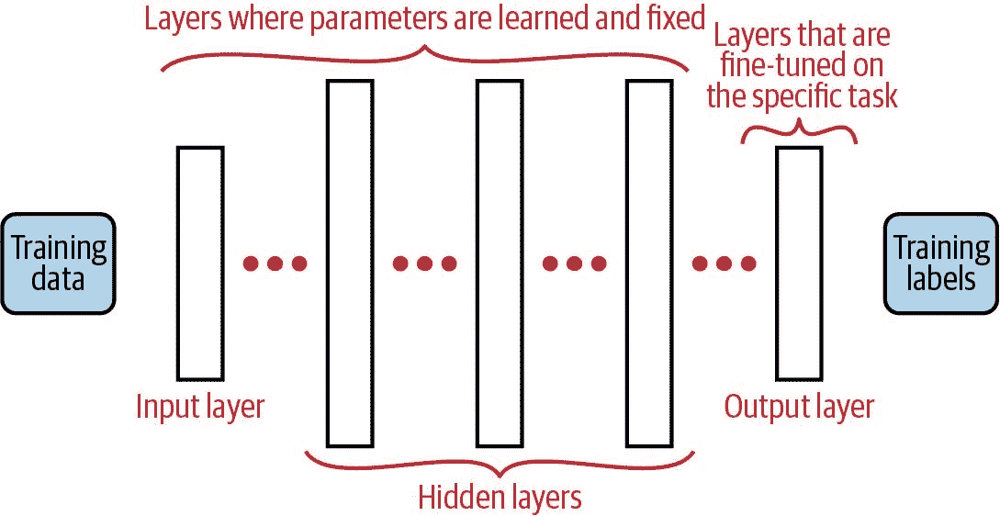

# 第十一章：在文本数据上执行情感分析

在我们在现实世界中的每一次互动中，我们的大脑在潜意识中不仅通过所说的话来注册反馈，还使用面部表情、身体语言和其他物理线索。然而，随着越来越多的沟通变成数字化形式，它越来越多地出现在文本形式中，我们无法评估物理线索。因此，通过他们写的文本理解一个人的情绪或感受是非常重要的，以便形成对他们信息完整理解。

例如，现在很多客户支持都通过软件服务系统或者自动聊天机器人来自动化。因此，了解客户感受的唯一方式就是通过理解他们回复中的情感。因此，如果我们处理一个特别愤怒的客户，就非常重要要在回复时特别小心，以免进一步激怒他们。同样，如果我们想要了解客户对特定产品或品牌的看法，我们可以分析他们在社交媒体渠道上关于该品牌的帖子、评论或者评价的情感，并理解他们对品牌的感受。

从文本中理解情感是具有挑战性的，因为有几个方面需要推断，这些方面并不直接明显。一个简单的例子是来自亚马逊购买的笔记本电脑的以下客户评价：

> 这台笔记本电脑存在严重问题。它的速度完全符合规格，非常慢！启动时间更长。

如果一个人类读它，他们可以察觉到关于笔记本电脑速度的讽刺表达，以及它启动时间长的事实，这导致我们得出结论这是一个负面评价。然而，如果我们只分析文本，很明显速度完全符合规格。启动时间较长的事实也可能被认为是一件好事，除非我们知道这是需要小的参数。情感分析的任务也特定于所使用的文本数据类型。例如，报纸文章以结构化方式编写，而推文和其他社交媒体文本则遵循松散结构，并且存在俚语和不正确的标点符号。因此，并不存在一种可以适用于所有情景的蓝图。相反，我们将提供一套可以用来进行成功情感分析的蓝图。

# 您将学到什么，我们将构建什么

在本章中，我们将探讨多种技术，用于从文本数据片段中估计情感。我们将从简单的基于规则的技术开始，并逐步深入到更复杂的方法，最终使用来自 Google 的 BERT 等最新语言模型。通过这些技术的介绍，我们的目的是提升对客户情感的理解，并为您提供一套可以应用于各种用例的蓝图。例如，结合第二章中的 Twitter API 蓝图（见 ch02.xhtml#ch-api），您可以确定公众对某一特定人物或政治问题的情感。您还可以在组织内使用这些蓝图来分析客户投诉或支持电子邮件中的情感，从而了解客户的满意度。

# 情感分析

大量信息以文本形式提供，根据通信的上下文，可以将信息分类为客观文本和主观文本。*客观文本*包含简单的事实陈述，如我们在教科书或维基百科文章中找到的内容。这类文本通常只呈现事实，不表达观点或情感。另一方面，*主观文本*传达了某人的反应，或包含了情感、情绪或感觉的信息。这在社交媒体渠道如推特中或顾客在产品评论中典型地表现出来。我们进行情感分析研究，以了解通过文本表达的个体心态状态。因此，情感分析最适用于包含此类信息的主观文本，而不是客观文本。在开始分析之前，我们必须确保拥有捕捉我们寻找的情感信息的正确类型数据集。

一段文本的情感可以在短语、句子或文档级别确定。例如，如果我们以客户写给公司的电子邮件为例，将会有几段，每段中包含多个句子。可以为每个句子和每个段落计算情感。虽然第 1 段可能是积极的，但第 3 和第 4 段可能是消极的。因此，如果我们想要确定该客户表达的整体情感，我们需要确定将每段的情感聚合到文档级别的最佳方法。在我们提供的蓝图中，我们在句子级别计算情感。

进行情感分析的技术可以分解为简单的基于规则的技术和监督式机器学习方法。基于规则的技术更容易应用，因为它们不需要标注的训练数据。监督学习方法提供更好的结果，但包括标记数据的额外努力。我们将在我们的用例中展示，可能有简单的方法来绕过这个要求。在本章中，我们将提供以下一套蓝图：

+   使用基于词典的方法进行情感分析。

+   通过从文本数据构建附加特征并应用监督式机器学习算法进行情感分析。

+   使用转移学习技术和预训练语言模型如 BERT 进行情感分析。

# 介绍亚马逊客户评论数据集。

假设您是一家领先消费电子公司市场部门的分析师，并希望了解您的智能手机产品与竞争对手的比较情况。您可以轻松比较技术规格，但更有趣的是了解产品的消费者感知。您可以通过分析顾客在亚马逊产品评论中表达的情感来确定这一点。利用蓝图并对每个品牌的每条评论的情感进行汇总，您将能够确定顾客如何看待每个品牌。同样，如果您的公司计划通过在相邻类别引入产品来扩展业务，该怎么办？您可以分析一个段落中所有产品的顾客评论，例如媒体平板电脑、智能手表或行动摄像机，并根据汇总的情感确定一个顾客满意度较低的段落，因此您的产品具有更高的潜在成功机会。

对于我们的蓝图，我们将使用一个包含亚马逊不同产品的客户评论的数据集，涵盖多个产品类别。这个亚马逊客户评论数据集已经由斯坦福大学的研究人员抓取和编译好了。¹ [最新版本](https://oreil.ly/QcMIz) 包括了 1996 年至 2018 年间从亚马逊网站抓取的产品评论，涵盖了多个类别。它包括产品评论、产品评级以及其他信息，如有用的投票和产品元数据。对于我们的蓝图，我们将专注于产品评论，并仅使用那些只有一句话的评论。这是为了保持蓝图的简单性，并且去掉聚合步骤。一个包含多个句子的评论可能包含积极和消极的情感。因此，如果我们标记一个评论中所有句子具有相同的情感，那将是不正确的。我们只使用部分类别的数据，以便其可以适应内存并减少处理时间。这个数据集已经准备好了，但你可以参考存储库中的 `Data_Preparation` 笔记本了解步骤并可能扩展它。蓝图适用于任何类型的数据集，因此如果你可以访问强大的硬件或云基础设施，那么你可以选择更多的类别。

现在让我们看一下数据集：

```py
df = pd.read_json('reviews.json', lines=True)
df.sample(5)

```

`Out:`

|   | overall | verified | reviewerID | asin | text | summary |
| --- | --- | --- | --- | --- | --- | --- |
| 163807 | 5 | False | A2A8GHFXUG1B28 | B0045Z4JAI | 不错的无咖啡因... 对于一种无咖啡因咖啡来说味道不错 :) | 好！ |
| 195640 | 5 | True | A1VU337W6PKAR3 | B00K0TIC56 | 对于我的小温室来说，我无法找到比这个系统更好的选择，设置容易，喷嘴也表现非常好。 | 对于我的小温室来说，我无法找到比这个系统更好的选择。 |
| 167820 | 4 | True | A1Z5TT1BBSDLRM | B0012ORBT6 | 品质不错的产品，价格合理，省去了一趟商店的旅程。 | 四星评价 |
| 104268 | 1 | False | A4PRXX2G8900X | B005SPI45U | 我喜欢生的薯片的理念 - 可以和我自制的莎莎酱和鳄梨酱一起吃 - 但这些味道真是太恶心了。 | 没有更好的选择，但味道仍然很差。 |
| 51961 | 1 | True | AYETYLNYDIS2S | B00D1HLUP8 | 仿制品来自中国，一分钱一分货。 | 绝对不是原装产品 |

查看数据集摘要，我们可以看到它包含以下列：

Overall

这是评论者对产品的最终评级。从 1（最低）到 5（最高）。

Verified

这表明产品购买是否经过了亚马逊的验证。

ReviewerID

这是亚马逊为每个评论者分配的唯一标识符。

ASIN

这是亚马逊用来识别产品的唯一产品代码。

文本

用户提供的评论中的实际文本。

Summary

这是用户提供的评论的标题或摘要。

列 `text` 包含客户评价的主要内容，表达了用户的观点。尽管其他信息也有用，但我们将专注于在蓝图中使用此列。

# 蓝图：使用基于词典的方法执行情感分析

作为分析师在亚马逊客户评价数据上工作，可能遇到的第一个挑战是缺少目标标签。我们无法自动知道特定评价是积极还是消极的。文本是因为产品完美运作而表达快乐，还是因为产品在第一次使用时损坏而表达愤怒？直到我们实际阅读评价，我们都无法确定这一点。这是具有挑战性的，因为我们将不得不阅读接近 30 万条评价，并手动为每一条评价分配目标情感。我们通过使用基于词典的方法来解决这个问题。

什么是词典？*词典* 就像一个包含一系列词汇并使用专家知识编制的字典。词典的关键区别因素在于它包含特定知识并且是为特定目的而收集的。我们将使用包含常用词汇和捕捉与之关联情感的情感词典。一个简单的例子是词汇 *happy*，情感得分为 1，另一个例子是词汇 *frustrated*，其得分为-1。有几种标准化的词典可供使用，流行的包括 AFINN 词典、SentiWordNet、Bing Liu 的词典以及 VADER 词典等。它们在词汇量和表达方式上各不相同。例如，[AFINN 词典](https://oreil.ly/YZ9WB) 是一个包含 3,300 个词汇的单一词典，每个词汇都分配了从-3 到+3 的有符号情感分数。负/正表示极性，大小表示强度。另一方面，如果我们看 [Bing Liu 词典](https://oreil.ly/jTj_u)，它以两个列表的形式存在：一个为积极词汇，另一个为消极词汇，总共有 6,800 个词汇。大多数情感词典适用于英语，但也有适用于德语²及其他 81 种语言的词典，这是由该研究论文生成的³。

句子或短语的情感是通过首先从选择的 lexicon 中识别每个单词的情感分数，然后将它们相加以得出整体情感来确定的。通过使用这种技术，我们避免了手动查看每个评论并分配情感标签的需要。相反，我们依赖于 lexicon，它为每个单词提供专家情感分数。对于我们的第一个蓝图，我们将使用必应刘 lexicon，但您可以自由地扩展蓝图以使用其他 lexicon。 lexicon 通常包含单词的多个变体并排除停用词，因此在这种方法中标准的预处理步骤并不重要。只有 lexicon 中存在的单词才会真正得分。这也导致了这种方法的一个缺点，我们将在蓝图的末尾讨论它。

## 必应刘 lexicon

必应刘 lexicon 已经编制，将单词分成表达积极意见和表达消极意见的两类。这个 lexicon 还包含拼写错误的单词，更适合用于从在线讨论论坛、社交媒体和其他类似来源提取的文本，并因此应该在亚马逊客户评论数据上产生更好的结果。

必应刘 lexicon 可从作者的网站作为[zip 文件](https://oreil.ly/A_O4Q)获得，其中包含一组积极和消极的单词。它也作为 NLTK 库中的语料库提供，我们可以在下载后使用。一旦我们提取了 lexicon，我们将创建一个可以保存 lexicon 单词及其相应情感分数的字典。我们的下一步是为数据集中的每个评论生成评分。我们首先将文本内容转换为小写；然后使用 NLTK 包中的 `word_tokenize` 函数，将句子分割成单词，并检查这个单词是否属于我们的 lexicon，如果是，我们将单词的相应情感分数添加到评论的总情感分数中。作为最后一步，我们基于句子中的单词数量对这个分数进行归一化。这个功能被封装在函数 `bing_liu_score` 中，并应用于数据集中的每个评论：

```py
from nltk.corpus import opinion_lexicon
from nltk.tokenize import word_tokenize
nltk.download('opinion_lexicon')

print('Total number of words in opinion lexicon', len(opinion_lexicon.words()))
print('Examples of positive words in opinion lexicon',
      opinion_lexicon.positive()[:5])
print('Examples of negative words in opinion lexicon',
      opinion_lexicon.negative()[:5])

```

`Out:`

```py
Total number of words in opinion lexicon 6789
Examples of positive words in opinion lexicon ['a+', 'abound', 'abounds',
'abundance', 'abundant']
Examples of negative words in opinion lexicon ['2-faced', '2-faces',
'abnormal', 'abolish', 'abominable']

```

然后：

```py
# Let's create a dictionary which we can use for scoring our review text
df.rename(columns={"reviewText": "text"}, inplace=True)
pos_score = 1
neg_score = -1
word_dict = {}

# Adding the positive words to the dictionary
for word in opinion_lexicon.positive():
        word_dict[word] = pos_score

# Adding the negative words to the dictionary
for word in opinion_lexicon.negative():
        word_dict[word] = neg_score

def bing_liu_score(text):
    sentiment_score = 0
    bag_of_words = word_tokenize(text.lower())
    for word in bag_of_words:
        if word in word_dict:
            sentiment_score += word_dict[word]
    return sentiment_score / len(bag_of_words)

```

```py
df['Bing_Liu_Score'] = df['text'].apply(bing_liu_score)
df[['asin','text','Bing_Liu_Score']].sample(2)

```

`Out:`

|   | asin | text | Bing_Liu_Score |
| --- | --- | --- | --- |
| 188097 | B00099QWOU | 一如预期 | 0.00 |
| 184654 | B000RW1XO8 | 按设计工作... | 0.25 |

现在我们已经计算出情感分数，我们想要检查计算出的分数是否符合基于客户提供的评分的预期。我们可以比较具有不同评分的评论的情感分数，而不是对每个评论都进行检查。我们预期，一个五星评价的评论的情感分数会高于一个一星评价的评论。在下一步中，我们将为每个类型的星级评分缩放每个评论的分数在 1 到-1 之间，并计算所有评论的平均情感分数：

```py
df['Bing_Liu_Score'] = preprocessing.scale(df['Bing_Liu_Score'])
df.groupby('overall').agg({'Bing_Liu_Score':'mean'})

```

`Out:`

| overall | Bing_Liu_Score |
| --- | --- |
| 1 | -0.587061 |
| 2 | -0.426529 |
| 4 | 0.344645 |
| 5 | 0.529065 |

前述蓝图使我们能够使用任何类型的情感词汇表快速确定情感分数，并且还可以作为比较其他复杂技术的基准，这应该能提高情感预测的准确性。

## 基于词汇表的方法的缺点

尽管基于词汇表的方法很简单，但我们观察到它有一些明显的缺点：

+   首先，我们受限于词汇表的大小；如果一个词不在所选的词汇表中，那么我们无法在确定该评论的情感分数时使用这些信息。在理想情况下，我们希望使用一个涵盖语言中所有单词的词汇表，但这是不可行的。

+   其次，我们假设所选的词汇表是一个金标准，并信任作者提供的情感分数/极性。这是一个问题，因为特定的词汇表可能不适合特定的用例。在前面的例子中，Bing Liu 词汇表是相关的，因为它捕捉到了在线语言的使用，并在其词汇表中包含了常见的拼写错误和俚语。但如果我们正在处理推文数据集，那么 VADER 词汇表将更适合，因为它支持流行缩写（例如，LOL）和表情符号。

+   最后，词汇表的最大缺点之一是它忽略了否定词。由于词汇表只匹配单词而不是短语，这将导致包含“not bad”的句子获得负分，而实际上它更中性。

要改进我们的情感检测，我们必须探索使用监督式机器学习方法。

# 监督学习方法

使用监督学习方法是有益的，因为它允许我们对数据中的模式进行建模，并创建一个接近现实的预测函数。它还为我们提供了选择不同技术并确定提供最大准确性的技术的灵活性。有关监督式机器学习的更详细概述，请参阅第六章。

要使用这种方法，我们需要标记数据，这可能不容易得到。通常，需要两个或更多的人类注释者查看每个评论，并确定情感。如果注释者意见不一致，那么可能需要第三个注释者来打破僵局。通常会有五个注释者，其中三个人对意见达成一致以确认标签。这可能会很乏味和昂贵，但在处理实际业务问题时是首选的方法。

然而，在许多情况下，我们可以在不经过昂贵的标注过程的情况下测试监督学习方法。一个更简单的选择是检查数据中可能帮助我们自动注释的任何代理指标。让我们在亚马逊评论的案例中说明这一点。如果有人给了一个五星级的产品评分，那么我们可以假设他们喜欢他们使用的产品，并且这应该在他们的评论中反映出来。同样，如果有人为一个产品提供了一星评级，那么他们对此不满意，并且可能有一些负面的话要说。因此，我们可以将产品评分作为衡量特定评论是积极还是消极的代理措施。评级越高，特定评论就越积极。

## 准备数据以进行监督学习方法

因此，在将我们的数据集转换为监督学习问题的第一步中，我们将使用评级自动注释我们的评论。我们选择将所有评级为 4 和 5 的评论标注为积极，并根据之前提供的推理将评级为 1 和 2 的评论标注为消极。在数据准备过程中，我们还过滤掉了评级为 3 的评论，以提供积极和消极评论之间更清晰的分离。这一步骤可以根据您的用例进行定制。

```py
df = pd.read_json('reviews.json', lines=True)

# Assigning a new [1,0] target class label based on the product rating
df['sentiment'] = 0
df.loc[df['overall'] > 3, 'sentiment'] = 1
df.loc[df['overall'] < 3, 'sentiment'] = 0

# Removing unnecessary columns to keep a simple DataFrame
df.drop(columns=[
    'reviewTime', 'unixReviewTime', 'overall', 'reviewerID', 'summary'],
        inplace=True)
df.sample(3)

```

`Out:`

|   | verified | asin | text | sentiment |
| --- | --- | --- | --- | --- |
| 176400 | True | B000C5BN72 | everything was as listed and is in use all appear to be in good working order | 1 |
| 65073 | True | B00PK03IVI | this is not the product i received. | 0 |
| 254348 | True | B004AIKVPC | Just like the dealership part. | 1 |

正如您从呈现的评论选择中可以看出，我们创建了一个名为`sentiment`的新列，其中包含根据用户提供的评分值为 1 或 0 的值。现在我们可以将其视为一个监督学习问题，我们将使用`text`中的内容来预测情感：积极（1）或消极（0）。

# 蓝图：文本数据向量化和应用监督学习算法

在这个蓝图中，我们将通过首先清洗文本数据，然后进行向量化，最后应用支持向量机模型来构建一个监督学习的机器学习算法。

## 步骤 1：数据准备

为了预处理数据，我们将应用来自第四章的正则表达式蓝图，以删除任何特殊字符、HTML 标签和 URL：

```py
df['text_orig'] = df['text'].copy()
df['text'] = df['text'].apply(clean)

```

然后，我们将应用来自同一章节的数据准备蓝图，该蓝图使用了 spaCy 流水线。这确保文本被标准化为小写形式，不包括数字和标点，并且格式化为后续步骤可以使用的格式。请注意，执行此步骤可能需要几分钟的时间。在某些情况下，可能在清理步骤中删除了评论中的所有标记，这种情况下不再有必要包括这样的评论：

```py
df["text"] = df["text"].apply(clean_text)

# Remove observations that are empty after the cleaning step
df = df[df['text'].str.len() != 0]

```

## 步骤 2：训练-测试分割

我们将数据分割，使得接下来的向量化步骤仅使用训练数据集。我们按照 80-20 的比例划分数据，并通过指定目标变量情感为`stratify`参数来确认正负类在两个划分中显示出类似的分布：

```py
from sklearn.model_selection import train_test_split
X_train, X_test, Y_train, Y_test = train_test_split(df['text'],
                                                    df['sentiment'],
                                                    test_size=0.2,
                                                    random_state=42,
                                                    stratify=df['sentiment'])

print ('Size of Training Data ', X_train.shape[0])
print ('Size of Test Data ', X_test.shape[0])

print ('Distribution of classes in Training Data :')
print ('Positive Sentiment ', str(sum(Y_train == 1)/ len(Y_train) * 100.0))
print ('Negative Sentiment ', str(sum(Y_train == 0)/ len(Y_train) * 100.0))

print ('Distribution of classes in Testing Data :')
print ('Positive Sentiment ', str(sum(Y_test == 1)/ len(Y_test) * 100.0))
print ('Negative Sentiment ', str(sum(Y_test == 0)/ len(Y_test) * 100.0))

```

`Out:`

```py
Size of Training Data  234108
Size of Test Data  58527
Distribution of classes in Training Data :
Positive Sentiment  50.90770071932612
Negative Sentiment  49.09229928067388
Distribution of classes in Testing Data :
Positive Sentiment  50.9081278726058
Negative Sentiment  49.09187212739419

```

## 步骤 3：文本向量化

下一步是将清理后的文本转换为可用特征的步骤。机器学习模型无法理解文本数据，只能处理数值数据。我们重新使用了 TF-IDF 向量化的蓝图来创建向量化表示。我们选择了`min_df`参数为 10，并且不包括二元组。此外，我们在前一步已经移除了停用词，因此在向量化过程中无需再处理此问题。我们将使用相同的向量化器来转换测试集，该测试集将在评估过程中使用：

```py
from sklearn.feature_extraction.text import TfidfVectorizer

tfidf = TfidfVectorizer(min_df = 10, ngram_range=(1,1))
X_train_tf = tfidf.fit_transform(X_train)
X_test_tf = tfidf.transform(X_test)

```

## 步骤 4：训练机器学习模型

如第六章所述，当处理文本数据时，支持向量机是首选的机器学习算法。SVM 在处理具有大量数值特征的数据集时表现良好，特别是我们使用的 LinearSVC 模块非常快速。我们还可以选择基于树的方法，如随机森林或 XGBoost，但根据我们的经验，准确性相当，并且由于训练时间快，可以更快地进行实验：

```py
from sklearn.svm import LinearSVC

model1 = LinearSVC(random_state=42, tol=1e-5)
model1.fit(X_train_tf, Y_train)

```

`Out:`

```py
LinearSVC(C=1.0, class_weight=None, dual=True, fit_intercept=True,
          intercept_scaling=1, loss='squared_hinge', max_iter=1000,
          multi_class='ovr', penalty='l2', random_state=42, tol=1e-05,
          verbose=0)

```

然后：

```py
from sklearn.metrics import accuracy_score
from sklearn.metrics import roc_auc_score

Y_pred = model1.predict(X_test_tf)
print ('Accuracy Score - ', accuracy_score(Y_test, Y_pred))
print ('ROC-AUC Score - ', roc_auc_score(Y_test, Y_pred))

```

`Out:`

```py
Accuracy Score -  0.8658396979172006
ROC-AUC Score -  0.8660667427476778

```

正如我们所看到的，该模型的准确率约为 86%。让我们来看一些模型的预测结果和评论文本，以对模型进行一次审查：

```py
sample_reviews = df.sample(5)
sample_reviews_tf = tfidf.transform(sample_reviews['text'])
sentiment_predictions = model1.predict(sample_reviews_tf)
sentiment_predictions = pd.DataFrame(data = sentiment_predictions,
                                     index=sample_reviews.index,
                                     columns=['sentiment_prediction'])
sample_reviews = pd.concat([sample_reviews, sentiment_predictions], axis=1)
print ('Some sample reviews with their sentiment - ')
sample_reviews[['text_orig','sentiment_prediction']]

```

`Out:`

```py
Some sample reviews with their sentiment -

```

|   | text_orig | sentiment_prediction |
| --- | --- | --- |
| 29500 | 这是一个不错的夜灯，但显然用途不多！ | 1 |
| 98387 | 太小了，不知道该怎么做或如何使用它们 | 0 |
| 113648 | 没有使房间“足够蓝” - 无条件退回 | 0 |
| 281527 | 卓越 | 1 |
| 233713 | 与 OEM 相匹配，看起来不错 | 1 |

我们可以看到，该模型能够合理地预测评论。例如，用户在评论 98387 中认为产品太小不好用，被标记为负面。再看评论 233713，用户表示产品穿着合适且外观不错，被标记为正面。该模型与使用 Bing Liu 词汇表的基准模型相比如何？

```py
def baseline_scorer(text):
    score = bing_liu_score(text)
    if score > 0:
        return 1
    else:
        return 0

Y_pred_baseline = X_test.apply(baseline_scorer)
acc_score = accuracy_score(Y_pred_baseline, Y_test)
print (acc_score)

```

`输出：`

```py
0.7521998393903668

```

它确实提升了 75%的基准模型准确率，虽然准确率还可以进一步提高，但这是一个能够快速产生结果的简单蓝图。例如，如果你想要了解客户对你的品牌与竞争对手的感知，那么使用这个蓝图并聚合每个品牌的情感将会给你一个公平的理解。或者，假设你想要创建一个帮助人们决定是否观看电影的应用程序。使用这个蓝图分析从 Twitter 或 YouTube 评论中收集的数据，你可以确定人们的情感倾向，然后提供建议。在下一个蓝图中，我们将描述一种更复杂的技术，可以用来提高准确性。

# 使用深度学习的预训练语言模型

语言在几个世纪以来不断演变，并且仍在不断变化中。虽然有语法规则和形成句子的指导方针，但这些规则通常不严格遵循，且严重依赖于上下文。一个人在发推文时选择的词语与写电子邮件表达相同思想时选择的词语会有很大不同。而且在许多语言（包括英语）中，例外情况实在太多！因此，计算机程序要理解基于文本的交流是很困难的。通过使算法深入理解语言，使用语言模型可以克服这一难题。

语言模型是自然语言的数学表示，允许我们理解句子的结构和其中的词语。有几种类型的语言模型，但在本蓝图中我们将专注于预训练语言模型的使用。这些语言模型的最重要特征是它们利用深度神经网络架构，并在大型数据语料库上进行训练。语言模型的使用极大地提高了自然语言处理任务的性能，如语言翻译、自动拼写校正和文本摘要。

## 深度学习和迁移学习

深度学习通常用来描述一组利用人工神经网络（ANNs）的机器学习方法。人工神经网络受人类大脑启发，试图模仿生物系统中神经元之间的连接和信息处理活动。简单来说，它试图使用一个由多层节点组成的互连网络来建模函数，网络边的权重通过数据学习。有关更详细的解释，请参考[*Hands-On Machine Learning*](https://learning.oreilly.com/library/view/hands-on-machine-learning/9781492032632)（O’Reilly，2019）的第 II 部分，作者是 Aurélien Géron。

转移学习是深度学习中的一项技术，允许我们通过将模型*转移*到特定用例来受益于预训练的广泛可用语言模型。它使我们能够利用在一个任务中获得的知识和信息，并将其应用到另一个问题上。作为人类，我们擅长这样做。例如，我们最初学习弹吉他，但随后可以相对容易地应用这些知识来更快地学会大提琴或竖琴（比完全初学者快）。当相同的概念应用于机器学习算法时，就被称为*转移学习*。

这个想法首次在计算机视觉行业中流行起来，一个大规模的[图像识别挑战](https://oreil.ly/ISv5j)促使几个研究小组竞相建立复杂的深度神经网络，网络层数深达数层，以降低挑战中的错误。其他研究人员发现，这些复杂模型不仅对该挑战有效，还可以通过微小调整适用于其他图像识别任务。这些大型模型已经学习了关于图像的基本特征（如边缘、形状等），可以在不需要从头开始训练的情况下，针对特定应用进行微调。在过去两年中，同样的技术已成功应用于文本分析。首先，在大型文本语料库（通常来自公开可用的数据源，如维基百科）上训练一个深度神经网络。所选择的模型架构是 LSTM 或 Transformer 的变体。⁴ 在训练这些模型时，会在句子中去掉一个词（掩码），预测任务是确定给定句子中所有其他词的情况下的掩码词。回到我们的人类类比，也许有更多的 YouTube 视频教你如何弹吉他而不是竖琴或大提琴。因此，首先学习弹吉他将是有益的，因为有大量的资源可用，然后将这些知识应用到不同的任务，如学习竖琴或大提琴。

大型模型训练时间长，耗时较多。幸运的是，许多研究团队已经公开了这些预训练模型，包括来自 fastai 的[ULMFiT](https://oreil.ly/ukMdf)，来自 Google 的[BERT](https://oreil.ly/GtSpY)，来自 OpenAI 的[GPT-2](https://oreil.ly/LVwyy)，以及来自 Microsoft 的[Turing](https://msturing.org)。图 11-1 展示了应用迁移学习的最后一步，即保持预训练模型的初始层不变，重新训练模型的最终层以更好地适应手头的任务。通过这种方式，我们可以将预训练模型应用于文本分类和情感分析等特定任务。



###### 图 11-1\. 迁移学习。网络中较早层的参数通过对大语料进行训练而学习，而最终层的参数则被解冻，并允许在特定数据集上进行微调训练。

对于我们的蓝图，我们将使用 Google 发布的预训练模型 BERT。BERT 是*双向编码器表示转换*的缩写。它使用 Transformers 架构，并使用大量文本数据训练模型。在本蓝图中使用的模型(`bert-base-uncased`)是在结合了英文维基百科和 Books 语料库的基础上，使用掩蔽语言模型（MLM）进行训练的。BERT 模型的其他版本可以基于不同语料库进行训练。例如，有一个 BERT 模型是在德语维基百科文章上训练的。掩蔽语言模型随机掩盖输入中的一些标记（单词），其目标是仅基于上下文（周围单词）预测掩蔽词的原始词汇 ID。由于是双向的，模型从两个方向查看每个句子，能够更好地理解上下文。此外，BERT 还使用子词作为标记，这在识别单词含义时提供了更精细的控制。另一个优点是 BERT 生成上下文感知的嵌入。例如，在一个句子中使用单词*cell*时，根据周围单词，它可以具有生物参考或实际上指的是监狱单元的含义。要更详细地了解 BERT 的工作原理，请参阅“进一步阅读”。

# 蓝图：使用迁移学习技术和预训练语言模型

这份蓝图将向您展示如何利用预训练语言模型进行情感分类。考虑这样一个使用案例，您希望根据表达的情感采取行动。例如，如果一个客户特别不满意，您希望将他们转接到最优秀的客户服务代表那里。能够准确检测情感非常重要，否则您可能会失去他们。或者，假设您是一个依赖公共网站如[Yelp](https://yelp.com)上的评价和评级的小企业。为了提高评分，您希望通过向不满意的客户提供优惠券或特别服务来跟进。准确性对于定位正确的客户非常重要。在这些使用案例中，我们可能没有大量数据来训练模型，但高准确度是至关重要的。我们知道情感受到词语使用上下文的影响，而使用预训练语言模型可以改善我们的情感预测。这使我们能够超越我们拥有的有限数据集，融入来自一般使用的知识。

在我们的蓝图中，我们将使用 Transformers 库，因为它具有易于使用的功能和对多个预训练模型的广泛支持。["选择 Transformers 库"](https://wiki.example.org/choosing_transformers_library)提供了关于这个主题的更多详细信息。Transformers 库不断更新，多位研究人员在其中贡献。

## 第一步：加载模型和标记化

使用 Transformers 库的第一步是导入所选模型所需的三个类。这包括*config*类，用于存储重要的模型参数；*tokenizer*，用于标记化和准备文本进行模型训练；以及*model*类，定义模型架构和权重。这些类特定于模型架构，如果我们想要使用不同的架构，那么需要导入相应的类。我们从预训练模型中实例化这些类，并选择最小的 BERT 模型，`bert-base-uncased`，它有 12 层深，并包含 1.1 亿个参数！

使用 Transformers 库的优势在于，它已经为许多模型架构提供了多个预训练模型，您可以[在这里查看](https://oreil.ly/QdC7E)。当我们从预训练模型实例化一个模型类时，模型架构和权重将从由 Hugging Face 托管的 AWS S3 存储桶中下载。这可能会花费一些时间，但在您的机器上缓存后，就不需要再次下载。请注意，由于我们使用预训练模型来预测情感（积极与消极），我们指定`finetuning_task='binary'`。在运行此蓝图之前，我们在附带的笔记本中提供了额外的安装 Python 包的说明。

```py
from transformers import BertConfig, BertTokenizer, BertForSequenceClassification

config = BertConfig.from_pretrained('bert-base-uncased',finetuning_task='binary')
tokenizer = BertTokenizer.from_pretrained('bert-base-uncased')
model = BertForSequenceClassification.from_pretrained('bert-base-uncased')

```

我们必须将输入文本数据转换为模型架构所需的标准格式。我们定义一个简单的`get_tokens`方法，将我们评论的原始文本转换为数值。预训练模型将每个观察作为固定长度序列接受。因此，如果一个观察比最大序列长度短，则用空（零）标记进行填充，如果它更长，则进行截断。每个模型架构都有一个它支持的最大序列长度。分词器类提供了一个分词函数，它将句子分割成标记，填充句子以创建固定长度序列，并最终表示为可在模型训练期间使用的数值。此函数还添加了注意力掩码，以区分那些包含实际单词的位置和包含填充字符的位置。以下是这个过程如何工作的示例：

```py
def get_tokens(text, tokenizer, max_seq_length, add_special_tokens=True):
  input_ids = tokenizer.encode(text,
                               add_special_tokens=add_special_tokens,
                               max_length=max_seq_length,
                               pad_to_max_length=True)
  attention_mask = [int(id > 0) for id in input_ids]
  assert len(input_ids) == max_seq_length
  assert len(attention_mask) == max_seq_length
  return (input_ids, attention_mask)

text = "Here is the sentence I want embeddings for."
input_ids, attention_mask = get_tokens(text,
                                       tokenizer,
                                       max_seq_length=30,
                                       add_special_tokens = True)
input_tokens = tokenizer.convert_ids_to_tokens(input_ids)
print (text)
print (input_tokens)
print (input_ids)
print (attention_mask)

```

`Out:`

```py
Here is the sentence I want embeddings for.
['[CLS]', 'here', 'is', 'the', 'sentence', 'i', 'want', 'em', '##bed',
'##ding', '##s', 'for', '.', '[SEP]', '[PAD]', '[PAD]', '[PAD]', '[PAD]',
'[PAD]', '[PAD]', '[PAD]', '[PAD]', '[PAD]', '[PAD]', '[PAD]', '[PAD]',
'[PAD]', '[PAD]', '[PAD]', '[PAD]']
[101, 2182, 2003, 1996, 6251, 1045, 2215, 7861, 8270, 4667, 2015, 2005, 1012,
102, 0, 0, 0, 0, 0, 0, 0, 0, 0, 0, 0, 0, 0, 0, 0, 0]
[1, 1, 1, 1, 1, 1, 1, 1, 1, 1, 1, 1, 1, 1, 0, 0, 0, 0, 0, 0, 0, 0, 0, 0, 0, 0,
0, 0, 0, 0]

```

我们观察到的第一个标记是`[CLS]`标记，它代表分类，这是 BERT 模型的预训练任务之一。此标记用于标识句子的开始，并在模型内存储整个句子的聚合表示。我们还在句子末尾看到了`[SEP]`标记，它代表*分隔符*。当 BERT 用于非分类任务（如语言翻译）时，每个观察将包括一对文本（例如，英文文本和法文文本），而`[SEP]`标记用于将第一个文本与第二个文本分隔开。然而，由于我们正在构建一个分类模型，分隔符标记后面跟随着`[PAD]`标记。我们指定了序列长度为 30，由于我们的测试观察并不那么长，在末尾添加了多个填充标记。另一个有趣的观察是，像*embedding*这样的词不是一个标记，而实际上被分割成`em`、`##bed`、`##ding`和`##s`。`##`用于识别子词标记，这是 BERT 模型的一个特殊特性。这使得模型能够更好地区分词根、前缀和后缀，并尝试推断它以前可能没有见过的单词的含义。

一个重要的注意点是，由于深度学习模型使用基于上下文的方法，建议使用原始形式的文本而不进行任何预处理，这样允许分词器从其词汇表中生成所有可能的标记。因此，我们必须再次使用原始的`text_orig`列而不是清理过的`text`列来分割数据。然后，让我们将相同的函数应用于我们的训练和测试数据，这次使用`max_seq_length`为 50：

```py
X_train, X_test, Y_train, Y_test = train_test_split(df['text_orig'],
                                                    df['sentiment'],
                                                    test_size=0.2,
                                                    random_state=42,
                                                    stratify=df['sentiment'])
X_train_tokens = X_train.apply(get_tokens, args=(tokenizer, 50))
X_test_tokens = X_test.apply(get_tokens, args=(tokenizer, 50))

```

深度学习模型使用像[TensorFlow](https://tensorflow.org)和[PyTorch](https://pytorch.org)这样的框架在 GPU 上进行训练。张量是这些框架用来表示和处理数据的基本数据结构，可以在 N 维中存储数据。用象征性的方式来可视化张量，我们可以将其类比为棋盘。假设我们用 0 标记未占用的位置，用 1 标记白子占用的位置，用 2 标记黑子占用的位置。我们得到一个 8×8 矩阵，表示特定时间点上棋盘的状态。如果我们现在想要跟踪并存储多个动作，我们将得到多个 8×8 矩阵，这些可以存储在我们所谓的*tensor*中。张量是数据的 n 维表示，包含一组坐标空间函数的分量数组。跟踪历史棋局动作的张量将是一个 3 阶张量，而初始的 8×8 矩阵也可以被认为是张量，但是是一个 2 阶张量。

这只是一个简单的解释，但是为了更深入地理解，我们建议阅读 Joseph C. Kolecki 的[“An Introduction to Tensors for Students of Physics and Engineering”](https://oreil.ly/VC_80)。在我们的案例中，我们创建了三个张量，包含标记（包含大小为 50 的多个数组的张量）、输入掩码（包含大小为 50 的数组的张量）和目标标签（包含大小为 1 的标量的张量）：

```py
import torch
from torch.utils.data import TensorDataset

input_ids_train = torch.tensor(
    [features[0] for features in X_train_tokens.values], dtype=torch.long)
input_mask_train = torch.tensor(
    [features[1] for features in X_train_tokens.values], dtype=torch.long)
label_ids_train = torch.tensor(Y_train.values, dtype=torch.long)

print (input_ids_train.shape)
print (input_mask_train.shape)
print (label_ids_train.shape)

```

`Out:`

```py
torch.Size([234104, 50])
torch.Size([234104, 50])
torch.Size([234104])

```

我们可以窥探一下这个张量中的内容，并看到它包含了句子中每个标记对应的 BERT 词汇映射。数字 101 表示开始，102 表示结束评论句子。我们将这些张量组合成一个 TensorDataset，这是模型训练期间用来加载所有观察结果的基本数据结构。

```py
input_ids_train[1]

```

`Out:`

```py
tensor([ 101, 2009, 2134, 1005, 1056, 2147, 6314, 2055, 2009, 1037, 5808, 1997,
        2026, 2769,  102,    0,    0,    0,    0,    0,    0,    0,    0,    0,
           0,    0,    0,    0,    0,    0,    0,    0,    0,    0,    0,    0,
           0,    0,    0,    0,    0,    0,    0,    0,    0,    0,    0,    0,
           0,    0])

```

然后：

```py
train_dataset = TensorDataset(input_ids_train,input_mask_train,label_ids_train)

```

## 步骤 2：模型训练

现在我们已经预处理和标记化了数据，我们准备训练模型。由于深度学习模型的大内存使用和计算需求，我们采用了与前一蓝图中使用的 SVM 模型不同的方法。所有训练观测数据被分成批次（由`train_batch_size`定义），并从所有观测数据中随机采样（使用`RandomSampler`），然后通过模型的各层向前传递。当模型通过所有批次看到了所有训练观测数据时，就说它已经训练了一个 epoch。因此，一个 epoch 是通过训练数据中的所有观测值的一次传递。`batch_size`的组合和 epoch 数确定了模型训练的时间长度。选择较大的`batch_size`减少了 epoch 中的前向传递次数，但可能会导致更高的内存消耗。选择更多的 epochs 给模型更多时间来学习参数的正确值，但也会导致更长的训练时间。对于这个蓝图，我们定义了`batch_size`为 64，`num_train_epochs`为 2：

```py
from torch.utils.data import DataLoader, RandomSampler

train_batch_size = 64
num_train_epochs = 2

train_sampler = RandomSampler(train_dataset)
train_dataloader = DataLoader(train_dataset,
                              sampler=train_sampler,
                              batch_size=train_batch_size)
t_total = len(train_dataloader) // num_train_epochs

print ("Num examples = ", len(train_dataset))
print ("Num Epochs = ", num_train_epochs)
print ("Total train batch size  = ", train_batch_size)
print ("Total optimization steps = ", t_total)

```

`输出：`

```py
Num examples =  234104
Num Epochs =  2
Total train batch size  =  64
Total optimization steps =  1829

```

当一个批次中的所有观测数据通过模型的各层向前传递后，反向传播算法将以反向方向应用。这种技术允许我们自动计算神经网络中每个参数的梯度，从而为我们提供了一种调整参数以减少误差的方法。这类似于随机梯度下降的工作原理，但我们不打算详细解释。《动手学习机器学习》（O’Reilly，2019）第四章提供了一个很好的介绍和数学解释。需要注意的关键点是，在训练深度学习算法时，影响反向传播的参数（如学习率和优化器的选择）决定了模型学习参数并达到更高准确度的速度。然而，并没有科学上的原因说明某种方法或值更好，但许多研究者⁵试图确定最佳选择。根据 BERT 论文中的参数和 Transformers 库中的推荐，我们为蓝图做出了明智的选择，如下所示：

```py
from transformers import AdamW, get_linear_schedule_with_warmup

learning_rate = 1e-4
adam_epsilon = 1e-8
warmup_steps = 0

optimizer = AdamW(model.parameters(), lr=learning_rate, eps=adam_epsilon)
scheduler = get_linear_schedule_with_warmup(optimizer,
                                            num_warmup_steps=warmup_steps,
                                            num_training_steps=t_total)

```

在设置训练循环之前，我们检查是否有可用的 GPU（见“在 Google Colab 免费使用 GPU”）。如果有，模型和输入数据将被传输到 GPU，然后我们通过模型运行输入来设置前向传递以产生输出。由于我们已经指定了标签，我们已经知道与实际情况的偏差（损失），并且我们使用反向传播来调整参数以计算梯度。优化器和调度器步骤用于确定参数调整的量。请注意特殊条件，即将梯度剪裁到最大值，以防止[梯度爆炸](https://oreil.ly/Ry0Vi)问题的出现。

现在我们将所有这些步骤包装在嵌套的`for`循环中——一个用于每个时期，另一个用于每个时期中的每个批次——并使用之前介绍的 TQDM 库来跟踪训练进度，同时打印损失值：

```py
from tqdm import trange, notebook

device = torch.device("cuda" if torch.cuda.is_available() else "cpu")
train_iterator = trange(num_train_epochs, desc="Epoch")

# Put model in 'train' mode
model.train()

for epoch in train_iterator:
    epoch_iterator = notebook.tqdm(train_dataloader, desc="Iteration")
    for step, batch in enumerate(epoch_iterator):

        # Reset all gradients at start of every iteration
        model.zero_grad()

        # Put the model and the input observations to GPU
        model.to(device)
        batch = tuple(t.to(device) for t in batch)

        # Identify the inputs to the model
        inputs = {'input_ids':      batch[0],
                  'attention_mask': batch[1],
                  'labels':         batch[2]}

        # Forward Pass through the model. Input -> Model -> Output
        outputs = model(**inputs)

        # Determine the deviation (loss)
        loss = outputs[0]
        print("\r%f" % loss, end='')

        # Back-propogate the loss (automatically calculates gradients)
        loss.backward()

        # Prevent exploding gradients by limiting gradients to 1.0
        torch.nn.utils.clip_grad_norm_(model.parameters(), 1.0)

        # Update the parameters and learning rate
        optimizer.step()
        scheduler.step()

```

到目前为止，我们已经对下载的 BERT 模型进行了参数微调，以适应对亚马逊客户评论的情感分析。如果模型正确学习参数值，您应该观察到损失值在多次迭代中减少。在训练步骤结束时，我们可以将模型和分词器保存到选择的输出文件夹中：

```py
model.save_pretrained('outputs')

```

## 第三步：模型评估

在测试数据上评估我们的模型类似于训练步骤，只有细微差别。首先，我们必须评估整个测试数据集，因此不需要进行随机抽样；相反，我们使用`SequentialSampler`类加载观测值。然而，我们仍然受限于一次加载的观测数目，因此必须使用`test_batch_size`来确定这一点。其次，我们不需要进行反向传播或调整参数，只执行前向传播。模型为我们提供包含损失值和输出概率值的输出张量。我们使用`np.argmax`函数确定具有最大概率的输出标签，并通过与实际标签比较来计算准确率：

```py
import numpy as np
from torch.utils.data import SequentialSampler

test_batch_size = 64
test_sampler = SequentialSampler(test_dataset)
test_dataloader = DataLoader(test_dataset,
                             sampler=test_sampler,
                             batch_size=test_batch_size)

# Load the pretrained model that was saved earlier
# model = model.from_pretrained('/outputs')

# Initialize the prediction and actual labels
preds = None
out_label_ids = None

# Put model in "eval" mode
model.eval()

for batch in notebook.tqdm(test_dataloader, desc="Evaluating"):

    # Put the model and the input observations to GPU
    model.to(device)
    batch = tuple(t.to(device) for t in batch)

    # Do not track any gradients since in 'eval' mode
    with torch.no_grad():
        inputs = {'input_ids':      batch[0],
                  'attention_mask': batch[1],
                  'labels':         batch[2]}

        # Forward pass through the model
        outputs = model(**inputs)

        # We get loss since we provided the labels
        tmp_eval_loss, logits = outputs[:2]

        # There maybe more than one batch of items in the test dataset
        if preds is None:
            preds = logits.detach().cpu().numpy()
            out_label_ids = inputs['labels'].detach().cpu().numpy()
        else:
            preds = np.append(preds, logits.detach().cpu().numpy(), axis=0)
            out_label_ids = np.append(out_label_ids,
                                      inputs['labels'].detach().cpu().numpy(),
                                      axis=0)

# Get final loss, predictions and accuracy
preds = np.argmax(preds, axis=1)
acc_score = accuracy_score(preds, out_label_ids)
print ('Accuracy Score on Test data ', acc_score)

```

`输出：`

```py
Accuracy Score on Test data  0.9535086370393152

```

我们的测试数据结果显示模型准确率提高到 95%，比我们先前基于 TF-IDF 和 SVM 的基线提高了 10 个百分点。这些都是使用最先进的语言模型的好处，这很可能是 BERT 在大型语料库上训练的结果。评论内容相当简短，早期的模型只有这些数据来学习关系。另一方面，BERT 是上下文感知的，并且可以将其对评论中单词的先前信息*传递*出来。通过微调`learning_rate`等超参数或增加训练轮次，可以提高准确性。由于预训练语言模型的参数数量远远超过我们用于微调的观测数目，因此在此过程中必须小心避免过拟合！

##### 使用保存的模型

如果您单独运行评估，则可以直接加载微调的模型，而无需再次进行训练。请注意，这与最初用于从 transformers 加载预训练模型的相同函数相同，但这次我们使用的是我们自己训练的微调模型。

如您所见，使用预训练语言模型可以提高模型的准确性，但也涉及许多额外步骤，并可能会带来成本，如使用 GPU（在 CPU 上训练一个有用的模型可能需要 50 到 100 倍的时间）。预训练模型非常庞大且不够内存高效。在生产中使用这些模型通常更加复杂，因为加载数百万参数到内存中需要时间，并且它们在实时场景中的推理时间较长。一些像[DistilBERT](https://oreil.ly/o4xEU)和[ALBERT](https://oreil.ly/m715P)这样的预训练模型已经专门开发，以在准确性和模型简单性之间取得更有利的权衡。您可以通过重复使用蓝图并更改适当的模型类来轻松尝试此功能，以选择 Transformers 库中提供的`distil-bert-uncased`或`albert-base-v1`模型，以检查准确性。

# 总结语

在本章中，我们介绍了几种可用于情感分析的蓝图。它们从简单的基于词汇的方法到复杂的最新语言模型。如果您的用例是对特定主题使用 Twitter 数据进行一次性分析以确定情感，则第一个蓝图最合适。如果您希望根据客户评论中表达的情感创建产品/品牌排名或根据情感对客户投诉进行路由，则监督式机器学习方法（如第二和第三个蓝图中描述的方法）更加合适。如果准确性最重要，则使用预训练语言模型可以获得最佳结果，但这也是一种更复杂且昂贵的技术。每个蓝图都适合特定的用例，关键是确定哪种方法适合您的需求。总体而言，您必须找到一种适合您用例的方法，建议始终从简单开始，然后增加复杂性以获得更好的结果。

# 进一步阅读

+   Kolecki, Joseph C. “物理学和工程学学生的张量导论。” [*https://www.grc.nasa.gov/WWW/k-12/Numbers/Math/documents/Tensors_TM2002211716.pdf*](https://www.grc.nasa.gov/WWW/k-12/Numbers/Math/documents/Tensors_TM2002211716.pdf).

+   McCormick, Chris, and Nick Ryan. “BERT 词嵌入教程。” [*http://mccormickml.com/2019/05/14/BERT-word-embeddings-tutorial*](http://mccormickml.com/2019/05/14/BERT-word-embeddings-tutorial).

+   Olah, Christopher. “理解 LSTMs。” [*https://colah.github.io/posts/2015-08-Understanding-LSTMs*](https://colah.github.io/posts/2015-08-Understanding-LSTMs).

+   Uszkoreit, Jakob. “Transformer：一种新颖的神经网络架构用于语言理解。” [*https://ai.googleblog.com/2017/08/transformer-novel-neural-network.html*](https://ai.googleblog.com/2017/08/transformer-novel-neural-network.html).

¹ J. McAuley 和 J. Leskovec。“隐藏因素和隐藏主题：理解评论文本中的评分维度。” RecSys，2013\. [*https://snap.stanford.edu/data/web-Amazon.html*](https://snap.stanford.edu/data/web-Amazon.html).

² “德国情感分析兴趣小组，德语多领域情感词典”，[*https://oreil.ly/WpMhF*](https://oreil.ly/WpMhF).

³ Yanqing Chen 和 Steven Skiena。[*为所有主要语言构建情感词典*](https://oreil.ly/Inbs8)。词典可在[Kaggle](https://oreil.ly/xTeH4)上获取。

⁴ Ashish Vaswani 等人。“关注就是一切：Attention Is All You Need。” 2017\. [*https://arxiv.org/abs/1706.03762*](https://arxiv.org/abs/1706.03762).

⁵ Robin M. Schmidt, Frank Schneider 和 Phillipp Hennig。“穿越拥挤山谷：深度学习优化器基准测试。” 2020\. [*https://arxiv.org/pdf/2007.01547.pdf*](https://arxiv.org/pdf/2007.01547.pdf).
