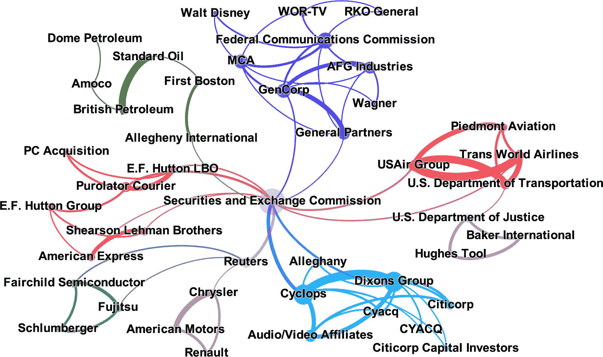

# 第十二章：构建知识图谱

在本书中，我们一直在探索文本分析的多个蓝图。我们的目标始终是通过统计和机器学习帮助识别数据中的模式。在第十章中，我们解释了如何使用嵌入来回答类似“德国对应巴黎的是什么？”的问题。嵌入表示从训练文档中学习的某种隐含知识，基于相似性的概念。

知识库相反，由“柏林是德国的首都”形式的结构化陈述组成。在这种情况下，“首都”是两个特定实体 *柏林* 和 *德国* 之间明确定义的关系。由许多实体及其关系形成的网络在数学意义上是一个图，即*知识图谱*。图 12-1 展示了一个简单的知识图谱，说明了这个例子。在本章中，我们将介绍从非结构化文本中提取结构化信息并构建基本知识图谱的蓝图。


###### 图 12-1. 一个简单的知识图谱。

# What You’ll Learn and What We’ll Build

信息抽取是自然语言处理中最困难的任务之一，因为语言的复杂性和固有歧义性。因此，我们需要应用一系列不同步骤来发现实体和关系。本节中的示例用例是基于公司业务新闻文章创建知识图谱。

在本章中，我们将深入探讨 spaCy 的高级语言处理功能。我们将使用预训练的神经模型结合自定义规则进行命名实体识别、指代消解和关系抽取。我们还将解释执行实体链接的必要步骤，但不会深入到实现细节。

阅读完本章后，你将具备开始构建自己知识库的基本语言和技术知识。你可以在我们的[GitHub 仓库](https://oreil.ly/5dF4g)找到本章的源代码和额外信息。

# 知识图谱

知识图谱是一个大型语义网络。它包括节点，如人物、地点、事件或公司，以及代表这些节点之间正式关系的边，如图 12-1 所示。

谷歌、微软、Facebook 等大公司都使用知识图谱来支持他们的搜索引擎和查询服务。¹ 现在，越来越多的公司开始构建自己的知识图谱，以获取市场洞察或为聊天机器人提供支持。但是最大的知识图谱分布在全球各地：*Linked Open Data*指的是网络上所有可通过统一资源标识符（URI）识别的可用数据。这是在语义网领域经过 20 年学术发展的结果（参见“语义网和 RDF”）。

节点和边的类型由*本体*精确定义，本体本身是一个领域术语使用的知识库。例如，公共本体 Wikidata 为 Figure 12-1 中使用的所有类型提供了定义。² 每个定义都有一个唯一的 URI（例如，“city”是[*http://www.wikidata.org/wiki/Q515*](http://www.wikidata.org/wiki/Q515)）。事实上，Wikidata 包含了类型定义和实际对象，以可查询的格式存储。

## 信息提取

从文本中提取结构化信息需要几个典型步骤，如 Figure 12-2 所示。首先是*命名实体识别*，找到文本中的命名实体并标记其正确类型，例如，人物、组织或地点。同一实体通常会在文档中被不同变体的名称或代词多次引用。第二步是*共指解析*，识别和解决这些*共指*，以防止重复和信息丢失。

与共指解析密切相关，并且通常是下一步，是*实体链接*的任务。在这里，目标是将文本中的提及链接到本体中的唯一现实世界实体，例如，*Berlin*链接到 URI[*http://www.wikidata.org/entity/Q64*](http://www.wikidata.org/entity/Q64)。因此，任何歧义都被消除：Q64 是德国的柏林，而不是新罕布什尔州的柏林（顺便说一下，在 Wikidata 中是 Q821244）。这对于连接不同来源的信息并真正构建知识库至关重要。


###### 图 12-2。信息提取过程。

最后一步是*关系抽取*，识别这些实体之间的关系。在应用场景中，你通常只会考虑几个感兴趣的关系，因为从任意文本中正确提取这种信息很困难。

最后，你可以将图存储在图数据库中，作为知识型应用程序的后端。这些图数据库将数据存储为 RDF 三元组（*三元存储*）或属性图形式，其中节点和边可以具有任意属性。常用的图数据库包括 GraphDB（三元存储）、Neo4j 和 Grakn（属性图形式）。

对于每个步骤，您可以选择基于规则的方法或机器学习。我们将使用 spaCy 的现有模型以及规则进行补充。不过，我们不会训练自己的模型。使用规则来提取领域特定知识的优势在于，您可以快速开始，无需训练数据。正如我们将看到的那样，结果允许进行一些非常有趣的分析。但是，如果您计划在大规模上建立企业知识库，您可能需要为命名实体和关系检测以及实体链接训练自己的模型。

# 引入数据集

假设您在金融业务中工作，并希望跟踪并购新闻。如果您能够自动识别公司名称及其所涉及的交易类型，并将结果存入知识库，那将是很棒的。在本章中，我们将解释有关提取公司信息的构建块。例如，我们将提取关系“公司 1 收购公司 2”。

为了模拟这样的情景，我们使用了一个公开可用的数据集，著名的[Reuters-21578](https://oreil.ly/lltWo)新闻语料库。它包含由路透社在 1987 年发布的 90 个类别的超过 20,000 篇新闻文章。选择此数据集是因为它是免费且易于获取的。实际上，它作为 NLTK 标准语料库之一可用，并且您可以简单地使用 NLTK 下载它：

```py
import nltk
nltk.download('reuters')

```

我们仅处理并购类别（acq）的文章。为了满足我们的目的，我们将所有文章加载到一个`DataFrame`中，并按照“清理文本数据”中的蓝图进行了一些数据清洗。干净的数据对于识别命名实体和关系至关重要，因为神经模型受益于结构良好的句子。对于这个数据集，我们替换了 HTML 转义字符，删除了股票代码符号，替换了诸如*mln*代表*million*的缩写，并纠正了一些拼写错误。我们也放弃了标题，因为它们仅以大写字母编写。但完整的文章内容仍保留下来。所有清洗步骤都可以在[GitHub](https://oreil.ly/21p8d)的笔记本中找到。让我们来看一下我们`DataFrame`中经过清理的文章样本：

```py
USAir Group Inc said a U.S. District Court in Pittsburgh issued a temporary
restraining order to prevent Trans World Airlines Inc from buying additional
USAir shares. USAir said the order was issued in response to its suit, charging
TWA chairman Carl Icahn and TWA violated federal laws and made misleading
statements. TWA last week said it owned 15 % of USAir's shares. It also offered
to buy the company for 52 dollars a share cash or 1.4 billion dollars.

```

因此，在我们制定信息提取蓝图时，这是我们心目中的数据。但是，以下各节中的大多数句子都是简化的示例，以更好地解释这些概念。

# 命名实体识别

在数据清洗后，我们可以开始我们信息提取过程的第一步：命名实体识别。命名实体识别在第四章中作为 spaCy 标准流水线的一部分进行了简要介绍。spaCy 是我们在本章中所有蓝图的首选库，因为它快速且具有我们将利用的可扩展 API。但您也可以使用 Stanza 或 Flair（参见“NER 的替代方案：Stanza 和 Flair”）。

spaCy 为许多语言提供了经过训练的 NER 模型。英语模型是在包含 18 种不同实体类型的大型[OntoNotes5 语料库](https://oreil.ly/gyOiH)上训练的。表 12-1 列出了这些类型的一个子集。其余类型适用于数值实体。

表 12-1. OntoNotes 5 语料库的部分 NER 类型

| NER 类型 | 描述 | NER 类型 | 描述 |
| --- | --- | --- | --- |
| PERSON | 人物，包括虚构的 | PRODUCT | 车辆、武器、食品等（不包括服务） |
| NORP | 国籍或宗教或政治团体 | EVENT | 具名飓风、战役、战争、体育赛事等 |
| FAC | 设施：建筑物、机场、高速公路、桥梁等 | WORK_OF_ART | 书籍、歌曲等的标题 |
| ORG | 组织：公司、机构等 | LAW | 公布为法律的具名文件 |
| GPE | 国家、城市、州 | LANGUAGE | 任何具名语言 |
| LOCATION | 非 GPE 位置、山脉、水体 |  |  |

默认情况下，加载语言模型时会启用 NER 标记器。我们首先通过使用标准（小型）英语模型 `en_core_web_sm` 初始化一个 `nlp` 对象，并打印 NLP 流水线的组件：^(4)

```py
nlp = spacy.load('en_core_web_sm')
print(*nlp.pipeline, sep='\n')

```

`输出：`

```py
('tagger', <spacy.pipeline.pipes.Tagger object at 0x7f98ac6443a0>)
('parser', <spacy.pipeline.pipes.DependencyParser object at 0x7f98ac7a07c0>)
('ner', <spacy.pipeline.pipes.EntityRecognizer object at 0x7f98ac7a0760>)

```

处理文本后，我们可以直接通过 `doc.ents` 访问命名实体。每个实体都有一个文本和描述实体类型的标签。这些属性在下面代码的最后一行用于打印在文本中识别的实体列表：

```py
text = """Hughes Tool Co Chairman W.A. Kistler said its merger with
Baker International Corp was still under consideration.
We hope to come soon to a mutual agreement, Kistler said.
The directors of Baker filed a law suit in Texas to force Hughes
to complete the merger."""
doc = nlp(text)

print(*[(e.text, e.label_) for e in doc.ents], sep=' ')

```

`输出：`

```py
(Hughes Tool Co, ORG) (W.A. Kistler, PERSON) (Baker International Corp, ORG)
(Kistler, ORG) (Baker, PERSON) (Texas, GPE) (Hughes, ORG)

```

利用 spaCy 的漂亮的可视化模块 `displacy`，我们可以生成句子及其命名实体的视觉表示。这对检查结果非常有帮助：

```py
from spacy import displacy
displacy.render(doc, style='ent')

```

`输出：`


总体来说，spaCy 的命名实体识别器表现很好。在我们的例子中，它能够检测到所有命名实体。然而，第二句和第三句中 *Kistler* 和 *Baker* 的标签并不正确。事实上，对于 NER 模型来说，区分人物和组织是一个挑战，因为这些实体类型的使用方式非常相似。我们将在后面的蓝图中解决这类问题，以进行基于名称的共指消解。

## 蓝图：使用基于规则的命名实体识别

如果您希望识别模型未经训练的领域特定实体，您当然可以使用 [spaCy](https://oreil.ly/6EMig) 自行训练您的模型。但训练模型需要大量的训练数据。通常，为自定义实体类型指定简单规则就足够了。在本节中，我们将展示如何使用规则来检测像“司法部”（或者“Justice Department”）这样的政府组织在 Reuters 数据集中的方法。

spaCy 为此提供了一个[`EntityRuler`](https://oreil.ly/A6MZ8)，这是一个流水线组件，可以与或者代替统计命名实体识别器一起使用。与正则表达式搜索相比，spaCy 的匹配引擎更强大，因为模式是在 spaCy 的标记序列上定义的，而不仅仅是字符串。因此，您可以使用任何标记属性，如词形或词性标签来构建您的模式。

所以，让我们定义一些模式规则，以匹配美国政府的部门和经常在我们的语料库中提到的`证券交易委员会`：

```py
from spacy.pipeline import EntityRuler

departments = ['Justice', 'Transportation']
patterns = [{"label": "GOV",
             "pattern": [{"TEXT": "U.S.", "OP": "?"},
                         {"TEXT": "Department"}, {"TEXT": "of"},
                         {"TEXT": {"IN": departments}, "ENT_TYPE": "ORG"}]},
             {"label": "GOV",
              "pattern": [{"TEXT": "U.S.", "OP": "?"},
                          {"TEXT": {"IN": departments}, "ENT_TYPE": "ORG"},
                          {"TEXT": "Department"}]},
             {"label": "GOV",
              "pattern": [{"TEXT": "Securities"}, {"TEXT": "and"},
                          {"TEXT": "Exchange"}, {"TEXT": "Commission"}]}]

```

每条规则由一个带有标签的字典组成，在我们的案例中是自定义实体类型`GOV`，以及令牌序列必须匹配的模式。您可以为同一标签指定多个规则，就像我们在这里所做的一样。^(5) 例如，第一条规则匹配带有文本`"U.S."`（可选，用`"OP": "?"`表示）、`"Department"`、`"of"`和`"Justice"`或`"Transportation"`的令牌序列。请注意，这些规则会对已识别出的类型`ORG`的实体进行进一步的细化。因此，这些模式必须在 spaCy 的命名实体模型之上而不是代替它应用。

基于这些模式，我们创建了一个`EntityRuler`并将其添加到我们的流水线中：

```py
entity_ruler = EntityRuler(nlp, patterns=patterns, overwrite_ents=True)
nlp.add_pipe(entity_ruler)

```

现在，当我们调用`nlp`时，这些组织将自动用新类型`GOV`标记：

```py
text = """Justice Department is an alias for the U.S. Department of Justice.
Department of Transportation and the Securities and Exchange Commission
are government organisations, but the Sales Department is not."""

doc = nlp(text)
displacy.render(doc, style='ent')

```

`输出：`


## 蓝图：规范化命名实体

简化不同实体提及到单一名称的解析的一种方法是规范化或标准化提及。在这里，我们将进行第一次规范化，这通常是有帮助的：移除不具体的后缀和前缀。看看这个例子：

```py
text = "Baker International's shares climbed on the New York Stock Exchange."

doc = nlp(text)
print(*[([t.text for t in e], e.label_) for e in doc.ents], sep='\n')

```

`输出：`

```py
(['Baker', 'International', "'s"], 'ORG')
(['the', 'New', 'York', 'Stock', 'Exchange'], 'ORG')

```

在第一句中，尽管所有格-s 不是公司名称的一部分，令牌序列`Baker International's`被检测为一个实体。类似的情况是`《纽约证券交易所》`中的文章。无论文章实际上是否是名称的一部分，实体有时会在提及时带有文章，有时则没有。因此，通常移除文章和所有格-apostrophe-s 简化了提及的链接。

###### 警告

如同任何规则一样，存在着错误的可能性：想象一下`《华尔街日报》`或`麦当劳`。如果你需要保留这些情况下的冠词或者所有格-apostrophe，你必须为规则定义异常。

我们的蓝图函数展示了如何在 spaCy 中实现诸如移除前导冠词和尾随所有格-apostrophe-s 等规范化。由于我们不允许直接更新实体，我们创建了实体的副本，并将修改应用于该副本：

```py
from spacy.tokens import Span

def norm_entities(doc):
    ents = []
    for ent in doc.ents:
        if ent[0].pos_ == "DET": # leading article
            ent = Span(doc, ent.start+1, ent.end, label=ent.label)
        if ent[-1].pos_ == "PART": # trailing particle like 's
            ent = Span(doc, ent.start, ent.end-1, label=ent.label)
        ents.append(ent)
    doc.ents = tuple(ents)
    return doc

```

在 spaCy 中，实体是具有定义的开始和结束以及额外标签的`Span`对象。我们循环遍历实体，并根据需要调整实体的第一个和最后一个标记的位置。最后，我们用修改后的副本替换`doc.ents`。

该函数以一个 spaCy 的`Doc`对象（命名为`doc`）作为参数，并返回一个`Doc`。因此，我们可以将其用作另一个管道组件，简单地将其添加到现有管道中：

```py
nlp.add_pipe(norm_entities)

```

现在我们可以对示例句子重复这个过程，并检查结果：

```py
doc = nlp(text)
print(*[([t.text for t in e], e.label_) for e in doc.ents], sep='\n')

```

`Out:`

```py
(['Baker', 'International'], 'ORG')
(['New', 'York', 'Stock', 'Exchange'], 'ORG')

```

## 合并实体标记

在许多情况下，将像前面示例中的复合名称视为单个标记是有意义的，因为它简化了句子结构。spaCy 提供了一个内置的管道函数`merge_entities`来实现这一目的。我们将其添加到我们的 NLP 管道中，确保每个命名实体正好只有一个标记：

```py
from spacy.pipeline import merge_entities
nlp.add_pipe(merge_entities)

doc = nlp(text)
print(*[(t.text, t.ent_type_) for t in doc if t.ent_type_ != ''])

```

`Out:`

```py
('Baker International', 'ORG') ('New York Stock Exchange', 'ORG')

```

即使合并实体在本章后期简化了我们的蓝图，这并不总是一个好主意。例如，考虑像`伦敦证券交易所`这样的复合实体名称。将其合并为单个标记后，这个实体与伦敦市的隐含关系将会丢失。

# 共指消解

在信息提取中最大的障碍之一是实体提及出现在许多不同的拼写形式中（也称为*表面形式*）。看看以下句子：

> 休斯工具公司主席 W.A.基斯勒表示其与贝克国际公司的合并仍在考虑中。基斯勒表示希望达成一致意见。贝克将迫使休斯完成合并。美国司法部的审查今天已经完成。司法部将在与证券交易委员会磋商后阻止这一合并。

如我们所见，实体通常以其全名引入，而后续提及则使用缩写版本。这是必须解决的一种共指类型，以理解正在发生的情况。图 12-3 显示了一个无（左）和有（右）统一名称的共现图。这样的共现图将在下一节中构建，是显示出现在同一文章中的实体对的可视化。


###### 图 12-3\. 同一文章的共现图在核心引用解析前（左）和后（右）的对比。

*共指消解* 是确定单个文本中实体不同提及的任务，例如缩写名称、别名或代词。这一步骤的结果是一组共指提及，称为*提及簇*，例如 `{休斯工具公司, 休斯, 其}`。本节的目标是识别相关的提及并在文档中进行链接。

为了这个目的，我们为指代消解和名称统一开发了几个蓝图（见图 12-4）。我们将限制自己只处理组织和个人，因为这些是我们感兴趣的实体类型。首先，我们将通过字典查找解析像*SEC*这样的别名。然后我们将在文档中匹配名称到第一次提及。例如，我们将从“Kistler”创建到“W.A. Kistler”的链接。之后，间接指代（*回指*）如第一句中的代词*its*将被解决。最后，我们将再次规范化已解析实体的名称。所有这些步骤将作为附加的管道函数实现。


###### 图 12-4\. 命名实体识别和指代消解的流程图。

*实体链接*更进一步。这里的实体提及在语义级别上被消歧，并链接到现有知识库中的唯一条目。因为实体链接本身是一项具有挑战性的任务，我们不会提供其蓝图，而只是在本节末讨论它。

## 蓝图：使用 spaCy 的标记扩展

我们需要一种技术上的方法，从不同实体的各个提及创建到主参照（*referent*）的链接。在核心 ference 解决后，例如文章示例中的“Kistler”的标记应指向“(W.A. Kistler, PERSON)”。spaCy 的扩展机制允许我们定义自定义属性，这是将此类信息与标记一起存储的完美方法。因此，我们创建了两个标记扩展`ref_n`（参照名称）和`ref_t`（参照类型）。这些属性将为每个标记初始化为 spaCy 指定的默认值：

```py
from spacy.tokens import Token
Token.set_extension('ref_n', default='')
Token.set_extension('ref_t', default='')

```

下一个展示的`init_coref`函数确保每个类型为`ORG`、`GOV`和`PERSON`的实体提供一个初始参照。这种初始化对于接下来的功能是必需的：

```py
def init_coref(doc):
    for e in doc.ents:
        if e.label_ in ['ORG', 'GOV', 'PERSON']:
            e[0]._.ref_n, e[0]._.ref_t = e.text, e.label_
    return doc

```

自定义属性通过标记的下划线属性访问。请注意，在`merge_entities`之后，每个实体提及`e`由一个单一标记`e[0]`组成，我们在其中设置了这些属性。我们也可以在实体跨度而不是标记上定义这些属性，但我们希望稍后对代词解析使用相同的机制。

## 蓝图：执行别名解析

我们首先的目标是解决众所周知的领域别名，比如*Transportation Department*代表“美国交通部”，以及像 SEC 或 TWA 这样的缩写词。解决这类别名的简单方法是使用查找字典。我们为 Reuters 语料库中的所有缩写词和一些常见别名准备了这样一个字典，并将其作为本章蓝图模块的一部分提供。^(6) 这里是一些示例查找：

```py
from blueprints.knowledge import alias_lookup

for token in ['Transportation Department', 'DOT', 'SEC', 'TWA']:
    print(token, ':', alias_lookup[token])

```

`Out:`

```py
Transportation Department : ('U.S. Department of Transportation', 'GOV')
DOT : ('U.S. Department of Transportation', 'GOV')
SEC : ('Securities and Exchange Commission', 'GOV')
TWA : ('Trans World Airlines Inc', 'ORG')

```

每个令牌别名都映射到一个元组，包括实体名称和类型。下面显示的函数`alias_resolver`检查实体文本是否在字典中找到。如果是，将更新其`ref`属性为查找到的值：

```py
def alias_resolver(doc):
    """Lookup aliases and store result in ref_t, ref_n"""
    for ent in doc.ents:
        token = ent[0].text
        if token in alias_lookup:
            a_name, a_type = alias_lookup[token]
            ent[0]._.ref_n, ent[0]._.ref_t = a_name, a_type
    return propagate_ent_type(doc)

```

解决了别名后，我们还可以纠正命名实体类型，以防其被错误标识。这是通过函数`propagate_ent_type`完成的。它更新所有已解析的别名，并将在下一个基于名称的指代消解蓝图中使用：

```py
def propagate_ent_type(doc):
    """propagate entity type stored in ref_t"""
    ents = []
    for e in doc.ents:
        if e[0]._.ref_n != '': # if e is a coreference
            e = Span(doc, e.start, e.end, label=e[0]._.ref_t)
        ents.append(e)
    doc.ents = tuple(ents)
    return doc

```

现在，我们将`alias_resolver`添加到我们的流水线中：

```py
nlp.add_pipe(alias_resolver)

```

现在我们可以检查结果。为此，我们提供的蓝图包含一个实用函数`display_ner`，用于为`doc`对象中的标记创建一个`DataFrame`，并包括本章相关属性：

```py
from blueprints.knowledge import display_ner
text = """The deal of Trans World Airlines is under investigation by the
U.S. Department of Transportation.
The Transportation Department will block the deal of TWA."""
doc = nlp(text)
display_ner(doc).query("ref_n != ''")[['text', 'ent_type', 'ref_n', 'ref_t']]

```

`输出：`

|  | 文本 | 实体类型 | 参考编号 | 参考类型 |
| --- | --- | --- | --- | --- |
| 3 | 美国国际航空公司 | ORG | 美国国际航空公司 | ORG |
| 9 | 美国交通部 | GOV | 美国交通部 | GOV |
| 12 | 交通部 | GOV | 美国交通部 | GOV |
| 18 | TWA | ORG | 美国国际航空公司 | ORG |

## 蓝图：解决名称变体

别名解析仅在别名在前期已知的情况下有效。但是由于文章中几乎任何名称都可能存在变体，因此构建所有这些名称的词典是不可行的。再次看一下我们介绍示例中第一句中识别的命名实体：


在这里，您会找到“Kistler”的指代“W.A. Kistler（`PERSON`）”，“Baker”的指代“Baker International Corp（`ORG`）”，以及“休斯”的指代“休斯工具公司（`ORG`）”。正如您所看到的，缩写的公司名称经常被误认为是人物，特别是在以模拟形式使用时。在这个蓝图中，我们将解决这些指代，并为每个提及分配正确的实体类型。

为此，我们将利用新闻文章中的一个常见模式。实体通常首先以其全名介绍，后续提及使用缩写版本。因此，我们将通过将名称与实体的第一次提及匹配来解决次要引用。当然，这是一个启发式规则，可能会产生错误的匹配。例如，*休斯*也可能指同一篇文章中的公司以及传奇企业家霍华德·休斯（确实是休斯工具公司的创始人）。但这类情况在我们的数据集中很少见，我们决定在正确的启发式案例中接受这种不确定性。

我们为名称匹配定义了一个简单的规则：如果所有单词按相同顺序出现在主要提及中，次要提及就匹配主要提及。为了检查这一点，下一个显示的函数`name_match`将次要提及`m2`转换为正则表达式，并在主要提及`m1`中搜索匹配项：

```py
def name_match(m1, m2):
    m2 = re.sub(r'[()\.]', '', m2) # ignore parentheses and dots
    m2 = r'\b' + m2 + r'\b' # \b marks word boundary
    m2 = re.sub(r'\s+', r'\\b.*\\b', m2)
    return re.search(m2, m1, flags=re.I) is not None

```

例如，Hughes Co.的次要提及会被转换为`'\bHughes\b.*\bCo\b'`，这与 Hughes Tool Co 匹配。`\b`确保只匹配整个单词，而不是子词如*Hugh*。

基于此匹配逻辑，下面展示的`name_resolver`函数实现了基于名称的组织和个人共指解析：

```py
def name_resolver(doc):
    """create name-based reference to e1 as primary mention of e2"""
    ents = [e for e in doc.ents if e.label_ in ['ORG', 'PERSON']]
    for i, e1 in enumerate(ents):
        for e2 in ents[i+1:]:
            if name_match(e1[0]._.ref_n, e2[0].text):
                e2[0]._.ref_n = e1[0]._.ref_n
                e2[0]._.ref_t = e1[0]._.ref_t
    return propagate_ent_type(doc)

```

首先，我们创建一个所有组织和个人实体的列表。然后，将实体`e1`和`e2`的所有对比较。该逻辑确保实体`e1`在文档中始终出现在`e2`之前。如果`e2`匹配`e1`，其指示物将自动传播到其后续共指。

我们将此函数添加到`nlp`流程中，并检查结果：

```py
nlp.add_pipe(name_resolver)

doc = nlp(text)
displacy.render(doc, style='ent')

```

`Out:`


现在我们的示例中每个命名实体都具有正确的类型。我们还可以检查实体是否映射到其第一次提及：

```py
display_ner(doc).query("ref_n != ''")[['text', 'ent_type', 'ref_n', 'ref_t']]

```

`Out:`

|   | text | ent_type | ref_n | ref_t |
| --- | --- | --- | --- | --- |
| 0 | Hughes Tool Co | ORG | Hughes Tool Co | ORG |
| 2 | W.A. Kistler | PERSON | W.A. Kistler | PERSON |
| 7 | Baker International Corp. | ORG | Baker International Corp. | ORG |
| 22 | Kistler | PERSON | W.A. Kistler | PERSON |
| 25 | Baker | ORG | Baker International Corp. | ORG |
| 28 | Hughes | ORG | Hughes Tool Co | ORG |

## 蓝图：使用 NeuralCoref 进行指代消解

在语言学中，*指代*是依赖于前文的词语。考虑我们示例句子的这种变化：

```py
text = """Hughes Tool Co said its merger with Baker
was still under consideration. Hughes had a board meeting today.
W.A. Kistler mentioned that the company hopes for a mutual agreement.
He is reasonably confident."""

```

这里的*其*、*公司*和*他*是指代词。来自 Hugging Face 的[NeuralCoref](https://oreil.ly/kQRhE)是一个解决这类共指的库。该算法结合基于词嵌入的特征向量（参见第十章），使用两个神经网络识别共指簇及其主要提及物。

NeuralCoref 作为 spaCy 的流水线扩展实现，因此完美地适合我们的流程。我们使用`greedyness`值为 0.45 创建神经共指解析器，并将其添加到我们的流水线中。`greedyness`控制模型的敏感性，在一些实验后，我们决定选择比默认值 0.5 稍微严格一些的值（更高的准确性，较低的召回率）：

```py
from neuralcoref import NeuralCoref
neural_coref = NeuralCoref(nlp.vocab, greedyness=0.45)
nlp.add_pipe(neural_coref, name='neural_coref')

```

NeuralCoref 还利用 spaCy 的扩展机制向`Doc`、`Span`和`Token`对象添加自定义属性。处理文本时，我们可以通过`doc._.coref_clusters`属性访问检测到的共指簇。在我们的示例中，已经识别出三个这样的簇：

```py
doc = nlp(text)
print(*doc._.coref_clusters, sep='\n')

```

`Out:`

```py
Hughes Tool Co: [Hughes Tool Co, its]
Hughes: [Hughes, the company]
W.A. Kistler: [W.A. Kistler, He]

```

NeuralCoref 在 `Span` 对象（令牌序列）上工作，因为一般的共指不仅限于命名实体。因此，蓝图函数 `anaphor_coref` 为每个令牌检索第一个共指集群，并搜索具有其 `ref_n` 属性值的第一个命名实体。在我们的案例中，这只会是组织和人物。一旦找到，它将把代词令牌的 `ref_n` 和 `ref_t` 值设置为主参考中的相同值：

```py
def anaphor_coref(doc):
    """anaphora resolution"""
    for token in doc:
        # if token is coref and not already dereferenced
        if token._.in_coref and token._.ref_n == '':
            ref_span = token._.coref_clusters[0].main # get referred span
            if len(ref_span) <= 3: # consider only short spans
                for ref in ref_span: # find first dereferenced entity
                    if ref._.ref_n != '':
                        token._.ref_n = ref._.ref_n
                        token._.ref_t = ref._.ref_t
                        break
    return doc

```

再次，我们将这个解析器加入到我们的流水线中并检查结果：

```py
nlp.add_pipe(anaphor_coref)
doc = nlp(text)
display_ner(doc).query("ref_n != ''") \
  [['text', 'ent_type', 'main_coref', 'ref_n', 'ref_t']]

```

`Out:`

|  | 文本 | 实体类型 | 主共指 | ref_n | ref_t |
| --- | --- | --- | --- | --- | --- |
| 0 | Hughes Tool Co | 组织 | Hughes Tool Co | Hughes Tool Co | 组织 |
| 2 | 其 |  | Hughes Tool Co | Hughes Tool Co | 组织 |
| 5 | Baker | 人物 | None | Baker | 人物 |
| 11 | Hughes | 组织 | Hughes | Hughes Tool Co | 组织 |
| 18 | W.A. Kistler | 人物 | W.A. Kistler | W.A. Kistler | 人物 |
| 21 | the |  | Hughes | Hughes Tool Co | 组织 |
| 22 | 公司 |  | Hughes | Hughes Tool Co | 组织 |
| 29 | He |  | W.A. Kistler | W.A. Kistler | 人物 |

现在我们的流水线包括图示 12-4 中显示的所有步骤。

###### 警告

警惕长时间运行时间！NeuralCoref 将总体处理时间增加了 5–10 倍。因此，您应该仅在必要时使用指代消解。

## 名称规范化

尽管我们的名称解析在文章中统一了公司提及，但是公司名称在文章之间仍然不一致。在一篇文章中我们会看到 *Hughes Tool Co.*，而在另一篇文章中我们会看到 *Hughes Tool*。实体链接器可以用来将不同的实体提及链接到唯一的规范表示，但在没有实体链接器的情况下，我们将使用（解析后的）名称实体作为其唯一标识符。由于前面的共指解析步骤，解析后的名称总是文章中第一个，因此通常也是最完整的提及。因此，错误的可能性并不大。

不过，我们必须通过去除诸如 *Co.* 或 *Inc.* 这样的法律后缀来协调公司提及。以下函数使用正则表达式来实现此目标：

```py
def strip_legal_suffix(text):
    return re.sub(r'(\s+and)?(\s+|\b(Co|Corp|Inc|Plc|Ltd)\b\.?)*$', '', text)

print(strip_legal_suffix('Hughes Tool Co'))

```

`Out:`

```py
Hughes Tool

```

最后的流水线函数 `norm_names` 将最终的规范化应用于存储在 `ref_n` 属性中的每个共指解析后的组织名称。请注意，使用这种方法，`Hughes (人物)` 和 `Hughes (组织)` 仍然会保持分开的实体。

```py
def norm_names(doc):
    for t in doc:
        if t._.ref_n != '' and t._.ref_t in ['ORG']:
            t._.ref_n = strip_legal_suffix(t._.ref_n)
            if t._.ref_n == '':
                t._.ref_t = ''
    return doc

nlp.add_pipe(norm_names)

```

有时，命名实体识别器会错误地将法律后缀（例如 *Co.* 或 *Inc.*）单独分类为命名实体。如果这样的实体名称被剥离成空字符串，我们只需忽略它以便稍后处理。

## 实体链接

在前面的章节中，我们开发了一个操作流程，其目的是统一命名实体的不同提及。但所有这些都是基于字符串的，除了语法表示之外，我们没有将“美国司法部”这样的字符串与所代表的现实世界实体联系起来。相比之下，实体链接器的任务是全局解析命名实体，并将它们链接到唯一标识的现实世界实体。实体链接从“字符串到实体”的转换。^(8)

从技术上讲，这意味着每个提及都映射到一个 URI。URI 又可以用来指代现有知识库中的实体。这可以是公共本体，例如 Wikidata 或 DBpedia，也可以是公司内部的私有知识库。URI 可以是 URL（例如网页），但不一定要是。例如，美国司法部在 Wikidata 有一个 URI [*http://www.wikidata.org/entity/Q1553390*](http://www.wikidata.org/entity/Q1553390)，这也是一个包含有关该实体信息的网页。如果您构建自己的知识库，则不需要为每个 URI 创建网页；它们只需要是唯一的。顺便说一下，DBpedia 和 Wikidata 使用不同的 URI，但您将在 DBpedia 上找到对 Wikidata URI 的交叉引用。两者当然都包含指向维基百科网页的链接。

如果一个实体通过完全限定名称（如“美国司法部”）提及，实体链接就很简单。但是，“司法部”而没有“美国”就已经相当模糊，因为许多州都有“司法部”。实际意义取决于上下文，实体链接器的任务是根据上下文敏感地将这种模糊提及映射到正确的 URI。这是一个相当大的挑战，仍然是持续研究的领域。在商业项目中进行实体链接的常见解决方案是使用公共服务（参见“实体链接服务”）。

或者，您可以创建自己的实体链接器。一个简单的解决方案是基于名称的查找字典。但这种方法不考虑上下文，并且无法解决不同实体的名称歧义。为此，您需要更复杂的方法。最先进的解决方案使用嵌入和神经模型进行实体链接。例如，spaCy 还提供了这样的[实体链接功能](https://oreil.ly/bqs8E)。要使用 spaCy 的实体链接器，首先必须为您指定的描述创建嵌入（参见第十章），从而捕获其语义。然后，您可以训练模型，学习将提及映射到正确 URI 的上下文敏感映射。然而，实体链接器的设置和训练超出了本章的范围。

# 蓝图：创建共现图

在前面的部分，我们花了很多精力来规范命名实体并至少解析文档内的核心参考。现在我们终于准备好分析实体对之间的第一个关系了：它们在文章中的共同提及。为此，我们将创建一个共现图，这是知识图的最简形式。共现图中的节点是实体，例如组织。如果两个实体在相同的上下文中提及，例如在一篇文章、一个段落或一个句子中，它们之间就会共享一个（无向）边。

图 12-5 显示了路透社语料库中一起提及的公司的共现图的部分。边的宽度可视化了共现频率。[*模块性*](https://oreil.ly/pGZ-s)，这是一种用于识别网络中紧密相关的群体或社群的结构性指标，被用来着色节点和边。^(9)



###### 图 12-5\. 从路透社语料库生成的共现图的最大连通分量。

当然，我们不知道这里的关系类型。实际上，两个实体的共同提及只是表明可能存在一些关系。除非我们真的分析句子，否则我们无法确定。但是，即使简单探索共现也可能有所启示。例如，图 12-5 中的中心节点是“证券交易委员会”，因为它在许多文章中与许多其他实体一起提及。显然，该实体在并购中扮演重要角色。不同的集群给我们留下了一些关于涉及特定交易的公司（或社群）的印象。

要绘制共现图，我们必须从文档中提取实体对。对于涵盖多个主题领域的较长文章，最好在段落甚至句子内搜索共现。但是涉及并购的路透社文章非常专注，所以我们在这里坚持使用文档级别。让我们简要地走一遍提取和可视化共现的过程。

## 从文档中提取共现

函数 `extract_coocs` 返回给定 `Doc` 对象中指定类型的实体对列表：

```py
from itertools import combinations

def extract_coocs(doc, include_types):
    ents = set([(e[0]._.ref_n, e[0]._.ref_t)
                for e in doc.ents if e[0]._.ref_t in include_types])
    yield from combinations(sorted(ents), 2)

```

我们首先创建一个核心解析实体名称和类型的集合。有了这个，我们使用 Python 标准库 `itertools` 中的 `combinations` 函数来创建所有实体对。每对都按字典顺序排序（`sorted(ents)`），以防止重复条目，比如 “(Baker, Hughes)” 和 “(Hughes, Baker)” 的出现。

为了高效处理整个数据集，我们再次使用 spaCy 的流式处理，通过调用 `nlp.pipe`（在第四章介绍过）。由于我们不需要在文档中解析指代关系以找出文档内的共现，因此在这里禁用了相应的组件：

```py
batch_size = 100

coocs = []
for i in range(0, len(df), batch_size):
    docs = nlp.pipe(df['text'][i:i+batch_size],
                    disable=['neural_coref', 'anaphor_coref'])
    for j, doc in enumerate(docs):
        coocs.extend([(df.index[i+j], *c)
                      for c in extract_coocs(doc, ['ORG', 'GOV'])])

```

让我们看一下第一篇文章识别出的共现：

```py
print(*coocs[:3], sep='\n')

```

`输出：`

```py
(10, ('Computer Terminal Systems', 'ORG'), ('Sedio N.V.', 'ORG'))
(10, ('Computer Terminal Systems', 'ORG'), ('Woodco', 'ORG'))
(10, ('Sedio N.V.', 'ORG'), ('Woodco', 'ORG'))

```

在信息提取中，始终建议具有某种可追溯性，以便在出现问题时识别信息的来源。因此，我们保留了文章的索引，这在我们的情况下是 Reuters 语料库的文件 ID，与每个共现元组（这里是 ID 10）一起。根据这个列表，我们生成了一个`DataFrame`，每个实体组合有一个条目，其频率和找到这个共现的文章 ID（限制为五个）。

```py
coocs = [([id], *e1, *e2) for (id, e1, e2) in coocs]
cooc_df = pd.DataFrame.from_records(coocs,
             columns=('article_id', 'ent1', 'type1', 'ent2', 'type2'))
cooc_df = cooc_df.groupby(['ent1', 'type1', 'ent2', 'type2'])['article_id'] \
                 .agg(['count', 'sum']) \
                 .rename(columns={'count': 'freq', 'sum': 'articles'}) \
                 .reset_index().sort_values('freq', ascending=False)
cooc_df['articles'] = cooc_df['articles'].map(
                        lambda lst: ','.join([str(a) for a in lst[:5]]))

```

这里是我们在语料库中发现的三对最频繁的实体：

```py
cooc_df.head(3)

```

`输出：`

|  | ent1 | type1 | ent2 | type2 | freq | articles |
| --- | --- | --- | --- | --- | --- | --- |
| 12667 | 美国世界航空公司 | ORG | USAir 集团 | ORG | 22 | 1735,1771,1836,1862,1996 |
| 5321 | 单眼巨人 | ORG | 迪克森斯集团 | ORG | 21 | 4303,4933,6093,6402,7110 |
| 12731 | 美国交通部 | GOV | USAir 集团 | ORG | 20 | 1735,1996,2128,2546,2799 |

## 使用 Gephi 可视化图形

实际上，这个`DataFrame`已经代表了我们图形的边缘列表。对于可视化，我们更喜欢[图表](https://gephi.org)，这是一个用于图形分析的开源工具。因为它是交互式的，所以比 Python 的图形库 NetworkX 要好得多。^(10) 为了使用 Gephi，我们需要将图的节点和边的列表保存为 Graph Exchange XML 格式。幸运的是，NetworkX 提供了一个将图导出为这种格式的函数。因此，我们可以简单地将我们的`DataFrame`转换为 NetworkX 图，并将其保存为`.gexf`文件。我们舍弃了罕见的实体对，以保持图的紧凑性，并重新命名了频率列，因为 Gephi 会自动使用`weight`属性来调整边的宽度。

```py
import networkx as nx

graph = nx.from_pandas_edgelist(
           cooc_df[['ent1', 'ent2', 'articles', 'freq']] \
           .query('freq > 3').rename(columns={'freq': 'weight'}),
           source='ent1', target='ent2', edge_attr=True)

nx.readwrite.write_gexf(graph, 'cooc.gexf', encoding='utf-8',
                        prettyprint=True, version='1.2draft')

```

将文件导入 Gephi 后，我们仅选择了最大的组件（连接的子图），并手动删除了一些只有少数连接的节点，以清晰起见。^(11) 结果呈现在图 12-5 中。

###### 注意

有时，最有趣的关系是不频繁的关系。例如，考虑一下即将发生的合并的第一次公告，或者过去提到过但后来被遗忘的令人惊讶的关系。先前无关的实体的突然共现可能是开始对关系进行更深入分析的信号。

# 关系提取

即使共现图已经为我们提供了关于公司网络的一些有趣见解，但它并没有告诉我们关系的类型。例如，考虑图中左下角由 Schlumberger、Fairchild Semiconductor 和 Fujitsu 公司组成的子图。到目前为止，我们对这些公司之间的关系一无所知；这些信息仍然隐藏在这样的句子中：

*富士通希望扩展。它计划收购施伦贝尔格的工业单元傲胜公司 80%的股份。*

在本节中，我们将介绍基于模式的关系抽取的两个蓝图。第一个更简单的蓝图搜索形式为“主语-谓语-宾语”的标记短语。第二个使用句子的语法结构——依赖树来以更复杂的规则获取更精确的结果。最终，我们将生成一个基于四种关系（*acquires*、*sells*、*subsidiary-of*和*chairperson-of*）的知识图谱。说实话，我们将使用较为宽松的*acquires*和*sells*定义，这样更容易识别。它们也会匹配句子如“富士通*计划收购*傲胜公司 80%股权”甚至“富士通*撤回了收购*傲胜公司的选项”。

关系抽取是一个复杂的问题，因为自然语言的歧义性和不同种类及变化的关系。基于模型的关系抽取方法是当前研究的一个热门话题。^(12) 还有一些公开可用的训练数据集，如[FewRel](http://zhuhao.me/fewrel)。然而，训练一个模型来识别关系仍然主要停留在研究阶段，超出了本书的范围。

## 蓝图：使用短语匹配提取关系

第一个蓝图类似于基于规则的实体识别：它试图根据标记序列的模式识别关系。让我们从一个简化版本的介绍性例子开始解释这种方法。

```py
text = """Fujitsu plans to acquire 80% of Fairchild Corp, an industrial unit
of Schlumberger."""

```

我们可以通过搜索以下模式来找到这个句子中的关系：

```py
ORG {optional words, not ORG} acquire {optional words, not ORG} ORG
ORG {optional words, not ORG} unit of {optional words, not ORG} ORG 
```

[spaCy 的基于规则的匹配器](https://oreil.ly/Mxd3m)允许我们找到不仅涉及文本标记而且包括它们属性（如词形或词性）的模式。要使用它，我们必须首先定义一个匹配器对象。然后，我们可以向匹配器添加带有标记模式的规则：

```py
from spacy.matcher import Matcher

matcher = Matcher(nlp.vocab)

acq_synonyms = ['acquire', 'buy', 'purchase']
pattern = [{'_': {'ref_t': 'ORG'}}, # subject
           {'_': {'ref_t': {'NOT_IN': ['ORG']}}, 'OP': '*'},
           {'POS': 'VERB', 'LEMMA': {'IN': acq_synonyms}},
           {'_': {'ref_t': {'NOT_IN': ['ORG']}}, 'OP': '*'},
           {'_': {'ref_t': 'ORG'}}] # object
matcher.add('acquires', None, pattern)

```

```py
subs_synonyms = ['subsidiary', 'unit']
pattern = [{'_': {'ref_t': 'ORG'}}, # subject
           {'_': {'ref_t': {'NOT_IN': ['ORG']}},
            'POS': {'NOT_IN': ['VERB']}, 'OP': '*'},
           {'LOWER': {'IN': subs_synonyms}}, {'TEXT': 'of'},
           {'_': {'ref_t': {'NOT_IN': ['ORG']}},
            'POS': {'NOT_IN': ['VERB']}, 'OP': '*'},
           {'_': {'ref_t': 'ORG'}}] # object
matcher.add('subsidiary-of', None, pattern)

```

第一个模式是针对`acquires`关系的。它返回所有由组织名称组成的跨度，后跟任意不是组织的标记，匹配几个*acquire*的同义词的动词，再次是任意标记，最后是第二个组织名称。`subsidiary-of`的第二个模式工作方式类似。

当然，这些表达式很难阅读。一个原因是我们使用了自定义属性`ref_t`而不是标准的`ENT_TYPE`。这是为了匹配没有标记为实体的指代词，例如代词。另一个原因是我们包含了一些`NOT_IN`子句。这是因为带有星号操作符(`*`)的规则总是危险的，因为它们搜索长度不受限制的模式。对标记的附加条件可以减少假匹配的风险。例如，我们希望匹配“施卢姆伯格的工业部门费尔德，但不是“富士通提到了施卢姆伯格的一个部门。”在开发规则时，您总是需要通过复杂性来换取精确性。我们将在一分钟内讨论*acquires*关系的问题。

现在蓝图功能`extract_rel_match`接收处理过的`Doc`对象和匹配器，并将所有匹配转换为主谓宾三元组：

```py
def extract_rel_match(doc, matcher):
    for sent in doc.sents:
        for match_id, start, end in matcher(sent):
            span = sent[start:end]  # matched span
            pred = nlp.vocab.strings[match_id] # rule name
            subj, obj = span[0], span[-1]
            if pred.startswith('rev-'): # reversed relation
                subj, obj = obj, subj
                pred = pred[4:]
            yield ((subj._.ref_n, subj._.ref_t), pred,
                   (obj._.ref_n, obj._.ref_t))

```

谓词由规则名称确定；所涉及的实体仅是匹配跨度的第一个和最后一个标记。我们限制搜索到句子级别，因为在整个文档中，我们可能会发现跨多个句子的假阳性的高风险。

通常，规则按“主谓宾”的顺序匹配，但实体在文本中经常以相反的顺序出现，就像“施卢姆伯格的部门费尔德公司”。在这种情况下，关于`subsidiary-of`关系的实体顺序是“宾-谓-主”。`extract_rel_match`已经准备好处理这种情况，并在规则具有`rev-`前缀时切换主体和客体：

```py
pattern = [{'_': {'ref_t': 'ORG'}}, # subject
           {'LOWER': {'IN': subs_synonyms}}, # predicate
           {'_': {'ref_t': 'ORG'}}] # object
matcher.add('rev-subsidiary-of', None, pattern)

```

现在我们能够检测到句子中的`acquires`和`subsidiary-of`的两种变体：

```py
text = """Fujitsu plans to acquire 80% of Fairchild Corp, an industrial unit
of Schlumberger. The Schlumberger unit Fairchild Corp received an offer."""
doc = nlp(text)
print(*extract_rel_match(doc, matcher), sep='\n')

```

`Out:`

```py
(('Fujitsu', 'ORG'), 'acquires', ('Fairchild', 'ORG'))
(('Fairchild', 'ORG'), 'subsidiary-of', ('Schlumberger', 'ORG'))
(('Fairchild', 'ORG'), 'subsidiary-of', ('Schlumberger', 'ORG'))

```

虽然这些规则在我们的例子中运行良好，但*acquires*的规则并不是很可靠。动词*acquire*可以出现在许多不同的实体组合中。因此，存在诸如以下这种的假阳性的高概率匹配：

```py
text = "Fairchild Corp was acquired by Fujitsu."
print(*extract_rel_match(nlp(text), matcher), sep='\n')

```

`Out:`

```py
(('Fairchild', 'ORG'), 'acquires', ('Fujitsu', 'ORG'))

```

或者这样一个：

```py
text = "Fujitsu, a competitor of NEC, acquired Fairchild Corp."
print(*extract_rel_match(nlp(text), matcher), sep='\n')

```

`Out:`

```py
(('NEC', 'ORG'), 'acquires', ('Fairchild', 'ORG'))

```

显然，我们的规则并不适用于被动从句（“被...收购”），在这种情况下，主语和宾语交换位置。我们也不能处理包含命名实体或否定的插入，因为它们会产生假匹配。要正确处理这些情况，我们需要了解句子的句法结构。而这些知识可以从依赖树中获取。

但是让我们先移除匹配器中不可靠的*acquires*规则：

```py
if matcher.has_key("acquires"):
    matcher.remove("acquires")

```

## 蓝图：使用依赖树提取关系

语言的语法规则对每个句子强加了一种句法结构。每个词在与其他词的关系中起特定作用。例如，名词在句子中可以是主语或宾语；这取决于它与动词的关系。在语言学理论中，句子的词汇是层级相互依存的，而在自然语言处理管道中，解析器的任务是重建这些依赖关系。^(13) 其结果是*依赖树*，也可以通过`displacy`进行可视化：

```py
text = "Fujitsu, a competitor of NEC, acquired Fairchild Corp."
doc = nlp(text)
displacy.render(doc, style='dep',
                options={'compact': False, 'distance': 100})

```


依赖树中的每个节点代表一个词。边缘用依赖信息标记。根节点通常是句子的谓语，本例中是*acquired*，有一个主语(`nsubj`)和一个宾语(`obj`)作为直接子节点。这个第一层，根加子节点，已经代表了句子“Fujitsu acquired Fairchild Corp.”的本质。

我们也来看看带有被动从句的例子。在这种情况下，助动词(`auxpass`)表示*acquired*以被动形式使用，*Fairchild*是被动主语(`nsubjpass`)：


###### 警告

依赖标签的值取决于解析器模型训练的语料库。它们还因语言而异，因为不同语言有不同的语法规则。因此，您绝对需要检查依赖解析器使用的标签集。

函数`extract_rel_dep`实现了一个规则，用于基于依赖关系识别基于动词的关系，例如*acquires*：

```py
def extract_rel_dep(doc, pred_name, pred_synonyms, excl_prepos=[]):
    for token in doc:
        if token.pos_ == 'VERB' and token.lemma_ in pred_synonyms:
            pred = token
            passive = is_passive(pred)
            subj = find_subj(pred, 'ORG', passive)
            if subj is not None:
                obj = find_obj(pred, 'ORG', excl_prepos)
                if obj is not None:
                    if passive: # switch roles
                        obj, subj = subj, obj
                    yield ((subj._.ref_n, subj._.ref_t), pred_name,
                           (obj._.ref_n, obj._.ref_t))

```

主循环迭代文档中的所有标记，并搜索表明我们关系的动词。此条件与我们之前使用的平面模式规则相同。但是当我们检测到可能的谓语时，我们现在遍历依赖树以找到正确的主语和宾语。`find_subj`搜索谓语的左子树，而`find_obj`搜索谓语的右子树。这些功能未在书中打印，但您可以在本章的 GitHub 笔记本中找到它们。它们使用广度优先搜索来查找最接近的主语和宾语，因为嵌套句子可能有多个主语和宾语。最后，如果谓语表示被动从句，主语和宾语将被交换。

注意，这个函数也适用于*sells*关系：

```py
text = """Fujitsu said that Schlumberger Ltd has arranged
to sell its stake in Fairchild Inc."""
doc = nlp(text)
print(*extract_rel_dep(doc, 'sells', ['sell']), sep='\n')

```

`Out:`

```py
(('Schlumberger', 'ORG'), 'sells', ('Fairchild', 'ORG'))

```

在这种情况下，*Fairchild Inc.*是与*sell*依赖树中最接近的对象，并正确地被识别为所调查关系的对象。但仅仅是“最接近”并不总是足够。考虑这个例子：


实际上，这里我们有一个三方关系：Schlumberger 将 Fairchild 卖给 Fujitsu。我们的*sells*关系意图表达“一家公司卖出（整体或部分）另一家公司”。另一部分由*acquires*关系覆盖。但是，我们如何在这里检测到正确的对象呢？在这个句子中，Fujitsu 和 Fairchild 都是介词对象（依赖`pobj`），而 Fujitsu 是最接近的。介词是关键：Schlumberger 将某物卖给“Fujitsu”，所以这不是我们要找的关系。在提取函数中，参数`excl_prepos`的目的是跳过具有指定介词的对象。以下是不带（A）和带有（B）介词过滤器的输出：

```py
print("A:", *extract_rel_dep(doc, 'sells', ['sell']))
print("B:", *extract_rel_dep(doc, 'sells', ['sell'], ['to', 'from']))

```

`Out:`

```py
A: (('Schlumberger', 'ORG'), 'sells', ('Fujitsu', 'ORG'))
B:

```

让我们来看看我们的新关系提取函数在几个示例变体上的工作情况：

```py
texts = [
     "Fairchild Corp was bought by Fujitsu.", # 1
     "Fujitsu, a competitor of NEC Co, acquired Fairchild Inc.", # 2
     "Fujitsu is expanding." +
     "The company made an offer to acquire 80% of Fairchild Inc.", # 3
     "Fujitsu plans to acquire 80% of Fairchild Corp.", # 4
     "Fujitsu plans not to acquire Fairchild Corp.", # 5
     "The competition forced Fujitsu to acquire Fairchild Corp." # 6
]

acq_synonyms = ['acquire', 'buy', 'purchase']
for i, text in enumerate(texts):
    doc = nlp(text)
    rels = extract_rel_dep(doc, 'acquires', acq_synonyms, ['to', 'from'])
    print(f'{i+1}:', *rels)

```

`Out:`

```py
1: (('Fujitsu', 'ORG'), 'acquires', ('Fairchild', 'ORG'))
2: (('Fujitsu', 'ORG'), 'acquires', ('Fairchild', 'ORG'))
3: (('Fujitsu', 'ORG'), 'acquires', ('Fairchild', 'ORG'))
4: (('Fujitsu', 'ORG'), 'acquires', ('Fairchild', 'ORG'))
5: (('Fujitsu', 'ORG'), 'acquires', ('Fairchild', 'ORG'))
6:

```

正如我们所看到的，前四句中的关系已经被正确提取出来。然而，第 5 句包含否定，仍然返回`acquires`。这是一个典型的假阳性案例。我们可以扩展我们的规则以正确处理这种情况，但在我们的语料库中否定很少，我们接受了简单算法的不确定性。相比之下，第 6 句则是一个可能的假阴性的例子。尽管提到了关系，但由于这句子的主语是*competition*而不是公司之一，因此没有被检测到。

实际上，基于依赖的规则本质上是复杂的，每种使其更精确的方法都会导致更多的复杂性。在不使代码过于复杂的情况下，找到精度（更少的假阳性）和召回率（更少的假阴性）之间的良好平衡是一种挑战。

尽管存在这些缺陷，基于依赖的规则仍然能够产生良好的结果。然而，这一过程的最后一步取决于命名实体识别、共指消解和依赖解析的正确性，而所有这些都不能以 100%的准确率工作。因此，总会有一些假阳性和假阴性。但是，这种方法已经足够好，可以产生非常有趣的知识图谱，正如我们将在下一节中做的那样。

# 创建知识图谱

现在我们知道如何提取特定的关系，我们可以将所有内容整合在一起，并从整个 Reuters 语料库创建知识图谱。我们将提取组织、人员以及四个关系“acquires”、“sells”、“subsidiary-of”和“executive-of”。图 12-6 显示了带有一些选择的子图的结果图。

为了在依赖解析和命名实体识别中获得最佳结果，我们使用 spaCy 的大型模型和完整管道。如果可能，我们将使用 GPU 加速 NLP 处理：

```py
if spacy.prefer_gpu():
    print("Working on GPU.")
else:
    print("No GPU found, working on CPU.")
nlp = spacy.load('en_core_web_lg')

```

```py
pipes = [entity_ruler, norm_entities, merge_entities,
         init_coref, alias_resolver, name_resolver,
         neural_coref, anaphor_coref, norm_names]
for pipe in pipes:
    nlp.add_pipe(pipe)

```

在我们开始信息提取过程之前，我们为“执行者”关系创建了两个类似于“子公司”关系的额外规则，并将它们添加到我们基于规则的`matcher`中：

```py
ceo_synonyms = ['chairman', 'president', 'director', 'ceo', 'executive']
pattern = [{'ENT_TYPE': 'PERSON'},
           {'ENT_TYPE': {'NOT_IN': ['ORG', 'PERSON']}, 'OP': '*'},
           {'LOWER': {'IN': ceo_synonyms}}, {'TEXT': 'of'},
           {'ENT_TYPE': {'NOT_IN': ['ORG', 'PERSON']}, 'OP': '*'},
           {'ENT_TYPE': 'ORG'}]
matcher.add('executive-of', None, pattern)

pattern = [{'ENT_TYPE': 'ORG'},
           {'LOWER': {'IN': ceo_synonyms}},
           {'ENT_TYPE': 'PERSON'}]
matcher.add('rev-executive-of', None, pattern)

```


###### 图 12-6\. 从路透社语料库中提取的知识图，包括三个选定的子图（使用 Gephi 可视化）。

然后，我们定义一个函数来提取所有关系。我们的四种关系中，两种被匹配器覆盖，另外两种被基于依赖的匹配算法覆盖：

```py
def extract_rels(doc):
    yield from extract_rel_match(doc, matcher)
    yield from extract_rel_dep(doc, 'acquires', acq_synonyms, ['to', 'from'])
    yield from extract_rel_dep(doc, 'sells', ['sell'], ['to', 'from'])

```

提取关系的剩余步骤，将其转换为 NetworkX 图，并将图存储在 `gexf` 文件中供 Gephi 使用，基本上遵循“蓝图：创建共现图”。我们在这里跳过它们，但您将再次在 GitHub 存储库中找到完整的代码。

这里是最终数据框架的几条记录，包含了图的节点和边，正如它们被写入 `gexf` 文件的方式：

|  | 主体 | 主体类型 | 谓语 | 宾语 | 宾语类型 | 频率 | 文章 |
| --- | --- | --- | --- | --- | --- | --- | --- |
| 883 | 泛美航空公司 | ORG | 收购 | 美国航空集团 | ORG | 7 | 2950,2948,3013,3095,1862,1836,7650 |
| 152 | 卡尔·伊坎 | PERSON | 担任执行者 | 泛美航空公司 | ORG | 3 | 1836,2799,3095 |
| 884 | 泛美航空公司 | ORG | 销售 | 美国航空集团 | ORG | 1 | 9487 |

用 Gephi 的帮助再次创建的图 12-6 中的路透社图的可视化效果。该图由许多相当小的组件（不连通的子图）组成；因为大多数公司只在一两篇新闻文章中被提及，我们仅提取了四种关系，因此简单的共现不包括在这里。我们在图中手动放大了其中三个子图。它们代表的是公司网络，这些网络已经在共现图中出现过（图 12-5），但现在我们知道了关系类型，并且得到了一个更清晰的图像。

## 不要盲目地信任结果

我们经历的每个处理步骤都有潜在的错误可能性。因此，存储在图中的信息并不完全可靠。事实上，这始于文章本身的数据质量。如果您仔细观察图 12-6 中左上角的示例，您会注意到图中出现了“富士通”和“Futjitsu”这两个实体。这实际上是原始文本中的拼写错误。

在图 12-6 右侧放大的子网络中，您可以发现表面上相互矛盾的信息：“皮德蒙特收购美国航空”和“美国航空收购皮德蒙特”。事实上，两者都是正确的，因为这两家企业都收购了对方的部分股份。但这也可能是其中一家相关规则或模型的错误。要追踪这种问题，有必要存储一些关于提取关系来源的信息。这就是为什么我们在每条记录中包含文章列表的原因。

最后，请注意我们的分析完全没有考虑到一个方面：信息的及时性。世界在不断变化，关系也在变化。因此，我们图中的每一条边都应该有时间戳。因此，要创建一个具有可信信息的知识库，仍然有很多工作要做，但我们的蓝图为开始提供了坚实的基础。

# 结语

在本章中，我们探讨了如何通过从非结构化文本中提取结构化信息来构建知识图谱。我们经历了信息提取的整个过程，从命名实体识别到通过指代消解到关系提取。

正如您所见，每一步都是一个挑战，我们总是在规则化方法和模型化方法之间做出选择。规则化方法的优势在于您无需训练数据。因此，您可以立即开始；您只需定义规则即可。但是，如果您尝试捕捉的实体类型或关系复杂难以描述，最终要么会得到过于简单并返回许多错误匹配的规则，要么是非常复杂且难以维护的规则。使用规则时，始终很难在召回率（找到大多数匹配项）和精确度（仅找到正确匹配项）之间找到良好的平衡。而且，您需要相当多的技术、语言和领域专业知识才能编写出好的规则。在实践中，您还必须测试和进行大量实验，直到您的规则足够强大以满足您的应用需求。

相比之下，基于模型的方法具有一个巨大的优势，即它们可以从训练数据中学习这些规则。当然，其缺点是您需要大量高质量的训练数据。如果这些训练数据特定于您的应用领域，那么您必须自己创建它们。在文本领域，手动标记训练数据尤其麻烦且耗时，因为有人必须先阅读和理解文本，然后才能设置标签。事实上，今天在机器学习领域，获得好的训练数据是最大的瓶颈。

缓解缺乏训练数据问题的一个可能解决方案是弱监督学习。其思想是通过像本章定义的规则或甚至通过程序生成它们的方式来创建一个大数据集。当然，由于规则并非完美，这个数据集会有噪音。但令人惊讶的是，我们可以在低质量数据上训练出高质量的模型。弱监督学习用于命名实体识别和关系提取，与本节中涵盖的许多其他主题一样，是当前的研究热点。如果您想了解更多关于信息提取和知识图谱创建的最新技术，可以查阅以下参考资料。它们为进一步阅读提供了良好的起点。

# 进一步阅读

+   Barrière, Caroline 的《语义网背景下的自然语言理解》。瑞士：斯普林格出版社。2016 年。[*https://www.springer.com/de/book/9783319413358*](https://www.springer.com/de/book/9783319413358)。

+   Gao, Yuqing，Jisheng Liang，Benjamin Han，Mohamed Yakout 和 Ahmed Mohamed 的《构建大规模、准确且更新的知识图谱》。KDD 教程，2018 年。[*https://kdd2018tutorialt39.azurewebsites.net*](https://kdd2018tutorialt39.azurewebsites.net)。

+   Han, Xu，Hao Zhu，Pengfei Yu，Ziyun Wang，Yuan Yao，Zhiyuan Liu 和 Maosong Sun 的《FewRel：一种大规模监督少样本关系分类数据集及其最新评估》。EMNLP 会议论文，2018 年。[*https://arxiv.org/abs/1810.10147*](https://arxiv.org/abs/1810.10147)。

+   Jurafsky, Dan 和 James H. Martin 的《语音与语言处理》。第 3 版（草案），第十八章和第二十二章。2019 年。[*https://web.stanford.edu/~jurafsky/slp3*](https://web.stanford.edu/~jurafsky/slp3)。

+   Lison, Pierre，Aliaksandr Hubin，Jeremy Barnes 和 Samia Touileb 的《无标注数据命名实体识别：弱监督方法》。ACL 会议论文，2020 年[*https://arxiv.org/abs/2004.14723*](https://arxiv.org/abs/2004.14723)。

^(1) 参见 Natasha Noy，Yuqing Gao，Anshu Jain，Anant Narayanan，Alan Patterson 和 Jamie Taylor 的《产业规模知识图谱：经验与挑战》。2019 年。[*https://queue.acm.org/detail.cfm?id=3332266*](https://queue.acm.org/detail.cfm?id=3332266)。

^(2) 详情请见[*https://oreil.ly/nzhUR*](https://oreil.ly/nzhUR)。

^(3) Tim Berners-Lee 等人，《语义网：对计算机有意义的新形式的 Web 内容将引发新的可能性革命》。《科学美国人》284 号 5 月 2001 年。

^(4) 星号操作符（*）将列表展开为`print`的单独参数。

^(5) 参见[spaCy 的基于规则匹配的使用文档](https://oreil.ly/Hvtgs)以了解语法的解释，并查看[*https://explosion.ai/demos/matcher*](https://explosion.ai/demos/matcher)上的交互式模式探索器。

^(6) 在本章的笔记本上，你将找到一个用于缩略语检测的额外蓝图，位于[GitHub](https://oreil.ly/LlPHm)。

^(7) 更多详情请参见 Wolf（2017）的[“Chatbots 的最新神经指代消解技术”](https://oreil.ly/VV4Uy)。

^(8) 谷歌在 2012 年推出其知识图谱时提出了这一口号。

^(9) 你可以在本书的电子版和我们的[GitHub 存储库](https://oreil.ly/2ju0k)中找到彩色插图。

^(10) 你可以在本章笔记本的 [GitHub](https://oreil.ly/OWTcO) 上找到该图的 NetworkX 版本。

^(11) 更多详细信息请参阅我们本章的 [GitHub 仓库](https://oreil.ly/nri01)。

^(12) 参见 [最新技术概述](https://oreil.ly/l6DIH)。

^(13) 与依存分析器相反，成分分析器根据嵌套短语创建层次化的句子结构。
