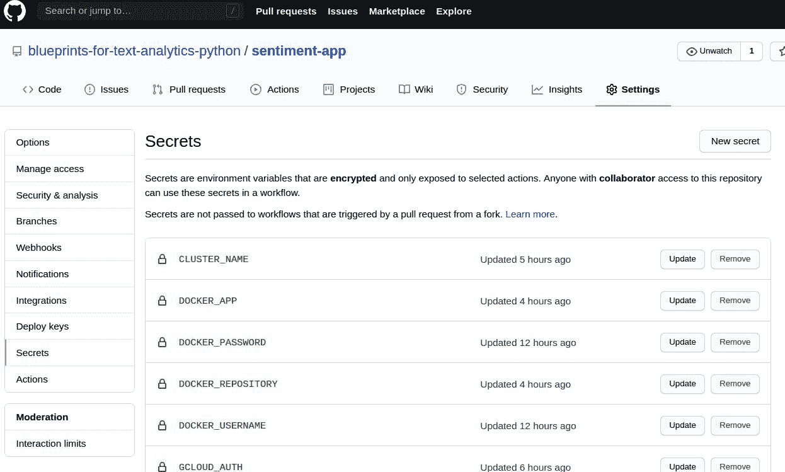

# 第十三章。在生产中使用文本分析

到目前为止，我们已经介绍了几个蓝图，并了解了它们在多个用例中的应用。任何分析或机器学习模型在其他人能够轻松使用时，才能发挥其最大价值。在本章中，我们将提供几个蓝图，让您可以共享我们早期章节中的文本分类器，并部署到云环境中，使任何人都能使用我们构建的内容。

假设您在本书的第十章中使用了一个蓝图来分析来自 Reddit 的各种汽车型号数据。如果您的同事对于使用同样的分析方法来研究摩托车行业感兴趣，修改数据源并重复使用代码应该是简单的。实际情况可能更为复杂，因为您的同事首先必须设置一个类似于您使用的环境，安装相同版本的 Python 和所有必需的软件包。他们可能使用的是不同的操作系统，安装步骤也会有所不同。或者考虑到您向分析的客户展示时非常满意，三个月后他们回来要求您覆盖更多行业。现在，您必须重复相同的分析，但确保代码和环境保持不变。这次分析的数据量可能更大，您的系统资源可能不足，促使您使用云计算资源。您必须在云服务提供商上执行安装步骤，这可能会迅速变得耗时。

# 您将学到什么，我们将构建什么

经常发生的情况是，您能够产生出色的结果，但由于其他希望使用它们的同事无法重新运行代码和复现结果，因此这些结果无法使用。在本章中，我们将向您展示一些技术，确保您的分析或算法可以轻松被任何人重复使用，包括您自己在以后的阶段。如果我们能够让其他人更轻松地使用我们分析的输出会怎样？这消除了一个额外的障碍，并增加了我们结果的可访问性。我们将向您展示如何将您的机器学习模型部署为简单的 REST API，允许任何人在其自己的工作或应用程序中使用您模型的预测。最后，我们将向您展示如何利用云基础设施实现更快的运行时或为多个应用程序和用户提供服务。由于大多数生产服务器和服务运行在 Linux 上，本章包含许多在 Linux shell 或终端中运行最佳的可执行命令和指令。但是，它们在 Windows PowerShell 中同样有效。

# 蓝图：使用 Conda 创建可重现的 Python 环境

本书介绍的蓝图使用 Python 和包生态系统来完成多个文本分析任务。与任何编程语言一样，[Python](https://python.org/downloads) 经常更新并支持多个版本。此外，像 Pandas、NumPy 和 SciPy 这样的常用包也有定期的发布周期，当它们升级到新版本时。尽管维护者们尽力确保新版本向后兼容，但有可能您去年完成的分析在最新版本的 Python 下无法运行。您的蓝图可能使用了最新版本库中已弃用的方法，这会导致分析无法重现，除非知道所使用库的版本。

假设您将蓝图以 Jupyter 笔记本或 Python 模块的形式与同事分享；当他们尝试运行时，可能会遇到如下常见错误：

```py
import spacy

```

`输出：`

```py
---------------------------------------------------------------------------
ModuleNotFoundError                       Traceback (most recent call last)
<ipython-input-1-76a01d9c502b> in <module>
----> 1 import spacy
ModuleNotFoundError: No module named 'spacy'

```

在大多数情况下，`ModuleNotFoundError` 可以通过手动使用命令 `**pip install <module_name>**` 安装所需的包来轻松解决。但想象一下，对于每个非标准包都要这样做！此命令还会安装最新版本，这可能不是您最初使用的版本。因此，确保可重复性的最佳方法是使用标准化的方式共享用于运行分析的 Python 环境。我们使用 conda 包管理器以及 Miniconda Python 发行版来解决这个问题。

###### 注意

有几种方法可以解决创建和共享 Python 环境的问题，conda 只是其中之一。[pip](https://oreil.ly/Dut6o) 是标准的 Python 包安装程序，随 Python 附带，并广泛用于安装 Python 包。[venv](https://oreil.ly/k5m6A) 可用于创建虚拟环境，每个环境可以拥有其自己的 Python 版本和一组已安装的包。Conda 结合了包安装程序和环境管理器的功能，因此是我们首选的选项。重要的是要区分 conda 和 Anaconda/Miniconda 发行版。这些发行版包括 Python 和 conda，以及处理数据所需的基本包。虽然 conda 可以直接通过 pip 安装，但最简单的方法是安装 Miniconda，这是一个包含 conda、Python 和一些必需包的小型引导版本。

首先，我们必须按照[以下步骤](https://oreil.ly/GZ4b-)安装 Miniconda 发行版。这将创建一个基本安装，其中只包含 Python、conda 和一些基本软件包如`pip`、`zlib`等。现在，我们可以为每个项目创建单独的环境，其中只包含我们需要的软件包，并且与其他环境隔离开来。这很有用，因为您所做的任何更改，如安装额外的软件包或升级到不同的 Python 版本，不会影响任何其他项目或应用程序，因为它们使用自己的环境。可以通过以下命令执行此操作：

```py
conda create -n env_name [list_of_packages]
```

执行前面的命令将使用 Miniconda 首次安装时可用的默认版本创建一个新的 Python 环境。让我们创建一个名为`blueprints`的环境，其中明确指定 Python 版本和要安装的附加软件包列表如下：

```py
$ conda create -n blueprints numpy pandas scikit-learn notebook python=3.8
Collecting package metadata (current_repodata.json): - done
Solving environment: \ done
 Package Plan
  environment location: /home/user/miniconda3/envs/blueprints
  added / updated specs:
    - notebook
    - numpy
    - pandas
    - python=3.8
    - scikit-learn

The following packages will be downloaded:

    package                    |            build
    ---------------------------|-----------------
    blas-1.0                   |              mkl           6 KB
    intel-openmp-2020.1        |              217         780 KB
    joblib-0.16.0              |             py_0         210 KB
    libgfortran-ng-7.3.0       |       hdf63c60_0        1006 KB
    mkl-2020.1                 |              217       129.0 MB
    mkl-service-2.3.0          |   py37he904b0f_0         218 KB
    mkl_fft-1.1.0              |   py37h23d657b_0         143 KB
    mkl_random-1.1.1           |   py37h0573a6f_0         322 KB
    numpy-1.18.5               |   py37ha1c710e_0           5 KB
    numpy-base-1.18.5          |   py37hde5b4d6_0         4.1 MB
    pandas-1.0.5               |   py37h0573a6f_0         7.8 MB
    pytz-2020.1                |             py_0         184 KB
    scikit-learn-0.23.1        |   py37h423224d_0         5.0 MB
    scipy-1.5.0                |   py37h0b6359f_0        14.4 MB
    threadpoolctl-2.1.0        |     pyh5ca1d4c_0          17 KB
    ------------------------------------------------------------
                                           Total:       163.1 MB

The following NEW packages will be INSTALLED:

  _libgcc_mutex      pkgs/main/linux-64::_libgcc_mutex-0.1-main
  attrs              pkgs/main/noarch::attrs-19.3.0-py_0
  backcall           pkgs/main/noarch::backcall-0.2.0-py_0
  blas               pkgs/main/linux-64::blas-1.0-mkl
  bleach             pkgs/main/noarch::bleach-3.1.5-py_0
  ca-certificates    pkgs/main/linux-64::ca-certificates-2020.6.24-0

(Output truncated)

```

执行完命令后，可以通过执行`**conda activate <env_name>**`来激活它，您会注意到命令提示符前缀带有环境名称。您可以进一步验证 Python 的版本与您指定的版本是否相同：

```py
$ conda activate blueprints
(blueprints) $ python --version
Python 3.8

```

使用命令`**conda env list**`可以查看系统中所有环境的列表，如下所示。输出将包括基本环境，这是安装 Miniconda 时创建的默认环境。特定环境前的星号表示当前活动环境，在我们的例子中是刚刚创建的环境。请确保在制作蓝图时继续使用此环境：

```py
(blueprints) $ conda env list
# conda environments:
#
base                     /home/user/miniconda3
blueprints            *  /home/user/miniconda3/envs/blueprints

```

`conda`确保每个环境可以拥有其自己版本的相同软件包，但这可能会增加存储成本，因为每个环境中将使用相同版本的每个软件包。使用硬链接在一定程度上可以减少这种影响，但在软件包使用[硬编码路径](https://oreil.ly/bN8Dl)的情况下可能无效。然而，我们建议在切换项目时创建另一个环境。但是，建议使用命令`**conda remove --name <env_name> --all**`删除未使用的环境是一个良好的实践。

这种方法的优点在于，当您想与他人共享代码时，可以指定应运行的环境。可以使用命令`**conda env export > environment.yml**`将环境导出为 YAML 文件。在运行此命令之前，请确保您处于所需的环境中（通过运行`**conda activate <environment_name>**`）：

```py
(blueprints) $ conda env export > environment.yml
(blueprints) $ cat environment.yml
name: blueprints
channels:
  - defaults
dependencies:
  - _libgcc_mutex=0.1=main
  - attrs=19.3.0=py_0
  - backcall=0.2.0=py_0
  - blas=1.0=mkl
  - bleach=3.1.5=py_0
  - ca-certificates=2020.6.24=0
  - certifi=2020.6.20=py37_0
  - decorator=4.4.2=py_0
  - defusedxml=0.6.0=py_0
  - entrypoints=0.3=py37_0
  - importlib-metadata=1.7.0=py37_0
  - importlib_metadata=1.7.0=0
  - intel-openmp=2020.1=217
  - ipykernel=5.3.0=py37h5ca1d4c_0
(output truncated)

```

如输出所示，`environment.yml` 文件列出了环境中使用的所有包及其依赖关系。任何人都可以通过运行命令 `**conda env create -f environment.yml**` 使用此文件重新创建相同的环境。然而，此方法可能存在跨平台限制，因为 YAML 文件中列出的依赖关系特定于平台。因此，如果您在 Windows 系统上工作并导出了 YAML 文件，则在 macOS 系统上可能无法正常工作。

这是因为 Python 包所需的某些依赖项取决于平台。例如，[Intel MKL 优化](https://oreil.ly/ND7_H) 是特定于某种架构的，可以用 [OpenBLAS](http://openblas.net) 库来替代。为了提供一个通用的环境文件，我们可以使用命令 `**conda env export --from-history > environment.yml**`，它只生成您明确请求的包的列表。运行此命令的输出如下，列出了我们在创建环境时安装的包。与先前的环境文件相比，前者还列出了像 `attrs` 和 `backcall` 这样的包，它们是 conda 环境的一部分，但并非我们请求的。当在新平台上使用此类 YAML 文件创建环境时，conda 将自动识别和安装默认包及其特定于平台的依赖关系。此外，将安装我们明确指定的包及其依赖项：

```py
(blueprints) $ conda env export --from-history > environment.yml
(blueprints) $ cat environment.yml
name: blueprints
channels:
  - defaults
dependencies:
  - scikit-learn
  - pandas
  - notebook
  - python=3.8
  - numpy
prefix: /home/user/miniconda3/envs/blueprints

```

使用 `--from-history` 选项的缺点是创建的环境不是原始环境的复制品，因为基本包和依赖项是特定于平台的，因此不同。如果要使用此环境的平台与创建环境的平台相同，则不建议使用此选项。

# 蓝图：使用容器创建可复制的环境

虽然像 conda 这样的包管理器帮助安装多个包并管理依赖关系，但仍有几个特定于平台的二进制文件可能会妨碍可复制性。为了简化事务，我们利用了一个称为 *容器* 的抽象层。这个名字来源于航运业，标准尺寸的航运集装箱用于通过船舶、卡车和铁路运输各种商品。无论物品类型或运输方式如何，集装箱确保任何遵循该标准的人都可以运输这些物品。同样地，我们使用 Docker 容器来标准化我们工作的环境，并确保每次重新创建时都能生成相同的环境，无论在哪里运行或由谁运行。[Docker](https://docker.com) 是实现此功能的最流行工具之一，我们将在本蓝图中使用它。图 13-1 显示了 Docker 的工作高级概述。


###### 图 13-1\. Docker 的工作流程。

我们需要从[下载链接](https://oreil.ly/CJWKF)安装 Docker。一旦设置完成，请在命令行中运行 `sudo docker run hello-world` 来测试一切是否设置正确，您应该看到如下输出。请注意，Docker 守护程序绑定到一个 Unix 套接字，由 root 用户拥有，因此需要使用 `sudo` 运行所有命令。如果无法提供 root 访问权限，您也可以尝试一个[实验版本](https://oreil.ly/X7lzt)的 Docker：

```py
$ sudo docker run hello-world

Hello from Docker!
This message shows that your installation appears to be working correctly.

To generate this message, Docker took the following steps:
 1\. The Docker client contacted the Docker daemon.
 2\. The Docker daemon pulled the "hello-world" image from the Docker Hub.
    (amd64)
 3\. The Docker daemon created a new container from that image which runs the
    executable that produces the output you are currently reading.
 4\. The Docker daemon streamed that output to the Docker client, which sent it
    to your terminal.

To try something more ambitious, you can run an Ubuntu container with:
 $ docker run -it ubuntu bash

Share images, automate workflows, and more with a free Docker ID:
 https://hub.docker.com/

For more examples and ideas, visit:
 https://docs.docker.com/get-started/

```

我们可以将构建 Docker 容器与购买汽车类比。我们从预配置选项中选择开始。这些配置已经选择了一些组件，例如引擎类型（排量、燃料类型）、安全功能、设备水平等。我们可以自定义许多这些组件，例如升级到更节能的引擎或添加额外的组件，如导航系统或加热座椅。最后，我们确定我们喜欢的配置并订购汽车。类似地，我们在 *Dockerfile* 中指定我们想要创建的环境配置。这些配置以一组顺序执行的指令形式描述，结果是创建一个 *Docker 镜像*。Docker 镜像就像根据我们的 Dockerfile 创建的首选汽车配置。所有 Docker 镜像都是可扩展的，因此我们可以扩展现有的 Docker 镜像并通过添加特定步骤来自定义它。运行 Docker 镜像的最后一步会创建一个 *Docker 容器*，这就像根据您的首选配置交付给您的汽车一样。在这种情况下，它是一个包含操作系统及其它工具和软件包的完整环境，如在 Dockerfile 中指定的。它在硬件上运行并使用主机系统提供的接口，但与主机系统完全隔离。事实上，它是根据您设计的方式运行的服务器的最小版本。从相同镜像实例化的每个 Docker 容器无论在哪个主机系统上运行都将是相同的。这很强大，因为它允许您封装您的分析和环境，并在笔记本电脑、云端或组织的服务器上运行并期望相同的行为。

我们将创建一个 Docker 镜像，其中包含与我们分析中使用的相同的 Python 环境，这样其他人可以通过拉取镜像并实例化为容器来复现我们的分析。虽然我们可以从头开始指定我们的 Docker 镜像，但最好是从现有的镜像开始，并定制其中的某些部分来创建我们自己的版本。这样的镜像称为*父镜像*。一个好地方去搜索父镜像是[Docker Hub 注册表](https://hub.docker.com)，这是一个包含预构建 Docker 镜像的公共仓库。您会找到官方支持的镜像，如[Jupyter 数据科学](https://oreil.ly/kKLXU)笔记本，以及像我们为第九章创建的[用户创建的镜像](https://oreil.ly/K5SMy)。Docker 仓库中的每个镜像也可以直接用来运行容器。您可以使用`**sudo docker search**`命令搜索镜像，并添加参数以格式化结果，如下所示，在这里我们搜索可用的 Miniconda 镜像：

```py
$ sudo docker search miniconda
NAME                                        STARS
continuumio/miniconda3                      218
continuumio/miniconda                       77
conda/miniconda3                            35
conda/miniconda3-centos7                    7
yamitzky/miniconda-neologd                  3
conda/miniconda2                            2
atavares/miniconda-rocker-geospatial        2

```

我们看到有一个 Miniconda3 的镜像，这将是我们自己的 Dockerfile 的一个很好的起点。请注意，所有 Dockerfile 都必须以`FROM`关键字开头，指定它们派生自哪个镜像。如果您从头开始指定一个 Dockerfile，那么您将使用`FROM scratch`关键字。[Miniconda 镜像和 Dockerfile 的详细信息](https://oreil.ly/ddYff)显示了该镜像如何派生自一个 Debian 父镜像，并且只添加额外的步骤来安装和设置 conda 包管理器。在使用父 Docker 镜像时，检查它来自可信的来源非常重要。Docker Hub 提供了额外的标准，如“官方镜像”，有助于识别官方来源。

让我们按照我们的 Dockerfile 中定义的步骤来进行。我们从 Miniconda3 镜像开始，然后添加一个步骤来创建我们的自定义环境。我们使用`ARG`指令来指定我们 conda 环境的名称参数（blueprints）。然后，我们使用`ADD`将`environment.yml`文件从构建上下文复制到镜像中。最后，通过将`**conda create**`命令作为`RUN`的参数来创建 conda 环境：

```py
FROM continuumio/miniconda3

# Add environment.yml to the build context and create the environment
ARG conda_env=blueprints
ADD environment.yml /tmp/environment.yml
RUN conda env create -f /tmp/environment.yml

```

在接下来的步骤中，我们希望确保环境在容器中被激活。因此，我们将其添加到`.bashrc`脚本的末尾，这将在容器启动时始终运行。我们还使用`ENV`指令更新`PATH`环境变量，以确保 conda 环境是容器内部到处使用的 Python 版本：

```py
# Activating the environment and starting the jupyter notebook
RUN echo "source activate ${conda_env}" > ~/.bashrc
ENV PATH /opt/conda/envs/${conda_env}/bin:$PATH

```

在最后一步，我们希望自动启动一个 Jupyter 笔记本，以便此 Docker 容器的用户可以以交互方式运行分析。我们使用`ENTRYPOINT`指令来配置将作为可执行文件运行的容器。Dockerfile 中只能有一个这样的指令（如果有多个，则只有最后一个有效），它将是容器启动时要运行的最后一个命令，通常用于启动像我们要运行的 Jupyter 笔记本这样的服务器。我们指定额外的参数来在容器本身的 IP 地址（`0.0.0.0`）上运行服务器，在特定端口（`8888`）上以 root 用户身份运行（`--allow-root`），并且默认不在浏览器中打开（`--no-browser`）。当容器启动时，我们不希望它在其浏览器中打开 Jupyter 服务器。相反，我们将使用指定的端口将主机机器连接到此容器，并通过那里的浏览器访问它：

```py
# Start jupyter server on container
EXPOSE 8888
ENTRYPOINT ["jupyter","notebook","--ip=0.0.0.0", \
      "--port=8888","--allow-root","--no-browser"]

```

我们使用`docker build`命令根据我们的 Dockerfile 创建镜像。我们使用`-t`参数指定镜像的名称，并添加用户名和镜像名称。这在以后要引用镜像时非常有用。虽然没有必要指定用户名，但稍后我们会看到这样做的好处。在构建镜像时使用的 Dockerfile 由`-f`参数指定。如果未指定任何内容，则 Docker 将选择指定`PATH`参数所在目录中名为*Dockerfile*的文件。`PATH`参数还指定了在 Docker 守护程序上构建过程的“上下文”中查找文件的位置。此目录中的所有文件都将在构建过程中被打包为`tar`文件并发送到守护程序。这些文件必须包括所有要添加到镜像中的文件和工件，例如将复制到镜像以创建 conda 环境的`environment.yml`文件。

```py
docker build -t username/docker_project -f Dockerfile [PATH]
```

执行此命令时，Docker 守护程序开始通过运行 Dockerfile 中指定的步骤来创建镜像。通常，您会在已经包含所有文件和 Dockerfile 的同一目录中执行该命令。我们使用`.`来引用当前目录指定`PATH`参数：

```py
$ sudo docker build -t textblueprints/ch13:v1 .
Sending build context to Docker daemon  5.363MB
Step 1/8 : FROM continuumio/miniconda3
 ---> b4adc22212f1
Step 2/8 : ARG conda_env=blueprints
 ---> 959ed0c16483
Step 3/8 : ADD environment.yml /tmp/environment.yml
 ---> 60e039e09fa7
Step 4/8 : RUN conda env create -f /tmp/environment.yml
 ---> Running in 85d2f149820b
Collecting package metadata (repodata.json): ...working... done
Solving environment: ...working... done

Downloading and Extracting Packages

(output truncated)

Removing intermediate container 85d2f149820b
Step 5/8 : RUN echo "source activate ${conda_env}" > ~/.bashrc
 ---> e0ed2b448211
Step 6/8 : ENV PATH /opt/conda/envs/${conda_env}/bin:$PATH
 ---> 7068395ce2cf
Step 7/8 : EXPOSE 8888
 ---> Running in f78ac4aa0569
Removing intermediate container f78ac4aa0569
 ---> 06cfff710f8e
Step 8/8 : ENTRYPOINT ["jupyter","notebook","--ip=0.0.0.0",
                       "--port=8888","--allow-root","--no-browser"]
 ---> Running in 87852de682f4
Removing intermediate container 87852de682f4
 ---> 2b45bb18c071
Successfully built 2b45bb18c071
Successfully tagged textblueprints/ch13:v1

```

构建完成后，可以通过运行命令`**sudo docker images**`来检查镜像是否成功创建。你会注意到已经下载了`continuumio/miniconda3`镜像，并且还创建了包含你的用户名和`docker_project`指定的镜像。第一次构建 Docker 会花费更长时间，因为需要下载父镜像，但后续的更改和重建会快得多：

```py
$ sudo docker images
REPOSITORY                          TAG                 IMAGE ID
textblueprints/ch13                 v1                  83a05579afe6
jupyter/minimal-notebook            latest              d94723ae86d1
continuumio/miniconda3              latest              b4adc22212f1
hello-world                         latest              bf756fb1ae65

```

我们可以通过运行以下命令创建这个环境的运行实例，也称为*容器*：

```py
docker run -p host_port:container_port username/docker_project:tag_name
```

`-p` 参数允许端口转发，基本上将接收到的任何请求发送到 `host_port` 到 `container_port`。默认情况下，Jupyter 服务器只能访问容器内的文件和目录。但是，我们希望从运行在容器内部的 Jupyter 服务器中访问本地目录中的 Jupyter 笔记本和代码文件。我们可以使用 `-v host_volume:container_volume` 将本地目录附加到容器作为卷，这将在容器内创建一个新目录，指向一个本地目录。这样做可以确保当容器关闭时，对 Jupyter 笔记本的任何更改都不会丢失。这是在本地使用 Docker 容器进行工作的推荐方法。让我们通过运行以下命令启动我们的 Docker 容器：

```py
sudo docker run -p 5000:8888 -v \
/home/user/text-blueprints/ch13/:/work textblueprints/ch13:v1
```

`Out:`

```py
[NotebookApp] Writing notebook server cookie secret to
/root/.local/share/jupyter/runtime/notebook_cookie_secret
[NotebookApp] Serving notebooks from local directory: /
[NotebookApp] The Jupyter Notebook is running at:
[NotebookApp] http://aaef990b90a3:8888/?token=xxxxxx
[NotebookApp]  or http://127.0.0.1:8888/?token=xxxxxx
[NotebookApp] Use Control-C to stop this server and shut down all kernels
(twice to skip confirmation).
[NotebookApp]

    To access the notebook, open this file in a browser:
        file:///root/.local/share/jupyter/runtime/nbserver-1-open.html
    Or copy and paste one of these URLs:
        http://aaef990b90a3:8888/?token=xxxxxx
     or http://127.0.0.1:8888/?token=xxxxxx

```

现在您看到的日志实际上是在容器内端口 8888 上启动的 Jupyter 服务器的日志。由于我们已将主机端口映射到 5000，您可以复制 URL 并仅将端口号更改为 5000 以访问 Jupyter 服务器。您还将在这里找到一个名为 `work` 的目录，其中应包含来自映射的本地目录中的所有文件。您还可以通过运行命令 `**sudo docker container ps**` 检查所有运行中的容器的状态。我们还可以使用 `--name argument` 为每个运行的容器指定名称，如果不使用此选项，则 Docker 守护程序将分配一个随机创建的名称，如您在此处看到的：

```py
$ sudo docker container ls
CONTAINER ID        IMAGE                    STATUS              NAMES
862e5b0570fe        textblueprints/ch13:v1   Up About a minute   musing_chaum

```

如果您退出运行此命令的终端窗口，则容器也将关闭。要在分离模式下运行它，只需在运行命令中添加 `-d` 选项。容器启动时，将打印已启动容器的容器 ID，并且您可以使用 `sudo docker logs <container-id>` 监视日志。我们已在此 Docker 容器中复制了用于运行分析的完整环境，在下一个蓝图中，让我们看看分享它的最佳技术。

将此镜像与任何人共享的最简单方法是将其推送到 Docker Hub 注册表。您可以[注册](https://oreil.ly/vyi-2)一个免费帐户。Docker Hub 是 Docker 镜像的公共存储库，每个镜像都由用户名、镜像名称和标签唯一标识。例如，我们用作父镜像的`miniconda3`软件包被标识为`continuumio/miniconda3:latest`，您分享的任何镜像将用您的用户名标识。因此，在之前构建镜像时，指定的用户名必须与登录 Docker Hub 时使用的用户名相同。创建凭据后，您可以单击创建存储库，并选择一个名称并为存储库提供描述。在我们的情况下，我们创建了一个名为"`ch13`"的存储库，将包含本章的 Docker 镜像。完成后，您可以使用命令`**sudo docker login**`登录，并输入您的用户名和密码。为增加安全性，请按照[说明](https://oreil.ly/m95HO)安全地存储您的密码。

###### 注意

默认情况下，在构建 Docker 镜像的过程中，`PATH`参数指定的所有目录和文件都是构建上下文的一部分。在前面的命令中，我们使用`.`符号指定路径为当前目录，但这是不必要的，因为我们只需要包含构建和容器所需的选择文件列表。例如，我们需要`environment.yml`但不需要 Jupyter 笔记本（`.ipynb`）文件。重要的是要在`.dockerignore`文件中指定排除的文件列表，以确保不希望的文件不会自动添加到容器中。我们的`.dockerignore`文件如下所示：

```py
  .git
  .cache
  figures
  **/*.html
  **/*.ipynb
  **/*.css

```

另一件需要确保的事情是`host_port`（在蓝图中指定为 5000）是开放的，且系统中没有其他应用程序在使用。理想情况下，您应使用 1024 到 49151 之间的端口号作为[user ports](https://oreil.ly/F-Qps)，但您也可以轻松地通过运行命令`**sudo ss -tulw**`来检查这一点，该命令将提供已使用端口的列表。

下一步是标记您希望与 `tag_name` 一起分享的图像，以识别其包含内容。在我们的情况下，我们使用 v1 标记图像，以表示这是本章的第一个版本。我们运行命令 `sudo docker tag 2b45bb18c071 textblueprints/ch13:v1`，其中 2b45bb18c071 是图像 ID。现在我们可以使用命令 `sudo docker push textblueprints/ch13` 推送我们的文件。现在任何想要运行您项目的人都可以简单地运行命令 `docker pull your_username/docker_project:tag_name` 来创建与您相同的环境，无论他们可能在个人工作中使用的系统如何。例如，您可以通过简单运行命令 `docker pull textblueprints/ch09:v1` 开始在 第九章 中的蓝图工作。然后，您可以附加包含克隆存储库的目录的卷。Docker Hub 是一个流行的公共注册表，并且在 Docker 中默认配置，但每个云提供商也有他们自己的版本，许多组织为他们内部应用程序和团队设置了私有注册表。

当使用具有多个科学计算包的 conda 环境时，Docker 镜像可能会变得很大，因此在将其推送到 Docker Hub 时可能会对带宽造成压力。一个更有效的方法是在存储库的基本路径中包含 Dockerfile。例如，包含本章代码的 GitHub 存储库包含一个 Dockerfile，该文件可以用于创建运行代码所需的精确环境。这个蓝图轻松地允许您将分析从本地系统移动到具有额外资源的云机器上，重新创建相同的工作环境。当数据大小增加或分析时间过长时，这尤其有用。

# 蓝图：为您的文本分析模型创建 REST API

假设您使用了提供在 第十一章 的蓝图来分析您组织中客户支持票的情绪。您的公司正在进行一项提高客户满意度的活动，他们希望向不满意的客户提供优惠券。技术团队的同事联系您寻求帮助自动化此活动。虽然他们可以拉取 Docker 容器并重现您的分析，但他们更倾向于一种更简单的方法，即提供支持票的文本并获取是否为不满意客户的响应。通过将我们的分析封装在一个 REST API 中，我们可以创建一个简单的方法，任何人都可以访问，而不需要重新运行蓝图。他们甚至不一定需要知道 Python，因为 REST API 可以从任何语言调用。在 第二章 中，我们使用了流行网站提供的 REST API 来提取数据，而在这个蓝图中，我们将创建我们自己的 REST API。

我们将利用以下三个组件来托管我们的 REST API：

+   FastAPI：一个用于构建 API 的快速 Web 框架

+   Gunicorn：处理所有传入请求的 Web 服务网关接口服务器

+   Docker：扩展我们在之前蓝图中使用的 Docker 容器

让我们创建一个名为 *app* 的新文件夹，我们将在其中放置所有我们需要用来提供情感预测的代码。它将遵循以下目录结构，并包含如下文件。*main.py* 是我们将创建 FastAPI 应用程序和情感预测方法的地方，*preprocessing.py* 包含我们的辅助函数。*models* 目录包含我们需要用来计算预测的训练模型，即 `sentiment_vectorizer` 和 `sentiment_classification`。最后，我们有 Dockerfile、*environment.yml* 和 *start_script.sh*，它们将用于部署我们的 REST API：

```py
├── app
│   ├── main.py
│   ├── Dockerfile
│   ├── environment.yml
│   ├── models
│   │   ├── sentiment_classification.pickle
│   │   └── sentiment_vectorizer.pickle
│   ├── preprocessing.py
│   └── start_script.sh

```

[FastAPI](https://oreil.ly/fastapi) 是一个快速的 Python 框架，用于构建 API。它能够将来自 Web 服务器的请求重定向到 Python 中定义的特定函数。它还负责根据指定的模式验证传入的请求，并且非常适合创建简单的 REST API。我们将在这个 API 中封装我们在 第十一章 中训练的模型的 predict 函数。让我们逐步解释 *main.py* 文件中的代码，并说明其工作原理。您可以通过运行 `pip install fastapi` 安装 FastAPI，并通过运行 `pip install gunicorn` 安装 Gunicorn。

安装了 FastAPI 后，我们可以使用以下代码创建一个应用：

```py
from fastapi import FastAPI
app = FastAPI()

```

FastAPI 库使用包含的 Web 服务器运行此应用程序，并且可以将接收到的请求路由到 Python 文件中的方法。这通过在函数定义的开头添加 `@app.post` 属性来指定。我们指定端点为 *api/v1/sentiment*，我们 Sentiment API 的第一个版本，它接受 HTTP POST 请求。API 可以随时间演变，功能发生变化，将它们分隔成不同的版本是有用的，以确保旧版本的用户不受影响：

```py
class Sentiment(Enum):
    POSITIVE = 1
    NEGATIVE = 0

@app.post("/api/v1/sentiment", response_model=Review)
def predict(review: Review, model = Depends(load_model())):
    text_clean = preprocessing.clean(review.text)
    text_tfidf = vectorizer.transform([text_clean])
    sentiment = prediction_model.predict(text_tfidf)
    review.sentiment = Sentiment(sentiment.item()).name
    return review

```

`predict` 方法从输入中检索文本字段，并执行预处理和向量化步骤。它使用我们之前训练的模型来预测产品评论的情感。返回的情感被指定为 `Enum` 类，以限制 API 可能的返回值。输入参数 `review` 被定义为 `Review` 类的一个实例。该类如下所示，包含评论文本作为必填字段，还有 `reviewerID`、`productID` 和 `sentiment`。FastAPI 使用 [“type hints”](https://oreil.ly/eErFf) 来猜测字段的类型 `(str)` 并执行必要的验证。正如我们将看到的，FastAPI 会根据 [OpenAPI](https://openapis.org) 规范自动生成我们 API 的 web 文档，通过这些文档可以直接测试 API。我们添加了 `schema_extra` 作为一个示例，以充当开发人员使用该 API 的指南：

```py
class Review(BaseModel):
    text: str
    reviewerID: Optional[str] = None
    asin: Optional[str] = None
    sentiment: Optional[str] = None

    class Config:
        schema_extra = {
            "example": {
                "text": "This was a great purchase, saved me much time!",
                "reviewerID": "A1VU337W6PKAR3",
                "productID": "B00K0TIC56"
            }
        }

```

你可能已经注意到函数定义中使用了 `Depends` 关键字。这允许我们在调用函数之前加载必需的依赖项或其他资源。这被视为另一个 Python 函数，并在此定义：

```py
def load_model():
    try:
        print('Calling Depends Function')
        global prediction_model, vectorizer
        prediction_model = pickle.load(
            open('models/sentiment_classification.pickle', 'rb'))
        vectorizer = pickle.load(open('models/tfidf_vectorizer.pickle', 'rb'))
        print('Models have been loaded')
    except Exception as e:
        raise ValueError('No model here')

```

###### 注意

Pickle 是 Python 序列化框架之一，是模型保存/导出的常见方式之一。其他标准化格式包括 [joblib](https://oreil.ly/iyl7W) 和 [ONNX](https://onnx.ai)。一些深度学习框架使用它们自己的导出格式。例如，TensorFlow 使用 `SavedModel`，而 PyTorch 使用 pickle，但实现了自己的 `save()` 函数。根据你使用的模型保存/导出类型，适应加载和预测函数非常重要。

在开发过程中，FastAPI 可以与任何 Web 服务器一起运行（例如 [uvicorn](https://uvicorn.org)），但建议使用成熟的、支持多个工作线程的完整的 Web 服务网关接口（WSGI）服务器。我们选择使用 [Gunicorn](https://gunicorn.org) 作为我们的 WSGI 服务器，因为它提供了一个可以接收请求并重定向到 FastAPI 应用的 HTTP 服务器。

安装后，可以输入以下命令运行它：

```py
gunicorn -w 3 -b :5000 -t 5 -k uvicorn.workers.UvicornWorker main:app
```

`-w` 参数用于指定要运行的工作进程数量，本例中为三个工作者。`-b` 参数指定了 WSGI 服务器监听的端口，`-t` 表示超时值，超过五秒后服务器将杀死并重新启动应用程序，以防止其无响应。`-k` 参数指定了要调用以运行应用程序的工作者类的实例（`uvicorn`），通过引用 Python 模块（`main`）和名称（`app`）来指定。

在部署 API 之前，我们必须重新检查 *environment.yml* 文件。在第一版本中，我们描述了生成和分享 *environment.yml* 文件的方法，以确保你的分析可复现。然而，在将代码部署到生产环境时，不建议使用此方法。虽然导出的 *environment.yml* 文件是一个起点，但我们必须手动检查并确保它不包含未使用的包。还重要的是指定包的确切版本号，以确保包更新不会干扰你的生产部署。我们使用一个名为 [Vulture](https://oreil.ly/fC71i) 的 Python 代码分析工具，它可以识别未使用的包以及其他死代码片段。让我们为 *app* 文件夹运行此分析：

```py
vulture app/

```

`输出：`

```py
app/main.py:11: unused variable 'POSITIVE' (60% confidence)
app/main.py:12: unused variable 'NEGATIVE' (60% confidence)
app/main.py:16: unused variable 'reviewerID' (60% confidence)
app/main.py:17: unused variable 'asin' (60% confidence)
app/main.py:20: unused class 'Config' (60% confidence)
app/main.py:21: unused variable 'schema_extra' (60% confidence)
app/main.py:40: unused variable 'model' (100% confidence)
app/main.py:44: unused attribute 'sentiment' (60% confidence)
app/preprocessing.py:30: unused import 'spacy' (90% confidence)
app/preprocessing.py:34: unused function 'display_nlp' (60% confidence)

```

除了潜在问题列表，Vulture 还提供了置信度分数。请使用识别出的问题作为检查这些导入的指针。在上一个示例中，我们知道我们定义的类变量用于验证 API 的输入并且肯定被使用。我们可以看到，即使 `spacy` 和 `display_nlp` 是预处理模块的一部分，但它们并未在我们的应用程序中使用。我们可以选择将它们和相应的依赖项从 YAML 文件中删除。

您还可以通过运行 `**conda list**` 命令确定 conda 环境中每个软件包的版本，然后使用此信息创建最终清理后的环境 YAML 文件，如下所示：

```py
name: sentiment-app
channels:
  - conda-forge
dependencies:
  - python==3.8
  - fastapi==0.59.0
  - pandas==1.0.5
  - scikit-learn==0.23.2
  - gunicorn==20.0.4
  - uvicorn==0.11.3

```

作为最后一步，我们可以将 API Docker 化，以便更容易地在其自己的容器中运行整个应用程序，特别是当我们想要在云提供商上托管它时，正如我们将在下一个蓝图中看到的那样。我们对比之前的蓝图在 Dockerfile 中进行了两个更改，如下所示：

```py
# Copy files required for deploying service to app folder in container
COPY . /app
WORKDIR /app

```

使用上述指令将当前 *app* 文件夹的所有内容复制到 Docker 镜像中，其中包含部署和运行 REST API 所需的所有文件。然后使用 `WORKDIR` 指令将容器中的当前目录更改为 *app* 文件夹：

```py
# Start WSGI server on container
EXPOSE 5000
RUN ["chmod", "+x", "start_script.sh"]
ENTRYPOINT [ "/bin/bash", "-c" ]
CMD ["./start_script.sh"]

```

然后，我们提供了运行 WSGI 服务器的步骤，首先在容器上公开端口 5000。接下来，我们在 `start_script` 上启用权限，以便 Docker 守护程序在容器启动时执行它。我们使用 `ENTRYPOINT`（用于启动要运行脚本的 bash shell）和 `CMD`（用于将实际脚本指定为传递给 bash shell 的参数）的组合，它激活 conda 环境并启动 Gunicorn 服务器。由于我们在 Docker 容器中运行服务器，我们做了一个小改变，指定将 *access-logfile* 写入到 STDOUT (`-`) 以确保我们仍然可以查看它们：

```py
#!/bin/bash
source activate my_env_name
GUNICORN_CMD_ARGS="--access-logfile -" gunicorn -w 3 -b :5000 -t 5 \
          -k uvicorn.workers.UvicornWorker main:app -

```

我们构建 Docker 镜像并按照之前蓝图中的相同步骤运行它。这将导致一个正在运行的 Docker 容器，其中 Gunicorn WSGI 服务器正在运行 FastAPI 应用程序。我们必须确保从容器所在的主机系统转发一个端口：

```py
$ sudo docker run -p 5000:5000 textblueprints/sentiment-app:v1
    [INFO] Starting gunicorn 20.0.4
    [INFO] Listening at: http://0.0.0.0:5000 (11)
    [INFO] Using worker: sync
    [INFO] Booting worker with pid: 14

```

我们可以从不同的程序调用正在运行 API 的容器。在单独的终端窗口或 IDE 中，创建一个测试方法，调用 API 并传入一个样本评论以检查响应。我们使用本地 IP 以端口 5000 发起调用，该端口被转发到容器的端口 5000，从中我们接收响应，如下所示：

```py
import requests
import json

url = 'http://0.0.0.0:5000/api/v1/sentiment'
data = {
    'text':
    'I could not ask for a better system for my small greenhouse, \
 easy to set up and nozzles do very well',
    'reviewerID': 'A1VU337W6PKAR3',
    'productID': 'B00K0TIC56'
}
input_data = json.dumps(data)
headers = {'content-type': 'application/json', 'Accept-Charset': 'UTF-8'}
r = requests.post(url, data=input_data, headers=headers)
print(r.text)

```

`Out:`

```py
{
  "prediction": "POSITIVE"
}

```

我们可以看到我们的 API 生成了预期的响应。让我们也检查一下这个 API 的文档，可以在[*http://localhost:5000/docs*](http://localhost:5000/docs)找到。它应该生成一个页面，如图 13-2 所示，并且点击我们的 `/api/v1/sentiment` 方法的链接将提供关于如何调用该方法的额外细节，并且还有尝试的选项。这使得其他人可以提供不同的文本输入并查看 API 生成的结果，而无需编写任何代码。

Docker 容器始终以非特权模式启动，这意味着即使有终端错误，它也只会限制在容器内部，而不会对主机系统产生任何影响。因此，我们可以安全地在容器内部以根用户身份运行服务器，而不必担心对主机系统造成影响。


###### 图 13-2\. 由 FastAPI 提供的 API 规范和测试。

您可以运行前面讨论的 `sudo docker tag` 和 `sudo docker push` 命令的组合来共享 REST API。您的同事可以轻松地拉取此 Docker 镜像来运行 API，并使用它识别不满意的客户通过提供他们的支持票证。在下一个蓝图中，我们将在云服务提供商上运行 Docker 镜像，并使其在互联网上可用。

# 蓝图：使用云服务提供者部署和扩展您的 API

部署机器学习模型并监视其性能是一项复杂的任务，并包括多种工具选项。这是一个不断创新的领域，不断努力使数据科学家和开发人员更容易。有几个云服务提供商和多种部署和托管 API 的方式。本蓝图介绍了一种简单的方式来部署我们在之前蓝图中创建的 Docker 容器，使用 [Kubernetes](https://oreil.ly/C2KX2)。Kubernetes 是一个开源技术，提供功能来部署和管理 Docker 容器到任何底层物理或虚拟基础设施。在本蓝图中，我们将使用 Google Cloud Platform (GCP)，但大多数主要提供商都支持 Kubernetes。我们可以直接将 Docker 容器部署到云服务，并使 REST API 对任何人都可用。但是，我们选择在 Kubernetes 集群内部部署它，因为这样可以轻松地扩展和缩小部署。

你可以在 [GCP](https://oreil.ly/H1jQS) 上注册一个免费帐户。通过与云服务提供商的注册，你可以租用第三方提供的计算资源，并需要提供你的计费详情。在此蓝图期间，我们将保持在免费层限制内，但重要的是要密切关注你的使用情况，以确保你没有因忘记关闭某些云资源而被收费！完成注册流程后，你可以通过访问 [GCP 控制台](https://oreil.ly/wX4wd) 的计费部分进行检查。在使用此蓝图之前，请确保你有一个包含 REST API 的 Docker 镜像，并已将其推送并可用于 Docker Hub 或任何其他容器注册表中。

让我们从理解如何部署 REST API 开始，如 图 13-3 所示。我们将使用 GCP 创建一个可扩展的计算集群。这只是由称为 *节点* 的个体服务器集合。所示的计算集群有三个这样的节点，但可以根据需要进行扩展。我们将使用 Kubernetes 将 REST API 部署到集群的每个节点上。假设我们从三个节点开始，这将创建三个 Docker 容器的副本，每个运行在一个节点上。这些容器仍未暴露给互联网，我们利用 Kubernetes 运行负载均衡器服务，该服务提供了通往互联网的网关，并根据其利用率重定向请求到每个容器。除了简化我们的部署流程外，使用 Kubernetes 还可以自动创建额外的实例来处理节点故障和流量波动。


###### 图 13-3\. Kubernetes 架构图。

让我们在 GCP 中创建一个项目，用于我们的部署。访问 [Google Cloud](https://oreil.ly/5mCaQ)，选择右上角的创建项目选项，并使用你选择的名称创建一个项目（我们选择情感 REST API）。项目创建完成后，点击左上角的导航菜单，进入名为 Kubernetes Engine 的服务，如 图 13-4 所示。你需要点击启用计费链接，并选择在注册时设置的付款账户。你也可以直接点击计费选项卡，并为你的项目设置计费信息。假设你正在使用免费试用运行此蓝图，你将不会被收费。在此之后，需要几分钟来为我们的项目启用此功能。完成后，我们就可以继续进行部署了。


###### 图 13-4\. 在 GCP 控制台的 Kubernetes Engine 选项中启用计费。

我们可以继续使用 Google Cloud Platform 的[Web 控制台](https://oreil.ly/-eZ-W)或命令行工具进行工作。尽管提供的功能保持不变，但为了简洁起见并使您能够复制命令，我们选择在蓝图中使用命令行界面描述步骤。请按照[说明](https://oreil.ly/G3_js)安装 Google Cloud SDK，然后运行以下命令使用 Kubernetes 命令行工具：

```py
gcloud components install kubectl
```

在新的终端窗口中，我们首先通过运行`**gcloud auth login**`来验证我们的用户账户。这将打开浏览器并将您重定向到 Google 认证页面。完成后，在此终端窗口中不会再次询问您。我们配置项目和计算区域，选择我们刚刚创建的项目，并从所有[可用选项](https://oreil.ly/SnRc8)中选择靠近您的位置；我们选择了 us-central1-a：

```py
gcloud config set project sentiment-rest-api
```

```py
gcloud config set compute/zone us-central1-a
```

我们的下一步是创建一个 Google Kubernetes Engine 计算集群。这个计算集群将用于部署我们的 Docker 容器。让我们创建一个包含三个节点的集群，并请求一个类型为 n1-standard-1 的机器。这种类型的机器配备了 3.75GB 的 RAM 和 1 个 CPU。我们可以请求更强大的机器，但对于我们的 API 来说，这应该足够了：

```py
gcloud container clusters create \  sentiment-app-cluster --num-nodes 3 \
--machine-type n1-standard-1
```

GCP 中的每个容器集群都配备了`HorizontalPodAutoscaling`，它负责监控 CPU 利用率并在需要时添加机器。请求的机器将被配置并分配给集群，一旦执行完毕，您可以通过运行`gcloud compute instances list`来验证正在运行的计算实例：

```py
$ gcloud compute instances list
NAME                                   ZONE           MACHINE_TYPE   STATUS
gke-sentiment-app-cluste-default-pool  us-central1-a  n1-standard-1  RUNNING
gke-sentiment-app-cluste-default-pool  us-central1-a  n1-standard-1  RUNNING
gke-sentiment-app-cluste-default-pool  us-central1-a  n1-standard-1  RUNNING

```

现在我们的集群已经启动并运行，我们将通过 Kubernetes 将我们在前一个蓝图中创建的 Docker 镜像部署到这个集群。我们的 Docker 镜像在 Docker Hub 上可用，并通过`username/project_name:tag`唯一标识。我们通过以下命令将我们的部署命名为`sentiment-app`：

```py
kubectl create deployment sentiment-app --image=textblueprints/sentiment-app:v0.1
```

一旦启动，我们可以通过命令`kubectl get pods`确认它正在运行，这将显示我们有一个正在运行的 pod。在这里，一个 pod 类似于一个容器；换句话说，一个 pod 等同于提供的镜像的一个运行中的容器。但是，我们有一个三节点集群，我们可以轻松地部署更多我们的 Docker 镜像实例。让我们使用以下命令将其扩展到三个副本：

```py
kubectl scale deployment sentiment-app --replicas=3
```

您可以验证其他 Pod 是否已经开始运行了。有时，由于容器部署到集群中的节点，可能会有延迟，并且您可以使用命令`kubectl describe pods`找到详细信息。通过拥有多个副本，我们使我们的 REST API 在发生故障时仍然可以持续可用。例如，假设其中一个 Pod 因错误而停机；仍将有两个实例提供 API。Kubernetes 还将自动在发生故障时创建另一个 Pod 以维护所需的状态。这也是因为 REST API 是无状态的，并且在其他情况下需要额外的故障处理。

虽然我们已经部署并扩展了 REST API，但我们尚未将其提供给互联网。在这最后一步中，我们将添加一个名为`sentiment-app-loadbalancer`的`LoadBalancer`服务，它作为 HTTP 服务器将 REST API 暴露给互联网，并根据流量将请求定向到三个 Pod。重要的是要区分参数`port`，这是`LoadBalancer`暴露的端口，和`target-port`，这是每个容器暴露的端口：

```py
kubectl expose deployment sentiment-app --name=sentiment-app-loadbalancer
--type=LoadBalancer --port 5000 --target-port 5000
```

如果运行`kubectl get service`命令，它将提供运行的所有 Kubernetes 服务的列表，包括`sentiment-app-loadbalancer`。需要注意的参数是`EXTERNAL-IP`，它可以用于访问我们的 API。可以使用链接*http://[EXTERNAL-IP]:5000/apidocs*访问`sentiment-app`，该链接将提供 Swagger 文档，并且可以向*http://[EXTERNAL-IP]:5000/api/v1/sentiment*发出请求：

```py
$ kubectl expose deployment sentiment-app --name=sentiment-app-loadbalancer \
--type=LoadBalancer --port 5000 --target-port 5000
service "sentiment-app-loadbalancer" exposed
$ kubectl get service
NAME                         TYPE           CLUSTER-IP    EXTERNAL-IP
kubernetes                   ClusterIP      10.3.240.1    <none>
sentiment-app-loadbalancer   LoadBalancer   10.3.248.29   34.72.142.113

```

假设您重新训练了模型并希望通过 API 提供最新版本。我们必须使用新标签（`v0.2`）构建新的 Docker 映像，然后使用命令`kubectl set image`将映像设置为该标签，Kubernetes 将以滚动方式自动更新集群中的 Pod。这确保了我们的 REST API 将始终可用，但也使用了滚动策略来部署新版本。

当我们想要关闭部署和集群时，可以运行以下命令首先删除`LoadBalancer`服务，然后拆除集群。这也将释放您正在使用的所有计算实例：

```py
kubectl delete service sentiment-app-loadbalancer
```

```py
gcloud container clusters delete sentiment-app-cluster
```

这个蓝图提供了一种简单的方法来使用云资源部署和扩展您的机器学习模型，并且不涵盖可以对生产部署至关重要的几个其他方面。通过持续监控诸如准确性之类的参数并添加重新训练的触发器，可以跟踪模型的性能。为了确保预测的质量，必须有足够的测试用例和其他质量检查，然后才能从 API 返回结果。此外，良好的软件设计必须提供身份验证、身份管理和安全性，这应该是任何公开可用的 API 的一部分。

# 蓝图：自动版本控制和部署构建

在之前的蓝图中，我们创建了我们的 REST API 的第一个部署。考虑到您现在可以访问额外的数据并重新训练模型以达到更高的准确性水平。我们希望使用 GitHub Actions 提供一种自动化方式来部署更新到您的 API。由于本书和 [sentiment-app](https://oreil.ly/SesD8) 的代码都托管在 GitHub 上，因此使用 GitHub Actions 是合理的，但根据环境的不同，您也可以使用其他工具，比如 [GitLab](https://oreil.ly/vBS8i)。

我们假设您已经在重新训练后保存了模型文件。让我们检查我们的新模型文件，并对 `main.py` 进行任何额外的更改。您可以在 [Git 存储库](https://oreil.ly/ktwYX) 上看到这些增加。一旦所有更改都已经检入，我们决定满意并准备部署这个新版本。我们必须使用 `git tag v0.2` 命令将当前状态标记为我们要部署的状态。这将绑定标签名（`v0.2`）到当前提交历史中的特定点。标签通常应遵循 [`语义化版本`](https://semver.org)，其中版本号以 MAJOR.MINOR.PATCH 形式分配，通常用于标识给定软件模块的更新。一旦分配了标签，可以进行额外的更改，但这些更改不会被视为已标记状态的一部分。它始终指向原始提交。我们可以通过运行 `git push origin tag-name` 将创建的标签推送到存储库。

使用 GitHub Actions，我们创建了一个部署流水线，使用标记存储库的事件来触发部署流水线的启动。此流水线定义在位于文件夹 `.github/workflow/` 中的 *main.yml* 文件中，并定义了每次分配新标记时运行的步骤。因此，每当我们想要发布 API 的新版本时，我们可以创建一个新的标记并将其推送到存储库。

让我们来看一下部署步骤：

```py
name: sentiment-app-deploy

on:
  push:
    tags:
      - '*'

jobs:
  build:
    name: build
    runs-on: ubuntu-latest
    timeout-minutes: 10
    steps:

```

文件以一个名称开始，用于识别 GitHub 工作流程，而 `on` 关键字则指定了触发部署的事件。在这种情况下，我们指定只有包含标签的 Git 推送命令才会启动此部署。这样可以确保我们不会在每次提交时都进行部署，并且通过标签控制 API 的部署。我们还可以选择仅构建特定的标签，例如主要版本修订。`jobs` 指定了必须运行的一系列步骤，并设置了 GitHub 用于执行操作的环境。`build` 参数定义了要使用的构建机器类型（`ubuntu`），以及整个步骤系列的超时值（设为 10 分钟）。

接下来，我们将第一组操作指定如下：

```py
    - name: Checkout
      uses: actions/checkout@v2

    - name: build and push image
      uses: docker/build-push-action@v1
      with:
        username: ${{ secrets.DOCKER_USERNAME }}
        password: ${{ secrets.DOCKER_PASSWORD }}
        repository: sidhusmart/sentiment-app
        tag_with_ref: true
        add_git_labels: true
        push: ${{ startsWith(github.ref, 'refs/tags/') }}

    - name: Get the Tag Name
      id: source_details
      run: |-
        echo ::set-output name=TAG_NAME::${GITHUB_REF#refs/tags/}

```

第一步通常是检出，它在构建机器上检出最新的代码。下一步是使用来自标签的最新提交构建 Docker 容器，并将其推送到 Docker Hub 注册表。`docker/build-push-action@v1` 是一个已经在[GitHub Marketplace](https://oreil.ly/dHiai)中可用的 GitHub 操作，我们重复使用它。注意使用密码来传递用户凭据。您可以通过访问 GitHub 存储库的“设置”>“密码”选项卡来加密和存储您的部署所需的用户凭据，如图 13-5 所示。这使我们能够保持安全性并启用无需任何密码提示的自动构建。我们使用与 Git 提交中使用的相同标签对 Docker 镜像进行标记。我们添加另一个步骤来获取标签，并将其设置为环境变量`TAG_NAME`，这将在更新群集时使用。



###### 图 13-5\. 使用密码向存储库添加凭据。

对于部署步骤，我们必须连接到正在运行的 GCP 集群并更新我们用于部署的映像。首先，我们必须将`PROJECT_ID`、`LOCATION_NAME`、`CLUSTER_NAME`和`GCLOUD_AUTH`添加到密码中以启用此操作。我们将这些编码为密码，以确保我们的云部署项目细节不会公开存储。您可以通过使用提供的[说明](https://oreil.ly/EDELL)来获取`GCLOUD_AUTH`，并将下载的密钥中的值添加为此字段的密码。

部署的下一步包括在构建机器上设置`gcloud`实用程序，并使用它获取 Kubernetes 配置文件：

```py
    # Setup gcloud CLI
    - uses: GoogleCloudPlatform/github-actions/setup-gcloud@master
      with:
        version: '290.0.1'
        service_account_key: ${{ secrets.GCLOUD_AUTH }}
        project_id: ${{ secrets.PROJECT_ID }}

    # Get the GKE credentials so we can deploy to the cluster
    - run: |-
        gcloud container clusters get-credentials ${{ secrets.CLUSTER_NAME }} \
                                           --zone ${{ secrets.LOCATION_ZONE }}

```

最后，我们使用最新的 Docker 镜像更新 Kubernetes 部署。这是我们使用`TAG_NAME`来标识我们在第二步推送的最新发布的地方。最后，我们添加一个操作来监视我们集群中滚动的状态：

```py
    # Deploy the Docker image to the GKE cluster
    - name: Deploy
      run: |-
        kubectl set image --record deployment.apps/sentiment-app \
                  sentiment-app=textblueprints/sentiment-app:\
                  ${{ steps.source_details.outputs.TAG_NAME }}

    # Verify that deployment completed
    - name: Verify Deployment
      run: |-
        kubectl rollout status deployment.apps/sentiment-app
        kubectl get services -o wide

```

使用存储库的“操作”选项卡可以跟踪构建流水线的各个阶段，如图 13-6 所示。在部署流水线的末尾，应该可以在相同的网址上获取更新后的 API 版本，并且还可以通过访问 API 文档来进行测试。

当代码和模型文件足够小以打包到 Docker 镜像中时，此技术效果很好。如果我们使用深度学习模型，情况通常并非如此，不建议创建大型 Docker 容器。在这种情况下，我们仍然使用 Docker 容器来打包和部署我们的 API，但模型文件驻留在主机系统上，并且可以附加到 Kubernetes 集群上。对于云部署，这使用像[Google 持久磁盘](https://oreil.ly/OZ4Ru)这样的持久存储。在这种情况下，我们可以通过执行集群更新并更改附加的卷来执行模型更新。


###### 图 13-6\. 通过推送 Git 标签启动的 GitHub 部署工作流程。

# 总结

我们引入了多个蓝图，旨在允许您分享使用本书前几章创建的分析和项目。我们首先向您展示如何创建可复制的 conda 环境，这将使您的队友或其他学习者能够轻松重现您的结果。借助 Docker 环境的帮助，我们甚至可以更轻松地分享您的分析，创建一个完整的环境，无论合作者使用的平台或基础设施如何，都能正常工作。如果有人希望将您的分析结果集成到他们的产品或服务中，我们可以将机器学习模型封装为一个可以从任何语言或平台调用的 REST API。最后，我们提供了一个蓝图，可以轻松创建您的 API 的云部署，根据使用情况进行扩展或缩减。这种云部署可以轻松更新为模型的新版本或额外功能。在增加每一层抽象的同时，我们使分析对不同（和更广泛的）受众可访问，并减少了暴露的细节量。

# 进一步阅读

+   Scully, D, et al. *机器学习系统中的隐藏技术债务*。[*https://papers.nips.cc/paper/2015/file/86df7dcfd896fcaf2674f757a2463eba-Paper.pdf*](https://papers.nips.cc/paper/2015/file/86df7dcfd896fcaf2674f757a2463eba-Paper.pdf)
