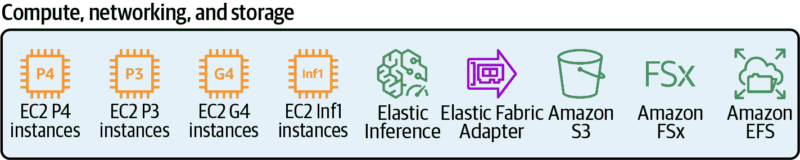

# 第一章：在 AWS 上介绍数据科学

在本章中，我们讨论在云中构建数据科学项目的好处。我们首先讨论云计算的好处。接下来，我们描述一个典型的机器学习工作流程及从原型阶段将我们的模型和应用程序移动到生产环境的常见挑战。我们介绍在亚马逊网络服务(AWS)上开发数据科学项目的整体好处，并介绍每个模型开发工作流程步骤相关的 AWS 服务。我们还分享了关于运营卓越、安全性、可靠性、性能和成本优化的架构最佳实践。

# 云计算的好处

云计算通过互联网按需提供 IT 资源，并采用按使用量付费的定价模式。因此，我们可以获得计算能力、存储、数据库和其他服务等技术，而不是购买、拥有和维护自己的数据中心和服务器。类似于电力公司在我们家里打开电灯开关时立即发送电力，云通过点击按钮或调用 API 按需提供 IT 资源。

“没有经验的压缩算法”是亚马逊网络服务首席执行官安迪·贾西的一句名言。这句话表达了公司自 2006 年以来在建立可靠、安全和高性能服务方面的长期经验。

AWS 一直在不断扩展其服务组合，以支持几乎所有的云工作负载，包括人工智能和机器学习领域的许多服务和功能。这些 AI 和机器学习服务中的许多源于亚马逊在过去 20 年中在推荐系统、计算机视觉、语音/文本和神经网络方面的开创性工作。2003 年的一篇题为[“Amazon.com Recommendations: Item-to-Item Collaborative Filtering”](https://oreil.ly/UlCDV)的论文最近荣获电气和电子工程师学会颁发的“历久弥新”奖。让我们在 AWS 上的数据科学项目背景下审视云计算的好处。

## 敏捷性

云计算使我们能够根据需要快速和频繁地启动资源。这使我们能够快速进行实验。也许我们想测试一个新的库来运行数据质量检查，或者通过利用最新一代 GPU 计算资源加速模型训练。我们可以在几分钟内启动数十、数百甚至数千台服务器来执行这些任务。如果一个实验失败，我们可以随时取消这些资源而没有任何风险。

## 成本节约

云计算允许我们将资本支出转换为可变支出。我们只支付我们使用的部分，无需预先投资于可能在几个月后过时的硬件。如果我们启动计算资源来执行数据质量检查、数据转换或模型训练，我们只需为使用这些计算资源的时间付费。通过利用 Amazon EC2 Spot 实例进行模型训练，我们可以进一步节省成本。Spot 实例允许我们利用 AWS 云中未使用的 EC2 容量，并且相较于按需实例可享受高达 90%的折扣。预留实例和储蓄计划允许我们通过预付一定时间来节省资金。

## 弹性

云计算使我们能够根据应用程序的需求自动扩展或缩减资源。假设我们已将数据科学应用部署到生产环境，并且我们的模型正在提供实时预测。如果我们观察到模型请求量的高峰，我们现在可以自动扩展模型托管资源。同样地，当模型请求量下降时，我们也可以自动缩减资源。无需过度配置资源来处理高峰负载。

## 更快创新

云计算允许我们更快地创新，因为我们可以专注于开发区别于我们业务的应用程序，而不是花时间在管理基础设施的无差别的重活上。云帮助我们在几秒钟而不是几个月内尝试新算法、框架和硬件。

## 几分钟内全球部署

云计算使我们能够在几分钟内全球部署我们的数据科学应用。在全球经济中，与客户接近非常重要。AWS 引入了区域的概念，这是 AWS 数据中心集群的物理位置，每个逻辑数据中心组称为一个*可用区*（AZ）。每个 AWS 区域包括多个隔离且物理分离的可用区，这些区域分布在全球各地。[AWS 区域和可用区的数量正在不断增长](https://oreil.ly/qegDk)。

我们可以利用 AWS 区域和可用区的全球部署优势，使我们的数据科学应用靠近客户，通过超快的响应时间提高应用性能，并遵守每个区域的数据隐私限制。

## 从原型到生产的平稳过渡

在云中开发数据科学项目的好处之一是从原型到生产的平稳过渡。我们可以在几分钟内从在笔记本中运行模型原型代码切换到运行数据质量检查或跨 PB 级数据进行分布式模型训练。一旦完成，我们可以部署我们训练好的模型，为全球数百万用户提供实时或批处理预测。

原型开发通常在单机开发环境中使用 Jupyter Notebook、NumPy 和 pandas 进行。这种方法对小数据集效果良好。当扩展到大数据集时，我们很快会超出单机的 CPU 和 RAM 资源。此外，我们可能需要使用 GPU 或多台机器来加速模型训练。这通常是单机无法实现的。

当我们希望将模型（或应用程序）部署到生产环境时，下一个挑战就出现了。我们还需要确保我们的应用程序能够处理全球规模的成千上万个并发用户。

生产部署通常需要数据科学、数据工程、应用程序开发和 DevOps 等各个团队之间的强大协作。一旦我们的应用程序成功部署，我们需要持续监控并对模型性能和数据质量问题做出反应，这些问题可能在模型推送到生产后出现。

在云中开发数据科学项目使我们能够顺利将我们的模型从原型转换到生产，同时消除构建自己的物理基础设施的需求。托管云服务为我们提供了工具，可以自动化我们的工作流程，并将模型部署到可扩展和高性能的生产环境中。

# 数据科学流水线和工作流程

数据科学的流水线和工作流程涉及许多复杂的、跨学科的和迭代的步骤。让我们以典型的机器学习模型开发工作流程为例。我们从数据准备开始，然后进行模型训练和调整。最终，我们将我们的模型（或应用程序）部署到生产环境中。每一个步骤都包含几个子任务，如图 1-1 所示。


###### 图 1-1。典型的机器学习工作流程涉及许多复杂的、跨学科的和迭代的步骤。

如果我们正在使用 AWS，我们的原始数据很可能已经存储在亚马逊简单存储服务（Amazon S3）中，以 CSV、Apache Parquet 或等效格式存储。我们可以通过直接指向数据集并点击一个“训练”按钮，快速开始使用亚马逊人工智能或自动化机器学习（AutoML）服务来建立基线模型性能。我们在第二章和第三章深入探讨 AI 服务和 AutoML。

对于更加定制化的机器学习模型——本书的主要关注点——我们可以开始手动数据摄入和探索阶段，包括数据分析、数据质量检查、汇总统计、缺失值、分位数计算、数据偏斜分析、相关性分析等等。我们在第四章和第五章深入探讨数据摄入和探索。

然后，我们应该定义机器学习问题类型——回归、分类、聚类等。一旦确定了问题类型，我们可以选择最适合解决给定问题的机器学习算法。根据我们选择的算法，我们需要选择我们数据的子集来训练、验证和测试我们的模型。我们的原始数据通常需要转换为数学向量，以实现数值优化和模型训练。例如，我们可能决定将分类列转换为独热编码向量，或将基于文本的列转换为词嵌入向量。在将一部分原始数据转换为特征后，我们应该将这些特征拆分为训练、验证和测试特征集，为模型训练、调优和测试做准备。我们在第五章和第六章深入探讨了特征选择和转换。

在模型训练阶段，我们选择一个算法，并使用训练特征集训练我们的模型，以验证我们的模型代码和算法是否适合解决给定的问题。我们在第七章深入探讨了模型训练。

在模型调优阶段，我们调整算法的超参数，并根据验证特征集评估模型性能。我们重复这些步骤——根据需要添加更多数据或更改超参数——直到模型在测试特征集上达到预期结果。在第八章中，我们深入探讨了超参数调优。

最终阶段——从原型开发进入生产——通常对数据科学家和机器学习从业者来说是最大的挑战。我们在第九章深入探讨了模型部署。

在第十章，我们将所有内容综合到一个自动化流水线中。在第十一章，我们对流数据进行数据分析和机器学习。第十二章总结了在云中保障数据科学的最佳实践。

一旦我们建立了机器学习工作流的每个步骤，我们可以开始将这些步骤自动化为单一、可重复的机器学习流水线。当新数据进入 S3 时，我们的流水线会使用最新数据重新运行，并将最新模型推送到生产环境以服务我们的应用程序。有几种工作流编排工具和 AWS 服务可供我们构建自动化的机器学习流水线。

## Amazon SageMaker Pipelines

Amazon SageMaker Pipelines 是在亚马逊 SageMaker 上实现 AI 和机器学习流水线的标准、功能完整且最全面的方式。SageMaker Pipelines 与 SageMaker 特征存储、SageMaker 数据整形器、SageMaker 处理作业、SageMaker 训练作业、SageMaker 超参数调整作业、SageMaker 模型注册表、SageMaker 批量转换和 SageMaker 模型端点集成，我们将在整本书中讨论这些。我们将在 第十章 深入研究托管的 SageMaker Pipelines，同时讨论如何使用 AWS Step Functions、Kubeflow Pipelines、Apache Airflow、MLflow、TFX 和人工协作工作流建立流水线。

## AWS Step Functions Data Science SDK

Step Functions 是一个托管的 AWS 服务，非常适合构建复杂的工作流，无需建立和维护自己的基础设施。我们可以使用 Step Functions Data Science SDK 从诸如 Jupyter Notebook 的 Python 环境构建机器学习流水线。我们将在 第十章 深入探讨托管的用于机器学习的 Step Functions。

## Kubeflow Pipelines

Kubeflow 是建立在 Kubernetes 上的一个相对较新的生态系统，包括一个名为*Kubeflow Pipelines*的编排子系统。使用 Kubeflow，我们可以重新启动失败的流水线，调度流水线运行，分析训练指标，并跟踪流水线的来源。我们将在 第十章 深入探讨如何在亚马逊弹性 Kubernetes 服务（Amazon EKS）上管理 Kubeflow 集群。

## 在 AWS 上的托管 Apache Airflow 工作流

Apache Airflow 是一个非常成熟和流行的选项，主要用于编排数据工程和 ETL（抽取-转换-加载）流水线。我们可以使用 Airflow 来编写任务的有向无环图（DAG）工作流。Airflow 调度程序在一组工作节点上执行任务，并遵循指定的依赖关系。我们可以通过 Airflow 用户界面可视化运行中的流水线，监视进度，并在需要时解决问题。我们将在 第十章 深入探讨亚马逊托管的 Apache Airflow 工作流（Amazon MWAA）。

## MLflow

MLflow 是一个开源项目，最初专注于实验追踪，现在支持名为*MLflow Workflows*的流水线。我们可以在 Kubeflow 和 Apache Airflow 工作流中使用 MLflow 来追踪实验。然而，MLflow 要求我们建立和维护自己的亚马逊 EC2 或亚马逊 EKS 集群。我们将在 第十章 更详细地讨论 MLflow。

## TensorFlow Extended

TensorFlow Extended（TFX）是一组开源的 Python 库，用于在管道编排器（如 AWS Step Functions、Kubeflow Pipelines、Apache Airflow 或 MLflow）中使用。TFX 特定于 TensorFlow，并依赖于另一个开源项目 Apache Beam，以实现超越单个处理节点的扩展。我们将在第十章更详细地讨论 TFX。

## 人在回路工作流程

尽管 AI 和机器学习服务使我们的生活更加轻松，但人类远未被淘汰。事实上，“人在回路”概念已成为许多 AI/ML 工作流中的重要基石。在生产中，人类为敏感和受监管的模型提供重要的质量保证。

亚马逊增强型 AI（Amazon A2I）是一个完全托管的服务，用于开发包括清晰用户界面、基于角色的访问控制（使用 AWS Identity and Access Management（IAM））、可扩展数据存储（使用 S3）在内的人在回路工作流程。亚马逊 A2I 与许多亚马逊服务集成，包括用于内容审核的亚马逊 Rekognition 和用于表单数据提取的亚马逊 Textract。我们还可以将亚马逊 A2I 与亚马逊 SageMaker 和我们的任何自定义 ML 模型一起使用。我们将在第十章深入探讨人在回路工作流程。

# MLOps 最佳实践

机器学习运营（MLOps）领域在过去十年中出现，用于描述操作“软件加数据”系统（如 AI 和机器学习）的独特挑战。通过 MLOps，我们正在开发端到端架构，用于自动化模型训练、模型托管和管道监控。从一开始就使用完整的 MLOps 策略，我们正在建立专业知识，减少人为错误，降低项目风险，并释放时间集中解决难点数据科学挑战。

我们看到 MLOps 在过去十年中经历了三个不同成熟阶段：

MLOps v1.0

手动构建、训练、调优和部署模型

MLOps v2.0

手动构建和编排模型管道

MLOps v3.0

当新数据到达或代码更改时，自动运行管道，基于确定性触发器如 GitOps 或基于统计触发器如漂移、偏差和可解释性差异，当模型开始性能下降时

AWS 和 Amazon SageMaker Pipelines 支持完整的 MLOps 策略，包括使用确定性的 GitOps 触发器以及数据漂移、模型偏差和可解释性差异等统计触发器进行自动化管道重训练。我们将在第 5、6、7 和 9 章节深入探讨统计漂移、偏差和可解释性。在第十章中，我们将使用各种管道编排和自动化选项，包括 SageMaker Pipelines、AWS Step Functions、Apache Airflow、Kubeflow 等选项，以及包括人在回路工作流在内的选项，来实施持续和自动化流水线。现在，让我们回顾一些操作卓越、安全性、可靠性、性能效率和 MLOps 成本优化的最佳实践。

## 运营卓越。

以下是一些云中机器学习特定的最佳实践，帮助我们在云中构建成功的数据科学项目：

数据质量检查。

由于所有我们的机器学习项目都始于数据，请确保能够访问高质量的数据集，并实施可重复的数据质量检查。数据质量不佳导致许多项目失败。请在管道的早期阶段解决这些问题。

从简单开始，并重用现有解决方案。

如果没有必要，就从最简单的解决方案开始，没有必要重新发明轮子。很可能有人工智能服务可用来解决我们的任务。利用像 Amazon SageMaker 这样的托管服务，其中包含大量内置算法和预训练模型。

定义模型性能指标。

将模型性能指标映射到业务目标，并持续监控这些指标。我们应该制定策略，在性能下降时触发模型失效和重新训练模型。

跟踪和版本控制所有内容。

通过实验和谱系跟踪跟踪模型开发。我们还应该对数据集、特征转换代码、超参数和训练模型进行版本控制。

为模型训练和模型服务选择适当的硬件。

在许多情况下，模型训练与模型预测服务具有不同的基础设施要求。选择每个阶段的适当资源。

持续监控已部署的模型。

检测数据漂移和模型漂移，并采取适当的措施，如模型重训练。

自动化机器学习工作流程。

构建一致的自动化流水线，以减少人为错误，并释放时间专注于难题。流水线可以包括人工批准步骤，用于在推送到生产之前批准模型。

## 安全性。

安全性和合规性是 AWS 和客户之间共同的责任。AWS 确保“云中”的安全性，而客户负责“云中”的安全性。

在云中构建安全数据科学项目时，最常见的安全考虑涉及访问管理、计算和网络隔离、加密、治理和可审计性。

我们需要围绕我们的数据实施深度安全和访问控制功能。我们应限制对数据标记作业、数据处理脚本、模型、推断端点和批处理预测作业的访问。

我们还应实施数据治理策略，确保数据集的完整性、安全性和可用性。实施并强制执行数据血统，监控和跟踪应用于我们的训练数据的数据转换。确保数据在静态和运动状态下都进行加密。此外，我们应根据需要强制执行法规遵从性。

我们将在 第十二章 更详细地讨论在 AWS 上构建安全数据科学和机器学习应用的最佳实践。

## 可靠性

可靠性指系统从基础设施或服务中断中恢复的能力，动态获取计算资源以满足需求，并减轻配置错误或瞬时网络问题等中断。

我们应该自动化变更跟踪和版本控制我们的训练数据。这样，我们可以在发生故障时重新创建模型的确切版本。我们将构建一次，并使用模型工件在多个 AWS 账户和环境中部署模型。

## 性能效率

*性能效率* 指的是有效利用计算资源以满足要求，并在需求变化和技术演进时如何保持效率。

我们应该为我们的机器学习工作负载选择合适的计算资源。例如，我们可以利用基于 GPU 的实例更有效地训练深度学习模型，使用更大的队列深度、更高的算术逻辑单元和增加的寄存器计数。

熟悉模型的延迟和网络带宽性能要求，并根据需要将每个模型部署更接近客户。在某些情况下，我们可能希望在“边缘”部署我们的模型，以提高性能或遵守数据隐私法规。“边缘部署”指的是在设备本身上运行模型以在本地进行预测。我们还希望持续监控模型的关键性能指标，及早发现性能偏差。

## 成本优化

我们可以通过利用不同的 Amazon EC2 实例定价选项来优化成本。例如，储蓄计划相比按需实例价格提供了显著的节省，换取对特定时间段内使用特定数量计算能力的承诺。储蓄计划非常适合稳定的推断工作负载等已知/稳定状态工作负载。

使用按需实例，我们根据所运行的实例的小时或秒数付费计算能力。按需实例适合新的或状态性强的工作负载，如短期模型训练作业。

最后，亚马逊 EC2 Spot 实例允许我们请求多余的亚马逊 EC2 计算能力，价格可以低至按需价格的 90%。Spot 实例可以覆盖灵活、容错的工作负载，例如不受时间限制的模型训练作业。图 1-2 显示了节省计划、按需实例和 Spot 实例的混合结果。


###### 图 1-2\. 通过选择节省计划、按需实例和 Spot 实例的混合优化成本。

通过许多托管服务，我们可以从“按使用量付费”的模式中受益。例如，使用 Amazon SageMaker，我们只支付我们模型训练或运行自动模型调优的时间。开始使用较小的数据集开发模型，以便更快、更节省地迭代。一旦我们有一个表现良好的模型，我们可以扩展到使用完整数据集进行训练。另一个重要方面是适当调整模型训练和模型托管实例的大小。

许多时候，模型训练受益于 GPU 加速，但模型推断可能不需要同样的加速。事实上，大多数机器学习工作负载实际上是预测。虽然模型可能需要几小时或几天来训练，但部署的模型可能每天 24 小时、每周 7 天运行，支持数百万客户的数千个预测服务器。我们应该决定我们的用例是否需要 24 × 7 实时端点或在晚间使用 Spot 实例进行批量转换。

# 亚马逊 AI 服务和使用亚马逊 SageMaker 的自动机器学习

我们知道，数据科学项目涉及许多复杂的、跨学科的和迭代的步骤。我们需要访问一个支持模型原型阶段的机器学习开发环境，并提供顺畅过渡以准备我们的模型投入生产的环境。我们可能希望尝试各种机器学习框架和算法，并开发定制的模型训练和推断代码。

其他时候，我们可能只想使用现成的、预训练的模型来解决简单的任务。或者我们可能希望利用 AutoML 技术为我们的项目创建第一个基线。AWS 为每种情景提供了广泛的服务和功能。图 1-3 显示了整个亚马逊 AI 和机器学习堆栈，包括 AI 服务和 Amazon SageMaker Autopilot 用于 AutoML。


###### 图 1-3\. 亚马逊 AI 和机器学习堆栈。

## 亚马逊 AI 服务

对于许多常见的使用场景，例如个性化产品推荐、内容审核或需求预测，我们还可以使用亚马逊的托管 AI 服务，并选择在我们的定制数据集上进行微调。我们可以通过简单的 API 调用将这些“一键式”AI 服务集成到我们的应用程序中，而无需太多（有时甚至不需要）机器学习经验。

完全托管的 AWS AI 服务是通过简单的 API 调用为我们的应用程序增加智能的最快最简单的方式。这些 AI 服务提供预训练或自动训练的机器学习模型，用于图像和视频分析、高级文本和文档分析、个性化推荐或需求预测。

AI 服务包括 Amazon Comprehend 用于自然语言处理，Amazon Rekognition 用于计算机视觉，Amazon Personalize 用于生成产品推荐，Amazon Forecast 用于需求预测，以及 Amazon CodeGuru 用于自动化源代码审查。

## 使用 SageMaker Autopilot 的 AutoML

在另一种情况下，我们可能希望自动化数据分析、数据准备和简单且知名的机器学习问题的模型训练的重复步骤。这帮助我们将时间集中在更复杂的用例上。AWS 在 Amazon SageMaker 服务中提供 AutoML。

###### 提示

AutoML 并不局限于 SageMaker。许多 Amazon AI 服务执行 AutoML，以找到给定数据集的最佳模型和超参数。

“AutoML” 通常指自动化模型开发工作流程的典型步骤，正如我们之前描述的那样。Amazon SageMaker Autopilot 是一种完全托管的服务，将 AutoML 技术应用于我们的数据集。

SageMaker Autopilot 首先分析我们的表格数据，识别机器学习问题类型（如回归、分类），选择算法（如 XGBoost）来解决问题。它还创建必要的数据转换代码，以预处理模型训练数据。Autopilot 随后创建多种不同的机器学习模型候选管道，表示数据转换和选择算法的变化。它在特征工程步骤中应用数据转换，然后训练和调整每个模型候选。其结果是基于定义的客观度量标准（如验证准确率）的模型候选排名列表（排行榜）。

SageMaker Autopilot 是透明的 AutoML 的一个例子。Autopilot 不仅与我们分享数据转换的代码，还生成额外的 Jupyter 笔记本，记录数据分析步骤的结果以及模型候选管道，以重现模型训练。

在许多场景下，我们可以利用 SageMaker Autopilot。我们可以让更多在我们组织中的人构建模型，例如，具有有限机器学习经验的软件开发人员。我们可以自动化解决简单机器学习问题的模型创建，并将我们的时间集中在新的复杂用例上。我们可以自动化数据分析和数据准备的第一步，然后使用结果作为基线，应用我们的领域知识和经验来调整和进一步改进模型。Autopilot 生成的模型指标也为我们提供了可通过提供的数据集实现的模型质量的良好基线。我们将在第三章深入探讨 SageMaker Autopilot。

# AWS 中的数据摄入、探索和准备

我们将在第四章，第五章和第六章分别讨论数据摄入、探索和准备。但现在，让我们讨论模型开发工作流程的这一部分，以了解我们可以在每个步骤中利用哪些 AWS 服务和开源工具。

## 使用 Amazon S3 和 AWS Lake Formation 的数据摄入和数据湖

一切都始于数据。如果我们在过去几十年中看到了一个一致的趋势，那就是数据的持续爆炸增长。数据呈指数增长，且日益多样化。今天，业务成功往往与公司快速从其数据中提取价值的能力密切相关。现在有越来越多的人员、团队和应用程序需要访问和分析数据。这就是为什么许多公司正在转向一个高度可扩展、可用、安全和灵活的数据存储，通常被称为*数据湖*。

数据湖是一个集中和安全的存储库，使我们能够以任何规模存储、管理、发现和共享数据。有了数据湖，我们可以高效地运行任何类型的分析，并且可以使用多个 AWS 服务，而无需转换或移动数据。

数据湖可以包含结构化关系数据以及半结构化和非结构化数据。我们甚至可以摄入实时数据。数据湖为数据科学和机器学习团队提供了访问大型和多样化数据集的能力，以训练和部署更准确的模型。

Amazon 简单存储服务（Amazon S3）是一种对象存储，专为从任何地方、以任何格式存储和检索任意量的数据而构建。我们可以通过精细调整的访问控制组织我们的数据，以满足业务和合规要求。我们将在第十二章深入讨论安全性。Amazon S3 设计的耐久性为 99.999999999%（11 个九），并且具有强大的写后一致性。在 AWS 中，S3 是数据湖的热门选择。

我们可以利用 AWS Lake Formation 服务来创建我们的数据湖。该服务帮助收集和目录化来自数据库和对象存储的数据。Lake Formation 不仅移动我们的数据，还使用机器学习算法清洗、分类和安全地访问我们的敏感数据。

我们可以利用 AWS Glue 自动发现和分析新数据。AWS Glue 是一个可伸缩的无服务器数据目录和数据准备服务。该服务包括 ETL 引擎、与 Apache Hive 兼容的数据目录服务，以及数据转换和分析服务。我们可以构建数据爬虫定期检测和目录化新数据。AWS Glue DataBrew 是一个具有易于使用 UI 的服务，简化了数据摄入、分析、可视化和转换。

## 使用 Amazon Athena、Amazon Redshift 和 Amazon QuickSight 进行数据分析

在我们开始开发任何机器学习模型之前，我们需要理解数据。在数据分析步骤中，我们探索我们的数据，收集统计信息，检查缺失值，计算分位数，并识别数据相关性。

有时候我们只是想快速分析开发环境中可用的数据，并原型化一些首个模型代码。也许我们只是想快速尝试一个新的算法。我们称这种情况为“特别探索”和原型化，我们查询部分数据以首先理解特定机器学习问题中的数据架构和数据质量。然后我们开发模型代码并确保其功能正确。这种特别探索和原型化可以从开发环境如 SageMaker Studio、AWS Glue DataBrew 和 SageMaker Data Wrangler 进行。

Amazon SageMaker 为我们提供了托管的 Jupyter 环境以及与 SageMaker Studio 集成的集成开发环境。我们可以使用诸如[pandas](https://pandas.pydata.org)之类的工具直接在笔记本环境中开始分析数据集。pandas 是一个流行的 Python 开源数据分析和操作工具。请注意，pandas 使用内存数据结构（DataFrames）来保存和操作数据。由于许多开发环境具有受限的内存资源，我们需要小心地拉取多少数据到 pandas DataFrames 中。

为了在我们的笔记本中进行数据可视化，我们可以利用诸如[Matplotlib](https://matplotlib.org)和[Seaborn](https://seaborn.pydata.org)等流行的开源库。Matplotlib 允许我们在 Python 中创建静态、动画和交互式可视化。Seaborn 建立在 Matplotlib 之上，增加了对额外统计图形的支持，以及更易于使用的编程模型。这两个数据可视化库与 pandas 数据结构密切集成。

开源的[AWS Data Wrangler 库](https://oreil.ly/Q7gNs)扩展了 pandas 在 AWS 上的功能。AWS Data Wrangler 连接 pandas DataFrames 与 AWS 服务，如 Amazon S3、AWS Glue、Amazon Athena 和 Amazon Redshift。

AWS Data Wrangler 提供了优化的 Python 函数，执行在数据湖、数据仓库和数据库之间加载和卸载数据的常见 ETL 任务。安装 AWS Data Wrangler 后，使用 `pip install awswrangler` 导入 AWS Data Wrangler，我们可以直接从 S3 中将数据集读取到 pandas DataFrame 中，如下所示：

```
import awswrangler as wr

# Retrieve the data directly from Amazon S3
df = wr.s3.read_parquet("s3://<BUCKET>/<DATASET>/"))
```

AWS Data Wrangler 还带有额外的内存优化，例如按块读取数据。如果我们需要查询大型数据集，则这尤为有帮助。启用块读取后，AWS Data Wrangler 会将路径中的每个数据集文件作为单独的 pandas DataFrame 读取和返回。我们还可以设置块大小，以返回与我们定义的块大小相当的 DataFrame 行数。要查看完整的功能列表，请参阅[文档](https://oreil.ly/4sGjc)。我们将在第五章深入探讨 AWS Data Wrangler。

我们可以利用托管服务（例如 Amazon Athena）在我们的笔记本内部对 S3 中的数据运行交互式 SQL 查询。Amazon Athena 是一个托管的、无服务器的、动态可扩展的分布式 SQL 查询引擎，专为对极其大型数据集进行快速并行查询而设计。Athena 基于流行的开源查询引擎 Presto，并且无需维护。使用 Athena，我们只需为运行的查询付费。并且我们可以直接在我们的 S3 数据湖中以原始形式查询数据，无需进行额外的转换。

Amazon Athena 还利用 AWS Glue 数据目录服务存储和检索我们 SQL 查询所需的模式元数据。当我们定义 Athena 数据库和表时，我们指向 S3 中的数据位置。Athena 然后将这种表到 S3 的映射存储在 AWS Glue 数据目录中。我们可以使用 PyAthena，一个流行的开源库，从基于 Python 的笔记本和脚本查询 Athena。我们将在第四章和第五章深入探讨 Athena、AWS Glue 数据目录和 PyAthena。

Amazon Redshift 是一个完全托管的云数据仓库服务，允许我们针对 PB 级结构化数据运行复杂的分析查询。我们的查询在多个节点上分布和并行化执行。与优化用于行存储数据并主要服务事务应用的关系数据库相反，Amazon Redshift 实施的是列存储，这对于我们主要关注这些列的汇总统计信息的分析应用来说是优化的。

Amazon Redshift 还包括 Amazon Redshift Spectrum，允许我们直接从 Amazon Redshift 对接 PB 级非结构化数据的 Amazon S3 数据湖执行 SQL 查询，无需实际移动数据。Amazon Redshift Spectrum 根据接收到的数据量自动扩展所需的计算资源，因此对 Amazon S3 的查询运行速度快，无论我们的数据大小如何。

如果我们需要创建仪表板样式的数据可视化，可以利用 Amazon QuickSight。QuickSight 是一个易于使用的无服务器业务分析服务，可以快速构建强大的可视化。我们可以创建交互式仪表板和报告，并通过浏览器或移动设备安全共享给同事。QuickSight 已经配备了广泛的可视化、图表和表格库。

QuickSight 实现了机器学习和自然语言处理能力，帮助我们从数据中获得更深入的洞见。使用 ML Insights，我们可以发现数据中的隐藏趋势和异常值。该功能还使任何人都能够进行假设分析和预测，无需任何机器学习经验。我们还可以通过将 QuickSight 连接到在 Amazon SageMaker 中构建的机器学习模型来构建预测性仪表板。

## [使用 AWS Deequ 和 SageMaker 处理作业评估数据质量](https://wiki.example.org/aws_deequ_and_sagemaker_processing_jobs)

构建高质量模型需要高质量数据。在创建训练数据集之前，我们希望确保数据符合某些质量约束。在软件开发中，我们运行单元测试以确保代码符合设计和质量标准，并且按预期运行。类似地，我们可以对数据集运行单元测试，以确保数据符合我们的质量预期。

[AWS Deequ](https://oreil.ly/a6cVE) 是建立在 Apache Spark 之上的开源库，允许我们为数据定义单元测试并在大数据集中测量数据质量。使用 Deequ 单元测试，我们可以在数据用于模型训练之前早期发现异常和错误。Deequ 设计用于处理非常大的数据集（数十亿行）。这个开源库支持表格数据，如 CSV 文件、数据库表、日志或扁平化的 JSON 文件。任何可以放入 Spark 数据框架的东西，我们都可以用 Deequ 进行验证。

在后续示例中，我们将利用 Deequ 对样本数据集实施数据质量检查。我们将利用 SageMaker Processing Jobs 支持 Apache Spark 以规模化运行我们的 Deequ 单元测试。在此设置中，我们无需自行配置任何 Apache Spark 集群，因为 SageMaker Processing 为我们处理了繁重的工作。我们可以将其视为“无服务器”Apache Spark。一旦拥有高质量数据，我们现在可以创建我们的训练数据集。

## [使用 SageMaker Ground Truth 标记训练数据](https://wiki.example.org/sagemaker_ground_truth)

许多数据科学项目都实现了监督学习。在监督学习中，我们的模型通过示例进行学习。我们首先需要收集和评估数据，然后提供准确的标签。如果存在错误的标签，我们的机器学习模型将从错误的示例中学习，最终导致不准确的预测结果。SageMaker Ground Truth 帮助我们高效准确地标记存储在 Amazon S3 中的数据。SageMaker Ground Truth 使用自动化和人工数据标记的组合。

SageMaker Ground Truth 为常见的数据标记任务提供预构建的工作流和界面。我们定义标记任务，并将标记工作分配给公共工作力量（通过 Amazon Mechanical Turk）或私人工作力量，例如我们的同事。我们还可以利用 AWS Marketplace 列出的经过亚马逊预筛选的第三方数据标记服务提供商。

SageMaker Ground Truth 实施预构建工作流的主动学习技术。它创建一个模型来自动标记数据子集，基于人工工作人员分配的标签。随着模型不断从人工工作人员中学习，准确性会提高，并且需要发送给人工工作人员的数据量会减少。随着时间的推移和足够的数据量，SageMaker Ground Truth 的主动学习模型能够提供高质量和自动注释，从而降低总体标记成本。我们将在第十章深入探讨 SageMaker Ground Truth。

## 使用 AWS Glue DataBrew、SageMaker Data Wrangler 和 SageMaker Processing Jobs 进行数据转换

现在让我们继续进行数据转换。我们假设我们的数据存储在一个 S3 数据湖或 S3 存储桶中。通过数据分析，我们对数据集有了深入的理解。现在的下一步是准备我们的数据用于模型训练。

数据转换可能包括在数据集中删除或合并数据。我们可能需要将文本数据转换为词嵌入以供自然语言模型使用。或者我们可能需要将数据转换为另一种格式，从数值到文本表示，反之亦然。有许多 AWS 服务可以帮助我们实现这一点。

AWS Glue DataBrew 是一种可视化数据分析和准备工具。使用 250 种内置转换，DataBrew 可以检测异常值，将数据转换为标准格式并修复无效或缺失值。DataBrew 可以对我们的数据进行分析，计算摘要统计信息，并可视化列之间的相关性。

我们还可以使用 Amazon SageMaker Data Wrangler 开发大规模的自定义数据转换。SageMaker Data Wrangler 提供低代码、UI 驱动的数据转换。我们可以从各种来源读取数据，包括 Amazon S3、Athena、Amazon Redshift 和 AWS Lake Formation。SageMaker Data Wrangler 具有预配置的数据转换功能，类似于 AWS DataBrew，用于转换列类型、执行独热编码和处理文本字段。SageMaker Data Wrangler 支持使用 Apache Spark 进行自定义用户定义函数，并生成包括 Python 脚本和 SageMaker 处理作业的代码。

SageMaker 处理作业允许我们对 S3 中的数据运行自定义数据处理代码，进行数据转换、数据验证或模型评估。配置 SageMaker 处理作业时，我们定义所需的资源，包括实例类型和实例数量。SageMaker 接收我们的自定义代码，从 Amazon S3 复制数据，然后拉取 Docker 容器执行处理步骤。

SageMaker 提供预构建的容器镜像，用于使用 Apache Spark 和 scikit-learn 运行数据处理。如果需要，我们还可以提供自定义容器镜像。SageMaker 然后根据作业的持续时间启动我们指定的集群资源，并在作业完成时终止它们。处理结果在作业完成时写回 Amazon S3 存储桶。

# 使用 Amazon SageMaker 进行模型训练和调优

让我们详细讨论我们模型开发工作流程中的模型训练和调优步骤，并学习如何利用哪些 AWS 服务和开源工具。

## 使用 SageMaker 训练和实验训练模型

Amazon SageMaker 训练作业提供了大量功能来支持我们的模型训练。我们可以使用 SageMaker 实验组织、跟踪和评估我们的单个模型训练运行。使用 SageMaker 调试器，我们可以透明地查看我们的模型训练过程。调试器在训练期间自动捕获实时指标，并提供可视化界面分析调试数据。调试器还分析和监视系统资源利用率，并识别资源瓶颈，如过度利用的 CPU 或 GPU。

使用 SageMaker 训练，我们只需指定我们数据的 Amazon S3 位置，执行我们模型训练代码的算法容器，以及定义我们需要的 SageMaker 机器学习实例的类型和数量。SageMaker 将负责初始化资源并运行我们的模型训练。如果指定，SageMaker 将启动一个分布式计算集群。一旦模型训练完成，SageMaker 将结果写入 S3 并终止机器学习实例。

SageMaker 还支持托管 Spot 实例训练。托管 Spot 实例训练利用 Amazon EC2 Spot 实例执行模型训练。使用 Spot 实例，我们可以将模型训练成本降低高达 90%，相比按需实例。

除了 SageMaker 自动驾驶之外，我们可以从 Amazon SageMaker 提供的任何内置算法中选择，或通过带来自己的模型代码（脚本模式）或自己的算法/框架容器来定制模型训练。

## 内置算法

SageMaker 配备了许多内置算法，帮助机器学习从业者快速开始训练和部署机器学习模型。内置算法无需额外的代码。我们只需提供数据和任何模型设置（超参数），并指定计算资源。大多数内置算法还支持开箱即用的分布式训练，以支持无法在单台机器上容纳的大型数据集。

对于监督学习任务，我们可以选择回归和分类算法，例如线性学习器和 XGBoost。分解机（Factorization Machines）非常适合推荐系统。

对于无监督学习任务，如聚类、降维、模式识别和异常检测，还提供了额外的内置算法。这些算法包括主成分分析（PCA）和 K 均值聚类。

我们还可以利用内置算法来处理文本分析任务，如文本分类和主题建模。这些算法包括 BlazingText 和神经主题模型。

对于图像处理，我们将找到用于图像分类和物体检测的内置算法，包括语义分割。

## 自带脚本（脚本模式）

如果我们需要更灵活性，或者没有适合我们用例的内置解决方案，我们可以提供自己的模型训练代码。这通常被称为“脚本模式”。脚本模式让我们专注于我们的训练脚本，而 SageMaker 为每个熟悉的开源框架（如 TensorFlow、PyTorch、Apache MXNet、XGBoost 和 scikit-learn）提供高度优化的 Docker 容器。我们可以通过一个 requirements 文件添加所有需要的代码依赖项，SageMaker 将根据我们选择的框架之一运行我们的自定义模型训练代码。

## 自带容器

如果既没有内置算法也不适用于脚本模式的情况下，我们可以使用自己的定制 Docker 镜像来托管模型训练。Docker 是一个软件工具，提供了构建时和运行时支持称为“Docker 容器”的隔离环境。

SageMaker 使用 Docker 镜像和容器提供数据处理、模型训练和预测服务的功能。

如果我们需要的软件包或软件不包含在支持的框架中，我们可以使用“自带容器”（BYOC）。这种方法为我们提供了无限的选择和最大的灵活性，因为我们可以构建自己的 Docker 容器并安装我们需要的任何内容。通常情况下，当用户有定制的安全要求，或者希望预先安装库到 Docker 容器中以避免第三方依赖时（如 PyPI、Maven 或 Docker Registry），他们会选择这个选项。

当使用 BYOC 选项来使用我们自己的 Docker 镜像时，我们首先需要将 Docker 镜像上传到像 DockerHub 或 Amazon Elastic Container Registry（Amazon ECR）这样的 Docker 注册表中。如果我们熟悉开发、维护和支持具有高效 Docker 镜像管道的定制 Docker 镜像，我们应该选择 BYOC 选项。否则，我们应该使用内置的 SageMaker 容器。

###### 注意

我们不需要在构建时将我们的代码“烧入”到 Docker 镜像中。我们可以简单地从 Docker 镜像内部指向 Amazon S3 中的代码，并在启动 Docker 容器时动态加载代码。这有助于避免每次代码更改时都进行不必要的 Docker 镜像构建。

## 使用 SageMaker JumpStart 的预构建解决方案和预训练模型

SageMaker JumpStart 提供了从 AWS、TensorFlow Hub 和 PyTorch Hub 获取预构建的机器学习解决方案和预训练模型的访问。预构建的解决方案涵盖了许多常见用例，如欺诈检测、预测性维护和需求预测。预训练模型涵盖了自然语言处理、对象检测和图像分类等领域。我们可以使用自己的数据集对模型进行微调，并通过几次点击将其部署到我们 AWS 账户的生产环境中。我们将在第七章中深入探讨 SageMaker JumpStart。

## 使用 SageMaker 超参数调整调优和验证模型

开发高质量模型的另一个重要步骤是找到正确的模型配置或模型超参数。与算法学习的模型参数相比，超参数控制算法如何学习参数。

Amazon SageMaker 自带自动模型调优和验证功能，以找到最佳的模型超参数，适用于我们的模型和数据集。我们需要定义一个优化的客观指标，例如验证准确率，并探索要优化的超参数范围。然后，SageMaker 将运行多个模型训练作业，以探索我们指定的超参数范围，并根据客观指标评估结果以衡量成功。

有不同的策略可以探索超参数范围：网格搜索、随机搜索和贝叶斯优化是最常见的方法。我们将深入探讨 SageMaker 超参数调整在第八章中。

# 使用 Amazon SageMaker 和 AWS Lambda 函数部署模型

一旦我们已经训练、验证和优化了我们的模型，我们就可以准备部署和监控我们的模型。通常有三种方式可以使用 Amazon SageMaker 部署我们的模型，具体取决于我们的应用需求：SageMaker 端点用于基于 REST 的预测，AWS Lambda 函数用于无服务器预测，以及 SageMaker 批量转换用于批量预测。

## SageMaker 端点

如果我们需要优化低延迟、实时预测的模型部署，我们可以使用 SageMaker 托管服务部署我们的模型。这些服务将启动一个 SageMaker 端点来托管我们的模型，并提供一个 REST API 来提供预测。我们可以从我们的应用程序调用 REST API 来接收模型预测结果。SageMaker 模型端点支持根据当前流量模式自动扩展，并在多个可用区部署以实现高可用性。

## SageMaker 批量转换

如果我们需要为整个数据集获取预测结果，我们可以使用 SageMaker 批转换。批转换针对高吞吐量进行了优化，无需实时、低延迟预测。SageMaker 将启动指定数量的资源来对我们的 S3 数据执行大规模批量预测。作业完成后，SageMaker 将数据写入 S3 并拆除计算资源。

## 使用 AWS Lambda 进行无服务器模型部署

另一个用于提供模型预测的选项是 AWS Lambda 函数用于无服务器模型服务器。在使用 SageMaker 训练模型之后，我们使用 AWS Lambda 函数从 S3 检索模型并提供预测。AWS Lambda 具有内存和延迟限制，因此在最终确定部署方法之前，请务必在规模上进行测试。

# AWS 上的流分析和机器学习

到目前为止，我们假设我们所有的数据都集中存储在一个静态位置，例如基于 S3 的数据湖。实际上，数据不断地从世界各地的许多不同来源同时流动。在许多情况下，我们希望在数据落入数据湖之前对这些流数据进行实时分析和机器学习。需要在短时间内（业务）洞察以获取竞争优势，并迅速响应变化的客户和市场趋势。

流技术为我们提供了在实时中收集、处理和分析数据流的工具。AWS 提供了多种流技术选项，包括 Amazon Kinesis 和 Amazon 管理的 Apache Kafka（Amazon MSK）。我们将深入探讨流分析和机器学习在 第十一章 中。

## Amazon Kinesis 流式处理

Amazon Kinesis 是一个流数据服务，帮助我们实时收集、处理和分析数据。通过 Kinesis Data Firehose，我们可以连续准备和加载实时数据到各种目的地，包括 Amazon S3 和 Amazon Redshift。通过 Kinesis Data Analytics，我们可以处理和分析数据在到达时。通过 Amazon Kinesis Data Streams，我们可以管理数据流的摄取，用于定制应用程序。

## Amazon 管理的 Apache Kafka 流式处理

Amazon MSK 是一个流式数据服务，管理 Apache Kafka 基础架构和运营。Apache Kafka 是一个流行的开源、高性能、容错和可扩展平台，用于构建实时流式数据管道和应用程序。使用 Amazon MSK，我们可以在 AWS 上运行我们的 Apache Kafka 应用程序，无需自行管理 Apache Kafka 集群。

## 流式预测和异常检测

在流数据章节中，我们将专注于分析我们从可用的在线渠道收集的连续产品评价消息流。我们将运行流式预测以检测客户的情绪，从而可以识别哪些客户可能需要高优先级的关注。

接下来，我们对传入的评论消息进行连续流分析，以捕获每个产品类别的平均情感。我们为业务线（LOB）所有者在度量仪表板中可视化连续的平均情感。

LOB 所有者现在可以快速检测情感趋势并采取行动。我们还计算传入消息的异常分数，以检测数据模式或数据值中的异常。在异常分数上升的情况下，我们可以提醒负责的应用程序开发人员调查根本原因。

作为最后的度量标准，我们还计算收到消息的持续近似计数。数字营销团队可以使用在线消息数量来衡量社交媒体活动的有效性。

# AWS 基础设施和自定义构建硬件

云计算的一个关键优势是能够尝试特别匹配我们工作负载的基础设施选项。AWS 为我们的数据科学项目提供了许多高性能计算、网络和存储基础设施选项，如图 1-4 所示。让我们看看每个选项，我们将在整个过程中引用它们。



###### 图 1-4. AWS 用于数据科学和机器学习项目的基础设施选项。

## SageMaker 计算实例类型

AWS 允许我们根据工作负载选择多种实例类型。以下是常用于数据科学用例的实例类型列表：

T 实例类型

通用型、突发性能实例，当我们不需要持续高水平 CPU 时，但在需要时受益于快速 CPU

M 实例类型

具有良好计算、内存和网络带宽平衡的通用实例

C 实例类型

适用于计算密集型工作负载和高 CPU 需求的计算优化实例

R 实例类型

针对需要将大型数据集存储在内存中的工作负载进行优化的内存优化实例，如 Apache Spark

P、G、Inferentia 和 Trainium 实例类型

配备硬件加速器或协处理器（如 GPU 或亚马逊自定义硬件，例如 AWS Inferentia 用于推断和 AWS Trainium 用于训练工作负载）的高性能计算实例

Amazon Elastic 推断加速器

当需要特定工作负载的额外计算能力时，其他实例类型使用的网络附加协处理器，如批处理转换和推断

## GPU 和亚马逊自定义计算硬件

类似于 Amazon S3 在云中提供存储，Amazon Elastic Compute Cloud（Amazon EC2）提供计算资源。我们可以根据业务需求和工作负载选择超过 350 个实例。AWS 还提供选择英特尔、AMD 和基于 ARM 的处理器。硬件加速的 P4、P3 和 G4 实例类型是基于 GPU 的高性能模型训练的热门选择。亚马逊还提供了优化用于模型训练和推断的自定义构建硬件。

P4d 实例由八个 NVIDIA A100 Tensor Core GPU 组成，具备 400 Gbps 的实例网络和支持带 NVIDIA GPUDirect RDMA（远程直接内存访问）的 Elastic Fabric Adapter（EFA）。P4d 实例部署在称为 *Amazon EC2 超级集群* 的超大规模集群中，为日常的机器学习开发人员、研究人员和数据科学家提供超级计算机级别的性能。每个 P4d 实例的 EC2 超级集群可以访问超过 4,000 个 NVIDIA A100 GPU、PB 级非阻塞网络以及通过 Amazon FSx for Lustre 实现的高吞吐量/低延迟存储。

P3 实例包含最多八个 NVIDIA V100 Tensor Core GPU，并提供高达 100 Gbps 的网络吞吐量。每个 P3 实例可以提供高达一 petaflop 的混合精度性能。P3dn.24xlarge 实例也支持 EFA。

G4 实例是成本敏感、小规模训练或推断工作负载的理想选择。G4 实例包含 NVIDIA T4 GPU，具备高达 100 Gbps 的网络吞吐量和高达 1.8 TB 的本地 NVMe 存储。

AWS 还提供了专为机器学习训练而定制的 AWS Trainium 芯片，以及专为推断工作负载而设计的 AWS Inferentia 芯片。AWS Trainium 和 AWS Inferentia 都旨在提高机器学习性能并降低基础设施成本。

AWS Trainium 已经针对深度学习训练工作负载进行了优化，包括图像分类、语义搜索、翻译、语音识别、自然语言处理和推荐引擎。

AWS Inferentia 处理器支持许多流行的机器学习模型，包括用于计算机视觉的单次检测器和 ResNet，以及用于自然语言处理的 Transformers 和 BERT。

AWS Inferentia 可通过 Amazon EC2 Inf1 实例使用。我们可以在每个 Inf1 实例中选择 1 到 16 个 AWS Inferentia 处理器，其提供高达 2,000 万亿次操作每秒的性能。我们可以使用 AWS Neuron SDK 来编译我们的 TensorFlow、PyTorch 或 Apache MXNet 模型以在 Inf1 实例上运行。

Inf1 实例有助于降低推断成本，每次推断的成本比 Amazon EC2 G4 实例低高达 45%，吞吐量则高出 30%。表 1-1 展示了用于模型推断的一些实例类型选项，包括 Amazon 自定义的 Inferentia 芯片、CPU 和 GPU。

表 1-1\. 用于模型推断的 EC2 实例选项

| 模型特征 | EC2 Inf1 | EC2 C5 | EC2 G4 |
| --- | --- | --- | --- |
| 需要低延迟和高吞吐量以低成本 | X |   |   |
| 对延迟和吞吐量的敏感性低 |   | X |   |
| 需要 NVIDIA 的 CUDA、CuDNN 或 TensorRT 库 |   |   | X |

Amazon Elastic Inference 是利用加速计算进行模型推断的另一种选择。弹性推断允许我们将部分 GPU 加速附加到任何 Amazon EC2（基于 CPU）实例类型。使用弹性推断，我们可以将模型推断的实例选择与推断加速的数量分离开来。

如果我们需要不同于 Inf1 实例提供的实例特性，或者性能需求低于最小的 Inf1 实例提供的性能要求，选择 Elastic Inference 而不是 Inf1 可能是有意义的选择。

弹性推断从单精度 TFLOPS（每秒万亿浮点运算）扩展到 32 个混合精度 TFLOPS 的推断加速。

Graviton 处理器是 AWS 自定义的 ARM 处理器。这些 CPU 利用 64 位 Arm Neoverse 核心和 AWS 设计的使用先进的 7 纳米制造技术的定制硅。基于 ARM 的实例可以为在 Amazon EC2 中运行的许多工作负载提供具有吸引力的性价比。

Graviton 处理器的第一代提供了 Amazon EC2 A1 实例。与第一代相比，Graviton2 处理器的性能提升了 7 倍，计算核心增加了 4 倍，内存速度提升了 5 倍，缓存大小增加了 2 倍。我们可以在 Amazon EC2 T4g、M6g、C6g 和 R6g 实例中找到 Graviton2 处理器。

AWS Graviton2 处理器为视频编码工作负载提供了增强的性能，为压缩工作负载提供了硬件加速，并支持机器学习预测。

## GPU 优化的网络和定制硬件

AWS 提供先进的网络解决方案，可以帮助我们有效地进行分布式模型训练和扩展推断。

Amazon EFA 是 Amazon EC2 实例的网络接口，可优化规模化的节点间通信。EFA 使用定制的 OS 旁路硬件接口，增强了节点间通信的性能。如果我们正在使用 NVIDIA Collective Communications Library 进行模型训练，我们可以使用 EFA 扩展到数千个 GPU。

我们可以将每个实例的网络带宽组合到 400 Gbps，并使用 NVIDIA GPUDirect RDMA 实现实例之间低延迟的 GPU 到 GPU 通信。这使我们可以在云中获得与本地 GPU 集群相当的性能，同时具有按需的弹性和灵活性。

## 针对大规模模型训练优化的存储选项

我们已经了解到，在 Amazon S3 上构建数据湖的好处。如果我们需要更快的存储访问以进行分布式模型训练，我们可以使用 Amazon FSx for Lustre。

Amazon FSx for Lustre 提供开源 Lustre 文件系统作为完全托管的服务。Lustre 是一种高性能文件系统，提供亚毫秒级的延迟，高达数百 GB/s 的吞吐量和数百万 IOPS。

我们可以将 FSx for Lustre 文件系统与 Amazon S3 存储桶链接起来。这使我们能够通过 FSx 文件系统访问和处理数据，并从 Amazon S3 获取数据。使用 FSx for Lustre，我们可以设置我们的模型训练计算实例通过高性能共享存储访问相同的数据集。

Amazon 弹性文件系统（Amazon EFS）是另一种文件存储服务，为多达数千个 Amazon EC2 实例提供文件系统接口。文件系统接口提供标准操作系统文件 I/O API，并支持文件系统访问语义，例如强一致性和文件锁定。

# 使用标签、预算和警报降低成本

本书中我们提供了如何利用亚马逊人工智能和机器学习堆栈来减少数据科学项目成本的建议。总体而言，我们应始终为我们的资源打上业务单位、应用程序、环境和用户的名称标签。我们应使用能够显示我们的花费情况的标签。除了 AWS 内置的成本分配标签外，我们还可以提供自己领域特定的用户定义的分配标签。AWS 预算帮助我们在成本接近或超过给定阈值时创建警报。

# 摘要

在本章中，我们讨论了在云中开发数据科学项目的好处，特别关注了 AWS。我们展示了如何利用亚马逊人工智能和机器学习堆栈快速为我们的应用程序增加智能。我们介绍了 AutoML 的概念，并解释了 SageMaker Autopilot 如何提供透明的 AutoML 方法。然后我们讨论了云中典型的机器学习工作流程，并介绍了在工作流程的每个步骤中帮助的相关 AWS 服务。我们概述了可用的工作流编排工具，用于构建和自动化机器学习流水线。我们描述了如何在实时数据上运行流式分析和机器学习。我们在本章末尾概述了 AWS 基础设施选项，以利用在我们的数据科学项目中使用。

在第二章中，我们将讨论媒体、广告、物联网和制造业等行业中显著的数据科学用例。
