# 第二章：数据科学应用案例

在本章中，我们展示了 AI 和机器学习如何几乎颠覆了每个行业，并将继续在未来如此。我们讨论了跨媒体、广告、物联网和制造业等行业的重要应用案例。随着越来越多的构建模块变得可用，越来越多的应用案例变得具体可行。云原生开发人员通过像亚马逊 Rekognition 这样的即用 AI 服务、包括亚马逊 SageMaker 的完全可定制的 ML 服务，以及易于访问的亚马逊 Braket 量子计算机，可以访问这些构建模块。

AI 和机器学习由于云计算的最新创新、计算能力的飞跃和数据收集的激增，已经真正无处不在。这种 AI 和机器学习的民主化得益于大量易于与应用集成、几乎不需要维护并提供按需付费定价的 AI 服务的爆发。

在不需要数据科学博士学位的情况下，我们可以通过一次 API 调用实现产品推荐以取悦我们的客户，实现高度准确的预测模型以改善我们的供应链，或者构建虚拟助手简化我们的客户支持！这些 AI 服务释放了宝贵的人力资源，让其集中精力关注领域特定和产品差异化的特性。

# 创新横跨每个行业

许多 AI 和机器学习应用案例可以归为两类：改善业务运营或创建新的客户体验。改善业务运营的突出例子包括 AI 驱动的需求预测、资源优化和欺诈检测。用于创建新客户体验的例子包括个性化产品推荐和丰富的视频流体验。毫无疑问，AI 和机器学习正在推动每个行业的创新。以下是各种行业的几个示例：

媒体和娱乐

公司正在通过高度引人入胜、个性化的内容让客户感到愉悦。AI 还能够高效且有效地提取元数据，使媒体内容更易于客户和媒体制作工作者发现和搜索。

生命科学

公司通过 AI 和机器学习在药物发现、临床试验管理、药物制造、数字治疗开发和临床决策支持方面受益匪浅。

金融服务

AI 和机器学习改善了合规、监控和欺诈检测。它们帮助加快文件处理，创建个性化定价和金融产品推荐，并协助交易决策。

汽车

AI 和机器学习推动了自动驾驶、导航和互联车辆。

制造业

AI 和机器学习支持工程设计、供应链库存管理和维护、修理和运营的优化。它们增强了装配线并支撑智能产品或工厂。

游戏

游戏行业利用 AI 和机器学习实施智能自动扩展他们的游戏服务器，以应对一天中需求的变化。

让我们详细讨论一些突出的 AI 应用案例，看看我们如何开始使用 AWS 的现成 AI 服务来实施它们。

# 个性化产品推荐

近几十年来，消费者在个性化的在线产品和内容推荐方面体验越来越多。推荐无处不在，包括亚马逊推荐下一个要购买的产品和亚马逊 Prime Video 推荐下一个要观看的节目。

很多推荐系统基于客户如何与目录中的项目合作来找到相似性。早期实施这种“协同过滤”的例子在亚马逊公司 2003 年的一篇论文中有描述，[“亚马逊推荐：项目到项目的协同过滤”](https://oreil.ly/LbrdC)。

今天，精密的深度学习技术能够在正确的时间和正确的上下文中理解客户的需求。无论我们是在亚马逊市场上购物，还是在 Prime Music 上听音乐，在 Prime Video 上观看节目，在 Amazon Kindle 上阅读电子书，或者在 Audible 上听有声书，我们都会被呈现出新的个性化推荐。

简单的推荐系统通常从基于规则的系统开始。随着我们系统中用户和产品的数量增加，定义足够特定以为每个用户提供有意义推荐的规则变得困难。广泛的规则通常不够专业化，无法吸引客户持续回归。

即使是基于机器学习的推荐系统也可能面临挑战。我们还必须处理新用户和新项目进入我们系统的情况，我们没有任何数据来基于它们建立推荐。这是现代推荐引擎中要解决的经典“冷启动”问题。冷启动是当我们没有或很少有历史事件活动用作信号来为给定用户或产品构建我们的推荐模型时的情况。

推荐系统还应避免“流行陷阱”，该陷阱只推荐热门项目，可能忽略了非热门项目的愉快推荐。这可以通过使用多臂老虎机等算法探索新项目的推荐系统来解决，我们将在第九章中讨论。

此外，我们希望在用户使用我们的应用程序时处理其实时意图的变化。这需要一个实时动态的推荐系统，而不是传统的离线预先计算的从数据库提供的推荐。

在这样一个动态系统中，客户将欣赏到相关及时的内容，而我们的业务将从更个性化的客户体验中获得以下好处：

产品参与度的增加

通过向用户推荐相关内容，我们增加了网站的黏性，鼓励用户经常回访，并使他们停留更长时间。

产品转化率增加

用户更有可能购买更相关的产品。

点击率增加

通过个性化产品更新，针对个人用户的目标，我们很可能会看到更高的点击率。

收入增加

当客户在适当的时间得到正确的推荐时，公司会看到收入增加。

流失减少

我们可以减少总体流失率，并减少对有趣电子邮件活动的退出。

在过去的二十年中，亚马逊一直在不断推进其个性化的机器学习研究。Smith 和 Linden（2017）的论文[“亚马逊.com 的两个十年推荐系统”](https://oreil.ly/iXEXk) 很好地总结了这一历程。

###### 小贴士

更多关于亚马逊的科学研究和学术出版物的深入了解，请访问[亚马逊](https://www.amazon.science)。

## 推荐使用亚马逊个性化推荐产品。

像很多机器学习一样，没有单一的算法可以解决个性化中所有的挑战。如果任何人都能够利用亚马逊.com 在创建个性化产品和内容推荐方面的丰富经验，并将此功能添加到我们的应用程序中，那不是很棒吗？亚马逊个性化正是提供这种功能。

亚马逊个性化反映了亚马逊.com 在创建、扩展和管理个性化技术方面数十年的经验。亚马逊个性化使开发人员能够轻松创建个性化产品推荐以及有针对性的营销促销活动。这种人工智能服务使开发人员能够构建定制的个性化模型，而无需处理自己的机器学习基础设施管理的复杂性。

要开始生成推荐，我们只需向亚马逊个性化提供我们应用程序的持续活动流（即点击、页面浏览、注册、购买）以及我们想要推荐的产品库存，如图 2-1 所示。

活动数据包括有关用户如何与系统进行交互的事件信息。一些示例事件活动包括用户点击、购物车添加、商品购买和电影观看。这些事件活动对于构建有效的推荐模型提供了强有力的信号。

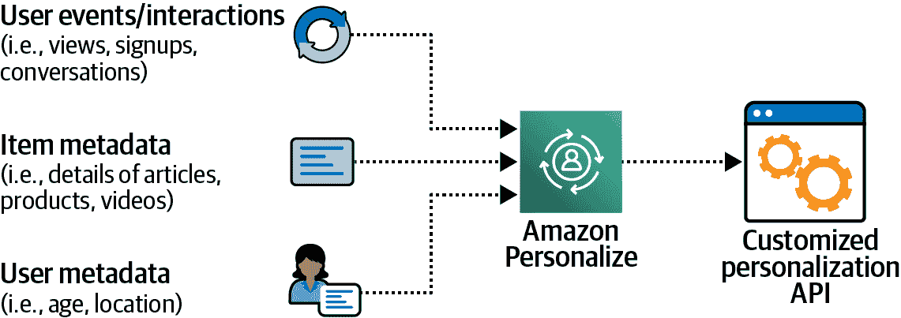

###### 图 2-1。提供活动数据集和产品清单给亚马逊个性化，开始生成推荐。

我们还可以提供有关参与活动的用户和产品的额外元数据，如产品类别、产品价格、用户年龄、用户位置等。尽管这些额外的元数据是可选的，但在处理“冷启动”场景（即没有或很少历史事件活动可用作信号来构建我们的推荐模型时），它们非常有帮助。

另外，Amazon Personalize 最近推出了一种新的冷启动算法，结合了神经网络和强化学习，在用户的数据很少时提供更相关的推荐。

有了这些事件活动和元数据，Amazon Personalize 为我们的用户和产品训练、调优和部署了一个定制的推荐模型。Amazon Personalize 执行机器学习管道的所有步骤，包括特征工程、算法选择、模型调优和模型部署。一旦 Amazon Personalize 为我们的数据集选择、训练和部署了最佳模型，我们只需调用 Amazon Personalize 的`get_recommendations()` API 即可实时生成用户的推荐：

```
get_recommendations_response = personalize_runtime.get_recommendations(
        campaignArn = campaign_arn,
        userId = user_id
)

item_list = get_recommendations_response['itemList']
recommendation_list = []
for item in item_list:
    item_id = get_movie_by_id(item['itemId'])
recommendation_list.append(item_id)
```

使用包含数百万用户电影评分的流行 MovieLens 数据集进行训练，Amazon Personalize 为我们的示例用户生成以下推荐电影：

| `Shrek` |
| --- |
| `Amelie` |
| `Lord of the Rings: The Two Towers` |
| `Toy Story 2` |
| `Good Will Hunting` |
| `Eternal Sunshine of the Spotless Mind` |
| `Spirited Away` |
| `Lord of the Rings: The Return of the King` |
| `Schindler's List` |
| `Leon: The Professional` |

## 使用 Amazon SageMaker 和 TensorFlow 生成推荐

多任务推荐器创建一个模型，同时优化两个或更多目标。模型在模型训练期间通过任务之间共享变量进行迁移学习。

在下面使用[TensorFlow 推荐器（TFRS）库](https://oreil.ly/XdDIl)的 TensorFlow 示例中，我们将找到一个模型，该模型训练一个推荐器来预测评分（排名任务）以及预测电影观看次数（检索任务）：

```
user_model = tf.keras.Sequential([
  tf.keras.layers.experimental.preprocessing.StringLookup(
      vocabulary=unique_user_ids),
  # We add 2 to account for unknown and mask tokens.
  tf.keras.layers.Embedding(len(unique_user_ids) + 2, embedding_dimension)
])

movie_model = tf.keras.Sequential([
  tf.keras.layers.experimental.preprocessing.StringLookup(
      vocabulary=unique_movie_titles),
  tf.keras.layers.Embedding(len(unique_movie_titles) + 2, embedding_dimension)
])

rating_task = tfrs.tasks.Ranking(
    loss=tf.keras.losses.MeanSquaredError(),
    metrics=[tf.keras.metrics.RootMeanSquaredError()],
)

retrieval_task = tfrs.tasks.Retrieval(
        metrics=tfrs.metrics.FactorizedTopK(
            candidates=movies.batch(128).map(self.movie_model)
        )
)
```

## 使用 Amazon SageMaker 和 Apache Spark 生成推荐

Amazon SageMaker 通过 SageMaker 处理作业支持无服务器 Apache Spark（Python 和 Scala）。我们将在整本书中使用 SageMaker 处理作业执行数据质量检查和特征转换。但在本节中，我们将使用 SageMaker 处理作业与 Apache Spark ML 的协同过滤算法*Alternating Least Squares*（ALS）生成推荐。如果我们已经有一个基于 Spark 的数据管道，并希望使用该管道生成推荐，我们将使用此算法。

这是生成推荐使用 Apache Spark ML 和 ALS 的*train_spark.py*文件：

```
import pyspark
from pyspark.sql import SparkSession
from pyspark.sql.functions import *
from pyspark.ml.evaluation import RegressionEvaluator
from pyspark.ml.recommendation import ALS
from pyspark.sql import Row

def main():
    ...
    lines = spark.read.text(s3_input_data).rdd
    parts = lines.map(lambda row: row.value.split("::"))
    ratingsRDD = parts.map(lambda p: Row(userId=int(p[0]), 
                                         movieId=int(p[1]),
                                         rating=float(p[2]), 
                                         timestamp=int(p[3])))
    ratings = spark.createDataFrame(ratingsRDD)
    (training, test) = ratings.randomSplit([0.8, 0.2])

    # Build the recommendation model using ALS on the training data
    als = ALS(maxIter=5, 
              regParam=0.01, 
              userCol="userId", 
              itemCol="itemId", 
              ratingCol="rating",
              coldStartStrategy="drop")
    model = als.fit(training)

    # Evaluate the model by computing the RMSE on the test data
    predictions = model.transform(test)
    evaluator = RegressionEvaluator(metricName="rmse", 
                                    labelCol="rating",
                                    predictionCol="prediction")
    rmse = evaluator.evaluate(predictions)

    # Generate top 10 recommendations for each user
    userRecs = model.recommendForAllUsers(10)
    userRecs.show()

    # Write top 10 recommendations for each user
    userRecs.repartition(1).write.mode("overwrite")\
    .option("header", True).option("delimiter", "\t")\
    .csv(f"{s3_output_data}/recommendations")
```

现在让我们在作为 SageMaker 处理作业运行的无服务器 Apache Spark 环境中启动 PySpark 脚本：

```
from sagemaker.spark.processing import PySparkProcessor
from sagemaker.processing import ProcessingOutput

processor = PySparkProcessor(base_job_name='spark-als',
                             role=role,
                             instance_count=1,
                             instance_type='ml.r5.2xlarge',
                             max_runtime_in_seconds=1200)

processor.run(submit_app='train_spark_als.py',
              arguments=['s3_input_data', s3_input_data,
                         's3_output_data', s3_output_data,
              ],
              logs=True,
              wait=False
)
```

输出显示用户 ID 和按推荐程度排序的推荐列表（项目 ID，排名）：

```
|userId|     recommendations|
+------+--------------------+
|    12|[[46, 6.146928], ...|
|     1|[[46, 4.963598], ...|
|     6|[[25, 4.5243497],...|
+------+--------------------+
```

# 使用 Amazon Rekognition 检测不适当的视频

计算机视觉对许多不同的用例很有用，包括用户生成内容的内容审核，安全登录的数字身份验证，以及无人驾驶汽车的危险识别。

Amazon Rekognition 是一个高级 AI 服务，能够识别图像和视频中的对象，包括人、文本和活动。Amazon Rekognition 使用 AutoML 来训练定制模型，以识别特定于我们用例和业务领域的对象。

让我们使用 Amazon Rekognition 来检测我们应用用户上传的视频中的暴力内容。例如，我们希望使用 Amazon Rekognition 的内容审查 API 来拒绝包含武器的视频，操作如下：

```
startModerationLabelDetection = rekognition.start_content_moderation(
    Video={
        'S3Object': {
            'Bucket': bucket,
            'Name': videoName,
        }
    },
)

moderationJobId = startModerationLabelDetection['JobId']

getContentModeration = rekognition.get_content_moderation(
    JobId=moderationJobId,
    SortBy='TIMESTAMP'
)

while(getContentModeration['JobStatus'] == 'IN_PROGRESS'):
    time.sleep(5)
    print('.', end='')

    getContentModeration = rekognition.get_content_moderation(
     JobId=moderationJobId,
     SortBy='TIMESTAMP')

display(getContentModeration['JobStatus'])
```

这里是显示检测标签的输出。请注意`Timestamp`，它表示从视频开始的偏移量，以及`Confidence`，它表示 Amazon Rekognition 预测的置信度：

```
{'JobStatus': 'SUCCEEDED',
 'VideoMetadata': {'Codec': 'h264',
  'DurationMillis': 6033,
  'Format': 'QuickTime / MOV',
  'FrameRate': 30.0,
  'FrameHeight': 1080,
  'FrameWidth': 1920},
 'ModerationLabels': [{'Timestamp': 1999,
   'ModerationLabel': {'Confidence': 75.15272521972656,
    'Name': 'Violence',
    'ParentName': ''}},
  {'Timestamp': 1999,
   'ModerationLabel': {'Confidence': 75.15272521972656,
    'Name': 'Weapons',
    'ParentName': 'Violence'}},
  {'Timestamp': 2500,
   'ModerationLabel': {'Confidence': 87.55487060546875,
    'Name': 'Violence',
    'ParentName': ''}}]

Moderation labels in video
=======================================
At 1999 ms: Violence (Confidence: 75.15)
At 1999 ms: Weapons (Confidence: 75.15)
At 2500 ms: Violence (Confidence: 87.55)
```

###### 注意

我们可以通过使用自己的数据集进行训练来进一步提高 Amazon Rekognition 预测的置信度。这一功能称为“自定义标签”，并得到许多 Amazon AI 服务的支持。

# 需求预测

需求预测在许多领域中被用来预测电力使用、供应链库存、呼叫中心人员配备、现金流规划、医院床位使用以及许多其他用例中的需求。预测是一个使用流行算法如自回归积分移动平均、误差趋势季节性、非参数时间序列、Prophet 和 DeepAR++解决的时间序列问题。

企业使用从简单的电子表格到复杂的时间序列软件来预测未来的业务结果，如产品需求、资源需求或财务表现。这些方法通常使用历史时间序列数据构建预测模型，假设未来需求由过去活动决定。这些纯时间序列方法在处理不规则趋势和模式时往往难以产生准确的预测。此外，这些方法通常不考虑与预测相关的重要元数据，如产品价格、产品类别和店铺位置。

过度预测可能会降低效率并增加成本，因为资源超配，而这些资源仍然被低效利用。反之，低估预测可能会降低客户满意度，通过使系统饥饿于必要资源而降低收入，并且需要像支付加班工资这样的高成本替代方案。

有效的需求预测系统展示了以下特征：

分析复杂关系而不仅仅是时间序列数据

将时间序列数据与产品特性和店铺位置等其他元数据结合起来。

将预测预测时间从几个月缩短到几小时

在自动加载、检查和识别关键数据集属性之后，系统将快速训练、优化并部署适合我们数据集的自定义模型。

为许多不同的用例创建预测

使用大量算法自动确定最适合我们特定用例的预测，包括供应链、物流和财务等几乎所有用例。

保持数据安全

每个数据点都受到静态和动态加密的保护，以保持敏感信息的安全和机密性。

在需要时自动重新训练和部署模型

当新数据到达或者模型评估指标低于某个阈值时，将重新训练并部署模型以改进预测。

## 使用 Amazon Forecast 预测能源消耗

Amazon Forecast 是一个完全托管的服务，基于驱动亚马逊.com 需求预测需求的技术，如高效库存管理，即时产品履行和当天交付。Forecast 使用机器学习自动训练，调整和优化高度专业的需求预测模型，从我们的数据集中。我们只需向 Forecast 注册我们的历史数据集和相关元数据，即可开始生成需求预测。需求预测可以导出为 CSV 文件，通过 AWS 控制台 UI 访问，或通过 Forecast API 集成到我们的应用程序中。

让我们使用 Forecast 的 DeepAR++ 算法和来自[UCI 机器学习库](https://oreil.ly/DYLJ7)的公共数据集来训练一个需求预测模型，以预测未来 24 小时的个体家庭能源消耗。

这是数据集的一部分，包括每位客户的功耗：

| timestamp | value | item |
| --- | --- | --- |
| 2014-01-01 01:00:00 | 38.34991708126038 | client_12 |
| 2014-01-01 02:00:00 | 33.5820895522388 | client_12 |
| 2014-01-01 03:00:00 | 34.41127694859037 | client_12 |

这里是我们在 Forecast 中定义的模式，以表示公共数据集：

```
forecast_schema ={
   "Attributes":[
      {
         "AttributeName":"timestamp",
         "AttributeType":"timestamp"
      },
      {
         "AttributeName":"target_value",
         "AttributeType":"float"
      },
      {
         "AttributeName":"item_id",
         "AttributeType":"string"
      }
   ]
}
```

让我们注册数据集到 Forecast：

```
response=forecast.create_dataset(
                    Domain="CUSTOM",
                    DatasetType='TARGET_TIME_SERIES',
                    DatasetName=forecast_dataset_name,
                    DataFrequency=DATASET_FREQUENCY, 
                    Schema = forecast_schema
)
```

现在让我们使用 Forecast 训练需求预测模型：

```
forecast_horizon = 24 # hours

algorithm_arn = 'arn:aws:forecast:::algorithm/Deep_AR_Plus'

create_predictor_response = \
    forecast.create_predictor(PredictorName=predictor_name,
                              AlgorithmArn=algorithm_arn, 
                              ForecastHorizon=forecast_horizon,
                              PerformAutoML= False,
                              PerformHPO=False,
                              EvaluationParameters= {
                                  "NumberOfBacktestWindows": 1,
                                  "BackTestWindowOffset": 24
                              },
                              InputDataConfig= {
                                  "DatasetGroupArn": forecast_dataset_group_arn
                              },
                              FeaturizationConfig= {
                                  "ForecastFrequency": "H",
                                  "Featurizations": [{
                                      "AttributeName": "target_value",
                                      "FeaturizationPipeline":
                                      [{
                                           "FeaturizationMethodName": "filling",
                                           "FeaturizationMethodParameters": {
                                                "frontfill": "none",
                                                "middlefill": "zero",
                                                "backfill": "zero"
                                           }
                                      }]
                                  }]
                              })
```

让我们做出预测：

```
forecastResponse = forecastquery.query_forecast(
    ForecastArn=forecast_arn,
    Filters={"item_id":"client_12"}
)
```

## 预测亚马逊 EC2 实例需求与亚马逊预测

AWS 使用 Forecast 预测 Amazon Redshift 集群内 Amazon EC2 实例的需求。随着新数据被摄入 Forecast，Amazon Redshift 控制平面查询 Forecast 调整 Amazon EC2 温暖池的大小，如图 2-2 所示。

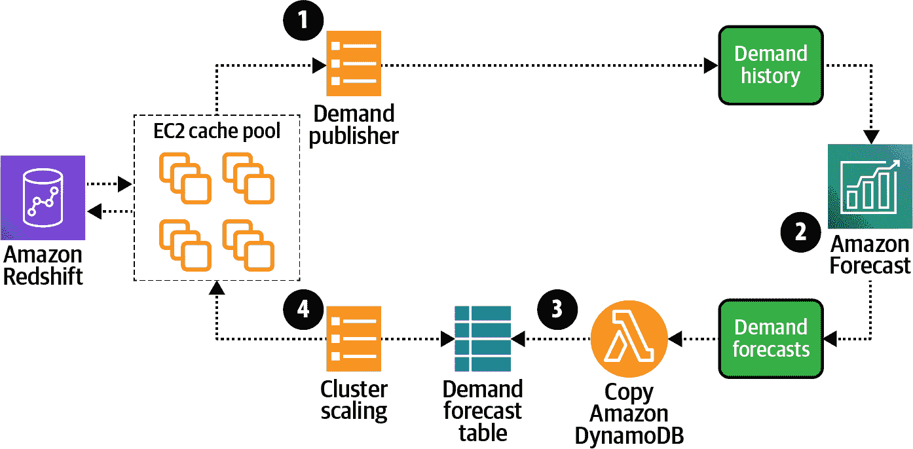

###### 图 2-2\. Amazon Redshift 控制平面使用 Forecast 调整 Amazon EC2 实例的温暖池缓存。

图 2-2 中的步骤可以描述如下：

1.  Amazon EC2 温暖池缓存需求的变化被发布到 S3。

1.  Forecast 摄取来自 S3 的需求数据，然后创建新的预测。

1.  一个 Lambda 函数将新的预测预测复制到 Amazon DynamoDB。

1.  Amazon EC2 集群缩放器从 DynamoDB 读取预测预测，并根据预计的需求调整温暖池缓存大小。

# 使用亚马逊欺诈检测器识别假账户

每年全球都会因在线诈骗而损失数十亿美元。在线公司尤其容易受到恶意行为者的攻击，他们试图通过创建假用户账户并使用盗窃的信用卡购买商品来欺诈系统。通常检测恶意行为者的欺诈检测系统往往依赖于业务规则，这些规则对最新的欺诈技术适应缓慢。

有效的欺诈检测和隐私泄漏预防系统具备以下特点：

在他们影响我们的业务之前，制止恶意行为者

在恶意行为者造成实际伤害之前标记可疑活动。

高质量的欺诈检测模型无需大量数据

预先训练的算法可以分析即使是最少量的历史事件数据，并且仍能提供高质量的欺诈检测模型。

让欺诈团队更快速、更有控制力

当新的事件数据可用时，自动处理构建、训练、调优、部署和更新我们的欺诈检测模型所需的复杂任务。

亚马逊欺诈检测器是一个完全托管的服务，可以识别潜在的欺诈在线活动，如在线支付和虚假账户。亚马逊欺诈检测器利用来自 AWS 和 Amazon.com 的 20 年欺诈检测专业知识和机器学习。

使用亚马逊欺诈检测器，我们只需点击几下，上传相对较少的历史数据和最小量的代码即可创建一个欺诈检测模型。我们只需上传我们的历史在线事件数据，如在线交易和账户注册，亚马逊欺诈检测器将完成其余工作，包括训练、调优和部署为我们业务量身定制的欺诈检测模型。

这是训练亚马逊欺诈检测器使用我们的交易数据集的代码：

```
response = client.create_model_version(
    modelId     = MODEL_NAME,
    modelType   = 'ONLINE_FRAUD_INSIGHTS',
    trainingDataSource = 'EXTERNAL_EVENTS',
    trainingDataSchema = trainingDataSchema,
    externalEventsDetail = {
        'dataLocation'     : S3_FILE_LOC,
        'dataAccessRoleArn': ARN_ROLE
    }
)
```

这里是用于预测给定交易是否欺诈的代码：

```
pred = client.get_event_prediction(
    detectorId = DETECTOR_NAME,
    detectorVersionId = DETECTOR_VER,
    eventId = str(eventId),
    eventTypeName = EVENT_TYPE,
    eventTimestamp = timestampStr,
    entities = [{'entityType': ENTITY_TYPE,
    'entityId':str(eventId.int)}],
    eventVariables = record)

record["score"] = pred['modelScores'][0]['scores']\
                    ["{0}_insightscore".format(MODEL_NAME)]
```

这是亚马逊欺诈检测器预测的输出，显示相关数据、预测结果和预测置信度：

| IP 地址 | 电子邮件地址 | 州 | 邮政编码 | 姓名 | 电话号码 | 分数 | 结果 |
| --- | --- | --- | --- | --- | --- | --- | --- |
| 84.138.6.238 | synth1@yahoo.com | 洛杉矶 | 32733 | Brandon Moran | (555)784 - 5238 | 5.0 | [批准] |
| 194.147.250.63 | synth2@yahoo.com | 明尼苏达州 | 34319 | Dominic Murray | (555)114 - 6133 | 4.0 | [批准] |
| 192.54.60.50 | synth3@gmail.com | 华盛顿州 | 32436 | Anthony Abbott | (555)780 - 7652 | 5.0 | [批准] |
| 169.120.193.154 | synth4@gmail.com | 阿拉巴马州 | 34399.0 | Kimberly Webb | (555)588 - 4426 | 938.0 | [审核] |
| 192.175.55.43 | synth5@hotmail.com | 伊利诺伊州 | 33690.0 | Renee James | (555)785 - 8274 | 16.0 | [批准] |

# 使用亚马逊 Macie 启用隐私泄漏检测

一种良好配置的应用程序会生成许多日志和指标，以增加洞察力并保持高系统运行时间，避免客户不满。然而，有时这些日志包含敏感账户信息，如家庭邮政编码或信用卡号码。我们需要一种系统来监控我们的数据以寻找敏感信息，检测对此类信息的访问，并在检测到未经授权访问或数据泄露时发送通知。

有效的系统用于检测和监控对敏感信息的访问具有以下特点：

持续评估数据敏感性和访问控制

攻击者 ROI 数学决定了一个具有敏感客户数据和松散配置的 IAM 角色的 S3 存储桶是一个容易的目标。我们通过持续监控整个 S3 环境并生成可操作步骤，以在需要时快速响应，保持领先地位。

支持多种数据源

评估数据敏感性，并评估跨多个不同数据源（例如 S3、Amazon 关系数据库服务（Amazon RDS）、Amazon Aurora、电子邮件、文件共享、协作工具等）的访问控制。

维护法规合规性

除了监控和保护敏感数据之外，合规团队还需要提供证据，证明他们正在执行数据安全和隐私以满足法规合规要求。

在数据迁移期间识别敏感数据

在将大量数据迁移到 AWS 时，我们希望知道数据是否包含敏感信息。如果是这样，当数据迁移时，我们可能需要更新安全访问控制、加密设置和资源标签。

Amazon Macie 是一种完全托管的安全服务，利用机器学习在我们基于 AWS 的数据源中识别诸如个人身份信息等敏感数据。Macie 提供了数据存储位置的可视性以及访问数据的人员信息。通过监控对敏感数据的访问，Macie 可以在检测到泄漏或泄漏风险时发送警报。

Macie 持续识别敏感数据并评估对这些数据的安全和访问控制。Macie 帮助维护数据的隐私和安全，并为调度数据敏感性和访问控制分析提供全面的选项，以满足我们的数据隐私和合规要求。

我们可以安排每天、每周或每月的发现作业，以生成我们的发现结果，包括评估结果、时间戳以及所有敏感数据扫描的存储桶和对象的历史记录。这些发现结果总结在符合数据隐私和保护审核标准的标准报告中，以确保长期数据保留。对于数据迁移，Macie 在我们的数据进入 AWS 时自动配置数据保护和基于角色的访问策略。

# 对话设备和语音助手

无论是 Alexa 还是其他著名的家庭语音助手，它们都使用最先进的深度学习技术，涉及自动语音识别（ASR）和自然语言理解（NLU）领域，以识别我们所说文本的意图。

## 使用 Amazon Lex 进行语音识别

使用 Amazon Lex 构建语音和文本的对话界面，我们可以访问支持 Amazon Alexa 的深度学习技术。Amazon Lex 是一个完全托管的服务，使用 ASR 将语音转换为文本。Amazon Lex 还使用 NLU 来识别文本的意图。我们可以为广泛的语音和文本查询构建定制响应，例如“这个办公室里的 IT 帮助台在哪里？”和“为接下来的 30 分钟预订这个房间。”

## 使用 Amazon Polly 进行文本转语音转换

Amazon Polly 是一个自动化的文本转语音服务，提供多种语言、方言和性别的数十种人声。我们可以使用 Amazon Polly 构建支持语音的应用程序，将文本转换为人类般的语音，例如用于辅助功能。

## 使用 Amazon Transcribe 进行语音转文本转换

Amazon Transcribe 是一个 ASR 服务，使开发人员能够轻松将语音转换为文本，从而为其实时和批处理应用程序增加了此功能。Amazon Transcribe 通过批处理或实时处理音频来将语音转换为文本。Amazon Transcribe 的流行用例包括创建图像标题和视频字幕。

# 文本分析和自然语言处理

自然语言处理（NLP）是人工智能的一个领域，专注于机器阅读、理解和从人类语言中获取意义的能力。这是一个研究已久的领域，早在 1900 年代初就有相关的研究论文发表。

快进到 2021 年，我们依然见证了具有开创性的 NLP 研究，几乎每个月都会出现新的语言模型。在接下来的章节中，我们将讨论 NLP 算法的演变，探讨新型的 Transformer 神经网络架构，并深入探讨 BERT 系列的 NLP 算法。

有效的文本分析和认知搜索系统具有以下特点：

快速发现时间

新文档应快速变得可搜索，而不需要人工校正错误。

高效的处理工作流程

文档处理工作流程应自动化，以提高速度和质量，同时减少人力成本、定制代码和费用。

## 使用 Amazon Translate 翻译语言

在今天的全球经济中，我们需要通过将内容翻译成许多本地化、区域特定的多语言版本来吸引国际用户。流行的用例包括对用户生成内容进行按需翻译、通信应用程序的实时翻译以及对社交媒体内容进行多语言情感分析。

Amazon Translate 是一个神经机器翻译服务，比传统的统计和基于规则的翻译模型创建更准确流畅的翻译。

## 使用 Amazon Comprehend 对客户支持信息进行分类

客户迷恋是亚马逊的关键领导原则之一——客户关注对于每一个业务和行业都很重要。在许多情况下，客户的体验很大程度上受到客户支持质量的影响。在本节中，我们将使用 Amazon Comprehend 来对样本客户支持信息的情感进行分类。

文本分类是自然语言处理领域中的一项流行任务。正如前面描述的，我们可以使用 Amazon Comprehend 作为完全托管的自然语言处理服务来实现文本分类，而无需太多的机器学习经验。

更广泛地说，Amazon Comprehend 可以从我们的文本文档中识别重要实体、关键短语、情感、语言和主题。重要实体包括姓名、地点、物品和日期。关键短语包括“早上好”、“谢谢”和“不高兴”。情感包括“积极的”、“中性的”和“消极的”。Amazon Comprehend 目前支持许多语言，并且会定期添加新的语言支持。

###### 注意

Amazon Comprehend 还支持一组名为*Amazon Comprehend Medical*的医疗 API。Amazon Comprehend Medical 已经在广泛的医疗数据集上进行了预训练，可以识别医疗条件、药物、检查、治疗、程序、解剖和受保护的健康信息。

让我们看看如何使用 Amazon Comprehend 的开箱即用情感分析 API，只需几行代码就可以对样本产品评论进行分类。

首先，让我们使用 Amazon Comprehend 的 `create_document_classifier()` API 来创建分类器：

```
training_job = comprehend.create_document_classifier(
    DocumentClassifierName=comprehend_training_job_name,
    DataAccessRoleArn=iam_role_comprehend_arn,
    InputDataConfig={
        'S3Uri': comprehend_train_s3_uri
    },
    OutputDataConfig={
        'S3Uri': s3_output_job
    },
    LanguageCode='en'
)
```

接下来，让我们使用分类器使用 Amazon Comprehend 的 `detect_sentiment()` API 预测一个*正面*评论的情感：

```
txt = """I loved it!  I will recommend this to everyone."""

response = comprehend.detect_sentiment(
    Text=txt
)
```

这是输出：

```
{
    "SentimentScore": {
        "Mixed": 0.030585512690246105,
        "Positive": 0.94992071056365967,
        "Neutral": 0.0141543131828308,
        "Negative": 0.00893945890665054
    },
    "Sentiment": "POSITIVE",
    "LanguageCode": "en"
}
```

接下来，让我们使用分类器使用 Amazon Comprehend 的 `detect_sentiment()` API 预测一个*负面*评论的情感：

```
txt = """Really bad.  I hope they don't make this anymore."""

response = comprehend.detect_sentiment(
    Text=txt
)
```

这里是*负面*评论的输出：

```
{
    "SentimentScore": {
        "Mixed": 0.030585512690246105,
        "Positive": 0.00893945890665054,
        "Neutral": 0.0141543131828308,
        "Negative": 0.94992071056365967
    },
    "Sentiment": "NEGATIVE",
    "LanguageCode": "en"
}
```

使用 Amazon Comprehend Custom Labels，我们可以训练 Amazon Comprehend 来预测特定于我们数据集的自定义标签。

###### 注意

在第三章中，我们将训练一个定制的 Amazon Comprehend 模型，将支持消息分类为星级评分（1-5），这是情感分析的更精细形式。我们将使用 Amazon Customer Reviews 数据集。

## 使用 Amazon Textract 和 Comprehend 提取简历详细信息

组织长期以来一直在努力高效处理半结构化文档，使其易于索引和搜索。文档处理通常需要大量的定制和配置。Amazon Textract 是一个完全托管的服务，通过光学字符识别（OCR）和机器学习从我们扫描的文档中自动提取信息，以准确地提取文本。

亚马逊文本提取不仅仅是 OCR，它还使用 NLP 来解析和保存文档中找到的特定单词、短语、日期和数字。结合亚马逊理解，亚马逊文本提取可以构建和维护我们文档内容的智能索引。我们还可以使用亚马逊文本提取构建自动化文档处理工作流程，并维护文档档案的合规性。

在扫描和解析 PDF 简历之后，亚马逊文本提取生成这个基于文本的版本：

```
NAME
...
LOCATION
...
WORK EXPERIENCE
...
EDUCATION
...
SKILLS
C (Less than 1 year), Database (Less than 1 year), 
Database Management (Less than 1 year),
Database Management System (Less than 1 year), 
Java (Less than 1 year)
...
TECHNICAL SKILLS
Programming language: C, C++, Java
Oracle PeopleSoft
Internet of Things
Machine Learning
Database Management System
Computer Networks
Operating System worked on: Linux, Windows, Mac
...
NON-TECHNICAL SKILLS
Honest and Hard-Working
Tolerant and Flexible to Different Situations
Polite and Calm
Team-Player
```

让我们训练亚马逊理解来理解一个称为“SKILLS”的新概念，这是特定于我们简历领域的。

```
comprehend_client = boto3.client('comprehend')

custom_recognizer_name = 'resume-entity-recognizer-'+ str(int(time.time()))

comprehend_custom_recognizer_response = \
    comprehend_client.create_entity_recognizer(
        RecognizerName = custom_recognizer_name,
        DataAccessRoleArn = iam_role_textract_comprehend_arn,
        InputDataConfig = {
            'EntityTypes': [
                {'Type': 'SKILLS'},
            ],
            'Documents': {
                'S3Uri': comprehend_input_doucuments
            },
            'EntityList': {
                'S3Uri': comprehend_input_entity_list
            }
        },
        LanguageCode='en'
    )
```

使用我们与亚马逊理解构建的新技能实体识别器，我们可以对之前从 PDF 中提取的基于文本的简历执行实体识别：

```
# Start a recognizer Job:
custom_recognizer_job_name = 'recognizer-job-'+ str(int(time.time()))

recognizer_response = comprehend_client.start_entities_detection_job(
    InputDataConfig = {
        'S3Uri': s3_test_document,
        'InputFormat': 'ONE_DOC_PER_LINE'
    },
    OutputDataConfig = {
        'S3Uri': s3_test_document_output
    },
    DataAccessRoleArn = iam_role_textract_comprehend_arn,
    JobName = custom_recognizer_job_name,
    EntityRecognizerArn = comprehend_model_response['EntityRecognizerProperties']\
                            ['EntityRecognizerArn'],
    LanguageCode = 'en'
)
```

这是我们自定义的亚马逊理解实体识别器的输出，包括文档中的文本、偏移量、实体类型（SKILLS）和预测置信度：

| 开始偏移量 | 结束偏移量 | 置信度 | 文本 | 类型 |
| --- | --- | --- | --- | --- |
| 9 | 39 | 0.9574943836014351 | 分析和解决问题 | SKILLS |
| 8 | 11 | 0.7915781756343004 | AWS | SKILLS |
| 33 | 41 | 0.9749685544856893 | 解决方案 | SKILLS |
| 20 | 23 | 0.9997213663311131 | SQL | SKILLS |
| 2 | 13 | 0.9996676358048374 | 编程 | SKILLS |
| 25 | 27 | 0.9963501364429431 | C, | SKILLS |
| 28 | 32 | 0.9637213743240001 | C++, | SKILLS |
| 33 | 37 | 0.9984518452247634 | Java | SKILLS |
| 39 | 42 | 0.9986466628533158 | PHP | SKILLS |
| 44 | 54 | 0.9993487072806023 | JavaScript | SKILLS |

# 认知搜索与自然语言理解

在某个时间点，我们都曾经历过在网站、企业内容管理系统、企业 wiki 或企业文件共享中深埋的相关信息的寻找困难。我们也知道反复回答同样经常问到的问题的痛苦。

提供相关和及时的搜索结果是一个长期存在的问题，产生了许多开源解决方案，包括 Apache Lucene、Apache SOLR 和 Elasticsearch。这些解决方案根植于多年前创建的较旧的 NLP 技术。当与这些解决方案交互时，我们通常发出关键字搜索，如果输入不正确或顺序混乱，可能导致搜索结果不佳。

认知搜索是解决发现信息这一古老问题的现代解决方案。基于现代自然语言理解，认知搜索允许最终用户提出像人类自然提问的自然语言问题。

亚马逊肯德拉利用机器学习、自然语言理解和认知搜索以现代方式解决企业搜索问题。与需要额外努力去提炼的传统关键词搜索不同，我们可以向亚马逊肯德拉提出完全自然语言的问题，比如，“IT 部门在这个办公室的哪一层？”并得到一个具体的答案，如“19 楼”。

Amazon Kendra 集成了许多不同的数据源，包括 Amazon S3、SharePoint、Salesforce、ServiceNow、Amazon RDS 数据库、OneDrive 等等。它支持所有类型的数据架构，包括结构化、非结构化和半结构化。它还支持多种不同的格式，包括 PDF、HTML、富文本、Microsoft Word 和 PowerPoint。

虽然 Amazon Kendra 默认带有跨多个领域优化的多个预训练模型，但我们可以使用我们的数据集训练 Amazon Kendra 来提高结果的准确性。此外，Amazon Kendra 还根据最终用户的使用模式（包括特定搜索结果的赞和踩）积极学习和重新训练自己。

结合 Amazon Kendra 和 Lex，我们可以跨多种设备构建支持聊天机器人，帮助回答常见问题。在此示例中，我们还包括了流行的工作协作工具 Slack，如 图 2-3 所示。

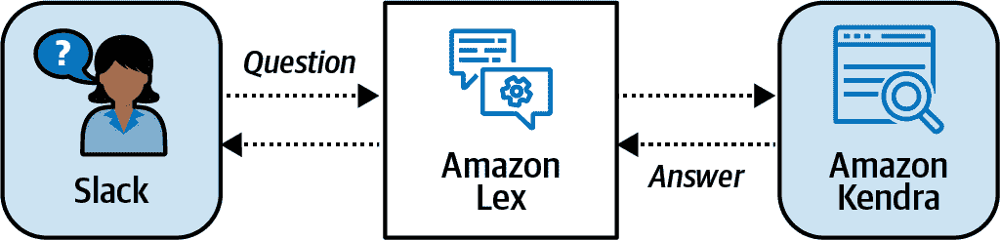

###### 图 2-3\. 使用 Slack、Amazon Lex 和 Amazon Kendra 自动回答问题。

下面是一个样本对话，其中 Antje 在直播研讨会期间使用 Slackbot 提问。聊天机器人回答与参与者常见问题相关的问题。这使得研讨会的主持人可以专注于需要人工干预的更复杂问题：

> *Antje*: “嗨。”
> 
> *Slackbot*: “你好！我能帮忙什么？”
> 
> *Antje*: “你们录制这个研讨会吗？”
> 
> *Slackbot*: “是的，这个研讨会正在录制。”
> 
> *Antje*: “我在哪里找到录音？”
> 
> *Slackbot*: “录音将在 *https://youtube.datascienceonaws.com* 上在 24 小时内分享。”
> 
> *Antje*: “你知道如何开始使用 SageMaker 吗？”
> 
> *Slackbot*: “我认为你问题的答案是：在 Amazon SageMaker Studio 页面上，在开始使用中，选择快速开始，然后选择创建工作室域。”

# 智能客户支持中心

质量客户支持对每个行业和企业都非常重要（正如前文所述，客户至上是亚马逊的关键领导原则之一）。在许多情况下，客户支持直接影响客户对企业的感知。Amazon Connect 是一种云联系中心解决方案，利用机器学习提供智能联系中心功能。通过 Connect Wisdom，客户支持代理可以简单地输入问题，例如“书籍的换货政策是什么？”，Wisdom 将返回最相关的信息和最佳答案。Wisdom 还对现场通话记录运行机器学习，自动识别客户问题并向代理推荐响应。

Contact Lens for Amazon Connect 为基于相同技术支持亚马逊客服的云联系中心服务 Amazon Connect 添加了机器学习功能。Contact Lens 使用语音转文本转录、自然语言处理（NLP）和认知搜索能力分析客户-代理互动。

通过自动索引通话转录，Contact Lens 允许我们搜索特定词语、短语和情绪，同时从转录中删除敏感信息以避免泄露。Contact Lens 帮助主管实时发现互动中的重复主题，自动培训代理人以提高他们的客户支持技能，并基于客户使用的关键词和短语连续分类联系人。

使用 Contact Lens for Amazon Connect，联系中心主管可以单一视图查看客户与代理人的互动、产品反馈趋势以及潜在的合规风险。Amazon Connect 复制成功的互动，突出产品反馈异常，并将不良的客户与代理人互动升级至主管。

# 工业 AI 服务与预测性维护

作为 AWS 工业服务组合的一部分，AWS 提供一系列 AI 服务和硬件，包括 Amazon Lookout for Metrics、Lookout for Vision、Lookout for Equipment、Amazon Monitron 和 AWS Panorama。

我们可以使用 Amazon Lookout for Metrics 创建准确的异常检测模型。上传数据后，Lookout for Metrics 将自动检查数据并构建异常检测模型。如果模型检测到异常，服务将将相关异常分组并分配严重性评分。Lookout for Metrics 配备了与流行数据源的内置连接器，包括 Amazon S3、Amazon Redshift、Amazon CloudWatch、Amazon RDS 以及各种 SaaS 应用程序。异常检测模型利用人在环回反馈持续改进。

我们可以使用 Amazon Lookout for Vision 来发现产品缺陷。Lookout for Vision 利用计算机视觉来识别物体的视觉缺陷。它可以帮助自动检测零部件的损坏，识别缺失的组件，或者发现制造线上的流程问题。Lookout for Vision 已经配备了预训练的异常检测模型。我们只需对特定的图像进行微调。

我们可以使用 Amazon Lookout for Equipment 监控设备的健康和效率。将历史设备传感器数据上传到 Lookout for Equipment，服务将构建一个定制的机器学习模型来检测任何异常设备行为。此外，服务还将自动发送警报，以便我们采取行动。Lookout for Equipment 适用于任何时间序列模拟数据，包括温度、流量等传感器数据。

我们可以使用 Amazon Monitron 实现端到端的预测性维护用例，包括设备传感器、安全连接到 AWS 的网关设备，以及用于分析异常机器模式数据的托管服务。Amazon Monitron 捕获我们设备的传感器数据，识别健康的传感器模式，并训练特定设备的机器学习模型。我们可以通过 Amazon Monitron 移动应用程序提供反馈以改进模型，例如。

我们可以通过 AWS Panorama 为本地摄像头启用计算机视觉，它配备了一个硬件设备，可以连接到我们的网络和现有摄像头。然后，我们可以将计算机视觉应用部署到该设备上，以处理连接摄像头的视频流。摄像头设备制造商可以使用 AWS Panorama SDK 构建新的摄像头，在边缘运行计算机视觉模型。

# 使用 AWS IoT 和 Amazon SageMaker 的家庭自动化

我们生活在一个估计有五十亿人拥有某种移动设备的世界，超过一半的互联网流量通过移动设备产生。此外，工业物联网（IoT）革命引领着数十亿个连接的传感器和设备进入我们的家庭、办公楼、工厂、汽车、船只、飞机、油井、农田等领域。

移动和物联网设备的这一趋势也推动计算移到边缘，无论我们是出于数据隐私合规的原因需要在将数据发送和导入到中央数据湖之前分析和预处理数据，还是通过更快地提供应用程序响应来改善用户体验，消除到云端的往返延迟。我们还看到越来越多的机器学习发生在边缘。虽然训练机器学习模型通常需要强大的计算资源，但对这些模型进行推断通常需要远低于此的计算能力。

在边缘执行推断有助于减少延迟和成本，因为我们节省了到云端的往返时间。我们还可以更快地捕获和分析预测结果，本地触发某些动作，或将分析数据发送回云端以重新训练和改进我们的机器学习模型。

AWS IoT Greengrass 将模型从 S3 部署到边缘，以便利用边缘本地数据进行预测。AWS IoT Greengrass 还将模型推断结果同步回 S3 存储桶。然后可以使用这些预测数据来重新训练和改进 SageMaker 模型。AWS IoT Greengrass 支持空中部署，本地在每个设备上运行，并将 AWS 扩展到这些设备。

图 2-4 展示了一个运行 AWS IoT Greengrass 的家庭自动化用例，本地家庭自动化服务器称为“边缘设备”。AWS IoT Greengrass 将一个 SageMaker 模型部署到边缘设备，并使用在边缘设备上运行的 Lambda 的边缘版本处理从摄像头、灯开关和灯泡接收的数据。

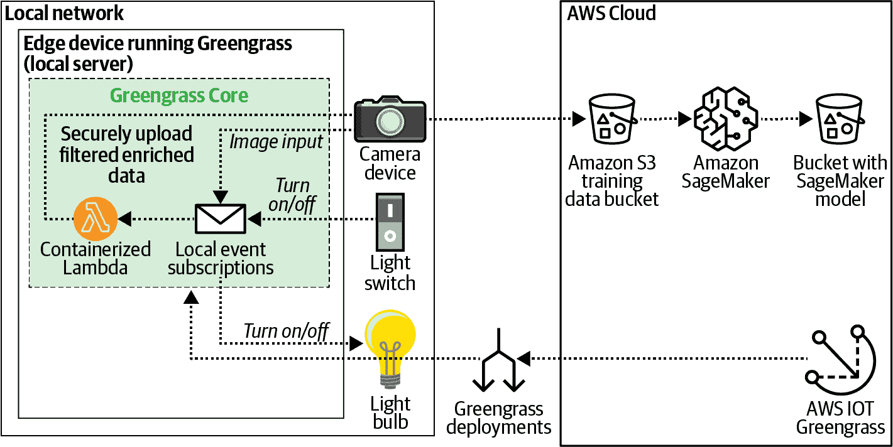

###### 图 2-4. 使用 AWS IoT Greengrass 的家庭自动化用例。

AWS 提供了多种服务来实现边缘上的机器学习，包括 AWS IoT Greengrass 用于模型部署到边缘，SageMaker Neo 用于模型优化，以及 SageMaker Edge Manager 用于管理边缘上的模型。我们将在第九章深入探讨 SageMaker Neo 和 Edge Manager。

# 从医疗文件中提取医疗信息

在医疗领域，AWS 提供许多专用服务。这些服务专门针对医疗数据的特性和需求进行开发，并符合医疗法规。作为亚马逊 AI 符合 HIPAA 标准的医疗健康服务组合的一部分，AWS 提供了 Amazon Comprehend Medical、Amazon Transcribe Medical 和 Amazon HealthLake。

Comprehend Medical 是一个专门针对医疗语言进行了预训练的 NLP 服务。Comprehend Medical 自动化从医疗文本中提取健康数据，例如医生的笔记、临床试验报告或患者健康记录。

Transcribe Medical 是一个已经在医疗语言上进行了预训练的 ASR 服务。我们可以使用 Transcribe Medical 将医疗语音转录为文本。通过简单的 API 调用，我们可以自动化临床文档工作流程，甚至为远程医疗提供字幕。

HealthLake 是一个符合快速医疗互操作资源行业标准的安全数据湖。除了存储、索引和转换医疗数据外，Amazon HealthLake 还利用机器学习从原始数据中识别、理解和提取医疗信息，例如医疗报告和患者笔记。我们可以使用 Amazon QuickSight、Athena 和 SageMaker 在我们的医疗数据上运行高级分析和机器学习。

# 自我优化和智能化云基础设施

到目前为止，我们介绍的亚马逊 AI/ML 服务并不是唯一提供复杂机器学习功能的服务。事实上，越来越多的现有 AWS 服务正在丰富机器学习功能，并且在各种用例中推出新的基于机器学习的服务。让我们快速浏览一些这些潜力明星。

## 预测自动缩放 Amazon EC2

Amazon EC2，即弹性计算云，在 AWS 云中提供虚拟服务器实例。在这些 Amazon EC2 实例上运行我们的应用程序的一个挑战是如何确保根据当前工作负载扩展实例数量，基本上是匹配供给和需求。幸运的是，有 Amazon EC2 Auto Scaling，它可以帮助我们做到这一点。根据需求的变化，我们可以配置 Amazon EC2 Auto Scaling 自动增加或减少计算能力。然而，这种动态缩放方法仍然是响应性的，因为它根据监控流量和 Amazon EC2 实例利用率指标来执行。

我们可以通过与名为*AWS 自动缩放*的服务结合，进一步采取主动的方法。AWS 自动缩放提供了一个单一接口来设置多个 AWS 服务的自动扩展，包括 Amazon EC2。它结合了动态和预测缩放。通过预测缩放，AWS 使用机器学习算法根据每日和每周的趋势预测我们未来的流量，并提前配置正确数量的 Amazon EC2 实例，如图 2-5 所示。

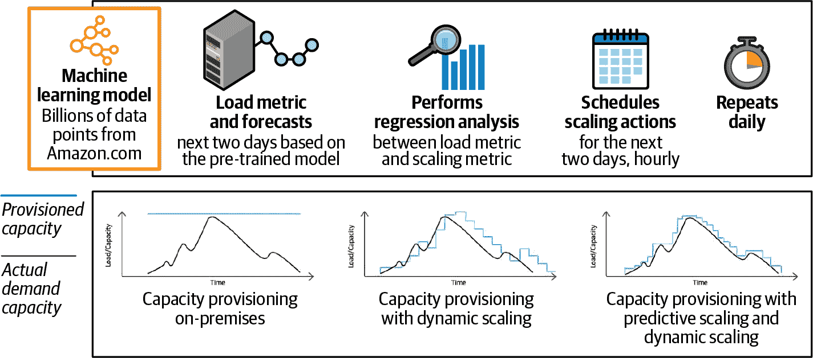

###### 图 2-5\. 使用 AWS 自动缩放进行预测缩放，以预测流量变化，从而提供正确数量的 Amazon EC2 实例。

## 数据流中的异常检测

流技术为我们提供了在实时收集、处理和分析数据流的工具。AWS 提供了广泛的流技术选项，包括 Amazon MSK 和 Amazon Kinesis。虽然我们在第十章深入研究使用 Amazon Kinesis 和 Apache Kafka 进行流分析和机器学习，但我们想要强调 Kinesis Data Analytics 作为仅需几行代码即可创建流应用程序的简单而强大的方法。

Kinesis Data Analytics 提供了使用 Kinesis Data Analytics 中的 Random Cut Forest (RCF)函数进行实时构建机器学习模型并计算每条消息中数值的异常分数的内置功能。该分数指示值与观察到的趋势的不同程度。RCF 函数还计算每列的归因分数，反映了该特定列中数据的异常性。所有列的所有归因分数之和即为总体异常分数。

# 认知和预测商业智能

许多机器学习应用程序和模型假设数据在数据湖中随时可用（在第四章讨论）。然而，实际上，世界上大部分数据存储和处理在结构化的关系数据库中。为了将机器学习应用于这些结构化数据，我们必须将数据导出或开发定制应用程序来读取数据，然后才能应用机器学习。如果我们可以直接从我们的商业智能服务、数据仓库或数据库使用机器学习，那岂不是太棒了？让我们看看如何在 AWS 上实现这一点。

## 使用 Amazon QuickSight 进行自然语言提问

Amazon QuickSight 是一个商业智能服务，可以在数据源如 Amazon Redshift、Amazon RDS、Amazon Athena 和 Amazon S3 上执行交互式查询和构建可视化。QuickSight 还可以通过 QuickSight ML Insights 和 QuickSight Q 从我们的数据中检测异常、创建预测并回答自然语言问题。

QuickSight ML Insights 运行 RCF 算法来识别数亿数据点中数百万度量的变化。ML Insights 还能基于观察到的度量进行预测。RCF 算法会自动检测数据中的季节性模式，排除任何异常值，并填补缺失值。

使用 QuickSight Q，我们可以询问诸如“在加利福尼亚州哪些产品类别畅销？”之类的自然语言问题。QuickSight 使用机器学习理解问题，将问题应用于我们的数据，并创建图表来回答我们的问题，如图 2-6 所示。我们将在第五章深入探讨 QuickSight。

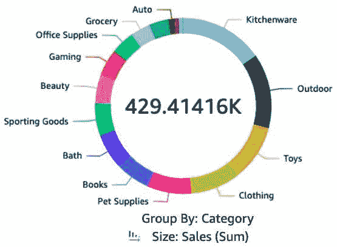

###### 图 2-6\. QuickSight Q 理解自然语言问题，并自动创建图表来回答这些问题。

## 用 Amazon Redshift 训练和调用 SageMaker 模型

Amazon Redshift 是一个完全托管的数据仓库，允许我们对 PB 级结构化数据运行复杂的分析查询。使用 Amazon Redshift ML，我们可以在 Amazon Redshift 中使用我们的数据，随着新数据到来训练 SageMaker Autopilot 模型。SageMaker Autopilot 会自动训练、调优和部署模型。然后，我们在 Amazon Redshift 查询中注册并调用该模型作为用户定义函数（UDF）。图 2-7 展示了我们如何使用`USING FUNCTION` SQL 子句进行预测。我们将在第三章中展示 Amazon Redshift ML 和 SageMaker Autopilot 的更详细示例。

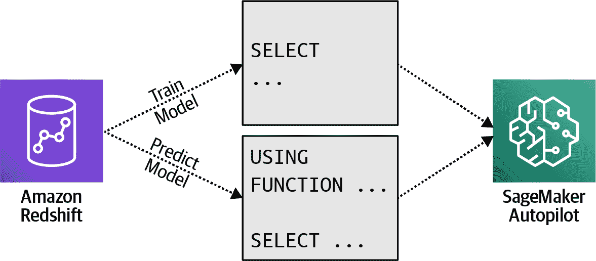

###### 图 2-7\. Amazon Redshift 使用 SageMaker Autopilot 来训练和调用 SageMaker 模型作为 UDF。

###### 注意

我们可以创建一个 UDF 来使用 Lambda 函数调用任何 AWS 服务。此示例 UDF 调用一个 Lambda 函数：

```
USING FUNCTION invoke_lambda(input VARCHAR) 
RETURNS VARCHAR TYPE LAMBDA_INVOKE WITH 
(lambda_name='<LAMBDA_NAME>') SELECT invoke('<INPUT>');
```

## 从 Amazon Aurora SQL 数据库调用 Amazon Comprehend 和 SageMaker 模型

Aurora 是一个与 MySQL 和 PostgreSQL 兼容的关系数据库，与 Amazon Comprehend 和 Amazon SageMaker 本地集成，如图 2-8 所示。

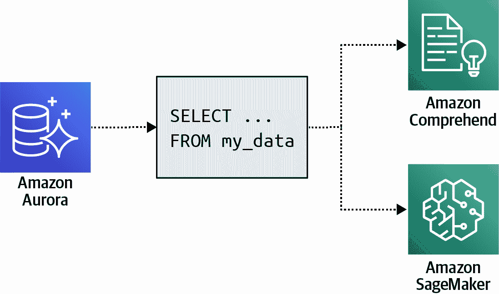

###### 图 2-8\. Aurora ML 可以调用 Amazon Comprehend 和 SageMaker 中的模型。

我们可以在查询中使用内置 SQL 函数（与 Amazon Comprehend 一起）或自定义编写的 SQL 函数（与 Amazon SageMaker 一起）来将机器学习应用于数据。正如前面所示，我们可以利用 Amazon Comprehend 进行客户情感分析（内置 SQL 函数），可能是产品评价，或者使用 Amazon SageMaker 进行任何自定义开发的机器学习模型集成。

假设我们在一个关系表中有一些样本产品评价：

```
CREATE TABLE IF NOT EXISTS product_reviews (
       review_id INT AUTO_INCREMENT PRIMARY KEY,
       review_body VARCHAR(255) NOT NULL
);

INSERT INTO product_reviews (review_body)
VALUES ("Great product!");
INSERT INTO product_reviews (review_body)
VALUES ("It's ok.");
INSERT INTO product_reviews (review_body)
VALUES ("The worst product.");
```

然后，我们可以使用以下内置 SQL 函数让 Amazon Comprehend 返回情感和置信度分数：

```
SELECT review_body,
       aws_comprehend_detect_sentiment(review_body, 'en') AS sentiment,
       aws_comprehend_detect_sentiment_confidence(review_body, 'en') AS confidence
  FROM product_reviews;
```

这将显示类似于这样的结果：

```
review_body               sentiment         confidence
---------------------------------------------------------
Great product!            POSITIVE          0.9969872489
It's ok.                  POSITIVE          0.5987234553
The worst product.        NEGATIVE          0.9876742876
```

## 从 Amazon Athena 调用 SageMaker 模型

同样，我们可以使用 Amazon Athena，这是一个允许我们使用 SQL 查询 Amazon S3 中存储的数据的服务，并直接从这些查询中调用 SageMaker 机器学习模型进行推理，如图 2-9 所示。

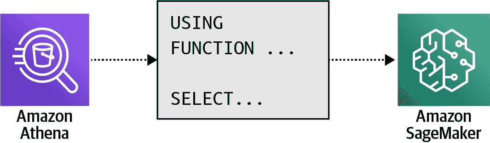

###### 图 2-9. 亚马逊 Athena 可以调用 SageMaker 模型。

我们使用`USING FUNCTION` SQL 语句定义一个 UDF，调用一个自定义构建的 Amazon SageMaker Endpoint 来服务情感预测。随后的任何`SELECT`语句中，可以引用该函数将值传递给模型。

这里有一个简单的例子：

```
USING FUNCTION predict_sentiment(review_body VARCHAR(65535)) 
    RETURNS VARCHAR(10) TYPE 
    SAGEMAKER_INVOKE_ENDPOINT WITH (sagemaker_endpoint = '<ENDPOINT_NAME>') 

SELECT predict_sentiment(review_body) AS sentiment
     FROM "dsoaws"."amazon_reviews_tsv" 
     WHERE predict_sentiment(review_body)="POSITIVE";
```

## 在 Amazon Neptune 上运行图数据预测

Amazon Neptune 是一款完全托管的图形数据库，允许我们构建和运行跨高度连接的数据集的应用程序。Neptune ML 实现了图神经网络（GNN），用于使用图数据进行预测。虽然诸如 XGBoost 之类的算法专为传统表格数据集设计，但 GNN 专门设计用于处理图形的复杂性和可能的数十亿个关系。Neptune ML 使用开源的 Deep Graph Library 和 Amazon SageMaker，自动选择、训练和部署最佳模型来处理我们的图数据。

# 培养下一代 AI 和 ML 开发者

亚马逊和 AWS 提供了许多计划和服务，帮助培养下一代 AI/ML 开发者。亚马逊的[Machine Learning University program](https://oreil.ly/CnXwM) —— 用于培训亚马逊员工 —— 于 2020 年向公众发布。AWS 培训与认证（T&C）提供广泛的按需和课堂培训课程，帮助准备 AWS 机器学习专业认证考试。此外，AWS 与 Udacity、Coursera 和 DeepLearning.AI 合作，创建了多个大规模在线开放课程，以便通过亚马逊 AI 和机器学习技术栈进行实践经验。

在本节中，我们讨论了深度学习驱动的 AWS 设备，提供了一个有趣和教育性的方式来进行计算机视觉、强化学习和生成对抗网络（GANs）的实践经验。

面向开发者的设备系列包括以下几种：AWS DeepLens、DeepRacer 和 DeepComposer。AWS DeepLens 是一款支持深度学习的无线视频摄像头。AWS DeepRacer 是一款由强化学习驱动的全自动 1/18 比例赛车。而 AWS DeepComposer 是一款音乐键盘，由 GAN 技术驱动，可以将我们的旋律转化为原创歌曲。

## 使用 AWS DeepLens 构建计算机视觉模型

AWS DeepLens 是一款支持深度学习的视频摄像头，提供丰富的计算机视觉教程和预构建模型。如果我们想要学习如何构建计算机视觉应用程序，并在几分钟内看到第一个结果，我们可以使用其中一个带有预训练模型和简单推理功能的样本项目。摄像头将在设备上执行对部署模型的本地推理。

如果我们是经验丰富的开发人员，可以在支持的深度学习框架（如 TensorFlow、Apache MXNet 或 Caffe）中构建和训练自定义卷积神经网络（CNN）模型，然后将项目部署到 AWS DeepLens 设备上。图 2-10 展示了典型的 AWS DeepLens 工作流程。

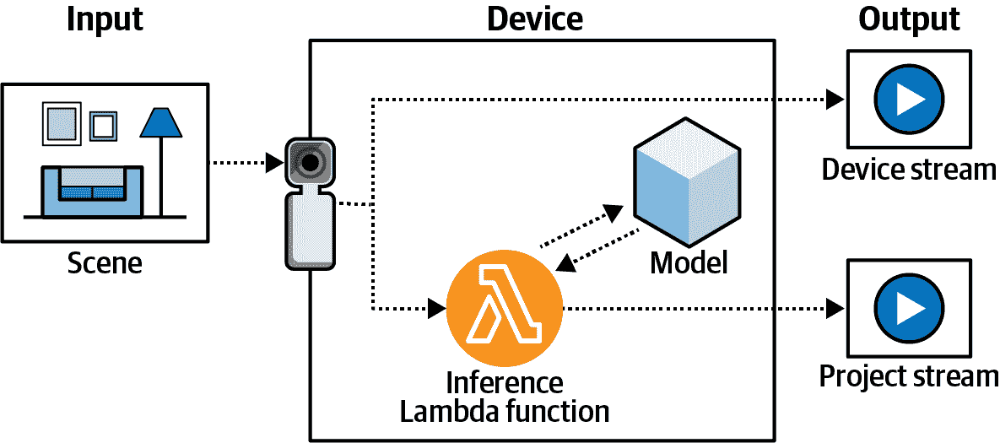

###### 图 2-10\. AWS DeepLens 捕获输入视频流，使用部署模型处理流，并生成两个输出视频流。

AWS DeepLens 既是边缘设备又是摄像头。因此，AWS DeepLens 运行 AWS IoT Greengrass Core 并可以执行自己的 Lambda 函数。使用 AWS IoT Greengrass 将新模型推送到 AWS DeepLens。摄像头捕获输入视频流并生成两个输出流：一个是设备流，原样传递；另一个是项目流，是部署模型处理后的视频帧的结果。

我们部署的任何项目都需要包含一个 Lambda 函数来处理输入的视频帧，也称为*推理 Lambda 函数*。我们首先将该函数与 Lambda 运行时和一个训练模型捆绑在一起。然后，使用 AWS IoT Greengrass 将项目部署到 AWS DeepLens 设备上。

## 用 AWS DeepRacer 学习强化学习

AWS DeepRacer 是一款完全自主的 1/18 比例的赛车，通过强化学习驱动。该车配备了两个摄像头、一台激光雷达传感器和一个板载计算模块。计算模块执行推理以驾驶车辆沿赛道行驶。

强化学习应用于各种自主决策问题。当 DeepMind 团队在 2015 年发布了首个击败职业人类围棋选手的计算机程序 AlphaGo 时，它受到了广泛关注。

###### 注意

围棋是一种古老的战略棋类游戏，因其复杂性而闻名。约三千年前在中国发明，至今仍然由业余爱好者和各种专业联赛玩家在全球范围内进行比赛。

尽管 AlphaGo 是通过与人类玩家进行数千场比赛来学习该游戏的，随后发布的 AlphaGo Zero 则是通过与自己对弈来学习围棋。这再次彻底改变了强化学习领域，因为它的表现甚至比之前的版本更好，并表明该模型能够发现新知识并应用非传统策略取得胜利。

在高层次上，强化学习是一种通过与环境交互来实现特定目标的机器学习方法，代理通过试错学习来做出自主决策，如 图 2-11 所示。

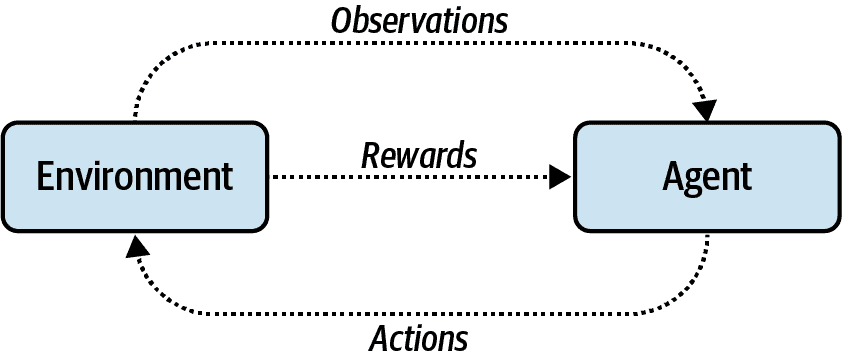

###### 图 2-11\. 增强学习是一种机器学习方法，旨在通过与环境的交互实现自主决策目标。

我们将深入探讨增强学习，以便在第九章中将生产模型与多臂老虎机进行比较，但让我们回到我们的自动驾驶车辆竞赛场景。在我们的例子中，代理是 AWS DeepRacer 车辆，环境包括赛道布局、行驶路线和交通状况。动作包括左转、右转、刹车和加速。动作的选择是为了最大化一个奖励函数，这代表了快速到达目的地且避免事故的目标。动作导致状态。图 2-12 展示了 AWS DeepRacer 的动作、奖励和状态流程。

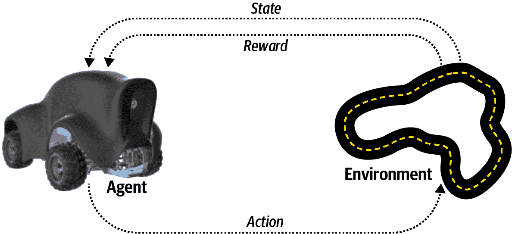

###### 图 2-12\. AWS DeepRacer 基于状态和奖励采取行动。

我们甚至不需要实体赛道或车辆即可开始。我们可以在 AWS DeepRacer 控制台中开始训练我们的自定义增强学习模型，并使用 AWS DeepRacer 模拟器在虚拟赛道上评估我们的模型，如图 2-13 所示。

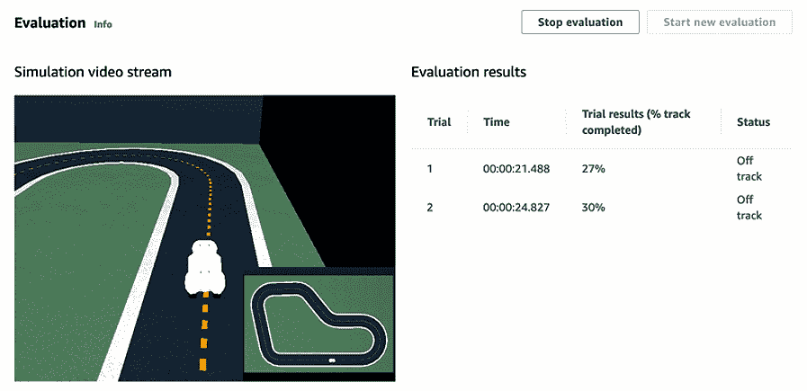

###### 图 2-13\. 使用 AWS DeepRacer 模拟器进行模型评估。来源：[AWS DeepRacer 开发者指南](https://oreil.ly/rN3dR)。

AWS 还维护全球 AWS DeepRacer 联赛和排行榜，根据一整年举办的官方 AWS DeepRacer 联赛赛事的车辆表现进行排名，包括物理和虚拟事件。

## 了解 AWS DeepComposer 中的 GANs

是的，在 AWS 在 2019 年 12 月的年度 AWS re:Invent 大会上介绍 AWS DeepComposer 设备时，每个人都显得有些困惑。然而很快，我们开始听到这些独特的声音从拉斯维加斯酒店走廊传出。AWS DeepComposer 是一款音乐 USB 键盘，帮助我们学习生成式 AI。它专为与 AWS DeepComposer 服务配合使用，将简单的旋律转化为原创歌曲而设计。AWS DeepComposer 设备如图 2-14 所示。

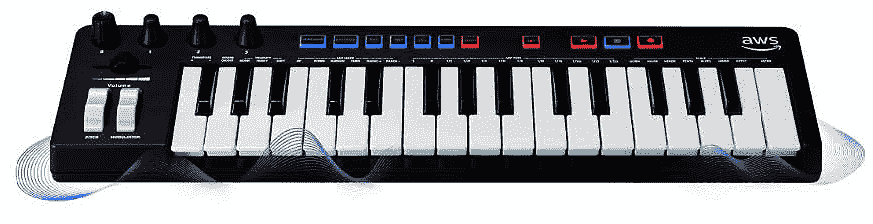

###### 图 2-14\. AWS DeepComposer 是一款音乐 USB 键盘，帮助我们学习生成式 AI。来源：[AWS](https://oreil.ly/qk6zr)。

生成式 AI，特别是 GANs 的形式，用于根据我们提供的输入生成新内容。这些输入可以是图像、文本，甚至是音乐。生成式 AI 模型会自动发现和学习数据中的模式，并利用这些知识基于其训练数据生成新数据。GANs 使用两个竞争算法，生成器和判别器，来生成新内容，如图 2-15 所示。

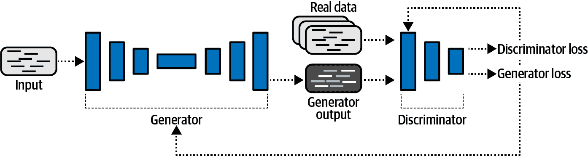

###### 图 2-15\. GANs 利用生成器和判别器算法。

生成器是一个卷积神经网络（CNN），它根据输入数据的模式学习创建新内容。鉴别器是另一个 CNN，经过训练后真正区分真实内容和生成内容。生成器和鉴别器交替训练，强制生成器创建越来越真实的内容，同时鉴别器在识别合成内容与真实内容方面不断改进。

应用到我们的音乐示例中，当我们在键盘上演奏一段旋律时，AWS DeepComposer 可以添加高达三个附加伴奏轨道，以创建新的作品。生成网络源自计算机视觉中广泛使用的流行 U-Net 架构，并已在公开可用的巴赫作品数据集上进行了训练。

# 使用量子计算编程自然操作系统

构建有用的量子应用程序需要新的技能和完全不同的问题解决方法。获取这些专业知识需要时间，并需要访问量子技术和编程工具。

Amazon Braket 帮助我们探索量子硬件的潜力，理解量子算法，并为量子未来重新调整。图 2-16 展示了通过更好的硬件、更多的开发者和更多的使用案例推动量子计算生态系统增长的量子计算飞轮。

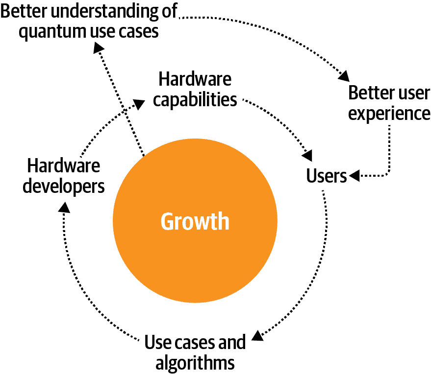

###### 图 2-16\. 通过 Amazon Braket 推动量子计算的飞轮增长。

当今的图形处理单元（GPU）与明天的量子处理单元（QPU）之间存在许多相似之处。GPU 通过高度并行的数字计算彻底改变了人工智能和机器学习。GPU 还需要一套不同的技能、库（例如 NVIDIA 的 CUDA）和硬件，以利用这种大规模并行性。此外，GPU 设备与传统管理较大计算工作流程的 CPU 设备是“片外”的。在 CPU 和 GPU 之间同步数据需要特殊的硬件和软件来适应物理分离。

类似地，QPUs 通过高度并行的量子计算执行计算，比其数字对应物并行度高出许多个数量级。此外，QPUs 需要一套不同的技能、库和硬件。它们与 CPU 片外，因此需要特殊的硬件和软件来执行类似于 GPU 的同步操作，如图 2-17 所示。

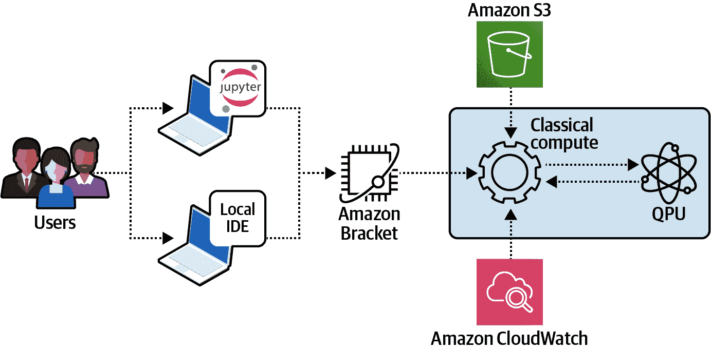

###### 图 2-17\. 使用经典数字计算机的量子处理器单元（QPU）。

## 量子位与数字位的对比

量子比特（qubits）是经典数字比特的量子计算等效物。然而，它们的状态（0 或 1）是概率性的，因此在知道值之前需要进行一次读取操作。这种概率状态被称为“叠加态”，是量子计算的关键原理之一。

当前可访问的量子计算机约为 70 至 100 个量子比特。然而，由于量子硬件的相对“嘈杂”环境，这些比特的大部分都需要用于纠错。例如，加密需要近 6000 个干净的量子比特来破解 2048 位 RSA。六千个干净的量子比特需要约 1000000 个纠错冗余量子比特来调整当前量子硬件提供的嘈杂环境。

## 量子霸权和量子计算时代

直到最近，我们处于“经典模拟”阶段，在这个阶段我们能够模拟量子计算机的性能提升。然而，2019 年，我们达到了“量子霸权”的阶段，在今天的数字计算机的限制下，我们不再能够模拟和测量量子计算机的额外性能提升。

当前时代被称为*噪声中间尺度量子*。在这个时代，我们试图纠正由量子计算环境引入的噪声，这需要非常具体的温度和真空特性。类似于纠错寄存器和 RAM 芯片，我们需要纠错量子比特和 QRAM 来进入下一个时代，即*纠错量子计算机*时代，如图 2-18 所示。

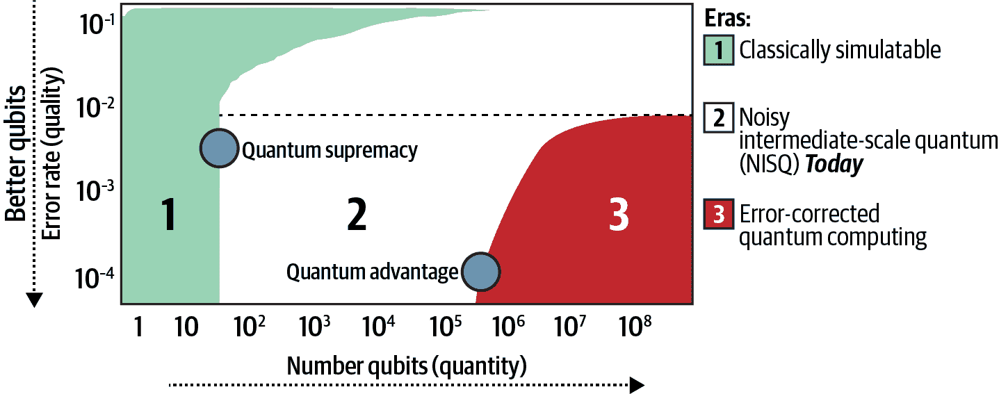

###### 图 2-18. 量子计算时代。

## 破解密码学

据估计，距离量子计算机破解现代 RSA 加密仅有大约 10 年左右的时间。今天，加密是有效的，因为我们没有足够的计算能力来执行需要破解代码的数值因式分解。

然而，使用约 6000 个“完美”量子比特（无需纠错），我们可以在几分钟内破解 RSA 代码。这是令人担忧的，并且已经催生了“量子感知”或“后量子”密码学，例如亚马逊的 s2n [TLS 协议的开源实现](https://oreil.ly/o3U7G)，它使用后量子密码学而不是经典密码学。我们在第十二章中深入探讨后量子密码学。

## 分子模拟和药物发现

量子计算机具有独特的并行化能力，并且能够本地操作量子机械状态。因此，它们有可能解决非常重要的问题，如映射分子的电子结构。量子模拟可能会导致发现新材料、催化剂、药物和高温超导体。

## 物流和金融优化

优化问题在许多领域中普遍存在，包括供应链物流和金融服务。从指数集合中找到最优方法可能会耗尽经典数字计算机的资源。量子计算机可以突破这一障碍，并加速许多优化技术，包括线性规划算法和蒙特卡洛方法。

## 量子机器学习和人工智能

不幸的是，目前量子计算机在机器学习和人工智能中的应用还相当有限。我们已经看到一些线性算法，如支持向量机和主成分分析，有一些早期的改进。我们还看到量子研究已经启发了改进经典推荐算法的例子。未来，纠错量子计算机可能会导致一类可伸缩和高性能的量子机器学习和人工智能模型。

## 使用 Amazon Braket 编程量子计算机

Amazon Braket 支持 Jupyter Notebook，并提供了 Python SDK，允许开发人员与量子计算机进行交互。使用 Python SDK，我们可以将任务异步提交到远程 QPU。这类似于早期计算时我们提交作业并“租用”共享计算机来完成这些作业的方式。这也类似于将计算从 CPU 转移到 GPU。然而，关键的区别在于 CPU 和 GPU 共享经典的数字基础，而 QPU 则不然。

以下代码演示了如何构建涉及多量子比特的量子电路。这个示例展示了如何执行“量子传输”，其中信息（*而不是* 物质）从一个量子比特传输到另一个量子比特，而不使用经典数字电路或网络电缆：

```
from braket.aws import AwsDevice
from braket.circuits import Circuit, Gate, Moments
from braket.circuits.instruction import Instruction

device = AwsDevice("arn:aws:braket:::device/qpu/ionq/ionQdevice")

# Alice and Bob initially share a Bell pair.
circ = Circuit();
circ.h([0]);
circ.cnot(0,1);

# Define Alice's encoding scheme.
# Define four possible messages and their gates.
message = {
           "00": Circuit().i(0),
           "01": Circuit().x(0),
           "10": Circuit().z(0),
           "11": Circuit().x(0).z(0)
          }

# Alice selects a message to send.  Let’s choose '01'. 
m = "01"

# Alice encodes her message by applying the gates defined above.
circ.add_circuit(message[m]);

# Alice then sends her qubit to Bob so that Bob has both qubits.
# Bob decodes Alice's message by disentangling the two qubits.
circ.cnot(0,1);
circ.h([0]);

print(circ)

### OUTPUT ###

T  : |0|1|2|3|4|                
q0 : -H-C-X-C-H-
        |   |   
q1 : ---X---X---
T  : |0|1|2|3|4|
```

## AWS 量子计算中心

AWS 已经与加州理工学院合作建立 AWS 量子计算中心，预计于 2021 年开放。该中心将专注于开发有用的量子应用、纠错量子比特、量子编程模型和新的量子硬件。

# 提高性能并降低成本

如果我们能够将代码速度提高一倍并将服务器池大小减少一半会怎么样？我们可能会节省大量资金。如果我们能够自动检测应用程序中的操作问题并查看推荐的修复方法来提高可用性，会怎么样？减少应用程序停机时间是另一个巨大的节省成本的机会。

在本节中，我们介绍了完全托管的服务 Amazon CodeGuru Reviewer、Amazon CodeGuru Profiler 和 Amazon DevOps Guru。CodeGuru Reviewer 和 Profiler 帮助我们提高代码性能并减少资源需求，而 Amazon DevOps Guru 则有助于检测操作问题并提高应用程序的可用性。

## 使用 CodeGuru Reviewer 进行自动代码审查

代码审查是软件开发中众所周知的最佳实践。其思想是我们的代码由经验更丰富的团队成员审查，以提供关于代码性能、质量和安全性的反馈。除了领域专业知识外，这些经验丰富的团队成员还具备团队编码习惯的隐性知识和对代码“气味”的敏锐感知。

然而，有时即使是最经验丰富的团队成员也会忽略微妙的性能瓶颈或处理不当的异常。这些审查者通常专注于特定领域的问题，如领域模型的不良实现或服务集成的配置错误。此外，审查者通常受限于对代码的静态视图，而非代码运行时的实时指标。CodeGuru 包括 CodeGuru Reviewer 用于自动化代码审查和 CodeGuru Profiler 用于监控代码性能。

CodeGuru Reviewer 自动化代码审查过程，并使用机器学习模型进行建议，这些模型在数百万行亚马逊内部代码库和 10,000+ GitHub 开源项目的基础上进行了训练。

我们只需以安全和私密的方式将 CodeGuru 指向我们的源代码库即可 —— CodeGuru 将开始提出建议。CodeGuru 分析我们源代码库中的所有拉取请求，并自动标记关键缺陷，如凭证泄漏、资源泄漏、并发竞争条件以及对 AWS 资源的低效使用。它建议对特定代码行进行更改，以纠正这些缺陷，如 图 2-19 所示。

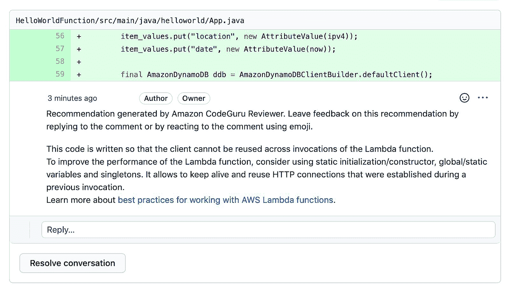

###### 图 2-19\. CodeGuru Reviewer 分析我们的源代码，并添加建议以改善性能并降低成本。

在这种情况下，Lambda 函数的原始代码在每次调用时都会创建一个新的 DynamoDB 客户端，而不是创建一次客户端并对其进行缓存。如果不进行这些更改，我们将浪费不必要的计算周期和内存寄存器，因为我们会不断重新创建相同的 DynamoDB 客户端对象。通过这种改变，我们的 Lambda 函数可以处理更多的请求每秒，这导致资源更少，成本更低。

CodeGuru Reviewer 检查 Python 和 Java 的最佳实践，包括连接池和异常处理。Reviewer 包括 Security Detector 来检测诸如未经过消毒的参数传递到操作系统级 Python 子进程调用等安全问题。CodeGuru Reviewer 还识别代码异味，减少技术债务，并提高代码库的可维护性。

## 通过 CodeGuru Profiler 改进应用程序性能

CodeGuru Profiler 可以在运行时分析应用程序的运行时配置文件，检测代码中的瓶颈，并提供智能建议。Profiler 创建可视化图表，如 图 2-20 中的火焰图，以确定我们应该优化性能并节省最多资金的位置。

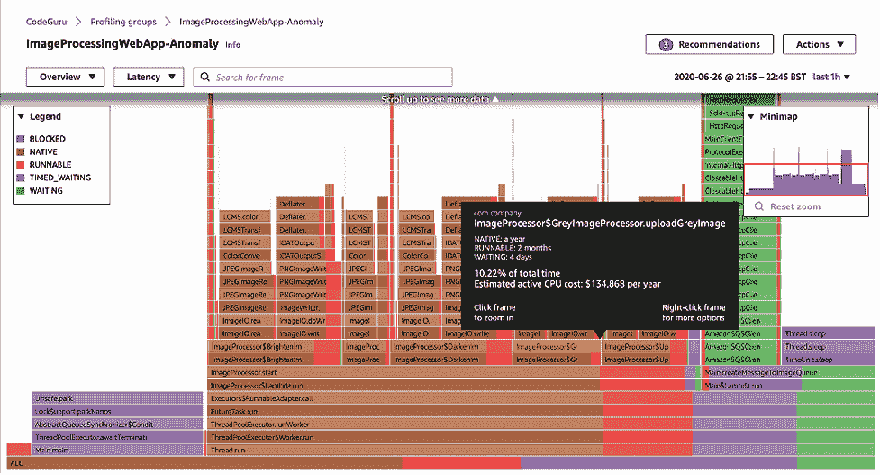

###### 图 2-20\. CodeGuru Profiler 生成的火焰图，突出显示我们代码中的性能瓶颈。

火焰图以人类可读的形式显示调用堆栈及其确切的函数名称。在分析火焰图时，我们应该深入研究发现的任何平台。平台通常表明某个资源因等待网络或磁盘 I/O 而停滞不前。理想情况下，我们的火焰图将显示许多窄峰和少量平台。

## 通过 DevOps Guru 提高应用程序的可用性

Amazon DevOps Guru 是一项由 ML 驱动的运营服务，可以自动检测应用程序中的操作问题并建议修复措施。DevOps Guru 查看应用程序的指标、日志和事件，以识别任何偏离正常操作模式的行为，例如增加的响应延迟、升高的错误率和过度的资源利用。一旦识别出这样的模式，DevOps Guru 将发送警报，并附上相关异常的摘要、潜在的根本原因和可能的解决方案。

# 总结

在本章中，我们展示了许多可以通过各种 AWS AI 和机器学习服务解决的用例，无需或几乎不需要编写代码。无论我们是应用开发人员并且对机器学习知之甚少，还是经验丰富的数据科学家希望专注于复杂的机器学习问题，亚马逊提供的托管 AI 和机器学习服务都值得探索。

我们可以轻松地为我们的应用程序增添现成的 AI 服务，无论我们的业务用例是否需要将机器学习引入边缘，还是我们刚刚开始 AI/ML 之旅，希望找到一些有趣的教育方式来开始计算机视觉、强化学习或 GANs。

我们还展示了如何利用高级 AI 服务，包括 Amazon Personalize 提供推荐和 Forecast 预测需求。

我们展示了机器学习如何驱动许多现有的 AWS 服务，包括预测性 Amazon EC2 自动扩展和暖池技术。我们还探讨了如何使用 Macie 检测和防止敏感数据泄漏，并利用 Amazon Fraud Detector 防止欺诈行为。我们介绍了如何通过 Amazon Contact Lens for Amazon Connect、Comprehend、Kendra 和 Lex 来改善客户支持体验。我们还描述了如何利用 CodeGuru Reviewer、CodeGuru Profiler 和 DevOps Guru 自动化源代码审查，并识别性能和成本效益。

在第三章中，我们将讨论自动化机器学习的概念。我们将展示如何仅需几次点击即可使用 Amazon SageMaker Autopilot 和 Amazon Comprehend 构建预测模型。
