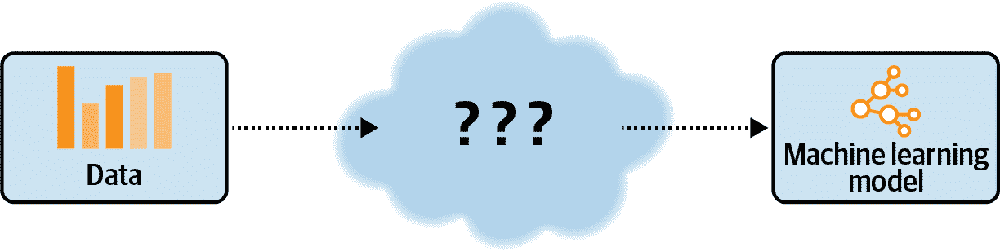
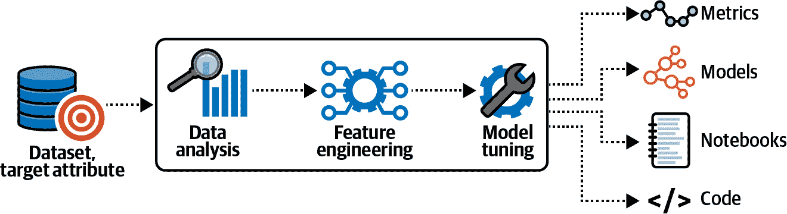
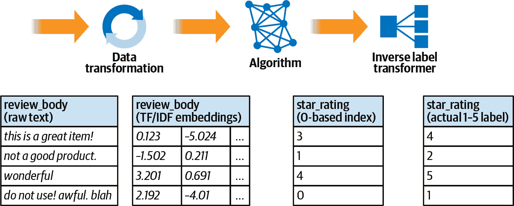
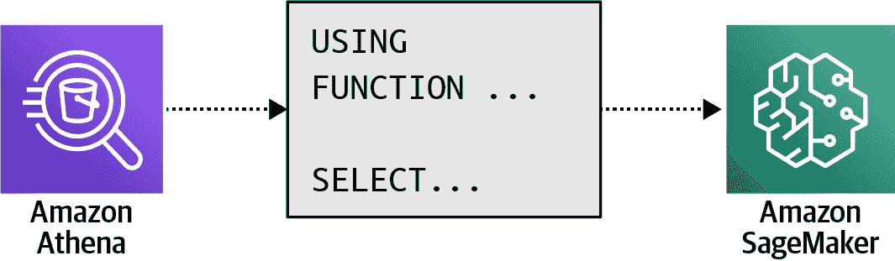

# 第三章：自动化机器学习

在本章中，我们将展示如何使用完全托管的亚马逊 AI 和机器学习服务，避免为我们的 AI 和机器学习流水线管理自己的基础设施需求。我们深入探讨了两个亚马逊服务：Amazon SageMaker Autopilot 和 Amazon Comprehend。这两个服务都专为希望通过简单点击即可从其数据集构建强大预测模型的用户而设计。我们可以使用 SageMaker Autopilot 和 Comprehend 来以非常低的工作量和成本建立基准模型性能。

机器学习从业者通常花费数周或数月来构建、训练和调整他们的模型。他们准备数据并决定使用的框架和算法。在迭代过程中，机器学习从业者试图找到适合其数据集和问题类型的最佳执行算法。不幸的是，对于这个过程，没有捷径。我们仍然需要经验、直觉和耐心来运行许多实验，找到我们算法和数据集的最佳超参数。经验丰富的数据科学家凭借多年的经验和直觉为给定数据集和问题类型选择最佳算法，但他们仍然需要通过实际训练运行和重复模型验证来验证他们的直觉。

如果我们只需点击一次就能使用一个服务，该服务会找到适合我们数据集的最佳算法，训练和调整模型，并将模型部署到生产环境中，那该有多好？Amazon SageMaker Autopilot 简化了模型训练和调整过程，并加快了整体模型开发生命周期。通过在特征选择和超参数调整等样板生命周期阶段花费较少时间，我们可以花更多时间处理领域特定问题。

通过分析我们在 S3 中的数据，SageMaker Autopilot 基于亚马逊多年的 AI 和机器学习经验，探索不同的算法和配置。SageMaker Autopilot 比较各种回归、分类和深度学习算法，找出适合我们数据集和问题类型的最佳算法。

SageMaker Autopilot 通过一组自动生成的 Jupyter 笔记本和 Python 脚本总结了模型候选人。我们完全控制这些生成的笔记本和脚本。我们可以修改它们，自动化它们，并与同事分享。我们可以根据我们期望的模型准确性、模型大小和预测延迟选择顶级模型候选人。

# 使用 SageMaker Autopilot 的自动化机器学习

我们通过将原始数据以表格形式的 CSV 文件提供到 S3 存储桶中，配置 SageMaker Autopilot 作业。我们还需要告诉 SageMaker Autopilot 哪一列是目标列。然后，SageMaker Autopilot 应用自动化机器学习技术来分析数据，识别适合我们数据集的最佳算法，并生成最佳模型候选人。

SageMaker Autopilot 分析并平衡数据集，并将数据集分为训练/验证集。根据我们试图预测的目标属性，SageMaker Autopilot 自动识别机器学习问题类型，如回归、二元分类或多类分类。然后，SageMaker Autopilot 根据问题类型比较一组算法。算法选择包括逻辑回归、线性回归、XGBoost、神经网络等。

SageMaker Autopilot 生成执行每种算法特定模型流水线的代码。生成的代码包括数据转换、模型训练和模型调优。由于 SageMaker Autopilot 具有透明性，我们可以完全访问这些生成的代码以便自行重现。我们甚至可以修改代码并随时重新运行流水线。

在并行训练和调整生成的流水线之后，SageMaker Autopilot 根据准确率、AUC 和 F1 分数等客观指标对训练好的模型进行排名。

SageMaker Autopilot 使用透明的自动机器学习方法。在不透明的方法中，如图 3-1 所示，我们无法控制或看到所选算法、应用的数据转换或超参数选择。我们将自动化机器学习服务指向我们的数据，并接收一个训练好的模型。



###### 图 3-1。在许多自动机器学习服务中，我们无法看到所选算法、应用的数据转换或超参数选择。

这使得理解、解释和重现模型变得困难。许多自动机器学习解决方案采用这种不透明的方法。相比之下，SageMaker Autopilot 在数据分析、特征工程和模型调优步骤中文档并分享其发现。

SageMaker Autopilot 不仅分享模型；它还记录所有观察到的指标，并生成包含用于重现模型流水线的代码的 Jupyter 笔记本，如图 3-2 所示。



###### 图 3-2。SageMaker Autopilot 生成 Jupyter 笔记本、特征工程脚本和模型代码。

数据分析步骤识别可能影响模型性能的数据质量问题，如缺失值。数据探索笔记本包含来自数据分析步骤的结果。SageMaker Autopilot 还生成另一个 Jupyter 笔记本，其中包含所有流水线定义，以提供透明性和可重现性。候选定义笔记本突出显示了学习给定数据集的最佳算法，以及使用每种算法需要的代码和配置。

###### 提示

第一个数据分析步骤之后，两个 Jupyter 笔记本都可用。我们可以配置 Autopilot 只进行“干跑”并在此步骤后停止。

# 使用 SageMaker Autopilot 跟踪实验

SageMaker 自动驾驶使用 SageMaker 实验来跟踪所有数据分析、特征工程和模型训练/调优作业。 Amazon SageMaker 家族的这一更广泛的 ML 服务功能帮助我们组织、跟踪、比较和评估机器学习实验。 SageMaker 实验使模型版本控制和谱系跟踪在 ML 生命周期的所有阶段均可实现。

SageMaker 实验由试验组成。 试验是一系列步骤的集合，包括数据预处理、模型训练和模型调优。 SageMaker 实验还提供了跨 S3 位置、算法、超参数、训练模型和模型性能指标的谱系跟踪。

我们可以通过 UI 或使用 SDK（如 [Amazon SageMaker Python SDK](https://oreil.ly/nUN9I) 或 [AWS SDK for Python (Boto3)](https://oreil.ly/eiN8j)）来探索和管理 SageMaker 自动驾驶实验和试验。

###### 注意

SageMaker SDK 是建立在 Boto3 之上的高级 SageMaker 特定抽象，是 SageMaker 模型开发和管理的首选选择。

# 使用 SageMaker 自动驾驶训练和部署文本分类器

让我们创建一个 SageMaker 自动驾驶实验，构建一个定制的文本分类器，用于分类我们销售产品的社交反馈。 产品反馈来自各种在线渠道，如我们的网站、合作伙伴网站、社交媒体、客户支持电子邮件等。 我们捕获产品反馈，并希望我们的模型将反馈分类为星级评价类别，5 表示最佳反馈，1 表示最差反馈。

作为输入数据，我们利用来自 [亚马逊客户评论数据集](https://oreil.ly/LjXva) 的样本。 该数据集是从 1995 年到 2015 年在 Amazon.com 上收集的超过 1.5 亿产品评论的集合。 这些产品评论和星级评分是 Amazon.com 的热门客户功能。 我们将在第四章和第五章详细描述和探索此数据集。 现在，我们关注 `review_body`（特征）和 `star_rating`（预测标签）。

## 使用 SageMaker 自动驾驶 UI 进行训练和部署

SageMaker 自动驾驶 UI 集成在 SageMaker Studio 中，这是一个提供单一、基于 Web 的可视界面的 IDE，我们可以在其中进行机器学习开发。 只需导航到 AWS 控制台中的 Amazon SageMaker，并单击 SageMaker Studio。 然后按照说明设置 SageMaker Studio 并单击 Open Studio。

这将带我们进入 SageMaker Studio UI，在那里我们可以通过实验和试验菜单访问 SageMaker 自动驾驶 UI。 在那里，我们可以单击 Create Experiment 来创建和配置我们的第一个 SageMaker 自动驾驶实验。

在准备我们的 SageMaker Autopilot 实验时，我们使用亚马逊客户评论数据集的子集来训练我们的模型。我们希望训练一个分类器模型，以预测给定 `review_body` 的 `star_rating`。我们创建了输入 CSV 文件，包含 `star_rating` 作为我们的标签/目标列和包含产品反馈的 `review_body` 列：

```
star_rating,review_body
5,"GOOD, GREAT, WONDERFUL"
2,"It isn't as user friendly as TurboTax."
4,"Pretty easy to use. No issues."
…
```

在其他情况下，我们可能希望从数据集中使用更多列，并让 SageMaker Autopilot 通过自动特征选择选择最重要的列。然而，在我们的示例中，我们保持简单，并使用 `star_rating` 和 `review_body` 列来专注于创建 Autopilot 实验的步骤。

接下来，我们使用几个输入参数配置 SageMaker Autopilot 实验，这些参数定义数据集、要预测的目标列，以及可选的问题类型，如二元分类、多类分类或回归。如果我们没有指定问题类型，SageMaker Autopilot 可以根据目标列中的值自动确定问题类型。

实验名称

用于标识实验的名称，例如 *amazon-customer-reviews*。

输入数据位置

我们训练数据的 S3 路径，例如 *s3://<MY-S3-BUCKET>/data/amazon_reviews_us_Digital_Software_v1_00_header.csv*。

目标

我们要预测的目标列，例如 `star_rating`。

输出数据位置

存储生成输出的 S3 路径，例如模型和其他工件的 *s3://<MY-S3-BUCKET>/autopilot/output*。

问题类型

机器学习问题类型，如二元分类、多类分类和回归。默认情况下，“自动”允许 SageMaker Autopilot 根据给定的输入数据（包括分类数据）自行选择。

运行完整实验

我们可以选择运行完整实验，或者仅生成数据探索和候选定义笔记本作为数据分析阶段的一部分。在这种情况下，SageMaker Autopilot 在数据分析阶段结束后停止，并且不会运行特征工程、模型训练和调优步骤。

让我们点击“创建实验”并启动我们的第一个 SageMaker Autopilot 作业。我们可以通过 SageMaker Studio 的 Autopilot UI 观察作业的进展，包括预处理、候选生成、特征工程和模型调优。一旦 SageMaker Autopilot 完成候选生成阶段，我们可以在 UI 中看到两个生成笔记本的链接：候选生成和数据探索。

我们可以直接从 UI 下载这些文件，或者直接从 S3 自动化下载。我们可以在以下结构中找到生成的笔记本、代码和转换后的数据：

```
amazon-customer-reviews/
    sagemaker-automl-candidates/
    ...
          generated_module/          
          candidate_data_processors/
                          dpp0.py
                          dpp1.py
                          ...
               notebooks/
                   SageMakerAutopilotCandidateDefinitionNotebook.ipynb
                   SageMakerAutopilotDataExplorationNotebook.ipynb
               ...
    data-processor-models/
          amazon-cus-dpp0-1-xxx/
              output/model.tar.gz
          amazon-cus-dpp1-1-xxx/
              output/model.tar.gz
          ...
    preprocessed-data/
          header/
headers.csv
tuning_data/
          train/
                chunk_20.csv
                chunk_21.csv
                ...
          validation/
                chunk_0.csv
                chunk_1.csv
                ...
```

当特征工程阶段开始时，我们将看到 SageMaker 训练作业出现在 AWS 控制台或直接在 SageMaker Studio 中。每个训练作业都是一个模型候选者与数据预处理器（dpp）代码的组合，命名为 `dpp0` 到 `dpp9`。我们可以将这些训练作业看作是 SageMaker Autopilot 构建的 10 个机器学习管道，以找到性能最佳的模型。我们可以选择任何一个训练作业来查看作业状态、配置、参数和日志文件。我们将在第六章深入探讨特征工程（Chapter 6）和 SageMaker 训练作业（Chapter 7）。

一旦完成特征工程阶段，我们可以直接在 S3 中按管道分组查看转换后的数据。数据已经被分成更小的块，并分为独立的训练和验证数据集，如下所示：

```
transformed-data/
    dpp0/
          rpb/
               train/
                     chunk_20.csv_out
                     chunk_21.csv_out
                     ...
               validation/
                     chunk_0.csv_out
                     chunk_1.csv_out
                     ...
    dpp1/
          csv/
               train/
                     chunk_20.csv_out
                     chunk_21.csv_out
                     ...
               validation/
                     chunk_0.csv_out
                     chunk_1.csv_out
                     ...
    ..
    dpp9/
```

最后，SageMaker Autopilot 运行模型调优阶段，我们开始在 SageMaker Studio 的 Autopilot UI 中看到试验出现。模型调优阶段创建了一个 SageMaker 超参数调整作业。HPT 或超参数优化（HPO），作为 Amazon SageMaker 的本地支持功能，可以在 SageMaker Autopilot 之外的自定义模型上进行独立的 HPT 作业，我们将在第八章中看到（Chapter 8）。

SageMaker 超参数调整作业通过在我们指定的算法和超参数范围上运行多个训练作业来找到模型的最佳版本。SageMaker 支持多种 HPT 算法，包括随机搜索和贝叶斯搜索。随机搜索时，SageMaker 从我们指定的范围内随机选择超参数的组合。贝叶斯搜索时，SageMaker 将调整视为回归问题。我们将在第八章中探索 SageMaker 的自动模型调优功能（Chapter 8）。

我们可以在 SageMaker 训练作业 UI 或直接在 SageMaker Studio 中找到相应的训练作业列表。同样，我们可以点击并检查这些作业以查看作业状态、配置、参数和日志文件。回到 SageMaker Autopilot UI，我们可以检查试验。

SageMaker Autopilot 的四个试验组件构成以下作业的管道：

处理作业

将数据分割为训练和验证数据，并分离头数据

训练作业

使用先前分割的训练和验证数据以及数据预处理器代码（*dpp[0-9].py*）训练批量转换模型的每个模型候选者

批量转换作业

将原始数据转换为特征

调优作业

使用先前转换的特定算法特征来优化算法配置和参数，找到性能最佳的模型候选者

这四个组件通过跟踪所有超参数、输入数据集和输出物件保留模型的血统。完成模型调整步骤后，我们可以在 S3 存储桶中找到按模型候选管线组织的最终输出和模型候选项：

```
tuning/
    amazon-cus-dpp0-xgb/
          tuning-job-1-8fc3bb8155c645f282-001-da2b6b8b/
               output/model.tar.gz
          tuning-job-1-8fc3bb8155c645f282-004-911d2130/
               output/model.tar.gz
          tuning-job-1-8fc3bb8155c645f282-012-1ea8b599/
               output/model.tar.gz
    ...
    amazon-cus-dpp3-ll/
    ...
amazon-cus-dpp-9-xgb/
```

请注意，管线名称（即`amazon-cus-dpp0-xgb`）方便地包含所使用的设置信息（`dpp0` = 数据预处理管线 dpp0，`xgb` = 选择的算法 XGBoost）。除了以编程方式检索最佳模型外，我们还可以使用 SageMaker Studio 的 Autopilot UI 直观地突出显示最佳模型。

现在，将此模型部署到生产环境就像右键单击名称并选择“部署模型”操作一样简单。我们只需为我们的端点命名，选择要在其上部署模型的 AWS 实例类型，例如`ml.m5.xlarge`，并定义服务模型的实例数。

###### 提示

[Amazon SageMaker 及其性能特征支持的所有 AWS 实例类型概述](https://oreil.ly/2AJ4c)

请注意，这些实例名称以`ml.`开头。

可选地，我们可以启用对部署模型的所有预测请求和响应的数据捕获。现在，我们可以点击“部署模型”并观察我们的模型端点正在创建。一旦端点显示为*已启动*，我们就可以调用端点来提供预测。

这是一个简单的 Python 代码片段，展示了如何调用部署到 SageMaker 端点的模型。我们传递一个样本评论（“我喜欢它！”），看看我们的模型选择了哪个星级评分。请记住，1 星是最差的，5 星是最好的：

```
import boto3
sagemaker_runtime = boto3.client('sagemaker-runtime')
csv_line_predict = """I loved it!"""
ep_name = 'reviews-endpoint'

response = sagemaker_runtime.invoke_endpoint(
	EndpointName=ep_name, 
	ContentType='text/csv', 
	Accept='text/csv', 
	Body=csv_line_predict)

response_body = response['Body'].read().decode('utf-8').strip()
print(response_body)
```

这里是我们的模型预测的星级评分：

```
"5"
```

我们的模型成功将评论分类为 5 星评级。

## 使用 SageMaker Autopilot Python SDK 训练和部署模型

除了使用前面的 SageMaker Autopilot UI 外，我们还可以使用 Python SDK 启动 SageMaker Autopilot 作业，仅需几行代码即可训练和部署文本分类器，具体如下：

```
import boto3
import sagemaker

session = sagemaker.Session(default_bucket="dsoaws-amazon-reviews")
bucket = session.default_bucket()
role = sagemaker.get_execution_role()
region = boto3.Session().region_name

sm = boto3.Session().client(service_name='sagemaker',
                            region_name=region)
```

我们可以指定要探索的模型候选数目，并为每个训练作业和整体 SageMaker Autopilot 作业设置最长运行时间（以秒为单位）：

```
max_candidates = 3

job_config = {
    'CompletionCriteria': {
      'MaxRuntimePerTrainingJobInSeconds': 600,
      'MaxCandidates': max_candidates,
      'MaxAutoMLJobRuntimeInSeconds': 3600
    },
}
```

与 SageMaker Autopilot UI 配置类似，我们提供了 S3 输入和输出位置，并定义了预测的目标属性：

```
input_data_config = [
    {
    'DataSource': {
        'S3DataSource': {
            'S3DataType': 'S3Prefix',
            'S3Uri': 's3://<BUCKET>/amazon_reviews.csv'
        }
    },
    'TargetAttributeName': 'star_rating'
    }
]

output_data_config = {
    'S3OutputPath': 's3://<BUCKET>/autopilot/output/'
}
```

接下来，我们创建我们的 SageMaker Autopilot 作业。请注意，我们向 SageMaker Autopilot 作业名称添加了时间戳，这有助于保持作业的唯一性和易于跟踪。我们传递作业名称、输入/输出配置、作业配置和执行角色。执行角色是 AWS 身份和访问管理（IAM）服务的一部分，管理服务访问权限：

```
from time import gmtime, strftime, sleep
timestamp_suffix = strftime('%d-%H-%M-%S', gmtime())

auto_ml_job_name = 'automl-dm-' + timestamp_suffix

sm.create_auto_ml_job(AutoMLJobName=auto_ml_job_name,
                      InputDataConfig=input_data_config,
                      OutputDataConfig=output_data_config,
                      AutoMLJobConfig=job_config,
                      RoleArn=role)
```

SageMaker Autopilot 作业已经创建，并且有一个唯一标识符，先前被描述为`AutoMLJobArn`。ARN（Amazon 资源名称）通常以`arn:partition:service:region:account-id:resource-id`的形式编码。ARN 在所有 AWS 服务中用于明确指定资源。

我们可以轮询 SageMaker Autopilot 作业状态，并检查数据分析步骤是否已完成：

```
job = sm.describe_auto_ml_job(AutoMLJobName=auto_ml_job_name)
job_status = job['AutoMLJobStatus']
job_sec_status = job['AutoMLJobSecondaryStatus']

if job_status not in ('Stopped', 'Failed'):
    while job_status in ('InProgress') and job_sec_status in ('AnalyzingData'):
        job = sm.describe_auto_ml_job(AutoMLJobName=auto_ml_job_name)
        job_status = job['AutoMLJobStatus']
        job_sec_status = job['AutoMLJobSecondaryStatus']
        print(job_status, job_sec_status)
        sleep(30)
    print("Data analysis complete")

print(job)
```

代码将返回以下输出（已缩短）：

```
InProgress AnalyzingData
InProgress AnalyzingData
...
Data analysis complete
```

类似地，我们可以查询`job_sec_status in ('FeatureEngineering')`和`job_sec_status in ('ModelTuning')`，来进行 SageMaker Autopilot 的另外两个步骤。

一旦 SageMaker Autopilot 作业完成，我们可以列出所有模型候选者：

```
candidates = sm.list_candidates_for_auto_ml_job(AutoMLJobName=auto_ml_job_name,
	SortBy='FinalObjectiveMetricValue')['Candidates']

for index, candidate in enumerate(candidates):
    print(str(index) + "  " 
        + candidate['CandidateName'] + "  " 
        + str(candidate['FinalAutoMLJobObjectiveMetric']['Value']))
```

这将生成类似于这样的输出：

```
0  tuning-job-1-655f4ef810d441d4a8-003-b80f5233  0.4437510073184967
1  tuning-job-1-655f4ef810d441d4a8-001-7c10cb15  0.29365700483322144
2  tuning-job-1-655f4ef810d441d4a8-002-31088991  0.2874149978160858
```

我们也可以检索最佳候选者：

```
best_candidate = \
    sm.describe_auto_ml_job(AutoMLJobName=auto_ml_job_name)['BestCandidate']

best_candidate_identifier = best_candidate['CandidateName']

print("Candidate name: " + best_candidate_identifier)

print("Metric name: " + \
    best_candidate['FinalAutoMLJobObjectiveMetric']['MetricName'])

print("Metric value: " + \
    str(best_candidate['FinalAutoMLJobObjectiveMetric']['Value']))
```

这将生成类似于这样的输出：

```
Candidate name: tuning-job-1-655f4ef810d441d4a8-003-b80f5233
Metric name: validation:accuracy
Metric value: 0.4437510073184967
```

现在，让我们将最佳模型部署为 REST 端点。首先，我们需要创建一个模型对象：

```
model_name = 'automl-dm-model-' + timestamp_suffix

model_arn = sm.create_model(Containers=best_candidate['InferenceContainers'],
                            ModelName=model_name,
                            ExecutionRoleArn=role)

print('Best candidate model ARN: ', model_arn['ModelArn'])
```

输出应该类似于这样：

```
Best candidate model ARN:  
arn:aws:sagemaker:<region>:<account_id>:model/automl-dm-model-01-16-34-00
```

上述代码揭示了 UI 中隐藏的另一个细节。当我们将模型部署为 REST 端点时，实际上部署了整个推理流水线。推理流水线由三个容器组成。

数据转换容器

这本质上是“请求处理程序”，将应用程序输入（例如`review_body`）转换为模型认可的格式（即 NumPy 数组或张量）。该容器托管了 SageMaker Autopilot 为特征工程步骤训练的模型。

算法容器

此容器托管实际用于提供预测的模型。

逆标签转换器容器

这是“响应处理程序”，将算法特定的输出（例如 NumPy 数组或张量）转换为调用者认可的格式（例如`star_rating`）。

Figure 3-3 展示了推理流水线的示例。



###### 图 3-3\. SageMaker Autopilot 将模型部署为推理流水线。

我们将我们的评论作为原始文本传递，数据转换容器将文本转换为 TF/IDF 向量。TF/IDF 代表*词频-逆文档频率*，导致常见词项被降权，而独特词项被加权。TF/IDF 编码了一个词对于文档集合中文档的相关性。

算法容器处理输入并预测星级评分。请注意，我们示例中的算法将预测结果作为基于 0 的索引值返回。逆标签转换器容器的任务是将索引（0,1,2,3,4）映射到正确的星级评分标签（1,2,3,4,5）。

要部署推理流水线，我们需要创建一个端点配置：

```
# EndpointConfig name
timestamp_suffix = strftime('%d-%H-%M-%S', gmtime())
epc_name = 'automl-dm-epc-' + timestamp_suffix

# Endpoint name
ep_name = 'automl-dm-ep-' + timestamp_suffix
variant_name = 'automl-dm-variant-' + timestamp_suffix

ep_config = sm.create_endpoint_config(
    EndpointConfigName = epc_name,
    ProductionVariants=[{
        'InstanceType': 'ml.c5.2xlarge',
        'InitialInstanceCount': 1,
        'ModelName': model_name,
        'VariantName': variant_name}])

create_endpoint_response = sm.create_endpoint(
	EndpointName=ep_name,
	EndpointConfigName=epc_name)
```

SageMaker Autopilot 现在正在部署推理流水线。让我们查询端点状态，查看何时流水线成功投入服务：

```
response = sm.describe_endpoint(EndpointName=autopilot_endpoint_name)
status = response['EndpointStatus']

print("Arn: " + response['EndpointArn'])
print("Status: " + status)
```

几分钟后，输出应该类似于这样：

```
Arn: arn:aws:sagemaker:<region>:<account_id>:endpoint/automl-dm-ep-19-13-29-52
Status: InService
```

现在我们可以调用端点并运行一个样本预测。我们传递评论 “还行。” 来查看模型预测的星级分类：

```
sagemaker_runtime = boto3.client('sagemaker-runtime')
csv_line_predict = """It's OK."""

response = sagemaker_runtime.invoke_endpoint(
	EndpointName=ep_name, 
	ContentType='text/csv', 
	Accept='text/csv', 
	Body=csv_line_predict)

response_body = response['Body'].read().decode('utf-8').strip()
```

让我们打印响应：

```
response_body
'3'
```

我们的端点已成功将此样本评论分类为 3 星评级。

###### 注意

我们可以再次检查 S3 输出位置，查看所有生成的模型、代码和其他工件，包括数据探索笔记本和候选定义笔记本。

使用 SageMaker SDK 调用我们的模型只是其中一种选项。在 AWS 中还有许多其他服务集成可用。在下一节中，我们将描述如何通过 Amazon Athena 在 SQL 查询中运行实时预测。

## 使用 Amazon Athena 和 SageMaker Autopilot 进行预测

Amazon Athena 是一个交互式查询服务，允许我们使用标准 SQL 分析存储在 S3 中的数据。由于 Athena 是无服务器的，我们无需管理任何基础设施，只需为我们运行的查询付费。通过 Athena，我们可以查询大量数据（TB+），而无需将数据移动到关系数据库。现在，我们可以通过调用 SageMaker 模型端点丰富我们的 SQL 查询，并接收模型预测。

要从 Athena 调用 SageMaker，我们需要使用 `USING FUNCTION` 子句定义一个函数，如 Figure 3-4 中所示。随后的任何 `SELECT` 语句都可以引用该函数来调用模型预测。



###### 图 3-4\. 我们可以通过用户定义函数从 Amazon Athena ML 调用 SageMaker 模型。

这是一个简单的 SQL 查询，选择存储在名为 `dsaws.product_reviews` 的 Athena 表中的产品评论。函数 `predict_star_rating` 然后使用名称为 `reviews` 的 SageMaker 端点进行预测：

```
USING FUNCTION predict_star_rating(review_body VARCHAR) 
    RETURNS VARCHAR TYPE
    SAGEMAKER_INVOKE_ENDPOINT WITH (sagemaker_endpoint = 'reviews')

SELECT review_id, review_body, 
           predict_star_rating(REPLACE(review_body, ',', ' ')) 
           AS predicted_star_rating 
FROM dsoaws.product_reviews
```

结果应该类似于以下内容（已缩短）：

| review_id | review_body | predicted_star_rating |
| --- | --- | --- |
| R23CFDQ6SLMET | 本书的照片令人失望。我 ... | 1 |
| R1301KYAYKX8FU | 这是我为所有我半 ... 的评论的评论 ... | 5 |
| R1CKM3AKI920D7 | 我简直不敢相信我能成为第一个告诉 ... | 5 |
| RA6CYWHAHSR9H | 圣诞节有点不同 / 黛比·麦克 ... | 5 |
| R1T1CCMH2N9LBJ | Murray Straus 的这一修订版是一个 ... | 1 |
| ... | ... | ... |

此示例展示了如何使用简单的 SQL 查询丰富我们的 S3 数据，利用机器学习预测结果。

## 使用 Amazon Redshift ML 和 SageMaker Autopilot 进行训练和预测

Amazon Redshift 是一款完全托管的数据仓库，允许我们针对以 PB 计的结构化数据运行复杂的分析查询。借助 Amazon Redshift ML，我们可以利用 Amazon Redshift 中的数据使用 SageMaker Autopilot 来创建和训练模型，随着新数据的到来。以下是使用从 Amazon Redshift 查询检索到的训练数据来训练文本分类器模型的代码。`SELECT`语句指向 Amazon Redshift 中我们要用作模型训练数据的数据。`TARGET`关键字定义了要预测的列。`FUNCTION`关键字定义了在预测 Amazon Redshift 查询中调用模型时使用的函数名称。

```
CREATE MODEL dsoaws.predict_star_rating
FROM (SELECT review_body,
             star_rating
      FROM dsoaws.amazon_reviews_tsv_2015)
TARGET star_rating
FUNCTION predict_star_rating
IAM_ROLE '<ROLE_ARN>'
SETTINGS (
  S3_BUCKET '<BUCKET_NAME>'
);
```

上述语句执行了一个 Amazon Redshift 查询，将选择的数据导出到 S3，并触发了一个 SageMaker Autopilot 作业来生成和部署模型。然后，Amazon Redshift ML 在我们称为`predict_star_rating`的 Amazon Redshift 集群中部署训练好的模型和函数。

要使用我们训练过的 Amazon Customer Reviews 文本分类器模型进行预测，我们在 Amazon Redshift 中查询`review_body`列，并预测`star_rating`如下：

```
SELECT review_body,  
       predict_star_rating(review_body) AS "predicted_star_rating"
FROM dsoaws.amazon_reviews_tsv_2015
```

这里是演示 Amazon Redshift ML 的示例查询结果：

| review_body | predicted_star_rating |
| --- | --- |
| I love this product! | 5 |
| 没问题。 | 3 |
| This product is terrible. | 1 |

# 使用 Amazon Comprehend 进行自动化机器学习

Amazon Comprehend 是一款完全托管的 AI 服务，用于自然语言处理（NLP）任务，使用 AutoML 来为我们的数据集找到最佳模型。Amazon Comprehend 将文本文档作为输入，并识别实体、关键短语、语言和情感。随着新的语言模型被发现并纳入托管服务中，Amazon Comprehend 继续改进。

## 使用 Amazon Comprehend 内置模型进行预测

情感分析是一个文本分类任务，用于预测给定输入文本的正面、负面或中性情感。例如，如果我们想要分析产品评价并从社交流中识别产品质量问题，这将非常有帮助。

让我们使用 Amazon Comprehend 实现这个文本分类器。作为输入数据，我们利用亚马逊客户评价数据集的一个子集。我们希望 Amazon Comprehend 对提供的评价分类情感。Comprehend UI 是开始的最简单方式。我们可以粘贴任何文本，Amazon Comprehend 将实时使用内置模型分析输入。我们可以点击“分析”，在“洞察”标签下看到正面情感预测和预测置信度分数。该分数告诉我们，Amazon Comprehend 对我们的示例评价有 99%的置信度认为是正面情感。现在让我们实现一个自定义模型，再次将我们的产品评价分类为星级评分。

## 使用 Amazon Comprehend UI 训练和部署自定义模型

Comprehend 自定义是自动化机器学习的一个例子，它使从业者能够微调 Amazon Comprehend 的内置模型以适应特定数据集。让我们从之前的 SageMaker Autopilot 示例中重新使用 Amazon 客户评价数据集文件作为我们的训练数据：

```
star_rating,review_body
5,"GOOD, GREAT, WONDERFUL"
2,"It isn't as user friendly as TurboTax"
4,"Pretty easy to use. No issues."
…
```

我们可以使用 Comprehend UI 通过为自定义分类器提供一个名称、选择多类模式并输入训练数据的路径来训练自定义多类文本分类器。接下来，我们定义一个 S3 位置来存储训练模型输出，并选择一个具有访问该 S3 位置权限的 IAM 角色。然后，我们点击“训练分类器”来开始训练过程。现在我们在 UI 中看到自定义分类器显示为“已提交”，不久后变为“训练中”状态。

一旦分类器显示为`已训练`，我们就可以将其部署为 Comprehend 端点以提供预测。只需选择已训练的模型并点击操作。给端点取一个名字然后点击创建端点。在 Comprehend UI 中，导航到实时分析并选择自定义分析类型。从端点下拉列表中选择自定义端点。Amazon Comprehend 现在可以使用自定义文本分类器模型分析输入文本。让我们粘贴评论“真的很糟糕。我希望他们不再制造这个了。”然后点击分析。

从结果中我们可以看到，我们的自定义模型现在将输入文本分类为星级评分从 1 到 5（5 为最佳评级）。在这个例子中，模型有 76%的置信度认为该评论属于星级评分 2。

只需点击几下，我们就在 Amazon 客户评价数据集上训练了一个 Comprehend 自定义模型，以预测评论文本的星级评分。这就是 Amazon AI 服务的威力。

## 使用 Amazon Comprehend Python SDK 训练和部署自定义模型

我们还可以通过 Amazon Comprehend 进行程序化交互。让我们使用 Amazon Comprehend Python SDK 来训练和部署自定义分类器：

```
import boto3
comprehend = boto3.client('comprehend')

# Create a unique timestamp ID to attach to our training job name
import datetime
id = str(datetime.datetime.now().strftime("%s"))

# Start training job
training_job = comprehend.create_document_classifier(
    DocumentClassifierName='Amazon-Customer-Reviews-Classifier-'+ id,
    DataAccessRoleArn=iam_role_comprehend_arn,
    InputDataConfig={
        'S3Uri': 's3://<bucket>/<path>/amazon_reviews.csv'
    },
    OutputDataConfig={
        'S3Uri': 's3://<bucket>/<path>/model/outputs'
    },
    LanguageCode='en'
)
```

输入参数如下：

`DocumentClassifierName`

自定义模型的名称

`DataAccessRoleArn`

授予 Amazon Comprehend 读取输入数据权限的 IAM 角色的 ARN。

`InputDataConfig`

指定训练数据的格式和位置（`S3Uri`: 训练数据的 S3 路径）

`OutputDataConfig`

指定模型输出的位置（`S3Uri:` 模型输出的 S3 路径）

`LanguageCode`

训练数据的语言

训练作业将根据需要处理的训练数据量运行一段时间。一旦完成，我们可以部署一个端点，使用我们的自定义分类器进行预测。

要部署自定义模型，让我们首先找出需要引用的模型的 ARN：

```
model_arn = training_job['DocumentClassifierArn']
```

使用`model_arn`，我们现在可以创建一个模型端点：

```
inference_endpoint_response = comprehend.create_endpoint(
    EndpointName='comprehend-inference-endpoint',
    ModelArn = model_arn,
    DesiredInferenceUnits = 1
)
```

输入参数如下：

`EndpointName`

我们端点的名称。

`ModelArn`

将端点附加到模型的 ARN。

`DesiredInferenceUnits`

模型附加到此端点上所需的推理单元数。每个推理单元表示每秒一百个字符的吞吐量。

一旦模型端点成功创建并处于`In Service`状态，我们可以为样本预测调用它。要调用定制模型，让我们找出端点的 ARN：

```
endpoint_arn = inference_endpoint_response["EndpointArn"]
```

现在，我们可以使用`comprehend.classify_document()`来运行预测，以及我们想要分类的文本和端点的 ARN：

```
# Sample text to classify
txt = """It's OK."""

response = comprehend.classify_document(
    Text= txt,
    EndpointArn = endpoint_arn
)
```

JSON 格式的响应将类似于这样：

```
{
  "Classes": [
    {
      "Name": "3",
      "Score": 0.977475643157959
    },
    {
      "Name": "4",
      "Score": 0.021228035911917686
    },
    {
      "Name": "2",
      "Score": 0.001270478474907577
    }
  ],
...
}
```

我们的定制分类器有 97%的置信度认为我们的样本评论应该得到 3 星评分。只需几行 Python 代码，我们就能在亚马逊顾客评论数据集上训练一个 Amazon Comprehend 定制模型，以预测评论文本的星级评分。

# 总结

在本章中，我们讨论了 AutoML 的概念。我们介绍了 SageMaker Autopilot 对 AutoML 的透明化方法。SageMaker Autopilot 可以在提供完整自动化过程可见性的同时，卸下构建 ML 管道的重担。我们展示了如何通过 Amazon Athena 从 SQL 查询中调用机器学习模型。我们还展示了 Amazon Comprehend 如何利用 AutoML 在几次点击或几行 Python 代码中，基于公共 Amazon 顾客评论数据集训练和部署定制文本分类模型。

在接下来的章节中，我们将深入探讨如何使用 Amazon SageMaker 和 TensorFlow 构建基于 BERT 的定制文本分类器，用于分类来自不同来源（包括社交渠道和合作伙伴网站）的产品评论。
