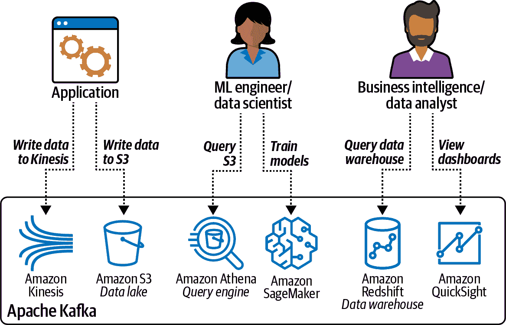
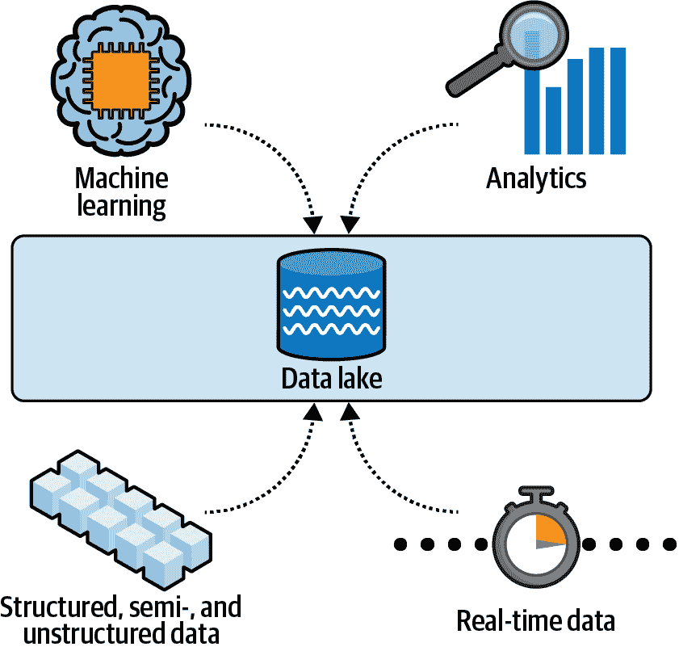
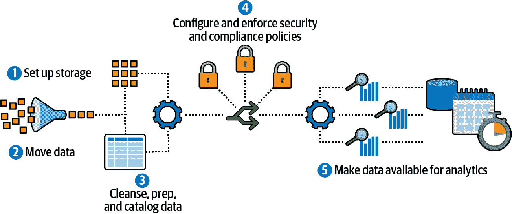
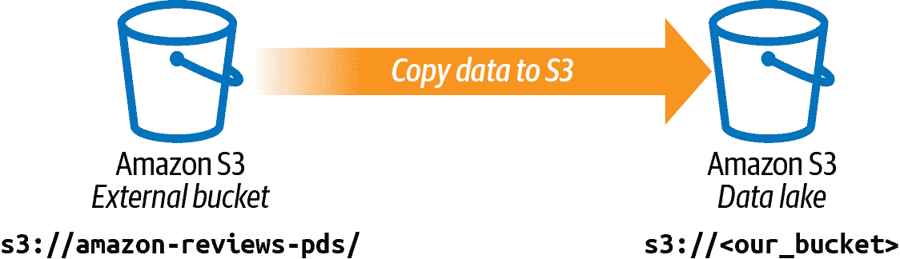
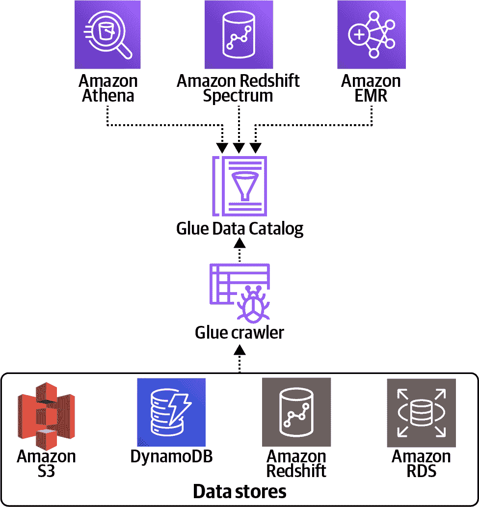
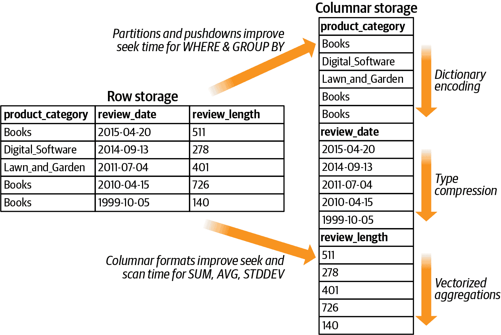

# 第四章：将数据引入云中

在本章中，我们将展示如何将数据引入云中。为此，我们将查看一个典型的场景，即应用程序将文件写入亚马逊 S3 数据湖，然后由 ML 工程师/数据科学团队以及商业智能/数据分析团队访问，如图 4-1 所示。



###### 图 4-1\. 一个应用程序将数据写入我们的 S3 数据湖，供数据科学、机器学习工程和商业智能团队使用。

亚马逊简单存储服务（Amazon S3）是一种完全托管的对象存储，具有极高的耐久性、高可用性和无限的数据可伸缩性，成本非常低廉。因此，它是构建数据湖、训练数据集和模型的理想基础。在接下来的章节中，我们将更多地了解在亚马逊 S3 上构建数据湖的优势。

让我们假设我们的应用程序持续捕获数据（例如网站上的客户互动、产品评论消息），并将数据以制表符分隔值（TSV）文件格式写入 S3。

作为数据科学家或机器学习工程师，我们希望能够快速探索原始数据集。我们将介绍亚马逊 Athena，并展示如何利用 Athena 作为交互式查询服务来分析 S3 中的数据，使用标准 SQL 而无需移动数据。在第一步中，我们将在 Athena 中注册我们 S3 存储桶中的 TSV 数据，然后对数据集运行一些即席查询。我们还将展示如何轻松将 TSV 数据转换为更适合查询的列式文件格式 Apache Parquet。

我们的商业智能团队可能还希望在数据仓库中有一部分数据子集，然后可以使用标准 SQL 客户端进行转换和查询，以创建报告并可视化趋势。我们将介绍亚马逊 Redshift，一个完全托管的数据仓库服务，并展示如何将 TSV 数据插入亚马逊 Redshift，以及如何通过亚马逊 Redshift Spectrum 将数据仓库查询与仍在我们 S3 数据湖中的不经常访问的数据结合起来。我们的商业智能团队还可以使用亚马逊 Redshift 的数据湖导出功能，将（转换、丰富的）数据以 Parquet 文件格式再次卸载到我们的 S3 数据湖中。

我们将以一些关于使用压缩算法增加性能和利用 S3 智能分层降低成本的技巧和窍门来结束本章。在第十二章中，我们将深入探讨保护数据集、跟踪数据访问、数据静态加密和数据传输加密。

# 数据湖

在第三章中，我们讨论了人工智能和数据科学在过去几年中的民主化、数据的爆炸增长，以及云服务如何提供基础设施的灵活性来存储和处理任意量的数据。

然而，为了有效利用所有这些数据，公司需要打破现有的数据孤岛，并找到分析非常多样化数据集的方法，处理结构化和非结构化数据，同时确保符合数据治理、数据安全和隐私法规的最高标准。这些（大）数据挑战为数据湖奠定了基础。

数据湖最大的优势之一是我们无需预定义任何模式。我们可以按规模存储原始数据，然后稍后决定需要以哪些方式处理和分析它。数据湖可以包含结构化、半结构化和非结构化数据。图 4-2 显示了集中且安全的数据湖仓库，使我们能够以任意规模（甚至实时）存储、治理、发现和共享数据。



###### 图 4-2\. 数据湖是一个集中且安全的仓库，使我们能够以任意规模存储、治理、发现和共享数据。

数据湖为数据科学和机器学习提供了完美的基础，因为它们使我们能够访问大量丰富多样的数据集，从而训练和部署更加精确的模型。构建数据湖通常包括以下（高级别）步骤，如图 4-3 所示：

1.  设置存储。

1.  移动数据。

1.  清洗、准备和编目数据。

1.  配置和执行安全和合规策略。

1.  使数据可用于分析。

每个步骤涉及一系列工具和技术。虽然我们可以从零开始手动构建数据湖，但云服务可帮助我们简化此过程，例如 AWS Lake Formation。



###### 图 4-3\. 构建数据湖涉及许多步骤。

[Lake Formation](https://oreil.ly/5HBtg)从数据库和对象存储中收集和编目数据，将数据移入基于 S3 的数据湖，保障对敏感数据的访问，并利用机器学习去重数据。

Lake Formation 的附加功能包括行级安全性、列级安全性和支持原子、一致、隔离和持久事务的“治理”表。通过行级和列级权限，用户只能看到他们有权限访问的数据。使用 Lake Formation 事务，用户可以并发和可靠地在治理表中插入、删除和修改行。Lake Formation 还通过自动压缩数据存储和优化治理表的数据布局来提高查询性能。

S3 已成为数据湖的热门选择，因为它提供了多种方式来摄取我们的数据，并通过智能数据分层（包括冷存储和存档能力）实现成本优化。S3 还为安全和合规性提供了许多对象级别的控制。

在 S3 数据湖之上，AWS 实施了 Lake House 架构。Lake House 架构将我们的 S3 数据湖与 Amazon Redshift 数据仓库集成，形成统一的治理模型。在本章中，当我们运行跨 Amazon Redshift 数据仓库和 S3 数据湖的数据联接查询时，我们将看到这种架构的一个示例。

从数据分析的角度来看，将数据存储在亚马逊 S3 中的另一个关键好处是显著缩短了“洞察时间”，因为我们可以直接在 S3 中对数据运行特定查询。我们不需要通过复杂的转换流程和数据管道将数据导入传统的企业数据仓库，正如我们将在本章后面的部分中看到的那样。

## 将数据导入 S3 数据湖

现在我们已经准备好将数据导入 S3 了。我们选择了[亚马逊客户评论数据集](https://oreil.ly/jvgLz)作为本书的主要数据集。

亚马逊客户评论数据集包含了从 1995 年到 2015 年在亚马逊网站上涵盖 43 个不同产品类别的 1.5 亿多条客户评论。它是展示诸如自然语言处理（NLP）等机器学习概念的重要资源，正如本书中我们所展示的那样。

许多人在考虑是否通过亚马逊市场购买产品时，都看过亚马逊网站上的客户评论。图 4-4 显示了亚马逊 Echo Dot 设备的产品评论部分。


###### 图 4-4。亚马逊 Echo Dot 设备的评论。来源：Amazon.com。

## 描述数据集

客户评论是亚马逊对于希望做出明智购买决策的客户而言最宝贵的工具之一。在亚马逊的年度股东信中，亚马逊创始人杰夫·贝索斯经常详细阐述了“口碑”的重要性作为客户获取工具。“杰夫热爱‘客户的持续不满’，正如他所称：

> “现在我们为客户提供…更多的评论、内容、浏览选项和推荐功能…口碑仍然是我们拥有的最强大的客户获取工具，我们感谢客户对我们的信任。重复购买和口碑的结合使得亚马逊成为在线图书销售的市场领导者。”
> 
> —杰夫·贝索斯，[1997 年股东（“股东”）信](https://oreil.ly/mj8M0)

这是数据集的架构：

marketplace

两位字母国家代码（在本例中全部为“US”）。

customer_id

可用于汇总由单个作者撰写的评论的随机标识符。

review_id

评论的唯一 ID。

product_id

亚马逊标准识别号（ASIN）。

product_parent

该 ASIN 的父级。多个 ASIN（同一产品的颜色或格式变体）可以汇总为一个产品父级。

product_title

产品的标题描述。

product_category

可以用来分组评论的广泛产品类别。

星级评分

对评论的评分为 1 到 5 星，其中 1 是最差，5 是最好。

有用票数

评论有用票数。

总票数

评论接收到的总票数。

Vine

评论是否作为 Vine 计划的一部分撰写？

经过验证的购买

评论是否来自经过验证的购买？

评论标题

评论本身的标题。

评论正文

评论的标题。

评论日期

评论撰写日期。

数据集在公共亚马逊 S3 存储桶中共享，并提供两种文件格式：

+   TSV，文本格式：*s3://amazon-reviews-pds/tsv*

+   Parquet，一种优化的列式二进制格式：*s3://amazon-reviews-pds/parquet*

Parquet 数据集按 `product_category` 列进行分区（分成子文件夹），以进一步提高查询性能。通过这种方式，我们可以在 SQL 查询中使用 `WHERE` 子句来只读取特定类别的数据。

我们可以使用 AWS 命令行界面（AWS CLI）来列出 S3 存储桶内容，具体命令如下：

+   `aws s3 ls s3://amazon-reviews-pds/tsv`

+   `aws s3 ls s3://amazon-reviews-pds/parquet`

###### 注意

AWS CLI 工具提供了统一的命令行界面，用于 Amazon Web Services。我们可以在 [如何安装和配置该工具](https://aws.amazon.com/cli) 找到更多信息。

以下列表显示了 TSV 格式和 Parquet 分区文件夹结构中的可用数据集文件。

TSV 格式的数据集文件：

```
2017-11-24 13:49:53  648641286 amazon_reviews_us_Apparel_v1_00.tsv.gz
2017-11-24 13:56:36  582145299 amazon_reviews_us_Automotive_v1_00.tsv.gz
2017-11-24 14:04:02  357392893 amazon_reviews_us_Baby_v1_00.tsv.gz
2017-11-24 14:08:11  914070021 amazon_reviews_us_Beauty_v1_00.tsv.gz
2017-11-24 14:17:41 2740337188 amazon_reviews_us_Books_v1_00.tsv.gz
2017-11-24 14:45:50 2692708591 amazon_reviews_us_Books_v1_01.tsv.gz
2017-11-24 15:10:21 1329539135 amazon_reviews_us_Books_v1_02.tsv.gz
...
2017-11-25 08:39:15   94010685 amazon_reviews_us_Software_v1_00.tsv.gz
2017-11-27 10:36:58  872478735 amazon_reviews_us_Sports_v1_00.tsv.gz
2017-11-25 08:52:11  333782939 amazon_reviews_us_Tools_v1_00.tsv.gz
2017-11-25 09:06:08  838451398 amazon_reviews_us_Toys_v1_00.tsv.gz
2017-11-25 09:42:13 1512355451 amazon_reviews_us_Video_DVD_v1_00.tsv.gz
2017-11-25 10:50:22  475199894 amazon_reviews_us_Video_Games_v1_00.tsv.gz
2017-11-25 11:07:59  138929896 amazon_reviews_us_Video_v1_00.tsv.gz
2017-11-25 11:14:07  162973819 amazon_reviews_us_Watches_v1_00.tsv.gz
2017-11-26 15:24:07 1704713674 amazon_reviews_us_Wireless_v1_00.tsv.gz
```

Parquet 格式的数据集文件：

```
PRE product_category=Apparel/
                           PRE product_category=Automotive/
                           PRE product_category=Baby/
                           PRE product_category=Beauty/
                           PRE product_category=Books/
                          ...
                           PRE product_category=Watches/
                           PRE product_category=Wireless/
```

请注意，`PRE` 代表“前缀”。目前，我们可以将前缀视为 S3 中的文件夹。

在查询中有时使用 `EXPLAIN` 是很有用的，以确保 S3 分区被充分利用。例如，Spark 将突出显示在 Spark SQL 中使用的分区。如果我们的查询模式随时间改变，可能需要重新审视更新现有分区——甚至添加新分区以满足业务需求。

那么我们应该选择哪种数据格式呢？Parquet 列式文件格式在运行分析查询时绝对是首选，因为许多分析查询在数据列上执行汇总统计（`AVG`、`SUM`、`STDDEV` 等）。另一方面，许多应用程序将数据写入简单的 CSV 或 TSV 文件中，例如应用程序日志文件。因此，我们假设暂时没有准备好使用 Parquet 文件，这样可以展示如何从 CSV 或 TSV 文件轻松转换到 Parquet 文件。

首先，让我们将来自亚马逊公共 S3 存储桶的 TSV 数据复制到私人托管的 S3 存储桶中，以模拟该过程，如 图 4-5 所示。



###### 图 4-5\. 我们将数据集从公共 S3 存储桶复制到私有 S3 存储桶。

我们可以再次使用 AWS CLI 工具执行以下步骤。

1.  创建新的私有 S3 存储桶：

    `aws s3 mb s3://data-science-on-aws`

1.  将公共 S3 存储桶的内容复制到我们新创建的私有 S3 存储桶，操作如下（仅包括以`amazon_reviews_us_`开头的文件，即跳过该目录中的任何索引、多语言和样本数据文件）：

    ```
    aws s3 cp --recursive s3://amazon-reviews-pds/tsv/ \
    	s3://data-science-on-aws/amazon-reviews-pds/tsv/ \
    	--exclude "*" --include "amazon_reviews_us_*"
    ```

现在我们可以使用 Amazon Athena 注册和查询数据，并将 TSV 文件转换为 Parquet。

# 使用 Amazon Athena 查询 Amazon S3 数据湖

Amazon Athena 是一个交互式查询服务，可以使用标准 SQL 轻松分析 Amazon S3 中的数据。通过 Athena，我们可以直接从基于 S3 的数据湖中查询原始数据，包括加密数据。Athena 将计算与存储分离，并降低我们业务的整体洞察时间。当我们使用 Athena 将 Athena 表注册到我们的 S3 数据时，Athena 存储表与 S3 映射。Athena 使用 AWS Glue 数据目录作为 Hive Metastore 兼容的服务来存储表与 S3 的映射。我们可以将 AWS Glue 数据目录视为 AWS 帐户中的持久性元数据存储。其他 AWS 服务，如 Athena 和 Amazon Redshift Spectrum，可以使用数据目录定位和查询数据。Apache Spark 也可以从 AWS Glue 数据目录中读取数据。

除了数据目录外，AWS Glue 还提供了构建 ETL（抽取-转换-加载）工作流的工具。ETL 工作流可能包括从不同来源自动发现和提取数据。我们可以利用 Glue Studio 在可视化环境中组合和运行 ETL 工作流，而无需编写代码。Glue Studio 还提供了监视所有 ETL 作业的单一窗口。AWS Glue 在基于 Apache Spark 的无服务器 ETL 引擎上执行工作流。

Athena 查询在一个动态缩放、无服务器查询引擎内并行运行。Athena 会根据所涉及的查询和数据集自动扩展集群。这使得 Athena 在处理大数据集时非常快速，并且使用户不必担心基础设施的细节。

此外，Athena 支持 Parquet 列式文件格式，并支持数千万个分区（例如按`product_category`、`year`或`marketplace`）。以提高查询性能。例如，如果我们计划频繁查询并按`product_category`分组结果，则应在 Athena 中为`product_category`创建一个分区。创建后，Athena 将相应更新 AWS Glue 数据目录，以便将来的查询可以继承这个新分区的性能优势。

Athena 基于 Presto，这是一个开源的分布式 SQL 查询引擎，专为在大数据集上进行快速、即席数据分析而设计。类似于 Apache Spark，[Presto](https://oreil.ly/WKcDS) 使用高 RAM 集群执行查询。但 Presto 不需要大量磁盘，因为它设计用于即席查询（而不是自动化、可重复的查询），因此不执行需要容错的检查点操作。

对于运行时间较长的 Athena 作业，我们可以使用 Amazon CloudWatch Events 监听查询完成事件。查询完成后，所有监听器都会收到事件详细信息，包括查询成功状态、总执行时间和扫描的总字节数。

使用名为 *Athena Federated Query* 的功能，我们还可以在存储在关系数据库（例如 Amazon RDS 和 Aurora）、非关系数据库（例如 DynamoDB）、对象存储（例如 Amazon S3）以及自定义数据源中的数据上运行 SQL 查询。这使我们可以在不实际移动数据的情况下，通过统一的分析视图访问我们的数据仓库、数据湖和操作数据库中存储的数据。

我们可以通过 AWS 管理控制台、API，或者通过 Open Database Connectivity (ODBC) 或 Java Database Connectivity (JDBC) 驱动程序进行编程访问 Athena。让我们看看如何通过 AWS 管理控制台使用 Amazon Athena。

## 从 AWS 控制台访问 Athena

要使用 Amazon Athena，我们首先需要快速设置该服务。首先，在 AWS 管理控制台中点击 Amazon Athena。如果我们被要求为 Athena 在 S3 中的“查询结果”位置设置位置，请指定一个 S3 位置作为查询结果的位置（例如 *s3://<BUCKET>/data-science-on-aws/athena/query-results*）。

在下一步中，我们创建一个数据库。在 Athena 查询编辑器中，我们看到一个带有示例查询的查询面板。我们可以在查询面板的任何位置开始输入我们的查询。要创建我们的数据库，请输入以下`CREATE DATABASE`语句，运行查询，并确认`dsoaws`出现在目录仪表板的数据库列表中：

```
CREATE DATABASE dsoaws;
```

当我们在 Athena 中使用 AWS Glue 数据目录作为源运行 `CREATE DATABASE` 和 `CREATE TABLE` 查询时，我们会自动看到在 AWS Glue 数据目录中创建的数据库和表元数据条目。

## 注册 S3 数据作为 Athena 表

现在我们有了一个数据库，可以基于亚马逊客户评论数据集创建表。我们定义映射到数据的列，指定数据的分隔方式，并提供数据的 Amazon S3 路径。

让我们定义一个“基于读取的模式”，避免在数据写入和摄入时需要预定义严格的模式。在 Athena 控制台中，确保选择了`dsoaws`作为数据库，然后选择新查询。运行以下 SQL 语句来读取压缩（`compression=gzip`）文件，并跳过每个文件顶部的 CSV 标头（`skip.header.line.count=1`）。运行 SQL 语句后，请验证新创建的表`amazon_reviews_tsv`在左侧的表下是否出现：

```
CREATE EXTERNAL TABLE IF NOT EXISTS dsoaws.amazon_reviews_tsv(
         marketplace string,
         customer_id string,
         review_id string,
         product_id string,
         product_parent string,
         product_title string,
         product_category string,
         star_rating int,
         helpful_votes int,
         total_votes int,
         vine string,
         verified_purchase string,
         review_headline string,
         review_body string,
         review_date string 
) ROW FORMAT DELIMITED FIELDS TERMINATED BY '\t' 
LINES TERMINATED BY '\n' 
LOCATION 's3://data-science-on-aws/amazon-reviews-pds/tsv'
TBLPROPERTIES ('compressionType'='gzip', 'skip.header.line.count'='1')
```

让我们运行一个示例查询，以检查一切是否正常工作。此查询将生成如下表格中显示的结果：

```
SELECT *
FROM dsoaws.amazon_reviews_tsv
WHERE product_category = 'Digital_Video_Download' LIMIT 10
```

| marketplace | customer_id | review_id | product_id | product_title | product_category |
| --- | --- | --- | --- | --- | --- |
| US | 12190288 | R3FBDHSJD | BOOAYB23D | Enlightened | Digital_Video_Download |
| ... | ... | ... | ... | ... | ... |

## 使用 AWS Glue Crawler 更新 Athena 表以处理新数据到达

以下代码每天在 UTC 时间 23:59 自动爬取 S3，并在新数据到达时更新 Athena 表。例如，如果我们向 S3 添加另一个 *.tar.gz* 文件，我们将在爬虫完成预定运行后在 Athena 查询中看到新数据：

```
glue = boto3.Session().client(service_name='glue', region_name=region)

create_response = glue.create_crawler(
    Name='amazon_reviews_crawler',
    Role=role,
    DatabaseName='dsoaws',
    Description='Amazon Customer Reviews Dataset Crawler',
    Targets={
        'CatalogTargets': [
            {
                'DatabaseName': 'dsoaws',
                'Tables': [
                    'amazon_reviews_tsv',
                ]
            }
        ]
    },
    Schedule='cron(59 23 * * ? *)', # run every night at 23:59 UTC
     SchemaChangePolicy={
         'DeleteBehavior': 'LOG'
     },
     RecrawlPolicy={
         'RecrawlBehavior': 'CRAWL_EVERYTHING'
     }
)
```

## 在 Athena 中创建基于 Parquet 的表

接下来，我们将展示如何轻松地将数据转换为 Apache Parquet 列式文件格式以提高查询性能。Parquet 针对基于列的查询进行了优化，如计数、求和、平均值和其他基于列的汇总统计，重点放在列值而不是行信息上。

通过以列式格式存储我们的数据，Parquet 可以执行针对列的顺序读取以进行列式汇总统计。这使得数据访问更加高效，并且在性能上表现更好，与磁盘控制器从行到行跳转并重新查找以检索列数据相比，有着“机械同情心”。如果我们进行任何类型的大规模数据分析，我们应该使用像 Parquet 这样的列式文件格式。我们在性能部分讨论了 Parquet 的好处。

###### 注意

尽管我们已经从公共数据集中以 Parquet 格式获取了数据，但我们认为创建一个 Parquet 表是一个足够重要的主题，可以在本书中进行演示。

再次确保选择 DATABASE 中的`dsoaws`，然后选择 New Query 并运行以下 CREATE TABLE AS (CTAS) SQL 语句：

```
CREATE TABLE IF NOT EXISTS dsoaws.amazon_reviews_parquet
WITH (format = 'PARQUET', \
        external_location = 's3://<BUCKET>/amazon-reviews-pds/parquet', \
        partitioned_by = ARRAY['product_category']) AS

SELECT marketplace,
         customer_id,
         review_id,
         product_id,
         product_parent,
         product_title,
         star_rating,
         helpful_votes,
         total_votes,
         vine,
         verified_purchase,
         review_headline,
         review_body,
         CAST(YEAR(DATE(review_date)) AS INTEGER) AS year,
         DATE(review_date) AS review_date,
         product_category

FROM dsoaws.amazon_reviews_tsv
```

如查询所示，我们还通过将`review_date`字符串转换为日期格式，然后将年份从日期中提取，向我们的数据集添加了一个新的`year`列。让我们将年份值存储为整数。运行完 CTAS 查询后，我们现在应该可以在左侧的表下看到新创建的`amazon_reviews_parquet`表。作为最后一步，我们需要加载 Parquet 分区。为此，只需执行以下 SQL 命令：

```
MSCK REPAIR TABLE amazon_reviews_parquet;
```

###### 注意

我们可以自动化执行`MSCK REPAIR TABLE`命令，以在从任何工作流管理器中获取数据后加载分区（或使用 Lambda 函数，当新数据上传到 S3 时运行）。

我们可以再次运行我们的示例查询来检查一切是否正常：

```
SELECT *
FROM dsoaws.amazon_reviews_parquet
WHERE product_category = 'Digital_Video_Download' LIMIT 10
```

两个表还在 Hive Metastore 兼容的 AWS Glue 数据目录中有元数据条目。这些元数据定义了许多查询和数据处理引擎（如 Amazon EMR、Athena、Redshift、Kinesis、SageMaker 和 Apache Spark）使用的模式。

只需几个步骤，我们就设置了 Amazon Athena，将 TSV 数据集文件转换为 Apache Parquet 文件格式。与对 TSV 文件的查询相比，Parquet 文件的查询时间大大缩短。通过利用列式 Parquet 文件格式和`product_category`分区方案，我们加快了查询响应时间。

# 使用 AWS Glue Crawler 持续摄取新数据

应用程序始终在传送新数据，我们需要一种方法将这些新数据注册到我们的系统中进行分析和模型训练。AWS Glue 提供复杂的数据清洗和机器学习转换，包括“模糊”记录去重。将新数据从 S3 注册到我们的 AWS Glue 数据目录的一种方式是使用 Glue 爬虫，如 图 4-6 所示。



###### 图 4-6\. 使用 AWS Glue 爬虫从各种数据源摄取和注册数据。

我们可以按计划定期触发爬虫，也可以使用例如 S3 触发器。以下代码创建爬虫，并安排每天晚上 23:59 UTC 注入新的 S3 文件夹（前缀）：

```
create_response = glue.create_crawler(
    Name='amazon_reviews_crawler',
    Role=role,
    DatabaseName='dsoaws',
    Description='Amazon Customer Reviews Dataset Crawler',
    Targets={
        'CatalogTargets': [
            {
                'DatabaseName': 'dsoaws',
                'Tables': [
                    'amazon_reviews_tsv',
                ]
            }
        ]
    },
    Schedule='cron(59 23 * * ? *)',
     SchemaChangePolicy={
         'DeleteBehavior': 'LOG'
     },
     RecrawlPolicy={
         'RecrawlBehavior': 'CRAWL_NEW_FOLDERS_ONLY'
     }
)
```

假设我们正在将新数据存储在新文件夹中。通常，我们使用包括年、月、日、小时、刻钟等信息的 S3 前缀。例如，我们可以使用以下 S3 前缀命名约定将应用程序日志存储在每小时的 S3 文件夹中：*s3://<S3_BUCKET>/<YEAR>/<MONTH>/<DAY>/<HOUR>/*。如果我们希望爬行所有数据，可以使用 `CRAWL_EVERYTHING` 作为我们的 `RecrawlBehavior`。我们可以使用不同的 `cron()` 触发器更改计划。我们还可以添加第二个触发器，在调度的 Glue 爬虫达到 `SUCCEEDED` 状态时启动 ETL 作业以转换和加载新数据。

# 使用亚马逊 Redshift Spectrum 构建数据湖

数据湖和数据仓库之间的一个基本区别在于，虽然我们在数据湖中摄取和存储大量原始未加工的数据，但通常只将最近数据的一部分加载到数据仓库中。根据我们的业务和分析用例，这可能是过去几个月、一年或最近两年的数据。假设我们想在数据仓库中分析亚马逊客户评论数据集的过去两年数据以分析年度客户行为和评论趋势，我们将使用亚马逊 Redshift 作为我们的数据仓库。

亚马逊 Redshift 是一个完全托管的数据仓库，允许我们针对千兆字节的结构化数据、半结构化数据和 JSON 数据运行复杂的分析查询。我们的查询分布和并行化在多个节点上执行。与关系数据库相比，后者优化了按行存储数据，并主要用于事务应用程序；亚马逊 Redshift 实施了列存储，这对于分析应用程序而言更为优化，因为我们主要关注的是单个列内的数据。

Amazon Redshift 还包括 Amazon Redshift Spectrum，允许我们直接从 Amazon Redshift 针对 S3 数据湖中的数百亿字节的非结构化数据执行 SQL 查询，而无需实际移动数据。Amazon Redshift Spectrum 是 Lake House Architecture 的一部分，统一了我们的 S3 数据湖和 Amazon Redshift 数据仓库，包括共享安全性和基于行和列的访问控制。Amazon Redshift Spectrum 支持各种开源存储框架，包括 Apache Hudi 和 Delta Lake。

由于 Amazon Redshift Spectrum 根据检索的数据量自动扩展所需的计算资源，因此针对 Amazon S3 的查询速度很快，而不管数据大小如何。Amazon Redshift Spectrum 将使用推送过滤器、布隆过滤器和物化视图来减少搜索时间，并提高对 S3 等外部数据存储的查询性能。我们稍后在“降低成本并提高性能”中讨论更多性能提示。

Amazon Redshift Spectrum 通过在加载到 Amazon Redshift 后转换和清理数据，将传统的 ETL 转换为提取-加载-转换（ELT）。我们将使用 Amazon Redshift Spectrum 访问我们在 S3 中的数据，然后展示如何将存储在 Amazon Redshift 中的数据与仍在 S3 中的数据结合起来。

这听起来可能与我们早些时候展示的 Amazon Athena 的方法相似，但请注意，在这种情况下，我们展示了我们的业务智能团队如何在其查询中使用未存储在数据仓库本身中的数据进行丰富。一旦我们设置和配置了 Redshift 集群，我们可以导航到 AWS 控制台和 Amazon Redshift，然后点击查询编辑器来执行命令。

我们可以利用在 AWS Glue Data Catalog 中存储的 Amazon Athena 的表格及其元数据和模式信息来通过 Amazon Redshift Spectrum 访问我们在 S3 中的数据。我们所需做的就是在 Amazon Redshift 中创建一个外部模式，将其指向 AWS Glue Data Catalog，并指向我们创建的数据库。

在 Amazon Redshift 查询编辑器（或通过我们可能更喜欢使用的任何其他 ODBC/JDBC SQL 客户端）中执行以下命令：

```
CREATE EXTERNAL SCHEMA IF NOT EXISTS athena FROM DATA CATALOG 
    DATABASE 'dsoaws' 
    IAM_ROLE '<IAM-ROLE>'
    CREATE EXTERNAL DATABASE IF NOT EXISTS
```

使用此命令，我们在 Amazon Redshift 中创建一个名为`athena`的新模式，以突出我们通过 Amazon Athena 设置的表格中的数据访问：

+   `FROM DATA CATALOG`表示外部数据库在 AWS Glue Data Catalog 中定义。

+   `DATABASE`指的是在 AWS Glue Data Catalog 中之前创建的数据库。

+   `IAM_ROLE`需要指向用于集群身份验证和授权的 IAM 角色的 Amazon 资源名称（ARN）。

IAM 是 AWS 身份和访问管理服务，它使我们能够管理和控制访问我们帐户中的 AWS 服务和资源。通过 IAM 角色，我们可以指定用户或服务被授予的权限。在本例中，IAM 角色必须至少具有执行 Amazon S3 存储桶上的`LIST`操作和 Amazon S3 对象上的`GET`操作的权限。如果外部数据库在 Amazon Athena 数据目录中定义，IAM 角色必须具有访问 Athena 的权限，除非指定了`CATALOG_ROLE`。在本章后面的部分中，当我们讨论如何保护我们的数据时，我们将详细介绍 IAM。

如果我们现在在 Amazon Redshift 查询编辑器的模式下拉菜单中选择`athena`，我们可以看到我们使用 Amazon Athena 创建的两个表，`amazon_reviews_tsv`和`amazon_reviews_parquet`。让我们再次运行一个示例查询来确保一切正常。在查询编辑器中，运行以下命令：

```
SELECT
    product_category,
    COUNT(star_rating) AS count_star_rating     
FROM
    athena.amazon_reviews_tsv     
GROUP BY
    product_category     
ORDER BY
    count_star_rating DESC
```

我们应该看到类似下表的结果：

| product_category | count_star_rating |
| --- | --- |
| Books | 19531329 |
| Digital_Ebook_Purchase | 17622415 |
| Wireless | 9002021 |
| ... | ... |

所以，只需一条命令，我们现在可以访问并从 Amazon Redshift 中的 S3 数据湖查询数据，而无需将任何数据移动到我们的数据仓库中。这就是 Amazon Redshift Spectrum 的威力。

现在，让我们实际从 S3 复制一些数据到 Amazon Redshift。让我们拉取 2015 年的客户评论数据。

首先，我们使用以下 SQL 命令创建另一个 Amazon Redshift 模式称为`redshift`：

```
CREATE SCHEMA IF NOT EXISTS redshift
```

接下来，我们将创建一个新的表来表示我们的客户评论数据。我们还将添加一个新列，并将`year`添加到我们的表中：

```
        CREATE TABLE IF NOT EXISTS redshift.amazon_reviews_tsv_2015( 
             marketplace varchar(2) ENCODE zstd,
             customer_id varchar(8) ENCODE zstd,
             review_id varchar(14) ENCODE zstd,
             product_id varchar(10) ENCODE zstd DISTKEY,
             product_parent varchar(10) ENCODE zstd,
             product_title varchar(400) ENCODE zstd,
             product_category varchar(24) ENCODE raw,
             star_rating int ENCODE az64,
             helpful_votes int ENCODE zstd,
             total_votes int ENCODE zstd,
             vine varchar(1) ENCODE zstd,
             verified_purchase varchar(1) ENCODE zstd,
             review_headline varchar(128) ENCODE zstd,
             review_body varchar(65535) ENCODE zstd,
             review_date varchar(10) ENCODE bytedict,
             year int ENCODE az64)  SORTKEY (product_category)
```

在性能部分，我们将深入探讨`SORTKEY`、`DISTKEY`和`ENCODE`属性。现在，让我们从 S3 复制数据到我们的新 Amazon Redshift 表，并运行一些示例查询。

对于这样的批量插入，我们可以使用`COPY`命令或`INSERT INTO`命令。一般来说，`COPY`命令更受青睐，因为它可以并行加载数据，效率更高，可以从 Amazon S3 或其他支持的数据源加载数据。

如果我们从一个表加载数据或数据子集到另一个表中，我们可以使用`INSERT INTO`命令和带有`SELECT`子句的高性能数据插入。因为我们正在从`athena.amazon_reviews_tsv`表加载数据，所以让我们选择这个选项：

```
INSERT              
INTO
    redshift.amazon_reviews_tsv_2015
    SELECT
        marketplace,
        customer_id,
        review_id,
        product_id,
        product_parent,
        product_title,
        product_category,
        star_rating,
        helpful_votes,
        total_votes,
        vine,
        verified_purchase,
        review_headline,
        review_body,
        review_date,
        CAST(DATE_PART_YEAR(TO_DATE(review_date,
        'YYYY-MM-DD')) AS INTEGER) AS year                              
    FROM
        athena.amazon_reviews_tsv                              
    WHERE
        year = 2015
```

我们使用日期转换来从我们的`review_date`列中解析年份，并将其存储在一个单独的`year`列中，然后我们使用它来过滤 2015 年的记录。这是一个简化 ETL 任务的示例，因为我们将数据转换逻辑直接放在`SELECT`查询中，并将结果摄入到 Amazon Redshift 中。

另一种优化表格的方法是将它们创建为一系列时间序列表，特别是当我们的数据具有固定的保留期限时。假设我们希望将最近两年（24 个月）的数据存储在我们的数据仓库中，并每月更新新数据。

如果我们每月创建一个表格，我们可以通过在相应的表格上运行`DROP TABLE`命令轻松删除旧数据。这种方法比运行大规模的`DELETE`流程要快得多，并且还能避免运行后续的`VACUUM`过程以回收空间和重新排序行。

要跨表合并查询结果，我们可以使用`UNION ALL`视图。类似地，当我们需要删除旧数据时，我们从`UNION ALL`视图中删除已丢弃的表。

这是一个跨两个表格进行`UNION ALL`视图的示例，涉及来自 2014 年和 2015 年的客户评论数据。以下表格显示了查询结果：

```
SELECT
    product_category,
    COUNT(star_rating) AS count_star_rating,
    year 
FROM
    redshift.amazon_reviews_tsv_2014 
GROUP BY
    redshift.amazon_reviews_tsv_2014.product_category,
    year 
UNION
ALL SELECT
    product_category,
    COUNT(star_rating) AS count_star_rating,
    year 
FROM
    redshift.amazon_reviews_tsv_2015 
GROUP BY
    redshift.amazon_reviews_tsv_2015.product_category,
    year 
ORDER BY
    count_star_rating DESC,
    year ASC
```

| 产品类别 | 评分计数 | 年份 |
| --- | --- | --- |
| 数字电子书购买 | 6615914 | 2014 |
| 数字电子书购买 | 4533519 | 2015 |
| 图书 | 3472631 | 2014 |
| 无线 | 2998518 | 2015 |
| 无线 | 2830482 | 2014 |
| 图书 | 2808751 | 2015 |
| 服装 | 2369754 | 2015 |
| 家居 | 2172297 | 2015 |
| 服装 | 2122455 | 2014 |
| 家居 | 1999452 | 2014 |

现在，让我们实际运行一个查询，并将 Amazon Redshift 的数据与仍然存储在 S3 中的数据进行合并。让我们使用以下命令从之前查询的数据获取 2015 年和 2014 年的数据，并查询 Athena/S3 中的 2013 年至 1995 年的数据：

```
SELECT
    year,
    product_category,
    COUNT(star_rating) AS count_star_rating   
FROM
    redshift.amazon_reviews_tsv_2015   
GROUP BY
    redshift.amazon_reviews_tsv_2015.product_category,
    year 
UNION
ALL SELECT
    year,
    product_category,
    COUNT(star_rating) AS count_star_rating   
FROM
    redshift.amazon_reviews_tsv_2014   
GROUP BY
    redshift.amazon_reviews_tsv_2014.product_category,
    year 
UNION
ALL SELECT
    CAST(DATE_PART_YEAR(TO_DATE(review_date,
    'YYYY-MM-DD')) AS INTEGER) AS year,
    product_category,
    COUNT(star_rating) AS count_star_rating   
FROM
    athena.amazon_reviews_tsv   
WHERE
    year <= 2013   
GROUP BY
    athena.amazon_reviews_tsv.product_category,
    year 
ORDER BY
    product_category ASC,
    year DESC
```

| 年份 | 产品类别 | 评分计数 |
| --- | --- | --- |
| 2015 | 服装 | 4739508 |
| 2014 | 服装 | 4244910 |
| 2013 | 服装 | 854813 |
| 2012 | 服装 | 273694 |
| 2011 | 服装 | 109323 |
| 2010 | 服装 | 57332 |
| 2009 | 服装 | 42967 |
| 2008 | 服装 | 33761 |
| 2007 | 服装 | 25986 |
| 2006 | 服装 | 7293 |
| 2005 | 服装 | 3533 |
| 2004 | 服装 | 2357 |
| 2003 | 服装 | 2147 |
| 2002 | 服装 | 907 |
| 2001 | 服装 | 5 |
| 2000 | 服装 | 6 |
| 2015 | 汽车 | 2609750 |
| 2014 | 汽车 | 2350246 |

## 将 Amazon Redshift 数据导出到 S3 数据湖作为 Parquet

Amazon Redshift 数据湖导出使我们能够将 Amazon Redshift 查询的结果卸载到我们的 S3 数据湖中，以优化的 Apache Parquet 列式文件格式。这使我们能够将在 Amazon Redshift 中进行的任何数据转换和增强重新共享到我们的 S3 数据湖中，以开放格式存储。卸载的数据会自动在 AWS Glue 数据目录中注册，供任何 Hive Metastore 兼容的查询引擎使用，包括 Amazon Athena、EMR、Kinesis、SageMaker 和 Apache Spark。

我们可以指定一个或多个分区列，使得卸载的数据自动分区到 Amazon S3 存储桶中的文件夹中。例如，我们可以选择卸载我们的客户评论数据，并按`product_category`进行分区。

我们只需运行以下 SQL 命令，将我们的 2015 年客户评论数据以 Parquet 文件格式卸载到 S3 中，并按`product_category`分区：

```
UNLOAD (
   'SELECT marketplace, customer_id, review_id, product_id, product_parent, 
     product_title, product_category, star_rating, helpful_votes, total_votes, 
     vine, verified_purchase, review_headline, review_body, review_date, year 
     FROM redshift.amazon_reviews_tsv_2015') 
TO 's3://data-science-on-aws/amazon-reviews-pds/parquet-from-redshift/2015' 
IAM_ROLE '<IAM_ROLE>' 
PARQUET PARALLEL ON 
PARTITION BY (product_category)
```

我们可以再次使用 AWS CLI 工具列出 S3 文件夹，并查看我们以 Parquet 格式卸载的 2015 年数据：

```
aws s3 ls s3://data-science-on-aws/amazon-reviews-pds/parquet-from-redshift/2015
```

## 在亚马逊 Redshift 集群之间共享数据

亚马逊 Redshift 还实现了数据共享功能，允许我们在不移动数据的情况下安全地在亚马逊 Redshift 集群之间共享实时数据。相反，我们创建一个“数据共享”对象，指定要共享的数据以及被允许访问数据的亚马逊 Redshift 集群列表。在消费的亚马逊 Redshift 集群上，我们从数据共享对象创建一个新的数据库，并分配权限给相关的 IAM 用户和组，以管理对数据库的访问。数据共享功能在需要在多个业务单元之间共享数据或者希望从中央数据仓库集群向其他 BI 和分析集群共享数据时非常有用。

# 在亚马逊 Athena 和亚马逊 Redshift 之间做出选择

当在存储在亚马逊 S3 中的数据上运行即席 SQL 查询时，亚马逊 Athena 是首选。它不需要我们设置或管理任何基础设施资源——我们不需要移动任何数据。它支持结构化、非结构化和半结构化数据。使用 Athena，我们在“读时模式”下定义模式——基本上只需登录、创建表格并开始运行查询。

亚马逊 Redshift 针对 PB 级结构化数据的现代数据分析进行了优化。在这里，我们需要预定义的“写时模式”。与无服务器的 Athena 不同，亚马逊 Redshift 要求我们创建一个集群（计算和存储资源）、摄入数据并构建表格，然后才能开始查询，但能够满足性能和规模需求。因此，对于具有事务性特性的高度关系型数据（数据更新）、涉及复杂连接或需要次秒级响应时间的工作负载，亚马逊 Redshift 是正确的选择。

Athena 和亚马逊 Redshift 都专为读重型分析工作负载进行了优化；它们不适用于写重型的关系数据库，比如亚马逊关系数据库服务（RDS）和 Aurora。从高层次来看，使用 Athena 进行探索性分析和操作调试；使用亚马逊 Redshift 进行业务关键报告和仪表板。

# 减少成本并提高性能

在本节中，我们想提供一些有关在数据摄入期间减少成本和提高性能的技巧，包括文件格式、分区、压缩以及排序/分布键。我们还将演示如何使用亚马逊 S3 智能分层来降低存储成本。

## S3 智能分层

在本章中，我们介绍了亚马逊 S3 作为一种可扩展的、持久的存储服务，用于构建云中的共享数据集，比如数据湖。虽然在本书中我们将 S3 的使用保持相对简单，但实际上该服务为我们提供了多种选项来优化随着数据增长而增长的存储成本。

根据我们数据的访问频率模式和服务级别协议（SLA）需求，我们可以选择不同的 Amazon S3 存储类别。 表 4-1 比较了 Amazon S3 存储类别在数据访问频率和数据检索时间方面的差异。

表 4-1\. Amazon S3 存储类别比较

| 从频繁访问 | 到不经常访问 |
| --- | --- |
| S3 标准（默认存储类） | S3 智能分层 | S3 标准-IA | S3 单区域-IA | Amazon S3 冰川 | Amazon S3 冰川深度存档 |
| --- | --- | --- | --- | --- | --- |

| 通用存储活跃，频繁

访问数据

毫秒级访问 | 数据具有未知或变化的访问模式

毫秒级访问

自动选择

存档 | 不经常访问的（IA）数据

毫秒级访问 | 更低的耐久性（单可用区）可重建数据

毫秒级访问 | 存档数据分钟或小时级访问 | 长期存档数据小时级访问 |

但是我们如何知道要移动哪些对象？想象一下我们的 S3 数据湖随着时间的推移不断增长，我们可能在多个 S3 存储桶中拥有数十亿个对象，其中一些对象非常重要，而其他对象可能数月甚至数年未访问。这就是 S3 智能分层发挥作用的地方。

Amazon S3 智能分层通过在频繁访问数据优化层和低成本不经常访问数据优化层之间移动对象，自动优化我们的存储成本，适应变化的访问模式。智能分层监控我们的访问模式，并在粒度对象级别自动分层，没有性能影响或任何操作开销。

## Parquet 分区和压缩

Athena 支持 Parquet 列式格式用于大规模分析工作负载。Parquet 为我们的查询提供以下性能优化：

分区和下推

分区是在磁盘上物理数据的分组，以匹配我们的查询模式（例如`SELECT * FROM reviews WHERE product_category='Books'`）。现代查询引擎如 Athena、Amazon Redshift 和 Apache Spark 会将`WHERE`条件“下推”到物理存储系统，允许磁盘控制器仅需一次寻址即可扫描所有相关数据，而无需随机跳转到磁盘的不同区域。这提高了查询性能，即使使用固态硬盘（SSD），其寻址时间比传统的基于介质的硬盘低。

字典编码/压缩

当少量分类值一起存储在磁盘上（例如我们数据集中共有 43 个`product_category`值），这些值可以被压缩成少量比特来表示每个值（例如`Books`、`Lawn_and_Garden`、`Software`等），而不是存储整个字符串。

类型压缩

类似类型的值（例如 String、Date、Integer）在磁盘上存储在一起时，这些值可以一起压缩：(String, String), (Date, Date), (Integer, Integer)。这种压缩比将这些值以行方式分开存储在磁盘上更为高效：(String, Date, Integer), (String, Date, Integer)

矢量化聚合

因为列值在磁盘上存储在一起，磁盘控制器只需执行一个磁盘搜索来找到数据的起始位置。从那时起，它将扫描数据执行聚合操作。此外，现代芯片/处理器提供高性能的矢量化指令，以在大量数据上执行计算，而不是将数据刷新到各种数据缓存（L1、L2）或主内存中。

在 图 4-7 中看到行与列式数据格式的示例。



###### 图 4-7\. 使用 Parquet 等列式数据格式，我们可以对查询执行和数据编码应用各种性能优化。

## Amazon Redshift 表设计和压缩

这里是我们用来创建 Amazon Redshift 表的 `CREATE TABLE` 语句：

```
CREATE TABLE IF NOT EXISTS redshift.amazon_reviews_tsv_2015( 
             marketplace varchar(2) ENCODE zstd,
             customer_id varchar(8) ENCODE zstd,
             review_id varchar(14) ENCODE zstd,
             product_id varchar(10) ENCODE zstd DISTKEY,
             product_parent varchar(9) ENCODE zstd,
             product_title varchar(400) ENCODE zstd,
             product_category varchar(24) ENCODE raw,
             star_rating int ENCODE az64,
             helpful_votes int ENCODE zstd,
             total_votes int ENCODE zstd,
             vine varchar(1) ENCODE zstd,
             verified_purchase varchar(1) ENCODE zstd,
             review_headline varchar(128) ENCODE zstd,
             review_body varchar(65535) ENCODE zstd,
             review_date varchar(10) ENCODE bytedict,
             year int ENCODE az64)  SORTKEY (product_category)
```

当我们创建表时，可以指定一个或多个列作为 `SORTKEY`。Amazon Redshift 按照 `SORTKEY` 的顺序将数据存储在磁盘上，因此我们可以通过选择反映我们最常用查询类型的 `SORTKEY` 来优化表。如果我们频繁查询最近的数据，可以将时间戳列指定为 `SORTKEY`。如果我们经常基于一列上的范围或等值过滤进行查询，则应选择该列作为 `SORTKEY`。在下一章节我们将运行大量基于 `product_category` 进行过滤的查询，让我们将其选择为我们的 `SORTKEY`。

###### 提示

Amazon Redshift Advisor 持续推荐频繁查询的表使用 `SORTKEY`。Advisor 将生成一个 `ALTER TABLE` 命令，我们可以直接运行，而无需重新创建表——不影响并发读写查询。请注意，如果 Advisor 没有看到足够的数据（查询），或者收益相对较小，它将不会提供推荐。

我们还可以为每个表定义一个分布样式。当我们将数据加载到表中时，Amazon Redshift 根据表的分布样式将表的行分布到我们的集群节点中。当执行查询时，查询优化器根据需要将行重新分布到集群节点，以执行任何连接和聚合操作。因此，我们的目标应该是优化行分布，以最小化数据移动。我们可以选择三种分布样式中的一种：

`KEY` 分布

根据一列中的值分发行。

`ALL` 分布

将整个表的副本分发到每个节点。

`EVEN` 分布

行以循环轮换方式在所有节点之间分布，这是默认的分布样式。

对于我们的表，我们基于`product_id`选择了`KEY`分布，因为这一列具有高基数，显示均匀分布，并且可以用于与其他表进行连接。

在任何时候，我们都可以在我们的 Amazon Redshift 查询中使用`EXPLAIN`来确保`DISTKEY`和`SORTKEY`得到了利用。如果我们的查询模式随时间变化，我们可能需要重新审视更改这些键。

此外，我们为大多数列使用了压缩，以减少总体存储占用和降低成本。Table 4-2 分析了我们模式中每个 Amazon Redshift 列使用的压缩方式。

表 4-2。我们 Amazon Redshift 表中使用的压缩类型

| Column | Data type | Encoding | 解释 |
| --- | --- | --- | --- |
| marketplace | varchar(2) | zstd | 基数较低，对于更高的压缩开销来说太小了 |
| customer_id | varchar(8) | zstd | 高基数，重复值相对较少 |
| review_id | varchar(14) | zstd | 唯一，无限的基数，无重复值 |
| product_id | varchar(10) | zstd | 无限的基数，重复词汇数量相对较低 |
| product_parent | varchar(10) | zstd | 无限的基数，重复词汇数量相对较低 |
| product_title | varchar(400) | zstd | 无限的基数，重复词汇数量相对较低 |
| product_category | varchar(24) | raw | 基数较低，许多重复值，但第一个 SORT 键是 raw |
| star_rating | int | az64 | 基数较低，许多重复值 |
| helpful_votes | int | zstd | 基数较高 |
| total_votes | int | zstd | 基数相对较高 |
| vine | varchar(1) | zstd | 基数较低，对于更高的压缩开销来说太小了 |
| verified_purchase | varchar(1) | zstd | 基数较低，对于更高的压缩开销来说太小了 |
| review_headline | varchar(128) | zstd | 变长文本，高基数，重复词汇数量低 |
| review_body | varchar(65535) | zstd | 变长文本，高基数，重复词汇数量低 |
| review_date | varchar(10) | bytedict | 固定长度，基数相对较低，许多重复值 |
| year | int | az64 | 基数较低，许多重复值 |

###### 注意

尽管 AWS CEO Andy Jassy 坚持认为“没有经验的压缩算法”，但对于数据来说，却有压缩算法。压缩是处理不断增长的大数据世界的强大工具。所有现代大数据处理工具都支持压缩，包括 Amazon Athena、Redshift、Parquet、pandas 和 Apache Spark。对于诸如`varchar(1)`这样的小值使用压缩可能不会提高性能。然而，由于本地硬件支持，使用压缩几乎没有任何缺点。

`zstd` 是一种通用的压缩算法，适用于许多不同的数据类型和列大小。`star_rating` 和 `year` 字段设置为默认的 `az64` 编码，适用于大多数数值和日期字段。对于大多数列，通过为整数使用默认的 `az64` 编码和为文本等其他内容使用灵活的 `zstd` 编码，我们获得了快速的优势。

我们使用 `bytedict` 对 `review_date` 进行字典编码，以处理基于字符串的日期 `(YYYY-MM-DD)`。尽管它看似有大量唯一的值，实际上 `review_date` 只包含少量唯一值，因为在 20 年的时间跨度内只有大约 7300 天（每年 365 天 × 20 年）。这个基数很低，可以用几个比特捕获所有可能的日期，而不是对每个日期使用完整的 `varchar(10)`。

虽然 `product_category` 是 `bytedict` 字典编码的绝佳候选项，但它是我们的第一个（也是唯一一个，在这种情况下）`SORTKEY`。作为性能最佳实践，第一个 `SORTKEY` 不应该被压缩。

虽然 `marketplace`、`product_category`、`vine` 和 `verified_purchase` 看起来是 `bytedict` 的良好候选项，但它们太小，无法从额外的开销中受益。目前我们将它们保留为 `zstd`。

如果我们有一个现有的 Amazon Redshift 表需要优化，可以在 Amazon Redshift 中运行 `ANALYZE COMPRESSION` 命令，生成推荐的压缩编码报告如下：

```
ANALYZE COMPRESSION redshift.customer_reviews_tsv_2015
```

结果将如下表所示，展示如果切换到另一种编码方式，压缩改善的百分比：

| 列名 | 编码方式 | 估计的压缩率 (%) |
| --- | --- | --- |
| `marketplace` | `zstd` | 90.84 |
| `customer_id` | `zstd` | 38.88 |
| `review_id` | `zstd` | 36.56 |
| `product_id` | `zstd` | 44.15 |
| `product_parent` | `zstd` | 44.03 |
| `product_title` | `zstd` | 30.72 |
| `product_category` | `zstd` | 99.95 |
| `star_rating` | `az64` | 0 |
| `helpful_votes` | `zstd` | 47.58 |
| `total_votes` | `zstd` | 39.75 |
| `vine` | `zstd` | 85.03 |
| `verified_purchase` | `zstd` | 73.09 |
| `review_headline` | `zstd` | 30.55 |
| `review_body` | `zstd` | 32.19 |
| `review_date` | `bytedict` | 64.1 |
| `year` | `az64` | 0 |

我们对一个没有指定任何 `ENCODE` 属性的 `CREATE TABLE` 版本进行了此分析。默认情况下，Amazon Redshift 将对数值/日期使用 `az64`，对其他所有内容使用 `lzo`（因此对于 `az64` 建议的增益为 0%）。我们还可以使用 `ALTER TABLE` 语句更改每列使用的压缩方式。

请记住，这些仅仅是建议，不一定适用于我们特定的环境。我们应该尝试不同的数据集编码，并查询 `STV_BLOCKLIST` 表，比较物理块数目的减少百分比。例如，分析器建议在我们的 `SORTKEY` 中使用 `zstd`，但我们的经验表明，当我们压缩 `SORTKEY` 时，查询性能会受到影响。我们正在利用额外的磁盘空间来提高查询性能。

Amazon Redshift 支持自动表优化和其他自调整功能，利用机器学习优化峰值性能并适应变化的工作负载。性能优化包括自动清理删除、智能工作负载管理、自动表排序以及自动选择分发和排序键。

## 使用 Bloom 过滤器提高查询性能

Amazon Redshift 是一个分布式查询引擎，而 S3 是一个分布式对象存储。分布式系统由许多集群实例组成。为了提高分布式查询的性能，我们需要尽量减少扫描的实例数量以及实例之间的数据传输量。

Bloom 过滤器是一种概率和内存效率高的数据结构，用于回答“特定的集群实例是否包含可能包含在查询结果中的数据？”的问题。Bloom 过滤器的答案可以是肯定的“NO”或者“MAYBE”。如果 Bloom 过滤器的答案是“NO”，引擎将完全跳过该集群实例，并扫描其余 Bloom 过滤器答案为“MAYBE”的实例。

通过过滤掉不匹配给定查询的数据行，Bloom 过滤器显著提高连接查询的性能。并且由于 Bloom 过滤器在数据源附近执行，减少了在连接查询期间分布式集群节点之间的数据传输。这最终提高了对诸如 S3 这样的数据存储的查询性能。

Amazon Redshift Spectrum 实际上会自动在诸如 S3 等外部数据上创建和管理 Bloom 过滤器，但我们应该意识到在改善分布式数据存储的查询性能中，它们的重要性。Bloom 过滤器是分布式计算中广泛使用的一种模式，包括分布式查询引擎。

## 在 Amazon Redshift Spectrum 中的物化视图

Materialized views provide repeatable and predictable query performance on external data sources such as S3\. They pretransform and prejoin data before SQL queries are executed. Materialized views can be updated either manually or on a predefined schedule using Amazon Redshift Spectrum.

# 摘要

在本章中，我们概述了如何将数据加载到 Amazon S3 中，讨论了 S3 数据湖的价值，并展示了如何利用 Amazon Athena 在 S3 中运行自由查询 SQL 而无需实际移动数据。我们展示了如何使用 AWS Glue Crawler 持续摄取新的应用程序数据。我们还介绍了我们的数据集，即亚马逊客户评论数据集，这将是本书后续章节的使用对象。

鉴于不同的使用情况需要不同格式的数据，我们详细阐述了如何使用 Athena 将制表符分隔的数据转换为查询优化的列式 Parquet 数据。

在我们的 S3 数据湖中，数据通常不仅需要由数据科学和机器学习团队访问，还需要由商业智能团队访问。我们介绍了基于亚马逊 Redshift 的 Lake House 架构，这是 AWS 的 PB 级云数据仓库。我们展示了如何使用 Amazon Redshift Spectrum 跨数据存储库（包括 Amazon Redshift 和 S3）合并查询。

结束本章时，我们讨论了各种数据压缩格式和 S3 分层选项，展示它们如何降低成本并改善查询性能。

在第五章中，我们将更详细地探索数据集。我们将运行查询以理解和可视化我们的数据集。我们还将展示如何使用 Apache Spark 和 Amazon SageMaker 处理作业检测数据异常。
