# 第五章：探索数据集

在前一章中，我们演示了如何使用 Amazon Athena 和 Redshift 将数据导入到云中。Amazon Athena 提供无服务器的即席 SQL 查询，用于处理 S3 中的数据，无需设置、扩展和管理任何集群。Amazon Redshift 提供企业报告和商业智能工作负载的最快查询性能，特别是涉及到复杂 SQL、跨多个数据源（包括关系数据库和平面文件）的多个连接和子查询的情况。我们使用 AWS Glue Catalog 在 S3 中创建了基于数据湖的数据目录映射。我们使用 Athena 在我们的数据湖上运行了即席查询。我们使用 Amazon Redshift 在我们的数据仓库上运行了查询。

我们还初步了解了我们的数据集。正如我们所了解的，亚马逊顾客评论数据集包含自 1995 年至 2015 年在亚马逊网站上对超过 150+万个产品的 43 个不同产品类别的客户评论。数据集包含实际的客户评论文本以及附加的元数据。数据集有两种格式：基于行的制表符分隔值（TSV）和基于列的 Apache Parquet。

在本章中，我们将使用 SageMaker Studio 集成开发环境（IDE）作为我们的主要工作空间，用于数据分析和模型开发生命周期。SageMaker Studio 提供完全托管的 Jupyter Notebook 服务器。只需点击几下，我们就可以配置 SageMaker Studio IDE 并开始使用 Jupyter notebooks 进行即席数据分析和启动基于 Apache Spark 的数据质量作业。

我们将在本书的其余部分使用 SageMaker Studio 启动数据处理和特征工程作业，如第六章中的数据准备，第七章中的模型训练，第八章中的模型优化，第九章中的模型部署，第十章中的流水线构建，第十一章中的流处理应用以及第十二章中的数据科学项目安全性。

让我们更深入地探索我们的数据集，分析数据的相关性、异常、偏见、不平衡和有用的业务见解。这些数据分析和探索的知识将为我们在第六章中的数据偏见、特征选择和特征工程，以及在第七章和第九章中的模型偏见、公平性和可解释性分析做准备。

# 在 AWS 中探索数据的工具

让我们介绍一些工具和服务，这些工具和服务将帮助我们完成数据探索任务。为了选择正确的工具以实现正确的目的，我们将描述 AWS 中可用的工具的广度和深度，并使用这些工具来回答有关我们的 Amazon Customer Reviews 数据集的问题。

要从运行在 SageMaker Studio IDE 中的 Jupyter 笔记本与 AWS 资源进行交互，我们利用 AWS Python SDK [Boto3](https://oreil.ly/byebi) 和 Python DB 客户端 [PyAthena](https://oreil.ly/DTQS8) 连接到 Athena，Python SQL 工具包 [SQLAlchemy](https://oreil.ly/q0DC0) 连接到 Amazon Redshift，以及开源的 [AWS Data Wrangler library](https://oreil.ly/rUvry) 用于在 pandas 和 Amazon S3、Athena、Redshift、Glue 和 EMR 之间进行数据移动。

###### 提示

开源的 [AWS Data Wrangler library](https://oreil.ly/5Eq4H) 与 SageMaker Data Wrangler 无关。这是一个不幸的名称冲突。AWS Data Wrangler 专注于将数据引入和在 AWS 存储服务（如 Amazon S3、Athena、Redshift 等）之间移动，而 SageMaker Data Wrangler 专注于基于 ML 的数据引入、分析和转换，以便可重复使用的流水线。我们稍后在本章中将更详细地描述 SageMaker Data Wrangler，并描述何时使用其中之一。

Amazon EMR 支持灵活的、高度分布式的数据处理和分析框架，如 Apache Spark 和 Hadoop。Amazon EMR 是一个托管服务，具有自动化的集群设置和自动缩放功能，并支持 Spot 实例。Amazon EMR 允许我们运行具有特定计算、内存和存储参数的自定义作业，以优化我们的分析查询。Amazon EMR Studio 是 AWS 上的统一 IDE，用于数据处理。SageMaker Studio 也通过 EMR 特定的 Jupyter 内核支持 Amazon EMR。

QuickSight 是一项快速、易于使用的业务智能服务，可从多个数据源（跨多个设备）构建可视化、执行即席分析并构建仪表板。

# 使用 SageMaker Studio 可视化我们的数据湖

在本节中，我们将开始使用 Amazon SageMaker Studio IDE，该 IDE 为我们提供托管的 Jupyter 笔记本。我们将使用我们在第四章介绍的 Amazon Customer Reviews 数据集。以下是数据集模式的快速概述：

marketplace

两位字母国家代码（在本例中仅为“US”）。

customer_id

用于聚合单个作者撰写的评论的随机标识符。

review_id

评论的唯一 ID。

product_id

亚马逊标准识别号（ASIN）。

product_parent

多个 ASIN（同一产品的变体）可以汇总为一个父级。

product_title

产品的标题描述。

产品类别

广泛的产品类别用于组织评论。

星级评分

评论的评级从 1 到 5 星，其中 1 星是最差，5 星是最好。

有用投票数

对评论的有用投票数。

total_votes

评论的总票数。

vine

评论是否作为 Vine 计划的一部分编写？

verified_purchase

评论是否来自已验证购买？

review_headline

评论的标题。

review_body

实际评论文本。

review_date

评论提交日期。

## 准备 SageMaker Studio 以可视化我们的数据集

在这本 Jupyter 笔记本中进行探索性数据分析时，我们将使用 [pandas](https://pandas.pydata.org)，[NumPy](https://numpy.org)，[Matplotlib](https://matplotlib.org) 和 [Seaborn](https://oreil.ly/ysj3B)，这些库可能是 Python 中最常用的用于数据分析和数据可视化的库。Seaborn 基于 Matplotlib 构建，增加了对 pandas 的支持，并通过简化的 API 提供了更高级的可视化功能。我们还将使用 [PyAthena](https://oreil.ly/d5wwh)，这是 Amazon Athena 的 Python 数据库客户端，可以直接从我们的笔记本中运行 Athena 查询：

```
import pandas as pd

import numpy as np

import matplotlib.pyplot as plt
%matplotlib inline
%config InlineBackend.figure_format='retina'

import seaborn as sns
```

###### 提示

在使用具有 Retina 显示的 Mac 时，请确保在 Matplotlib 上指定 `retina` 设置，以获得更高分辨率的图像。

在 Amazon Athena 中定义包含我们的亚马逊客户评论数据集信息的数据库和表：

```
database_name = 'dsoaws'
table_name = 'amazon_reviews_parquet'
```

现在，我们已准备好从笔记本中直接运行我们的第一个 SQL 查询了。

## 在 SageMaker Studio 中运行示例 Athena 查询

在以下显示的第一个示例中，我们将查询数据集以获取不同产品类别的列表。PyAthena 建立了与数据源的连接。然后我们将使用 pandas 执行 SQL 命令，将 SQL 语句传递给执行和 PyAthena 连接对象：

```
# PyAthena imports
from pyathena import connect

# Set the Athena query results S3 bucket
s3_staging_dir = 's3://{0}/athena/staging'.format(bucket)

# Set up the PyAthena connection 
conn = connect(region_name=region, s3_staging_dir=s3_staging_dir)

# The SQL statement to execute
sql_statement="""
SELECT DISTINCT product_category from {0}.{1} 
ORDER BY product_category 
""".format(database_name, table_name)

# Execute the SQL statement with pandas
import pandas as pd
pd.read_sql(sql_statement, conn)
```

这是查询所有产品类别的 `read_sql()` 调用结果：

| 产品类别 | 产品类别（续） |
| --- | --- |
| 服装 | 行李 |
| 汽车 | 大型家电 |
| 婴儿 | 移动应用 |
| 美容 | 移动电子产品 |
| 书籍 | 音乐 |
| 相机 | 音乐乐器 |
| 数字电子书购买 | 办公用品 |
| 数字音乐购买 | 户外 |
| 数字软件 | 个人电脑 |
| 数字视频下载 | 个人护理电器 |
| 数字视频游戏 | 宠物产品 |
| 电子产品 | 鞋类 |
| 家具 | 软件 |
| 礼品卡 | 运动 |
| 食品杂货 | 工具 |
| 健康与个人护理 | 玩具 |
| 家 | 视频 |
| 家庭娱乐 | 视频 DVD |
| 家庭装修 | 视频游戏 |
| 珠宝 | 手表 |
| 厨房 | 无线 |
| 草坪和花园 |   |

###### 注意

如果我们处理的数据集过大，超过笔记本服务器可用的内存，我们可能需要使用 pandas 游标。在读取数据进 DataFrame 时要注意文件大小。处理大数据集时，很容易超出可用内存。

## 深入研究 Athena 和 SageMaker 中的数据集

我们需要了解我们的数据，以便为特征选择和特征工程的下一步准备。我们将跨数据运行查询，了解数据相关性，识别数据异常和类别不平衡。

让我们使用 Athena、SageMaker Studio、Matplotlib 和 Seaborn 来跟踪整个数据集中以下问题的答案：

1.  哪些产品类别的平均评分最高？

1.  哪些产品类别有最多的评论？

1.  根据首次评论日期，每个产品类别何时在 Amazon 目录中可用？

1.  每个产品类别的星级评分（1–5）分布如何？

1.  产品类别的星级评分如何随时间变化？某些产品类别在年内是否存在评分下降点？

1.  哪些星级评分（1–5）最有帮助？

1.  评论长度（字数）的分布是怎样的？

###### 注意

从这一点开始，我们只会展示 Athena 查询和结果。执行和渲染结果的完整源代码可在附带的 GitHub 存储库中找到。

### 1\. 哪些产品类别的平均评分最高？

以下是可以回答这个问题的 SQL 查询：

```
SELECT product_category, AVG(star_rating) AS avg_star_rating
FROM dsoaws.amazon_reviews_parquet 
GROUP BY product_category 
ORDER BY avg_star_rating DESC
```

让我们使用 Seaborn 和 Matplotlib 绘制水平条形图，以提供哪些产品类别比其他产品类别更受欢迎的高级概述。在接下来的几章中选择我们的训练数据集时，我们可能需要考虑这种分布。

图 5-1 显示 Amazon 礼品卡是评分最高的产品类别，平均星级为 4.73，其次是音乐购买，平均为 4.64，以及音乐，平均为 4.44。

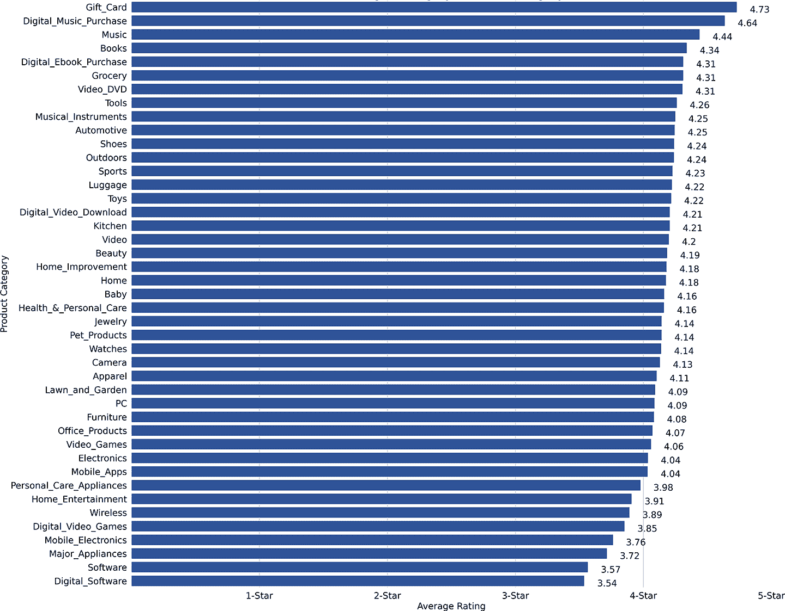

###### 图 5-1\. 在 Amazon.com 市场上，礼品卡是评分最高的产品类别。

### 2\. 哪些产品类别有最多的评论？

以下是可以回答这个问题的 SQL 查询：

```
SELECT product_category,
       COUNT(star_rating) AS count_star_rating
FROM dsoaws.amazon_reviews_parquet
GROUP BY product_category
ORDER BY count_star_rating DESC
```

让我们再次使用 Seaborn 和 Matplotlib 将结果绘制为水平条形图，显示在图 5-2 中。

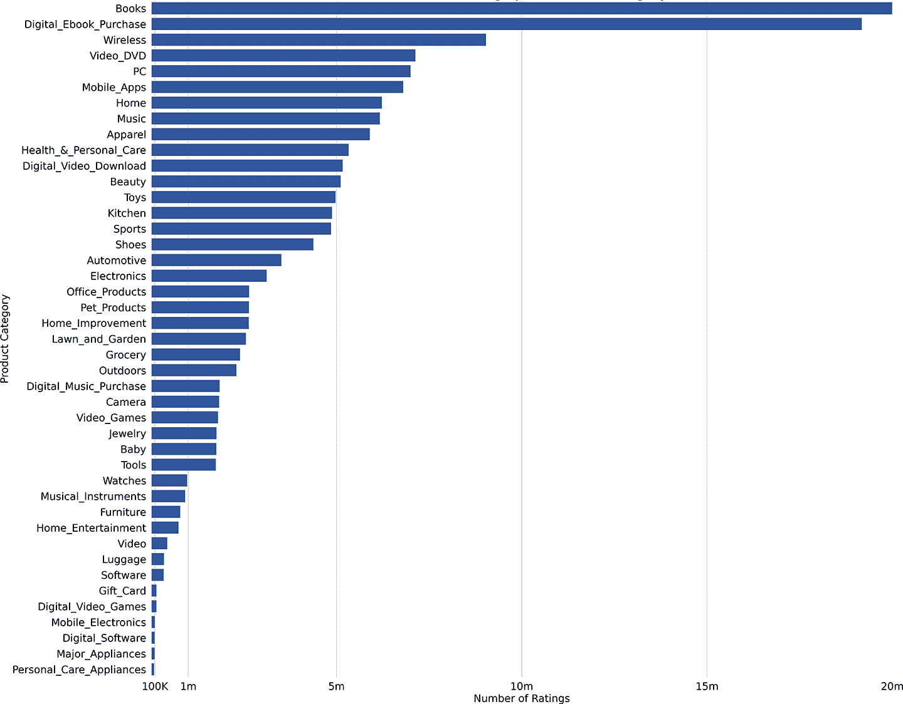

###### 图 5-2\. 图书产品类别有接近 2000 万条评论。

我们可以在图 5-2 中看到，“图书”产品类别的评论最多，接近 2000 万条。这是因为[Amazon.com 最初作为“地球上最大的书店”](https://oreil.ly/q11mI)于 1995 年开始运营。

第二评论数量最多的类别是“数字电子书购买”，代表 Kindle 书籍评论。因此，我们注意到无论是印刷书籍还是电子书籍，书籍评论仍然占据了大多数评论。

“个人护理电器”评论数量最少。这可能是因为该产品类别是最近添加的原因。

让我们通过查询每个类别的第一条评论来检查这一点，这将为我们提供产品类别引入的大致时间表。

### 3\. 每个产品类别何时在 Amazon 目录中可用？

初审日期是每个产品类别何时在 Amazon.com 上线的强有力指标。以下是可以回答这个问题的 SQL 查询：

```
  SELECT 
        product_category, 
        MIN(year) AS first_review_year
    FROM dsoaws.amazon_reviews_parquet
    GROUP BY product_category
    ORDER BY first_review_year 
```

结果应该类似于这样：

| 产品类别 | 首次评论年份 |
| --- | --- |
| 图书 | 1995 |
| 视频游戏 | 1997 |
| 办公用品 | 1998 |
| 宠物用品 | 1998 |
| 软件 | 1998 |
| 礼品卡 | 2004 |
| 数字视频游戏 | 2006 |
| 数字软件 | 2008 |
| 移动应用 | 2010 |

我们可以看到个人护理电器确实是稍后添加到 Amazon.com 目录中的，但这似乎并不是评论数量较低的唯一原因。移动应用似乎是在 2010 年左右添加的。

让我们来看看每个产品类别每年的首次评论数量，如图 5-3 所示。

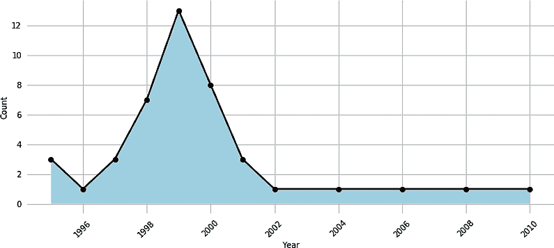

###### 图 5-3\. 我们的数据集包括 1999 年的 13 个首次产品类别评论。

我们注意到我们的首次产品类别评论中有很多（13 条）发生在 1999 年。无论这是否真的与这些产品类别在此时期的引入有关，还是仅仅是由我们数据集中的可用数据造成的巧合，我们无法确定。

### 4\. 每个产品类别的星级评分（1-5）的详细情况是什么？

这是能够回答此问题的 SQL 查询：

```
SELECT product_category,
       star_rating,
       COUNT(*) AS count_reviews
FROM dsoaws.amazon_reviews_parquet
GROUP BY  product_category, star_rating
ORDER BY  product_category ASC, star_rating DESC,
    count_reviews
```

结果应该与此类似（缩短版）：

| 产品类别 | 星级评分 | 评论数量 |
| --- | --- | --- |
| 服装 | 5 | 3320566 |
| 服装 | 4 | 1147237 |
| 服装 | 3 | 623471 |
| 服装 | 2 | 369601 |
| 服装 | 1 | 445458 |
| 汽车 | 5 | 2300757 |
| 汽车 | 4 | 526665 |
| 汽车 | 3 | 239886 |
| 汽车 | 2 | 147767 |
| 汽车 | 1 | 299867 |
| ... | ... | ... |

通过这些信息，我们还可以快速按星级评分进行分组，并计算每个评分（5、4、3、2、1）的评论数量：

```
SELECT star_rating,
       COUNT(*) AS count_reviews
FROM dsoaws.amazon_reviews_parquet
GROUP BY  star_rating
ORDER BY  star_rating DESC, count_reviews
```

结果应该与此类似：

| 星级评分 | 评论数量 |
| --- | --- |
| 5 | 93200812 |
| 4 | 26223470 |
| 3 | 12133927 |
| 2 | 7304430 |
| 1 | 12099639 |

大约 62%的所有评论都获得了 5 星评级。当我们进行特征工程准备模型训练时，我们将回到这种星级评分的相对不平衡。

现在我们可以可视化堆叠百分比水平条形图，显示每个产品类别中每个星级评分的比例，如图 5-4 所示。

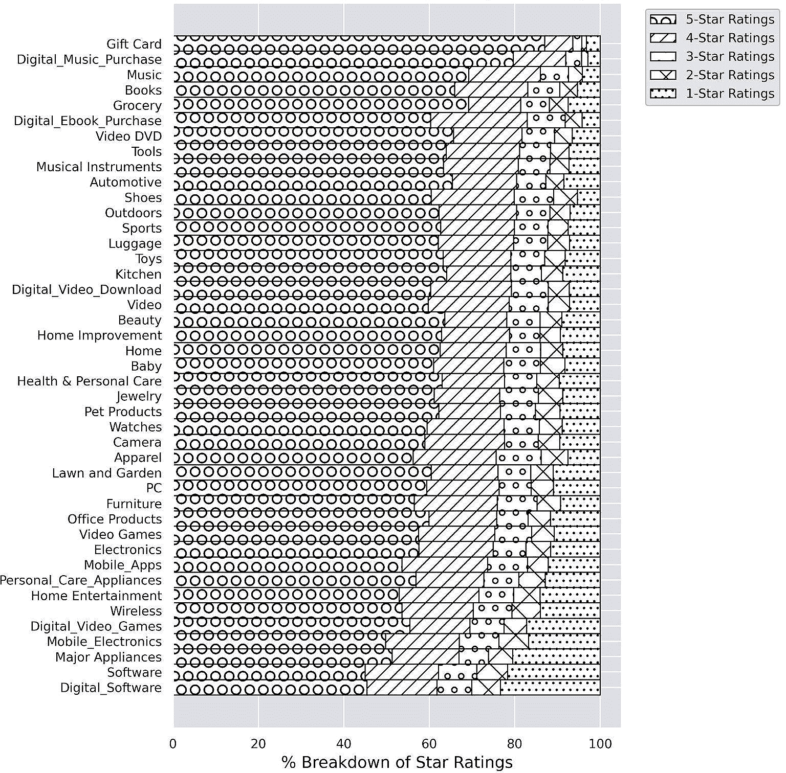

###### 图 5-4\. 每个产品类别的星级评分分布（5、4、3、2、1）。

我们可以看到每个产品类别中 5 星和 4 星评级占据了最大比例。但让我们看看是否能够发现不同产品满意度随时间的差异。

### 5\. 评星随时间的变化如何？某些产品类别在一年中是否存在评星下降点？

让我们首先看看各产品类别在多年间的平均星级评分。这是能够回答此问题的 SQL 查询：

```
SELECT year, ROUND(AVG(star_rating), 4) AS avg_rating
FROM dsoaws.amazon_reviews_parquet
GROUP BY year
ORDER BY year;
```

结果应该与此类似：

| 年份 | 平均评分 |
| --- | --- |
| 1995 | 4.6169 |
| 1996 | 4.6003 |
| 1997 | 4.4344 |
| 1998 | 4.3607 |
| 1999 | 4.2819 |
| 2000 | 4.2569 |
| ... | ... |
| 2010 | 4.069 |
| 2011 | 4.0516 |
| 2012 | 4.1193 |
| 2013 | 4.1977 |
| 2014 | 4.2286 |
| 2015 | 4.2495 |

如果我们绘制这个，如图表 5-5 所示，我们注意到总体上升趋势，但在 2004 年和 2011 年有两次低谷。

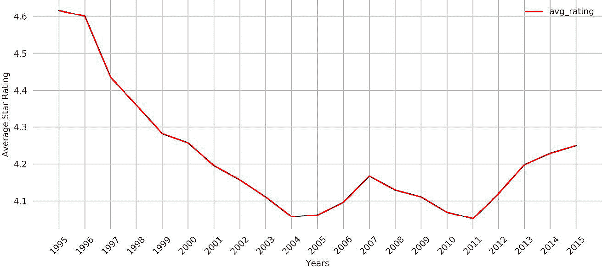

###### 图表 5-5\. 所有产品类别的平均星级评分随时间变化。

现在让我们来看看我们的五大产品类别按评分数量排名（`'Books'`, `'Digital_Ebook_Purchase'`, `'Wireless'`, `'PC'`, 和 `'Home'`）。这是能回答这个问题的 SQL 查询：

```
SELECT
    product_category,
    year,
    ROUND(AVG(star_rating), 4) AS avg_rating_category
FROM dsoaws.amazon_reviews_parquet
WHERE product_category IN
    ('Books', 'Digital_Ebook_Purchase', 'Wireless', 'PC', 'Home')
GROUP BY product_category, year
ORDER BY year
```

结果应该类似于这样（缩短）：

| 产品类别 | 年份 | 平均评分类别 |
| --- | --- | --- |
| 书籍 | 1995 | 4.6111 |
| 书籍 | 1996 | 4.6024 |
| 书籍 | 1997 | 4.4339 |
| 主页 | 1998 | 4.4 |
| 无线 | 1998 | 4.5 |
| 书籍 | 1998 | 4.3045 |
| 主页 | 1999 | 4.1429 |
| 数字电子书购买 | 1999 | 5.0 |
| PC | 1999 | 3.7917 |
| 无线 | 1999 | 4.1471 |

如果我们现在绘制，如图表 5-6 所示，我们可以看到一些有趣的东西。

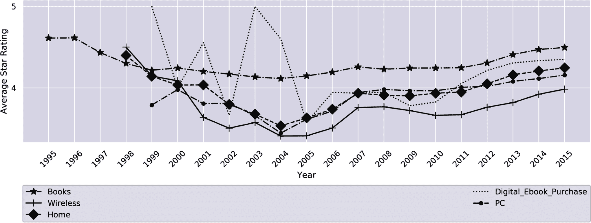

###### 图表 5-6\. 产品类别随时间变化的平均星级评分（前五名）。

虽然书籍的`star_rating`相对稳定，值在 4.1 到 4.6 之间，但其他类别更受客户满意度的影响。数字电子书购买（Kindle books）似乎波动较大，在 2005 年低至 3.5，在 2003 年高达 5.0。这绝对需要仔细查看我们的数据集，以决定这是否由于当时评论有限或某种数据偏斜导致，或者这确实反映了客户的声音。

### 6\. 哪些星级评价（1-5）最有帮助？

这是能回答这个问题的 SQL 查询：

```
SELECT star_rating,
       AVG(helpful_votes) AS avg_helpful_votes
FROM dsoaws.amazon_reviews_parquet
GROUP BY  star_rating
ORDER BY  star_rating DESC
```

结果应该类似于这样：

| star_rating | avg_helpful_votes |
| --- | --- |
| 5 | 1.672697561905362 |
| 4 | 1.6786973653753678 |
| 3 | 2.048089542651773 |
| 2 | 2.5066350146417995 |
| 1 | 3.6846412525200134 |

我们发现客户认为负面评价比正面评价更有帮助，这在图表 5-7 中有可视化。

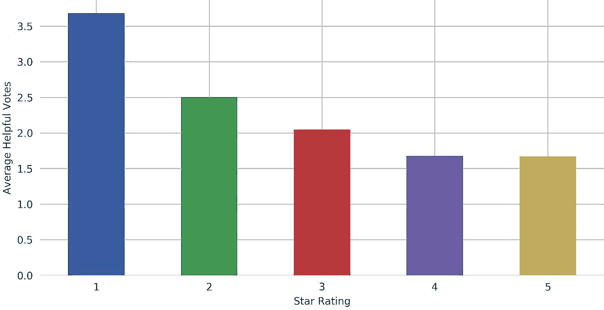

###### 图表 5-7\. 客户认为负面评价（1 星评级）最有帮助。

### 7\. 评论长度（单词数量）的分布是什么？

这是能回答这个问题的 SQL 查询：

```
SELECT CARDINALITY(SPLIT(review_body, ' ')) as num_words
FROM dsoaws.amazon_reviews_parquet
```

我们可以通过百分位数描述结果分布：

```
summary = df['num_words']\
    .describe(percentiles=\
        [0.10, 0.20, 0.30, 0.40, 0.50, 0.60, 0.70, 0.80, 0.90, 1.00])
```

总结结果应该类似于这样：

```
count    396601.000000
mean         51.683405
std         107.030844
min           1.000000
10%           2.000000
20%           7.000000
30%          19.000000
40%          22.000000
50%          26.000000
60%          32.000000
70%          43.000000
80%          63.000000
90%         110.000000
100%       5347.000000
max        5347.000000
```

如果我们现在绘制，如图表 5-8 所示，我们可以看到 80%的评论只有 63 个单词或更少。

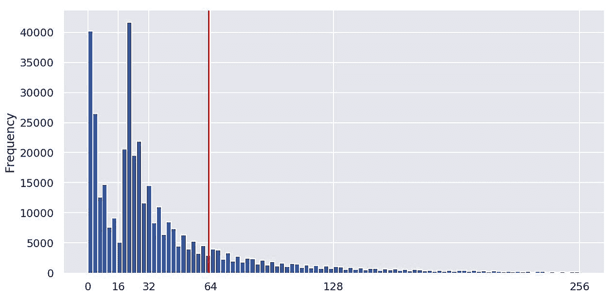

###### 图表 5-8\. 直方图可视化评论长度的分布。

# 查询我们的数据仓库。

此时，我们将使用 Amazon Redshift 查询和可视化用例。与 Athena 示例类似，我们首先需要准备 SageMaker Studio 环境。

## 在 SageMaker Studio 中运行 Amazon Redshift 示例查询。

在以下示例中，我们将查询数据集，以获得每个产品类别的唯一客户数量。我们可以使用 pandas 的`read_sql_query`函数运行我们的 SQLAlchemy 查询，并将查询结果存储在 pandas DataFrame 中：

```
df = pd.read_sql_query("""
	 SELECT product_category, COUNT(DISTINCT customer_id) as num_customers
	 FROM redshift.amazon_reviews_tsv_2015
	 GROUP BY product_category
	 ORDER BY num_customers DESC
""", engine)
```

`df.head(10)`

输出结果应类似于这样：

| 产品类别 | 客户数量 |
| --- | --- |
| 无线通讯 | 1979435 |
| 数字电子书购买 | 1857681 |
| 书籍 | 1507711 |
| 服装 | 1424202 |
| 家居 | 1352314 |
| 个人电脑 | 1283463 |
| 健康与个人护理 | 1238075 |
| 美容 | 1110828 |
| 鞋类 | 1083406 |
| 运动 | 1024591 |

我们可以看到`Wireless`产品类别拥有最多提供评论的独特客户，其次是`Digital_Ebook_Purchase`和`Books`类别。现在我们准备从 Amazon Redshift 查询更深入的客户洞察。

## 深入挖掘 Amazon Redshift 和 SageMaker 数据集

现在，让我们从 Amazon Redshift 中查询 2015 年的数据，深入了解我们的客户，并找到以下问题的答案：

1.  2015 年哪些产品类别的评论最多？

1.  2015 年哪些产品评论最有帮助？这些评论的长度是多少？

1.  2015 年星级评分如何变化？在整年中，是否有某些产品类别的评分出现了下降点？

1.  2015 年哪些客户写了最有帮助的评论？他们分别写了多少评论？涵盖了多少个类别？他们的平均星级评分是多少？

1.  2015 年哪些客户为同一产品提供了多于一条评论？每个产品的平均星级评分是多少？

###### 注

与 Athena 示例一样，我们将只展示 Amazon Redshift 的 SQL 查询和结果。执行和呈现结果的完整源代码可在附带的 GitHub 仓库中找到。

让我们运行查询，找出答案吧！

### 1\. 2015 年哪些产品类别的评论最多？

下面是将回答此问题的 SQL 查询：

```
SELECT
    year,
    product_category,
    COUNT(star_rating) AS count_star_rating  
FROM
    redshift.amazon_reviews_tsv_2015 
GROUP BY
    product_category,
    year 
ORDER BY
    count_star_rating DESC,
    year DESC
```

结果应类似于以下数据子集：

| 年份 | 产品类别 | 评分计数 |
| --- | --- | --- |
| 2015 | 数字电子书购买 | 4533519 |
| 2015 | 无线通讯 | 2998518 |
| 2015 | 书籍 | 2808751 |
| 2015 | 服装 | 2369754 |
| 2015 | 家居 | 2172297 |
| 2015 | 健康与个人护理 | 1877971 |
| 2015 | 个人电脑 | 1877971 |
| 2015 | 美容 | 1816302 |
| 2015 | 数字视频下载 | 1593521 |
| 2015 | 运动 | 1571181 |
| ... | ... | ... |

我们注意到书籍仍然是最多评论的产品类别，但实际上现在是电子书（Kindle 书籍）。让我们在水平条形图中将结果可视化，如图 5-9 所示。

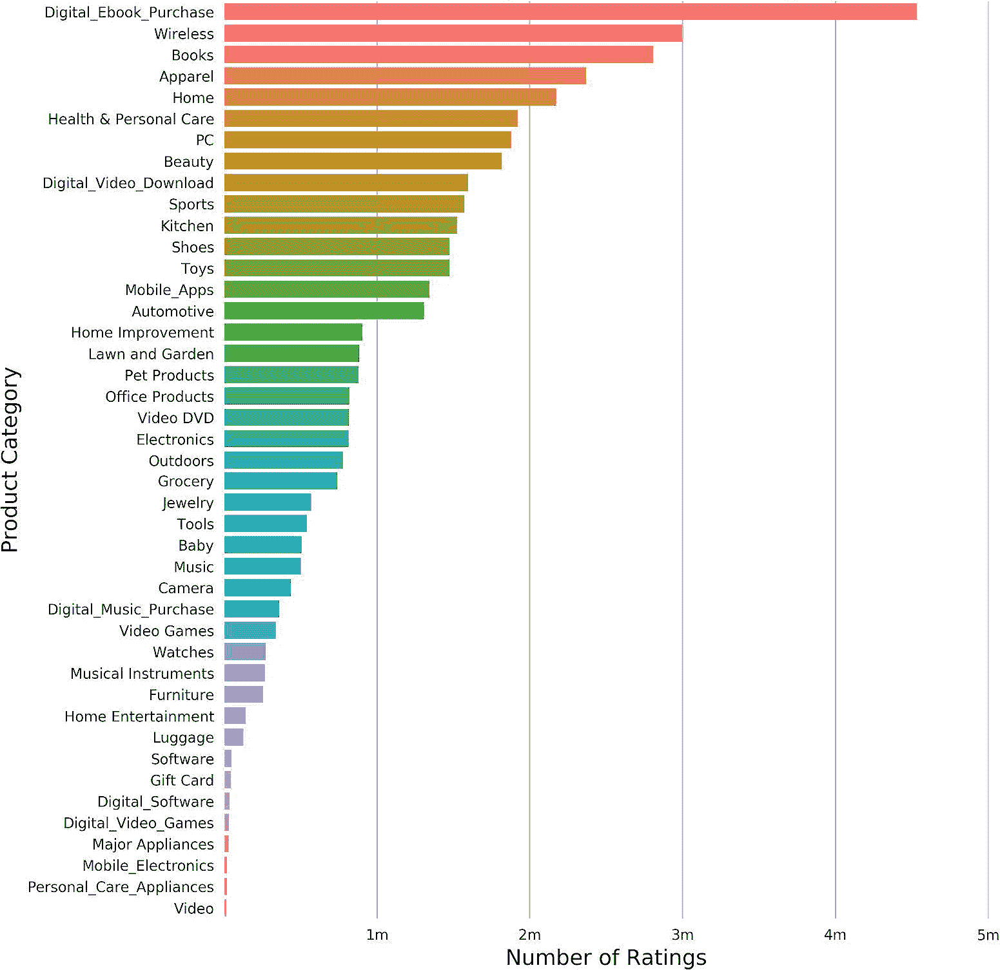

###### 图 5-9\. 2015 年，数字电子书购买拥有最多的评论。

### 2\. 2015 年哪些产品评论最有帮助？

此外，这些评论的长度是多少？以下是将回答此问题的 SQL 查询：

```
SELECT
    product_title,
    helpful_votes,
    LENGTH(review_body) AS review_body_length,
    SUBSTRING(review_body, 1, 100) AS review_body_substring 
FROM
    redshift.amazon_reviews_tsv_2015 
ORDER BY
    helpful_votes DESC LIMIT 10
```

结果应类似于以下内容：

| product_title | helpful_votes | review_body_length | review_body_substring |
| --- | --- | --- | --- |
| Fitbit Charge HR Wireless Activity Wristband | 16401 | 2824 | 完全公开，我只在放弃 Jawbone 未能按时交货之后才订购 Fitbit Charge HR |
| Kindle Paperwhite | 10801 | 16338 | 评价更新于 2015 年 9 月 17 日<br /><br />作为背景，我是一名退休的信息系统专业人员 |
| Kindle Paperwhite | 8542 | 9411 | [[VIDEOID:755c0182976ece27e407ad23676f3ae8]]如果你正在阅读关于新第三代 Pape 的评论 |
| Weslo Cadence G 5.9 Treadmill | 6246 | 4295 | 我得到了 Weslo 跑步机，非常喜欢它。我身高 6'2"，体重 230 磅，喜欢在外面跑步（ab |
| Haribo Gummi Candy Gold-Bears | 6201 | 4736 | 这是我本学期最后一节课，期末考占了我们成绩的 30%。<br />在一个长 |
| FlipBelt - World’s Best Running Belt & Fitness Workout Belt | 6195 | 211 | 选择上尺码表有误。我已附上照片，你可以看看真正需要的。 |
| Amazon.com eGift Cards | 5987 | 3498 | 我觉得写这个可能只是在浪费时间，但一定也发生在其他人身上。某事 |
| Melanie’s Marvelous Measles | 5491 | 8028 | 如果你喜欢这本书，可以看看同一作者的其他精彩作品：<br /><br />Abby’s |
| Tuft & Needle Mattress | 5404 | 4993 | 简而言之：经过一些难关，绝佳的客户服务使得这款床垫非常出色。The |
| Ring Wi-Fi Enabled Video Doorbell | 5399 | 3984 | 首先，Ring 门铃非常酷。我真的很喜欢它，许多来我家门口的人（销售） |

我们看到“Fitbit Charge HR Wireless Activity Wristband”在 2015 年拥有最多的有用评价，共 16,401 票，并且评论长度为 2,824 个字符。其后是两篇关于“Kindle Paperwhite”的评论，人们写了长达 16,338 和 9,411 个字符的评论。

### 3\. 2015 年星级评分发生了什么变化？

此外，某些产品类别是否在全年内有下降点？以下是能回答这个问题的 SQL 查询：

```
SELECT
    CAST(DATE_PART('month', TO_DATE(review_date, 'YYYY-MM-DD')) AS integer)
    AS month,
    AVG(star_rating ::FLOAT) AS avg_rating
FROM redshift.amazon_reviews_tsv_2015
GROUP BY month
ORDER BY month
```

结果应该与以下类似：

| month | avg_rating |
| --- | --- |
| 1 | 4.277998926134835 |
| 2 | 4.267851231035101 |
| 3 | 4.261042822856084 |
| 4 | 4.247727865199895 |
| 5 | 4.239633709986397 |
| 6 | 4.235766635971452 |
| 7 | 4.230284081689972 |
| 8 | 4.231862792031927 |

我们注意到我们只有到 2015 年 8 月的数据。我们还可以看到平均评分在缓慢下降，正如我们在 Figure 5-10 中清楚地看到的。尽管我们没有确切的解释，但这种下降很可能在 2015 年得到调查。

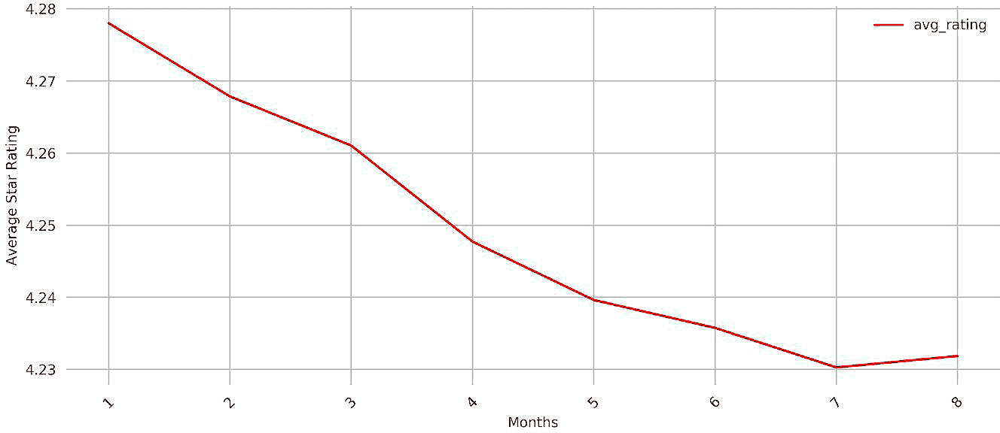

###### Figure 5-10\. 2015 年各产品类别的平均星级评分。

现在让我们探讨这是否由于某个产品类别在客户满意度上急剧下降，还是所有类别都有这种趋势。以下是能回答这个问题的 SQL 查询：

```
SELECT
    product_category,
    CAST(DATE_PART('month', TO_DATE(review_date, 'YYYY-MM-DD')) AS integer) 
    AS month,
    AVG(star_rating ::FLOAT) AS avg_rating
FROM redshift.amazon_reviews_tsv_2015
GROUP BY product_category, month
ORDER BY product_category, month
```

结果应该类似于这样（缩短版）：

| 产品类别 | 月份 | 平均评分 |
| --- | --- | --- |
| 服装 | 1 | 4.159321618698804 |
| 服装 | 2 | 4.123969612021801 |
| 服装 | 3 | 4.109944336469443 |
| 服装 | 4 | 4.094360325567125 |
| 服装 | 5 | 4.0894595692213125 |
| 服装 | 6 | 4.09617799917213 |
| 服装 | 7 | 4.097665115845663 |
| 服装 | 8 | 4.112790034578352 |
| 汽车 | 1 | 4.325502388403887 |
| 汽车 | 2 | 4.318120214368761 |
| ... | ... | ... |

让我们通过可视化结果来更容易地发现趋势，如图 5-11 所示。

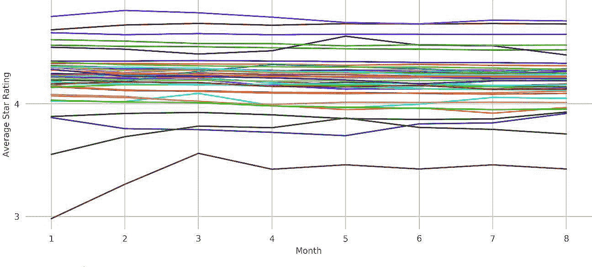

###### 图 5-11\. 2015 年每个产品类别的平均星级评分。

虽然这个图表有点凌乱，但我们可以看到大多数类别在月份间都有相同的平均星级评分，其中三个类别比其他类别波动更大：“数字软件”，“软件”和“移动电子产品”。不过，它们在整年内都有所改善，这是好事。

### 4\. 哪些客户在 2015 年写的评论最有帮助？

同时，他们写了多少评论？跨多少个类别？平均星级评分是多少？以下是能回答这些问题的 SQL 查询：

```
SELECT
    customer_id,
    AVG(helpful_votes) AS avg_helpful_votes,
    COUNT(*) AS review_count,
    COUNT(DISTINCT product_category) AS product_category_count,
    ROUND(AVG(star_rating::FLOAT), 1) AS avg_star_rating 
FROM
    redshift.amazon_reviews_tsv_2015 
GROUP BY
    customer_id 
HAVING
    count(*) > 100 
ORDER BY
    avg_helpful_votes DESC LIMIT 10;
```

结果应该类似于这样：

| 客户 ID | 平均有用票数 | 评论数 | 产品类别数 | 平均星级评分 |
| --- | --- | --- | --- | --- |
| 35360512 | 48 | 168 | 26 | 4.5 |
| 52403783 | 44 | 274 | 25 | 4.9 |
| 28259076 | 40 | 123 | 7 | 4.3 |
| 15365576 | 37 | 569 | 30 | 4.9 |
| 14177091 | 29 | 187 | 15 | 4.4 |
| 28021023 | 28 | 103 | 18 | 4.5 |
| 20956632 | 25 | 120 | 23 | 4.8 |
| 53017806 | 25 | 549 | 30 | 4.9 |
| 23942749 | 25 | 110 | 22 | 4.5 |
| 44834233 | 24 | 514 | 32 | 4.4 |

我们可以看到那些写了平均评分最有帮助票数的评论（提供了一百多条评论）的客户，这些评论通常反映了积极的情绪。

### 5\. 哪些客户在 2015 年为同一产品提供了多次评论？

此外，每个产品的平均星级评分是多少？以下是能回答这个问题的 SQL 查询：

```
SELECT
    customer_id,
    product_category,
    product_title,
    ROUND(AVG(star_rating::FLOAT), 4) AS avg_star_rating,
    COUNT(*) AS review_count  
FROM
    redshift.amazon_reviews_tsv_2015 
GROUP BY
    customer_id,
    product_category,
    product_title  
HAVING
    COUNT(*) > 1  
ORDER BY
    review_count DESC LIMIT 5
```

结果应该类似于这样：

| 客户 ID | 产品类别 | 产品标题 | 平均星级评分 | 评论数 |
| --- | --- | --- | --- | --- |
| 2840168 | 相机 | （按照亚马逊指南创建一个通用标题） | 5.0 | 45 |
| 9016330 | 视频游戏 | 迪士尼无限 迪士尼无限：漫威超级英雄（2.0 版）角色 | 5.0 | 23 |
| 10075230 | 视频游戏 | 天降奇兵：斯派罗历险记：角色包 | 5.0 | 23 |
| 50600878 | 数字电子书购买 | 孙子兵法 | 2.35 | 20 |
| 10075230 | 视频游戏 | Activision Skylanders Giants Single Character Pack Core Series 2 | 4.85 | 20 |

请注意，`avg_star_rating`并非始终是整数。这意味着一些顾客随着时间的推移对产品的评价有所不同。

值得一提的是，顾客 9016330 发现迪士尼无限：漫威超级英雄视频游戏获得了 5 星评价——即使玩了 23 次！顾客 50600878 已经着迷到阅读《孙子兵法》20 次，但仍在努力寻找其中的积极情绪。

# 使用 Amazon QuickSight 创建仪表板。

QuickSight 是一种托管、无服务器且易于使用的业务分析服务，我们可以利用它快速构建强大的可视化效果。QuickSight 会自动发现我们 AWS 账户中的数据源，包括 MySQL、Salesforce、Amazon Redshift、Athena、S3、Aurora、RDS 等等。

让我们使用 QuickSight 创建一个仪表板，展示我们的 Amazon 顾客评论数据集。只需点击几下，我们就可以在任何设备上获得产品类别评论数量的可视化效果，甚至是我们的手机。我们可以使用 QuickSight Python SDK 在数据摄入后自动刷新仪表板。通过 QuickSight UI，我们可以看到我们数据集中的不平衡情况，如图 5-12 所示。


###### 图 5-12。在 QuickSight 中可视化产品类别的评论数量。

产品类别 Books 和 Digital_Ebook_Purchase 拥有迄今为止最多的评论。在下一章节中，当我们准备数据集来训练我们的模型时，我们将更详细地分析和解决这种不平衡。

# 使用 Amazon SageMaker 和 Apache Spark 检测数据质量问题。

数据从未完美——特别是在一个跨越 20 年、拥有 1.5 亿行数据的数据集中！此外，随着引入新的应用功能和淘汰旧功能，数据质量实际上可能会随时间推移而下降。架构演变，代码老化，查询变慢。

由于数据质量对上游应用团队并非总是优先考虑，因此下游的数据工程和数据科学团队需要处理糟糕或缺失的数据。我们希望确保我们的数据对包括商业智能、ML 工程和数据科学团队在内的下游消费者是高质量的。

图 5-13 显示了应用程序如何为工程师、科学家和分析师生成数据，以及这些团队在访问数据时可能使用的工具和服务。

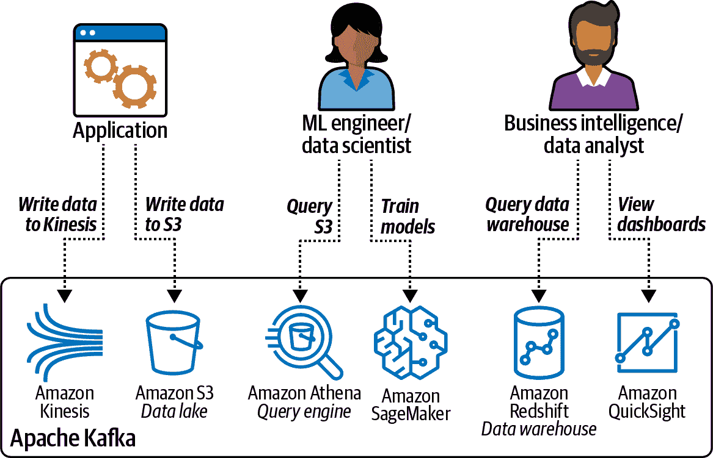

###### 图 5-13。工程师、科学家和分析师使用各种工具和服务访问数据。

数据质量问题可能会阻碍数据处理流水线。如果不能及早发现这些问题，可能会导致误导性报告（例如重复计算的收入）、偏倚的 AI/ML 模型（偏向/反对单一性别或种族）以及其他意外的数据产品。

要尽早捕捉这些数据问题，我们使用了来自 AWS 的两个开源库，[Deequ](https://oreil.ly/CVaTM) 和 [PyDeequ](https://oreil.ly/K9Ydj)。这些库利用 Apache Spark 分析数据质量，检测异常，并能在“凌晨 3 点通知数据科学家”发现数据问题。Deequ 在整个模型的完整生命周期内持续分析数据，从特征工程到模型训练再到生产环境中的模型服务。图 5-14 展示了 Deequ 架构和组件的高级概述。

从一次运行到下一次运行学习，Deequ 将建议在下一次通过数据集时应用的新规则。例如，在模型训练时，Deequ 学习我们数据集的基线统计信息，然后在新数据到达进行模型预测时检测异常。这个问题经典上称为“训练-服务偏差”。基本上，一个模型是用一组学习到的约束进行训练的，然后模型看到不符合这些现有约束的新数据。这表明数据从最初预期的分布发生了移动或偏差。

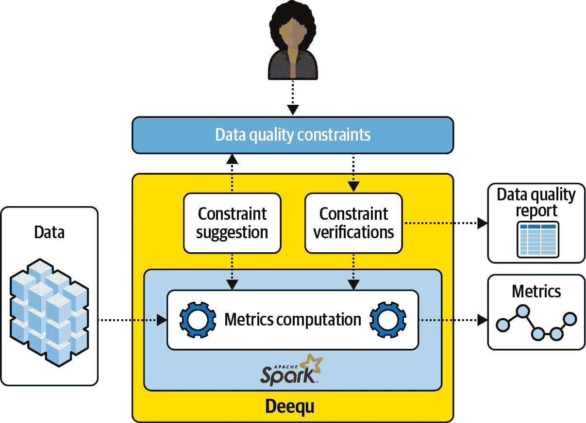

###### 图 5-14\. Deequ 的组件：约束、指标和建议。

因为我们有超过 1.5 亿条评论，我们需要在集群上运行 Deequ，而不是在我们的笔记本内部运行。这是在大规模数据处理中的一个权衡。笔记本对小数据集的探索性分析效果良好，但不适合处理大数据集或训练大模型。我们将使用笔记本在独立的、短暂的、无服务器的 Apache Spark 集群上启动 Deequ Spark 作业，以触发处理作业。

## SageMaker 处理作业

使用 SageMaker 处理作业可以在完全托管、按需付费的 AWS 基础设施上运行任何 Python 脚本或自定义 Docker 镜像，使用熟悉的开源工具如 scikit-learn 和 Apache Spark。图 5-15 展示了 SageMaker 处理作业容器。

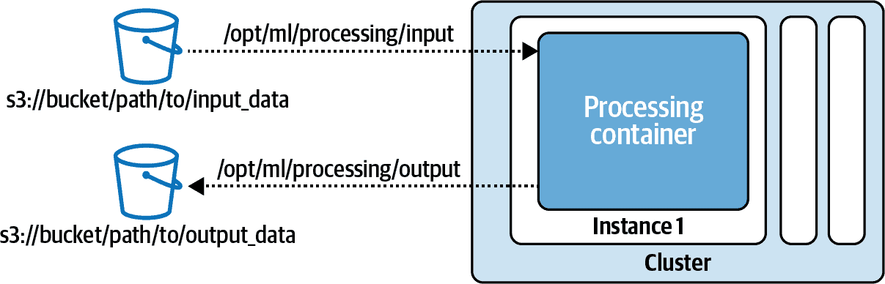

###### 图 5-15\. 亚马逊 SageMaker 处理作业容器。

幸运的是，Deequ 是建立在 Apache Spark 之上的高级 API，因此我们使用 SageMaker 处理作业来运行我们的大规模分析作业。

###### 注意

Deequ 在概念上类似于 TensorFlow Extended，特别是 TensorFlow 数据验证组件。然而，Deequ 在流行的开源 Apache Spark 基础上构建，以增加可用性、调试能力和可扩展性。此外，Apache Spark 和 Deequ 本地支持 Parquet 格式——我们首选的分析文件格式。

## 使用 Deequ 和 Apache Spark 分析我们的数据集

表 5-1 展示了 Deequ 支持的部分指标。

表 5-1\. Deequ 指标示例

| 指标 | 描述 | 使用示例 |
| --- | --- | --- |
| ApproxCountDistinct | 使用 HLL++的近似不同值数量 | ApproxCountDistinct(“review_id”) |
| ApproxQuantiles | Approximate quantiles of a distribution | ApproxQuantiles(“star_rating”, quantiles = Seq(0.1, 0.5, 0.9)) |
| Completeness | Fraction of non-null values in a column | Completeness(“review_id”) |
| Compliance | Fraction of rows that comply with the given column constraint | Compliance(“top star_rating”, “star_rating >= 4.0”) |
| Correlation | Pearson correlation coefficient | Correlation(“total_votes”, “star_rating”) |
| Maximum | Maximum value | Maximum(“star_rating”) |
| Mean | Mean value; null valuesexcluded | Mean(“star_rating”) |
| Minimum | Minimum value | Minimum(“star_rating”) |
| MutualInformation | How much information about one column can be inferred from another column | MutualInformation(Seq(“total_votes”, “star_rating”)) |
| Size | Number of rows in a DataFrame | Size() |
| Sum | Sum of all values of a column | Sum(“total_votes”) |
| Uniqueness | Fraction of unique values | Uniqueness(“review_id”) |

让我们通过调用`PySparkProcessor`启动基于 Apache Spark 的 Deequ 分析作业，并从笔记本电脑上启动一个包含 10 个节点的 Apache Spark 集群。我们选择高内存的`r5`实例类型，因为 Spark 通常在更多内存的情况下表现更好：

```
s3_input_data='s3://{}/amazon-reviews-pds/tsv/'.format(bucket)
s3_output_analyze_data='s3://{}/{}/output/'.format(bucket, output_prefix)

from sagemaker.spark.processing import PySparkProcessor

processor = 
    PySparkProcessor(base_job_name='spark-amazon-reviews-analyzer',
                     role=role,
                     framework_version='2.4',
                     instance_count=10,
                     instance_type='ml.r5.8xlarge',
                     max_runtime_in_seconds=300)

processor.run(submit_app='preprocess-deequ-pyspark.py',
              submit_jars=['deequ-1.0.3-rc2.jar'],
              arguments=['s3_input_data', s3_input_data,
                         's3_output_analyze_data', s3_output_analyze_data,
              ],
              logs=True,
              wait=False
)
```

下面是我们的 Deequ 代码，指定了我们希望应用于 TSV 数据集的各种约束条件。在此示例中，我们使用 TSV 以保持与其他示例的一致性，但只需更改一行代码即可轻松切换到 Parquet：

```
dataset = spark.read.csv(s3_input_data, 
                         header=True,
                         schema=schema,
                         sep="\t",
                         quote="")
```

定义分析器：

```
from pydeequ.analyzers import *

analysisResult = AnalysisRunner(spark) \
                    .onData(dataset) \
                    .addAnalyzer(Size()) \
                    .addAnalyzer(Completeness("review_id")) \
                    .addAnalyzer(ApproxCountDistinct("review_id")) \
                    .addAnalyzer(Mean("star_rating")) \
                    .addAnalyzer(Compliance("top star_rating", \
                                            "star_rating >= 4.0")) \
                    .addAnalyzer(Correlation("total_votes", \
                                            "star_rating")) \
                    .addAnalyzer(Correlation("total_votes", 
                                            "helpful_votes")) \
                    .run()
```

定义检查、计算指标并验证检查条件：

```
from pydeequ.checks import *
from pydeequ.verification import *

verificationResult = VerificationSuite(spark) \
        .onData(dataset) \
        .addCheck(
            Check(spark, CheckLevel.Error, "Review Check") \
                .hasSize(lambda x: x >= 150000000) \
                .hasMin("star_rating", lambda x: x == 1.0) \
                .hasMax("star_rating", lambda x: x == 5.0)  \
                .isComplete("review_id")  \
                .isUnique("review_id")  \
                .isComplete("marketplace")  \
                .isContainedIn("marketplace", ["US", "UK", "DE", "JP", "FR"])) \
        .run()
```

我们已定义了要应用于数据集的一组约束和断言。让我们运行作业并确保我们的数据符合预期。Table 5-2 显示了我们 Deequ 作业的结果，总结了我们指定的约束和检查结果。

表 5-2\. Deequ 作业结果

| check_name | columns | value |
| --- | --- | --- |
| ApproxCountDistinct | review_id | 149075190 |
| Completeness | review_id | 1.00 |
| Compliance | Marketplace contained in US,UK, DE,JP,FR | 1.00 |
| Compliance | top star_rating | 0.79 |
| Correlation | helpful_votes,total_votes | 0.99 |
| Correlation | total_votes,star_rating | -0.03 |
| Maximum | star_rating | 5.00 |
| Mean | star_rating | 4.20 |
| Minimum | star_rating | 1.00 |
| Size | * | 150962278 |
| Uniqueness | review_id | 1.00 |

我们学到了以下内容：

+   `review_id`没有缺失值，大约（精确度在 2%以内）有 149,075,190 个唯一值。

+   79%的评价具有“顶级”`star_rating`为 4 或更高。

+   `total_votes`和`star_rating`之间存在弱相关性。

+   `helpful_votes`和`total_votes`之间存在强相关性。

+   平均`star_rating`为 4.20。

+   数据集包含确切的 150,962,278 条评价（与`ApproxCountDistinct`相比略有不同，差异为 1.27%）。

Deequ 支持 `MetricsRepository` 的概念，以跟踪这些指标随时间的变化，并在检测到数据质量下降时可能停止我们的流水线。以下是创建 `FileSystemMetricsRepository`、使用修订后的 `AnalysisRunner` 开始跟踪我们的指标以及加载我们的指标进行比较的代码：

```
from pydeequ.repository import *

metrics_file = FileSystemMetricsRepository.helper_metrics_file(spark, 
    'metrics.json')
repository = FileSystemMetricsRepository(spark, metrics_file)
resultKey = ResultKey(spark, ResultKey.current_milli_time())

analysisResult = AnalysisRunner(spark) \
                    .onData(dataset) \
                    .addAnalyzer(Size()) \
                    .addAnalyzer(Completeness("review_id")) \
                    .addAnalyzer(ApproxCountDistinct("review_id")) \
                    .addAnalyzer(Mean("star_rating")) \
                    .addAnalyzer(Compliance("top star_rating", \ 
                                            "star_rating >= 4.0")) \
                    .addAnalyzer(Correlation("total_votes", \
                                            "star_rating")) \
                    .addAnalyzer(Correlation("total_votes", \ 
                                            "helpful_votes")) \
                    .useRepository(repository) \
                    .run()

df_result_metrics_repository = repository.load() \
    .before(ResultKey.current_milli_time()) \ 
    .forAnalyzers([ApproxCountDistinct("review_id")]) \
    .getSuccessMetricsAsDataFrame()
```

Deequ 还根据我们数据集的当前特征提出了有用的约束条件。当我们有新数据进入系统时，这是非常有用的，因为新数据在统计上可能与原始数据集不同。在现实世界中，这是非常常见的，因为新数据随时都在进入。

在 表格 5-3 中，Deequ 建议我们添加以下检查和相应的代码，以便在新数据进入系统时检测异常。

表格 5-3\. Deequ 建议添加的检查

| column | check | deequ_code |
| --- | --- | --- |
| customer_id | `'customer_id'`具有整数类型 | `.hasDataType(\"customer_id\", ConstrainableDataTypes.Integral)"` |
| helpful_votes | `'helpful_votes'`没有负值 | `.isNonNegative(\"helpful_votes\")"` |
| review_headline | `'review_headline'`有不到 1%的缺失值 | `.hasCompleteness(\"review_headline\", lambda x: x >= 0.99, Some(\"应该高于 0.99！\"))"` |
| product_category | `'product_category'`的值范围包括 `'Books'`, `'Digital_Ebook_Purchase'`, `'Wireless'`, `'PC'`, `'Home'`, `'Apparel'`, `'Health & Personal Care'`, `'Beauty'`, `'Video DVD'`, `'Mobile_Apps'`, `'Kitchen'`, `'Toys'`, `'Sports'`, `'Music'`, `'Shoes'`, `'Digital_Video_Download'`, `'Automotive'`, `'Electronics'`, `'Pet Products'`, `'Office Products'`, `'Home Improvement'`, `'Lawn and Garden'`, `'Grocery'`, `'Outdoors'`, `'Camera'`, `'Video Games'`, `'Jewelry'`, `'Baby'`, `'Tools'`, `'Digital_Music_Purchase'`, `'Watches'`, `'Musical Instruments'`, `'Furniture'`, `'Home Entertainment'`, `'Video'`, `'Luggage'`, `'Software'`, `'Gift Card'`, `'Digital_Video_Games'`, `'Mobile_Electronics'`, `'Digital_Software'`, `'Major Appliances'`, `'Personal_Care_Appliances'` | `.isContainedIn(\"product_category\", Array(\"Books\", \"Digital_Ebook_Purchase\", \"Wireless\", \"PC\", \"Home\", \"Apparel\", \"Health & Personal Care\", \"Beauty\", \"Video DVD\", \"Mobile_Apps\", \"Kitchen\", \"Toys\", \"Sports\", \"Music\", \"Shoes\", \"Digital_Video_Download\", \"Automotive\", \"Electronics\", \"Pet Products\", \"Office Products\", \"Home Improvement\", \"Lawn and Garden\", \"Grocery\", \"Outdoors\", \"Camera\", \"Video Games\", \"Jewelry\", \"Baby\", \"Tools\", \"Digital_Music_Purchase\", \"Watches\", \"Musical Instruments\", \"Furniture\", \"Home Entertainment\", \"Video\", \"Luggage\", \"Software\", \"Gift Card\", \"Digital_Video_Games\", \"Mobile_Electronics\", \"Digital_Software\", \"Major Appliances\", \"Personal_Care_Appliances\"))"` |
| vine | `'vine'` 的值范围至少有 99.0% 的值为 `'N'` | `.isContainedIn(\"vine\", Array(\"N\"), lambda x: x >= 0.99, Some(\"It should be above 0.99!\"))"` |

除了整型和非负数检查外，Deequ 还建议我们将 `product_category` 限制为目前已知的 43 个值，包括 `Books`、`Software` 等。Deequ 还意识到至少 99% 的 `vine` 值为 `N`，并且 `< 1%` 的 `review_headline` 值为空，因此建议我们在未来增加对这些条件的检查。

# 检测数据集中的偏见

使用 Seaborn 库的几行 Python 代码，如下所示，我们可以识别出 pandas DataFrame 中三个样本产品类别在五个不同 `star_rating` 类别中评论数量的不平衡。Figure 5-16 可视化了这些数据的不平衡。

```
import seaborn as sns

sns.countplot(data=df, 
   x="star_rating", 
   hue="product_category")
```

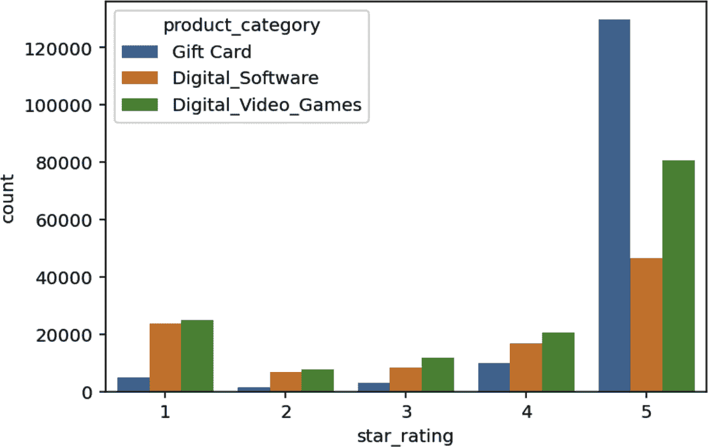

###### 图 5-16。数据集在星级评分类别和产品类别的评论数量上存在不平衡。

现在我们将使用 SageMaker Data Wrangler 和 Clarify 在规模上分析数据集中的不平衡和其他潜在的偏见。

## 使用 SageMaker Data Wrangler 生成和可视化偏见报告

SageMaker Data Wrangler 与 SageMaker Studio 集成，专为机器学习、数据分析、特征工程、特征重要性分析和偏差检测而设计。通过 Data Wrangler，我们可以指定自定义的 Apache Spark 用户定义函数、pandas 代码和 SQL 查询。此外，Data Wrangler 还提供超过 300 种内置的数据转换功能，用于特征工程和偏差缓解。我们将在 第六章 深入研究 SageMaker Data Wrangler 进行特征工程。现在，让我们使用 Data Wrangler 和 SageMaker Clarify 分析数据集，后者是亚马逊 SageMaker 的一个功能，我们将在本书的其余部分中使用它来评估偏见、统计漂移/偏移、公平性和可解释性。

###### 注意

SageMaker Data Wrangler 服务与开源 AWS Data Wrangler 项目不同。AWS Data Wrangler 主要用于数据摄取和在 AWS 服务之间传输数据。SageMaker Data Wrangler 则是首选的面向 ML 的数据摄取、分析和转换工具，因为它在整个机器学习流水线中保持完整的数据血统。

让我们使用 SageMaker Data Wrangler 分析相对于 `product_category` 列的类别不平衡，或者在这种情况下通常称为“facet”的情况。通常，我们正在分析像年龄和种族这样敏感的“facet”。我们选择分析 `product_category` facet，因为在撰写礼品卡评论与软件评论时可能存在语言使用的差异。

类不平衡是数据偏差的一个例子，如果不加以缓解，可能导致模型偏差，即模型不成比例地偏向过度表示的类别，例如`Gift Card`，而损害到欠表示的类别，例如`Digital_Software`。这可能导致欠表示的劣势类别训练误差较高。

换句话说，我们的模型可能更准确地预测礼品卡的`star_rating`，而不是软件，因为我们的数据集中礼品卡的评论比软件的多。对于我们的情况，这通常被称为“选择偏差”关于`product_category`这一维度。我们使用 SageMaker Data Wrangler 和 Clarify 生成包括类不平衡（CI）、正面比例标签差异（DPL）和 Jensen-Shannon 散度（JS）在内的多个度量的偏差报告。图 5-17 显示了我们数据集的一个子集在`Gift Card`产品类别和目标`star_rating`为 5 和 4 时的类不平衡情况。

这份偏差报告显示了`Gift Card`产品类别维度的 0.45 的类不平衡。类不平衡的值范围在[-1, 1]区间内。值接近 0 表明样本在分析的维度上分布均衡。接近-1 和 1 的值表明数据集不平衡，可能需要在进行特征选择、特征工程和模型训练之前进行平衡处理。

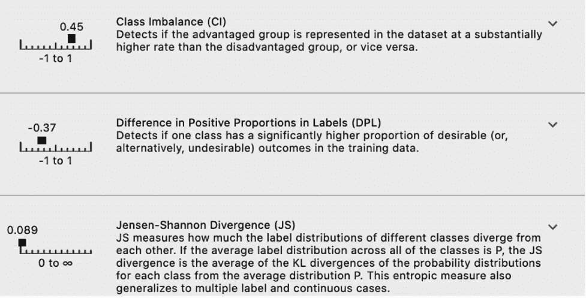

###### 图 5-17\. 通过 SageMaker Data Wrangler 偏差报告检测类不平衡。

除了使用 SageMaker Data Wrangler 检测数据偏差外，SageMaker Clarify 还帮助选择最佳的列（也称为“特征”）进行模型训练，在训练后检测模型的偏差，解释模型预测，并检测模型预测输入和输出的统计漂移。图 5-18 显示了 SageMaker Clarify 在机器学习流水线的其余阶段中的使用，包括模型训练、调优和部署。

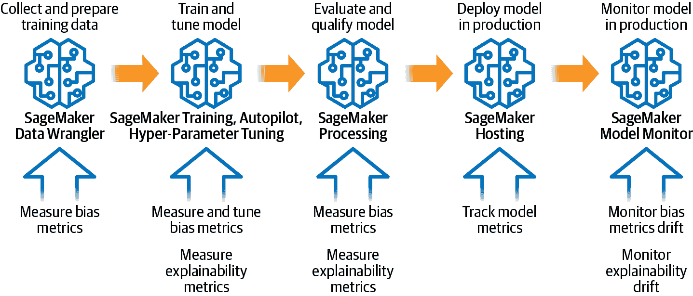

###### 图 5-18\. 使用 SageMaker Clarify 测量数据偏差、模型偏差、特征重要性和模型可解释性。

在第七章中，我们将计算“后训练”指标，以类似的方式检测模型预测中的偏差。在第九章中，我们将通过设定各种分布距离指标的阈值，将数据分布的漂移和模型可解释性计算在我们的生产中的实时模型上，将实时指标与从我们部署模型前的训练模型创建的基线指标进行比较，并在超过阈值后通知我们。

## 使用 SageMaker Clarify 处理作业检测偏差

我们还可以将 Clarify 作为 SageMaker 处理作业运行，以持续分析我们的数据集并在新数据到达时计算偏差度量。以下是配置和运行`SageMakerClarifyProcessor`作业的代码示例，使用`DataConfig`指定我们的输入数据集和`BiasConfig`指定我们要分析的`product_category`类别：

```
from sagemaker import clarify
import pandas as pd

df = pd.read_csv('./amazon_customer_reviews_dataset.csv')
bias_report_output_path = 's3://{}/clarify'.format(bucket)

clarify_processor = clarify.SageMakerClarifyProcessor(
	role=role,
	instance_count=1,
	instance_type='ml.c5.2xlarge',
	sagemaker_session=sess)

data_config = clarify.DataConfig(
	s3_data_input_path=data_s3_uri,
	s3_output_path=bias_report_output_path,
	label='star_rating',
	headers=df.columns.to_list(),
	dataset_type='text/csv')

data_bias_config = clarify.BiasConfig(
	label_values_or_threshold=[5, 4],
	facet_name='product_category',
	facet_values_or_threshold=['Gift Card'],
	group_name=product_category)

clarify_processor.run_pre_training_bias(
    data_config=data_config,
    data_bias_config=data_bias_config,
    methods='all', 
    wait=True)
```

我们正在使用`methods='all'`来在“预训练”阶段计算所有数据偏差度量，但我们可以指定度量列表，包括 CI、DPL、JS、Kullback–Leibler divergence (KL)、Lp-norm (LP)、total variation distance (TVD)、Kolmogorov–Smirnov metric (KS)和 conditional demographic disparity (CDD)。

一旦`SageMakerClarifyProcessor`作业完成对我们的数据集进行偏差分析，我们可以在 SageMaker Studio 中查看生成的偏差报告，如图 5-19 所示。此外，SageMaker Clarify 生成*analysis.json*文件以及包含偏差度量的*report.ipynb*文件，用于可视化偏差度量并与同事分享。

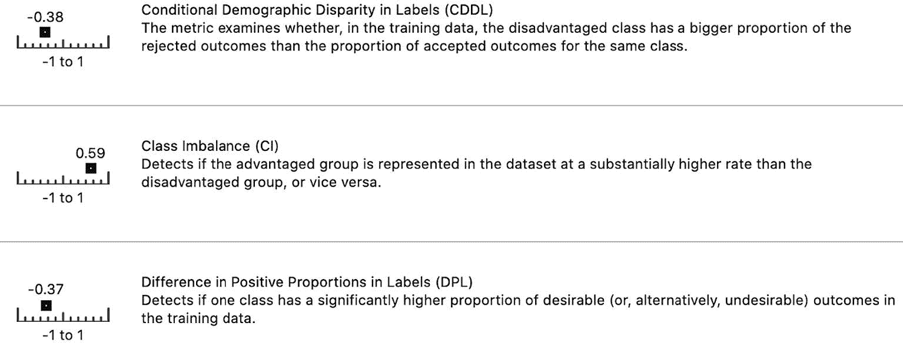

###### 图 5-19\. 由 SageMaker Processing Job 生成的 SageMaker Clarify 偏差报告摘录。

## 将偏差检测集成到自定义脚本中，使用 SageMaker Clarify 开源工具

SageMaker 还将 Clarify 作为独立的、[开源 Python 库](https://oreil.ly/9qIUn)提供，以将偏差和漂移检测集成到我们的自定义 Python 脚本中。以下是使用`smclarify` Python 库从 CSV 文件中检测偏差和类不平衡的示例。要安装此库，请使用`pip install smclarify`：

```
from smclarify.bias import report
import pandas as pd

df = pd.read_csv('./amazon_customer_reviews_dataset.csv')

facet_column = report.FacetColumn(name='product_category')

label_column = report.LabelColumn(
    name='star_rating',
    data=df['star_rating'],
    positive_label_values=[5, 4]
 )
group_variable = df['product_category']

report.bias_report(
    df,
    facet_column,
    label_column,
    stage_type=report.StageType.PRE_TRAINING,
    group_variable=group_variable
)
```

结果如下所示：

```
[{'value_or_threshold': 'Gift Card',
  'metrics': [{'name': 'CDDL',
    'description': 'Conditional Demographic Disparity in Labels (CDDL)',
    'value': -0.3754164610069102},
   {'name': 'CI',
    'description': 'Class Imbalance (CI)',
    'value': 0.4520671273445213},
   {'name': 'DPL',
    'description': 'Difference in Positive Proportions in Labels (DPL)',
    'value': -0.3679426717770344},
   {'name': 'JS',
    'description': 'Jensen-Shannon Divergence (JS)',
    'value': 0.11632161004661548},
   {'name': 'x',
    'description': 'Kullback-Leibler Divergence (KL)',
    'value': 0.3061581684888518},
   {'name': 'KS',
    'description': 'Kolmogorov-Smirnov Distance (KS)',
    'value': 0.36794267177703444},
   {'name': 'LP', 'description': 'L-p Norm (LP)', 'value': 0.5203495166028743},
   {'name': 'TVD',
    'description': 'Total Variation Distance (TVD)',
    'value': 0.36794267177703444}]},
}]
```

## 通过平衡数据来减少数据偏差

通过平衡评级星级和产品类别中评论数量的平衡来减少数据集中的不平衡，如下所示。图 5-20 展示了使用 Seaborn 对三个样本产品类别进行的结果可视化：

```
df_grouped_by = df.groupby(
  ["product_category", "star_rating"]
)[["product_category", "star_rating"]]

df_balanced = df_grouped_by.apply(
	lambda x: x.sample(df_grouped_by.size().min())\
	.reset_index(drop=True)
	)

import seaborn as sns

sns.countplot(data=df_balanced, 
			  x="star_rating", 
			  hue="product_category")
```

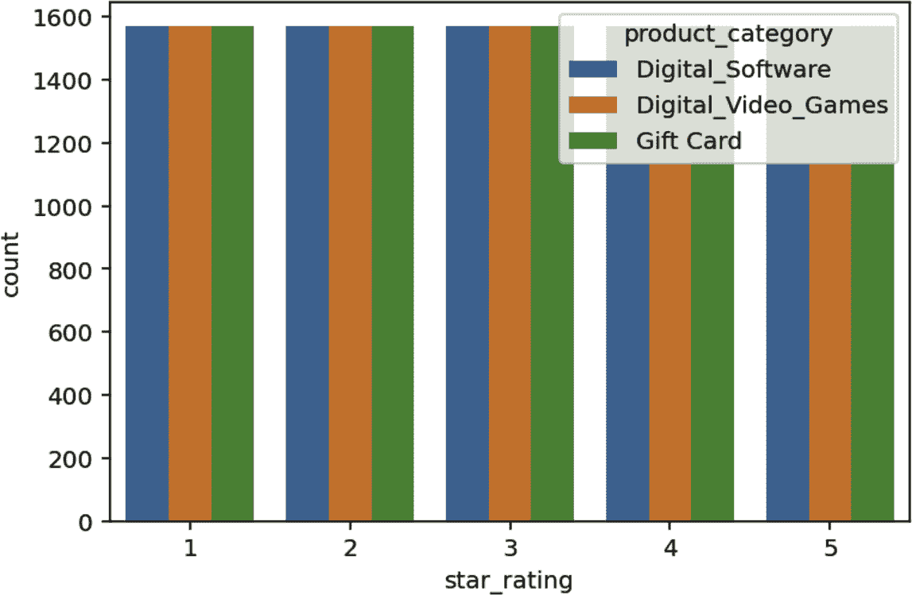

###### 图 5-20\. 现在评级星级和产品类别中的评论数量已经平衡。

我们可以在平衡数据集上重新运行 SageMaker Clarify 的偏差分析。以下是“Gift Card”类别面值的样本结果：

```
[{'value_or_threshold': 'Gift Card',
  'metrics': [{'name': 'CDDL',
    'description': 'Conditional Demographic Disparity in Labels (CDDL)',
    'value': 0.0},
   {'name': 'CI',
    'description': 'Class Imbalance (CI)',
    'value': 0.3333333333333333},
   {'name': 'DPL',
    'description': 'Difference in Positive Proportions in Labels (DPL)',
    'value': 0.0},
   {'name': 'JS',
    'description': 'Jensen-Shannon Divergence (JS)',
    'value': 0.0},
   {'name': 'KL',
    'description': 'Kullback-Leibler Divergence (KL)',
    'value': 0.0},
   {'name': 'KS',
    'description': 'Kolmogorov-Smirnov Distance (KS)',
    'value': 0.0},
   {'name': 'LP', 'description': 'L-p Norm (LP)', 'value': 0.0},
   {'name': 'TVD',
    'description': 'Total Variation Distance (TVD)',
    'value': 0.0}]}]
```

我们可以看到除一个偏差度量值外，所有偏差度量值均为 0，这表明三个产品类别之间的分布是均等的。类不平衡度量值为 0.33 表示均衡，因为我们总共有三个产品类别。其他两个产品类别，Digital_Software 和 Digital_Video_Games，其类不平衡度量值也为 0.33，如下所示：

```
[{'value_or_threshold': 'Digital_Software',
  'metrics': [
   ...
   {'name': 'CI',
    'description': 'Class Imbalance (CI)',
    'value': 0.3333333333333333},
   ...
   ]}
]

[{'value_or_threshold': 'Digital_Video_Games',
  'metrics': [
   ...
   {'name': 'CI',
    'description': 'Class Imbalance (CI)',
    'value': 0.3333333333333333},
   ...
   ]}
]
```

类不平衡度量值为 0.33 表示数据集均衡，因为我们正在分析三个产品类别。如果我们分析四个产品类别，每个产品类别的理想类不平衡度量值将为 0.25。

# 使用 SageMaker Clarify 检测不同类型的漂移

数据分布中的统计变化通常称为统计术语中的“变化”，或者应用数据科学术语中的“漂移”。漂移的多种类型包括“协变量漂移”、“标签漂移”和“概念漂移”。协变量漂移发生在模型输入（自变量）的数据分布中。标签漂移发生在模型输出（因变量）的数据分布中。概念漂移发生在标签的实际定义因特定特征（如地理位置或年龄组）而改变时。

###### 注意

本书中，我们通常将“漂移”和“变化”这两个术语互换使用，以表示统计分布的变化。有关分布漂移/变化类型的更多信息，请参见[d2l.ai](https://oreil.ly/HjtbC)。

让我们通过分析美国不同地区对“软饮料”有不同名称来分析概念漂移。美国东部地区称软饮料为“苏打水”，北中部地区称其为“汽水”，南部地区则称其为“可乐”。相对于地理位置的标签变化（概念漂移）在图 5-21 中有所说明。

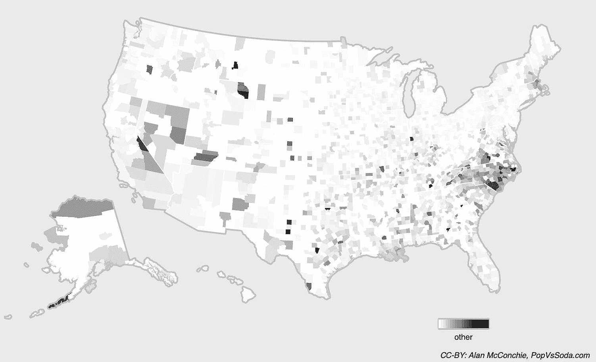

###### 图 5-21\. 美国软饮料名称的概念漂移。来源：[*http://popvssoda.com*](http://popvssoda.com).

另一个概念漂移的例子涉及我们早期的书评者，他在描述第九章时使用“牛肉”一词。虽然这个术语最初被本书的美国和德国作者解释为负面的，但我们意识到在书评者的地理位置和年龄组中，“牛肉”一词意味着积极的含义。如果我们要建立一个用于分类我们书评的模型，我们可能需要考虑到评审人员的地理位置和年龄，或者也许为不同的地点和年龄建立单独的模型。

要检测协变量漂移和标签漂移，我们在模型训练期间计算基线统计信息。然后，我们可以使用之前讨论过的各种统计分布距离度量设置阈值，例如 KL、KS、LP、L-infinity norm 等。这些度量回答了关于偏差的各种问题。例如，散度度量 KL 回答了“不同产品类别的星级评分分布有多不同？”而 KS 度量则回答了“每个产品类别中哪些星级评分造成了最大的差异？”

如果计算得出的漂移大于给定的阈值，SageMaker 可以警告我们并自动触发重新训练操作。例如，为了检测预测标签相对于特定特征的概念漂移，我们使用 SageMaker 模型监控捕获实时模型输入和输出，并将模型输入发送到线下人工标注工作流程以创建地面真实标签。我们使用 SageMaker Clarify 将捕获的模型输出与人类提供的地面真实标签进行比较。如果模型输出的分布相对于地面真实标签超出了给定阈值，SageMaker 可以通知我们并自动触发模型重新训练。我们展示了如何使用 SageMaker 模型监控和 Clarify 来监控第九章中的实时预测。

在第九章中，我们展示了 SageMaker 模型监控如何对实时模型输入和输出进行采样，计算模型特征重要性和可解释性统计，并将这些统计数据与从我们训练的模型创建的基准进行比较。如果 SageMaker 模型监控检测到特征重要性和模型可解释性相对于基准的变化，它可以自动触发模型重新训练，并通知适当的科学家或工程师。

# 使用 AWS Glue DataBrew 分析我们的数据

我们还可以使用 Glue DataBrew 来分析我们的数据。虽然它与 SageMaker 的谱系和工件跟踪没有原生集成，但 DataBrew 提供了一个流畅、互动的视觉界面，可以在不编写任何代码的情况下进行数据摄取和分析。我们可以连接来自数据湖、数据仓库和数据库的数据源。让我们将亚马逊客户评论数据集（Parquet 格式）加载到 DataBrew 中，并分析一些可视化效果：

```
db.create_dataset(
    Name='amazon-reviews-parquet',
    Input={
        'S3InputDefinition': {
            'Bucket': 'amazon-reviews-pds',
            'Key': 'parquet/'
        }
    }
)
```

一旦在 DataBrew 中创建了数据集，我们开始看到相关性和其他摘要统计信息，如图 5-22 所示。具体来说，我们可以看到`helpful_votes`和`total_votes`之间存在强相关性，而`star_rating`与`helpful_votes`或`total_votes`均不相关。

除了相关性之外，DataBrew 还突出显示了缺失单元格、重复行和类别不平衡情况，如图 5-23 所示。

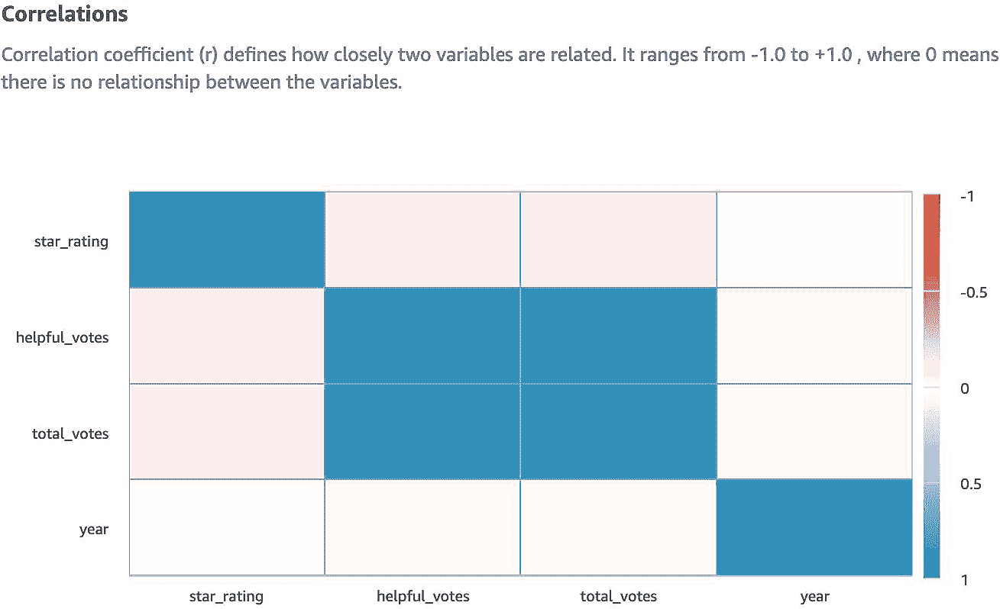

###### 图 5-22\. Glue DataBrew 展示了数据集列之间的相关性。

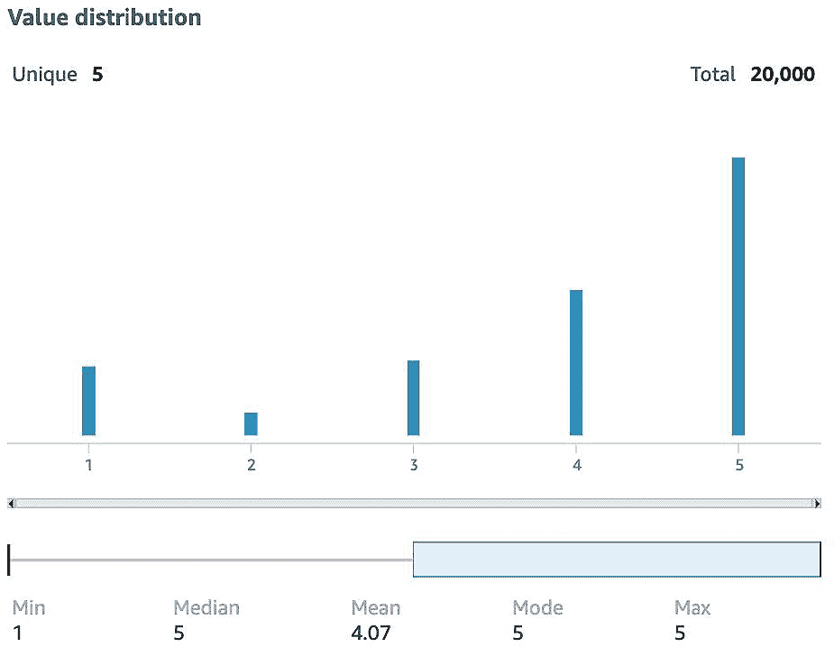

###### 图 5-23\. Glue DataBrew 突出显示了星级评分类别 1-5 之间的类别不平衡情况。

我们可以使用 Glue DataBrew 进行大量数据分析和转换用例，但是对于基于机器学习的工作负载，我们应该使用 SageMaker Data Wrangler 以便在整个流水线中更好地跟踪我们的数据和模型谱系。

# 降低成本，提高性能

在本节中，我们希望提供一些技巧，帮助在数据探索过程中降低成本并提高性能。我们可以通过使用近似计数来优化大数据集中昂贵的 SQL `COUNT` 查询。利用 Redshift AQUA，我们可以减少网络 I/O 并提升查询性能。如果我们觉得 QuickSight 仪表板的性能可以得到提升，可以考虑启用 QuickSight SPICE。

## 使用共享的 S3 存储桶存储非敏感 Athena 查询结果

通过为我们团队选择一个共享的 S3 位置来存储 Athena 查询结果，我们可以重复使用缓存的查询结果，提升查询性能，并节省数据传输成本。以下代码示例突出了 `s3_staging_dir`，这个目录可以在不同的团队成员之间共享，以改善常见查询的性能：

```
from pyathena import connect
import pandas as pd

# Set the Athena query results S3 bucket
s3_staging_dir = 's3://{0}/athena/staging'.format(bucket)

conn = connect(region_name=region, s3_staging_dir=s3_staging_dir)

sql_statement="""
SELECT DISTINCT product_category from {0}.{1} 
ORDER BY product_category 
""".format(database_name, table_name)

pd.read_sql(sql_statement, conn)
```

## 使用 HyperLogLog 进行近似计数

在分析中，计数是非常重要的。我们经常需要计算用户数（日活跃用户）、订单数、退货数、支持电话等。在不断增长的数据集中保持超快速的计数能力可能是与竞争对手的关键优势。

Amazon Redshift 和 Athena 都支持 HyperLogLog（HLL），这是一种“基数估计”或 `COUNT DISTINCT` 算法，旨在在很短的时间内提供高度精确的计数（< 2% 的误差），并且只需很小的存储空间（1.2 KB）来存储 1.5 亿个以上的计数。HLL 是一种概率数据结构，在计数类似点赞数、页面访问数、点击量等场景中非常常见。

###### 注意

其他形式的 HLL 包括 HyperLogLog++、Streaming HyperLogLog 和 HLL-TailCut+ 等。Count-Min Sketch 和 Bloom Filters 是用于近似计数和集合成员关系的类似算法。局部敏感哈希（LSH）是另一种在大数据集上计算“模糊”相似度度量的流行算法，且占用空间很小。

这种工作方式是，当在数据库中插入新数据时，Amazon Redshift 和 Athena 会更新一个小的 HLL 数据结构（类似于一个小型哈希表）。当用户发送计数查询时，Amazon Redshift 和 Athena 只需在 HLL 数据结构中查找该值，然后快速返回结果，而无需物理扫描整个集群中的所有磁盘进行计数。

让我们比较在 Amazon Redshift 中 `SELECT APPROXIMATE COUNT()` 和 `SELECT COUNT()` 的执行时间。以下是 `SELECT APPROXIMATE COUNT()` 的执行示例：

```
%%time
df = pd.read_sql_query("""
SELECT APPROXIMATE COUNT(DISTINCT customer_id)
FROM {}.{}
GROUP BY product_category
""".format(redshift_schema, redshift_table_2015), engine)
```

对于这个查询，我们应该看到类似于以下输出：

```
    CPU times: user 3.66 ms, sys: 3.88 ms, total: 7.55 ms
    Wall time: 18.3 s
```

接下来是，`SELECT COUNT()`：

```
%%time
df = pd.read_sql_query("""
SELECT COUNT(DISTINCT customer_id)
FROM {}.{}
GROUP BY product_category
""".format(redshift_schema, redshift_table_2015), engine)
```

对于这个查询，我们应该看到类似于以下输出：

```
    CPU times: user 2.24 ms, sys: 973 μs, total: 3.21 ms
    Wall time: 47.9 s
```

###### 注意

请注意，我们首先运行 `APPROXIMATE COUNT` 来排除查询缓存带来的性能提升。`COUNT` 的速度要慢得多。如果我们重新运行，由于查询缓存的存在，这两个查询都将变得非常快。

我们看到，在这种情况下，`APPROXIMATE COUNT DISTINCT`比常规的`COUNT DISTINCT`快 160%。结果大约相差 1.2%，满足 HLL 保证的小于 2%的误差。

请记住，HLL 是一种近似方法，可能不适用于需要精确数字（例如财务报告）的用例。

## 使用 AQUA 动态扩展 Amazon Redshift 的数据仓库

现有的数据仓库在查询执行期间将数据从存储节点移动到计算节点。这需要节点间的高网络 I/O，降低了整体查询性能。AQUA（高级查询加速器）是我们 Amazon Redshift 数据仓库顶部的硬件加速、分布式缓存。AQUA 使用定制的 AWS 设计芯片直接在缓存中执行计算。这减少了从存储节点到计算节点移动数据的需求，因此减少了网络 I/O 并增加了查询性能。这些 AWS 设计的芯片采用可编程门阵列实现，有助于加快数据加密和压缩，确保我们数据的最大安全性。AQUA 还可以动态扩展更多的容量。

## 使用 QuickSight SPICE 改进仪表板性能

QuickSight 是使用“超快、并行、内存计算引擎”SPICE 构建的。SPICE 使用列存储、内存存储和机器代码生成的组合来在大型数据集上运行低延迟查询。QuickSight 在底层数据源（包括 Amazon S3 和 Redshift）数据更改时更新其缓存。

# 摘要

在本章中，我们使用 AWS 分析堆栈中的工具（包括 Athena 和 Amazon Redshift）回答了关于我们数据的各种问题。我们使用 QuickSight 创建了业务智能仪表板，并使用开源的 AWS Deequ 和 Apache Spark 部署了 SageMaker Processing Job，以持续监控数据质量并在新数据到达时检测异常。这种持续的数据质量监控增强了我们数据管道的信心，并允许包括数据科学家和 AI/ML 工程师在内的下游团队开发高度精确和相关的模型，供我们的应用程序消费。我们还使用 Glue DataBrew 和 SageMaker Data Wrangler 分析我们的数据，寻找相关性、异常、不平衡和偏见。

在第六章中，我们将从数据集中选择并准备特征，以在第七章和第八章中用于模型训练和优化阶段。
