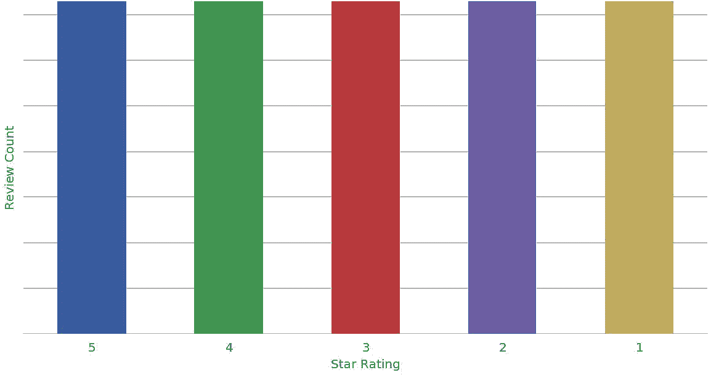

# 第六章：为模型训练准备数据集

在上一章中，我们使用 SageMaker Studio 和各种基于 Python 的可视化库探索了我们的数据集。我们使用亚马逊客户评论数据集获得了一些关键的业务见解。此外，我们使用 SageMaker 处理作业、Apache Spark 和 AWS Deequ 开源库对数据集执行了汇总统计和质量检查。

在本章中，我们讨论如何将人类可读文本转换为机器可读向量，这个过程称为“特征工程”。具体来说，我们将从亚马逊客户评论数据集的原始`review_body`列转换为 BERT 向量。我们将使用这些 BERT 向量来训练和优化评审分类器模型，在第七章和第八章分别进行。我们还将深入探讨自然语言处理和 BERT 在第七章的起源。

我们将使用评审分类器模型来预测社交渠道、合作伙伴网站等的产品评论的`star_rating`。通过预测在实际环境中的评论`star_rating`，产品管理和客户服务团队可以使用这些预测来在问题公开发生之前解决质量问题，而不是等待直接的入站电子邮件或电话。这将把检测质量问题的平均时间从几天/几月缩短到分钟/小时。

# 执行特征选择和工程

AI 和机器学习算法是数值优化方法，操作的是数字和向量，而不是原始文本和图像。这些向量通常被称为“嵌入”，它们被投射到高维向量空间中。算法在这个高维向量空间中执行优化。

One-hot 编码是在表格数据集中用于分类数据的一种嵌入形式。使用 One-hot 编码，我们将每个分类值表示为一个唯一的 0 和 1 组成的向量。向量的维度数量——每个向量的大小——等于唯一分类值的数量。

AI 和机器学习中最重要的一个方面是特征工程，通常需要比典型机器学习流水线中的任何其他阶段更多的时间。特征工程有助于减少数据的维度，防止某些特征在统计上主导算法，加快模型训练时间，减少数值不稳定性，并提高整体模型预测准确性。

通过许多特征工程迭代和可视化，我们将开始真正理解我们的数据集，包括异常值、相关性和主成分。在模型的背景下分析特征，我们还会对哪些特征比其他特征更重要有直觉。某些特征将改善模型性能，而其他特征则显示没有改进或降低模型性能。

粗心的特征工程可能会导致灾难性的结果。最糟糕的情况下，糟糕的特征工程可能会导致社会上具有种族、性别和年龄偏见的模型传播。最好的情况下，糟糕的特征工程会产生次优的模型，导致推荐电影不准确，过度估计收入预测或者创建过多的库存。

虽然领域专家确实可以帮助评估包括哪些特征及其工程化方式，但我们数据集中存在一些“潜在”特征，人类并不立即能够识别。Netflix 的推荐系统以发现超出传统戏剧、恐怖和浪漫喜剧等通常流派的新电影流派而闻名。例如，他们发现了非常具体的流派，如“血腥的加拿大复仇电影”、“11-12 岁观众的关于马的感情电影”、“根据经典文学改编的浪漫犯罪电影”和“淫秽的疯狂科学家喜剧”。

###### 注意

许多这些“秘密”流派是通过 Netflix 的观看历史服务——也称为“VHS”，这是对上世纪八九十年代流行的录像带格式的一种回顾——发现的。

在高层次上，特征工程分为三种逻辑类型：选择、创建和转换。并非所有类型都适用于我们的用例，但应考虑并进行探索。

特征选择确定最能代表我们数据集的数据属性。此外，特征选择使用统计方法过滤掉不相关和冗余的属性。例如，如果两个数据点高度相关，比如`total_votes`和`helpful_votes`，那么也许只需要一个来训练我们的模型。只选择其中一个属性有助于降低特征维度并更快地训练模型，同时保持模型准确性。

特征创建将现有的数据点结合成新特征，有助于提高我们模型的预测能力。例如，将`review_headline`和`review_body`组合成一个单一特征可能比单独使用它们更能提高预测准确性。

特征转换将数据从一种表示转换为另一种，以便于机器学习。将连续值如时间戳转换为小时、天或月的分类“桶”，有助于减少维度。虽然在分桶转换过程中我们会失去一些信息和细节，但我们的模型实际上可能会从更广泛的泛化中受益。两种常见的统计特征转换是归一化和标准化。归一化将特定数据点的所有值缩放到 0 到 1 之间，而标准化则将值转换为均值为 0、标准差为 1。与归一化相比，标准化通常更受欢迎，因为它比归一化更好地处理异常值，并允许我们比较不同单位和尺度的特征。这些技术有助于减少大数值数据点（如以千计表示的评论数）和小数值数据点（如以十计表示的`helpful_votes`）之间的影响差异。如果没有这些技术，模型可能会在数值大小上偏向于评论数而忽略`helpful_votes`。

让我们从特征选择到特征转换走一遍典型的特征工程流水线，如图 6-1 所示。


###### 图 6-1\. 典型特征工程流水线中的步骤。

## 基于特征重要性选择训练特征

我们可以使用 SageMaker Data Wrangler 的“快速模型”分析来评估我们的数据中哪些列在预测给定标签（在我们的情况下是`star_rating`）时最有用。我们只需选择要让 Data Wrangler 分析的数据，以及我们想要预测的`star_rating`标签。Data Wrangler 自动预处理数据，训练“快速模型”，评估模型，并计算每个特征的特征重要性分数。图 6-2 展示了使用 Data Wrangler 的快速模型分析功能对我们的亚马逊客户评论数据集进行特征重要性分析的结果。


###### 图 6-2\. 数据整理师快速模型分析允许我们分析特征重要性。

在快速模型分析之后，我们数据集中最重要的特征是`review_body`，其次是`review_headline`、`product_title`和`product_category`。

因为我们计划使用我们的模型来分类来自社交渠道和合作伙伴网站的产品评论，“在野外”，这些评论只有原始的评论文本，所以我们决定只使用`review_body`列来预测`star_rating`。在我们的情况下，`star_rating`是“标签”，而`review_body`的转换版本是“特征”。`star_rating`标签是我们训练数据集中的实际`star_rating`值，从中我们训练出的模型将学习在第七章中预测的值。从原始文本转换为一系列 BERT 向量的`review_body`特征，是我们模型训练过程的输入。在本章的后面部分，我们将演示如何将原始文本转换为 BERT 向量。

我们同时使用特征和标签来训练我们的模型，以从社交渠道和合作伙伴网站的`review_body`文本中预测`star_rating`标签。接下来，我们将`star_rating`和`review_body`列视为 pandas DataFrame：

```
df = pd.read_csv('./data/amazon_reviews_us_Digital_Software_v1_00.tsv.gz', 
            delimiter='\t', 
            quoting=csv.QUOTE_NONE,
            compression='gzip')

df.head(5)
```

| star_rating | review_body |
| --- | --- |
| 1 | 剥夺用户能力的差劲商业决策... |
| 5 | Avast 是一个易于使用和下载的产品。我觉得...... |
| 2 | 从一开始就有问题。已经过去 30 天，... |
| 4 | 运行良好。 |
| 3 | 使用起来困难 |

由于`star_rating`标签是离散的分类特征（1、2、3、4 或 5），我们将使用“分类”算法。我们不将其视为回归问题，因为我们使用的是仅具有五个可能值（1、2、3、4 或 5）的`star_rating`作为分类特征。如果`star_rating`包含连续值，比如 3.14、4.20 或 1.69，则我们可能会使用`star_rating`作为具有回归模型的连续特征。

我们将不再使用传统的机器学习分类算法，而是使用基于 Keras API 和 TensorFlow 2.x 的基于神经网络的分类模型。我们将在下一章节深入研究模型训练。让我们继续并准备我们的亚马逊客户评论数据集，以训练一个能够从`review_body`文本中预测`star_rating`（1–5）的模型。

## 平衡数据集以提高模型准确性

在上一章节中，我们展示了数据集中所有评论的`star_rating`分布情况，发现大约 62%的评论的`star_rating`为 5，如图 6-3 所示。


###### 图 6-3\. 我们的数据集包含了星级评价不平衡的评论数量。

如果我们在这个不平衡的数据集上进行天真的训练，我们的分类器可能会简单地学会预测`star_rating`为 5，因为在 5 个类别（1、2、3、4 或 5）上，62% 的准确率比随机准确率（20%）要好。换句话说，在现实中，一个不平衡的训练数据集可能会创建一个模型，该模型只学会在每次预测时预测 5。这种模型在生产环境中表现不佳。

###### 注意

一些算法如 XGBoost 支持缩放因子以抵消不平衡类的问题。然而，一般来说，在特征工程过程中处理类别不平衡是个好主意，以避免后续误用这些特征。

平衡数据集并防止偏向特定类别有两种常见方法：对多数类进行欠采样（`star_rating` 5）和对少数类进行过采样（`star_rating` 2 和 3）。在选择采样策略时，我们应仔细考虑采样如何影响特征数据分布的整体均值和标准差。我们在图 6-4 中看到欠采样的示例和图 6-5 中看到过采样的示例。


###### 图 6-4\. 将多数类欠采样至少数类。


###### 图 6-5\. 将少数类过采样至多数类。

思路是沿着特定标签或常称的“类”均匀分布数据。在我们的情况下，类别是我们的分类 `star_rating` 字段。因此，我们希望我们的训练数据集包含每个 `star_rating`：1、2、3、4 和 5 的一致数量的评论。以下是使用 `star_rating` 对原始数据集进行欠采样的代码：

```
df_grouped_by = df.groupby(["star_rating"])

df_balanced = df_grouped_by.apply(
	lambda x: x.sample(df_grouped_by.size().min())\
	.reset_index(drop=True)
)
```

现在我们有一个平衡的数据集，如图 6-6 所示。



###### 图 6-6\. `star_rating` 类的平衡数据集。

欠采样的一个缺点是，训练数据集的大小被采样到最小类别的大小。这可能通过减少来自欠采样类的信号，降低了训练模型的预测能力和鲁棒性。在本例中，我们将评论数量从大约 100,000 减少到 35,000，减少了 65%。

过采样将为代表性不足的类别人工创建新数据。在我们的情况下，`star_rating` 2 和 3 代表性不足。一种常见的技术称为*合成少数类过采样技术*，它使用统计方法从现有数据中合成生成新数据。当我们拥有更大的数据集时，它们通常能发挥更好的效果，因此在使用少数样本的小数据集时要小心使用过采样。

## 将数据集分割为训练、验证和测试集

模型开发通常遵循三个阶段：模型*训练*，模型*验证*和模型*测试*（参见图 6-7）。


###### 图 6-7\. 典型模型开发生命周期的阶段。

为了与这三个阶段保持一致，我们将平衡的数据分割成单独的训练、验证和测试数据集。训练数据集用于模型训练。验证数据集用于验证称为“超参数”的模型训练配置。而测试数据集用于测试选择的超参数。对于我们的模型，我们选择了 90%的训练数据、5%的验证数据和 5%的测试数据，因为这种分布，在图表 6-8 中显示的工作效果很好，适合我们的数据集和模型。


###### 图表 6-8\. 模型开发生命周期典型阶段的数据集拆分。

让我们使用 scikit-learn 的`train_test_split`函数来分割数据，其中`stratify`参数设置为`star_rating`字段，以保持我们先前的平衡努力。如果不指定`stratify`参数，拆分函数可以自由选择给定数据集中的任何数据，导致拆分变得不平衡。

```
from sklearn.model_selection import train_test_split

# Split all data into 90% train and 10% holdout
df_train, df_holdout = train_test_split(
	df_balanced, 
	test_size=0.10,
    stratify=df_balanced['star_rating'])

# Split holdout data into 50% validation and 50% test
df_validation, df_test = train_test_split(
	df_holdout,
	test_size=0.50,
	stratify=df_holdout[ 'star_rating'])
```

在这种情况下，我们不使用 k 折交叉验证——一种经典的机器学习技术，该技术在不同的拆分中重复使用数据的每一行，包括训练、验证和测试。K 折交叉验证传统上适用于较小的数据集，在我们的情况下，由于数据量很大，我们可以避免 k 折的缺点：在训练、验证和测试阶段之间的数据“泄漏”。数据泄漏可能会导致我们训练模型的人工膨胀的模型准确性。这些模型在实验室外的真实世界数据上表现不佳。总之，训练、验证和测试的每个阶段都应使用单独和独立的数据集，否则可能会发生泄漏。

在相关说明中，时间序列数据通常容易在拆分之间泄漏。公司通常希望在将模型推向生产之前，使用“回溯”历史信息验证新模型。在处理时间序列数据时，请确保模型不会意外地窥视未来。否则，这些模型可能看起来比它们实际上更准确。

###### 注意

几乎在电影《回到未来》中，窥探未来几乎导致了灾难。同样地，窥探未来可能会给我们的建模工作带来麻烦。

此外，我们可能希望将同一客户的所有数据保留在同一拆分中。否则，个人客户数据将分散在多个拆分中，可能会引发问题。在这种情况下，我们将在创建拆分之前按`customer_id`对数据进行分组。我们的模型不要求我们按`customer_id`分组数据，所以我们将跳过这一步。

在使用 SageMaker 处理大规模数据时，我们可以将数据跨多个实例分布在一个集群中。这被称为*分片*，我们稍后将演示如何在 SageMaker 集群中使用 scikit-learn、Apache Spark 和 TensorFlow 转换数据时进行多实例处理。

## 将原始文本转换为 BERT 嵌入向量。

我们将使用 TensorFlow 和一种称为[BERT](https://oreil.ly/HBic8)的最先进的自然语言处理（NLP）和自然语言理解神经网络架构。稍后我们将深入探讨*BERT*。从高层次来看——与以往的 NLP 模型（如[Word2Vec](https://oreil.ly/nKuFP)）不同，BERT 捕捉了每个句子中每个单词的双向（从左到右和从右到左）上下文。这使得 BERT 能够学习同一个单词在不同句子中的不同含义。例如，单词*bank*在以下两个句子中的含义不同：“一个小偷从*银行*金库偷走了钱”和“后来，他在河边*钓鱼*时被逮捕。”

对于每个`review_body`，我们使用 BERT 在先前学习的、30,000 个词或“令牌”的高维向量空间内创建特征向量。BERT 通过在包括维基百科和谷歌图书在内的数百万文档上进行训练来学习这些令牌。

图 6-9 展示了 BERT 如何将原始输入文本转换为最终的 BERT 嵌入，然后通过实际的模型架构进行传递。


###### 图 6-9\. BERT 将原始输入文本转换为嵌入。

BERT 首先将原始输入文本应用 WordPiece 令牌化。WordPiece 是一种在 NLP 任务中将单词分割为子词级别的技术，其词汇维度约为 30,000 个令牌。请注意，BERT 还在输入序列的开头添加特殊令牌，如[CLS]以标记分类任务。

接下来，BERT 通过查找任何输入令牌的 768 维向量表示来创建令牌嵌入。`input_id` 是指向相关令牌嵌入向量的实际 ID。`input_mask` 指定了 BERT 应关注的令牌（0 或 1）。如果我们将多个句子传递给 BERT，片段嵌入将把每个令牌映射到相应的输入句子（0 表示第一个句子，1 表示第二个句子）。然后，位置嵌入跟踪输入序列中每个令牌的位置（0、1、2 等）。我们将了解到，对于 BERT 来说，一个非常重要的超参数是`max_seq_length`，它定义了我们可以在每个样本中传递给 BERT 的最大输入令牌数。由于该参数的最大值为 512，位置嵌入是一个维度为 (512, 768) 的查找表。

在最后一步，BERT 创建了令牌嵌入、片段嵌入和位置嵌入的逐元素求和。得到的维度为 (n, 768) 的嵌入，其中 n 表示输入令牌的数量，将作为 BERT 的输入嵌入。

让我们使用 BERT 的一个变种称为[DistilBERT](https://oreil.ly/t90gS)。DistilBERT 是 BERT 的轻量级版本，速度快 60%，体积小 40%，同时保留了 97%的 BERT 语言理解能力。我们使用名为 Transformers 的流行 Hugging Face Python 库来执行转换。要安装此库，只需输入`pip install transformers:`

```
from transformers import DistilBertTokenizer

tokenizer = DistilBertTokenizer.from_pretrained('distilbert-base-uncased')

tokens = tokenizer.tokenize("""I needed an antivirus application and know
    the quality of Norton products. This was a no brainer for me and I am
    glad it was so simple to get.""")
```

分词器执行小写处理，并将文本解析成预训练的 DistilBERT 词汇表中包含的一组单词。Transformers 库使用另一个流行的名为 WordPieces 的库来将文本解析为单词 token：

```
print(tokens)

['i', 'needed', 'an', 'anti', '##virus', 'application', 'and', 'know', 'the', 
'quality', 'of', 'norton', 'products', '.', 'this', 'was', 'a', 'no', 
'brain', '##er', 'for', 'me', 'and', 'i', 'am', 'glad', 'it', 'was', 'so', 
'simple', 'to', 'get', '.']
```

大多数 BERT 变体，包括 DistilBERT，都有一个“最大序列长度”的概念，它定义了用于表示每个文本输入的最大 token 数量。在我们的情况下，任何经过 tokenization 后具有`max_seq_length` token 的评论将被截断为 64 个 token。少于 64 个 token 的评论将被填充到长度为 64 个 token。经验上，我们选择 64 作为最大序列长度，因为我们的评论中有 80%少于 64 个单词，正如我们在第五章中看到的，虽然不精确，但单词数是 token 数的一个很好的指示。以下是在第五章中呈现的每个评论的单词数量分布：

```
10%           2.000000
20%           7.000000
30%          19.000000
40%          22.000000
50%          26.000000
60%          32.000000
70%          43.000000
80%          63.000000 <===
90%         110.000000
100%       5347.000000
```

我们在特征工程和模型训练期间必须使用相同的最大序列长度。因此，如果我们想尝试不同的值，我们需要使用更新后的值重新生成 BERT 嵌入。如果我们不确定选择哪个值，可以尝试使用 128、256 和 512 作为最大序列长度生成多个版本的嵌入。这些对大多数 BERT 任务效果良好。更大的值可能会增加模型训练时间，因为维度更高。

但是，我们仍然需要进行更多处理，因为我们的 DistilBERT 模型使用了从前面基于文本的 token 导出的长度为 64 的数字数组：

`input_ids`

BERT 词汇表中 token 的数字 ID

`input_mask`

指定 BERT 应该关注哪些 token（0 或 1）

`segment_ids`

在我们的情况下始终为 0，因为我们正在执行单序列 NLP 任务（如果我们执行双序列 NLP 任务，如下一句预测，则为 1）

幸运的是，Transformers 分词器为我们创建了三个数组中的两个——并且根据最大序列长度进行了必要的填充和截断！

```
MAX_SEQ_LENGTH = 64

encode_plus_tokens = tokenizer.encode_plus(
    text_input.text,
    pad_to_max_length=True,
    max_length=MAX_SEQ_LENGTH)

# Convert tokens to ids from the pre-trained BERT vocabulary

input_ids = encode_plus_tokens['input_ids']
print(input_ids)
```

输出：

```
[101, 1045, 2734, 2019, 3424, 23350, 4646, 1998, 2113, 1996, 3737, 1997, 10770, 
3688, 1012, 2023, 2001, 1037, 2053, 4167, 2121, 2005, 2033, 1998, 1045, 2572, 
5580, 2009, 2001, 2061, 3722, 2000, 2131, 1012, 102, 0, 0, 0, 0, 0, 0, 0, 0, 0, 
0, 0, 0, 0, 0, 0, 0, 0, 0, 0, 0, 0, 0, 0, 0, 0, 0, 0, 0, 0, 0, 0, 0, 0, 0, 0, 
0, 0, 0, 0, 0, 0, 0, 0, 0, 0, 0, 0, 0, 0, 0, 0, 0, 0, 0, 0, 0, 0, 0, 0, 0, 0, 
0, 0, 0, 0, 0, 0, 0, 0, 0, 0, 0, 0, 0, 0, 0, 0, 0, 0, 0, 0, 0, 0, 0, 0, 0, 0, 
0, 0, 0, 0, 0, 0]

# Specifies which tokens BERT should pay attention to (0 or 1)
input_mask = encode_plus_tokens['attention_mask']
print(input_mask)
```

输出：

```
[1, 1, 1, 1, 1, 1, 1, 1, 1, 1, 1, 1, 1, 1, 1, 1, 1, 1, 1, 1, 1, 1, 1, 1, 1, 1,
1, 1, 1, 1, 1, 1, 1, 1, 1, 0, 0, 0, 0, 0, 0, 0, 0, 0, 0, 0, 0, 0, 0, 0, 0, 0, 
0, 0, 0, 0, 0, 0, 0, 0, 0, 0, 0, 0, 0, 0, 0, 0, 0, 0, 0, 0, 0, 0, 0, 0, 0, 0, 
0, 0, 0, 0, 0, 0, 0, 0, 0, 0, 0, 0, 0, 0, 0, 0, 0, 0, 0, 0, 0, 0, 0, 0, 0, 0, 
0, 0, 0, 0, 0, 0, 0, 0, 0, 0, 0, 0, 0, 0, 0, 0, 0, 0, 0, 0, 0, 0, 0, 0]
```

第三个数组，`segment_ids`，在我们的情况下很容易生成，因为它包含了所有的 0，因为我们正在执行单序列分类 NLP 任务。对于诸如问答的双序列 NLP 任务，`sequence_id`要么是 0（问题），要么是 1（答案）：

```
segment_ids = [0] * MAX_SEQ_LENGTH
print(segment_ids)
```

输出：

```
[0, 0, 0, 0, 0, 0, 0, 0, 0, 0, 0, 0, 0, 0, 0, 0, 0, 0, 0, 0, 0, 0, 0, 0, 0, 0,
0, 0, 0, 0, 0, 0, 0, 0, 0, 0, 0, 0, 0, 0, 0, 0, 0, 0, 0, 0, 0, 0, 0, 0, 0, 0, 
0, 0, 0, 0, 0, 0, 0, 0, 0, 0, 0, 0, 0, 0, 0, 0, 0, 0, 0, 0, 0, 0, 0, 0, 0, 0, 
0, 0, 0, 0, 0, 0, 0, 0, 0, 0, 0, 0, 0, 0, 0, 0, 0, 0, 0, 0, 0, 0, 0, 0, 0, 0, 
0, 0, 0, 0, 0, 0, 0, 0, 0, 0, 0, 0, 0, 0, 0, 0, 0, 0, 0, 0, 0, 0, 0, 0]
```

## 将特征和标签转换为优化的 TensorFlow 文件格式

我们特征工程旅程的最后一步是将我们新设计的特征存储在`TFRecord`文件格式（*.tfrecord*文件扩展名）中。`TFRecord`是一种二进制、轻量级文件格式，针对 TensorFlow 数据处理进行了优化，基于协议缓冲区（“protobufs”）。`TFRecord`是跨平台和跨语言的，对于数据处理工作负载非常高效。它们被编码和优化用于在模型训练期间使用的顺序、基于行的访问。此编码包含特征和标签，以及每个示例的任何相应元数据。

###### 注意

在机器学习上下文中，“示例”一词表示用于模型训练（包括标签）或预测（预测标签）的数据行。

虽然`TFRecord`是文件格式，`tf.train.Example`和`tf.train.Feature`是存储在`TFRecord`中最常见的数据结构。`tf.train.Feature`使用`tf.train.BytesList`、`FloatList`和`Int64List`分别存储`byte`、`float`或`int64`的列表。

这是使用 TensorFlow API 将我们的特征转换为`TFRecord`的代码：

```
import tensorflow as tf
import collections
tfrecord_writer = tf.io.TFRecordWriter(output_file)

tfrecord_features = collections.OrderedDict()

tfrecord_features['input_ids'] =
    tf.train.Feature(int64_list=tf.train.Int64List(
        value=input_ids))
tfrecord_features['input_mask'] =
    tf.train.Feature(int64_list=tf.train.Int64List(
        value=input_mask))
tfrecord_features['segment_ids'] =
    tf.train.Feature(int64_list=tf.train.Int64List(
        value=segment_ids))

# Target label (star_rating)
tfrecord_features['label_ids'] =
    tf.train.Feature(int64_list=tf.train.Int64List(
        value=[label_id]))

tfrecord = tf.train.Example(
	features=tf.train.Features(feature=tfrecord_features))

tfrecord_writer.write(tfrecord.SerializeToString())

tfrecord_writer.close()
```

`tf.train.Example.SerializeToString()`生成一个序列化的、二进制的、不可读的字符串，如下所示：

```
[b'\n\xfe\x03\n\x96\x01\n\x0bsegment_ids\x12\x86\x01\x1a\x83\x01\n\x80\x01\n\
xb6\x01\n\tinput_ids\x12\xa8\x01\x1a\xa5\x01\n\xa2\x01e\x95\x08\x8d\x10\x8a\
x1d\xd0\x0f\xd3\x10\xf4\x07f\n\x95\x01\n\ninput_mask\x12\x01\x01\x01\x01\x01\
x01\x01\n\tlabel_ids\x12\x05\x1a\x03\n\x01\x04']
```

# 使用 SageMaker 处理作业扩展特征工程

到目前为止，我们一直在 SageMaker 笔记本上处理数据集的一个样本。现在让我们把我们的自定义 Python 代码移到 SageMaker 处理作业中，并将我们的特征工程扩展到数据集中的所有 1.5 亿条评论。SageMaker 处理作业将我们的自定义脚本（即“脚本模式”）或 Docker 镜像（即“自定义容器”）并行化在许多 SageMaker 实例上，如图 6-10 所示。


###### 图 6-10\. SageMaker 处理作业可以在集群中的多个 SageMaker 实例上并行化代码和 Docker 镜像。

在后面的章节中，我们将使用端到端的流水线自动化这一步骤。现在，让我们把注意力集中在使用处理作业将我们的特征工程扩展到 SageMaker 集群上。

## 使用 scikit-learn 和 TensorFlow 进行转换

让我们使用 TensorFlow、scikit-learn、BERT 和 SageMaker 处理作业在集群中平衡、拆分和转换整个数据集，如图 6-11 所示。


###### 图 6-11\. 使用 scikit-learn 和 SageMaker 处理作业将原始文本转换为 BERT 嵌入。

首先，我们配置了 scikit-learn 处理作业的版本、实例类型和集群中的实例数量。由于变换是无状态的，我们使用的实例越多，处理速度就越快。请注意，我们仅使用 scikit-learn 来平衡和拆分数据。重要的工作是使用 TensorFlow 和 Transformers 完成的：

```
from sagemaker.sklearn.processing import SKLearnProcessor
from sagemaker.processing import ProcessingInput, ProcessingOutput

processor = SKLearnProcessor(framework_version='<SCIKIT_LEARN_VERSION>',
		                     role=role,
		                     instance_type='ml.c5.4xlarge',
		                     instance_count=2)
```

###### 提示

在 SageMaker 处理作业中，我们可以指定`instance_type='local'`来在笔记本内或本地笔记本上运行脚本。这使我们可以在笔记本上的小数据子集上“本地”运行处理作业，然后再启动全面的 SageMaker 处理作业。

接下来，我们通过指定转换特征的位置并将数据分片到我们处理作业集群中的两个实例，以减少转换数据所需的时间来启动 SageMaker 处理作业。我们指定输入数据集的 S3 位置和各种参数，如训练、验证和测试数据集的分割百分比。我们还提供了我们为 BERT 选择的`max_seq_length`：

```
processor.run(code='preprocess-scikit-text-to-bert.py',
  inputs=[
    ProcessingInput(input_name='raw-input-data',
                  source=raw_input_data_s3_uri,
                  destination='/opt/ml/processing/input/data/',
                  s3_data_distribution_type='ShardedByS3Key')
  ],
  outputs=[
    ProcessingOutput(output_name='bert-train',
                  s3_upload_mode='EndOfJob',                                     
                  source='/opt/ml/processing/output/bert/train'),
    ProcessingOutput(output_name='bert-validation',
                  s3_upload_mode='EndOfJob',                                     
                  source='/opt/ml/processing/output/bert/validation'),
    ProcessingOutput(output_name='bert-test',
                  s3_upload_mode='EndOfJob',
                  source='/opt/ml/processing/output/bert/test'),
  ],
  arguments=['--train-split-percentage', 
             str(train_split_percentage),
             '--validation-split-percentage',
             str(validation_split_percentage),
             '--test-split-percentage', 
             str(test_split_percentage),
             '--max-seq-length', str(max_seq_length)],
logs=True,
wait=False)
```

作业完成后，我们按如下方式检索 S3 输出位置：

```
output_config = processing_job_description['ProcessingOutputConfig']

for output in output_config['Outputs']:
  if output['OutputName'] == 'bert-train':
    processed_train_data_s3_uri = output['S3Output']['S3Uri']
  if output['OutputName'] == 'bert-validation':
    processed_validation_data_s3_uri = output['S3Output']['S3Uri']
  if output['OutputName'] == 'bert-test':
    processed_test_data_s3_uri = output['S3Output']['S3Uri']
```

## 使用 Apache Spark 和 TensorFlow 进行转换

Apache Spark 是由 SageMaker 处理作业支持的强大数据处理和特征转换引擎。虽然 Apache Spark 本身不原生支持 BERT，但我们可以在 PySpark 应用程序中使用基于 Python 的 BERT Transformers 库来在分布式 Spark 集群上扩展我们的 BERT 转换。在这种情况下，我们将 Spark 仅用作分布式处理引擎，Transformers 则作为集群中安装的另一个 Python 库，如图 6-12 和 6-13 所示。


###### 图 6-12\. 安装了多个流行库的 Apache Spark 集群，包括 TensorFlow 和 BERT。

Apache Spark ML 库包括文本特征工程的高度并行、分布式实现的词频-逆文档频率（TF-IDF）。TF-IDF 可以追溯到 1980 年代，需要一个有状态的预训练步骤来计算术语频率并在给定数据集上建立“词汇表”。这限制了 TF-IDF 在给定数据集之外学习更广泛的语言模型的能力。

另一方面，BERT 已在数百万文档上进行了预训练，并且通常在我们的自然语言数据集上比 TF-IDF 表现更好，因此我们将在这里使用 BERT 进行呈现的特征工程任务。


###### 图 6-13\. 使用 Apache Spark 将原始文本转换为 BERT 嵌入。

如果我们喜欢使用 Apache Spark，因为我们已经有一个基于 Spark 的特征工程管道，我们可以启动一个云原生、无服务器、按使用付费的 Apache Spark 集群来使用 SageMaker 处理作业从原始`review_body`数据创建 BERT 向量。

我们只需提供我们的 PySpark 脚本，指定实例类型，并决定集群实例计数 - SageMaker 将在集群上运行我们的 Spark 作业。由于 Spark 在更多内存的情况下表现更佳，我们使用高内存`r5`实例类型：

```
from sagemaker.spark.processing import PySparkProcessor

processor = PySparkProcessor(base_job_name='spark-amazon-reviews-processor',
                             role=role,
                             framework_version='<SPARK_VERSION>',
                             instance_count=2,
                             instance_type='ml.r5.xlarge',
                             max_runtime_in_seconds=7200)
```

让我们运行处理作业。由于 Apache Spark 能够直接读写 S3，我们不需要为我们的`run()`函数指定通常的`ProcessingInput`和`ProcessingOutput`参数。相反，我们使用`arguments`参数传入四个 S3 位置：一个用于原始 TSV 文件，另外三个用于训练、验证和测试集的生成 BERT 向量。我们还传递了 BERT 的分割百分比和`max_seq_length`：

```
train_data_bert_output = 's3://{}/{}/output/bert-train'.format(bucket,
                                     output_prefix)
validation_data_bert_output = 's3://{}/{}/output/bert-validation'.format(bucket, 
                                     output_prefix)
test_data_bert_output = 's3://{}/{}/output/bert-test'.format(bucket,
                                     output_prefix)
processor.run(submit_app='preprocess-spark-text-to-bert.py',
              arguments=['s3_input_data', 
                         s3_input_data,
                         's3_output_train_data', 
                         train_data_bert_output,
                         's3_output_validation_data', 
                         validation_data_bert_output,
                         's3_output_test_data', 
                         test_data_bert_output,                         
                         'train_split_percentage', 
                         str(train_split_percentage),
                         'validation_split_percentage', 
                         str(validation_split_percentage),
                         'test_split_percentage', 
                         str(test_split_percentage),
                         'max_seq_length', 
                         str(max_seq_length) 
              ],
              outputs=[
                ProcessingOutput(s3_upload_mode='EndOfJob',
                  output_name='bert-train',                                        
                  source='/opt/ml/processing/output/bert/train'),
                ProcessingOutput(s3_upload_mode='EndOfJob',
                  output_name='bert-validation',
                  source='/opt/ml/processing/output/bert/validation'),
                ProcessingOutput(s3_upload_mode='EndOfJob',
                  output_name='bert-test',
                  source='/opt/ml/processing/output/bert/test'),
              ],          
              logs=True,
              wait=False
)
```

上述代码在笔记本中运行，并在运行 Apache Spark 的 SageMaker 处理作业集群上启动*preprocess-spark-text-to-bert.py*脚本。以下代码是此 PySpark 脚本的片段：

```
def transform(spark, s3_input_data, s3_output_train_data, 
   			  s3_output_validation_data, s3_output_test_data): 

    schema = StructType([
        StructField('marketplace', StringType(), True),
        StructField('customer_id', StringType(), True),
        StructField('review_id', StringType(), True),
        StructField('product_id', StringType(), True),
        StructField('product_parent', StringType(), True),
        StructField('product_title', StringType(), True),
        StructField('product_category', StringType(), True),
        StructField('star_rating', IntegerType(), True),
        StructField('helpful_votes', IntegerType(), True),
        StructField('total_votes', IntegerType(), True),
        StructField('vine', StringType(), True),
        StructField('verified_purchase', StringType(), True),
        StructField('review_headline', StringType(), True),
        StructField('review_body', StringType(), True),
        StructField('review_date', StringType(), True)
    ])

    df_csv = spark.read.csv(path=s3_input_data,
                            sep='\t',
                            schema=schema,
                            header=True,
                            quote=None)
```

这是 Spark 用户定义函数（UDF），用于使用 Transformers Python 库将原始文本转换为 BERT 嵌入：

```
MAX_SEQ_LENGTH = 64
DATA_COLUMN = 'review_body'
LABEL_COLUMN = 'star_rating'
LABEL_VALUES = [1, 2, 3, 4, 5]

label_map = {}
for (i, label) in enumerate(LABEL_VALUES):
    label_map[label] = i

def convert_input(label, text):
    encode_plus_tokens = tokenizer.encode_plus(
        text, 
        pad_to_max_length=True, 
        max_length=MAX_SEQ_LENGTH)

    # Convert the text-based tokens to ids from the pre-trained BERT vocabulary
    input_ids = encode_plus_tokens['input_ids']
    # Specifies which tokens BERT should pay attention to (0 or 1)
    input_mask = encode_plus_tokens['attention_mask']
    # Segment ids are always 0 for single-sequence tasks 
	# (or 1 if two-sequence tasks)
	segment_ids = [0] * MAX_SEQ_LENGTH

	# Label for our training data (star_rating 1 through 5)
	label_id = label_map[label]

	return {'input_ids': input_ids, 'input_mask': input_mask,
            'segment_ids': segment_ids, 'label_ids': [label_id]}
```

这是调用集群中每个工作节点上的 UDF 的 Spark 代码。请注意，我们准备写入`TFRecord`，因此我们正在设置与所需`TFRecord`格式匹配的 PySpark 模式：

```
tfrecord_schema = StructType([
      StructField("input_ids", ArrayType(IntegerType(), False)),
      StructField("input_mask", ArrayType(IntegerType(), False)),
      StructField("segment_ids", ArrayType(IntegerType(), False)),
      StructField("label_ids", ArrayType(IntegerType(), False))
])

bert_transformer = udf(lambda text, label: convert_input(text, label), \
                       tfrecord_schema)
```

接下来，我们将数据分成训练、验证和测试集，并以`TFRecord`格式保存在 S3 中：

```
train_df, validation_df, test_df = features_df.randomSplit(
	[
	 train_split_percentage, 
	 validation_split_percentage, 
	 test_split_percentage
	]
)

train_df.write.format('tfrecord').option('recordType', 'Example')\
                                    .save(path=s3_output_train_data)

validation_df.write.format('tfrecord').option('recordType', 'Example')\
                                        .save(path=s3_output_validation_data)

test_df.write.format('tfrecord').option('recordType', 'Example')\
                                        .save(path=s3_output_test_data)
```

###### 注意

我们正在使用开源库中实现的 Apache Spark `DataFrameReader`和`DataFrameWriter`接口提供的`format('tfrecord')`。关于这个库的参考资料可以在本书的 GitHub 仓库中找到。

# 通过 SageMaker 特征存储共享特征

特征工程需要直觉、耐心、试验和错误。随着越来越多的团队利用 AI 和机器学习解决业务用例，需要一个集中、可发现和可重复使用的特征库。这种类型的库称为*特征存储*。

特征存储是用于机器学习特征的数据湖。由于特征有时需要进行大量计算处理，例如我们之前使用 SageMaker Processing Jobs 演示的 BERT 特征，我们希望在整个组织中存储和重复使用这些特征，如果可能的话。

针对面向 SageMaker 的机器学习工作流程和面向 Amazon Redshift 的业务智能报表和仪表板的特征存储，可能需要不同的转换。例如，我们会将 BERT 嵌入存储在特征存储中，而将清洁和增强数据存储在我们的数据仓库中，如图 6-14 所示。


###### 图 6-14\. 特征存储、数据湖和数据仓库之间的关系。

我们可以通过 Amazon SageMaker 利用托管的特征存储，而不是自己构建一个特征存储。SageMaker 特征存储可以存储离线和在线特征。离线特征存储在针对高吞吐量和批量检索工作负载进行优化的存储库中，例如模型训练。在线特征存储在针对低延迟和实时请求进行优化的存储库中，例如模型推断。

由于我们花了相当多的时间生成我们的 BERT 特征，我们希望与我们组织中的其他团队共享它们。也许这些团队可以发现我们从未探索过的特征的新组合和改进。我们希望使用我们的特征存储来帮助我们安全地“穿越时间”，避免泄漏。

特征存储可以将频繁访问的特征缓存在内存中，以减少模型训练时间。它还可以提供治理和访问控制，以规范和审核我们的特征。最后，特征存储可以通过确保批量训练和实时预测中存在相同的特征来确保模型训练和推断之间的一致性。

## 将特征注入到 SageMaker 特征存储中

假设我们有以下数据框`df_records`，其中包含使用 DistilBERT 处理的 BERT 特征，最大序列长度为 64：

| input_ids | input_mask | segment_ids | label_id | review_id | date | label | split_type |
| --- | --- | --- | --- | --- | --- | --- | --- |
| [101, 1045, 2734, 2019, 1000, 3424, 23350, 100... | [1, 1, 1, 1, 1, 1, 1, 1, 1, 1, 1, 1, 1, 1, 1, ... | [0, 0, 0, 0, 0, 0, 0, 0, 0, 0, 0, 0, 0, 0, 0, ... | 4 | ABCD12345 | 2021-01-30T20:55:33Z | 5 | train |
| [101, 1996, 3291, 2007, 10777, 23663, 2003, 20.. | [1, 1, 1, 1, 1, 1, 1, 1, 1, 1, 1, 1, 1, 1, 1, ... | [0, 0, 0, 0, 0, 0, 0, 0, 0, 0, 0, 0, 0, 0, 0, ... | 2 | EFGH12345 | 2021-01-30T20:55:33Z | 3 | train |
| [101, 6659, 1010, 3904, 1997, 2026, 9537, 2499... | [1, 1, 1, 1, 1, 1, 1, 1, 1, 1, 1, 1, 1, 1, 1, ... | [0, 0, 0, 0, 0, 0, 0, 0, 0, 0, 0, 0, 0, 0, 0, ... | 0 | IJKL2345 | 2021-01-30T20:55:33Z | 1 | train |

现在我们将 BERT 特征`df_records`注入到特征存储中，特征组名称为`reviews_distilbert_64_max_seq_length`：

```
from sagemaker.feature_store.feature_group import FeatureGroup

reviews_feature_group_name = "reviews_distilbert_max_seq_length_64"

reviews_feature_group = FeatureGroup(name=reviews_feature_group_name, 
sagemaker_session=sagemaker_session)
```

我们需要在我们的情况下指定唯一的记录标识列`review_id`。此外，我们需要指定一个事件时间，该事件时间对应于在特征存储中创建或更新记录的时间。在我们的情况下，我们将在注入时生成一个时间戳。所有记录必须具有唯一 ID 和事件时间：

```
record_identifier_feature_name = "review_id"
event_time_feature_name = "date"

reviews_feature_group.load_feature_definitions(data_frame=df_records)
```

SageMaker 特征存储 Python SDK 将根据输入数据自动检测数据模式。以下是检测到的模式：

```
FeatureGroup(
    feature_definitions=[
        FeatureDefinition(feature_name='input_ids', \
        feature_type=<FeatureTypeEnum.STRING: 'String'>),
        FeatureDefinition(feature_name='input_mask', \
        feature_type=<FeatureTypeEnum.STRING: 'String'>),
        FeatureDefinition(feature_name='segment_ids', \
        feature_type=<FeatureTypeEnum.STRING: 'String'>),
        FeatureDefinition(feature_name='label_id', \
        feature_type=<FeatureTypeEnum.INTEGRAL: 'Integral'>),
        FeatureDefinition(feature_name='review_id', \
        feature_type=<FeatureTypeEnum.STRING: 'String'>),
        FeatureDefinition(feature_name='date', \
        feature_type=<FeatureTypeEnum.STRING: 'String'>),
        FeatureDefinition(feature_name='label', \
        feature_type=<FeatureTypeEnum.INTEGRAL: 'Integral'>),
        FeatureDefinition(feature_name=split_type, \
        feature_type=<FeatureTypeEnum.STRING: 'String'>),
	...
    ]
)
```

为了创建特征组，我们还需要指定用于存储`df_records`的 S3 存储桶以及一个标志，以启用推断的在线特征存储选项：

```
reviews_feature_group.create(
    s3_uri="s3://{}/{}".format(bucket, prefix),
    record_identifier_name=record_identifier_feature_name,
    event_time_feature_name=event_time_feature_name,
    role_arn=role,
    enable_online_store=True)
```

现在让我们将数据注入到特征存储中。数据被注入到离线和在线存储库中，除非我们指定其中之一：

```
reviews_feature_group.ingest(
    data_frame=df_records, max_workers=3, wait=True)
```

## 从 SageMaker 特征存储检索特征

我们可以使用 Athena 从离线特征存储中检索特征。我们可以在模型训练中使用这些特征，例如：

```
reviews_feature_store_query = reviews_feature_group.athena_query()

reviews_feature_store_table = reviews_feature_store_query.table_name

query_string = """
SELECT review_body, input_ids, input_mask, segment_ids, label_id FROM "{}"
""".format(reviews_feature_store_query)

reviews_feature_store_query.run(query_string=query_string, ...)
```

这是来自特征存储查询的输出，显示我们的 BERT 特征：

| review_body | input_ids | input_mask | segment_ids | label_id |
| --- | --- | --- | --- | --- |
| 我需要一个“防病毒”应用程序并知道它有。 | 101, 1996, 3291, 2007, 10777, 23663, 2003, 20... | [1, 1, 1, 1, 1, 1, 1, 1, 1, 1, 1, 1, 1, 1, 1, ... | [0, 0, 0, 0, 0, 0, 0, 0, 0, 0, 0, 0, 0, 0, 0, ... | 2 |
| ElephantDrive 的问题在于它要... | [101, 6659, 1010, 3904, 1997, 2026, 9537, 2499... | [1, 1, 1, 1, 1, 1, 1, 1, 1, 1, 1, 1, 1, 1, 1, ... | [0, 0, 0, 0, 0, 0, 0, 0, 0, 0, 0, 0, 0, 0, 0, ... | 0 |
| 我的代码一个都不好用。 | [101, 1045, 2734, 2019, 1000, 3424, 23350, 100... | [1, 1, 1, 1, 1, 1, 1, 1, 1, 1, 1, 1, 1, 1, 1, ... | [0, 0, 0, 0, 0, 0, 0, 0, 0, 0, 0, 0, 0, 0, 0, ... | 4 |

注意，`label_id` 是从 0 开始索引的。在这种情况下，`label_id` 为 0 对应于 `star_rating` 类别 1，4 表示 `star_rating` 为 5 等。

我们还可以通过其记录标识符查询特定特征组中的特征，用于模型预测：

```
featurestore_runtime = boto3.Session()\
                        .client(
                            service_name='sagemaker-featurestore-runtime',
                            region_name=region)

record_identifier_value = 'IJKL2345'

featurestore_runtime.get_record(
	FeatureGroupName=reviews_feature_group_name, 
	RecordIdentifierValueAsString=record_identifier_value)
```

# 使用 SageMaker Data Wrangler 进行数据摄取和转换

Data Wrangler 是 SageMaker 原生的，专注于机器学习用例，并跨完整的模型开发生命周期（MDLC）保留工件血统，包括数据摄取、特征工程、模型训练、模型优化和模型部署。除了在 [第五章 中分析我们的数据外，SageMaker Data Wrangler 还准备并转换我们的机器学习特征，支持超过 300+ 内置转换，以及自定义 SQL、pandas 和 Apache Spark 代码。Data Wrangler 用于许多目的，例如转换列数据类型、填充缺失数据值、将数据集分割为训练/验证/测试集、缩放和归一化列以及删除列。

数据转换步骤存储为 Data Wrangler 的 *.flow* 定义文件，并在新数据到达系统时重新使用。

我们还可以将 *.flow* 数据处理转换导出为 SageMaker 处理作业、流水线、特征存储或原始 Python 脚本。让我们将我们的 Data Wrangler 流导出到 SageMaker 流水线中，以自动化转换并使用 SageMaker Lineage 追踪其血统。我们将在下一节深入探讨血统，以及在 第十章 中的 SageMaker 流水线。这是由 Data Wrangler 生成的代码摘录，当我们将流导出到 SageMaker 流水线时：

```
import time
from sagemaker.workflow.parameters import (
    ParameterInteger,
    ParameterString,
)
from sagemaker.workflow.pipeline import Pipeline

with open(flow_file_name) as f:
    flow = json.load(f)

s3_client = boto3.client("s3")
s3_client.upload_file(flow_file_name, bucket,
     f"{prefix}/{flow_name}.flow")

pipeline_name = f"datawrangler-pipeline-{int(time.time() * 10**7)}"
instance_type = ParameterString(name="InstanceType", 
                                default_value="ml.m5.4xlarge")
instance_count = ParameterInteger(name="InstanceCount", 
                                default_value=1)

step_process = Step(
    name="DataWranglerProcessingStep",
    step_type=StepTypeEnum.PROCESSING,
    step_args=processing_job_arguments
)

pipeline = Pipeline(
    name=pipeline_name,
    parameters=[instance_type, instance_count],
    steps=[step_process],
    sagemaker_session=sess
)
pipeline.create(role_arn=role)

pipeline.start()
```

# 使用 Amazon SageMaker 跟踪工件和实验血统

人类天生好奇。当展示一个物体时，人们可能想知道该物体是如何制造的。现在考虑一下由机器学习学习的预测模型这样一个强大而神秘的物体。我们自然想知道这个模型是如何创建的。使用了哪个数据集？选择了哪些超参数？探索了哪些其他超参数？这个模型版本与上一个版本相比如何？所有这些问题都可以通过 SageMaker ML Lineage Tracking 和 SageMaker Experiments 来解答。

作为最佳实践，我们应该跟踪从特征工程到模型训练再到模型部署的整体 MDLC 的数据转换的血统。SageMaker 数据整理器自动跟踪其摄取或转换的任何数据的血统。此外，SageMaker 处理作业、训练作业和端点也跟踪它们的血统。我们可以随时使用 SageMaker Studio IDE 或直接使用 SageMaker 血统 API 检查血统。对于我们工作流程中的每个步骤，我们存储输入工件、操作和生成的输出工件。我们可以使用血统 API 检查血统图并分析步骤、操作和工件之间的关系。

我们可以利用 SageMaker 血统 API 和血统图来达到多种目的，例如维护模型实验的历史记录，与同事分享工作，重现工作流以增强模型，在生产中追踪用于训练每个模型的数据集，确定模型已部署的位置，以及遵守法规标准和审计要求。

## 理解血统追踪概念

SageMaker 血统追踪 API 利用以下关键概念：

血统图

连接的图追踪我们的机器学习工作流程端到端。

工件

代表 URI 可寻址对象或数据。工件通常是操作的输入或输出。

操作

表示所采取的操作，如计算、转换或作业。

上下文

提供一种逻辑上组织其他实体的方法。

关联

在血统图中连接两个实体的有向边。关联可以是`Produced`、`DerivedFrom`、`AssociatedWith`或`ContributedTo`类型。

血统遍历

从任意点开始，追踪血统图以发现和分析工作流中步骤之间的关系，无论是上游还是下游。

实验

包括试验和试验组件在内的实验实体是血统图的一部分。它们与 SageMaker 血统核心组件相关联，包括工件、操作和上下文。

SageMaker 自动为 SageMaker 管道中的每个步骤创建血统跟踪实体，包括 SageMaker 处理作业、训练作业、模型、模型包和端点。每个管道步骤与输入工件、操作、输出工件和元数据相关联。我们将在第 7、8 和 9 章继续建立我们的血统图，然后在第十章中将所有内容汇总到一个完整的端到端血统图中。

## 显示特征工程作业的血统

我们可以展示已捕获的 SageMaker 处理作业用于从原始评审文本创建 BERT 嵌入的血统信息：

```
import time
Import sagemaker
from sagemaker.lineage.visualizer import LineageTableVisualizer

viz = LineageTableVisualizer(sagemaker.session.Session())

viz.show(processing_job_name='<sm_processing_job_name>')
```

输出应该类似于这样：

| 名称/来源 | 方向 | 类型 | 关联类型 | 衍生类型 |
| --- | --- | --- | --- | --- |
| s3://../amazon-reviews-pds/tsv/ | 输入 | 数据集 | 贡献于 | 工件 |
| 68331.../sagemaker-scikit-learn:0.20.0-cpu-py3 | 输入 | 镜像 | 贡献于 | 工件 |
| s3://.../output/bert-test | 输出 | 数据集 | 产出 | 工件 |
| s3://.../output/bert-validation | 输出 | 数据集 | 产出 | 工件 |
| s3://.../output/bert-train | 输出 | 数据集 | 产出 | 工件 |

SageMaker Lineage Tracking 自动记录了输入数据（TSV）、输出数据（TFRecord）和 SageMaker 容器镜像。关联类型显示输入数据对该流水线步骤的`ContributedTo`。

生成的训练数据分为训练、验证和测试数据集，已记录为此步骤的输出。关联类型正确地将它们分类为此步骤的`Produced`工件。

## 了解 SageMaker 实验 API

SageMaker 实验是我们数据科学工具包中的一个宝贵工具，可以深入了解模型训练和调整过程。通过实验，我们可以跟踪、组织、可视化和比较我们的 AI 和机器学习模型在 MDLC 的所有阶段（包括特征工程、模型训练、模型调整和模型部署）中的表现。实验与 SageMaker Studio、处理作业、训练作业和端点无缝集成。SageMaker 实验 API 由以下关键抽象组成：

实验

一组相关的试验。将试验添加到一个我们希望进行比较的实验中。

试验

多步机器学习工作流程的描述。工作流程中的每个步骤由一个试验组件描述。

试验组件

机器学习工作流程中的单个步骤描述，例如数据转换、特征工程、模型训练、模型评估等。

跟踪器

单个试验组件的信息记录器。

虽然 SageMaker 实验本质上是集成在 SageMaker 中的，但我们可以通过使用 SageMaker 实验 API 和几行代码，从任何 Jupyter 笔记本或 Python 脚本跟踪实验。

图 6-15 显示了单个实验中的三个试验：试验 A、B 和 C。所有试验都重复使用相同的特征工程试验组件“准备 A”，使用不同的超参数训练三个不同的模型。试验 C 提供了最佳精度，因此我们部署模型并跟踪部署试验组件“部署 C”。


###### 图 6-15。使用 SageMaker 实验比较具有不同超参数的训练运行。

使用 SageMaker Experiments API，我们创建了每一步和超参数的完整记录，用于重新创建模型 A、B 和 C。在任何给定时间点，我们都可以确定模型是如何训练的，包括使用的确切数据集和超参数。这种可追溯性对于审计、解释和改进我们的模型至关重要。我们将在章节 7，8 和 9 深入探讨跟踪模型训练、优化和部署步骤。目前，让我们使用 SageMaker Experiment API 跟踪我们的特征工程步骤。首先，我们创建`Experiment`如下：

```
import time
from smexperiments.experiment import Experiment

experiment_name = 'Experiment-{}'.format(int(time.time()))

experiment = Experiment.create(
               experiment_name=experiment_name,
               description='Amazon Customer Reviews BERT Experiment', 
                sagemaker_boto_client=sm)
```

接下来，让我们创建`experiment_config`参数，当我们创建 BERT 嵌入时将其传递给处理器。这个`experiment_config`参数将在 SageMaker 处理作业中使用，用于添加一个名为`prepare`的新`TrialComponent`，用于跟踪原始评论输入和转换后的训练、验证和测试输出拆分的 S3 位置：

```
experiment_config = {
	'ExperimentName': experiment_name,
	'TrialName': trial.trial_name,
	'TrialComponentDisplayName': 'prepare'
}

processor.run(code='preprocess-scikit-text-to-bert.py',
             ...
              experiment_config=experiment_config)
```

我们可以使用 SageMaker Experiments API 显示我们`prepare`步骤中使用的参数，如下所示。我们将继续通过章节 7，8 和 9 跟踪我们的实验谱系：

```
from sagemaker.analytics import ExperimentAnalytics

lineage_table = ExperimentAnalytics(
    sagemaker_session=sess,
    experiment_name=experiment_name,
    sort_by="CreationTime",
    sort_order="Ascending",
)

lineage_df = lineage_table.dataframe()
lineage_df
```

| TrialComponentName | DisplayName | max_seq​_length | train_split​_percentage | validation_split​_percentage | test_split​_percentage |
| --- | --- | --- | --- | --- | --- |
| bert-transformation-​2021-01-09-​062410-​pxuy | prepare | 64.0 | 0.90 | 0.05 | 0.05 |

# 使用 AWS Glue DataBrew 摄取和转换数据

我们可以使用内置的 Glue DataBrew 数据转换工具来合并、旋转或转置数据。应用的数据转换序列被记录在一个配方中，我们可以将其应用于到达的新数据。SageMaker Data Wrangler 优于 Glue DataBrew 用于机器学习用例，因为 Data Wrangler 与 SageMaker 集成，并跟踪 MDLC 所有阶段的完整谱系。虽然 Data Wrangler 专注于机器学习用例，数据转换可以导出为处理代码，但我们可以利用 Glue DataBrew 进行定期的初始数据清洗和转换。

应用的数据转换序列被记录在一个配方中，我们可以将其应用于到达的新数据。虽然 DataBrew 专注于传统的抽取-转换-加载工作流，但它包括一些非常强大的统计函数，用于分析和转换数据，包括亚马逊评论客户数据集中的文本数据。

让我们在 DataBrew UI 中创建一个简单的配方，通过创建名为`amazon-reviews-dataset-recipe`的配方来删除数据集中的一些未使用字段。从 UI 中导出*recipe.json*后，我们可以使用 DataBrew Python SDK 以编程方式删除列。这是从我们的数据集中删除未使用列的*recipe.json*：

```
[
    {
        "Action": {
            "Operation": "DELETE",
            "Parameters": {
                "sourceColumns": "[\"marketplace\",\"customer_id\", \
                        \"product_id\",\"product_parent\",\"product_title\", \
                        \""total_votes\",\"vine\",\"verified_purchase\", \
                        \"review_headline\",\"year\"]"
            }
        }
    }
]
```

我们需要为我们的数据集和配方创建一个 DataBrew 项目：

```
project_name = 'amazon-customer-reviews-dataset-project'
recipe_name='amazon-customer-reviews-dataset-recipe'

response = db.create_project(
    Name=project_name,
    DatasetName=dataset_name,
    RecipeName=recipe_name,
    Sample={
        'Size': 500,
        'Type': 'FIRST_N'
    },
    RoleArn=<ROLE_ARN>
)
```

现在让我们调用 DataBrew Python SDK，基于前面列出的*recipe.json*创建一个转换作业：

```
job_name = 'amazon-customer-reviews-dataset-recipe-job'

response = db.create_recipe_job(
    Name=job_name,
    LogSubscription='ENABLE',
    MaxCapacity=10,
    MaxRetries=0,
    Outputs=[
        {
            'Format': 'CSV',
            'PartitionColumns': [],
            'Location': {
                'Bucket': <S3_BUCKET>,
                'Key': <S3_PREFIX>
            },
            'Overwrite': True
        },
    ],
    ProjectName=project_name,
    RoleArn=<IAM_ROLE>,
    Timeout=2880
)
```

我们开始数据转换作业如下：

```
response = db.start_job_run(
    Name=job_name
)
```

DataBrew 跟踪每个数据转换步骤的谱系，如图 6-16 所示。

DataBrew 作业完成后，我们的转换数据就在 S3 中。这里是作为 pandas DataFrame 的数据样本：

| star_rating | review_body |
| --- | --- |
| 5 | 参加了几节气功课程后，我想要... |
| 4 | Krauss 追溯了出色的转变... |
| 4 | Rebecca，一名牙科卫生师，接到一通... |
| 5 | 好人物和情节线。我花了一些愉快的时光... |


###### 图 6-16\. Glue DataBrew 谱系显示应用于数据集的数据转换步骤。

# 总结

在本章中，我们通过一个真实的例子探讨了特征工程，将原始的亚马逊客户评论转换为机器学习特征，使用 BERT 和 TensorFlow。我们描述了如何使用 SageMaker Data Wrangler 选择特征并对数据进行转换，以便进行模型训练的准备。我们还展示了如何使用 SageMaker Lineage 和 Experiment API 跟踪和分析转换的谱系。我们还展示了如何使用 Glue DataBrew 作为 SageMaker 之外的另一种数据分析和转换选项。

在第七章中，我们将使用这些特征训练一个评估模型，以预测从社交渠道、合作伙伴网站和其他产品评论来源捕获的评论文本中的`star_rating`。我们将深入探讨各种模型训练和深度学习选项，包括 TensorFlow、PyTorch、Apache MXNet 甚至 Java！我们演示了如何分析训练作业的配置文件、检测模型偏差，并通过 SageMaker Debugger 解释模型预测。
