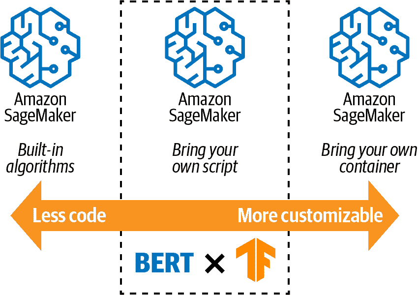
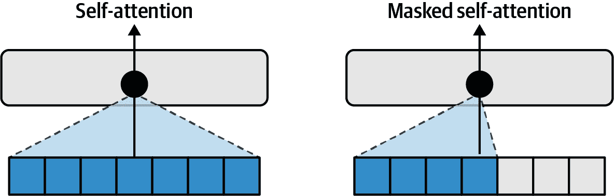

# 第七章：训练您的第一个模型

在前一章中，我们使用 SageMaker 处理作业通过“特征工程”过程将原始数据集转换为可用于机器的特征。在本章中，我们使用这些特征使用 TensorFlow、PyTorch、[BERT](https://oreil.ly/hmyQz)和 SageMaker 来训练自定义评论分类器，用于从社交渠道、合作伙伴网站等“野外”分类评论。我们甚至展示了如何使用 Java 训练 BERT 模型！

在这个过程中，我们解释了诸如变压器架构、BERT 和微调预训练模型等关键概念。我们还描述了 SageMaker 提供的各种培训选项，包括内置算法和“自带”选项。接下来，我们讨论 SageMaker 基础设施，包括容器、网络和安全性。然后，我们使用 SageMaker 训练、评估和配置我们的模型。性能分析帮助我们调试模型、减少训练时间和成本。最后，我们提供了进一步减少成本和提高模型性能的技巧。

# 了解 SageMaker 基础设施

大部分基于容器的，SageMaker 管理基础架构并帮助我们专注于特定的机器学习任务。开箱即用，我们可以直接利用许多内置算法，涵盖自然语言处理（NLP）、分类、回归、计算机视觉和强化学习等用例。除了这些内置算法外，SageMaker 还为许多流行的人工智能和机器学习框架（如 TensorFlow、PyTorch、Apache MXNet、XGBoost 和 scikit-learn）提供预构建的容器。最后，我们还可以使用自己选择的库和框架提供自己的 Docker 容器。在本节中，我们详细讨论了 SageMaker 基础设施，包括环境变量、S3 位置、安全性和加密。

我们可以选择在单个实例上或在分布式实例集群上进行训练。Amazon SageMaker 消除了管理底层基础设施的负担，并为我们处理了不同的重型工作。

## 介绍 SageMaker 容器

在运行训练作业时，SageMaker 从 Amazon S3 读取输入数据，使用该数据训练模型，最后将模型工件写回 Amazon S3。图 7-1 说明了 SageMaker 如何使用容器进行训练和推断。从左下角开始，来自 S3 的训练数据可用于模型训练实例容器，该容器从 Amazon Elastic Container Registry 中拉取。训练作业将模型工件持久化到在训练作业配置中指定的输出 S3 位置。当准备部署模型时，SageMaker 启动新的 ML 实例，并拉取这些模型工件用于批处理或实时模型推断。


###### 图 7-1\. SageMaker 容器、输入和输出。来源：[Amazon SageMaker Workshop](https://oreil.ly/eu9G1)。

就像软件框架一样，SageMaker 提供了多个“热点”供我们的训练脚本利用。有两个值得关注的热点是：输入/输出数据位置和环境变量。

SageMaker 为我们的容器提供了训练输入和输出文件的位置。例如，典型的训练作业读取数据文件，训练模型，并输出模型文件。一些 AI 和机器学习框架支持模型检查点，以防训练作业失败或我们决定使用比最新模型具有更好预测性能的先前检查点。在这种情况下，作业可以从离开的地方重新启动。这些输入、输出和检查点文件必须在短暂的 Docker 容器内部和更持久的存储（如 S3）之间移动，否则当训练作业结束并且 Docker 容器消失时，数据将会丢失。

虽然看似简单，但这种映射在训练性能拼图中是非常关键的一部分。如果这个层次的映射没有优化，我们的训练时间将会大大受到影响。稍后，我们将讨论一种称为`Pipe`模式的 SageMaker 功能，专门优化了数据在这一层的移动。图 7-2 展示了将 Docker 容器内部文件位置映射到容器外部 S3 位置的情况。


###### 图 7-2\. 容器文件位置映射到 S3 位置。

SageMaker 会自动为我们的容器提供许多预定义的环境变量，例如可用于容器的 GPU 数量和日志级别。我们的训练脚本可以使用这些由 SageMaker 注入的环境变量来相应地修改我们训练作业的行为。以下是 SageMaker 传递给我们的脚本的环境变量子集，从 Jupyter 笔记本、脚本、管道等：

`SM_MODEL_DIR`

包含训练或处理脚本以及依赖库和资产的目录 (*/opt/ml/model*)

`SM_INPUT_DIR`

包含输入数据的目录 (*/opt/ml/input*)

`SM_INPUT_CONFIG_DIR`

包含输入配置的目录 *(/opt/ml/input/config)*

`SM_CHANNELS`

包含数据拆分的 S3 位置，包括“训练”、“验证”和“测试”

`SM_OUTPUT_DATA_DIR`

用于存储评估结果和其他非训练相关输出资产的目录 (*/opt/ml/output/data*)

`SM_HPS`

算法使用的模型超参数

`SM_CURRENT_HOST`

当前实例的唯一主机名

`SM_HOSTS`

集群中所有实例的主机名

`SM_NUM_GPUS`

当前实例的 GPU 数量

`SM_NUM_CPUS`

当前实例的 CPU 数量

`SM_LOG_LEVEL`

训练脚本使用的日志级别

`SM_USER_ARGS`

用户指定并由训练或处理脚本解析的附加参数

`_DIR`变量映射是运行我们训练代码的 Docker 容器内部的本地文件路径。这些路径映射到由 SageMaker 提供并在启动训练作业时由用户指定的 S3 中的外部输入和输出文件位置。然而，我们的训练脚本在读取输入或写入输出时引用本地路径。

## 通过计算和网络隔离提高可用性

从高可用性的角度来看，网络隔离同样重要。虽然我们通常在微服务和实时系统方面讨论高可用性，但我们也应努力提高训练作业的可用性。

我们的训练脚本几乎总是通过`pip install`安装来自 PyPI 的 Python 库，或从互联网上的第三方模型库（或“模型动物园”）下载预训练模型。通过创建对外部资源的依赖，我们的训练作业现在依赖于这些第三方服务的可用性。如果其中一个服务暂时不可用，我们的训练作业可能无法启动。

###### 注意

在 Netflix，我们将所有依赖项“烧制”到我们的 Docker 镜像和 Amazon Machine Images（AMIs）中，以消除所有外部依赖项并实现更高的可用性。在快速扩展事件和故障转移场景中，减少外部依赖项绝对至关重要。

为了提高可用性，建议尽可能减少外部依赖，通过将这些资源复制到我们的 Docker 镜像或我们自己的 S3 存储桶中来实现。这样做的附加好处是减少网络延迟并更快地启动我们的训练作业。以下 IAM 策略将不会启动具有禁用网络隔离的 SageMaker 训练作业。如果我们不启用网络隔离，训练作业将立即失败，这正是我们想要强制执行的：

```
{
  "Sid": "SageMakerNetworkIsolation",
  "Effect": "Deny",
  "Action": [
    "sagemaker:CreateTrainingJob"
  ],
  "Resource": "*",
  "Condition": {
    "Bool": {
      "sagemaker:NetworkIsolation": "false"
    }
  }
}
```

计算和网络隔离还可以提高安全性并减少攻击者获取我们数据的风险。作为安全最佳实践，所有 SageMaker 组件应在没有直接互联网连接的虚拟私有云（VPC）中使用。这要求我们仔细配置 IAM 角色、VPC 终端节点、子网和安全组，以最小特权访问策略管理 Amazon S3、SageMaker、Redshift、Athena、CloudWatch 和数据科学工作流中使用的任何其他 AWS 服务。在第十二章中，我们将深入探讨如何使用计算隔离、网络隔离、VPC 终端节点和 IAM 策略来保护我们的数据科学环境。

# 使用 SageMaker JumpStart 部署预训练的 BERT 模型

SageMaker JumpStart 提供访问来自 AWS、TensorFlow Hub 和 PyTorch Hub 的预构建机器学习解决方案和预训练模型，涵盖了许多用例和任务，如欺诈检测、预测性维护、需求预测、NLP、目标检测和图像分类，如图 7-3 所示。


###### 图 7-3\. 使用 SageMaker JumpStart 部署预训练模型。

当我们希望快速在我们的数据集上测试解决方案或模型并生成基线评估指标时，SageMaker JumpStart 非常有用。我们可以快速排除不适合我们数据的模型，并深入研究那些确实适合的解决方案和模型。

让我们使用亚马逊客户评论数据集对预训练的 BERT 模型进行微调，并在 SageMaker Studio 中仅需点击几下即可将模型部署到生产环境，如图 7-4 所示。


###### 图 7-4\. 使用 SageMaker JumpStart，我们只需点击几下即可对预训练的 BERT 模型进行微调和部署。

在使用亚马逊客户评论数据集对选择的 BERT 模型进行微调后，SageMaker JumpStart 部署模型，因此我们可以立即开始进行预测：

```
import json
import boto3

text1 = 'i simply love this product'
text2 = 'worst product ever'

label_map = {0: "1", 1: "2", 2: "3", 3: "4", 4: "5"}

def query_endpoint(encoded_text):
    endpoint_name = 'jumpstart-tf-tc-bert-en-uncased-l-12-h-768-a-12-2'
    client = boto3.client('runtime.sagemaker')
    response = client.invoke_endpoint(
                    EndpointName = endpoint_name, 
                    ContentType = 'application/x-text', 
                    Body = encoded_text)
    model_predictions = json.loads(response['Body'].read())['predictions'][0]
    return model_predictions

for text in [text1, text2]:
    model_predictions = query_endpoint(text.encode('utf-8'))
    class_index = model_predictions.index(max(model_predictions))
```

输出将类似于以下内容：

```
Review text:  'i simply love this product'
Predicted star_rating:  5

Review text:  'worst product ever'
Predicted star_rating:  1
```

# 开发一个 SageMaker 模型

正如亚马逊为顾客提供了通过亚马逊市场多种选择一样，亚马逊 SageMaker 为构建、训练、调整和部署模型提供了多种选择。我们将在第八章深入研究模型调优，并在第九章讨论部署。根据所需的定制程度，有三个主要选项，如图 7-5 所示。


###### 图 7-5\. SageMaker 有三个选项来构建、训练、优化和部署我们的模型。

## 内置算法

SageMaker 提供了一些内置算法，可以直接用于多个不同领域，如 NLP、计算机视觉、异常检测和推荐等。只需将这些高度优化的算法指向我们的数据，我们将获得一个完全训练良好、易于部署的机器学习模型，可以集成到我们的应用程序中。这些算法如下图所示，针对那些不想管理大量基础设施、希望重复使用经过战斗测试的算法，设计用于处理非常大型数据集并被数以万计的客户使用。此外，它们提供诸如大规模分布式训练以减少训练时间和混合精度浮点支持以提高模型预测延迟的便利。

| **分类**

+   线性学习者

+   XGBoost

+   KNN

| **计算机视觉**

+   图像分类

+   目标检测

+   语义分割

| **处理文本**

+   BlazingText

+   监督

+   无监督

|

| **回归**

+   线性学习者

+   XGBoost

+   KNN

| **异常检测**

+   随机切分森林

+   IP 见解

| **主题建模**

+   LDA

+   NTM

|

| **序列翻译**

+   Seq2Seq

| **推荐**

+   因子分解机

| **聚类**

+   K 均值

|

| **特征减少**

+   PCA

+   Object2Vec

| **预测**

+   DeepAR

|   |
| --- |

## 自带脚本

SageMaker 提供了更多可定制选项“自定义脚本”，通常称为*Script Mode*。Script Mode 让我们专注于我们的训练脚本，而 SageMaker 为每个熟悉的开源框架（如 TensorFlow、PyTorch、Apache MXNet、XGBoost 和 scikit-learn）提供了高度优化的 Docker 容器，如图 7-6 所示。


###### 图 7-6\. 受 Amazon SageMaker 支持的流行人工智能和机器学习框架。

这个选项是高度定制和低维护的良好平衡。本书中其余的大部分 SageMaker 示例将利用 Script Mode 与 TensorFlow 和 BERT 进行 NLP 和自然语言理解（NLU）用例，如图 7-7 所示。



###### 图 7-7\. SageMaker 脚本模式与 BERT 和 TensorFlow 的结合是高度定制和低维护的良好平衡。

## 自定义容器部署

最可定制的选项是“自定义容器部署”。此选项允许我们构建和部署自己的 Docker 容器到 SageMaker。这个 Docker 容器可以包含任何库或框架。虽然我们对训练脚本及其依赖项的详细控制权，SageMaker 管理低级基础设施，如日志记录、监控、注入环境变量、注入超参数、映射数据集输入和输出位置等。这个选项面向具有系统背景的更低级别的机器学习从业者，或者需要出于合规性和安全性原因使用自己的 Docker 容器的场景。将现有的 Docker 镜像转换为 SageMaker 内运行的步骤简单明了，只需按照此[AWS 开源项目](https://oreil.ly/7Rn86)中列出的步骤进行即可。

# 自然语言处理简史

在前一章中，我们将原始的亚马逊客户评论转换为 BERT 特征向量，最终构建了一个评论分类器模型，用于从`review_body`文本预测`star_rating`。在构建自然语言模型之前，我们想要介绍一些关于 NLP 的背景知识。

1935 年，著名的英国语言学家 J.R.弗斯（J. R. Firth）曾说过：“一个词的完整意义始终是在其语境中，任何脱离上下文的意义研究都不能被认真对待。”80 年后的 2013 年：词向量或“词嵌入”开始主导语言表示，如图 7-8 所示。这些词嵌入捕捉了文档集（通常称为“语料库”）中单词之间的上下文关系。


###### 图 7-8\. 自然语言处理（NLP）算法和架构的演变。

Word2Vec 和 GloVe 是过去十年中流行的两种 NLP 算法。它们都使用上下文信息在向量空间中创建文本数据的向量表示，使我们能够进行诸如单词相似性和单词差异等数学计算。

FastText 继续创新上下文 NLP 算法，并使用子词标记化构建单词嵌入。这使得 FastText 能够使用相对较少的数据量学习非英语语言模型。Amazon SageMaker 提供了一个内置的、按使用量付费的 SageMaker 算法，称为 *BlazingText*，它使用了针对 AWS 优化的 FastText 实现。这个算法在 “Built-in Algorithms” 中展示过。

这一代 NLP 模型存在一些缺点，因为它们都是静态词嵌入的形式。虽然静态嵌入捕捉了单词的语义意义，但它们实际上并不理解高级语言概念。事实上，一旦创建了嵌入，实际模型通常在训练后被丢弃（即 Word2Vec、GloVe），仅保留单词嵌入以作为传统机器学习算法（如逻辑回归和 XGBoost）的特征使用。

ELMo 保留训练后的模型，并使用两个长短期记忆（LSTM）网络分支：一个从左到右学习，一个从右到左学习。上下文被捕获在 LSTM 状态中，并在每个网络分支中的每个单词后更新。因此，ELMo 并没有学习语料库中单词和短语的真正的双向上下文表示，但它表现仍然非常好。

###### 注

LSTM 是一种特殊类型的循环神经网络（RNN），它选择性地选择要记住和要遗忘的信息。这使得 LSTM 能够高效地利用内存和计算资源，避免消失梯度问题，并保持非常好的预测能力。门控循环单元是另一种比 LSTM 更简单且表现良好的 RNN 变体。然而，ELMo 具体使用 LSTM。

GPT 和更新的 GPT-2 和 GPT-3 模型（GPT-n）保留训练后的模型，并使用称为“Transformer”的神经网络架构来学习上下文词表示。Transformers 与其注意力机制伴侣一起在 2017 年的《Attention Is All You Need》论文中广为人知。Transformer 提供高度并行计算，以实现更高的吞吐量、更好的性能和更高效的计算资源利用。LSTM 和 ELMo 不支持并行计算。

GPT-n transformer 使用一种定向的、从左到右的“掩码自注意力”机制来学习左到右的上下文表示，如 图 7-9 所示。这防止模型提前窥视句子中的下一个单词。即使有此限制，GPT-n 在文本生成任务中表现非常出色，因为它采用了这种左到右的机制。



###### 图 7-9\. GPT-n 的掩码自注意力机制。

2018 年，推出了一种新的基于神经网络的自然语言处理算法称为*双向编码器表示转换*（BERT）。BERT 彻底改变了自然语言处理（NLP）和自然语言理解（NLU）领域，并且现在广泛应用于 Facebook、LinkedIn、Netflix、Amazon 等许多以人工智能为先的公司。BERT 建立在高度可并行化的 Transformer 架构基础上，并添加了真正的双向自注意力机制，可以同时向前和向后查看。BERT 的自注意力机制改进了 GPT-n 的向后查看、掩码自注意力机制。

# BERT Transformer 架构

BERT Transformer 架构的核心是使用注意机制来“关注”语料库中特定和有趣的单词或短语。具体来说，BERT transformer 使用“自注意力”机制来关注数据中的每个标记，以及输入序列中的所有其他标记。此外，BERT 使用“多头注意力”来处理单词含义上的歧义，也称为*多义性*（希腊语 *poly* = 多, *sema* = 符号）。一个注意力的示例显示在 图 7-10 中，其中单词 *it* 高度关注单词 *movie*，以及单词 *funny* 和 *great*，尽管相对于单词 *movie*，关注程度较低。


###### 图 7-10\. “自注意力”机制关注数据中的每个标记到输入序列中的所有其他标记。

没有这种双向注意力，算法可能会为以下两个句子中的单词 *bank* 创建相同的嵌入：“A thief stole money from the *bank* vault” 和 “Later, he was arrested while fishing on a river *bank*.” 注意，单词 *bank* 在每个句子中有不同的含义。人类因为有终身的自然“预训练”，很容易区分这一点，但是对于没有类似预训练的机器来说并不容易。BERT 通过学习在特定上下文中为每个标记学习不同的向量来区分这两个单词（标记）。学习的标记向量称为“输入标记向量表示”，学习的句向量称为“汇聚文本向量表示”。

BERT 基于 Transformer 的序列模型由多个堆叠的 Transformer 块组成。预训练的 BERT[Base] 模型包含 12 个这样的 Transformer 块，而 BERT[Large] 模型包含 24 个 Transformer 块。每个 Transformer 块实现多头注意力层和全连接前馈层。每一层都带有跳跃连接（残差连接）和层归一化模块。

我们增加了一个额外的层来对模型进行微调，以适应特定的 NLP 任务。对于文本分类，我们会添加一个分类器层。训练数据经过所有 Transformer 块处理后，数据通过微调层，并学习特定于我们的 NLP 任务和数据集的参数。图 7-11 展示了 BERT 的架构。


###### 图 7-11\. BERT 模型架构。

让我们更仔细地看一看 BERT 如何实现注意力。我们可以将注意力视为根据其对解决 NLP 任务的重要性而分配权重给输入标记的过程。更具数学化的术语，注意力是一个函数，接受一个输入序列 X 并返回另一个序列 Y，由与 X 中相同长度的向量组成。Y 中的每个向量都是 X 中向量的加权平均，如图 7-12 所示。


###### 图 7-12\. 注意力是输入向量的加权平均。

权重表达了模型在计算加权平均时对 X 中每个输入向量的关注程度。那么，BERT 如何计算注意力权重呢？

兼容性函数为每对单词分配一个分数，指示它们彼此*关注*的强度。首先，模型创建一个查询向量（用于注意的单词）和一个键向量（用于被注意的单词），作为实际值向量的线性变换。然后计算兼容性分数，作为一个单词的查询向量与另一个单词的键向量的点积。通过应用 softmax 函数对分数进行归一化。结果就是注意力权重，如图 7-13 所示。


###### 图 7-13\. 注意力权重是查询向量和键向量的归一化点积。

# 从零开始训练 BERT

虽然我们可以直接使用 BERT 而无需从头开始训练，了解 BERT 如何使用单词屏蔽和下一个句子预测—并行—来学习和理解语言是很有用的。

## 掩蔽语言模型

当 BERT 看到新文本时，它会在每个句子或“序列”中遮蔽 15% 的词（在 BERT 术语中称为“序列”）。然后，BERT 预测遮蔽的词并在预测错误时进行自我纠正（即“更新模型权重”）。这被称为*遮蔽语言模型*或 Masked LM。遮蔽强迫模型学习每个序列的周围词语，如 图 7-14 所示。


###### 图 7-14\. BERT Masked LM 遮蔽 15% 的输入标记，并通过预测遮蔽的标记来学习——当它预测错误的时候会进行自我纠正。

更具体地说，BERT 是通过强迫它预测句子中的遮蔽词（实际上是标记）来训练的。例如，如果我们输入这本书的内容，我们可以让 BERT 预测下面句子中的缺失词：“这本书被称为 Data ____ on AWS。”显然，缺失的词是“Science”。对于一个从出生开始就被预训练在数百万文档上的人类来说，这很容易，但对于机器来说并不容易——至少没有经过训练的机器。

## 下一句预测

当 BERT 同时遮蔽和预测输入标记时，它还在输入序列对上执行下一句预测（NSP）。这两个训练任务被优化在一起，为组合训练工作创建单一的准确度分数。这导致一个更强大的模型，能够执行词级和句级预测任务。

为了执行 NSP，BERT 随机选择 50% 的句子对，并用文档中另一部分的随机句子替换其中的一个句子。然后，BERT 预测这两个句子是否是一个有效的句子对，如 图 7-15 所示。当 BERT 预测错误时会进行自我纠正。


###### 图 7-15\. 在训练过程中，BERT 在输入序列对上同时执行遮蔽和 NSP。

想要了解更多关于 BERT 的细节，请查看 2018 年的论文[“BERT: Pre-training of Deep Bidirectional Transformers for Language Understanding”](https://oreil.ly/LP4yX)。

在大多数情况下，我们不需要从头开始训练 BERT。神经网络设计为可以重复使用并在新数据到达系统时进行持续训练。由于 BERT 已经在来自维基百科和 Google Books Corpus 的数百万公共文档上进行了预训练，其词汇表和学习表示可转移到大量的 NLP 和 NLU 任务中，跨越各种领域。

从头开始训练 BERT 需要大量的数据和计算资源，但它允许 BERT 使用高度专业化的词汇表学习定制数据集的表示。像亚马逊和 LinkedIn 这样的公司已经从头开始预训练了内部版本的 BERT，以学习特定领域的语言表示。例如，LinkedIn 的变体已经学习了特定于职称、简历、公司和商业新闻的语言模型。

# 微调预训练的 BERT 模型

ELMo、GPT/GPT-2 和 BERT 保留了某些被称为“预训练模型”的训练模型。这些模型在许多不同领域的数百万篇文档上进行了预训练，它们不仅擅长预测缺失的单词，还能学习单词的含义、句子结构和句子之间的关联。它们生成有意义、相关和真实的文本的能力令人称奇和畏惧。让我们深入了解一下 BERT 的预训练模型。

BERT 的预训练模型与大多数神经网络模型一样，仅是从迄今为止见过的数据学习到的模型权重的即时快照。与大多数模型一样，BERT 随着数据量的增加变得更加有价值。

BERT 的核心预训练模型分为“base”和“large”两个变种，其层数、注意力头数、隐藏单元和参数数量不同，如下表所示。我们发现即使使用只有 12 个注意力头和 1.1 亿参数的较小模型，也能得到非常好的性能。

|   | 层次 | 隐藏单元 | 参数 |
| --- | --- | --- | --- |
| **BERT base** | 12 | 768 | 110M |
| **BERT large** | 24 | 1024 | 340M |

此外，社区已经使用领域和语言特定的数据集创建了许多 BERT 的预训练版本，包括 PatentBERT（美国专利数据）、ClinicalBERT（医疗数据）、CamemBERT（法语）、GermanBERT（德语）和 BERTje（荷兰语）。

这些 BERT 的变体是从头开始预训练的，因为默认的 BERT 模型是在英文版本的维基百科和谷歌图书上进行训练的，并不与定制数据集（例如 CamemBERT 的法语和 ClinicalBERT 的医疗术语）共享相同的词汇。当从头开始训练时，我们可以重用 BERT 的神经网络变换器架构，但是舍弃从维基百科和谷歌图书学到的预训练基础模型权重。

对于我们的亚马逊客户评论数据集，我们可以安全地重用默认的 BERT 模型，因为它们具有类似的词汇表和语言表示。毫无疑问，从头开始训练 BERT 以学习特定的亚马逊.com 产品目录将提高某些任务（如实体识别）的准确性。然而，默认的 BERT 模型在我们的评论文本上表现非常好，因此我们将保持简单，使用“微调”默认的 BERT 模型来创建一个使用我们的亚马逊客户评论数据集的定制文本分类器。

让我们利用预训练的 BERT 模型学习一个新的领域特定的 NLP 任务，使用亚马逊客户评论数据集。这个过程称为“微调”，如图 7-16 所示。


###### 图 7-16\. 我们可以使用自定义数据集对预训练的 BERT 模型进行领域特定任务的微调。

BERT 自注意机制的简单性和双向性使我们能够将基础 BERT 模型微调到各种即插即用的“下游” NLP/NLU 任务中，包括文本分类分析情感、实体识别检测产品名称，以及下一句预测回答自然语言问题，如图 7-17 所示。


###### 图 7-17\. 我们可以将默认的 BERT 模型微调到许多“下游” NLP 和 NLU 任务。

由于微调是一个有监督的训练过程（与无监督的预训练相对），在微调过程中不会进行掩码和下一句预测——这些仅在预训练期间发生。因此，微调非常快速，仅需要相对较少的样本，或者在我们的情况下是评论。这意味着更低的处理能力、更低的成本和更快的训练/调整迭代。

记住，我们可以使用 SageMaker JumpStart 快速尝试这些预训练模型，并确定它们作为解决方案在我们的机器学习任务中的有效性。通过快速将预训练的 BERT 模型微调到我们的数据集，我们可以确定 BERT 是否合适。

由于我们已经从第六章中原始的 `review_body` 文本生成了 BERT 嵌入，我们已经准备好了！让我们微调 BERT，创建一个自定义文本分类器，用于从 `review_body` 预测 `star_rating`，使用我们的数据集，如图 7-18 所示。


###### 图 7-18\. 我们可以微调 BERT 模型，使用我们的评论数据集创建一个自定义文本分类器。

我们可以使用这个分类器预测即将到来的客户服务电子邮件或 Twitter 评论的情绪，例如。因此，当新的电子邮件或评论进入系统时，我们首先将电子邮件分类为负面（`star_rating` 1）、中性（`star_rating` 3）或正面（`star_rating` 5）。这可以帮助我们确定回复的紧急性——或者帮助我们将消息路由到正确的人员，如图 7-19 所示。


###### 图 7-19\. 我们可以将 BERT 微调到将评论文本分类为 `star_rating` 1（最差）到 5（最好）的类别。

# 创建训练脚本

让我们创建一个名为 *tf_bert_reviews.py* 的训练脚本，使用 TensorFlow 和 Keras 创建我们的分类器。然后，我们将前一章生成的特征传递给我们的分类器进行模型训练。

## 设置训练、验证和测试数据集拆分

在上一章中，我们使用 SageMaker 处理作业将原始的亚马逊客户评论转换为 BERT 嵌入，如图 7-20 所示。


###### 图 7-20\. BERT 嵌入作为 TensorFlow 模型训练的输入。

在本节中，我们加载训练、验证和测试数据集以供模型训练使用。我们将使用 TensorFlow 的 `TFRecordDataset` 实现并行加载 `TFRecord` 并对数据进行洗牌，以防止模型学习到数据呈现方式的模式。

###### 注意

在人工智能和机器学习领域，随机性是被赞扬的。正确地对训练数据进行洗牌将提供足够的随机性，以防止模型学习到关于数据在磁盘上存储或者呈现给模型的任何模式。“自助法”是描述带有替换的随机抽样的常见技术。自助法为抽样过程增加了偏差、方差、置信区间和其他指标。

在第六章中，我们创建了一个 SageMaker 处理作业，使用 Hugging Face Transformers 库将原始 `review_body` 列转换为 BERT 嵌入。该处理作业使用 TensorFlow 优化的 `TFRecord` 文件格式将嵌入存储在 S3 中，我们将在训练作业中使用它们。让我们创建一个帮助函数来加载、解析和洗牌 `TFRecord`。

```
def file_based_input_dataset_builder(channel,
                                     input_filenames,
                                     pipe_mode,
                                     is_training,
                                     drop_remainder,
                                     batch_size,
                                     epochs,
                                     steps_per_epoch,
                                     max_seq_length):

    dataset = tf.data.TFRecordDataset(input_filenames)
    dataset = dataset.repeat(epochs * steps_per_epoch * 100)
    dataset = dataset.prefetch(tf.data.experimental.AUTOTUNE)

    name_to_features = {
      "input_ids": tf.io.FixedLenFeature([max_seq_length], tf.int64),
      "input_mask": tf.io.FixedLenFeature([max_seq_length], tf.int64),
      "segment_ids": tf.io.FixedLenFeature([max_seq_length], tf.int64),
      "label_ids": tf.io.FixedLenFeature([], tf.int64),
    }

    def _decode_record(record, name_to_features):
        """Decodes a record to a TensorFlow example."""
        record = tf.io.parse_single_example(record, name_to_features)
        return record

    dataset = dataset.apply(
        tf.data.experimental.map_and_batch(
          lambda record: _decode_record(record, name_to_features),
          batch_size=batch_size,
          drop_remainder=drop_remainder,
          num_parallel_calls=tf.data.experimental.AUTOTUNE))

    dataset.cache()

    if is_training:
        dataset = dataset.shuffle(seed=42,
                                  buffer_size=steps_per_epoch * batch_size,
                                  reshuffle_each_iteration=True)

    return dataset
```

如果 `is_training` 为真，则表示我们处于训练阶段。在训练阶段，我们希望在迭代之间对数据进行洗牌。否则，模型可能会学习到关于数据在磁盘上存储和呈现给模型的模式，即先是所有的 5，然后是所有的 4，3，2，1 等等。为了防止模型学习到这种模式，我们对数据进行洗牌。如果 `is_training` 为假，则表示我们处于验证或测试阶段，可以避免洗牌的开销，并按顺序迭代。

让我们使用之前创建的帮助函数读取训练、验证和测试数据集：

```
# Training Dataset
train_data_filenames = glob(os.path.join(train_data, 
                                         '*.tfrecord'))
train_dataset = file_based_input_dataset_builder(
    channel='train',
    input_filenames=train_data_filenames,
    pipe_mode=pipe_mode,
    is_training=True,
    drop_remainder=False, 
    batch_size=train_batch_size,
    epochs=epochs,
    steps_per_epoch=train_steps_per_epoch,
    max_seq_length=max_seq_length)\
        .map(select_data_and_label_from_record)

# Validation Dataset
validation_data_filenames = glob(os.path.join(validation_data, 
                                              '*.tfrecord'))
validation_dataset = file_based_input_dataset_builder(
    channel='validation',
    input_filenames=validation_data_filenames,
    pipe_mode=pipe_mode,
    is_training=False,
    drop_remainder=False,
    batch_size=validation_batch_size,
    epochs=epochs,
    steps_per_epoch=validation_steps,
    max_seq_length=max_seq_length)\
        .map(select_data_and_label_from_record)
```

我们很快将把这些训练、验证和测试数据集传递给我们的模型训练过程。但首先，让我们使用 TensorFlow、Keras、BERT 和 Hugging Face 设置自定义评论分类器。

## 设置自定义分类器模型

很快，我们将把 `review_body` 嵌入和 `star_rating` 标签输入到神经网络中，以微调 BERT 模型并训练自定义评论分类器，如图 7-21 所示。请注意，图中显示的单词可能在标记化过程中被分成更小的词标记。但为了说明目的，我们展示它们为完整单词。


###### 图 7-21\. 使用我们的自定义分类器将评论分类为星级评分 1（最差）到 5（最佳）。

为此，我们使用 TensorFlow 2.x 的 Keras API，在预训练的 BERT 模型顶部添加一个神经分类器层来学习`star_rating`（1-5）。请记住，我们使用的是一个相对轻量级的 BERT 变体叫做 DistilBERT，它需要更少的内存和计算资源，但在我们的数据集上保持了非常好的准确性。为了减少模型的大小，DistilBERT，一个学生神经网络，通过一个更大的教师神经网络进行了知识蒸馏的过程，如图 7-22 所示。


###### 图 7-22。知识蒸馏从一个教师模型训练出一个学生模型。

让我们加载`DistilBertConfig`，将我们的 1 索引的`star_rating`标签映射到 0 索引的内部类，并按如下方式加载我们预训练的 DistilBERT 模型：

```
from transformers import DistilBertConfig
from transformers import TFDistilBertForSequenceClassification

CLASSES=[1, 2, 3, 4, 5]

config = DistilBertConfig.from_pretrained('distilbert-base-uncased',
                                      num_labels=len(CLASSES),
                                      id2label={
                                      0: 1, 1: 2, 2: 3, 3: 4, 4: 5
                                      },
                                      label2id={
                                      1: 0, 2: 1, 3: 2, 4: 3, 5: 4
                                      })

transformer_model = TFDistilBertForSequenceClassification.from_pretrained(
                    "distilbert-base-uncased", config=config
                )
```

强调`from_pretrained()`函数调用会从 Hugging Face 服务下载一个大型模型是很重要的。我们应考虑下载此模型到我们自己的 S3 存储桶，并将 S3 URI 传递给`from_pretrained()`函数调用。这个小改动将使我们脱离 Hugging Face 服务，去除潜在的单点故障，实现网络隔离，并减少模型训练作业的启动时间。接下来，让我们设置输入和模型层：

```
input_ids = tf.keras.layers.Input(shape=(max_seq_length,), 
	  name='input_ids', 
	  dtype='int32')
input_mask = tf.keras.layers.Input(shape=(max_seq_length,), 
	  name='input_mask', 
	  dtype='int32') 

embedding_layer = transformer_model.distilbert(input_ids, 
	attention_mask=input_mask)[0]
X = tf.keras.layers.Bidirectional(tf.keras.layers.LSTM(50, 
	return_sequences=True, 
	dropout=0.1, 
	recurrent_dropout=0.1))(embedding_layer)
X = tf.keras.layers.GlobalMaxPool1D()(X)
X = tf.keras.layers.Dense(50, activation='relu')(X)
X = tf.keras.layers.Dropout(0.2)(X)
X = tf.keras.layers.Dense(len(CLASSES), activation='softmax')(X)

model = tf.keras.Model(inputs=[input_ids, input_mask], outputs = X)

for layer in model.layers[:3]:
    layer.trainable = not freeze_bert_layer
```

我们选择不训练 BERT 层，通过指定`trainable=False`。这是有意为之，以保持底层 BERT 模型不变——仅集中于训练我们的自定义分类器。训练 BERT 层可能会提高我们的准确性，但训练作业会更长。由于我们在不训练底层 BERT 模型的情况下准确率已经相当不错，我们只专注于训练分类器层。接下来，让我们添加一个基于 Keras 的神经分类器来完成我们的神经网络并准备模型训练：

```
loss=tf.keras.losses.SparseCategoricalCrossentropy(from_logits=True)
metric=tf.keras.metrics.SparseCategoricalAccuracy('accuracy')

optimizer=tf.keras.optimizers.Adam(learning_rate=learning_rate, epsilon=epsilon)

model.compile(optimizer=optimizer, loss=loss, metrics=[metric])

model.summary()
```

这里是模型摘要的输出，显示了可训练和不可训练参数的详细情况：

```
__________________________________________________________________________
Layer (type)                    Output Shape         Param # 
==========================================================================
input_ids (InputLayer)          [(None, 64)]         0                                            
__________________________________________________________________________
input_mask (InputLayer)         [(None, 64)]         0                                            
__________________________________________________________________________
distilbert (TFDistilBertMainLay ((None, 64, 768),)   66362880
__________________________________________________________________________
bidirectional (Bidirectional)   (None, 64, 100)      327600
__________________________________________________________________________
global_max_pooling1d (GlobalMax (None, 100)          0
__________________________________________________________________________
dense (Dense)                   (None, 50)           5050
__________________________________________________________________________
dropout_19 (Dropout)            (None, 50)           0
__________________________________________________________________________
dense_1 (Dense)                 (None, 5)            255
==========================================================================
Total params: 66,695,785
Trainable params: 332,905
Non-trainable params: 66,362,880
__________________________________________________________________________
```

## 训练和验证模型

到此为止，我们已经准备好了训练、验证和测试数据集作为输入数据，并定义了我们的自定义分类器`model`。让我们把所有的东西都汇总起来，并在我们的模型上使用`train_dataset`和`validation_dataset`调用`fit()`函数。

通过传递`validation_dataset`，我们使用 TensorFlow 2.x 中的 Keras API 同时进行训练和验证：

```
train_and_validation_history = model.fit(train_dataset,
                                         shuffle=True,
                                         epochs=5,
                                         ...
                                         validation_data=validation_dataset)
```

我们设置`shuffle=True`以对数据集进行洗牌，`epochs=5`以使数据集训练五次。`epochs`的数量（发音为“eh-puhks”）是可配置和可调整的。我们将在下一章节探讨模型调优。

## 保存模型

现在，让我们使用 TensorFlow 的`SavedModel`格式保存模型，用于我们的预测应用程序：

```
model.save('./tensorflow/', save_format='tf')
```

在第九章中，我们将使用保存在*`./tensorflow/`*中的模型与 TensorFlow Serving 部署我们的模型，并使用 SageMaker 批转换（离线、批处理）和 SageMaker 端点（在线、实时）提供评论分类预测。

# 从 SageMaker Notebook 启动训练脚本

让我们逐步了解从 SageMaker Notebook 运行训练脚本所需的步骤。稍后，我们将从自动化流水线中运行相同的脚本。目前，我们从笔记本运行脚本。首先，我们将设置需要监视训练作业的指标。然后，我们将配置我们算法特定的超参数。接下来，我们将选择我们集群中的实例类型和实例数量。最后，我们将启动我们的训练作业。

## 定义要捕获和监视的指标

我们可以根据训练脚本打印或记录到控制台的任何内容创建指标。假设我们的 TensorFlow 模型通过以下日志行发出训练损失和训练精度（`loss`、`accuracy`），以及验证损失和验证精度（`val_loss`、`val_accuracy`）：

```
5000/10000 [>....................] - loss: 0.1420 - accuracy: 0.800103
6000/10000 [>....................] - loss: 0.1081 - accuracy: 0.939455
...
10000/10000 [>....................] - val_loss: 0.1420 - val_accuracy: 0.512193
```

接下来，我们定义四个正则表达式来通过解析日志行中的值来填充四个指标。如果我们升级框架——或者切换到新框架——这些正则表达式可能需要调整。当这种情况发生时，我们会知道，因为我们将不再在我们的 CloudWatch 仪表板上看到正确的模型指标：

```
metrics_definitions = [
     {'Name': 'train:loss', 'Regex': 'loss: ([0-9\\.]+)'},
     {'Name': 'train:accuracy', 'Regex': 'accuracy: ([0-9\\.]+)'},
     {'Name': 'validation:loss', 'Regex': 'val_loss: ([0-9\\.]+)'},
     {'Name': 'validation:accuracy', 'Regex': 'val_accuracy: ([0-9\\.]+)'},
]
```

## 配置我们算法的超参数

值得注意的是，“参数”（也称为“权重”）是模型在训练过程中学习的内容，“超参数”则是模型在学习过程中学习参数的方式。每种算法都支持一组超参数，这些参数可以改变算法在学习数据集时的行为。超参数可以是从决策树深度到神经网络层数等任何内容。

超参数选择涉及延迟和准确性之间的通常权衡。例如，具有许多层的更深的神经网络可能比较浅的神经网络提供更好的准确性，但更深的网络可能导致推断时延迟增加，因为每层的预测时间随着网络中的层数增加而增加。

虽然大多数超参数都有基于经验测试的合适默认值，但它们可以进行高度调整。事实上，机器学习中有一个专门的子领域致力于超参数调整/超参数优化。

我们将深入探讨第八章中的超参数选择和优化的艺术与科学，以找到最佳的超参数组合。目前，我们通过我们的经验、直觉以及一些轻量级的、临时的经验测试与特定数据集和算法来手动设置这些超参数：

```
epochs=500
learning_rate=0.00001
epsilon=0.00000001
train_batch_size=128
validation_batch_size=128
train_steps_per_epoch=100
validation_steps=100
test_steps=100
train_volume_size=1024
use_xla=True
use_amp=True
freeze_bert_layer=True
```

在评估算法时，我们应该努力理解所有可用的超参数。将这些超参数设置为次优值可能决定了数据科学项目的成败。这就是为什么超参数优化子领域如此重要的原因。

## 选择实例类型和实例数量

实例类型和实例数量的选择取决于我们的工作负载和预算。幸运的是，AWS 提供了许多不同的实例类型，包括 AI/ML 优化实例，配备超快速 GPU、TB 级内存和 GB 级网络带宽。在云端，我们可以轻松地扩展我们的训练作业到更大的实例，具有更多的内存和计算能力，或者扩展到数十、数百甚至数千个实例，只需一行代码即可。

让我们使用 `p4d.24xlarge` 实例类型进行训练，它配备 8 个 NVIDIA Tesla A100 GPU、96 个 CPU、1.1TB 内存、400Gb/s 网络带宽和 600Gb/s NVIDIA NVSwitch“网格”网络硬件之间的 GPU 间通信，如图 7-23 所示。


###### 图 7-23\. 单个实例上 GPU 之间的网格通信。

为了节约成本，我们通常会从小规模开始，逐渐增加适合我们特定工作负载所需的计算资源，以找到最低成本的选项。这通常被称为“权衡我们的集群”。根据经验，我们发现这种实例类型与我们特定的模型、数据集和成本预算非常匹配。对于我们的示例，我们只需要一个这样的实例，因此我们将 `train_instance_count` 设置为 1，如下所示：

```
train_instance_type='ml.p4.24xlarge'
train_instance_count=1
```

###### 小贴士

我们可以在 SageMaker 训练作业中指定 `instance_type='local'` 来在笔记本内部或本地笔记本上运行脚本。有关更多信息，请参见“降低成本并提高性能”。

选择能够从多个集群实例中获益的可并行化算法非常重要。如果我们的算法不可并行化，那么增加实例数量是没有意义的，因为它们不会被使用。而且增加过多的实例可能会通过增加实例之间的通信开销而实际上减慢我们的训练作业速度。大多数基于神经网络的算法如 BERT 都是可并行化的，并且在训练或对大型数据集进行微调时受益于分布式集群。

## 在笔记本中将所有内容整合在一起

这是我们使用 SageMaker 脚本模式设置和调用 TensorFlow 训练作业的 Jupyter 笔记本：

```
from sagemaker.tensorflow import TensorFlow
```

```
epochs=500
learning_rate=0.00001
epsilon=0.00000001
train_batch_size=128
validation_batch_size=128
test_batch_size=128
train_steps_per_epoch=100
validation_steps=100
test_steps=100
train_instance_count=1
train_instance_type='ml.p4d.24xlarge'
train_volume_size=1024
use_xla=True
use_amp=True
freeze_bert_layer=False
enable_sagemaker_debugger=True
enable_checkpointing=False
enable_tensorboard=True
input_mode='File'
run_validation=True
run_test=True
run_sample_predictions=True
max_seq_length=64

hyperparameters={'epochs': epochs,
                 'learning_rate': learning_rate,
                 'epsilon': epsilon,
                 'train_batch_size': train_batch_size,
                 'validation_batch_size': validation_batch_size,  
                 'test_batch_size': test_batch_size,  
                 'train_steps_per_epoch': train_steps_per_epoch,
                 'validation_steps': validation_steps,
                 'test_steps': validation_steps,
                 'use_xla': use_xla,
                 'use_amp': use_amp,                                             
                 'max_seq_length': max_seq_length,
                 'freeze_bert_layer': freeze_bert_layer,
                 'run_validation': run_validation,
                 'run_sample_predictions': run_sample_predictions}

estimator = TensorFlow(entry_point='tf_bert_reviews.py', 
                       instance_count=train_instance_count, 
                       instance_type=train_instance_type,
                       volume_size=train_volume_size,
                       py_version='<PYTHON_VERSION>',
                       framework_version='<TENSORFLOW_VERSION>',
                       hyperparameters=hyperparameters,
                       metric_definitions=metrics_definitions,
                       max_run=7200 # seconds)
```

最后，我们使用 `estimator.fit()` 方法来启动笔记本上的训练作业，使用训练、验证和测试数据集分割，具体操作如下：

```
from sagemaker.inputs import TrainingInput

s3_input_train_data = 
	TrainingInput(s3_data=processed_train_data_s3_uri, 
	              distribution='ShardedByS3Key') 

s3_input_validation_data = 
	TrainingInput(s3_data=processed_validation_data_s3_uri,                                          
	              distribution='ShardedByS3Key')

s3_input_test_data = 
	TrainingInput(s3_data=processed_test_data_s3_uri,                                          
	              distribution='ShardedByS3Key')

estimator.fit(inputs={'train': s3_input_train_data, 
                      'validation': s3_input_validation_data,
                      'test': s3_input_test_data
                     },
              wait=False)
```

## 从 S3 下载并检查我们训练好的模型

让我们使用 AWS CLI 从 S3 下载我们的模型，并使用 TensorFlow 的 `saved_model_cli` 脚本进行检查：

```
aws s3 cp s3://$bucket/$training_job_name/output/model.tar.gz \ 
	./model.tar.gz
mkdir -p ./model/
tar -xvzf ./model.tar.gz -C ./model/
saved_model_cli show --all --dir ./model/tensorflow/saved_model/0/

### OUTPUT ###

signature_def['serving_default']:
  The given SavedModel SignatureDef contains the following input(s):
    inputs['input_ids'] tensor_info:
        dtype: DT_INT32
        shape: (-1, 64)
        name: serving_default_input_ids:0
    inputs['input_mask'] tensor_info:
        dtype: DT_INT32
        shape: (-1, 64)
        name: serving_default_input_mask:0
  The given SavedModel SignatureDef contains the following output(s):
    outputs['dense_1'] tensor_info:
        dtype: DT_FLOAT
        shape: (-1, 5)
        name: StatefulPartitionedCall:0
```

我们看到模型期望两个大小为 64 的输入向量，即`input_ids`和`input_mask`向量的`max_seq_length`，并返回大小为 5 的输出向量，即`star_rating`的五个类别。输出表示五个类别的置信度分布。最有信心的预测将是我们的`star_rating`预测。

让我们使用`saved_model_cli`来使用示例数据（全零向量）进行快速预测，以验证模型接受预期输入大小的两个向量，并返回预期输出大小的一个向量。这里实际的输入和输出值并不重要，我们只是测试网络以确保模型接受预期输入和输出：

```
saved_model_cli run --dir '$tensorflow_model_dir' \
	--tag_set serve \
	--signature_def serving_default \
	--input_exprs \ 'input_ids=np.zeros((1,64));input_mask=np.zeros((1,64))'

### OUTPUT ###

Result for output key dense_1:
[[0.5148565  0.50950885 0.514237   0.5389632  0.545161  ]]
```

## 展示我们 SageMaker 训练任务的实验血统

一旦完成超参数调整作业，我们可以直接在我们的笔记本或通过 SageMaker Studio 分析结果。

让我们总结到目前为止的实验血统。在第八章中，我们将调整超参数，并扩展实验血统以包括超参数优化。在第九章中，我们将部署模型，并进一步扩展实验血统以包括模型部署。我们将在第十章中将所有内容整合成端到端的流水线，并进行全程血统跟踪：

```
from sagemaker.analytics import ExperimentAnalytics

lineage_table = ExperimentAnalytics(
    sagemaker_session=sess,
    experiment_name=experiment_name,
    metric_names=['validation:accuracy'],
    sort_by="CreationTime",
    sort_order="Ascending",
)

lineage_table.dataframe()
```

| TrialComponentName | DisplayName | max_seq_length | learning_rate | train_accuracy | **...** |
| --- | --- | --- | --- | --- | --- |
| TrialComponent-2021-01-09-062410-pxuy | prepare | 64.0 | NaN | NaN | ... |
| tensorflow-training-2021-01-09-06-24-12-989 | train | 64.0 | 0.00001 | 0.9394 | ... |

## 展示我们 SageMaker 训练任务的工件血统

我们可以展示已捕获的 SageMaker 训练任务的工件血统信息，用于优化我们的产品评论分类器：

```
import time
Import sagemaker
from sagemaker.lineage.visualizer import LineageTableVisualizer

viz = LineageTableVisualizer(sagemaker.session.Session())
df = viz.show(training_job_name='<TRAINING_JOB_NAME>')
```

输出应该类似于这样：

| 名称/来源 | 方向 | 类型 | 协会类型 | 血统类型 |
| --- | --- | --- | --- | --- |
| s3://.../output/bert-test | 输入 | 数据集 | ContributedTo | artifact |
| s3://.../output/bert-validation | 输入 | 数据集 | ContributedTo | artifact |
| s3://.../output/bert-train | 输入 | 数据集 | ContributedTo | artifact |
| 76310.../tensorflow-training:2.3.1-gpu-py37 | 输入 | 图像 | ContributedTo | artifact |
| s3://.../output/model.tar.gz | 输出 | 模型 | 产出 | artifact |

SageMaker Lineage Tracking 自动记录了输入数据、输出工件和 SageMaker 容器镜像。协会类型显示输入数据`ContributedTo`这个流水线步骤。让我们在第八章和第九章中继续构建模型血统图，调整并部署模型。我们将在第十章中将所有内容整合成端到端的流水线，并进行全程血统跟踪。

# 评估模型

在我们训练和验证模型之后，我们可以使用剩余的保留测试数据集——测试数据集——来执行我们自己的预测并测量模型的性能。使用测试数据集测试模型有助于评估模型在未见数据上的泛化能力。因此，我们不应该将保留测试数据集用于训练或验证。基于测试结果，我们可能需要修改我们的算法、超参数或训练数据。此外，更多的训练数据和更多的多样化特征工程可能有助于改善我们的评估结果。

下面是使用 Keras API 在 TensorFlow 中评估模型的代码，与我们在前一节中训练和验证模型的方式类似：

```
test_batch_size = 128
test_steps = 1000

test_data_filenames = glob(os.path.join(test_data, '*.tfrecord'))

test_dataset = file_based_input_dataset_builder(
                    channel='test',
                    input_filenames=test_data_filenames,
                    pipe_mode=pipe_mode,
                    is_training=False,
                    drop_remainder=False,
                    batch_size=test_batch_size,
                    epochs=epochs,
                    steps_per_epoch=test_steps,
                    max_seq_length=max_seq_length)\
               .map(select_data_and_label_from_record)

test_history = model.evaluate(test_dataset,
                              steps=test_steps,
                              callbacks=callbacks)
print(test_history)
```

`test_history`包含`test_loss`和`test_accuracy`，分别如下：

```
[0.17315794393, 0.50945542373]
```

## 从笔记本运行一些临时预测

我们还可以从笔记本中运行一些临时预测，以快速满足我们对模型健康状态的好奇心。以下是运行样本预测的相关代码片段：

```
import pandas as pd
import numpy as np

from transformers import DistilBertTokenizer

tokenizer = 
    DistilBertTokenizer.from_pretrained('distilbert-base-uncased')

def predict(text):
    encode_plus_tokens = tokenizer.encode_plus(
                            text,
                            pad_to_max_length=True,
                            max_length=max_seq_length,
                            truncation=True,
                            return_tensors='tf')

    input_ids = encode_plus_tokens['input_ids']

    input_mask = encode_plus_tokens['attention_mask']

    outputs = model.predict(x=(input_ids, input_mask))

    prediction = [{"label": config.id2label[item.argmax()], \
                   "score": item.max().item()} for item in outputs]

    return prediction[0]

predict('This is great!')
predict('This is OK.')
predict('This is terrible.')
```

下面的输出显示了预测的`label`（1–5）以及每个预测`label`的置信度。在这种情况下，模型对于评论文本“This is great!”预测`label`为 5 的置信度为 92%：

```
{'label': 5, 'score': 0.92150515}
{'label': 3, 'score': 0.2807838}
{'label': 1, 'score': 0.48466408}
```

## 使用混淆矩阵分析我们的分类器

混淆矩阵是评估分类器性能的一种可视化方式。让我们创建一个混淆矩阵，通过比较预测和实际值来视觉检查测试结果。我们首先读取包含原始`review_body`文本的保留测试数据集：

```
import csv

df_test_reviews = pd.read_csv(
    './data/holdout_test.tsv.gz',
    delimiter='\t',
    quoting=csv.QUOTE_NONE,
    compression='gzip')[['review_body', 'star_rating']]

df_test_reviews = df_test_reviews.sample(n=100,000)
```

接下来，我们使用`predict`函数计算预测的`y_test`数据集。我们将使用以下代码将其与观察到的值`y_actual`进行比较：

```
y_test = df_test_reviews['review_body'].map(predict)

y_actual = df_test_reviews['star_rating']
```

这导致了混淆矩阵显示在图 7-24。


###### 图 7-24\. 显示真实（实际）标签和预测标签的混淆矩阵。

## 使用 TensorBoard 可视化我们的神经网络

TensorBoard 是一个由 TensorFlow 社区维护的开源可视化和探索工具，用于提供有关 TensorFlow 模型训练的洞察。SageMaker 在模型训练期间捕获并保存 TensorBoard 指标到 S3 中。然后，我们可以使用 SageMaker Studio 笔记本直接从保存的 TensorBoard 指标的 S3 位置可视化这些指标，如图 7-25 所示。


###### 图 7-25\. TensorBoard 显示随时间变化的损失和准确性。

我们还可以检查我们的神经网络，如图 7-26 所示。


###### 图 7-26\. TensorBoard 显示 BERT 的 TensorFlow 图。

要从 SageMaker Notebook 运行 TensorBoard，只需使用`pip install tensorboard`进行安装，指向 S3 中的 TensorBoard 日志，并从笔记本终端启动进程，如下所示：

```
S3_REGION=<REGION> tensorboard --port 6006 \
	--logdir s3://$bucket/$training_job_name/debug-output/events
```

使用我们的浏览器，我们可以安全地访问运行在我们的 SageMaker 笔记本中的 TensorBoard，方法如下：

*https://<NOTEBOOK_NAME>.notebook.<REGION>.sagemaker.aws/proxy/6006/*

###### 注意

6006 端口是由创建 TensorBoard 的 Google 工程师之一选择的。这个端口是术语“goog”的倒过来写法！

## 在 SageMaker Studio 中监控指标

训练后，我们应该使用准确率等指标来评估模型的性能，以确定模型是否达到我们的业务目标。在我们的示例中，我们希望衡量我们的模型是否能从`review_body`正确预测`star_rating`。请注意，我们在同一 Keras 步骤中进行了训练和验证。

我们可以在整个训练过程中直接使用 SageMaker Studio 可视化我们的训练和验证指标，如图 7-27 所示。我们很早就可以直观地看到过拟合的发生，因此我们可能希望尽早停止训练作业以节省成本。


###### 图 7-27\. 直接在 SageMaker Studio 内监控训练和验证指标。

## 使用 CloudWatch 指标监控指标

我们还可以在 CloudWatch 中将我们的模型指标与 CPU、GPU 和内存利用等系统指标一起可视化。图 7-28 显示了 CloudWatch 中训练和验证准确率指标与系统指标的仪表板。


###### 图 7-28\. CloudWatch 中训练和验证准确率指标的仪表板。

# 使用 SageMaker Debugger 调试和分析模型训练

在训练期间，我们可以使用 SageMaker Debugger 全面了解模型训练的情况，通过监视、记录和分析每个模型训练作业的状态，而无需进行任何代码更改。当我们检测到某些条件（如过拟合）时，我们可以使用 SageMaker Debugger 提前停止训练作业以节省成本。

使用 SageMaker Debugger，我们可以交互式地和视觉化地探索训练期间捕获的数据，包括张量、梯度和资源利用情况。SageMaker Debugger 捕获这些调试和分析信息，适用于单实例训练作业以及多实例分布式训练集群。

## 使用 SageMaker Debugger 规则和操作检测和解决问题

结合 CloudWatch Events，如果满足特定规则条件，SageMaker Debugger 可以触发警报，例如坏的训练数据、消失的梯度和爆炸的梯度。 坏数据包括 NaN 和 null 值。 消失的梯度发生在当非常小的值乘以其他非常小的值时，结果对于我们的`float`数据类型来说太小而无法存储。 爆炸的梯度是消失梯度的相反。 它们发生在当非常大的值乘以其他非常大的值时，结果不能由我们`float`数据类型的 32 位表示。 在深度神经网络中，由于在各层中进行的矩阵乘法的数量，消失和爆炸的梯度都可能发生。 当小数乘以其他小数时，它们最终会接近零，并且不能再用 32 位`float`表示。

如果 SageMaker Debugger 在凌晨 3 点触发警报，例如，SageMaker 可以自动停止训练作业。 SageMaker 还可以向负责的数据科学家发送电子邮件或短信以调查问题。 然后，数据科学家将使用 SageMaker Debugger 分析训练运行，可视化张量，查看 CPU 和 GPU 系统指标，并确定警报的根本原因。

除了消失和爆炸的梯度外，SageMaker Debugger 还支持常见调试场景的内置规则，例如`loss_not_decreasing`、`overfit`、`overtraining`和`class_imbalance`。 SageMaker 为每个指定的 SageMaker 规则启动评估作业。 我们还可以通过提供 Docker 镜像和`Rule`框架的实现来提供自己的规则。

以下是创建两个规则以检测训练损失停止以充分速率减少（`loss_not_decreasing`）和模型在经过正常下降行为的若干步骤后开始`过拟合`时的代码。 这两者都是“提前停止”训练作业的信号，减少整体训练作业的成本，避免过度拟合我们的模型到训练数据集，并允许模型在新的、未见过的数据上更好地泛化。 规则配置了阈值，以定义规则何时触发以及规则触发时采取的操作：

```
from sagemaker.debugger import Rule
from sagemaker.debugger import rule_configs
from sagemaker.debugger import CollectionConfig
from sagemaker.debugger import DebuggerHookConfig

actions=rule_configs.ActionList(
   rule_configs.StopTraining(),
   rule_configs.Email("<EMAIL_ADDRESS>"),
   rule_configs.SMS("<PHONE_NUMBER>")
)

rules=[
        Rule.sagemaker(
            base_config=rule_configs.loss_not_decreasing(),
            rule_parameters={
                'collection_names': 'losses,metrics',
                'use_losses_collection': 'true',
                'num_steps': '10',
                'diff_percent': '50'
            },
            collections_to_save=[
                CollectionConfig(name='losses',
                                 parameters={
                                     'save_interval': '10',
                                 }),
                CollectionConfig(name='metrics',
                                 parameters={
                                     'save_interval': '10',
                                 })
            ],
            actions=actions            
        ),
        Rule.sagemaker(
            base_config=rule_configs.overtraining(),
            rule_parameters={
                'collection_names': 'losses,metrics',
                'patience_train': '10',
                'patience_validation': '10',
                'delta': '0.5'
            },
            collections_to_save=[
                CollectionConfig(name='losses',
                                 parameters={
                                     'save_interval': '10',
                                 }),
                CollectionConfig(name='metrics',
                                 parameters={
                                     'save_interval': '10',
                                 })
            ],
            actions=actions            
        )
    ]
```

我们还需要创建一个调试器钩子，以便在 TensorFlow 2.x 中与 Keras API 一起使用，如下所示：

```
hook_config = DebuggerHookConfig(
    hook_parameters={
        'save_interval': '10', # number of steps
        'export_tensorboard': 'true',
        'tensorboard_dir': 'hook_tensorboard/',
    })
```

然后，我们需要在我们的 Estimator 中设置规则和调试器钩子，如下所示：

```
from sagemaker.tensorflow import TensorFlow
estimator = TensorFlow(entry_point='tf_bert_reviews.py', 
                      ...
                       rules=rules,
                       debugger_hook_config=hook_config,                       
                      ...
)
```

## 配置训练作业

让我们配置一些`ProfileRule`来分析 CPU、GPU、网络和磁盘 I/O 指标，并为我们的训练作业生成一个`ProfilerReport`。 在这里，我们正在从调试部分添加更多到我们现有的`rules`列表：

```
from sagemaker.debugger import Rule
from sagemaker.debugger import rule_configs
from sagemaker.debugger import ProfilerRule

rules=[
Rule.sagemaker(...),
          ProfilerRule.sagemaker(rule_configs.ProfilerReport()),
          ProfilerRule.sagemaker(rule_configs.BatchSize()),
          ProfilerRule.sagemaker(rule_configs.CPUBottleneck()),
          ProfilerRule.sagemaker(rule_configs.GPUMemoryIncrease()),
          ProfilerRule.sagemaker(rule_configs.IOBottleneck()),
          ProfilerRule.sagemaker(rule_configs.LoadBalancing()),
          ProfilerRule.sagemaker(rule_configs.LowGPUUtilization()),
          ProfilerRule.sagemaker(rule_configs.OverallSystemUsage()),
          ProfilerRule.sagemaker(rule_configs.StepOutlier())  
    ]
```

然后，我们需要创建一个`ProfilerConfig`并将其传递给我们的 Estimator，如下所示：

```
from sagemaker.debugger import ProfilerConfig, FrameworkProfile

profiler_config = ProfilerConfig(
    system_monitor_interval_millis=500,
    framework_profile_params=FrameworkProfile(
	local_path="/opt/ml/output/profiler/", 
	start_step=5, 
	num_steps=10)
)
```

```
from sagemaker.tensorflow import TensorFlow

estimator = TensorFlow(entry_point='tf_bert_reviews.py',
                       source_dir='src',
                       ...
                       py_version='<PYTHON_VERSION>',
                       framework_version='<TENSORFLOW_VERSION>',
                       hyperparameters={...},
                       rules=rules,
                       debugger_hook_config=hook_config,
                       profiler_config=profiler_config,
```

图 7-29 显示了 SageMaker Debugger 在我们的训练运行期间生成的概要报告。此报告包括建议增加批次大小以提高 GPU 利用率、加快训练作业速度和减少成本。


###### 图 7-29\. SageMaker Debugger 深度分析模型训练作业。

# 解释和说明模型预测

我们还可以使用 SageMaker Debugger 跟踪训练过程中的梯度、层和权重。我们将使用它来监视 BERT 注意力机制在模型训练期间的情况。通过了解模型的学习过程，我们可以更好地识别模型偏差，并可能解释模型预测。为此，我们需要捕获张量，包括注意力分数、查询向量和键向量作为 SageMaker Debugger “集合”。然后，可以使用这些信息来绘制注意力头部和查询键向量中的单个神经元。让我们创建我们的 `DebuggerHookConfig` 和 `CollectionConfig`，使用正则表达式在训练期间的特定间隔捕获注意力张量：

```
debugger_hook_config = DebuggerHookConfig(
    s3_output_path=s3_bucket_for_tensors,
    collection_configs=[
    CollectionConfig(
    name="all",
    parameters={
        "include_regex": 
          ".*multiheadattentioncell0_output_1|.*key_output|.*query_output",
        "train.save_steps": "0",
        "eval.save_interval": "1"}
    )]
)
```

我们还在训练脚本的验证循环中添加了以下行来记录输入标记的字符串表示：

```
if hook.get_collections()['all'].save_config\
        .should_save_step(modes.EVAL, hook.mode_steps[modes.EVAL]):

   hook._write_raw_tensor_simple("input_tokens", input_tokens)
```

为了可视化结果，我们创建一个指向捕获张量的试验：

```
from smdebug.trials import create_trial
trial = create_trial( path )
```

我们将使用一个脚本，使用 [Bokeh](https://oreil.ly/ZTxLN)，一个交互式可视化库，绘制注意力头部：

```
from utils import attention_head_view, neuron_view
from ipywidgets import interactive
```

让我们获取注意力分数的张量名称：

```
tensor_names = []

for tname in sorted(trial.tensor_names(regex='.*multiheadattentioncell0_output_1'):
    tensor_names.append(tname)
```

由于我们使用的是具有 12 个注意力头的 BERT 模型，因此张量名称应该类似于这样：

```
['bertencoder0_transformer0_multiheadattentioncell0_output_1',
 'bertencoder0_transformer10_multiheadattentioncell0_output_1',
 'bertencoder0_transformer11_multiheadattentioncell0_output_1',
 'bertencoder0_transformer1_multiheadattentioncell0_output_1',
 'bertencoder0_transformer2_multiheadattentioncell0_output_1',
 'bertencoder0_transformer3_multiheadattentioncell0_output_1',
 'bertencoder0_transformer4_multiheadattentioncell0_output_1',
 'bertencoder0_transformer5_multiheadattentioncell0_output_1',
 'bertencoder0_transformer6_multiheadattentioncell0_output_1',
 'bertencoder0_transformer7_multiheadattentioncell0_output_1',
 'bertencoder0_transformer8_multiheadattentioncell0_output_1',
 'bertencoder0_transformer9_multiheadattentioncell0_output_1']
```

接下来，我们迭代可用张量并检索张量值：

```
steps = trial.steps(modes.EVAL)
tensors = {}

for step in steps:
    print("Reading tensors from step", step)
    for tname in tensor_names: 
        if tname not in tensors:
            tensors[tname]={}
        tensors[tname][step] = trial.tensor(tname).value(step, modes.EVAL)
num_heads = tensors[tname][step].shape[1]
```

接下来，我们检索查询和键输出张量名称：

```
ayers = []
layer_names = {}

for index, (key, query) in enumerate(
	zip(trial.tensor_names(regex='.*key_output_'), 
            trial.tensor_names(regex='.*query_output_'))):

    layers.append([key,query])
    layer_names[key.split('_')[1]] = index
```

我们还检索输入标记的字符串表示：

```
input_tokens = trial.tensor('input_tokens').value(0, modes.EVAL)
```

现在我们可以绘制注意力头部，显示不同标记之间的注意力分数。线条越粗，分数越高。让我们使用以下代码绘制前 20 个标记，摘要见 图 7-30：

```
n_tokens = 20
view = attention_head_view.AttentionHeadView(input_tokens, 
                                             tensors,  
                                             step=trial.steps(modes.EVAL)[0],
layer='bertencoder0_transformer0_multiheadattentioncell0_output_1',
                                             n_tokens=n_tokens)
```


###### 图 7-30\. 前 20 个标记的注意力头部视图。来源：[“在基于 Transformer 的语言表示模型中可视化注意力”](https://oreil.ly/v6a5S)。

接下来，我们检索查询和键向量张量：

```
queries = {}
steps = trial.steps(modes.EVAL)

for step in steps:
    print("Reading tensors from step", step)

    for tname in trial.tensor_names(regex='.*query_output'):
       query = trial.tensor(tname).value(step, modes.EVAL)
       query = query.reshape((query.shape[0], query.shape[1], num_heads, -1))
       query = query.transpose(0,2,1,3)
       if tname not in queries:
            queries[tname] = {}
       queries[tname][step] = query

keys = {}
steps = trial.steps(modes.EVAL)

for step in steps:
    print("Reading tensors from step", step)

    for tname in trial.tensor_names(regex='.*key_output'):
       key = trial.tensor(tname).value(step, modes.EVAL)
       key = key.reshape((key.shape[0], key.shape[1], num_heads, -1))
       key = key.transpose(0,2,1,3)
       if tname not in keys:
            keys[tname] = {}
       keys[tname][step] = key
```

有了张量值，我们可以绘制详细的神经元视图：

```
view = neuron_view.NeuronView(input_tokens, 
                              keys=keys, 
                              queries=queries, 
                              layers=layers, 
                              step=trial.steps(modes.EVAL)[0], 
                              n_tokens=n_tokens,
                              layer_names=layer_names)
```

所得可视化结果显示在 图 7-31 中。


###### 图 7-31\. 查询和键向量的神经元视图。来源：[“在基于 Transformer 的语言表示模型中可视化注意力”](https://oreil.ly/v6a5S)。

在此可视化中，颜色越深，神经元对注意力分数的影响越大。

如前所述，BERT 注意力的可视化有助于识别不正确模型预测的根本原因。目前，行业内就是否可以使用注意力进行模型可解释性存在激烈的辩论。用于模型可解释性的更流行的方法是基于梯度的工具包，例如生成显著性地图的工具包 [AllenNLP Interpret](https://oreil.ly/wJLRh)。显著性地图标识哪些输入标记对模型预测产生了最大影响，可能是 NLP 模型解释性的更直接方法。让我们使用 [AllenNLP 演示网站](https://oreil.ly/WzARH) 来创建一个显著性地图，以预测以下评论文本的情感：“一个非常精心制作的、有趣和令人娱乐的图片”。图 7-32 显示了导致“正面”预测的前 10 个最重要的词。


###### 图 7-32。使用 [AllenNLP Interpret](https://oreil.ly/wJLRh) 对情感分析预测的前 10 个最重要的词进行可视化。

我们可以通过使用 `pip install allennlp` 安装 AllenNLP，将 AllenNLP 显著性地图集成到我们的 Python 应用程序中。在接下来的过程中，我们正在计算集成梯度，这是每个标记对预测影响的一种度量。我们特别使用了称为 RoBERTa 的 BERT 变体，但 AllenNLP 支持许多 BERT 的变体：

```
from pprint import pprint
from allennlp.predictors.predictor import Predictor
from allennlp.interpret.saliency_interpreters import IntegratedGradient

predictor = Predictor.from_path(
"https://.../allennlp-public-models/sst-roberta-large-2020.06.08.tar.gz"
)

integrated_gradient_interpreter = IntegratedGradient(predictor)

sentence = "a very well-made, funny and entertaining picture."

integrated_gradient_interpretation = \
    integrated_gradient_interpreter.saliency_interpret_from_json(inputs)

pprint(integrated_gradient_interpretation)

```

输出如下所示：

```
{'instance_1': {'grad_input_1': [0.10338538634781776,
                                 0.19893729477254535,
                                 0.008472852427212439,
                                 0.0005615125409780962,
                                 0.01615882936970941,
                                 0.19841675479930443,
                                 0.06983715792756516,
                                 0.02557800239689324,
                                 0.06044705677145928,
                                 0.16507210055696683,
                                 0.1531329783765724]}}
```

# 检测模型偏差并解释预测

即使是一个无偏的数据集，仍然存在训练一个偏置模型的可能性。这听起来令人惊讶，但某些超参数可能会偏向于与相同特征的其他方面不同的输入特征的特定方面。此外，当使用存在偏见的预训练模型进行微调时，我们应当小心。例如，BERT 由于其训练数据的类型而存在偏见。由于该模型能够从上下文中学习，BERT 获取了维基百科训练数据的统计特性，包括任何表达的偏见和社会刻板印象。正如我们在努力减少社会中的偏见和刻板印象一样，我们还应该实施机制来检测和阻止这种偏见传播到我们的模型中。

SageMaker Clarify 帮助我们在机器学习管道的每个步骤中检测偏差并评估模型的公平性。我们在第五章中看到如何使用 SageMaker Clarify 检测数据集中的偏差和类别不平衡。现在我们使用 SageMaker Clarify 来分析我们训练过的模型。

对于后训练偏差分析，SageMaker Clarify 与 SageMaker Experiments 集成。SageMaker Clarify 将审查训练数据、标签和模型预测，并运行一组算法来计算常见的数据和模型偏差度量。我们还可以使用 SageMaker Clarify 通过分析特征重要性来解释模型预测。

## 使用 SageMaker Clarify 处理作业检测偏差

类似于预训练偏差分析，我们可以将 SageMaker Clarify 作为处理作业运行，以计算后训练数据和模型偏差指标。计算后训练偏差指标需要一个经过训练的模型，因为分析现在包括数据、标签和模型预测结果。我们在`ModelConfig`中定义我们的训练模型，并在`ModelPredictedLabelConfig`中指定模型预测格式。SageMaker Clarify 通过比较模型预测结果与训练数据中的标签，针对所选的方面执行后训练偏差分析。

提供的训练数据必须与模型期望的推理输入以及标签列匹配。我们选择仅使用`review_body`作为单个输入特征来训练我们的模型。然而，在这个例子中，我们添加了`product_category`作为第二个特征，并重新训练了我们的模型。我们使用`product_category`作为分析偏差和不平衡的方面，跨礼品卡、数字软件和数字视频游戏进行分析：

```
from sagemaker import clarify

clarify_processor = clarify.SageMakerClarifyProcessor(
	role=role,
	instance_count=1,
	instance_type='ml.c5.2xlarge',
	sagemaker_session=sess)

bias_report_output_path = 's3://{}/clarify'.format(bucket)

data_config = clarify.DataConfig(
	s3_data_input_path=train_dataset_s3_uri,
	s3_output_path=bias_report_output_path,
	label='star_rating',
	headers=['product_category', 'review_body'],
	dataset_type='text/csv')

bias_config = clarify.BiasConfig(
	label_values_or_threshold=[5,4]
	facet_name='product_category',
	facet_values_or_threshold=['Gift Card'],
	group_name='product_category')
```

在`ModelConfig`中，我们定义了我们的训练模型，并指定了用于影子端点的实例类型和数量，SageMaker Clarify 会创建这些影子端点：

```
model_config = clarify.ModelConfig(
	model_name=model_name,
	instance_type='ml.m5.4xlarge',
	instance_count=1,
	content_type='text/csv',
	accept_type='application/jsonlines')
```

`ModelPredictedLabelConfig`定义了如何解析和读取模型预测结果。我们可以指定`label`、`probability`、`probability_threshold`和`label_headers`。如果我们的模型返回类似于`{"predicted_label": 5}`的 JSON 输出，我们可以通过设置`label='predicted_label'`来解析预测结果。如果模型输出与训练数据提供的标签类型和格式匹配，我们可以简单地保持不变：

```
predictions_config = clarify.ModelPredictedLabelConfig(label='predicted_label')

clarify_processor.run_post_training_bias(
                    data_config=data_config,
                    data_bias_config=bias_config,
                    model_config=model_config,
                    model_predicted_label_config=predictions_config,
                    methods=['DPPL', 'DI', 'DCA', 'DCR', 'RD', \
                        'DAR', 'DRR', 'AD', 'CDDPL', 'TE'],
                    wait=True)
```

在`methods`中，我们可以选择计算哪些后训练偏差指标。

在我们的例子中，我们可以分析我们的模型是否对特定产品类别（方面）值预测更多的负面星级评分，例如`数字软件`，与其他方面值如`礼品卡`相比。其中一个相关的偏差指标是条件拒绝差异（DCR），它比较了每个方面（`product_category`）的标签与预测标签在负面分类（拒绝）上的差异。在这种情况下，我们可以定义`star_rating==5`和`star_rating==4`作为正面结果，而其他类别作为负面结果。

###### 注意

后训练指标包括预测标签中正比例的差异、不公平影响、条件接受差异、条件拒绝差异、召回差异、接受率差异、拒绝率差异、准确率差异、处理平等性、预测标签中的条件人口统计差异以及反事实翻转测试。

SageMaker Clarify 通过验证提供的配置输入和输出参数来启动后训练偏倚分析。然后，SageMaker Clarify 创建一个临时的影子 SageMaker 模型端点，并部署训练好的模型。处理作业然后计算定义的偏倚度量。表 7-1 显示了我们模型的计算后训练偏倚度量。作业完成后，SageMaker Clarify 生成输出文件并删除影子端点。

表 7-1\. 后训练偏倚度量分析结果

| name | 描述 | 值 |
| --- | --- | --- |
| AD | 准确率差异（AD） | -0.25 |
| CDDPL | 预测标签中条件人口统计差异（CDDPL） | -0.333333 |
| DAR | 接受率差异（DAR） | -0.444444 |
| DCA | 条件接受差异（DCA） | -0.333333 |
| DCR | 条件拒绝差异（DCR） | -1.27273 |
| DI | 不平等影响（DI） | 2.22222 |
| DPPL | 预测标签中正比例的差异（DPPL） | -0.55 |
| DRR | 拒绝率差异（DRR） | -0.909091 |
| RD | 召回率差异（RD） | -0.166667 |
| TE | 处理平等性（TE） | -0.25 |

此外，SageMaker Clarify 生成了*analysis.json*与偏倚度量，以及*report.ipynb*用于可视化偏倚度量并与同事分享。处理工作还生成了一个偏倚基线，我们将与 SageMaker Model Monitor 一起使用，以检测在线模型端点上偏倚的漂移。我们将在第九章中详细描述这一点。

## 使用 SageMaker Clarify 和 SHAP 进行特征归因和重要性分析

SageMaker Clarify 还支持 SHAP，这是从博弈论引入到机器学习内容中的概念，用于确定每个特征对模型预测的贡献。我们可以使用这些信息来选择特征或创建新的特征组合。以下是使用 SageMaker Clarify 处理作业执行特征归因和模型可解释性的代码：

```
from sagemaker import clarify

shap_config = clarify.SHAPConfig(
	baseline=[shap_dataset.iloc[0].values.tolist()],
	num_samples=15,
	agg_method='mean_abs')

explainability_output_path = 's3://{}/clarify'.format(bucket)

explainability_data_config = clarify.DataConfig(
	s3_data_input_path=train_dataset_s3_uri,
	s3_output_path=explainability_output_path,
	label='star_rating',
	headers=['product_category', 'review_body'],
	dataset_type='text/csv')

clarify_processor.run_explainability(
	data_config=explainability_data_config,
	model_config=model_config,
	model_score='predicted_label',
	explainability_config=shap_config)
```

除了*analysis.json*和*report.ipynb*，处理工作还生成了*explanations_shap/out.csv*，其中包含数据集中每个特征和预测标签的 SHAP 值。以下是*analysis.json*中关于特征归因和解释的相关片段：

```
   "explanations": {
        "kernel_shap": {
            "star_rating": {
                "global_shap_values": {
                    "product_category": 0.04999999999999998,
                    "review_body": 1.3833333333333333
                },
                "expected_value": 2.0
            }
        }
    }
```

我们还可以在 SageMaker Studio 中看到每个特征的聚合 SHAP 值的可视化，如图 7-33 所示。这代表了每个特征对预测的重要性。


###### 图 7-33\. SageMaker Studio 展示的特征重要性。

处理工作还生成一个解释性基准，我们将与 SageMaker Model Monitor 一起使用，以检测在线模型端点上特征归因和模型可解释性的漂移。我们将在第九章中详细描述这一点。

# BERT 的更多训练选项

尽管本书使用了大量的 TensorFlow 示例，SageMaker 支持其他流行的 AI 和机器学习框架，包括 PyTorch 和 Apache MXNet，正如我们将在接下来的几节中讨论的那样。我们还将演示如何使用 AWS 开源的[Deep Java Library](https://djl.ai)在 Java 中训练深度学习模型。这对于希望将深度学习集成到基于 Java 的应用程序中的企业非常有用。

## 将 TensorFlow BERT 模型转换为 PyTorch

在某些情况下，我们可能希望尝试不同的框架，以查看是否能获得更好的训练或推断性能。由于我们使用流行的 Transformers 库进行 BERT，我们可以在几行代码中将我们的模型从 TensorFlow 转换为 PyTorch：

```
# Import the PyTorch version of DistilBert (without the TF prefix)
from transformers import DistilBertForSequenceClassification

# Using from_tf=True to load the model from TensorFlow to PyTorch
loaded_pytorch_model =
  DistilBertForSequenceClassification.from_pretrained(
      tensorflow_model_path, from_tf=True)

# Save the model as PyTorch
loaded_pytorch_model.save_pretrained(pytorch_models_dir)
```

###### 注意

我们也可以将 PyTorch 模型转换为 TensorFlow。这是 Transformers 库的一个功能，不适用于非基于 Transformers 的 PyTorch 和 TensorFlow 模型。

在转换模型之后，我们得到了与 TensorFlow 训练的相同模型的 PyTorch 版本，使用相同的权重。我们将使用 TorchServe 运行时在第九章中部署此 PyTorch 模型。TorchServe 由 AWS、Facebook 和 PyTorch 社区共同构建和优化，用于提供 PyTorch 模型预测并在 AWS 的弹性基础设施上扩展：

```
print(loaded_pytorch_model)

### OUTPUT ###

DistilBertForSequenceClassification(
  (distilbert): DistilBertModel(
    (embeddings): Embeddings(
      (word_embeddings): Embedding(30522, 768, padding_idx=0)
      (position_embeddings): Embedding(512, 768)
      (LayerNorm): LayerNorm((768,), eps=1e-12, elementwise_affine=True)
      (dropout): Dropout(p=0.1, inplace=False)
    )
    (transformer): Transformer(
      (layer): ModuleList(
        (0): TransformerBlock(
          (attention): MultiHeadSelfAttention(
            (dropout): Dropout(p=0.1, inplace=False)
            (q_lin): Linear(in_features=768, out_features=768, bias=True)
            (k_lin): Linear(in_features=768, out_features=768, bias=True)
            (v_lin): Linear(in_features=768, out_features=768, bias=True)
            (out_lin): Linear(in_features=768, out_features=768, bias=True)
          )
          (sa_layer_norm): LayerNorm((768,), eps=1e-12, \
    elementwise_affine=True)
          (ffn): FFN(
            (dropout): Dropout(p=0.1, inplace=False)
            (lin1): Linear(in_features=768, out_features=3072, bias=True)
            (lin2): Linear(in_features=3072, out_features=768, bias=True)
          )
          (output_layer_norm): LayerNorm((768,), eps=1e-12, \
    elementwise_affine=True)
        )
       ...
      )
    )
  )
  (pre_classifier): Linear(in_features=768, out_features=768, bias=True)
  (classifier): Linear(in_features=768, out_features=5, bias=True)
  ...
)
```

## 使用 SageMaker 训练 PyTorch BERT 模型

PyTorch 是一个流行的深度学习框架，拥有来自多家公司（如 Facebook 和 AWS）的大量贡献者社区。PyTorch 在 SageMaker 中得到了原生支持，包括分布式模型训练、调试、性能分析、超参数调整和模型推断端点。以下是在 SageMaker 上训练 DistilBERT PyTorch 模型并将代码保存到 S3 以部署在第九章中的代码片段。本书的 GitHub 存储库中提供了完整的代码：

```
from sagemaker.pytorch import PyTorch

estimator = PyTorch(
    entry_point='train.py',
    source_dir='src',
    role=role,
    instance_count=train_instance_count,
    instance_type=train_instance_type,
    volume_size=train_volume_size,
    py_version='<PYTHON_VERSION>',
    framework_version='<PYTORCH_VERSION>',
    hyperparameters=hyperparameters,
    metric_definitions=metric_definitions,
    input_mode=input_mode,
    debugger_hook_config=debugger_hook_config
)

estimator.fit(inputs={'train': s3_input_train_data, 
                      'validation': s3_input_validation_data,
                      'test': s3_input_test_data
                     },
              experiment_config=experiment_config,
              wait=False)
```

以下是 Python *train.py*脚本，设置网络并训练模型。请注意，我们使用的是 PyTorch 的`DistilBertForSequenceClassification`，而不是使用`TF`前缀来区分实现的 TensorFlow 的`TFDistilBertForSequenceClassification`：

```
import torch
import torch.distributed as dist
import torch.nn as nn
import torch.optim as optim
import torch.utils.data

PRE_TRAINED_MODEL_NAME = 'distilbert-base-uncased'

tokenizer = DistilBertTokenizer.from_pretrained(
	PRE_TRAINED_MODEL_NAME)

config = DistilBertConfig.from_pretrained(PRE_TRAINED_MODEL_NAME,                                                   
                num_labels=len(CLASS_NAMES),
                id2label={0: 1, 1: 2, 2: 3, 3: 4, 4: 5},
                label2id={1: 0, 2: 1, 3: 2, 4: 3, 5: 4}
)
config.output_attentions=True

model = DistilBertForSequenceClassification.from_pretrained(
     PRE_TRAINED_MODEL_NAME, config=config)

device = torch.device('cuda' if use_cuda else 'cpu')
model.to(device)

ds_train = ReviewDataset(
          reviews=df_train.review_body.to_numpy(),
          targets=df_train.star_rating.to_numpy(),
          tokenizer=tokenizer,
          max_seq_len=max_seq_len
)

train_data_loader = DataLoader(
     ds_train,
     batch_size=batch_size,
     shuffle=True
)

loss_function = nn.CrossEntropyLoss()    
optimizer = optim.Adam(params=model.parameters(), lr=args.lr)
for epoch in range(args.epochs):
for i, (sent, label) in enumerate(train_data_loader):
     model.train()
     optimizer.zero_grad()
     sent = sent.squeeze(0)
     if torch.cuda.is_available():
        sent = sent.cuda()
        label = label.cuda()
     output = model(sent)[0]
     _, predicted = torch.max(output, 1)

     loss = loss_function(output, label)
     loss.backward()
     optimizer.step()
...
torch.save(model.state_dict(), save_path)
```

## 使用 SageMaker 训练 Apache MXNet BERT 模型

MXNet 是另一个流行的深度学习框架，在 Amazon 和 AWS 内部广泛使用于许多不同的用例，包括需求预测、航运物流、基础设施资源优化、自然语言处理、计算机视觉、欺诈检测等。MXNet 在 SageMaker 中得到了原生支持，包括分布式训练、调试、性能分析、超参数调整和模型推断端点。以下是使用 MXNet 训练 BERT 模型的代码：

```
from sagemaker.mxnet import MXNet

estimator = MXNet(
    entry_point='train.py',
    source_dir='src',
    role=role,
    instance_count=train_instance_count,
    instance_type=train_instance_type,
    volume_size=train_volume_size,
    py_version='<PYTHON_VERSION>',
    framework_version='<MXNET_VERSION>',
    hyperparameters=hyperparameters,
    metric_definitions=metric_definitions,
    input_mode=input_mode,
    debugger_hook_config=debugger_hook_config
)

estimator.fit(inputs={'train': s3_input_train_data, 
                      'validation': s3_input_validation_data,
                      'test': s3_input_test_data
                     },
              experiment_config=experiment_config,
              wait=False)
```

## 使用 PyTorch 和 AWS 的 Deep Java 库训练 BERT 模型

虽然 Python 和 C 是数据科学的主要语言，但有些情况需要与自 1990 年代以来编写的数十亿行 Java 代码集成。此外，许多大数据框架如 Apache Hadoop、Spark 和 ElasticSearch 都是用 Java 实现的。以下是一系列代码片段，演示如何使用 AWS Deep Learning Java 使用 Java Native Interface 从 Java 调用 TensorFlow、PyTorch 和 Apache MXNet 库来训练 BERT 模型。这些示例来自于 [Deep Java Library GitHub 仓库](https://oreil.ly/eVeQY)。

首先，让我们定义大量的导入：

```
import ai.djl.*;
import ai.djl.engine.Engine;
import ai.djl.basicdataset.CsvDataset;
import ai.djl.basicdataset.utils.DynamicBuffer;
import ai.djl.modality.nlp.SimpleVocabulary;
import ai.djl.modality.nlp.bert.BertFullTokenizer;
import ai.djl.ndarray.NDArray;
import ai.djl.ndarray.NDList;
import ai.djl.repository.zoo.*;
import ai.djl.training.*;
import ai.djl.training.dataset.Batch;
import ai.djl.training.dataset.RandomAccessDataset;
import ai.djl.training.evaluator.Accuracy;
import ai.djl.training.listener.CheckpointsTrainingListener;
import ai.djl.training.listener.TrainingListener;
```

接下来，我们定义一个 Java 类来将原始文本转换为 BERT 嵌入：

```
final class BertFeaturizer implements CsvDataset.Featurizer {
    private final BertFullTokenizer tokenizer;
    private final int maxLength; // the cut-off length

    public BertFeaturizer(BertFullTokenizer tokenizer, int maxLength) {
        this.tokenizer = tokenizer;
        this.maxLength = maxLength;
    }

    @Override
    public void featurize(DynamicBuffer buf, String input) {
        SimpleVocabulary vocab = tokenizer.getVocabulary();
        // convert sentence to tokens (toLowerCase for uncased model)
        List<String> tokens = tokenizer.tokenize(input.toLowerCase());
        // trim the tokens to maxLength
        tokens = tokens.size() > maxLength ? 
    		tokens.subList(0, maxLength) : tokens;
        // BERT embedding convention "[CLS] Your Sentence [SEP]"
        buf.put(vocab.getIndex("[CLS]"));
        tokens.forEach(token -> buf.put(vocab.getIndex(token)));
        buf.put(vocab.getIndex("[SEP]"));
    }
}
```

让我们定义一个函数来检索我们的亚马逊客户评论数据集。在本例中，我们使用 `Digital_Software` 产品类别：

```
CsvDataset getDataset(int batchSize, BertFullTokenizer tokenizer, int maxLength){
    String amazonReview =
            "https://s3.amazonaws.com/amazon-reviews-
pds/tsv/amazon_reviews_us_Digital_Software_v1_00.tsv.gz";
    float paddingToken = tokenizer.getVocabulary().getIndex("[PAD]");
    return CsvDataset.builder()
            .optCsvUrl(amazonReview) // load from Url
            .setCsvFormat(CSVFormat.TDF.withQuote(null).withHeader())
            .setSampling(batchSize, true) // make sample size and random access
            .addFeature(
                    new CsvDataset.Feature(
                            "review_body", new BertFeaturizer(tokenizer, 
                                                              maxLength)))
            .addLabel(
                    new CsvDataset.Feature(
                            "star_rating", (buf, data) -> 
                                  buf.put(Float.parseFloat(data) - 1.0f)))
            .optDataBatchifier(
                    PaddingStackBatchifier.builder()
                            .optIncludeValidLengths(false)
                            .addPad(0, 0, (m) -> 
                                    m.ones(new Shape(1)).mul(paddingToken))
                            .build())
            .build();
}
```

现在我们从 Deep Java Library 模型仓库中获取一个预训练的 DistilBERT PyTorch 模型：

```
String modelUrls = 
  "https://resources.djl.ai/test-models/traced_distilbert_wikipedia_uncased.zip";
}

Criteria<NDList, NDList> criteria = Criteria.builder()
        .optApplication(Application.NLP.WORD_EMBEDDING)
        .setTypes(NDList.class, NDList.class)
        .optModelUrls(modelUrls)
        .optProgress(new ProgressBar())
        .build();
ZooModel<NDList, NDList> embedding = ModelZoo.loadModel(criteria);
```

让我们构建我们的模型，用我们的亚马逊客户评论数据集来微调 DistilBERT：

```
Predictor<NDList, NDList> embedder = embedding.newPredictor();
Block classifier = new SequentialBlock()
        // text embedding layer
        .add(
            ndList -> {
                NDArray data = ndList.singletonOrThrow();
                NDList inputs = new NDList();
                long batchSize = data.getShape().get(0);
                float maxLength = data.getShape().get(1);

                if ("PyTorch".equals(Engine.getInstance().getEngineName())) {
                    inputs.add(data.toType(DataType.INT64, false));
                    inputs.add(data.getManager().full(data.getShape(), 1,
						   DataType.INT64));
                    inputs.add(data.getManager().arange(maxLength)
                               .toType(DataType.INT64, false)
                               .broadcast(data.getShape()));
                } else {
                    inputs.add(data);
                    inputs.add(data.getManager().full(new Shape(batchSize), 
                           maxLength));
                }
                // run embedding
                try {
                    return embedder.predict(inputs);
                } catch (TranslateException e) {
                    throw new IllegalArgumentException("embedding error", e);
                }
            })
        // classification layer
        .add(Linear.builder().setUnits(768).build()) // pre classifier
        .add(Activation::relu)
        .add(Dropout.builder().optRate(0.2f).build())
        .add(Linear.builder().setUnits(5).build()) // 5 star rating
        .addSingleton(nd -> nd.get(":,0")); // Take [CLS] as the head
Model model = Model.newInstance("AmazonReviewRatingClassification");
model.setBlock(classifier);
```

最后，让我们将所有内容结合在一起，将我们的数据集转换为 BERT 嵌入，设置一个检查点回调监听器，并使用 Java 训练我们基于 BERT 的评论分类器！

```
// Prepare the vocabulary
SimpleVocabulary vocabulary = SimpleVocabulary.builder()
        .optMinFrequency(1)
        .addFromTextFile(embedding.getArtifact("vocab.txt"))
        .optUnknownToken("[UNK]")
        .build();
// Prepare dataset
int maxTokenLength = 64; // cutoff tokens length
int batchSize = 128;

BertFullTokenizer tokenizer = new BertFullTokenizer(vocabulary, true);

CsvDataset amazonReviewDataset = getDataset(batchSize, tokenizer, maxTokenLength);

RandomAccessDataset[] datasets = amazonReviewDataset.randomSplit(0.9, 0.1);
RandomAccessDataset trainingSet = datasets[0];
RandomAccessDataset validationSet = datasets[1];

CheckpointsTrainingListener listener = 
	 new CheckpointsTrainingListener("build/model");
        listener.setSaveModelCallback(
            trainer -> {
                TrainingResult result = trainer.getTrainingResult();
                Model model = trainer.getModel();
                // track for accuracy and loss
                float accuracy = result.getValidateEvaluation("Accuracy");
                model.setProperty("Accuracy", String.format("%.5f", accuracy));
                model.setProperty("Loss", String.format("%.5f", 
    				result.getValidateLoss()));
            });
DefaultTrainingConfig config = 
  new DefaultTrainingConfig(Loss.softmaxCrossEntropyLoss()) 
        .addEvaluator(new Accuracy())
        .optDevices(Device.getDevices(1)) // train using single GPU
        .addTrainingListeners(TrainingListener.Defaults.logging("build/model"))
        .addTrainingListeners(listener);

int epoch = 2;

Trainer trainer = model.newTrainer(config);
trainer.setMetrics(new Metrics());
Shape encoderInputShape = new Shape(batchSize, maxTokenLength);
// initialize trainer with proper input shape
trainer.initialize(encoderInputShape);
EasyTrain.fit(trainer, epoch, trainingSet, validationSet);
System.out.println(trainer.getTrainingResult());

model.save(Paths.get("build/model"), "amazon-review.param");
```

我们可以使用自定义的 `Translator` 类运行一些样本预测，该类使用 DistilBERT 分词器将原始文本转换为 BERT 嵌入：

```
class MyTranslator implements Translator<String, Classifications> {

    private BertFullTokenizer tokenizer;
    private SimpleVocabulary vocab;
    private List<String> ranks;

    public MyTranslator(BertFullTokenizer tokenizer) {
        this.tokenizer = tokenizer;
        vocab = tokenizer.getVocabulary();
        ranks = Arrays.asList("1", "2", "3", "4", "5");
    }

    @Override
    public Batchifier getBatchifier() {return new StackBatchifier();}

    @Override
    public NDList processInput(TranslatorContext ctx, String input) {
        List<String> tokens = tokenizer.tokenize(input);
        float[] indices = new float[tokens.size() + 2];
        indices[0] = vocab.getIndex("[CLS]");
        for (int i = 0; i < tokens.size(); i++) {
            indices[i+1] = vocab.getIndex(tokens.get(i));
        }
        indices[indices.length - 1] = vocab.getIndex("[SEP]");
        return new NDList(ctx.getNDManager().create(indices));
    }

    @Override
    public Classifications processOutput(TranslatorContext ctx, NDList list) 
    {
        return new Classifications(ranks, list.singletonOrThrow().softmax(0));
    }
}

String review = "It works great, but takes too long to update";
Predictor<String, Classifications> predictor = 
	model.newPredictor(new MyTranslator(tokenizer));

System.out.println(predictor.predict(review));

### OUTPUT ###

4
```

# 降低成本并提升性能

在本节中，我们提供如何通过硬件和基础架构优化（如减少精度和使用 Spot 实例）来提高性能和降低成本的技巧。此外，我们描述了在训练停止改进时如何提前停止训练作业。

## 使用小型笔记本实例

作为最佳实践，我们应该将所有基于 GPU 的重型计算放在 SageMaker 处理、训练或批处理转换作业中，而不是在我们的笔记本中进行。这帮助我们节省资金，因为我们可以使用较小的实例类型来运行较长时间的笔记本实例。如果发现我们在 SageMaker 笔记本中使用 GPU 实例类型，可以通过切换到更便宜的笔记本实例类型，并将基于 GPU 的计算移到 SageMaker 训练或处理作业中，在训练或处理作业的持续时间内仅支付 GPU 的费用，从而节省资金。

## 在笔记本中测试模型训练脚本

在我们的 SageMaker 训练作业中可以指定 `instance_type='local'` 来在 SageMaker 笔记本或我们的本地笔记本上运行脚本。这让我们可以在笔记本中“本地”运行训练作业，使用数据集的一个小子集进行一到两个 epochs 的训练。如果在笔记本中运行，我们应记住我们受限于笔记本实例的内存和计算资源。因此，当在笔记本实例内进行训练时，应该使用较小的批次大小和数据集的子集运行。

## 使用 SageMaker 调试器分析训练任务

Profiler 提供了对我们的训练任务瓶颈的宝贵见解，并提供了有用的建议来解决这些瓶颈。通常情况下，我们实际上并不是计算受限，而是 I/O 受限。SageMaker 调试器通过实际数据帮助我们识别这些较不直观的瓶颈，以帮助我们增加资源利用率，减少训练时间并降低成本。在这个例子中，SageMaker 调试器识别出一个 CPU 瓶颈，并建议我们添加更多的数据加载器或启用更积极的数据预取：

```
CPUBottleneck - Issue Found
CPU bottlenecks can happen when data preprocessing is very compute intensive. 
You should consider increasing the number of data-loader processes or apply 
pre-fetching.
Number of times the rule triggered: 16
Number of violations: 8090
Number of datapoints: 62020
Rule parameters:
threshold: 50%
cpu_threshold: 90%
gpu_threshold: 10%
patience: 1000
```

SageMaker 调试器还建议使用较小的实例或增加批处理大小，因为我们的 GPU 利用率较低：

```
BatchSize - Issue Found
Run on a smaller instance type or increase batch size
Number of times the rule triggered: 4072
Number of violations: 4072
Number of datapoints: 62012
Rule parameters:
cpu_threshold_p95: 70%
gpu_threshold_p95: 70%
gpu_memory_threshold_p95: 70%
patience: 1000
window: 500
LowGPUUtilization - Issue Found
Check for bottlenecks, minimize blocking calls, change distributed training 
strategy, increase batch-size.
Number of times the rule triggered: 4072
Number of violations: 4072
Number of datapoints: 62013
Rule parameters:
threshold_p95: 70%
threshold_p5: 10%
window: 500
patience: 1000
```

## -   使用预训练模型

调整预训练模型如 BERT 可以通过避免已为我们完成的任务节省大量时间和金钱。在我们的领域使用与 BERT 等选项大不相同的语言模型的一些情况下，我们可能需要从头开始训练一个模型。然而，我们应该首先尝试这些预训练模型，看看它们能为我们提供多大帮助。

## 使用 16 位半精度和 bfloat16

大多数模型使用完整的 32 位数值精度存储参数并进行计算。直觉上，如果我们将精度降低到 16 位或“减少”或“半精度”，不仅可以将存储参数的占用空间减少一半，而且由于芯片可以在同样的 32 位硬件上执行两个 16 位计算，计算性能也会提高 2 倍。

另一个降低精度的 16 位浮点数，`bfloat16`，是 `float32` 的截断版本，保留了 `float32` 的 8 位指数部分，但只留下了 7 位用于小数部分。请注意，`bfloat` 不符合 IEEE 标准；然而，在 ARM、Intel、Google 和 Amazon 等现代芯片中都得到了原生支持。图 7-34 显示了 `float16`、`float32` 和 `bfloat16` 的比较，包括用于表示指数和小数部分的位数。

降低精度也有其不利因素。在这个完美的世界中，虽然训练时间趋向于零，但准确性和数值不稳定性也会如此。通过将数值精度降低到 16 位，我们的模型可能学习能力不及 32 位模型。此外，由于模型只有 16 位来表示参数和梯度，我们可能会遇到更频繁的梯度消失现象。因此，数值值变为 0 的机会比使用 32 位要高得多。`bfloat16`通过保留 `float32` 的 8 位指数来减少梯度消失的可能性。我们还可以使用损失缩放策略来减少梯度消失的潜力。


###### 图 7-34。`float16`、`float32` 和 `bfloat` 的比较。来源：[维基百科](https://oreil.ly/8W544)。

在将模型部署到内存有限的小型设备时，我们可能需要将浮点数的精度降低到 8 位、4 位，甚至 1 位。挑战在于在这种较低精度下保持准确性。

## 混合 32 位全精度和 16 位半精度

选择 32 位或 16 位是另一个需要优化的超参数。一些算法和数据集对降低精度更为敏感。然而，有一个叫做“混合精度”的中间地带，它以 32 位“全精度”存储参数以保持数值稳定性，但使用 16 位“半精度”进行计算。理想情况下，半精度可以使操作速度提升 2 倍，同时减少一半内存的使用。然而，实际上由于开销问题，我们看到的改善并不尽如人意。

TensorFlow 和 Keras 在网络层级别提供本地的混合精度支持。在这里，我们设置全局策略，使用自动混合精度“策略”，允许框架决定哪些层和操作应该使用 16 位半精度：

```
import tf.keras.mixed_precision.Policy

policy = mixed_precision.Policy('mixed_float16')
mixed_precision.set_policy(policy)
```

这实际上是模型训练的“加速按钮”；然而，我们应该像对待任何其他超参数一样来处理它，并针对我们特定的数据集和算法进行调优。

## 量化

在模型部署的未来章节中，我们将描述如何在训练后将模型的精度从 32 位减少到 16 位，以减小模型大小并加快计算速度。量化过程使用根据音频信号处理而来的统计方法，以保留参数值的动态范围。虽然不是必需的，我们可以修改我们的训练脚本以“量化感知”方式准备模型，以在量化后保持模型准确性。

## 使用训练优化的硬件

AWS Trainium 是一款专为流行的深度学习框架（包括 TensorFlow、PyTorch 和 Apache MXNet）加速模型训练工作负载而设计的训练优化芯片。AWS Trainium 使用 AWS Neuron SDK，并支持将 32 位全精度浮点数自动转换为 16 位的`bfloat`以增加吞吐量并降低成本。

## Spot 实例和检查点

如果我们使用支持检查点的算法（如 TensorFlow、PyTorch 和 Apache MXNet），我们可以使用 SageMaker 训练作业的 Spot 实例来节省成本。Spot 实例比按需实例更便宜。要使用 Spot 实例进行训练，我们在估算器中指定`use_spot_instances=True`，如下所示：

```
checkpoint_s3_uri = 's3://<BUCKET>/<CHECKPOINT_PREFIX/'

estimator = TensorFlow(entry_point='tf_bert_reviews.py', 
                        source_dir='src'
                        use_spot_instances=True,
                        max_wait=120, # seconds,
                        checkpoint_s3_uri=checkpoint_s3_uri,
                        ...
```

当训练作业正在运行时，Spot 实例可能会被终止。使用`max_wait`参数，SageMaker 将等待`max_wait`秒以获取新的 Spot 实例来替换先前终止的 Spot 实例。超过`max_wait`秒后，作业将结束。最新的检查点用于从 Spot 实例被终止的时间点开始训练。

图 7-35 展示了一个示例，其中一个 Spot 实例在时间 0 被替换，三个 Spot 实例在时间 1 被替换。然而，替换节奏受到 Spot 实例供需驱动，预测起来有一定难度。使用检查点的单实例训练作业也可以从 Spot 实例的节省中受益。


###### 图 7-35\. 使用检查点在 Spot 实例被替换时继续训练。

然后，我们的脚本利用提供的检查点位置，使用 Keras 的 `ModelCheckpoint` 来保存检查点，如下所示：

```
checkpoint_path = '/opt/ml/checkpoints'

checkpoint_callback = ModelCheckpoint(
            filepath=os.path.join(checkpoint_path, 'tf_model_{epoch:05d}.h5'),
            save_weights_only=False,
            verbose=1,
            monitor='val_accuracy')

callbacks.append(checkpoint_callback)
```

要加载模型，我们的脚本使用检查点位置来加载模型，如下所示：

```
def load_checkpoint_model(checkpoint_path):
    import glob
    import os

    glob_pattern = os.path.join(checkpoint_path, '*.h5')
    print('glob pattern {}'.format(glob_pattern))

    list_of_checkpoint_files = glob.glob(glob_pattern)
    print('List of checkpoint files {}'.format(list_of_checkpoint_files))

    latest_checkpoint_file = max(list_of_checkpoint_files)    
    loaded_model = TFDistilBertForSequenceClassification.from_pretrained(
                       latest_checkpoint_file,
                       config=config)

if os.listdir(checkpoint_path):
    model = load_checkpoint_model(checkpoint_path)
```

## SageMaker Debugger 中的早停规则

SageMaker Debugger 支持多种内置操作，在规则触发时执行。例如，`StopTraining()` 操作通过在训练的目标指标（例如准确率）达到平稳期且随后没有进一步改善时停止训练作业来降低成本。平稳期由诸如 `overfit` 的规则检测到。我们配置规则，以相对变化的时间或步数为基准。例如，如果我们的准确率在一千步内没有提高 1%，我们希望停止训练作业并节省一些费用。

当触发规则时，`StopTraining()` 操作会突然结束训练作业。与使用 Spot 实例类似，我们应该使用检查点，特别是在作业提前停止前的最后一个检查点。

# 总结

在本章中，我们使用了 TensorFlow 2.x 的 Keras API、BERT 和 Amazon SageMaker 训练了我们的第一个模型。我们深入了解了 SageMaker 的基础架构、模型开发 SDK 和 SageMaker 训练作业。我们使用 SageMaker 训练了一个模型，描述了安全最佳实践，并探讨了一些节省成本和提升性能的技巧。

我们还了解了 BERT 的 Transformer 神经网络架构如何通过双向方法学习语料库中单词的上下文表示，从而革新了自然语言处理（NLP）和自然语言理解（NLU）领域。我们演示了如何微调预训练的 BERT 模型，以构建一个针对产品评论的领域特定文本分类器。这与前一代 NLP 模型（如 Word2Vec、GloVe 和 ELMo）形成对比，前者要么（1）仅一次性单向学习，（2）丢弃原始模型并仅保留学习的嵌入，或者（3）使用需要大量内存和计算的复杂循环神经网络（RNN）架构。

在第八章，我们将使用不同的配置和超参数重新训练我们的模型，这个过程称为超参数优化或超参数调整。通过这个过程，我们将找到提供最高准确率的最佳模型和超参数组合。我们还将进一步优化模型，以利用目标部署硬件（如 NVIDIA GPU 或 AWS Inferentia 芯片）提供的硬件优化。在第九章，我们将在生产环境中部署和监控我们的模型。在第十章，我们将使用 SageMaker Pipelines、AWS Step Functions、Apache Airflow、Kubeflow 和其他开源选项为我们的模型构建端到端的流水线。
