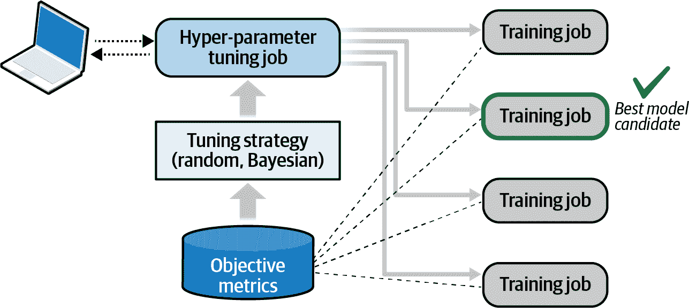
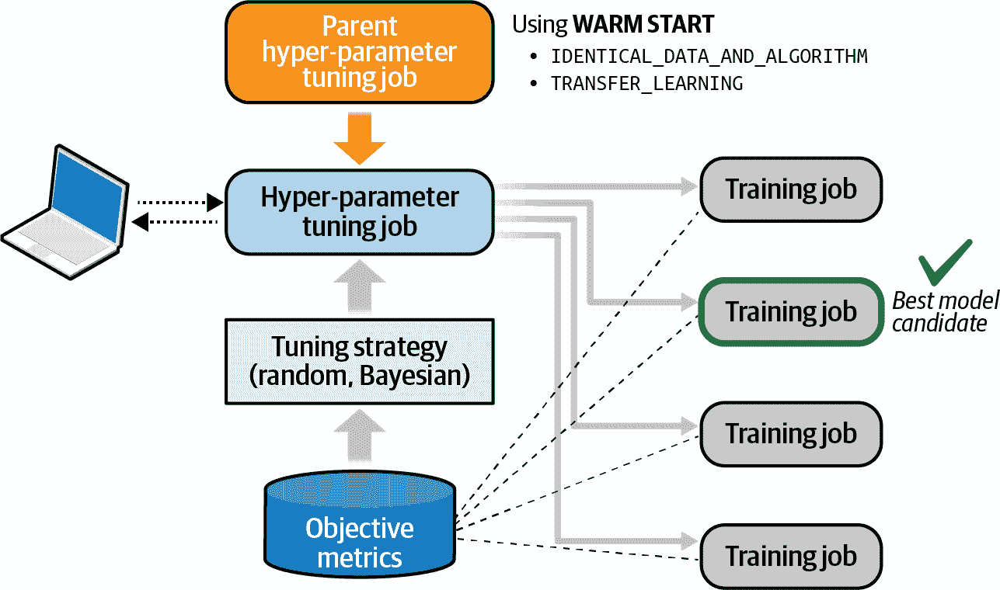
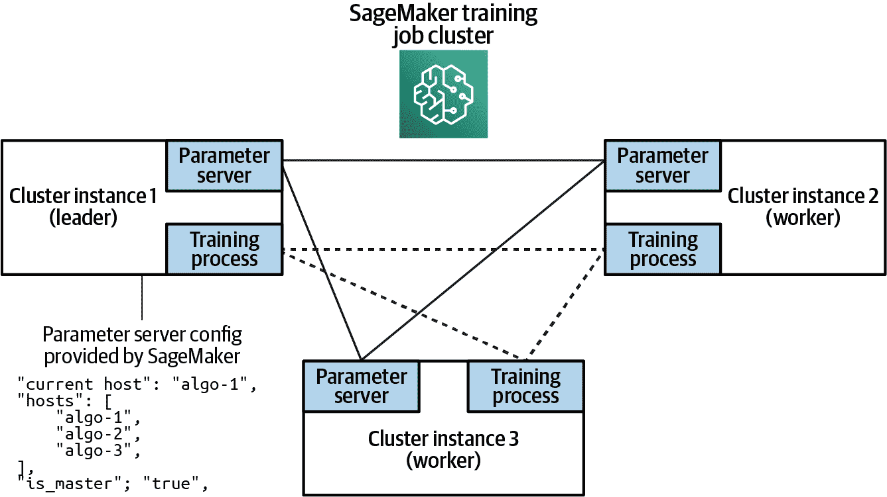
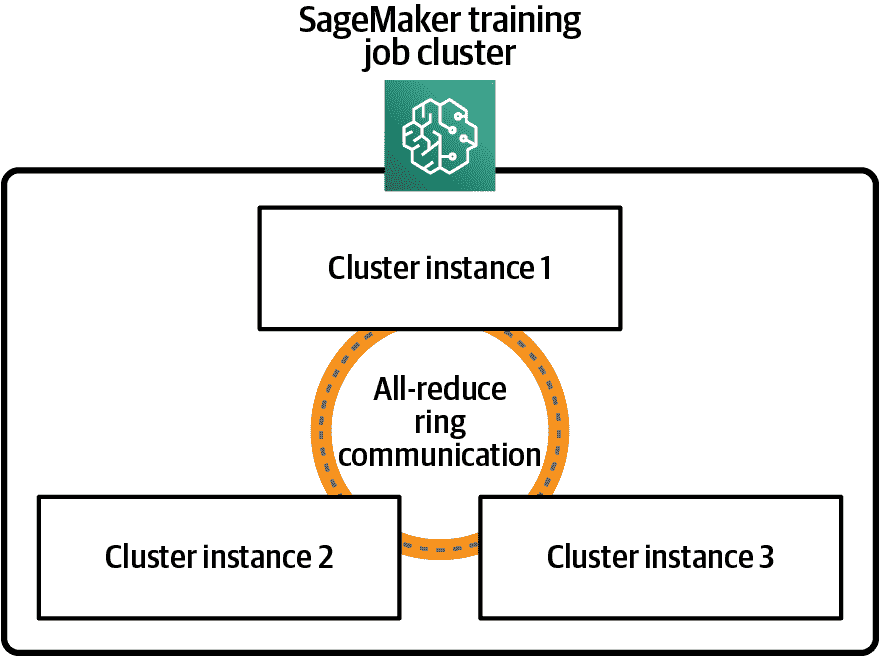
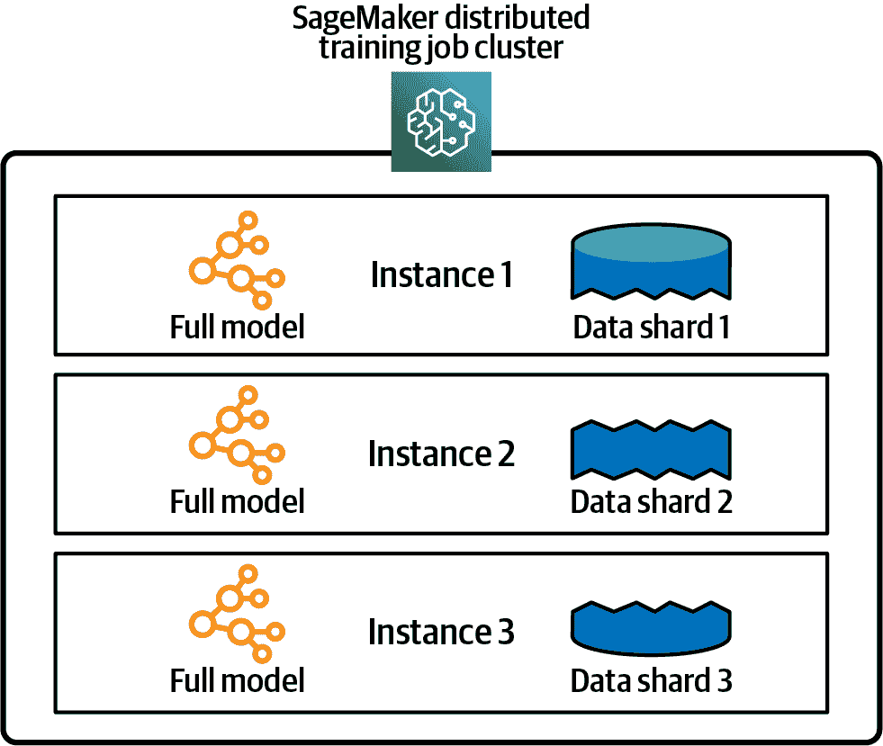
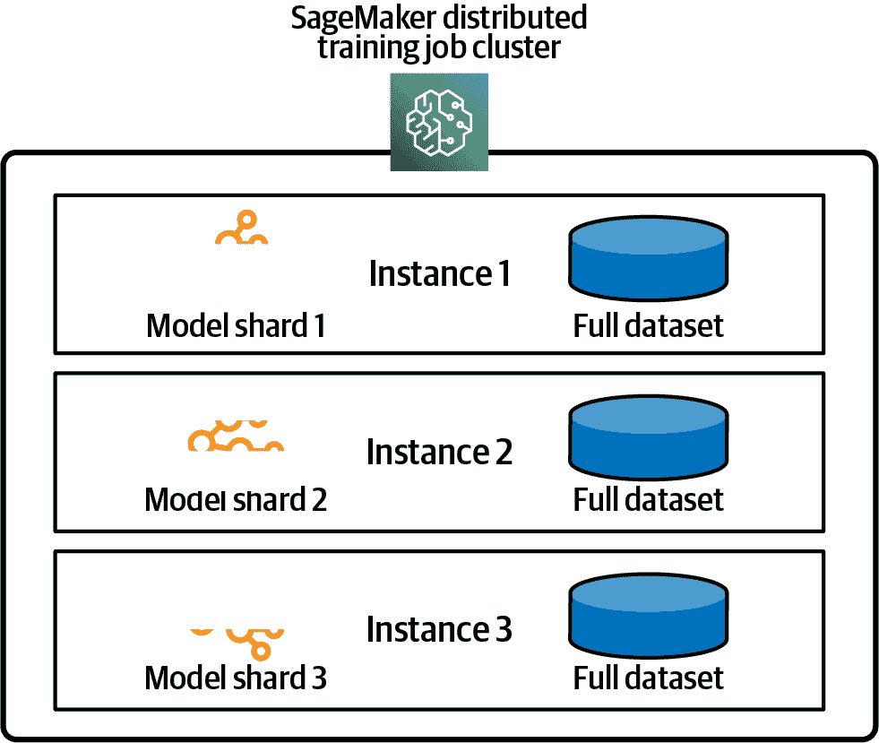
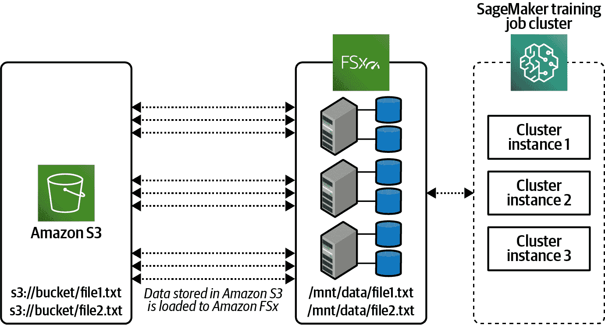
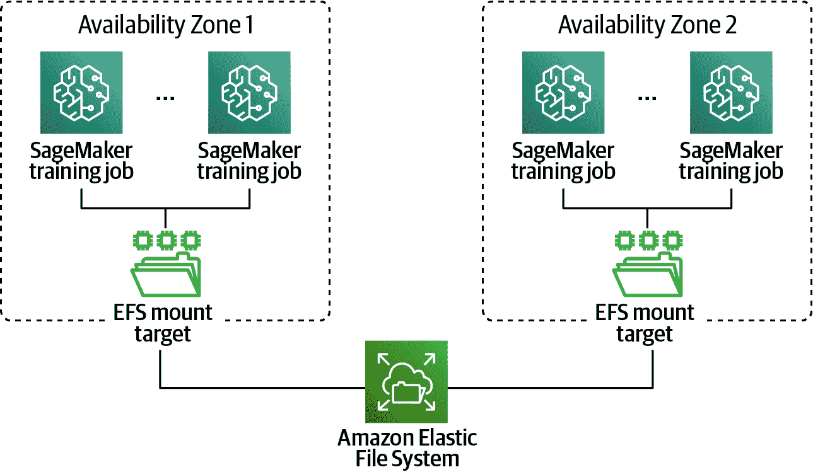
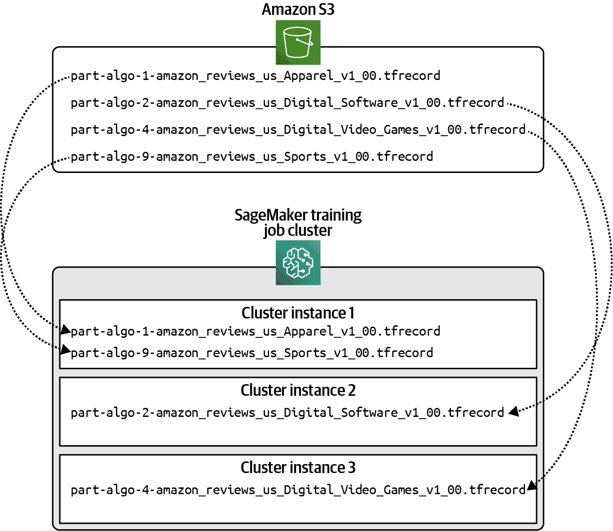

# 第八章：大规模训练和优化模型

彼得·德鲁克（Peter Drucker）是杰夫·贝佐斯最喜欢的商业战略家之一，他曾说过：“如果你不能衡量它，你就不能改进它。”这句话捕捉到了本章的核心，重点在于衡量、优化和改进我们的预测模型。

在上一章中，我们使用 Amazon SageMaker 训练了一个具有单一超参数集的单一模型。我们还展示了如何微调预训练的 BERT 模型，构建一个评估文本情感的分类器模型，以预测来自社交渠道、合作伙伴网站等的产品评论的情感。

在本章中，我们将使用 SageMaker 实验来量化、跟踪、比较和改进我们的模型。我们还将使用 SageMaker Hyper-Parameter Tuning 选择特定算法和数据集的最佳超参数。我们还展示了如何使用各种通信策略和分布式文件系统进行分布式训练。最后，我们提供了如何通过 SageMaker Autopilot 的超参数选择算法、SageMaker 优化的管道到 S3 和 AWS 增强网络硬件来降低成本和提高性能的建议。

# 自动找到最佳模型超参数

现在我们知道如何跟踪和比较模型训练运行，我们可以使用名为超参数调优（HPT）或超参数优化（HPO）的可扩展过程自动找到适合我们数据集和算法的最佳超参数。SageMaker 原生支持 HPT 作业。这些调优作业是 SageMaker Autopilot 的构建模块，详细讨论请见第三章。

我们已经了解到超参数在模型训练期间控制我们的机器学习算法如何学习模型参数。在调整超参数时，我们需要定义一个优化的目标，例如模型准确度。换句话说，我们需要找到一组超参数，使其满足或超过我们给定的目标。

在每次 HPT 运行之后，我们评估模型性能并调整超参数，直到达到目标。手动执行此操作非常耗时，因为模型调优通常需要数十甚至数百个训练作业才能收敛于最佳超参数组合以实现我们的目标。SageMaker 的 HPT 作业通过使用给定的调优策略并行运行多个训练作业，加速和扩展了优化过程，如图 8-1 所示。



###### 图 8-1\. SageMaker HPT 支持常见的调优策略。

SageMaker 支持随机搜索和贝叶斯超参数优化策略。使用随机搜索时，我们会随机挑选超参数组合，直到找到表现良好的组合。这种方法非常快速且易于并行化，但可能会错过最佳超参数集，因为我们是从超参数空间随机选择的。使用贝叶斯优化时，我们将任务视为回归问题。

类似于我们实际模型如何学习最小化损失函数的模型权重，贝叶斯优化通过使用替代模型和获取函数来迭代，以使用在先前优化运行期间学习到的先验知识在超参数空间上进行信息搜索，以找到最佳超参数。贝叶斯优化通常比手动、随机或网格搜索更高效，但需要我们顺序执行一些优化（而不是并行执行），以建立所需的先验知识，以在超参数空间上进行信息搜索。

那么，网格搜索呢？使用网格搜索，我们将评估超参数空间中每一种可能的超参数组合的网格。这种方法通常效率低下，并且完成时间相对于随机搜索和贝叶斯优化策略需要花费数量级更长的时间。在撰写本文时，SageMaker HPT 不支持低效的网格搜索优化策略。相反，我们建议使用随机搜索和贝叶斯优化策略。

## 设置超参数范围

让我们使用 SageMaker HPT 来为前一章节中基于 BERT 的评论分类器找到最佳超参数。首先，让我们创建一个`optimize`实验追踪器，并将其与我们的实验关联起来。

```
from smexperiments.tracker import Tracker

tracker_optimize = Tracker.create(display_name='optimize-1', 
                                  sagemaker_boto_client=sm)

optimize_trial_component_name = 
	tracker_optimize.trial_component.trial_component_name

trial.add_trial_component(tracker_optimize.trial_component)
```

为了使这个例子保持简单，并避免试验运行的组合爆炸，我们将冻结大部分超参数，并仅在此次优化运行中探索有限的集合。在资源和预算无限的理想情况下，我们将探索每一种超参数的组合。但现在，我们将手动选择以下一些超参数，并在我们的 HPO 运行中探索其余的。

```
epochs=500
epsilon=0.00000001
train_batch_size=128
validation_batch_size=128
test_batch_size=128
train_steps_per_epoch=100
validation_steps=100
test_steps=100
use_xla=True
use_amp=True
freeze_bert_layer=True
```

接下来，让我们设置我们希望探索的超参数范围。我们根据直觉、领域知识和算法文档选择这些超参数。我们还可能发现研究论文或社区中的其他先前工作有用。在机器学习和预测分析的生命周期的这一阶段，我们几乎总能找到解决我们试图解决的问题的相关信息。

如果我们仍然找不到合适的起始点，我们应该对数范围进行探索（而不是线性范围），以帮助获得超参数规模的感觉。例如，如果我们最佳的超参数与数千的量级差异很大，那么探索集合[1, 2, 3, 4]就没有意义。

SageMaker Autopilot 是确定我们问题和数据集的基准超参数集的另一种方法。SageMaker Autopilot 的超参数选择过程已在亚马逊广泛的数据集、算法和用例中经过数千小时的训练作业的精炼。

SageMaker HPT 支持三种参数范围类型：分类、连续和整数。`分类` 用于离散值集合（例如 `产品类别`）。`连续` 用于浮点数，`整数` 用于整数。我们还可以为每种超参数范围类型指定缩放类型。缩放类型可以设置为 `线性`、`对数`、`反对数` 或 `自动`，这样 SageMaker 就可以决定。某些超参数更适合某些缩放类型。在这里，我们指定 SageMaker 调优作业应使用线性尺度在给定范围内探索连续超参数 `learning_rate`：

```
from sagemaker.tuner import ContinuousParameter

hyperparameter_ranges = {
    'learning_rate': ContinuousParameter(0.00001, 0.00005, 
                                         scaling_type='Linear'),
}
```

###### 提示

如果我们没有适合探索特定超参数的范围——即使在研究其他解决类似问题的算法之后——我们可以从 `对数` 缩放类型开始处理该超参数，并逐渐使用 `线性` 缩放类型探索范围。

最后，我们需要定义 HPT 作业尝试优化的客观指标——在我们的例子中是验证准确率。请记住，我们需要提供正则表达式（regex）来从 SageMaker 容器日志中提取指标。我们选择还收集训练损失、训练准确率和验证损失以供信息目的使用：

```
objective_metric_name = 'validation:accuracy'

metrics_definitions = [
     {'Name': 'train:loss', 'Regex': 'loss: ([0-9\\.]+)'},
     {'Name': 'train:accuracy', 'Regex': 'accuracy: ([0-9\\.]+)'},
     {'Name': 'validation:loss', 'Regex': 'val_loss: ([0-9\\.]+)'},
     {'Name': 'validation:accuracy', 'Regex': 'val_accuracy: ([0-9\\.]+)'}]
```

## 运行超参数调优作业

我们首先像前一章一样创建我们的 TensorFlow 评估器。请注意，在这种情况下，我们没有指定 `learning_rate` 超参数。我们将在稍后将其作为超参数范围传递给 `HyperparameterTuner`：

```
from sagemaker.tensorflow import TensorFlow

hyperparameters={'epochs': epochs,
                 'epsilon': epsilon,
                 'train_batch_size': train_batch_size,
                 'validation_batch_size': validation_batch_size,  
                 'test_batch_size': test_batch_size,  
                 'train_steps_per_epoch': train_steps_per_epoch,
                 'validation_steps': validation_steps,
                 'test_steps': test_steps,
                 'use_xla': use_xla,
                 'use_amp': use_amp,                                             
                 'max_seq_length': max_seq_length,
                 'freeze_bert_layer': freeze_bert_layer,
}

estimator = TensorFlow(entry_point='tf_bert_reviews.py',
                       source_dir='src',
                       role=role,
                       instance_count=train_instance_count,
                       instance_type=train_instance_type,
                       py_version='<PYTHON_VERSION>',
                       framework_version='<TENSORFLOW_VERSION>',
                       hyperparameters=hyper_parameters,                       
                       metric_definitions=metrics_definitions,
                      )
```

接下来，我们可以通过传递 TensorFlow 评估器、超参数范围、客观指标、调优策略、并行/总作业数以及早停策略来创建我们的 HPT 作业。SageMaker 将使用给定的优化策略（即“贝叶斯”或“随机”）来探索给定范围内的值：

```
objective_metric_name = 'validation:accuracy'

tuner = HyperparameterTuner(
    estimator=estimator,
    objective_type='Maximize',
    objective_metric_name=objective_metric_name,
    hyperparameter_ranges=hyperparameter_ranges,
    metric_definitions=metrics_definitions,
    max_jobs=100,
    max_parallel_jobs=10,
    strategy='Bayesian',
    early_stopping_type='Auto'
)
```

在这个例子中，我们使用了 `贝叶斯` 优化策略，并行进行了 10 个作业，总共有 100 个作业。每次只做 10 个作业，我们给 `贝叶斯` 策略一个机会从之前的运行中学习。换句话说，如果我们同时进行了所有 100 个作业，`贝叶斯` 策略将无法利用先前的信息来选择范围内更好的值。

通过将 `early_stopping_type` 设置为 `Auto`，如果调优作业不能在客观指标上取得改进，SageMaker 将停止调优作业。这有助于节省时间，减少对训练数据集的过拟合可能性，并降低调优作业的总体成本。

通过调用 `tuner.fit()` 来启动调整作业，使用训练、验证和测试数据集拆分：

```
s3_input_train_data = 
	TrainingInput(s3_data=processed_train_data_s3_uri, 
	              distribution='ShardedByS3Key') 

s3_input_validation_data = 
	TrainingInput(s3_data=processed_validation_data_s3_uri,                                          
	              distribution='ShardedByS3Key')

s3_input_test_data = 
	TrainingInput(s3_data=processed_test_data_s3_uri,                                          
	              distribution='ShardedByS3Key')

tuner.fit(inputs={'train': s3_input_train_data, 
                  'validation': s3_input_validation_data,
                  'test': s3_input_test_data
          }, 
          include_cls_metadata=False)
```

## 分析调整作业中的最佳超参数

以下是确定最佳超参数的调整作业的结果。这次调整作业为最佳候选者实现了 0.9416 的最终训练精度，高于手动选择的超参数值集合 第七章 中的 0.9394 精度：

```
from sagemaker.analytics import HyperparameterTuningJobAnalytics

hp_results = HyperparameterTuningJobAnalytics(
    sagemaker_session=sess, 
    hyperparameter_tuning_job_name=tuning_job_name
)

df_results = hp_results.dataframe()
df_results
```

| freeze_bert_​layer | learning_​rate | train_batch_​size | TrainingJob​Name | TrainingJob​Status | FinalObjective​Value | TrainingElapsed​Time​Seconds |
| --- | --- | --- | --- | --- | --- | --- |
| “False” | 0.000017 | “128” | tensorflow-training-​210109-0222-​003-​cf95cdaa | Completed | 0.9416 | 11245.0 |
| … |
| “False” | 0.000042 | “128” | tensorflow-training-​210109-0222-​004-​48da4bab | Stopped | 0.8056 | 693.0 |

鉴于这次调整作业的结果，最佳超参数组合是 `learning_rate` 为 0.000017，`train_batch_size` 为 128，`freeze_bert_layer` 为 False。当超参数组合未能改善训练准确度目标度量时，SageMaker 提前停止了作业。这是 SageMaker 智能停止未能为业务目标增加价值的作业，从而节省了我们的成本。

## 显示我们 SageMaker 调整作业的实验谱系

HPT 作业完成后，我们可以直接在笔记本或 SageMaker Studio 中分析结果。

首先，让我们更新实验谱系，包括我们的 HPT 作业找到的最佳超参数和目标度量：

```
best_learning_rate = df_results.sort_values('FinalObjectiveValue', 
	ascending=0).head(1)['learning_rate']

tracker_optimize.log_parameters({ 
	'learning_rate': best_learning_rate
})

best_accuracy = df_results.sort_values('FinalObjectiveValue', 
	ascending=0).head(1)['FinalObjectiveValue']

tracker_optimize.log_metrics({ 
	'train:accuracy': best_accuracy
})

tracker_optimize.trial_component.save()
```

现在，让我们总结到目前为止的实验谱系。在 第九章 中，我们将部署模型，并进一步扩展我们的实验谱系以包括模型部署。然后，我们将在 第十章 中将所有内容整合到一个端到端管道中，实现全面的谱系跟踪。

```
from sagemaker.analytics import ExperimentAnalytics

lineage_table = ExperimentAnalytics(
    sagemaker_session=sess,
    experiment_name=experiment_name,
    metric_names=['train:accuracy'],
    sort_by="CreationTime",
    sort_order="Ascending",
)

lineage_table.dataframe()
```

| TrialComponentName | DisplayName | max_seq_length | learning_rate | train_accuracy | … |
| --- | --- | --- | --- | --- | --- |
| TrialComponent-​2021-01-09-062410-pxuy | prepare | 64.0 | NaN | NaN | … |
| tensorflow-training-​2021-01-09-06-24-12-989 | train | 64.0 | 0.00001 | 0.9394 | … |
| TrialComponent-​2020-06-12-193933-bowu | optimize-1 | 64.0 | 0.000017 | 0.9416 | … |

在这个示例中，我们优化了 TensorFlow BERT 分类器层的超参数。SageMaker HPT 还支持通过将算法列表添加到调整作业定义来跨多个算法进行自动超参数调整。我们可以为每个算法指定不同的超参数和范围。类似地，SageMaker Autopilot 使用多算法调整来根据我们的问题类型、数据集和目标函数找到最佳模型。

# 使用 Warm Start 进行额外的 SageMaker 超参数调整作业

一旦我们有了最佳候选者，我们可以选择使用称为“热启动”的技术执行另一轮超参数优化。热启动重复使用先前 HPT 作业或一组作业的结果，以加快优化过程并降低总成本。热启动创建了多对多的父-子关系。在我们的示例中，我们与单个父作业——前一个调整作业——执行热启动，如图 8-2 所示。



###### 图 8-2\. 使用热启动从先前的调整作业开始一个额外的 HPT 作业。

当我们想要从上一个作业更改可调参数范围或添加新的超参数时，热启动尤其有用。两种情况都使用前一个调整作业来更快地找到最佳模型。这两种情况分别用两种热启动类型实现：`IDENTICAL_DATA_AND_ALGORITHM`和`TRANSFER_LEARNING`。

如果我们选择`IDENTICAL_DATA_AND_ALGORITHM`，新的调整作业将使用与父作业相同的输入数据和训练图像。我们可以更新可调参数范围和最大训练作业数。我们还可以将之前的固定超参数添加到可调超参数列表中，反之亦然——只要固定加可调超参数总数保持不变即可。完成后，采用这种策略的调整作业将返回一个额外字段，`OverallBestTrainingJob`，其中包含最佳模型候选者，包括此调整作业以及已完成的父调整作业。

如果我们选择`TRANSFER_LEARNING`，我们可以使用更新后的训练数据和不同版本的训练算法。也许自上次优化运行以来我们收集了更多的训练数据，现在我们想要使用更新后的数据集重新运行调整作业。或者可能发布了更新的算法版本，我们想要重新运行优化过程。

## 运行使用热启动的 HPT 作业

我们需要使用一个或多个先前的 HPT 作业作为父作业来配置调整作业的`WarmStartConfig`。父 HPT 作业必须以`Completed`、`Stopped`或`Failed`状态完成。不支持递归的父-子关系。我们还需要指定`WarmStartType`。在我们的示例中，我们将使用`IDENTICAL_DATA_AND_ALGORITHM`，因为我们计划仅修改超参数范围，而不使用更新后的数据集或算法版本。

让我们从设置`WarmStartConfig`开始：

```
from sagemaker.tuner import WarmStartConfig
from sagemaker.tuner import WarmStartTypes

warm_start_config = WarmStartConfig( 
	warm_start_type=WarmStartTypes.IDENTICAL_DATA_AND_ALGORITHM, 
	parents={tuning_job_name})
```

让我们定义那些不打算调整的固定超参数：

```
epochs=500
epsilon=0.00000001
train_batch_size=128
validation_batch_size=128
test_batch_size=128
train_steps_per_epoch=100
validation_steps=100
test_steps=100
use_xla=True
use_amp=True
freeze_bert_layer=False

from sagemaker.tensorflow import TensorFlow

hyperparameters={'epochs': epochs,
                 'epsilon': epsilon,
                 'train_batch_size': train_batch_size,
                 'validation_batch_size': validation_batch_size,
                 'test_batch_size': test_batch_size,                                             
                 'train_steps_per_epoch': train_steps_per_epoch,
                 'validation_steps': validation_steps,
                 'test_steps': test_steps,
                 'use_xla': use_xla,
                 'use_amp': use_amp,
                 'max_seq_length': max_seq_length,
                 'freeze_bert_layer': freeze_bert_layer
}
```

```
estimator = TensorFlow(entry_point='tf_bert_reviews.py',
                       source_dir='src',
                       role=role,
                       instance_count=train_instance_count, 
                       instance_type=train_instance_type,
                       volume_size=train_volume_size,
                       py_version='<PYTHON_VERSION>',
                       framework_version='<TENSORFLOW_VERSION>',
                       hyperparameters=hyperparameters,
                       metric_definitions=metrics_definitions,
                      )
```

虽然我们可以选择在这个热启动调整作业中调整更多超参数，但我们将简单地修改我们的`learning_rate`范围，以便缩小到在父调整作业中找到的最佳值：

```
from sagemaker.tuner import IntegerParameter
from sagemaker.tuner import ContinuousParameter
from sagemaker.tuner import CategoricalParameter

hyperparameter_ranges = {
    'learning_rate': ContinuousParameter(0.00015, 0.00020,
                                     	 scaling_type='Linear')}
```

现在让我们定义目标度量，使用前述`warm_start_config`创建`HyperparameterTuner`，并启动调整作业：

```
objective_metric_name = 'validation:accuracy'

tuner = HyperparameterTuner(
    estimator=estimator,
    objective_type='Maximize',
    objective_metric_name=objective_metric_name,
    hyperparameter_ranges=hyperparameter_ranges,
    metric_definitions=metrics_definitions,
    max_jobs=50,
    max_parallel_jobs=5,
    strategy='Bayesian',
    early_stopping_type='Auto',
    warm_start_config=warm_start_config
)
```

最后，让我们配置数据集拆分并启动我们的调优作业：

```
s3_input_train_data = 
	TrainingInput(s3_data=processed_train_data_s3_uri, 
	              distribution='ShardedByS3Key') 

s3_input_validation_data = 
	TrainingInput(s3_data=processed_validation_data_s3_uri,                                          
	              distribution='ShardedByS3Key')

s3_input_test_data = 
	TrainingInput(s3_data=processed_test_data_s3_uri,                                          
	              distribution='ShardedByS3Key')

tuner.fit({'train': s3_input_train_data, 
           'validation': s3_input_validation_data,
           'test': s3_input_test_data}, 
       },
       include_cls_metadata=False)
```

## 分析温启动调优作业的最佳超参数

以下是用于确定最佳超参数的调优作业结果。调优作业导致了 0.9216 的最佳候选训练精度，低于父 HPT 作业的最佳候选训练精度 0.9416。在更新我们的实验谱系以包含温启动 HPT 结果后，我们将采用产生父调优作业中最高训练精度 0.9416 的候选超参数。

| TrialComponentName | DisplayName | max_seq_length | learning_rate | train_accuracy | … |
| --- | --- | --- | --- | --- | --- |
| TrialComponent-​2021-01-09-062410-pxuy | 准备 | 64.0 | NaN | NaN | … |
| tensorflow-training-​2021-01-09-06-24-12-989 | 训练 | 64.0 | 0.00001 | 0.9394 | … |
| TrialComponent-​2021-01-09-193933-bowu | 优化-1 | 64.0 | 0.000017 | 0.9416 | … |
| TrialComponent-​2021-01-09-234445-dep | 优化-2 | 64.0 | 0.000013 | 0.9216 | … |

在这个例子中，我们已经优化了我们的 TensorFlow BERT 分类器层的超参数。SageMaker HPT 还通过在调优作业定义中添加算法列表来支持多算法的自动 HPT。我们可以为每个算法指定不同的超参数和范围。类似地，SageMaker Autopilot 使用多算法调优来基于问题类型、数据集和目标函数找到最佳模型。

温启动调优作业未能超越父调优作业的最佳候选精度。因此，在这个例子中，仍然选择父调优作业中找到的超参数作为最佳候选。

# 使用 SageMaker 分布式训练扩展

大多数现代 AI 和机器学习框架都支持某种形式的分布式处理，以扩展计算能力。如果没有分布式处理，训练作业将受限于单个实例的资源。虽然单个实例类型在能力方面（RAM、CPU 和 GPU）不断增强，但我们现代的大数据世界需要一个集群来支持持续数据摄取、实时分析和数据密集型机器学习模型。

让我们运行一个分布式训练作业，使用 TensorFlow 2.x Keras API、BERT 和 SageMaker 的本地分布式训练支持来构建我们的评论分类器模型。

###### 注意

虽然本章没有包含 PyTorch 的示例，但 SageMaker 绝对支持分布式 PyTorch。请查看我们的 GitHub 存储库，了解 PyTorch 和 BERT 示例。此外，Hugging Face Transformers 库原生支持 SageMaker 的分布式训练基础设施，适用于 TensorFlow 和 PyTorch。

## 选择分布式通信策略

任何分布式计算都要求集群实例之间进行通信并共享信息。这种集群通信受益于实例之间更高带宽的连接。因此，如果可能的话，实例应该在云数据中心内彼此物理靠近。幸运的是，SageMaker 为我们处理了所有这些繁重的工作，因此我们可以专注于创建我们的评论分类器并解决我们在野外分类产品评论的业务问题。SageMaker 支持使用许多分布式原生框架进行分布式计算，包括 Apache Spark、TensorFlow、PyTorch 和 Apache MXNet。

###### 注意

虽然大多数现代 AI 和机器学习框架如 TensorFlow、PyTorch 和 Apache MXNet 都设计用于分布式计算，但许多经典的数据科学库如 scikit-learn 和 pandas 并不原生支持分布式通信协议或分布式数据集。Dask 是一个流行的运行时，可帮助将某些 scikit-learn 模型扩展到集群中的多个节点。

“参数服务器”是大多数分布式机器学习框架支持的一种原始分布式训练策略。请记住，参数是算法学习的内容。参数服务器存储学习到的参数，并在训练过程中与每个实例共享。由于参数服务器存储参数的状态，SageMaker 在每个实例上运行参数服务器以提高可用性，如 图 8-3 所示。



###### 图 8-3\. 参数服务器的分布式通信。

在每个实例上运行有状态的参数服务器有助于 SageMaker 在训练过程中从故障情况或当 Spot 实例被终止并替换时进行恢复。

另一种根植于并行计算和消息传递接口（MPI）的常见分布式通信策略是“all-reduce”。All-reduce 使用类似环形的通信模式，如 图 8-4 所示，并提高了在通信开销对参数服务器之间的影响较大的非常大集群中的整体训练效率。



###### 图 8-4\. All-reduce 分布式通信策略。

SageMaker 的 all-reduce 分布式训练策略与 Horovod 兼容，后者是一种流行的 all-reduce 和 MPI 实现，常用于将 TensorFlow 和 PyTorch 训练作业扩展到集群中的多个实例。如果我们当前正在使用 Horovod 进行分布式训练，我们可以轻松过渡到 SageMaker 的 all-reduce 策略。在我们的示例中，我们将使用 SageMaker 内置的分布式 all-reduce 通信策略。

## 选择并行策略

在执行分布式计算时，有两种主要的并行方式：数据并行和模型并行。我们大多数人已经熟悉数据并行，它来自于类似 Apache Spark 这样的经典 Map-Reduce 数据处理工具，将数据集分割成“分片”并将它们放置在单独的实例上。每个实例在“映射”阶段分别处理其分片，然后在“归约”阶段合并结果。当我们的数据集无法适应单个实例时，如现代大数据处理和分布式机器学习的情况下，就需要数据并行。图 8-5 显示数据并行如何将数据分割到不同实例上，以便模型分别处理。



###### 图 8-5。将数据集通过数据并行分片到多个实例上进行分布式训练。

模型并行性则相反，将处理分割到单独的实例上，并在每个实例上分别处理整个数据集。这要复杂得多，通常在我们的模型由于内存限制而无法适应单个实例资源时需要使用。图 8-6 显示模型并行性如何将模型分割到不同实例上，并处理每个“模型分片”的完整数据集。



###### 图 8-6。使用模型并行将模型分片到多个实例上进行分布式训练。

SageMaker 原生支持数据并行和模型并行。对于我们的 BERT 模型，我们将使用数据并行，因为我们的模型适合单个实例，因此我们将把数据集分片到不同的实例上进行训练，并通过内置到 SageMaker 分布式训练中的全局归约通信策略合并结果。

## 选择分布式文件系统

通常，我们的分布式训练集群直接与 S3 进行数据读写。然而，某些框架和工具未经过 S3 本地优化，或者仅支持 POSIX 兼容的文件系统。对于这些情况，我们可以使用 FSx for Lustre（Linux）或 Amazon FSx for Windows File Server，在 S3 之上提供一个 POSIX 兼容的文件系统。这一额外层还提供了关键的缓存性能优势，可以将大型数据集的训练时间降至合理水平。

Amazon FSx for Lustre 是一个高性能的、与 POSIX 兼容的文件系统，能够与 S3 本地集成。FSx for Lustre 基于开源 Lustre 文件系统设计，专为具有 PB 级数据、每秒 TB 级聚合 I/O 吞吐量和一致低延迟的高度可扩展、高度分布式和高度并行的训练作业而设计。

还有 Amazon FSx for Windows File Server，它提供与 Windows 兼容的文件系统，并与 S3 原生集成。然而，我们选择关注 FSx for Lustre，因为我们的示例是基于 Linux 的。这两种文件系统都针对使用 S3 的机器学习、分析和高性能计算工作负载进行了优化。并且这两种文件系统都提供类似的功能。

FSx for Lustre 是一个完全托管的服务，简化了设置和管理 Lustre 文件系统的复杂性。将 S3 存储桶挂载为文件系统后，FSx for Lustre 让我们能够同时从任意数量的实例访问数据，并且缓存 S3 对象以提高迭代机器学习工作负载的性能，这些工作负载会多次处理数据集以拟合高精度模型。图 8-7 展示了 SageMaker 如何使用 FSx for Lustre 提供快速、共享的 S3 数据访问，加速我们的训练和调优任务。



###### 图 8-7。SageMaker 使用 FSx for Lustre 提升训练和调优任务的性能。

我们的 SageMaker 训练集群实例使用*/mnt/data/file1.txt*访问 FSx for Lustre 中的文件。FSx for Lustre 会转换此请求并向 S3 发出`GetObject`请求。文件将被缓存并返回到集群实例。如果文件未更改，则后续请求将从 FSx for Lustre 的缓存返回。由于训练数据在训练作业运行期间通常不会更改，因此在多个训练周期中迭代数据集时，我们看到了巨大的性能提升。

一旦设置了 FSx for Lustre 文件系统，我们可以将 FSx for Lustre 文件系统的位置传递给训练作业，如下所示：

```
estimator = TensorFlow(entry_point='tf_bert_reviews.py', 
                       source_dir='src', 
                       instance_count=train_instance_count,
                       instance_type=train_instance_type,
                       subnets=['subnet-1', 'subnet-2']
                       security_group_ids=['sg-1'])

fsx_data = FileSystemInput(file_system_id='fs-1',
                           file_system_type='FSxLustre',
                           directory_path='/mnt/data,
                           file_system_access_mode='ro')

estimator.fit(inputs=fsx_data)
```

请注意，在创建我们的 FSx for Lustre 文件系统时，我们需要指定`subnets`和`security_group_ids`。我们将在第十二章深入探讨网络和安全性。

另一种分布式训练选项是 Amazon Elastic File System（Amazon EFS）。Amazon EFS 兼容行业标准的网络文件系统协议，但针对 AWS 的云原生和弹性环境进行了优化，包括网络、访问控制、加密和可用性。在本节中，我们调整我们的分布式训练作业，同时使用 FSx for Lustre（Linux）和 Amazon EFS。Amazon EFS 为分布式训练集群中的数千个实例提供集中、共享的训练数据集访问，如图 8-8 所示。



###### 图 8-8。Amazon EFS 与 SageMaker。

###### 注意

SageMaker Studio 使用 Amazon EFS 为所有团队成员提供集中、共享和安全的代码和笔记本访问权限。

存储在 Amazon EFS 中的数据在多个可用区复制，提供更高的可用性和读/写吞吐量。随着新数据的摄入，Amazon EFS 文件系统将自动扩展。

假设我们已经挂载并填充了 Amazon EFS 文件系统的训练数据，我们可以通过两种不同的实现将 Amazon EFS 挂载传递到训练作业中：`FileSystemInput`和`FileSystemRecordSet`。

此示例展示了如何使用`FileSystemInput`实现：

```
estimator = TensorFlow(entry_point='tf_bert_reviews.py', 
                       source_dir='src', 
                       instance_count=train_instance_count,
                       instance_type=train_instance_type,
                       subnets=['subnet-1', 'subnet-2']
                       security_group_ids=['sg-1'])

efs_data = FileSystemInput(file_system_id='fs-1',
                           file_system_type='EFS',
                           directory_path='/mnt/data,
                           file_system_access_mode='ro')

estimator.fit(inputs=efs_data)
```

请注意，在创建 Amazon EFS 文件系统时，我们需要指定用于其的`子网`和`安全组 ID`。我们将深入研究第十二章中的网络和安全性。

对于我们的示例，我们将使用 FSx for Lustre，因为其具有 S3 缓存功能，可以极大地提高我们的训练性能。

## 启动分布式训练作业

SageMaker 遵循云原生原则，本质上是分布式和可扩展的。在上一章中，我们使用了单个实例，通过指定`train_instance_count=1`。在这里，我们将增加`train_instance_count`并在我们的 TensorFlow 估算器中指定`distribution`参数，以启用 SageMaker 的分布式训练，如下所示：

```
train_instance_count=3
train_instance_type='ml.p4d.24xlarge'

from sagemaker.tensorflow import TensorFlow

estimator = TensorFlow(entry_point='tf_bert_reviews.py', 
                       source_dir='src', 
                       instance_count=train_instance_count,                        
                       instance_type=train_instance_type,
                       ...
                       py_version='<PYTHON_VERSION>',
                       framework_version='<TENSORFLOW_VERSION>',
                       distribution={'smdistributed':{
	                       'dataparallel':{
	                            'enabled': True
	                       }
                       }
)
```

SageMaker 会自动将相关集群信息传递给 TensorFlow，以启用全减少策略并使用分布式 TensorFlow。

###### 注意

SageMaker 还将相同的集群信息传递给分布式 PyTorch 和 Apache MXNet，但在本示例中仅显示 TensorFlow。

# 减少成本并提高性能

在本节中，我们讨论了使用一些高级 SageMaker 功能来提高成本效益和性能的各种方法，包括 SageMaker Autopilot 用于基线超参数选择，`ShardedByS3Key`用于在所有训练实例之间分发输入文件，以及`Pipe`模式来提高 I/O 吞吐量。我们还强调了 AWS 增强的网络功能，包括弹性网络适配器（ENA）和弹性布线适配器（EFA），以优化训练和调整集群中实例之间的网络性能。

## 从合理的超参数范围开始

通过研究他人的工作，我们很可能可以找到一系列超参数的范围，这将缩小搜索空间并加快我们的 SageMaker HPT 作业。如果我们没有一个好的起点，我们可以使用`对数`缩放策略来确定我们应该探索的范围。仅仅知道 10 的幂次可以显著减少找到最佳超参数的时间，适用于我们的算法和数据集。

## 使用`ShardedByS3Key`对数据进行分片

在大规模训练时，我们需要考虑集群中每个实例如何读取大型训练数据集。我们可以采用蛮力方法将所有数据复制到所有实例中。然而，对于更大的数据集，这可能需要很长时间，并且可能会主导整体训练时间。例如，在执行特征工程之后，我们的分词训练数据集大约有 45 个`TFRecord`“part”文件，如下所示：

```
part-algo-1-amazon_reviews_us_Apparel_v1_00.tfrecord
...
part-algo-2-amazon_reviews_us_Digital_Software_v1_00.tfrecord
part-algo-4-amazon_reviews_us_Digital_Video_Games_v1_00.tfrecord
...
part-algo-9-amazon_reviews_us_Sports_v1_00.tfrecord
```

与其将所有 45 个分片文件加载到集群中的所有实例中，我们可以通过将每个集群实例上仅放置 15 个分片文件来改善启动性能，总共在集群中分布了 45 个分片文件。这称为“分片”。我们将使用 SageMaker 的`ShardedByS3Key`功能，将分片文件均匀分布到集群中，如图 8-9 所示。



###### 图 8-9\. 使用`ShardedByS3Key`分布策略将输入文件分布到集群实例中。

在这里，我们为我们的 S3 输入数据（包括训练、验证和测试数据集）设置了`ShardedByS3Key`分布策略：

```
s3_input_train_data = 
  sagemaker.s3_input(s3_data=processed_train_data_s3_uri, 
                     distribution='ShardedByS3Key') 

s3_input_validation_data =
  sagemaker.s3_input(s3_data=processed_validation_data_s3_uri, 
                     distribution='ShardedByS3Key')

s3_input_test_data = 
  sagemaker.s3_input(s3_data=processed_test_data_s3_uri,                 
                     distribution='ShardedByS3Key')
```

接下来，我们为每个数据集分片（包括训练、验证和测试）调用`fit()`：

```
estimator.fit(inputs={'train': s3_input_train_data, 
                      'validation': s3_input_validation_data,
                      'test': s3_input_test_data
              })
```

在这种情况下，我们集群中的每个实例将收到每个数据集分片约 15 个文件。

## 使用 Pipe 模式动态流式传输数据

除了分片之外，我们还可以使用 SageMaker 的`Pipe`模式，按需动态加载数据。到目前为止，我们一直在使用默认的`File`模式，在训练作业启动时将所有数据复制到所有实例，这会导致长时间的启动暂停。使用大型数据集（10、100 或 1,000 GB 范围内）时，`Pipe`模式提供了最显著的性能提升。如果我们的数据集较小，则应使用`File`模式。

`Pipe`模式可以并行地从 S3 直接流式传输数据到每个实例的训练过程中，其 I/O 吞吐量明显高于`File`模式。通过仅在需要时流式传输数据，我们的训练和调优作业启动更快、完成更快，并且总体上使用更少的磁盘空间。这直接降低了我们训练和调优作业的成本。

`Pipe`模式与 S3 一起按需获取训练数据的行。在幕后，`Pipe`模式使用 Unix 先进先出（FIFO）文件从 S3 读取数据并在数据即将被训练作业使用前在实例上缓存。这些 FIFO 文件是单向可读的，换句话说，我们无法随机备份或跳过。

这是我们配置训练作业使用`Pipe`模式的方式：

```
estimator = TensorFlow(entry_point='tf_bert_reviews.py', 
                       source_dir='src', 
                       instance_count=train_instance_count, 
                       instance_type=train_instance_type,
                       ...
                       input_mode='Pipe')
```

由于`Pipe`模式包装了我们的 TensorFlow 数据集读取器，我们需要稍微修改我们的 TensorFlow 代码以检测`Pipe`模式并使用`PipeModeDataset`包装器：

```
    if input_mode == 'Pipe':
        from sagemaker_tensorflow import PipeModeDataset

        dataset = PipeModeDataset(channel=channel,
                                  record_format='TFRecord')
    else:
        dataset = tf.data.TFRecordDataset(input_filenames)
```

## 启用增强型网络

在规模化训练中，集群内实例之间需要超快的通信。务必选择一种能够利用 ENA 和 EFA 提供高网络带宽以及集群内实例之间一致网络延迟的实例类型。

ENA 与 AWS 深度学习实例类型（包括 C、M、P 和 X 系列）兼容良好。这些实例类型提供大量的 CPU，因此它们从网络适配器的高效共享中受益匪浅。通过执行各种网络级别的优化，如基于硬件的校验和生成和软件路由，ENA 减少了开销，提高了可伸缩性，并最大化了一致性。所有这些优化措施旨在减少瓶颈，卸载 CPU 的工作，并为网络数据包创建有效路径。

EFA 使用自定义构建的操作系统级旁路技术来提高集群内实例之间的网络性能。EFA 原生支持 MPI，这对于扩展到数千个 CPU 的高性能计算应用至关重要。EFA 得到许多计算优化实例类型的支持，包括 C 和 P 系列。

尽管没有足够的具体数据来验证，但一些从业者注意到，在虚拟私有云（VPC）中运行分布式 SageMaker 作业时，性能有所提升。这很可能归因于在同一 VPC 中运行的集群实例之间的网络延迟减少。如果我们的训练作业特别对延迟敏感，我们可能想尝试在 VPC 中运行我们的训练作业。我们在第十二章深入探讨了 VPC 和 SageMaker。

# 摘要

在本章中，我们使用 SageMaker 实验和 HPT 来跟踪、比较和选择我们特定算法和数据集的最佳超参数。我们探讨了各种分布式通信策略，如参数服务器和全局减少。我们演示了如何使用 FSx for Lustre 来增加 S3 的性能，并如何配置我们的训练作业以使用 Amazon EFS。最后，我们讨论了使用 SageMaker 自动驾驶的超参数选择功能和像 `ShardedByS3Key` 和 `Pipe` 模式这样的 SageMaker 优化数据加载策略来降低成本和提高性能的几种方法。我们还讨论了计算优化实例类型，包括 ENA 和 EFA 的增强网络功能。

在第九章，我们将使用各种推出、A/B 测试和多臂老虎机策略将我们的模型部署到生产环境中。我们将讨论如何使用实时 REST 端点、离线批处理作业和边缘设备将模型预测集成到应用程序中。我们演示了如何基于内置和自定义 CloudWatch 指标自动扩展我们的端点。我们还深入探讨了如何使用 SageMaker 模型监视器检测我们的实时 SageMaker 端点中数据分布的变化、模型偏差和模型可解释性的漂移。
