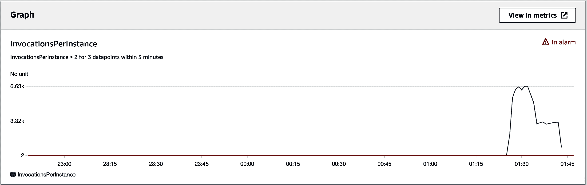
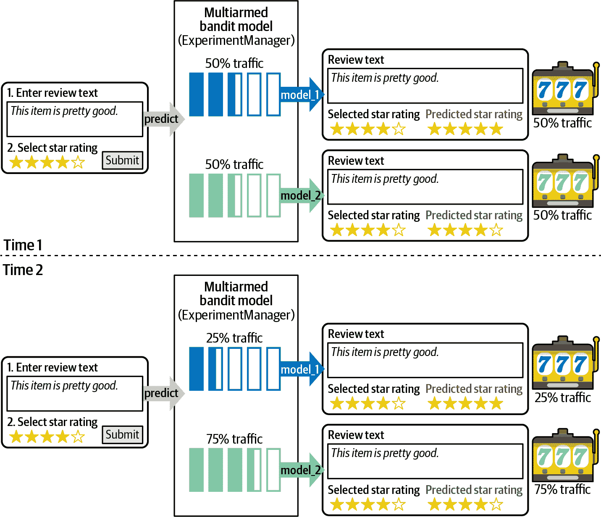
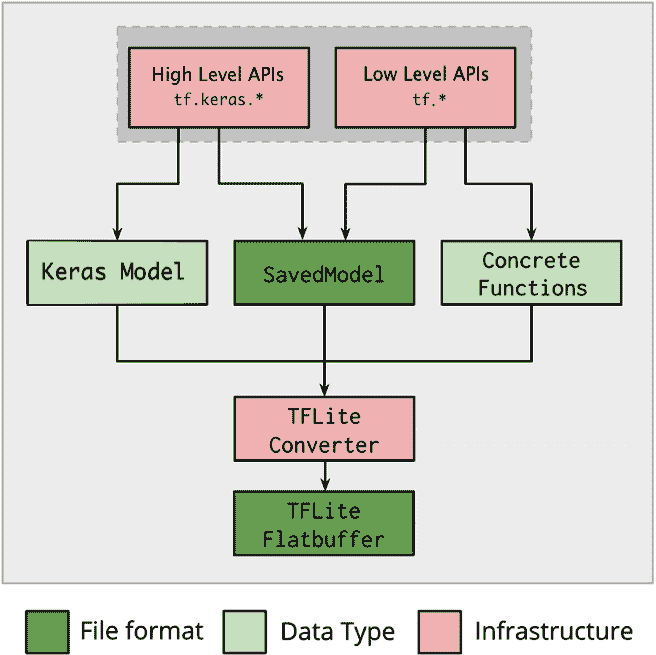

# 第九章：将模型部署到生产环境

在前几章中，我们演示了如何训练和优化模型。在本章中，我们将焦点从研究实验室中的模型开发转移到生产环境中的模型部署。我们展示了如何部署、优化、扩展和监控模型以服务我们的应用程序和业务用例。

我们将模型部署以提供在线实时预测，并展示如何进行离线批处理预测。对于实时预测，我们通过 SageMaker 端点部署模型。我们讨论最佳实践和部署策略，例如金丝雀发布和蓝/绿部署。我们展示如何使用 A/B 测试测试和比较新模型，以及如何使用多臂老虎机（MAB）测试实现强化学习。我们展示如何根据模型预测流量的变化自动扩展我们的模型托管基础设施。我们展示如何持续监控部署的模型以检测概念漂移、模型质量或偏差漂移以及特征重要性的漂移。我们还涉及通过 Lambda 提供服务器无 API 来提供模型预测的内容，以及如何优化和管理边缘模型。我们通过如何减少模型大小、降低推理成本以及使用 AWS Inferentia 硬件、SageMaker Neo 服务和 TensorFlow Lite 库等各种硬件、服务和工具来增加预测性能结束本章。

# 选择实时或批处理预测

我们需要了解应用程序和业务背景来选择实时和批处理预测。我们是在优化延迟还是吞吐量？应用程序是否需要我们的模型在一天中自动扩展以处理周期性的流量需求？我们是否计划通过 A/B 测试在生产中比较模型？

如果我们的应用程序需要低延迟，那么我们应将模型部署为实时 API，以便在单个预测请求上通过 HTTPS 提供超快速预测，例如。我们可以使用 SageMaker 端点使用 REST API 协议、HTTPS 和 JSON 部署、扩展和比较我们的模型预测服务器，如图 9-1 所示。


###### 图 9-1。将模型部署为实时 REST 端点。

对于对延迟敏感度较低但需要高吞吐量的应用程序，我们应将模型部署为批处理作业，在例如 S3 中的大量数据上执行批处理预测。我们将使用 SageMaker 批处理转换来执行批处理预测，以及像 Amazon RDS 或 DynamoDB 这样的数据存储来将预测产品化，如图 9-2 所示。


###### 图 9-2。通过 SageMaker 批处理转换将我们的模型部署为批处理作业以在 S3 中执行大量数据的批处理预测。

# 使用 SageMaker 端点进行实时预测

2002 年，亚马逊创始人杰夫·贝索斯写了一份备忘录给他的员工，后来被称为“贝索斯 API 法令”。该法令要求所有团队必须通过 API 公开其服务，并通过这些 API 进行通信。该法令解决了亚马逊在 2000 年初面临的“僵局”情况，即每个人都想构建和使用 API，但没有人愿意花时间重构他们的单块代码以支持这种理想的最佳实践。该法令解决了僵局，并要求所有团队在亚马逊内部构建和使用 API。

###### 注意

被视为亚马逊早期成功的基石，贝索斯 API 法令是亚马逊网络服务今日的基础。API 帮助亚马逊将其内部生态系统重复使用为其他组织可构建的可扩展托管服务。

遵循贝索斯 API 法令，我们将使用 SageMaker 终端节点将我们的模型部署为 REST API。默认情况下，SageMaker 终端节点是分布式容器。应用程序通过简单的 RESTful 接口调用我们的模型，如 图 9-3 所示，该图展示了模型部署在多个集群实例和可用区以提高可用性。


###### 图 9-3\. 应用调用我们托管在 REST 终端点上的高可用模型。

## 使用 SageMaker Python SDK 部署模型

使用 SageMaker Python SDK 部署模型有两种方式。我们可以在模型对象上调用 `deploy()`，或者在用于训练模型的 SageMaker 估算器对象上调用 `deploy()`。

###### 注意

我们还可以部署未使用 SageMaker 训练的模型到 SageMaker。这通常被称为“自带模型”。

接下来是部署我们使用 SageMaker 训练的基于 TensorFlow 和 BERT 的评论分类器模型的代码：

```
from sagemaker.tensorflow.model import TensorFlowModel

tensorflow_model = TensorFlowModel(
    name=tensorflow_model_name,
    source_dir='code',
    entry_point='inference.py',
    model_data=<TENSORFLOW_MODEL_S3_URI>,
    role=role,
    framework_version='<TENSORFLOW_VERSION>')

tensorflow_model.deploy(endpoint_name=<ENDPOINT_NAME>,
                        initial_instance_count=1,               
                        instance_type='ml.m5.4xlarge', 
                        wait=False)
```

接下来是前面指定的 *inference.py*。这个 Python 脚本包含将原始 JSON 转换为 TensorFlow 张量及从中转换的 `input_handler()` 和 `output_handler()` 函数。这些函数是预测请求/响应过程的关键部分。

`input_handler()` 函数使用 `DistilBertTokenizer` 将包含原始评论文本的 JSON 转换为 BERT 嵌入张量。这些嵌入被转换为张量并用作 TensorFlow 模型的输入：

```
def input_handler(data, context):
    data_str = data.read().decode('utf-8')

    jsonlines = data_str.split("\n")

    transformed_instances = []

    for jsonline in jsonlines:
        review_body = json.loads(jsonline)["features"][0]
        encode_plus_tokens = tokenizer.encode_plus(
            review_body,
            pad_to_max_length=True,
            max_length=max_seq_length,
            truncation=True)

        input_ids = encode_plus_tokens['input_ids']

        input_mask = encode_plus_tokens['attention_mask']

        transformed_instance = { 
            "input_ids": input_ids, 
            "input_mask": input_mask
        }

        transformed_instances.append(transformed_instance)

    transformed_data = {
        "signature_name":"serving_default",
        "instances": transformed_instances
    }

    transformed_data_json = json.dumps(transformed_data)

    return transformed_data_json
```

`output_handler()` 将 TensorFlow 响应从张量转换为包含预测标签（`star_rating`）和预测置信度的 JSON 响应：

```
def output_handler(response, context):
    response_json = response.json()

    outputs_list = response_json["predictions"]

    predicted_classes = []

    for outputs in outputs_list:
        predicted_class_idx = tf.argmax(outputs, axis=-1, output_type=tf.int32)
        predicted_class = classes[predicted_class_idx]

        prediction_dict = {}
        prediction_dict["predicted_label"] = predicted_class

        jsonline = json.dumps(prediction_dict)

        predicted_classes.append(jsonline)

    predicted_classes_jsonlines = "\n".join(predicted_classes)

    response_content_type = context.accept_header

    return predicted_classes_jsonlines, response_content_type

```

## 在我们的实验中跟踪模型部署

我们还希望在我们的实验中跟踪部署以获取数据血统：

```
from smexperiments.trial import Trial
trial = Trial.load(trial_name=trial_name)

from smexperiments.tracker import Tracker
tracker_deploy = Tracker.create(display_name='deploy', 
                                sagemaker_boto_client=sm)

deploy_trial_component_name = tracker_deploy.trial_component.trial_component_name

# Attach the 'deploy' Trial Component and Tracker to the Trial
trial.add_trial_component(tracker_deploy.trial_component)

# Track the Endpoint Name
tracker_deploy.log_parameters({
  'endpoint_name': endpoint_name,
})

# Must save after logging
tracker_deploy.trial_component.save()
```

## 分析已部署模型的实验血统

让我们使用实验分析 API 展示我们模型在生产中的血统，包括特征工程、模型训练、超参数优化和模型部署。我们将在第十章中将所有内容绑定在一起，形成端到端的管道，并进行全面的血统追踪，但让我们分析到目前为止的实验血统：

```
from sagemaker.analytics import ExperimentAnalytics

lineage_table = ExperimentAnalytics(
  sagemaker_session=sess,
  experiment_name=experiment_name,
  metric_names=['validation:accuracy'],
  sort_by="CreationTime",
  sort_order="Ascending",
)

lineage_table.dataframe()
```

| TrialComponentName | DisplayName | max_seq_length | learning_rate | train_accuracy | endpoint_name |
| --- | --- | --- | --- | --- | --- |
| TrialComponent-​2021-01-09-062410-pxuy | prepare | 64.0 | NaN | NaN |   |
| tensorflow-training-​2021-01-09-06-24-12-989 | train | 64.0 | 0.00001 | 0.9394 |   |
| TrialComponent-​2021-01-09-193933-bowu | optimize-1 | 64.0 | 0.000017 | 0.9416 |   |
| TrialComponent-​2021-01-09214921-dgtu | deploy | NaN | NaN | NaN | tensorflow-training-​2021-01-09-06-​24-12-989 |

## 使用 SageMaker Python SDK 调用预测

这里是用于调用我们部署的模型端点并将原始产品评论分类为`star_rating` 1–5 的简单应用程序代码：

```
import json
from sagemaker.tensorflow.model import TensorFlowPredictor
from sagemaker.serializers import JSONLinesSerializer
from sagemaker.deserializers import JSONLinesDeserializer

predictor = 
     TensorFlowPredictor(endpoint_name=tensorflow_endpoint_name,
                         sagemaker_session=sess,
                         model_name='saved_model',
                         model_version=0,
                         content_type='application/jsonlines',
                         accept_type='application/jsonlines',
                         serializer=JSONLinesSerializer(),
                         deserializer=JSONLinesDeserializer())

inputs = [
    {"features": ["This is great!"]},
    {"features": ["This is OK."]}
    {"features": ["This is bad."]}
]

predicted_classes = predictor.predict(inputs)

for predicted_class in predicted_classes:
    print(predicted_class)

### OUTPUT ###

{"predicted_label": 5}
{"predicted_label": 3}
{"predicted_label": 1}
```

现在让我们使用 pandas DataFrame 对一批原始产品评论进行预测：

```
import pandas as pd

df_reviews = pd.read_csv('./data/amazon_reviews_us_Digital_Software_v1_00.tsv.gz', 
                         delimiter='\t', 
                         quoting=csv.QUOTE_NONE,
                         compression='gzip')
df_sample_reviews = df_reviews[['review_body']].sample(n=100)

def predict(review_body):
    inputs = [
        {"features": [review_body]}
    ]
    predicted_classes = predictor.predict(inputs)
    return predicted_classes[0]['predicted_label']

df_sample_reviews['predicted_class'] = \
df_sample_reviews['review_body'].map(predict)
```

输出显示了`star_rating` 1–5 的预测类别。

| review_body | predicted_class |
| --- | --- |
| “这太棒了！” | 5 |
| “这还行。” | 3 |
| “这太糟糕了。” | 1 |

## 使用 HTTP POST 调用预测

当我们将模型作为微服务投入生产时，我们需要决定如何使我们的预测可供客户端应用程序使用。假设我们具有适当的身份验证凭据和 HTTP 标头，我们可以直接使用以下 HTTP 请求/响应语法调用 SageMaker 端点中的模型。

HTTP 请求语法：

```
POST /endpoints/<EndpointName>/invocations HTTP/1.1
Content-Type: *ContentType*
Accept: *Accept*
X-Amzn-SageMaker-Custom-Attributes: <CustomAttributes>
X-Amzn-SageMaker-Target-Model: <TargetModel>
X-Amzn-SageMaker-Target-Variant: <TargetVariant>
X-Amzn-SageMaker-Inference-Id: <InferenceId>

This is great!
```

HTTP 响应语法：

```
HTTP/1.1 200
Content-Type: *ContentType*
x-Amzn-Invoked-Production-Variant: <InvokedProductionVariant>
X-Amzn-SageMaker-Custom-Attributes: <CustomAttributes>

{'label': 5, 'score': 0.92150515}
```

在此示例中，我们使用一个*inference.py*脚本实现了`input_handler()`和`output_handler()`函数。对于更复杂的请求和响应处理，我们可以使用 SageMaker 推断流水线将每个函数部署到其自己的容器中，如我们在下一节中所见。

## 创建推断流水线

推断流水线是部署在单个端点上的一系列步骤。根据我们的例子，我们可以将请求处理程序部署为其自己的 scikit-learn 容器（`step1`），然后是其自己的 TensorFlow Serving 容器中的 TensorFlow/BERT 模型（`step2`），最后是其自己的 scikit-learn 容器中的响应处理程序（`step3`），如图 9-4 所示。


###### 图 9-4\. 推断流水线，包含三个步骤。

我们还可以在不同的 AI 和机器学习框架（包括 TensorFlow、PyTorch、scikit-learn、Apache Spark ML 等）之间部署模型集合。每个步骤都是由 SageMaker 控制的容器之间的一系列 HTTPS 请求。一个步骤的响应被用作下一个步骤的预测请求，依此类推。最后一个步骤将最终响应返回到推断管道，推断管道将响应返回给调用应用程序。推断管道完全由 SageMaker 管理，可用于实时预测和批处理转换。

要部署推断管道，我们创建一个包含请求处理程序、模型预测和响应处理程序的`PipelineModel`序列步骤。然后我们可以在`PipelineModel`上调用`deploy()`，这将部署推断管道并返回端点 API：

```
# Define model name and endpoint name
model_name = 'inference-pipeline-model'
endpoint_name = 'inference-pipeline-endpoint'

# Create a PipelineModel with a list of models to deploy in sequence
pipeline_model = PipelineModel(
    name=model_name,
    role=sagemaker_role,
    models=[
        request_handler,
        model,
        response_handler])

# Deploy the PipelineModel
pipeline_model.deploy(
    initial_instance_count=1,
    instance_type='ml.c5.xlarge',
    endpoint_name=endpoint_name)
```

`pipeline_model.deploy()`返回一个预测器，如单一模型示例所示。每当我们向该预测器发出推断请求时，请确保我们传递第一个容器期望的数据。预测器返回最后一个容器的输出。

如果我们想使用`PipelineModel`运行批处理转换作业，只需按照创建`pipeline_model.transformer()`对象和调用`transform()`的步骤即可：

```
transformer = pipeline_model.transformer(
    instance_type='ml.c5.xlarge',
    instance_count=1,
    strategy='MultiRecord',
    max_payload=6,
    max_concurrent_transforms=8,
    accept='text/csv',
    assemble_with='Line',
    output_path='<S3_OUTPUT_PATH>')

transformer.transform(
    data='<S3_PATH_TO_DATA>',
    content_type='text/csv',
    split_type='Line')
```

上述示例演示了如何从一系列 Python 脚本创建步骤。使用 SageMaker 推断管道，我们还可以为每个步骤提供自己的 Docker 容器。

## 从 SQL 和基于图的查询中调用 SageMaker 模型

AWS 在 Amazon AI、机器学习和分析服务之间提供深度集成。Amazon Redshift、Athena 和 Aurora 可以执行部署为 SageMaker 端点的模型的预测 SQL 查询。Neptune 也可以执行基于图形的查询，并与 SageMaker 端点集成。

# 使用 Amazon CloudWatch 自动缩放 SageMaker 端点

虽然我们可以使用`EndpointConfig`中的`InstanceCount`参数手动缩放，但我们可以根据请求每秒等给定的度量配置我们的端点，使其自动扩展（增加实例）或缩小（减少实例）。随着更多请求的到来，SageMaker 将自动扩展我们的模型集群以满足需求。

在云计算中，除了典型的“缩小”和“放大”外，我们还谈论“扩展内部”和“扩展外部”。扩展内部和扩展外部分别指移除和添加相同类型的实例。缩小和放大则指使用较小或较大的实例类型。通常，较大的实例具有更多的 CPU、GPU、内存和网络带宽。

在定义集群时最好使用同类实例类型。如果混合使用不同的实例类型，可能会难以调整集群并定义适用于异构集群中每个实例的一致缩放策略。在尝试新实例类型时，建议创建一个仅包含该实例类型的新集群，并将每个集群作为单个单位进行比较。

## 使用 AWS 提供的指标定义缩放策略

在本例中，我们使用 `SageMakerVariantInvocationsPerInstance`，AWS 提供的 CloudWatch 指标，当我们达到特定的每实例调用阈值时自动扩展我们的模型端点。在接下来的部分中，我们将使用自定义自动缩放指标：

```
autoscale = boto3.Session().client(
                            service_name='application-autoscaling', 
                            region_name=region)

autoscale.register_scalable_target(
    ServiceNamespace='sagemaker',
    ResourceId="endpoint/" + tensorflow_endpoint_name + "/variant/AllTraffic",
    ScalableDimension='sagemaker:variant:DesiredInstanceCount',
    MinCapacity=1,
    MaxCapacity=2,
    RoleARN=role,
    SuspendedState={
        'DynamicScalingInSuspended': False,
        'DynamicScalingOutSuspended': False,
        'ScheduledScalingSuspended': False
    }
)

autoscale.put_scaling_policy(
    PolicyName='bert-reviews-autoscale-policy',
    ServiceNamespace='sagemaker',
    ResourceId="endpoint/" + tensorflow_endpoint_name + "/variant/AllTraffic",
    ScalableDimension='sagemaker:variant:DesiredInstanceCount',
    PolicyType='TargetTrackingScaling',
    TargetTrackingScalingPolicyConfiguration={
        'TargetValue': 1000.0,
        'PredefinedMetricSpecification': {
            'PredefinedMetricType': 'SageMakerVariantInvocationsPerInstance',
        },
        'ScaleOutCooldown': 60,
        'ScaleInCooldown': 300,
    }
)
```

在我们向端点发送大量流量后，我们可以在 CloudWatch 中看到 `InvocationsPerInstance` 指标的峰值，如图 9-5 所示，以及 CPU 和内存利用率的峰值，如图 9-6 所示。


###### 图 9-5\. `InvocationsPerInstance` 指标的峰值。


###### 图 9-6\. `CPUUtilization`、`DiskUtilization` 和 `MemoryUtilization` 由于预测流量的增加而出现的峰值。

这将触发警报，从一个实例扩展到两个实例来处理预测流量的激增，通过在两个实例之间共享流量来实现。图 9-7 显示了向端点集群添加额外实例的正面影响。随着 `InvocationsPerInstance` 的减少，CPU 和内存利用率也相应减少。



###### 图 9-7\. 当我们向端点集群添加第二个实例时，`InvocationsPerInstance` 的数量减少。

## 使用自定义指标定义缩放策略

Netflix 以“每秒启动次数”或 SPS（Starts per Second）的自定义自动缩放指标而闻名。每当用户点击“播放”观看电影或电视节目时，就记录一个启动。这是自动缩放的关键指标，因为“每秒启动次数”越多，我们的流媒体控制平面将接收到的流量也就越多。

假设我们正在发布 `StartsPerSecond` 指标，我们可以使用这个自定义指标来扩展我们的集群，因为更多的电影开始播放。这个指标被称为“目标跟踪”指标，我们需要定义指标名称、目标值、模型名称、变体名称和汇总统计。以下缩放策略将在我们模型服务集群中的所有实例的平均 `StartsPerSecond` 指标超过 50% 时开始扩展集群：

```
{
  "TargetValue": 50,
  "CustomizedMetricSpecification":
  {
    "MetricName": "StartsPerSecond",
    "Namespace": "/aws/sagemaker/Endpoints",
    "Dimensions": [
      {"Name": "EndpointName", "Value": "ModelA" },
      {"Name": "VariantName","Value": "VariantA"}
    ],
    "Statistic": "Average",
    "Unit": "Percent"
  }
}
```

当使用自定义指标进行缩放策略时，我们应选择一个衡量实例利用率的指标，随着添加实例而减少，并随着移除实例而增加。

## 使用冷却期调整响应性

当我们的端点在自动扩展时，我们可能希望指定一个“冷却”期（以秒为单位）。冷却期本质上通过定义扩展策略迭代之间的秒数来减少响应性。当流量激增时，我们可能希望快速扩展，但在快速扩展事件期间，应缓慢缩减以确保处理任何临时的流量下降。下面的扩展策略将在缩减和扩展时采用不同的时间，如`ScaleInCooldown`和`ScaleOutCooldown`属性所示：

```
{
  "TargetValue": 60.0,
  "PredefinedMetricSpecification":
  {
    "PredefinedMetricType": 
        "SageMakerVariantInvocationsPerInstance"
  },
  "ScaleInCooldown": 600,
  "ScaleOutCooldown": 300
}
```

## 自动扩展策略

在设置我们的 SageMaker 端点的自动扩展时，有三种主要的扩展策略可供选择：

目标跟踪

指定一个单一的度量，并根据需要由 AWS 自动扩展；例如，“保持`InvocationsPerInstance = 1000`”。这种策略需要的配置最少。

简单

在给定阈值上触发度量，并使用固定的扩展量；例如，“当`InvocationsPerInstance > 1000`时，添加 1 个实例”。这种策略需要一些配置，但提供了更多对目标跟踪策略的控制。

步进扩展

在各种阈值上触发度量，并配置每个阈值的扩展量；例如，“当`InvocationsPerInstance > 1000`时，添加 1 个实例；`InvocationsPerInstance > 2000`时，添加 5 个实例”等。这种策略需要最多的配置，但在如突发流量等情况下提供了最多的控制。

# 部署新模型和更新模型的策略

我们可以在单个 SageMaker 端点后面测试和部署新的和更新的模型，使用名为“生产变体”的概念。这些变体可以通过硬件（CPU/GPU）、数据（喜剧/戏剧电影）或区域（美国西部或德国北部）的不同而不同。我们可以安全地在端点中的模型变体之间转移流量，用于金丝雀发布、蓝/绿部署、A/B 测试和 MAB 测试。使用这些部署策略，我们可以在推送新的和更新的模型到生产环境时最小化风险。

## 分流金丝雀发布

由于我们的数据不断变化，我们的模型需要演变以捕捉这种变化。当我们更新模型时，我们可以选择使用“金丝雀发布”来逐步进行，这个名字来自于使用金丝雀来检测煤矿中是否适合人类呼吸的过程。如果金丝雀在煤矿中存活下来，那么条件是良好的，我们可以继续进行。如果金丝雀没有存活下来，那么我们应该进行调整，并稍后使用不同的金丝雀再次尝试。类似地，我们可以将少量流量指向我们的“金丝雀”模型，并测试模型的服务情况。也许在研究实验室中没有发现的内存泄漏或其他生产特定问题。

云实例提供计算、内存和存储，模型容器应用程序的组合称为“生产变体”。生产变体定义了实例类型、实例数量和模型。默认情况下，SageMaker 端点配置为单个生产变体，但我们可以根据需要添加多个变体。

下面是设置单个变体 `VariantA` 的代码，在一个端点上接收来自 20 个实例的 100% 流量：

```
endpoint_config = sm.create_endpoint_config(
    EndpointConfigName='my_endpoint_config_name',
    ProductionVariants=[
        {
         'VariantName': 'VariantA',
         'ModelName': 'ModelA',
         'InstanceType':'ml.m5.large',
         'InitialInstanceCount': 20,
         'InitialVariantWeight': 100,
        }
    ])
```

创建新的金丝雀生产变体后，我们可以创建新的端点，并将少量流量（5%）指向金丝雀，其余流量（95%）指向我们的现有变体，如图 9-8 所示。


###### 图 9-8\. 将 5% 的流量分配到新模型，用于金丝雀发布。

接下来是创建新端点的代码，包括接受 5% 流量的新金丝雀 `VariantB`。请注意，我们为新金丝雀 `VariantB` 指定了 `'InitialInstanceCount': 1`。假设 20 个实例处理当前流量的 100%，那么每个实例可能处理大约 5% 的流量。这个 5% 与我们希望发送到新金丝雀实例的流量量相匹配。例如，如果我们希望将 10% 的流量发送到新金丝雀，我们将选择 `'InitialInstanceCount': 2` 来支持 10% 的金丝雀流量。这假设我们对新金丝雀使用相同的实例类型。如果选择不同的实例类型，可能需要更多或更少的实例来处理 % 流量负载：

```
updated_endpoint_config=[
    {
     'VariantName': 'VariantA',
     'ModelName': 'ModelA',
     'InstanceType':'ml.m5.large',
     'InitialInstanceCount': 20,
     'InitialVariantWeight': 95,
    },
    {
     'VariantName': 'VariantB',
     'ModelName': 'ModelB',
     'InstanceType':'ml.m5.large',
     'InitialInstanceCount': 1,
     'InitialVariantWeight': 5,
    }
])

sm.update_endpoint(
    EndpointName='my_endpoint_name',
    EndpointConfigName='my_endpoint_config_name'
)
```

金丝雀发布可以安全地向小部分用户发布新模型，进行实际生产环境的初步测试。如果我们希望在生产环境中进行测试而不影响整个用户群体，金丝雀发布将非常有用。由于大部分流量流向现有模型，金丝雀模型的集群规模可以相对较小。在上述示例中，我们仅使用单个实例作为金丝雀变体。

## 蓝/绿部署的流量转移

如果新模型表现良好，我们可以进行蓝/绿部署，将所有流量转移到新模型，如图 9-9 所示。蓝/绿部署有助于在需要回滚到旧部署时减少停机时间。通过蓝/绿部署，我们使用新的金丝雀模型在现有模型服务器集群的完整克隆上进行运行。然后将所有流量从旧集群（蓝）转移到新集群（绿），如图 9-9 所示。蓝/绿部署可以防止部分部署场景，即一些实例运行新金丝雀模型，而另一些实例运行现有模型。在大规模情况下，这种部分部署场景很难调试和管理。


###### 图 9-9\. 将流量转移到模型变体 B，用于蓝/绿部署。

以下是更新端点并将 100%流量转移至成功的金丝雀模型`VariantB`的代码。请注意，我们还增加了新集群的大小，以匹配现有集群的大小，因为新集群现在处理所有流量：

```
updated_endpoint_config=[
    {
     'VariantName': 'VariantA',
     'ModelName': 'ModelA',
     'InstanceType':'ml.m5.large',
     'InitialInstanceCount': 20,
     'InitialVariantWeight': 0,
    },
    {
     'VariantName': 'VariantB',
     'ModelName': 'ModelB',
     'InstanceType':'ml.m5.large',
     'InitialInstanceCount': 20,
     'InitialVariantWeight': 100,
    }
])

sm.update_endpoint_weights_and_capacities(
    EndpointName='my_endpoint_name',
    DesiredWeightsAndCapacities=updated_endpoint_config
)
```

我们将保留旧的`VariantA`集群闲置 24 小时，以防我们的金丝雀测试失败，需要快速回滚到旧集群。24 小时后，我们可以移除旧环境并完成蓝/绿部署。以下是移除旧模型`VariantA`的代码，方法是从端点配置中移除`VariantA`并更新端点：

```
updated_endpoint_config=[
    {
     'VariantName': 'VariantB',
     'ModelName': 'ModelB',
     'InstanceType':'ml.m5.large',
     'InitialInstanceCount': 20,
     'InitialVariantWeight': 100,
    }
])

sm.update_endpoint(
    EndpointName='my_endpoint_name',
    EndpointConfigName='my_endpoint_config_name'
)
```

虽然在我们的示例中，将旧集群闲置一段时间（24 小时）可能看起来是浪费的，但请考虑在需要回滚并扩展先前的`VariantA`模型所需时间中的停机成本。有时新模型集群在开始几小时运行正常，然后在夜间 cron 作业、清晨产品目录刷新或其他未经测试的场景后突然退化或崩溃。在这些情况下，我们能够立即将流量切换回旧集群，并正常运营。

# 测试和比较新模型

我们可以在单个 SageMaker 端点后面测试新模型，使用在模型部署的前一节中描述的相同的“生产变体”概念。在本节中，我们将配置我们的 SageMaker 端点，以在端点内的模型之间转移流量，通过 A/B 和 MAB 测试来比较生产中的模型性能。

在生产环境中测试我们的模型时，我们需要定义和跟踪希望优化的业务指标。业务指标通常与收入或用户参与度相关，例如购买订单、观看电影或点击广告次数。我们可以将这些指标存储在任何数据库中，比如 DynamoDB，如图 9-10 所示。分析师和科学家将使用这些数据来确定我们测试中的优胜模型。


###### 图 9-10\. 跟踪业务指标以确定最佳模型变体。

在我们的文本分类器示例中，我们将创建一个测试来最大化成功标记的客户服务消息的数量。当客户服务收到新消息时，我们的应用程序将预测消息的 `star_rating`（1-5）并将 1 和 2 分的消息路由到高优先级的客户服务队列。如果代表同意预测的 `star_rating`，他们将将我们的预测标记为成功（积极反馈）；否则，他们将把预测标记为失败（消极反馈）。不成功的预测可以通过使用 Amazon A2I 和 SageMaker Ground Truth 进行人为介入的工作流程路由，我们将在 第十章 中详细讨论这一点。然后，我们将选择成功预测数量最多的模型变体，并开始将流量转移到这个获胜的变体。让我们深入探讨如何管理实验和转移流量。

## 执行 A/B 测试以比较模型变体

类似于金丝雀发布，我们可以使用流量分割将用户子集引导到不同的模型变体，以比较和测试生产中的不同模型。目标是看看哪些变体表现更好。通常，这些测试需要长时间运行（几周）才能具有统计学意义。图 9-11 展示了使用随机的 50/50 流量分割部署的两个不同推荐模型。


###### 图 9-11. 通过 50/50 流量分割进行的两个模型变体的 A/B 测试。

虽然 A/B 测试看起来与金丝雀发布类似，但它们专注于收集有关模型不同变体的数据。A/B 测试针对较大的用户群体，需要更多的流量，并且运行时间更长。金丝雀发布更专注于风险缓解和平稳升级。

###### 注意

对于基于 IP 地址、HTTP 头、查询字符串或有效负载内容进行细粒度流量路由，可以在 SageMaker 端点前使用应用程序负载均衡器。

一个模型 A/B 测试的例子可以是流媒体音乐推荐。假设我们正在推荐一个星期天早晨的播放列表。我们可能想要测试我们是否能够识别更倾向于听力量感强烈的醒目音乐的特定用户群体（模型 A），或者更喜欢柔和的休闲音乐的用户群体（模型 B）。让我们使用 Python 实现这个 A/B 测试。我们首先创建一个 SageMaker Endpoint 配置，定义模型 A 和模型 B 的单独生产变体。我们使用相同的实例类型和实例计数初始化这两个生产变体：

```
import time
timestamp = '{}'.format(int(time.time()))

endpoint_config_name = '{}-{}'.format(training_job_name, timestamp)

variantA = production_variant(model_name='ModelA',
                              instance_type="ml.m5.large",
                              initial_instance_count=1,
                              variant_name='VariantA',
                              initial_weight=50)

variantB = production_variant(model_name='ModelB',
                              instance_type="ml.m5.large",
                              initial_instance_count=1,
                              variant_name='VariantB',
                              initial_weight=50)

endpoint_config = sm.create_endpoint_config(
    EndpointConfigName=endpoint_config_name,
    ProductionVariants=[variantA, variantB]
)

endpoint_name = '{}-{}'.format(training_job_name, timestamp)

endpoint_response = sm.create_endpoint(
  EndpointName=endpoint_name,
  EndpointConfigName=endpoint_config_name)
```

在我们监控了一段时间两个模型的性能后，我们可以将 100% 的流量转移到表现更好的模型，我们这里是模型 B。让我们将我们的流量从 50/50 分割转移到 0/100 分割，如 图 9-12 所示。


###### 图 9-12\. A/B 测试流量从 50/50 到 0/100 的转移。

以下是代码，用于将所有流量转移到`VariantB`，并在我们确信`VariantB`正常运行时最终移除`VariantA`：

```
updated_endpoint_config = [
  {
    'VariantName': 'VariantA',
    'DesiredWeight': 0,
  },
  {
    'VariantName': 'VariantB',
    'DesiredWeight': 100,
  }
]

sm.update_endpoint_weights_and_capacities(
  EndpointName='my_endpoint_name',
  DesiredWeightsAndCapacities=updated_endpoint_config
)

updated_endpoint_config=[
    {
     'VariantName': 'VariantB',
     'ModelName': 'ModelB',
     'InstanceType':'ml.m5.large',
     'InitialInstanceCount': 2,
     'InitialVariantWeight': 100,
    }
])

sm.update_endpoint(
    EndpointName='my_endpoint_name',
    EndpointConfigName='my_endpoint_config_name'
)
```

## 使用多臂老虎机测试的强化学习

A/B 测试是静态的，必须运行一段时间——有时是几周或几个月——才能被认为具有统计显著性。在此期间，我们可能部署了一个影响收入的糟糕模型变体。然而，如果我们提前停止测试，我们将破坏实验的统计显著性，并不能从结果中得出多少意义。换句话说，我们的模型可能最初表现不佳，但如果实验运行时间更长，实际上可能是更好的模型。A/B 测试是静态的，并不允许我们在实验期间动态地转移流量，以减少由表现不佳的模型引起的“后悔”。它们也不允许我们在实验的生命周期内添加或删除模型变体。

一种更动态的测试不同模型变体的方法称为多臂老虎机（MABs）。这种方法得名于一个可以迅速夺走我们钱的老虎机，这些淘气的"土匪"事实上可以通过动态地将流量转移到获胜的模型变体来为我们赚取相当可观的收益，远比 A/B 测试更快。这就是 MAB 的“利用”部分。与此同时，MAB 仍然“探索”那些未获胜的模型变体，以防早期的获胜者并不是整体最佳模型变体。这种“利用和探索”的动态平衡赋予了 MAB 他们的力量。基于强化学习（RL），MAB 依赖于正负反馈机制来选择“动作”。

在我们的情况下，MAB 根据当前奖励指标和选择的利用-探索策略选择模型变体。基于 RL 的 MAB 充当主要的 SageMaker 端点，并动态路由预测流量到可用的基于 BERT 的 SageMaker 端点，如图 9-13 所示。


###### 图 9-13\. 使用 RL 和 MABs 找到最佳的 BERT 模型。

存在多种 MAB 探索策略，包括ε-greedy、Thompson 采样、bagging 和在线覆盖。ε-greedy 使用固定的利用-探索阈值，而 Thompson 采样基于先验信息使用更复杂和动态的阈值，这是一种基于贝叶斯统计的技术。Bagging 使用集成方法，通过训练数据的随机子集生成一组策略以进行集成。在线覆盖理论上是基于论文《驯服怪物：一种快速简单的情境赌博算法》的最优探索算法。与 Bagging 不同的是，在线覆盖训练一组策略以生成更复杂和完整的预测，以实现更复杂和全面的探索策略。

SageMaker 原生支持流行的 RL 库，包括 Vowpal Wabbit、Ray、Coach、Unity 等。此外，我们可以通过为 SageMaker 构建自己的 Docker 镜像来使用任何其他强化学习库进行部署和管理。在我们的示例中，我们将使用 Vowpal Wabbit 和在线覆盖探索策略。我们基于 Vowpal Wabbit 的 MAB 持续根据最新的奖励指标进行训练，并将调整预测流量，向获胜的基于 BERT 的模型发送更多流量，如图 9-14 所示，其中模型 2 开始随着累积奖励接收更多流量。



###### 图 9-14\. MAB 动态转移流量至“获胜”模型变体。

图 9-15 展示了在 AWS 上使用 Vowpal Wabbit RL 框架、SageMaker、Amazon Kinesis Firehose、S3 持久存储以及 Athena 应用查询的完整端到端 MAB 生产实现。


###### 图 9-15\. AWS 上 MAB 和 RL 的完整端到端实现。

我们正在使用 Vowpal Wabbit RL 框架持续训练我们的多臂赌博机（MAB），随着新的奖励数据从我们的应用程序流入系统。新版本的 MAB 模型持续部署为 SageMaker 端点。由于 MAB 的动态特性，我们可以动态地添加和移除测试中的模型变体。这是我们在传统的 A/B 测试中做不到的，因为在实验的整个生命周期内，我们需要保持所有模型变体不变。

以下是我们的 MAB 模型配置的一部分，使用了与 SageMaker、DynamoDB 和 Kinesis 原生集成的 Vowpal Wabbit，同时也突出了在线覆盖探索策略使用的超参数，包括要训练的子策略数量以及要使用的反事实分析（CFA）策略：

```
resource:
  shared_resource:
    experiment_db:
      table_name: "BanditsExperimentTable" # Status of an experiment
    model_db:
      table_name: "BanditsModelTable" # Status of trained models
    join_db:
      table_name: "BanditsJoinTable" # Status of reward ingestion
image: "sagemaker-rl-vw-container:vw-<VW_VERSION>"
<VOWPAL_WABBIT_VERSION>-<CPU_OR_GPU>" # Vowpal Wabbit container
algor: # Vowpal Wabbit algorithm parameters
  algorithms_parameters:
    exploration_policy: "cover"
    num_policies: 3 # number of online cover policies to create
    num_arms: 2
    cfa_type: "dr" # supports "dr", "ips"
```

我们选择在决定采取哪个操作（调用哪个 BERT 模型）时训练三个子策略，以及双重稳健（DR）CFA 方法。有关这些超参数的更多信息，请参阅[Vowpal Wabbit 文档](https://oreil.ly/lDikQ)和与本书相关的 GitHub 存储库。

以下是来自 SageMaker 培训作业日志的片段，因为强盗模型不断根据系统中到达的新奖励数据进行训练。在这种情况下，捡起了六百个新奖励：

```
/usr/bin/python train-vw.py --cfa_type dr --epsilon 0.1 --exploration_policy 
cover --num_arms 2 --num_policies 3
INFO:root:channels ['pretrained_model', 'training']
INFO:root:hps: {'cfa_type': 'dr', 'epsilon': 0.1, 'exploration_policy': 
'cover', 'num_arms': 2, 'num_policies': 3}
INFO:root:Loading model from /opt/ml/input/data/pretrained_model/vw.model
INFO:VW CLI:creating an instance of VWModel
INFO:VW CLI:successfully created VWModel
INFO:VW CLI:command: ['vw', '--cb_explore', '2', '--cover', '3', '-i',
'/opt/ml/input/data/pretrained_model/vw.model', '-f', '/opt/ml/model/vw.model',
'--save_resume', '-p', '/dev/stdout']
INFO:VW CLI:Started VW process!
INFO:root:Processing training data: [PosixPath('/opt/ml/input/data/training/local-
joined-data-1605218616.csv')]
finished run
number of examples = 600
INFO:root:Model learned using 600 training experiences.
INFO     Reporting training SUCCESS
```

假设我们想比较两个 BERT 模型：BERT 模型 1 和 BERT 模型 2。我们将重复使用我们在第七章中训练的 BERT 模型 1。该模型的训练准确率接近 93%，验证准确率约为 50%。考虑到随机预测五个类别的机会为 20%，50%并不算糟糕。对于 BERT 模型 2，我们训练了一个准确率略低于 40%的模型。

我们部署了两个 BERT 模型和一个新的 MAB。在生产中运行这些模型后，我们分析了 MAB 用于选择 Model 1 或 Model 2 的最新概率。动作概率是根据当前奖励信息和背景选择 Model 1 或 Model 2 作为最佳选择的概率测量值。BERT 模型 1 的平均动作概率为 0.743，BERT 模型 2 为 0.696。在这种情况下，BERT 模型 1 因较高的动作概率而受青睐。图 9-16 显示了 MAB 用于所有预测的动作概率图表。


###### 图 9-16\. MAB 动作概率。

样本概率是衡量强盗将根据探索策略、当前奖励信息和背景选择 Model 1 或 Model 2 的概率。结合动作概率和样本概率，确定强盗用于分类评论测试的 BERT 模型。我们的强盗使用 BERT 模型 1 的平均样本概率为 0.499，BERT 模型 2 为 0.477。在这种情况下，BERT 模型 1 因较高的样本概率而受青睐。

图 9-17 显示了 MAB 在所有预测中用于选择 BERT 模型 1 和 BERT 模型 2 之间的样本概率。


###### 图 9-17\. MAB 样本概率。

我们还注意到两个变体之间流量的变化，如图 9-18 所示。模型 2 开始时拥有所有流量，但随着 MAB 开始因较高的奖励而更喜欢模型 1，其接收的流量逐渐减少，这导致更高的样本概率。


###### 图 9-18\. 流量分割在 BERT 模型 1 和 BERT 模型 2 之间。

我们看到 BERT 模型 1，即现有模型，在挑战者模型 BERT 模型 2 面前具有优势。在这种情况下，我们选择保留模型 1 并不替换为 BERT 模型 2。

让我们分析奖励与遗憾，确保我们的模型在探索过程中适当地进行利用和探索，并在此过程中不放弃太多。如果模型预测`star_rating`正确，则分配奖励为 1；如果预测错误，则分配奖励为 0。因此，奖励与模型准确度相关联。平均奖励为 0.472，这不巧是我们在第七章中训练的 BERT 模型 1 和 BERT 模型 2 的验证精度的混合值。图 9-19 展示了所有预测中滚动一百次的平均奖励的图表。


###### 图 9-19. 实验中滚动一百次的平均奖励。

所有这些图表表明，贝叶斯测试初始通过将流量发送到 BERT 模型 1 和 BERT 模型 2 来探索动作空间，找到早期的优胜者，并利用 BERT 模型 2 进行约 230 次预测。然后它再次开始探索，直到约 330 次预测时，它再次开始利用 BERT 模型 2，直至第 500 次预测，那时它可能会再次开始探索。

探索和利用之间的这种权衡由选择的探索策略控制，是 A/B 测试和多臂老虎机测试之间的关键区别。通过激进的探索策略，我们将看到贝叶斯在空间中进行探索，并降低平均奖励。在这里，我们使用自调整的在线覆盖探索策略。

贝叶斯帮助我们最小化在生产中部署性能不佳的模型所带来的遗憾，并让我们在真实数据上快速了解我们的 BERT 模型性能。如果我们的某个 BERT 模型表现不佳，我们可以从实验中移除该模型，甚至添加新的模型变体，使用我们选择的探索策略来开始探索。

我们可以使用框架文档中描述的超参数来调整我们的 Vowpal Wabbit 贝叶斯模型。有关在线覆盖探索策略的 Vowpal Wabbit 超参数的更多信息，请参阅[Vowpal Wabbit 文档](https://oreil.ly/lDikQ)。

我们还可以提供历史数据，以在最初部署到生产环境之前对 RL 模型进行预训练。这将用我们的模型种子化动作和样本概率，这可能会减少 RL 模型在从头学习动作和样本空间时由初始探索阶段引起的遗憾。

请记住，这只是在几分钟内的预测示例。我们可能希望延长实验时间，以获得更多关于哪种模型更适合我们的应用程序和用例的见解。

# 监控模型性能并检测漂移

世界在我们周围继续变化。客户行为相对快速变化。应用团队发布新功能。Netflix 目录正在充实新内容。欺诈者正找到聪明的方法来盗取我们的信用卡信息。一个不断变化的世界需要持续对我们的预测模型进行再培训和重新部署，以调整这些真实世界漂移情况。

在第 5 章中，我们讨论了可能导致模型性能下降的各种漂移类型。通过自动记录 SageMaker 端点的输入（特征）和输出（预测），SageMaker Model Monitor 自动检测并测量与提供的基线的漂移。当漂移达到用户指定的基线（在我们训练模型期间学习并在模型部署期间指定）的阈值时，SageMaker Model Monitor 将通知我们。

SageMaker Model Monitor 使用统计方法（如 Kullback–Leibler 散度和 L-infinity 范数）计算漂移。例如，对于 L-infinity 范数，SageMaker Model Monitor 支持`linf_simple`和`linf_robust`。`linf_simple`方法基于两个分布的累积分布函数之间的最大绝对差异。`linf_robust`方法基于`linf_simple`，但在样本不足时使用。`linf_robust`公式基于两样本 Kolmogorov–Smirnov 测试。

## 启用数据捕获

SageMaker Model Monitor 分析我们模型的预测（及其输入），以检测数据质量、模型质量、模型偏差或特征归因的漂移。首先，我们需要为给定的端点启用数据捕获，如图 9-20 所示。


###### 图 9-20\. 启用给定端点的数据捕获。

以下是启用数据捕获的代码。我们可以在`DataCaptureConfig`对象中定义所有配置选项。使用此配置可以选择捕获请求有效负载、响应有效负载或两者。捕获配置适用于端点的所有模型生产变体：

```
from sagemaker.model_monitor import DataCaptureConfig

data_capture_config = DataCaptureConfig(
            enable_capture=True,
            sampling_percentage=100,
            destination_s3_uri='<S3_PATH>')

Next, we pass the DataCaptureConfig in the model.deploy()call:

predictor = model.deploy(
    initial_instance_count=1,
    instance_type='ml.m5.xlarge',
    endpoint_name=endpoint_name,
    data_capture_config=data_capture_config)
```

现在我们正在捕获指定的 S3 目的地中的所有推断请求和预测结果。

## 理解基线和漂移

在第 5 章中，我们探索了数据集并可视化了每个`product_category`和`star_rating`的评论分布。我们将使用这些数据创建基准分布度量标准，以与我们的 SageMaker 模型端点观察到的实时分布进行比较。图 9-21 显示了每个产品类别的评论数量。


###### 图 9-21\. 我们数据中每个产品类别的评论数量是输入特征分布的基准示例。

这代表用于训练我们的模型的`product_category`输入特征的基线分布。SageMaker Model Monitor 捕获我们 SageMaker 模型端点看到的实际模型输入分布，将其与训练期间使用的基线分布进行比较，并生成衡量模型输入分布中协变量漂移的漂移度量。

如果我们指定的测量漂移超过阈值，SageMaker Model Monitor 会通知我们，并可能重新训练和部署在最新输入数据分布上训练的模型的更新版本。图 9-22 显示每个`product_category`和`star_rating`的数据的基线分布，来自第五章。


###### 图 9-22. 我们训练数据中`star_rating`标签的分布是目标分布的一个示例基线。

我们可以使用 SageMaker Model Monitor 的数据质量监控功能检测模型输入分布中的协变量漂移。我们还可以使用 SageMaker Model Monitor 的模型质量监控功能检测概念漂移，该功能将实时预测与由 SageMaker Model Monitor 在实时预测中捕获的相同模型输入的地面实况标签进行比较。这些地面实况标签由人类在离线人类环路工作流中提供，例如使用 Amazon A2I 和 SageMaker Ground Truth，在第三章中有描述。

此外，SageMaker Model Monitor 的模型质量功能可以监控、衡量和检测模型偏差、特征重要性和模型可解释性的漂移。每个漂移相对于我们训练模型生成的基线进行测量。这些基线由启用 SageMaker Model Monitor 的每个 SageMaker 终端节点提供。

# 监控部署的 SageMaker 终端节点的数据质量

我们的模型学习并适应我们训练数据的统计特征。如果我们在线模型接收到的数据的统计特征从该基线漂移，模型质量将会下降。我们可以使用 Deequ 创建数据质量基线，如在第五章中讨论的那样。Deequ 分析输入数据，并为每个输入特征创建模式约束和统计信息。我们可以识别缺失值并相对于该基线检测协变量漂移。SageMaker Model Monitor 使用 Deequ 为数据质量监控创建基线。

## 创建基线以衡量数据质量

数据质量基线帮助我们检测在线模型输入的统计特征中的漂移，这些输入来自所提供的基线数据。通常，我们使用我们的训练数据创建第一个基线，如图 9-23 所示。


###### 图 9-23. 从训练数据创建数据质量基线。

训练数据集模式和推理数据集模式必须完全匹配，包括特征数量和它们传递的顺序。现在我们可以启动 SageMaker 处理作业，建议一组基线约束，并生成数据统计，如下所示：

```
from sagemaker.model_monitor import DefaultModelMonitor
from sagemaker.model_monitor.dataset_format import DatasetFormat

my_default_monitor = DefaultModelMonitor(
  role=role,
  instance_count=1,
  instance_type='ml.m5.xlarge',
  volume_size_in_gb=20,
  max_runtime_in_seconds=3600,
)

my_default_monitor.suggest_baseline(
baseline_dataset='s3://*my_bucket*/*path*/some.csv',
    dataset_format=DatasetFormat.csv(header=True),
    output_s3_uri='s3://*my_bucket*/*output_path*/',
    wait=True
)
```

基线作业完成后，我们可以查看生成的统计数据：

```
import pandas as pd

baseline_job = my_default_monitor.latest_baselining_job

statistics = pd.io.json.json_normalize(
baseline_job.baseline_statistics().body_dict["features"])
```

这是我们`review_body`预测输入的一组统计数据示例：

```
"name" : "Review Body",
  "inferred_type" : "String",
  "numerical_statistics" : {
   "common" : {
    "num_present" : 1420,
    "num_missing" : 0
   }, "data" : [ [ "I love this item.", "This item is OK", … ] ]
```

我们可以按以下方式查看生成的约束：

```
constraints = pd.io.json.json_normalize(
baseline_job.suggested_constraints().body_dict["features"])
```

这里是我们`review_body`预测输入的约束定义示例：

```
{
  "name" : "Review Body",
  "inferred_type" : "String",
  "completeness" : 1.0
}
```

在这个例子中，如果`review_body`中有缺失值，约束将引发警报。通过基线，我们现在可以创建和调度数据质量监控作业。

## 调度数据质量监控作业

SageMaker 模型监控使我们能够定期监控从端点收集的数据。我们可以使用`CreateMonitoringSchedule` API 创建一个周期性间隔的调度。类似于数据质量基线作业，SageMaker 模型监控启动一个 SageMaker 处理作业，用于比较当前分析的数据集与基线统计数据和约束条件。结果将生成违规报告。此外，SageMaker 模型监控将每个特征的指标发送到 CloudWatch，如图 9-24 所示。


###### 图 9-24\. SageMaker 模型监控使我们能够定期监控从端点收集的数据。

我们可以使用`my_default_monitor.create_monitoring_schedule()`为端点创建模型监控调度。在监控调度的配置中，我们指向基线统计数据和约束，并定义一个 cron 调度：

```
from sagemaker.model_monitor import DefaultModelMonitor
from sagemaker.model_monitor import CronExpressionGenerator

mon_schedule_name = 'my-model-monitor-schedule'

my_default_monitor.create_monitoring_schedule(
  monitor_schedule_name=mon_schedule_name,
  endpoint_input=predictor.endpoint,
  output_s3_uri=s3_report_path,
  statistics=my_default_monitor.baseline_statistics(),
  constraints=my_default_monitor.suggested_constraints(),
  schedule_cron_expression=CronExpressionGenerator.hourly(),
  enable_cloudwatch_metrics=True,
)
```

SageMaker 模型监控现在按计划间隔运行，并分析捕获的数据与基线的比较。作业生成违规报告，并将报告存储在 Amazon S3 中，同时存储收集数据的统计报告。

一旦监控作业开始执行，我们可以使用`list_executions()`查看所有执行情况：

```
executions = my_monitor.list_executions()
```

SageMaker 模型监控作业应以以下状态之一退出：

完成

监控执行完成且未发现违规。

带违规完成

监控执行完成，但发现了约束违规。

失败

监控执行失败，可能是由于角色权限不正确或基础设施问题。

停止

作业超出了指定的最大运行时间或被手动停止。

###### 注意

我们可以使用预处理和后处理脚本创建自定义的监控调度和流程。我们也可以构建自己的分析容器。

## 检查数据质量结果

通过收集的监控数据并持续与数据质量基线进行比较，我们现在能够更好地决定如何改进模型。根据模型监控结果，我们可能决定重新训练和部署模型。在这一最后步骤中，我们展示并解释数据质量监控结果，如图 9-25 所示。


###### 图 9-25\. 可视化和解释数据质量监控结果。

让我们查询生成报告的位置：

```
report_uri=latest_execution.output.destination
print('Report Uri: {}'.format(report_uri))
```

接下来，我们可以列出生成的报告：

```
from urllib.parse import urlparse

s3uri = urlparse(report_uri)
report_bucket = s3uri.netloc
report_key = s3uri.path.lstrip('/')

print('Report bucket: {}'.format(report_bucket))
print('Report key: {}'.format(report_key))

s3_client = boto3.Session().client('s3')

result = s3_client.list_objects(Bucket=report_bucket, 
   Prefix=report_key)

report_files = [report_file.get("Key") for report_file in 
    result.get('Contents')]

print("Found Report Files:")
print("\n ".join(report_files))
```

输出：

```
s3://<bucket>/<prefix>/constraint_violations.json
s3://<bucket>/<prefix>/constraints.json
s3://<bucket>/<prefix>/statistics.json
```

我们已经查看了*constraints.json*和*statistics.json*，所以让我们分析违规情况：

```
violations = 
my_default_monitor.latest_monitoring_constraint_violations()

violations = pd.io.json.json_normalize(
    violations.body_dict["violations"])
```

下面是我们对*review_body*输入的违规示例：

```
 {
  "feature_name" : "review_body",
  "constraint_check_type" : "data_type_check",
  "description" : "Value: 1.0 meets the constraint requirement"
 }, {
  "feature_name" : "review_body",
  "constraint_check_type" : "baseline_drift_check",
  "description" : "Numerical distance: 0.2711598746081505 exceeds
    numerical threshold: 0"
 }
```

要找出数据质量漂移的根本原因，我们需要检查模型输入并检查最近引入的任何上游应用程序错误（或功能）。例如，如果应用团队添加了我们的模型未经过训练的新产品类别集，模型可能对这些特定产品类别预测不准确。在这种情况下，SageMaker Model Monitor 将检测模型输入中的协变量漂移，通知我们，并有可能重新训练和部署模型。

举个极端的例子，假设应用团队开始将表情符号作为主要的评论机制。鉴于我们的评论分类器并未在包含表情符号的词汇表上进行训练，模型可能对包含表情符号的评论预测不准确。在这种情况下，SageMaker Model Monitor 将通知我们评论语言分布的变化。然后，我们可以重新训练和部署一个理解表情符号语言的更新模型。

# 监控部署的 SageMaker 端点的模型质量

我们还可以使用 SageMaker Model Monitor 检测模型质量指标如准确性的漂移。SageMaker Model Monitor 将在线模型预测与提供的地面实况标签进行比较。模型质量监控可用于检测概念漂移。

输入数据由 SageMaker Model Monitor 使用实时数据捕获功能捕获。这些数据保存到 S3，并由人类离线标记。然后，模型质量作业根据我们定义的时间表比较离线数据。如果模型质量下降，SageMaker Model Monitor 将通知我们，并有可能重新训练和部署模型，包括由人类标记的地面实况数据。请注意，由于需要人类交互，地面实况标签的可用性可能会延迟。图 9-26 显示了使用人力工作人员提供的离线地面实况标签进行模型质量漂移检测的高级概述。


###### 图 9-26\. 比较模型预测与由人力离线生成的地面实况数据标签。

在这里，模型质量任务将实际的人工选择的`star_rating`与模型端点预测的`star_rating`进行比较。该任务计算混淆矩阵和标准多类别分类指标，包括准确率、精确率、召回率等：

```
"multiclass_classification_metrics" : {
    "confusion_matrix" : {
    ...
    },
    "accuracy" : {
      "value" : 0.6288167938931297,
      "standard_deviation" : 0.00375663881299405
    },
    ...
  }
```

在开始监控模型质量之前，我们需要创建一个基准。

## 创建基准来衡量模型质量

模型质量基准作业将模型的预测与我们在 S3 中存储的提供的地面实况标签进行比较。然后，基准作业计算相关的模型质量指标，并建议适用的约束条件以识别漂移。

我们首先创建一个`ModelQualityMonitor`如下所示：

```
from sagemaker.model_monitor import ModelQualityMonitor

model_quality_monitor = ModelQualityMonitor(
    role=role,
    instance_count=1,
    instance_type='ml.m5.xlarge',
    volume_size_in_gb=20,
    max_runtime_in_seconds=1800,
    sagemaker_session=sess
)
```

然后，我们可以按以下方式使用`suggest_baseline`启动基准作业：

```
job = model_quality_monitor.suggest_baseline(
    job_name=baseline_job_name,
    baseline_dataset=baseline_dataset_uri,
    dataset_format=DatasetFormat.csv(header=True),
    output_s3_uri = baseline_results_uri,
    problem_type='MulticlassClassification',
    inference_attribute= 'prediction',
    probability_attribute= 'probability',
    ground_truth_attribute= 'star_rating')
```

任务完成后，我们可以在指定的 S3 输出路径中的*constraints.json*文件中查看建议的约束条件。在我们的示例中，该文件将包含我们多类别分类模型的建议约束条件。确保审查约束条件并根据需要进行调整。然后，在安排模型质量监控任务时，我们将把约束条件作为参数传递：

```
{
  "version" : 0.0,
  "multiclass_classification_constraints" : {
    "weighted_recall" : {
      "threshold" : 0.5714285714285714,
      "comparison_operator" : "LessThanThreshold"
    },
    "weighted_precision" : {
      "threshold" : 0.6983172269629505,
      "comparison_operator" : "LessThanThreshold"
    },
    ...
}
```

## 安排模型质量监控作业

模型质量监控作业遵循与数据质量监控作业相同的调度步骤。需要注意的一个区别是，模型质量监控作业假定捕获的预测已经准备好地面实况标签。由于需要人工提供地面实况标签，我们需要处理潜在的延迟。因此，模型质量监控作业提供额外的`StartOffset`和`EndOffset`参数，分别从作业的开始时间和结束时间中减去指定的偏移量。

例如，如果我们开始提供地面实况标签的时间比数据捕获晚一天，我们可以通过指定`StartOffset`为-P3D 和`EndOffset`为-P1D 为监控作业授予三天的窗口期来标记地面实况数据。假设在那段时间内标记了地面实况数据，则作业将分析从三天前到一天前的数据。然后，作业将地面实况标签与捕获的模型预测合并，并计算分布漂移。

我们可以按以下方式创建模型质量监控作业：

```
sm = boto3.Session().client(service_name='sagemaker', region_name=region)

sm.create_model_quality_job_definition(
    JobDefinitionName=<NAME>,
    ModelQualityBaselineConfig={...},
    ModelQualityAppSpecification={...},
    ModelQualityJobInput={...
        'EndpointInput': {...},
        'GroundTruthS3Input': {...},
    ModelQualityJobOutputConfig={...},
    JobResources={...}
    NetworkConfig={...},
    RoleArn=<IAM_ROLE_ARN>)
```

我们定义我们的`ModelQualityMonitor`的监控计划如下：

```
model_quality_monitor.create_monitoring_schedule(
    endpoint_input=<ENDPOINT_NAME>,
    ground_truth_input=<S3_INPUT_PATH>,
    problem_type='MulticlassClassification',
    record_preprocessor_script=<S3_PRE_SCRIPT_PATH>,
    post_analytics_processor_script=<S3_POST_SCRIPT_PATH>,
    output_s3_uri=<S3_OUTPUT_PATH>,
    constraints=<S3_CONSTRAINTS_PATH>,
    monitor_schedule_name=<NAME>,
    schedule_cron_expression=<SCHEDULE>,
    enable_cloudwatch_metrics=True)
```

`ModelQualityMonitor`现在按预定间隔运行，并基于捕获数据和地面实况标签比较模型质量指标与基线。我们可以在 Amazon S3 中检查约束违规报告。

## 检查模型质量监控结果

`ModelQualityMonitor` 将约束违规存储在 Amazon S3 中。我们可以直接在 SageMaker Studio 中比较基线和观察到的模型质量度量，如 Figure 9-27 所示，或者通过以下代码程序化地检查约束违规。顶部是基线的平均准确率，底部是当前的平均准确率。


###### Figure 9-27\. SageMaker Studio 端点详细信息显示模型质量度量图表，如平均准确率。

```
import pandas as pd 

latest_exec = model_quality_monitor.list_executions()[-1]

report_uri = 
    latest_exec.describe()\
    ["ProcessingOutputConfig"]["Outputs"][0]["S3Output"]["S3Uri"]

pd.options.display.max_colwidth = None

violations = 
    latest_exec.constraint_violations().body_dict["violations"]
pd.json_normalize(violations)
```

# 监控部署的 SageMaker 端点的偏差漂移

即使我们已经清除了训练数据中的偏差并采取了措施来减轻我们训练的模型中的偏差，偏差仍可能会在部署的模型中引入。这种情况发生在我们的模型所见的数据与训练数据的分布不同的情况下。新数据也可能导致我们的模型对输入特征分配不同的权重。SageMaker Clarify 与 SageMaker Model Monitor 集成，帮助我们检测部署模型中的偏差漂移。

## 创建基线以检测偏差

SageMaker Clarify 持续监控我们部署模型的偏差度量，并在这些度量超出定义的阈值时发出警报。我们从创建 `ModelBiasMonitor` 开始：

```
from sagemaker.model_monitor import ModelBiasMonitor

model_bias_monitor = ModelBiasMonitor(
    role=role,
    sagemaker_session=sagemaker_session,
    max_runtime_in_seconds=1800,
)
```

类似于在 Chapter 7 中使用 SageMaker Clarify 检测训练后模型偏差，我们需要指定 `DataConfig`、`BiasConfig` 和 `ModelConfig`，指向用于推理的模型。`ModelPredictedLabelConfig` 再次指定如何解析模型预测：

```
from sagemaker import clarify

data_config = clarify.DataConfig(
         s3_data_input_path=validation_dataset,
         s3_output_path=model_bias_baselining_job_result_uri,
         label='star_rating',
         headers=['review_body', 'product_category', ...],
         dataset_type='text/csv')

bias_config = clarify.BiasConfig(
         label_values_or_threshold=[5, 4]
         facet_name='product_category',
         facet_values_or_threshold=['Gift Card'],
         group_name='product_category')

model_config = clarify.ModelConfig(
    model_name=model_name,
    instance_type='ml.m5.4xlarge',
    instance_count=1,
    content_type='text/csv',
    accept_type='application/jsonlines')

predictions_config = clarify.ModelPredictedLabelConfig(label='predicted_label')
```

有了这个配置，我们可以创建并启动模型偏差基线作业：

```
model_bias_monitor.suggest_baseline(
    model_config=model_config,
    data_config=data_config,
    bias_config=bias_config,
    model_predicted_label_config=model_predicted_label_config,
)
```

通过调用 `suggest_baseline()`，我们启动 SageMaker Clarify 处理作业以生成约束条件。一旦作业完成并且我们有了偏差基线，我们可以创建偏差漂移监控作业并进行调度。

## 调度偏差漂移监控作业

监控将自动从基线作业中获取结果作为其模型偏差分析配置。如果我们还没有运行基线作业，我们也可以手动创建分析配置：

```
model_bias_monitor.create_monitoring_schedule(
    analysis_config=analysis_config,
    output_s3_uri=s3_report_path,
    endpoint_input=EndpointInput(
        endpoint_name=endpoint_name,
        destination="/opt/ml/processing/input/endpoint",
        start_time_offset="-PT1H",
        end_time_offset="-PT0H",
        probability_threshold_attribute=<THRESHOLD>,
    ),
    ground_truth_input=ground_truth_upload_path,
    schedule_cron_expression=schedule_expression,
)
```

请注意，模型偏差监视器还使用提供的地面真实标签数据。偏差监控作业将地面真实标签与捕获的模型预测合并，并使用组合数据作为其验证数据集。偏差漂移监控结果再次存储在 Amazon S3 中。

## 检查偏差漂移监控结果

我们在 SageMaker Studio 中检查每个监控端点的偏差和漂移结果，如 Figure 9-28 所示，或者通过以下代码进行程序化检查：

```
schedule_desc = model_bias_monitor.describe_schedule()

exec_summary = schedule_desc.get("LastMonitoringExecutionSummary")

if exec_summary and exec_summary["MonitoringExecutionStatus"] in 
    ["Completed", "CompletedWithViolations"]:

    last_exec = model_bias_monitor.list_executions()[-1]
    last_exec_report_uri = last_exec.output.destination
    last_exec_report_files = 
        sorted(S3Downloader.list(last_exec_report_uri))

    last_exec = None
```


###### Figure 9-28\. SageMaker Studio 端点详细信息显示偏差漂移监控结果。

如果偏差漂移监视器检测到与其基线相比的任何违规行为，我们可以列出违规行为如下：

```
if last_exec:
    model_bias_violations = last_exec.constraint_violations()
if model_bias_violations:
    print(model_bias_violations.body_dict)
```

# 监控部署的 SageMaker 端点的特征归因漂移

与模型偏差漂移类似，SageMaker Clarify 监控随时间变化的贡献于预测的特征。特征归因有助于解释模型预测。如果特征归因的排名发生变化，SageMaker Clarify 将提出特征归因漂移警报。SageMaker Clarify 实施了一种称为*SHAP*的模型不可知方法来分析全局和局部特征重要性。SHAP 受博弈论启发，生成仅通过一个特征不同的多个数据集。SHAP 使用训练模型为每个生成的数据集接收模型预测。该算法将结果与预先计算的基线统计数据进行比较，以推断每个特征对预测目标的重要性。

## 创建一个基线以监控特征归因

特征归因基线作业可以利用用于模型偏差基线作业的相同数据集：

```
model_explainability_data_config = DataConfig(
         s3_data_input_path=validation_dataset,
         s3_output_path=model_explainability_baselining_job_result_uri,
         label='star_rating',
         headers=['review_body', product_category', ...],
         dataset_type='text/csv')
```

SageMaker Clarify 为模型解释实施了 SHAP。因此，我们需要按照以下`SHAPConfig`提供：

```
# Using the mean value of test dataset as SHAP baseline
test_dataframe = pd.read_csv(test_dataset, header=None)
shap_baseline = [list(test_dataframe.mean())]

shap_config = SHAPConfig(
    baseline=shap_baseline,
    num_samples=100,
    agg_method="mean_abs",
    save_local_shap_values=False,
)
```

`shap_baseline`需要包含用作基线数据集的行列表，或者基线数据集的 S3 对象 URI。数据应只包含特征列，没有标签列。`num_samples`指定在 Kernel SHAP 算法中使用的样本数。`agg_method`定义全局 SHAP 值的聚合方法。我们可以选择`mean_abs`（绝对 SHAP 值的平均）、`median`（所有 SHAP 值的中位数）和`mean_sq`（平方 SHAP 值的平均）之间。

然后，我们可以按以下方式启动特征归因基线作业：

```
model_explainability_monitor.suggest_baseline(
         data_config=model_explainability_data_config,
         model_config=model_config,
         explainability_config=shap_config,
)
```

通过调用`suggest_baseline()`，我们启动 SageMaker Clarify 处理作业以生成约束条件。基线作业完成后，我们可以查看建议的约束条件如下：

```
model_explainability_constraints = 
    model_explainability_monitor.suggested_constraints()
```

现在我们可以创建特征归因漂移监控作业并进行调度。

## 定时特征归因漂移监控作业

监视器将自动从基线作业中提取其特征归因分析配置的结果。如果我们尚未运行基线作业，我们也可以手动创建分析配置：

```
model_explainability_monitor.create_monitoring_schedule(
    output_s3_uri=s3_report_path,
    endpoint_input=endpoint_name,
    schedule_cron_expression=schedule_expression,
)
```

## 检查特征归因漂移监控结果

我们可以按以下方式检查特征归因漂移监控结果：

```
schedule_desc = model_explainability_monitor.describe_schedule()

exec_summary = schedule_desc.get("LastMonitoringExecutionSummary")

if exec_summary and exec_summary["MonitoringExecutionStatus"] in \
    ["Completed", "CompletedWithViolations"]:

    last_exec = model_explainability_monitor.list_executions()[-1]
    last_exec_report_uri = last_exec.output.destination

    last_exec_report_files = sorted(S3Downloader.list(last_exec_report_uri))

else:
    last_exec = None
```

如果特征归因漂移监视器检测到与其基线相比的任何违规行为，我们可以列出违规行为如下：

```
if last_exec:
    explainability_violations = last_exec.constraint_violations()
    if explainability_violations:
        print(explainability_violations.body_dict)
```

在 SageMaker Studio 中，我们还可以在端点详细信息中找到每个监控端点的可解释性结果，如图 9-29 所示。此外，我们可以看到一个图表，可视化了前 10 个特征的变化，如图 9-30 所示。


###### 图 9-29\. SageMaker Studio 端点详细信息显示模型可解释性监控结果，在生成报告时显示“无问题”。


###### 图 9-30。SageMaker Studio 端点详细信息显示前 10 个特征的变化，其中`review_body`、`review_headline`、`product_category`、`product_title`和`total_votes`是前 5 个。

现在我们已经建立了详细的模型监控体系，我们可以构建额外的自动化。我们可以利用 SageMaker Model Monitor 与 CloudWatch 的集成来在基线漂移警报时触发操作，例如模型更新、训练数据更新或自动重新训练我们的模型。

# 使用 SageMaker 批量转换执行批量预测

Amazon SageMaker 批量转换允许我们在 S3 上的数据批次上进行预测，而无需设置 REST 端点。批量预测也称为“离线”预测，因为它们不需要在线 REST 端点。通常用于可以容忍较高延迟和较低新鲜度的高吞吐量工作负载，批量预测服务器通常不像实时预测服务器那样全天运行。它们在一批数据上运行几个小时，然后关闭，因此称为“批量”。SageMaker 批量转换管理执行推断所需的所有资源，包括作业完成后的集群的启动和终止。

例如，如果我们的电影目录每天只更改几次，那么我们可能只需每晚运行一次批量预测作业，该作业使用当天新电影和用户活动训练的新推荐模型。由于我们每天晚上只更新一次推荐，因此我们的推荐在一天中的大部分时间可能会有些陈旧。但是，我们能够最小化整体成本，并且更重要的是保持可预测性。

另一种选择是在一天中不断地重新训练和部署新的推荐模型，每当新电影加入或离开我们的电影目录时就进行这样的操作。这可能导致过多的模型训练和部署成本，这些成本难以控制和预测。这些类型的持续更新通常属于像 Facebook 和 Netflix 等流行网站的“当前热门”类别，它们提供实时内容推荐。我们在讨论流数据分析时探讨了这些类型的连续模型。

## 选择实例类型

与模型训练类似，实例类型的选择通常涉及延迟、吞吐量和成本之间的平衡。始终从较小的实例类型开始，然后根据需要逐步增加。批量预测可能比实时端点预测更适合使用 GPU，因为 GPU 在处理大批量数据时性能更好。然而，我们建议首先尝试 CPU 实例，以设定延迟、吞吐量和成本的基线。在这里，我们正在使用一组高 CPU 实例集群：

```
instance_type='ml.c5.18xlarge'
instance_count=5
```

## 设置输入数据

让我们指定输入数据。在我们的情况下，我们使用存储为*gzip*压缩文本文件的原始 TSV 文件：

```
# Specify the input data
input_csv_s3_uri = 
    's3://{}/amazon-reviews-pds/tsv/'.format(bucket)
```

我们指定`MultiRecord`作为我们的策略以利用多个 CPU。由于我们的输入数据使用*gzip*压缩，我们指定`Gzip`作为压缩类型。我们使用 TSV 格式，因此`text/csv`是合适的`accept_type`和`content_type`。由于我们的行是通过换行符分隔的，因此我们使用`Line`作为`assemble_with`和`split_type`：

```
strategy='MultiRecord'
compression_type='Gzip'
accept_type='text/csv'
content_type='text/csv'
assemble_with='Line'
split_type='Line'
```

## 调整 SageMaker 批处理转换配置

当我们启动批处理转换作业时，我们的代码在 TensorFlow Serving 推理容器内部的 HTTP 服务器上运行。请注意，TensorFlow Serving 本地支持单个请求上的数据批处理。

让我们利用 TensorFlow Serving 的内置批处理功能，对多个记录进行批处理，以增加预测吞吐量，特别是在对数据批次性能良好的 GPU 实例上。设置以下环境变量以启用批处理：

```
batch_env = {
 # Configures whether to enable record batching.
 'SAGEMAKER_TFS_ENABLE_BATCHING': 'true',

 # Name of the model - this is important in multi-model deployments
 'SAGEMAKER_TFS_DEFAULT_MODEL_NAME': 'saved_model',

 # Configures how long to wait for a full batch, in microseconds.
 'SAGEMAKER_TFS_BATCH_TIMEOUT_MICROS': '50000', # microseconds

 # Corresponds to "max_batch_size" in TensorFlow Serving.
 'SAGEMAKER_TFS_MAX_BATCH_SIZE': '10000',

 # Number of seconds for the SageMaker web server timeout
 'SAGEMAKER_MODEL_SERVER_TIMEOUT': '3600', # Seconds

 # Configures number of batches that can be enqueued.
 'SAGEMAKER_TFS_MAX_ENQUEUED_BATCHES': '10000'
}
```

## 准备 SageMaker 批处理转换作业

我们可以直接将预处理和后处理代码注入到批处理转换容器中，以自定义预测流程。预处理代码在*inference.py*中指定，并将请求从原始数据（即`review_body`文本）转换为机器可读的特征（即 BERT 标记）。然后，这些特征被馈送到模型进行推理。模型预测结果随后通过*inference.py*中的后处理代码传递，将模型预测转换为人类可读的响应后保存到 S3 中。Figure 9-31 详细展示了 SageMaker 批处理转换的工作原理。


###### 图 9-31\. 使用 SageMaker 批处理转换进行离线预测。来源：Amazon SageMaker 开发者指南。

让我们设置批处理转换器以使用我们稍后将展示的*inference.py*脚本。我们正在指定在前一章节中训练的分类器模型的 S3 位置：

```
batch_model = Model(entry_point='inference.py',
                    source_dir='src_tsv',    
                    model_data=<TENSORFLOW_MODEL_S3_URI>,
                    role=role,
                    framework_version='<TENSORFLOW_VERSION>',
                    env=batch_env)

batch_predictor = batch_model.transformer(
    strategy=strategy,                      
    instance_type=instance_type,
    instance_count=instance_count,
    accept=accept_type,
    assemble_with=assemble_with,
    max_concurrent_transforms=max_concurrent_transforms,
    max_payload=max_payload, # This is in Megabytes
    env=batch_env)
```

以下是前面定义的 Batch Transform 作业使用的*inference.py*脚本。此脚本具有用于请求处理的`input_handler`和用于响应处理的`output_handler`，如 Figure 9-32 所示。


###### 图 9-32\. 预处理请求处理程序和后处理响应处理程序。

输入处理程序`input_handler`和输出处理程序`output_handler`类似于之前用于 SageMaker REST 端点的函数。`input_handler`函数使用 Transformer 库将批量的原始文本转换为 BERT 标记。然后 SageMaker 将这些从`input_handler`输出的批量输出传递到我们的模型中，模型生成批量预测。预测结果经过`output_handler`函数，将预测转换为 JSON 响应。然后 SageMaker 将每个预测与其特定输入行结合起来。这为每个传入的行产生了单一的连贯输出行。

## 运行 SageMaker 批处理转换作业

接下来，我们将指定输入数据，并启动实际的批量转换作业。请注意，我们的输入数据使用 *gzip* 进行了压缩，因为批量转换作业支持多种类型的压缩：

```
batch_predictor.transform(data=input_csv_s3_uri,
                          split_type=split_type,
                          compression_type=compression_type,
                          content_type=content_type,
                          join_source='Input',
                          experiment_config=experiment_config,
                          wait=False)
```

我们指定 `join_source='Input'`，以强制 SageMaker 在写入 S3 之前将我们的预测结果与原始输入进行合并。尽管此处未显示，但 SageMaker 允许我们指定要传递到批量转换过程的精确输入特征，使用 `InputFilter` 和要写入 S3 的精确数据使用 `OutputFilter`。这有助于减少开销、降低成本，并提高批量预测性能。

如果我们同时使用 `join_source='Input'` 和 `InputFilter`，SageMaker 将原始输入（包括被过滤掉的输入）与预测结果合并，以保持所有数据的完整性。我们还可以过滤输出，以减小写入 S3 的预测文件的大小。整个流程如 图 9-33 所示。


###### 图 9-33\. 过滤和合并输入以减少开销和提高性能。

## 查看批量预测

批量转换作业完成后，我们可以查看生成的逗号分隔的 *.out* 文件，其中包含我们的 `review_body` 输入和 `star_rating` 预测，如下所示：

```
amazon_reviews_us_Digital_Software_v1_00.tsv.gz.out
amazon_reviews_us_Digital_Video_Games_v1_00.tsv.gz.out
```

这里是一些示例预测：

```
'This is the best movie I have ever seen', 5, 'Star Wars'
'This is an ok, decently-funny movie.', 3, 'Spaceballs'
'This is the worst movie I have ever seen', 1, 'Star Trek'
```

到目前为止，我们已经进行了大量预测，并生成了逗号分隔的输出文件。借助一点应用程序代码（SQL、Python、Java 等），我们可以利用这些预测来支持基于自然语言的应用程序，以改进客户服务体验，例如。

# AWS Lambda 函数和亚马逊 API 网关

我们还可以将模型部署为 Lambda 的无服务器 API。当预测请求到达时，Lambda 函数加载模型并执行推理函数代码。模型可以直接从 Lambda 函数内部加载，也可以从 Amazon S3 和 EFS 等数据存储加载。Lambda 函数可以从许多 AWS 服务调用，包括 Amazon Simple Queue Service 和 S3，以有效地实现基于事件的预测。

我们可以使用 Lambda 的“预置并发”功能预加载模型到函数中，大大提高预测延迟。亚马逊 API 网关还提供了额外的支持，用于应用程序身份验证、授权、缓存、速率限制和 Web 应用程序防火墙规则。图 9-34 显示了我们如何使用 Lambda 和 API 网关实现无服务器推理。


###### 图 9-34\. 使用 AWS Lambda 进行无服务器推理。

# 在边缘优化和管理模型

我们可以利用 Amazon SageMaker Neo 编译作业来优化我们的模型，使其适配特定的硬件平台，例如 AWS Inferentia、NVIDIA GPU、Intel CPU 和 ARM CPU。SageMaker Neo 使我们摆脱了手动调整模型以适配不同 CPU 和 GPU 架构或具有有限计算和存储资源的边缘设备平台的繁琐工作。SageMaker Neo 编译器使用设备特定的指令集将模型转换为高效且紧凑的格式。这些指令集直接在目标设备上执行低延迟的机器学习推理。

###### 注意

2019 年，AWS 开源了[SageMaker Neo](https://oreil.ly/CkO1f)，以便处理器供应商、设备制造商和软件开发人员可以合作，并将 ML 模型带到多种硬件优化平台上。

一旦模型由 SageMaker Neo 编译，SageMaker Edge Manager 将对模型进行加密签名，打包模型与轻量级运行时，并将模型包上传到 S3 存储桶，以便部署。SageMaker Edge Manager 管理所有注册的边缘设备上的模型，跟踪模型版本，收集健康指标，并定期捕获模型输入和输出，以检测模型漂移和退化。

# 使用 TorchServe 部署 PyTorch 模型

TorchServe 是 AWS、Facebook 和 PyTorch 社区之间的开源协作项目。借助 TorchServe，我们可以将 PyTorch 模型作为 REST 端点在生产中提供服务，类似于 TensorFlow Serving。SageMaker 提供了本地的 TorchServe 集成，允许我们专注于预测请求的业务逻辑，而不是基础设施代码。

与之前创建的基于 TensorFlow Serving 的 SageMaker 端点类似，我们需要提供一个基于 Python 的请求和响应处理程序，称为*inference.py*，将原始的评论文本从 JSON 格式的 REST 请求转换为 PyTorch 输入的 BERT 向量。此外，*inference.py*还需要将 PyTorch `star_rating`分类响应转换回 JSON 格式，以返回给调用应用程序。以下是*inference.py*的相关片段：

```
def model_fn(model_dir):
    model_path = '{}/{}'.format(model_dir, MODEL_NAME) 
    device = torch.device(
      'cuda' if torch.cuda.is_available() else 'cpu')
    config = DistilBertConfig.from_json_file(
      '/opt/ml/model/code/config.json')
    model = DistilBertForSequenceClassification.from_pretrained(
      model_path,config=config)
    model.to(device)
    return model

def predict_fn(input_data, model):
    model.eval()    
    data_str = input_data.decode('utf-8')
    jsonlines = data_str.split("\n")

    predicted_classes = []

    for jsonline in jsonlines:
        review_body = json.loads(jsonline)["features"][0]

        encode_plus_token = tokenizer.encode_plus(
            review_body,
            max_length=max_seq_length,
            add_special_tokens=True,
            return_token_type_ids=False,
            pad_to_max_length=True,
            return_attention_mask=True,
            return_tensors='pt',
            truncation=True)

        input_ids = encode_plus_token['input_ids']
        attention_mask = encode_plus_token['attention_mask']

        output = model(input_ids, attention_mask)

        softmax_fn = nn.Softmax(dim=1)
        softmax_output = softmax_fn(output[0])
        print("softmax_output: {}".format(softmax_output))

        _, prediction = torch.max(softmax_output, dim=1)

        predicted_class_idx = prediction.item()
        predicted_class = classes[predicted_class_idx]

        prediction_dict = {}
        prediction_dict['predicted_label'] = predicted_class

        jsonline = json.dumps(prediction_dict)

        predicted_classes.append(jsonline)

    predicted_classes_jsonlines = '\n'.join(predicted_classes)

    return predicted_classes_jsonlines
```

让我们使用我们的*inference.py*请求/响应处理程序将模型部署为 SageMaker 端点：

```
class StarRatingPredictor(Predictor):
    def __init__(self, endpoint_name, sagemaker_session):
        super().__init__(endpoint_name, 
                         sagemaker_session=sagemaker_session, 
                         serializer=JSONLinesSerializer(),
                         deserializer=JSONLinesDeserializer())

model = PyTorchModel(model_data=<PYTORCH_MODEL_S3_URI>,
                     name=pytorch_model_name,
                     role=role, 
                     entry_point='inference.py',
                     source_dir='code-pytorch',
                     framework_version='<PYTORCH_VERSION>',
                     predictor_cls=StarRatingPredictor)

predictor = model.deploy(initial_instance_count=1, 
                         instance_type='ml.m5.4xlarge',
                         endpoint_name=pytorch_endpoint_name, 
                         wait=False)
```

现在我们可以通过将评论文本传递给我们的评论分类器端点来进行预测：

```
import json

inputs = [
    {"features": ["This is great!"]},
    {"features": ["This is OK."]}
    {"features": ["This is bad."]}
]

predicted_classes = predictor.predict(inputs)

for predicted_class in predicted_classes:
    print(predicted_class)

### OUTPUT ###

{'predicted_label': 5}
{'predicted_label': 3}
{'predicted_label': 1}
```

# 使用 AWS Deep Java Library 进行 TensorFlow-BERT 推理

让我们从 AWS Deep Java Library (DJL)导入所需的 Java 库：

```
import ai.djl.*;
import ai.djl.engine.*;
import ai.djl.inference.*;
import ai.djl.modality.*;
import ai.djl.modality.nlp.*;
import ai.djl.modality.nlp.bert.*;
import ai.djl.ndarray.*;
import ai.djl.repository.zoo.*;
import ai.djl.translate.*;
import ai.djl.training.util.*;
import ai.djl.util.*;
```

接下来，让我们下载预训练的 DistilBERT TensorFlow 模型：

```
String modelUrl = 
"https://resources.djl.ai/demo/tensorflow/amazon_review_rank_classification.zip";
DownloadUtils.download(modelUrl, 
            "build/amazon_review_rank_classification.zip", 
                     new ProgressBar());
Path zipFile = Paths.get("build/amazon_review_rank_classification.zip");
Path modelDir = Paths.get("build/saved_model");
if (Files.notExists(modelDir)) {
    ZipUtils.unzip(Files.newInputStream(zipFile), modelDir);    
}
```

接下来，我们设置了 BERT Tokenizer 并定义了 Translator 来将原始文本转换为 BERT 嵌入：

```
// Prepare the vocabulary
Path vocabFile = modelDir.resolve("vocab.txt");
SimpleVocabulary vocabulary = SimpleVocabulary.builder()
        .optMinFrequency(1)
        .addFromTextFile(vocabFile)
        .optUnknownToken("[UNK]")
        .build();
BertFullTokenizer tokenizer = new BertFullTokenizer(vocabulary, true);
int maxTokenLength = 64; // cutoff tokens length

class MyTranslator implements Translator<String, Classifications> {

    private BertFullTokenizer tokenizer;
    private SimpleVocabulary vocab;
    private List<String> ranks;
    private int length;

    public MyTranslator(BertFullTokenizer tokenizer, int length) {
        this.tokenizer = tokenizer;
        this.length = length;
        vocab = tokenizer.getVocabulary();
        ranks = Arrays.asList("1", "2", "3", "4", "5");
    }

    @Override
    public Batchifier getBatchifier() {
        return new StackBatchifier();
    }

    @Override
    public NDList processInput(TranslatorContext ctx, String input) {
        List<String> tokens = tokenizer.tokenize(input);
        long[] indices = new long[length];
        long[] mask = new long[length];
        long[] segmentIds = new long[length];
        int size = Math.min(length, tokens.size());
        for (int i = 0; i < size; i++) {
            indices[i + 1] = vocab.getIndex(tokens.get(i));
        }
        Arrays.fill(mask,  0, size, 1);
        NDManager m = ctx.getNDManager();
        return new NDList(m.create(indices), 
                   m.create(mask), 
                   m.create(segmentIds));
    }

    @Override
    public Classifications processOutput(TranslatorContext ctx, NDList list) {
        return new Classifications(ranks, list.singletonOrThrow().softmax(0));
    }
}
```

最后，我们加载模型，并使用 BERT 和 Java 进行一些预测！

```
MyTranslator translator = new MyTranslator(tokenizer, maxTokenLength);

Criteria<String, Classifications> criteria = Criteria.builder()
        .setTypes(String.class, Classifications.class)
        .optModelPath(modelDir) // Load model form model directory
        .optTranslator(translator) // use custom translaotr 
        .build();

ZooModel<String, Classifications> model = ModelZoo.loadModel(criteria);

String review = "It works great, but it takes too long to update";

Predictor<String, Classifications> predictor = model.newPredictor();
predictor.predict(review);

### OUTPUT ###

5
```

# 减少成本并提高性能

在本节中，我们描述了通过将多个模型打包到单个 SageMaker 部署容器中、利用基于 GPU 的弹性推理加速器、优化我们的训练模型以适应特定硬件，并利用 AWS Inferentia 芯片等推理优化硬件的多种方式来降低成本并提高性能。

## 删除未使用的端点并在资源利用率低的集群下进行缩放

SageMaker 端点是长期运行的资源，在成功的蓝/绿部署后很容易保持运行状态。我们应尽快删除未使用的资源。我们可以设置 CloudWatch 警报，以在 SageMaker 端点未收到调用时通知我们。同样，如果集群过度配置且资源利用不足，我们应记得缩减 SageMaker 端点集群。

## 在一个容器中部署多个模型

如果我们有大量相似的模型可以通过共享服务容器提供，并且不需要同时访问所有模型，我们可以在单个 SageMaker 端点中部署多个模型。当存在一长尾的 ML 模型很少被访问时，使用一个端点可以有效地服务推理流量并实现显著的成本节约。

每个 SageMaker 端点可以根据流量和资源利用率自动加载和卸载模型。例如，如果对模型 1 的流量为零而模型 2 的流量激增，则 SageMaker 将动态卸载模型 1 并加载模型 2 的另一个实例。我们可以通过在预测请求中指定目标模型名称作为参数来调用特定的模型变体，如图 9-35 所示。


###### 图 9-35\. 在托管多个模型的 SageMaker 端点内调用特定模型。

这使我们能够训练两种不同的类别特定的 TensorFlow 模型—`Digital_Software`和`Gift_Card`，例如—并将它们部署到一个单一的端点以方便和节省成本。以下是将这两个模型部署到单个 SageMaker 端点的代码。

对于 TensorFlow，我们需要按以下方式打包模型：

```
└── multi
  ├── model1 
  │  └── <version number>
  │    ├── saved_model.pb
  │    └── variables
  │      └── ...
  └── model2
    └── <version number>
      ├── saved_model.pb
      └── variables
        └── ...
```

```
from sagemaker.tensorflow.serving import Model, Predictor

# For endpoints with multiple models, we should set the default 
#  model name in this environment variable. 
# If it isn't set, the endpoint will work, but the model
#  it will select as default is unpredictable.
env = {
 'SAGEMAKER_TFS_DEFAULT_MODEL_NAME': 'model1' # <== This must match the directory
}

model_data = '{}/multi.tar.gz'.format(multi_model_s3_uri)
model = Model(model_data=model_data, 
              role=role, 
              framework_version='<TENSORFLOW_VERSION>', 
              env=env)
```

## 附加基于 GPU 的弹性推理加速器

弹性推理加速器（EIA）是 SageMaker 实例的低成本、动态附加的 GPU 驱动附件。虽然独立的 GPU 实例非常适合大型数据集的模型训练，但对于消耗小量 GPU 资源的小批量推理请求来说通常是过度配置的。

AWS 提供了多种不同 GPU、CPU、网络带宽和内存组合的实例类型，我们的模型可能使用自定义组合。使用 EIAs，我们可以从选择基础 CPU 实例开始，并添加 GPU，直到找到适合我们模型推理需求的平衡点。否则，我们可能被迫优化一个资源集合如 CPU 和 RAM，但未充分利用其他资源如 GPU 和网络带宽。

这里是部署我们同一模型但带有 EIA 的代码：

```
import time
timestamp = '{}'.format(int(time.time()))

endpoint_config_name = '{}-{}'.format(training_job_name, timestamp)

variantA = production_variant(model_name='ModelA',
                              instance_type="ml.m5.large",
                              initial_instance_count=1,
                              variant_name='VariantA',
                              initial_weight=50,
                              accelerator_type='ml.eia2.medium')

variantB = production_variant(model_name='ModelB',
                              instance_type="ml.m5.large",
                              initial_instance_count=1,
                              variant_name='VariantB',
                              initial_weight=50)

endpoint_config = sm.create_endpoint_config(
  EndpointConfigName=endpoint_config_name,
  ProductionVariants=[variantA, variantB]
)

endpoint_name = '{}-{}'.format(training_job_name, timestamp)

endpoint_response = sm.create_endpoint(
  EndpointName=endpoint_name,
  EndpointConfigName=endpoint_config_name)
```

## 使用 SageMaker Neo 和 TensorFlow Lite 优化训练模型

SageMaker Neo 接受经过训练的模型，并执行一系列针对硬件的特定优化，如 16 位量化、图形修剪、层融合和常量折叠，以最小化精度损失获得高达 2 倍的模型预测加速。SageMaker Neo 适用于流行的 AI 和机器学习框架，包括 TensorFlow、PyTorch、Apache MXNet 和 XGBoost。

SageMaker Neo 解析模型、优化图形、量化张量，并为包括 Intel x86 CPU、NVIDIA GPU 和 AWS Inferentia 在内的各种目标环境生成硬件特定代码，如图 9-36 所示。


###### 图 9-36\. SageMaker Neo 提供模型编译作为服务。

SageMaker Neo 支持 TensorFlow Lite（TFLite），这是一个针对内存和计算资源有限的小型设备高度优化的轻量级 TensorFlow 运行时解释器和代码生成器。SageMaker Neo 使用 TFLite 转换器执行针对硬件的特定优化，以用于 TensorFlow Lite 运行时解释器，如图 9-37 所示。



###### 图 9-37\. TFLite 解释器。来源：[*TensorFlow*](https://oreil.ly/QWiV8)。

我们可以选择优化小尺寸（`tf.lite.Optimize.OPTIMIZE_FOR_SIZE`）、优化低延迟（`tf.lite.OPTIMIZE_FOR_LATENCY`）或在尺寸和性能之间取得平衡（`tf.lite.Optimize.DEFAULT`）。以下是在 TensorFlow 模型上执行 16 位量化的 TFLite 代码，以在尺寸和性能之间取得平衡：

```
import tensorflow as tf

converter = tf.lite.TocoConverter.from_saved_model('./tensorflow/')
converter.post_training_quantize = True
converter.optimizations = [tf.lite.Optimize.DEFAULT]
tflite_model = converter.convert()
tflite_model_path = './tflite/tflite_optimized_model.tflite'
model_size = open(tflite_model_path, "wb").write(tflite_model)
```

这里是由于量化而导致预测时间提升一个数量级的预测代码：

```
import numpy as np
import tensorflow as tf

# Load TFLite model and allocate tensors.
interpreter = tf.lite.Interpreter(model_path=tflite_model_path)
interpreter.allocate_tensors()

# Get input and output tensors.
input_details = interpreter.get_input_details()
output_details = interpreter.get_output_details()

# Test model on random input data.
input_shape = input_details[0]['shape']
input_data = np.array(np.random.random_sample(input_shape), 
dtype=np.float32)

interpreter.set_tensor(input_details[0]['index'], input_data)
interpreter.invoke()

output_data = interpreter.get_tensor(output_details[0]['index'])
print('Prediction: %s' % output_data)

### OUTPUT ###
5
```

## 使用推理优化硬件

AWS Inferentia 是亚马逊“Inf”实例类型使用的推理优化芯片。该芯片通过 AWS Neuron 编译器生成的 16 位和 8 位浮点操作来优化我们的模型，以适应 AWS Inferentia 芯片以及 SageMaker Neo 和 Neuron 运行时（见图 9-38）。


###### 图 9-38\. SageMaker Neuron 编译器和 AWS Inferentia 芯片的 Neo 运行时。

# 总结

在本章中，我们将我们的模型从研究实验室移至最终用户应用领域。我们展示了如何利用真实世界的、生产就绪的基础设施，如金丝雀发布、蓝/绿部署和 A/B 测试来衡量、改进和部署我们的模型。我们演示了如何进行数据漂移、模型漂移和特征归因漂移检测。此外，我们进行了批处理转换以提高离线模型预测的吞吐量。最后，我们提供了使用 SageMaker Neo、TensorFlow Lite、SageMaker 多模型端点以及推理优化硬件（如 EIA 和 AWS Inferentia）来降低成本和提高性能的提示。

在 第十章 中，我们利用 SageMaker Pipelines、AWS Step Functions、Apache Airflow、Kubeflow 和其他多种开源选项，将特征工程、模型训练、模型验证和模型部署步骤统一到一个端到端自动化流水线中。
