# 第十章：管道和 MLOps

在前几章中，我们演示了如何执行典型 ML 管道的每个单独步骤，包括数据摄取、分析和特征工程，以及模型训练、调优和部署。

在本章中，我们将所有内容结合到可重复和自动化的管道中，使用完整的机器学习运营（MLOps）解决方案与 SageMaker 管道。我们还讨论了各种管道编排选项，包括 AWS Step Functions、Kubeflow Pipelines、Apache Airflow、MLFlow 和 TensorFlow Extended（TFX）。

然后，我们将深入探讨如何在新代码提交时、新数据到达时或按固定时间表自动化我们的 SageMaker 管道。我们描述了如何在检测到部署模型中的统计变化（如数据漂移或模型偏差）时重新运行管道。我们还将讨论人在环回工作流的概念，这可以帮助提高我们模型的准确性。

# 机器学习运营

完整的模型开发生命周期通常需要应用程序、数据科学和 DevOps 团队之间的密切协作，以成功地将我们的模型产品化，如图 10-1 所示。

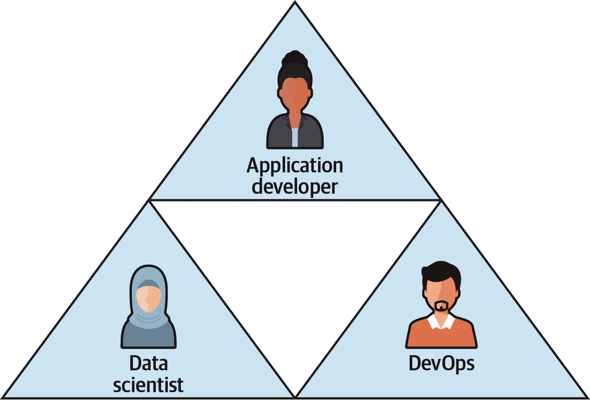

###### 图 10-1\. 将机器学习应用产品化需要各团队之间的协作。

通常，数据科学家提供训练好的模型，DevOps 工程师管理托管模型的基础设施作为 REST API，并且应用开发者将 REST API 集成到他们的应用程序中。每个团队必须了解其他团队的需求和要求，以实施高效的工作流程和顺畅的交接流程。

MLOps 已经发展到了三个成熟阶段：

MLOps v1.0

手动构建、训练、调优和部署模型

MLOps v2.0

手动构建和编排模型管道

MLOps v3.0

当新数据到达或代码发生变化时，自动运行管道，这些变化可以是确定性触发器，如 GitOps，或者是基于统计触发器，如漂移、偏差和可解释性差异，当模型性能开始下降时。

在本章中，我们描述了 SageMaker 如何支持完整的 MLOps 策略，包括管道编排、从数据或代码变化的确定性自动化，以及从漂移、偏差或可解释性变化的统计自动化。

# 软件管道

2000 年代初期，软件从业者开始使用持续集成（CI）和持续交付（CD）来直接、安全地构建、测试和部署他们的软件模块到生产环境。CI 和 CD 促进了 DevOps 工程师与软件工程师之间低摩擦的协作。在 CI 和 CD 之前，软件工程师会将他们的代码“扔过墙”给 DevOps 工程师，在预生产环境中确认成功的集成测试结果，并与质量保证（QA）团队协调等后，将软件推送到生产环境。示例软件管道如 Figure 10-2 所示。

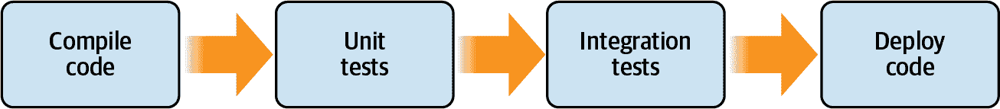

###### 图 10-2\. 简单的应用部署管道。

Jenkins 是一个流行的开源工具，用于管理软件管道。凭借其丰富的插件架构，Jenkins 可以编排复杂的 CI/CD 软件管道，并在管道执行的任何阶段提供深入的报告。对于大型代码库，管道执行可能需要几天时间，并且组件可能因各种原因而失败。Jenkins 提供机制来重新启动任何失败的组件并保持管道运行。然而，通常需要人工干预。Jenkins 还支持手动、人为反馈环节。

除了重新启动外，像 Jenkins 这样的高级管道编排引擎还支持组件缓存策略，以提高管道执行性能。例如，如果我们的管道在集成测试阶段失败，因为远程系统不可用，编排引擎可以检测哪些管道步骤已经运行，如果没有更改依赖项，则重用缓存的结果，重试失败的步骤，并继续执行管道直至完成。

# 机器学习管道

虽然 CI 和 CD 管道主要用于自动化软件开发周期并提高应用发布的质量，它们也可以改进机器学习的发布过程。机器学习工程师和数据科学家致力于以最小的摩擦度一致地训练、测试和部署模型到生产环境中。这使我们能够花更多时间构建和尝试新模型，而不是手动重新训练和重新部署使用最新数据集的现有模型。

类似于 CI 和 CD 以高效地更新和改进生产中的软件，机器学习管道自动执行持续训练和持续交付，以高效地更新和改进模型。自动化、可复制和参数化的管道有助于在整个过程中维护和跟踪框架版本、容器运行时和硬件，从特征摄取和特征工程到模型训练和部署。

使用自动化 ML 流水线而不是手动的一次性 Python 脚本，有助于减少可能出现在流水线任何步骤中的细微错误。例如，上游应用程序的小改变可能引入数据质量问题，例如星级评分超出了介于 1（最差）和 5（最佳）之间的边界和离散值范围。

虽然模型可能在质量低下的数据上看起来训练成功，但如果推送到生产环境，模型可能会对我们的业务产生负面影响。通过在模型训练之前自动化数据质量检查，我们可以引发流水线异常，通知应用团队有关坏数据的情况，并节省训练糟糕模型的成本。

我们还可以将 ML 流水线与模型可复现性和审计的工件和实验跟踪结合起来。工件跟踪提供了部署模型的血统，直到模型训练期间使用的原始数据集版本。实验跟踪记录了训练过程中使用的超参数以及训练结果，如模型准确度。SageMaker 实验和血统 API 在整个 SageMaker 中集成，以处理这些情况。

可验证的 ML 流水线可以帮助解决模型退化的问题。由于在生产环境中监控模型的复杂性，模型退化是一个相对常见且工程不足的情况。模型预测的退化导致错误分类的评论和错失的业务机会。

通过持续使用 SageMaker Model Monitor 和 Clarify 监控我们的模型预测，我们可以检测到数据分布的变化、模型偏差和模型可解释性，从而触发重新训练和部署新的审阅分类器模型的流水线。

图 10-3 显示了映射到 AWS 服务的样本机器学习流水线，包括 S3、Data Wrangler 和 SageMaker。

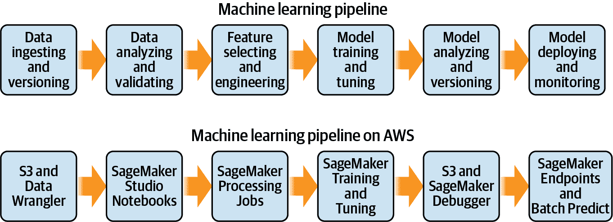

###### 图 10-3\. 映射到 AWS 服务的机器学习流水线。

流水线顺利运行后，我们可以通过添加同时流水线来增加实验速度，将同一模型的多个版本部署到生产环境，如 图 10-4 所示。这可用于在线 A/B/C 或多臂赌博（MAB）测试。

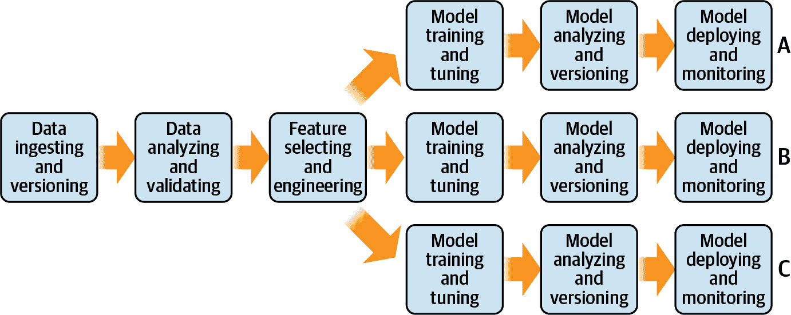

###### 图 10-4\. 训练、调优和部署同一模型的多个版本，以提高实验速度。

## 有效机器学习流水线的组成部分

仍然有许多机器学习流水线包含一个高摩擦的步骤，即数据科学家将他们的模型“扔过墙”给 DevOps 工程师或 ML 工程师来部署。机器学习流水线正好可以进行革新，类似于 2000 年代初惊艳软件工程社区的革新。

有效的机器学习流水线隐藏了流水线实现的细节，并允许数据科学从业者专注于其特定业务的数据科学问题。机器学习是连续的。我们自动化的过程越多，我们就越能自由地解决其他业务问题。否则，每次有新数据到达时我们就需要手动重新运行一次性脚本。虽然运行脚本相对简单，但监控或重新启动脚本则需要我们可能本可以用来解决更高价值任务的认知负荷。

从“临时的 Jupyter 笔记本”到“可重复的机器学习流水线”再到“生产集群”的能力仍然是一个复杂、易错且未经充分工程化的工作流程。然而，我们将提供一些选项来如何最小化复杂性并减少 AWS 中的错误。

有效的机器学习流水线应包括以下内容：

+   诸如数据摄取、数据版本控制、数据质量检查、数据预处理和特征工程等以数据为重点的任务

+   模型构建任务，如模型训练、模型质量检查和模型版本控制

+   自动化模型部署、模型扩展、模型解释和偏差检测

+   实验和谱系跟踪以反向工作并从头开始重现任何模型版本

+   自动捕捉新数据到达（S3 `PutObject`事件）并重新训练，或者可能使用类似 cron 的定时器进行自动化（每晚午夜）

+   反馈机制以根据我们的业务目标和关键结果持续改进模型，例如在接下来的 12 个月内将客户满意度提高 10%

根据我们的经验，数据质量问题是糟糕的机器学习流水线的主要原因。在第五章中，我们演示了如何使用 AWS Deequ 开源库对我们的数据进行数据质量检查，作为机器学习流水线的“步骤 0”。没有一致和预期的数据质量，我们的机器学习流水线最多会迅速失败并最大程度地降低成本。在最坏的情况下，低质量的数据将生成低质量的模型，可能包含偏差并对我们的业务产生负面影响。

在机器学习探索的初期阶段，我们可能不需要流水线。流水线的严格性可能显得过于限制。当我们准备开始定期训练模型时，通常会部署流水线。如果我们正在快速尝试许多不同类型的特征、模型和超参数，我们可能希望保持在研究实验室，直到准备好长期自动化并获得定期流水线执行的好处，包括数据质量检查、谱系跟踪和基础设施扩展。然而，即使是最简单的流水线也可以帮助我们改进模型探索。

## 有效的机器学习流水线步骤

下面是构成有效现代机器学习流水线的步骤集合。我们将在接下来的章节中演示如何使用 SageMaker Pipelines、AWS Step Functions、Airflow、Kubeflow 和其他开源选项执行每个步骤。

数据摄入和版本控制

从数据源（例如数据库、S3 或流）中读取原始数据集。将数据集转换为下一步流水线中将使用的格式（例如 CSV、Parquet 等），并对原始和转换后的数据集进行版本控制。

数据分析和验证

分析所摄入数据集的质量和偏差。验证数据是否准备好进入下一个流水线步骤。

特征工程

将数据集转换为诸如 BERT 嵌入之类的特征，供下一个流水线步骤使用。平衡和拆分数据集为训练、验证和测试集。发布这些特征到特征存储中，以供整个组织在训练和推断时使用。

模型训练和调优

使用前一流水线步骤中创建的特征以及特定于模型算法的一组超参数来训练模型。使用已知的验证数据集拆分分析模型和超参数的准确性，并使用不同的超参数集重复，直到模型准确性达到要求。

模型评估

使用已知的测试数据集拆分测试训练模型，计算额外的指标（例如混淆矩阵和曲线下面积），验证不同测试数据集拆分（例如不同的产品类别）上的模型偏差，并重新训练和调整以减少或消除偏差。

模型版本和部署

对训练模型及其超参数和数据集拆分进行版本控制，并将模型部署到生产环境作为实时端点或批量预测作业。

模型反馈和偏差检测

分析模型在业务指标（例如收入增长、成功识别欺诈等）上的表现。通过分析模型输入和输出（预测）与训练数据基准之间的差异来检测训练-服务偏差，并在检测到偏差时重新训练模型。

# 使用 SageMaker Pipelines 进行流水线编排

SageMaker Pipelines 是在 AWS 上实现 AI 和机器学习流水线的最完整方式。让我们为基于 BERT 的评论分类器构建一个流水线，并执行前几章描述的许多步骤，包括数据摄入、特征工程、模型训练和模型部署，如图 10-5 所示。

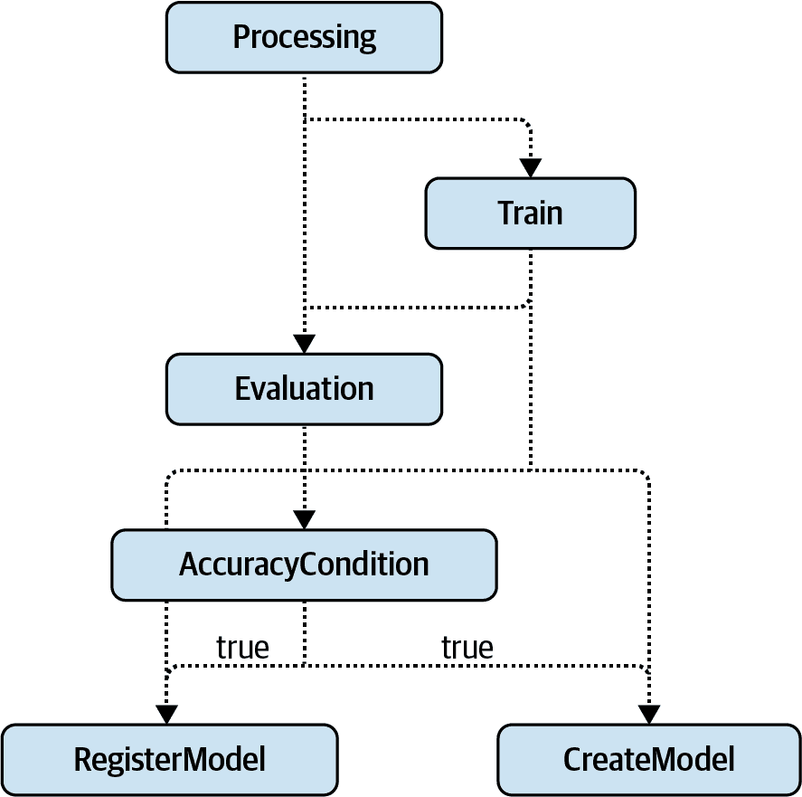

###### 图 10-5。使用 SageMaker Pipeline 来训练、验证、创建和注册我们训练过的 BERT 模型。

让我们使用 SageMaker Python SDK 以编程方式设置流水线，定义前面讨论的每个步骤。

## 创建一个实验来跟踪我们的流水线谱系。

首先，我们创建一个实验和试验来跟踪和比较我们的流水线运行：

```
import time
from smexperiments.experiment import Experiment

experiment_name = 'Experiment-{}'.format(int(time.time()))

experiment = Experiment.create(
               experiment_name=experiment_name,
               description='Amazon Customer Reviews BERT Pipeline Experiment',
               ...)

trial_name = 'trial-{}'.format(int(time.time()))

trial = Trial.create(trial_name=trial_name,
                     experiment_name=experiment_name,
                     ...)
```

## 定义我们的管道步骤

我们管道的第一步是使用 SageMaker 处理作业将原始评审文本转换为 BERT 特征。我们将重用来自第六章的相同`processor`，但将其包装在 SageMaker Pipeline Python SDK 的`ProcessingStep`中：

```
experiment_config_prepare = {
    'ExperimentName': experiment_name,
    'TrialName': trial_name,
    'TrialComponentDisplayName': 'prepare'
}

from sagemaker.processing import ProcessingInput, ProcessingOutput
from sagemaker.workflow.steps import ProcessingStep

processing_step = ProcessingStep(
    name='Processing', 
    code='preprocess-scikit-text-to-bert-feature-store.py',
    processor=processor,
    inputs=processing_inputs,
    outputs=processing_outputs,
    job_arguments=['--train-split-percentage', \
                   str(train_split_percentage.),                   
                   '--validation-split-percentage', \
                   str(validation_split_percentage.),
                   '--test-split-percentage', \
                   str(test_split_percentage.),
                   '--max-seq-length', \
                   str(max_seq_length.),
                   '--balance-dataset', \
                   str(balance_dataset.),
                   '--feature-store-offline-prefix', \
                   str(feature_store_offline_prefix.),
                   '--feature-group-name', \
                   str(feature_group_name)
                  ]
)
```

现在让我们使用先前特征工程处理步骤的输出来训练我们的模型。我们将使用来自第七章的相同`estimator`，但将其包装在 SageMaker Pipeline Python SDK 的`TrainingStep`中：

```
from sagemaker.inputs import TrainingInput
from sagemaker.workflow.steps import TrainingStep

experiment_config_train = {
    'ExperimentName': experiment_name,
    'TrialName': trial_name,
    'TrialComponentDisplayName': 'train'
}

training_step = TrainingStep(
    name='Train',
    estimator=estimator,
    inputs={
        'train': TrainingInput(
            s3_data=\
            processing_step.properties.ProcessingOutputConfig.Outputs[
                'bert-train'
            ].S3Output.S3Uri,
            content_type='text/csv'
        ),
        'validation': TrainingInput(
            s3_data=\
            processing_step.properties.ProcessingOutputConfig.Outputs[
                'bert-validation'
            ].S3Output.S3Uri,
            content_type='text/csv'
        ),
        'test': TrainingInput(
            s3_data=\
            processing_step.properties.ProcessingOutputConfig.Outputs[
                'bert-test'
            ].S3Output.S3Uri,
            content_type='text/csv'
        )        
    }
)
```

接下来，让我们添加一步，使用 SageMaker 处理作业评估我们的模型，计算模型测试准确率，并将结果写入名为*evaluation.json*的文件中存储在 S3 中。该文件将由下一步骤有条件地注册和准备模型部署使用：

```
from sagemaker.workflow.properties import PropertyFile

experiment_config_evaluate = {
    'ExperimentName': experiment_name,
    'TrialName': trial_name,
    'TrialComponentDisplayName': 'evaluate'
}

evaluation_report = PropertyFile(
    name='EvaluationReport',
    output_name='metrics',
    path='evaluation.json'
)

from sagemaker.sklearn.processing import SKLearnProcessor

evaluation_processor = SKLearnProcessor(
    framework_version='<SCIKIT_LEARN_VERSION>',
    role=role,
    ...)

evaluation_step = ProcessingStep(
    name='Evaluation',
    processor=evaluation_processor,
    code='evaluate_model_metrics.py',
    inputs=[
        ProcessingInput(
            source=\
            training_step.properties.ModelArtifacts.S3ModelArtifacts,
            destination='/opt/ml/processing/input/model'
        ),
        ProcessingInput(
            source=raw_input_data_s3_uri,
            destination='/opt/ml/processing/input/data'
        )
    ],
    outputs=[
        ProcessingOutput(output_name='metrics', 
                         s3_upload_mode='EndOfJob',
                         source='/opt/ml/processing/output/metrics/'),
    ],
    job_arguments=[
                   '--max-seq-length', \
                   str(max_seq_length.default_value),
                  ],
    property_files=[evaluation_report],
    experiment_config=experiment_config_evaluate
)
```

*evaluate_model_metrics.py*文件下载模型，运行一组测试预测，并将结果写入*evaluation.json*，如下所示：

```
def predict(text):
    encode_plus_tokens = tokenizer.encode_plus(
        text,
        pad_to_max_length=True,
        max_length=args.max_seq_length,
        truncation=True,
        return_tensors='tf')

    input_ids = encode_plus_tokens['input_ids']

    input_mask = encode_plus_tokens['attention_mask']
    outputs = model.predict(x=(input_ids, input_mask))
    scores = np.exp(outputs) / np.exp(outputs).sum(-1, keepdims=True)

    prediction = [{"label": config.id2label[item.argmax()],
        		   "score": item.max().item()} for item in scores]

    return prediction[0]['label']
... 

df_test_reviews = pd.read_csv(
    test_data_path, 
    delimiter='\t',
    quoting=csv.QUOTE_NONE,
    compression='gzip')[['review_body', 'star_rating']]

y_test = df_test_reviews['review_body'].map(predict)
y_actual = df_test_reviews['star_rating']

accuracy = accuracy_score(y_true=y_test, y_pred=y_actual)        

metrics_path = os.path.join(args.output_data, 'metrics/')

os.makedirs(metrics_path, exist_ok=True)

report_dict = {
    "metrics": {
        "accuracy": {
            "value": accuracy,
        },
    },
}

evaluation_path = "{}/evaluation.json".format(metrics_path)
with open(evaluation_path, "w") as f:
    f.write(json.dumps(report_dict))
```

让我们在 SageMaker 模型注册表中注册我们训练过的模型。一旦模型注册成功，我们的管道需要手动批准步骤将模型部署到 staging 环境。我们首先需要在名为`model_metrics`的 Python 对象中捕获上一个评估步骤生成的评估指标，如下所示：

```
from sagemaker.model_metrics import MetricsSource, ModelMetrics 

model_metrics = ModelMetrics(
    model_statistics=MetricsSource(
        s3_uri="{}/evaluation.json".format(
            evaluation_step.arguments["ProcessingOutputConfig"]\
["Outputs"][0]["S3Output"]["S3Uri"]
        ),
        content_type="application/json"
    )
)
```

让我们传递`model_metrics`并使用来自先前`TrainingStep`的`estimator`创建`RegisterModel`步骤。我们可以通过分别为`inference_instances`和`transform_instances`指定列表来限制 SageMaker Endpoint 和 Batch Transform 作业的实例类型：

```
from sagemaker.workflow.step_collections import RegisterModel

inference_image_uri = sagemaker.image_uris.retrieve(
    framework="tensorflow",
    region=region,
    version="<TENSORFLOW_VERSION>",
    py_version="<PYTHON_VERSION>",
    instance_type=deploy_instance_type,
    image_scope="inference"
)

register_step = RegisterModel(
    name="RegisterModel",
    estimator=estimator,
    image_uri=inference_image_uri,
     model_data=
         training_step.properties.ModelArtifacts.S3ModelArtifacts,
    content_types=["application/jsonlines"],
    response_types=["application/jsonlines"],
    inference_instances=["ml.m5.4xlarge"],
    transform_instances=["ml.c5.18xlarge"],
    model_package_group_name=model_package_group_name,
    model_metrics=model_metrics    
)
```

现在我们将编写`CreateModelStep`来封装 SageMaker 中用于 SageMaker Endpoint 和 Batch Transform 作业的`Model`：

```
from sagemaker.model import Model

model = Model(
    name=<MODEL_NAME>,
    image_uri=inference_image_uri,
    model_data=
         training_step.properties.ModelArtifacts.S3ModelArtifacts,
    ...
)

from sagemaker.inputs import CreateModelInput

create_inputs = CreateModelInput(
    instance_type="ml.m5.4xlarge",
)

from sagemaker.workflow.steps import CreateModelStep

create_step = CreateModelStep(
    name="CreateModel",
    model=model,
    inputs=create_inputs,
)
```

让我们添加一个`ConditionStep`来比较评估准确性指标与阈值。只有当模型准确率超过 95%的给定阈值时，我们的管道才会注册、创建并准备模型部署，如下所示：

```
from sagemaker.workflow.conditions import ConditionGreaterThanOrEqualTo

from sagemaker.workflow.condition_step import (
    ConditionStep,
    JsonGet,
)

minimum_accuracy_condition = ConditionGreaterThanOrEqualTo(
    left=JsonGet(
        step=evaluation_step,
        property_file=evaluation_report,
        json_path="metrics.accuracy.value",
    ),
    right=0.95 # 95% accuracy
)

minimum_accuracy_condition_step = ConditionStep(
    name="AccuracyCondition",
    conditions=[minimum_accuracy_condition],
     # success, continue with model registration
    if_steps=[register_step, create_step], 
    # fail, end the pipeline
    else_steps=[],
)
```

## 配置管道参数

在创建管道之前，我们必须使用 SageMaker Pipelines Python SDK 中的`ParameterInteger`、`ParameterString`和`ParameterFloat`定义参数占位符，以在管道的所有步骤中使用。这些只是现在的占位符，因为我们正在定义管道。当我们启动管道时，我们将为每个参数指定确切的值，或者如果未提供值，则使用`default_value`：

```
from sagemaker.workflow.parameters import (
    ParameterInteger,
    ParameterString,
    ParameterFloat,
)

input_data = ParameterString(
    name="InputData",
    default_value=raw_input_data_s3_uri,
)
...
max_seq_length = ParameterInteger(
    name="MaxSeqLength",
    default_value=64,
)
...
learning_rate = ParameterFloat(
    name="LearningRate",
    default_value=0.00001,
)
...
```

## 创建管道

接下来，我们使用所有先前定义的步骤创建管道。这包括`processing_step`、`training_step`、`evaluation_step`以及`minimum_accuracy_condition_step`，后者在模型评估过程中如果模型达到 95%的最低准确率条件时有条件地调用`register_step`和`create_step`：

```
pipeline = Pipeline(
    name=<PIPELINE_NAME>,
    parameters=[
        input_data, # InputData
   		...
        max_seq_length, # MaxSeqLength
   		... 
        learning_rate, # LearningRate
   		...
    ],
    steps=[processing_step, training_step, evaluation_step, \
           minimum_accuracy_condition_step]
)

pipeline.create(role_arn=role)
```

## 使用 Python SDK 启动管道

最后，我们通过提供所需的参数值启动`Pipeline`，包括评论数据集的 S3 位置、BERT token 的最大序列长度以及 TensorFlow 梯度下降优化器的学习率：

```
execution = pipeline.start(
    InputData=raw_input_data_s3_uri,
    MaxSeqLength=64,
    LearningRate=0.000012,
    ...
)
```

## 使用 SageMaker Studio UI 启动管道

我们还可以通过 SageMaker Studio UI 启动 SageMaker 管道执行，如图 10-6 所示。Studio UI 为我们的`Pipeline`对象中定义的每个参数提供输入字段。

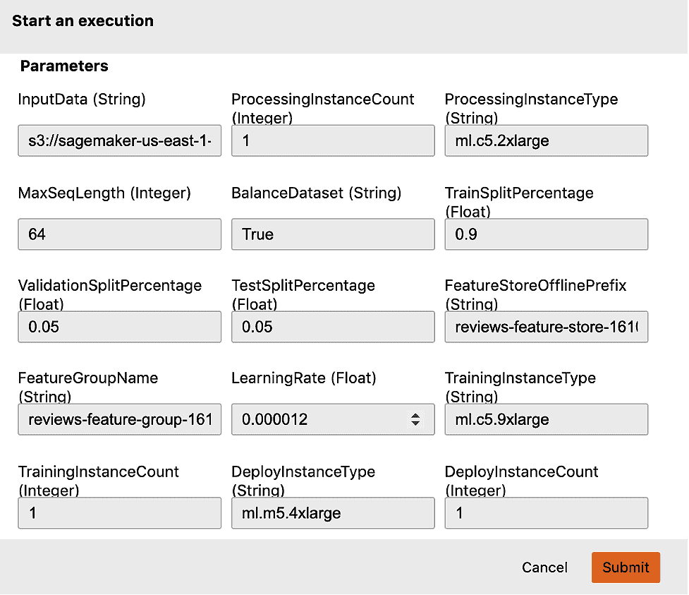

###### 图 10-6\. 通过 SageMaker Studio UI 启动管道执行。

## 批准模型用于暂存和生产环境

我们可以通过 SageMaker 模型注册表手动在 SageMaker Studio UI 或通过我们的笔记本程序来批准模型。批准模型将自动将模型部署到用于测试的暂存环境。如果测试成功，我们的管道随后需要单独批准将模型从暂存环境移至生产环境。我们可以使用以下代码通过程序来将模型批准至暂存环境：

```
for execution_step in execution.list_steps():
    if execution_step['StepName'] == 'RegisterModel':
        model_package_arn = 
           execution_step['Metadata']['RegisterModel']['Arn']
        break

model_package_update_response = sm.update_model_package(
    ModelPackageArn=model_package_arn,
    ModelApprovalStatus="Approved",
)
```

## 查看管道 artifact 谱系

我们可以直接通过 SageMaker Studio UI 或通过我们的笔记本程序使用 Python SDK 来查看 artifact 谱系。以下是列出所有步骤的 artifact 的代码，包括特征工程、模型训练、评估、批准和部署：

```
import time
from sagemaker.lineage.visualizer import LineageTableVisualizer

viz = LineageTableVisualizer(sagemaker.session.Session())
for execution_step in reversed(execution.list_steps()):
    if execution_step['StepName'] == 'Processing':
        processing_job_name=
          execution_step['Metadata']['ProcessingJob']['Arn']\
          .split('/')[-1]            
        display(viz.show(processing_job_name=processing_job_name))
    else:
        display(viz.show(pipeline_execution_step=execution_step))
        time.sleep(5)
```

输出结果类似于以下表格： 

|   | 名称/来源 | 方向 | 类型 | 关联类型 | 谱系类型 |
| --- | --- | --- | --- | --- | --- |
| 0 | preprocess-scikit-text-to-bert-feature-store.py | 输入 | 数据集 | 贡献至 | artifact |
| 1 | s3://.../amazon-reviews-pds/tsv/ | 输入 | 数据集 | 贡献至 | artifact |
| 2 | 68331...om/sagemaker-scikit-learn:0.23-1-cpu-py3 | 输入 | 图像 | 贡献至 | artifact |
| 3 | s3://.../output/bert-test | 输出 | 数据集 | 产出 | artifact |
| 4 | s3://.../output/bert-validation | 输出 | 数据集 | 产出 | artifact |
| 5 | s3://.../output/bert-train | 输出 | 数据集 | 产出 | artifact |
| 6 | s3://.../output/bert-test | 输入 | 数据集 | 贡献至 | artifact |
| 7 | s3://.../output/bert-validation | 输入 | 数据集 | 贡献至 | artifact |
| 8 | s3://.../output/bert-train | 输入 | 数据集 | 贡献至 | artifact |
| 9 | 76310.../tensorflow-training:2.3.1-cpu-py37 | 输入 | 图像 | 贡献至 | artifact |
| 10 | model.tar.gz | 输出 | 模型 | 产出 | artifact |
| 11 | model.tar.gz | 输入 | 模型 | 贡献至 | artifact |
| 12 | 76310.../tensorflow-inference:2.1.0-cpu | 输入 | 图像 | 贡献至 | artifact |
| 13 | bert-reviews-1610437484-1-Approved-1610443150-aws-model-group | 输入 | 批准 | 贡献至 | action |
| 14 | bert-reviews-1610437484-1-Approved-1610443150-aws-endpoint | 输出 | 模型部署 | 贡献至 | action |
| 15 | bert-reviews-1610437484-1-aws-model-group | 输出 | ModelGroup | AssociatedWith | context |

## 查看管道实验谱系

使用 SageMaker 实验 API，我们可以通过管道的所有步骤展示管道的实验谱系，包括特征工程、模型训练、评估和部署，如下所示：

```
from sagemaker.analytics import ExperimentAnalytics

experiment_analytics = ExperimentAnalytics(
    experiment_name=experiment_name,
)

experiment_analytics.dataframe()
```

| TrialComponentName | DisplayName | max_seq_​length | learning_​rate | train_​accuracy | test_​accuracy | endpoint_​name |
| --- | --- | --- | --- | --- | --- | --- |
| pipelines-0tsa93mahu8v-​processing-kch2vw03qc-​aws-processing-job | prepare | 64.0 | NaN | NaN | NaN |   |
| pipelines-0tsa93mahu8v-​Train-tlvC7YdBl9-​aws-training-job | train | 64.0 | 0.000017 | 0.9416 | NaN |   |
| pipelines-​1daa23hlku3v-​processing-hkc9w0v0q-​aws-processing-job | evaluate | 64.0 | NaN | NaN | 0.9591 |   |
| TrialComponent-2021-01-​09214921-dgtu | deploy | NaN | NaN | NaN | NaN | bert-reviews-​1610437484-​endpoint |

# 使用 SageMaker 管道进行自动化

有两种主要的自动启动管道的方式：基于事件的触发器和基于时间的触发器。基于事件的触发器将在特定事件发生时启动管道，例如，当一个新的*train.py*提交到我们基于 Git 的代码仓库时。这通常称为“GitOps”自动化。当新数据通过`PutObject`事件进入 S3 时，我们也可以启动新的管道。基于时间的触发器将按计划启动管道，例如每周、每两天或每四小时一次。让我们讨论如何实现 GitOps、S3 和基于时间的触发器，以自动启动 SageMaker 管道。

## 在提交代码时通过 GitOps 触发

SageMaker 通过 SageMaker 项目实现 GitOps 管道自动化。SageMaker 项目提供了预构建的 MLOps 模板，自动化模型构建和部署管道。我们可以根据需要定制这些模板，或者创建自己的模板。

我们可以选择使用 SageMaker 提供的预构建 MLOps 模板之一，或者使用我们自己提供的自定义模板来创建我们自己的项目。MLOps 模板使用 AWS CloudFormation 自动设置所有必需的组件，以便我们的 GitOps 自动化工作流可以与 SageMaker 管道配合使用。MLOps 模板还设置了一个触发器，每次我们向代码仓库提交新代码时都会运行管道。

我们 SageMaker 管道的 MLOps 模板主要由两个组件组成：`modelbuild`和`modeldeploy`。`modelbuild`组件用于构建和注册模型。`modeldeploy`组件将模型部署到暂存和生产环境。将模型部署到生产环境需要进行第二次手动批准步骤，如图 10-7 所示。

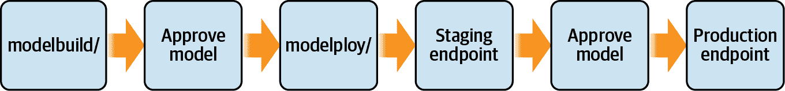

###### 图 10-7\. MLOps 管道，用于将模型部署到暂存和生产环境，带有手动批准。

`modelbuild` 和 `modeldeploy` 的分离允许责任和访问控制的分离。例如，数据科学家可能负责 `modelbuild` 阶段将模型推送到暂存区，而 DevOps 团队负责 `modeldeploy` 阶段将模型推送到生产环境。

## S3 在新数据到达时触发

当新数据直接从应用程序或通过数据流服务（如 Kinesis Streams 和 Managed Streaming for Apache Kafka）进入系统时，我们可能希望持续运行我们的管道并更新我们的模型以包括新数据。虽然每周、每天甚至每小时手动运行管道是完全可以接受的，但我们可以在上游应用程序从 S3 中新数据着陆时轻松自动化管道，如 图 10-8 所示。

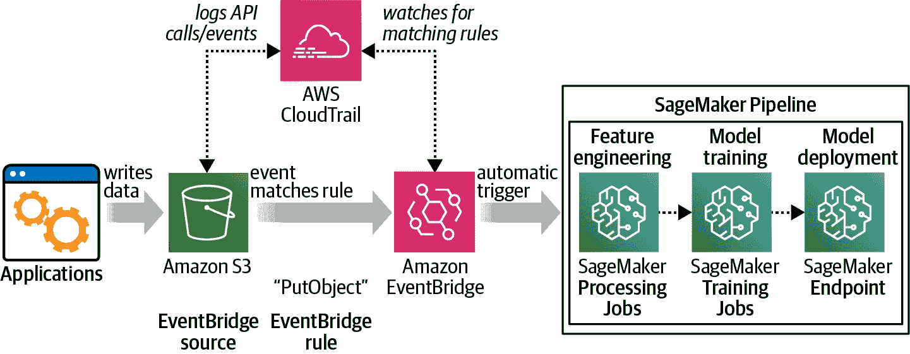

###### 图 10-8\. 当新数据到达 S3 时自动启动 SageMaker 管道。

首先，我们需要在我们的 S3 存储桶上启用 AWS CloudTrail 数据事件日志记录，以便在新数据到达 S3 时收到通知：

```
watched_bucket_arn=<S3_BUCKET_ARN_TO_WATCH>

event_selector=\
'\'[{ "ReadWriteType": "WriteOnly", "IncludeManagementEvents":true, \
    "DataResources": \
        [{ "Type": "AWS::S3::Object", \
            "Values": ["' + watched_bucket_arn + '"] 
        }] 
    }]\''

!aws cloudtrail put-event-selectors \
    --trail-name $trail_name \
    --event-selectors $event_selector
```

接下来，我们将创建一个 Amazon EventBridge 规则，使用一个 EventBridge 规则来触发 SageMaker 管道，每当新文件上传到 S3 存储桶时触发，这个规则匹配 S3 的 `PutObject` 和 `CompleteMultipartUpload`。以下是启用此行为的 Python 代码：

```
events = boto3.client('events')
watched_bucket=<S3_BUCKET_NAME_TO_WATCH>

pattern = {
  "source": [
    "aws.s3"
  ],
  "detail-type": [
    "AWS API Call via CloudTrail"
  ],
  "detail": {
    "eventSource": [
      "s3.amazonaws.com"
    ],
    "eventName": [
      "PutObject",
      "CompleteMultipartUpload",
      "CopyObject"
    ],
    "requestParameters": {
      "bucketName": [
        "{}".format(watched_bucket)
      ]
    }
  }
}

response = events.put_rule(
    Name='S3-Trigger',
    EventPattern=json.dumps(pattern),
    State='ENABLED',
    Description='Triggers an event on S3 PUT',
    EventBusName='default'
)
```

最后，我们将规则与 AWS Lambda 函数关联，以在匹配规则时启动我们的管道：

```
response = events.put_targets(
    Rule='S3-Trigger',
    EventBusName='default',
    Targets=[
        {
            'Id': '1',
            'Arn': lambda_arn,
            'RoleArn': iam_role_eventbridge_arn,
        }
    ]
)
```

这是用于触发我们 SageMaker 管道的 AWS Lambda 函数的摘录：

```
sm = boto3.client('sagemaker', region_name=region)

timestamp = int(time.time())

def lambda_handler(event, context):
    response = sm.start_pipeline_execution(
        PipelineName=<PIPELINE_NAME>,
        PipelineExecutionDisplayName='<PIPELINE_EXECUTION_DISPLAY_NAME>',
        PipelineParameters=[
		...
        ]
    )
```

每当有新文件上传到这个 S3 存储桶时，EventBridge 将触发规则并启动我们的管道执行。我们可以使用 `lambda_handler` 函数的 `event` 变量来确定上传的确切文件，也许可以仅对新文件进行增量训练我们的模型。根据我们的用例，我们可能不希望为每个上传到 S3 的文件启动新管道。然而，这是构建我们自己的规则和触发器的一个良好起点，适用于许多 AWS 服务。

###### 注意

在撰写本文时，EventBridge 与 SageMaker 管道之间没有原生集成，因此我们需要使用 Lambda 函数的桥接。然而，到本书出版时，可能会有原生集成，因此我们可以跳过 Lambda 函数直接将 EventBridge 与 SageMaker 管道集成。

## 基于时间的计划触发器

我们可能希望在特定时间段内（例如每小时、每天、每月等）对数据批次触发我们的管道。类似于配置 cron 作业，我们可以创建一个 EventBridge 规则来按计划运行我们的管道。我们可以使用熟悉的 cron 语法或通过定义固定的频率（例如每小时）来指定计划。或者，我们可以使用 AWS Python SDK 以编程方式定义计划的规则。以下代码每小时触发管道运行：

```
events = boto3.client('events')

response = events.put_rule(
	Name='Hourly_Time_Based_Trigger',
	ScheduleExpression='rate(1 hour)',
	State='ENABLED',
	Description='Hourly Time-Based Trigger',
	EventBusName='default'
)
```

## 统计漂移触发器

如果 SageMaker Model Monitor 检测到相对于给定基线或预测标签的真实性的数据质量漂移、模型质量漂移、偏差漂移或可解释性漂移，我们也可以启动新的流水线。我们可以为数据质量、模型质量、模型偏差和特征重要性创建基线，并使用 SageMaker Model Monitor 监控我们部署的模型，如第九章所讨论的。

Model Monitor 捕获实时模型预测，并分析数据分布，比较模型输入和模型输出与从训练数据中学习的基线阈值。这有助于我们检测统计变化，如协变量漂移或概念漂移，这可能触发新的流水线执行来重新训练模型。

Model Monitor 与 SageMaker Clarify 集成。使用 Clarify，SageMaker 连续监控部署的模型，检测模型偏差和特征重要性的变化。我们基于离线训练数据定义模型偏差指标的置信区间。我们持续监控模型在线预测中观察到的置信区间。如果观察到的置信区间与定义的置信区间不重叠，SageMaker Clarify 将触发一个偏差漂移警报，我们可以用来启动新的流水线。类似地，如果特征重要性的变化超过了定义的阈值，SageMaker Clarify 将触发一个特征归因漂移警报，我们可以用来启动新的流水线。

# 更多的流水线选项

虽然 SageMaker Pipelines 是在 AWS 上实现 AI 和机器学习流水线的标准方式，我们还介绍了 AWS Step Functions 以及各种开源选项，如 Kubeflow Pipelines、Apache Airflow、TFX 和 MLflow。这些工具对包括 Amazon S3、Athena、EMR、EFS 和 FSx for Lustre 在内的 AWS 数据存储提供了良好的支持。

## AWS Step Functions 和 Data Science SDK

Step Functions 是一个很好的选择，可以构建复杂的工作流，而无需构建和维护自己的基础设施。虽然 Step Functions 并非专门为机器学习而设计，但它们提供了与许多 AWS 服务深度集成的灵活性，并公开了 Step Functions Data Science SDK。

图 10-9 显示了一个 Step Function 流水线，用于编排在 SageMaker Pipelines 部分展示的基于 BERT 的评论分类器流水线。

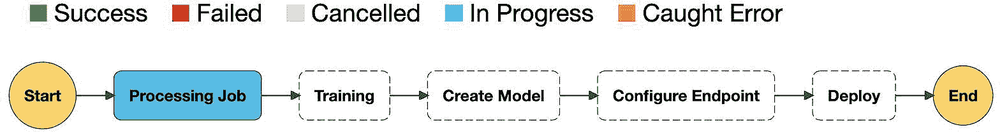

###### 图 10-9\. Step Function 流水线，用于在 SageMaker 上编排我们基于 BERT 的流水线。

这里是我们流水线中训练步骤的 Step Function 配置的摘录。完整的代码可以在与本书关联的 GitHub 仓库中找到：

```
  "Training": {
    "AlgorithmSpecification": {
      "TrainingImage": "<TENSORFLOW_IMAGE_URI>".format(region),
      "TrainingInputMode": "{}".format(input_mode)
    },
    "HyperParameters": {
      "epochs": "{}".format(epochs),
      "learning_rate": "{}".format(learning_rate),
      "epsilon": "{}".format(epsilon),
      ...
}
   }
}
```

## Kubeflow Pipelines

Kubeflow 是建立在 Kubernetes 上的流行机器学习生态系统，包括一个称为 *Kubeflow Pipelines* 的编排子系统。尽管 Kubeflow 要求我们构建和维护自己的 Amazon EKS 集群，但它在 AWS 上得到了很好的支持，如 图 10-10 所示。

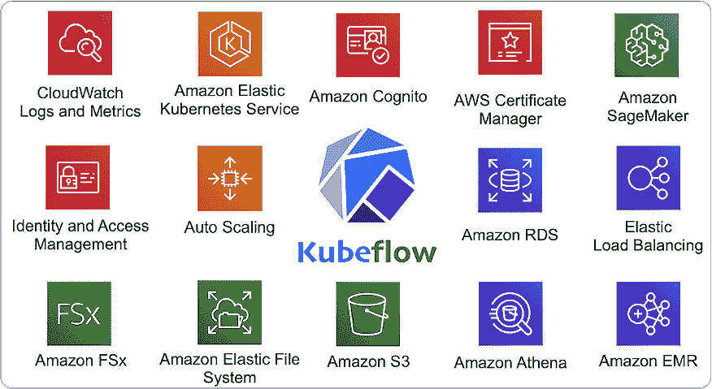

###### 图 10-10\. Kubeflow 在 AWS 上得到了很好的支持，因为与 Amazon EKS 的紧密集成。

使用 Kubeflow，我们可以运行分布式训练作业，分析训练指标，跟踪流水线谱系，重新启动失败的流水线，并安排流水线运行。Kubeflow 中使用的约定是明确定义的，并得到了许多组织中开源贡献者大规模支持的支持。如果我们已经在使用 Kubernetes，Kubeflow 可能是管理我们的流水线的一个好选择。

尽管对于一些人来说管理 Kubernetes 是一件有趣的事情，包括本书的作者们，在日常数据科学和工程任务中却是一种分心。本书的作者们在许多夜晚和周末都在解决 Kubernetes 层面的问题，这段时间本可以用来工程更多功能和训练更好的模型。

由于 Kubeflow 与 Kubernetes 的紧密集成，几乎可以通过查阅 Kubernetes 和 Amazon EKS 的功能来回答关于管理和扩展 Kubeflow 集群的每一个问题。以下是一些示例：

> *问题:* “如何监控我的 Kubeflow 训练作业中的 GPU？”
> 
> *回答:* “在 AWS 上，您监控 Kubernetes 上其他系统资源的方式相同：Prometheus、Grafana 和 CloudWatch。”
> 
> *问题:* “如何自动缩放我的 Kubeflow REST 端点？”
> 
> *回答:* “在 AWS 上，您自动缩放 Kubernetes 资源的方式与其他资源相同：水平 Pod 自动缩放、集群自动缩放和 CloudWatch。”
> 
> *问题:* “Kubeflow 支持 Spot Instances 吗？”
> 
> *回答:* “是的，因为 Amazon EKS 支持 Spot Instances。”

###### 注意

值得注意的是，在使用 Spot Instances 训练 Kubeflow 模型时，我们必须使用一个能够容忍 Spot Instances 离开集群（在训练作业期间）的框架，在新的 Spot Instances 可用时替换它们。当 Spot Instances 被替换时，它们会从集群中移除，并在训练作业中出现为失败的实例。现代框架如 TensorFlow、PyTorch 和 Apache MXNet 支持实例故障，但需要额外的代码和配置来执行所需的检查点，以有效地从故障中恢复并继续训练。我们在 第八章 中展示了 TensorFlow 代码和 SageMaker 配置用于检查点。

让我们创建一个开源的 Kubeflow 流水线，使用托管的 Amazon SageMaker 和前几章节中使用的相同的 Amazon Customer Reviews 数据集来训练一个 BERT 模型，如 图 10-11 所示。

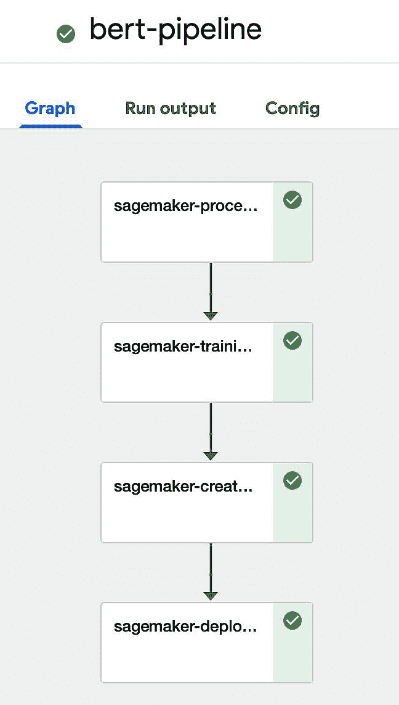

###### 图 10-11\. Kubeflow 流水线在 SageMaker 上编排我们基于 BERT 的流水线。

首先，我们导入 SageMaker Components for Kubeflow Pipelines Python 库和支持资产以在我们的 Kubeflow Pipeline 中使用。以下 YAML 可以在[GitHub 上找到](https://oreil.ly/Uh4Ls)：

```
sagemaker_process_op = components.load_component_from_url( \
	'components/aws/sagemaker/process/component.yaml')

sagemaker_train_op = components.load_component_from_url( 
	'components/aws/sagemaker/train/component.yaml')

sagemaker_model_op = components.load_component_from_url( 
	'components/aws/sagemaker/model/component.yaml')

sagemaker_deploy_op = components.load_component_from_url( 
	'components/aws/sagemaker/deploy/component.yaml')
```

现在让我们设置原始训练数据的 S3 位置：

```
def processing_input(input_name, 
                     s3_uri, 
                     local_path, 
                     s3_data_distribution_type):
    return {
        "InputName": input_name,
        "S3Input": {
            "LocalPath": local_path,
            "S3Uri": s3_uri,
            "S3DataType": "S3Prefix",
            "S3DataDistributionType": s3_data_distribution_type,
            "S3InputMode": "File",
        },
    }
```

让我们定义转换后的 BERT 特征的 S3 位置：

```
def processing_output(output_name, s3_uri, 
                      local_path, s3_upload_mode):
    return {
        "OutputName": output_name,
        "S3Output": {
            "LocalPath": local_path,            
            "S3Uri": s3_uri,
            "S3UploadMode": s3_upload_mode
        },
    }
```

让我们使用 Kubeflow Pipelines Python SDK 定义实际的 Kubeflow Pipeline：

```
@dsl.pipeline(
    name="BERT Pipeline",
    description="BERT Pipeline",
)
def bert_pipeline(role=role, 
                  bucket=bucket, 
                  region=region,
                  raw_input_data_s3_uri=<RAW_DATA_S3_URI>):
```

现在让我们将原始输入数据转换为 BERT 特征：

```
    # Training input and output location based on bucket name
    process = sagemaker_process_op(
       ...
        container_arguments=['--train-split-percentage', 
                                str(train_split_percentage),
                             '--validation-split-percentage', 
                                str(validation_split_percentage),
                             '--test-split-percentage', 
                                str(test_split_percentage),
                             '--max-seq-length', 
                                str(max_seq_length),
                             '--balance-dataset', 
                                str(balance_dataset)])
```

让我们训练模型：

```
    hyperparameters={
        'epochs': '{}'.format(epochs),
        'learning_rate': '{}'.format(learning_rate),
        'epsilon': '{}'.format(epsilon),
   		...
    }
    hyperparameters_json = json.dumps(hyperparameters)

    training = sagemaker_train_op(
        hyperparameters=hyperparameters_json,
       ...
    ).after(process)
```

部署 BERT 模型作为基于 REST 的 SageMaker 端点：

```
    create_model = sagemaker_model_op(
        model_name=training.outputs["job_name"],
        model_artifact_url=training.outputs["model_artifact_url"],
       ...
    )

    deploy_model = sagemaker_deploy_op(
        variant_name_1='AllTraffic',
        model_name_1=create_model.output,
        instance_type_1=deploy_instance_type,
        initial_instance_count_1=deploy_instance_count        
    )
```

让我们编译并运行 Kubeflow Pipeline，结果是部署一个带有我们的 BERT 模型的 SageMaker 端点：

```
kfp.compiler.Compiler().compile(bert_pipeline, 'bert-pipeline.zip')

client = kfp.Client()

experiment = client.create_experiment(name='kubeflow')

my_run = client.run_pipeline(experiment.id, 
                             'bert-pipeline', 
                             'bert-pipeline.zip')
```

让我们调用 SageMaker 端点并从评论文本中获取星级预测：

```
sm_runtime = 
boto3.Session(region_name=region).client('sagemaker-runtime')

review = "This is great!".encode('utf-8')

response = sm_runtime.invoke_endpoint(
    EndpointName=endpoint_name,
    ContentType='application/jsonlines',
    Body=review)

json.loads(response['Body'].read().decode())

### OUTPUT ###
{'predicted_label': 5}
```

## Apache Airflow

Apache Airflow 是一个非常成熟和流行的选项，最初开发用于编排数据工程和 ETL 管道以支持分析工作负载。然而，Airflow 已经扩展到机器学习领域作为一个可行的管道编排工具。Amazon 支持 Amazon Managed Workflows for Apache Airflow 以减少在 AWS 上运行 Airflow 集群的操作负担。

带有大量第三方插件库和与许多 AWS 服务的原生集成，Amazon MWAA 是在 AWS 上管理使用 Airflow 的管道的一个很好的选择。如果我们已经在数据工程和 ETL 管道中使用 Airflow，Airflow 可能是编排机器学习管道的一个很好的选择。图 10-12 展示了我们基于 BERT 的评论分类器管道，通过 Amazon MWAA 和 SageMaker 实现为 Apache Airflow 的有向无环图(DAG)。

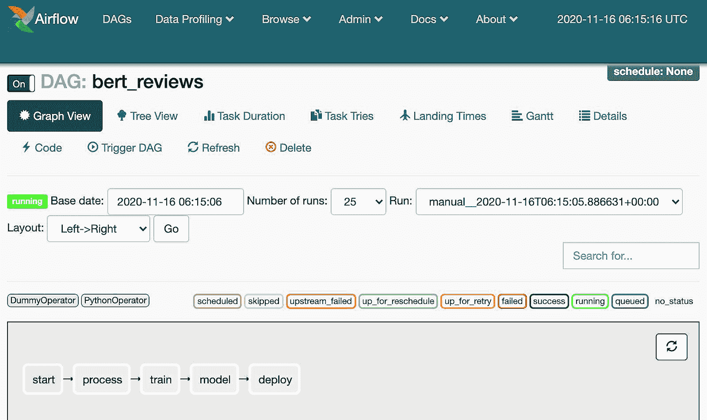

###### 图 10-12\. Amazon MWAA 在 SageMaker 上编排我们的基于 BERT 的管道。

让我们演示如何使用 SageMaker 构建一个 Airflow DAG 来编排我们基于 BERT 的机器学习管道。首先，我们需要定义 Airflow DAG：

```
import airflow
from airflow import DAG

default_args = {
    'owner': 'airflow',
    'provide_context': True
}

dag = DAG('bert_reviews', 
          default_args=default_args,
          schedule_interval='@once')
```

接下来，让我们将原始数据转换为 BERT 特征：

```
from airflow.contrib.operators.sagemaker_processing_operator \
	import SageMakerProcessingOperator
from sagemaker.workflow.airflow import processing_config

process_config = processing_config(estimator=estimator,
                                   inputs=input_data_s3_uri,
                                   outputs=output_data_s3_uri)

process_op = SageMakerProcessingOperator(
    task_id='process',
    config=process_config,
    wait_for_completion=True,
    dag=dag)
```

让我们训练模型：

```
import sagemaker
from sagemaker.tensorflow import TensorFlow

estimator = TensorFlow(
    entry_point='tf_bert_reviews.py',
    source_dir='src',
    role=role,
    instance_count=train_instance_count,
    instance_type=train_instance_type,
    volume_size=train_volume_size,
    use_spot_instances=True,
    # Seconds to wait for spot instances to become available
    max_wait=7200,
    checkpoint_s3_uri=checkpoint_s3_uri,
    py_version='<PYTHON_VERSION>',
    framework_version='<TENSORFLOW_VERSION>',
    hyperparameters={
        'epochs': epochs,
        'learning_rate': learning_rate,
        'epsilon': epsilon,
          ...
    },
    input_mode=input_mode,
    metric_definitions=metrics_definitions,
    rules=rules,
    debugger_hook_config=hook_config,                       
    max_run=7200, # number of seconds
)

from airflow.contrib.operators.sagemaker_training_operator \
	import SageMakerTrainingOperator
from sagemaker.workflow.airflow import training_config

train_config = training_config(estimator=estimator,
                               inputs=training_data_s3_uri)

train_op = SageMakerTrainingOperator(
    task_id='train',
    config=train_config,
    wait_for_completion=True,
    dag=dag)
```

现在让我们部署模型：

```
from airflow.contrib.operators.sagemaker_model_operator \
     import SageMakerModelOperator
from sagemaker.workflow.airflow import model_config

model_op = SageMakerModelOperator(
    task_id='model',
    config=model_config,
    wait_for_completion=True,
    dag=dag)

from airflow.contrib.operators.sagemaker_endpoint_operator \
	import SageMakerEndpointOperator

from sagemaker.workflow.airflow import endpoint_config

deploy_op = SageMakerEndpointOperator(
    task_id='deploy',
    config=endpoint_config,
    wait_for_completion=True,
    dag=dag)
```

让我们定义管道：

```
init.set_downstream(process_op)
processing_op.set_downstream(train_op)
train_op.set_downstream(model_op)
model_op.set_downstream(deploy_op)
```

## MLflow

MLflow 是一个开源项目，提供实验跟踪和多框架支持，包括 Apache Spark，但工作流支持有限。虽然 MLflow 具有一些不错的功能，但它要求我们建立和维护自己的 Amazon EC2 或 EKS 集群。如果我们需要一种轻量级、简单的方法来跟踪实验和运行简单的工作流，MLflow 可能是一个不错的选择。

## TensorFlow Extended

TFX 是一组开源的 Python 库，用于在流水线编排器（如 Kubeflow Pipelines、Apache Airflow 和 MLflow）中使用。从非常高的层次来看，TFX 是一组解决机器学习流水线的每个步骤的 Python 库。虽然大多数在 TensorFlow 社区中使用，TFX 对其他框架（如 scikit-learn）也有有限的支持。如果我们已经在使用 TensorFlow 并希望为我们的流程添加一些结构，TFX 可能是一个不错的选择。然而，要在单个节点之外扩展、调整和管理 TFX，我们应该理解支持 TFX 分布式数据处理的 Apache Beam。Apache Beam 学习曲线略高，但一旦深入研究，就会变得非常直观。图 10-13 展示了 TFX 的不同库和组件。

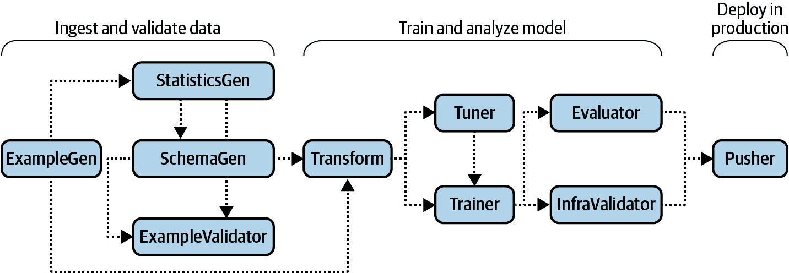

###### 图 10-13\. TFX 库和组件。

# 人在环回路工作流程

尽管 AI 和机器学习服务使我们的生活更加便利，但人类远未过时。事实上，“人在环”概念已经成为许多 AI/ML 工作流的重要基石。在将敏感或受监管的模型推向生产之前，人类提供必要的质量保证。我们还可以通过向人类“众包”数据标注任务来利用人类智慧。

我们描述了两个服务，Amazon A2I 和 SageMaker Ground Truth，展示了人类与 AI 成功协作的案例。Amazon A2I 可让机器学习从业者将人工审核工作流整合到他们的应用程序中。SageMaker Ground Truth 则利用人力工作人员结合主动学习方法来创建准确的训练数据集。

## 使用 Amazon A2I 改善模型准确性

Amazon A2I 是一个完全托管的服务，用于开发人在环回路工作流程，包括用户界面、基于角色的 IAM 访问控制和 S3 数据存储。Amazon A2I 与 Amazon Rekognition（用于内容审核）和 Amazon Textract（用于表单数据提取）等服务集成。图 10-14 展示了一个 Amazon A2I 工作流程，用于审核来自 Amazon Comprehend 的模型预测。我们还可以将 Amazon A2I 与 Amazon SageMaker 和自定义 ML 模型一起使用。

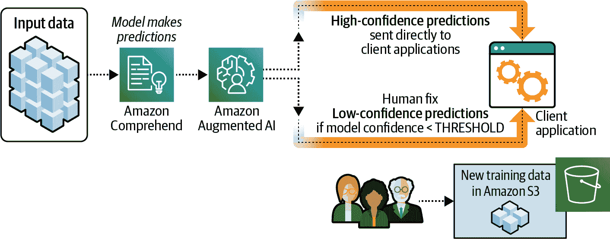

###### 图 10-14\. Amazon 增强型 AI 工作流程，用于审核模型预测。

在这个例子中，Amazon Comprehend 收到预测请求的输入数据。我们设置了一个置信度阈值，用于确定何时需要人工审核。如果模型的预测满足置信度阈值，Amazon A2I 将直接将预测结果发送给客户端应用程序。如果模型无法进行高置信度预测，Amazon A2I 将任务发送给人工审核员。

在我们分类产品评论的示例中，置信度较低的预测可能会错误地将负面评论分类为中性或正面评论。如果我们没有自动修复这些置信度低的预测并改进我们的模型的方法，我们的业务可能会受到负面影响。

我们可能也希望随机审核所有预测的样本，无论置信度高低。这对于做出关键决策的模型可能很重要，例如在医疗保健行业。在这种情况下，我们可能也希望让人类审查和审核置信度高的预测，以确保模型表现正确。

Amazon A2I 整合人工审核者的结果，并将最终的预测响应发送给客户端应用程序。Amazon A2I 还可以将人工审核结果存储在 S3 中，我们可以将其用作新的训练数据。

Amazon A2I 引入了几个新术语：Worker Task Template（工作人员任务模板）、Flow Definition（流程定义）和 Human Loop（人工循环）。Worker Task Template 定义了工作人员的人工任务 UI。此 UI 显示工作人员的输入数据和指令。Flow Definition 定义了人工审核工作流程。该定义包含选择的工作人员，并提供有关如何完成审核任务的信息。Human Loop 表示实际的人工审核工作流程。一旦触发了人工循环，Amazon A2I 将按照流程定义将人工审核任务发送给工作人员。

让我们定义一些产品评论示例，我们将发送给 Amazon Comprehend：

```
sample_reviews = [
                  'I enjoy this product', 
                  'I am unhappy with this product', 
                  'It is okay', 
                  'sometimes it works'
                 ]
```

我们还定义了一个预测置信度阈值为 70%，这对我们的使用案例非常有效。如果我们的模型返回一个较低置信度的预测，亚马逊 A2I 将触发人工循环，我们的工作人员团队将收到一个任务：

```
human_loops_started = []

CONFIDENCE_SCORE_THRESHOLD = 0.70

for sample_review in sample_reviews:
    # Call the Comprehend Custom model 
    response = comprehend.classify_document(
		Text=sample_review, 
		EndpointArn=comprehend_endpoint_arn)

    star_rating = response['Classes'][0]['Name']
    confidence_score = response['Classes'][0]['Score']

    print(f'Processing sample_review: \"{sample_review}\"')

    # Our condition for when we want to engage a human for review
    if (confidence_score < CONFIDENCE_SCORE_THRESHOLD):

        humanLoopName = str(uuid.uuid4())
        inputContent = {
            'initialValue': star_rating,
            'taskObject': sample_review
        }
        start_loop_response = a2i.start_human_loop(
            HumanLoopName=humanLoopName,
            FlowDefinitionArn=flowDefinitionArn,
            HumanLoopInput={
                'InputContent': json.dumps(inputContent)
            }
        )

        human_loops_started.append(humanLoopName)

        print(f'Confidence score of {confidence_score} for star rating of \
		    {star_rating} is less than the threshold of \
		    {CONFIDENCE_SCORE_THRESHOLD}')
        print(f'Confidence score of {confidence_score} for star rating of \
		    {star_rating} is above threshold of \
		    {CONFIDENCE_SCORE_THRESHOLD}')
        print('No human loop created. \n')
```

如果我们运行此代码，我们将看到以下响应：

```
Processing sample_review: "I enjoy this product"
Confidence score of 0.8727718591690063 for star rating of 3 is 
  above threshold of 0.7
No human loop created.
```

```
Processing sample_review: "I am unhappy with this product"
Confidence score of 0.8727718591690063 for star rating of 3 is 
  above threshold of 0.7
*** ==> Starting human loop with name: 72331439-0df9-4190-a42b-3e4048efb0a9  

Processing sample_review: "It is okay"
Confidence score of 0.9679936170578003 for star rating of 4 is 
	above threshold of 0.7
No human loop created. 

Processing sample_review: "sometimes it works"
Confidence score of 0.6361567974090576 for star rating of 3 is 
	less than the threshold of 0.7
*** ==> Starting human loop with name: e7994a4c-57bf-4578-aa27-dc5fb8c11d36
```

我们看到两个预测未达到我们的置信度阈值，并启动了人工循环。当分配的工作人员登录审核系统时，工作人员可以看到提交的审核任务。

借助增强型 AI，我们可以选择公共或私人工作人员。公共工作人员与亚马逊 Mechanical Turk 服务集成，拥有经过亚马逊预筛选的成千上万名人类标注者。我们还可以使用列在 AWS Marketplace 上的第三方经过预筛选的工作人员提供者。或者我们可以创建私人工作人员，与同事或员工一起工作。

指导指令是“将评价分类为介于 1 星（最差）和 5 星（最佳）之间的星级”。工作人员看到输入数据“有时候有效”，可能会将其分类为 3 星评级。请注意，我们可以将单个任务分配给多个人工审阅者，以减少人为偏见。Amazon A2I 通过加权审阅者评分来整合每个任务的多个回应。一旦所有审阅任务完成，UI 会从工作人员的界面中清除该任务。我们可以在 S3 中使用这些新标记的数据来构建用于训练和改进我们的 Comprehend Custom 模型的连续流水线，如图 10-15 所示。

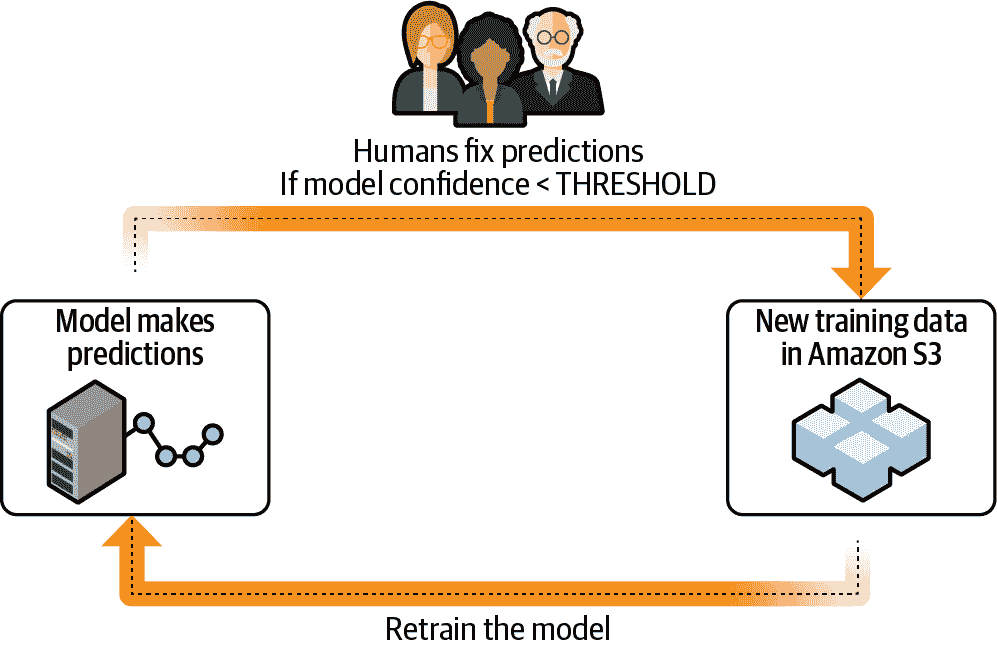

###### 图 10-15\. 用于改进模型预测的连续训练流水线。

我们的模型变得越来越精确，发送给我们工作人员的评审越少。这个概念也被称为“主动学习”，在 SageMaker Ground Truth 中实现。

## 使用 SageMaker Ground Truth 的主动学习反馈循环

主动学习始于人类标记工作流程，然后在看到足够样本后转向自动标记。主动学习反馈循环用于持续重新训练模型并提升未来标签预测的置信度。主动学习有助于通过处理高置信度预测来扩展数据标记过程，并释放工作力量专注于需要专业人工智能处理的低置信度预测。

Amazon SageMaker Ground Truth 是用于自动数据标记的增强型 AI 工作流实现。随着数据量的增加，SageMaker Ground Truth 将人类审阅工作流程与主动学习结合起来。随着人类工作力量对越来越多的数据进行标记，SageMaker Ground Truth 积极训练模型以加入工作力量，并自动标记到达的新数据。如果模型信心不足，则将数据发送给人类工作力量进行审阅。图 10-16 说明了 SageMaker Ground Truth 的工作流程以及从手动标记到自动标记的过渡。

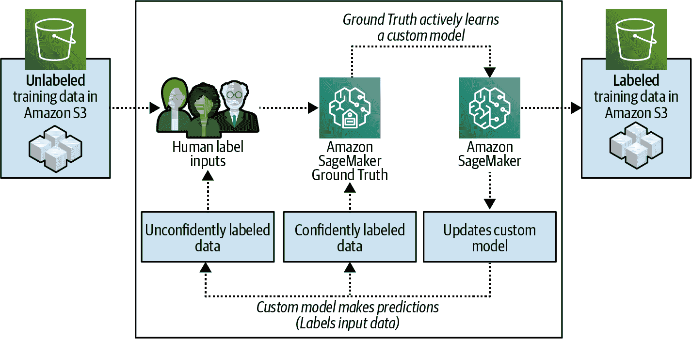

###### 图 10-16\. SageMaker Ground Truth 使用主动学习增强人类数据标记。

SageMaker Ground Truth 提供预构建的标记工作流和任务模板来处理图像、文本和视频。我们也可以定义一个自定义工作流。在下面的示例中，我们将为图像创建一个主动学习流水线。SageMaker Ground Truth 在背后积极创建一个新的对象检测模型，随着看到越来越多的人工标签。SageMaker Ground Truth 使用这个新模型来自动检测图像中的对象，并且随着精度的增加。这允许人类专注于标记更难分类的图像。图 10-17 展示了 SageMaker Ground Truth 中用于检测和标记每个图像中对象的示例工作人员界面。

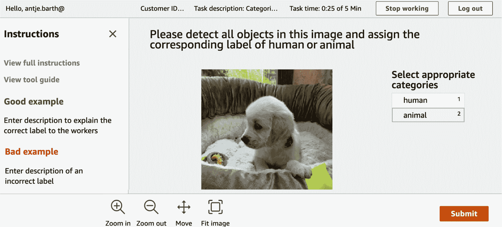

###### 图 10-17\. SageMaker Ground Truth 中的示例工作人员界面。

# 减少成本，提高性能

大多数管道编排引擎支持某种类型的步骤缓存，以避免重新执行未更改的步骤。这称为管道的“步骤缓存”。因为管道通常基于其他原语（如 SageMaker 训练作业），我们将强调 Spot 实例成本节省对我们的 SageMaker 管道使用的 SageMaker 训练作业的影响。

## 缓存管道步骤

在某些情况下，我们可以重用先前成功的管道步骤的结果，并避免再次运行该步骤。SageMaker Pipelines 通过检查相同输入工件和参数的先前成功步骤执行来支持步骤缓存。其他编排器也支持管道步骤缓存，包括 Kubeflow Pipelines。

要在 SageMaker Pipelines 中启用步骤缓存，我们在每个步骤创建时提供缓存配置，如下所示适用于特征工程`ProcessingStep`。如果 SageMaker Pipelines 检测到原始数据集和处理参数未发生变化，它将跳过步骤执行，重用生成的 BERT 嵌入，并继续管道的执行：

```
from sagemaker.workflow.steps import CacheConfig

cache_config_prepare = CacheConfig(
    enable_caching=True, 
    expire_after=<EXPIRE_TIME>
)

experiment_config_prepare = {
    'ExperimentName': experiment_name,
    'TrialName': trial_name,
    'TrialComponentDisplayName': 'prepare'
}

processing_step = ProcessingStep(
    name='Processing', 
    code='preprocess-scikit-text-to-bert-feature-store.py',
    processor=processor,
    inputs=processing_inputs,
    outputs=processing_outputs,
    job_arguments=[...],
    experiment_config=experiment_config_prepare,
    cache_config=cache_config_prepare
)
```

## 使用成本较低的 Spot 实例

SageMaker Pipelines 基于像训练作业这样的 SageMaker 原语构建，支持 Spot 实例。我们演示了如何在 SageMaker 训练作业中启用 Spot 实例，在第七章中展示了如何定义我们的估算器时也要启用检查点。

```
checkpoint_s3_uri = 's3://<BUCKET>/<CHECKPOINT_PREFIX>/'

estimator = TensorFlow(
    entry_point='tf_bert_reviews.py',
    source_dir='src',
    use_spot_instances=True,
    checkpoint_s3_uri=checkpoint_s3_uri,
    ...
)

training_step = TrainingStep(
    name='Train',
    estimator=estimator,
    ...
)
```

# 摘要

在本章中，我们描述了如何通过有效的机器学习管道提高模型质量，并释放人力资源专注于更高级别的任务。我们确定了有效机器学习管道的关键组成部分，如数据摄取时的数据质量检查和模型训练后的模型验证。我们演示了如何使用 SageMaker Pipelines 和其他各种选项（包括 AWS Step Functions、Kubeflow Pipelines、Apache Airflow、MLflow 和 TFX）来编排管道。

我们展示了如何使用 SageMaker Pipelines 实现管道自动化。我们讨论了基于事件的触发器，如代码提交和新数据到达 S3 以启动管道执行。我们学习了如何设置基于时间的调度和统计触发器来自动运行管道执行。我们展示了如何使用人在环路工作流自动化数据标记，如何使用 Amazon 增强 AI 提高模型准确性，以及如何使用 SageMaker Ground Truth 实现主动学习反馈循环。

通过掌握如何创建可重复和自动化的流水线，我们现在已经完全准备好将我们的数据科学项目从实验阶段转移到生产阶段。通过自动化模型开发和模型部署工作流中的所有步骤，我们提高了生产力并确保了可重复性。通过实施 GitOps 实践来强化一致性和质量，我们提升了可靠性。通过使用 SageMaker 实验追踪所有流水线步骤和执行情况以及 ML Lineage 追踪输入/输出工件，我们实现了可审计性。我们还可以通过自动检测数据集、模型、预测和解释的统计属性变化来维护高质量的模型。

在第十一章中，我们将我们的分析和机器学习扩展到流数据。我们将计算实时摘要统计信息，检测异常，并在连续的产品评论数据流上训练模型。
