# 第十一章：流式分析与机器学习

在前面的章节中，我们假设所有数据都在一个集中的静态位置可用，比如我们基于 S3 的数据湖。现实世界的数据是从全球多个不同来源同时持续流入的。我们需要对数据流执行机器学习，用于欺诈预防和异常检测等用例，这些用例中批处理的延迟是不可接受的。我们可能还希望对实时数据流进行持续分析，以获得竞争优势并缩短业务洞察的时间。

在本章中，我们从客户评论的训练数据集转向了现实场景。我们将专注于分析我们从所有可用的在线渠道收集的产品评论消息的连续流。客户对产品的反馈无处不在，包括社交媒体渠道、合作伙伴网站和客户支持系统。我们需要尽快捕获这些有价值的客户对我们产品的情感，以便及时发现趋势并迅速做出反应。

使用流式分析和机器学习，我们能够分析连续的数据流，例如应用程序日志、社交媒体信息流、电子商务交易、客户支持票务和产品评论。例如，我们可能希望通过分析实时产品评论来检测质量问题。

首先，我们将分析客户的情感，以便识别哪些客户可能需要高优先级的关注。接下来，我们将对传入的评论消息进行连续流分析，以捕获每个产品类别的平均情感。我们将在业务线（LOB）所有者的度量仪表板中可视化连续的平均情感。LOB 所有者现在可以快速检测情感趋势并采取行动。我们还将计算传入消息的异常分数，以检测数据架构或数据值中的异常。如果异常分数上升，我们将警告负责的应用程序开发人员来调查根本原因。作为最后一个指标，我们还将计算接收消息的连续近似计数。数字营销团队可以使用这些在线消息数量来衡量社交媒体活动的效果。

本章提供了描述性分析（汇总统计）和使用我们在前几章中训练、调优和部署的基于 BERT 的 SageMaker 模型的预测性分析示例。

# 在线学习与离线学习

在 第九章 中，我们演示了如何通过实时奖励数据持续训练强化学习模型，以实现几乎实时的“在线学习”，使用的是来自示例客户评论应用程序的数据。在线学习，或增量学习，是机器学习的一个小子集，有些难以适应传统离线算法以有效地进行在线训练。在线学习将新数据整合到模型中，无需使用完整数据集进行完全重新训练。

总的来说，像线性回归、逻辑回归和 K-Means 聚类这样的线性算法更容易通过实时数据进行训练，因为它们背后的数学比较简单。Scikit-learn 支持在某些线性算法上使用`partial_fit()`函数进行增量学习。Apache Spark 支持线性回归和 K-Means 聚类的流式版本。

深度学习算法也能够进行在线学习，因为它们不断地使用新数据的小批量进行学习权重的微调。实际上，每当我们从现有模型检查点或预训练模型（而不是随机初始权重）中训练深度学习模型时，我们本质上是在进行在线增量训练，尽管数据通常是从磁盘而不是流中提供给算法的。

# 流处理应用程序

流处理应用程序数据与传统应用程序数据不同，传统应用程序数据通常由 REST API 和关系型数据库处理。大数据的 3V 特征也适用于流数据：数据量、速度和多样性。这些数据通常是小的，可能具有不同的结构，并且以大量的方式传入——比典型的应用程序数据更快。REST API 的开销和关系数据库的引用完整性通常无法满足高容量和高速率流处理应用程序的性能要求，这些应用程序可能消费半结构化或非结构化数据。

分布式流处理系统如 Apache Kafka 和 Amazon Kinesis 需要多个实例通过网络通信来扩展并共享处理高容量和高速率流的负载。由于多个实例需要通过网络通信，这些实例有时会因网络故障、硬件故障和其他意外情况而导致处理数据的速度不同步。因此，分布式流处理系统无法保证从流中消费数据的顺序与放入流中的顺序相同，这通常被称为“全序”。

流应用程序需要调整以适应这种缺乏总排序保证并维护自己的排序概念。虽然本章节不会详细介绍总排序保证，但在构建流应用程序时需要考虑这一点。一些分布式流系统允许我们启用总排序，但总排序会对性能产生负面影响，并可能抵消构建流应用程序的好处。

流技术为我们提供了实时收集、处理和分析数据流的工具。AWS 提供了多种流技术选项，包括 Amazon MSK 和 Kinesis 服务。通过 Kinesis 数据输送管道，我们可以持续准备和加载数据到我们选择的目的地。使用 Kinesis 数据分析，我们可以使用 SQL 或 Apache Flink 应用程序在数据到达时处理和分析数据。Apache Flink 使用 Scala 和 Java 编写，提供了包括减少停机时间的检查点和增加性能的并行执行在内的高级流分析功能。

使用 Kinesis 数据流，我们可以管理自定义应用程序的数据流摄取。而使用 Kinesis 视频流，我们可以捕获和存储视频流用于分析。AWS Glue 数据目录帮助我们定义和强制结构化流数据的模式。我们可以使用像 Apache Avro 这样的自描述文件格式与 AWS Glue 数据目录、Kafka 和 Kinesis 一起维护整个流应用程序中的结构化数据。

# 流数据的窗口查询

描述性流分析通常受窗口限制以处理——无论是时间还是输入记录数。例如，我们可以指定一个 30 秒的窗口或 1,000 条输入记录。

如果我们实现基于时间的窗口，我们的输入记录需要包含一个时间戳列。Kinesis 数据分析会自动添加一个名为 `ROWTIME` 的时间戳列，我们可以在 SQL 查询中使用它来定义基于时间的窗口。

Kinesis 数据分析支持三种不同类型的窗口：Stagger 窗口、Tumbling 窗口和 Sliding 窗口。稍后，我们将使用窗口查询来实现使用产品评论数据的流式分析和机器学习用例。

## Stagger 窗口

Stagger 窗口是基于时间的窗口，随着新数据的到达而打开，是推荐的聚合数据的方式，因为它们减少了延迟或乱序数据。因此，如果我们需要分析在不一致时间到达但应该一起聚合的数据组，Stagger 窗口是一个很好的选择。我们指定一个分区键来标识哪些记录应该聚合在一起。当匹配分区键的第一个事件到达时，Stagger 窗口将打开。为了关闭窗口，我们指定一个窗口年龄，从窗口打开时开始计算。我们使用 Kinesis 特定的 SQL 子句 `WINDOWED BY` 来定义 Stagger 窗口。Stagger 窗口以分区键和窗口长度作为参数定义：

```
...
FROM <stream-name>
WHERE <... optional statements...>
WINDOWED BY STAGGER(
    PARTITION BY <partition key(s)>
    RANGE INTERVAL '1' MINUTE
);
```

分区键可以是产品评论消息出现的时间，以及产品类别：

```
PARTITION BY FLOOR(message_time TO MINUTE), product_category
```

结果的错开窗口显示在图 11-1 中。

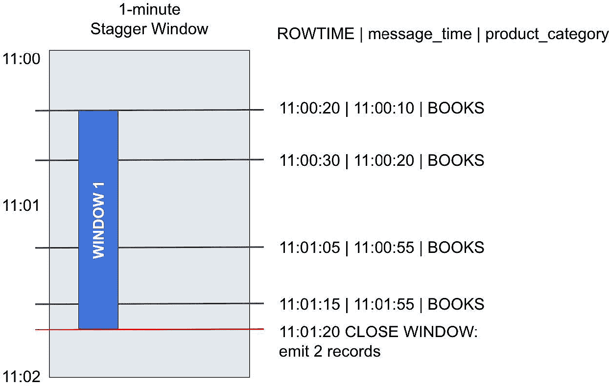

###### 图 11-1\. 错开窗口。

在这个示例中，我们看到四个数据记录到达：

| ROWTIME | message_time | product_category |
| --- | --- | --- |
| 11:00:20 | 11:00:10 | BOOKS |
| 11:00:30 | 11:00:20 | BOOKS |
| 11:01:05 | 11:00:55 | BOOKS |
| 11:01:15 | 11:01:05 | BOOKS |

假设我们正在计算 SQL 查询中每个产品类别的数据记录数。一分钟的错开窗口将聚合记录如下：

| ROWTIME | message_time | product_category | count |
| --- | --- | --- | --- |
| 11:01:20 | 11:00:00 | BOOKS | 3 |
| 11:02:15 | 11:01:00 | BOOKS | 1 |

我们的错开窗口正在按一分钟间隔进行分组。当我们接收到每个产品类别的第一条消息时，窗口就会打开。对于`BOOKS`，这发生在`ROWTIME`为 11:00:20 时。一分钟窗口在 11:01:20 到期。在此时，根据`ROWTIME`和`message_time`落入此一分钟窗口内的结果将被发出。例如，这个示例中的计数将为 3。第四个数据记录的`message_time`在一分钟窗口外，将单独聚合。这是因为`message_time`在分区键中指定。例如，第一个窗口中`message_time`的分区键是 11:00。

## 滚动窗口

滚动窗口在非重叠的窗口中处理流式数据记录，最适合于在规则间隔打开和关闭的不同基于时间的窗口。在这里，每个数据记录属于特定的窗口，并且仅处理一次，如图 11-2 所示。

使用`GROUP BY` SQL 子句的聚合查询在滚动窗口中处理行：

```
SELECT ...
FROM <stream-name>
GROUP BY <column>,
    STEP(<stream-name>.ROWTIME BY INTERVAL '60' SECOND);
```

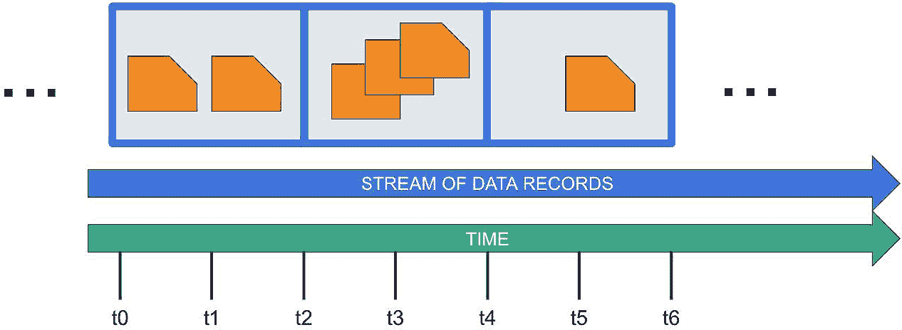

###### 图 11-2\. 滚动窗口。

在这个示例中，滚动窗口是基于时间的，为一分钟窗口。我们按`ROWTIME`对记录进行分组。`STEP`函数将`ROWTIME`向下舍入到最接近的分钟。请注意，`STEP`可以将值向下舍入到任意间隔，而`FLOOR`函数只能将时间值向下舍入到整数时间单位，如小时、分钟或秒。

## 滑动窗口

滑动窗口连续使用固定的间隔和固定的大小进行数据聚合。它们随时间连续滑动。我们可以使用显式的`WINDOW`子句而不是`GROUP BY`子句来创建滑动窗口，间隔可以是基于时间或行。滑动窗口可以重叠，数据记录可以属于多个窗口。如果数据记录属于多个窗口，则在每个窗口中处理记录，如图 11-3 所示。

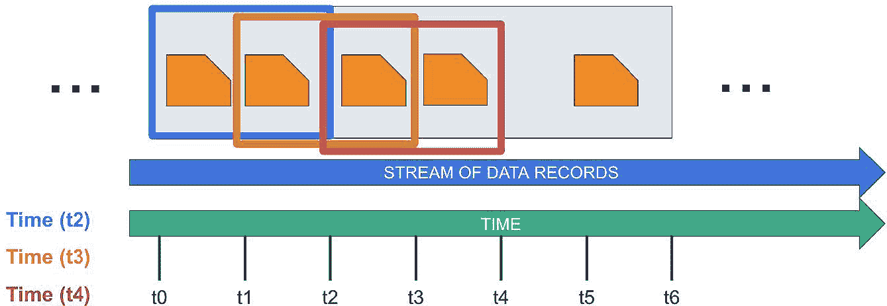

###### 图 11-3\. 滑动窗口。

下面的示例创建一个一分钟的滑动窗口：

```
SELECT ...
FROM <stream-name>
WINDOW W1 AS (
   PARTITION BY <column>
   RANGE INTERVAL '1' MINUTE PRECEDING);
```

我们还可以根据行数定义滑动窗口：

```
SELECT ...
FROM <stream-name>
WINDOW
    last2rows AS (PARTITION BY <column> ROWS 2 PRECEDING),
    last10rows AS (PARTITION BY <column> ROWS 10 PRECEDING);
```

在这个例子中，我们创建了一个 2 行滑动窗口和一个 10 行滑动窗口。2 行滑动窗口将重叠在 10 行滑动窗口上。如果我们计算不同大小记录批次的平均指标，这种情况非常有用。

现在我们对如何处理窗口查询有了更好的理解，让我们使用 AWS 实现我们的在线产品评论示例。

# 在 AWS 上的流式分析和机器学习

我们将使用 Kinesis 服务来实现我们的在线产品评论示例。为简单起见，假设流媒体团队已经解析了社交媒体反馈消息，并为每条消息附加了唯一的评论 ID 和相关的产品类别。

我们从这些消息的摄入开始。我们设置了 Kinesis Data Firehose 传递流，接收消息并将其连续传送到 S3 位置，如 图 11-4 中的摄入和存储消息列所示。

我们还希望通过客户情感来丰富消息。我们可以利用前几章中调优过的基于 BERT 的模型，将消息分类为星级评分，如 图 11-4 中的检测客户情感列所示。星级评分将作为情感的代理指标。我们可以将预测的星级评分 4 到 5 映射为积极情感，星级评分 3 映射为中性情感，星级评分 1 到 2 映射为负面情感。

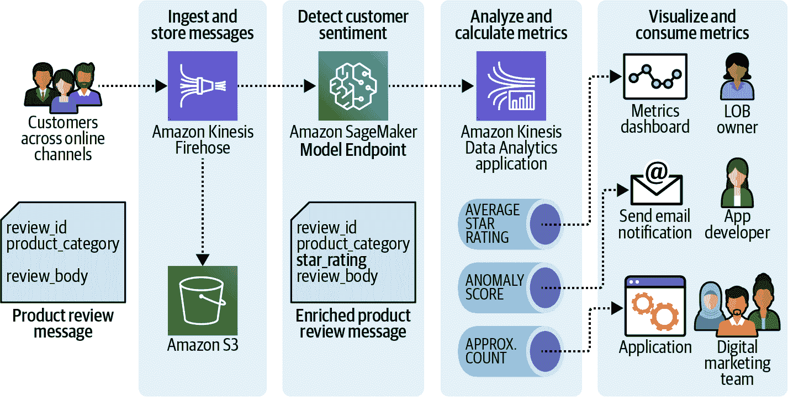

###### 图 11-4\. 在线产品评论消息的流数据架构。

接下来，我们要分析我们的消息。我们设置了 Kinesis 数据分析来处理我们的情感丰富消息，如 图 11-4 中的分析和计算指标列所示。Kinesis 数据分析使我们能够在流数据上运行 SQL 查询。Kinesis 数据分析 SQL 基于 ANSI 2008 SQL 标准，具有处理流数据的扩展功能。

我们定义一个 SQL 查询，持续计算平均星级评分以反映情感的变化，并将结果推送到实时指标仪表板，如 图 11-4 中的可视化和消费指标列所示。我们定义另一个 SQL 查询，持续根据消息数据计算异常分数，以捕获任何意外的模式或数据值。例如，我们突然接收到一个星级评分为 100，这是不存在的。解析消息的应用程序可能存在错误。在这种情况下，我们希望通知负责团队调查可能的根本原因并修复问题。在第三个 SQL 查询中，我们持续计算可能被数字营销团队的应用程序消耗的消息的近似计数。

SQL 查询持续运行在我们的入站产品评审消息数据流上。我们可以通过基于时间或行的窗口定义流数据记录的小批处理。当计算每批次的平均值和近似计数时，我们可以将 SQL 查询限制为仅针对这些小批处理（窗口）的流数据记录。这种类型的 SQL 查询称为*窗口查询*。

# 使用 Amazon Kinesis、AWS Lambda 和 Amazon SageMaker 对实时产品评审进行分类

我们设置了一个 Kinesis Data Firehose 传送流，用于接收和转换来自客户的实时消息，如图 11-5 所示。

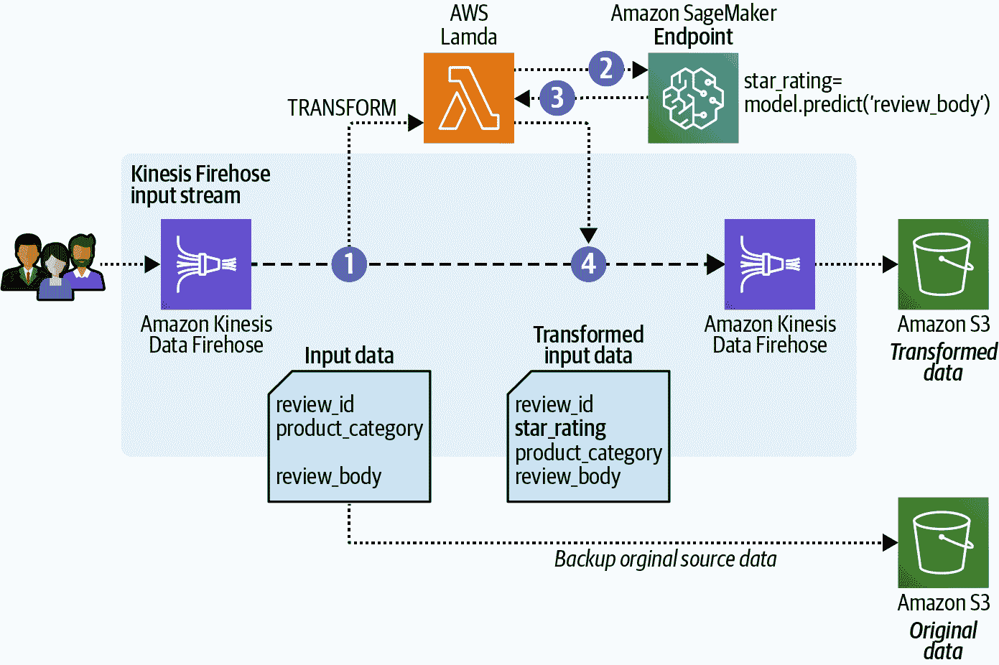

###### 图 11-5\. 使用 Kinesis Data Firehose 接收和转换数据记录。

1.  我们接收实时输入数据并预测星级评分，以推断客户情感。这种情感可以用来快速识别可能需要我们高优先级关注的客户。

1.  Kinesis Firehose 允许我们通过 Lambda 函数来转换我们的数据记录。我们构建了一个 Lambda 函数，接收 Firehose 数据记录，并将评审消息发送到托管我们精调的基于 BERT 模型的 SageMaker Endpoint。

1.  模型预测`star_rating`，我们的 Lambda 函数将其添加到原始数据记录中；然后函数将新记录返回给我们的 Firehose 传送流。

1.  Firehose 传送流然后将转换后的数据记录传送到我们指定的一个 S3 存储桶。Kinesis Firehose 还允许我们备份原始数据记录。我们可以将这些备份数据记录传送到另一个 S3 存储桶。

# 使用 Amazon Kinesis Data Firehose 实现流数据摄取

Kinesis Data Firehose 是一个完全托管的服务，用于将实时流数据传送到目的地，如 Amazon S3、Redshift、Elasticsearch 或任何自定义 HTTP 终端。

作为数据源，我们可以选择`DirectPut`或 Kinesis 数据流。使用`DirectPut`，我们可以直接将数据发送到传送流，或从 AWS IoT、CloudWatch Logs 或 CloudWatch Events 检索数据。在我们的示例中，我们将选择`DirectPut`。

## 创建 Lambda 函数以调用 SageMaker Endpoint

在创建 Kinesis Firehose 传送流之前，我们需要创建 Lambda 函数以调用我们的 SageMaker Endpoint。Lambda 函数通过提供一种简单的机制来动态增加或减少基于 Python 的 Lambda 函数的数量（每个都运行其自己的 Python 解释器），来帮助扩展我们的 Python 代码。这类似于在单个实例上通过增加更多进程和解释器来扩展 Python。Lambda 函数的这种自动扩展功能类似于我们在第 9 章中展示的 SageMaker Endpoint 的自动扩展功能。

我们创建一个 Lambda 函数，从 Kinesis Firehose 传递流接收数据记录。除了 Kinesis 元数据如`recordID`外，每个数据记录包括`review_id`、`product_category`和实际的`review_body`。我们解析`review_body`并发送到指定的 SageMaker Endpoint。我们接收预测结果，将其添加到我们的数据记录中，并将带有原始`recordID`的修改后数据记录返回给 Kinesis 数据 Firehose。

以下是我们 Lambda 函数的 Python 代码摘录，它在推送新数据到 Kinesis 流时调用 SageMaker Endpoint：

```
ENDPOINT_NAME = os.environ['ENDPOINT_NAME']
runtime = boto3.client('runtime.sagemaker')

def lambda_handler(event, context):
outputs = []

for record in event['records']:
		  ...
		  inputs = [
		    {"features": [review_body]}
          ]       

          response = runtime.invoke_endpoint(
               EndpointName=ENDPOINT_NAME,
               ContentType='application/jsonlines',    
               Accept='application/jsonlines',    
               Body=json.dumps(inputs).encode('utf-8')
          )
          ...

          output_record = {
                'recordId': record['recordId'],
                'result': 'Ok',
                'data': ...
            }
            outputs.append(output_record)

    return {'records': outputs}
```

我们可以直接在 AWS 控制台中创建 Lambda 函数，或者使用 Python SDK 进行编程，如下所示：

```
lam = boto3.Session().client(service_name='lambda',
                                 region_name=region)

response = lam.create_function(
    FunctionName=<FUNCTION_NAME>,
    Runtime='<PYTHON_VERSION>',
    Role=<IAM_ROLE>
    Handler='<FUNCTION_NAME>.lambda_handler',
    Code={
        'ZipFile': code
    },
    Description='InvokeQuery SageMaker Endpoint.',
    Timeout=300,
    MemorySize=128,
    Publish=True
)
```

我们可以使用引用 SageMaker 模型端点的环境变量更新 Lambda 函数以调用：

```
response = lam.update_function_configuration(
            FunctionName=<FUNCTION_NAME>,
            Environment={
                'Variables': {
                    'ENDPOINT_NAME': <ENDPOINT_NAME>
                }
            }
        )
```

现在我们可以创建我们的 Kinesis 数据 Firehose 传递流。

## 创建 Kinesis 数据 Firehose 传递流

我们将传递流类型配置为`DirectPut`，这样我们可以直接将产品评价放在流上。此外，为了存储流数据记录，我们定义了指向 S3 存储桶的`ExtendedS3DestinationConfiguration`。我们在`ProcessingConfiguration`中添加调用 SageMaker Endpoint 并将预测星级评分添加到我们数据中的 Lambda 函数。我们在`S3BackupConfiguration`中指定另一个 S3 存储桶，用于备份转换前的原始产品评价。

这是用于通过编程方式创建具有上述所有配置的 Kinesis 数据 Firehose 传递流的代码：

```
firehose = boto3.Session().client(service_name='firehose', region_name=region)

response = firehose.create_delivery_stream(
    DeliveryStreamName=<FIREHOSE_NAME>,
    DeliveryStreamType='DirectPut',
    ExtendedS3DestinationConfiguration={
        'RoleARN': <KINESIS_ROLE_ARN>,
        'BucketARN': <S3_BUCKET_ARN>,
        'Prefix': 'kinesis-data-firehose/',  
        ...
        'ProcessingConfiguration': {
            'Enabled': True,
            'Processors': [{
                'Type': 'Lambda',
                'Parameters': [
                    {
                        'ParameterName': 'LambdaArn',
                        'ParameterValue': '<LAMBDA_ARN>:$LATEST'
                    },
                ...
                ]
            }]
        },
        'S3BackupMode': 'Enabled',
        'S3BackupConfiguration': {
            'RoleARN': <KINESIS_ROLE_ARN>,
            'BucketARN': <BACKUP_S3_BUCKET_ARN>,
            'Prefix': 'kinesis-data-firehose-source-record/',  
            ...
        },
        ...
    }
)
```

我们需要等待几秒钟，直到传递流变为`active`状态。然后，我们可以将一些实时消息放在我们的 Kinesis 数据 Firehose 传递流上，并查看结果。

## 将消息放在流上

为了模拟我们连续的在线产品评价消息流，我们可以从亚马逊客户评价数据集中读取我们的样本客户评价，并将包含`review_id`、`product_category`和`review_body`的消息发送到 Kinesis 数据 Firehose，如下所示：

```
import boto3
import csv
import pandas as pd

firehose = boto3.Session().client(service_name='firehose', region_name=region)

# Read in sample reviews
df = 
 pd.read_csv('./data/amazon_reviews_us_Digital_Software_v1_00.tsv.gz',
               delimiter='\t',
               quoting=csv.QUOTE_NONE,
               compression='gzip')

# Generate 500 online messages
step = 1
for start_idx in range(0, 500, step):
    end_idx = start_idx + step

    # Create message (review_id, product_category, review_body)
    df_messages = df[['review_id',
                      'product_category',
                      'review_body']][start_idx:end_idx]

    reviews_tsv = df_messages.to_csv(sep='\t',
                                     header=None,
                                     index=False)

    # Put messages on Firehose    
    response = firehose.put_record(        
        Record={
            'Data': reviews_tsv.encode('utf-8')
        },
        DeliveryStreamName=<FIREHOSE_NAME>
    )
```

一旦消息到达，Firehose 调用`InvokeSageMakerEndpointFromKinesis`，指定的 Lambda 函数，以转换数据。我们可以看到原始消息格式，其中包含`review_id`、`product_category`和`review_body`：

```
['R1066MVAFC477L', 'Digital_Software', "It's good"]
```

我们的 Lambda 函数解析`review_body`，`"It's good"`，将`review_body`发送到 SageMaker Endpoint，接收端点响应，并解码 5 的`star_rating`预测结果。

在最后一步中，Lambda 函数将星级评分添加到原始数据记录中，并将其返回给 Kinesis 数据 Firehose：

```
R1066MVAFC477L       5    Digital_Software          It's good
```

我们还可以检查 Kinesis 数据 Firehose 指定的 S3 存储桶目的地。在这里，我们应该找到转换后的数据记录：

而且，确实，在*s3://<bucket>/kinesis-data-firehose/<year>/<month>/<day>/<hour>*我们找到了一个包含以下（缩短的）输出的文件。

```
...
R2EI7QLPK4LF7U 5     Digital_Software     So far so good
R1W5OMFK1Q3I3O 3     Digital_Software     Needs a little more work.....
RPZWSYWRP92GI  1     Digital_Software     Please cancel.
R2WQWM04XHD9US 5     Digital_Software     Works as Expected!
...
```

这些是我们转换后的数据记录。我们还配置了 Firehose 来备份我们的源数据记录。类似地，我们可以检查为备份指定的 S3 存储桶：

*s3://<bucket>/kinesis-data-firehose-source-record/<year>/<month>/<day>/<hour>*

我们找到另一个与此类似的源记录文件：

```
...
R2EI7QLPK4LF7U Digital_Software      So far so good
R1W5OMFK1Q3I3O Digital_Software      Needs a little more work.....
RPZWSYWRP92GI  Digital_Software      Please cancel.
R2WQWM04XHD9US Digital_Software      Works as Expected!
...
```

请注意缺失的星级评分。这里缺少星级评分，因为这是最初收到的产品评论消息。这些数据表示我们在调用基于 BERT 模型的 Lambda 函数（用于预测并添加星级评分到流数据记录中）之前的产品评论消息。我们保留这些原始数据作为备份。

这表明使用 Kinesis 数据 Firehose 进行流数据摄取和数据转换是有效的。现在让我们进入下一步。

# 使用流分析总结实时产品评论

我们想要持续计算的第一个业务指标是每个产品类别的平均情感值。我们可以将结果推送到实时指标仪表板。在我们的示例实现中，我们将平均星级评分（作为情感的代理指标）发布到亚马逊 CloudWatch。业务部门现在可以快速检测情感趋势并采取行动。

另一个我们持续计算的业务指标是基于消息数据计算的异常分数，以捕捉任何意外的模式或数据值。在应用程序错误的情况下，我们希望通知负责团队调查可能的根本原因并快速修复。在我们的实现中，我们将使用亚马逊简单通知服务（Amazon SNS）通过电子邮件发送计算的异常分数。亚马逊 SNS 是一个完全托管的服务，用于发送短信、电子邮件和移动推送通知。

作为最后一个指标，我们持续计算产品评论消息的近似计数，这些计数可以供数字营销团队使用，以评估和引导在线活动。在我们的实施中，我们将近似计数作为连续记录流传送到 Kinesis 数据流。数字营销团队可以开发一个自定义应用程序，从 Kinesis 数据流中读取数据记录并根据需要处理记录。

图 11-6 展示了我们演进的流数据用例实现。

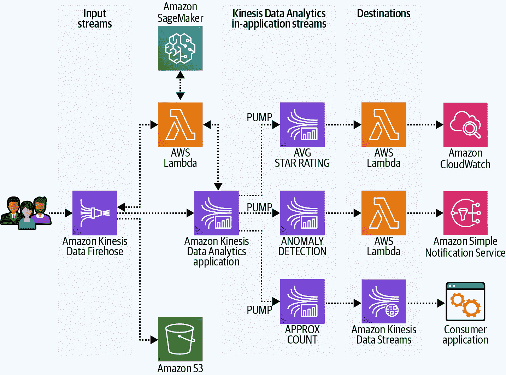

###### 图 11-6\. 使用 Kinesis 数据分析分析连续流的产品评论消息。

# 设置亚马逊 Kinesis 数据分析

我们将建立一个 Kinesis 数据分析应用程序来分析我们的产品评论消息。Kinesis 数据分析使我们能够在流数据上运行 SQL 查询。

我们将使用 Kinesis 数据 Firehose 交付流作为 Kinesis 数据分析应用程序的输入源。然后我们将开发一个 Kinesis 数据分析应用程序来执行 SQL 查询，计算传入消息的平均情感、异常分数和近似计数。

与 Kinesis Firehose 类似，我们有选项对传入的流数据进行预处理。我们将重用现有的 Lambda 函数来调用 SageMaker 端点并接收我们传入消息的星级评分。星级评分将再次作为我们的情感代理度量。

###### 注意

为什么不重用已经包含星级评分的来自 Kinesis Firehose 的转换数据记录？这些转换后的记录直接传送到 S3 目标存储桶。我们在 Kinesis Data Analytics 中只接收来自 Firehose 传送流的源数据记录。

Kinesis 数据分析支持将分析结果发送到各种目的地。我们将设置两个 Lambda 函数和一个 Kinesis 数据流作为目的地。我们可以利用 Lambda 函数与 Amazon CloudWatch 和 Amazon SNS 集成。让我们从目的地开始实现这种架构所需的组件。

## 创建一个 Kinesis 数据流以将数据传送到自定义应用程序

Kinesis 数据流用于实时摄取大量数据、存储数据并使数据可用于消费者应用程序。Kinesis 数据流存储的数据单元是数据记录。数据流代表一组数据记录。数据流中的数据记录分布在分片中。每个分片都有数据流中的数据记录序列。创建数据流时，需要指定数据流的分片数量。数据流的总容量是其分片容量之和。根据需要可以增加或减少数据流中的分片数量。

在流数据的上下文中，我们经常谈论生产者和消费者。生产者是生成数据的应用程序或服务。消费者是接收流数据以进一步处理的应用程序或服务。图 11-7 显示了 Kinesis 数据流的高级架构。

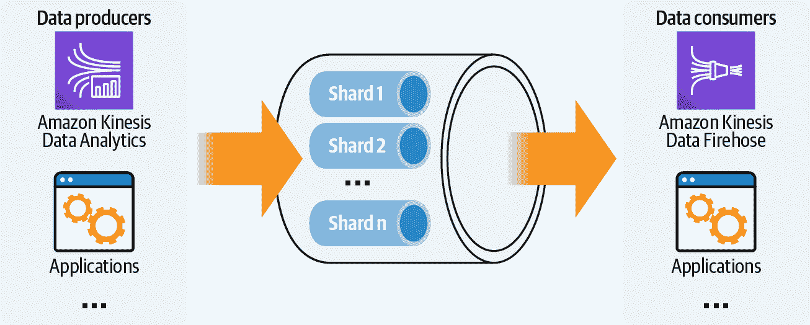

###### 图 11-7\. Kinesis 数据流架构由数据生产者和消费者组成，数据记录分布在分片中。

注意，在 Kinesis 数据流中数据只会暂时存储。Kinesis 数据流的默认数据保留期目前限制为 24 小时。但是，我们可以增加数据保留期长达一年以实现长期保留。更长的保留期可以帮助满足合规要求，无需将数据移动到像 S3 这样的长期存储中。较长的保留期还有助于在背压场景下，即使在意外数据推送量增加时，消费者无法跟上生产者的情况下，Kinesis 也可以存储流数据。在这种情况下，Kinesis 将存储流式数据，直到消费者扩展以处理高峰量，或者数据量减少并且消费者可以追赶上来。较长的保留期还允许我们使用从 Kinesis 直接获取的在线数据更快地训练模型，或者将在线 Kinesis 数据与 S3 中的离线数据结合使用。

在我们的示例中，Kinesis 数据流将接收来自我们消息近似计数的结果，因此生产者是 Kinesis 数据分析应用程序。消费者可以是任何自定义应用程序。在我们的示例中，我们建议使用来自数字营销团队的应用程序。图 11-8 突出了我们即将实施的架构当前步骤。

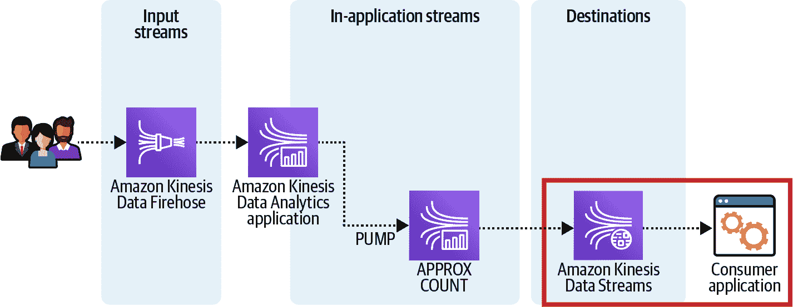

###### 图 11-8\. Kinesis 数据流用作 Kinesis 数据分析的近似计数目标。

这是创建 Kinesis 数据流的代码：

```
kinesis = boto3.Session().client(service_name='kinesis', 
                                 region_name=region)

kinesis.create_stream(
        StreamName=<STREAM_NAME>, 
        ShardCount=<SHARD_COUNT>
)
```

我们需要等待几分钟，让 Kinesis 数据流变为`active`。

我们可以使用以下代码编程地检查流的状态，并等待流变为`active`：

```
import time

status = ''
while status != 'ACTIVE':    
    r = kinesis.describe_stream(StreamName=<STREAM_NAME>)
    description = r.get('StreamDescription')
    status = description.get('StreamStatus')
    time.sleep(5)
```

接下来，让我们创建一个 Lambda 函数，作为我们异常分数的 Kinesis 数据分析目标。

## 创建 AWS Lambda 函数以通过 Amazon SNS 发送通知

在我们的 Kinesis 数据分析应用程序中，我们将为数据计算异常分数。如果异常分数升高，我们希望通知应用程序开发人员进行调查和修复。为了发送通知，我们利用 Amazon SNS。我们将向负责团队发送一封包含我们接收到的最新异常分数的电子邮件。

由于 Amazon SNS 不直接支持作为 Kinesis 数据分析的目标，我们创建另一个 Lambda 函数作为代理目标。图 11-9 突出了我们即将实施的架构步骤。

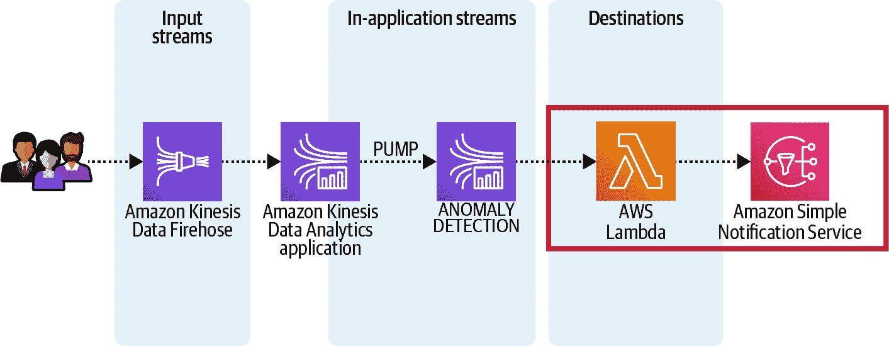

###### 图 11-9\. Lambda 函数用作 Kinesis 数据分析的异常分数目标。

这是创建我们的 Amazon SNS 主题的代码：

```
import boto3

sns = boto3.Session().client(service_name='sns', region_name=region)

response = sns.create_topic(
    Name=<SNS_TOPIC_NAME>,
)

sns_topic_arn = response['TopicArn']
```

以下是我们 Lambda 函数代码的摘录，*push_notification_to_sns.py*，该函数记录了批处理输入记录中的最高异常分数，并将分数发布到 Amazon SNS 主题：

```
import boto3
import base64
import os

SNS_TOPIC_ARN = os.environ['SNS_TOPIC_ARN']
sns = boto3.client('sns')

def lambda_handler(event, context):
    output = []
    highest_score = 0
    ...

    r = event['records']

    for record in event['records']:
        try:
            payload = base64.b64decode(record['data'])
            text = payload.decode("utf-8")
            score = float(text)
            if (score != 0) and (score > highest_score):
                highest_score = score
                output.append({'recordId': record['recordId'], \
                    'result': 'Ok'})
          ...

    if (highest_score != 0):
        sns.publish(TopicArn=SNS_TOPIC_ARN, \
            Message='New anomaly score: {}'\
               .format(str(highest_score)), \
            Subject='New Reviews Anomaly Score Detected')

    return {'records': output}
```

与以前的 Lambda 函数类似，我们可以通过编程方式创建此 Lambda 函数，并更新该函数，其中环境变量设置为我们的 Amazon SNS 主题 ARN。

我们可以订阅 Amazon SNS 主题以接收 Amazon SNS 通知如下：

```
response = sns.subscribe(
    TopicArn=sns_topic_arn,
    Protocol='email',
    Endpoint='<EMAIL_ADDRESS>',
)
```

我们还有一个 Lambda 函数要实现。

## 创建 AWS Lambda 函数以将指标发布到 Amazon CloudWatch

在我们的 Kinesis Data Analytics 应用程序中，我们还将计算流消息窗口的平均情感。我们希望将平均情感结果作为自定义指标发布到 CloudWatch。同样，我们将使用星级评分作为我们的情感代理指标。由于 CloudWatch 不直接支持作为 Kinesis Data Analytics 目的地，我们需要另一个 Lambda 函数作为代理目的地。图 11-10 强调了我们即将实施的架构步骤。

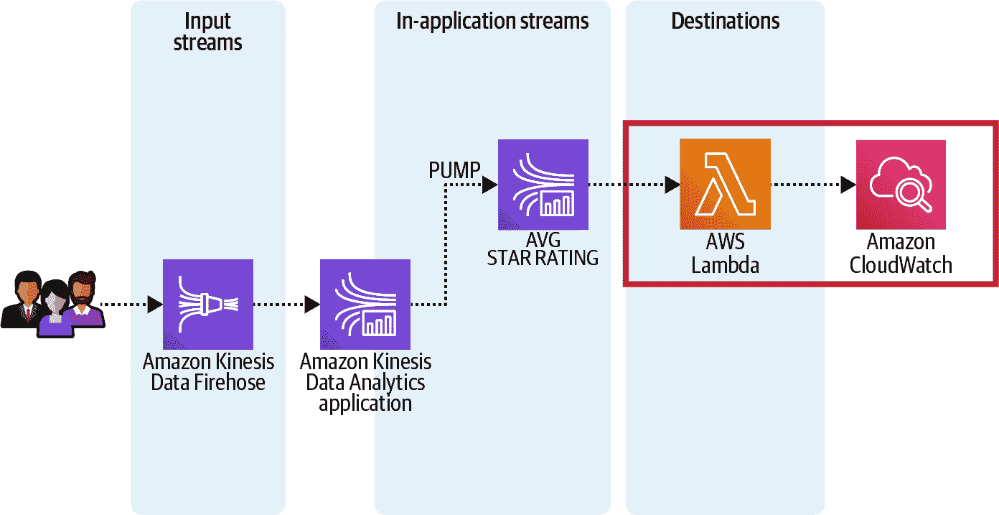

###### 图 11-10\. 用作 Kinesis Data Analytics 平均星级评分的 Lambda 函数目的地。

以下是我们 Lambda 函数代码 *deliver_metrics_to_cloudwatch.py* 的摘录，用于将平均星级评分作为自定义指标发布到 CloudWatch：

```
client = boto3.client('cloudwatch')

def lambda_handler(event, context):
    output = []
    ...

    for record in event['records']:
        payload = base64.b64decode(record['data'])
        datapoint = float(payload)

        client.put_metric_data(
                Namespace='kinesis/analytics/AVGStarRating',
                MetricData=[
                    {
                        'MetricName': 'AVGStarRating',
                        'Dimensions': [
                            {
                                'Name': 'Product Category',
                                'Value': 'All'
                             },
                        ],
                        'Value': datapoint,
                        'StorageResolution': 1
                    }
                ]
        )

        output.append({'recordId': record['recordId'], 'result': 'Ok'})
        ...

    return {'records': output}
```

创建 Lambda 函数后，我们已经安装了所有 Kinesis Data Analytics 应用程序的目的地，并且现在可以创建 Kinesis Data Analytics 应用程序。

## 转换 Kinesis Data Analytics 中的流数据

与 Kinesis Data Firehose 中的数据转换功能类似，我们可以在 Kinesis Data Analytics 中转换传入的流数据。我们可以使用 Lambda 函数来转换、转换、丰富或过滤我们的流数据。此步骤在数据分析应用程序为数据流创建架构之前执行。在我们的示例中，我们将重用为 Kinesis Data Firehose 数据转换创建的 Lambda 函数。我们将再次使用该函数来再次用星级评分丰富我们的消息。图 11-11 可视化了此步骤的详细信息。

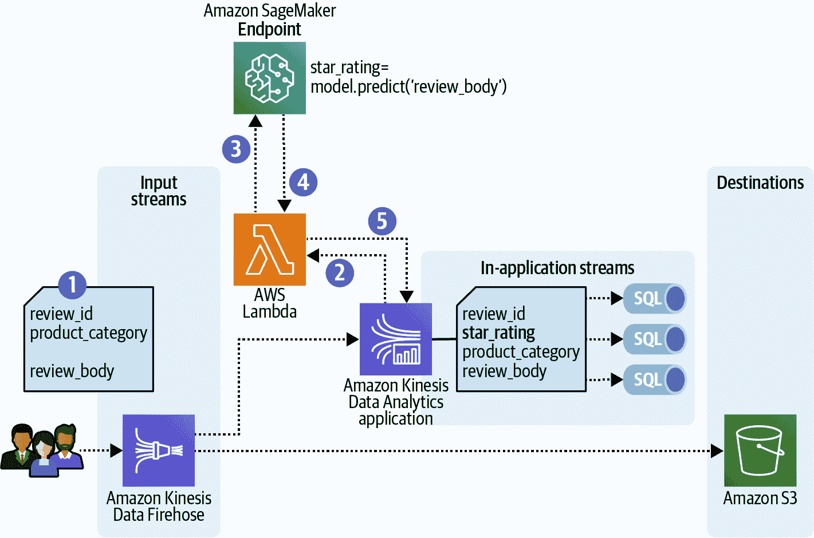

###### 图 11-11\. 在 Kinesis Data Analytics 中预处理流数据。

工作流如下所示：

1.  我们在 Kinesis Data Firehose 交付流上接收产品评审消息，该流将记录传递到 S3。

1.  我们设置了 Kinesis Data Analytics 应用程序，以 Firehose 交付流作为输入流。该应用程序从 Firehose 交付流接收产品评审消息，并将其发送到 Lambda 函数进行预处理。

1.  我们正在重用 Lambda 函数`InvokeSageMakerEndpointFromKinesis`，该函数调用托管在 SageMaker Endpoint 上的基于 BERT 的模型，以预测基于产品评审消息中的评审文本的星级评分。

1.  Lambda 函数从我们的模型接收预测的星级评分，并将其附加到产品评审消息中。

1.  Lambda 函数将产品评论消息返回到 Kinesis 数据分析应用程序，并将其与星级评分一起丰富。丰富的产品评论消息现在用作所有后续 SQL 查询的输入。

由于我们已经有了 Lambda 函数，我们可以继续为我们的应用程序开发 SQL 查询。

## 理解应用程序流和泵

Kinesis 数据分析应用程序中的一个重要概念是应用程序流和泵。在我们的示例中，我们将使用 Firehose 传输流作为数据分析应用程序的输入。这个输入流需要映射到数据分析应用程序中的应用程序流。一旦映射完成，数据将持续从输入流流入应用程序流中。我们可以将应用程序流视为一个表，然后可以使用 SQL 语句查询它。由于我们实际上不是在处理表，而是在处理连续的数据流，所以我们称其为流。

请注意，Kinesis 数据分析中的应用程序流仅存在于分析应用程序内部。它们存储我们 SQL 查询的中间结果。如果我们希望在应用程序外部处理结果，我们需要将应用程序流映射到支持的 Kinesis 数据分析目的地。因此，我们设置了三个不同的目的地来捕获我们应用程序流的结果。

下面是创建具有三列的应用程序流（`MY_STREAM`）的示例：

```
CREATE OR REPLACE STREAM "MY_STREAM" ( 
   "column1" BIGINT NOT NULL, 
   "column2" INTEGER, 
   "column3" VARCHAR(64));
```

要向此流插入数据，我们需要一个泵。将泵视为一个持续运行的插入查询，将数据从一个应用程序流插入到另一个应用程序流。

这是一个示例，创建了一个泵（`MY_PUMP`），并通过从另一个 `INPUT_STREAM` 中选择数据记录将数据插入到 `MY_STREAM` 中：

```
CREATE OR REPLACE PUMP "MY_PUMP" AS 
INSERT INTO "MY_STREAM" ( "column1", 
                          "column2", 
                          "column3") 
SELECT STREAM inputcolumn1, 
              inputcolumn2, 
              inputcolumn3
FROM "INPUT_STREAM";
```

假设我们在数据分析应用程序中的输入流（我们的 Firehose 传输流）称为 `SOURCE_SQL_STREAM_001`。

# 亚马逊 Kinesis 数据分析应用程序

让我们创建三个应用程序流来计算平均 `star_rating`、异常分数和消息的近似计数。

## 计算平均星级评分

我们的第一个应用程序流名为 `AVG_STAR_RATING_SQL_STREAM`。我们使用 `GROUP BY` 语句计算接收到的消息的五秒滚动窗口内的平均星级评分，指定了 `INTERVAL ‘5’`。

下面是实现此目的的 SQL 代码：

```
CREATE OR REPLACE STREAM "AVG_STAR_RATING_SQL_STREAM" (
    avg_star_rating DOUBLE);

CREATE OR REPLACE PUMP "AVG_STAR_RATING_SQL_STREAM_PUMP" AS 
INSERT INTO "AVG_STAR_RATING_SQL_STREAM"
SELECT STREAM AVG(CAST("star_rating" AS DOUBLE)) AS avg_star_rating
FROM "SOURCE_SQL_STREAM_001" 
GROUP BY
STEP("SOURCE_SQL_STREAM_001".ROWTIME BY INTERVAL '5' SECOND);
```

## 检测流数据中的异常

第二个应用程序流名为 `ANOMALY_SCORE_SQL_STREAM`。我们利用内置的 `RANDOM_CUT_FOREST` 实现，在消息的滑动窗口中计算异常分数。

Kinesis 数据分析中的随机切割森林 (RCF) 实现基于由 AWS 共同撰写的 [“Robust Random Cut Forest Based Anomaly Detection on Streams” 研究论文](https://oreil.ly/0pDkv)。该论文详细介绍了在实时数据流中使用 RCF 进行在线学习。但是，AWS 提供了用于离线批量训练的内置 SageMaker 算法。RCF 还用于 QuickSight 中的异常检测。

Kinesis 数据分析中的 `RANDOM_CUT_FOREST` 函数构建一个机器学习模型，用于计算每条消息中数值的异常分数。该分数表示该值与观察到的趋势相比有多不同。该函数还计算每列的归因分数，反映了该特定列中数据的异常程度。所有列的所有归因分数之和即为总体异常分数。

由于 `RANDOM_CUT_FOREST` 是基于数值值的，我们将根据星级评分计算异常分数。`RANDOM_CUT_FOREST` 函数的唯一必需参数是指向我们输入流的指针，我们使用 `CURSOR` 函数定义这一点。以下是实现此操作的 SQL 代码：

```
CREATE OR REPLACE STREAM "ANOMALY_SCORE_SQL_STREAM" (
    anomaly_score DOUBLE);

CREATE OR REPLACE PUMP "ANOMALY_SCORE_STREAM_PUMP" AS
INSERT INTO "ANOMALY_SCORE_SQL_STREAM"
SELECT STREAM anomaly_score
FROM TABLE(RANDOM_CUT_FOREST(
    CURSOR(SELECT STREAM "star_rating"
    FROM "SOURCE_SQL_STREAM_001")
    )
);
```

## 计算流数据的近似计数

第三个应用程序内流被称为 `APPROXIMATE_COUNT_SQL_STREAM`。我们在五秒滚动窗口内计算传入消息的近似计数。Kinesis 数据分析具有内置函数，使用 `COUNT_DISTINCT_ITEMS_TUMBLING` 计算近似计数，滚动窗口大小设置为五秒。该函数使用 HyperLogLog 算法，该算法在小型数据结构中存储大量近似计数。

下面的 SQL 代码实现了在五秒滚动窗口上对 `review_id` 列的近似不同项计数：

```
CREATE OR REPLACE STREAM "APPROXIMATE_COUNT_SQL_STREAM"(
number_of_distinct_items BIGINT);

CREATE OR REPLACE PUMP "APPROXIMATE_COUNT_STREAM_PUMP" AS
INSERT INTO "APPROXIMATE_COUNT_SQL_STREAM"
SELECT STREAM number_of_distinct_items
FROM TABLE(COUNT_DISTINCT_ITEMS_TUMBLING(
CURSOR(SELECT STREAM "review_id" FROM "SOURCE_SQL_STREAM_001"),'review_id', 5)
);
```

## 创建 Kinesis 数据分析应用程序

现在我们已经完全准备好创建我们的 Kinesis 数据分析应用程序，所以让我们首先创建一个联合的 SQL 语句，其中包含我们的三个 SQL 查询，以计算平均星级评分、检测异常以及计算给定窗口大小下的流数据的近似计数。当我们创建应用程序时，我们将这个联合 SQL 查询作为 `ApplicationCode` 传递。以下是代码：

```
in_app_stream_name = 'SOURCE_SQL_STREAM_001' # Firehose input stream
window_seconds = 5

sql_code = ''' 
        CREATE OR REPLACE STREAM "AVG_STAR_RATING_SQL_STREAM" ( 
            avg_star_rating DOUBLE); 
        CREATE OR REPLACE PUMP "AVG_STAR_RATING_SQL_STREAM_PUMP" AS 
            INSERT INTO "AVG_STAR_RATING_SQL_STREAM" 
                SELECT STREAM AVG(CAST("star_rating" AS DOUBLE)) 
AS avg_star_rating 
                FROM "{}" 
                GROUP BY 
                STEP("{}".ROWTIME BY INTERVAL '{}' SECOND); 

        CREATE OR REPLACE STREAM "ANOMALY_SCORE_SQL_STREAM" 
(anomaly_score DOUBLE); 
        CREATE OR REPLACE PUMP "ANOMALY_SCORE_STREAM_PUMP" AS 
            INSERT INTO "ANOMALY_SCORE_SQL_STREAM" 
            SELECT STREAM anomaly_score 
            FROM TABLE(RANDOM_CUT_FOREST( 
                CURSOR(SELECT STREAM "star_rating" 
                    FROM "{}" 
            ) 
          ) 
        ); 

        CREATE OR REPLACE STREAM "APPROXIMATE_COUNT_SQL_STREAM" 
(number_of_distinct_items BIGINT); 
        CREATE OR REPLACE PUMP "APPROXIMATE_COUNT_STREAM_PUMP" AS 
            INSERT INTO "APPROXIMATE_COUNT_SQL_STREAM" 
            SELECT STREAM number_of_distinct_items 
            FROM TABLE(COUNT_DISTINCT_ITEMS_TUMBLING( 
                CURSOR(SELECT STREAM "review_id" FROM "{}"), 
                'review_id', 
                {} 
              ) 
        ); 
    '''.format(in_app_stream_name,
               in_app_stream_name,
               window_seconds,
               in_app_stream_name,
               in_app_stream_name,
               window_seconds)
```

接下来，让我们创建 Kinesis 数据分析应用程序。我们将应用程序输入设置为我们的 Firehose 传递流，并配置 `InputProcessingConfiguration` 调用我们的 Lambda 函数来调用基于 BERT 模型的数据。然后，我们定义 `InputSchema` 来匹配我们丰富的产品评论消息，其中包括 `review_id`、`star_rating`、`product_category` 和 `review_body`。

对于应用程序的输出，我们引用了三个 SQL 查询的应用程序内流名称，并定义了目标。我们将目标 `AVG_STAR_RATING_SQL_STREAM` 和 `ANOMALY_SCORE_SQL_STREAM` 设置为相应的 Lambda 函数。我们将 `APPROXIMATE_COUNT_SQL_STREAM` 连接到 Kinesis 数据流目标。以下是创建 Kinesis 数据应用程序并引用先前定义的 `sql_code` 的代码：

```
kinesis_analytics = \
	boto3.Session().client(service_name='kinesisanalytics', 
	                       region_name=region)

response = kinesis_analytics.create_application(
        ApplicationName=kinesis_data_analytics_app_name,
        Inputs=[
            {
                'NamePrefix': 'SOURCE_SQL_STREAM',
                'KinesisFirehoseInput': {
                     ...
                },
                'InputProcessingConfiguration': { 
                    'InputLambdaProcessor': { 
                     ...
                    }
                 },                
                'InputSchema': {
                    'RecordFormat': {
                        'RecordFormatType': 'CSV',
                        'MappingParameters': {
                            'CSVMappingParameters': {
                                'RecordRowDelimiter': '\n',
                                'RecordColumnDelimiter': '\t'
                            }
                        }
                    },
                    'RecordColumns': [
                        {
                            'Name': 'review_id',
                           ...
                        },                    
                        {
                            'Name': 'star_rating',
                           ...
                        },
                        {
                            'Name': 'product_category',
                           ...
                        },                    
                        {
                            'Name': 'review_body',
                           ...
                        }                    
                    ]
                }
            },
        ],
        Outputs=[
            {
                'Name': 'AVG_STAR_RATING_SQL_STREAM',
                'LambdaOutput': {
                     ...
                },
                'DestinationSchema': {
                    'RecordFormatType': 'CSV'
                }
            },
            {
                'Name': 'ANOMALY_SCORE_SQL_STREAM',            
                'LambdaOutput': {
                     ...
                },
                'DestinationSchema': {
                    'RecordFormatType': 'CSV'
                }
            },
            {
                'Name': 'APPROXIMATE_COUNT_SQL_STREAM',            
                'KinesisStreamsOutput': {
                     ...
                },
                'DestinationSchema': {
                    'RecordFormatType': 'CSV'
                }
            }
        ],
        ApplicationCode=sql_code
)
```

## 启动 Kinesis 数据分析应用程序。

创建 Kinesis 数据分析应用程序后，我们必须显式启动应用程序以接收和处理数据。以下是启动我们的 Kinesis 数据分析应用程序的代码：

```
input_id = 
	response['ApplicationDetail']['InputDescriptions'][0]['InputId']

response = kinesis_analytics.start_application(
        ApplicationName=kinesis_data_analytics_app_name,
        InputConfigurations=[
            {
                'Id': input_id,
                'InputStartingPositionConfiguration': {
                    'InputStartingPosition': 'NOW'
                }
            }
        ]
)
```

## 将消息放入流中。

应用程序运行后，我们可以通过将消息放入流中来测试我们的流水线。为了模拟我们连续的在线产品评论消息流，我们重复使用之前的代码。我们从亚马逊客户评论数据集中读取我们的示例客户评论，并将包含 `review_id`、`product_category` 和 `review_body` 的消息发送到 Kinesis Data Firehose。我们的 Kinesis 数据分析应用程序配置为使用 Firehose 交付流作为输入源。

让我们审查一下我们的数据分析应用程序的结果。如果我们在 AWS 控制台中打开 Kinesis 数据分析应用程序，我们可以看到源和目标配置，如 11-12 和 11-13 所示。

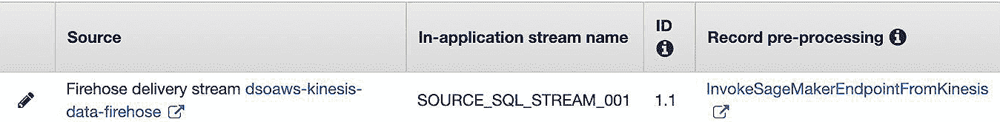

###### Figure 11-12\. Kinesis 数据分析应用程序，源配置。

Firehose 交付流映射到应用程序内流 `SOURCE_SQL_STREAM_001`。我们还使用 Lambda 函数 `InvokeSageMakerEndpointFromKinesis` 对输入记录进行预处理。

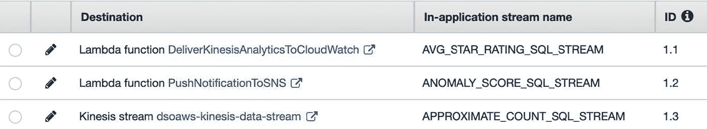

###### Figure 11-13\. Kinesis 数据分析应用程序，目标配置。

目标配置显示了我们的三个应用程序内流 `AVG_STAR_RATING_SQL_STREAM`、`ANOMALY_SCORE_SQL_STREAM` 和 `APPROXIMATE_COUNT_SQL_STREAM` 与其相应目标的正确映射。

从该控制台，我们还可以打开实时分析仪表板，查看 SQL 查询执行结果作为消息到达。如果我们选择 `Source` 标签，我们可以看到传入的消息，如 Figure 11-14 所示。这些消息已经通过我们的 Lambda 函数预处理，并包含星级评分。

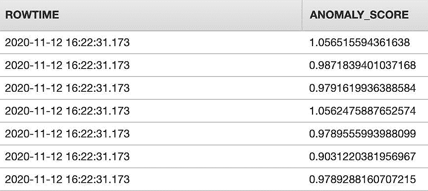

###### Figure 11-14\. 输入消息流。

如果我们选择实时分析标签，我们可以看到我们的三个应用程序内流的结果，包括平均星级评分、不同项数和异常分数，如 Figure 11-15 所示。

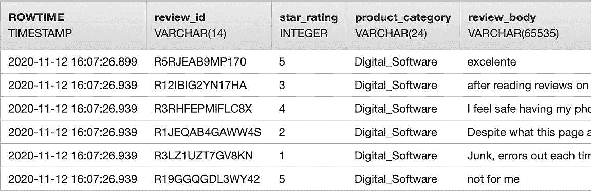

###### Figure 11-15\. `ANOMALY_SCORE_SQL_STREAM` 的应用程序内流结果。

最后，让我们回顾一下我们的目标地点。如果我们导航到 CloudWatch Metrics，我们可以找到我们的自定义指标 `AVGStarRating`。我们可以将该指标添加到图表中，查看传入消息的实时情感趋势。我们的 Amazon SNS 主题还接收到了最新的异常分数，并通过电子邮件通知了应用团队。

# 使用 Apache Kafka、AWS Lambda 和 Amazon SageMaker 对产品评价进行分类

Amazon MSK 是用于 Apache Kafka 分布式流处理集群的全管理服务。我们可以创建一个 Lambda 函数，使用 Amazon MSK 流中的数据调用我们的 SageMaker 终端节点进行预测输入，并用预测输出丰富我们的 Kafka 流。这类似于我们的 Kinesis 流触发 Lambda 函数，Lambda 函数调用 SageMaker 终端节点，使用 Kinesis 流中的数据作为预测输入，并用预测输出丰富 Kinesis 流。图 11-16 展示了如何使用 Amazon MSK 接收和转换数据记录，我们可以描述步骤如下：

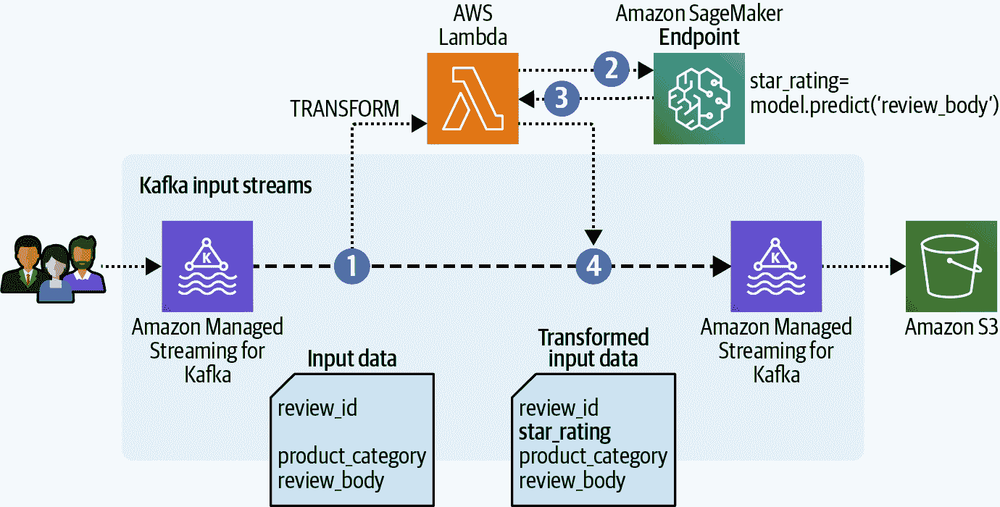

###### 图 11-16\. 使用 Amazon MSK 接收和转换数据记录。

1.  我们接收实时输入数据并预测星级评分以推断客户情感。

1.  Amazon MSK 允许我们通过 Lambda 函数转换数据记录。我们创建了一个 Lambda 函数，接收 Kafka 数据记录，并将评论消息发送到托管我们精调的基于 BERT 模型的 SageMaker 终端节点。

1.  模型预测 `star_rating`，我们的 Lambda 函数将其添加到原始数据记录中；然后函数将新记录返回到我们的 Kafka 流。

1.  然后，Kafka 流使用 Amazon S3 的 Kafka S3 沉降连接器将转换后的数据记录传送到 S3 存储桶。

要设置这一过程，我们需要创建 Amazon MSK 集群，为模型输入创建 Kafka 输入主题（输入流），并为模型预测创建 Kafka 输出主题（输出流）。接下来，我们需要使用 Amazon MSK Python API 的 `create_event_source_mapping()` 创建 Lambda 事件源映射，将我们的 Kafka 输入流映射到调用 SageMaker 终端节点的 Lambda 函数输入，并将预测写入 Kafka 输出流。

这是创建 Amazon MSK 集群和 Lambda 函数之间事件源映射的代码，通过 `reviews` 主题：

```
response = client.create_event_source_mapping(
    EventSourceArn='<MSK_CLUSTER_ARN>',
    FunctionName='<LAMBDA_FUNCTION_NAME>',
    Enabled=True,
    Topics=[
        'reviews',
    ]
)
```

# 降低成本和提升性能

我们可以进一步优化流数据架构以降低成本和提升性能。例如，Lambda 函数符合计算节省计划的资格，该计划为一年或三年的计算使用承诺提供折扣。有几种方式可以通过 Kinesis 服务降低成本。一种最佳实践是将较小的数据记录聚合成一个 `PUT` 请求。我们还可以考虑使用 Kinesis Firehose 而不是 Data Streams 来节省费用。通过启用增强型分发（EFO），我们可以提高 Kinesis Data Streams 的性能。

## 聚合消息

Kinesis Data Streams 的成本基于预留的分片数量和我们的消息 `PUT` 负载，以 25 KB 单位计量。减少成本的最佳实践是将较小的消息聚合成一个 `PUT` 请求。我们可以使用 Kinesis Producer Library (KPL) 实现这种技术。KPL 将多个逻辑数据记录聚合和压缩为一个 Kinesis 数据记录，然后我们可以有效地将其放入流中。

## 考虑 Kinesis Firehose 与 Kinesis Data Streams

Kinesis Firehose 最适合需要零管理并且可以容忍一些数据处理延迟的用例。Firehose 提供准实时处理。它由 AWS 完全管理，并自动扩展以匹配吞吐需求。我们还可以批量和压缩数据，以最小化目的地的存储占用。使用 Firehose，我们只支付处理的数据。

Kinesis Data Streams 最适合需要为每个传入记录进行自定义处理的用例。它提供实时处理。我们必须自行管理 Kinesis Data Stream 的吞吐能力。Kinesis Data Streams 的成本基于处理的数据 *和* 预留分片的数量来满足我们的吞吐需求。

###### 注意

如果我们选择使用 Lambda 函数来提供训练模型的服务，我们可以直接将 Kinesis Data Stream 连接到 Lambda 函数。Lambda 函数直接从 Kinesis Data Stream 中读取记录，并使用事件数据同步执行预测。

## 启用 Kinesis Data Streams 的增强扇出

没有 EFO，所有消费者都在竞争每个分片的读取吞吐量限制。这限制了每个流的消费者数量，并且需要扩展到额外的流以扩展到大量的消费者，如 图 11-17 所示。

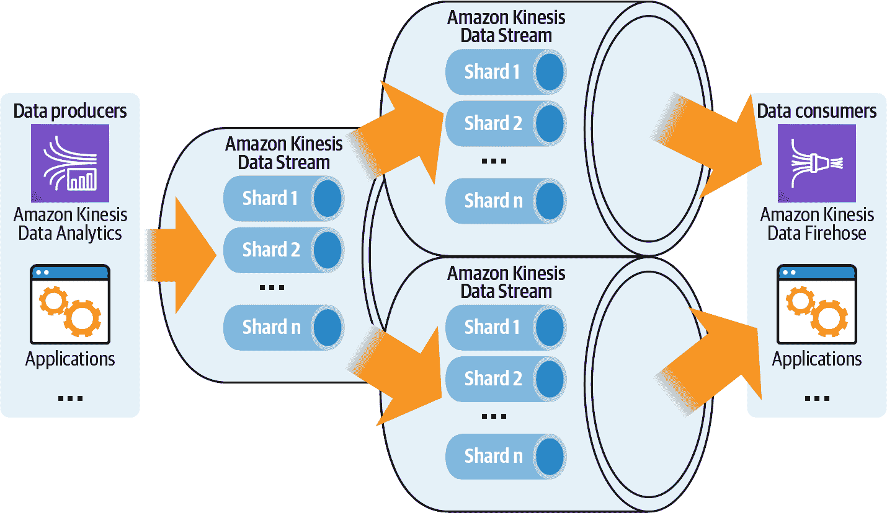

###### 图 11-17\. 在没有 EFO 的情况下扩展消费者使用多个流。

使用 EFO，每个分片-消费者组合可以利用自己的专用的全读取吞吐量限制。图 11-18 显示了具有全读取吞吐量的专用分片-消费者管道。

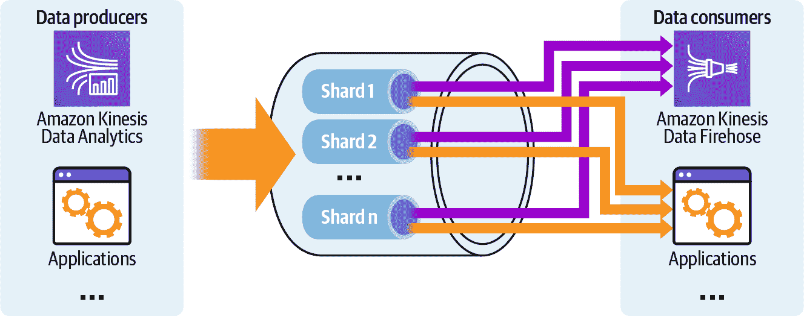

###### 图 11-18\. 使用单流并使用专用的全吞吐量分片-消费者连接来扩展消费者的 EFO 缩放。

为了启用 EFO，我们使用 Kinesis Data Streams Python API 中的 `register_stream_consumer()` 和 `subscribe_to_share()` 函数。当注册我们的消费者到 EFO 时，Kinesis Data Streams 将使用高度并行、非阻塞的 HTTP/2 协议向消费者推送数据。这种推送机制导致更具响应性、低延迟和高性能的流式应用程序，可以扩展到大量的消费者。

# 概要

在本章中，我们展示了如何使用流数据进行流分析和机器学习。我们使用 Kinesis 流技术建立了端到端的流数据管道，用于捕获我们的产品评论，执行描述性分析，并应用预测性机器学习。我们对持续流动的产品评论进行了摘要统计，对流数据进行了异常检测，并使用基于 BERT 的 SageMaker 模型对数据进行了增强预测。我们在 CloudWatch Metrics 仪表盘中可视化了结果，发送电子邮件通知以警示团队，并使结果可供其他应用程序使用。

在第十二章中，我们将讨论如何在 AWS 上保护数据科学和机器学习项目。在介绍 AWS 共享责任模型并讨论常见的安全考虑因素后，我们将重点介绍 Amazon SageMaker 的安全最佳实践，涉及访问管理、计算和网络隔离、加密、治理以及可审计性。
