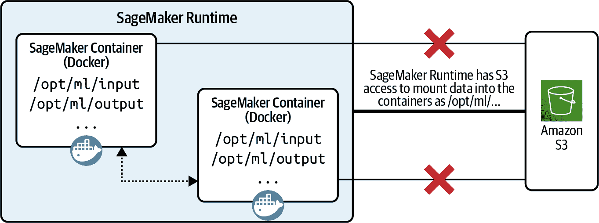

# 第十二章：安全的 AWS 数据科学

在所有层面，从网络到应用程序，以及从数据摄入到模型部署的整个数据科学工作流程中，保持最小特权安全至关重要。在本章中，我们强调安全是 AWS 的首要任务，通常被称为“零工作”或“零优先级”。我们讨论常见的安全考虑，并提出在 AWS 上构建安全数据科学和机器学习项目的最佳实践。我们将描述旨在阻止事件发生的预防控制，以及快速检测潜在事件的检测控制。我们还确定响应和纠正控制，以帮助纠正安全违规行为。

在云中构建安全数据科学项目的最常见安全考虑涉及访问管理、计算和网络隔离以及加密领域。让我们首先讨论这些更一般的安全最佳实践和安全优先原则。然后，我们将应用这些实践和原则，通过网络级安全和应用程序安全来保护从笔记本到 S3 存储桶的数据科学环境。我们还讨论了合规性和监管的治理和审计最佳实践。

# AWS 和客户之间的共享责任模型

AWS 通过实施共享责任模型，提供全球安全基础设施和基础计算、存储、网络和数据库服务，以及一系列安全服务，我们可以利用这些服务来保护我们在其上构建和运行的任何内容。

安全和合规性是 AWS 和客户之间的共同责任。AWS 确保云的安全，“而”客户负责云中的安全，如图 12-1 所示。


###### 图 12-1\. 安全是 AWS 和客户之间的共同责任。来源：[Amazon](https://oreil.ly/DgY3n)。

AWS 保护运行 AWS 服务的 AWS 云基础设施。这包括从主机操作系统和虚拟化层到物理设施的物理安全的所有组件。AWS 安全的有效性定期由第三方审计师测试和验证。我们可以通过[AWS Artifact](https://oreil.ly/XFfgU)访问按需的安全和合规性报告以及选择在线协议。

反过来，AWS 的客户负责确保云中的安全。客户责任的范围由具体的 AWS 服务确定。此外，客户可以从各种安全服务和功能中选择，在 AWS 云中构建安全和合规的应用程序。

# 应用 AWS 身份和访问管理

IAM 是一个帮助我们管理访问 AWS 资源的服务。IAM 控制谁可以访问（认证）环境以及经认证用户具有什么权限（授权）。我们可以使用 IAM 定义用户、用户组和角色。IAM 实施了主体、操作、资源和条件的概念。这定义了哪些主体可以在哪些资源上以及在哪些条件下执行哪些操作。

通过创建 IAM 策略并将其附加到 IAM 身份或 AWS 资源，我们控制对特定资源的访问。根据不同的工作角色或功能，我们可能希望向用户授予不同的权限。例如，一些开发人员可能只需启动笔记本进行临时数据探索。数据科学家很可能需要对数据存储、训练作业和实验拥有权限。数据工程师和机器学习工程师可能需要权限来构建可重复使用的数据和模型流水线。DevOps 团队需要访问模型部署和性能监视器。

Amazon SageMaker 利用 IAM 进行基于角色的访问控制。我们还可以映射来自 AWS 目录服务、企业用户目录或 Web 身份提供者（称为*federated users*）的任何现有用户/组/角色。

## IAM 用户

我们可以为访问我们的 AWS 账户的个人创建单独的 IAM 用户。每个用户都将拥有唯一的安全凭证。我们还可以将 IAM 用户分配给具有定义访问权限的 IAM 组（即针对特定工作职能），并且 IAM 用户继承这些权限。

## IAM 策略

访问权限通过 IAM 策略定义。仅授予执行给定任务所需的特定权限是一种标准的安全最佳实践。

## IAM 用户角色

委托访问权限的更优方法是通过 IAM 角色。与仅与一个人相关联的 IAM 用户不同，角色可以由需要它的任何人扮演，并为角色会话的持续时间提供临时安全凭证。IAM 服务角色控制服务代表我们执行哪些操作。IAM 用户角色由个人用户扮演。

最佳实践是为不同的工作角色创建单独的 IAM 用户角色，例如`DataScientistRole`、`MLEngineerRole`、`DataEngineeringRole`、`MLOpsEngineeringRole`等。这样可以为模型开发生命周期中的不同角色提供精细化和明确的策略。

## IAM 服务角色

IAM 服务角色由 AWS 服务扮演。最佳做法是为不同的服务创建单独的服务角色，并为每个服务的不同任务创建单独的角色。对于 Amazon SageMaker，我们可以按以下方式分离服务角色：

`SageMakerNotebookExecutionRole`

SageMaker 笔记本实例或 SageMaker Studio 应用程序所扮演的角色，定义了对 SageMaker 训练或模型托管服务的访问权限。

`SageMakerProcessingRole`

SageMaker 处理作业所假定的角色，定义了对数据输入/输出的 S3 存储桶的访问权限。

`SageMakerTrainingRole`

SageMaker 训练或调整作业所假定的角色，在模型训练/调整期间定义权限。

`SageMakerModelRole`

SageMaker 终端节点上模型托管推理容器所假定的角色，在模型推理期间定义权限。

图 12-2 展示了数据科学家 IAM 用户角色和讨论的各种 SageMaker IAM 服务角色。


###### 图 12-2\. Amazon SageMaker 的示例 IAM 用户和服务角色。

在通过 IAM 策略定义用户和服务权限时，我们应始终分配执行所需任务的最低权限。

## 为 IAM 角色指定条件键。

我们可以使用 IAM 条件键在策略中指定防护栏。例如，当主体调用服务 API 以创建资源时，请求信息将与主体 IAM 策略中定义的条件进行比较。如果条件语句通过，则 API 调用成功；如果条件语句失败，则请求将被拒绝。条件语句通常如下所示：

```
"Condition": {
   "{condition-operator}": {
      "{condition-key}": "{condition-value}"
   }
}
```

下面是一个示例条件策略语句，拒绝上传未加密对象到 S3：

```
"Statement": [{
                "Sid": "DenyUnencryptedObjectUploads",
                "Effect": "Deny",
                "Principal": "*",
                "Action": "s3:PutObject",
                "Resource": "arn:aws:s3:::<bucket_name>/*",
                "Condition": {
                    "StringNotEquals": {
                        "S3:x-amz-server-side-encryption": "aws:kms"
                    }
               }
           }]
```

SageMaker 支持全局条件键，并添加了一些特定于服务的条件键。全局条件上下文键以`aws:`前缀开头。SageMaker 支持以下全局条件键：

`aws:RequestTag/${TagKey}`

比较请求中传递的标签键值对与策略中指定的标签对。

`aws:ResourceTag/${TagKey}`

比较策略中指定的标签键值对与资源附加的键值对。

`aws:SourceIp`

比较请求者的 IP 地址与策略中指定的 IP 地址。

`aws:SourceVpc`

检查请求是否来自策略中指定的 Amazon Virtual Private Cloud（Amazon VPC）。

`aws:SourceVpce`

比较请求的 Amazon VPC 终端节点标识符与策略中指定的终端节点 ID。

`aws:TagKeys`

比较请求中的标签键与策略中指定的键。

SageMaker 添加以`sagemaker:`前缀开头的特定于服务的条件键，如下所示：

`sagemaker:AcceleratorTypes`

在创建或更新笔记本实例以及创建端点配置时，使用特定的 Amazon Elastic Inference 加速器。

`sagemaker:DirectInternetAccess`

控制笔记本实例的直接互联网访问。

`sagemaker:FileSystemAccessMode`

指定与输入数据通道（Amazon EFS 或 FSx）关联的目录的访问模式。

`sagemaker:FileSystemDirectoryPath`

指定与训练和超参数调整（HPT）请求中资源关联的文件系统目录路径。

`sagemaker:FileSystemId`

指定与训练和 HPT 请求中资源关联的文件系统 ID。

`sagemaker:FileSystemType`

指定与训练和 HPT 请求中资源关联的文件系统类型。

`sagemaker:InstanceTypes`

指定笔记本实例、训练作业、HPT 作业、批转换作业和端点配置的所有实例类型列表，用于托管实时推理。

`sagemaker:InterContainerTrafficEncryption`

在分布式训练和 HPT 作业中控制容器间流量加密。

`sagemaker:MaxRuntimeInSeconds`

通过指定训练、HPT 或编译作业可运行的最大时间长度（以秒为单位）来控制成本。

`sagemaker:ModelArn`

指定用于批转换作业和端点配置托管实时推理的模型关联的亚马逊资源名称（ARN）。

`Sagemaker:NetworkIsolation`

在创建训练、HPT 和推理作业时启用网络隔离。

`sagemaker:OutputKmsKey`

指定用于加密存储在亚马逊 S3 中的输出数据的 AWS KMS 密钥。

`sagemaker:RequestTag/${TagKey}`

比较请求中传递的标签键值对与策略中指定的标签对。

`sagemaker:ResourceTag/${TagKey}`

比较策略中指定的标签键值对与附加到资源的键值对。

`sagemaker:RootAccess`

在笔记本实例上控制根访问。

`sagemaker:VolumeKmsKey`

在创建笔记本实例、训练作业、HPT 作业、批转换作业和端点配置托管实时推理时，指定用于加密存储卷的 AWS KMS 密钥。

`sagemaker:VPCSecurityGroupIds`

列出与亚马逊 SageMaker 在亚马逊 VPC 子网中创建的弹性网络接口（ENI）关联的所有亚马逊 VPC 安全组 ID。

`sagemaker:VPCSubnets`

列出亚马逊 SageMaker 创建 ENI 以与其他资源（如亚马逊 S3）通信的所有亚马逊 VPC 子网。

## 启用多因素认证

SageMaker 还支持多因素认证 MFA。MFA 提供额外的安全性，因为它要求用户从 AWS 支持的 MFA 机制中提供第二个唯一的认证。支持的 MFA 机制包括虚拟 MFA 设备、U2F 安全密钥、硬件 MFA 设备或基于短信文本的 MFA。

作为最佳实践，我们应该为具有管理员访问权限的用户启用 MFA。我们还应将 MFA 添加为授权的第二步骤，以防止终止和删除资源等破坏性操作。在合规性和治理政策要求模型在删除之前存储一段时间时，这将非常有用。

## 使用 IAM 角色和策略实现最小权限访问控制

IAM 策略控制对 AWS 资源的访问。我们将 IAM 策略附加到 IAM 身份或 AWS 资源上，以定义身份或资源的权限。默认情况下，IAM 用户或角色没有任何权限。管理员必须授予 IAM 用户或角色权限。当用户属于一个组时，用户会继承该组的权限。

根据需要定义 IAM 策略池，然后将适用的策略分配给我们的 IAM 身份。图 12-3 展示了 IAM 策略与 IAM 用户/组/角色之间的典型多对多关系示例。


###### 图 12-3\. IAM 策略与 IAM 用户/角色之间的关系。

有不同类型的策略，包括基于身份和基于资源的策略。基于身份的策略是我们附加到 IAM 用户/组/角色的 JSON 策略文档。该策略定义了用户/组/角色的权限。

## 基于资源的 IAM 策略

基于资源的策略是我们附加到 AWS 资源（例如 S3 存储桶）的 JSON 策略文档。在基于资源的策略中，策略控制对资源的访问，即谁有权以何种条件访问 S3 存储桶。

请注意，基于资源的策略需要一个主体（允许对资源执行操作及其条件）。主体可以是 AWS 账户、IAM 用户、IAM 角色、联合用户或其他 AWS 服务。

这是一个基于资源的 IAM 策略示例。以下 S3 存储桶策略要求通过 MFA 访问存储桶。这通过`aws:MultiFactorAuthAge`条件键实现：

```
{
    "Version": "2012-10-17",
    "Id": "123",
    "Statement": [
      {
        "Sid": "",
        "Effect": "Deny",
        "Principal": "*",
        "Action": "s3:*",
        "Resource": "arn:aws:s3:::<SAMPLE_BUCKET>/*",
        "Condition": { "Null": { "aws:MultiFactorAuthAge": true }}
      }
    ]
 }
```

如果 Amazon S3 接收到带有 MFA 的存储桶访问请求，则`aws:MultiFactorAuthAge`携带一个数值，表示自创建临时凭证以来的秒数。如果该键为`null`，则表示凭证未通过 MFA 设备创建，访问请求将被拒绝。

## 基于身份的 IAM 策略

这是一个身份为数据科学家的 IAM 角色可以附加的基于身份的 IAM 策略示例。该策略授予角色对特定 S3 存储桶和 SageMaker Studio 环境的访问权限。

```
{
    "Version": "2012-10-17",
    "Statement": [
        {
            "Effect": "Allow",
            "Action": [
                "s3:Abort*",
                "s3:DeleteObject",
                "s3:Get*",
                "s3:List*",
                "s3:PutAccelerateConfiguration",
                "s3:PutBucketCors",
                "s3:PutBucketLogging",
                "s3:PutBucketNotification",
                "s3:PutBucketTagging",
                "s3:PutObject",
                "s3:Replicate*",
                "s3:RestoreObject"
            ],
            "Resource": [
                "arn:aws:s3:::<BUCKET_NAME>/*"
            ]
        },
        {
            "Effect": "Allow",
            "Action": [
                "sagemaker:CreatePresignedDomainUrl",
                "sagemaker:DescribeDomain",
                "sagemaker:ListDomains",
                "sagemaker:DescribeUserProfile",
                "sagemaker:ListUserProfiles",
                "sagemaker:*App",
                "sagemaker:ListApps"
            ],
            "Resource": "*"
        },
    ]
}
```

# 隔离计算和网络环境

我们可以通过创建独立的账户和每个账户内的独立 VPC 来隔离开发、测试和生产环境。这样做可以为我们部署 Amazon SageMaker、S3、CloudWatch、Redshift 和其他 AWS 资源提供所需的计算和网络隔离，以最小权限且无互联网的方式进行。如果没有计算和网络隔离，我们可能会有数据泄露到网络外并落入错误的手中的风险。此外，我们还面临外部攻击者查看计算节点上的数据或检查网络数据包的风险。

## 虚拟私有云

我们可以通过路由表指定允许与我们的 VPC 之间的网络通信。路由表包含定义从我们的虚拟私有云（VPC）子网或网关发送网络流量的规则（“路由”）。

VPC 包括一个或多个子网。VPC 是一个区域性服务，我们的 VPC 可以跨所选区域中的一个或所有可用区（AZ）创建一个或多个与 AZ 关联的子网。我们还可以在每个 AZ 中添加一个或多个子网。子网被定义为一系列 IP 地址范围。对于每个子网，我们可以进一步指定允许与我们的 Amazon EC2 实例（例如我们的 SageMaker 笔记本实例）之间的通信，通过安全组。VPC 还可以进行对等连接，以在账户内和账户之间形成安全连接。许多热门的 SaaS 产品使用 VPC 对等连接来连接主机和客户账户。

图 12-4 展示了 VPC 与相关组件（如网关、路由表、子网、安全组和实例）之间的关系。


###### 图 12-4\. VPC 与相关组件之间的关系。

## VPC 终端节点和 PrivateLink

VPC 终端节点允许我们连接由 AWS PrivateLink 生态系统支持的服务，包括大多数 AWS 服务以及第三方 AWS 合作伙伴和市场提供的服务。服务的所有者是“服务提供者”。服务的消费者是“服务消费者”。

VPC 终端节点是放置在特定子网中的 ENI，通过私有 IP 地址访问。我们可以通过 VPC 安全组控制该 ENI 的网络通信。为了控制访问 VPC 终端节点后面的资源，我们指定 VPC 终端节点策略。

我们可以创建 VPC 终端节点，以建立我们的 VPC 与 AWS 资源（如 Amazon S3、SageMaker、Redshift、Athena 和 CloudWatch）之间的私有连接。如果没有 VPC 终端节点，我们将通过公共互联网安全地访问这些服务，而不是通过私有隧道，如图 12-5 所示。这就是为什么我们应该使用 VPC 终端节点来访问我们使用的服务，如图 12-6 所示。


###### 图 12-5\. 没有 VPC 终端节点，我们的私有 VPC 通过公共互联网访问 AWS 服务，以安全但公共的隧道。


###### 图 12-6\. 使用 VPC 终端节点，我们的私有 VPC 通过安全且私有的隧道与 AWS 服务通信。

幸运的是，包括 Amazon S3、SageMaker、Redshift、Athena 和 CloudWatch 在内的大多数服务都支持 VPC 终端节点。但是，在集成不提供 VPC 终端节点的第三方 AWS 合作伙伴或市场服务时，我们应该保持警惕。连接将是安全的，但除非使用 VPC 终端节点，否则不会是私有的。

## 使用 VPC 终端节点策略限制 Athena API

我们可以创建 VPC 终端点策略，仅允许特定资源的特定 API 调用。例如，让我们通过以下基于资源的策略将 Athena VPC 终端点限制为仅特定的工作组和一组 Athena API 调用：

```
{
  "Statement": [{
    "Principal": "*",
    "Effect": "Allow",
    "Action": [
      "athena:StartQueryExecution",
      "athena:RunQuery",
      "athena:GetQueryExecution",
      "athena:GetQueryResults",
      "athena:CancelQueryExecution",
      "athena:ListWorkGroups",
      "athena:GetWorkGroup",
      "athena:TagResource"
    ],
    "Resource": [
      "arn:aws:athena:<REGION>:<ACCOUNT_ID>:workgroup/<WORKGROUP>"
    ]
  }]
}
```

# 安全 Amazon S3 数据访问

在当今世界上，保护数据的安全和安全性是头等大事。默认情况下，所有 Amazon S3 资源都是私有的，因此只有资源所有者，即创建它的 AWS 账户，才能访问该资源。资源所有者可以选择通过编写访问策略向其他人授予访问权限。

Amazon S3 与 AWS IAM 集成，用于安全性和访问管理。我们已经了解到，我们可以通过 IAM 用户/组/角色附加的 IAM 基于身份的策略来指定允许或拒绝对 AWS 资源（即 S3 存储桶）执行的操作。我们还可以提供基于资源的 IAM 策略，例如 S3 存储桶策略，它们通过特定主体在存储桶上定义权限。如果不保护数据访问，敏感数据可能会暴露给错误的受众。

通常情况下，如果我们需要为不仅仅是 S3 定义权限，或者我们有多个 S3 存储桶，每个都有不同的权限要求，我们会使用 IAM 基于身份的策略。我们可能希望将访问控制策略保留在 IAM 环境中。

如果我们需要一种简单的方式在我们的 S3 环境中授予跨账户访问权限而不使用 IAM 角色，或者如果我们达到了 IAM 策略的大小限制，我们将使用 S3 存储桶策略。我们可能希望将访问控制策略保留在 S3 环境中。

请注意，我们可以同时应用 IAM 基于身份的策略来定义对存储桶的权限，以及同一存储桶的 S3 存储桶策略。授权结果将是所有定义权限的联合的最小权限。

当我们为数据科学和机器学习项目创建 S3 存储桶时，我们应考虑创建符合我们数据分类和数据访问控制需求的单独存储桶。在必须遵守诸如支付卡行业等标准和控制的高度管制行业中，我们应将我们的 S3 存储桶与也符合相同标准和控制的单独账户对齐。在这种情况下，我们的敏感和原始数据集只能从符合要求的账户访问，而非敏感的、转换的和掩码的数据集可以从数据科学账户访问，例如。

作为最佳实践，我们还应考虑为不同的团队、特征存储、模型工件和自动化流水线创建单独的存储桶。此外，我们应启用 S3 存储桶版本控制，以保留对象的多个版本或从意外用户操作中恢复。通过版本化的 S3 存储桶，我们还可以启用 S3 对象锁定，以确保对象在写入后不会更改或删除，从而满足金融和医疗行业的合规法规要求。

在其他场景中，我们需要能够根据请求删除特定的用户数据。例如，我们可能需要遵守“被遗忘权”规则，这是许多数据保护法规（如《通用数据保护条例》）中的重要支柱之一。

根据所使用的数据存储，有多种实现此操作的方式。例如，使用存储在 S3 中的 Amazon Redshift Spectrum，我们可以复制外部表格，将需要删除的数据复制到临时的 Amazon Redshift 表格中。然后删除受影响的记录，并将临时表格重新写入 S3，覆盖键名。最后，删除临时的 Amazon Redshift 表格。如果需要扩展和自动化数据删除过程，我们可以利用 Apache Spark 将数据从数据源加载到临时表格中，删除待遗忘的数据，并将数据重新写入原始数据存储。

在模型已经使用待遗忘数据进行训练和部署的情况下，我们需要追踪数据的血统，以找到所有使用该数据进行训练的模型。在移除数据后，根据数据保护法规的具体细节，我们可能需要重新训练和部署模型，以真正地“遗忘”用户并删除他们的数据。

## 需要具有 S3 存储桶策略的 VPC 端点

在我们讨论 IAM 角色和 VPC 端点的基础上，我们可以通过使用 S3 存储桶策略要求 VPC 端点，来限制对特定 S3 存储桶的访问，如下所示：

```
{
    "Version": "2008-10-17",
    "Statement": [
        {
            "Effect": "Deny",
            "Principal": "*",
            "Action": [
                "s3:GetObject",
                "s3:PutObject",
                "s3:ListBucket"
            ],
            "Resource": [
                "arn:aws:s3:::<s3-bucket-name>/*",
                "arn:aws:s3:::<s3-bucket-name>"
            ],
            "Condition": {
                "StringNotEquals": {
                    "aws:sourceVpce": "<S3_VPC_ENDPOINT_ID>"
                }
            }
        }
    ]
}
```

## 使用 VPC 端点策略限制 S3 存储桶的 S3 APIs

我们还可以为 S3 的 VPC 端点附加策略，并且只允许在特定 S3 存储桶上执行 S3 APIs 的子集，如下所示：

```
{
    "Version": "2012-10-17",
    "Statement": [
        {
            "Effect": "Allow",
            "Principal": "*",
            "Action": [
                "s3:GetObject",
                "s3:PutObject",
                "s3:ListBucket"
            ],
            "Resource": [
                "arn:aws:s3:::<S3_BUCKET_NAME>",
                "arn:aws:s3:::<S3_BUCKET_NAME>/*"
            ]
        }
    ]
}
```

## 使用 S3 存储桶策略限制特定 VPC 的 S3 存储桶访问

而不是完全锁定 S3 存储桶，我们可以如下限制对指定 VPC 的访问：

```
{
    "Version": "2008-10-17",
    "Statement": [{
          "Effect": "Deny",
          "Principal": "*",
          "Action": [
               "s3:ListBucket"
          ],
          "Resource": [
               "arn:aws:s3:::<BUCKET_NAME>"
          ],
          "Condition": {
               "StringNotEquals": {
                     "aws:sourceVpc": <vpc_id>
               }
          }
    }]
}
```

通过附加到 S3 存储桶的此 S3 存储桶策略，来自指定源 VPC 以外的所有访问请求都将被拒绝。

我们可以验证访问被拒绝的方式如下：

```
!aws s3 ls s3://<BUCKET_NAME>
```

我们将收到类似于以下错误消息：

```
An error occurred (AccessDenied) when calling the ListObjectsV2 operation
```

## 使用 S3 存储桶策略限制 S3 APIs

我们可以通过指定以下 S3 存储桶策略，限制对特定存储桶的 `ListBucket` API 操作：

```
{
    'Version': '2012-10-17',
    'Statement': [{
          'Sid': '',
          'Effect': 'Deny',
          'Principal': '*',
          'Action': [
               's3:ListBucket'
          ],
          'Resource': [
               'arn:aws:s3:::<BUCKET_NAME>'
          ]
     }]
}
```

我们可以验证访问被拒绝的方式如下：

```
!aws s3 ls s3://<BUCKET_NAME>
```

我们将收到类似于以下错误消息：

```
An error occurred (AccessDenied) when calling the ListObjectsV2 operation
```

## 使用 IAM 角色策略限制 S3 数据访问

下面的示例展示了如何使用基于身份的 IAM 策略限制对我们的 S3 存储桶的访问：

```
{
    'Version': '2012-10-17',
    'Statement': [{
          'Sid': '',
          'Effect': 'Deny',
          'Action': [
               's3:ListBucket'
          ],
          'Resource': [
               'arn:aws:s3:::<BUCKET_NAME>'
          ]
    }]
}
```

我们可以按如下方式验证访问是否被拒绝：

```
!aws s3 ls s3://<BUCKET_NAME>
```

我们将收到类似于这样的错误消息：

```
An error occurred (AccessDenied) when calling the ListObjectsV2 operation
```

## 使用 IAM 角色策略限制 S3 存储桶访问特定 VPC

我们可以按以下方式限制对 S3 存储桶的访问：

```
{
    'Version': '2012-10-17',
    'Statement': [{
          'Sid': '',
          'Effect': 'Deny',
          'Action': [
               's3:ListBucket'
          ],
          'Resource': [
               'arn:aws:s3:::<BUCKET_NAME>'
          ],
          'Condition': {
               'StringNotEquals': {
                     'aws:sourceVpc': <VPC_ID>
               }
           }
    }]
}
```

将此 IAM 策略附加到角色后，使用此角色发起的所有`ListBucket`请求必须来自于 VPC，否则将被拒绝。

我们可以按如下方式验证访问是否被拒绝：

```
!aws s3 ls s3://<BUCKET_NAME>
```

我们将收到类似于这样的错误消息：

```
An error occurred (AccessDenied) when calling the ListObjectsV2 operation
```

## 使用 S3 访问点限制 S3 数据访问

Amazon S3 访问点简化了对于像数据湖这样的大型共享存储桶的访问控制。传统上，我们通过唯一的存储桶主机名访问我们的 S3 存储桶，并通过 IAM 策略和单一存储桶策略定义访问控制。可以想象，对于需要访问的共享数据集以及越来越多的用户、团队和应用程序，这可能很快变得复杂，难以维护。

Amazon S3 访问点通过提供自定义路径进入存储桶来简化数据访问管理，每个访问点具有唯一的主机名和 IAM 访问策略，用于强制执行通过访问点发出的请求的特定权限和网络控制。这对于管理对共享数据集的访问特别有用。

我们还可以要求所有访问点仅限于特定的 VPC，通过在本质上将我们的数据防火墙化到我们的私有网络内提供额外的安全层级。

假设我们有名为`data-science-on-aws`的样本 S3 存储桶，其中包含名为`feature-store`和`data-warehouse`的前缀（子文件夹）。我们的数据科学团队需要对特征存储数据具有读写访问权限，而我们的商业智能团队需要对存储在该存储桶中的数据仓库数据具有读取权限。

图 12-7 展示了在不使用 S3 访问点的情况下该场景的外观。


###### 图 12-7\. 使用唯一存储桶主机名访问 Amazon S3 中的对象，无需 S3 访问点。

单个 S3 存储桶策略可能看起来像这样：

```
"Sid":”PrefixBasedAccessDataScience",
"Effect":"Allow",
"Principal":{"AWS":”arn:aws:iam::123456789012:group/ds},
"Action":["s3:GetObject","s3:PutObject"],
"Resource":"arn:aws:s3:::data-science-on-aws/feature-store/*"
...
"Sid":”TagBasedAccessBusinessIntelligence",
"Effect":"Allow",
"Principal":{"AWS":”arn:aws:iam::123456789012:group/bi},
"Action":["s3:GetObject"],
"Resource":"arn:aws:s3:::data-science-on-aws/data-warehouse/*”
...
```

现在让我们看看如何通过使用 S3 访问点来简化这个过程。以下示例命令展示了如何通过 AWS CLI 命令在我们的样本存储桶`data-science-on-aws`上创建名为`ap1-ds`和`ap2-bi`的访问点：

```
aws s3control create-access-point \
    --name ap1-ds \
    --account-id 123456789012 \
    --bucket data-science-on-aws

aws s3control create-access-point \
    --name ap2-bi \
    --account-id 123456789012 \
    --bucket data-science-on-aws
```

在访问点策略中，我们为我们的数据科学家团队（“ds”）（账户 123456789012 中）的 IAM 组授予通过访问点`ap1-ds`对前缀为`feature-store/`的对象执行`GET`和`PUT`操作的权限，并为我们的商业智能团队（“bi”）授予通过访问点`ap2-bi`对前缀为`data-warehouse/`的对象执行`GET`操作的权限：

```
{
    "Version":"2012-10-17",
    "Statement": [
    {
        "Effect": "Allow",
        "Principal": {
            "AWS": "arn:aws:iam::123456789012:group/ds"
        },
        "Action": ["s3:GetObject", "s3:PutObject"],
        "Resource":
"arn:aws:s3:us-east-1:123456789012:accesspoint/ap1-ds/
object/feature-store/*"
    }]
}

{
    "Version":"2012-10-17",
    "Statement": [
    {
        "Effect": "Allow",
        "Principal": {
            "AWS": "arn:aws:iam::123456789012:group/bi"
        },
        "Action": ["s3:GetObject"],
        "Resource": 
"arn:aws:s3:us-east-1:123456789012:accesspoint/ap2-bi/
object/data-warehouse/*"
    }]
}
```

图 12-8 展示了我们如何通过 S3 访问点管理对 S3 对象的访问。


###### 图 12-8\. 使用 S3 访问点访问 Amazon S3 中的对象。

如果我们位于 us-east-1 地区并具有访问权限，则通过 S3 访问点对该存储桶中的对象进行 AWS CLI 请求会是这样的：

```
aws s3api get-object \
    --key sample_us.tsv \
    --bucket arn:aws:s3:us-east-1:123456789012:accesspoint/
ap1-ds feature-store/raw/sample_us.tsv
```

我们还可以通过 AWS 管理控制台、AWS SDK 或 S3 REST APIs 访问 Amazon S3 存储桶中的对象。应用程序或用户要通过访问点访问对象，必须同时允许请求的访问点和底层存储桶。

# 静态加密

如果没有加密，数据可以被任何获取访问权的人阅读。所有数据都应加密，作为额外的保护层，以防数据泄漏到恶意攻击者（无论是内部还是外部组织）手中。

SageMaker 本地集成了 AWS Key Management Service（AWS KMS），使用对称或非对称客户主密钥（CMK）对我们的数据进行静态加密。CMK 是 AWS KMS 的主要资源，是主密钥的逻辑表示，包括 ID、描述、创建日期和密钥状态等元数据。

有三种类型的 CMK：客户管理、AWS 托管和 AWS 拥有。它们根据谁管理密钥、谁可以访问密钥元数据、密钥多久自动轮换以及密钥如何跨账户作用域而不同。总结如下，详见表 12-1。

表 12-1\. 不同类型的 CMK

| CMK 类型 | 可以查看 CMK 元数据 | 可以管理 CMK | 仅用于我们的 AWS 账户 | 自动轮换 |
| --- | --- | --- | --- | --- |
| 客户管理的 CMK | 是 | 是 | 是 | 每 365 天（1 年）可选 |
| AWS 托管的 CMK | 是 | 否 | 是 | 每 1095 天（3 年）必需 |
| AWS 托管的 CMK | 否 | 否 | 否 | 各异 |

我们应该为所有存储卷启用默认加密，包括 Amazon S3、Amazon EC2 实例磁盘、网络附加 Amazon Elastic Block Store（Amazon EBS）和分布式 Amazon EFS。此外，建议我们使用拒绝策略阻止向这些存储卷上传未加密数据。我们应该加密所有数据工件，包括笔记本、转换特征、训练模型、批量预测和端点预测。此外，我们不应忘记加密存储在 Amazon ECR 中的 Docker 镜像，以及在数据处理和模型训练期间使用的临时“scratch”本地存储和 Amazon EBS 卷。

## 创建 AWS KMS 密钥

我们首先通过 AWS KMS 创建一个密钥，用于加密我们 SageMaker 示例中使用的存储卷：

```
kms = boto3.Session().client(service_name='kms', region_name=region)

key_response = kms.create_key()

key_id = key_response['KeyMetadata']['KeyId']
```

## 在培训期间加密 Amazon EBS 卷

下面的示例展示了如何在 SageMaker 训练作业中使用 AWS KMS 密钥来加密 SageMaker 实例的 Amazon EBS 卷：

```
estimator = TensorFlow(entry_point='tf_bert_reviews.py',
                       role=role,
                       instance_count=1,
                       instance_type='ml.p4d.24xlarge',
                       framework_version='<TENSORFLOW_VERSION>,
                       volume_kms_key=key_id)

estimator.fit(inputs)
```

## 培训后在 S3 中加密上传的模型

下面的示例展示了如何在 SageMaker 训练作业期间使用 AWS KMS 密钥对生成的输出资产（包括我们在 S3 中的训练模型）进行加密：

```
estimator = TensorFlow(
    entry_point='tf_bert_reviews.py',
    source_dir='src',
    role=role,
    instance_count=1,
    instance_type='ml.p4d.24xlarge',
    framework_version='<TENSORFLOW_VERSION>,
    output_kms_key=key_id<KMS_KEY_ID>)

estimator.fit(inputs)
```

## 使用 AWS KMS 存储加密密钥

AWS KMS 是一个托管服务，可以轻松创建和控制用于加密操作的密钥。在 Amazon S3 中实施数据静态加密时，可以使用两种方法使用 AWS KMS。我们可以使用服务器端加密来使用主密钥保护我们的数据，或者我们可以使用 AWS KMS CMK 与 Amazon S3 加密客户端来保护客户端端的数据。

如果选择服务器端加密，我们可以在以下选项之间选择：

SSE-S3

要求 Amazon S3 管理数据和主加密密钥

SSE-C

要求我们管理加密密钥

SSE-KMS

要求 AWS 管理数据密钥，但我们管理 AWS KMS 中的 CMK

## 强制上传到 Amazon S3 对象的 S3 加密

要求特定 Amazon S3 存储桶中所有对象都执行服务器端加密（强制数据静态加密），我们可以使用存储桶策略。例如，以下存储桶策略如果请求不包括 `x-amz-server-side-encryption` 头部来请求使用 SSE-KMS 进行服务器端加密，则拒绝给所有人上传对象 (`s3:PutObject`) 权限：

```
{
     "Version": "2012-10-17",
     "Id": "DenyIncorrectEncryptionalgorithmAES256",
     "Statement": [
           {
                "Sid": "DenyUnencryptedObjectUploads",
                "Effect": "Deny",
                "Principal": "*",
                "Action": "s3:PutObject",
                "Resource": "arn:aws:s3:::<bucket_name>/*",
                "Condition": {
                        "StringNotEquals": {
                               "S3:x-amz-server-side-encryption": "aws:kms"
                        }
               }
           }
     ]
}
```

在这种情况下，S3 将在存储每个对象之前进行加密，并在检索每个对象之后进行解密。这种加密和解密过程在幕后无缝完成。当我们上传对象时，可以使用头部 `x-amz-server-side-encryption-aws-kms-key-id` 指定 AWS KMS CMK。如果请求中没有包含该头部，Amazon S3 将假定使用 AWS 托管的 CMK。

## 强制 SageMaker Jobs 的数据静态加密

下面的 IAM 策略将不允许创建没有 Amazon EBS 卷加密的 SageMaker Job：

```
{
  "Sid": "SageMakerJobVolumeEncryption",
  "Effect": "Deny",
  "Action": [
    "sagemaker:CreateTrainingJob"
  ],
  "Resource": "*",
  "Condition": {
    "Null": {
      "sagemaker:VolumeKmsKey": "true"
    }      
  }
}
```

## 强制 SageMaker Notebooks 的数据静态加密

下面的 IAM 策略将不允许创建没有 Amazon EBS 卷加密的 SageMaker Notebook 实例：

```
{
  "Sid": "SageMakerNotebookVolumeEncryption",
  "Effect": "Deny",
  "Action": [
    "sagemaker:CreateNotebookInstance",
    "sagemaker:UpdateNotebookInstance"
  ],
  "Resource": "*",
  "Condition": {
    "Null": {
      "sagemaker:VolumeKmsKey": "true"
    }      
  }
}
```

## 强制 SageMaker Studio 的数据静态加密

下面的 IAM 策略将不允许创建没有 Amazon EFS 卷加密的 SageMaker Studio 域：

```
{
  "Sid": "SageMakerStudioVolumeEncryption",
  "Effect": "Deny",
  "Action": [
    "sagemaker:CreateDomain"
  ],
  "Resource": "*",
  "Condition": {
    "Null": {
      "sagemaker:HomeEfsFileSystemKmsKey": "true"
    }      
  }
}
```

# 传输中的加密

默认情况下，所有公共 AWS API 调用都通过安全的传输层安全性（TLS）加密隧道进行。这意味着例如 SageMaker 和 S3 之间的所有网络流量都默认情况下在传输过程中进行了加密。如果没有这种加密，数据可能在网络中以明文形式传输，可能会被攻击者查看。请记住，攻击可能来自组织内部和外部。

对于传输数据，SageMaker 支持分布式训练和 HPT 作业的容器间加密。通常传递给训练实例的信息包括模型权重和其他元数据，而不是训练数据本身，但启用此设置可以帮助满足监管要求并增加数据保护。

## 使用 KMS 实现传输中的后量子 TLS 加密

AWS KMS 支持量子抗性或“后量子”选项，用于交换 TLS 加密密钥。虽然经典 TLS 密码套件实现足以防止对今天的密钥交换机制进行暴力攻击，但在大规模量子计算机可用之后，它将不再足够强大。

AWS KMS 提供了许多后量子 TLS 加密的密钥交换算法选项，包括[Kyber](https://oreil.ly/TPVel)，[Bit Flipping Key Encapsulation](https://bikesuite.org)和[Supersingular Isogeny Key Encapsulation](https://sike.org)。图 12-9 显示了经典 TLS 1.2 和后量子 TLS 1.2 之间的差异。


###### 图 12-9\. 经典与后量子 TLS 1.2。

这些后量子密钥交换机制将影响性能，因为它们需要额外的计算开销。因此，在部署到生产环境之前，我们应该始终彻底测试这些算法的性能。

## 加密训练集群容器之间的流量

对于分布式模型训练作业，我们可以选择在分布式训练集群的容器之间加密内部网络流量。虽然容器间加密可能会增加训练时间，但我们应该启用此设置以防止敏感数据泄露。

以下是如何使用`encrypt_inter_container_traffic=True`标志加密容器间通信的示例：

```
from sagemaker.tensorflow import TensorFlow

estimator = TensorFlow(entry_point='tf_bert_reviews.py',
                          source_dir='src',
                          role=role,
                          instance_count=2,
                          instance_type='ml.p4d.24xlarge',
                          framework_version='<TENSORFLOW_VERSION>',
                          encrypt_inter_container_traffic=True)
```

## 强制 SageMaker 作业间容器加密

除非启用容器间流量加密，否则以下策略将不允许 SageMaker 训练作业运行：

```
{
  "Sid": "SageMakerInterContainerTrafficEncryption",
  "Effect": "Deny",
  "Action": [
    "sagemaker:CreateTrainingJob"
  ],
  "Resource": "*",
  "Condition": {
    "Bool": {
      "sagemaker:InterContainerTrafficEncryption": "false"
    }
  }
}
```

# 保护 SageMaker 笔记本实例

通过在 VPC 内运行我们的 SageMaker 笔记本实例，我们创建了所需的网络和计算隔离，以防止外部组织访问我们的敏感笔记本。请记住，笔记本与典型软件源文件不同，通常包含描述数据集的可视化和摘要统计等输出。这些输出与数据本身一样敏感。

###### 注意

如果我们希望为我们的数据科学团队实施集中、治理和自助访问 SageMaker 笔记本实例，我们可以使用 AWS 服务目录将 SageMaker 笔记本实例定义为产品，并预配置所有必需的安全策略。

创建 SageMaker 笔记本实例时，可以通过指定子网 ID 和安全组将其连接到我们的私有 VPC，如下所示：

```
sm.create_notebook_instance(
    NotebookInstanceName='dsoaws',
    InstanceType='ml.t3.medium',
    SubnetId='<SUBNET_ID>',
    SecurityGroupIds=[
        '<SECURITY_GROUP_IDS>',
    ],
    RoleArn='arn:aws:iam::<ACCOUNT_ID>:role/service-role/<ROLE_NAME>',
    KmsKeyId='<KEY_ID>',
    DirectInternetAccess='Disabled',
    VolumeSizeInGB=10,
    RootAccess='Disabled'
)
```

## 禁止在 SageMaker 笔记本内部访问根目录

注意，示例还指定了 SageMaker 执行 IAM 角色和用于加密附加卷的 KMS 密钥，禁用笔记本的直接互联网访问，并禁用用户的根访问。如果我们希望限制用户创建启用了根访问权限的笔记本实例，我们可以将以下 IAM 策略附加到 SageMaker 执行角色。

```
{
  "Sid": "DenyRootAccess",
  "Effect": "Deny",
  "Action": [
    "sagemaker:CreateNotebookInstance",
    "sagemaker:UpdateNotebookInstance"
  ],
  "Resource":    "*",
  "Condition": {
    "StringEquals": {
      "sagemaker:RootAccess": [
        "Enabled"
      ]
    }
  }
}
```

## 禁用 SageMaker 笔记本的互联网访问

另一个最佳实践是禁止访问/从具有对我们数据访问权限的 VPC 的互联网。 我们可以通过单独的共享服务 VPC 提供任何外部项目依赖项。 例如，这个 VPC 可以托管一个带有我们批准的 Python 包的 PyPI 镜像。

以下示例 IAM 策略将不允许启用直接互联网访问的 SageMaker 笔记本实例创建：

```
{
  "Sid": "PreventDirectInternet",
  "Effect": "Deny",
  "Action": "sagemaker:CreateNotebookInstance",
  "Resource":    "*",
  "Condition": {
    "StringEquals": {
      "sagemaker:DirectInternetAccess": [
        "Enabled"
      ]
    }
  }
}
```

# 保护 SageMaker Studio

通过将 SageMaker Studio 锁定到我们的 VPC，我们可以防止外部攻击者访问包含敏感数据的笔记本，例如描述数据集的可视化和摘要统计信息。 SageMaker Studio 还支持 IAM 和单点登录（SSO）身份验证和授权机制。 使用 IAM 和 SSO，我们可以根据最小权限安全原则限制 Studio 的访问权限，仅限少数个人或组。 如果没有 IAM 和 SSO 身份验证和授权，恶意攻击者可能会访问我们的笔记本和其他 Studio 资产。

## 要求 SageMaker Studio 的 VPC

通过将参数`AppNetworkAccessType`设置为`VpcOnly`，我们可以要求从我们的 VPC 访问 SageMaker Studio。 这种部署设置将创建一个 ENI，通过该 ENI，我们的 VPC 中的资源可以使用 VPC 终端节点与 SageMaker Studio 服务通信。 我们可以通过向 VPC 终端节点创建的 ENI 应用安全组来进一步控制通信。

以下示例 IAM 策略将不允许在私有 VPC 之外创建 SageMaker Studio 域：

```
{
  "Sid": "PreventDirectInternetforStudio",
  "Effect": "Allow",
  "Action": "sagemaker:CreateDomain",
  "Resource":    "*",
  "Condition": {
    "StringEquals": {
      "sagemaker:AppNetworkAccessType": [
        "VpcOnly"
      ]
    }
  }
}
```

使用`VpcOnly`模式，所有 SageMaker Studio 流量都通过指定的 VPC 和子网路由。 默认设置为`PublicInternetOnly`，将所有非 Amazon EFS 流量通过具有启用互联网访问的 AWS 托管服务 VPC 发送。

我们在域创建期间为 SageMaker Studio 定义 IAM 角色。 我们可以通过`AppNetworkAccessType=VpcOnly`指定私有 VPC 进行网络通信，并提供相关的子网 ID 和 VPC ID。 我们还可以传递一个 KMS 密钥来加密由 SageMaker Studio 设置的 Amazon EFS 卷。

下面是如何以编程方式创建 SageMaker Studio 域、用户配置文件和具有上述设置的 SageMaker Studio 应用程序的示例：

```
sagemaker.create_domain(DomainName='default', 
                        AuthMode='IAM',
                        DefaultUserSettings={
                            'ExecutionRole': <ROLE_ARN>, 
                            'SecurityGroups': <SECURITY_GROUP_IDS>,
                        },
                        SubnetIds='<SUBNET_IDS>',
                        VpcId='<VPC_ID>',
                        AppNetworkAccessType='VpcOnly',
                        KmsKeyId='<EFS_KMS_KEY_ID>')

sagemaker.create_user_profile(DomainId=domain_id,
                              UserProfileName='default')

sagemaker.create_app(DomainId=domain_id,
                     UserProfileName='default',
                     AppType='JupyterServer',
                     AppName='default')
```

## SageMaker Studio 身份验证

SageMaker Studio 支持两种身份验证用户的模式：SSO 和 IAM。 在 SSO 模式下，我们将联合身份池映射到用户。 在 IAM 模式下，SageMaker Studio 与 AWS IAM 完全集成，并遵循我们的 IAM 用户、角色和策略配置。 我们在运行在 SageMaker 服务账户和平台 VPC 中的 SageMaker Studio 中进行身份验证，该 VPC 通过私有隧道连接到我们的私有账户和 VPC，如图 12-10 所示。


###### 图 12-10\. SageMaker Studio 跨用户 VPC 和 SageMaker 平台 VPC 的高级网络架构。

# 保护 SageMaker 作业和模型

我们还可以使用服务级 IAM 角色为 SageMaker 作业定义权限，以限制 IAM 用户/组/角色的权限，类似于我们讨论过的防止数据访问到我们的 S3 存储桶的防护栏。我们可以限制 SageMaker 作业只能访问特定资源，例如 S3 存储桶或其他数据源。此外，我们可以要求 SageMaker 作业在私有 VPC 中运行，以提供所需的计算和网络隔离，以防止外部攻击者访问存储在计算节点上的数据或在网络上传输。

## 要求为 SageMaker 作业配置一个 VPC

在 SageMaker 的上下文中，我们可以指定需要 SageMaker 在没有 VPC 的情况下创建资源的 IAM 策略。以下是这样一个 IAM 策略的示例：

```
{
  "Sid": "SageMakerJobsVPC",
  "Effect": "Deny",
  "Action": [
    "sagemaker:CreateTrainingJob"
  ],
  "Resource": "*",
  "Condition": {
    "Null": {
      "sagemaker:VpcSubnets": "true",
      "sagemaker:VpcSecurityGroupIds": "true"
    }
  }
}
```

这是如何通过为我们的 SageMaker 训练作业提供 `subnets` 和 `security_group_ids` 来将 SageMaker 训练作业连接到我们的私有 VPC 的示例：

```
from sagemaker.tensorflow import TensorFlow

estimator = TensorFlow(
               entry_point='tf_bert_reviews.py',
               source_dir='src',
               role=role,
               instance_count=1,
               instance_type='ml.p4d.24xlarge',
               py_version='<PYTHON_VERSION>',
               framework_version='<TENSORFLOW_VERSION>',
               hyperparameters={...},
               subnets=[
                          "<SUBNET_ID>"
               ],
               security_group_ids=[
                          "<SECURITY_GROUP_ID>"
               ]
)
```

使用这种配置，SageMaker 将创建 ENI 来连接训练容器到我们指定的 VPC。

我们可以通过类似于这样的 IAM 策略强制执行特定的 VPC 配置：

```
{
    "Version": "2012-10-17",
    "Statement": [
        {
            "Sid": "SageMakerJobsVPC",
            "Effect": "Deny",
            "Action": [
               "sagemaker:CreateTrainingJob"
            ],
            "Resource": "*",
            "Condition": {
                "StringNotEquals": {
                    "sagemaker:VpcSecurityGroupIds": 
                           "<SECURITY_GROUP_IDS>",
                    "sagemaker:VpcSubnets": [
                          "<SUBNET_ID>",
                          "<SUBNET_ID>"
                    ]
                }
            }
        }
    ]
}
```

在我们可以在 VPC 中运行训练作业之前，我们需要确保 VPC 通过设置在我们的 VPC 内部的 S3 VPC 终端节点（或 NAT 设备）访问 S3。这包括配置子网路由表、安全组和网络访问控制列表（ACL）。如果我们没有这样做，我们将看到类似于这样的错误：

```
UnexpectedStatusException: Error for Training job: Failed. Reason: ClientError: 
Data download failed:Please ensure that the subnet's route table has a route to
an S3 VPC endpoint or a NAT device, both the security groups and the subnet's 
network ACL allow outbound traffic to S3.
```

使用这个示例 IAM 策略，我们明确拒绝了模型创建以及创建 SageMaker 自动驾驶作业、训练作业、处理作业或超参数调整作业，除非使用指定的 VPC 子网 ID 和安全组。

让我们在不指定匹配 VPC 参数的情况下运行一个训练作业：

```
from sagemaker.tensorflow import TensorFlow

estimator = TensorFlow(
              entry_point='tf_bert_reviews.py',
              source_dir='src',
              role=role,
              instance_count=1,
              instance_type='ml.p4d.24xlarge',
              py_version='<PYTHON_VERSION>',
              framework_version='<TENSORFLOW_VERSION>',
              hyperparameters={...},
)

estimator.fit(inputs={...})
```

我们将看到类似于以下的客户端错误：

```
ClientError: An error occurred (AccessDeniedException) when calling the 
CreateTrainingJob operation: User: arn:aws:sts::<ACCOUNT_ID>:assumed-role/<ROLE>/
SageMaker is not authorized to perform: sagemaker:CreateTrainingJob on resource:
arn:aws:sagemaker:<REGION>:<ACCOUNT_ID>:training-job/<JOB> 
with an explicit deny
```

图 12-11 显示了 SageMaker 训练作业在 UTC 时间 17:56 开始和停止的情况。


###### 图 12-11\. SageMaker 训练作业因不符合策略而停止。

## 需要为 SageMaker 作业进行网络隔离

如果我们需要完全隔离我们的模型训练作业，我们可以为执行模型训练的容器启用网络隔离。在这种情况下，容器将被限制从所有出站网络通信（包括对 Amazon S3 的 API 调用），并且只能与本地 Amazon EBS 卷通信。训练作业所需的所有输入和输出数据都必须存储在容器的本地 Amazon EBS 卷上，这些卷应该是加密的。

此外，当启用网络隔离时，容器运行时环境不会提供任何 AWS 凭证。如果我们运行分布式训练作业，则网络通信仅限于训练集群的容器，这也可以进行加密。

在网络隔离模式下运行 SageMaker 作业可以有效防止数据外泄风险。然而，并非必须在我们的 VPC 中限制对特定 AWS 资源（如 S3）的流量才需要网络隔离。为此，我们使用 VPC 子网和安全组配置。

如果网络隔离被禁用，以下示例策略将拒绝 SageMaker 作业的创建：

```
{
  "Sid": "SageMakerNetworkIsolation",
  "Effect": "Deny",
  "Action": [
    "sagemaker:CreateTrainingJob"
  ],
  "Resource": "*",
  "Condition": {
    "Bool": {
      "sagemaker:NetworkIsolation": "false"
    }
  }
}
```

如果我们试图访问容器外的任何资源，将会看到以下 `NoCredentialsError`：

```
botocore.exceptions.NoCredentialsError: Unable to locate credentials
```

虽然由于网络隔离，训练容器无法直接访问 S3，但 SageMaker 运行时仍然可以将数据在 S3 和运行训练作业容器的底层 SageMaker 实例之间复制。在将 S3 数据复制到训练实例后，容器仍可通过 SageMaker 挂载的 */opt/ml/input/* 目录访问训练数据。类似地，训练好的模型将被放置在 */opt/ml/output/*，SageMaker 将其复制到 S3，如图 12-12 所示。



###### 图 12-12\. 网络隔离不会阻止 SageMaker 将数据从 S3 挂载到训练容器中。

我们可以通过额外的 IAM 或 S3 存储桶策略进一步限制 SageMaker 运行时对 S3 的访问。此外，网络隔离模式可以与 VPC 结合使用，此时数据的下载/上传将通过 VPC 子网路由。模型训练容器将继续被隔离，无法访问我们的 VPC 或互联网上的资源。

# 保护 AWS Lake Formation

AWS Lake Formation 为特定主体的数据行和列提供细粒度访问控制。通过 Lake Formation，我们可以在表、行和列上指定权限，而不是在 S3 存储桶、前缀和对象上指定。通过 Lake Formation 的“数据权限”用户界面，我们可以在单个视图中分析授予用户的所有策略。

Lake Formation 实时监控和记录所有数据访问事件。我们可以订阅以接收访问敏感数据时的警报。除了查看实时仪表板和警报外，我们还可以导出数据访问日志进行离线审计和报告。

# 使用 AWS Secrets Manager 保护数据库凭据

我们绝不能在脚本、应用程序或笔记本中使用硬编码的明文凭据。通过暴露用户名、密码和 API 密钥，我们会造成安全漏洞，从而导致恶意攻击和数据泄露。相反，我们应该从 AWS Secrets Manager 存储和检索我们的凭据。

Secrets Manager 使用 AWS KMS 加密秘密并利用 AWS IAM 策略控制对存储凭据的访问。除了手动轮换凭据外，我们还可以使用 Secrets Manager 定期按计划轮换凭据。许多 AWS 数据库已与 Secrets Manager 集成，包括 Amazon RDS、Aurora 和 Redshift。对于这些数据库，在执行查询时，我们指定唯一的 ARN。然后 AWS 在后台检索和验证凭据，而不会暴露任何用户名、密码或 API 密钥。

# 治理

我们讨论了几种机制，以实施和执行符合我们组织安全政策的配置。示例显示了在一个 AWS 账户内特定于 IAM 用户、角色和策略的控制措施。如果我们希望在 AWS 账户和区域间实施安全和治理，我们可以利用 AWS 组织、AWS Config 和多账户环境。

使用 AWS 组织，我们可以定义服务控制策略（SCPs），这些策略为我们在组织中所有账户上的最大可用权限提供了集中控制。如果我们需要设置新的安全的多账户 AWS 环境，我们可以使用 AWS 控制塔。

我们可以使用 AWS Config 根据最佳实践和自定义策略评估我们账户中 AWS 资源的配置。AWS Config 是一个检测控制的例子，用于在配置不符合规范时向我们发出警报。

然后，我们可以应用多账户设置来改善我们数据科学项目的治理和安全性，例如，通过在数据科学、演示和生产环境之间分离模型部署工作流程。

## 使用 AWS 控制塔保护多账户 AWS 环境的安全

AWS 控制塔使我们能够在几次点击内设置和管理新的安全的多账户 AWS 环境。使用 AWS 控制塔，我们可以通过多账户结构、身份访问管理和账户配置工作流的最佳实践蓝图自动设置我们的 AWS 环境。例如，我们可能希望禁止所有 S3 存储桶的公共访问、未加密的存储桶或者禁用版本控制的存储桶。

## 使用 AWS 组织管理账户

AWS 组织是一个账户管理服务，允许我们将多个 AWS 账户合并到一个组织中。然后，我们可以集中管理映射到该组织的所有账户。

如果我们需要分组特定的 AWS 账户，我们可以创建组织单位（OUs），添加相关账户，并为每个 OU 附加不同的策略。图 12-13 展示了如何将个别账户分组到 OUs 并附加策略。


###### 图 12-13\. AWS 组织与 OUs、成员账户和策略。

## 使用 SCPs 强制执行账户级权限

AWS 组织允许我们指定 SCP 以定义组织中成员账户的权限。我们可以利用 SCP 来跨 AWS 账户实施和执行讨论过的安全控制。

我们可以利用 SCP 限制在每个映射的 AWS 成员账户中的用户和角色对 AWS 服务、资源和个别 API 操作的访问。请注意，这些限制甚至会优先于成员账户的管理员。换句话说，SCP 为我们提供了对组织中所有账户的最大可用权限的集中控制。

我们可以利用 SCP 作为一种防护栏或者定义成员账户管理员可以授予个别账户 IAM 用户和角色的操作限制。我们仍需在成员账户中创建 IAM 策略并附加这些策略到 IAM 用户/角色上。最终的权限将取决于 SCP 允许的内容以及成员账户的 IAM 策略的交集。

基于 IAM 的条件键，以下示例定义了一个 SCP，强制在映射的 AWS 成员账户中使用特定的 KMS 密钥对所有 SageMaker 训练任务进行加密：

```
{
    "Version": "2012-10-17",
    "Statement": [
        {
          "Sid": "EncryptSageMakerTraining",
          "Effect": "Deny",
          "Action": "sagemaker:CreateTrainingJob",
          "Resource": [
               "*"
          ],
          "Condition": {
               "ArnNotEquals": {
                     "sagemaker:OutputKmsKey": [
                          arn:aws:kms:<REGION>:<ACCOUNT_ID>:key/<KMS_KEY_ID>"
                     ]
                }
            }
        }
    ]
}
```

让我们在一个已附加的成员账户中启动 SageMaker 训练任务，而不指定给定的 KMS 密钥：

```
estimator = TensorFlow(
              entry_point='tf_bert_reviews.py',
              role=role,
              train_instance_count=1,
              train_instance_type='ml.p4d.24xlarge',
              framework_version='<TENSORFLOW_VERSION>'
)
```

在这里，我们看到训练任务将因为预期的`AccessDeniedException`而失败：

```
ClientError: An error occurred (AccessDeniedException) when calling the 
CreateTrainingJob operation: User: arn:aws:sts::<ACCOUNT_ID>:assumed-role/<ROLE>/
SageMaker is not authorized to perform: sagemaker:CreateTrainingJob on resource:
arn:aws:sagemaker:<REGION>:<ACCOUNT_ID>:training-job/<JOB> 
with an explicit deny
```

要解决此问题，我们将使用指定的 KMS 密钥启动相同的训练任务，训练任务将成功启动：

```
estimator = TensorFlow(
              entry_point='tf_bert_reviews.py',
              role=role,
              train_instance_count=1,
              train_instance_type='ml.p4d.24xlarge',
              framework_version='<TENSORFLOW_VERSION>',
              subnets=<SUBNETS>,
              security_group_ids=<SECURITY_GROUP_IDS>,
              ouput_kms_key="<KMS_KEY_ID>"
)

estimator.fit(inputs)
```

SageMaker 训练任务成功启动，并使用提供的 KMS 密钥：

```
arn:aws:iam:<ACCOUNT_ID>:role/service-role/<ROLE_NAME> \
    2020-10-30 16:04:01 Starting - Starting the training job.
training job.
```

## 实施多账户模型部署

我们可以利用 AWS 控制塔、AWS 组织和 AWS Config 来设置和管理多个 AWS 账户。为了模型部署的治理和安全性，我们应为数据科学家、以及分阶段和生产环境分别创建独立的 AWS 账户。一个简单的 AWS 组织结构可以定义相应的 OU 和映射的 AWS 账户，如下所示：

```
ROOT
├── DATA_SCIENCE_MULTI_ACCOUNT_DEPLOYMENTS (OU)
│   ├── <AWS_ACCOUNT_DATA_SCIENCE>
│   ├── STAGING (OU)
│   │   └── <AWS_ACCOUNT_STAGING>
│   └── PRODUCTION (OU)
│       └── <AWS_ACCOUNT_PRODUCTION>
```

数据科学家应能够在数据科学账户中自由构建、训练和调整模型。一旦训练后的模型符合部署条件，数据科学家批准模型，将其部署到分阶段环境。分阶段环境可供 DevOps 团队在将模型部署到生产环境之前运行单元和集成测试。在 第十章 中，我们讨论了如何使用 Amazon SageMaker 项目自动化我们的模型部署流水线，涵盖数据科学、分阶段和生产环境。我们可以调整 SageMaker 项目模板以适应任何自定义的多账户设置。

# 可审计性

除了实施安全控制之外，我们还需要通过记录活动、收集事件以及追踪用户活动和 API 调用来审计我们的环境。审计能力是实施合规性框架和流程的主要要求。AWS 提供了多种服务和功能来实现审计能力。我们可以对资源进行标记，并利用 CloudWatch Logs 和 CloudTrail 接收日志并跟踪 API 调用。

## 标记资源

我们可以向任何 AWS 资源添加标签。资源标记可用作审计的一种机制。例如，我们可以通过 IAM 策略中的条件键来强制执行 SageMaker Studio 应用程序包含特定团队或项目标识符，如下所示：

```
{
    "Version": "2012-10-17",
    "Statement": [
        {
            "Sid": ”EnforceAppTag",
            "Effect": "Allow",
            "Action": [
                "sagemaker:CreateApp”
            ],
            "Resource": "*",
            "Condition": {
                "ForAllValues:StringLike": {
                    "aws:RequestTag/Project": "development"
                }
            }
        }
    ]
}
```

如果我们将此 IAM 策略附加到属于“开发”项目的主体，IAM 用户或角色将无法创建带有其他项目标签的应用程序。

## 记录活动并收集事件

在我们的模型开发过程中，Amazon SageMaker 自动记录所有 API 调用、事件、数据访问和交互。我们可以追踪并跟踪到单个用户和 IP 地址的交互。

我们可以利用 CloudWatch Logs 监视、存储和访问我们的 SageMaker 日志文件。来自 SageMaker Studio 笔记本、SageMaker 处理或模型训练作业的日志也会作为 CloudWatch 事件捕获。我们可以跟踪指标并使用 CloudWatch Metrics 创建定制仪表板。我们可以在指标达到指定阈值时设置通知或操作。需要注意的是，SageMaker 容器日志和指标会传送到我们的 CloudWatch 环境，而底层基础设施日志由 SageMaker 服务平台保留。

## 追踪用户活动和 API 调用

我们可以使用 CloudTrail 跟踪单个用户的活动和 API 调用。CloudTrail 还将显示 SageMaker 实例代表我们执行的 API 调用，包括所假定的 IAM 角色。如果我们需要将活动映射到每个用户，我们需要在每个承担角色的 SageMaker 服务中为每个用户创建单独的 IAM 角色。

所有捕获的 API 调用日志将传送到我们指定的 Amazon S3 存储桶。API 日志包括每个 API 调用的用户和账户标识、源 IP 地址以及 API 调用的时间戳。

# 降低成本并提升性能

我们可以通过使用 IAM 策略限制用户可用的实例类型来减少 KMS API 调用次数从而降低 KMS 成本。此外，我们还可以通过使用 IAM 策略来减少 SageMaker 成本。

## 限制实例类型以控制成本

我们可能希望在生产环境中，仅允许长期运行的实时模型端点使用 CPU 实例类型，将 GPU 留给相对短期的计算密集型批处理训练作业。以下策略限制在创建 SageMaker 模型端点时使用基于 CPU 的实例类型：

```
{
    "Sid": "LimitSageMakerModelEndpointInstances",
    "Effect": "Deny",
    "Action": [
          "sagemaker:CreateEndpoint"
    ],
    "Resource": "*",
    "Condition": {
        "ForAnyValue:StringNotLike": {
          "sagemaker:InstanceTypes": [
            "ml.c5.large",
            "ml.m5.large"
          ]
        }
    }
}
```

我们还可以限制用于 SageMaker 笔记本实例和 SageMaker Studio 域的实例类型。由于笔记本实例和 SageMaker Studio 是长期资源，我们可能希望限制实例类型为基于 CPU 的实例，因为 SageMaker 训练作业的 GPU 重型工作应该在 SageMaker 集群中进行，而不是在我们的笔记本上。以下策略将限制长期存在的 SageMaker 笔记本实例和 SageMaker Studio 应用程序的实例类型，以帮助控制成本并促进更好地利用更昂贵的 GPU 实例：

```
{
    "Sid": "LimitSageMakerNotebookInstanceTypes",
    "Effect": "Deny",
    "Action": [
   "sagemaker:CreateNotebookInstance"
    ],
    "Resource": "*",
    "Condition": {
        "ForAnyValue:StringNotLike": {
        "sagemaker:InstanceTypes": [
            "ml.c5.large",
            "ml.m5.large",
            "ml.t3.medium"
            ]
        }
    }
}
{
    "Sid": "LimitSageMakerStudioInstanceTypes",
    "Effect": "Deny",
    "Action": [
        "sagemaker:CreateApp"
    ],
    "Resource": "*",
    "Condition": {
        "ForAnyValue:StringNotLike": {
        "sagemaker:InstanceTypes": [
            "ml.c5.large",
            "ml.m5.large",
            "ml.t3.medium"
            ]
        }
    }
}
```

## 隔离或删除未标记的资源

为了控制成本，我们应该为每个资源添加标记，以便正确跟踪和监控我们的支出。我们可以使用 AWS Config 服务的“required-tags”规则强制执行标记。此规则检查资源是否具有所需的标记。如果资源没有所需的标记，可以将其隔离或删除以节省成本。

## 使用 S3 存储桶 KMS 密钥以降低成本并提高性能

通过使用 S3 存储桶密钥，我们可以降低加密成本，这减少了上传新对象时对 AWS KMS 服务的 API 调用次数。我们可以使用以下代码向我们的存储桶添加 S3 存储桶密钥：

```
response = client.put_bucket_encryption(
    Bucket=<BUCKET_NAME>,
    ServerSideEncryptionConfiguration={
        'Rules': [
            {
                'ApplyServerSideEncryptionByDefault': {
                    'SSEAlgorithm': 'aws:kms',
                    'KMSMasterKeyID': <KMS_KEY_ID>
                },
                'BucketKeyEnabled': True
            },
        ]
    }
)
```

# 摘要

在本章中，我们首先讨论了 AWS 云安全如何是“零工作”和“零优先级”。我们介绍了相关的安全概念和可以利用的 AWS 安全服务和功能，以及 AWS 共享责任安全模型。我们展示了如何在 AWS 上构建安全的数据科学和机器学习项目。我们描述了如何实施预防和检测控制以阻止事件发生，以及响应和纠正控制，帮助补救安全违规行为。

我们在计算和网络隔离、身份验证和授权、加密、治理以及可审计性和合规性领域描述了最佳实践。我们学习了如何通过 AWS IAM 实施访问控制，并使用 VPC 限制网络访问。我们强调了一些重要的概念，我们应该利用这些概念来保护我们的数据，并展示了如何向我们的 S3 数据访问和 SageMaker 作业添加不同安全级别的具体示例。我们展示了 S3 访问点如何帮助管理对共享 S3 存储桶（也称为我们的 S3 数据湖）中数据的访问。我们描述了 AWS KMS 提供的数据静态加密和传统以及后量子密码学的数据传输加密。接下来，我们讨论了实施治理和可审计性的机制。最后，我们通过分享如何通过 AWS 安全服务来减少成本和提高性能的提示来结束本章。
