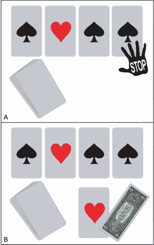

# 第一部分. 案例研究 1：在纸牌游戏中找到获胜策略

## 问题陈述

你想赢一点钱吗？让我们以小额赌注打一场纸牌游戏。在你面前是一副洗好的牌。所有 52 张牌都是面朝下的。一半的牌是红色的，一半是黑色的。我将逐一翻开这些牌。如果最后一张我翻到的牌是红色的，你将赢得一美元。否则，你将损失一美元。

这里有个转折：你可以随时让我停止游戏。一旦你说“停止”，我将翻开下一张牌并结束游戏。那张下一张牌将作为最终牌。如果你翻到的牌是红色的，如图 CS1.1 所示，你将赢得一美元。

图 CS1.1 翻牌游戏。我们从一副洗好的牌开始。我反复翻开牌堆顶部的牌。（A）我刚刚翻到了第四张牌。你指示我停下来。（B）我翻到了最后一张牌，也就是第五张牌。最后一张牌是红色的。你赢得一美元。

我们可以玩多少次就玩多少次。每次游戏结束后，牌组都会重新洗牌。每一轮结束后，我们将交换金钱。你如何才能在这场游戏中取得胜利？

## 概述

为了解决眼前的问题，我们需要知道如何

1.  使用样本空间分析计算可观察事件的概率。

1.  在一系列的区间值上绘制事件的概率。

1.  使用 Python 模拟随机过程，例如抛硬币和洗牌。

1.  使用置信区间分析评估从模拟中得出的决策的信心。
