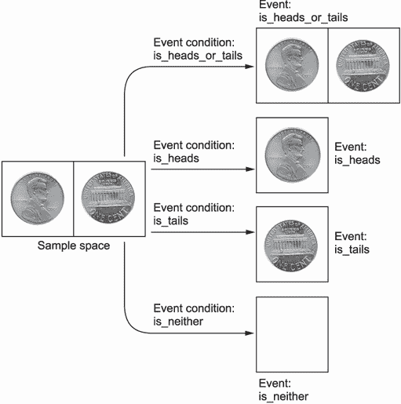

# 1 使用 Python 计算概率

本节涵盖

+   概率论的基本原理是什么？

+   计算单个观察的概率

+   在一系列观察中计算概率

生活中很少有事情是确定的；大多数事情都是由机会驱动的。无论何时我们为我们的最喜欢的运动队欢呼，或者购买彩票，或者在股市中进行投资，我们都希望得到某种特定的结果，但这个结果永远不能得到保证。随机性渗透到我们的日常生活中。幸运的是，这种随机性仍然可以减轻和控制。我们知道某些不可预测的事件发生的频率比其他事件低，而且某些决策的不确定性比其他风险更高的选择要小。开车上班比骑摩托车安全。将部分储蓄投资到退休账户比将所有筹码都押在一手黑杰克上要安全。我们可以本能地感觉到这些确定性的权衡，因为即使是最不可预测的系统仍然显示出一些可预测的行为。这些行为已经通过**概率论**进行了严格的研究。概率论是数学的一个本质上复杂的分支。然而，理论的一些方面可以在不了解数学基础的情况下理解。事实上，复杂的概率问题可以在 Python 中解决，而不需要知道任何数学方程。这种无方程式的方法需要了解数学家所说的**样本空间**的基础知识。

## 1.1 样本空间分析：一种无需方程式的方法来衡量结果的不确定性

某些行为会产生可衡量的结果。**样本空间**是指一个行为可能产生的所有可能结果的集合。让我们以抛硬币这个简单的行为为例。硬币将落在正面或反面。因此，抛硬币将产生两种可衡量的结果：**正面**或**反面**。通过将这些结果存储在 Python 集合中，我们可以创建一个抛硬币的样本空间。

列表 1.1 创建抛硬币的样本空间

```
sample_space = {'Heads', 'Tails'}    ❶
```

❶ 使用花括号存储元素创建 Python 集合。Python 集合是一组唯一的、无序的元素集合。

假设我们随机选择`sample_space`中的一个元素。所选元素等于`正面`的频率是多少？我们的样本空间包含两个可能的元素。每个元素在集合内的空间中占据相等的比例。因此，我们预计正面将以 1/2 的频率被选中。这个频率正式定义为结果**概率**。`sample_space`中的所有结果都具有相同的概率，该概率等于`1 / len(sample_space)`。

列表 1.2 计算正面的概率

```
probability_heads = 1 / len(sample_space)
print(f'Probability of choosing heads is {probability_heads}')

Probability of choosing heads is 0.5
```

选择 `正面` 的概率等于 0.5。这直接关系到抛硬币的动作。我们假设硬币是不偏不倚的，这意味着硬币落在正面或反面是同等可能的。因此，抛硬币在概念上等同于从 `sample_space` 中选择一个随机元素。因此，硬币落在正面的概率是 0.5；它落在反面的概率也等于 0.5。

我们已经为我们两个可测量的结果分配了概率。然而，我们还可以提出其他问题。硬币落在正面或反面的概率是多少？或者，更奇特的是，硬币在空中旋转永远不落在正面或反面的概率是多少？为了找到严格的答案，我们需要定义事件的定义。事件是 `sample_space` 中满足某些 *事件条件*（如图 1.1 所示）的元素子集。事件条件是一个简单的布尔函数，其输入是一个单个 `sample_space` 元素。该函数仅在元素满足我们的条件约束时返回 `True`。



图 1.1 将四个事件条件应用于样本空间。样本空间包含两个结果：正面和反面。箭头代表事件条件。每个事件条件都是一个是或否函数。每个函数过滤掉那些不满足其条款的结果。剩余的结果形成一个事件。每个事件包含样本空间中找到的结果的子集。可能存在四个事件：正面、反面、正面或反面，以及既不是正面也不是反面。

让我们定义两个事件条件：一个硬币落在正面或反面，另一个硬币既不落在正面也不落在反面。

列表 1.3 定义事件条件

```
def is_heads_or_tails(outcome):  return outcome in {'Heads', 'Tails'}
def is_neither(outcome): return not is_heads_or_tails(outcome)
```

此外，为了完整性，让我们为满足我们两个潜在结果之一的基本事件定义事件条件。

列表 1.4 定义附加事件条件

```
def is_heads(outcome): return outcome == 'Heads'
def is_tails(outcome): return outcome == 'Tails'
```

我们可以将事件条件传递给一个通用的 `get_matching_event` 函数。该函数在列表 1.5 中定义。其输入是一个事件条件和通用样本空间。该函数遍历通用样本空间，并返回满足 `event_condition(outcome)` 为 `True` 的结果集。

列表 1.5 定义事件检测函数

```
def get_matching_event(event_condition, sample_space):
    return set([outcome for outcome in sample_space
                if event_condition(outcome)])
```

让我们在我们的四个事件条件上执行 `get_matching_event`。然后我们将输出四个提取的事件。

列表 1.6 使用事件条件检测事件

```
event_conditions = [is_heads_or_tails, is_heads, is_tails, is_neither]

for event_condition in event_conditions:
    print(f"Event Condition: {event_condition.__name__}")      ❶
    event = get_matching_event(event_condition, sample_space)
    print(f'Event: {event}\n')
Event Condition: is_heads_or_tails
Event: {'Tails', 'Heads'}

Event Condition: is_heads
Event: {'Heads'}

Event Condition: is_tails
Event: {'Tails'}

Event Condition: is_neither
Event: set()
```

❶ 打印事件条件函数的名称

我们已成功从 `sample_space` 中提取了四个事件。每个事件发生的概率是多少？之前我们展示了公平硬币单个元素结果的概率是 `1 / len(sample_space)`。这个性质可以推广到多元素事件。事件的概率等于 `len(event) / len(sample_space)`，但前提是所有结果都以相同的可能性发生。换句话说，公平硬币的多元素事件的概率等于事件大小除以样本空间大小。我们现在使用事件大小来计算四个事件的概率。

列表 1.7 计算事件概率

```
def compute_probability(event_condition, generic_sample_space):
    event = get_matching_event(event_condition, generic_sample_space)    ❶
    return len(event) / len(generic_sample_space)                        ❷

for event_condition in event_conditions:
    prob = compute_probability(event_condition, sample_space)
    name = event_condition.__name__
    print(f"Probability of event arising from '{name}' is {prob}")

Probability of event arising from 'is_heads_or_tails' is 1.0
Probability of event arising from 'is_heads' is 0.5
Probability of event arising from 'is_tails' is 0.5
Probability of event arising from 'is_neither' is 0.0
```

❶ `compute_probability` 函数提取与输入事件条件相关的事件以计算其概率。

❷ 概率等于事件大小除以样本空间大小。

执行的代码输出了各种事件概率，最小值为 0.0，最大值为 1.0。这些值代表概率的下限和上限；没有任何概率会低于 0.0 或高于 1.0。

### 1.1.1 分析有偏硬币

我们计算了一个无偏硬币的概率。如果这个硬币是有偏的，会发生什么？例如，假设一个硬币相对于尾巴落在头部的可能性是四倍。我们如何计算那些不以相等方式加权的结果的概率？嗯，我们可以构建一个由 Python 字典表示的加权样本空间。每个结果被视为一个键，其值映射到相关的权重。在我们的例子中，`Heads` 的权重是 `Tails` 的四倍，所以我们把 `Tails` 映射到 `1`，把 `Heads` 映射到 `4`。

列表 1.8 表示加权样本空间

```
weighted_sample_space = {'Heads': 4, 'Tails': 1}
```

我们的新样本空间存储在字典中。这允许我们将样本空间的大小重新定义为所有字典权重的总和。在 `weighted_sample_space` 中，这个总和将是 5。

列表 1.9 检查加权样本空间大小

```
sample_space_size = sum(weighted_sample_space.values())
assert sample_space_size == 5
```

我们可以用类似的方式重新定义事件大小。每个事件是一组结果，这些结果映射到权重。对权重求和得到事件大小。因此，满足 `is_heads_or_tails` 事件条件的事件大小也是 5。

列表 1.10 检查加权事件大小

```
event = get_matching_event(is_heads_or_tails, weighted_sample_space)    ❶
event_size = sum(weighted_sample_space[outcome] for outcome in event)
assert event_size == 5
```

❶ 作为提醒，这个函数遍历输入样本空间中的每个结果。因此，它将在我们的字典输入上按预期工作。这是因为 Python 遍历字典键，而不是像许多其他流行编程语言中的键值对。

我们对样本空间大小和事件大小的推广定义使我们能够创建一个 `compute_event_probability` 函数。该函数接受一个 `generic_sample_space` 变量作为输入，该变量可以是加权字典或无加权集合。

列表 1.11 定义一个推广的事件概率函数

```
def compute_event_probability(event_condition, generic_sample_space):
    event = get_matching_event(event_condition, generic_sample_space)
    if type(generic_sample_space) == type(set()):                      ❶
        return len(event) / len(generic_sample_space)

    event_size = sum(generic_sample_space[outcome]
                     for outcome in event)
    return event_size / sum(generic_sample_space.values())
```

❶ 检查 generic_event_space 是否为集合

现在我们可以输出所有偏硬币的事件概率，而无需重新定义我们的四个事件条件函数。

列表 1.12 计算加权事件概率

```
for event_condition in event_conditions:
    prob = compute_event_probability(event_condition, weighted_sample_space)
    name = event_condition.__name__
    print(f"Probability of event arising from '{name}' is {prob}")

Probability of event arising from 'is_heads' is 0.8
Probability of event arising from 'is_tails' is 0.2
Probability of event arising from 'is_heads_or_tails' is 1.0
Probability of event arising from 'is_neither' is 0.0
```

只需几行代码，我们就构建了一个用于解决概率中许多问题的工具。让我们将这个工具应用于比简单抛硬币更复杂的问题。

## 1.2 计算非平凡概率

我们现在将使用 `compute_event_probability` 解决几个示例问题。

### 1.2.1 问题 1：分析一个有四个孩子的家庭

假设一个家庭有四个孩子。恰好有两个孩子是男孩的概率是多少？我们将假设每个孩子成为男孩或女孩的可能性是相等的。因此，我们可以构建一个无权样本空间，其中每个结果代表四个孩子的一种可能的序列，如图 1.2 所示。


图 1.2 四个兄弟姐妹的样本空间。样本空间中的每一行包含 16 种可能结果中的 1 种。每个结果代表四个孩子的唯一组合。每个孩子的性别由一个字母表示：B 代表男孩，G 代表女孩。有两个男孩的结果用箭头标记。有六个这样的箭头；因此，有两个男孩的概率等于 6 / 16。

列表 1.13 计算孩子的样本空间

```
possible_children = ['Boy', 'Girl']
sample_space = set()
for child1 in possible_children:
    for child2 in possible_children:
        for child3 in possible_children:
            for child4 in possible_children:
                outcome = (child1, child2, child3, child4)    ❶
                sample_space.add(outcome)
```

❶ 每个四个孩子的可能序列由一个四元素元组表示。

我们运行了四个嵌套的 `for` 循环来探索四个出生的序列。这不是代码的高效使用。我们可以更轻松地使用 Python 内置的 `itertools.product` 函数来生成我们的样本空间，该函数返回所有输入列表中所有元素的成对组合。接下来，我们将四个 `possible_children` 列表的实例输入到 `itertools.product` 中。然后，乘积函数遍历列表的所有四个实例，计算列表元素的组合。最终输出等于我们的样本空间。

列表 1.14 使用 `product` 计算样本空间

```
from itertools import product
all_combinations = product(*(4 * [possible_children]))     ❶
assert set(all_combinations) == sample_space               ❷
```

❶ 星号运算符 (`*`) 解包存储在列表中的多个参数。然后，这些参数被传递到指定的函数中。因此，调用 `product(*(4 * [possible_children]))` 等同于调用 `product(possible_children, possible_children, possible_children, possible_children)`。

❷ 注意，运行此行后，all_combinations 将为空。这是因为乘积返回一个 Python 迭代器，它只能迭代一次。对我们来说，这不是问题。我们即将更高效地计算样本空间，并且 all_combinations 不会在未来的代码中使用。

通过执行 `set(product(possible_children, repeat=4))`，我们可以使我们的代码更加高效。一般来说，运行 `product(possible_children, repeat=n)` 返回一个关于 `n` 个孩子所有可能组合的可迭代对象。

列表 1.15 将 `repeat` 传递给 `product`

```
sample_space_efficient = set(product(possible_children, repeat=4))
assert sample_space == sample_space_efficient
```

让我们计算 `sample_space` 中由有两个男孩的家庭组成的比例。我们定义一个 `has_two_boys` 事件条件，然后将其传递给 `compute_event_probability`。

列表 1.16 计算两个男孩的概率

```
def has_two_boys(outcome): return len([child for child in outcome
                                      if child == 'Boy']) == 2
prob = compute_event_probability(has_two_boys, sample_space)
print(f"Probability of 2 boys is {prob}")

Probability of 2 boys is 0.375
```

在一个有四个孩子的家庭中，恰好有两个男孩出生的概率是 0.375。由此推断，我们预计有 37.5%的四个孩子的家庭将包含相等数量的男孩和女孩。当然，实际观察到的有两个男孩的家庭百分比将因随机机会而有所不同。

### 1.2.2 问题 2：分析多次掷骰子

假设我们展示了一个公平的六面骰子，其面值从 1 到 6。骰子被掷了六次。这六个掷骰子的总和为 21 的概率是多少？

我们首先定义任何单次掷骰子的可能值。这些是介于 1 到 6 之间的整数。

列表 1.17 定义六面骰子的所有可能掷法

```
possible_rolls = list(range(1, 7))
print(possible_rolls)

[1, 2, 3, 4, 5, 6]
```

接下来，我们使用 `product` 函数创建六次连续掷骰子的样本空间。

列表 1.18 六次连续掷骰子的样本空间

```
sample_space = set(product(possible_rolls, repeat=6))
```

最后，我们定义一个 `has_sum_of_21` 事件条件，然后将其传递给 `compute_event_probability`。

列表 1.19 计算掷骰子总和的概率

```
def has_sum_of_21(outcome): return sum(outcome) == 21

prob = compute_event_probability(has_sum_of_21, sample_space)
print(f"6 rolls sum to 21 with a probability of {prob}")       ❶

6 rolls sum to 21 with a probability of 0.09284979423868313
```

❶ 从概念上讲，掷一个骰子六次等同于同时掷六个骰子。

六次掷骰子的总和为 21 的概率超过 9%。请注意，我们的分析可以使用 lambda 表达式更简洁地编码。*Lambda 表达式* 是一行匿名函数，不需要名称。在这本书中，我们使用 lambda 表达式将简短函数传递给其他函数。

列表 1.20 使用 lambda 表达式计算概率

```
prob = compute_event_probability(lambda x: sum(x) == 21, sample_space)   ❶
assert prob == compute_event_probability(has_sum_of_21, sample_space)
```

❶ Lambda 表达式允许我们在一行代码中定义简短函数。编码 lambda x: 等同于编码 func(x):。因此，lambda x: sum(x) == 21 等同于 has_sum_of_21\。

### 1.2.3 问题 3：使用加权样本空间计算掷骰子概率

我们刚刚计算了六次掷骰子总和为 21 的概率。现在，让我们使用加权样本空间重新计算这个概率。我们需要将我们的未加权样本空间集合转换为加权样本空间字典；这需要我们识别所有可能的掷骰子总和。然后我们必须计算每个总和在所有可能的掷骰子组合中出现的次数。这些组合已经存储在我们的计算过的 `sample_space` 集合中。通过将掷骰子总和映射到它们的出现次数，我们将产生一个 `weighted_sample_space` 结果。

列表 1.21 将掷骰子总和映射到出现次数

```
from collections import defaultdict        ❶
weighted_sample_space = defaultdict(int)   ❷
for outcome in sample_space:               ❸
    total = sum(outcome)                   ❹
    weighted_sample_space[total] += 1      ❺
```

❶ 此模块返回所有键都分配了默认值的字典。例如，defaultdict(int) 返回一个字典，其中每个键的默认值设置为零。

❷ weighted_sample 字典将每个总和的六次掷骰子组合映射到其出现次数。

❸ 每个结果都包含六个掷骰子的唯一组合。

❹ 计算六个独特骰子掷出的总和

❺ 更新求和骰子值的出现次数

在我们重新计算概率之前，让我们简要地探讨一下`weighted_sample_space`的性质。样本空间中的所有权重并不相等——有些权重比其他权重小得多。例如，要使骰子点数之和为 6，只有一种方式：必须恰好掷出六个 1 才能达到这种骰子点数组合。因此，我们预计`weighted_sample_space[6]`等于 1。我们也预计`weighted_sample_space[36]`也等于 1，因为我们必须掷出六个 6 才能达到总和 36。

列表 1.22 检查非常罕见的掷骰子组合

```
assert weighted_sample_space[6] == 1
assert weighted_sample_space[36] == 1
```

同时，`weighted_sample_space[21]`的值明显更高。

列表 1.23 检查更常见的掷骰子组合

```
num_combinations = weighted_sample_space[21]
print(f"There are {num_combinations } ways for 6 die rolls to sum to 21")

There are 4332 ways for 6 die rolls to sum to 21
```

如输出所示，有 4,332 种方式可以使六个骰子掷出的点数之和为 21。例如，我们可以掷出四个 4，然后是一个 3 和一个 2。或者我们可以掷出三个 4，然后是一个 5、一个 3 和一个 1。还有成千上万的其他组合是可能的。这就是为什么 21 的和比 6 的和更可能的原因。

列表 1.24 探索不同的求和方式以得到 21

```
assert sum([4, 4, 4, 4, 3, 2]) == 21
assert sum([4, 4, 4, 5, 3, 1]) == 21
```

注意，观察到的 4,332 次出现次数等于掷骰子点数之和为 21 的未加权事件的长度。此外，`weighted_sample`中的值之和等于`sample_space`的长度。因此，未加权事件和加权事件概率计算之间存在直接联系。

列表 1.25 比较加权事件和常规事件

```
event = get_matching_event(lambda x: sum(x) == 21, sample_space)
assert weighted_sample_space[21] == len(event)
assert sum(weighted_sample_space.values()) == len(sample_space)
```

现在让我们使用`weighted_sample_space`字典重新计算概率。掷出 21 的最终概率应该保持不变。

列表 1.26 计算掷骰子的加权事件概率

```
prob = compute_event_probability(lambda x: x == 21,
                                 weighted_sample_space)
assert prob == compute_event_probability(has_sum_of_21, sample_space)
print(f"6 rolls sum to 21 with a probability of {prob}")

6 rolls sum to 21 with a probability of 0.09284979423868313
```

使用加权样本空间而不是未加权样本空间的优点是什么？更少的内存使用！正如我们接下来要看到的，未加权的`sample_space`集合比加权样本空间字典多约 150 倍元素。

列表 1.27 比较加权与未加权事件空间大小

```
print('Number of Elements in Unweighted Sample Space:')
print(len(sample_space))
print('Number of Elements in Weighted Sample Space:')
print(len(weighted_sample_space))
Number of Elements in Unweighted Sample Space:
46656
Number of Elements in Weighted Sample Space:
31
```

## 1.3 在区间范围内计算概率

到目前为止，我们只分析了满足某个单一值的事件条件。现在我们将分析跨越数值区间的的事件条件。一个*区间*是介于两个边界截止点之间（包括这两个边界点）的所有数字的集合。让我们定义一个`is_in_interval`函数，该函数检查一个数字是否落在指定的区间内。我们将通过传递`minimum`和`maximum`参数来控制区间边界。

列表 1.28 定义区间函数

```
def is_in_interval(number, minimum, maximum):
    return minimum <= number <= maximum          ❶
```

❶ 定义一个包含最小/最大边界的闭区间。然而，在需要时也可以定义开区间。在开区间中，至少有一个边界被排除。

给定`is_in_interval`函数，我们可以计算事件相关值落在某个数值范围内的概率。例如，让我们计算连续掷六个骰子点数之和在 10 到 21（包括 21）之间的可能性。

列表 1.29 计算区间概率

```
prob = compute_event_probability(lambda x: is_in_interval(x, 10, 21),  ❶
                                 weighted_sample_space)
print(f"Probability of interval is {prob}")

Probability of interval is 0.5446244855967078
```

❶ 一个接受输入 x 并返回 x 是否落在 10 到 21 之间的区间的 Lambda 函数。这个单行 Lambda 函数作为我们的事件条件。

六次骰子投掷中有超过 54%的时间会落在该区间范围内。因此，如果出现 13 或 20 的点数总和，我们不应该感到惊讶。

### 1.3.1 使用区间分析评估极端值

区间分析对于解决概率和统计学中一类非常重要的问题至关重要。这类问题之一涉及极端值的评估：这个问题归结为观察到的数据是否过于极端以至于不可信。

当数据过于不寻常，以至于不可能由随机机会发生时，数据看起来就极端。例如，假设我们观察到一个声称是公平的硬币的 10 次投掷，并且该硬币有 8 次落在正面。这是公平硬币的一个合理结果吗？或者我们的硬币是否秘密偏向于落在正面？为了找出答案，我们必须回答以下问题：10 次公平硬币投掷导致极端数量的正面的概率是多少？我们将极端正面数定义为 8 个或更多。因此，我们可以将问题描述如下：10 次公平硬币投掷产生 8 到 10 个正面的概率是多少？

我们将通过计算区间概率来找到答案。然而，首先我们需要每个可能的 10 次投掷硬币序列的样本空间。让我们生成一个加权的样本空间。如前所述，这比使用非加权表示更有效。

以下代码创建了一个`weighted_sample_space`字典。其键等于可观察到的总正面数，范围从 0 到 10。这些正面数对应于值。每个值包含包含相关正面数的硬币投掷组合数。因此，我们预计`weighted_sample_space[10]`等于 1，因为只有一种可能的方式连续投掷硬币 10 次并得到 10 个正面。同时，我们预计`weighted_sample_space[9]`等于 10，因为在一个 9 个正面的组合中，一个反面可以出现在 10 个不同的位置。

列表 1.30 计算 10 次硬币投掷的样本空间

```
def generate_coin_sample_space(num_flips=10):                         ❶
    weighted_sample_space = defaultdict(int)
    for coin_flips in product(['Heads', 'Tails'], repeat=num_flips):
        heads_count = len([outcome for outcome in coin_flips          ❷
                          if outcome == 'Heads'])
        weighted_sample_space[heads_count] += 1

    return weighted_sample_space

weighted_sample_space = generate_coin_sample_space()
assert weighted_sample_space[10] == 1
assert weighted_sample_space[9] == 1
```

❶ 为了可重用性，我们定义了一个通用函数，该函数返回 num_flips 次硬币投掷的加权样本空间。num_flips 参数预设为 10 次硬币投掷。

❷ 在 num_flips 次硬币投掷的独特序列中正面的数量

我们已经准备好了加权的样本空间。我们现在计算观察到一个从 8 到 10 个正面的区间的概率。

列表 1.31 计算极端正面数的概率

```
prob = compute_event_probability(lambda x: is_in_interval(x, 8, 10),
                                 weighted_sample_space)
print(f"Probability of observing more than 7 heads is {prob}")

Probability of observing more than 7 heads is 0.0546875
```

抛掷十次公平的硬币，出现超过七个正面的情况大约有 5%的时间。我们观察到的正面数量并不常见。这难道意味着硬币是偏的？不一定。我们还没有考虑极端的尾数。如果我们观察到八个尾数而不是八个正面，我们仍然会对硬币表示怀疑。我们计算出的区间没有考虑这种极端情况——相反，我们将八个或更多的尾数视为另一种正常可能性。为了评估硬币的公平性，我们必须包括观察到八个或更多尾数的可能性。这相当于观察到两个或更少的正面。

让我们将问题表述如下：十次公平的硬币抛掷产生 0 到 2 个正面或 8 到 10 个正面的概率是多少？或者，更简洁地说，硬币抛掷不产生 3 到 7 个正面的概率是多少？这个概率在这里被计算出来。

列表 1.32 计算极端区间概率

```
prob = compute_event_probability(lambda x: not is_in_interval(x, 3, 7),
                                 weighted_sample_space)
print(f"Probability of observing more than 7 heads or 7 tails is {prob}")

Probability of observing more than 7 heads or 7 tails is 0.109375
```

抛掷十次公平的硬币，至少出现八个相同结果的情况大约有 10%的时间。这个概率很低，但仍在可接受的范围内。没有额外的证据，很难判断硬币是否真正偏斜。所以，让我们收集这些证据。假设我们再抛掷硬币十次，并且出现 8 个更多的正面。这使我们的总抛掷次数达到 20 次，其中正面数为 16 次。我们对硬币公平性的信心已经降低，但降低了多少？我们可以通过测量概率的变化来找出答案。让我们找出 20 次公平的硬币抛掷不产生 5 到 15 个正面的概率。

列表 1.33 分析 20 次公平硬币抛掷的极端正面计数

```
weighted_sample_space_20_flips = generate_coin_sample_space(num_flips=20)
prob = compute_event_probability(lambda x: not is_in_interval(x, 5, 15),
                                 weighted_sample_space_20_flips)
print(f"Probability of observing more than 15 heads or 15 tails is {prob}")

Probability of observing more than 15 heads or 15 tails is 0.01181793212890625
```

更新后的概率已从大约 0.1 下降到大约 0.01。因此，新增的证据导致我们对硬币公平性的信心下降了十倍。尽管概率有所下降，但正面与尾数的比例仍然保持在 4 比 1。我们的原始和更新后的实验都产生了 80%的正面和 20%的尾数。这引发了一个有趣的问题：为什么随着硬币抛掷次数的增加，观察极端结果的可能性会下降？我们可以通过详细的数学分析来找出答案。然而，一个更直观的解决方案是可视化我们两个样本空间字典中头数分布。这种可视化将有效地是键（头数）与值（组合计数）的图表。我们可以使用 Matplotlib 来完成这个图表，这是 Python 最受欢迎的可视化库。在下一节中，我们将讨论 Matplotlib 的使用及其在概率论中的应用。

## 摘要

+   *样本空间*是所有可能结果的总和，一个动作可以产生这些结果。

+   *事件*是样本空间的一个子集，只包含满足某些*事件条件*的那些结果。事件条件是一个布尔函数，它接受一个结果作为输入，并返回`True`或`False`。

+   事件的**概率**等于事件结果在整个样本空间所有可能结果中的比例。

+   概率可以在**数值区间**上计算。区间被定义为介于两个边界值之间的所有数字的集合。

+   区间概率对于确定一个观察值是否显得异常非常有用。
