# 2 使用 Matplotlib 绘制概率

本节涵盖

+   使用 Matplotlib 创建简单图表

+   标记绘制的数据

+   什么是概率分布？

+   绘制和比较多个概率分布

数据图是任何数据科学家工具箱中最有价值的工具之一。没有良好的可视化，我们实际上无法从数据中提取洞察力。幸运的是，我们拥有外部 Python Matplotlib 库，该库完全优化用于输出高质量的图表和数据可视化。在本节中，我们使用 Matplotlib 更好地理解我们在第一部分中计算的抛硬币概率。

## 2.1 基本 Matplotlib 图表

让我们从安装 Matplotlib 库开始。

注意：从命令行终端调用`pip install matplotlib`以安装 Matplotlib 库。

安装完成后，导入`matplotlib.pyplot`，这是库的主要绘图模块。根据惯例，该模块通常使用简短的别名`plt`导入。

列表 2.1 导入 Matplotlib

```
import matplotlib.pyplot as plt
```

我们现在将使用`plt.plot`绘制一些数据。该方法接受两个可迭代对象：`x`和`y`。调用`plt.plot(x, y)`准备一个`x`与`y`的二维图；显示图表需要后续调用`plt.show()`。让我们将`x`赋值为从 0 到 10 的整数，将`y`值赋值为`x`值的两倍。以下代码可视化了这个线性关系（图 2.1）。

列表 2.2 绘制线性关系图

```
x = range(0, 10)
y = [2 * value for value in x]
plt.plot(x, y)
plt.show()
```

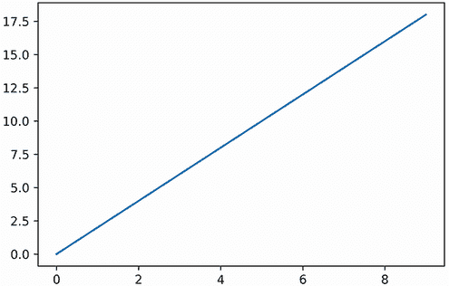

图 2.1 `x`与`2x`的 Matplotlib 图。`x`变量代表从 0 到 10 的整数。

警告：线性图中的坐标轴不是均匀分布的，因此绘制的线条看起来比实际要平缓。我们可以通过调用`plt.axis('equal')`来使两个坐标轴均匀分布。然而，这将导致包含过多空白的尴尬可视化。在本书中，我们依靠 Matplotlib 的自动坐标轴调整，同时仔细观察调整后的长度。

可视化已完成。在其内部，我们使用平滑的线段连接了 10 个 y 轴点。如果我们希望单独可视化这 10 个点，可以使用`plt.scatter`方法（图 2.2）。

列表 2.3 绘制单个数据点

```
plt.scatter(x, y)
plt.show()
```

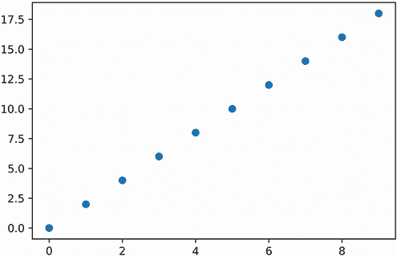

图 2.2 `x`与`2 * x`的 Matplotlib 散点图。`x`变量代表从 0 到 10 的整数。单独的整数在图中以散点形式可见。

假设我们想强调 `x` 从 2 开始到 6 结束的区间。我们通过使用 `plt.fill_between` 方法在指定区间内绘制曲线下的区域来实现这一点。该方法接受 `x` 和 `y` 作为输入，还有一个 `where` 参数，它定义了区间覆盖范围。`where` 参数的输入是一个布尔值列表，其中元素为 `True` 如果对应的 `x` 值在指定的区间内。在下面的代码中，我们将 `where` 参数设置为 `[is_in_interval(value, 2, 6) for value in x]`。我们还执行了 `plt.plot(x,y)` 来将阴影区间与平滑连接的线并置（图 2.3）。

列表 2.4 在连接图下方着色区间

```
plt.plot(x, y)
where = [is_in_interval(value, 2, 6) for value in x]
plt.fill_between(x, y, where=where)
plt.show()
```

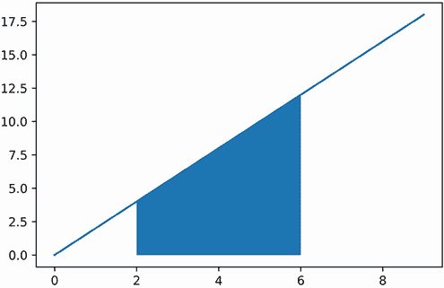

图 2.3 一个带有阴影区间的连接图。该区间覆盖了 2 和 6 之间的所有值。

到目前为止，我们已经回顾了三种可视化方法：`plt.plot`、`plt.scatter` 和 `plt.fill_between`。让我们在一个单独的图中执行所有三种方法（图 2.4）。这样做可以突出显示连续线下方的区间，同时暴露单个坐标。

列表 2.5 在连续图中暴露单个坐标

```
plt.scatter(x, y)
plt.plot(x, y)
plt.fill_between(x, y, where=where)
plt.show()

```


图 2.4 一个连接图和一个带有阴影区间的散点图。图中的单个整数以点标记，形成一个平滑、不可分割的线。

没有描述性的 x 轴和 y 轴标签，数据图永远不会真正完整。这些标签可以使用 `plt.xlabel` 和 `plt.ylabel` 方法设置（图 2.5）。

列表 2.6 添加轴标签

```
plt.plot(x, y)
plt.xlabel('Values between zero and ten')
plt.ylabel('Twice the values of x')
plt.show()

```

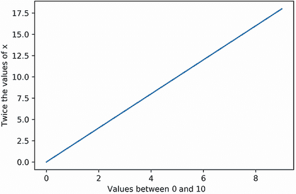

图 2.5 带有 x 轴和 y 轴标签的 Matplotlib 图

常见 Matplotlib 方法

+   `plt.plot(x, y)`—绘制 `x` 的元素与 `y` 的元素的关系图。绘制点使用平滑线段连接。

+   `plt.scatter(x, y)`—绘制 `x` 的元素与 `y` 的元素的关系图。绘制点单独可视化，并且没有任何线条连接。

+   `plt.fill_between(x, y, where=booleans)`—突出显示绘制曲线下方的区域子集。曲线是通过绘制 `x` 与 `y` 的关系获得的。`where` 参数定义了所有突出显示的区间；它接受一个布尔值列表，对应于 `x` 的元素。每个布尔值如果其对应的 `x` 值位于突出显示的区间内则为 `True`。

+   `plt.xlabel(label)`—将绘制曲线的 x 标签设置为 `label`。

+   `plt.ylabel(label)`—将绘制曲线的 y 标签设置为 `label`。

## 2.2 绘制抛硬币概率图

我们现在有了可视化抛硬币次数与正面概率之间关系的工具。在第一部分中，我们考察了在一系列抛硬币中看到 80% 或更多正面的概率。随着抛硬币次数的增加，这个概率降低了，我们想知道原因。我们将通过绘制头数与它们相关的抛硬币组合次数来找出答案。这些值已经在我们的第一部分分析中计算过了。`weighted_sample_space` 字典中的键包含了 10 次抛硬币中所有可能出现的头数。这些头数映射到组合次数。同时，`weighted_sample_space_20_flips` 字典包含了 20 次抛硬币的头数映射。

我们的目的是比较这两个字典中绘制的数据。我们首先绘制 `weighted_sample_space` 的元素：我们在 x 轴上绘制其键，在 y 轴上绘制相关的值。x 轴对应于 `'Head-count'`，y 轴对应于 `'具有 x 个头的硬币抛掷组合数'`。我们使用散点图直接可视化键到值的映射，而不连接任何绘制的点（图 2.6）。

列表 2.7 绘制抛硬币加权样本空间

```
x_10_flips = list(weighted_sample_space.keys())
y_10_flips = [weighted_sample_space[key] for key in x_10_flips]
plt.scatter(x_10_flips, y_10_flips)
plt.xlabel('Head-count')
plt.ylabel('Number of coin-flip combinations with x heads')
plt.show()
```

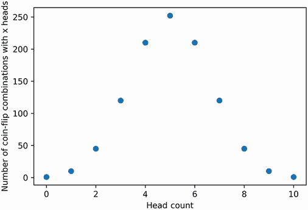

图 2.6 10 次抛硬币样本空间的散点图表示。对称图以 10 次计数中 5 次为峰值中心。

可视化的样本空间呈现出对称形状。对称性围绕一个峰值头数 5 设置。因此，接近 5 的头数组合出现的频率高于远离 5 的头数组合。正如我们在前一节中学到的，这样的频率对应于概率。因此，如果头数的值接近 5，那么出现头数的概率就更高。让我们通过直接在 y 轴上绘制概率来强调这一点（图 2.7）。概率图将允许我们用更简洁的 `'Probability'` 替换我们冗长的 y 轴标签。我们可以通过将现有的组合次数除以总样本空间大小来计算 y 轴的概率。

列表 2.8 绘制抛硬币概率图

```
sample_space_size = sum(weighted_sample_space.values())
prob_x_10_flips = [value / sample_space_size for value in y_10_flips]
plt.scatter(x_10_flips, prob_x_10_flips)
plt.xlabel('Head-count')
plt.ylabel('Probability')
plt.show()
```

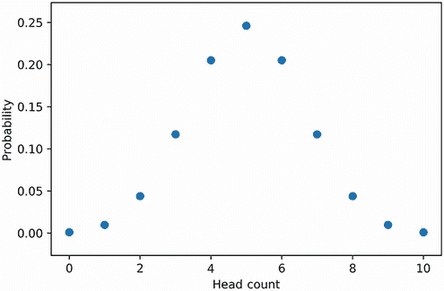

图 2.7 将头数映射到其发生概率的散点图。通过直接查看图表可以推断出概率。

我们的图表使我们能够直观地估计任何头数出现的概率。因此，只需扫一眼图表，我们就能确定观察到五个头的概率大约为 0.25。这种 x 值与概率之间的映射被称为 *概率分布*。概率分布表现出某些数学上的一致特性，这使得它们对似然分析很有用。例如，考虑任何概率分布的 x 值：它们对应于随机变量 `r` 的所有可能值。`r` 落在某个区间内的概率等于该区间内概率曲线下方的面积。因此，概率分布下方的总面积总是等于 1.0。这对于任何分布都成立，包括我们的头数图表。列表 2.9 通过执行 `sum(prob_x_10_flips)` 来确认这一点。

注意：我们可以通过使用垂直矩形来计算每个头数概率 `p` 下的面积。矩形的高度是 `p`。由于 x 轴上所有连续的头数间隔都是一单位，所以矩形的宽度是 1.0。因此，矩形的面积是 `p * 1.0`，等于 `p`。因此，分布下方的总面积等于 `sum([p for p in prob_x_10_flips])`。在第三部分中，我们将更深入地探讨如何使用矩形来确定面积。

列表 2.9 确认所有概率之和为 1.0

```
assert sum(prob_x_10_flips) == 1.0
```

头数区间 8 到 10 下的面积等于观察八个或更多头的概率。让我们使用 `plt.fill_between` 方法来可视化这个面积。我们还利用 `plt.plot` 和 `plt.scatter` 来显示包含阴影区间的单个头数（图 2.8）。

列表 2.10 阴影表示概率曲线下的区间

```
plt.plot(x_10_flips, prob_x_10_flips)
plt.scatter(x_10_flips, prob_x_10_flips)
where = [is_in_interval(value, 8, 10) for value in x_10_flips]
plt.fill_between(x_10_flips, prob_x_10_flips, where=where)
plt.xlabel('Head-count')
plt.ylabel('Probability')
plt.show()

```

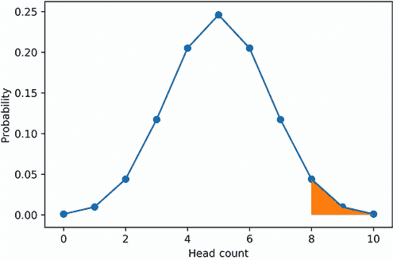

图 2.8 硬币翻转概率分布的平滑图表和散点图表示。阴影区间覆盖头数 8 到 10。阴影面积等于观察八个或更多头的概率。

注意：我们故意平滑了阴影区间，以制作一个视觉上吸引人的图表。然而，真正的区间面积并不平滑：它由离散的矩形块组成，类似于阶梯。这些阶梯是离散的，因为头数是不可分割的整数。如果我们想可视化实际的阶梯形面积，我们可以将 `ds="steps-mid"` 参数传递给 `plt.plot`，并将 `step="mid"` 参数传递给 `plt.fill_between`。

现在，让我们也阴影表示观察八个尾巴或更多尾巴的概率区间。以下代码突出了概率分布两端尾部的极端值（图 2.9）。

列表 2.11 阴影表示概率曲线极端值下的区间

```
plt.plot(x_10_flips, prob_x_10_flips)
plt.scatter(x_10_flips, prob_x_10_flips)
where = [not is_in_interval(value, 3, 7) for value in x_10_flips]
plt.fill_between(x_10_flips, prob_x_10_flips, where=where)
plt.xlabel('Head-count')
plt.ylabel('Probability')
plt.show()
```


图 2.9 抛硬币概率分布的叠加平滑图和散点图表示。两个着色区间跨越了极端数量的正面和反面。这些区间是对称的，从视觉上暗示它们的概率是相等的。

两个对称着色的区间覆盖了抛硬币曲线的左右尾部。根据我们之前的分析，我们知道观察到超过七个正面或反面的概率大约是 10%。因此，每个对称着色的尾段应该覆盖曲线下总面积的大约 5%。

### 2.2.1 比较多个抛硬币概率分布

绘制 10 次抛硬币分布有助于更直观地理解相关的区间概率。让我们扩展我们的图表，包括 20 次抛硬币的分布。我们将在这张图上绘制两个分布，但首先我们必须计算 20 次抛硬币分布的 x 轴头数和 y 轴概率。

列表 2.12 计算 20 次抛硬币分布的概率

```
x_20_flips = list(weighted_sample_space_20_flips.keys())
y_20_flips = [weighted_sample_space_20_flips[key] for key in x_20_flips]
sample_space_size = sum(weighted_sample_space_20_flips.values())
prob_x_20_flips = [value / sample_space_size for value in y_20_flips]
```

现在，我们已经准备好同时可视化两个分布（图 2.10）。我们通过在两个概率分布上执行`plt.plot`和`plt.scatter`来实现这一点。我们还向这些方法调用传递了一些与样式相关的参数。其中一个参数是`color`：为了区分第二个分布，我们将它的颜色设置为`black`，通过传递`color='black'`。或者，我们可以通过传递`'k'`来避免输入整个颜色名称，这是 Matplotlib 表示黑色的单字符代码。我们还可以通过其他方式使第二个分布突出：将`linestyle='--'`传递给`plt.plot`确保使用虚线而不是实线连接分布点。我们还可以通过将`marker='x'`传递给`plt.scatter`来使用 x 形标记而不是实心圆来区分各个点。最后，我们通过将`label`参数传递给我们的两个`plt.plot`调用并执行`plt.legend()`方法来添加图例。在图例中，10 次抛硬币分布和 20 次抛硬币分布分别标记为 A 和 B。

列表 2.13 绘制两个同时分布

```
plt.plot(x_10_flips, prob_x_10_flips, label='A: 10 coin-flips')
plt.scatter(x_10_flips, prob_x_10_flips)
plt.plot(x_20_flips, prob_x_20_flips, color='black', linestyle='--',
        label='B: 20 coin-flips')
plt.scatter(x_20_flips, prob_x_20_flips, color='k', marker='x')
plt.xlabel('Head-count')
plt.ylabel('Probability')
plt.legend()

plt.show()
```


图 2.10 10 次抛硬币的概率分布（A）和 20 次抛硬币的概率分布（B）。20 次抛硬币的分布用虚线和 x 形散点标记。

常见的 Matplotlib 样式参数

+   `color`—确定绘制输出的颜色。此设置可以是颜色名称或单字符代码。`color='black'`和`color='k'`都生成黑色图表，而`color='red'`和`color='r'`都生成红色图表。

+   `linestyle`—确定连接数据点的绘图线的样式。其默认值等于`'-'.` 输入`linestyle='-'`生成一条连接线，`linestyle='--'`生成一条虚线，`linestyle=':'`生成一条点线，而`linestyle='.'`生成由交替的点划线组成的线。

+   `marker`—确定分配给单独绘制的点的样式。其默认值等于`'o'`。输入`marker='o'`生成圆形标记，`marker='x'`生成 X 形标记，`marker='s'`生成方形标记，而`marker='p'`生成五边形标记。

+   `label`—将标签映射到指定的颜色和样式。这种映射出现在图表的图例中。需要后续调用`plt.legend()`来使图例可见。

我们已经可视化了我们的两个分布。接下来，我们在每个曲线（图 2.11）上突出显示我们感兴趣的区间（80%正面或反面）。请注意，分布 B 尾部末端的面积非常小；我们移除了散点，以更清晰地突出尾部区间。我们还用更透明的`linestyle=':'`替换了分布 B 的线型。

列表 2.14 突出显示两个绘图分布下的区间

```
plt.plot(x_10_flips, prob_x_10_flips, label='A: 10 coin-flips')
plt.plot(x_20_flips, prob_x_20_flips, color='k', linestyle=':',
         label='B: 20 coin-flips')

where_10 = [not is_in_interval(value, 3, 7) for value in x_10_flips]
plt.fill_between(x_10_flips, prob_x_10_flips, where=where_10)
where_20 = [not is_in_interval(value, 5, 15) for value in x_20_flips]
plt.fill_between(x_20_flips, prob_x_20_flips, where=where_20)

plt.xlabel('Head-Count')
plt.ylabel('Probability')
plt.legend()
plt.show()

```

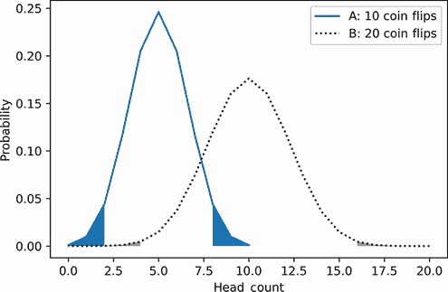

图 2.11 10 次抛硬币（A）和 20 次抛硬币（B）的概率分布。两个分布下的阴影区间代表极端的正面和反面数量。分布 B 下的阴影区间占分布 A 下阴影区间的十分之一。

分布 B 尾部末端的阴影区域远低于分布 A 下的阴影区间。这是因为分布 A 的尾部更厚、更高，覆盖了更大的面积。尾部的厚度解释了区间概率的差异。

可视化是有信息的，但只有当我们突出显示两条曲线下的区间区域时。如果没有调用`plt.fill_between`，我们就无法回答我们之前提出的问题：为什么随着公平硬币被抛掷的次数增加，观察到 80%或更多正面朝上的概率会降低？答案难以外推，因为这两个分布重叠很少，直接进行视觉比较很困难。也许我们可以通过调整分布峰值来改进图表。分布 A 以 5 次正面朝上（10 次抛硬币中的）为中心，而分布 B 以 10 次正面朝上（20 次抛硬币中的）为中心。如果我们把正面朝上的次数转换为频率（通过除以总抛硬币次数），那么两个分布峰值应该都调整到 0.5 的频率。这种转换也应该使我们的 8 到 10 和 16 到 20 的正面朝上次数区间对齐，以便它们都位于 0.8 到 1.0 的区间内。让我们执行这种转换并重新生成图表（图 2.12）。

列表 2.15 将正面朝上次数转换为频率

```
x_10_frequencies = [head_count /10 for head_count in x_10_flips]
x_20_frequencies = [head_count /20 for head_count in x_20_flips]

plt.plot(x_10_frequencies, prob_x_10_flips, label='A: 10 coin-flips')
plt.plot(x_20_frequencies, prob_x_20_flips, color='k', linestyle=':', label='B: 20 coin-flips')
plt.legend()

plt.xlabel('Head-Frequency')
plt.ylabel('Probability')
plt.show()
```

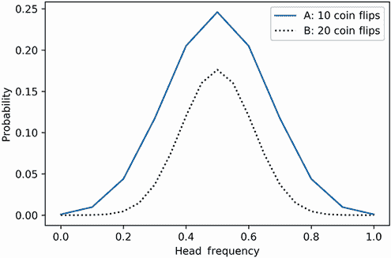

图 2.12 展示了 10 次抛硬币（A）和 20 次抛硬币（B）的次数频率与概率的对比图。两个 y 轴峰值都对应于 0.5 的频率。A 的面积完全覆盖了 B 的面积，因为每个图表的总面积不再相加等于 1.0。

如预期的那样，两个峰值现在都对应于 0.5 的次数频率。然而，我们的次数除法将两个曲线下的面积分别减少了十倍和二十倍。每个曲线下的总面积不再等于 1.0。这是一个问题：正如我们讨论的那样，如果我们希望推断区间概率，曲线下的总面积必须等于 1.0。但是，如果我们将曲线 A 和 B 的 y 轴值分别乘以 10 和 20，我们可以修正面积总和。调整后的 y 值将不再表示概率，因此我们需要给它们取另一个名字。合适的术语是*相对似然性*，它在数学上指的是曲线内 y 轴的值，其总面积为 1.0。因此，我们将新的 y 轴变量命名为`relative_likeliness_10`和`relative_likeliness_20`。

列表 2.16 计算频率的相对似然性

```
relative_likelihood_10 = [10 * prob for prob in prob_x_10_flips]
relative_likelihood_20 = [20 * prob for prob in prob_x_20_flips]
```

转换已完成。现在是时候绘制我们的两个新曲线，同时突出显示与我们的`where_10`和`where_20`布尔数组相关的区间（图 2.13）。

列表 2.17 绘制对齐的相对似然曲线

```
plt.plot(x_10_frequencies, relative_likelihood_10, label='A: 10 coin-flips')
plt.plot(x_20_frequencies, relative_likelihood_20, color='k',
         linestyle=':', label='B: 20 coin-flips')

plt.fill_between(x_10_frequencies, relative_likelihood_10, where=where_10)
plt.fill_between(x_20_frequencies, relative_likelihood_20, where=where_20)

plt.legend()
plt.xlabel('Head-Frequency')
plt.ylabel('Relative Likelihood')
plt.show()
```

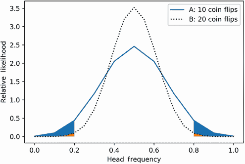

图 2.13 展示了 10 次抛硬币（A）和 20 次抛硬币（B）的次数频率与它们的相对似然性的对比图。两个图表下的阴影区间代表极端的正面和反面次数。这些区间的面积对应于概率，因为每个图表的总面积相加等于 1.0。

在图表中，曲线 A 看起来像一位身材短小但肩宽的健美运动员，而曲线 B 则可以与一个更高更瘦的人相比较。由于曲线 A 更宽，它在更极端的次数频率区间上的面积更大。因此，当抛硬币次数为 10 次而不是 20 次时，观察到这种频率的记录更有可能发生。同时，更细、更垂直的曲线 B 在 0.5 的中央频率周围覆盖了更多的面积。

如果我们抛超过 20 枚硬币，这会如何影响我们的频率分布？根据概率论，每次额外的抛硬币都会使频率曲线变得更高、更细（图 2.14）。曲线将像被垂直向上拉的橡皮筋一样变形：它会以垂直长度为代价失去厚度。当总抛硬币次数扩展到数百万和数十亿时，曲线将完全失去其宽度，变成一个中心位于 0.5 频率的单个非常长的垂直峰值。超过这个频率，垂直线下方的非存在区域将趋近于零。因此，峰值下方的面积将趋近于 1.0，因为我们的总面积必须始终等于 1.0。1.0 的面积对应于 1.0 的概率。因此，随着抛硬币次数趋近于无穷大，正面的频率将绝对确定地等于实际的正面概率。

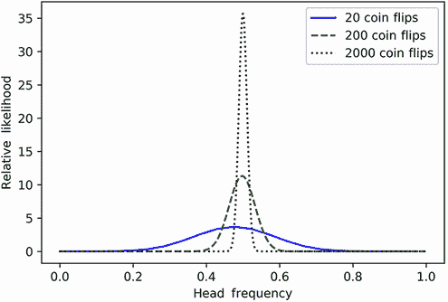

图 2.14 假设的计数频率随抛硬币次数增加而绘制的图表。所有 y 轴峰值都位于 0.5 的频率上。随着抛硬币次数的增加，峰值越来越高，越来越窄。在 2,000 次抛硬币时，峰值的狭窄区域几乎完全集中在 0.5 上。随着抛硬币次数无限增加，结果峰值应该延伸成一条垂直线，完美地定位在 0.5 上。

无限次抛硬币与绝对确定性之间的关系由概率论中的一个基本定理保证：*大数定律*。根据该定律，当观察次数增加时，观察频率几乎无法与观察概率区分开来。因此，随着抛硬币次数的增加，我们的正面频率将等于实际的正面概率，即 0.5。除了简单的抛硬币之外，我们还可以将大数定律应用于更复杂的现象，例如牌局。如果我们进行足够的牌局模拟，那么我们的获胜频率将等于实际的获胜概率。

在下一节中，我们将展示如何将大数定律与随机模拟相结合，以近似复杂的概率。最终，我们将执行模拟来找到随机抽取的牌的概率。然而，正如大数定律所表明的，这些模拟必须在规模大、计算成本高的范围内运行。因此，高效的模拟实现需要我们熟悉 NumPy 数值计算库。该库在第三部分中进行了讨论。

## 摘要

+   通过将每个可能的数值观察与其概率进行对比，我们生成一个概率分布。概率分布下方的总面积等于 1.0。分布特定区间的下方面积等于在该区间内观察到某个值的概率。

+   概率分布的 y 轴值不一定需要等于概率，只要绘制的面积总和为 1.0 即可。

+   公平硬币抛掷序列的概率分布类似于一个对称曲线。其 x 轴的正面次数可以转换为频率。在转换过程中，我们可以通过将 y 轴的概率转换为相对可能性来保持面积为 1.0。转换后的曲线峰值位于 0.5 的频率处。如果抛硬币的次数增加，那么峰值也会上升，同时曲线的两侧也会变得更加狭窄。

+   根据大数定律，任何观察的频率将随着观察次数的增加而趋近于该观察的概率。因此，当抛硬币的次数增加时，公平硬币分布将主要由其中心频率 0.5 所主导。
