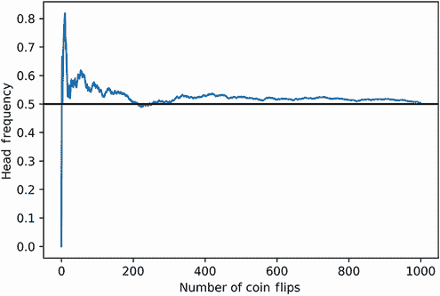
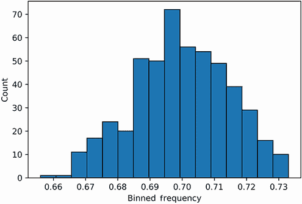
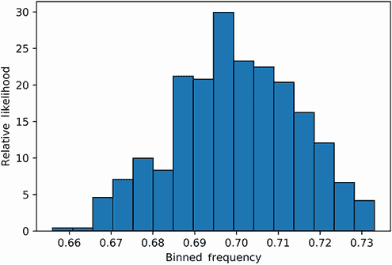
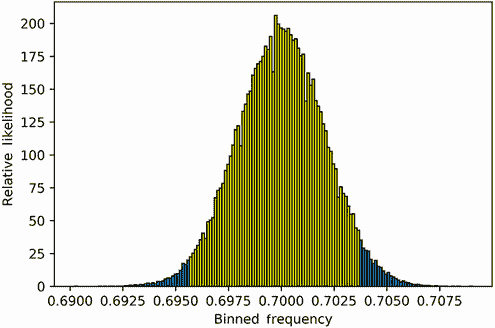

# 3 在 NumPy 中运行随机模拟

本节涵盖

+   NumPy 库的基本用法

+   使用 NumPy 模拟随机观察

+   可视化模拟数据

+   从模拟观察中估计未知概率

NumPy，代表数值 Python，是驱动 Python 数据科学的引擎。尽管 Python 有许多优点，但它并不适合大规模的数值分析。因此，数据科学家必须依赖外部 NumPy 库来高效地操作和存储数值数据。NumPy 是处理大量原始数字的强大工具。因此，许多 Python 的外部数据处理库都与 NumPy 兼容。其中一个库是我们在上一节中介绍的 Matplotlib。本书后面的部分将讨论其他由 NumPy 驱动的库。本节重点介绍随机数值模拟。我们将使用 NumPy 来分析数十亿个随机数据点；这些随机观察将使我们能够学习隐藏的概率。

## 3.1 使用 NumPy 模拟随机抛硬币和掷骰子

NumPy 应该已经作为 Matplotlib 的要求之一安装在你的工作环境中。让我们根据 NumPy 的常用约定导入 NumPy 为`np`。

注意 NumPy 也可以通过在命令行终端中调用`pip install numpy`独立于 Matplotlib 进行安装。

列表 3.1 导入 NumPy

```
import numpy as np
```

现在已经导入了 NumPy，我们可以使用`np.random`模块进行随机模拟。该模块用于生成随机值和模拟随机过程。例如，调用`np.random.randint(1, 7)`会生成一个介于 1 到 6 之间的随机整数。该方法从六个可能的整数中以相等的概率进行选择，从而模拟掷一个标准骰子的单次滚动。

列表 3.2 模拟掷骰子

```
die_roll = np.random.randint(1, 7)
assert 1 <= die_roll <= 6
```

生成的`die_roll`值是随机的，其分配的值将在本书的读者之间有所不同。这种不一致性可能会使本节中某些随机模拟的完美重现变得困难。我们需要一种确保我们所有的随机输出都可以在家重现的方法。方便的是，通过调用`np.random.seed(0)`可以轻松地保持一致性；这个方法调用使得随机选择的值序列可重现。调用后，我们可以直接保证我们的前三次骰子滚动将落在值 5、6 和 1 上。

列表 3.3 设置可重现的随机骰子滚动

```
np.random.seed(0)
die_rolls = [np.random.randint(1, 7) for _ in range(3)]
assert die_rolls == [5, 6, 1]
```

将输入的`x`调整为`np.random.randint(0, x)`可以使我们模拟任何数量的离散结果。例如，将`x`设置为 52 将模拟随机抽取一张牌。或者，将`x`设置为 2 将模拟掷一枚公平的硬币。让我们通过调用`np.random.randint(0, 2)`来生成这次硬币翻转；这个方法调用返回一个等于 0 或 1 的随机值。我们假设 0 代表反面，1 代表正面。

列表 3.4 模拟一次公平的硬币翻转

```
np.random.seed(0)
coin_flip = np.random.randint(0, 2)
print(f"Coin landed on {'heads' if coin_flip == 1 else 'tails'}")

Coin landed on tails
```

接下来，我们模拟 10 次硬币抛掷，然后计算观察到的正面频率。

列表 3.5 模拟 10 次公平硬币抛掷

```
np.random.seed(0)
def frequency_heads(coin_flip_sequence):
    total_heads = len([head for head in coin_flip_sequence if head == 1])  ❶
    return total_heads / len(coin_flip_sequence)

coin_flips = [np.random.randint(0, 2) for _ in range(10)]
freq_heads = frequency_heads(coin_flips)
print(f"Frequency of Heads is {freq_heads}")

Frequency of Heads is 0.8
```

❶ 注意，我们可以通过运行`sum(coin_flip_sequence)`来更有效地计算正面计数。

观察到的频率是 0.8，这与实际的正面概率相当不成比例。然而，正如我们所学的，10 次硬币抛掷大约有 10%的时间会产生这样的极端频率。需要更多的抛掷次数来估计实际概率。

让我们看看当我们抛掷 1,000 次硬币时会发生什么。每次抛掷后，我们记录序列中观察到的总正面频率。一旦硬币抛掷完成，我们通过绘制硬币抛掷次数与频率计数的关系（图 3.1）来可视化我们的输出。我们的图表还包括一条沿实际概率 0.5 的水平线。我们通过调用`plt.axhline(0.5, color='k')`来生成这条线。

列表 3.6 绘制模拟的公平硬币抛掷频率

```
np.random.seed(0)
coin_flips = []
frequencies = []
for _ in range(1000):
    coin_flips.append(np.random.randint(0, 2))
    frequencies.append(frequency_heads(coin_flips))

plt.plot(list(range(1000)), frequencies)
plt.axhline(0.5, color='k')
plt.xlabel('Number of Coin Flips')
plt.ylabel('Head-Frequency')
plt.show()
```



图 3.1 公平硬币抛掷次数与观察到的正面计数频率的对比。频率在稳定在大约 0.5 之前波动得很厉害。

正面的概率缓慢地收敛到 0.5。因此，大数定律似乎得到了证实。

### 3.1.1 分析有偏硬币抛掷

我们已经模拟了一系列无偏硬币抛掷，但如果我们希望模拟一个 70%概率落在正面的硬币呢？嗯，我们可以通过调用`np.random.binomial(1, 0.7)`来生成这种有偏输出。二项式方法名称指的是通用的硬币抛掷分布，数学家称之为*二项分布*。该方法接受两个参数：抛掷硬币的次数和期望的硬币抛掷结果概率。该方法执行指定次数的有偏硬币抛掷，然后计算观察到的期望结果出现的实例数。当抛掷硬币的次数设置为 1 时，该方法返回 0 或 1 的二进制值。在我们的情况下，1 代表我们期望观察到的正面。

列表 3.7 模拟有偏硬币抛掷

```
np.random.seed(0)
print("Let's flip the biased coin once.")
coin_flip = np.random.binomial(1, 0.7)
print(f"Biased coin landed on {'heads' if coin_flip == 1 else 'tails'}.")

print("\nLet's flip the biased coin 10 times.")
number_coin_flips = 10
head_count = np.random.binomial(number_coin_flips, .7)
print((f"{head_count} heads were observed out of "
       f"{number_coin_flips} biased coin flips"))
Let's flip the biased coin once.
Biased coin landed on heads.

Let's flip the biased coin 10 times.
6 heads were observed out of 10 biased coin flips
```

让我们生成 1,000 次有偏硬币抛掷的序列。然后我们检查频率是否收敛到 0.7。

列表 3.8 计算硬币抛掷频率收敛

```
np.random.seed(0)
head_count = np.random.binomial(1000, 0.7)
frequency = head_count / 1000
print(f"Frequency of Heads is {frequency}")

Frequency of Heads is 0.697
```

正面的频率大约为 0.7，但并不等于 0.7。实际上，频率值比真正的正面概率小 0.003 个单位。假设我们重新计算 1,000 次硬币抛掷的频率五次。所有的频率都会低于 0.7 吗？某些频率会达到精确的 0.7 值吗？我们将通过执行五次循环迭代的`np.random.binomial(1000, 0.7)`来找出答案。

列表 3.9 重新计算硬币抛掷频率收敛

```
np.random.seed(0)
assert np.random.binomial(1000, 0.7) / 1000 == 0.697     ❶
for i in range(1, 6):
    head_count = np.random.binomial(1000, 0.7)
    frequency = head_count / 1000
    print(f"Frequency at iteration {i} is {frequency}")
    if frequency == 0.7:
        print("Frequency equals the probability!\n")

Frequency at iteration 1 is 0.69
Frequency at iteration 2 is 0.7
Frequency equals the probability!

Frequency at iteration 3 is 0.707
Frequency at iteration 4 is 0.702
Frequency at iteration 5 is 0.699
```

❶ 作为提醒，我们设置了随机数生成器的种子以保持输出的一致性。因此，我们的第一次伪随机采样将返回之前观察到的频率 0.697。我们将跳过这个结果以生成五个新的频率。

五次迭代中只有一次的测量值等于实际概率。两次测量的频率略低，两次略高。观察到的频率似乎在每次 1,000 次抛掷的抽样中都会波动。这似乎表明，尽管大数定律允许我们近似实际概率，但仍然存在一些不确定性。数据科学有些混乱，我们并不能总是对我们的数据得出的结论有绝对的把握。然而，我们可以使用数学家所说的*置信区间*来衡量和限制我们的不确定性。

## 3.2 使用直方图和 NumPy 数组计算置信区间

假设我们得到了一枚我们不知道其偏差的硬币。我们抛掷这枚硬币 1,000 次，观察到频率为 0.709。我们知道频率近似于实际概率，但近似程度是多少？更精确地说，实际概率落在接近 0.709 的区间（例如 0.7 和 0.71 之间的区间）内的概率有多大？为了找出答案，我们必须进行额外的抽样。

我们之前已经对硬币进行了五次 1,000 次抛掷的迭代抽样。抽样产生了频率的一些波动。让我们通过将频率计数从 5 增加到 500 来探索这些波动。我们可以通过运行`[np.random.binomial(1000, 0.7) for _ in range(500)]`来进行这项补充抽样。

列表 3.10 每个样本 500 次抛掷计算频率

```
np.random.seed(0)
head_count_list = [np.random.binomial(1000, 0.7) for _ in range(500)]
```

然而，我们可以通过运行`np.random.binomial(coin_flip_count, 0.7, size=500)`来更有效地在 500 次迭代中进行抽样。可选的`size`参数允许我们执行`np.random.binomial(coin_flip_count, 0.7)` 500 次，同时使用 NumPy 的内部优化。

列表 3.11 优化抛掷硬币频率的计算

```
np.random.seed(0)
head_count_array = np.random.binomial(1000, 0.7, 500)
```

输出不是一个 Python 列表，而是一个 NumPy 数组数据结构。正如之前提到的，NumPy 数组可以更有效地存储数值数据。`head_count_array`和`head_count_list`中存储的实际数值量保持不变。我们通过使用`head_count_array.tolist()`方法将数组转换为列表来证明这一点。

列表 3.12 将 NumPy 数组转换为 Python 列表

```
assert head_count_array.tolist() == head_count_list
```

相反，我们也可以通过调用`np.array(head_count_list)`将我们的 Python 列表转换为等价的价值 NumPy 数组。转换后的数组和`head_count_array`之间的等价性可以使用`np.array_equal`方法来确认。

列表 3.13 将 Python 列表转换为 NumPy 数组

```
new_array = np.array(head_count_list)
assert np.array_equal(new_array, head_count_array) == True
```

为什么我们应该优先使用 NumPy 数组而不是标准的 Python 列表？好吧，除了上述内存优化和分析速度提升之外，NumPy 使编写干净的代码变得更加容易。例如，NumPy 提供了更直接的乘法和除法。直接将 NumPy 数组除以`x`会创建一个新的数组，其元素都被除以`x`。因此，执行`head_count_array / 1000`将自动将我们的头数转换为频率。相比之下，计算`head_count_list`的频率需要我们遍历列表中的所有元素或使用 Python 复杂的`map`函数。

列表 3.14 使用 NumPy 计算频率

```
frequency_array = head_count_array / 1000
assert frequency_array.tolist() == [head_count / 1000
                                    for head_count in head_count_list]
assert frequency_array.tolist() == list(map(lambda x: x / 1000,
                                        head_count_list))
```

有用的 NumPy 随机模拟方法

+   `np.random.randint(x, y)`—返回一个介于`x`和`y-1`之间的随机整数（包含`y-1`）。

+   `np.random.binomial(1, p)`—返回一个等于 0 或 1 的单个随机值。该值等于 1 的概率是`p`。

+   `np.random.binomial(x, p)`—运行`x`个`np.random.binomial(1, p)`实例，并返回总和结果。返回值表示`x`个样本中非零观察值的数量。

+   `np.random.binomial(x, p, size=y)`—返回一个包含`y`个元素的数组。每个数组元素等于`np.random.binomial(x, p)`的随机输出。

+   `np.random.binomial(x, p, size=y) / x`—返回一个包含`y`个元素的数组。每个元素代表`x`个样本中非零观察值的频率。

我们已经通过简单的除法操作将头数数组转换为频率数组。让我们更详细地探索`frequency_array`的内容。我们首先使用与 Python 列表相同的`:`索引切片分隔符输出前 20 个样本频率。请注意，与打印的列表不同，NumPy 数组在其输出中不包含逗号。

列表 3.15 打印 NumPy 频率数组

```
print(frequency_array[:20])

[ 0.697  0.69   0.7    0.707  0.702  0.699  0.723  0.67   0.702  0.713
  0.721  0.689  0.711  0.697  0.717  0.691  0.731  0.697  0.722  0.728]
```

样本频率在 0.69 到约 0.731 之间波动。当然，`frequency_array`中还有额外的 480 个频率。让我们通过调用`frequency_array.min()`和`frequency_array.max()`方法来提取最小和最大数组值。

列表 3.16 查找最大和最小频率值

```
min_freq = frequency_array.min()
max_freq = frequency_array.max()
print(f"Minimum frequency observed: {min_freq}")
print(f"Maximum frequency observed: {max_freq}")
print(f"Difference across frequency range: {max_freq - min_freq}")

Minimum frequency observed: 0.656
Maximum frequency observed: 0.733
Difference across frequency range: 0.07699999999999996
```

真实概率的头数位于 0.656 到 0.733 的频率范围内。这个区间跨度明显很大，最大和最小样本值之间有超过 7%的差异。也许我们可以通过将所有唯一频率与其出现次数（图 3.2）相对应来缩小频率范围。


图 3.2 500 个头数频率的散点图，与频率计数相对应。频率集中在 0.7 附近。某些接近的频率在图中表现为重叠的点。

列表 3.17 绘制测量频率

```
frequency_counts = defaultdict(int)
for frequency in frequency_array:
    frequency_counts[frequency] += 1

frequencies = list(frequency_counts.keys())
counts = [frequency_counts[freq] for freq in frequencies]
plt.scatter(frequencies, counts)
plt.xlabel('Frequency')
plt.ylabel('Count')
plt.show()
```

这种可视化很有信息量：接近 0.7 的频率比其他更远的值更常见。然而，我们的图表也存在缺陷，因为几乎相同的频率在图表中表现为重叠的点。我们应该将这些邻近频率分组在一起，而不是将它们视为单独的点。

### 3.2.1 在直方图图中分组相似点

让我们尝试一种更细致的视觉化方法，通过将彼此接近的频率分组在一起。我们将频率范围细分为 *N* 个等间距的组，然后将所有频率值放入这些组中的一个。根据定义，任何给定组中的值最多相隔 1/*N* 个单位。然后我们计算每个组中的总值，并使用图表来可视化这些计数。

我们刚才描述的基于组的图表称为 *直方图*。我们可以通过调用 `plt.hist` 在 Matplotlib 中生成直方图。该方法接受要分组的值的序列和一个可选的 `bins` 参数，该参数指定总的组数。因此，调用 `plt.hist(frequency_array, bins=77)` 将将我们的数据分布在 77 个组中，每个组覆盖 0.01 个单位的宽度。或者，我们可以传递 `bins=auto`，Matplotlib 将使用一种常见的优化技术（其细节超出了本书的范围）选择合适的组宽。让我们通过调用 `plt.hist(frequency_array, bins='auto')`（图 3.3）来优化组宽并绘制直方图。

注意：在列表 3.18 中，我们还包括了一个 `edgecolor='black'` 参数。这有助于我们通过将组边框着色为黑色来在视觉上区分组之间的边界。

列表 3.18 使用 `plt.hist` 绘制频率直方图

```
plt.hist(frequency_array, bins='auto', edgecolor='black')
plt.xlabel('Binned Frequency')
plt.ylabel('Count')
plt.show()
```

在我们的绘制直方图中，频率计数最高的组位于 0.69 和 0.70 之间。这个组比其他大约十个组明显高。我们可以使用 `counts` 获得更精确的组计数，这是 `plt.hist` 返回的 NumPy 数组。该数组包含每个分组组的 y 轴频率计数。让我们调用 `plt.hist` 返回 `counts`，然后通过访问 `counts.size` 来找到分组组的总数。

列表 3.19 在绘制的直方图中计数组

```
counts, _, _ = plt.hist(frequency_array, bins='auto',    ❶
                        edgecolor='black')

print(f"Number of Bins: {counts.size}")

Number of Bins: 16
```

❶ `counts` 是 `plt.hist` 返回的三个变量之一。其他变量将在本节后面讨论。

直方图中有 16 个组。每个组的宽度是多少？我们可以通过将总频率范围除以 16 来找出答案。或者，我们可以使用 `bin_edges` 数组，这是 `plt.hist` 返回的第二个变量。这个数组包含图表中垂直组边界的 x 轴位置。因此，任何两个连续边界位置之间的差值等于组宽。

列表 3.20 在直方图中查找组宽

```
counts, bin_edges, _ = plt.hist(frequency_array, bins='auto',
                                edgecolor='black')

bin_width = bin_edges[1] - bin_edges[0]
assert bin_width == (max_freq - min_freq) / counts.size
print(f"Bin width: {bin_width}")

Bin width: 0.004812499999999997
```



图 3.3 500 个分组频率的直方图，与每个组中的元素数量相对应。元素最多的组位于频率 0.7 附近。

注意：`bin_edges` 的大小总是比 `counts` 的大小多一个。这是为什么？想象一下，如果我们只有一个矩形箱子：它将被两条垂直线所界定。添加一个额外的箱子也会增加边界大小 1。如果我们将这个逻辑外推到 *N* 个箱子，那么我们预计会看到 *N* + 1 条边界线。

可以将 `bin_edges` 数组与 `counts` 结合使用，以输出任何指定箱子的元素计数和覆盖范围。让我们定义一个 `output_bin_coverage` 函数，该函数打印任何位置 `i` 的箱子的计数和覆盖范围。

列表 3.21 获取一个箱子的频率和大小

```
def output_bin_coverage(i):

    count = int(counts[i])                                 ❶
    range_start, range_end = bin_edges[i], bin_edges[i+1]  ❷
    range_string = f"{range_start} - {range_end}"
    print((f"The bin for frequency range {range_string} contains "
           f"{count} element{'' if count == 1 else 's'}"))

output_bin_coverage(0)
output_bin_coverage(5)
The bin for frequency range 0.656 - 0.6608125 contains 1 element
The bin for frequency range 0.6800625 - 0.684875 contains 20 elements
```

❶ 位置 i 的箱子包含 counts[i] 个频率。

❷ 位置 i 的箱子覆盖的频率范围是从 bin_edges[i] 到 bin_edges[i+1]。

现在，让我们计算我们直方图中最高的峰值对应的计数和频率范围。为此，我们需要 `counts.max()` 的索引。方便的是，NumPy 数组有一个内置的 `argmax` 方法，它返回数组中最大值的索引。

列表 3.22 查找数组最大值的索引

```
assert counts[counts.argmax()] == counts.max()
```

因此，调用 `output_bin_coverage(counts.argmax())` 应该会提供我们请求的输出。

列表 3.23 使用 `argmax` 返回直方图的峰值

```
output_bin_coverage(counts.argmax())

The bin for frequency range 0.6945 - 0.6993125 contains 72 elements
```

### 3.2.2 从直方图中推导概率

在直方图中，最常占据的箱子包含 72 个元素，覆盖的频率范围大约在 0.694 到 0.699 之间。我们如何确定实际的正面概率是否落在这个范围内（在不事先知道答案的情况下）？一个选择是计算随机测量的频率落在 0.694 到 0.699 之间的可能性。如果这个可能性是 1.0，那么 100% 的测量频率都会被这个范围覆盖。这些测量频率偶尔会包括实际的正面概率，因此我们可以 100% 确信我们的真实概率位于 0.694 和 0.699 之间。即使可能性较低，在 95% 的情况下，我们仍然可以相当自信地认为这个范围包含了我们的真实概率值。

我们应该如何计算可能性？之前，我们展示了区间可能性的等于曲线下的面积，但只有当总绘制的面积加起来等于 1.0 时。我们直方图下的面积大于 1.0，因此必须通过将 `density=True` 传递给 `plt.hist` 来修改它。传递的参数保持直方图的形状，同时强制其面积的总和等于 1.0。

列表 3.24 绘制直方图的相对可能性

```
likelihoods, bin_edges, _ = plt.hist(frequency_array, bins='auto',
                                     edgecolor='black', density=True)
plt.xlabel('Binned Frequency')
plt.ylabel('Relative Likelihood')
plt.show()
```

现在已将分箱计数替换为相对似然性，这些似然性存储在`likelihoods`数组中（图 3.4）。正如我们讨论的，*相对似然性*是一个应用于面积总和为 1.0 的图表 y 值的术语。当然，我们直方图下的面积现在总和为 1.0。我们可以通过求和每个区间的矩形面积来证明这一点，这等于区间的垂直似然值乘以`bin_width`。因此，直方图下的面积等于总和似然性乘以`bin_width`。因此，调用`likelihoods.sum() * bin_width`应该返回面积为 1.0。



图 3.4 500 个分箱频率的直方图，与它们相关的相对似然性绘制。直方图的面积总和为 1.0。该面积可以通过对每个区间的矩形面积求和来计算。

注意：总面积等于直方图中矩形面积的总和。在图 3.4 中，最长矩形的长度相当大，所以我们直观地估计总面积大于 1.0。

列表 3.25 计算直方图下的总面积

```
assert likelihoods.sum() * bin_width == 1.0
```

直方图的总面积等于 1.0。因此，直方图峰值下的面积现在等于随机采样频率落在 0.694 到 0.699 区间范围内的概率。让我们通过计算位于`likelihoods.argmax()`的区间的面积来计算这个值。

列表 3.26 计算峰值频率的概率

```
index = likelihoods.argmax()
area = likelihoods[index] * bin_width
range_start, range_end = bin_edges[index], bin_edges[index+1]
range_string = f"{range_start} - {range_end}"
print(f"Sampled frequency falls within interval {range_string} with
        probability {area}")

Sampled frequency falls within interval 0.6945 - 0.6993125 with probability 0.144
```

概率大约为 14%。这个值较低，但我们可以通过将区间范围扩展到超过一个区间来增加它。我们将范围扩展以覆盖索引为`likelihoods.argmax() - 1`和`likelihoods.argmax() + 1`的相邻区间。

注意：为了提醒，Python 的索引表示法包含起始索引，但不包含结束索引。因此，我们将结束索引设置为等于`likelihoods.argmax() + 2`，以便包括`likelihoods.argmax() + 1`。

列表 3.27 增加频率范围的概率

```
peak_index = likelihoods.argmax()
start_index, end_index = (peak_index - 1, peak_index + 2)
area = likelihoods[start_index: end_index + 1].sum() * bin_width
range_start, range_end = bin_edges[start_index], bin_edges[end_index]
range_string = f"{range_start} - {range_end}"
print(f"Sampled frequency falls within interval {range_string} with
        probability {area}")

Sampled frequency falls within interval 0.6896875 - 0.704125 with probability 0.464
```

三个区间覆盖的频率范围大约为 0.689 到 0.704。它们相关的概率是 0.464。因此，这三个区间代表了统计学家所说的 46.4%的*置信区间*，这意味着我们有 46.4%的信心认为我们的真实概率落在三个区间的范围内。这个置信百分比太低。统计学家更喜欢 95%或更高的置信区间。我们通过迭代扩展最左侧的区间和最右侧的区间，直到区间面积超过 0.95，以达到这个置信区间。

列表 3.28 计算高置信区间

```
def compute_high_confidence_interval(likelihoods, bin_width):
    peak_index = likelihoods.argmax()
    area = likelihoods[peak_index] * bin_width
    start_index, end_index = peak_index, peak_index + 1
    while area < 0.95:
        if start_index > 0:
            start_index -= 1
        if end_index < likelihoods.size - 1:
            end_index += 1

        area = likelihoods[start_index: end_index + 1].sum() * bin_width

    range_start, range_end = bin_edges[start_index], bin_edges[end_index]
    range_string = f"{range_start:.6f} - {range_end:.6f}"
    print((f"The frequency range {range_string} represents a "
           f"{100 * area:.2f}% confidence interval"))
    return start_index, end_index

compute_high_confidence_interval(likelihoods, bin_width)

The frequency range 0.670438 - 0.723375 represents a 95.40% confidence interval
```

大约为 0.670 到 0.723 的频率范围代表 95.4%置信区间。因此，1,000 次有偏硬币翻转的样本序列应该有 95.4%的时间落在该范围内。我们有相当大的信心认为真实概率位于 0.670 和 0.723 之间。然而，我们仍然不能确定真实概率更接近 0.67 还是 0.72。我们需要以某种方式缩小这个范围以获得更准确的概率估计。

### 3.2.3 缩小高置信区间的范围

我们如何缩小范围同时保持 95%的置信区间？或许我们应该尝试将频率计数从 500 提升到一个明显更大的数值。之前，我们已经采样了 500 个频率，其中每个频率代表 1,000 次有偏硬币翻转。相反，让我们采样 10 万个频率，同时保持硬币翻转次数恒定在 1,000 次。

列表 3.29 采样 10 万个频率

```
np.random.seed(0)
head_count_array = np.random.binomial(1000, 0.7, 100000)
frequency_array = head_count_array / 1000
assert frequency_array.size == 100000
```

我们将在更新的`frequency_array`上重新计算直方图，该数组现在包含 200 倍更多的频率元素。然后我们可视化该直方图，同时寻找高置信区间。让我们通过将直方图条形在其范围内着色来将置信区间纳入我们的可视化（图 3.5）。可以通过依赖于`patches`来修改直方图条形，这是`plt.hist`返回的第三个变量。可以通过`patches[i]`访问索引`i`处的每个箱子的图形细节。如果我们想将第*i*个箱子的颜色设置为黄色，我们可以简单地调用`patches[i].set_facecolor('yellow')`。以这种方式，我们可以突出显示所有位于更新后的区间范围内的指定直方图条形。


图 3.5 将 10 万个分箱频率绘制在与它们相关的相对似然性上。高亮条表示 95%置信区间，该区间代表直方图面积的 95%。该区间覆盖的频率范围大约为 0.670–0.727。

列表 3.30 在区间上着色直方图条形

```
likelihoods, bin_edges, patches = plt.hist(frequency_array, bins='auto',
                                           edgecolor='black', density=True)
bin_width = bin_edges[1] - bin_edges[0]
start_index, end_index = compute_high_confidence_interval(likelihoods,
                                                          bin_width)

for i in range(start_index, end_index):
     patches[i].set_facecolor('yellow')
plt.xlabel('Binned Frequency')
plt.ylabel('Relative Likelihood')

plt.show()

The frequency range 0.670429 - 0.727857 represents a 95.42% confidence interval
```

重新计算后的直方图类似于对称的钟形曲线。许多条形使用`set_facecolor`方法进行了高亮。高亮条形代表 95%置信区间。该区间覆盖的频率范围大约为 0.670 到 0.727。这个新的频率范围几乎与我们之前看到的一样：增加频率样本大小并没有减少范围。也许我们也应该将每个频率样本的硬币翻转次数从 1,000 增加到 50,000（图 3.6）。我们保持频率样本大小稳定在 100,000，因此导致 50 亿次翻转硬币。

列表 3.31 采样 50 亿次翻转硬币

```
np.random.seed(0)
head_count_array = np.random.binomial(50000, 0.7, 100000)
frequency_array = head_count_array / 50000

likelihoods, bin_edges, patches = plt.hist(frequency_array, bins='auto',
                                           edgecolor='black', density=True)
bin_width = bin_edges[1] - bin_edges[0]
start_index, end_index = compute_high_confidence_interval(likelihoods,
                                                          bin_width)

for i in range(start_index, end_index):
     patches[i].set_facecolor('yellow')
plt.xlabel('Binned Frequency')
plt.ylabel('Relative Likelihood')

plt.show()

The frequency range 0.695769 - 0.703708 represents a 95.06% confidence interval

```



图 3.6 将 10 万个分箱频率绘制在与它们相关的相对似然性上。高亮条表示 95%置信区间，该区间代表直方图面积的 95%。该区间覆盖的频率范围大约为 0.695–0.703。

新的 95.06%置信区间覆盖了大约 0.695 到 0.703 的频率范围。如果我们把这个范围四舍五入到两位小数，它等于 0.70 到 0.70。因此，我们非常确信我们的真实概率大约是 0.70。通过增加每个样本的抛硬币次数，我们已经成功缩小了 95%置信区间的范围。

另一方面，我们更新的直方图再次呈现出类似钟形曲线。这条曲线被称为**高斯分布**或**正态分布**。正态分布由于**中心极限定理**在概率论和统计学中非常重要。根据这个定理，当样本数量大时，样本频率分布呈现出正态分布的形状。此外，该定理预测随着每个频率样本大小的增加，可能的频率范围会变窄。这与我们的观察完全一致，总结如下：

1.  最初，我们进行了 500 次 1,000 次抛硬币的采样。

1.  每个包含 1,000 次抛硬币的序列被转换为一个频率。

1.  我们绘制了表示 50,000 次总抛硬币次数的 500 个频率的直方图。

1.  直方图形状不对称。它在大约 0.7 处达到峰值。

1.  我们将频率计数从 500 增加到 100,000。

1.  我们绘制了表示 1,000,000 次总抛硬币次数的 100,000 个频率的直方图。

1.  新的直方图形状类似于正态曲线。它继续在 0.7 处达到峰值。

1.  我们计算了围绕峰值周围的矩形 bin 面积的总和。一旦添加的 bin 覆盖了直方图下方的 95%面积，我们就停止了计算。

1.  这些 bin 代表了大约 0.670–0.723 的频率范围。

1.  我们将每个样本的抛硬币次数从 1,000 增加到 50,000。

1.  我们绘制了表示 50 亿次总抛硬币次数的 100,000 个频率的直方图。

1.  更新后的直方图的形状继续类似于正态曲线。

1.  我们重新计算了覆盖直方图 95%面积的区间。

1.  范围宽度缩小到大约 0.695–0.703。

1.  因此，当我们增加每次频率的抛硬币次数时，可能的频率范围开始在大约 0.7 处变窄。

### 3.2.4 在 NumPy 中计算直方图

调用`plt.hist`方法会自动生成直方图。我们能否在不创建图表的情况下获得直方图似然性和 bin 边缘？是的，因为`plt.hist`使用 NumPy 的非可视化`np.histogram`函数。此函数接受所有与直方图可视化无关的参数，例如`frequency_arrays`、`bins='auto'`和`density=True`。然后它返回两个与绘图操作无关的变量：`likelihoods`和`bin_edges`。因此，我们可以通过调用`np.histogram`来运行`compute_high_confidence_interval`，而无需进行可视化。

列表 3.32 使用`np.histogram`计算直方图

```
np.random.seed(0)

likelihoods, bin_edges = np.histogram(frequency_array, bins='auto',
                                      density=True)
bin_width = bin_edges[1] - bin_edges[0]
compute_high_confidence_interval(likelihoods, bin_width)     ❶

The frequency range 0.695769 - 0.703708 represents a 95.06% confidence interval
```

❶ 我们不再存储此函数返回的起始和结束索引变量，因为不再需要在直方图图中突出显示一个区间范围。

有用的直方图函数

+   `plt.hist(data, bins=10)`—绘制一个直方图，其中`data`的元素分布在 10 个等间距的箱中。

+   `plt.hist(data, bins='auto')`—绘制一个直方图，其箱计数根据数据分布自动确定。`auto`是`_bins`的默认设置。

+   `plt.hist(data, edges='black')`—在绘制的直方图中，每个箱的边界由黑色垂直线标记。

+   `counts, _, _ = plt.hist(data)`—`counts`数组是`plt.hist`返回的三个变量中的第一个。它包含了每个箱中包含的元素计数。这些计数出现在直方图图的 y 轴上。

+   `_, bin_edges, _ = plt.hist(data)`—`bin_edges`数组是`plt.hist`返回的三个变量中的第二个。它包含了图表中垂直箱边界的 x 轴位置。从`bin_edges[i]`减去`bin_edges[i + 1]`可以得到每个箱的宽度。将宽度乘以`counts[i]`可以得到位置为`i`的矩形箱的面积。

+   `likelihoods, _, _ = plt.hist(data, density=True)`—将箱计数转换为似然值，使得直方图下方的面积总和为 1.0。因此，直方图被转换成概率分布。将箱宽度乘以`likelihoods[i]`可以得到随机结果落在`bin_edges[i]` - `bin_edges[i +1]`范围内的概率。

+   `_, _, patches = plt.hist(data)`—`patches`列表是`plt.hist`返回的三个变量中的第三个。每个索引`i`的箱的图形设置存储在`patches[i]`中。调用`patches[i].set_facecolor('yellow')`可以改变位置为`i`的直方图箱的颜色。

+   `likelihoods, bin_edges = np.histogram(data, density=True)`—返回直方图似然值和箱边界，而不实际绘制结果。

## 3.3 使用置信区间分析有偏见的牌组

假设你被展示了一个有偏见的 52 张牌的牌组。每张牌要么是红色要么是黑色，但颜色的数量并不相等。牌组中存在多少张红牌？你可以逐个计数所有红牌，但这会太简单了。让我们添加一个约束条件，使问题更有趣。你只能看到牌组中的第一张牌！如果你想要看到一张新牌，你必须首先洗牌。你可以随意洗牌，并在每次洗牌后查看顶部的牌。

给定这些约束条件，我们必须使用随机抽样来解决问题。让我们首先用未知数量的红牌来模拟一个 52 张牌的牌组。这个红牌数量是一个介于 0 到 52 之间的整数，我们可以使用`np.random.randint`来生成。我们将隐藏我们的随机`red_card_count`值，直到我们通过抽样找到解决方案。

列表 3.33 生成随机红牌计数

```
np.random.seed(0)
total_cards = 52
red_card_count = np.random.randint(0, total_cards + 1)
```

现在让我们通过使用约束条件`red_card_count`和`black_card_count`的总和必须等于 52 张牌来计算`black_card_count`。我们还通过确保两个计数不相等来维持偏差。

列表 3.34 生成黑牌计数

```
black_card_count = total_cards - red_card_count
assert black_card_count != red_card_count
```

在建模阶段，我们将洗牌并翻转第一张牌。这张牌是红色的概率是多少？嗯，红牌代表两种可能的结果之一：红色或黑色。这些结果可以通过样本空间`{'red_card', 'black_card'}`来描述，但只有当两种结果等可能时。然而，在我们的偏差牌组中，结果是通过`red_card_count`和`black_card_count`加权的。因此，需要一个加权的样本空间`dict`，其中字典值等于计数变量。我们用`'red_card'`和`'black_card'`标记相关的键。将`weighted_sample_space`传递给`compute_event_probability`函数将允许我们计算抽到红牌的概率。

列表 3.35 使用样本空间计算牌的概率

```
weighted_sample_space = {'red_card': red_card_count,
                         'black_card': black_card_count}
prob_red = compute_event_probability(lambda x: x == 'red_card',
                                     weighted_sample_space)
```

作为提醒，`compute_event_probability`函数通过将`red_card_count`变量除以`red_card_count`和`black_card_count`的总和来计算概率。此外，`red_card_count`和`black_card_count`的总和等于`total_cards`。因此，抽到红牌的概率等于`red_card_count`除以`total_cards`。让我们验证这一点。

列表 3.36 使用除法计算牌的概率

```
assert prob_red == red_card_count / total_cards
```

我们应该如何利用`prob_red`来模拟翻到的第一张牌？嗯，牌翻转将产生两种可能的结果之一：红色或黑色。这两种结果可以建模为硬币翻转，其中正面和反面被颜色所取代。因此，我们可以使用二项分布来模拟翻转的牌。调用`np.random.binomial(1, prob_red)`如果第一张牌是红色则返回 1，否则返回 0。

列表 3.37 模拟一张随机牌

```
np.random.seed(0)
color = 'red' if np.random.binomial(1, prob_red) else 'black'
print(f"The first card in the shuffled deck is {color}")

The first card in the shuffled deck is red
```

我们将牌组洗 10 次，并在每次洗牌后翻转第一张牌。

列表 3.38 模拟 10 张随机牌

```
np.random.seed(0)
red_count = np.random.binomial(10, prob_red)
print(f"In {red_count} of out 10 shuffles, a red card came up first.")

In 8 of out 10 shuffles, a red card came up first.
```

在 10 次随机洗牌中，红牌出现在牌顶的有 8 次。这难道意味着 80%的牌是红色的吗？当然不是。我们之前已经展示了当抽样规模较小时，这样的结果是很常见的。与其洗牌 10 次，不如洗牌 50,000 次。然后我们计算频率，然后再将洗牌过程重复 100,000 次。我们通过调用`np.random.binomial(50000, prob_red, 100000)`并除以 50,000 来执行这些步骤。结果频率数组可以被转换成直方图，这将允许我们计算翻到红牌的 95%置信区间。我们通过扩展直方图峰值周围的 bin 范围，直到该范围覆盖直方图面积的 95%来计算置信区间。

列表 3.39 计算牌概率置信区间

```
np.random.seed(0)
red_card_count_array = np.random.binomial(50000, prob_red, 100000)      ❶
frequency_array = red_card_count_array / 50000                          ❷

likelihoods, bin_edges = np.histogram(frequency_array, bins='auto',
                                      density=True)                     ❸
bin_width = bin_edges[1] - bin_edges[0]
start_index, end_index = compute_high_confidence_interval(likelihoods,  ❹
                                                          bin_width)

The frequency range 0.842865 - 0.849139 represents a 95.16% confidence interval
```

❶ 计算在 50,000 次洗牌中观察到的红牌数量；重复 100,000 次

❷ 将 100,000 个红色计数转换为 100,000 个频率

❸ 计算频率直方图

❹ 计算直方图的 95%置信区间

我们非常确信`prob_red`位于 0.842865 和 0.849139 之间。我们还知道`prob_red`等于`red_card_count / total_cards`，因此`red_card_count`等于`prob_red * total_cards`。因此，我们有很高的信心认为`red_card_count`位于`0.842865 * total_cards`和`0.849139 * total_cards`之间。让我们计算`red_card_count`的可能范围。我们将范围端点四舍五入到最接近的整数，因为`red_card_count`对应一个整数值。

列表 3.40 估计红色牌的数量

```
range_start = round(0.842771 * total_cards)
range_end = round(0.849139 * total_cards)
print(f"The number of red cards in the deck is between {range_start} and {range_end}")

The number of red cards in the deck is between 44 and 44
```

我们非常确信牌堆中有 44 张红色牌。让我们检查我们的解决方案是否正确。

列表 3.41 验证红色牌的数量

```
if red_card_count == 44:
    print('We are correct! There are 44 red cards in the deck')
else:
    print('Oops! Our sampling estimation was wrong.')

We are correct! There are 44 red cards in the deck
```

确实有 44 张红色牌在牌堆中。我们没有手动数所有牌就能确定这一点。我们使用随机牌洗抽样和置信区间计算来揭示解决方案是足够的。

## 3.4 使用排列来洗牌

洗牌需要我们随机重新排列牌堆的元素。这种随机重新排列可以使用`np.random.shuffle`方法来实现。该函数接受一个有序数组或列表作为输入，就地打乱其元素。以下代码随机洗牌一个包含两张红色牌（用 1 表示）和两张黑色牌（用 0 表示）的牌堆。

列表 3.42 洗牌四张牌的牌堆

```
np.random.seed(0)
card_deck = [1, 1, 0, 0]
np.random.shuffle(card_deck)
print(card_deck)

[0, 0, 1, 1]
```

洗牌方法已经重新排列了`card_deck`中的元素。如果我们希望在保留原始未洗牌牌堆副本的同时进行洗牌，我们可以使用`np.random.permutation`。该方法返回一个包含随机排列的牌的 NumPy 数组。同时，原始输入的牌堆元素保持不变。

列表 3.43 返回洗牌牌堆的副本

```
np.random.seed(0)
unshuffled_deck = [1, 1, 0, 0]
shuffled_deck = np.random.permutation(unshuffled_deck)
assert unshuffled_deck == [1, 1, 0, 0]
print(shuffled_deck)

[0 0 1 1]
```

`np.random.permutation`返回的元素随机排列在数学上称为排列。随机排列通常与原始顺序不同。在罕见的情况下，它们可能与原始的未洗牌排列相等。洗牌排列恰好等于`unshuffled_deck`的概率是多少？

我们当然可以通过抽样来找出答案。然而，四元素牌堆足够小，可以使用样本空间来分析。组成样本空间需要我们遍历牌堆的所有可能的排列。我们可以使用`itertools.permutations`函数来实现。调用`itertools.permutations(unshuffled_deck)`将返回一个遍历牌堆所有可能排列的可迭代对象。让我们使用这个函数来输出前三个排列。请注意，这些排列以 Python 元组的形式打印出来，而不是数组或列表。与数组或列表不同，元组不能就地修改：它们使用括号表示。

列表 3.44 遍历牌排列

```
import itertools
for permutation in list(itertools.permutations(unshuffled_deck))[:3]:
    print(permutation)

(1, 1, 0, 0)
(1, 1, 0, 0)
(1, 0, 1, 0)
```

生成的第一个和第二个排列是相同的。这是为什么？好吧，第一个排列只是原始的`unshuffled_deck`，没有任何重新排列的元素。同时，第二个排列是通过交换第一个排列的第三和第四个元素生成的。然而，这两个元素都是零，所以交换没有影响列表。我们可以通过检查`[0, 1, 2, 3]`的前三个排列来确认交换实际上已经发生。

列表 3.45 监控排列交换

```
for permutation in list(itertools.permutations([0, 1, 2, 3]))[:3]:
    print(permutation)

(0, 1, 2, 3)
(0, 1, 3, 2)
(0, 2, 1, 3)
```

四张牌的某些排列出现不止一次。因此，我们可以假设某些排列可能比其他排列更频繁地出现。让我们通过将排列计数存储在`weighted_sample_space`字典中来检验这个假设。

列表 3.46 计算排列计数

```
weighted_sample_space = defaultdict(int)
for permutation in itertools.permutations(unshuffled_deck):
    weighted_sample_space[permutation] += 1

for permutation, count in weighted_sample_space.items():
    print(f"Permutation {permutation} occurs {count} times")

Permutation (1, 1, 0, 0) occurs 4 times
Permutation (1, 0, 1, 0) occurs 4 times
Permutation (1, 0, 0, 1) occurs 4 times
Permutation (0, 1, 1, 0) occurs 4 times
Permutation (0, 1, 0, 1) occurs 4 times
Permutation (0, 0, 1, 1) occurs 4 times
```

所有的排列以相同的频率发生。因此，所有的牌排列都是等可能的，不需要加权样本空间。一个等于`set(itertools.permutations(unshuffled_deck))`的未加权样本空间应该足以解决该问题。

列表 3.47 计算排列概率

```
sample_space = set(itertools.permutations(unshuffled_deck))       ❶
event_condition = lambda x: list(x) == unshuffled_deck            ❷
prob = compute_event_probability(event_condition, sample_space)   ❸
assert prob == 1 / len(sample_space)
print(f"Probability that a shuffle does not alter the deck is {prob}")

Probability that a shuffle does not alter the deck is 0.16666666666666666
```

❶ 未加权的样本空间等于牌组所有唯一排列的集合。

❷ 定义一个 lambda 函数，该函数接受一些 x 作为输入，如果 x 等于我们的未洗牌的牌组则返回 True。这个单行 lambda 函数作为我们的事件条件。

❸ 计算满足我们事件条件的事件的概率

假设我们得到了一个包含*N*/2 张红牌的通用`unshuffled_deck`，大小为*N*。从数学上可以证明，牌组的所有颜色排列将以相同的可能性发生。因此，我们可以直接使用牌组的未加权样本空间来计算概率。不幸的是，对于 52 张牌的牌组来说，创建这样的样本空间是不切实际的，因为可能的排列数量是天文数字：8.06 × 10⁶⁷，这比地球上的原子数量还要多。如果我们尝试计算一个 52 张牌的样本空间，我们的程序将运行很多天，最终耗尽内存。然而，对于较小的 10 张牌牌组，这样的样本空间可以很容易地计算出来。

列表 3.48 计算一个 10 张牌的样本空间

```
red_cards = 5 * [1]
black_cards = 5 * [0]
unshuffled_deck = red_cards + black_cards
sample_space = set(itertools.permutations(unshuffled_deck))
print(f"Sample space for a 10-card deck contains {len(sample_space)}
        elements")

Sample space for a 10-card deck contains 252 elements
```

我们的任务是找到绘制红牌的最佳策略。10 张牌的`sample_space`集合可能在这些努力中很有用：这个集合允许我们直接计算各种竞争策略的概率。因此，我们可以根据它们 10 张牌牌组的性能来排名我们的策略，然后将排名最高的策略应用到 52 张牌的牌组中。

## 摘要

+   `np.random.binomial`方法可以模拟随机抛硬币。这个方法的名字来源于**二项分布**，这是一个通用的分布，它捕捉了抛硬币的概率。

+   当硬币反复抛掷时，其出现正面的频率会趋向于实际的正面概率。然而，最终频率可能略有不同。

+   我们可以通过绘制*直方图*来可视化记录的抛硬币频率的变异性。直方图显示了观察到的数值的分组计数。这些计数可以转换为相对可能性，使得直方图下方的面积总和为 1.0。实际上，转换后的直方图变成了一个概率分布。分布峰值周围的面积代表一个*置信区间*。置信区间是未知概率落在某个频率范围内的可能性。通常，我们更喜欢 95%或更高的置信区间。

+   当样本频率的数量很高时，频率直方图的形状类似于钟形曲线。这条曲线被称为*高斯分布*或*正态分布*。根据*中心极限定理*，与钟形曲线相关的 95%置信区间随着每个频率样本大小的增加而变窄。

+   模拟洗牌可以通过使用`np.random.permutation`方法来实现。此方法返回输入牌组的一个随机排列。*排列*代表卡片元素的随机顺序。我们可以通过调用`itertools.permutations`来遍历所有可能的排列。遍历一副 52 张牌的所有排列在计算上是不可行的。然而，我们可以轻松地捕获一副较小 10 张牌的所有排列。这些排列可以用来计算小牌组的样本空间。
