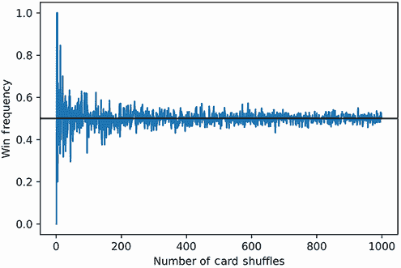
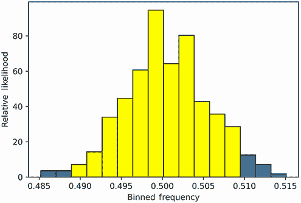
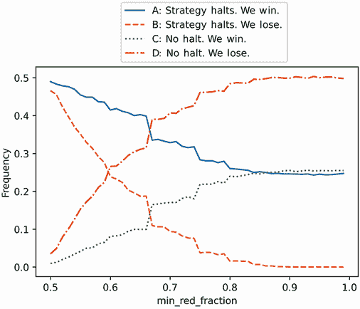

# 4 案例研究 1 解决方案

本节涵盖

+   扑克牌游戏模拟

+   概率策略优化

+   置信区间

我们的目的是玩一个扑克牌游戏，其中牌会迭代翻转，直到我们告诉发牌人停止。然后翻转一张额外的牌。如果那张牌是红色，我们就赢得一美元；否则，我们损失一美元。我们的目标是发现一种最佳预测牌堆中红牌的策略。我们将通过

1.  开发多种策略来预测随机洗牌牌堆中的红牌。

1.  在多次模拟中应用每种策略，以计算其在高置信区间内的成功概率。如果这些计算难以实现，我们将专注于在 10 张牌样本空间中表现最好的策略。

1.  返回与最高成功概率相关的最简单策略。

警告 揭示警告！案例研究 1 的解决方案即将揭晓。我强烈建议你在阅读解决方案之前尝试解决这个问题。原始问题陈述可在案例研究开头参考。

## 4.1 预测洗牌牌堆中的红牌

我们首先创建一个包含 26 张红牌和 26 张黑牌的牌堆。黑牌用 0 表示，红牌用 1 表示。

列表 4.1 建模一副 52 张牌

```
red_cards = 26 * [1]
black_cards = 26 * [0]
unshuffled_deck = red_cards + black_cards
```

我们继续洗牌。

列表 4.2 洗一副 52 张牌

```
np.random.seed(1)
shuffled_deck = np.random.permutation(unshuffled_deck)
```

现在，我们迭代地翻转牌堆中的牌，直到下一张牌更有可能是红色。然后我们翻转下一张牌。如果那张牌是红色，我们就赢了。

我们如何决定何时停止？一个简单的策略是在剩余牌堆中的红牌数量大于剩余牌堆中的黑牌数量时终止游戏。让我们在洗好的牌堆上执行这个策略。

列表 4.3 编写扑克牌游戏策略

```
remaining_red_cards = 26
for i, card in enumerate(shuffled_deck[:-1]):
    remaining_red_cards -= card
    remaining_total_cards = 52 - i - 1                     ❶
    if remaining_red_cards / remaining_total_cards > 0.5:
        break

print(f"Stopping the game at index {i}.")
final_card = shuffled_deck[i + 1]
color = 'red' if final_card else 0
print(f"The next card in the deck is {'red' if final_card else 'black'}.")
print(f"We have {'won' if final_card else 'lost'}!")

Stopping the game at index 1.
The next card in the deck is red.
We have won!
```

❶ 从 52 张牌中减去到目前为止看到的总牌数。这个总数等于 i + 1，因为 i 初始设置为 0。或者，我们可以运行 `enumerate(shuffled_deck[:-1], 1)`，这样 i 初始设置为 1。

我们的策略在第一次尝试时就取得了胜利。我们的策略在剩余红牌的比例大于剩余总牌数的一半时停止。我们可以将这个比例推广到等于 `min_red_fraction` 参数，从而在红牌比例大于输入参数值时停止。接下来，我们将实现这个推广策略，将 `min_red_fraction` 预设为 0.5。

列表 4.4 通用扑克牌游戏策略

```
np.random.seed(0)
total_cards = 52
total_red_cards = 26
def execute_strategy(min_fraction_red=0.5, shuffled_deck=None,
                     return_index=False):
    if shuffled_deck is None:
        shuffled_deck = np.random.permutation(unshuffled_deck)               ❶

    remaining_red_cards = total_red_cards

    for i, card in enumerate(shuffled_deck[:-1]):
        remaining_red_cards -= card
        fraction_red_cards = remaining_red_cards / (total_cards - i - 1)
        if fraction_red_cards > min_fraction_red:
            break

    return (i+1, shuffled_deck[i+1]) if return_index else shuffled_deck[i+1] ❷
```

❶ 如果没有提供输入牌堆，则洗洗未洗的牌堆

❷ 可选地返回卡片索引和最终卡片

### 4.1.1 估计策略成功的概率

让我们将我们的基本策略应用到一系列 1,000 次随机洗牌中。

列表 4.5 在 1,000 次洗牌中运行策略

```
observations = np.array([execute_strategy() for _ in range(1000)])
```

观测中 1 的总分数对应于红牌的观测分数，因此也对应于获胜的分数。我们可以通过将`observations`中的 1 相加并除以数组大小来计算这个分数。顺便说一句，这个计算也可以通过调用`observations.mean()`来完成。

列表 4.6 计算获胜频率

```
frequency_wins = observations.sum() / 1000
assert frequency_wins == observations.mean()
print(f"The frequency of wins is {frequency_wins}")

The frequency of wins is 0.511
```

我们赢得了 51.1%的总游戏！我们的策略似乎正在起作用：511 次胜利和 489 次失败将给我们带来总利润 22 美元。

列表 4.7 计算总利润

```
dollars_won = frequency_wins * 1000
dollars_lost = (1 - frequency_wins) * 1000
total_profit = dollars_won - dollars_lost
print(f"Total profit is ${total_profit:.2f}")

Total profit is $22.00
```

对于 1,000 次洗牌的样本量，该策略效果良好。现在我们绘制策略的获胜频率收敛图，样本量从 1 到 10,000（图 4.1）。



图 4.1 游戏次数与观测到的获胜计数频率的对比。频率围绕 0.5 的值波动。我们无法判断获胜的概率是高于还是低于 0.5。

列表 4.8 绘制模拟获胜频率

```
np.random.seed(0)
def repeat_game(number_repeats):                   ❶
    observations = np.array([execute_strategy()
                             for _ in range(number_repeats)])
    return observations.mean()

frequencies = []
for i in range(1, 1000):
    frequencies.append(repeat_game(i))
plt.plot(list(range(1, 1000)), frequencies)
plt.axhline(0.5, color='k')
plt.xlabel('Number of Card Shuffles')
plt.ylabel('Win-Frequency')
plt.show()
print(f"The win-frequency for 10,000 shuffles is {frequencies[-1]}")

The win-frequency for 10,000 shuffles is 0.5035035035035035
```

❶ 返回指定游戏数量的获胜频率

当采样 10,000 次牌洗动作时，该策略的获胜频率超过 50%。然而，在整个采样过程中，策略的获胜频率也上下波动。我们有多大的信心认为获胜的概率实际上大于 0.5？我们可以通过置信区间分析（图 4.2）来找出答案。我们通过采样 10,000 次牌洗动作 300 次，总共 3 百万次洗牌来计算置信区间。洗牌数组是一个计算密集型的过程，所以列表 4.9 的运行大约需要 40 秒。



图 4.2 300 个分箱频率的直方图与它们相关的相对似然性对比。高亮条表示 95%的置信区间。该区间覆盖的频率范围大约是 0.488–0.508。

列表 4.9 计算 3 百万次洗牌的置信区间

```
np.random.seed(0)
frequency_array = np.array([repeat_game(10000) for _ in range(300)])

likelihoods, bin_edges, patches = plt.hist(frequency_array, bins='auto',
                                           edgecolor='black', density=True)
bin_width = bin_edges[1] - bin_edges[0]
start_index, end_index = compute_high_confidence_interval(likelihoods, bin_width)                                                          ❶

for i in range(start_index, end_index):
     patches[i].set_facecolor('yellow')
plt.xlabel('Binned Frequency')
plt.ylabel('Relative Likelihood')

plt.show()

The frequency range 0.488938 - 0.509494 represents a 97.00% confidence interval
```

❶ 作为提醒，我们在第三部分中定义了 compute_high_confidence_interval 函数。

我们相当确信实际概率位于 0.488 和 0.509 之间。然而，我们仍然不知道这个概率是高于 0.5 还是低于 0.5。这是一个问题：对真实概率的微小误解可能导致我们亏损。

想象一下，真实概率是 0.5001。如果我们把我们的策略应用到 10 亿次洗牌中，我们应该期望赢得 20 万美元。现在假设我们错了，实际概率是 0.4999。在这种情况下，我们将损失 20 万美元。第四位小数点上的微小错误可能使我们损失数十万美元。

我们必须绝对确信真实概率位于 0.5 以上。因此，我们必须通过增加样本量来缩小 95%的置信区间，这将以运行时间为代价。以下代码在 3,000 次迭代中采样了 50,000 次洗牌。运行大约需要一个小时。

警告 以下代码将运行一个小时。

列表 4.10 计算 1.5 亿次洗牌的置信区间

```
np.random.seed(0)

frequency_array = np.array([repeat_game(50000) for _ in range(3000)])
likelihoods, bin_edges = np.histogram(frequency_array, bins='auto',
                                      density=True)
bin_width = bin_edges[1] - bin_edges[0]
compute_high_confidence_interval(likelihoods, bin_width)

The frequency range 0.495601 - 0.504345 represents a 96.03% confidence interval
```

我们已经执行了采样。不幸的是，新的置信区间仍然无法判断真实概率是否高于 0.5。那么我们应该怎么办？增加样本数量在计算上不可行（除非我们愿意让模拟运行几天）。也许将 `min_red_fraction` 从 0.5 增加到 0.75 会带来改进。让我们更新我们的策略，并在我们的模拟再运行一个小时的同时去散步。

警告 以下代码将运行一个小时。

列表 4.11 计算更新策略的置信区间

```
np.random.seed(0)
def repeat_game(number_repeats, min_red_fraction):
    observations = np.array([execute_strategy(min_red_fraction)
                            for _ in range(number_repeats)])
    return observations.mean()

frequency_array = np.array([repeat_game(50000, 0.75) for _ in range(3000)])
likelihoods, bin_edges = np.histogram(frequency_array, bins='auto',
                                      density=True)
bin_width = bin_edges[1] - bin_edges[0]
compute_high_confidence_interval(likelihoods, bin_width)

The frequency range 0.495535 - 0.504344 represents a 96.43% confidence interval
```

不好！我们的置信区间的跨度仍然没有解决，因为它仍然覆盖了有利和无利的概率。

通过将我们的策略应用于 10 张牌的牌组，我们可能可以获得更多的洞察。该牌组的样本空间可以完全探索，因此我们可以计算出获胜的确切概率。

## 4.2 使用 10 张牌的牌组样本空间优化策略

以下代码计算了 10 张牌的牌组的样本空间。然后它将我们的基本策略应用于该样本空间。最终输出是策略获胜的概率。

列表 4.12 将基本策略应用于 10 张牌的牌组

```
total_cards = 10
total_red_cards = int(total_cards / 2)
total_black_cards = total_red_cards
unshuffled_deck = [1] * total_red_cards + [0] * total_black_cards
sample_space = set(itertools.permutations(unshuffled_deck))              ❶
win_condition = lambda x: execute_strategy(shuffled_deck=np.array(x))    ❷
prob_win = compute_event_probability(win_condition, sample_space)        ❸
print(f"Probability of a win is {prob_win}")

Probability of a win is 0.5
```

❶ 作为提醒，itertools 在第三部分之前已经被导入。

❷ 事件条件，我们的基本策略能够获胜

❸ 我们在第一部分中定义了 `compute_event_probability` 函数。

令人惊讶的是，我们的基本策略只有 50% 的时间能够获胜。这并不比随机选择第一张牌好！也许我们的 `min_red_fraction` 参数设置得太低。我们可以通过采样 0.50 和 1.0 之间的所有两位小数 `min_red_fraction` 值来找出答案。以下代码计算了 `min_red_fraction` 值范围内的获胜概率，并返回最小和最大概率。

列表 4.13 将多个策略应用于 10 张牌的牌组

```
def scan_strategies():
    fractions = [value / 100 for value in range(50, 100)]
    probabilities = []
    for frac in fractions:
        win_condition = lambda x: execute_strategy(frac,
                                                   shuffled_deck=np.array(x))
        probabilities.append(compute_event_probability(win_condition,
                                                       sample_space))
    return probabilities

probabilities = scan_strategies()
print(f"Lowest probability of win is {min(probabilities)}")
print(f"Highest probability of win is {max(probabilities)}")

Lowest probability of win is 0.5
Highest probability of win is 0.5
```

最低和最高的概率都等于 0.5！我们的任何策略都没有优于随机选择一张牌。也许调整牌组大小会有所改进。让我们分析包含两张、四张、六张和八张牌的牌组的样本空间。我们将所有策略应用于每个样本空间，并返回它们获胜的概率。然后我们寻找一个不等于 0.5 的概率。

列表 4.14 将多个策略应用于多个牌组

```
for total_cards in [2, 4, 6, 8]:
    total_red_cards = int(total_cards / 2)
    total_black_cards = total_red_cards
    unshuffled_deck = [1] * total_red_cards + [0] * total_black_cards

    sample_space = set(itertools.permutations(unshuffled_deck))
    probabilities = scan_strategies()
    if all(prob == 0.5 for prob in probabilities):
        print(f"No winning strategy found for deck of size {total_cards}")
    else:
        print(f"Winning strategy found for deck of size {total_cards}")

No winning strategy found for deck of size 2
No winning strategy found for deck of size 4
No winning strategy found for deck of size 6
No winning strategy found for deck of size 8
```

所有策略在小型牌堆中产生的概率都是 0.5。每次我们增加牌堆大小，我们都会向牌堆中增加两张牌，但这并不能提高性能。在 2 张牌的牌堆上失败的战略在 4 张牌的牌堆上仍然会失败，在 8 张牌的牌堆上失败的战略在 10 张牌的牌堆上仍然会失败。我们可以进一步推断这个逻辑。在 10 张牌的牌堆上失败的战略可能会在 12 张牌的牌堆上失败，从而在 14 张牌的牌堆上失败，在 16 张牌的牌堆上失败。最终，它将在 52 张牌的牌堆上失败。从定性角度来看，这个归纳论证是有道理的。从数学角度来看，它可以被证明是正确的。现在，我们不需要担心数学。重要的是，我们的直觉已经被证明是错误的。我们的战略在 10 张牌的牌堆上不起作用，我们没有理由相信它们会在 52 张牌的牌堆上起作用。为什么这些战略会失败？

直观来看，我们的初始战略是有道理的：如果牌堆中红牌比黑牌多，那么我们更有可能从牌堆中抽到红牌。然而，我们没有考虑到那些红牌从未超过黑牌的场景。例如，假设前 26 张牌都是红牌，剩下的都是黑牌。在这种情况下，我们的战略将无法停止，我们将失败。此外，让我们考虑一个洗好的牌堆，前 25 张牌是红牌，接下来的 26 张牌是黑牌，最后一张牌是红牌。在这里，我们的战略将无法停止，但我们仍然会获胜。似乎每种战略都可以导致以下四种场景之一：

+   战略停止且下一张牌是红牌。我们获胜。

+   战略停止且下一张牌是黑牌。我们失败。

+   战略没有停止且最后一张牌是红牌。我们获胜。

+   战略没有停止且最后一张牌是黑牌。我们失败。

让我们采样这四种场景在 50,000 次洗牌中发生的频率。我们在`min_red_fraction`两位数值范围内记录这些频率。然后，我们将每个`min_red_fraction`值与从四种场景观察到的发生率进行对比（图 4.3）。



图 4.3 `min_red_fraction`参数与所有四种可能场景的采样频率的关系。场景 A 最初频率约为 0.49，但最终降至 0.25。场景 C 的频率约为 0.01，但最终增加到 0.25。A 和 C 的频率总和保持在约 0.5，从而反映了赢得游戏的 50%的机会。

列表 4.15 在 52 张牌的牌堆中绘制战略结果

```
np.random.seed(0)
total_cards = 52
total_red_cards = 26
unshuffled_deck = red_cards + black_cards

def repeat_game_detailed(number_repeats, min_red_fraction):

    observations = [execute_strategy(min_red_fraction, return_index=True)
                    for _ in range(num_repeats)]                           ❶
    successes = [index for index, card, in observations if card == 1]      ❷
    halt_success = len([index for index in successes if index != 51])      ❸
    no_halt_success = len(successes) - halt_success                        ❹

    failures = [index for index, card, in observations if card == 0]       ❺
    halt_failure = len([index for index in failures if index != 51])       ❻
    no_halt_failure = len(failures) - halt_failure                         ❼
    result = [halt_success, halt_failure, no_halt_success, no_halt_failure]
    return [r / number_repeats for r in result]                             ❽

fractions = [value / 100 for value in range(50, 100)]
num_repeats = 50000
result_types = [[], [], [], []]

for fraction in fractions:                                                 ❾
    result = repeat_game_detailed(num_repeats, fraction)
    for i in range(4):
        result_types[i].append(result[i])

plt.plot(fractions, result_types[0],
         label='A) Strategy Halts. We Win.')
plt.plot(fractions, result_types[1], linestyle='--',
         label='B) Strategy Halts. We Lose.')
plt.plot(fractions, result_types[2], linestyle=':',
         label='C) No Halt. We Win.')
plt.plot(fractions, result_types[3], linestyle='-.',
         label='D) No Halt. We Lose.')
plt.xlabel('min_red_fraction')
plt.ylabel('Frequency')
plt.legend(bbox_to_anchor=(1.0, 0.5))                                      ❿
plt.show()
```

❶ 我们在 num_repeats 次模拟中执行战略。

❷ 此列表包含所有获胜的实例。

❸ 我们的战略停止并获胜的场景

❹ 我们的战略没有停止但获胜的场景

❺ 此列表包含所有失败的实例。

❻ 我们的战略停止但失败的场景

❼ 我们的战略没有停止但失败的场景

❽ 我们返回所有四种场景的观察频率。

❾ 我们在多个策略中扫描场景频率。

❿ `bbox_to_anchor` 参数用于将图例放置在图表上方，以避免与四个绘制的曲线重叠。

让我们考察 `min_red_fraction` 值为 0.5 的图表。在这里，场景 A（策略停止。我们赢了。）是最常见的结局，频率约为 0.49。同时，停止策略大约有 46% 的时间会导致损失（策略 B）。那么，为什么我们保持 50% 的获胜机会呢？好吧，在 1% 的情况下，我们的策略未能停止，但我们仍然赢了（场景 C）。策略的弱点被随机机会所抵消。

在图表中，随着 `min_red_fraction` 的增加，场景 A 的频率下降。我们越保守，就越不可能提前停止游戏并获得胜利。同时，场景 C 的成功率增加。我们越保守，达到最终卡片并偶然获胜的可能性就越高。

随着 `min_red_fraction` 的增加，场景 A 和场景 C 都收敛到频率 0.25。因此，获胜的概率保持在 50%。有时我们的策略停止了，我们确实赢了。其他时候，策略停止了，我们仍然输了。任何策略提供的优势都会被这些损失自动抹去。然而，我们偶尔会走运：我们的策略未能停止，但我们赢得了游戏。这些幸运的胜利弥补了我们的损失，我们的获胜概率保持不变。无论我们做什么，我们获胜的可能性始终是五五开。因此，我们可以提供的最佳策略是选择洗好的牌堆中的第一张牌。

列表 4.16 最佳获胜策略

```
def optimal_strategy(shuffled_deck):
    return shuffled_deck[0]
```

## 摘要

+   概率可能具有反直觉性。天生，我们假设我们计划的卡牌游戏策略会比随机策略表现更好。然而，事实并非如此。在处理随机过程时，我们必须小心。最好在押注任何未来结果之前，严格测试我们所有的直觉假设。

+   有时，即使是大规模的模拟也无法找到所需精度的概率。然而，通过简化我们的问题，我们可以利用样本空间来获得洞察。样本空间使我们能够测试我们的直觉。如果我们的直觉解在问题的玩具版本上失败，那么它也很可能在实际版本上失败。
