# 使用 SciPy 进行 5 个基本概率和统计分析

本节涵盖

+   使用 SciPy 库分析二项式

+   定义数据集中心性

+   定义数据集分散度

+   计算概率分布的中心性和分散度

统计学是数学的一个分支，涉及数字数据的收集和解释。它是所有现代数据科学的先驱。术语“统计”最初表示“国家科学”，因为统计方法最初是为了分析政府数据而开发的。自古以来，政府机构就收集有关其民众的数据。这些数据将被用来征税和组织大规模军事行动。因此，关键的国家决策取决于数据的质量。记录不良可能导致灾难性的后果。这就是为什么国家官僚对他们的记录中的任何随机波动都非常关心。概率论最终驯服了这些波动，使随机性变得可解释。从那时起，统计学和概率论就紧密相连。

统计学和概率论密切相关，但在某些方面，它们非常不同。概率论研究在可能无限多个测量上的随机过程。它不受现实世界限制的约束。这使我们能够通过想象数百万次抛硬币来模拟硬币的行为。在现实生活中，抛硬币数百万次是一项毫无意义的耗时工作。我们当然可以牺牲一些数据，而不是整天整夜地抛硬币。统计学家承认数据收集过程对我们施加的这些限制。现实世界的数据收集既昂贵又耗时。每个数据点都有一份代价。我们无法调查一个国家的人口而不雇佣政府官员。我们无法测试我们的在线广告而不为点击的每个广告付费。因此，我们最终数据集的大小通常取决于我们初始预算的大小。如果预算有限，那么数据也会有限。这种数据与资源之间的权衡是现代统计学的核心。统计学帮助我们了解确切需要多少数据才能得出见解并做出有影响力的决策。统计学的目的是在数据有限的情况下找到数据的意义。

统计学高度数学化，通常使用数学方程式进行教学。然而，直接接触方程式并不是理解统计学的先决条件。实际上，许多数据科学家在进行统计分析时并不编写公式。相反，他们使用 Python 库，如 SciPy，这些库处理所有复杂的数学计算。然而，正确使用库仍然需要直观理解统计程序。在本节中，我们通过将概率理论应用于现实世界问题来培养我们对统计学的理解。

## 5.1 使用 SciPy 探索数据与概率之间的关系

SciPy，即 *Scientific Python*，提供了许多用于科学分析的实用方法。SciPy 库包括一个用于解决概率和统计问题的完整模块：`scipy.stats`。让我们安装这个库并导入 `stats` 模块。

注意 从命令行终端调用 `pip install scipy` 来安装 SciPy 库。

列表 5.1 从 SciPy 导入 `stats` 模块

```
from scipy import stats
```

`stats` 模块对于评估数据的随机性非常有用。例如，在第一部分中，我们计算了公平硬币在 20 次抛掷后至少出现 16 次正面的概率。我们的计算需要我们检查所有可能的 20 次抛掷硬币的组合。然后我们计算观察到 16 次或更多正面或 16 次或更多反面的概率，以衡量我们观察的随机性。SciPy 允许我们直接使用 `stats.binom_test` 方法来测量这个概率。该方法以二项分布命名，它决定了抛掷硬币可能的结果。该方法需要三个参数：正面的数量、总的抛掷次数以及硬币落在正面的概率。让我们对 20 次抛掷中观察到的 16 次正面应用二项测试。我们的输出应该等于之前计算的大约 0.011 的值。

注意 SciPy 和标准 Python 处理低值小数点的方式不同。在第一部分中，当我们计算概率时，最终值被四舍五入到 17 位有效数字。另一方面，SciPy 返回一个包含 18 位有效数字的值。因此，为了保持一致性，我们将 SciPy 的输出四舍五入到 17 位数字。

列表 5.2 使用 SciPy 分析极端正面次数

```
num_heads = 16
num_flips = 20
prob_head = 0.5
prob = stats.binom_test(num_heads, num_flips, prob_head)
print(f"Probability of observing more than 15 heads or 15 tails is {prob:.17f}")

Probability of observing more than 15 heads or 15 tails is 0.01181793212890625
```

值得强调的是，`stats.binom_test` 并没有计算观察到 16 次正面的概率。相反，它返回了看到硬币抛掷序列中 16 次或更多硬币落在同一面的概率。如果我们想看到正好 16 次正面的概率，那么我们必须使用 `stats.binom.pmf` 方法。该方法表示二项分布的 *概率质量函数*。概率质量函数将输入的整数值映射到它们发生的概率。因此，调用 `stats.binom.pmf(num_heads, num_flips, prob_heads)` 返回硬币产生 `num_heads` 次正面的可能性。在当前设置下，这等于公平硬币在 20 次抛掷中有 16 次落在正面的概率。

列表 5.3 使用 `stats.binom.pmf` 计算精确概率

```
prob_16_heads = stats.binom.pmf(num_heads, num_flips, prob_head)
print(f"The probability of seeing {num_heads} of {num_flips} heads is {prob_16_heads}")

The probability of seeing 16 of 20 heads is 0.004620552062988271
```

我们使用`stats.binom.pmf`来找到恰好出现 16 个头的概率。然而，该方法也能够同时计算多个概率。可以通过传递头数值的列表来处理多个头数概率。例如，传递`[4, 16]`将返回一个包含 4 个头和 16 个头出现概率的二维 NumPy 数组。从概念上讲，4 个头和 16 个尾的概率等于 4 个尾和 16 个头的概率。因此，执行`stats.binom.pmf([4, 16], num_flips, prob_head)`应该返回一个包含相等元素的二维数组。让我们来验证。

列表 5.4：使用`stats.binom.pmf`计算概率数组

```
probabilities = stats.binom.pmf([4, 16], num_flips, prob_head)
assert probabilities.tolist() == [prob_16_heads] * 2
```

列表传递使我们能够计算区间概率。例如，如果我们把`range(21)`传递给`stats.binom.pmf`，那么输出的数组将包含每个可能头数区间的所有概率。正如我们在第一部分中学到的，这些概率的总和应该等于 1.0。

注意：对低值小数求和在计算上很棘手。在求和过程中，微小的误差会累积。由于这些误差，我们最终的求和概率将略微偏离 1.0，除非我们将它四舍五入到 14 位有效数字。我们将在下一个列表中进行这种四舍五入。

列表 5.5：使用`stats.binom.pmf`计算区间概率

```
interval_all_counts = range(21)
probabilities = stats.binom.pmf(interval_all_counts, num_flips, prob_head)
total_prob = probabilities.sum()
print(f"Total sum of probabilities equals {total_prob:.14f}")

Total sum of probabilities equals 1.00000000000000
```

此外，如第二部分所述，将`interval_all_counts`与`probabilities`绘制成图，可以揭示我们 20 次抛硬币分布的形状。因此，我们可以在不遍历所有可能的抛硬币组合的情况下生成分布图（图 5.1）。

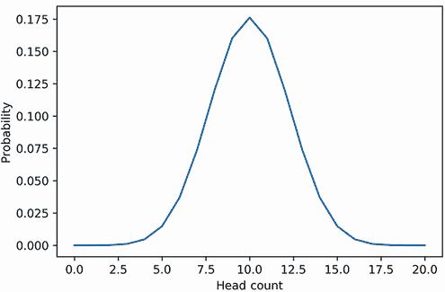

图 5.1：使用 SciPy 生成的 20 次抛硬币的概率分布

列表 5.6：绘制 20 次抛硬币的二项分布

```
import matplotlib.pyplot as plt
plt.plot(interval_all_counts, probabilities)
plt.xlabel('Head-count')
plt.ylabel('Probability')
plt.show()
```

在第二部分中，我们可视化二项分布的能力受到我们需要计算的总抛硬币组合数的限制。这种情况不再存在。`stats.binom.pmf`方法使我们能够显示与任意抛硬币次数相关的任何分布。让我们利用我们新获得的自由，同时绘制 20 次、80 次、140 次和 200 次抛硬币的分布图（图 5.2）。

列表 5.7：绘制五个不同的二项分布

```
flip_counts = [20, 80, 140, 200]
linestyles = ['-', '--', '-.', ':']
colors = ['b', 'g', 'r', 'k']

for num_flips, linestyle, color in zip(flip_counts, linestyles, colors):
    x_values = range(num_flips + 1)
    y_values = stats.binom.pmf(x_values, num_flips, 0.5)
    plt.plot(x_values, y_values, linestyle=linestyle, color=color,
             label=f'{num_flips} coin-flips')
plt.legend()
plt.xlabel('Head-count')
plt.ylabel('Probability')
plt.show()

```

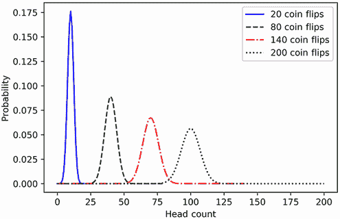

图 5.2 展示了 20 次、80 次、140 次和 200 次抛硬币的多个二项概率分布。随着抛硬币次数的增加，分布中心向右移动。此外，随着抛硬币次数的增加，每个分布在其中心周围变得更加分散。

在图中，每个二项分布的中央峰值似乎随着抛硬币次数的增加而向右移动。此外，20 次抛硬币的分布明显比 200 次抛硬币的分布薄。换句话说，随着这些中心位置向右移动，绘制的分布在其中心位置周围变得更加分散。

在数据分析中，这种中心趋势和离散度的变化是常见的。我们在第三部分中观察到了离散度的变化，当时我们使用随机样本数据来可视化几个直方图分布。随后，我们观察到绘制的直方图厚度取决于我们的样本大小。当时，我们的观察完全是定性的，因为我们缺乏比较两个图表厚度的指标。然而，仅仅指出一个图表看起来比另一个厚是不够的。同样，说一个图表比另一个更向右也是不够的。我们需要量化我们的分布差异。我们必须给中心趋势和离散度分配具体的数字，以辨别这些数字是如何从图表到图表变化的。这样做需要我们熟悉*方差*和*均值*的概念。

## 5.2 均值作为中心趋势的度量

假设我们希望研究夏季第一周我们当地的温度。当夏天来临时，我们瞥了一眼窗户外的温度计。中午，温度正好是 80 度。我们在接下来的六天里重复进行中午的测量。我们的测量值是 80，77，73，61，74，79 和 81 度。让我们将这些测量值存储在一个 NumPy 数组中。

列表 5.8 将记录的温度存储在 NumPy 数组中

```
import numpy as np
measurements = np.array([80, 77, 73, 61, 74, 79, 81])
```

我们现在将尝试使用一个单一的中心值来总结我们的测量结果。首先，我们通过调用`measurements.sort()`就地排序测量值。然后，我们按顺序绘制排序后的温度，以评估它们的中心趋势（图 5.3）。

列表 5.9 绘制记录的温度

```
measurements.sort()
number_of_days = measurements.size
plt.plot(range(number_of_days), measurements)
plt.scatter(range(number_of_days), measurements)
plt.ylabel('Temperature')
plt.show()
```

根据图表，中心温度存在于 60 度和 80 度之间。因此，我们可以天真地估计中心大约是 70 度。让我们将我们的估计量化为图表中最低值和最高值之间的中点。我们通过取最小值和最大值之间差的一半并加到最小温度上来计算这个中点。（我们也可以通过直接相加最小值和最大值，然后除以 2 来获得相同的值。）

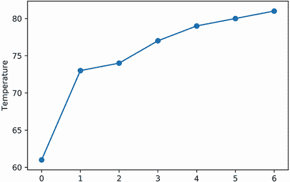

图 5.3 包含七个排序后的温度的图表。存在一个介于 60 度和 80 度之间的中心温度。

列表 5.10 查找中点温度

```
difference = measurements.max() - measurements.min()
midpoint = measurements.min() + difference / 2
assert midpoint == (measurements.max() + measurements.min()) / 2
print(f"The midpoint temperature is {midpoint} degrees")
The midpoint temperature is 71.0 degrees
```

中点温度是 71 度。让我们在图表上用一条水平线标记这个中点。我们通过调用`plt.axhline(midpoint)`（图 5.4）来绘制这条水平线。

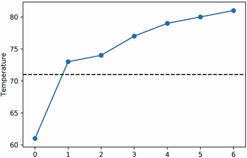

图 5.4 包含七个排序后的温度的图表。71 度的温度标志着最高和最低温度之间的中点。这个中点看起来很低：七个温度中有六个高于中点值。

列表 5.11 绘制中点温度

```
plt.plot(range(number_of_days), measurements)
plt.scatter(range(number_of_days), measurements)
plt.axhline(midpoint, color='k', linestyle='--')
plt.ylabel('Temperature')
plt.show()
```

我们绘制的中间值似乎有点低：我们七个测量值中的六个都高于中间值。直观上，我们的中心值应该更均匀地分割测量值——高于和低于中心的温度数量应该大致相等。我们可以通过选择排序后的七个元素数组中的中间元素来实现这种平等。这个中间元素，统计学家称之为*中位数*，将把我们的测量值分成两部分。三个测量值将出现在中位数以下，三个测量值将出现在中位数以上。3 也是中位数在`measurements`数组中的索引。让我们将中位数添加到我们的图中（图 5.5）。

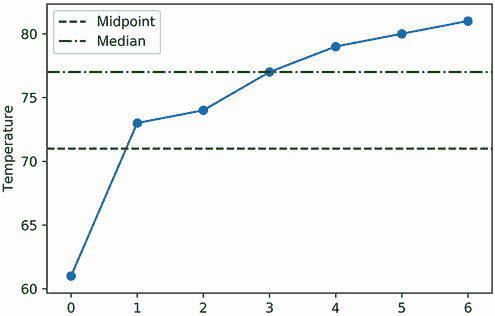

图 5.5 包含七个排序温度的图。77 度的中位数将温度分成两半。中位数看起来稍微不平衡：它比三个较低的温度更接近三个较高的温度。

列表 5.12 绘制中位数温度

```
median = measurements[3]
print(f"The median temperature is {median} degrees")
plt.plot(range(number_of_days), measurements)
plt.scatter(range(number_of_days), measurements)
plt.axhline(midpoint, color='k', linestyle='--', label='midpoint')
plt.axhline(median, color='g', linestyle='-.', label='median')
plt.legend()
plt.ylabel('Temperature')
plt.show()

The median temperature is 77 degrees
```

我们 77 度的中位数将温度分成两半。然而，分割并不平衡，因为中位数在图中更接近上三个温度。特别是，中位数与我们的最小测量值 61 度明显相距甚远。也许我们可以通过惩罚中位数离最小值太远来平衡分割。我们将使用*平方距离*来实现这种惩罚，它只是两个值之间差异的平方。随着两个值被推得更远，平方距离呈二次增长。因此，如果我们根据中心值与 61 的距离来惩罚它，那么随着它远离 61 度，平方距离惩罚将显著增大（图 5.6）。

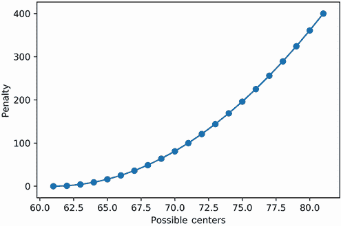

图 5.6 基于与最小温度 61 度的平方距离惩罚的可能中心的图。不出所料，最小惩罚发生在 61 度。不幸的是，惩罚没有考虑到与剩余六个记录温度的距离。

列表 5.13 使用与最小温度 61 度的平方距离来惩罚中心

```
def squared_distance(value1, value2):
    return (value1 - value2) ** 2

possible_centers = range(measurements.min(), measurements.max() + 1)      ❶
penalties = [squared_distance(center, 61) for center in possible_centers]
plt.plot(possible_centers, penalties)
plt.scatter(possible_centers, penalties)
plt.xlabel('Possible Centers')
plt.ylabel('Penalty')
plt.show()
```

❶ 使用最小和最大测量温度之间的值范围作为我们可能的中心集

我们的图显示了基于它们与我们最小值的距离的可能的中心处的惩罚。当中心向 61 移动时，惩罚降低，但它们与剩余六个测量值的距离增加。因此，我们应该根据每个潜在中心与所有七个测量值的平方距离来惩罚它。我们将通过定义一个平方距离和函数来实现这一点，该函数将累加某个值与测量数组之间的平方距离。该函数将作为我们新的惩罚。将可能的中心与它们的惩罚绘制在一起将允许我们找到惩罚最小化的中心（图 5.7）。

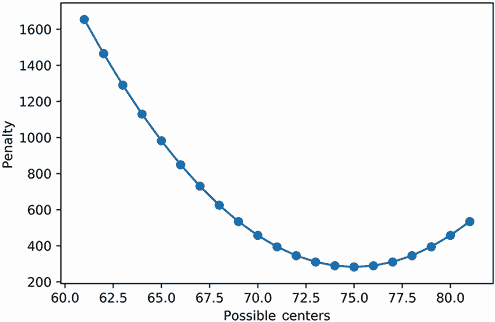

图 5.7 基于所有记录温度的平方距离之和的可能的中心惩罚图。最低惩罚发生在 75 度。

列表 5.14 使用总平方距离之和惩罚中心

```
def sum_of_squared_distances(value, measurements):
    return sum(squared_distance(value, m) for m in measurements)
penalties = [sum_of_squared_distances(center, measurements)
             for center in possible_centers]
plt.plot(possible_centers, penalties)
plt.scatter(possible_centers, penalties)
plt.xlabel('Possible Centers')
plt.ylabel('Penalty')
plt.show()
```

根据我们的图表，75 度的温度产生了最低的惩罚。我们将非正式地称这个温度值为我们的“最低惩罚中心”。让我们在温度图（图 5.8）上用一条水平线来标记它。

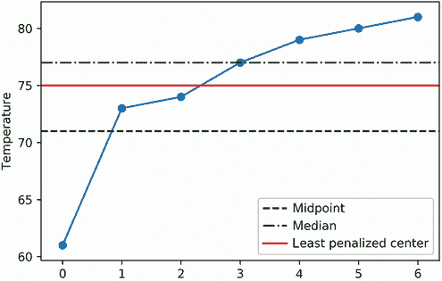

图 5.8 包含七个排序温度的图表。75 度的最低惩罚中心以平衡的方式分割温度。

列表 5.15 绘制最低惩罚温度图

```
least_penalized = 75
assert least_penalized == possible_centers[np.argmin(penalties)]

plt.plot(range(number_of_days), measurements)
plt.scatter(range(number_of_days), measurements)
plt.axhline(midpoint, color='k', linestyle='--', label='midpoint')
plt.axhline(median, color='g', linestyle='-.', label='median')
plt.axhline(least_penalized, color='r', linestyle='-',
            label='least penalized center')
plt.legend()
plt.ylabel('Temperature')
plt.show()
```

最低惩罚中心将测量的温度分割得相当均匀：四个测量值出现在它上方，三个测量值出现在它下方。因此，这个中心在保持平衡数据分割的同时，提供了相对于中位数更接近最冷记录温度的距离。

最低惩罚中心是中心性的良好度量。它最小化了所有因距离任何给定点太远而造成的惩罚，这导致了中心与每个数据点之间的平衡距离。不幸的是，我们计算该中心的方法非常低效。扫描所有可能的惩罚不是一个可扩展的解决方案。有没有更有效的方法来计算中心？是的！数学家已经证明，平方距离误差总是由数据集的 *平均值* 最小化。因此，我们可以直接计算最低惩罚中心。我们只需要将 `measurements` 中的所有元素相加，然后将这个总和除以数组大小。

列表 5.16 使用平均值计算最低惩罚中心

```
assert measurements.sum() / measurements.size == least_penalized
```

将值的总和除以数组大小正式称为 *算术平均值*。非正式地，这个值被称为数组的 *平均值* 或平均。平均值可以通过调用 NumPy 数组的 `mean` 方法来计算。我们也可以通过调用 `np.mean` 和 `np.average` 方法来计算平均值。

列表 5.17 使用 NumPy 计算平均值

```
mean = measurements.mean()
assert mean == least_penalized
assert mean == np.mean(measurements)
assert mean == np.average(measurements)
```

`np.average` 方法与 `np.mean` 方法不同，因为它接受一个可选的 `weights` 参数。`weights` 参数是一个包含数值权重的列表，这些权重捕捉了测量值相对于彼此的重要性。当所有权重相等时，`np.average` 的输出与 `np.mean` 无异。然而，调整权重会导致输出结果的不同。

列表 5.18 将权重传递给 `np.average`

```
equal_weights = [1] * 7
assert mean == np.average(measurements, weights=equal_weights)

unequal_weights = [100] + [1] * 6
assert mean != np.average(measurements, weights=unequal_weights)
```

`weights`参数对于计算重复测量值的均值非常有用。假设我们分析了 10 次温度测量，其中 75 度出现了 9 次，而 77 度只出现了一次。完整的测量列表表示为`9 * [75] + [77]`。我们可以通过调用`np.mean`来计算该列表的均值。我们也可以通过调用`np.average([75, 77], weights=[9, 1])`来计算均值；这两种计算是相等的。

列表 5.19 计算重复值的加权均值

```
weighted_mean = np.average([75, 77], weights=[9, 1])
print(f"The mean is {weighted_mean}")
assert weighted_mean == np.mean(9 * [75] + [77]) == weighted_mean

The mean is 75.2
```

计算加权均值是计算存在重复值时的常规均值的快捷方式。在计算中，唯一测量计数的相对比率由权重的比率表示。因此，即使我们将 9 和 1 的绝对计数转换为 900 和 100 的相对权重，`weighted_mean`的最终值也应保持不变。如果将权重转换为 0.9 和 0.1 的相对概率，这也同样适用。

列表 5.20 计算相对权重的加权均值

```
assert weighted_mean == np.average([75, 77], weights=[900, 100])
assert weighted_mean == np.average([75, 77], weights=[0.9, 0.1])
```

我们可以将概率视为权重。因此，这使我们能够计算任何概率分布的均值。

### 5.2.1 求概率分布的均值

在本书的这一部分，我们与 20 次抛硬币的二项式分布非常熟悉。该分布的峰值对称地位于 10 个正面中间。这个峰值与分布的均值相比如何？让我们来看看。我们通过将`probabilities`数组传递给`np.average`的`weights`参数来计算均值。然后我们以一条垂直线绘制均值，该线穿过分布（图 5.9）。

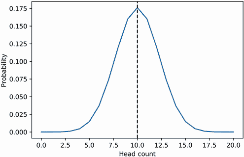

图 5.9 一个 20 次抛硬币的二项式分布，其均值将其一分为二。均值位于分布中心的直接位置。

列表 5.21 计算二项式分布的均值

```
num_flips = 20
interval_all_counts = range(num_flips + 1)
probabilities = stats.binom.pmf(interval_all_counts, 20, prob_head)
mean_binomial = np.average(interval_all_counts, weights=probabilities)
print(f"The mean of the binomial is {mean_binomial:.2f} heads")
plt.plot(interval_all_counts, probabilities)
plt.axvline(mean_binomial, color='k', linestyle='--')   ❶
plt.xlabel('Head-count')
plt.ylabel('Probability')
plt.show()

The mean of the binomial is 10.00 heads
```

❶ `axvline`方法在指定的 x 坐标处绘制一条垂直线。

二项式的均值是 10 个正面。它穿过分布的中心峰值，完美地捕捉了二项式的中心性。因此，SciPy 允许我们通过调用`stats.binom.mean`来简单地获得任何二项式的均值。`stats.binom.mean`方法接受两个参数：抛硬币的次数和正面的概率。

列表 5.22 使用 SciPy 计算二项式均值

```
assert stats.binom.mean(num_flips, 0.5) == 10
```

使用`stats.binom.mean`方法，我们可以严格分析二项式中心性与抛硬币次数之间的关系。让我们绘制从 0 次到 500 次的抛硬币次数范围内的二项式均值（图 5.10）。

列表 5.23 绘制多个二项式均值的分布图

```
means = [stats.binom.mean(num_flips, 0.5) for num_flips in range(500)]
plt.plot(range(500), means)
plt.xlabel('Coin Flips')
plt.ylabel('Mean')
plt.show()
```

抛硬币的次数和平均值之间存在线性关系，其中平均值等于抛硬币次数的一半。考虑到这一点，让我们考虑单次抛硬币的二项分布（通常称为 *伯努利分布*）。伯努利分布的抛硬币次数为 1，因此其平均值等于 0.5。不出所料，公平硬币落在正面朝上的概率等于伯努利平均值。

列表 5.24 预测伯努利分布的平均值

```
num_flips = 1
assert stats.binom.mean(num_flips, 0.5) == 0.5
```

我们可以使用观察到的线性关系来预测 1,000 次抛硬币分布的平均值。我们预计这个平均值等于 500，并且位于分布的中心。让我们确认这一点（图 5.11）。

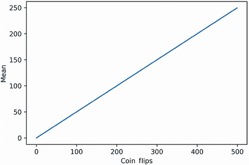

图 5.10 抛硬币次数与二项分布平均值的关系图。这种关系是线性的。每个二项分布的平均值等于其抛硬币次数的一半。

列表 5.25 预测 1,000 次抛硬币分布的平均值

```
num_flips = 1000
assert stats.binom.mean(num_flips, 0.5) == 500

interval_all_counts = range(num_flips)
probabilities = stats.binom.pmf(interval_all_counts, num_flips, 0.5)
plt.axvline(500, color='k', linestyle='--')
plt.plot(interval_all_counts, probabilities)
plt.xlabel('Head-count')
plt.ylabel('Probability')
plt.show()
```

一个分布的平均值是衡量中心性的优秀指标。现在让我们探讨方差作为分散度衡量指标的使用。

## 5.3 方差作为分散度的衡量指标

*分散度* 是数据点围绕某个中心值的散布。较小的分散度表示数据更可预测。较大的分散度表示数据波动更大。考虑一个场景，我们测量加利福尼亚和肯塔基州的夏季温度。我们对每个州在随机位置进行三次测量。加利福尼亚是一个巨大的州，气候非常多样，因此我们预计我们的测量值会有波动。我们测量的加利福尼亚温度是 52 度、77 度和 96 度。我们测量的肯塔基温度是 71 度、75 度和 79 度。我们存储这些测量值并计算它们的平均值。

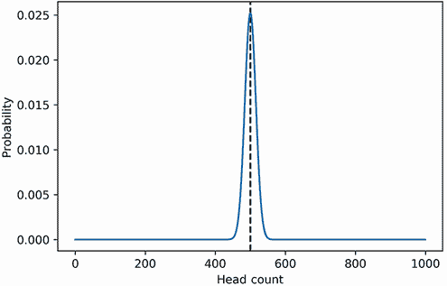

图 5.11 一个由其平均值分割的 1,000 次抛硬币的二项分布。平均值直接位于分布的中心。

列表 5.26 测量多个温度数组的平均值

```
california = np.array([52, 77, 96])
kentucky = np.array([71, 75, 79])

print(f"Mean California temperature is {california.mean()}")
print(f"Mean Kentucky temperature is {california.mean()}")

Mean California temperature is 75.0
Mean Kentucky temperature is 75.0
```

两个测量数组的平均值都等于 75。加利福尼亚和肯塔基似乎共享相同的中心温度值。尽管如此，这两个测量数组远非相等。加利福尼亚的温度分散性更大且不可预测：它们从 52 度到 96 度不等。与此同时，稳定的肯塔基温度从 70 多度到 80 多度不等。它们更接近平均值。我们通过绘制两个测量数组来可视化这种分散度的差异（图 5.12）。此外，我们通过绘制一条水平线来标记平均值。

列表 5.27 可视化分散度的差异

```
plt.plot(range(3), california, color='b', label='California')
plt.scatter(range(3), california, color='b')
plt.plot(range(3), kentucky, color='r', linestyle='-.', label='Kentucky')
plt.scatter(range(3), kentucky, color='r')
plt.axhline(75, color='k', linestyle='--', label='Mean')
plt.legend()
plt.show()
```

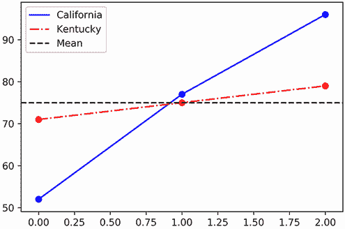

图 5.12 加利福尼亚和肯塔基州的排序温度图。两州的平均温度均为 75 度。加利福尼亚的温度围绕该平均值更为分散。

在图中，肯塔基的温度几乎与平坦的平均值重叠。同时，加利福尼亚的温度大多数明显偏离平均值。如果我们对加利福尼亚的测量值因偏离其中心太远而进行惩罚，我们就可以量化这些观察结果。之前，我们使用平方距离之和函数来计算这样的惩罚。现在我们将计算加利福尼亚测量值与其平均值之间的平方距离之和。统计学家将平均值到平方距离之和简称为*平方和*。我们定义一个`sum_of_squares`函数，然后将其应用于我们的加利福尼亚温度。

列表 5.28 计算加利福尼亚的平方和

```
def sum_of_squares(data):
    mean = np.mean(data)
    return sum(squared_distance(value, mean) for value in data)

california_sum_squares = sum_of_squares(california)
print(f"California's sum of squares is {california_sum_squares}")

California's sum of squares is 974.0
```

加利福尼亚的平方和为 974。我们预计肯塔基的平方和将明显较低。让我们来确认一下。

列表 5.29 计算肯塔基的平方和

```
kentucky_sum_squares = sum_of_squares(kentucky)
print(f"Kentucky's sum of squares is {kentucky_sum_squares}")

Kentucky's sum of squares is 32.0
```

肯塔基的平方和为 32。因此，我们看到加利福尼亚的结果和肯塔基的计算之间有三十倍的差异。这并不令人惊讶，因为肯塔基的数据点分散程度较低。平方和有助于衡量这种分散——然而，这种测量并不完美。假设我们通过记录每个温度两次来复制`California`数组中的温度。即使平方和加倍，分散程度也将保持不变。

列表 5.30 在数组复制后计算平方和

```
california_duplicated = np.array(california.tolist() * 2)
duplicated_sum_squares = sum_of_squares(california_duplicated)
print(f"Duplicated California sum of squares is {duplicated_sum_squares}")
assert duplicated_sum_squares == 2 * california_sum_squares

Duplicated California sum of squares is 1948.0
```

平方和不是衡量分散程度的好方法，因为它受输入数组大小的影响。幸运的是，如果我们通过除以数组大小来消除这种影响，那么这种影响就很容易消除。将`california_sum_squares`除以`california.size`产生一个等于`duplicated_sum_squares / california_duplicated.size`的值。

列表 5.31 将平方和除以数组大小

```
value1 = california_sum_squares / california.size
value2 = duplicated_sum_squares / california_duplicated.size
assert value1 == value2
```

将平方和除以测量次数产生统计学家所说的*方差*。从概念上讲，方差等于平均平方距离。

列表 5.32 从平均平方距离计算方差

```
def variance(data):
    mean = np.mean(data)
    return np.mean([squared_distance(value, mean) for value in data])

assert variance(california) == california_sum_squares / california.size
```

`california`和`california_duplicated`数组的方差相等，因为它们的分散程度相同。

列表 5.33 在数组复制后计算方差

```
assert variance(california) == variance(california_duplicated)
```

同时，`California`和`Kentucky`数组的方差保持了由于分散程度差异而产生的三十倍比率。

列表 5.34 比较加利福尼亚和肯塔基的方差

```
california_variance = variance(california)
kentucky_variance = variance(kentucky)
print(f"California Variance is {california_variance}")
print(f"Kentucky Variance is {kentucky_variance}")

California Variance is 324.6666666666667
Kentucky Variance is 10.666666666666666
```

方差是衡量分散程度的好方法。可以通过在 Python 列表或 NumPy 数组上调用`np.var`来计算方差。NumPy 数组的方差也可以使用数组的内置`var`方法来计算。

列表 5.35 使用 NumPy 计算方差

```
assert california_variance == california.var()
assert california_variance == np.var(california)
```

方差依赖于均值。如果我们计算加权均值，那么我们也必须计算加权方差。计算加权方差很简单：如前所述，方差是所有平方距离的平均值，因此加权方差是所有平方距离从加权均值的加权平均值。让我们定义一个`weighted_variance`函数，它接受两个参数：数据列表和权重。然后它计算加权均值并使用`np.average`方法计算从该均值到所有平方距离的加权平均值。

列表 5.36 使用`np.average`计算加权方差

```
def weighted_variance(data, weights):
    mean = np.average(data, weights=weights)
    squared_distances = [squared_distance(value, mean) for value in data]
    return np.average(squared_distances, weights=weights)

assert weighted_variance([75, 77], [9, 1]) == np.var(9 * [75] + [77])   ❶
```

❶ `weighted_variance`允许我们将重复元素视为权重。

`weighted_variance`函数可以接受概率数组作为输入。这允许我们计算任何概率分布的方差。

### 5.3.1 求概率分布的方差

让我们计算与 20 次公平硬币翻转相关的二项分布的方差。我们通过将`probabilities`数组分配给`weighted_variance`的`weights`参数来运行计算。

列表 5.37 计算二项分布的方差

```
interval_all_counts = range(21)
probabilities = stats.binom.pmf(interval_all_counts, 20, prob_head)
variance_binomial = weighted_variance(interval_all_counts, probabilities)
print(f"The variance of the binomial is {variance_binomial:.2f} heads")

The variance of the binomial is 5.00 heads
```

二项分布的方差是 5，这等于二项分布均值的二分之一。这个方差可以使用 SciPy 的`stats.binom.var`方法更直接地计算。

列表 5.38 使用 SciPy 计算二项分布的方差

```
assert stats.binom.var(20, prob_head) == 5.0
assert stats.binom.var(20, prob_head) == stats.binom.mean(20, prob_head) / 2
```

使用`stats.binom.var`方法，我们可以严格分析二项分布的离散性与硬币翻转次数之间的关系。让我们绘制从 0 到 500 次硬币翻转的范围内二项分布方差的变化图（图 5.13）。

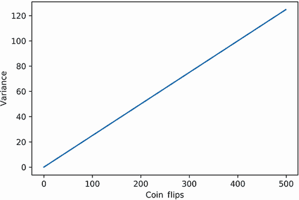

图 5.13 硬币翻转次数与二项分布方差的关系图。这种关系是线性的。每个二项分布的方差等于其硬币翻转次数的四分之一。

列表 5.39 绘制多个二项分布的方差

```
variances = [stats.binom.var(num_flips, prob_head)
             for num_flips in range(500)]
plt.plot(range(500), variances)
plt.xlabel('Coin Flips')
plt.ylabel('Variance')
plt.show()
```

二项分布的方差，就像它的均值一样，与硬币翻转次数线性相关。方差等于硬币翻转次数的四分之一。因此，伯努利分布的方差为 0.25，因为它的硬币翻转次数为 1。按照这个逻辑，我们可以预期 1000 次硬币翻转分布的方差为 250。

列表 5.40 预测二项分布的方差

```
assert stats.binom.var(1, 0.5) == 0.25
assert stats.binom.var(1000, 0.5) == 250
```

常用的 SciPy 二项分析方法

+   `stats.binom.mean(num_flips, prob_heads)`—返回一个二项分布的均值，其中翻转次数等于`num_flips`，正面出现的概率等于`prob_heads`。

+   `stats.binom.var(num_flips, prob_heads)`—返回一个二项分布的方差，其中翻转次数等于`num_flips`，正面出现的概率等于`prob_heads`。

+   `stats.binom.pmf(head_count_int, num_flips, prob_heads)`—返回在`num_flips`次硬币翻转中出现`head_count_int`次正面的概率。单次翻转出现正面的概率设置为`prob_heads`。

+   `stats.binom.pmf(head_count_array, num_flips, prob_heads)`—返回一个二项概率数组。这些概率是通过在每个`head_count_array`的元素`e`上执行`stats .binom.pmf(e, num_flips, prob_head)`获得的。

+   `stats.binom_test(head_count_int, num_flips, prob_heads)`—返回`num_flips`次硬币翻转产生至少`head_count_int`次正面或`tail_count_int`次反面的概率。单次抛硬币正面的概率设置为`prob_heads`。

方差是衡量数据离散度的强大指标。然而，统计学家经常使用一个替代指标，他们称之为*标准差*。标准差等于方差的平方根。可以通过调用`np.std`来计算。`np.std`的输出平方自然返回方差。

列表 5.41 计算标准差

```
data = [1, 2, 3]
standard_deviation = np.std(data)
assert standard_deviation ** 2 == np.var(data)
```

我们有时使用标准差而不是方差来更容易地跟踪单位。所有测量都有单位。例如，我们的温度是以华氏度为单位。当我们平方温度到其均值的距离时，我们也平方了它们的单位；因此，我们的方差是以华氏度平方为单位。这样的平方单位很难理解。取平方根将单位转换回华氏度：华氏度的标准差比方差更容易解释。

均值和标准差是极其有用的数值。它们使我们能够做以下事情：

+   *比较数值数据集。* 假设我们得到了两个连续夏季记录的温度数组。我们可以使用均值和标准差来量化这些夏季记录之间的差异。

+   *比较概率分布。* 假设有两个气候研究实验室发布了概率分布。每个分布都捕捉了标准夏日一天内的所有温度概率。我们可以通过比较它们的均值和标准差来总结这两个分布之间的差异。

+   *比较数值数据集与概率分布。* 假设一个著名的概率分布捕捉了十年温度概率。然而，最近记录的夏季温度似乎与这些概率输出相矛盾。这是气候变化的迹象，还是仅仅是一个随机异常？我们可以通过比较分布的中心和离散度以及温度数据集来找出答案。

第三个用例是统计学中许多内容的基础。在接下来的章节中，我们将学习如何将数据集与分布似然进行比较。我们的许多比较都集中在正态分布上，这在数据分析中很常见。方便的是，该分布的钟形曲线是均值和标准差的直接函数。我们将很快使用 SciPy，以及这两个参数，来更好地理解正态曲线的重要性。

## 摘要

+   *概率质量函数*将输入的整数值映射到它们发生的概率。

+   可以通过调用 `stats.binom.pmf` 来生成二项分布的概率质量函数。

+   *均值* 是衡量数据集中心性的良好指标。它相对于数据集最小化了平方和。我们可以通过将数据集值相加并除以数据集大小来计算未加权均值。我们还可以通过将 `weights` 数组输入到 `np.average` 中来计算加权均值。二项分布的加权均值随着抛硬币次数的增加而线性增长。

+   *方差* 是衡量数据集分散程度的良好指标。它等于数据点与均值之间的平均平方距离。二项分布的加权方差随着抛硬币次数的增加而线性增长。

+   *标准差* 是分散程度的另一种衡量指标。它等于方差的平方根。标准差保持了数据集中使用的单位。
