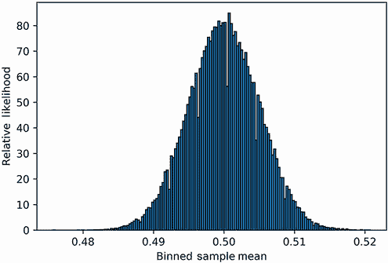
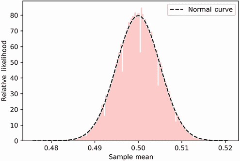
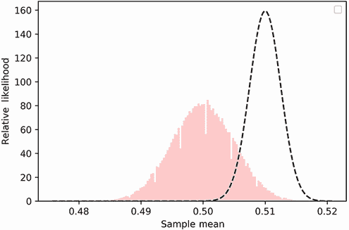
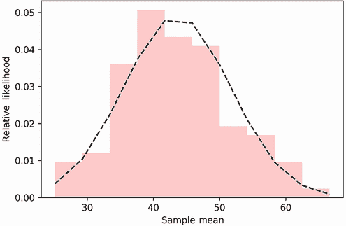
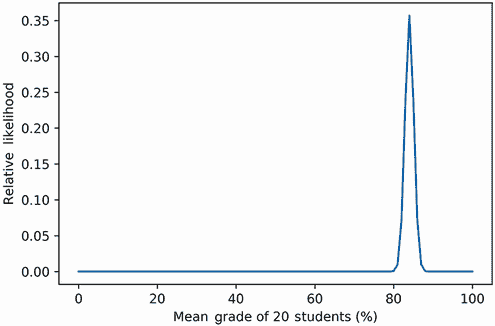
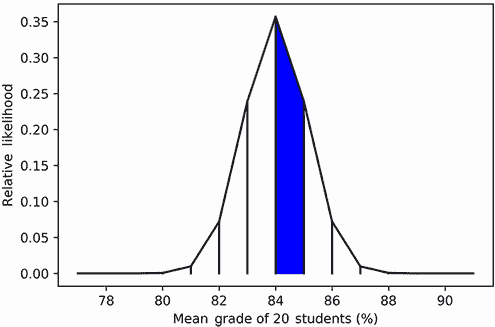

# 6 使用中心极限定理和 SciPy 进行预测

本节涵盖

+   使用 SciPy 库分析正态分布

+   使用中心极限定理预测均值和方差

+   使用中心极限定理预测总体属性

*正态分布*是我们第三部分中介绍的一种钟形曲线。由于中心极限定理，曲线自然地从随机数据采样中产生。之前，我们提到根据该定理，重复采样的频率会呈现出正态曲线的形状。此外，定理预测随着每个频率样本大小的增加，该曲线会变窄。换句话说，随着采样大小的增加，分布的标准差应该减小。

中心极限定理是所有经典统计学的核心。在本节中，我们使用 SciPy 的计算能力对定理进行了深入探讨。最终，我们学会了如何使用定理从有限的数据中进行预测。

## 6.1 使用 SciPy 操作正态分布

在第三部分中，我们展示了随机抛硬币采样如何产生正态分布。让我们通过绘制抛硬币样本的直方图来生成正态分布。我们的直方图输入将包含 10 万个头数频率。计算频率需要我们抛硬币 100,000 次。每个样本将包含一个由 0 和 1 组成的数组，代表 10,000 次翻转的硬币。我们将数组长度称为样本大小。如果我们用样本大小除以样本中值的总和，我们将计算出观察到的头数频率。从概念上讲，这个频率等同于简单地取样本的均值。

以下代码计算单个随机样本的头数频率，并确认其与均值的关系。请注意，样本中的每个数据点都是从伯努利分布中抽取的。

列表 6.1 从均值计算头数频率

```
np.random.seed(0)
sample_size = 10000
sample = np.array([np.random.binomial(1, 0.5) for _ in range(sample_size)])
head_count = sample.sum()
head_count_frequency = head_count / sample_size
assert head_count_frequency == sample.mean()       ❶
```

❶ 头数频率与样本均值相同。

当然，我们可以像第三部分中讨论的那样，用一行代码计算出所有 10 万个头数频率。

列表 6.2 计算 10 万个头数频率

```
np.random.seed(0)
frequencies = np.random.binomial(sample_size, 0.5, 100000) / sample_size
```

每个样本频率等于 10,000 次随机翻转硬币的均值。因此，我们将我们的频率变量重命名为`sample_means`。然后，我们将我们的`sample_means`数据可视化为直方图（图 6.1）。

列表 6.3 在直方图中可视化样本均值

```
sample_means = frequencies
likelihoods, bin_edges, _ = plt.hist(sample_means, bins='auto',
                                     edgecolor='black', density=True)
plt.xlabel('Binned Sample Mean')
plt.ylabel('Relative Likelihood')
plt.show()
```



图 6.1 100,000 个样本均值的直方图，与它们的相对似然性对比。直方图类似于钟形正态分布。

直方图呈正态分布形状。让我们计算分布的均值和标准差。

列表 6.4 计算直方图的均值和标准差

```
mean_normal = np.average(bin_edges[:-1], weights=likelihoods)
var_normal = weighted_variance(bin_edges[:-1], likelihoods)
std_normal = var_normal ** 0.5
print(f"Mean is approximately {mean_normal:.2f}")
print(f"Standard deviation is approximately {std_normal:.3f}")

Mean is approximately 0.50
Standard deviation is approximately 0.005
```

分布的平均值大约为 0.5，其标准差大约为 0.005。在正态分布中，这些值可以直接从分布的峰值计算得出。我们只需要峰值的 x 坐标和 y 坐标。x 值等于分布的平均值，标准差等于 y 值的倒数乘以(2π)^(1/2)。这些性质是从正态曲线的数学分析中得出的。让我们仅使用峰值的坐标重新计算平均值和标准差。

列表 6.5 从峰值坐标计算平均值和标准差

```
import math
peak_x_value = bin_edges[likelihoods.argmax()]
print(f"Mean is approximately {peak_x_value:.2f}")
peak_y_value = likelihoods.max()
std_from_peak = (peak_y_value * (2* math.pi) ** 0.5) ** -1
print(f"Standard deviation is approximately {std_from_peak:.3f}")

Mean is approximately 0.50
Standard deviation is approximately 0.005
```

此外，我们可以通过调用 `stats.norm.fit(sample_means)` 来简单地计算平均值和标准差。这个 SciPy 方法返回重新创建由我们的数据形成的正态分布所需的两个参数。

列表 6.6 使用 `stats.norm.fit` 计算平均值和标准差

```
fitted_mean, fitted_std = stats.norm.fit(sample_means)
print(f"Mean is approximately {fitted_mean:.2f}")
print(f"Standard deviation is approximately  {fitted_std:.3f}")

Mean is approximately 0.50
Standard deviation is approximately 0.005
```

计算出的平均值和标准差可以用来重现我们的正态曲线。我们可以通过调用 `stats.norm.pdf(bin_edges, fitted_mean, fitted_std)` 来重新生成曲线。SciPy 的 `stats.norm.pdf` 方法表示正态分布的**概率密度函数**。概率密度函数类似于概率质量函数，但有一个关键的区别：它不返回概率。相反，它返回相对似然性。如第二部分所述，相对似然性是曲线的 y 轴值，其总面积等于 1.0。与概率不同，这些似然性可以等于大于 1.0 的值。尽管如此，绘制似然区间下方的总面积仍然等于在该区间内观察到随机值的概率。

让我们使用 `stats.norm.pdf` 来计算相对似然性。然后我们将似然性与样本投掷硬币的直方图（图 6.2）一起绘制。

列表 6.7 使用 `stats.norm.pdf` 计算正态似然性

```
normal_likelihoods = stats.norm.pdf(bin_edges, fitted_mean, fitted_std)
plt.plot(bin_edges, normal_likelihoods, color='k', linestyle='--',
         label='Normal Curve')
plt.hist(sample_means, bins='auto', alpha=0.2, color='r', density=True)   ❶
plt.legend()
plt.xlabel('Sample Mean')
plt.ylabel('Relative Likelihood')
plt.show()
```

❶ alpha 参数用于使直方图更透明，以便更好地对比直方图与绘制的似然曲线。



图 6.2 在直方图上叠加正态概率密度函数。绘制正态曲线的参数是使用 SciPy 计算的。绘制的正态曲线很好地覆盖了直方图。

绘制的曲线很好地拟合了直方图。曲线的峰值位于 x 轴位置 0.5，并上升到 y 轴位置大约 80。为了提醒大家，峰值的 x 和 y 坐标是 `fitted_mean` 和 `fitted_std` 的直接函数。为了强调这种重要关系，让我们做一个简单的练习：我们将峰值向右移动 0.01 个单位，同时将峰值的高度加倍（图 6.3）。我们如何执行这个移动？嗯，峰值的轴等于均值，所以我们调整输入的均值为 `fitted_mean + 0.01`。此外，峰值的高度与标准差成反比。因此，输入 `fitted_std / 2` 应该将峰值的高度加倍。

列表 6.8 操作正态曲线的峰值坐标

```
adjusted_likelihoods = stats.norm.pdf(bin_edges, fitted_mean + 0.01,
                                      fitted_std / 2)
plt.plot(bin_edges, adjusted_likelihoods, color='k', linestyle='--')
plt.hist(sample_means, bins='auto', alpha=0.2, color='r', density=True)
plt.xlabel('Sample Mean')
plt.ylabel('Relative Likelihood')
plt.show()
```



图 6.3 一个修改后的正态曲线，其中心位于直方图右侧 0.01 个单位。曲线的峰值是直方图峰值的两倍高度。这些修改是通过操作直方图的均值和标准差实现的。

### 6.1.1 比较两个样本的正态曲线

SciPy 允许我们根据输入的参数探索和调整正态分布的形状。此外，这些输入参数的值取决于我们如何采样随机数据。让我们将抛硬币样本的大小增加到 40,000，并绘制结果分布的变化。以下代码比较了旧的正态分布和更新后的正态分布的绘制形状，我们分别将其标记为 A 和 B（图 6.4）。

列表 6.9 使用不同样本大小绘制两条曲线

```
np.random.seed(0)
new_sample_size = 40000
new_head_counts = np.random.binomial(new_sample_size, 0.5, 100000)
new_mean, new_std = stats.norm.fit(new_head_counts / new_sample_size)
new_likelihoods = stats.norm.pdf(bin_edges, new_mean, new_std)
plt.plot(bin_edges, normal_likelihoods, color='k', linestyle='--',
         label='A: Sample Size 10K')
plt.plot(bin_edges, new_likelihoods, color='b', label='B: Sample Size 40K')
plt.legend()
plt.xlabel('Sample Mean')
plt.ylabel('Relative Likelihood')
plt.show()
```


图 6.4 使用抛硬币数据生成的两个正态分布。分布 A 使用每个样本 10,000 次抛硬币的样本大小得出。分布 B 使用每个样本 40,000 次抛硬币的样本大小得出。两个分布都围绕均值 0.5 中心。然而，分布 B 围绕其中心的分散度要窄得多，分布 B 的峰值是分布 A 峰值的两倍。鉴于峰值高度与方差之间的关系，我们可以推断分布 B 的方差是分布 A 方差的四分之一。

两个正态分布都围绕着样本均值 0.5 中心。然而，样本量较大的分布在其峰值周围更加集中。这与我们在第三部分中看到的情况一致。在那个章节中，我们观察到随着样本量的增加，峰值位置保持不变，而峰值周围的面积在宽度上缩小。峰值的变窄导致置信区间范围的下降。置信区间表示覆盖真实概率的头的可能值范围。之前，我们使用置信区间从 x 轴头数频率估计头的概率。现在我们的 x 轴代表样本均值，其中每个样本均值都等同于头数频率。因此，我们可以使用我们的样本均值来找到头的概率。此外，作为提醒，所有硬币样本都是从伯努利分布中抽取的。我们最近已经证明伯努利分布的均值等于头的概率，所以（不出所料）每个样本的均值都作为真实伯努利均值的估计。我们可以将置信区间解释为覆盖真实伯努利均值的可能值范围。

让我们使用正态分布 B 计算真实伯努利均值的 95%置信区间。之前，我们通过探索峰值周围的曲线面积手动计算了 95%的置信区间。然而，SciPy 允许我们通过调用`stats.norm.interval(0.95, mean, std)`自动提取该范围。该方法返回一个覆盖由`mean`和`std`定义的正态分布下 95%面积的区间。

列表 6.10 使用 SciPy 计算置信区间

```
mean, std = new_mean, new_std
start, end = stats.norm.interval(0.95, mean, std)
print(f"The true mean of the sampled binomial distribution is between {start:.3f} and {end:.3f}")

The true mean of the sampled binomial distribution is between 0.495 and 0.505
```

我们有 95%的信心认为，我们样本的伯努利分布的真实均值在 0.495 和 0.505 之间。实际上，这个均值正好等于 0.5。我们可以使用 SciPy 来验证这一点。

列表 6.11 验证伯努利均值

```
assert stats.binom.mean(1, 0.5) == 0.5
```

常见的 SciPy 正态曲线分析方法

+   `stats.norm.fit(data)`—返回拟合正态曲线到`data`所需的均值和标准差。

+   `stats.norm.pdf(observation, mean, std)`—返回由均值`mean`和标准差`std`定义的正态曲线的单个值的可能性映射。

+   `stats.norm.pdf(observation_array, mean, std)`—返回一个正态可能性的数组。这些是通过在`observation_array`的每个元素`e`上执行`stats.norm.pdf(e, mean, std)`获得的。

+   `stats.norm.interval(x_percent, mean, std)`—返回由均值`mean`和标准差`std`定义的`x_percent`置信区间。

现在我们尝试根据绘制的正态曲线估计伯努利分布的方差。乍一看，这似乎是一个困难的任务。尽管两个绘制的分布的均值保持在 0.5，但它们的方差发生了显著的变化。通过比较峰值可以估计方差的相对变化。分布 B 的峰值是分布 A 的两倍高。这个高度与标准差成反比，所以分布 B 的标准差是分布 A 标准差的一半。由于标准差是方差的平方根，我们可以推断分布 B 的方差是分布 A 方差的四分之一。因此，将样本大小从 10,000 增加四倍到 40,000 导致方差减少四倍。

列表 6.12 在采样增加后评估方差的变化

```
variance_ratio = (new_std ** 2) / (fitted_std ** 2)
print(f"The ratio of variances is approximately {variance_ratio:.2f}")

The ratio of variances is approximately 0.25
```

看起来方差与样本大小成反比。如果是这样，从 10,000 减少到 2,500 的样本大小减少四倍应该会导致方差增加四倍。让我们使用样本大小为 2,500 生成一些计数并确认这一点。

列表 6.13 在采样减少后评估方差的变化

```
np.random.seed(0)
reduced_sample_size = 2500
head_counts = np.random.binomial(reduced_sample_size, 0.5, 100000)
_, std = stats.norm.fit(head_counts / reduced_sample_size)
variance_ratio = (std ** 2) / (fitted_std ** 2)
print(f"The ratio of variances is approximately {variance_ratio:.1f}")

The ratio of variances is approximately 4.0
```

是的！样本大小减少四倍导致方差增加四倍。因此，如果我们从 10,000 减少到 1，我们可以预期方差增加 10,000 倍。这个样本大小为 1 的方差应该等于 `(fitted_std ** 2) * 10000`。

列表 6.14 预测样本大小为 1 的方差

```
estimated_variance = (fitted_std ** 2) * 10000
print(f"Estimated variance for a sample size of 1 is {estimated_variance:.2f}")

Estimated variance for a sample size of 1 is 0.25
```

我们对样本大小为 1 的估计方差为 0.25。然而，如果样本大小为 1，那么我们的 `sample_means` 数组将简单地是一个随机记录的 1 和 0 的序列。根据定义，该数组将代表伯努利分布的输出，因此运行 `sample_means.var` 将近似伯努利分布的方差。因此，我们对样本大小为 1 的估计方差等于伯努利分布的方差。实际上，伯努利方差确实等于 0.25。

列表 6.15 确认样本大小为 1 的预测方差

```
assert stats.binom.var(1, 0.5) == 0.25
```

我们刚刚使用正态分布来计算从伯努利分布中抽取的方差和平均值。让我们回顾一下导致我们结果的一系列步骤：

1.  我们从伯努利分布中抽取了随机的 1 和 0。

1.  每个 `sample_size` 为 1 的 1 和 0 的序列被组合成一个单独的样本。

1.  我们为每个样本计算了平均值。

1.  样本平均值产生了一个正态曲线。我们找到了它的均值和标准差。

1.  正态曲线的均值等于伯努利分布的均值。

1.  正态曲线的方差乘以样本大小等于伯努利分布的方差。

如果我们从某些其他非伯努利分布中进行采样呢？我们是否仍然能够通过随机采样来估计均值和方差？是的，我们可以！根据中心极限定理，从几乎任何分布中抽取的样本均值将产生正态曲线。这包括以下分布：

+   **泊松分布** (`stats.poisson.pmf`)。通常用于模拟

    +   每小时光顾商店的顾客数量

    +   每秒在线广告的点击次数

+   **伽马分布** (`scipy.stats.gamma.pdf`)。通常用于模拟

    +   该地区的月降雨量

    +   根据贷款规模确定的银行贷款违约

+   对数正态分布 (`scipy.stats.lognorm.pdf`)。通常用于模拟

    +   波动的股票价格

    +   传染病的潜伏期

+   自然界中发生的无数尚未命名的分布

警告 在边缘情况的情况下，采样不会产生正态曲线。偶尔，帕累托分布就是这样，它用于模拟收入不平等。

一旦我们采样得到正态曲线，我们就可以用它来分析潜在的分布。正态曲线的均值近似于潜在分布的均值。此外，正态曲线的方差乘以样本大小近似于潜在分布的方差。

注意换句话说，如果我们从具有方差`var`的分布中进行采样，我们将获得一个方差为`sample_size / var`的正态曲线。随着样本大小的增加，正态曲线的方差趋近于零。在零方差时，正态曲线会塌缩成一条位于均值的垂直线。这一性质可以用来推导大数定律，我们在第二部分中介绍了它。

通过采样产生的正态分布与潜在分布的性质之间的关系是所有统计学的基石。利用这种关系，我们可以通过随机采样使用正态曲线来估计几乎任何分布的均值和方差。

## 6.2 通过随机采样确定人口的均值和方差

假设我们被要求找出镇上居民的平均年龄。镇的人口正好是 50,000 人。以下代码使用`np.random.randint`方法模拟居民的年龄。

列表 6.16 生成随机人口

```
np.random.seed(0)
population_ages = np.random.randint(1, 85, size=50000)
```

我们如何计算居民的平均年龄？一种繁琐的方法是对镇上的每一位居民进行普查。我们可以记录所有 50,000 人的年龄，然后计算它们的均值。这个确切的均值将涵盖整个群体，这就是为什么它被称为**总体均值**。此外，整个群体的方差被称为**总体方差**。让我们快速计算模拟镇的人口均值和总体方差。

列表 6.17 计算人口均值和方差

```
population_mean = population_ages.mean()
population_variance = population_ages.var()
```

当我们有模拟数据时，计算总体均值很容易。然而，在现实生活中获取这些数据会非常耗时。我们不得不采访所有 50,000 人。如果没有更多资源，对整个城镇进行采访几乎是不可能的。

一个更简单的方法是对城镇中随机选择的 10 个人进行采访。我们将记录这个随机样本的年龄，然后计算样本均值。让我们通过从`np.random.choice`方法中抽取 10 个随机年龄来模拟抽样过程。执行`np.random.choice(age, size=sample_size)`会返回一个包含 10 个随机抽样年龄的数组。抽样完成后，我们将计算这个 10 个元素数组的均值。

列表 6.18 模拟 10 位采访者

```
np.random.seed(0)
sample_size = 10
sample = np.random.choice(population_ages, size=sample_size)
sample_mean = sample.mean()
```

当然，我们的样本均值可能存在噪声且不精确。我们可以通过计算`sample_mean`和`population_mean`之间的百分比差异来衡量这种噪声。

列表 6.19 比较样本均值和总体均值

```
percent_diff = lambda v1, v2: 100 * abs(v1 - v2) / v2
percent_diff_means = percent_diff(sample_mean, population_mean)
print(f"There is a {percent_diff_means:.2f} percent difference between
        means.")

There is a 27.59 percent difference between means
```

样本均值和总体均值之间的大约差异为 27%。显然，我们的样本不足以估计均值——我们需要收集更多的样本。也许我们应该增加我们的抽样范围，以涵盖城镇的 1,000 名居民。这似乎是一个合理的、比调查所有 50,000 名居民更可取的目标。不幸的是，采访 1,000 人仍然会非常耗时：即使我们假设理想的采访率为每分钟 2 人，也需要 8 小时才能达到我们的采访目标。理论上，我们可以通过并行化采访过程来优化我们的时间。我们可以在当地报纸上发布广告，招募 100 名志愿者：每位志愿者将调查 10 个随机的人以抽样他们的年龄，然后发送给我们计算出的样本均值。这样，我们将收到 100 个样本均值，代表总共 1,000 次采访。

注意 每位志愿者将发送给我们一个样本均值。理论上，志愿者可以发送完整的数据。然而，样本均值更可取，以下是一些原因。首先，均值不需要像完整数据那样多的内存存储。其次，均值可以绘制成直方图，以检查样本大小的质量。如果那个直方图不近似正态曲线，则需要额外的样本。

让我们模拟我们的调查过程。

列表 6.20 计算跨越 1,000 人的样本均值

```
np.random.seed(0)
sample_means = [np.random.choice(population_ages, size=sample_size).mean()
                for _ in range(100)]
```

根据中心极限定理，样本均值的直方图应该类似于正态分布。此外，正态分布的均值应该近似于总体均值。我们可以通过将样本均值拟合到正态分布（图 6.5）来确认这一点。

列表 6.21 将样本均值拟合到正态曲线

```
likelihoods, bin_edges, _  = plt.hist(sample_means, bins='auto', alpha=0.2,
                                      color='r', density=True)
mean, std = stats.norm.fit(sample_means)
normal_likelihoods = stats.norm.pdf(bin_edges, mean, std)
plt.plot(bin_edges, normal_likelihoods, color='k', linestyle='--')
plt.xlabel('Sample Mean')
plt.ylabel('Relative Likelihood')
plt.show()
```



图 6.5 由 100 个年龄样本计算出的直方图。直方图上叠加了其相关的正态分布。正态分布的均值和标准差参数是从绘制的直方图数据中推导出来的。

我们的直方图不是很平滑，因为我们只处理了 100 个数据点。然而，直方图的形状仍然近似于正态分布。我们打印出该分布的均值，并将其与总体均值进行比较。

列表 6.22 比较正态均值与总体均值

```
print(f"Actual population mean is approximately {population_mean:.2f}")
percent_diff_means = percent_diff(mean, population_mean)
print(f"There is a {percent_diff_means:.2f}% difference between means.")

Actual population mean is approximately 42.53
There is a 2.17% difference between means.
```

我们估计的年龄均值为大约 43 岁。实际总体均值为大约 42.5 岁。估计均值和实际均值之间大约有 2%的差异。因此，我们的结果虽然不是完美的，但仍然是城镇实际平均年龄的一个非常好的近似。

现在，我们简要地转向从正态分布计算出的标准差。将标准差平方产生分布的方差。根据中心极限定理，我们可以使用这个方差来估计城镇年龄的方差。我们只需将计算出的方差乘以样本大小。

列表 6.23 估计总体方差

```
normal_variance = std ** 2
estimated_variance = normal_variance * sample_size
```

让我们比较估计的方差和总体方差。

列表 6.24 比较估计方差与总体方差

```
print(f"Estimated variance is approximately {estimated_variance:.2f}")
print(f"Actual population variance is approximately {population_variance:.2f}")
percent_diff_var = percent_diff(estimated_variance, population_variance)
print(f"There is a {percent_diff_var:.2f} percent difference between
        variances.")

Estimated variance is approximately 576.73
Actual population variance is approximately 584.33
There is a 1.30 percent difference between variances.
```

估计方差和总体方差之间大约有 1.3%的差异。因此，我们在仅采样城镇 2%居民的情况下，对城镇的方差进行了相对准确的近似。我们的估计可能不是 100%完美。然而，我们节省的时间远远弥补了这种微小的精度下降。

到目前为止，我们只使用了中心极限定理来估计总体均值和方差。然而，定理的力量远不止于对分布参数的简单估计。我们可以利用中心极限定理来对人进行预测。

## 6.3 使用均值和方差进行预测

现在让我们考虑一个新的场景，其中我们分析一个五年级教室。曼恩夫人是一位杰出的五年级教师。她花了 25 年的时间激发学生的学习热情。她的教室里有 20 名学生。因此，多年来，她总共教授了 500 名学生。

注意：我们假设每年，曼恩夫人恰好教授 20 名学生。当然，在现实生活中，班级规模可能每年都会波动。

她的学生们经常在州内其他五年级学生中表现出色。这种表现是通过学业评估考试来衡量的，这些考试每年对所有五年级学生进行。这些考试的成绩从 0 到 100 分。所有成绩都可以通过查询州评估数据库来获取。然而，由于数据库设计不佳，可查询的考试记录没有指定每次考试的时间。

想象一下，我们被要求回答以下问题：曼恩女士是否曾经教过一堂所有学生都通过评估考试的班级？更具体地说，她是否曾经教过平均评估成绩超过 89%的 20 名学生？

为了回答这个问题，假设我们已经查询了州数据库。我们获得了曼恩女士所有过去学生的成绩。当然，缺乏时间信息阻止我们按年份分组成绩。因此，我们无法简单地扫描记录以查找平均成绩超过 89%的年份。然而，我们仍然可以计算 500 个总成绩的平均值和方差。假设平均值为 84，方差为 25。我们将这些值称为总体均值和总体方差，因为它们涵盖了曼恩女士曾经教过的所有学生的总体。

列表 6.25 记录的成绩的总体均值和方差

```
population_mean = 84
population_variance = 25
```

让我们用曼恩女士班级每年的考试成绩作为从具有均值`总体均值`和方差`总体方差`的分布中随机抽取的 20 个成绩的集合来建模。这个模型很简单。它做出了几个极端的假设，例如这些：

+   班级中每个学生的表现不受其他任何学生的影响。

    在现实生活中，这个假设并不总是成立。例如，捣乱的学生可能会对其他人的表现产生负面影响。

+   每年的考试难度都是相同的。

    在现实生活中，标准化考试可以被政府官员调整。

+   当地经济因素可以忽略不计。

    在现实生活中，波动的经济会影响学区预算以及学生的家庭环境。这些外部因素可能会影响成绩的质量。

我们的简化可能会影响预测准确性。然而，鉴于我们的数据有限，我们在这个问题上几乎没有选择。统计学家经常被迫做出这样的妥协来解决其他难以解决的问题。大多数时候，他们的简化预测仍然合理地反映了现实世界的表现。

根据我们的简单模型，我们可以随机抽取 20 个成绩样本。这些成绩的平均分至少达到 90 分的概率是多少？这个概率可以通过中心极限定理轻松计算。根据定理，平均成绩的似然分布将类似于正态曲线。正态曲线的均值将等于`总体均值`。正态曲线的方差将等于`总体方差`除以我们的 20 名学生样本量。取该方差的平方根产生曲线的标准差，统计学家称之为*平均误差*（SEM）。根据定义，SEM 等于总体标准差除以样本大小的平方根。我们计算曲线参数并绘制正态曲线（图 6.6）。



图 6.6 由总体均值和均值标准误（SEM）导出的正态分布。标准误等于标准差除以样本大小的平方根。绘制曲线下的面积可以用来计算概率。

列表 6.26 使用均值和标准误绘制正态曲线

```
mean = population_mean
population_std = population_variance ** 0.5     ❶
sem = population_std / (20 ** 0.5)              ❷
grade_range = range(101)
normal_likelihoods = stats.norm.pdf(grade_range, mean, sem)
plt.plot(grade_range, normal_likelihoods)
plt.xlabel('Mean Grade of 20 Students (%)')
plt.ylabel('Relative Likelihood')
plt.show()
```

❶ 总体标准差等于总体方差的平方根。

❷ 标准误等于总体标准差除以样本大小的平方根。或者，我们可以通过计算 (总体方差 / 20) ** 0.5 来得到标准误。

在大于 89% 的值下，绘制曲线下的面积趋近于零。该面积也等于给定观察值的概率。因此，观察到均值等级在或高于 90% 的概率非常低。尽管如此，为了确保准确，我们需要计算实际概率。因此，我们需要以某种方式准确测量正态分布下的面积。

### 6.3.1 计算正态曲线下的面积

在第三部分中，我们计算了直方图下的面积。确定这些面积很容易。根据定义，所有直方图都由小的矩形单位组成：我们可以计算组成指定区间的矩形的面积之和，总面积等于区间的面积。不幸的是，我们的平滑正态曲线不能分解成矩形。那么我们如何找到它的面积呢？一个简单的解决方案是将正态曲线细分为小的梯形单位。这种古老的技术被称为 *梯形法则*。梯形是一个有两条平行边的四边形；梯形的面积等于这些平行边之和乘以它们之间距离的一半。对多个连续梯形面积求和可以近似区间上的面积，如图 6.7 所示。



图 6.7 将正态分布细分为梯形区域。每个梯形的左下角位于 x 坐标 `i` 处。每个梯形的平行边由 `stats.norm.pdf(i)` 和 `stats.norm.pdf(i + 1)` 定义。这些平行边相隔 1 个单位。位置 84 处梯形的面积已被阴影标注。该面积等于 `(stats.norm.pdf(84) + stats.norm.pdf(85)) / 2`。在区间范围内对梯形面积求和可以近似该区间的总面积。

梯形法则只需几行代码即可轻松执行。或者，我们可以利用 NumPy 的 `np.trapz` 方法来计算输入数组的面积。让我们将梯形法则应用于我们的正态分布。我们想测试该法则如何近似 `normal_likelihoods` 覆盖的总面积。理想情况下，该面积将近似为 1.0。

列表 6.27 使用梯形法则近似面积

```
total_area = np.sum([normal_likelihoods[i: i + 2].sum() / 2        ❶
                    for i in range(normal_likelihoods.size - 1)])

assert total_area == np.trapz(normal_likelihoods)                  ❷
print(f"Estimated area under the curve is {total_area}")

Estimated area under the curve is 1.0000000000384808
```

❶ 每个梯形的面积等于两个连续似然值的和除以 2。梯形两边的 x 坐标距离是 1，因此它不影响我们的计算。

❷ 注意到 NumPy 以数学上更有效的方式执行梯形法则。

估计的面积非常接近于 1.0，但它并不完全等于 1.0。实际上，它略大于 1.0。如果我们愿意容忍这种轻微的不精确，那么我们的梯形法则输出是可以接受的。否则，我们需要一个精确的正态分布面积解。这种精确度由 SciPy 提供。我们可以使用`stats.norm.sf`方法来访问数学上精确的解。这种方法代表正态曲线的*生存函数*。生存函数等于分布在一个大于某个`x`的区间上的面积。换句话说，生存函数是`np.trapz(normal_likelihoods[x:])`近似面积的确切解。因此，我们可以预期`stats.norm.sf(0, mean, sem)`等于 1.0。

列表 6.28 使用 SciPy 计算总面积

```
assert stats.norm.sf(0, mean, sem) == 1.0       ❶
```

❶ 从理论上讲，正态曲线的下限 x 值延伸到负无穷大。因此，这个实际面积在微观上小于 1.0。然而，这种差异微不足道，以至于 SciPy 无法检测到它。就我们的目的而言，我们可以将精确面积视为 1.0。


图 6.8 我们已经突出显示了由`stats.norm.sf(mean,` `mean,` `sem)`表示的面积。这个面积覆盖了一个大于或等于均值的值区间。阴影面积等于曲线总面积的一半。其确切值是 0.5。

同样，我们预期`stats.norm.sf(mean, mean, sem)`等于 0.5，因为均值完美地将正态曲线分成两个相等的部分（图 6.8）。因此，均值之外的价值区间覆盖了正态曲线的一半面积。同时，我们预期`np.trapz(normal_likelihoods[mean:])`将近似但不完全等于 0.5。让我们来确认。

列表 6.29 将均值输入到生存函数中

```
assert stats.norm.sf(mean, mean, sem) == 0.5
estimated_area = np.trapz(normal_likelihoods[mean:])
print(f"Estimated area beyond the mean is {estimated_area}")

Estimated area beyond the mean is 0.5000000000192404
```

测量曲线面积的常见方法

+   `numpy.trapz(array)`—执行梯形法则来估计`array`的面积。数组元素之间的 x 坐标差设置为 1。

+   `numpy.trapz(array, dx=dx)`—执行梯形法则来估计`array`的面积。数组元素之间的 x 坐标差设置为`dx`。

+   `stats.norm.sf(x_value, mean, std)`—返回覆盖大于或等于`x_value`的区间的正态曲线下的面积。正态曲线的均值和标准差分别设置为`mean`和`std`。

+   `stats.norm.sf(x_array, mean, std)`—返回一个面积数组。这些是通过在每个`x_array`的元素`e`上执行`stats.norm.sf(e, mean, std)`获得的。

现在，让我们执行 `stats.norm.sf(90, mean, sem)`。这返回的是超过 90% 的值区间的面积。这个面积代表了 20 名学生共同通过考试的可能性。

列表 6.30 计算良好集体成绩的概率

```
area  = stats.norm.sf(90, mean, sem)
print(f"Probability of 20 students acing the exam is {area}")

Probability of 20 students acing the exam is 4.012555633463782e-08
```

如预期的那样，概率很低。

### 6.3.2 解释计算出的概率

所有学生都通过考试的概率大约是 2500 万分之一。考试一年只举行一次，因此要达到这种表现水平，随机排列的学生需要大约 2500 万年。与此同时，曼恩夫人只教书 25 年。这代表了数量级上的一百万倍差异。她主持的班级平均成绩达到至少 90% 的几率是多少？实际上为零。我们可以得出结论，这样的班级从未存在过！

注意：实际概率可以通过运行 `1 - stats.binom.pmf(0, 25, stats.norm.sf(90, mean, sem))` 来计算。你能想出为什么吗？

当然，我们可能是错的。也许一群非常优秀的小五年级学生随机出现在同一个教室里。这非常不可能，但仍然有可能。此外，我们的简单计算没有考虑到考试的变化。如果考试每年都变得更简单呢？这将使我们将成绩视为随机抽取样本的处理无效。

我们最终的结论似乎并不完美。我们尽了自己最大的努力，但仍然存在一些不确定性。为了消除这种不确定性，我们需要缺失的评分考试日期。不幸的是，这些数据并未提供。统计学家通常被迫在有限的记录中做出重要的决策。考虑以下两种情况：

+   一个咖啡农场每年以 5 磅一袋的方式运送 500 吨咖啡豆。平均而言，1% 的豆子有霉变，标准差为 0.2%。FDA 允许每袋最多 3% 的霉变豆子。是否存在违反 FDA 要求的袋子？

    如果我们假设霉变与时间无关，则可以应用中心极限定理。然而，霉变可能在潮湿的夏季月份生长得更快。遗憾的是，我们没有记录来证实这一点。

+   一个海滨小镇正在建造海堤来防御海啸。根据历史数据，平均海啸高度为 23 英尺，标准差为 4 英尺。计划建造的海堤高度为 33 英尺。这个高度足以保护小镇吗？

    很容易假设海啸的平均高度每年都会保持不变。然而，某些研究表明气候变化正在导致海平面上升。气候变化可能导致未来的海啸更加强大。遗憾的是，科学数据并不足以确定无疑。

在这两种情况下，我们必须依靠统计技术做出重要决策。这些技术依赖于某些可能不成立的假设。因此，当我们从不完全信息中得出结论时，我们必须非常谨慎。在下一节中，我们将继续探讨基于有限数据的决策的风险和优势。

## 摘要

+   正态分布的均值和标准差由其峰值的位姿决定。均值等于峰值的 x 坐标。同时，标准差等于 y 坐标的倒数乘以(2π)^(1/2)。

+   概率密度函数将输入的浮点值映射到它们的可能性权重。取该曲线下方的面积产生一个概率。

+   从几乎任何分布中重复采样均值会产生一个正态曲线。正态曲线的均值近似于基础分布的均值。此外，正态曲线的方差乘以样本大小近似于基础分布的方差。

+   **均值标准误**（SEM）等于总体标准差除以样本大小的平方根。因此，将总体方差除以样本大小，然后取平方根也会生成 SEM。SEM 与总体均值结合，使我们能够计算观察到某些样本组合的概率。

+   **梯形法则**允许我们通过将曲线分解为梯形单位来估计曲线下的面积。然后我们只需简单地求和每个梯形的面积。

+   **生存函数**衡量一个分布在其超过某个 x 的区间上的面积。

+   在从有限数据中做出推论时，我们必须谨慎考虑我们的假设。
