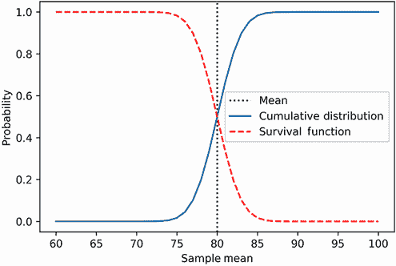
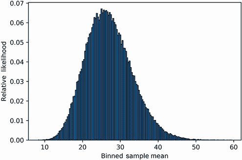
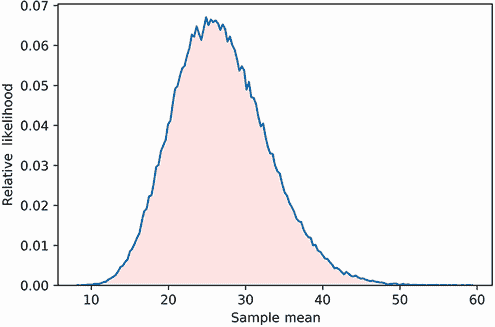
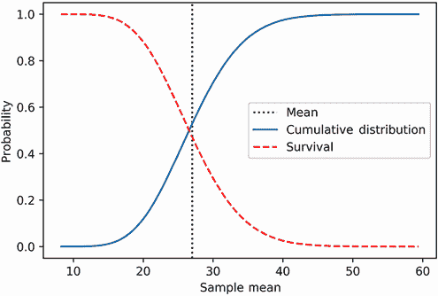
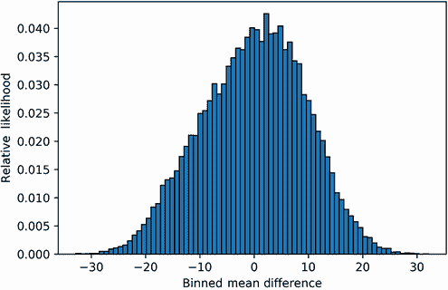

# 7 统计假设检验

本节涵盖

+   比较样本均值和总体均值

+   比较两个不同样本的均值

+   什么是统计显著性？

+   常见统计错误及其避免方法

许多普通人每天都要做出艰难的选择。这一点在美国司法系统中尤其如此。陪审团在审判中决定被告的命运。他们考虑证据，然后决定在两个相互竞争的假设之间做出选择：

+   被告是无辜的。

+   被告是有罪的。

这两个假设并不等量齐观：被告在证明有罪之前被假定为无罪。因此，陪审团假定无罪假设是真实的。他们只能在控方的证据令人信服的情况下拒绝无罪假设。然而，证据很少达到 100%的确定性，对被告罪行的怀疑仍然存在。这种怀疑被纳入法律程序。陪审团被告知，如果对被告的罪行有“合理的怀疑”，则应接受无罪假设。他们只能在被告看起来有罪“超出合理怀疑”的情况下拒绝无罪假设。

合理怀疑是一个难以精确定义的抽象概念。尽管如此，我们可以在一系列现实场景中区分合理和不合理的怀疑。考虑以下两个审判案例：

+   DNA 证据直接将被告与犯罪联系起来。DNA 不属于被告的可能性是 1 亿分之一。

+   血型证据直接将被告与犯罪联系起来。血型不属于被告的可能性是 15 分之一。

在第一个场景中，陪审团不能 100%确信被告的罪行。有 1 亿分之一的可能性是无辜的被告正在受审。然而，这种情况极其不可能。认为这是合理的假设是不合理的。因此，陪审团应该拒绝无罪假设。

同时，在第二个场景中，怀疑更为普遍：15 个人中就有 1 人与被告有相同的血型。有理由假设可能还有其他人出现在犯罪现场。尽管陪审团可能会怀疑被告的无罪，但他们也会合理地怀疑被告的罪行。因此，除非提供额外的罪行证据，否则陪审团不能拒绝无罪假设。

在我们的两个场景中，陪审团正在进行**统计假设检验**。这类检验允许统计学家在两个相互竞争的假设之间进行选择，这两个假设都源于不确定的数据。其中一个假设根据测量的怀疑程度被接受或拒绝。在本节中，我们将探讨几种著名的统计假设检验技术。我们从一个简单的测试开始，以测量样本均值是否明显偏离现有总体。

## 7.1 评估样本均值与总体均值之间的差异

在第六部分中，我们使用统计学分析了一个五年级班级。现在，让我们想象一个场景，即我们分析北达科他州所有五年级班级的情况。一个春天的日子，该州的所有五年级学生都参加了相同的评估考试。考试分数被输入北达科他州的评估数据库，并计算了全州所有年级的平均值和方差。根据记录，总体平均值为 80，总体方差为 100。让我们快速将这些值存储起来以备后用。

列表 7.1 北达科他州年级的总体平均数和方差

```
population_mean = 80
population_variance = 100
```

接下来，假设我们前往南达科他州，并遇到一个五年级班级，其平均考试分数为 84%。这个 18 人的班级比北达科他州的人口高出 4 个百分点。南达科他州的五年级学生是否比北达科他州的学生受教育程度更高？如果是这样，北达科他州应该将南达科他州的教学方法纳入课程。课程调整可能会很昂贵，但对学生来说，回报将是值得的。当然，也有可能观察到的考试差异只是一个统计上的偶然。它是哪一个？我们将通过假设检验来试图找出答案。

我们面临两种可能的情形。首先，有可能相邻各州的整体学生人口是相同的。换句话说，一个典型的南达科他州班级与一个典型的北达科他州班级没有区别。在这种情况下，南达科他州的总体平均数和方差值将与邻州的可区分性相同。统计学家将这种假设参数等价性称为*零假设*。如果零假设成立，那么我们表现优异的南达科他州班级只是一个异常值，并不代表实际平均值。

另一方面，也有可能这个班级的高成绩代表了南达科他州的一般人口。因此，该州的平均数和方差值将与北达科他州的人口参数不同。统计学家称这为*备择假设*。如果备择假设成立，我们将更新北达科他州的五年级课程。然而，备择假设只有在零假设不成立时才成立（反之亦然）。因此，为了证明课程改革是合理的，我们必须首先证明零假设不太可能成立。我们可以使用中心极限定理来衡量这种可能性。

让我们暂时假设零假设成立，并且两个达科他州共享相同的总体平均数和方差。因此，我们可以将我们的 18 人班级建模为从正态分布中抽取的随机样本。该分布的平均值将等于`population_mean`，其标准差将等于平均误差（SEM），定义为`(population_variance / 18) ** 0.5`。

列表 7.2 如果零假设成立，则正态曲线参数

```
mean = population_mean
sem = (population_variance / 18) ** 0.5
```

如果零假设为真，遇到至少 84%的平均考试成绩的概率等于 `stats.norm.sf(84, mean, sem)`。让我们检查这个概率。

列表 7.3 查找高成绩概率

```
prob_high_grade = stats.norm.sf(84, mean, sem)
print(f"Probability of an average grade >= 84 is {prob_high_grade}")

Probability of an average grade >= 84 is 0.044843010885182284
```

在零假设下，一个随机的南达科他州教室获得至少 84%的平均成绩的概率为 0.044。这个概率很低，因此与总体平均值的 4%的成绩差异看起来非常极端。但实际上它真的极端吗？在第一部分中，当我们检查观察 10 次抛硬币中出现 8 次头的可能性时，我们提出了一个类似的问题。在我们的硬币分析中，我们将过度表现的概率与不足表现的概率相加。换句话说，我们将观察八次或更多头的概率与观察两次或更少头的概率相加。在这里，我们的困境是相同的。分析考试过度表现不足以评估极端性；我们还必须考虑同样极端的不足表现的可能性。因此，我们需要计算观察到样本均值至少低于总体均值 80%四个百分点的概率。

我们现在将计算观察到低于或等于 76%的考试平均成绩的概率。这个计算可以使用 SciPy 的 `stats.norm.cdf` 方法来完成，该方法计算正态曲线的 *累积分布函数*。累积分布函数是生存函数的直接对立面，如图 7.1 所示。将 `stats.norm.cdf` 应用到 `x` 上返回从负无穷大到 `x` 的正态曲线下的面积。


图 7.1 在正态曲线下突出显示了两个区域。最左侧的区域覆盖了所有小于或等于 76%的 x 值。我们可以使用累积分布函数来计算这个区域。要执行该函数，我们只需调用 `stats.norm.cdf(76, mean, sem)`。同时，最右侧的区域覆盖了所有至少为 84%的 x 值。我们可以使用生存函数来计算这个区域。要执行该函数，我们调用 `stats.norm.sf(84, mean, sem)`。

我们现在使用 `stats.norm.cdf` 来找到观察到异常低平均成绩的概率。

列表 7.4 查找低成绩概率

```
prob_low_grade = stats.norm.cdf(76, mean, sem)
print(f"Probability of an average grade <= 76 is {prob_low_grade}")

Probability of an average grade <= 76 is 0.044843010885182284
```

看起来 `prob_low_grade` 等于 `prob_high_grade`。这种等式源于正态曲线的对称形状。累积分布函数和生存函数是镜像，它们在均值处反射。因此，对于任何输入 `x`，`stats.norm.sf(mean + x, mean, sem)` 总是等于 `stats.norm.cdf(mean - x, mean, sem)`。接下来，我们将可视化这两个函数，以确认它们在垂直绘制的均值处的反射（图 7.2）。



图 7.2 正态分布的累积分布函数与生存函数一起绘制。累积分布函数和生存函数是镜像关系。它们在正态曲线的均值处反射，该均值以垂直线绘制。

列表 7.5 比较生存和累积分布函数

```
for x in range(-100, 100):
    sf_value = stats.norm.sf(mean + x, mean,  sem)
    assert sf_value == stats.norm.cdf(mean - x, mean, sem)

plt.axvline(mean, color='k', label='Mean', linestyle=':')
x_values = range(60, 101)
plt.plot(x_values, stats.norm.cdf(x_values, mean, sem),
         label='Cumulative Distribution')
plt.plot(x_values, stats.norm.sf(x_values, mean, sem),
         label='Survival Function', linestyle='--', color='r')
plt.xlabel('Sample Mean')
plt.ylabel('Probability')
plt.legend()
plt.show()
```

现在我们准备求和`prob_high_grade`和`prob_low_grade`。由于对称性，这个和等于`2 * prob_high_grade`。从概念上讲，这个和代表在零假设为真时观察到与总体均值极端偏差的概率。统计学家将这种由零假设驱动的概率称为*p 值*。让我们打印出由我们的数据产生的 p 值。

列表 7.6 计算零假设驱动的 p 值

```
p_value = prob_low_grade + prob_high_grade
assert p_value == 2 * prob_high_grade
print(f"The p-value is {p_value}")

The p-value is 0.08968602177036457
```

在零假设下，随机观察到成绩极端的可能性大约为 9%。因此，零假设可能是真实的，极端的测试平均成绩只是随机波动。我们还没有最终证明这一点，但我们的计算对重组北达科他州五年级课程提出了严重怀疑。如果南达科他州班级的平均成绩是 85%，而不是 84%呢？让我们检查这种微小的成绩变化是否会影响我们的 p 值。

列表 7.7 计算调整样本均值的 p 值

```
def compute_p_value(observed_mean, population_mean, sem):
    mean_diff = abs(population_mean - observed_mean)
    prob_high = stats.norm.sf(population_mean + mean_diff, population_mean, sem)
    return 2 * prob_high

new_p_value = compute_p_value(85, mean, sem)
print(f"The updated p-value is {new_p_value}")

The updated p-value is 0.03389485352468927
```

平均成绩的微小增加导致了 p 值的降低三倍。现在，在零假设下，观察到平均测试成绩至少与 85%一样极端的可能性只有 3.3%。这种可能性很低，因此我们可能会倾向于拒绝零假设。我们应该接受备择假设，并投资时间和金钱来翻新北达科他州的教育体系吗？

这是一个不容易回答的问题。通常，统计学家如果 p 值小于或等于 0.05，就会拒绝零假设。0.05 的阈值被称为*显著性水平*，低于该阈值的 p 值被认为是*统计显著的*。然而，0.05 只是一个任意截止值，旨在启发式地揭示有趣的数据，而不是做出关键决策。这个阈值最早是在 1935 年由著名的统计学家罗纳德·费希尔提出的；后来，费希尔表示，显著性水平不应保持静态，而应根据分析的性质手动调整。遗憾的是，那时已经太晚了：0.05 的截止值已经被采纳为我们衡量显著性的标准度量。今天，大多数统计学家都认为，p 值低于 0.05 意味着数据中存在有趣的信号，因此 0.033 的 p 值就足以暂时拒绝零假设，并将数据发表在科学期刊上。不幸的是，0.05 的阈值实际上并不是来自数学和统计学的定律：它是由学术社区作为一个研究发表的要求而选择的临时值。因此，许多研究期刊都充斥着*第一类错误*。第一类错误被定义为错误地拒绝零假设。这种错误发生在将随机数据波动解释为从总体均值的真实偏差时。包含第一类错误的科学文章错误地断言存在均值之间的差异，而实际上并不存在。

我们如何限制第一类错误？嗯，一些科学家认为 0.05 的阈值不合理，我们应该只在 p 值远低于这个值时拒绝零假设。但目前还没有关于使用更低阈值是否合适的共识，因为这样做会导致*第二类错误*的增加，在第二类错误中，我们会错误地拒绝备择假设。当科学家犯第二类错误时，他们未能注意到一个合法的发现。

选择一个最佳显著性水平是困难的。然而，让我们暂时将显著性水平设定为一个非常严格的值 0.001。那么，最低的平均成绩是多少会低于这个阈值？让我们来找出答案。我们遍历所有超过 80%的平均成绩，在过程中计算 p 值。当我们遇到一个小于或等于 0.001 的 p 值时，我们停止。

列表 7.8 搜索严格的 p 值结果

```
for grade in range(80, 100):
    p_value = compute_p_value(grade, mean, sem)
    if p_value < 0.001:
        break

print(f"An average grade of {grade} leads to a p-value of {p_value}")

An average grade of 88 leads to a p-value of 0.0006885138966450773
```

给定新的阈值，我们需要平均成绩至少达到 88%才能拒绝零假设。因此，平均成绩为 87%不会被视为具有统计学意义的，尽管它明显高于总体均值。我们降低截止点的做法不可避免地增加了我们犯第二类错误的概率。因此，在这本书中，我们维持了普遍接受的 p 值截止点 0.05。但我们同时也采取了过度的谨慎，以避免错误地拒绝零假设。特别是，我们尽最大努力减少最常见的第一类错误的成因，这也是下一小节的主题：数据挖掘。

## 7.2 数据挖掘：通过过度采样得出错误结论

有时，统计学学生使用 p 值的方式不正确。考虑以下简单场景。两个室友倒出一袋糖果。袋子里有五种不同颜色的糖果。蓝色糖果的数量比任何其他单一颜色都多。第一个室友认为蓝色是任何糖果袋中的主导颜色。第二个室友不同意：她根据所有颜色出现概率相等的零假设计算 p 值。这个 p 值大于 0.05。然而，第一个室友拒绝退让。他打开另一袋糖果。这次，p 值是根据那袋糖果的内容重新计算的。这次，p 值等于 0.05。第一个室友宣称胜利：他断言，鉴于低 p 值，零假设很可能是错误的。然而，他是错的。

第一个室友根本误解了 p 值的含义。他错误地认为它代表的是零假设为真的概率。实际上，p 值代表的是如果零假设为真，观察到偏差的概率。这两种定义之间的区别虽然微妙但非常重要：第一种定义暗示如果 p 值低，零假设很可能是错误的；但第二种定义保证我们最终会观察到低 p 值，即使零假设为真。此外，低 p 值观察的频率将等于 p 值本身。因此，如果我们打开 100 袋糖果，我们应该期望观察到大约五次的 p 值为 0.05。通过重复随机测量，我们最终会得到一个具有统计学意义的结论，即使实际上不存在统计学上的显著性！

进行相同的实验次数过多会增加我们犯第一类错误的概率。让我们在五年级考试分析的情况下探讨这个概念。假设北达科他州的州级测试表现与其他 49 个州的考试结果没有差异。更确切地说，我们将假设全国平均数和方差等于北达科他州的`population_mean`和`population_variance`考试成绩结果。因此，对于美国所有州来说，零假设都是成立的。

此外，让我们假设我们还没有意识到零假设总是真实的。我们唯一确定的是北达科他州的人口均值和方差。我们开始了一次公路旅行，寻找一个成绩分布与北达科他州不同的州。不幸的是，我们的搜索注定是徒劳的，因为不存在这样的州。

我们的第一站是蒙大拿州。在那里，我们随机选择了一个有 18 名学生的五年级教室。然后我们计算这个教室的平均成绩。由于零假设在秘密中是真实的，我们可以通过从由`mean`和`sem`定义的正态分布中采样来模拟这个平均成绩的值。让我们通过调用`np.random.normal(mean, sem)`来模拟这个班级的考试成绩。这个方法调用从由输入变量定义的正态分布中采样。

列表 7.9 随机采样蒙大拿州考试成绩

```
np.random.seed(0)
random_average_grade = np.random.normal(mean, sem)
print(f"Average grade equals {random_average_grade:.2f}")

Average grade equals 84.16
```

班级平均考试成绩约为 84.16 分。我们可以通过检查其 p 值是否小于或等于 0.05 来确定这个平均值是否具有统计学意义。

列表 7.10 测试蒙大拿州考试成绩的显著性

```
if compute_p_value(random_average_grade, mean, sem) <= 0.05:
    print("The observed result is statistically significant")
else:
    print("The observed result is not statistically significant")

The observed result is not statistically significant
```

平均成绩不具有统计学意义。我们将继续我们的旅程，并访问剩余的 48 个州中的每个 18 名学生教室，计算每个教室的平均成绩。同时也会计算 p 值。一旦我们发现一个具有统计学意义的 p 值，我们的旅程将结束。

以下代码模拟了我们的旅行。它遍历剩余的 48 个州，为每个州随机抽取一个平均成绩。一旦发现一个具有统计学意义的平均成绩，迭代循环将停止。

列表 7.11 随机搜索具有显著州结果的州

```
np.random.seed(0)
for i in range(1, 49):
    print(f"We visited state {i + 1}")
    random_average_grade = np.random.normal(mean, sem)
    p_value = compute_p_value(random_average_grade, mean, sem)
    if p_value <= 0.05:
        print("We found a statistically significant result.")
        print(f"The average grade was {random_average_grade:.2f}")
        print(f"The p-value was {p_value}")
        break

if i == 48:
    print("We visited every state and found no significant results.")

We visited state 2
We visited state 3
We visited state 4
We visited state 5
We found a statistically significant result.
The average grade was 85.28
The p-value was 0.025032993883401307
```

我们访问的第五个州产生了具有统计学意义的成果！该州的一个教室的平均成绩为 85.28 分。相关的 p 值为 0.025，低于我们的 0.05 截止值。看起来我们可以拒绝零假设！然而，这个结论是错误的，因为零假设是真实的。出了什么问题？嗯，如前所述，低 p 值观察的频率将等于 p 值本身。因此，即使零假设是真实的，我们也期望大约 2.5%的时间遇到 p 值约为 0.025 的情况。由于我们穿越了 49 个州，49 的 2.5%是 1.225，我们应该期望大约访问一个随机 p 值约为 0.025 的州。

我们寻找统计学上显著结果的努力从一开始就注定要失败，因为我们误用了统计学。我们沉溺于统计学的根本性错误*数据挖掘*，也称为*数据钓鱼*或*p-hacking*。在数据挖掘中，实验一次又一次地重复，直到找到统计学上显著的结果。然后，统计学上显著的结果被展示给他人，而其余失败的实验被丢弃。数据挖掘是科学出版物中第一类错误最常见的原因。遗憾的是，有时研究人员提出一个假设，并重复实验，直到特定的错误假设被验证为真。例如，研究人员可能假设某些糖果会导致老鼠患癌症。研究人员继续给一组老鼠喂食特定的糖果品牌，但没有发现癌症的联系。然后，研究人员更换糖果品牌并再次进行实验。再次。再次。多年后，终于发现了一种与癌症有关的糖果品牌。当然，实际的实验结果几乎是有欺诈性的。癌症和糖果之间不存在真正的统计联系——研究人员只是进行了太多的实验，直到随机测量到一个低的 p 值。

避免数据挖掘并不困难：我们只需事先选择一个有限的实验数量进行。然后我们将显著性水平设置为 0.05 除以计划实验的数量。这种简单技术被称为*Bonferroni 校正*。让我们重复使用 Bonferroni 校正分析美国考试表现。分析需要我们访问 49 个州以评估 49 个教室，因此我们的显著性水平应设置为 0.05 / 49。

列表 7.12 使用 Bonferroni 校正调整显著性

```
num_planned_experiments = 49
significance_level = .05 / num_planned_experiments
```

我们重新运行我们的分析，如果遇到小于或等于`significance_level`的 p 值，分析将终止。

列表 7.13 使用调整后的显著性水平重新运行分析

```
np.random.seed(0)
for i in range(49):
    random_average_grade = np.random.normal(mean, sem)
    p_value = compute_p_value(random_average_grade, mean, sem)
    if p_value <= significance_level:
        print("We found a statistically significant result.")
        print(f"The average grade was {random_average_grade:.2f}")
        print(f"The p-value was {p_value}")
        break

if i == 48:
    print("We visited every state and found no significant results.")

We visited every state and found no significant results.
```

我们访问了 49 个州，发现与北达科他州的人口均值和方差没有统计学上显著的差异。Bonferroni 校正使我们避免了第一类错误。

最后提醒一句，Bonferroni 校正只有在我们将 0.05 除以计划进行的实验数量时才有效。如果我们除以已完成实验的数量，则它不起作用。例如，如果我们计划进行 1000 次实验，但我们的第一次实验的 p 值等于 0.025，我们不应将显著性水平调整为 0.05 / 1。同样，如果第二次完成的实验的 p 值等于 0.025，我们应该保持显著性水平为 0.05 / 1000，而不是将其调整为 0.05 / 2。否则，我们可能会错误地偏向我们的前几个实验结果。为了得出公平、正确的结论，我们必须对所有实验一视同仁。

Bonferroni 校正是一种用于更准确假设检验的有用技术。它可以应用于所有类型的统计假设检验，而不仅仅是利用总体均值和方差的简单测试。这是幸运的，因为统计测试的复杂程度各不相同。在下一个小节中，我们将探讨一个更复杂的测试，该测试不依赖于知道总体方差。

## 7.3 使用替换法进行自助法：在总体方差未知时检验假设

我们很容易就能使用总体均值和方差计算 p 值。遗憾的是，在许多现实情况下，总体方差是未知的。考虑以下场景，我们拥有一一个非常大的水族箱。它容纳了 20 条从 2 厘米到近 120 厘米不等长度的热带鱼。平均鱼长度为 27 厘米。我们使用`fish_lengths`数组来表示这些鱼长度。

列表 7.14 定义水族箱中鱼的长度

```
fish_lengths = np.array([46.7, 17.1, 2.0, 19.2, 7.9, 15.0, 43.4,
                         8.8, 47.8, 19.5, 2.9, 53.0, 23.5, 118.5,
                         3.8, 2.9, 53.9, 23.9, 2.0, 28.2])
assert fish_lengths.mean() == 27
```

我们的水族箱是否准确地捕捉到了真实热带鱼的分布长度？我们想找出答案。一个可靠的来源告诉我们，野生热带鱼的总体平均长度为 37 厘米。总体均值和样本均值之间有 10 厘米的显著差异。这种差异感觉很重要，但在严格的统计学中，感觉没有位置。我们必须确定这种差异是否在统计学上显著，以便得出有效的结论。

到目前为止，我们使用`compute_p_value`函数来衡量统计显著性。然而，我们不能将此函数应用于我们的鱼数据，因为我们不知道总体方差！没有总体方差，我们无法计算 SEM，这是运行`compute_p_value`所需的变量。当总体方差未知时，我们如何找到平均误差的标准？

初看之下，我们似乎没有找到 SEM 的方法。我们可以天真地通过执行`fish_lengths.var()`将样本方差视为总体方差的估计。不幸的是，小样本容易受到随机方差波动的影响，因此任何此类估计都极其不可靠。因此，我们陷入了困境。我们面临一个看似无法攻克的难题，必须依赖一个看似不可能的解决方案：*替换法自助法*。术语*自助法*源自短语“拔自己的靴带”。这个短语指的是通过拉动靴子的鞋带将自己拉入空中。当然，这样做是不可能的。在替换法自助法中，我们将尝试同样不可能的事情，即直接从我们的有限数据中计算 p 值！尽管这个看似荒谬的解决方案，我们仍然会成功。

我们开始自助法过程，首先从水族箱中随机移除一条鱼。所选鱼的长度将被测量以供后续使用。

列表 7.15 从水族箱中随机抽取一条鱼

```
np.random.seed(0)
random_fish_length = np.random.choice(fish_lengths, size=1)[0]
sampled_fish_lengths = [random_fish_length]
```

现在我们将选中的鱼放回水族箱。这个替换步骤就是有放回抽样的名字由来。在我们将鱼放回后，我们再次伸入水族箱并随机选择另一条鱼。我们有 1/20 的机会会再次选择到之前选中的鱼，这是完全可以接受的。我们记录所选鱼的长径并将其放回水中。然后我们重复此过程 18 次，直到测量了 20 个随机鱼长。

列表 7.16 重复抽样 20 条随机鱼

```
np.random.seed(0)
for _ in range(20):
    random_fish_length = np.random.choice(fish_lengths, size=1)[0]
    sampled_fish_lengths.append(random_fish_length)
```

`sampled_fish_lengths`列表包含 20 个测量值，所有这些测量值都来自 20 个元素的`fish_lengths`数组。然而，`fish_lengths`和`sampled_fish_lengths`的元素并不相同。由于随机抽样，数组和列表的平均值很可能会不同。

列表 7.17 比较样本均值与水族箱均值

```
sample_mean = np.mean(sampled_fish_lengths)
print(f"Mean of sampled fish lengths is {sample_mean:.2f} cm")

Mean of sampled fish lengths is 26.03 cm
```

抽样鱼长度的平均值是 26.03 厘米。它比我们的原始平均值偏离了 0.97 厘米。因此，有放回抽样在我们的观察中引入了一些方差。如果我们从水族箱中再抽取 20 个测量值，我们可以预期后续的样本平均值也将偏离 27 厘米。让我们通过重复我们的抽样过程来确认，使用一行代码：`np.random.choice(fish_lengths, size=20, replace=True)`。将`replace`参数设置为`True`确保我们从`fish_lengths 数组`中进行有放回抽样。

列表 7.18 使用 NumPy 进行有放回抽样

```
np.random.seed(0)
new_sampled_fish_lengths = np.random.choice(fish_lengths, size=20,
                                            replace=True)            ❶
new_sample_mean = new_sampled_fish_lengths.mean()
print(f"Mean of the new sampled fish lengths is {new_sample_mean:.2f} cm")

Mean of the new sampled fish lengths is 26.16 cm
```

❶ 作为旁注，函数中当前默认将 replace 参数设置为 True。

新的样本均值等于 26.16 厘米。当我们进行有放回抽样时，我们的均值值将会波动：波动意味着随机性，因此我们的均值值是随机分布的。让我们通过重复我们的抽样过程 150,000 次来探索这个随机分布的形状。在迭代过程中，我们计算 20 条随机鱼的平均值；然后我们绘制 150,000 个抽样均值的直方图（图 7.3）。

列表 7.19 绘制 150,000 个抽样均值的分布

```
np.random.seed(0)
sample_means = [np.random.choice(fish_lengths,
                                 size=20,
                                 replace=True).mean()
               for _ in range(150000)]
likelihoods, bin_edges, _ = plt.hist(sample_means, bins='auto',
                                     edgecolor='black', density=True)
plt.xlabel('Binned Sample Mean')
plt.ylabel('Relative Likelihood')
plt.show()
```



图 7.3 使用有放回抽样计算出的样本均值直方图。直方图不是钟形；它是不对称的。

我们生成的直方图不是正态曲线。形状不对称：其左侧比右侧上升得更陡峭。数学家将这种不对称性称为*偏度*。我们可以通过调用`stats.skew(sample_means)`来确认我们直方图中的偏度。当输入的数据不对称时，`stats.skew`方法返回一个非零值。

列表 7.20 计算不对称分布的偏度

```
assert abs(stats.skew(sample_means)) > 0.4      ❶
```

❶ 没有数据是完全对称的，偏度很少为 0.0，即使数据是从正态曲线中抽取的也是如此。然而，正态数据往往具有非常接近 0.0 的偏度。任何偏度的绝对值大于 0.04 的数据几乎不可能来自正态分布。

我们的不对称直方图不能用正态分布来建模。尽管如此，直方图代表了一个连续概率分布。像所有连续分布一样，直方图可以被映射到概率密度函数、累积分布函数和生存函数。了解函数输出将是有用的。例如，生存函数会给我们观察到的样本均值大于总体均值的概率。我们可以通过手动编写代码，使用`bin_edges`和`likelihoods`数组计算曲线面积来获得函数输出。

或者，我们也可以直接使用 SciPy，它为我们提供了一种从直方图中获取所有三个函数的方法。这个方法是`stats.rv_histogram`，它接受由`bin_edges`和`likelihoods`数组定义的元组作为输入。调用`stats.rv_histogram((`likelihoods,` `bin_edges))`会返回一个包含`pdf`、`cdf`和`sf`方法的`random_variable` SciPy 对象，就像`stats.norm.`一样。`random_variable .pdf`方法输出直方图的概率密度。同样，`random_variable.cdf`和`random_variable.sf`方法分别输出累积分布函数和生存函数。

以下代码计算由直方图产生的`random_variable`对象。然后我们通过调用`random_variable.pdf (bin_edges)`绘制概率密度函数（图 7.4）。

列表 7.21 使用 SciPy 将数据拟合到通用分布

```
random_variable = stats.rv_histogram((likelihoods, bin_edges))
plt.plot(bin_edges, random_variable.pdf(bin_edges))
plt.hist(sample_means, bins='auto', alpha=0.1,  color='r', density=True)
plt.xlabel('Sample Mean')
plt.ylabel('Relative Likelihood')
plt.show()

```



图 7.4 一个不对称直方图及其概率密度函数的重叠。我们使用了 SciPy 从直方图中学习概率密度函数。

如预期的那样，概率密度函数与直方图形状完美相似。现在让我们绘制与`random_variable`相关的累积分布函数和生存函数。我们应该预期这两个绘制的函数将不会围绕均值对称。为了检查这种不对称性，我们使用垂直线绘制分布的均值。我们通过调用`random_variable.mean()`获得这个均值（图 7.5）。

列表 7.22 绘制通用分布的均值和区间面积

```
rv_mean = random_variable.mean()
print(f"Mean of the distribution is approximately {rv_mean:.2f} cm")

plt.axvline(random_variable.mean(), color='k', label='Mean', linestyle=':')
plt.plot(bin_edges, random_variable.cdf(bin_edges),
         label='Cumulative Distribution')
plt.plot(bin_edges, random_variable.sf(bin_edges),
         label='Survival', linestyle='--', color='r')
plt.xlabel('Sample Mean')
plt.ylabel('Probability')
plt.legend()
plt.show()

Mean of the distribution is approximately 27.00 cm
```



图 7.5 一个不对称分布的累积分布函数与生存函数一起绘制。这两个函数不再像我们在正态曲线分析中那样对称地反映在均值两侧。因此，我们不能再简单地通过将生存函数输出加倍来计算 p 值。

分布的均值大约为 27 厘米，这也是我们水族馆中鱼的平均长度。随机鱼样本很可能产生一个接近水族馆均值的值。然而，有放回的抽样有时会产生大于 37 厘米或小于 17 厘米的值。观察这些极端值的概率可以通过我们的两个绘图函数来计算。让我们更详细地检查这两个函数。

根据我们的图表，累积分布函数和生存函数并不是镜像关系。它们也没有直接在均值处相交，就像我们在正态曲线分析中所做的那样。我们的分布不像对称的正态曲线，这导致了一些后果。使用对称曲线，我们可以通过将生存函数加倍来计算 p 值。在我们的非对称分布中，仅凭生存函数本身不足以计算尾部概率。幸运的是，我们可以使用生存函数和累积分布函数来揭示极端观测值的概率。使用这些概率，我们可以评估统计显著性。

我们可以通过回答以下问题来衡量显著性：20 个样本（有放回）产生与总体均值一样极端的均值的概率是多少？作为提醒，总体均值为 37 厘米，比我们的分布均值大 10 厘米。因此，“极端性”定义为至少比`rv_mean`远 10 厘米的样本输出。根据我们之前的讨论，问题可以分解为计算两个不同的值。首先，我们必须计算观察到至少 37 厘米的样本均值的概率，然后我们必须计算观察到小于或等于 17 厘米的样本均值的概率。前者概率等于`random_variable.sf(37)`，而后者等于`random_variable.cdf(17)`。将这两个值相加将为我们提供答案。

列表 7.23 计算极端样本均值的概率

```
prob_extreme= random_variable.sf(37) + random_variable.cdf(17)
print("Probability of observing an extreme sample mean is approximately "
      f"{prob_extreme:.2f}")

Probability of observing an extreme sample mean is approximately 0.10
```

观察到极端值的概率大约为 0.10。换句话说，十分之一的随机水族馆样本将产生至少与总体均值一样极端的均值。我们的总体均值并不像我们想象的那么远离水族馆均值。事实上，10 厘米或更多的均值差异将出现在 10%的样本鱼产量中。因此，我们的样本均值 27 厘米和总体均值 37 厘米之间的差异在统计学上并不显著。

到现在为止，所有这些都应该看起来很熟悉。`prob_extreme`值只是伪装成 p 值。当零假设为真时，样本均值与总体均值之间的差异将在 10%的样本案例中至少为 10 厘米。这个 0.1 的 p 值大于我们的阈值 0.05。因此，我们不能拒绝零假设。我们的样本均值和总体均值之间没有统计学上的显著差异。

我们以一种迂回的方式计算了 p 值。一些读者可能对我们的方法表示怀疑——毕竟，从我们有限的 20 条鱼中抽取样本似乎是一种奇怪的获取统计洞察的方法。尽管如此，描述的技术是合法的。带替换的 bootstrap 是一种可靠的提取 p 值的方法，尤其是在处理有限数据时。

带替换的 bootstrap 的有用方法

+   `rv = stats.rv_histogram((likelihoods, bin_edges))`—基于`likelihoods, bin_edges = np.hist(data)`的直方图输出创建一个随机变量对象`rv`。

+   `p_value = rv.sf(head_extreme) + random_variable.cdf(tail_extreme)`—根据随机变量对象基于生存输出和头极端和尾极端的累积分布输出计算 p 值。

+   `z = np.random.choice(x, size=y, replace=True)`—从数组`x`中带替换地抽取`y`个元素。样本存储在数组`z`中。在带替换的 bootstrap 中，`y == x.size`。

bootstrap 技术已经经过四十多年的严格研究。统计学家已经发现了多种这种技术的变体，用于准确计算 p 值。我们刚刚回顾了一种变体；现在我们将简要介绍另一种。已经证明，带替换的抽样近似于数据集的 SEM。基本上，当零假设为真时，抽样分布的标准差等于 SEM。因此，如果零假设为真，我们缺失的 SEM 等于`random_variable.std`。这为我们找到了另一种找到 p 值的方法。我们只需执行`compute_p_value(27, 37, random_variable.std)`；计算出的 p 值应该大约为 0.1。让我们来确认。

列表 7.24 使用 bootstrap 估计 SEM

```
estimated_sem = random_variable.std()
p_value = compute_p_value(27, 37, estimated_sem)
print(f"P-value computed from estimated SEM is approximately {p_value:.2f}")

P-value computed from estimated SEM is approximately 0.10
```

如预期的那样，计算出的 p 值大约为 0.1。我们已经展示了带替换的 bootstrap 方法为我们提供了两种计算 p 值的分歧方法。第一种方法要求我们执行以下操作：

1.  从数据中带替换地抽取样本。重复数十万次以获得样本均值列表。

1.  从样本均值生成直方图。

1.  使用`stats.rv_histogram`方法将直方图转换为分布。

1.  使用生存函数和累积分布函数计算分布曲线左右极端下的面积。

同时，第二种方法看起来稍微简单一些：

1.  从数据中带替换地抽取样本。重复数十万次以获得样本均值列表。

1.  计算均值的标准差以近似 SEM。

1.  使用估计的 SEM 通过我们的`compute_p_value`函数执行基本的假设检验。

让我们简要讨论第三种方法，这种方法甚至更容易实现。这种方法不需要直方图，也不依赖于自定义的 `compute_value_` 函数。相反，该技术使用了在第二部分中引入的大数定律。根据该定律，如果样本计数足够大，观察到的事件的频率近似于事件发生的概率。因此，我们可以通过计算极端观察值的频率来简单地估计 p 值。让我们快速应用这种技术到 `sample_means` 上，通过计算不在 17 厘米和 37 厘米之间的均值来计数。我们将这个计数除以 `len(sample_means)` 来计算 p 值。

列表 7.25 从直接计数计算 p 值

```
number_extreme_values = 0
for sample_mean in sample_means:
    if not 17 < sample_mean < 37:
        number_extreme_values += 1

p_value =  number_extreme_values / len(sample_means)
print(f"P-value is approximately {p_value:.2f}")

P-value is approximately 0.10
```

有放回的 Bootstrapping 是一种简单但强大的从有限数据中得出结论的技术。然而，该技术仍然假设我们知道总体均值。不幸的是，在现实生活中的情况下，总体均值很少为人所知。例如，在本案例研究中，我们被要求分析一个不包含总体均值的在线广告点击表。这个缺失的信息不会阻止我们：在下一小节中，我们将学习如何在总体均值和总体方差都未知的情况下比较收集到的样本。

## 7.4 排列检验：在总体参数未知时比较样本均值

有时，在统计学中，我们需要比较两个不同的样本均值，而总体参数仍然未知。让我们探索这样一个场景。

假设我们的邻居也拥有一座鱼缸。她的鱼缸里有 10 条鱼，平均长度为 46 厘米。我们使用 `new_fish_lengths` 数组来表示这些新鱼的长度。

列表 7.26 在新鱼缸中定义鱼的长度

```
new_fish_lengths = np.array([51, 46.5, 51.6, 47, 54.4, 40.5, 43, 43.1,
                             35.9, 47.0])
assert new_fish_lengths.mean() == 46
```

我们想比较邻居鱼缸中的内容与我们的鱼缸。我们首先测量 `new_fish_lengths.mean()` 和 `fish_lengths.mean()` 之间的差异。

列表 7.27 计算两个样本均值之间的差异

```
mean_diff = abs(new_fish_lengths.mean() - fish_lengths.mean())
print(f"There is a {mean_diff:.2f} cm difference between the two means")

There is a 19.00 cm difference between the two means
```

两个鱼缸均值之间有 19 厘米的差异。这个差异是显著的，但它是统计上显著的吗？我们想找出答案。然而，我们之前的所有分析都依赖于总体均值。目前，我们有两个样本均值但没有总体均值。这使得评估零假设变得困难，该假设认为来自两个鱼缸的鱼共享一个总体均值。这个假设的共享值现在未知。我们应该怎么办？

我们需要重新定义零假设，使其不直接依赖于总体均值。如果零假设为真，那么第一个水族箱中的 20 条鱼和第二个水族箱中的 10 条鱼都来自同一个总体。在假设下，实际上并不重要是哪 20 条鱼最终进入水族箱 A，哪 10 条鱼最终进入水族箱 B。两个水族箱之间鱼类的排列将几乎没有影响。鱼类的随机重新排列将导致 `mean_diff` 变量波动，但均值之间的差异应该以可预测的方式波动。

因此，我们不需要知道样本均值来评估零假设。相反，我们可以专注于两个水族箱之间鱼类的随机排列。这将允许我们进行 *排列测试*，其中使用 `mean_diff` 来计算统计显著性。与有放回的 bootstrapping 类似，排列测试依赖于数据的随机抽样。

我们开始进行排列测试，将所有 30 条鱼放入一个单独的水族箱中。我们鱼类的统一可以通过使用 `np.hstack` 方法来建模。该方法接受一个 NumPy 数组的列表作为输入，然后将它们合并成一个单一的 NumPy 数组。

列表 7.28 使用 `np.hstack` 合并两个数组

```
total_fish_lengths = np.hstack([fish_lengths, new_fish_lengths])
assert total_fish_lengths.size == 30
```

一旦鱼被分组在一起，我们就允许它们随机游动。这完全随机化了水族箱中鱼的位置。我们使用 `np.random.shuffle` 方法来打乱鱼的位置。

列表 7.29 打乱合并鱼的位置

```
np.random.seed(0)
np.random.shuffle(total_fish_lengths)
```

接下来，我们选择我们随机打乱的 20 条鱼。这 20 条鱼将被移动到另一个水族箱中。其余的 10 条鱼将保持不变。再次，我们将有 20 条鱼在水族箱 A 中，10 条鱼在水族箱 B 中。然而，每个水族箱中鱼的平均长度可能会与 `fish_lengths.mean()` 和 `new_fish_lengths.mean()` 不同，因此平均鱼长度之间的差异也会改变。让我们来确认。

列表 7.30 计算两个随机样本均值之间的差异

```
random_20_fish_lengths = total_fish_lengths[:20]
random_10_fish_lengths = total_fish_lengths[20:]
mean_diff = random_20_fish_lengths.mean() - random_10_fish_lengths.mean()
print(f"The new difference between mean fish lengths is {mean_diff:.2f}")

The new difference between mean fish lengths is 14.33
```

样本鱼长度的差异不再是 19 厘米：现在它是 14.33 厘米。正如预期的那样，`mean_diff` 是一个波动的随机变量，因此我们可以通过随机抽样找到其分布。接下来，我们重复我们的鱼打乱程序 30,000 次，以获得 `mean_diff` 值的直方图（图 7.6）。

列表 7.31 绘制均值波动差异图

```
np.random.seed(0)
mean_diffs = []
for _ in range(30000):
    np.random.shuffle(total_fish_lengths)
    mean_diff = total_fish_lengths[:20].mean() - total_fish_lengths[20:].mean()
    mean_diffs.append(mean_diff)

likelihoods, bin_edges, _ = plt.hist(mean_diffs, bins='auto',
                                      edgecolor='black', density=True)
plt.xlabel('Binned Mean Difference')
plt.ylabel('Relative Likelihood')
plt.show()
```



图 7.6 使用随机重新排列样本到两个不同组计算样本均值差异的直方图

接下来，我们使用 `stats.rv_histogram` 方法将直方图拟合到随机变量。

列表 7.32 将直方图拟合到随机变量

```
random_variable = stats.rv_histogram((likelihoods, bin_edges))
```

最后，我们使用`random_variable`对象来进行假设检验。我们想知道在零假设为真时观察极端值的概率。我们将极端性定义为均值之间的差异，其绝对值至少为 19 厘米。因此，我们的 p 值将等于`random_variable.cdf(-19) + random_variable.sf(19)`。

列表 7.33 计算排列 p 值

```
p_value = random_variable.sf(19) + random_variable.cdf(-19)
print(f"P-value is approximately {p_value:.2f}")

P-value is approximately 0.04
```

p 值约为 0.04，低于我们的显著性阈值 0.05。因此，鱼长度的均值差异在统计上是有意义的。两个水族箱中的鱼并非来自相同的分布。

作为旁注，我们可以通过使用大数定律来简化我们的排列检验。我们只需要计算极端记录样本的频率，就像我们在带替换的 bootstrap 中做的那样。让我们使用这种方法重新计算我们的约 0.04 的 p 值。

列表 7.34 从直接计数计算排列 p 值

```
number_extreme_values = 0.0
for min_diff in mean_diffs:
    if not -19 < min_diff < 19:
        number_extreme_values += 1

p_value =  number_extreme_values / len(mean_diffs)
print(f"P-value is approximately {p_value:.2f}")

P-value is approximately 0.04
```

排列检验使我们能够从统计上比较两组收集到的样本之间的差异。这些样本的性质并不重要；它们可能是鱼长度，也可能是广告点击次数。因此，当我们比较我们的广告点击次数以揭示案例研究解决过程中的最佳广告颜色时，排列检验可能非常有用。

## 摘要

+   统计假设检验要求我们在两个相互竞争的假设之间做出选择。根据**零假设**，一对总体是相同的。根据**备择假设**，这对总体是不相同的。

+   为了评估零假设，我们必须计算一个**p 值**。p 值等于在零假设为真时观察我们数据的概率。如果 p 值低于指定的**显著性水平**阈值，则拒绝零假设。通常，显著性水平设置为 0.05。

+   如果我们拒绝零假设，而零假设是真实的，我们犯了**第一类错误**。如果我们未能拒绝零假设，而备择假设是真实的，我们犯了**第二类错误**。

+   **数据挖掘**增加了我们犯第一类错误的概率。在数据挖掘中，实验会重复进行，直到 p 值低于显著性水平。我们可以通过执行**Bonferroni 校正**来最小化数据挖掘，其中显著性水平被除以实验次数。

+   我们可以通过依赖中心极限定理来比较样本均值和总体均值以及方差。需要总体方差来计算 SEM。如果我们没有提供总体方差，我们可以使用**带替换的 bootstrap**来估计 SEM。

+   我们可以通过运行**排列检验**来比较两个不同样本的均值。
