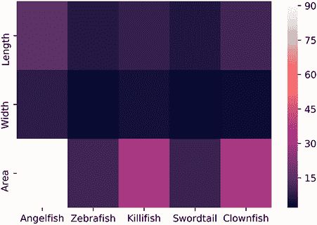
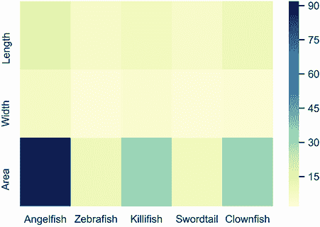
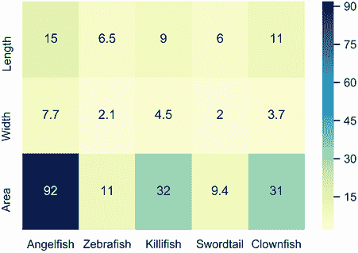
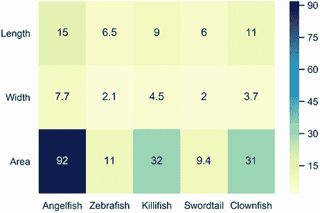

# 8 使用 Pandas 分析表格

本节涵盖

+   使用 Pandas 库存储 2D 表格

+   总结 2D 表格内容

+   操作行和列内容

+   使用 Seaborn 库可视化表格

案例研究 2 的点击数据存储在一个二维表格中。数据表通常用于存储信息。表格可以存储在不同的格式中：一些表格以 Excel 电子表格的形式保存，而其他则是基于文本的 CSV 文件，其中列由逗号分隔。表格的格式并不重要。重要的是其结构。所有表格都具有共同的结构特征：每个表格都包含水平行和垂直列，而且通常列标题也包含明确的列名。

## 8.1 使用基本 Python 存储表格

让我们在 Python 中定义一个示例表格。该表格存储了各种鱼类的测量值，单位为厘米。我们的测量表包含三列：`Fish`、`Length` 和 `Width`。`Fish` 列存储标记的鱼类种类，而 `Length` 和 `Width` 列指定每种鱼类的长度和宽度。我们用字典表示这个表格。列名作为字典键，这些键映射到列值的列表。

列表 8.1 使用 Python 数据结构存储表格

```
fish_measures = {'Fish': ['Angelfish', 'Zebrafish', 'Killifish', 'Swordtail'],
                 'Length':[15.2, 6.5, 9, 6],
                 'Width': [7.7, 2.1, 4.5, 2]}
```

假设我们想知道斑马鱼的长。为了获得长度，我们必须首先访问 `fish_measures['Fish']` 中 `'Zebrafish'` 元素的索引。然后我们需要检查 `fish_measures['Length']` 中的该索引。这个过程稍微有些复杂，如下面的代码所示。

列表 8.2 使用字典访问表格列

```
zebrafish_index = fish_measures['Fish'].index('Zebrafish')
zebrafish_length = fish_measures['Length'][zebrafish_index]
print(f"The length of a zebrafish is {zebrafish_length:.2f} cm")

The length of a zebrafish is 6.50 cm
```

我们的字典表示法是功能性的，但也难以使用。Pandas 库提供了一个更好的解决方案，该库专为表格操作而设计。

## 8.2 使用 Pandas 探索表格

让我们安装 Pandas 库。一旦 Pandas 安装完成，我们将按照常见的 Pandas 使用惯例将其导入为 `pd`。

注意：请在命令行终端中调用 `pip install pandas` 来安装 Pandas 库。

列表 8.3 导入 Pandas 库

```
import pandas as pd
```

我们现在通过调用 `pd.DataFrame(fish_measures)` 将我们的 `fish_measures` 表格加载到 Pandas 中。这个方法调用返回一个 Pandas `DataFrame` 对象。术语 *data frame* 在统计软件术语中是 *table* 的一个常用同义词。基本上，`DataFrame` 对象会将我们的字典转换成二维表格。根据惯例，Pandas `DataFrame` 对象被分配给变量 `df`。在这里，我们执行 `df = pd.DataFrame(fish_measures)` 然后打印 `df` 的内容。

列表 8.4 将表格加载到 Pandas 中

```
df = pd.DataFrame(fish_measures)
print(df)

        Fish  Length  Width
0  Angelfish    15.2    7.7
1  Zebrafish     6.5    2.1
2  Killifish     9.0    4.5
3  Swordtail     6.0    2.0
```

表格行和列之间的对齐在打印输出中清晰可见。我们的表格很小，因此很容易显示。然而，对于更大的表格，我们可能更喜欢只打印前几行。调用 `print(df.head(x))` 只打印表格中的前 `x` 行。让我们通过调用 `print(df.head(2))` 来打印前两行。

列表 8.5 访问表格的前两行

```
print(df.head(2))
        Fish  Length  Width
0  Angelfish    15.2    7.7
1  Zebrafish     6.5    2.1
```

总结更大的 Pandas 表格的一个更好的方法是执行 `pd.describe()`。默认情况下，此方法为表格中所有数值列生成统计数据。统计输出包括最小和最大列值以及平均值和标准差。当我们打印 `pd.describe()` 时，我们应该期望看到关于数值 `长度` 和 `宽度` 列的信息，但不会看到基于字符串的 `鱼` 列的信息。

列表 8.6 总结数值列

```
print(df.describe())

          Length     Width
count   4.000000  4.000000
mean    9.175000  4.075000
std     4.225616  2.678775
min     6.000000  2.000000
25%     6.375000  2.075000
50%     7.750000  3.300000
75%    10.550000  5.300000
max    15.200000  7.700000
```

Pandas describe 方法的输出

+   `count`—每列中的元素数量。

+   `mean`—每列元素的均值。

+   `std`—每列元素的方差。

+   `min`—每列中的最小值。

+   `25%`—25% 的列元素低于此值。

+   `50%`—50% 的列元素低于此值。该值与中位数相同。

+   `75%`—75% 的列元素低于此值。

+   `max`—每列中的最大值。

根据总结，`长度` 的平均值为 9.175 厘米，`宽度` 的平均值为 4.075 厘米。输出还包括其他统计信息。有时其他信息可能不是非常有用——如果我们只关心平均值，我们可以通过调用 `df.mean()` 来省略其他输出。

列表 8.7 计算列平均值

```
print(df.mean())

Length    9.175
Width     4.075
dtype: float64
```

`df.describe()` 方法旨在对数值列运行。然而，我们可以通过调用 `df.describe(include=[np.object])` 来强制它处理字符串。将 `include` 参数设置为 `[np.object]` 指示 Pandas 在基于 NumPy 字符串数组的表格列上搜索。由于我们无法对字符串进行统计分析，因此生成的输出不包含统计信息。相反，描述统计了唯一字符串的总数以及最常见字符串出现的频率。最频繁出现的字符串也被包括在内。我们的 `鱼` 列包含四个唯一字符串，每个字符串只被提及一次。因此，我们预计最频繁出现的字符串将以随机方式被选中，频率为 1。

列表 8.8 总结字符串列

```
print(df.describe(include=[np.object]))
count           4    ❶
unique          4    ❷
top     Zebrafish    ❸
freq            1    ❹
```

❶ 每列中的字符串数量

❷ 每列中唯一字符串的数量

❸ 每列中最频繁出现的字符串

❹ 最常见字符串出现的频率

Pandas 总结方法

+   `df.head()`—返回数据框 `df` 的前五行。

+   `df.head(x)`—返回数据框 `df` 的前 `x` 行。

+   `df.describe()`—返回与 `df` 中数值列相关的统计信息。

+   `df.describe(include=[np.object])`—返回与 `df` 中字符串列相关的统计信息。

+   `df.mean()`—返回 `df` 中所有数值列的平均值

如前所述，`Fish` 列建立在 NumPy 字符串数组之上。实际上，整个数据框都是建立在二维 NumPy 数组之上的。Pandas 将所有数据存储在 NumPy 中以进行快速操作。我们可以通过访问 `df.values` 来检索底层 NumPy 数组。

列表 8.9 将表格作为 2D NumPy 数组检索

```
print(df.values)
assert type(df.values) == np.ndarray
[['Angelfish' 15.2 7.7]
 ['Zebrafish' 6.5 2.1]
 ['Killifish' 9.0 4.5]
 ['Swordtail' 6.0 2.0]]
```

## 8.3 检索表格列

让我们把注意力转向检索单个列，这些列可以通过它们的列名来访问。我们可以通过调用 `print(df .columns)` 来输出所有列名。

列表 8.10 通过括号访问所有列名

```
print(df.columns)

Index(['Fish', 'Length', 'Width'], dtype='object')
```

现在，让我们通过访问 `df.Fish` 来打印存储在 `Fish` 列中的所有数据。

列表 8.11 通过括号访问单个列

```
print(df.Fish)

0    Angelfish
1    Zebrafish
2    Killifish
3    Swordtail
Name: Fish, dtype: object
```

注意，打印的输出不是一个 NumPy 数组。相反，`df.Fish` 是一个 Pandas 对象，它表示一个一维数组。要打印一个 NumPy 数组，我们必须运行 `print (df.Fish.values)`。

列表 8.12 将列作为 NumPy 数组检索

```
print(df.Fish.values)
assert type(df.Fish.values) == np.ndarray

['Angelfish' 'Zebrafish' 'Killifish' 'Swordtail']
```

我们已经使用 `df.Fish` 访问了 `Fish` 列。我们还可以通过打印 `df['Fish']` 使用字典风格的括号表示法来访问 `Fish`。

列表 8.13 使用括号访问列

```
print(df['Fish'])

0    Angelfish
1    Zebrafish
2    Killifish
3    Swordtail
Name: Fish, dtype: object
```

括号表示法允许我们通过运行 `df[name_list]` 来检索多个列，其中 `name_list` 是列名列表。假设我们想检索 `Fish` 列和 `Length` 列。运行 `df[['Fish', 'Length']]` 返回一个只包含这两个列的截断表格。

列表 8.14 使用括号访问多个列

```
print(df[['Fish', 'Length']])

        Fish  Length
0  Angelfish    15.2
1  Zebrafish     6.5
2  Killifish     9.0
3  Swordtail     6.0
```

我们可以用多种方式分析存储在 `df` 中的数据。例如，我们可以根据单个列的值对行进行排序。调用 `df.sort_values('Length')` 返回一个根据长度排序的新表格。

列表 8.15 通过列值排序行

```
print(df.sort_values('Length'))

        Fish  Length  Width
3  Swordtail     6.0    2.0
1  Zebrafish     6.5    2.1
2  Killifish     9.0    4.5
0  Angelfish    15.2    7.7
```

此外，我们可以使用列中的值来过滤掉不需要的行。例如，调用 `df[df.Width >= 3]` 返回一个行宽至少为 3 厘米的表格。

列表 8.16 通过列值过滤行

```
print(df[df.Width >= 3])

        Fish  Length  Width
0  Angelfish    15.2    7.7
2  Killifish     9.0    4.5
```

Pandas 列检索方法

+   `df.columns`—返回数据框 `df` 中的列名

+   `df.x`—返回列 `x`

+   `df[x]`—返回列 `x`

+   `df[[x,y]]`—返回列 `x` 和 `y`

+   `df.x.values`—返回列 `x` 作为 NumPy 数组

+   `df.sort_values(x)`—返回按列 `x` 的值排序的数据框

+   `df[df.x > y]`—返回一个通过列 `x` 中大于 `y` 的值过滤的数据框

## 8.4 检索表格行

现在，让我们将注意力转向在 `df` 中检索行。与列不同，我们的行没有预分配的标签值。为了补偿，Pandas 为每一行分配一个特殊的索引。这些索引出现在打印的表的左侧。根据打印的输出，`Angelfish` 行的索引是 0，而 `Swordtail` 行的索引是 3。我们可以通过调用 `df.loc[[0, 3]]` 来访问这些行。作为一个一般规则，执行 `df.loc[[index_list]]` 定位所有其索引出现在 `index_list` 中的行。现在让我们定位与 `Swordtail` 和 `Angelfish` 索引一致的行。

列表 8.17 通过索引访问行

```
print(df.loc[[0, 3]])

        Fish  Length  Width
0  Angelfish    15.2    7.7
3  Swordtail     6.0    2.0
```

假设我们希望使用物种名称而不是数字索引来检索行。更确切地说，我们想要检索那些 `Fish` 列包含 `'Angelfish'` 或 `'Swordtail'` 的行。在 Pandas 中，这个检索过程有点棘手：我们需要执行 `df[booleans]`，其中 `booleans` 是一个布尔值列表，如果它们匹配感兴趣的行，则为 `True`。基本上，`True` 值的索引必须对应于匹配 `'Angelfish'` 或 `'Whitefish'` 的行。我们如何获得 `booleans` 列表？一个简单的方法是遍历 `df.Fish`，如果列值出现在 `['Angelfish', 'Swordtail']` 中，则返回 `True`。让我们接下来运行这个简单的方法。

列表 8.18 通过列值访问行

```
booleans = [name in ['Angelfish', 'Swordtail']
            for name in df.Fish]
print(df[booleans])

        Fish  Length  Width
0  Angelfish    15.2    7.7
3  Swordtail     6.0    2.0
```

我们可以使用 `isin` 方法更简洁地定位感兴趣的行。调用 `df.Fish.isin(['Angelfish', 'Swordtail'])` 返回我们之前计算的 `booleans` 列表的类似物。因此，我们可以通过一行代码检索所有行，即运行 `df[df.Fish.isin(['Angelfish', 'Swordtail'])]`。

列表 8.19 使用 `isin` 通过列值访问行

```
print(df[df.Fish.isin(['Angelfish', 'Swordtail'])])

        Fish  Length  Width
0  Angelfish    15.2    7.7
3  Swordtail     6.0    2.0
```

`df` 表存储了四种鱼类的两个测量值。我们可以轻松访问列中的测量值；不幸的是，由于行索引不等于物种名称，通过物种访问行更困难。让我们通过用物种替换行索引来解决这个问题。我们使用 `df.set_index` 方法将数字替换为物种名称。调用 `df.set_index('Fish', inplace=True)` 将我们的索引设置为等于 `Fish` 列中的物种。`inplace=True` 参数内部修改索引，而不是返回 `df` 的修改副本。

列表 8.20 交换行索引为列值

```
df.set_index('Fish', inplace=True)
print(df)

     Fish  Length  Width
Angelfish    15.2    7.7
Zebrafish     6.5    2.1
Killifish     9.0    4.5
Swordtail     6.0    2.0
```

最左侧的索引列不再是数字：数字已被替换为物种名称。现在我们可以通过运行 `df.loc[['Angelfish', 'Swordtail']]` 来访问 `Angelfish` 和 `Swordtail` 列。

列表 8.21 通过字符串索引访问行

```
print(df.loc[['Angelfish', 'Swordtail']])

     Fish  Length  Width
Angelfish    15.2    7.7
Swordtail     6.0    2.0
```

Pandas 行检索方法

+   `df.loc[[x, y]]` — 返回位于索引 `x` 和 `y` 的行

+   `df[booleans]` — 返回 `booleans[i]` 对于列 `i` 是 `True` 的行

+   `df[name in array for name in df.x]` — 返回列名为 `x` 的列中存在于 `array` 中的行

+   `df[df.x.isin(array)])` — 返回列名为 `x` 的列中存在于 `array` 中的行

+   `df.set_index('x', inplace=True)`——将 `x` 列的数值行索引与列值交换

## 8.5 修改表格行和列

目前，每个表格行包含指定鱼的长度和宽度。如果我们交换我们的行和列会发生什么？我们可以通过运行 `df.T` 来找出答案。`T` 代表 *转置*：在转置操作中，表格的元素围绕其对角线翻转，使得行和列被交换。让我们转置我们的表格并打印结果。

列表 8.22 交换行和列

```
df_transposed = df.T
print(df_transposed)

Fish    Angelfish  Zebrafish  Killifish  Swordtail
Length       15.2        6.5        9.0        6.0
Width         7.7        2.1        4.5        2.0
```

我们已经修改了表格：每一列现在代表一种鱼，每一行代表一种特定的测量类型。第一行是长度，第二行是宽度。因此，调用 `print(df_transposed.Swordtail)` 将会打印出剑尾鱼的长度和宽度。

列表 8.23 打印转置列

```
print(df_transposed.Swordtail)

Length    6.0
Width     2.0
Name: Swordtail, dtype: float64
```

让我们通过向 `df_transposed` 添加小丑鱼测量值来修改我们的表格。小丑鱼的长度和宽度分别是 10.6 厘米和 3.7 厘米。我们通过运行 `df_transposed['Clownfish'] = [10.6, 3.7]` 来添加这些测量值。

列表 8.24 添加新列

```
df_transposed['Clownfish'] = [10.6, 3.7]
print(df_transposed)

Fish    Angelfish  Zebrafish  Killifish  Swordtail  Clownfish
Length       15.2        6.5        9.0        6.0       10.6
Width         7.7        2.1        4.5        2.0        3.7
```

或者，我们可以使用 `df_transposed.assign` 方法来分配新的列。该方法允许我们通过传递多个列名来添加多个列。例如，调用 `df_transposed.assign(Clownfish2=[10.6, 3.7], Clownfish3=[10.6, 3.7])` 会返回一个包含两个新列；*Clownfish2* 和 *Clownfish3* 的表格。请注意，`assign` 方法永远不会直接将新列添加到表格中——相反，它返回一个包含新数据的表格副本。

列表 8.25 添加多个新列

```
df_new = df_transposed.assign(Clownfish2=[10.6, 3.7], Clownfish3=[10.6, 3.7])
assert 'Clownfish2' not in df_transposed.columns
assert 'Clownfish2' in df_new.columns
print(df_new)

Fish    Angelfish  Zebrafish  Killifish  Swordtail  Clownfish  Clownfish2  \
Length       15.2        6.5        9.0        6.0       10.6        10.6
Width         7.7        2.1        4.5        2.0        3.7         3.7

Fish    Clownfish3
Length        10.6
Width          3.7
```

我们新添加的列是多余的。我们可以通过调用 `df_new.drop(columns=['Clownfish2', 'Clownfish3'], inplace=True)` 来删除这些列。`df_new.drop` 方法从一个表格中删除所有指定的列。

列表 8.26 删除多个列

```
df_new.drop(columns=['Clownfish2', 'Clownfish3'], inplace=True)
print(df_new)

Fish    Angelfish  Zebrafish  Killifish  Swordtail  Clownfish
Length       15.2        6.5        9.0        6.0       10.6
Width         7.7        2.1        4.5        2.0        3.7
```

我们现在利用存储的测量值来计算每条鱼的表面积。我们可以将每条鱼视为一个面积为 `math.pi * length * width / 4` 的椭圆。为了找到每个面积，我们必须遍历每一列的值。在数据帧中遍历列就像在字典中遍历元素一样：我们只需执行 `df_new.items()`。这样做会返回一个包含列名和列值的元组的可迭代对象。让我们遍历 `df_new` 中的列以获取每条鱼的面积。

列表 8.27 遍历列值

```
areas = []
for fish_species, (length, width) in df_new.items():
    area = math.pi * length * width / 4
    print(f"Area of {fish_species} is {area}")
    areas.append(area)

Area of Angelfish is 91.92300104403735
Area of Zebrafish is 10.720684930375171
Area of Killifish is 31.808625617596654
Area of Swordtail is 9.42477796076938
Area of Clownfish is 30.80331596844792
```

让我们把计算出的面积添加到我们的表格中。我们可以通过执行 `df_new.loc['Area'] = areas` 来增加一个新的 `Area` 行。然后我们需要运行 `df_new.reindex()` 来更新带有新增 `Area` 名称的行索引。

列表 8.28 添加新行

```
df_new.loc['Area'] = areas
df_new.reindex()
print(df_new)

Fish    Angelfish  Zebrafish  Killifish  Swordtail  Clownfish
Length  15.200000   6.500000   9.000000   6.000000  10.600000
Width    7.700000   2.100000   4.500000   2.000000   3.700000
Area    91.923001  10.720685  31.808626   9.424778  30.803316
```

我们更新的表格包含三行和五列。我们可以通过访问 `df_new.shape` 来确认。

列表 8.29 检查表格形状

```
row_count, column_count = df_new.shape
print(f"Our table contains {row_count} rows and {column_count} columns")

Our table contains 3 rows and 5 columns
```

修改 Pandas 中的数据帧

+   `df.T`——返回一个转置的数据帧，其中行和列被交换。

+   `df[x] = array`—创建一个新列 `x`。`df.x` 映射到 `array` 中的值。

+   `df.assign(x=array)`—返回一个包含 `df` 的所有元素和一个新列 `x` 的 DataFrame。`df.x` 映射到 `array` 中的值。

+   `df.assign(x=array, y=array2)`—返回一个包含两个新列 `x` 和 `y` 的 DataFrame。

+   `df.drop(columns=[x, y])`—返回一个删除了列 `x` 和 `y` 的 DataFrame。

+   `df.drop(columns=[x, y], inplace=True)`—就地删除列 `x` 和 `y`，从而修改 `df`。

+   `df.loc[x] = array`—在索引 `x` 处添加一行。我们需要运行 `df.reindex()` 才能访问该行。

## 8.6 保存和加载表格数据

我们已经完成了对表格的修改。让我们将表格存储起来以供以后使用。调用 `df_new.to_csv('Fish_measurements.csv')` 将表格保存到以逗号分隔列的 CSV 文件中。

列表 8.30 将表格保存到 CSV 文件

```
df_new.to_csv('Fish_measurements.csv')
with open('Fish_measurements.csv') as f:
    print(f.read())

,Angelfish,Zebrafish,Killifish,Swordtail,Clownfish
Length,15.2,6.5,9.0,6.0,10.6
Width,7.7,2.1,4.5,2.0,3.7
Area,91.92300104403735,10.720684930375171,31.808625617596654,9.42477796076938,30.80331596844792
```

可以使用 `pd.read_csv` 方法将 CSV 文件加载到 Pandas 中。调用 `pd.read_csv('Fish_measurements.csv', index_col=0)` 返回一个包含所有表格信息的 DataFrame。可选的 `index_col` 参数指定哪个列包含行索引名称。如果没有指定列，则自动分配数字行索引。

列表 8.31 从 CSV 文件加载表格

```
df = pd.read_csv('Fish_measurements.csv', index_col=0)
print(df)
print("\nRow index names when column is assigned:")
print(df.index.values)

df_no_assign = pd.read_csv('Fish_measurements.csv')
print("\nRow index names when no column is assigned:")
print(df_no_assign.index.values)

        Angelfish  Zebrafish  Killifish  Swordtail  Clownfish
Length  15.200000   6.500000   9.000000   6.000000  10.600000
Width    7.700000   2.100000   4.500000   2.000000   3.700000
Area    91.923001  10.720685  31.808626   9.424778  30.803316

Row index names when column is assigned:
['Length' 'Width' 'Area']

Row index names when no column is assigned:
[0 1 2]
```

使用 `pd.csv`，我们可以将案例研究点击表格加载到 Pandas 中。然后我们将能够高效地分析该表格。

在 Pandas 中保存和加载数据框

+   `pd.DataFrame(dictionary)`—将 `dictionary` 中的数据转换为 DataFrame。

+   `pd.read_csv(filename)`—将 CSV 文件转换为 DataFrame。

+   `pd.read_csv(filename, index_col=i)`—将 CSV 文件转换为 DataFrame。第 *i* 列提供行索引名称。

+   `df.to_csv(filename)`—将 `df` 的内容保存到 CSV 文件。

## 8.7 使用 Seaborn 可视化表格

我们可以使用简单的 `print` 命令查看 Pandas 表格的内容。然而，一些数值表格太大，无法作为打印输出查看。这类表格更适合使用热图来显示。热图是一种表格的图形表示，其中数值单元格根据值着色；颜色阴影根据值的大小连续变化。最终结果是表格中值差异的鸟瞰图。

创建热图最简单的方法是使用外部 Seaborn 库。Seaborn 是一个基于 Matplotlib 构建的可视化库，并与 Pandas 数据框紧密集成。让我们安装这个库，然后导入 Seaborn 为 `sns`。

注意：从命令行终端调用 `pip install seaborn` 以安装 Seaborn 库。

列表 8.32 导入 Seaborn 库

```
import seaborn as sns
```

现在，通过调用 `sns.heatmap(df)`（图 8.1）将我们的数据框可视化为热图。



图 8.1 鱼类测量的热图。其颜色图例指定了测量值与颜色的映射。较暗的颜色对应较低的测量值。较浅的颜色对应较高的测量值。

列表 8.33 使用 Seaborn 可视化热图

```
sns.heatmap(df)
plt.show()
```

我们绘制了一个鱼类测量的热图。显示的颜色与测量值相对应。颜色阴影与值之间的映射显示在图的右侧图例中。较浅的颜色映射到较高的测量值。因此，我们可以立即判断图中的天使鱼区域是最大的测量值。

我们可以通过传递 `cmap` 参数来改变热图图中的颜色调色板。以下代码执行 `sns.heatmap(df, cmap='YlGnBu')` 以创建一个颜色阴影从黄色过渡到绿色再到蓝色的热图（图 8.2）。



图 8.2 鱼类测量的热图。较深的颜色对应较高的测量值。较浅的颜色对应较低的测量值。

列表 8.34 调整热图颜色

```
sns.heatmap(df, cmap='YlGnBu')
plt.show()
```

在更新后的热图中，颜色色调已反转：现在较深的颜色对应较高的测量值。我们可以通过在图中标注实际的测量值来确认这一点。我们通过将 `anot=True` 传递给 `sns.heatmap` 方法来标注热图（图 8.3）。



图 8.3 鱼类测量的热图。实际的测量值包含在图中。

列表 8.35 注释热图

```
sns.heatmap(df, cmap='YlGnBu', annot=True)
plt.show()
```

如前所述，Seaborn 库建立在 Matplotlib 之上。因此，我们可以使用 Matplotlib 命令来修改热图中的元素。例如，调用 `plt.yticks(rotation=0)` 旋转 y 轴测量标签，这使得它们更容易阅读（图 8.4）。



图 8.4 鱼类测量的热图。y 轴测量标签已水平旋转以便更容易查看。

列表 8.36 使用 Matplotlib 旋转热图标签

```
sns.heatmap(df, cmap='YlGnBu', annot=True)
plt.yticks(rotation=0)
plt.show()
```

最后，我们应该注意，`sns.heatmap` 方法也可以处理 2D 列表和数组。因此，运行 `sns.heatmap(df.values)` 也会创建一个热图，但 y 轴和 x 轴标签将缺失。要指定标签，我们需要将 `xticklabels` 和 `yticklabels` 参数传递给方法。以下代码使用我们表格的数组表示来复制图 8.4 的内容。

列表 8.37 从 NumPy 数组可视化热图

```
sns.heatmap(df.values,                  ❶
            cmap='YlGnBu', annot=True,
            xticklabels=df.columns,     ❷
            yticklabels=df.index)       ❸
plt.yticks(rotation=0)
plt.show()   
```

❶ 作为提醒，df.values 返回数据框下层的 2D NumPy 数组。

❷ x 轴鱼类标签被手动设置为等于列名。

❸ y 轴测量标签被手动设置为等于行索引。

Seaborn 热图可视化命令

+   `sns.heatmap(array)`—从 2D `array` 的内容生成热图。

+   `sns.heatmap(array, xticklabels=x, yticklabels=y)`—从 2D `array` 的内容生成热图。x 标签和 y 标签分别设置为 `x` 和 `y`。

+   `sns.heatmap(df)`—从数据框 `df` 的内容生成热图。x 标签和 y 标签分别自动设置为 `df.columns` 和 `df.index`。

+   `sns.heatmap(df, cmap=m)`—生成一个颜色方案由`m`指定的热图。

+   `sns.heatmap(df, annot=True)`—生成一个包含注释值的图表的热图。

## 摘要

+   使用 Pandas 可以轻松处理二维表格结构。我们可以使用字典或外部文件将数据加载到 Pandas 中。

+   Pandas 将每个表格存储在基于 NumPy 数组的 DataFrame 中。

+   数据框中的列都有一个名称；我们可以使用这些名称来访问列。同时，数据框中的行默认分配了数字索引；我们可以使用这些索引来访问行。也可以将数字行索引与字符串名称进行交换。

+   我们可以使用`describe`方法总结数据框的内容。该方法返回有价值的统计数据，如平均值和标准差。

+   我们可以使用彩色热图来可视化数据框的内容。
