# 10 将数据聚类成组

本节涵盖

+   按中心性聚类数据

+   按密度聚类数据

+   聚类算法之间的权衡

+   使用 scikit-learn 库执行聚类

+   使用 Pandas 迭代簇

*聚类*是将数据点组织成概念上有意义的组的过程。什么使得一个给定的组“概念上有意义”？对这个问题的答案并不简单。任何聚类输出的有用性取决于我们被分配的任务。

假设我们被要求聚类一组宠物照片。我们是将鱼和蜥蜴聚类到一个组中，将蓬松的宠物（如仓鼠、猫和狗）聚类到另一个组中？还是仓鼠、猫和狗应该被分配到它们自己的三个单独的簇中？如果是这样，也许我们应该考虑按品种聚类宠物。这样，吉娃娃和伟大的丹斯就会落入不同的簇中。区分狗品种将不会容易。然而，我们可以很容易地根据品种大小区分吉娃娃和伟大的丹斯。也许我们应该妥协：我们将同时根据蓬松度和大小进行聚类，从而绕过凯恩犬和外观相似的诺里奇犬之间的区别。

这个妥协是否值得？这取决于我们的数据科学任务。假设我们为一家宠物食品公司工作，我们的目标是估计狗粮、猫粮和蜥蜴粮的需求。在这种情况下，我们必须区分蓬松的狗、蓬松的猫和鳞片的蜥蜴。然而，我们不需要解决不同狗品种之间的差异。或者，想象一下兽医办公室的一名分析师，他试图根据品种对宠物病人进行分组。这个第二个任务需要更细粒度的组分辨率。

不同的情境需要不同的聚类技术。作为数据科学家，我们必须选择正确的聚类解决方案。在我们的职业生涯中，我们将使用各种聚类技术聚类数千（如果不是数万）个数据集。最常用的算法依赖于某种中心性的概念来区分簇。

## 10.1 使用中心性发现簇

在第五部分中，我们学习了如何使用平均值表示数据的中心性。后来，在第七部分中，我们计算了一个鱼群的平均长度。最终，我们通过分析两组鱼的平均值差异来比较两组鱼。我们利用这个差异来确定所有鱼是否属于同一组。直观上，一个组中的所有数据点都应该围绕一个中心值聚类。同时，两个不同组中的测量值应该围绕两个不同的平均值聚类。因此，我们可以利用中心性来区分两个不同的组。让我们具体探讨这个概念。

假设我们参观了一个热闹的当地酒吧，并看到两个飞镖盘并排挂着。每个飞镖盘上都插满了飞镖，墙壁上也凸出了飞镖。酒吧里醉醺醺的玩家瞄准一个或另一个飞镖盘的靶心。他们经常失手，这导致了围绕两个靶心的飞镖散布的观察结果。

让我们通过数值模拟散布。我们将每个靶心位置视为一个二维坐标。飞镖随机投向该坐标。因此，飞镖的二维位置是随机分布的。建模飞镖位置的最合适的分布是正态分布，原因如下：

+   一个典型的飞镖投掷者瞄准的是靶心，而不是靶边缘。因此，每个飞镖更有可能击中靶板的中心附近。这种行为与随机正态样本一致，其中接近均值的值比其他更远的值出现得更频繁。

+   我们期望飞镖相对于中心对称地击中靶板。飞镖将以相等的频率击中中心左侧 3 英寸和中心右侧 3 英寸。这种对称性由钟形正态曲线捕捉。

假设第一个靶心位于坐标 `[0, 0]`。在这个坐标上投掷飞镖。我们将使用两个正态分布来模拟飞镖的 x 和 y 位置。这些分布共享均值为 0，我们还假设它们共享方差为 2。以下代码生成了飞镖的随机坐标。

列表 10.1 使用两个正态分布建模飞镖坐标

```
import numpy as np
np.random.seed(0)
mean = 0
variance = 2
x = np.random.normal(mean, variance ** 0.5)
y = np.random.normal(mean, variance ** 0.5)
print(f"The x coordinate of a randomly thrown dart is {x:.2f}")
print(f"The y coordinate of a randomly thrown dart is {y:.2f}")

The x coordinate of a randomly thrown dart is 2.49
The y coordinate of a randomly thrown dart is 0.57
```

注意：我们可以使用 `np.random.multivariate_normal` 方法更有效地模拟飞镖的位置。此方法从 *多元正态分布* 中选择一个随机点。多元正态曲线只是扩展到多个维度的正态曲线。我们的二维多元正态分布将类似于一个山顶位于 `[0, 0]` 的圆形山丘。

让我们模拟在 `[0, 0]` 位置放置的靶心投掷的 5,000 个随机飞镖。我们还模拟在 `[0, 6]` 位置放置的第二个靶心投掷的 5,000 个随机飞镖。然后我们生成所有随机飞镖坐标的散点图（图 10.1）。

列表 10.2 模拟随机投掷的飞镖

```
import matplotlib.pyplot as plt
np.random.seed(1)
bulls_eye1 = [0, 0]
bulls_eye2 = [6, 0]
bulls_eyes = [bulls_eye1, bulls_eye2]
x_coordinates, y_coordinates = [], []
for bulls_eye in bulls_eyes:
    for _ in range(5000):
        x = np.random.normal(bulls_eye[0], variance ** 0.5)
        y = np.random.normal(bulls_eye[1], variance ** 0.5)
        x_coordinates.append(x)
        y_coordinates.append(y)

plt.scatter(x_coordinates, y_coordinates)
plt.show()
```

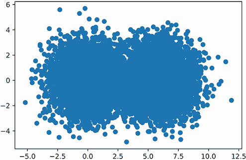

图 10.1 随机散布在两个靶心目标周围的飞镖模拟

注意：列表 10.2 包含一个以 `for _ in range(5000)` 开头的嵌套五行 `for` 循环。可以使用 NumPy 在仅一行代码中执行此循环：运行 `x_coordinates, y_coordinates = np.random.multivariate_normal(bulls_eye, np.diag(2 * [variance]), 5000).T` 返回从多元正态分布中采样的 5,000 个 x 和 y 坐标。

图中出现了两个重叠的飞镖组。这两个组代表 10,000 个飞镖。其中一半的飞镖瞄准了左侧的靶心，其余的则瞄准了右侧。每个飞镖都有一个目标，我们可以通过观察图表来估计它。靠近 `[0, 0]` 的飞镖可能瞄准了左侧的靶心。我们将把这个假设纳入我们的飞镖图表中。

让我们将每个飞镖分配给其最近的靶心。我们首先定义一个 `nearest_bulls_eye` 函数，该函数接受一个包含飞镖 x 和 y 位置的 `dart` 列表作为输入。该函数返回最接近 `dart` 的靶心的索引。我们使用 *欧几里得距离* 来衡量飞镖的接近程度，这是两点之间的标准直线距离。

注意，欧几里得距离源于勾股定理。假设我们检查一个位于 `[x_dart, y_dart]` 位置的飞镖相对于位于 `[x_bull, y_bull]` 位置的靶心。根据勾股定理，`distance² = (x_dart - x_bull)² + (y_dart - y_bull)²`。我们可以使用自定义的欧几里得函数来求解距离。或者，我们可以使用 SciPy 提供的 `scipy.spatial.distance.euclidean` 函数。

以下代码定义了 `nearest_bulls_eye` 并将其应用于 `[0, 1]` 和 `[6, 1]` 的飞镖。

列表 10.3 将飞镖分配给最近的靶心

```
from scipy.spatial.distance import euclidean
def nearest_bulls_eye(dart):
    distances = [euclidean(dart, bulls_e) for bulls_e in bulls_eyes]   ❶
    return np.argmin(distances)                                        ❷

darts = [[0,1], [6, 1]]
for dart in darts:
    index = nearest_bulls_eye(dart)
    print(f"The dart at position {dart} is closest to bulls-eye {index}")

The dart at position [0, 1] is closest to bulls-eye 0
The dart at position [6, 1] is closest to bulls-eye 1
```

❶ 使用从 SciPy 导入的 euclidean 函数获取飞镖与每个靶心之间的欧几里得距离

❷ 返回与数组中最短靶心距离匹配的索引

现在我们将 `nearest_bulls_eye` 应用于所有计算出的飞镖坐标。每个飞镖点使用两种颜色之一来区分两个靶心分配（图 10.2）。

列表 10.4 根据最近的靶心着色飞镖

```
def color_by_cluster(darts):                                            ❶
    nearest_bulls_eyes = [nearest_bulls_eye(dart) for dart in darts]
    for bs_index in range(len(bulls_eyes)):
        selected_darts = [darts[i] for i in range(len(darts))
                          if bs_index == nearest_bulls_eyes[i]]         ❷
        x_coordinates, y_coordinates = np.array(selected_darts).T       ❸
        plt.scatter(x_coordinates, y_coordinates,
                    color=['g', 'k'][bs_index])
    plt.show()

darts = [[x_coordinates[i], y_coordinates[i]]
         for i in range(len(x_coordinates))]                             ❹
color_by_cluster(darts)
```

❶ 辅助函数，用于绘制输入飞镖列表的彩色元素。列表中的每个飞镖都是 nearest_bulls_eye 的输入。

❷ 选择最接近 bulls_eyes[bs_index]的飞镖

❸ 通过转置所选飞镖的数组来分离每个飞镖的 x 和 y 坐标。如第八部分所述，转置交换了 2D 数据结构中的行和列位置。

❹ 将每个飞镖的单独坐标合并成一个包含 x 和 y 坐标的单个列表。

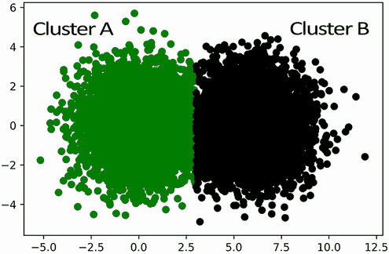

图 10.2 根据飞镖与最近靶心的距离着色。簇 A 代表所有最接近左侧靶心的点，簇 B 代表所有最接近右侧靶心的点。

彩色飞镖合理地分为两个均匀的簇。如果没有提供中心坐标，我们如何识别这样的簇呢？好吧，一种原始的策略是简单地猜测靶心的位置。我们可以选择两个随机的飞镖，并希望这些飞镖以某种方式相对接近每个靶心，尽管这种情况发生的可能性极低。在大多数情况下，基于两个随机选择的中心着色飞镖不会产生好的结果（图 10.3）。

列表 10.5 基于随机选择的中心分配飞镖

```
bulls_eyes = np.array(darts[:2])     ❶
color_by_cluster(darts)
```

❶ 随机选择前两个飞镖作为我们的代表靶心

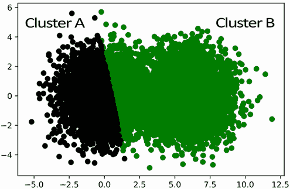

图 10.3 根据随机选择的中心接近度着色的飞镖。聚类 B 向左延伸得太远。

我们随意选择的中心在定性上感觉不正确。例如，右边的聚类 B 似乎向左延伸得太远。我们分配的任意中心似乎与其实际的靶心点不匹配。但有一种方法可以纠正我们的错误：我们可以计算拉伸的右聚类组中所有点的平均坐标，然后利用这些坐标来调整我们对组中心的估计。在将聚类组的平均坐标分配给靶心后，我们可以重新应用基于距离的分组技术来调整最右侧聚类的边界。实际上，为了达到最大效果，我们还将最左侧聚类的中心重置为其平均值，然后再重新运行基于中心性的聚类（图 10.4）。

注意：当我们计算一维数组的平均值时，我们返回一个单一值。我们现在扩展这个定义以涵盖多个维度。当我们计算二维数组的平均值时，我们返回所有 x 坐标的平均值以及所有 y 坐标的平均值。最终输出是一个包含沿 x 轴和 y 轴平均值的二维数组。

列表 10.6 基于平均值分配飞镖到中心

```
def update_bulls_eyes(darts):
    updated_bulls_eyes = []
    nearest_bulls_eyes = [nearest_bulls_eye(dart) for dart in darts]
    for bs_index in range(len(bulls_eyes)):
        selected_darts = [darts[i] for i in range(len(darts))
                          if bs_index == nearest_bulls_eyes[i]]
        x_coordinates, y_coordinates = np.array(selected_darts).T
        mean_center = [np.mean(x_coordinates), np.mean(y_coordinates)]   ❶
        updated_bulls_eyes.append(mean_center)

    return updated_bulls_eyes

bulls_eyes = update_bulls_eyes(darts)
color_by_cluster(darts)
```

❶ 对分配给特定靶心的所有飞镖的 x 和 y 坐标取平均值。然后使用这些平均坐标来更新我们估计的靶心位置。我们可以通过执行 np.mean(selected_darts, axis=0) 来更高效地运行这个计算。

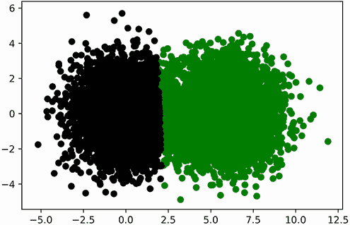

图 10.4 根据重新计算的中心的接近度着色的飞镖。现在两个聚类看起来更均匀。

结果看起来已经更好了，尽管它们还没有达到可能的效果。聚类的中心仍然有点偏。让我们通过重复基于平均值的中心性调整 10 次额外的迭代来纠正结果（图 10.5）。

列表 10.7 在 10 次迭代中调整靶心位置

```
for i in range(10):
    bulls_eyes = update_bulls_eyes(darts)

color_by_cluster(darts)
```


图 10.5 根据迭代重新计算的中心的接近度着色的飞镖

这两组飞镖现在完美地聚簇在一起了！我们本质上复制了 *K-均值* 聚类算法，该算法使用中心性来组织数据。

## 10.2 K-均值：一种将数据分组到 K 个中心组的聚类算法

K-均值算法假设输入的数据点围绕 *K* 个不同的中心旋转。每个中心坐标就像一个被散点数据包围的隐藏靶心。算法的目的是揭示这些隐藏的中心坐标。

我们首先选择 *K* 来初始化 K-means，*K* 是我们将要寻找的中心坐标的数量。在我们的飞镖盘分析中，*K* 被设置为 2，尽管通常 *K* 可以等于任何整数。算法随机选择 *K* 个数据点。这些数据点被视为真正的中心。然后，算法通过更新所选的中心位置（数据科学家称之为 *centroids*）进行迭代。在单次迭代中，每个数据点都被分配到其最近中心，从而形成 *K* 个组。接下来，每个组的中心被更新。新的中心等于该组坐标的平均值。如果我们重复这个过程足够长的时间，组平均值将收敛到 *K* 个代表性中心（图 10.6）。收敛是数学上保证的。然而，我们无法预先知道收敛所需的迭代次数。一个常见的技巧是在新计算的中心与先前的中心没有显著差异时停止迭代。

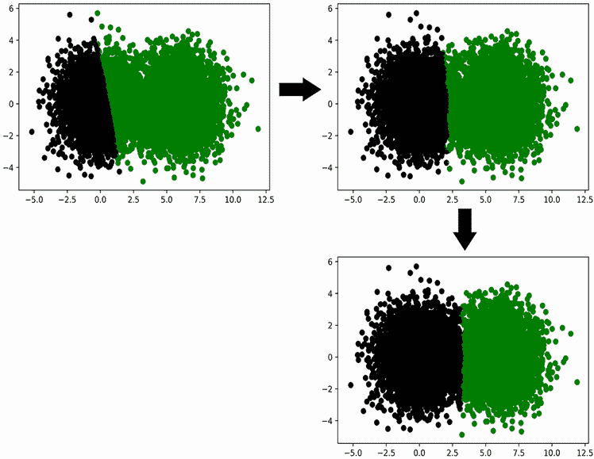

图 10.6 K-means 算法从两个随机选择的中心迭代收敛到实际的靶心中心

K-means 并非没有局限性。该算法基于我们对 *K* 的了解：要寻找的聚类数量。通常，这种知识是不可得的。此外，尽管 K-means 通常可以找到合理的中心，但它并不保证在数据中找到最佳可能的中心。有时，由于算法初始化步骤中随机中心的选择不佳，K-means 会返回不直观或次优的组。最后，K-means 假设数据中的聚类实际上围绕 *K* 个中心位置旋转。但正如我们在本节后面所学到的，这个假设并不总是成立。

### 10.2.1 使用 scikit-learn 进行 K-means 聚类

如果 K-means 算法被高效实现，它将在合理的时间内运行。通过外部 scikit-learn 库可以获得算法的快速实现。Scikit-learn 是一个基于 NumPy 和 SciPy 的非常流行的机器学习工具包，它包含各种核心分类、回归和聚类算法——当然包括 K-means。让我们安装这个库。然后我们导入 scikit-learn 的 `KMeans` 聚类类。

注意：从命令行终端调用 `pip install scikit-learn` 以安装 scikit-learn 库。

列表 10.8 从 scikit-learn 导入 `KMeans`

```
from sklearn.cluster import KMeans
```

将 `KMeans` 应用于我们的 `darts` 数据非常简单。首先，我们需要运行 `KMeans(n_clusters=2)`，这将创建一个 `cluster_model` 对象，该对象能够找到两个靶心中心。然后，我们可以通过运行 `cluster_model.fit_predict (darts)` 来执行 K-means。这个方法调用将返回一个 `assigned_bulls_eyes` 数组，该数组存储每个飞镖的靶心索引。

列表 10.9 使用 scikit-learn 进行 K-means 聚类

```
cluster_model = KMeans(n_clusters=2)                    ❶
assigned_bulls_eyes = cluster_model.fit_predict(darts)  ❷

print("Bull's-eye assignments:")
print(assigned_bulls_eyes)

Bull's-eye assignments:
[0 0 0 ... 1 1 1]
```

❶ 创建一个中心数为 2 的 cluster_model 对象

❷ 使用 K-means 算法优化两个中心并返回每个 dart 分配的簇

让我们根据它们的聚类分配给 dart 上色，以验证结果（图 10.7）。

列表 10.10 绘制 K-means 簇分配图

```
for bs_index in range(len(bulls_eyes)):
    selected_darts = [darts[i] for i in range(len(darts))
                      if bs_index == assigned_bulls_eyes[i]]
    x_coordinates, y_coordinates = np.array(selected_darts).T
    plt.scatter(x_coordinates, y_coordinates,
                color=['g', 'k'][bs_index])
plt.show()
```

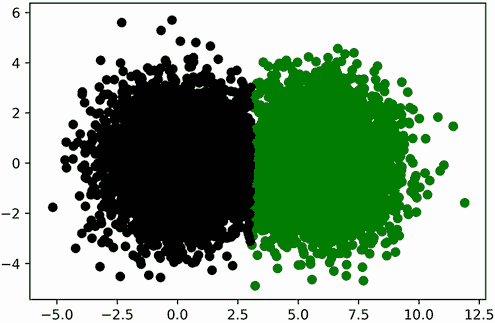

图 10.7 scikit-learn 返回的 K-means 聚类结果与我们的预期一致。

我们聚类模型已经定位了数据中的质心。现在我们可以重用这些质心来分析模型之前未见过的新的数据点。执行 `cluster_model.predict([x, y])` 将一个质心分配给由 `x` 和 `y` 定义的点。我们使用 `predict` 方法来聚类两个新的数据点。

列表 10.11 使用 `cluster_model` 聚类新数据

```
new_darts = [[500, 500], [-500, -500]]
new_bulls_eye_assignments = cluster_model.predict(new_darts)
for i, dart in enumerate(new_darts):
    bulls_eye_index = new_bulls_eye_assignments[i]
    print(f"Dart at {dart} is closest to bull's-eye {bulls_eye_index}")

Dart at [500, 500] is closest to bull's-eye 0
Dart at [-500, -500] is closest to bull's-eye 1
```

### 10.2.2 使用肘部方法选择最优的 K 值

K-means 依赖于输入的 *K*。当数据中真实的簇的数量事先未知时，这可能是一个严重的阻碍。然而，我们可以使用称为 *肘部方法* 的技术来估计 *K* 的适当值。

肘部方法依赖于一个称为 *惯性* 的计算值，它是每个点到其最近的 K-means 中心的平方距离之和。如果 *K* 为 1，则惯性等于所有点到数据集平均值的平方距离之和。正如第五部分所讨论的，这个值与方差成正比。方差反过来是分散度的度量。因此，如果 *K* 为 1，惯性是分散度的估计。即使 *K* 大于 1，这个属性也是正确的。基本上，惯性估计了围绕我们计算的 *K* 个均值周围的总体分散度。

通过估计分散度，我们可以确定我们的 *K* 值是否过高或过低。例如，假设我们将 *K* 设置为 1。可能，我们的大量数据点将位于一个中心太远的位置。我们的分散度将会很大，惯性也会很大。随着我们将 *K* 增加到一个更合理的数字，额外的中心将导致惯性减少。最终，如果我们过分追求，将 *K* 设置为点的总数，每个数据点将落入它自己的私有簇中。分散度将消除，惯性将降至零（图 10.8）。

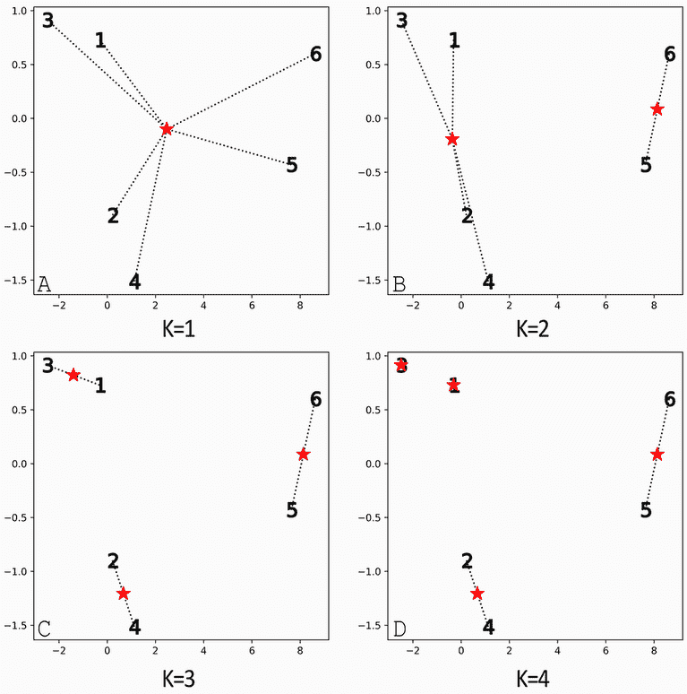

图 10.8 在 2D 空间中绘制了编号为 1 到 6 的六个点。中心，用星号标记，是在各种 *K* 值下计算的。从每个点到其最近中心画一条线。惯性是通过求六条线的长度的平方和来计算的。（A）*K* = 1。所有六条线都从单个中心延伸出来。惯性相当大。（B）*K* = 2。点 5 和 6 非常接近第二个中心。惯性减少。（C）*K* = 3。点 1 和 3 与新形成的中心显著更近。点 2 和 4 也与新形成的中心显著更近。惯性大幅下降。（D）*K* = 4。点 1 和 3 现在与其中心重叠。它们对惯性的贡献已从非常低的值变为零。剩余四个点及其相关中心之间的距离保持不变。因此，将 *K* 从 3 增加到 4 导致惯性非常小的下降。

一些惯性值太大。其他值太低。在两者之间可能存在一个恰到好处的值。我们如何找到它？

让我们找出一个解决方案。我们首先在广泛的 *K* 值范围内绘制我们的飞镖靶数据集的惯性（图 10.9）。惯性会自动为每个 scikit-learn `KMeans` 对象计算。我们可以通过模型的 `inertia_` 属性访问这个存储的值。

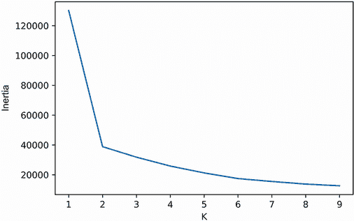

图 10.9 包含两个靶心的飞镖靶模拟的惯性图。该图类似于肘部弯曲的手臂。肘部直接指向 *K* 值为 2。

列表 10.12 绘制 K-means 惯性

```
k_values = range(1, 10)
inertia_values = [KMeans(k).fit(darts).inertia_
                  for k in k_values]

plt.plot(k_values, inertia_values)
plt.xlabel('K')
plt.ylabel('Inertia')
plt.show()
```

生成的图类似于肘部弯曲的手臂，肘部指向 *K* 值为 2。正如我们已经知道的，这个 *K* 准确地捕捉了我们预先编程到数据集中的两个中心。

如果现有中心的数量增加，这种方法是否仍然适用？我们可以通过向我们的飞镖投掷模拟中添加一个额外的靶心来找出答案。在我们将簇计数增加到 3 后，我们重新生成惯性图（图 10.10）。

列表 10.13 3 个飞镖靶模拟的惯性绘图

```
new_bulls_eye = [12, 0]
for _ in range(5000):
    x = np.random.normal(new_bulls_eye[0], variance ** 0.5)
    y = np.random.normal(new_bulls_eye[1], variance ** 0.5)
    darts.append([x, y])

inertia_values = [KMeans(k).fit(darts).inertia_
                  for k in k_values]

plt.plot(k_values, inertia_values)
plt.xlabel('K')
plt.ylabel('Inertia')
plt.show()
```

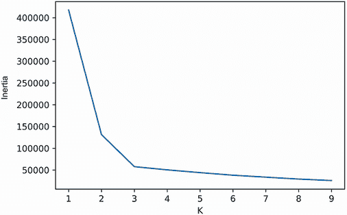

图 10.10 包含三个靶心的飞镖靶模拟的惯性图。该图类似于肘部弯曲的手臂。肘部的最低部分指向 *K* 值为 3。

添加第三个中心导致出现一个新的肘部，其最低的倾斜度指向 *K* 值为 3。本质上，我们的肘部图追踪了每个增量 *K* 捕获的分散度。连续 *K* 值之间惯性的快速下降意味着散点数据点已被分配到一个更紧密的簇中。随着惯性曲线变平，惯性减少的影响逐渐减弱。这种从垂直下降到更平缓角度的转变导致我们的图中出现肘部形状。我们可以使用肘部的位置来在 K-means 算法中选择合适的 *K* 值。

肘部方法选择标准是一个有用的启发式方法，但它并不能保证在所有情况下都有效。在特定条件下，肘部水平在多个 *K* 值上缓慢平缓，这使得选择一个有效的单一聚类数量变得困难。

注意：存在更强大的 *K*-选择方法，例如 *轮廓分数*，它捕捉每个点到邻近聚类的距离。对轮廓分数的详细讨论超出了本书的范围。然而，鼓励你自己探索这个分数，使用 `sklearn.metrics.silhouette_score` 方法。

K-means 聚类方法

+   `k_means_model = KMeans(n_clusters=K)`—创建一个 K-means 模型来寻找 *K* 个不同的质心。我们需要将这些质心拟合到输入数据中。

+   `clusters = k_means_model.fit_predict(data)`—使用初始化的 `KMeans` 对象在输入数据上执行 K-means。返回的 `clusters` 数组包含从 0 到 *K* 的聚类 ID。`data[i]` 的聚类 ID 等于 `clusters[i]`。

+   `clusters = KMeans(n_clusters=K).fit_predict(data)`—通过一行代码执行 K-means，并返回结果聚类。

+   `new_clusters = k_means_model.predict(new_data)`—使用数据优化的 `KMeans` 对象中的现有质心找到先前未见数据最近的质心。

+   `inertia = k_means_model.inertia_`—返回与数据优化的 `KMeans` 对象相关的惯性。

+   `inertia = KMeans(n_clusters=K).fit(data).inertia_`—通过一行代码执行 K-means，并返回结果惯性。

肘部方法并不完美，但如果数据集中在 *K* 个不同的均值上，它表现相当好。当然，这假设我们的数据聚类由于中心性而不同。然而，在许多情况下，数据聚类由于空间中数据点的密度而不同。让我们探讨密度驱动聚类的概念，这些聚类不依赖于中心性。

## 10.3 使用密度发现聚类

假设一位天文学家在太阳系边缘发现了一个新的行星。这个行星，就像土星一样，在其中心周围有多个环以恒定的轨道旋转。每个环都是由数千块岩石组成的。我们将这些岩石建模为由 x 和 y 坐标定义的单独点。让我们使用 scikit-learn 的 `make_circles` 函数生成由许多岩石组成的三个岩石环（图 10.11）。

列表 10.14 模拟行星周围的环

```
from sklearn.datasets import make_circles

x_coordinates = []
y_coordinates = []
for factor in [.3, .6, 0.99]:
    rock_ring, _ = make_circles(n_samples=800, factor=factor,     ❶
                                noise=.03, random_state=1)
    for rock in rock_ring:
        x_coordinates.append(rock[0])
        y_coordinates.append(rock[1])

plt.scatter(x_coordinates, y_coordinates)
plt.show()
```

❶ `make_circles` 函数在 2D 中创建两个同心圆。小圆半径相对于大圆的比例由因子参数确定。

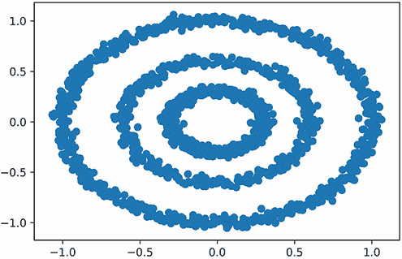

图 10.11 围绕中心点位置的三块岩石环的模拟

图表中明显存在三个环组。让我们通过将 *K* 设置为 3 来使用 K-means 寻找这三个聚类（图 10.12）。

列表 10.15 使用 K-means 对环进行聚类

```
rocks = [[x_coordinates[i], y_coordinates[i]]
          for i in range(len(x_coordinates))]
rock_clusters = KMeans(3).fit_predict(rocks)

colors = [['g', 'y', 'k'][cluster] for cluster in  rock_clusters]
plt.scatter(x_coordinates, y_coordinates, color=colors)
plt.show()
```

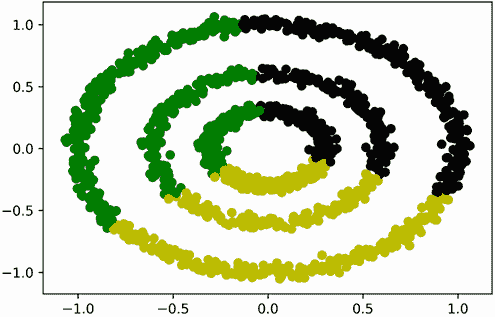

图 10.12 K-means 聚类未能正确识别三个不同的岩石环。

输出结果完全失败！K-means 将数据分割成三个对称的段，每个段跨越多个环。这个解决方案不符合我们直观的预期，即每个环都应该属于它自己的独立组。出了什么问题？嗯，K-means 假设三个簇由三个独特的中心定义，但实际上这些环是围绕一个单一的中心点旋转的。簇之间的差异不是由中心性驱动的，而是由密度驱动的。每个环都是由密集的点集构成的，而空旷的区域则是人口稀少的空地，作为环之间的边界。

我们需要设计一个算法，该算法可以在空间密集区域对数据进行聚类。这样做需要我们定义一个给定的区域是密集的还是稀疏的。*密度*的一个简单定义如下：一个点只有在它位于其他 *Y* 个点距离 *X* 的范围内时，才被认为是密集区域的一部分。我们将 *X* 和 *Y* 分别称为 `epsilon` 和 `min_points`。以下代码将 `epsilon` 设置为 0.1，将 `min_points` 设置为 10。因此，如果我们的岩石在至少 10 块其他岩石的 0.1 半径范围内，它们就存在于空间的密集区域。

列表 10.16 指定密度参数

```
epsilon = 0.1
min_points = 10
```

让我们分析 `rocks` 列表中的第一块岩石的密度。我们首先在 `epsilon` 单位内搜索所有其他岩石。我们将这些邻近岩石的索引存储在一个 `neighbor_indices` 列表中。

列表 10.17 查找 `rocks[0]` 的邻居

```
neighbor_indices = [i for i, rock in enumerate(rocks[1:])
                    if euclidean(rocks[0], rock) <= epsilon]
```

现在我们比较邻居的数量与 `min_points`，以确定 `rocks[0]` 是否位于空间的密集区域。

列表 10.18 检查 `rocks[0]` 的密度

```
num_neighbors = len(neighbor_indices)
print(f"The rock at index 0 has {num_neighbors} neighbors.")

if num_neighbors >= min_points:
    print("It lies in a dense region.")
else:
    print("It does not lie in a dense region.")

The rock at index 0 has 40 neighbors.
It lies in a dense region.
```

索引为 0 的岩石位于空间的密集区域。`rocks[0]` 的邻居是否也共享那个密集区域的空间？这是一个棘手的问题。毕竟，每个邻居可能都有少于 `min_points` 个自己的邻居。根据我们严格的密度定义，我们不会将这些邻居视为密集点。然而，这会导致一个荒谬的情况，即密集区域只由一个点组成：`rocks[0]`。我们可以通过更新我们的密度定义来避免这种荒谬的结果。让我们正式定义 *密度* 如下：

+   如果一个点位于 `epsilon` 距离内 `min_points` 个邻居的范围内，那么该点位于空间的密集区域。

+   空间中密集区域中一个点的每个邻居也在该空间中聚类。

根据我们更新的定义，我们可以将 `rocks[0]` 和它的邻居合并成一个单一的密集簇。

列表 10.19 创建密集簇

```
dense_region_indices = [0] + neighbor_indices
dense_region_cluster = [rocks[i] for i in dense_region_indices]
dense_cluster_size = len(dense_region_cluster)
print(f"We found a dense cluster containing {dense_cluster_size} rocks")

We found a dense cluster containing 41 rocks
```

索引为 0 的岩石及其邻居形成一个包含 41 个元素的单一密集聚类。邻居的邻居是否属于空间密集区域？如果是这样，根据我们更新的定义，这些岩石也属于密集聚类。因此，通过分析额外的邻近点，我们可以扩大`dense_region_cluster`的大小。

列表 10.20 扩展密集聚类

```
dense_region_indices = set(dense_region_indices)      ❶
for index in neighbor_indices:
    point = rocks[index]
    neighbors_of_neighbors = [i for i, rock in enumerate(rocks)
                              if euclidean(point, rock) <= epsilon]
    if len(neighbors_of_neighbors) >= min_points:
        dense_region_indices.update(neighbors_of_neighbors)

dense_region_cluster = [rocks[i] for i in dense_region_indices]
dense_cluster_size = len(dense_region_cluster)
print(f"We expanded our cluster to include {dense_cluster_size} rocks")

We expanded our cluster to include 781 rocks
```

❶ 将`dense_region_indices`转换为集合。这允许我们更新集合，添加额外的索引而不必担心重复。

我们已经迭代了邻居的邻居，并将我们的密集聚类几乎扩大了二十倍。为什么停止在这里呢？我们可以通过分析新遇到的邻居的密度来进一步扩大我们的聚类。迭代重复我们的分析将增加聚类边界的广度。最终，边界将扩展到完全包围我们的一个岩石环。然后，没有新的邻居可以吸收，我们可以在尚未分析的`rocks`元素上重复迭代分析。重复将导致更多密集环的聚类。

描述的流程被称为 DBSCAN。DBSCAN 算法根据数据的空间分布组织数据。

## 10.4 DBSCAN：基于空间密度的聚类算法

DBSCAN 是“基于密度的空间聚类应用噪声”的缩写。这是一个非常长的名字，实际上是一个非常简单的技术：

1.  从一个`data`列表中随机选择一个`point`坐标。

1.  获取该`point`点周围距离为`epsilon`的所有邻居。

1.  如果发现的邻居少于`min_points`，则使用不同的随机点重复步骤 1。否则，将`point`及其邻居分组到一个单独的聚类中。

1.  在所有新发现的邻居上迭代重复步骤 2 和 3。所有相邻的密集点都被合并到聚类中。当聚类停止扩展后，迭代终止。

1.  在提取整个聚类后，对所有尚未分析密度的数据点重复步骤 1-4。

DBSCAN 过程可以用不到 20 行代码编程。然而，任何基本实现都会在我们的`rocks`列表上运行得非常慢。编写快速实现需要一些非常微妙的优化，这些优化可以提高邻居遍历速度，但超出了本书的范围。幸运的是，我们不需要从头开始重建算法：scikit-learn 提供了一个快速的`DBSCAN`类，我们可以从`sklearn.cluster`导入它。让我们通过使用`eps`和`min_samples`参数分配`epsilon`和`min_points`来导入并初始化这个类。然后我们利用`DBSCAN`来聚类我们的三个环（图 10.13）。

列表 10.21 使用`DBSCAN`聚类环

```
from sklearn.cluster import DBSCAN
cluster_model = DBSCAN(eps=epsilon, min_samples=min_points)      ❶
rock_clusters = cluster_model.fit_predict(rocks)                 ❷
colors = [['g', 'y', 'k'][cluster] for cluster in rock_clusters]
plt.scatter(x_coordinates, y_coordinates, color=colors)
plt.show()
```

❶ 创建一个`cluster_model`对象以执行密度聚类。使用`eps`参数传入一个 epsilon 值为 0.1，使用`min_samples`参数传入一个 min_points 值为 10。

❷ 根据密度对岩石环进行聚类，并为每个岩石返回分配的聚类

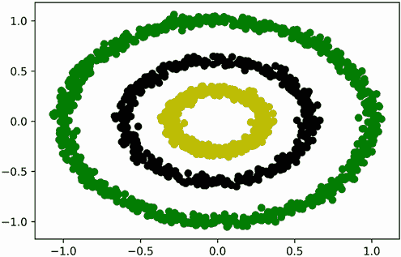

图 10.13 DBSCAN 聚类准确识别出三个不同的岩石环。

DBSCAN 成功识别了三个岩石环。该算法在 K-means 失败的地方取得了成功。

### 10.4.1 比较 DBSCAN 和 K-means

DBSCAN 是一种适用于由曲线和密集形状组成的数据聚类的有利算法。此外，与 K-means 不同，该算法在执行前不需要对聚类数量进行近似。此外，DBSCAN 还可以过滤位于空间稀疏区域的随机异常值。例如，如果我们添加一个位于环边界之外的异常值，DBSCAN 将分配给它一个聚类 ID 为-1。负值表示该异常值无法与数据集的其余部分聚类。

注意 与 K-means 不同，拟合的 DBSCAN 模型不能重新应用于全新的数据。相反，我们需要将新数据和旧数据结合起来，并从头开始执行聚类。这是因为计算出的 K-means 中心可以很容易地与额外的数据点进行比较。然而，额外的数据点可能会影响先前看到的数据的密度分布，这迫使 DBSCAN 重新计算所有聚类。

列表 10.22 使用 DBSCAN 查找异常值

```
noisy_data = rocks + [[1000, -1000]]
clusters = DBSCAN(eps=epsilon,
                  min_samples=min_points).fit_predict(noisy_data)
assert clusters[-1] == -1
```

DBSCAN 技术的另一个优点是它不依赖于均值。与此同时，K-means 算法要求我们计算分组点的均值坐标。正如我们在第五部分中讨论的，这些均值坐标最小化了到中心的平方距离之和。最小化属性仅在平方距离是欧几里得的情况下成立。因此，如果我们的坐标不是欧几里得坐标，均值就不是很有用，不应该应用 K-means 算法。然而，欧几里得距离并不是衡量点之间分离的唯一度量标准——存在无限多的度量标准来定义距离。我们在后续小节中探索其中的一些。在这个过程中，我们学习如何将这些度量标准集成到我们的 DBSCAN 聚类输出中。

### 10.4.2 基于非欧几里得距离的聚类

假设我们正在参观曼哈顿，并希望知道从帝国大厦到哥伦布圆环的步行距离。帝国大厦位于 34 街和第五大道的交汇处。同时，哥伦布圆环位于 57 街和第八大道的交汇处。曼哈顿的街道和大道总是相互垂直。这使得我们可以将曼哈顿表示为一个二维坐标系，其中街道位于 x 轴上，大道位于 y 轴上。在这种表示下，帝国大厦位于坐标(34, 5)，哥伦布圆环位于坐标(57, 8)。我们可以轻松地计算两个坐标点之间的直线欧几里得距离。然而，那个最终长度是无法通行的，因为高耸的钢铁建筑占据了每个城市街区所围成的区域。一个更正确的解决方案仅限于穿过城市网格形成的垂直人行道的路径。这样的路线要求我们在第五大道和第三大道之间走 3 个街区，然后在 34 街和 57 街之间走 23 个街区，总距离为 26 个街区。曼哈顿的平均街区长度为 0.17 英里，因此我们可以估计步行距离为 4.42 英里。让我们直接使用一个通用的`manhattan_distance`函数来计算这个步行距离。

列表 10.23 计算曼哈顿距离

```
def manhattan_distance(point_a, point_b):
    num_blocks = np.sum(np.absolute(point_a - point_b))
    return 0.17 * num_blocks

x = np.array([34, 5])
y = np.array([57, 8])
distance = manhattan_distance(x, y)     ❶

print(f"Manhattan distance is {distance} miles")

Manhattan distance is 4.42 miles
```

❶ 我们也可以通过从 scipy.spatial.distance 导入 cityblock 然后运行 0.17 * cityblock(x, y)来生成这个输出。

现在，假设我们希望聚类超过两个曼哈顿位置。我们将假设每个聚类包含一个点，该点距离其他三个聚类点步行一英里以内。这个假设使我们能够使用 scikit-learn 的`DBSCAN`类应用 DBSCAN 聚类。我们在 DBSCAN 初始化时将`eps`设置为 1，将`min_samples`设置为 3。此外，我们将`metric= manhattan_distance`传递到初始化方法中。`metric`参数将欧几里得距离替换为我们自定义的距离度量，因此聚类距离正确地反映了城市内基于网格的约束。以下代码聚类曼哈顿坐标，并在网格上绘制它们及其聚类标识（图 10.14）。

列表 10.24 使用曼哈顿距离进行聚类

```
points = [[35, 5], [33, 6], [37, 4], [40, 7], [45, 5]]
clusters = DBSCAN(eps=1, min_samples=3,
                  metric=manhattan_distance).fit_predict(points)    ❶

for i, cluster in enumerate(clusters):
    point = points[i]
    if cluster == -1:
        print(f"Point at index {i} is an outlier")
        plt.scatter(point[0], point[1], marker='x', color='k')      ❷
    else:
        print(f"Point at index {i} is in cluster {cluster}")
        plt.scatter(point[0], point[1], color='g')

plt.grid(True, which='both', alpha=0.5)                             ❸
plt.minorticks_on()

plt.show()
Point at index 0 is in cluster 0
Point at index 1 is in cluster 0
Point at index 2 is in cluster 0
Point at index 3 is an outlier
Point at index 4 is an outlier
```

❶ 将`manhattan_distance`函数通过`metric`参数传递给 DBSCAN。

❷ 异常值使用 X 形标记进行绘制。

❸ 网格法显示了我们计算曼哈顿距离的矩形网格。

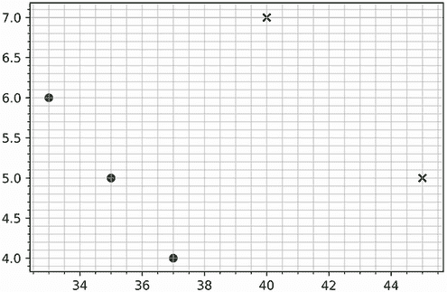

图 10.14 使用曼哈顿距离在矩形网格中对五个点进行聚类。网格左下角的三点位于单个聚类中。其余两个点是异常值，用 x 标记。

前三个位置位于单个聚类中，其余点为异常值。我们能否使用 K-means 算法检测到该聚类？或许可以。毕竟，我们的曼哈顿街区坐标可以平均化，使其与 K-means 实现兼容。如果我们用不同的度量替换曼哈顿距离，其中平均坐标不容易获得，会怎样？让我们定义一个具有以下特性的非线性距离度量：如果所有元素都是负数，两个点之间距离为 0 个单位，如果所有元素都是非负数，则距离为 2 个单位，否则为 10 个单位。给定这种荒谬的距离度量，我们能否计算任意两个点的平均值？我们不能，K-means 也不能应用。该算法的一个弱点是它依赖于平均距离的存在。与 K-means 不同，DBSCAN 算法不需要我们的距离函数是线性可分的。因此，我们可以轻松地使用我们的荒谬距离度量运行 DBSCAN 聚类。

列表 10.25 使用荒谬的距离度量进行聚类

```
def ridiculous_measure(point_a, point_b):
    is_negative_a = np.array(point_a) < 0                      ❶
    is_negative_b = np.array(point_b) < 0
    if is_negative_a.all() and is_negative_b.all():            ❷
        return 0
    elif is_negative_a.any() or is_negative_b.any():           ❸
        return 10
    else:                                                      ❹
        return 2

points = [[-1, -1], [-10, -10], [-1000, -13435], [3,5], [5,-7]]

clusters = DBSCAN(eps=.1, min_samples=2,
                  metric=ridiculous_measure).fit_predict(points)

for i, cluster in enumerate(clusters):
    point = points[i]
    if cluster == -1:
        print(f"{point} is an outlier")
    else:
        print(f"{point} falls in cluster {cluster}")

[-1, -1] falls in cluster 0
[-10, -10] falls in cluster 0
[-1000, -13435] falls in cluster 0
[3, 5] is an outlier
[5, -7] is an outlier
```

❶ 返回一个布尔数组，其中 is_negative_a[i] 为 True 如果 point_a[i] < 0

❷ point_a 和 point_b 的所有元素都是负数。

❸ 存在一个负元素，但并非所有元素都是负数。

❹ 所有元素都是非负数。

使用我们的 `ridiculous_measure` 度量运行 DBSCAN 导致负坐标聚类成一个单独的组。所有其他坐标都被视为异常值。这些结果在概念上并不实用，但关于度量选择的灵活性非常受欢迎。我们在度量选择上不受限制！例如，我们可以将度量设置为基于地球曲率的遍历距离。这种度量对于聚类地理位置特别有用。

DBSCAN 聚类方法

+   `dbscan_model = DBSCAN(eps=epsilon, min_samples=min_points)`—创建一个 DBSCAN 模型，通过密度进行聚类。密集点定义为在距离 `epsilon` 内至少有 `min_points` 个邻居的点。邻居被认为与点属于同一个聚类。

+   `clusters = dbscan_model.fit_predict(data)`—使用初始化的 `DBSCAN` 对象在输入数据上执行 DBSCAN。`clusters` 数组包含聚类 ID。`data[i]` 的聚类 ID 等于 `clusters[i]`。未聚类的异常值点被分配一个 ID 为 –1。

+   `clusters = DBSCAN(eps=epsilon, min_samples=min_points).fit_predict (data)`—使用单行代码执行 DBSCAN，并返回结果聚类。

+   `dbscan_model = DBSCAN(eps=epsilon, min_samples=min_points, metric =metric_function)`—创建一个 DBSCAN 模型，其中距离度量由自定义度量函数定义。`metric_function` 距离度量不需要是欧几里得距离。

DBSCAN 算法确实存在某些缺点。该算法旨在检测具有相似点密度分布的簇。然而，现实世界的数据在密度上有所不同。例如，曼哈顿的披萨店比加利福尼亚橙县的披萨店分布得更密集。因此，我们可能难以选择能够让我们在两个地点聚类商店的密度参数。这突出了算法的另一个局限性：DBSCAN 需要 `eps` 和 `min_samples` 参数的有意义值。特别是，`eps` 输入的变化将极大地影响聚类的质量。不幸的是，没有一种可靠的程序可以用来估计适当的 `eps`。虽然文献中偶尔提到了某些启发式方法，但它们的益处很小。大多数时候，我们必须依靠我们对问题的直观理解来为这两个 DBSCAN 参数分配实际输入。例如，如果我们要对一组地理位置进行聚类，我们的 `eps` 和 `min_samples` 值将取决于这些位置是否分布在整个地球或是否仅限于单个地理区域。在每种情况下，我们对密度和距离的理解都会有所不同。一般来说，如果我们正在聚类散布在地球上的随机城市，我们可以将 `min_samples` 和 `eps` 参数分别设置为三个城市和 250 英里。这假设每个簇都包含至少三个其他聚类城市的城市，距离在 250 英里以内。对于更区域性的位置分布，需要更低的 `eps` 值。

## 10.5 使用 Pandas 分析簇

到目前为止，我们一直将数据输入和聚类输出分开。例如，在我们的岩石环分析中，输入数据在 `rocks` 列表中，聚类输出在 `rock_clusters` 数组中。跟踪坐标和簇需要我们在输入列表和输出数组之间映射索引。因此，如果我们想提取簇 0 中的所有岩石，我们必须获取所有 `rocks[i]` 的实例，其中 `rock_clusters[i] == 0`。这种索引分析很复杂。我们可以通过将坐标和簇结合到一个单一的 Pandas 表格中，更直观地分析聚类岩石。

以下代码创建了一个包含三个列的 Pandas 表格：`X`、`Y` 和 `Cluster`。表格中的第 *i* 行包含位于 `rocks[i]` 的岩石的 x 坐标、y 坐标和簇。

列表 10.26 在表中存储聚类坐标

```
import pandas as pd
x_coordinates, y_coordinates = np.array(rocks).T
df = pd.DataFrame({'X': x_coordinates, 'Y': y_coordinates,
                   'Cluster': rock_clusters})
```

我们的 Pandas 表格使我们能够轻松访问任何簇中的岩石。让我们绘制落入簇 0 的岩石，使用第八部分（图 10.15）中描述的技术。

列表 10.27 使用 Pandas 绘制单个簇

```
df_cluster = df[df.Cluster == 0]          ❶
plt.scatter(df_cluster.X, df_cluster.Y)   ❷
plt.show()
```

❶ 仅选择那些簇列等于 0 的行

❷ 绘制所选行的 X 和 Y 列。请注意，我们也可以通过运行 df_cluster.plot.scatter(x='X', y='Y') 来执行散点图。

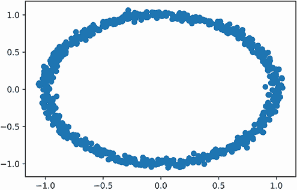

图 10.15 落入簇 0 的岩石

Pandas 允许我们从任何单个簇中获取包含元素的表格。或者，我们可能想要获取多个表格，其中每个表格映射到一个簇 ID。在 Pandas 中，这是通过调用 `df.groupby('Cluster')` 来实现的。`groupby` 方法将创建三个表格：一个对应每个簇。它将返回一个可迭代的簇 ID 和表格之间的映射。让我们使用 `groupby` 方法遍历我们的三个簇。我们将随后绘制簇 1 和簇 2 中的岩石，但不会绘制簇 0 中的岩石（图 10.16）。

注意：调用 `df.groupby('Cluster')` 返回的不仅仅是可迭代的对象：它返回一个 `DataFrameGroupBy` 对象，该对象提供了用于簇过滤和分析的额外方法。

列表 10.28 使用 Pandas 遍历簇

```
for cluster_id, df_cluster in df.groupby('Cluster'):    ❶
    if cluster_id == 0:
        print(f"Skipping over cluster {cluster_id}")
        continue

    print(f"Plotting cluster {cluster_id}")
    plt.scatter(df_cluster.X, df_cluster.Y)

plt.show()

Skipping over cluster 0
Plotting cluster 1
Plotting cluster 2
```

❶ df.groupby('Cluster') 返回的可迭代对象的每个元素都是一个元组。元组的第一个元素是从 df.Cluster 获得的簇 ID。第二个元素是由 df.Cluster 等于簇 ID 的所有行组成的表格。

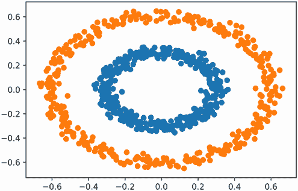

图 10.16 落入簇 1 和簇 2 的岩石

Pandas 的 `groupby` 方法让我们可以迭代地检查不同的簇。这在我们的案例研究 3 分析中可能很有用。

## 摘要

+   *K-means* 算法通过寻找 *K 个质心* 来聚类输入数据。这些质心代表发现的数据组的平均坐标。K-means 通过选择 *K* 个随机质心来初始化。然后，每个数据点根据其最近的质心进行聚类，并且质心被迭代地重新计算，直到它们收敛到稳定的位置。

+   K-means 保证收敛到解决方案。然而，该解决方案可能不是最优的。

+   K-means 需要欧几里得距离来区分点。该算法不适用于聚类非欧几里得坐标。

+   执行 K-means 聚类后，我们可以计算结果的 *惯性*。惯性等于每个数据点与其最近中心之间的平方距离之和。

+   在一系列 *K* 值范围内绘制惯性将生成一个 *肘部图*。肘部图中的肘部成分应指向一个合理的 *K* 值。使用肘部图，我们可以启发式地选择 K-means 的一个有意义的 *K* 输入。

+   *DBSCAN* 算法根据密度聚类数据。密度是通过 `epsilon` 和 `min_points` 参数定义的。如果一个点位于 `epsilon` 距离内的 `min_points` 个邻居中，那么该点位于空间的一个密集区域。空间中一个点的每个邻居也在该空间中聚类。DBSCAN 通过迭代扩展密集区域的空间边界，直到检测到一个完整的簇。

+   DBSCAN 算法不会聚类非密集区域中的点。它们被视为异常值。

+   DBSCAN 是一种适用于由曲线和密集形状组成的数据聚类的有利算法。

+   DBSCAN 可以使用任意、非欧几里得距离进行聚类。

+   没有可靠的启发式方法来选择合适的`epsilon`和`min_points`参数。然而，如果我们希望对全球城市进行聚类，可以将这两个参数分别设置为 250 英里和三个城市。

+   将聚类数据存储在 Pandas 表中，使我们能够通过`groupby`方法直观地遍历聚类。
