# 11 地理位置可视化与分析

本节涵盖

+   计算地理位置之间的距离

+   使用 Cartopy 库在地图上绘制位置

+   从位置名称中提取地理坐标

+   使用正则表达式在文本中查找位置名称

人们依赖位置信息的历史可以追溯到有记录历史之前。穴居人曾经将狩猎路线刻在猛犸象的牙齿上。随着文明的繁荣，这样的地图逐渐发展。古巴比伦人全面绘制了他们庞大帝国的边界。后来，在公元前 3000 年，希腊学者利用数学创新改进了制图术。希腊人发现地球是圆的，并准确计算了地球的周长。希腊数学家为测量地球曲面的距离奠定了基础。这样的测量需要创建一个地理坐标系统：一个基于纬度和经度的原始系统在公元前 2000 年被引入。

将制图术与纬度和经度相结合，有助于彻底改变航海导航。水手们可以通过查看地图上的位置来更自由地航行大海。大致来说，航海导航协议遵循以下三个步骤：

1.  *数据观察*——水手记录了一系列观察，包括风向、星星的位置，以及（大约在公元 1300 年后）指南针的北向方向。

1.  *数学和算法数据分析*——领航员分析了所有数据，以估计船的位置。有时分析需要三角计算。更常见的是，领航员查阅一系列基于规则的测量图表。通过算法遵循图表中的规则，领航员可以确定船的坐标。

1.  *可视化和决策*——船长检查地图上计算出的位置相对于预期目的地的情况。然后船长会根据可视化的结果下达调整船的航向的命令。

这种导航范式完美地概括了标准的数据科学流程。作为数据科学家，我们得到了原始观察数据。我们通过算法分析这些数据。然后，我们可视化结果以做出关键决策。因此，数据科学和位置分析是相互关联的。这种联系在几个世纪中变得越来越紧密。今天，无数公司以古希腊人无法想象的方式分析位置。对冲基金研究农田的卫星照片，以在全球大豆市场上进行投注。运输服务提供商分析庞大的交通模式，以高效地规划车队。流行病学家处理报纸数据，以监测全球疾病的传播。

在本节中，我们探讨了分析和可视化地理位置的各种技术。我们从计算两个地理位置之间距离的简单任务开始。

## 11.1 大圆距离：计算全球两点之间距离的度量

地球上任何一对点之间的最短旅行距离是什么？由于直接线性旅行需要穿过地球的地壳，所以距离不能是直线。一个更现实的路径是沿着我们球形地球的曲面旅行。球面上两点之间的这种直接路径称为*大圆距离*（图 11.1）。

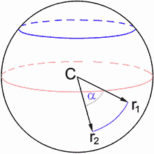

图 11.1 展示了球面上两点之间的大圆距离。这些点被标记为 r[1]和 r[2]。一条弯曲的弧线表示它们之间的旅行距离。弧长等于球面半径乘以α，其中α是相对于球心 C 的两点之间的角度。

我们可以计算给定球面上两点之间的大圆距离。球面上的任何点都可以使用*x 和 y*球坐标来表示，其中 x 和 y 衡量点相对于 x 轴和 y 轴的角度（图 11.2）。

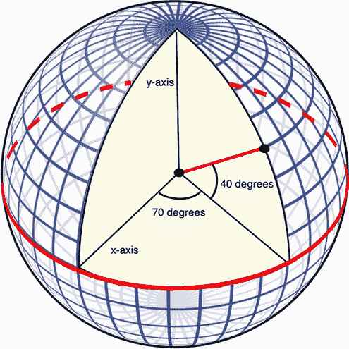

图 11.2 使用球坐标表示球面上的一个点。当我们从 x 轴旋转 70 度并向 y 轴旋转 40 度时，我们到达这个点。因此，它的球坐标是(70, 40)。

让我们定义一个基本的`great_circle_distance`函数，该函数接受两个球坐标对作为输入。为了简化起见，我们将假设这些坐标位于半径为 1 的单位球上。这种简化使我们能够只用四行代码来定义`great_circle_distance`函数。该函数依赖于一系列众所周知的三角运算；这些运算的详细推导超出了本书的范围。

列表 11.1 定义大圆距离函数

```
from math import cos, sin, asin                                           ❶

def great_circle_distance(x1, y1, x2, y2):
    delta_x, delta_y = x2 - x1, y2 - y1                                   ❷
    haversin = sin(delta_x / 2) ** 2 + np.product([cos(x1), cos(x2),      ❸
                                                   sin(delta_y / 2) ** 2])
    return 2 * asin(haversin ** 0.5)
```

❶ 从 Python 的 math 模块导入三个常见的三角函数

❷ 计算两个球坐标对之间的角度差

❸ 执行一系列众所周知的三角运算，以获得单位球面上的大圆距离。np.product 函数将三个三角函数值相乘。

Python 的三角函数假设输入角度是以弧度为单位的，其中 0 度等于 0 弧度，180 度等于*π*弧度。让我们计算两个点之间的大圆距离，这两个点在 x 轴和 y 轴上相隔 180 度。

注意弧度是相对于角度来衡量单位圆弧长度的。最大弧长等于单位圆的周长 2*π*。环绕圆的周长需要 360 度的角度。因此，2*π*弧度等于 360 度，一个度等于*π* / 180 弧度。

列表 11.2 计算大圆距离

```
from math import pi
distance = great_circle_distance(0, 0, 0, pi)
print(f"The distance equals {distance} units")

The distance equals 3.141592653589793 units
```

这些点之间的距离正好是 *π* 单位，是环绕单位圆所需距离的一半。这个值是我们可以在两个球面点之间旅行的最长可能距离。这类似于在任何一个行星的北极和南极之间旅行。我们将通过分析地球北极和南极的纬度和经度来确认这一点。地球的经纬度是度量的球面坐标。让我们首先记录每个极点的已知坐标。

列表 11.3 定义地球两极的坐标

```
latitude_north, longitude_north = (90.0, 0)    ❶
latitude_south, longitude_south = (-90.0, 0)
```

❶ 从技术角度讲，北极和南极没有官方的经度坐标。然而，我们在数学上为每个极点分配零经度是有道理的。

纬度和经度以度为单位测量球面坐标，而不是弧度。因此，我们将使用 `np.radians` 函数将度转换为弧度。该函数接受一个度数的列表作为输入，并返回一个弧度数组。此结果随后可以输入到 `great_circle_distance`。

列表 11.4 计算两极之间的大圆距离

```
to_radians =  np.radians([latitude_north, longitude_north,
                          latitude_south, longitude_south])
distance = great_circle_distance(*to_radians.tolist())                   ❶
print(f"The unit-circle distance between poles equals {distance} units")

The unit-circle distance between poles equals 3.141592653589793 units
```

❶ 作为提醒，运行 func(*[arg1, arg2]) 是 Python 中执行 func(arg1, arg2) 的快捷方式。

如预期的那样，单位球体上两极之间的距离是 *π*。现在，让我们测量地球上两个极点之间的距离。地球的半径不是 1 个假设的单位，而是 3956 英里，因此我们必须将 `distance` 乘以 3956 以获得地球上的测量值。

列表 11.5 计算地球两极之间的旅行距离

```
earth_distance = 3956 * distance
print(f"The distance between poles equals {earth_distance} miles")

The distance between poles equals 12428.14053760122 miles
```

两个极点之间的距离大约是 12,400 英里。我们能够通过将纬度和经度转换为弧度，计算它们的单位球体距离，然后将该值乘以地球的半径来计算它。现在我们可以创建一个通用的 `travel_distance` 函数来计算任何两个地球上的点之间的旅行里程。

列表 11.6 定义旅行距离函数

```
def travel_distance(lat1, lon1, lat2, lon2):
    to_radians =  np.radians([lat1, lon1, lat2, lon2])
    return 3956 * great_circle_distance(*to_radians.tolist())

assert travel_distance(90, 0, -90, 0) == earth_distance
```

我们的 `travel_distance` 函数是一个非欧几里得度量，用于测量地点之间的距离。正如前一小节所讨论的，我们可以将此类度量传递给 DBSCAN 聚类算法，因此我们可以使用 `travel_distance` 根据地点的空间分布进行聚类。然后我们可以通过在地图上绘制地点来直观地验证聚类。此地图绘制可以使用外部 Cartopy 可视化库执行。

## 11.2 使用 Cartopy 绘制地图

可视化地理数据是常见的数据科学任务。用于映射此类数据的一个外部库是 Cartopy：一个用于在 Python 中生成地图的与 Matplotlib 兼容的工具。不幸的是，Cartopy 的安装可能有点棘手。本书中的其他所有库都可以使用单行 `pip install` 命令安装。这会调用 `pip` 包管理系统，然后连接到 Python 库的外部服务器。Pip 随后安装所选库及其所有 Python 依赖项，这些依赖项代表了额外的库需求。

注意：例如，NumPy 是 Matplotlib 的依赖项。调用 `pip install matplotlib` 会自动在本地机器上安装 NumPy，如果尚未安装的话。

当所有依赖项都使用 Python 编写时，Pip 运作良好。然而，Cartopy 有一个用 C++ 编写的依赖项。GEOS 库是一个地理空间引擎，是 Cartopy 可视化的基础。它不能使用 pip 安装，因此 Cartopy 也不能直接使用 pip 安装。我们只剩下两个选项：

+   手动安装 GEOS 和 Cartopy

+   使用 Conda 软件包管理器安装 Cartopy 库

让我们讨论每种方法的优缺点。

注意：要深入了解 Python 依赖项，请参阅 Manning 的“Managing Python Dependencies”直播视频：[www.manning.com/livevideo/talk-python-managing-python-dependencies](http://www.manning.com/livevideo/talk-python-managing-python-dependencies)。

### 11.2.1 手动安装 GEOS 和 Cartopy

GEOS 的安装取决于操作系统。在 macOS 上，可以通过在命令行中调用 `brew install proj geos` 来安装；在 Linux 上，可以通过调用 `apt-get` 而不是 `brew` 来安装。此外，Windows 用户可以从 [`trac.osgeo.org/geos`](https://trac.osgeo.org/geos) 下载并安装库。一旦安装了 GEOS，就可以使用以下顺序 pip 命令添加 Cartopy 和其依赖项：

1.  `pip install --upgrade cython numpy pyshp six`

    这将安装所有 Python 依赖项，除了 Shapely 形状渲染库。

1.  `pip install shapely --no-binary shapely`

    Shapely 库必须从头开始编译，以便链接到 GEOS。`no-binary` 命令确保了全新的编译。

1.  `pip install cartopy`

    现在依赖项都已准备就绪，我们可以使用 pip 调用 Cartopy。

手动安装可能很麻烦。我们的替代方案是利用 Conda 软件包管理器。

### 11.2.2 利用 Conda 软件包管理器

Conda 与 pip 类似，是一个可以下载和安装外部库的包管理器。与 pip 不同，Conda 可以轻松处理非 Python 依赖项。而且与 pip 不同，Conda 并未预安装在大多数机器上：它必须从 [`docs.conda.io/en/latest/miniconda.html`](https://docs.conda.io/en/latest/miniconda.html) 下载并安装。然后我们可以通过运行 `conda install -c conda-forge cartopy` 来轻松安装 Cartopy 库。

不幸的是，使用 Conda 有一些权衡。当 Conda 安装一个新的 Python 库时，它会在一个称为*虚拟环境*的隔离环境中进行安装。虚拟环境有自己的 Python 版本，它与用户机器上的主 Python 版本分开。因此，Cartopy 库安装在虚拟环境中，而不是主环境中。这可能导致导入 Cartopy 时产生混淆，尤其是在 Jupyter 笔记本中，因为 Jupyter 默认指向主环境。为了将 Conda 环境添加到 Jupyter，我们必须运行以下两个命令：

1.  `conda install -c anaconda ipykernel`

1.  `python -m ipykernel install --user --name=base`

这样做确保了 Jupyter 笔记本可以与名为`base`的 Conda 环境交互，这是 Conda 创建的环境的默认名称。

现在，我们可以在创建新笔记本时从 Jupyter 的下拉菜单中选择`base`环境（图 11.3）。然后我们就能在笔记本中导入 Cartopy。


图 11.3 创建新笔记本时选择环境。可以从下拉菜单中选择 Conda 的`base`环境。选择`base`环境允许我们导入已安装的 Cartopy 库。

注意：Conda 的默认虚拟环境被称为`base`。然而，Conda 允许我们创建和跟踪多个环境。要创建一个名为`new_env`的新虚拟环境，我们需要在命令行中执行`conda create -n new_env`。然后我们可以通过运行`conda activate new_env`切换到新环境。运行`conda activate base`将切换回`base`环境，其中已安装 Cartopy。此外，`conda deactivate`命令将切换到机器的默认 Python 设置。我们还可以通过运行`conda info`来检查当前环境的名称。

让我们通过在 Jupyter 笔记本中运行`import cartopy`来确认安装。

列表 11.7 导入 Cartopy 库

```
import cartopy
```

Cartopy 的安装可能会让人感到困惑，但这份困惑是值得的。Cartopy 是 Python 中最好的、最常用的地图可视化工具。让我们来绘制一些地图。

### 11.2.3 地图可视化

地理地图是地球球面上三维表面的二维表示。通过称为*投影*的过程将球面地球展开成平面。存在许多不同类型的地图投影：最简单的一种是将地球叠加在一个展开的圆柱上，从而得到一个二维地图，其`(x, y)`坐标完美地对应于经度和纬度。

注意：在大多数其他投影中，二维网格坐标不等于球面坐标。因此，它们需要从一种坐标系转换到另一种坐标系。我们将在本节后面遇到这个问题。

这种技术被称为*等距圆柱投影*或*平面圆柱投影*。我们通过从`cartopy.crs`导入`PlateCarree`来使用这种标准投影。

注意：`cartopy.crs` 模块包含许多其他投影类型。例如，我们可以导入 `Orthographic`：这样做会返回一个*正射投影*，其中地球是从银河系外缘观察者的视角来表示的。

列表 11.8 导入平板圆投影

```
from cartopy.crs import PlateCarree
```

`PlateCarree` 类可以与 Matplotlib 结合使用来可视化地球。例如，运行 `plt.axes(projection=PlateCarree()).coastlines()` 会绘制地球七大洲的轮廓。更精确地说，`plt.axes(projection=PlateCarree())` 初始化了一个能够可视化地图的自定义 Matplotlib 轴。随后，调用 `coastlines` 方法会绘制大陆的海岸线边界（图 11.4）。

列表 11.9 使用 Cartopy 可视化地球

```
plt.axes(projection=PlateCarree()).coastlines()
plt.show()
```


图 11.4 在地球上绘制了大陆海岸线的标准地图

我们绘制的地图有点小。我们可以使用 Matplotlib 的 `plt.figure` 函数增加地图的大小。调用 `plt.figure(figsize=(width, height))` 会创建一个宽度为 `width` 英寸、高度为 `height` 英寸的图表。列表 11.10 在生成世界地图（图 11.5）之前将图的大小增加到 12 x 8 英寸。

注意：由于图像格式化，书中图的实际尺寸并非 12 x 8 英寸。

列表 11.10 可视化更大的地球地图

```
plt.figure(figsize=(12, 8))                         ❶
plt.axes(projection=PlateCarree()).coastlines()
plt.show()
```

❶ 创建一个宽度为 12 英寸、高度为 8 英寸的大图

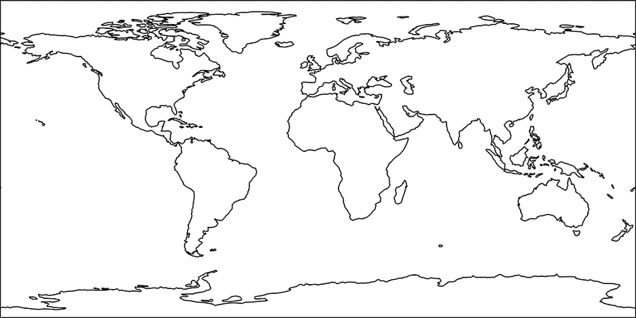

图 11.5 在地球上绘制了大陆海岸线的标准地图。使用 Matplotlib 的 `plt.figure` 函数增加了地图的大小。

到目前为止，我们的地图看起来有点稀疏，不太吸引人。我们可以通过调用 `plt.axes(projection=PlateCarree()).stock_img()` 来提高地图的质量。该方法调用使用地形信息着色地图：海洋被着色为蓝色，森林地区被着色为绿色（图 11.6）。

列表 11.11 着色地球地图

```
fig = plt.figure(figsize=(12, 8))
plt.axes(projection=PlateCarree()).stock_img()
plt.show()
```

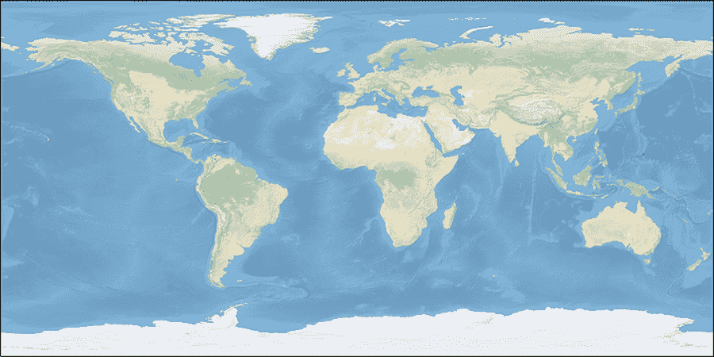

图 11.6 一个经过着色以显示海洋和地形细节的地球标准地图

我们着色的地图没有包括划分海岸边界的线条。添加这些边界将提高地图的质量。然而，我们无法在单行代码中添加颜色和边界。相反，我们需要执行以下三行（图 11.7）：

1.  `ax = plt.axes(projection=PlateCarree())`

    这行代码初始化了一个能够可视化地图的自定义 Matplotlib 轴。按照标准惯例，该轴被分配给 `ax` 变量。

1.  `ax.coastlines()`

    这行代码将海岸线添加到图表中。

1.  `ax.stock_img()`

    这行代码将地形颜色添加到图表中。

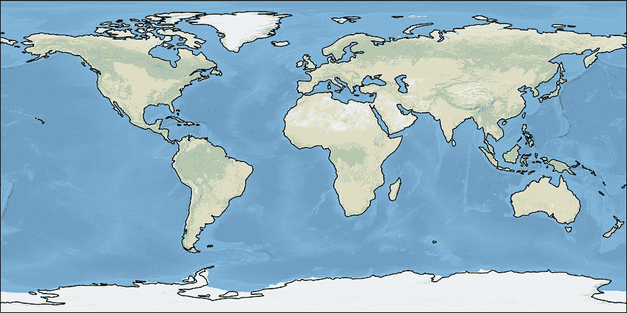

图 11.7 一个经过着色以显示海洋和地形细节的地球标准地图。此外，绘制的海岸线为大陆边界提供了清晰的细节。

让我们运行这些步骤以生成一个清晰、多彩的地图。

列表 11.12 与地图颜色一起绘制海岸线

```
plt.figure(figsize=(12, 8))
ax = plt.axes(projection=PlateCarree())
ax.coastlines()
ax.stock_img()
plt.show()
```

注意，`ax.stock_img()`依赖于保存的地球库存图像来着色地图。当用户放大地图时（我们很快就会这样做），此图像的渲染效果不佳。作为替代，我们可以使用`ax.add_feature`方法来着色海洋和大陆，该方法显示存储在`cartopy.feature`模块中的特殊 Cartopy 特性。例如，调用`ax.add_feature(cartopy.feature.OCEAN)`将所有海洋着色为蓝色，输入`cartopy.feature.LAND`将所有陆地着色为米色。让我们利用这些特性来着色地图（图 11.8）。

列表 11.13 使用`feature`模块添加颜色

```
plt.figure(figsize=(12, 8))
ax = plt.axes(projection=PlateCarree())
ax.coastlines()                            ❶
ax.add_feature(cartopy.feature.OCEAN)
ax.add_feature(cartopy.feature.LAND)
plt.show()
```

❶ 我们继续显示海岸线，以增加图像的清晰度。

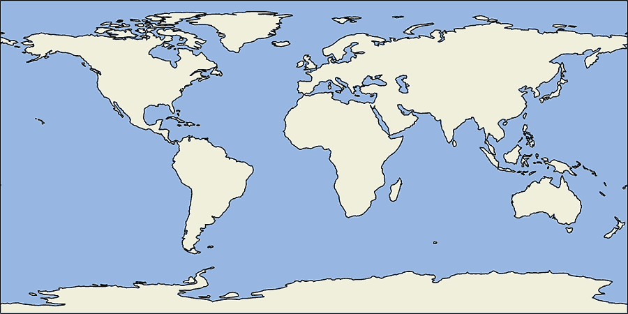

图 11.8 使用`feature`模块着色的标准地球地图

目前，图中缺少国家边界。Cartopy 将这些边界视为`feature`模块中的一个特性。我们可以通过调用`ax.add_feature(cartopy.feature.BORDERS)`（图 11.9）来包含国家边界。

列表 11.14 向图中添加国家边界

```
plt.figure(figsize=(12, 8))
ax = plt.axes(projection=PlateCarree())
ax.coastlines()
ax.add_feature(cartopy.feature.BORDERS)
ax.add_feature(cartopy.feature.OCEAN)
ax.add_feature(cartopy.feature.LAND)
plt.show()
```


图 11.9 包含国家边界的标准地球地图

假设我们给定一个由纬度和经度对定义的位置列表。我们可以通过调用`ax.scatter(longitudes, latitudes)`将这些位置作为一个标准散点图绘制在全局地图上。然而，Matplotlib 默认会放大散点，使得绘制的图像不完整。我们可以通过调用`ax.set_global()`来防止这种情况，这将扩展绘制的图像到地球的四个边缘。列表 11.15 绘制了一些地理点；为了简单起见，我们将地图内容限制在海岸边界（图 11.10）。

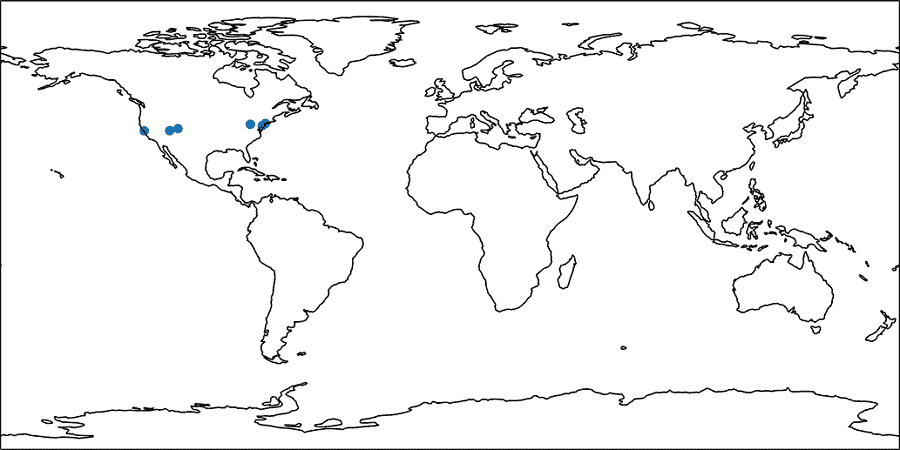

图 11.10 绘制了纬度和经度坐标的标准地球地图

注意：如前所述，平板正射投影产生一个二维网格，其中可以直接在轴上绘制`经度`和`纬度`。对于其他投影，情况并非如此：在生成散点图之前，需要将`经度`和`纬度`进行转换。简而言之，我们将讨论如何正确处理这种转换。

列表 11.15 在地图上绘制坐标

```
plt.figure(figsize=(12, 8))
coordinates = [(39.9526, -75.1652), (37.7749, -122.4194),
               (40.4406, -79.9959), (38.6807, -108.9769),
               (37.8716, -112.2727), (40.7831, -73.9712)]

latitudes, longitudes = np.array(coordinates).T
ax = plt.axes(projection=PlateCarree())
ax.scatter(longitudes, latitudes)
ax.set_global()
ax.coastlines()
plt.show()
```

所绘制的点都位于北美洲的边界内。我们可以通过放大该大陆来简化地图。然而，首先我们需要调整`地图范围`，这是地图上显示的地理区域。范围由一个矩形确定，其角落位于显示的最小和最大纬度和经度坐标。在 Cartopy 中，这些角落由一个形式为`(min_lon, max_lon, min_lat, max_lat)`的四个元素的元组定义。将此列表传递给`ax.set_extent`调整地图的边界。

我们现在将一个常见的北美洲范围分配给 `north_america_extent` 变量。然后我们使用 `ax.set_extent` 方法来放大北美洲。我们重新生成我们的散点图，这次通过将 `color='r'` 传递给 `ax.scatter` 来添加颜色；我们还利用 `feature` 模块在添加国家边界的同时给地图上色（图 11.11）。

列表 11.16 绘制北美洲坐标

```
plt.figure(figsize=(12, 8))
ax = plt.axes(projection=PlateCarree())
north_america_extent = (-145, -50, 0, 90)      ❶
ax.set_extent(north_america_extent)
ax.scatter(longitudes, latitudes, color='r')

def add_map_features():                        ❷
    ax.coastlines()
    ax.add_feature(cartopy.feature.BORDERS)
    ax.add_feature(cartopy.feature.OCEAN)
    ax.add_feature(cartopy.feature.LAND)

add_map_features()
plt.show()
```

❶ 北美洲范围位于经度 -145 到 -50 度之间，纬度 0 到 90 度之间。

❷ 此函数向地图添加常用功能。在本节的其他地方被重复使用。

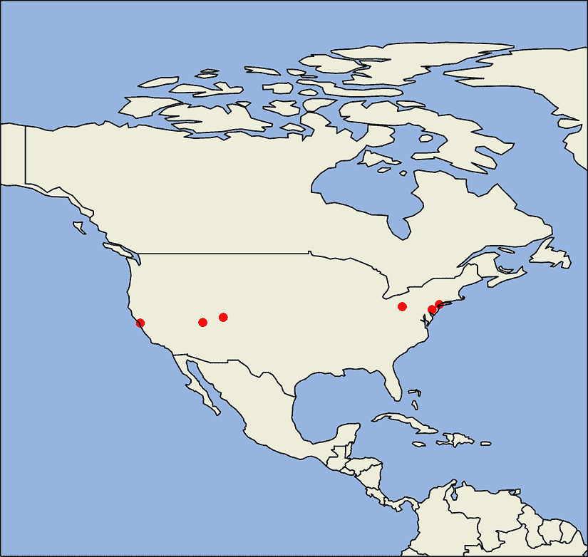

图 11.11 一张带有纬度和经度坐标的北美洲地图

我们成功地将地图放大到北美洲。现在我们将进一步放大，到美国。不幸的是，等角投影对于这个目的来说是不够的：如果我们对任何国家进行过于接近的放大，该技术会扭曲地图。

相反，我们将依赖 *Lambert 正形圆锥投影*。在这个投影中，一个圆锥放置在球形地球的顶部。圆锥的圆形底部覆盖了我们打算绘制的区域。然后，该区域的坐标被投影到圆锥的表面上。最后，将圆锥展开以创建一个二维地图。然而，该地图的二维坐标并不直接等于经度和纬度。

Cartopy 在 `csr` 模块中包含了一个 `LambertConformal` 类。执行 `plt.axes(projection=LambertConformal())` 会产生与 Lambert 正形坐标系相对应的坐标轴。随后，将美国范围传递给 `ax.set_extent` 将地图放大到美国。列表 11.17 定义了 `us_extent` 并将其传递给该方法。我们还将绘制我们的地理数据，但首先我们需要将 `longitudes` 和 `latitudes` 转换为与 `LambertConformal` 兼容的坐标：换句话说，我们必须将数据从 `PlateCarree` 兼容坐标转换为不同的坐标。这可以通过将 `transform=PlateCarree()` 传递给 `ax.scatter()` 来完成。让我们运行这个转换来可视化我们在美国地图上的点（图 11.12）。

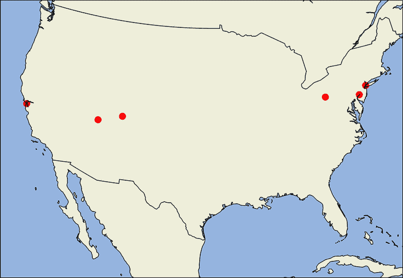

图 11.12 一张带有纬度和经度坐标的 Lambert 正形投影的美国视图

注意：当此代码首次运行时，Cartopy 会下载并安装 Lambert 正形投影。因此，执行代码需要互联网连接，尤其是在第一次执行时。

列表 11.17 绘制美国坐标

```
from cartopy.crs import LambertConformal           ❶

plt.figure(figsize=(12, 8))
ax = plt.axes(projection=LambertConformal())       ❷
us_extent = (-120, -75, 20, 50)                    ❸
ax.set_extent(us_extent)

ax.scatter(longitudes, latitudes, color='r',
           transform=PlateCarree(),                ❹
           s=100)                                  ❺
add_map_features()
plt.show()
```

❶ 导入 Lambert 正形圆锥投影

❷ ax 轴与 LambertConformal 坐标相对应。

❸ 美国范围位于经度 -120 到 -75 度之间，纬度 20 到 50 度之间。

❹ 将经度和纬度从 PlateCarree 兼容坐标转换为 ax.projection 兼容坐标（其中 ax.projection 等于 LambertConformal）。

❺ s 参数指定了绘制的标记大小。我们增加该大小以提高可见性。

我们的美国地图看起来有点稀疏。让我们通过调用 `ax.add_feature(cartopy.feature.STATES)`（图 11.13）来添加州边界。

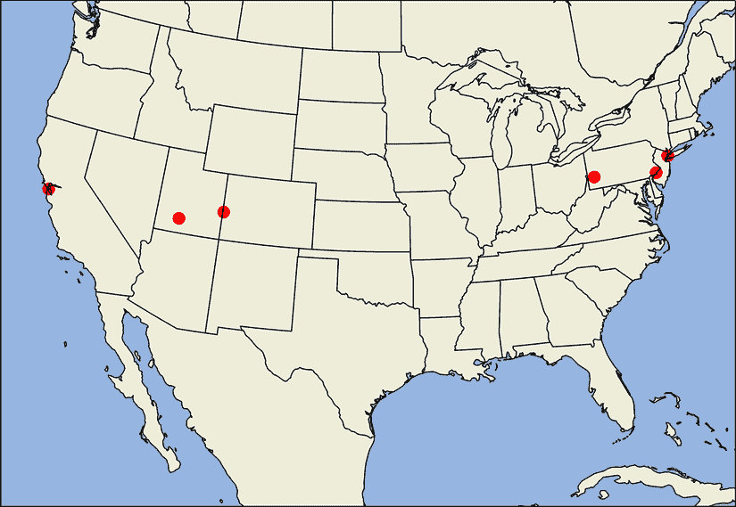

图 11.13 包含州边界的美国 Lambert 等角圆锥视图

列表 11.18 绘制包含州边界的美国地图

```
fig = plt.figure(figsize=(12, 8))
ax = plt.axes(projection=LambertConformal())
ax.set_extent(us_extent)

ax.scatter(longitudes, latitudes, color='r',
           transform=PlateCarree(),
           s=100)

ax.add_feature(cartopy.feature.STATES)
add_map_features()
plt.show()
```

常见 Cartopy 方法

+   `ax = plt.axes(projection=PlateCarree())`—创建一个自定义的 Matplotlib 轴，用于使用平板圆投影生成地图

+   `ax = plt.axes(projection=LambertConformal())`—创建一个自定义的 Matplotlib 轴，用于使用 Lambert 等角圆锥投影生成地图

+   `ax.coastlines()`—在地图上绘制大陆海岸线

+   `ax.add_feature(cartopy.feature.BORDERS)`—在地图上绘制国家边界

+   `ax.add_feature(cartopy.feature.STATES)`—在地图上绘制美国州边界

+   `ax.stock_img()`—使用地形信息为绘制的地图着色

+   `ax.add_feature(cartopy.feature.OCEAN)`—在地图上将所有海洋涂成蓝色

+   `ax.add_feature(cartopy.feature.LAND)`—在地图上将所有陆地涂成米色

+   `ax.set_global()`—将绘制的图像扩展到地球的四个边缘

+   `ax.set_extent(min_lon, max_lon, min_lat, max_lat)`—使用最小和最大纬度和经度调整绘制的地图范围，即地图上显示的地理区域

+   `ax.scatter(longitudes, latitudes)`—在地图上绘制纬度和经度坐标

+   `ax.scatter(longitudes, latitudes, transform=PlateCarree())`—在地图上绘制纬度和经度坐标，同时将数据从 `PlateCarree` 兼容坐标转换为不同的坐标（如 Lambert 等角圆锥坐标）

Cartopy 允许我们在地图上绘制任何位置。我们需要的只是位置的纬度和经度。当然，在地图上绘制它们之前，我们必须知道这些地理坐标，因此我们需要一个位置名称与其地理属性之间的映射。这个映射由 GeoNamesCache 位置跟踪库提供。

## 11.3 使用 GeoNamesCache 进行位置跟踪

GeoNames 数据库 ([`geonames.org`](http://geonames.org)) 是获取地理数据的优秀资源。GeoNames 包含超过 1100 万个地名，覆盖世界上所有国家。此外，GeoNames 还存储了诸如纬度和经度等有价值的信息。因此，我们可以使用数据库来确定文本中发现的城市的精确地理位置。

我们如何访问 GeoNames 数据？嗯，我们可以手动下载 GeoNames 数据库快照 ([`download.geonames.org/export/dump`](http://download.geonames.org/export/dump))，解析它，然后存储输出数据结构。这将需要大量工作。幸运的是，有人已经为我们做了这项艰苦的工作，创建了 GeoNamesCache 库。

GeoNamesCache 被设计用来高效地检索有关大陆、国家、城市以及美国县和州的数据。该库提供了六个易于使用的函数来支持对位置数据的访问：`get_continents`、`get_countries`、`get_cities`、`get_countries_by_name`、`get_cities_by_name` 和 `get_us_counties`。让我们安装这个库并更详细地探索其用法。我们首先初始化一个 `GeonamesCache` 位置跟踪对象。

注意 从命令行终端调用 `pip install geonamescache` 来安装 GeoNamesCache 库。

列表 11.19 初始化 `GeonamesCache` 对象

```
from geonamescache import GeonamesCache
gc = GeonamesCache()
```

让我们使用我们的 `gc` 对象来探索七个大洲。我们运行 `gc.get_continents()` 来检索一个包含大陆相关信息的字典。然后我们通过打印其键来调查字典的结构。

列表 11.20 从 GeoNamesCache 获取所有七个大洲

```
continents = gc.get_continents()
print(continents.keys())

dict_keys(['AF', 'AS', 'EU', 'NA', 'OC', 'SA', 'AN'])
```

字典键代表大陆名称的简写编码，其中 *非洲* 转换为 `'AF'`，*北美* 转换为 `'NA'`。让我们通过传递 *北美* 的代码来检查每个键映射的值。

注意 `continents` 是一个嵌套字典。因此，七个顶级键映射到特定内容的数据结构。列表 11.21 输出了 `continents['NA']` 字典中包含的特定内容键。

列表 11.21 从 GeoNamesCache 获取北美

```
north_america = continents['NA']
print(north_america.keys())

dict_keys(['lng', 'geonameId', 'timezone', 'bbox', 'toponymName',
'asciiName', 'astergdem', 'fcl', 'population', 'wikipediaURL',
'adminName5', 'srtm3', 'adminName4', 'adminName3', 'alternateNames',
'cc2', 'adminName2', 'name', 'fclName', 'fcodeName', 'adminName1',
'lat', 'fcode', 'continentCode'])
```

许多 `north_america` 数据元素代表北美大陆的各种命名方案。此类信息并不十分有用。

列表 11.22 打印北美命名方案

```
for name_key in ['name', 'asciiName', 'toponymName']:
    print(north_america[name_key])

North America
North America
North America
```

然而，其他元素持有更多价值。例如，`'lat'` 和 `'lng'` 键映射到北美最中心位置的纬度和经度。让我们在地图上可视化这个位置（图 11.14）。

列表 11.23 映射北美中央坐标

```
latitude = float(north_america['lat'])      ❶
longitude = float(north_america['lng'])

plt.figure(figsize=(12, 8))
ax = plt.axes(projection=PlateCarree())
ax.set_extent(north_america_extent)
ax.scatter([longitude], [latitude], s=200)
add_map_features()
plt.show()
```

❶ `lat` 和 `lng` 键映射到北美中央的纬度和经度。


图 11.14 北美中央纬度和经度在北美地图上的绘制

### 11.3.1 访问国家信息

访问大陆数据的能力是有用的，尽管我们的主要关注点是分析城市和国家。我们可以使用 `get_countries` 方法来分析国家。它返回一个字典，其中两个字符的键编码了 252 个不同国家的名称。与大陆一样，国家代码捕获了简写国家名称。例如，*加拿大* 的代码是 `'CA'`，*美国* 的代码是 `'US'`。访问 `gc.get_countries()['US']` 返回一个包含有用美国数据的字典。

列表 11.24 从 GeoNamesCache 获取美国数据

```
countries = gc.get_countries()
num_countries = len(countries)
print(f"GeonamesCache holds data for {num_countries} countries.")

us_data = countries['US']
print("The following data pertains to the United States:")
print(us_data)

GeonamesCache holds data for 252 countries.
The following data pertains to the United States:
{'geonameid': 6252001,
'name': 'United States',
'iso': 'US',
'iso3': 'USA',
'isonumeric': 840,
'fips': 'US',
'continentcode': 'NA',                   ❶
'capital': 'Washington',                 ❷
'areakm2': 9629091,                      ❸
'population': 310232863,                 ❹
'tld': '.us',
'currencycode': 'USD',
'currencyname': 'Dollar',                ❺
'phone': '1',
'postalcoderegex': '^\\d{5}(-\\d{4})?$',
'languages': 'en-US,es-US,haw,fr',       ❻
'neighbours': 'CA,MX,CU'}                ❼
```

❶ 美国大陆代码

❷ 美国首都

❸ 美国面积，以平方公里为单位

❹ 美国人口

❺ 美元货币

❻ 美国常用口语语言

❷ 美国邻近领土

输出的国家数据包括许多有用的元素，例如国家的首都、货币、面积、使用的语言和人口。遗憾的是，GeoNamesCache 未能提供与国家面积相关的中央纬度和经度。然而，正如我们很快将发现的，一个国家的中心性可以使用城市坐标来估计。

此外，每个国家的 `'neighbours'` 元素（拼写为英国英语）中也有有价值的信息。`'neighbours'` 键映射到一个逗号分隔的国家代码字符串，表示邻近领土。我们可以通过拆分字符串并将代码传递到 `'countries'` 字典中，来获取每个邻居的更多详细信息。

列表 11.25 获取邻近国家

```
us_neighbors = us_data['neighbours']
for neighbor_code in us_neighbors.split(','):
    print(countries[neighbor_code]['name'])

Canada
Mexico
Cuba
```

根据 GeoNamesCache，美国的直接邻国是加拿大、墨西哥和古巴。我们都可以同意前两个位置，尽管古巴是否是邻国还有待商榷。古巴并不直接与美国的边界相邻。此外，如果加勒比海岛国真的是邻国，为什么海地没有被包括在那个列表中？更重要的是，古巴最初是如何被包括在内的？好吧，GeoNames 是一个由一群编辑（就像以位置为重点的维基百科）运行的协作项目。在某个时候，一位编辑决定古巴是美国的一个邻国。有些人可能不同意这个决定，因此重要的是要记住 GeoNames 不是一个位置信息的黄金标准存储库。相反，它是一个快速访问大量位置数据的工具。其中一些数据可能不够精确，因此在使用 GeoNamesCache 时请谨慎。

`get_countries` 方法需要一个国家的两位代码。然而，对于大多数国家，我们可能不知道代码。幸运的是，我们可以使用 `get_countries_by_names` 方法按名称查询所有国家，该方法返回一个字典，其元素是国家名称而不是代码。

列表 11.26 按名称获取国家

```
result = gc.get_countries_by_names()['United States']
assert result == countries['US']
```

### 11.3.2 访问城市信息

现在，让我们将注意力转向分析城市。`get_cities` 方法返回一个字典，其键是唯一 ID，映射回城市数据。以下代码输出单个城市的数据。

列表 11.27 从 GeoNamesCache 获取`cities`

```
cities = gc.get_cities()
num_cities = len(cities)
print(f"GeoNamesCache holds data for {num_cities} total cities")
city_id = list(cities.keys())[0]
print(cities[city_id])
```

`cities` 是一个字典，将唯一的 `city_id` 映射到地理信息。

```
{'geonameid': 3041563,           ❶
'name': 'Andorra la Vella',      ❷
'latitude': 42.50779,            ❸
'longitude': 1.52109,            ❹
'countrycode': 'AD',             ❺
'population': 20430,             ❻
'timezone': 'Europe/Andorra'}    ❼
```

❶ 唯一城市 ID

❷ 城市名称

❸ 纬度

❹ 经度

❺ 该城市所在国家的代码

❻ 人口

❼ 时区

每个城市的数据包含城市名称、其纬度和经度、其人口以及该城市所在国家的参考代码。通过利用国家代码，我们可以创建一个国家与其所有领土城市之间的新映射。让我们隔离并计算存储在 GeoNamesCache 中的所有美国城市。

注意：正如我们之前讨论的，GeoNames 并不完美。数据库中可能缺少某些美国城市。随着时间的推移，这些城市将被添加。因此，观察到的城市数量可能会随着每个库更新而增加。

列表 11.28 从 GeoNamesCache 获取美国城市

```
us_cities = [city for city in cities.values()
             if city['countrycode'] == 'US']
num_us_cities = len(us_cities)
print(f"GeoNamesCache holds data for {num_us_cities} US cities.")

GeoNamesCache holds data for 3248 US cities
```

GeoNamesCache 包含关于 3000 多个美国城市的信息。每个城市的数据字典包含纬度和经度。让我们找到平均美国纬度和经度，这将近似美国的中心坐标。

注意，这种近似并不完美。计算出的平均值没有考虑到地球的曲率，并且城市位置被不适当地加权。美国城市中有不成比例的数量位于大西洋沿岸，因此近似结果偏向于东部。在以下代码中，我们近似并绘制了美国中心，同时完全意识到我们的近似并不理想（图 11.15）。

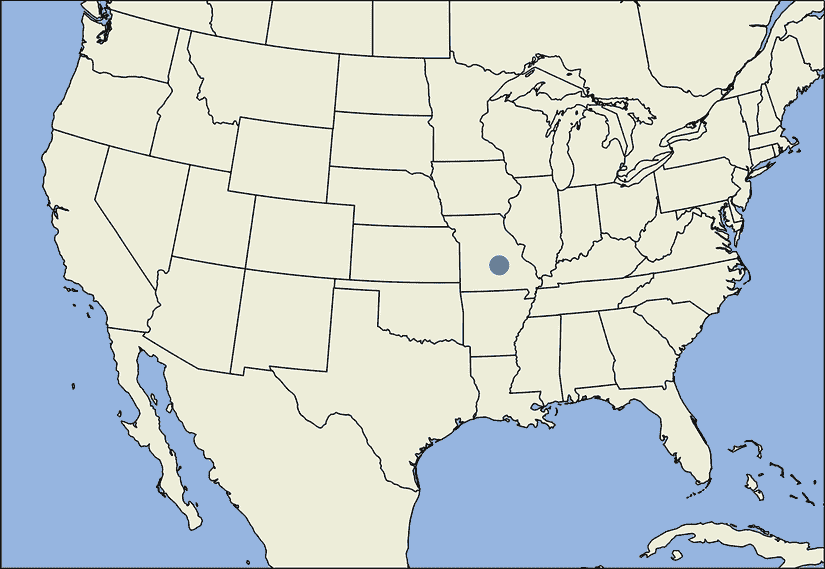

图 11.15 通过平均 GeoNamesCache 中每个美国城市的坐标，近似了美国的中心位置。近似结果略微偏向于东部。

列表 11.29 近似美国中心坐标

```
center_lat = np.mean([city['latitude']
                      for city in us_cities])
center_lon = np.mean([city['longitude']
                       for city in us_cities])

fig = plt.figure(figsize=(12, 8))
ax = plt.axes(projection=LambertConformal())
ax.set_extent(us_extent)
ax.scatter([center_lon], [center_lat], transform=PlateCarree(), s=200)
ax.add_feature(cartopy.feature.STATES)
add_map_features()
plt.show()
```

`get_cities`方法适合遍历城市信息，但不适合按名称查询城市。要按名称搜索，我们必须依赖于`get_cities_by_name`。此方法接受一个城市名称作为输入，并返回具有该名称的所有城市的输出数据列表。

列表 11.30 通过名称获取城市

```
matched_cities_by_name = gc.get_cities_by_name('Philadelphia')
print(matched_cities_by_name)

[{'4560349': {'geonameid': 4560349, 'name': 'Philadelphia',
'latitude': 39.95233, 'longitude': -75.16379, 'countrycode': 'US',
'population': 1567442, 'timezone': 'America/New_York'}}]
```

`get_cities_by_name`方法可能返回多个城市，因为城市名称并不总是唯一的。例如，GeoNamesCache 包含六个不同的城市名称“旧金山”实例，分别位于五个不同的国家。调用`gc.get_cities_by_name('San Francisco')`将返回这些旧金山实例中的每个实例的数据。让我们遍历这些数据并打印出每个旧金山所在的国家。

列表 11.31 获取具有相同名称的多个城市

```
matched_cities_list = gc.get_cities_by_name('San Francisco')

for i, san_francisco in enumerate(matched_cities_list):
    city_info = list(san_francisco.values())[0]
    country_code = city_info['countrycode']
    country = countries[country_code]['name']
    print(f"The San Francisco at index {i} is located in {country}")

The San Francisco at index 0 is located in Argentina
The San Francisco at index 1 is located in Costa Rica
The San Francisco at index 2 is located in Philippines
The San Francisco at index 3 is located in Philippines
The San Francisco at index 4 is located in El Salvador
The San Francisco at index 5 is located in United States
```

多个城市通常具有相同名称，选择这样的城市可能很困难。例如，假设有人通过搜索引擎查询“雅典的天气”。搜索引擎必须在这两个雅典之间做出选择：俄亥俄州的雅典和希腊的雅典。需要额外的上下文来正确区分这些位置。用户来自俄亥俄州吗？他们是否计划去希腊旅行？没有那个上下文，搜索引擎必须猜测。通常，最安全的猜测是人口最多的城市。从统计学的角度来看，人口较多的城市在日常对话中更有可能被引用。选择人口最多的城市并不保证总是有效，但仍然比完全随机选择要好。让我们看看当我们绘制人口最多的旧金山位置时会发生什么（图 11.16）。


图 11.16 在 GeoNamesCache 中存储的六个旧金山中，人口最多的城市位于加利福尼亚州，正如预期的那样。

列表 11.32 将人口最多的旧金山进行映射

```
best_sf = max(gc.get_cities_by_name('San Francisco'),
              key=lambda x: list(x.values())[0]['population'])
sf_data = list(best_sf.values())[0]
sf_lat = sf_data['latitude']
sf_lon = sf_data['longitude']

plt.figure(figsize=(12, 8))
ax = plt.axes(projection=LambertConformal())
ax.set_extent(us_extent)
ax.scatter(sf_lon, sf_lat, transform=PlateCarree(), s=200)
add_map_features()
ax.text(sf_lon + 1, sf_lat, ' San Francisco', fontsize=16, transform=PlateCarree())                                ❶
plt.show()
```

❶ ax.text 方法允许我们在指定的经纬度处写入 "San Francisco"。我们稍微将经度向右移动以避免与散点图点重叠。此外，在这张地图上，没有绘制州边界以更好地显示文字。

选择人口最多的旧金山返回的是众所周知的加利福尼亚州城市，而不是美国以外的任何不太知名的地方。

常见的 GeoNamesCache 方法

+   `gc = GeonamesCache()`—初始化一个 `GeonamesCache` 对象

+   `gc.get_continents()`—返回一个字典，将大陆 ID 映射到大陆数据

+   `gc.get_countries()`—返回一个字典，将国家 ID 映射到国家数据

+   `gc.get_countries_by_names()`—返回一个字典，将国家名称映射到国家数据

+   `gc.get_cities()`—返回一个字典，将城市 ID 映射到城市数据

+   `gc.get_cities_by_name(city_name)`—返回与名称 `city_name` 共享的城市列表

### 11.3.3 GeoNamesCache 库的局限性

GeoNamesCache 是一个有用的工具，但它确实有一些显著的缺陷。首先，该库的城市记录远非完整。农村地区（无论是美国的农村地区还是中国的农村地区）的一些人口稀少的地方缺失在存储的数据库记录中。此外，`get_cities_by_name` 方法仅将一个城市名称的版本映射到其地理数据。这对像纽约这样的有多个常用名称的城市来说是一个问题。

列表 11.33 从 GeoNamesCache 中获取纽约市

```
for ny_name in ['New York', 'New York City']:
    if not gc.get_cities_by_name(ny_name):
        print(f"'{ny_name}' is not present in the GeoNamesCache database")
    else:
        print(f"'{ny_name}' is present in the GeoNamesCache database")

'New York' is not present in the GeoNamesCache database
'New York City' is present in the GeoNamesCache database
```

由于城市名称中存在重音符号，单名称到城市的映射尤其成问题。*重音符号*是表示非英语发音单词正确发音的符号。它们在地名中很常见：例如，Cañon City，Colorado；以及 Hagåtña，Guam。

列表 11.34 从 GeoNamesCache 中获取带重音符号的城市

```
print(gc.get_cities_by_name(u'Cañon City'))
print(gc.get_cities_by_name(u'Hagåtña'))

[{'5416005': {'geonameid': 5416005, 'name': 'Cañon City',
'latitude': 38.44098, 'longitude': -105.24245, 'countrycode': 'US',
'population': 16400, 'timezone': 'America/Denver'}}]
[{'4044012': {'geonameid': 4044012, 'name': 'Hagåtña',
'latitude': 13.47567, 'longitude': 144.74886, 'countrycode': 'GU',
'population': 1051, 'timezone': 'Pacific/Guam'}}]
```

GeoNamesCache 中存储的城市中有多少包含名称中的重音符号？我们可以使用外部 Unidecode 库中的 `unidecode` 函数来找出答案。该函数从输入文本中删除所有重音符号。通过检查输入文本和输出文本之间的差异，我们应该能够检测到所有包含重音符号的城市名称。

注意：从命令行终端调用 `pip install Unidecode` 以安装 Unidecode 库。

列表 11.35 统计 GeoNamesCache 中所有带重音符号的城市

```
from unidecode import unidecode
accented_names = [city['name'] for city in gc.get_cities().values()
                  if city['name'] != unidecode(city['name'])]
num_accented_cities = len(accented_names)

print(f"An example accented city name is '{accented_names[0]}'")
print(f"{num_accented_cities} cities have accented names")

An example accented city name is 'Khawr Fakka-n'
4896 cities have accented names
```

大约 5,000 个存储的城市名称中包含重音符号。这些城市在发布的文本数据中通常不带重音符号被引用。确保我们匹配所有此类城市的一种方法是为备选城市名称创建一个字典；在其中，无重音的 `unidecode` 输出映射回原始的重音名称。

列表 11.36 从备选城市名称中去除重音符号

```
alternative_names = {unidecode(name): name
                     for name in accented_names}
print(gc.get_cities_by_name(alternative_names['Hagatna']))

[{'4044012': {'geonameid': 4044012, 'name': 'Hagåtña',
'latitude': 13.47567, 'longitude': 144.74886, 'countrycode': 'GU',
 'population': 1051, 'timezone': 'Pacific/Guam'}}]
```

当找到键匹配时，我们可以通过将带重音的字典值传递给 GeoNamesCache 来将清理后的字典键与所有输入文本进行匹配。

列表 11.37 在文本中查找不带重音的城市名称

```
text = 'This sentence matches Hagatna'
for key, value in alternative_names.items():
    if key in text:
        print(gc.get_cities_by_name(value))
        break

[{'4044012': {'geonameid': 4044012, 'name': 'Hagåtña',
 'latitude': 13.47567, 'longitude': 144.74886, 'countrycode': 'GU',
  'population': 1051, 'timezone': 'Pacific/Guam'}}]
```

GeoNamesCache 允许我们轻松跟踪地理位置及其地理坐标。使用该库，我们还可以在任意输入文本中搜索提到的地点名称。然而，在文本中查找名称并非易事。如果我们希望适当地匹配地点名称，我们必须学习适当的 Python 文本匹配技术，同时避免常见的陷阱。

注意：最后的子节旨在为不熟悉基本字符串匹配和正则表达式的读者提供。如果您已经熟悉这些技术，请随意跳过。

## 11.4 在文本中匹配地点名称

在 Python 中，我们可以轻松地确定一个字符串是否是另一个字符串的子串，或者字符串的起始部分是否包含某些预定义的文本。

列表 11.38 基本字符串匹配

```
assert 'Boston' in 'Boston Marathon'
assert 'Boston Marathon'.startswith('Boston')
assert 'Boston Marathon'.endswith('Boston') == False
```

不幸的是，Python 的基本字符串语法相当有限。例如，没有直接的方法来执行不区分大小写的子字符串比较。此外，Python 的字符串方法不能直接区分字符串中的子字符和句子中的子短语。因此，如果我们想确定短语 `'in a'` 是否存在于句子中，我们不能安全地依赖于基本匹配。否则，我们可能会错误地匹配字符序列，如 `'sin apple'` 或 `'win attached'`。

列表 11.39 基本子字符串匹配错误

```
assert 'in a' in 'sin apple'
assert 'in a' in 'win attached'
```

为了克服这些限制，我们必须依赖 Python 的内置正则表达式处理库 `re`。*正则表达式*（或简称为 *regex*）是一种字符串编码模式，可以与某些文本进行比较。编码的正则表达式模式范围从简单的字符串复制到极其复杂的公式，而很少有人能够解读。在本节中，我们专注于简单的正则表达式组合和匹配。

Python 中的大多数正则表达式匹配都可以使用 `re.search` 函数执行。该函数接受两个输入：一个正则表达式模式和将要对该模式进行匹配的文本。如果找到匹配项，则返回一个 `Match` 对象，否则返回 `None`。`Match` 对象包含一个 `start` 方法和一个 `end` 方法；这些方法返回匹配字符串在文本中的起始索引和结束索引。

列表 11.40 使用正则表达式进行字符串匹配

```
import re
regex = 'Boston'
random_text = 'Clown Patty'
match = re.search(regex, random_text)
assert match is None

matchable_text = 'Boston Marathon'
match = re.search(regex, matchable_text)
assert match is not None
start, end = match.start(), match.end()
matched_string = matchable_text[start: end]
assert matched_string == 'Boston'
```

此外，使用 `re.search` 进行不区分大小写的字符串匹配非常简单。我们只需将 `re.IGNORECASE` 作为额外的 `flags` 参数传递。

列表 11.41 使用正则表达式进行不区分大小写的匹配

```
for text in ['BOSTON', 'boston', 'BoSTOn']:
    assert re.search(regex, text, flags=re.IGNORECASE) is not None    ❶
```

❶ 我们可以通过将 flags=re.I 传递给 re.search 来达到相同的结果。

正则表达式还允许我们使用单词边界检测来匹配精确的单词。将 `\b` 模式添加到正则表达式字符串中可以捕获单词的开始和结束点（由空白和标点符号定义）。然而，由于反斜杠在标准的 Python 词汇中是一个特殊字符，我们必须采取措施确保反斜杠被解释为一个普通的原始字符。我们可以通过在反斜杠前添加另一个反斜杠（一种相当繁琐的方法）或者使用 `r` 文字前缀来做到这一点。后者确保正则表达式在分析期间被当作原始字符串处理。

列表 11.42 使用正则表达式进行单词边界匹配

```
for regex in ['\\bin a\\b', r'\bin a\b']:
    for text in ['sin apple', 'win attached']:
        assert re.search(regex, text) is None

    text = 'Match in a string'
    assert re.search(regex, text) is not None
```

现在，让我们进行一个更复杂的匹配。我们匹配的句子是 `f'I visited {city} yesterday'`，其中 `{city}` 代表三个可能的位置之一：波士顿、费城或旧金山。执行匹配的正确正则表达式语法是 `r'I visited \b(Boston|Philadelphia|San Francisco)\b yesterday'`。

注意：管道 `|` 是一个 *或* 条件。它要求正则表达式匹配列表中的三个城市之一。此外，括号限制了匹配城市的范围。如果没有它们，匹配的文本范围将延伸到 `'San Francisco'`，一直延伸到 `'San Francisco yesterday'`。

列表 11.43 使用正则表达式进行多城市匹配

```
regex = r'I visited \b(Boston|Philadelphia|San Francisco)\b yesterday.'
assert re.search(regex, 'I visited Chicago yesterday.') is None

cities = ['Boston', 'Philadelphia', 'San Francisco']
for city in cities:
    assert re.search(regex, f'I visited {city} yesterday.') is not None
```

最后，让我们讨论如何高效地运行正则表达式搜索。假设我们想要将正则表达式与 100 个字符串进行匹配。对于每个匹配项，`re.search` 将正则表达式转换为 Python 的 `PatternObject`。每次这样的转换都是计算成本高昂的。我们最好只使用 `re.compile` 执行一次转换，它返回一个编译后的 `PatternObject`。然后我们可以使用该对象的内置 `search` 方法，同时避免任何额外的编译。

注意：如果我们打算使用编译后的模式进行不区分大小写的匹配，我们必须将 `flags=re.IGNORECASE` 传递给 `re.compile`。

列表 11.44 使用编译后的正则表达式进行字符串匹配

```
compiled_re = re.compile(regex)
text = 'I visited Boston yesterday.'
for i in range(1000):
    assert compiled_re.search(text) is not None
```

常见正则表达式匹配技术

+   `match = re.search(regex, text)`—如果 `regex` 在 `text` 中存在，则返回一个 `Match` 对象，否则返回 `None`。

+   `match = re.search(regex, text, flags=re.IGNORECASE)`—如果 `regex` 在 `text` 中存在，则返回一个 `Match` 对象，否则返回 `None`。匹配操作不区分大小写。

+   `match.start()`—返回与输入文本匹配的正则表达式的开始索引。

+   `match.end()`—返回与输入文本匹配的正则表达式的结束索引。

+   `compiled_regex = re.compile(regex)`—将 `regex` 字符串转换为编译后的模式匹配对象。

+   `match = compiled_regex.search(text)`—使用编译对象的内置 `search` 方法将正则表达式与 `text` 进行匹配。

+   `re.compile('Boston')`—编译一个正则表达式以匹配文本中的字符串 `'Boston'`。

+   `re.compile('Boston', flags=re.IGNORECASE)`—编译一个正则表达式以匹配文本中的字符串 `'Boston'`。匹配不区分文本大小写。

+   `re.compile('\\bBoston\\b')`—编译一个正则表达式以匹配文本中的单词`'Boston'`。使用单词边界来执行精确的单词匹配。

+   `re.compile(r'\bBoston\b')`—编译一个正则表达式以匹配文本中的单词`'Boston'`。由于`r`字面量，输入的正则表达式被视为原始字符串。因此，我们不需要在我们的`\b`单词边界界定符中添加额外的反斜杠。

+   `re.compile(r'\b(Boston|Chicago)\b')`—编译一个正则表达式以匹配文本中的单词`'Boston'`或`'Chicago'`。

正则表达式匹配使我们能够在文本中找到地点名称。因此，`re`模块对于解决案例研究 3 将非常有价值。

## 摘要

+   地球上两点之间的最短旅行距离是沿着我们的球面。这个*大圆距离*可以通过一系列已知的三角运算来计算。

+   纬度和经度是*球面坐标*。这些坐标测量地球表面上一点相对于 x 轴和 y 轴的角位置。

+   我们可以使用 Cartopy 库在地图上绘制纬度和经度。该库可以使用多种投影类型可视化映射数据。我们的投影选择取决于绘制的数据。如果数据跨越全球，我们可以使用标准的*等角圆柱投影*。如果数据局限于北美洲，我们可能考虑使用*正射投影*。如果数据点位于美国大陆，我们应该使用*兰伯特圆锥投影*。

+   我们可以使用 GeoNamesCache 库从地点名称中获取经纬度。GeoNamesCache 将城市名称映射到经纬度。它还将国家名称映射到城市。因此，给定一个国家名称，我们可以通过平均其城市的经纬度来近似其中心坐标。然而，由于城市偏差和地球的弯曲形状，这种近似将不会完美。

+   多个城市通常共享相同的名称。因此，GeoNamesCache 可以将多个坐标映射到单个城市名称。如果只有一个城市名称而没有其他上下文，建议返回该名称人口最多的城市的坐标。

+   GeoNamesCache 将坐标映射到每个城市名称的重音版本。我们可以使用外部`Unidecode`库中的`unidecode`函数去除这些重音。

+   *正则表达式*可以在文本中找到地点名称。通过结合 GeoNamesCache、Cartopy 和正则表达式，我们可以绘制文本中提到的地点。
