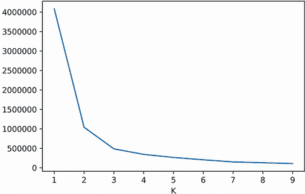
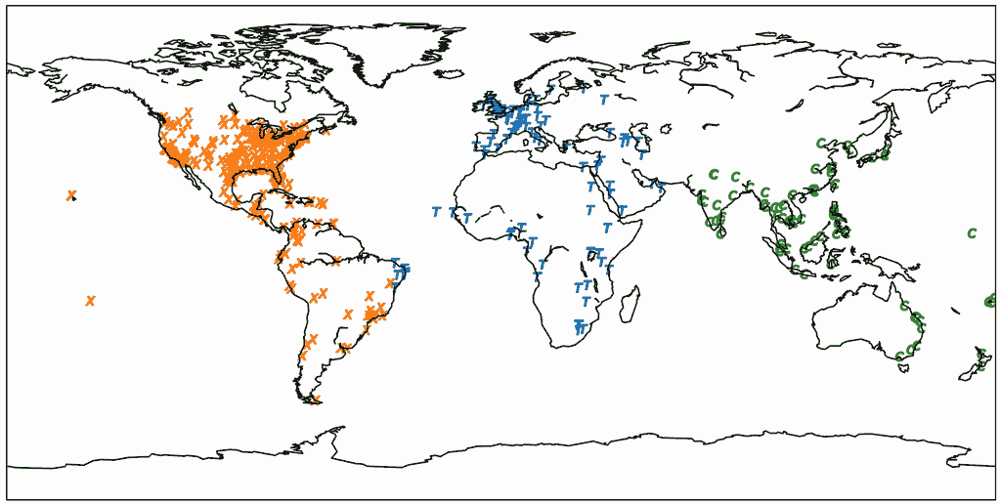
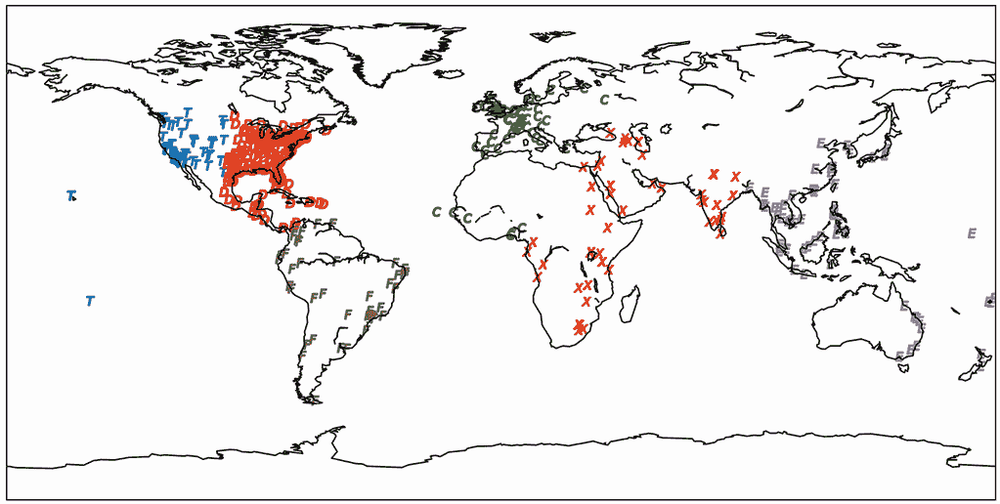
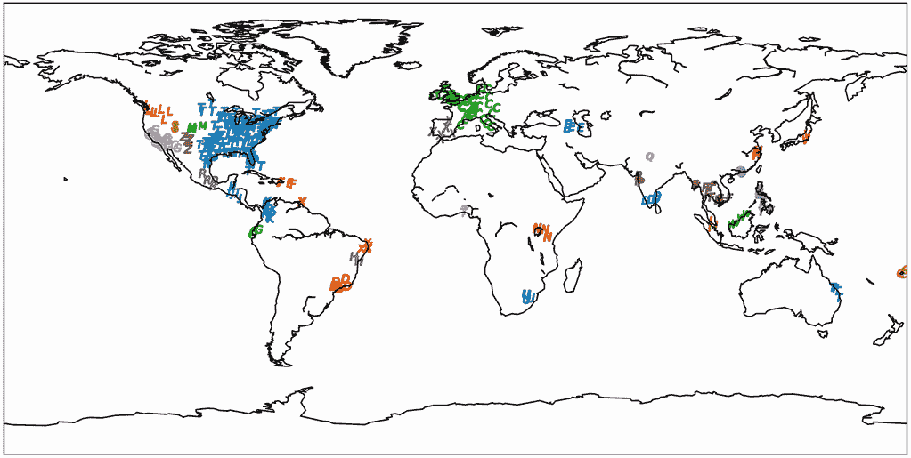
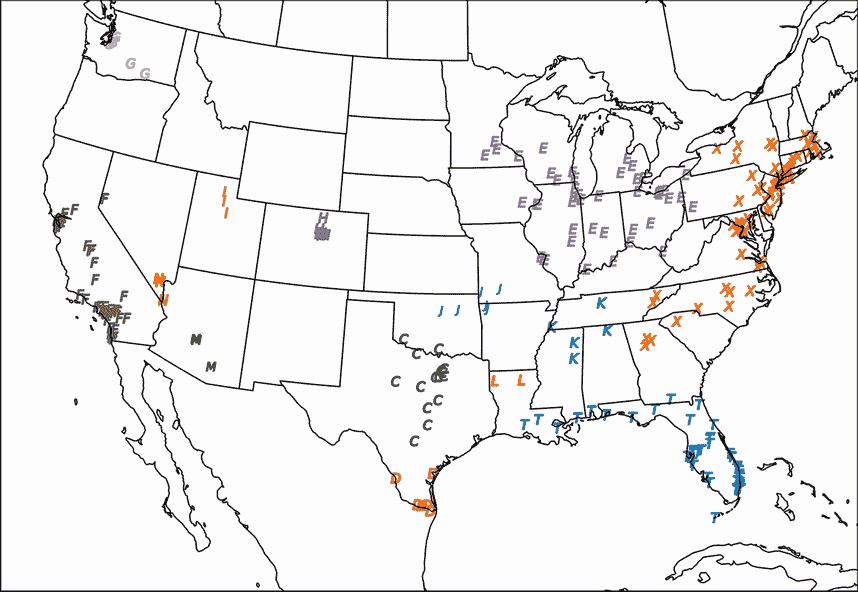
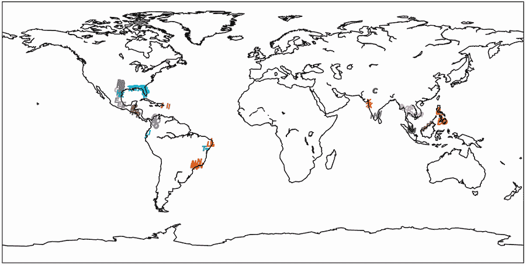

# 12 案例研究 3 解决方案

本节涵盖

+   提取和可视化位置

+   数据清理

+   位置聚类

我们的目标是从疾病相关的标题中提取位置，以揭示美国境内外的最大活跃疫情。我们将按以下步骤进行：

1.  加载数据。

1.  使用正则表达式和 GeoNamesCache 库从文本中提取位置。

1.  检查位置匹配是否存在错误。

1.  根据地理距离对位置进行聚类。

1.  在地图上可视化簇，并删除任何错误。

1.  从最大的簇中输出代表性位置以得出有趣的结论。

警告 揭示警报！案例研究 3 的解决方案即将揭晓。我强烈建议你在阅读解决方案之前尝试解决问题。原始问题陈述可在案例研究开头参考。

## 12.1 从标题数据中提取位置

我们首先加载标题数据。

列表 12.1 加载标题数据

```
headline_file = open('headlines.txt','r')
headlines = [line.strip()
             for line in headline_file.readlines()]
num_headlines = len(headlines)
print(f"{num_headlines} headlines have been loaded")

650 headlines have been loaded
```

我们已经加载了 650 个标题。现在我们需要一种机制从标题文本中提取城市和国家名称。一个简单的方法是将 GeoNamesCache 中的位置与每个标题进行匹配。然而，这种方法将无法匹配与存储在 GeoNamesCache 数据中不同的首字母大小写和重音符号的位置。为了更优化的匹配，我们应该将每个位置名称转换为不区分大小写和不区分重音的正则表达式。我们可以使用自定义的 `name_to_regex` 函数执行这些转换。该函数接受一个位置名称作为输入，并返回一个编译后的正则表达式，能够识别我们选择的任何位置。

列表 12.2 将名称转换为正则表达式

```
def name_to_regex(name):
    decoded_name = unidecode(name)
    if name != decoded_name:
        regex = fr'\b({name}|{decoded_name})\b'
    else:
        regex = fr'\b{name}\b'
    return re.compile(regex, flags=re.IGNORECASE)
```

使用 `name_to_regex`，我们可以创建正则表达式与 GeoNamesCache 中的原始名称之间的映射。让我们创建两个字典，`country_to_name` 和 `city_to_name`，分别将正则表达式映射到国家名称和城市名称。

列表 12.3 将名称映射到正则表达式

```
countries = [country['name']
             for country in gc.get_countries().values()]
country_to_name = {name_to_regex(name): name
                   for name in countries}

cities = [city['name'] for city in gc.get_cities().values()]
city_to_name = {name_to_regex(name): name for name in cities}
```

接下来，我们使用我们的映射定义一个函数，该函数在文本中查找位置名称。该函数接受标题和位置字典作为输入。它遍历字典中的每个正则表达式键，如果正则表达式模式与标题匹配，则返回关联的值。

列表 12.4 在文本中查找位置

```
def get_name_in_text(text, dictionary):
    for regex, name in sorted(dictionary.items(),
                              key=lambda x: x[1]):     ❶
        if regex.search(text):
            return name
    return None
```

❶ 遍历字典给我们一个非确定性的结果序列。序列顺序的改变可能会改变与输入文本匹配的位置。这在文本中存在多个位置时尤其如此。按位置名称排序确保函数输出在每次运行之间不会改变。

我们使用 `get_name_in_text` 来发现 `headlines` 列表中提到的城市和国家。然后我们将结果存储在 Pandas 表中，以便于分析。

列表 12.5 在标题中查找位置

```
import pandas as pd

matched_countries = [get_name_in_text(headline, country_to_name)
                     for headline in headlines]
matched_cities = [get_name_in_text(headline, city_to_name)
                  for headline in headlines]
data = {'Headline': headlines, 'City': matched_cities,
        'Country': matched_countries}
df = pd.DataFrame(data)
```

让我们探索我们的位置表。我们首先使用 `describe` 方法总结 `df` 的内容。

列表 12.6 总结位置数据

```
summary = df[['City', 'Country']].describe()
print(summary)

       City Country
count   619      15
unique  511      10
top      Of  Brazil
freq     45       3
```

注意数据中多个国家共享最高的发生频率为 3。Pandas 没有确定性的方法来选择一个国家而不是另一个国家作为顶级国家。根据您的本地设置，除了巴西以外的国家可能会被返回为顶级国家，但它仍然具有频率 3。

表格包含 619 个城市的提及，代表 511 个独特的城市名称。它还包含 15 个国家，代表 10 个独特的国家名称。最常提到的国家是巴西，它在三个标题中出现。

最常提到的城市显然是“Of”，土耳其。这似乎不太对！45 个“Of”的实例更有可能匹配介词而不是很少被引用的土耳其位置。我们将输出一些“Of”的实例以确认错误。

列表 12.7 获取名为 `"Of"` 的城市

```
of_cities = df[df.City == 'Of'][['City', 'Headline']]
ten_of_cities = of_cities.head(10)
print(ten_of_cities.to_string(index=False))     ❶

City                                           Headline
  Of              Case of Measles Reported in Vancouver
  Of  Authorities are Worried about the Spread of Br...
  Of  Authorities are Worried about the Spread of Ma...
  Of  Rochester authorities confirmed the spread of ...
  Of     Tokyo Encounters Severe Symptoms of Meningitis
  Of  Authorities are Worried about the Spread of In...
  Of            Spike of Pneumonia Cases in Springfield
  Of  The Spread of Measles in Spokane has been Conf...
  Of                    Outbreak of Zika in Panama City
  Of    Urbana Encounters Severe Symptoms of Meningitis
```

❶ 将 df 转换为字符串，其中已删除行索引。这导致打印输出更加简洁。

是的，我们对“Of”的匹配肯定是有误的。我们可以通过确保所有匹配项都为大写来修复错误。然而，观察到的错误是一个更大问题的症状：在所有错误匹配的标题中，我们匹配到了“Of”，但没有匹配到实际的城市名称。这是因为我们没有考虑到标题中的多个匹配。标题中包含多个匹配的频率有多高？让我们找出答案。我们将使用额外的 `Cities` 列跟踪标题中所有匹配城市的列表。

列表 12.8 查找多城市标题

```
def get_cities_in_headline(headline):                           ❶
    cities_in_headline = set()
    for regex, name in city_to_name.items():
        match = regex.search(headline)
        if match:
            if headline[match.start()].isupper():               ❷
                cities_in_headline.add(name)

    return list(cities_in_headline)

df['Cities'] = df['Headline'].apply(get_cities_in_headline)     ❸
df['Num_cities'] = df['Cities'].apply(len)                      ❹
df_multiple_cities = df[df.Num_cities > 1]                      ❺
num_rows, _ = df_multiple_cities.shape
print(f"{num_rows} headlines match multiple cities")

67 headlines match multiple cities                              ❻
```

❶ 返回一个包含所有唯一城市的列表

❷ 确保城市名称的首字母大写

❸ 通过使用 apply 方法向表格中添加一个 Cities 列，该方法将输入的函数应用于列中的所有元素以创建一个全新的列

❹ 添加一个列，用于计算标题中的城市数量

❺ 过滤掉不包含多个城市匹配的行

❻ 城市计数可能会随着 GeoNamesCache 库的数据更新而增加。

我们发现 67 个标题包含多个城市，这代表了大约 10% 的数据。为什么这么多标题与多个位置匹配？也许探索一些样本匹配将得出答案。

列表 12.9 多城市标题的采样

```
ten_cities = df_multiple_cities[['Cities', 'Headline']].head(10)
print(ten_cities.to_string(index=False))

Cities                          Headline
[York, New York City]           Could Zika Reach New York City?
[Miami Beach, Miami]            First Case of Zika in Miami Beach
[San Juan, San]                 San Juan reports 1st U.S. Zika-related death amid outbreak
[Los Angeles, Los Ángeles]      New Los Angeles Hairstyle goes Viral
[Bay, Tampa]                    Tampa Bay Area Zika Case Count Climbs
[Ho Chi Minh City, Ho]          Zika cases in Vietnam's Ho Chi Minh City surge
[San, San Diego]                Key Zika Findings in San Diego Institute
[Hīt, Kuala Lumpur]             Kuala Lumpur is Hit By Zika Threat
[San, San Francisco]            Zika Virus Reaches San Francisco
[Salvador, San, San Salvador]   Zika worries in San Salvador
```

看起来，短的无效城市名称正在与较长的正确位置名称一起匹配标题。例如，城市 `'San'` 总是与更合法的城市名称如 `'San Francisco'` 和 `'San Salvador'` 一起返回。我们如何修复这个错误？一个解决方案是在找到多个匹配城市时只返回最长的城市名称。

列表 12.10 选择最长的城市名称

```
def get_longest_city(cities):
    if cities:
        return max(cities, key=len)
    return None

df['City'] = df['Cities'].apply(get_longest_city)
```

作为一项合理性检查，我们将输出包含短城市名称（四个字符或更少）的行，以确保不会将错误的短名称分配给我们的标题之一。

列表 12.11 打印最短的城市名称

```
short_cities = df[df.City.str.len() <= 4][['City', 'Headline']]
print(short_cities.to_string(index=False))

 City                                           Headline
 Lima                Lima tries to address Zika Concerns
 Pune                     Pune woman diagnosed with Zika
 Rome  Authorities are Worried about the Spread of Ma...
 Molo                Molo Cholera Spread Causing Concern
 Miri                               Zika arrives in Miri
 Nadi  More people in Nadi are infected with HIV ever...
 Baud  Rumors about Tuberculosis Spreading in Baud ha...
 Kobe                     Chikungunya re-emerges in Kobe
 Waco                More Zika patients reported in Waco
 Erie                        Erie County sets Zika traps
 Kent                       Kent is infested with Rabies
 Reno  The Spread of Gonorrhea in Reno has been Confi...
 Sibu                      Zika symptoms spotted in Sibu
 Baku    The Spread of Herpes in Baku has been Confirmed
 Bonn  Contaminated Meat Brings Trouble for Bonn Farmers
 Jaen                         Zika Troubles come to Jaen
 Yuma                       Zika seminars in Yuma County
 Lyon                   Mad Cow Disease Detected in Lyon
 Yiwu  Authorities are Worried about the Spread of He...
 Suva  Suva authorities confirmed the spread of Rotav...
```

结果看起来是合法的。现在让我们将注意力从城市转移到国家。只有 15 个总标题包含实际的国家信息。这个数量足够低，我们可以手动检查所有这些标题。

列表 12.12 获取包含国家的标题

```
df_countries = df[df.Country.notnull()][['City',      ❶
                                         'Country',
                                         'Headline']]
print(df_countries.to_string(index=False))

            City     Country                                  Headline
           Recife     Brazil            Mystery Virus Spreads in Recife, Brazil
 Ho Chi Minh City    Vietnam     Zika cases in Vietnam's Ho Chi Minh City surge
          Bangkok   Thailand                     Thailand-Zika Virus in Bangkok
       Piracicaba     Brazil                Zika outbreak in Piracicaba, Brazil
            Klang   Malaysia                   Zika surfaces in Klang, Malaysia
   Guatemala City  Guatemala  Rumors about Meningitis spreading in Guatemala...
      Belize City     Belize                 Belize City under threat from Zika
         Campinas     Brazil                   Student sick in Campinas, Brazil
      Mexico City     Mexico               Zika outbreak spreads to Mexico City
    Kota Kinabalu   Malaysia           New Zika Case in Kota Kinabalu, Malaysia
      Johor Bahru   Malaysia                 Zika reaches Johor Bahru, Malaysia
        Hong Kong  Hong Kong                    Norovirus Exposure in Hong Kong
      Panama City     Panama                    Outbreak of Zika in Panama City
        Singapore  Singapore                  Zika cases in Singapore reach 393
      Panama City     Panama             Panama City’s first Zika related death
```

❶ df.Country.notnull()方法返回一个布尔值列表。每个布尔值只有在相关行中存在国家时才等于 True。

所有包含国家的标题也包含城市信息。因此，我们可以不依赖于国家的中心坐标来分配纬度和经度。因此，我们可以从我们的分析中忽略国家名称。

列表 12.13 从表中删除国家

```
df.drop('Country', axis=1, inplace=True)
```

我们几乎准备好将纬度和经度添加到我们的表中。然而，我们首先需要考虑没有检测到位置的那些行。让我们计算未匹配标题的数量，然后打印该数据的一个子集。

列表 12.14 探索未匹配的标题

```
df_unmatched = df[df.City.isnull()]
num_unmatched = len(df_unmatched)
print(f"{num_unmatched} headlines contain no city matches.")
print(df_unmatched.head(10)[['Headline']].values)

39 headlines contain no city matches.
[['Louisiana Zika cases up to 26']
 ['Zika infects pregnant woman in Cebu']
 ['Spanish Flu Sighted in Antigua']
 ['Zika case reported in Oton']
 ['Hillsborough uses innovative trap against Zika 20 minutes ago']
 ['Maka City Experiences Influenza Outbreak']
 ['West Nile Virus Outbreak in Saint Johns']
 ['Malaria Exposure in Sussex']
 ['Greenwich Establishes Zika Task Force']
 ['Will West Nile Virus vaccine help Parsons?']]
```

大约 6%的标题与任何城市都不匹配。其中一些标题提到了合法的城市，GeoNamesCache 未能识别。我们应该如何处理这些缺失的城市？嗯，鉴于它们的低频率，也许我们应该删除这些缺失的提及。这些删除的代价是数据质量略有下降，但这一损失不会显著影响我们的结果，因为我们对匹配城市的覆盖范围相当高。

列表 12.15 删除未匹配的标题

```
df = df[~df.City.isnull()][['City', 'Headline']]     ❶
```

❶ ~符号反转了 df.City.isnull()方法返回的列表中的布尔值。因此，每个反转的布尔值只有在相关行中存在城市时才等于 True。

## 12.2 可视化和聚类提取的位置数据

我们表格中的所有行都包含一个城市名称。现在我们可以为每一行分配纬度和经度。我们使用`get_cities_by_name`来返回具有提取的城市名称的最人口密集城市的坐标。

列表 12.16 为城市分配地理坐标

```
latitudes, longitudes = [], []
for city_name in df.City.values:
    city = max(gc.get_cities_by_name(city_name),
              key=lambda x: list(x.values())[0]['population'])   ❶
    city = list(city.values())[0]                                ❷
    latitudes.append(city['latitude'])
    longitudes.append(city['longitude'])

df = df.assign(Latitude=latitudes, Longitude=longitudes)         ❸
```

❶ 选择具有最大人口的匹配城市

❷ 提取城市纬度和经度

❸ 将纬度和经度列添加到我们的表中

分配了纬度和经度后，我们可以尝试对数据进行聚类。让我们在我们的 2D 坐标集中执行 K-means。我们使用肘部方法来选择一个合理的*K*值（图 12.1）。



图 12.1 地理肘部曲线指向一个*K*值为 3

列表 12.17 绘制地理肘部曲线

```
coordinates = df[['Latitude', 'Longitude']].values
k_values = range(1, 10)
inertia_values = []
for k in k_values:
    inertia_values.append(KMeans(k).fit(coordinates).inertia_)
plt.plot(range(1, 10), inertia_values)
plt.xlabel('K')
plt.ylabel('Inertia')
plt.show()
```

我们的肘部图中的“肘部”指向一个*K*值为 3。这个*K*值非常低，限制了我们的范围最多只有三个不同的地理区域。尽管如此，我们仍然应该对我们的分析方法论保持一定的信心。我们将位置聚类成三个组，并在地图上绘制它们（图 12.2）。



图 12.2 地理 K-means 城市聚类图。*K*设置为 3。三个聚类分布在六个大洲上。

列表 12.18 使用 K-means 将城市聚类成三个组

```
def plot_clusters(clusters, longitudes, latitudes):    ❶
    plt.figure(figsize=(12, 10))
    ax = plt.axes(projection=PlateCarree())
    ax.coastlines()
    ax.scatter(longitudes, latitudes, c=clusters)
    ax.set_global()
    plt.show()

df['Cluster'] = KMeans(3).fit_predict(coordinates)
plot_clusters(df.Cluster, df.Longitude, df.Latitude)
```

❶ 此函数将在我们分析的其他部分重复使用以绘制聚类。

注意：图 12.1 至 12.5 中的标记形状已被手动调整，以便在书的黑白印刷版本中区分聚类。

结果看起来相当荒谬。我们的三个聚类覆盖

+   北美洲和南美洲

+   非洲和欧洲

+   亚洲和澳大利亚

这些大陆分类过于宽泛，没有实际用途。此外，所有南美洲东海岸的城市都尴尬地与非洲和欧洲的位置聚类在一起（尽管它们之间有一个整个海洋）。这些聚类对理解数据没有帮助。也许我们的*K*确实太低了。让我们忽略我们的肘部分析，将*K*的大小加倍到 6（图 12.3）。



图 12.3 K-means 城市聚类的映射。*K*设置为 6。非洲的聚类点被错误地分在了欧洲和亚洲大陆之间。

列表 12.19 使用 K-means 将城市聚类成六个组

```
df['Cluster'] = KMeans(6).fit_predict(coordinates)
plot_clusters(df.Cluster, df.Longitude, df.Latitude)
```

增加参数*K*可以提高北美洲和南美洲的聚类效果。南美洲现在落入了它自己的单独聚类中，而北美洲则被分为两个西部和东部聚类组。然而，在大西洋的另一侧，聚类质量仍然很低。非洲的地理位置被错误地分在了欧洲和亚洲之间。K-means 的中心感无法正确区分非洲、欧洲和亚洲。也许算法对欧几里得距离的依赖阻止了它捕捉到分布在我们地球曲面上点的相互关系。

作为一种替代方法，我们可以尝试执行 DBSCAN 聚类。DBSCAN 算法接受我们选择的任何距离度量，允许我们在点之间的大圆距离上进行聚类。我们首先编写一个以 NumPy 数组为输入的大圆距离函数。

列表 12.20 定义基于 NumPy 的大圆度量

```
def great_circle_distance(coord1, coord2, radius=3956):    ❶
    if np.array_equal(coord1, coord2):
        return 0.0

    coord1, coord2 = np.radians(coord1), np.radians(coord2)
    delta_x, delta_y = coord2 - coord1
    haversin = sin(delta_x / 2) ** 2 + np.product([cos(coord1[0]),
                                                   cos(coord2[0]),
                                                   sin(delta_y / 2) ** 2])
    return  2 * radius * asin(haversin ** 0.5)
```

❶ 半径预设为地球的英里半径。

我们已经定义了我们的距离度量，并且几乎准备好运行 DBSCAN 算法。然而，首先我们需要为`eps`和`min_samples`参数选择合理的值。让我们假设以下情况：一个全球城市聚类至少包含三个城市，这些城市之间的平均距离不超过 250 英里。基于这些假设，我们将 250 和 3 分别输入到`eps`和`min_samples`中。

列表 12.21 使用 DBSCAN 聚类城市

```
metric = great_circle_distance
dbscan = DBSCAN(eps=250, min_samples=3, metric=metric)
df['Cluster'] = dbscan.fit_predict(coordinates)
```

DBSCAN 将-1 分配给那些没有聚类的异常数据点。让我们从我们的表中移除这些异常值，然后绘制剩余的结果（图 12.4）。



图 12.4 使用大圆距离度量计算的城市 DBSCAN 聚类映射

列表 12.22 绘制非异常 DBSCAN 聚类

```
df_no_outliers = df[df.Cluster > -1]
plot_clusters(df_no_outliers.Cluster, df_no_outliers.Longitude,
              df_no_outliers.Latitude)
```

DBSCAN 在南美洲、亚洲和南部非洲的部分地区生成离散集群做得相当不错。然而，美国东部却落入一个过于密集的单个集群中。这是为什么？部分原因是西方媒体中存在某种叙事偏见，这意味着美国事件更有可能获得报道。这导致提到的位置分布更密集。克服地理偏见的一种方法是用更严格的 epsilon 参数重新聚类美国城市。在我们的问题陈述的背景下，这种策略似乎是合理的，它要求从美国和全球分组标题中分别获取顶级集群。因此，我们将独立于世界其他地区聚类美国位置。为此，我们首先为每个城市分配国家代码。

列表 12.23 为城市分配国家代码

```
def get_country_code(city_name):
    city = max(gc.get_cities_by_name(city_name),
               key=lambda x: list(x.values())[0]['population'])
    return list(city.values())[0]['countrycode']

df['Country_code'] = df.City.apply(get_country_code)
```

国家代码使我们能够将数据分为两个不同的`DataFrame`对象。第一个对象`df_us`包含美国位置。第二个对象`df_not_us`包含所有剩余的全球城市。

列表 12.24 分离美国和全球城市

```
df_us = df[df.Country_code == 'US']
df_not_us = df[df.Country_code != 'US']
```

我们已经将美国和非美国城市分开。现在我们需要重新聚类两个分离表中的坐标。由于删除所有美国位置导致的密度变化，重新聚类`df_not_us`是不可避免的。然而，我们在聚类该表时保持`eps`为 250。同时，我们将`df_us`的`eps`减半（至 125），以承认美国位置的更紧密密度。最后，我们在重新聚类后删除所有异常值。

列表 12.25 重新聚类提取的城市

```
def re_cluster(input_df, eps):
    input_coord = input_df[['Latitude', 'Longitude']].values
    dbscan = DBSCAN(eps=eps, min_samples=3,
                    metric=great_circle_distance)
    clusters = dbscan.fit_predict(input_coord)
    input_df = input_df.assign(Cluster=clusters)
    return input_df[input_df.Cluster > -1]

df_not_us = re_cluster(df_not_us, 250)
df_us = re_cluster(df_us, 125)
```

## 12.3 从位置集群中提取见解

让我们调查`df_not_us`表中的聚类数据。我们首先使用 Pandas 的`groupby`方法对结果进行分组。

列表 12.26 按集群分组城市

```
groups = df_not_us.groupby('Cluster')
num_groups = len(groups)
print(f"{num_groups} Non-US clusters have been detected")

31 Non-US clusters have been detected
```

已经检测到 31 个全球集群。让我们按大小对这些组进行排序，并计算最大集群中的标题数量。

列表 12.27 寻找最大集群

```
sorted_groups = sorted(groups, key=lambda x: len(x[1]),
                       reverse=True)
group_id, largest_group = sorted_groups[0]
group_size = len(largest_group)
print(f"Largest cluster contains {group_size} headlines")

Largest cluster contains 51 headlines
```

最大的集群包含 51 个总标题。逐个阅读所有这些标题将是一个耗时过程。我们可以通过只输出代表集群中最中心位置的标题来节省时间。中心性可以通过计算一个组的平均纬度和经度来捕捉。然后我们可以计算每个位置与平均坐标之间的距离。较短的距离表示更高的中心性。

注意：正如我们在第十一部分中讨论的那样，平均纬度和经度仅近似中心，因为它们没有考虑地球的曲率。

接下来，我们定义一个`compute_centrality`函数，该函数将一个`Distance_to_center`列分配给一个输入的组。

列表 12.28 计算集群中心性

```
def compute_centrality(group):
    group_coords = group[['Latitude', 'Longitude']].values
    center = group_coords.mean(axis=0)
    distance_to_center = [great_circle_distance(center, coord)
                          for coord in group_coords]
    group['Distance_to_center'] = distance_to_center
```

我们现在可以按中心性对所有标题进行排序。让我们打印出我们最大集群中五个最中心的标题。

列表 12.29 在最大集群中寻找中心标题

```
def sort_by_centrality(group):
    compute_centrality(group)
    return group.sort_values(by=['Distance_to_center'], ascending=True)

largest_group = sort_by_centrality(largest_group)
for headline in largest_group.Headline.values[:5]:
    print(headline)

Mad Cow Disease Disastrous to Brussels
Scientists in Paris to look for answers
More Livestock in Fontainebleau are infected with Mad Cow Disease
Mad Cow Disease Hits Rotterdam
Contaminated Meat Brings Trouble for Bonn Farmers
```

`largest_group` 中的中心标题集中在欧洲各城市爆发疯牛病。我们可以通过输出与聚类中城市相关的顶级国家来确认该聚类的地理位置集中在欧洲。

列表 12.30 在最大聚类中找到前三个国家

```
from collections import Counter
def top_countries(group):
    countries = [gc.get_countries()[country_code]['name']
                 for country_code in group.Country_code.values]
    return Counter(countries).most_common(3)                    ❶

print(top_countries(largest_group))

[('United Kingdom', 19), ('France', 7), ('Germany', 6)]
```

❶ Counter 类跟踪列表中最常重复的元素及其计数。

在 `largest_group` 中最常提到的城市位于英国、法国和德国。`largest_group` 中的大多数位置肯定在欧洲。

让我们在四个下一个最大的全球聚类中重复此分析。以下代码有助于确定是否有其他疾病流行目前正威胁着全球。

列表 12.31 总结最大聚类中的内容

```
for _, group in sorted_groups[1:5]:
    sorted_group = sort_by_centrality(group)
    print(top_countries(sorted_group))
    for headline in sorted_group.Headline.values[:5]:
        print(headline)
    print('\n')

[('Philippines', 16)]
Zika afflicts patient in Calamba
Hepatitis E re-emerges in Santa Rosa
More Zika patients reported in Indang
Batangas Tourism Takes a Hit as Virus Spreads
Spreading Zika reaches Bacoor

[('El Salvador', 3), ('Honduras', 2), ('Nicaragua', 2)]
Zika arrives in Tegucigalpa
Santa Barbara tests new cure for Hepatitis C
Zika Reported in Ilopango
More Zika cases in Soyapango
Zika worries in San Salvador

[('Thailand', 5), ('Cambodia', 3), ('Vietnam', 2)]
More Zika patients reported in Chanthaburi
Thailand-Zika Virus in Bangkok
Zika case reported in Phetchabun
Zika arrives in Udon Thani
More Zika patients reported in Kampong Speu

[('Canada', 10)]
Rumors about Pneumonia spreading in Ottawa have been refuted
More people in Toronto are infected with Hepatitis E every year
St. Catharines Patient in Critical Condition after Contracting Dengue
Varicella has Arrived in Milton
Rabies Exposure in Hamilton
```

哎呀！Zika 正在菲律宾蔓延！东南亚和中美洲也有 Zika 爆发。然而，加拿大聚类包含了一系列随机的疾病标题，这表明在那个北方领土没有发生主要的爆发。

让我们把注意力转向美国聚类。我们首先在美国地图上可视化这些聚类（图 12.5）。



图 12.5 在美国边界内映射 DBSCAN 位置聚类

列表 12.32 绘制 US DBSCAN 聚类

```
plt.figure(figsize=(12, 10))
ax = plt.axes(projection=LambertConformal())
ax.set_extent(us_extent)
ax.scatter(df_us.Longitude, df_us.Latitude, c=df_us.Cluster,
              transform=PlateCarree())
ax.coastlines()
ax.add_feature(cartopy.feature.STATES)
plt.show()
```

可视化地图产生了合理的输出。东部各州不再落入一个单一的密集聚类中。我们将通过打印这些按中心性排序的标题来分析前五个美国聚类。

列表 12.33 总结最大美国聚类中的内容

```
us_groups = df_us.groupby('Cluster')
us_sorted_groups = sorted(us_groups, key=lambda x: len(x[1]),
                         reverse=True)
for _, group in us_sorted_groups[:5]:
    sorted_group = sort_by_centrality(group)
    for headline in sorted_group.Headline.values[:5]:
        print(headline)
    print('\n')

Schools in Bridgeton Closed Due to Mumps Outbreak
Philadelphia experts track pandemic
Vineland authorities confirmed the spread of Chlamydia
Baltimore plans for Zika virus
Will Swine Flu vaccine help Annapolis?
Bradenton Experiences Zika Troubles
Tampa Bay Area Zika Case Count Climbs
Zika Strikes St. Petersburg
New Zika Case Confirmed in Sarasota County
Zika spreads to Plant City

Rhinovirus Hits Bakersfield
Schools in Tulare Closed Due to Mumps Outbreak
New medicine wipes out West Nile Virus in Ventura
Hollywood Outbreak Film Premieres
Zika symptoms spotted in Hollywood

How to Avoid Hepatitis E in South Bend
Hepatitis E Hits Hammond
Chicago's First Zika Case Confirmed
Rumors about Hepatitis C spreading in Darien have been refuted
Rumors about Rotavirus Spreading in Joliet have been Refuted

More Zika patients reported in Fort Worth
Outbreak of Zika in Stephenville
Zika symptoms spotted in Arlington
Dallas man comes down with case of Zika
Zika spreads to Lewisville
```

Zika 疫情已经袭击了佛罗里达州和德克萨斯州！这非常令人担忧。然而，其他顶级聚类中并没有明显的疾病模式。目前，正在蔓延的 Zika 爆发仅限于美国南部。我们将立即向我们的上级报告，以便他们采取适当的行动。在我们准备展示我们的发现时，让我们绘制一个最终的图像，该图像将出现在我们报告的首页（图 12.6）。此图像总结了正在蔓延的 Zika 疫情的威胁范围：它显示了所有提到 Zika 的文章标题中超过 50% 的美国和全球聚类。



图 12.6 提到 Zika 的文章标题中超过 50% 的 DBSCAN 位置聚类图

列表 12.34 绘制 Zika 聚类图

```
def count_zika_mentions(headlines):                 ❶
    zika_regex = re.compile(r'\bzika\b',            ❷
                            flags=re.IGNORECASE)
    zika_count = 0
    for headline in headlines:
        if zika_regex.search(headline):
            zika_count += 1

    return zika_count

fig = plt.figure(figsize=(15, 15))
ax = plt.axes(projection=PlateCarree())

for _, group in sorted_groups + us_sorted_groups:   ❸
    headlines = group.Headline.values
    zika_count = count_zika_mentions(headlines)
    if float(zika_count) / len(headlines) > 0.5:    ❹
        ax.scatter(group.Longitude, group.Latitude)

ax.coastlines()
ax.set_global()
plt.show()
```

❶ 计算标题列表中 Zika 被提及的次数

❷ 匹配标题中单词 "Zika" 实例的正则表达式。匹配不区分大小写。

❸ 遍历美国和全球聚类

❹ 绘制提到 Zika 的文章标题中超过 50% 的聚类图

我们已经根据地理位置成功地将标题进行了聚类，并在那些以单词 *Zika* 为主的区域绘制了这些聚类。我们聚类与它们的文本内容之间的关系引发了一个有趣的问题：是否可以根据文本相似性而不是地理距离来聚类标题？换句话说，我们能否通过文本重叠来对标题进行分组，使得所有关于 Zika 的引用都自动出现在一个单独的聚类中？是的，我们可以！在随后的案例研究中，我们学习了如何测量文本之间的相似性，以便根据主题对文档进行分组。

## 摘要

+   数据科学工具可能会以意想不到的方式失败。当我们对新闻标题运行 GeoNamesCache 时，该库错误地将短城市名称（如“Of”和“San”）与输入文本匹配。通过数据探索，我们能够解释这些错误。如果我们盲目地聚类位置，我们的最终输出将是垃圾。我们必须在认真分析之前勤奋地探索我们的数据。

+   有时候，在原本良好的数据集中可能存在有问题的数据点。在我们的案例中，不到 6%的标题错误地缺少城市分配。纠正这些标题将是困难的。相反，我们选择从数据集中删除这些标题。偶尔，如果这些有问题的例子对数据集的影响很小，删除它们是可以接受的。然而，在做出最终决定之前，我们应该权衡删除的利弊。

+   肘部方法在 K-means 聚类中启发式地选择 *K*。启发式工具并不保证每次都能正确工作。在我们的分析中，一个肘部图返回了 *K* 为 3。显然，这个值太低了。因此，我们介入并尝试选择不同的 *K*。如果我们盲目地相信肘部输出，我们的最终聚类将毫无价值。

+   常识应该指导我们对聚类输出的分析。之前，我们检查了一个 K-means 输出，其中 *K* 等于 6。我们观察到了中非和欧洲城市的聚类。这个结果显然是错误的——欧洲和中非是截然不同的地理位置。因此，我们转向了不同的聚类方法。当常识告诉我们聚类是错误的，我们应该尝试另一种方法。

+   有时候，将数据集分成几部分并单独分析每一部分是可以接受的。在我们最初的 DBSCAN 分析中，算法未能正确地将美国城市进行聚类。大多数美国东部城市都落入了一个单独的聚类中。我们本可以放弃 DBSCAN 方法。相反，我们分别对美国的城市进行了聚类，使用了更合适的参数。将数据集分成两个独立的部分进行分析导致了更好的聚类结果。
