# 13 测量文本相似度

本节涵盖

+   什么是自然语言处理？

+   根据词重叠比较文本

+   使用称为向量的单维数组比较文本

+   使用称为矩阵的二维数组比较文本

+   使用 NumPy 进行高效的矩阵计算

快速文本分析可以挽救生命。让我们考虑一个现实世界的案例，当美国士兵突袭恐怖分子营地时。在营地中，他们发现了一台包含数太字节存档数据的电脑。这些数据包括与恐怖活动相关的文件、短信和电子邮件。文件太多，任何一个人都无法阅读。幸运的是，士兵们配备了能够进行非常快速文本分析的特殊软件。该软件允许士兵处理所有文本数据，甚至无需离开营地。现场分析立即揭示了一个附近社区中的活跃恐怖分子阴谋。士兵们立即对阴谋做出反应，防止了恐怖袭击。

没有自然语言处理（NLP）技术，这种迅速的防御性反应是不可能的。NLP 是数据科学的一个分支，专注于快速文本分析。通常，NLP 应用于非常大的文本数据集。NLP 用例众多且多样化，包括以下内容：

+   对社交媒体帖子进行公司监控以衡量公众对公司品牌的情感

+   分析转录的客户服务中心对话以监控常见的客户投诉

+   根据共享兴趣的书面描述在约会网站上匹配人员

+   处理书面医生笔记以确保正确的患者诊断

这些用例依赖于快速分析。延迟信号提取可能会造成损失。不幸的是，直接处理文本是一个本质上缓慢的过程。大多数计算技术都是针对数字而不是文本进行优化的。因此，NLP 方法依赖于将纯文本转换为数值表示的转换。一旦所有单词和句子都被替换成数字，数据就可以非常快速地进行分析。

在本节中，我们关注一个基本的 NLP 问题：测量两个文本之间的相似度。我们将很快发现一个可行的解决方案，但它不是计算效率高的。然后我们将探索一系列用于快速计算文本相似性的数值技术。这些计算需要我们将输入文本转换成二维数值表以实现完全效率。

## 13.1 简单文本比较

许多 NLP 任务依赖于分析文本之间的相似性和差异性。假设我们想要比较三个简单的文本：

+   `text1`—*她在海边卖贝壳。*

+   `text2`—*“贝壳！贝壳正在打折！在海边。”*

+   `text3`—*她向住在湖边的约翰卖 3 个贝壳。*

我们的目标是确定`text1`是否比`text2`或`text3`更相似。我们首先将文本分配给三个变量。

列表 13.1 将文本分配给变量

```
text1 = 'She sells seashells by the seashore.'
text2 = '"Seashells! The seashells are on sale! By the seashore."'
text3 = 'She sells 3 seashells to John, who lives by the lake.'
```

现在我们需要量化文本之间的差异。一种基本的方法是简单地计算每对文本之间共享的单词数量。这需要我们将每个文本分割成单词列表。在 Python 中，可以使用内置的字符串`split`方法进行文本分割。

注意：将文本分割成单个单词的过程通常称为*分词*。

列表 13.2 将文本分割成单词

```
words_lists = [text.split() for text in [text1, text2, text3]]
words1, words2, words3 = words_lists

for i, words in enumerate(words_lists, 1):
    print(f"Words in text {i}")
    print(f"{words}\n")
Words in text 1
['She', 'sells', 'seashells', 'by', 'the', 'seashore.']

Words in text 2
['"Seashells!', 'The', 'seashells', 'are', 'on', 'sale!', 'By', 'the', 'seashore."']

Words in text 3
['She', 'sells', '3', 'seashells', 'to', 'John,', 'who', 'lives', 'by', 'the', 'lake.']
```

尽管我们已经分割了文本，但由于以下原因，准确地进行单词比较并不立即可行：

+   *大小写不一致性*——某些文本中的*she*和*seashells*单词被大写，而其他文本中没有，这使得直接比较变得困难。

+   *标点不一致性*——例如，在`text2`中，感叹号和引号附着在*seashells*上，但其他文本中没有。

我们可以通过调用内置的`lower`字符串方法来消除大小写不一致性，该方法将字符串转换为小写。此外，我们可以通过调用`word.replace(punctuation, ' ')`来从`word`字符串中删除标点符号，其中`punctuation`设置为`'!'`或`'"'`。让我们使用这些内置的字符串方法来消除所有不一致性。我们定义了一个`simplify_text`函数，该函数将文本转换为小写并删除所有常见标点符号。

列表 13.3 移除大小写敏感性和标点符号

```
def simplify_text(text):                              ❶
    for punctuation in ['.', ',', '!', '?', '"']:
        text = text.replace(punctuation, '')

    return text.lower()

for i, words in enumerate(words_lists, 1):
    for j, word in enumerate(words):
        words[j] = simplify_text(word)

    print(f"Words in text {i}")
    print(f"{words}\n")
```

❶ 从字符串中删除常见的标点符号并将其转换为小写

作为提醒，我们的直接目标是

1.  计算在`text1`中出现的所有唯一单词，这些单词也存在于`text2`中。

1.  计算在`text1`中出现的所有唯一单词，这些单词也存在于`text3`中。

1.  使用计数来确定`text2`或`text3`与`text1`的相似度更高。

目前，我们只对比较唯一单词感兴趣。因此，重复的单词（如`text2`中出现的两次的*seashore*）只会计算一次。因此，我们可以通过将每个单词列表转换为集合来消除所有重复的单词。

列表 13.4 将单词列表转换为集合

```
words_sets = [set(words) for words in words_lists]
for i, unique_words in enumerate(words_sets, 1):
    print(f"Unique Words in text {i}")
    print(f"{unique_words}\n")

Unique Words in text 1
{'sells', 'seashells', 'by', 'seashore', 'the', 'she'}

Unique Words in text 2
{'by', 'on', 'are', 'sale', 'seashore', 'the', 'seashells'}

Unique Words in text 3
{'to', 'sells', 'seashells', 'lake', 'by', 'lives', 'the', 'john', '3',
 'who', 'she'}
```

给定两个 Python 集合`set_a`和`set_b`，我们可以通过运行`set_a & set_b`来提取所有重叠元素。让我们使用`&`运算符来计算文本对`(text1, text2)`和`(text1, text3)`之间的重叠单词。

注意：形式上，重叠元素集称为两个集合的*交集*。

列表 13.5 提取两个文本之间的重叠单词

```
words_set1 = words_sets[0]
for i, words_set in enumerate(words_sets[1:], 2):
    shared_words = words_set1 & words_set
    print(f"Texts 1 and {i} share these {len(shared_words)} words:")
    print(f"{shared_words}\n")

Texts 1 and 2 share these 4 words:
{'seashore', 'by', 'the', 'seashells'}

Texts 1 and 3 share these 5 words:
{'sells', 'by', 'she', 'the', 'seashells'}
```

文本 1 和 2 共享四个单词，而文本 1 和 3 共享五个单词。这意味着`text1`比`text2`更接近`text3`吗？不一定。虽然文本 1 和 3 共享五个重叠单词，但它们还包含差异单词，这些单词在一个文本中出现，但在另一个文本中没有。让我们计算文本对`(text1, text2)`和`(text1, text3)`之间的所有差异单词。我们使用`^`运算符来提取单词集合之间的差异元素。

列表 13.6 提取两个文本之间的差异单词

```
for i, words_set in enumerate(words_sets[1:], 2):
    diverging_words = words_set1 ^ words_set
    print(f"Texts 1 and {i} don't share these {len(diverging_words)} words:")
    print(f"{diverging_words}\n")

Texts 1 and 2 don't share these 5 words:
{'are', 'sells', 'sale', 'on', 'she'}

Texts 1 and 3 don't share these 7 words:
{'to', 'lake', 'lives', 'seashore', 'john', '3', 'who'}
```

文本 1 和 3 比文本 1 和 2 多两个差异单词。因此，文本 1 和 3 显示出显著的单词重叠和差异。为了将它们的重叠和差异合并成一个相似度分数，我们必须首先合并文本之间的所有重叠和差异单词。这个聚合，称为*并集*，将包含两个文本中的所有独特单词。给定两个 Python 集合`set_a`和`set_b`，我们可以通过运行`set_a | set_b`来计算它们的并集。

单词差异、交集和并集之间的差异在图 13.1 中得到了说明。在这里，文本 1 和 2 的独特单词显示在三个矩形框中。最左边的框和最右边的框分别代表文本 1 和 2 之间的差异单词。同时，中间的框包含文本 1 和 2 交集处的所有共享单词。这三个框共同代表了两个文本中所有单词的并集。

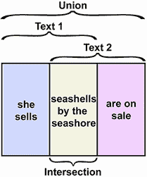

图 13.1 两个文本之间并集、交集和差异的可视化表示。

常见的 Python 集合操作

+   `set_a & set_b`—返回`set_a`和`set_b`之间的所有重叠元素

+   `set_a ^ set_b`—返回`set_a`和`set_b`之间的所有差异元素

+   `set_a | set_b`—返回`set_a`和`set_b`之间所有元素的并集

+   `set_a - set_b`—返回`set_a`中不在`set_b`中的所有元素

让我们使用`|`运算符来计算文本对`(text1, text2)`和`(text1, text3)`中所有独特单词的总数。

列表 13.7 提取两个文本之间的单词并集

```
for i, words_set in enumerate(words_sets[1:], 2):
    total_words = words_set1 | words_set
    print(f"Together, texts 1 and {i} contain {len(total_words)} "
          f"unique words. These words are:\n {total_words}\n")

Together, texts 1 and 2 contain 9 unique words. These words are:
 {'sells', 'seashells', 'by', 'on', 'are', 'sale', 'seashore', 'the', 'she'}

Together, texts 1 and 3 contain 12 unique words. These words are:
 {'sells', 'lake', 'by', 'john', 'the', 'she', 'to', 'lives', 'seashore', '3', 'who', 'seashells'}
```

总体而言，`text1`和`text3`包含 12 个独特单词。其中 5 个单词重叠，7 个单词不同。因此，重叠和差异都代表了文本中总独特单词计数的一个补充百分比。让我们为文本对`(text1, text2)`和`(text1, text3)`输出这些百分比。

列表 13.8 提取两个文本之间共享单词的百分比

```
for i, words_set in enumerate(words_sets[1:], 2):
    shared_words = words_set1 & words_set
    diverging_words = words_set1 ^ words_set
    total_words = words_set1 | words_set
    assert len(total_words) == len(shared_words) + len(diverging_words)
    percent_shared = 100 * len(shared_words) / len(total_words)           ❶
    percent_diverging = 100 * len(diverging_words) / len(total_words)     ❷

    print(f"Together, texts 1 and {i} contain {len(total_words)} "
          f"unique words. \n{percent_shared:.2f}% of these words are "
          f"shared. \n{percent_diverging:.2f}% of these words diverge.\n")
Together, texts 1 and 2 contain 9 unique words.
44.44% of these words are shared.
55.56% of these words diverge.

Together, texts 1 and 3 contain 12 unique words.
41.67% of these words are shared.
58.33% of these words diverge.
```

❶ 与文本 1 共享的总单词百分比

❷ 与文本 1 差异的总单词百分比

文本 1 和 3 共享 41.67%的总单词。剩余的 58.33%的单词有差异。同时，文本 1 和 2 共享 44.44%的总单词。这个百分比更高，因此我们可以推断`text1`比`text3`更相似于`text2`。

我们实际上已经开发了一个简单的指标来评估文本之间的相似性。该指标的工作方式如下：

1.  给定两个文本，从每个文本中提取单词列表。

1.  计算文本之间共享的独特单词。

1.  将共享单词计数除以两个文本中的总独特单词数。我们的输出是文本之间共享单词总数的分数。

这个相似度指标被称为*Jaccard 相似度*，或*Jaccard 指数*。

文本 1 和 2 之间的 Jaccard 相似度如图 13.2 所示，其中文本被表示为两个圆圈。左边的圆圈对应于文本 1，右边的圆圈对应于文本 2。每个圆圈包含其对应文本中的单词。两个圆圈相交，它们的交集包含两个文本之间共享的所有单词。Jaccard 相似度等于交集中总单词的比例。图中九个单词中有四个出现在交集中。因此，Jaccard 相似度等于 4/9。

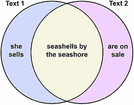

图 13.2 两个文本之间 Jaccard 相似度的可视化表示

### 13.1.1 探索 Jaccard 相似度

Jaccard 相似度是衡量文本相似度的合理度量，原因如下：

+   相似度同时考虑了文本重叠和文本差异。

+   分数相似度总是在 0 和 1 之间。这个分数很容易理解：0 表示没有共享单词，0.5 表示一半的单词共享，1 表示所有单词都共享。

+   相似度易于实现。

让我们定义一个函数来计算 Jaccard 相似度。

列表 13.9 计算 Jaccard 相似度

```
def jaccard_similarity(text_a, text_b):
    word_set_a, word_set_b = [set(simplify_text(text).split())
                              for text in [text_a, text_b]]
    num_shared = len(word_set_a & word_set_b)
    num_total = len(word_set_a | word_set_b)
    return num_shared / num_total

for text in [text2, text3]:
    similarity = jaccard_similarity(text1, text)
    print(f"The Jaccard similarity between '{text1}' and '{text}' "
          f"equals {similarity:.4f}." "\n")

The Jaccard similarity between 'She sells seashells by the seashore.' and
'"Seashells! The seashells are on sale! By the seashore."' equals 0.4444.

The Jaccard similarity between 'She sells seashells by the seashore.' and
'She sells 3 seashells to John, who lives by the lake.' equals 0.4167.
```

我们实现的 Jaccard 相似度是功能性的，但效率不高。该函数执行两个集合比较操作：`word_set_a & word_set_b` 和 `word_set_a | word_set_b`。这些操作比较和对比两个集合之间的所有单词。在 Python 中，这种比较的计算成本比简化的数值分析要高。

我们如何使函数更高效？嗯，我们可以从消除并集计算 `word_set_a | word_set_b` 开始。我们取并集是为了计算集合之间的唯一单词数，但有一个更简单的方法可以得到这个计数。考虑以下：

1.  将 `len(word_set_a)` 和 `len(word_set_b)` 相加得到一个单词计数，其中共享的单词被计算了两次。

1.  从那个和中减去 `len(word_set_a & word_set_b)` 消除了重复计数。最终结果等于 `len(word_set_a | word_set_b)`。

我们可以用 `len(word_set_a) + len(word_set_b) - num_shared` 来替换并集计算，从而使我们的函数更高效。让我们修改函数，同时确保我们的 Jaccard 输出保持不变。

列表 13.10 高效计算 Jaccard 相似度

```
def jaccard_similarity_efficient(text_a, text_b):
    word_set_a, word_set_b = [set(simplify_text(text).split())
                              for text in [text_a, text_b]]
    num_shared = len(word_set_a & word_set_b)
    num_total = len(word_set_a) + len(word_set_b) - num_shared     ❶
    return num_shared / num_total

for text in [text2, text3]:
    similarity = jaccard_similarity_efficient(text1, text)
    assert similarity == jaccard_similarity(text1, text)
```

❶ 与我们之前的 jaccard_similarity 函数不同，这里我们计算 num_total 而不执行任何集合比较操作。

我们改进了我们的 Jaccard 函数。不幸的是，该函数仍然无法扩展：它可能在数百个句子上运行得很好，但在数千个多句子文档上则不行。这种低效是由我们剩余的集合比较`word_set_a & word_set_b`引起的。该操作在数千个复杂文本上执行得太慢。也许我们可以通过某种方式使用 NumPy 来加速计算。然而，NumPy 旨在处理数字，而不是单词，因此除非我们将所有单词替换为数值，否则我们不能使用该库。

### 13.1.2 用数值替换单词

我们能否用数字替换单词？是的！我们只需要遍历所有文本中的所有单词，并将每个唯一的*i*个单词分配一个值为`i`。单词与其数值之间的映射可以存储在 Python 字典中。我们将把这个字典称为我们的*词汇表*。让我们构建一个涵盖我们三篇文本中所有单词的词汇表。我们还将创建一个互补的`value_to_word`字典，它将数值映射回单词。

注意：本质上，我们在文本的并集中对所有单词进行编号。我们迭代地选择一个单词并为其分配一个数字，从零开始。然而，我们选择单词的顺序并不重要——我们不妨像从单词袋中盲目抽取单词一样随机抽取单词。这就是为什么这种技术通常被称为*词袋*技术。

列表 13.11 在词汇表中分配单词到数字

```
words_set1, words_set2, words_set3 = words_sets
total_words = words_set1 | words_set2 | words_set3    
vocabulary = {word : i for i, word in enumerate(total_words)}
value_to_word = {value: word for word, value in vocabulary.items()}
print(f"Our vocabulary contains {len(vocabulary)} words. "
      f"This vocabulary is:\n{vocabulary}")

Our vocabulary contains 15 words. This vocabulary is:
{'sells': 0, 'seashells': 1, 'to': 2, 'lake': 3, 'who': 4, 'by': 5,
 'on': 6, 'lives': 7, 'are': 8, 'sale': 9, 'seashore': 10, 'john': 11,
 '3': 12, 'the': 13, 'she': 14}
```

注意：列表 13.11 中`total_words`变量的单词顺序可能取决于 Python 的安装版本。这种顺序变化将略微改变本节后面用于显示文本的某些图形。将`total_words`设置为`['sells', 'seashells', 'to', 'lake', 'who', 'by', 'on', 'lives', 'are', 'sale', 'seashore', 'john', '3', 'the', 'she']`将确保输出的一致性。

根据我们的词汇量，我们可以将任何文本转换为一个一维数字数组。从数学的角度来看，一维数字数组被称为*向量*。因此，将文本转换为向量的过程被称为*文本向量化*。

注意：数组维度与数据维度不同。如果需要`d`个坐标来在空间上表示一个数据点，则该数据点具有`d`个维度。同时，如果需要`d`个值来描述数组的形状，则数组具有`d`个维度。想象一下，我们记录了五个数据点，每个数据点有三个坐标。我们的数据是三维的，因为它可以在 3D 空间中绘制。此外，我们可以在一个包含五行三列的表中存储数据。该表具有(5, 3)的二维形状，因此它是二维的。因此，我们将 3D 数据存储在二维数组中。

向量化文本的最简单方法是通过创建一个由二进制元素组成的向量。该向量的每个索引对应于词汇表中的一个单词。因此，向量的大小等于词汇表的大小，即使某些词汇表单词在相关的文本中缺失。如果索引 `i` 的单词在文本中缺失，则 *i* 个向量元素被设置为 0。否则，它被设置为 1。因此，向量中的每个词汇表索引映射到 0 或 1。

例如，在 `vocabulary` 中，单词 *john* 映射到值为 11。此外，单词 *john* 不在 `text1` 中。因此，`text1` 的向量化表示在索引 11 处有一个 0。同时，单词 *john* 在 `text3` 中存在。因此，`text3` 的向量化表示在索引 11 处有一个 1（图 13.3）。以这种方式，我们可以将任何文本转换为 0 和 1 的二进制向量。

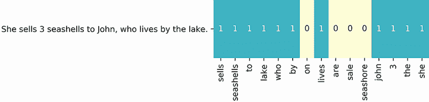

图 13.3 将 Text3 转换为二进制向量。向量的每个索引对应于词汇表中的一个单词。例如，索引 0 对应于 *sells*。这个单词在我们的文本中存在，所以向量的第一个元素被设置为 1。同时，单词 *on*、*are*、*sale* 和 *seashore* 在文本中不存在。因此，向量中相应的元素被设置为 0。

让我们使用二进制向量化将所有文本转换为 NumPy 数组。我们将计算出的向量存储在一个 2D `vectors` 列表中，它可以像表格一样处理。表格的行将映射到文本，列将映射到词汇表。图 13.4 使用第八部分中讨论的技术将表格可视化为一个热图。

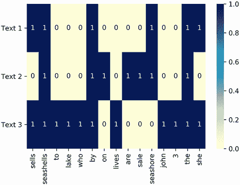

图 13.4 向量化文本的表格。行对应于标记的文本。列对应于标记的单词。二进制表格元素为 0 或 1。非零值表示在指定的文本中存在指定的单词。通过查看表格，我们可以立即知道哪些单词在哪些文本中是共享的。

注意：如第八部分所述，热图最好使用 Seaborn 库来可视化。

列表 13.12 将单词转换为二进制向量

```
import matplotlib.pyplot as plt
import numpy as np
import seaborn as sns

vectors = []
for i, words_set in enumerate(words_sets, 1):
    vector = np.array([0] * len(vocabulary))      ❶
    for word in words_set:
        vector[vocabulary[word]] = 1
    vectors.append(vector)

sns.heatmap(vectors, annot=True,  cmap='YlGnBu',
            xticklabels=vocabulary.keys(),        ❷
yticklabels=['Text 1', 'Text 2', 'Text 3'])
plt.yticks(rotation=0)
plt.show()
```

❶ 生成一个全为 0 的数组。我们也可以通过运行 np.zeros(len(vocabulary)) 来生成这个数组。

❷ 截至 Python 3.6，字典键方法根据其插入顺序返回字典键。在词汇表中，插入顺序等同于单词索引。

使用我们的表格，我们可以轻松地判断哪些单词在哪些文本之间是共享的。以单词 *sells* 为例，它在表格的第一列中被跟踪。在该列中，*sells* 在表格的第一行和第三行被分配了 1。这些行对应于 `text1` 和 `text3`。因此，我们知道 *sells* 在 `text1` 和 `text3` 之间是共享的。更正式地说，单词在文本之间是共享的，因为 `vectors[0][0] == 1` 和 `vectors[2][0] == 1`。此外，由于这两个元素都等于 1，它们的乘积也必须等于 1。因此，如果 `vectors[0][i]` 和 `vectors[2][i]` 的乘积等于 1，则文本在列 `i` 中共享一个单词。

我们的二进制向量表示法使我们能够从数值上提取共享单词。假设我们想知道列 `i` 中的单词是否同时存在于 `text1` 和 `text2` 中。如果相关的向量被标记为 `vector1` 和 `vector2`，那么如果 `vector1[i] * vector2[i] == 1`，则该单词在两个文本中都存在。在这里，我们使用成对向量乘法来找到 `text1` 和 `text2` 共享的所有单词。

列表 13.13 使用向量算术查找共享单词

```
vector1, vector2 = vectors[:2]
for i in range(len(vocabulary)):
    if vector1[i] * vector2[i]:
        shared_word = value_to_word[i]
        print(f"'{shared_word}' is present in both texts 1 and 2")

'seashells' is present in both texts 1 and 2
'by' is present in both texts 1 and 2
'seashore' is present in both texts 1 and 2
'the' is present in both texts 1 and 2
```

我们已经输出了 `text1` 和 `text2` 之间共享的所有四个单词。这个共享单词数等于 `vector1[i] * vector2[i]` 的每个非零实例的总和。同时，每个零实例的总和等于 0。因此，我们可以通过将 `vector1[i]` 和 `vector2[i]` 的成对乘积在所有可能的 `i` 上求和来计算共享单词数。换句话说，`sum(vector1[i] * vector2[i] for i in range(len(vocabulary)))` 等于 `len(words_set1 & words_set2)`。

列表 13.14 使用向量算术计算共享单词数

```
shared_word_count = sum(vector1[i] * vector2[i]
                        for i in range(len(vocabulary)))
assert shared_word_count == len(words_set1 & words_set2)
```

所有向量索引的成对乘积之和被称为 *点积*。给定两个 NumPy 数组 `vector_a` 和 `vector_b`，我们可以通过运行 `vector_a.dot(vector_b)` 来计算它们的点积。我们也可以通过运行 `vector_a @ vector_b` 使用 `@` 运算符来计算点积。在我们的例子中，这个点积等于文本 1 和 2 之间共享的单词数，这当然也等于它们的交集大小。因此，运行 `vector1 @ vector2` 产生一个值，该值等于 `len(words_set1 & words_set2)`。

列表 13.15 使用 NumPy 计算向量点积

```
assert vector1.dot(vector2) == shared_word_count
assert vector1 @ vector2 == shared_word_count
```

`vector1` 和 `vector2` 的点积等于 `text1` 和 `text2` 之间的共享单词数。假设我们取 `vector1` 与自身的点积。该输出应等于 `text1` 与 `text1` 共享的单词数。更简洁地说，`vector1 @ vector1` 应等于 `text1` 中独特单词的数量，这也等于 `len(words_set1)`。让我们来确认一下。

列表 13.16 使用向量算术计算总词数

```
assert vector1 @ vector1 == len(words_set1)
assert vector2 @ vector2 == len(words_set2)
```

我们能够使用向量点积来计算共享单词数和总唯一单词数。本质上，我们可以仅使用向量操作来计算 Jaccard 相似度。这种向量化的 Jaccard 实现被称为 *Tanimoto 相似度*。

有用的 NumPy 向量操作

+   `vector_a.dot(vector_b)`—返回`vector_a`和`vector_b`之间的点积。相当于运行`sum(vector_a[i] * vector_b[i] for i in range(vector_a.size))`。

+   `vector_b @ vector_b`—使用`@`运算符返回`vector_a`和`vector_b`之间的点积。

+   `binary_text_vector_a @ binary_text_vector_b`—返回`text_a`和`text_b`之间共享的单词数量。

+   `binary_text_vector_a @ binary_text_vector_a`—返回`text_a`中独特单词的数量。

让我们定义一个`tanimoto_similarity`函数。该函数接受两个向量`vector_a`和`vector_b`作为输入。它的输出等于`jaccard_similarity (text_a, text_b)`。

列表 13.17 使用向量算术计算文本相似度

```
def tanimoto_similarity(vector_a, vector_b):
    num_shared = vector_a @ vector_b
    num_total = vector_a @ vector_a + vector_b @ vector_b - num_shared
    return num_shared / num_total

for i, text in enumerate([text2, text3], 1):
    similarity = tanimoto_similarity(vector1, vectors[i])
    assert similarity == jaccard_similarity(text1, text)
```

我们的`tanimoto_similarity`函数原本是用来比较二进制向量的。如果我们输入了除了 0 或 1 之外的值，会发生什么？技术上，该函数应该返回一个相似度，但这个相似度有意义吗？例如，向量`[5, 3]`和`[5, 2]`几乎相同。我们预计它们的相似度几乎等于 1。让我们通过将向量输入到`tanimoto_similarity`来测试我们的预期。

列表 13.18 计算非二进制向量的相似度

```
non_binary_vector1 = np.array([5, 3])
non_binary_vector2 = np.array([5, 2])
similarity = tanimoto_similarity(non_binary_vector1, non_binary_vector2)
print(f"The similarity of 2 non-binary vectors is {similarity}")

The similarity of 2 non-binary vectors is 0.96875
```

输出的值几乎等于 1。因此，`tanimoto_similarity`成功测量了两个几乎相同的向量之间的相似度。该函数可以分析非二进制输入。这意味着我们可以在比较内容之前使用非二进制技术向量化我们的文本。 

以非二进制方式向量化文本有好处。让我们更详细地讨论这些好处。

## 13.2 使用单词计数向量化文本

二进制向量化捕捉了文本中单词的存在和缺失，但它不捕捉单词计数。这是不幸的，因为单词计数可以在文本之间提供区分信号。例如，假设我们正在对比两个文本：A 和 B。文本 A 提到*鸭*61 次和*鹅*两次。文本 B 提到*鹅*71 次和*鸭*只有一次。根据计数，我们可以推断这两个文本在讨论鸭和鹅方面相当不同。这种差异没有被二进制向量化捕捉到，它将两个文本的*鸭*索引和*鹅*索引都分配为 1。如果我们用实际的单词计数来替换所有二进制值会怎样呢？例如，我们可以将向量 A 的*鸭*和*鹅*索引的值分别赋为 61 和 2，而将向量 B 的相应索引赋为 1 和 71。

这些赋值将生成单词计数的向量。单词计数的向量通常被称为 *词频向量*，或简称为 *TF 向量*。让我们使用一个包含两个元素的词汇表 `{'duck': 0, 'goose': 1}` 来计算 A 和 B 的 TF 向量。作为提醒，词汇表中的每个单词都映射到一个向量索引。给定词汇表，我们可以将文本转换为 TF 向量 `[61, 2]` 和 `[1, 71]`。然后我们打印这两个向量的 Tanimoto 相似度。

列表 13.19 计算 TF 向量相似度

```
similarity = tanimoto_similarity(np.array([61, 2]), np.array([1, 71]))
print(f"The similarity between texts is approximately {similarity:.3f}")

The similarity between texts is approximately 0.024
```

文本之间的 TF 向量相似度非常低。让我们将其与两个文本的二进制向量相似度进行比较。每个文本都有一个 `[1, 1]` 的二进制向量表示，因此二进制相似度应该等于 1。

列表 13.20 评估相同向量的相似度

```
assert tanimoto_similarity(np.array([1, 1]), np.array([1, 1])) == 1
```

用单词计数替换二进制值可以极大地影响我们的相似度输出。如果我们根据 `text1`、`text2` 和 `text3` 的单词计数来向量化这些文本，会发生什么？让我们来看看。我们首先使用存储在 `words_lists` 中的单词列表计算这三个文本的 TF 向量。这些向量在图 13.5 中使用热图进行可视化。

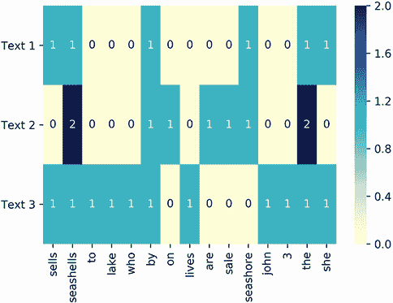

图 13.5 一个 TF 向量表。行对应于标记的文本。列对应于标记的单词。每个值表示在指定文本中指定单词的计数。表中提到了两次的两个单词；所有其他单词都没有被提及超过一次。

列表 13.21 从单词列表计算 TF 向量

```
tf_vectors = []
for i, words_list in enumerate(words_lists, 1):
    tf_vector = np.array([0] * len(vocabulary))
    for word in words_list:
        word_index = vocabulary[word]
        tf_vector[word_index] += 1       ❶

    tf_vectors.append(tf_vector)

sns.heatmap(tf_vectors,  cmap='YlGnBu', annot=True,
            xticklabels=vocabulary.keys(),
yticklabels=['Text 1', 'Text 2', 'Text 3'])
plt.yticks(rotation=0)
plt.show()
```

❶ 使用单词的词汇索引更新单词计数

文本 1 和 3 的 TF 向量与之前看到的二进制向量输出相同。然而，文本 2 的 TF 向量不再是二进制，因为有两个单词被提及了不止一次。这将对 `text1` 和 `text2` 之间的相似度产生什么影响？让我们来看看。以下代码计算了 `text1` 与其他两个文本之间的 TF 向量相似度。它还输出了原始的二进制向量相似度以供比较。根据我们的观察，`text1` 和 `text2` 之间的相似度应该会发生变化，而 `text1` 和 `text3` 之间的相似度应该保持不变。

列表 13.22 比较向量相似度的度量

```
tf_vector1 = tf_vectors[0]
binary_vector1 = vectors[0]

for i, tf_vector in enumerate(tf_vectors[1:], 2):
    similarity = tanimoto_similarity(tf_vector1, tf_vector)
    old_similarity = tanimoto_similarity(binary_vector1, vectors[i - 1])
    print(f"The recomputed Tanimoto similarity between texts 1 and {i} is"
          f" {similarity:.4f}.")
    print(f"Previously, that similarity equaled {old_similarity:.4f} " "\n")
The recomputed Tanimoto similarity between texts 1 and 2 is 0.4615.
Previously, that similarity equaled 0.4444

The recomputed Tanimoto similarity between texts 1 and 3 is 0.4167.
Previously, that similarity equaled 0.4167
```

如预期，`text1` 和 `text3` 之间的相似度保持不变，而 `text1` 和 `text2` 之间的相似度有所增加。因此，TF 向量化使得这两篇文本的亲和度更加明显。

TF 向量提供了改进的比较，因为它们对文本之间的计数差异敏感。这种敏感性是有用的。然而，当比较不同长度的文本时，它也可能是有害的。在接下来的小节中，我们将检查与 TF 向量比较相关的一个缺陷。然后我们应用一种称为 *归一化* 的技术来消除这个缺陷。

### 13.2.1 使用归一化来提高 TF 向量相似度

想象一下，你正在测试一个非常简单的搜索引擎。该搜索引擎接收一个查询并将其与存储在数据库中的文档标题进行比较。查询的 TF 向量与每个向量化的标题进行比较。具有非零 Tanimoto 相似度的标题将被返回，并根据它们的相似度得分进行排序。

假设你运行了一个针对“Pepperoni Pizza”的查询，并返回以下两个标题：

+   *标题 A*—“Pepperoni Pizza! Pepperoni Pizza! Pepperoni Pizza!”

+   *标题 B*—“Pepperoni”

注意：这些标题故意简化，以便更容易可视化。大多数真实文档的标题都更复杂。

我们的两个标题中哪一个最能匹配查询？大多数数据科学家都会同意标题 A 比标题 B 更匹配。标题 A 和查询都提到了 *Pepperoni Pizza*。而标题 B 只提到了 *Pepperoni*。没有任何迹象表明相关的文档在任何上下文中实际讨论了披萨。

让我们检查标题 A 相对于查询是否比标题 B 排名更高。我们首先从包含两个元素词汇表 `{pepperoni: 0, pizza: 1}` 中构建 TF 向量。

列表 13.23 简单搜索引擎向量化

```
query_vector = np.array([1, 1])
title_a_vector = np.array([3, 3])
title_b_vector = np.array([1, 0])
```

我们现在将查询与标题进行比较，并根据 Tanimoto 相似度对标题进行排序。

列表 13.24 通过查询相似度对标题进行排序

```
titles = ["A: Pepperoni Pizza! Pepperoni Pizza! Pepperoni Pizza!",
          "B: Pepperoni"]
title_vectors = [title_a_vector, title_b_vector]
similarities = [tanimoto_similarity(query_vector, title_vector)
                for title_vector in title_vectors]

for index in sorted(range(len(titles)), key=lambda i: similarities[i],
                    reverse=True):
    title = titles[index]
    similarity = similarities[index]
    print(f"'{title}' has a query similarity of {similarity:.4f}")

'B: Pepperoni' has a query similarity of 0.5000
'A: Pepperoni Pizza! Pepperoni Pizza! Pepperoni Pizza!' has a query similarity of 0.4286
```

不幸的是，标题 A 在排名上超过了标题 B。这种排名差异是由文本大小引起的。标题 A 的单词数量是查询的三倍，而标题 B 和查询只相差一个单词。表面上，这种差异可以用来通过大小区分文本。然而，在我们的搜索引擎中，大小信号导致了错误的排名。我们需要削弱文本大小对排序结果的影响。一种简单的方法是将 `title_a_vector` 除以 3。除法得到的结果等于 `query_vector`。因此，运行 `tanimoto_similarity(query_vector, title_a_vector / 3)` 应该返回相似度为 1。

列表 13.25 通过除法消除大小差异

```
assert np.array_equal(query_vector, title_a_vector / 3)
assert tanimoto_similarity(query_vector,
                           title_a_vector / 3) == 1
```

使用简单的除法，我们可以操作 `title_a_vector` 以等于 `query_vector`。对于 `title_b_vector`，这种操作是不可能的。为什么是这样？为了说明答案，我们需要在 2D 空间中绘制所有三个向量。

我们如何可视化我们的向量呢？从数学的角度来看，所有向量都是几何对象。数学家将每个向量 `v` 视为从原点到 `v` 中数值坐标的线段。本质上，我们的三个向量仅仅是起源于原点的 2D 线段。我们可以在一个 2D 图中可视化这些线段，其中 x 轴代表 *Pepperoni* 的提及，y 轴代表 *pizza* 的提及（图 13.6）。

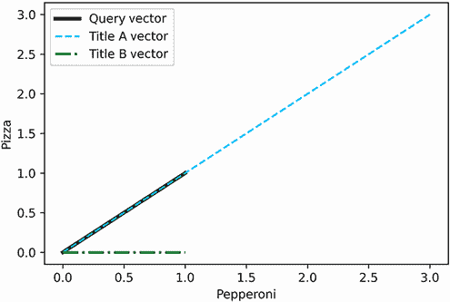

图 13.6 在二维空间中将三个 TF 向量绘制为线条。每个向量从原点延伸到其二维坐标。查询向量和标题向量都朝同一方向。这两个向量之间的角度为零。然而，其中一条线是另一条线的三倍长。调整线段长度将迫使两个向量相同。

列表 13.26 在二维空间中绘制 TF 向量

```
plt.plot([0, query_vector[0]], [0, query_vector[1]], c='k',
         linewidth=3, label='Query Vector')
plt.plot([0, title_a_vector[0]], [0, title_a_vector[1]], c='b',
          linestyle='--', label='Title A Vector')
plt.plot([0, title_b_vector[0]], [0, title_b_vector[1]], c='g',
         linewidth=2, linestyle='-.', label='Title B Vector')
plt.xlabel('Pepperoni')
plt.ylabel('Pizza')
plt.legend()
plt.show()
```

在我们的图中，`title_a_vector` 和 `query_vector` 指向同一方向。这两条线之间的唯一区别是 `title_a_vector` 的长度是三倍。缩小 `title_a_vector` 将迫使两条线相同。同时，`title_b_vector` 和 `query_vector` 指向不同方向。我们无法使这些向量重叠。缩小或延长 `title_b_vector` 不会使其他两个线段对齐。

通过将向量表示为线段，我们已经获得了一些洞察。这些线段具有几何长度。因此，每个向量都有一个几何长度，称为 *模*。模长也称为 *欧几里得范数* 或 *L2 范数*。所有向量都有模长，即使那些不能在二维中绘制的向量也是如此。例如，在图 13.7 中，我们展示了与 *Pepperoni Pizza Pie* 相关的 3D 向量的模长。

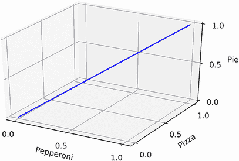

图 13.7 展示了三个单词标题 *Pepperoni Pizza Pie* 的 TF 向量表示。这个 3D 向量从原点延伸到其坐标 (1, 1, 1)。根据勾股定理，绘制的 3D 段的长度等于 `(1` `+` `1` `+` `1)` `**` `0.5`。这个长度被称为向量的 *模*。

测量模长使我们能够考虑几何长度的差异。在 Python 中有多种计算模长的方法。给定向量 `v`，我们可以通过测量 `v` 与原点之间的欧几里得距离来天真地测量模长。我们也可以使用 NumPy 通过运行 `np.linalg.norm(v)` 来找到模长。最后，我们可以使用勾股定理（图 13.8）来计算模长。

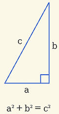

图 13.8 使用勾股定理计算向量的模。一般来说，二维向量 `[a,` `b]` 可以用一个直角三角形来表示。三角形的垂直边长分别为 *a* 和 *b*。同时，三角形的斜边长度等于 *c*。根据勾股定理，*c* * *c* == *a* * *a* + *b* * *b*。因此，向量的模等于 `sum([value` `*` `value` `for` `value` `in` `vector])` `**` `0.5`。这个公式不仅适用于二维，也适用于任意维数。

根据勾股定理，坐标 `v` 到原点的平方距离等于 `sum([value * value for value in v])`。这与我们之前对点积的定义完美契合。提醒一下，两个向量 `v1` 和 `v2` 的点积等于 `sum([value1 * value2 for value1, value2 in zip(v1, v2)])`。因此，向量 `v` 与自身的点积等于 `sum([value * value for value in v])`。因此，`v` 的幅度等于 `(v @ v) ** 0.5`。

让我们输出搜索引擎向量的幅度。根据我们的观察，`title_a_vector` 的幅度应该等于 `query_vector` 的三倍。

列表 13.27 计算向量幅度

```
from scipy.spatial.distance import euclidean
from numpy.linalg import norm

vector_names = ['Query Vector', 'Title A Vector', 'Title B Vector']
tf_search_vectors = [query_vector, title_a_vector, title_b_vector]
origin = np.array([0, 0])
for name, tf_vector in zip(vector_names, tf_search_vectors):
    magnitude = euclidean(tf_vector, origin)                       ❶
    assert magnitude == norm(tf_vector)                            ❷
    assert magnitude == (tf_vector @ tf_vector) ** 0.5             ❸
    print(f"{name}'s magnitude is approximately {magnitude:.4f}")

magnitude_ratio = norm(title_a_vector) / norm(query_vector)
print(f"\nVector A is {magnitude_ratio:.0f}x as long as Query Vector")

Query Vector's magnitude is approximately 1.4142
Title A Vector's magnitude is approximately 4.2426
Title B Vector's magnitude is approximately 1.0000

Vector A is 3x as long as Query Vector
```

❶ 这个向量的幅度等于该向量与原点之间的欧几里得距离。

❷ NumPy 的 `norm` 函数返回幅度。

❸ 我们也可以使用点积来计算幅度。

如预期的那样，`query_vector` 和 `title_a_vector` 的幅度之间存在三倍差异。此外，这两个向量的幅度都大于 1。同时，`title_vector_b` 的幅度正好等于 1。幅度为 1 的向量被称为**单位向量**。单位向量具有许多有用的特性，我们将在稍后讨论。单位向量的一个好处是它们很容易比较：由于单位向量具有相同的幅度，这并不影响它们的相似性。从根本上说，单位向量之间的差异完全由方向决定。

假设 `title_a_vector` 和 `query_vector` 都具有幅度为 1。结果，它们将具有相同的长度，并且指向相同的方向。本质上，这两个向量将是相同的。我们查询和标题 A 之间的词数差异将不再重要。

为了说明这一点，让我们将我们的 TF 向量转换为单位向量。将任何向量除以其幅度会将该幅度转换为 1。这种除以幅度的操作称为**归一化**，因为幅度也被称为 L2 范数。运行 `v / norm(v)` 返回一个幅度为 1 的**归一化向量**。

我们现在归一化我们的向量并生成一个单位向量图（图 13.9）。在图中，应该有两个向量是相同的。

列表 13.28 绘制归一化向量

```
unit_query_vector = query_vector / norm(query_vector)
unit_title_a_vector = title_a_vector / norm(title_a_vector)
assert np.allclose(unit_query_vector, unit_title_a_vector)     ❶
unit_title_b_vector = title_b_vector                           ❷

plt.plot([0, unit_query_vector[0]], [0, unit_query_vector[1]], c='k',
         linewidth=3, label='Normalized Query Vector')
plt.plot([0, unit_title_a_vector[0]], [0, unit_title_a_vector[1]], c='b',
          linestyle='--', label='Normalized Title A Vector')
plt.plot([0, unit_title_b_vector[0]], [0, unit_title_b_vector[1]], c='g',
         linewidth=2, linestyle='-.', label='Title B Vector')

plt.axis('equal')
plt.legend()
plt.show()
```

❶ 这两个归一化的单位向量现在是相同的。我们使用 `np.allclose` 来确认，而不是 `np.array_equal`，以补偿归一化过程中可能出现的微小浮点误差。

❷ 这个向量已经是单位向量了。没有必要进行归一化。

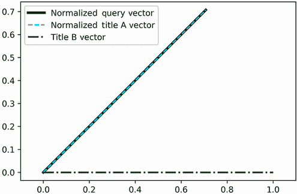

图 13.9 我们已经将向量归一化。现在所有绘制的向量幅度都为 1。在图中，归一化的查询向量和归一化的标题 A 向量是相同的。

归一化查询向量和归一化标题向量现在无法区分。所有由文本大小引起的差异都已消除。同时，标题 B 向量的位置与查询向量不同，因为这两个片段指向不同的方向。如果我们根据它们与 `unit_query_vector` 的相似度对单位向量进行排序，那么 `unit_title_a_vector` 的排名高于 `unit_title_b_vector`。因此，标题 A 相对于查询的排名高于标题 B。

列表 13.29 通过单位向量相似度对标题进行排序

```
unit_title_vectors = [unit_title_a_vector, unit_title_b_vector]
similarities = [tanimoto_similarity(unit_query_vector, unit_title_vector)
                for unit_title_vector in unit_title_vectors]

for index in sorted(range(len(titles)), key=lambda i: similarities[i],
                    reverse=True):
    title = titles[index]
    similarity = similarities[index]
    print(f"'{title}' has a normalized query similarity of {similarity:.4f}")

'A: Pepperoni Pizza! Pepperoni Pizza! Pepperoni Pizza!' has a normalized
 query similarity of 1.0000
'B: Pepperoni' has a normalized query similarity of 0.5469
```

常见的向量长度运算

+   `euclidean(vector, vector.size * [0])`—返回向量的长度，等于 `vector` 与原点之间的欧几里得距离

+   `norm(vector)`—使用 NumPy 的 `norm` 函数返回向量的长度

+   `(vector @ vector) ** 0.5`—使用勾股定理计算向量的长度

+   `vector / norm(vector)`—将向量归一化，使其长度等于 1.0

向量归一化修复了我们搜索引擎中的一个缺陷：搜索引擎不再对标题长度过度敏感。在这个过程中，我们不经意间使我们的 Tanimoto 计算更加高效。让我们讨论一下原因。

假设我们测量两个单位向量 `u1` 和 `u2` 的 Tanimoto 相似度。从逻辑上讲，我们可以推断出以下内容：

+   Tanimoto 相似度等于 `u1 @ u2 / (u1 @ u1 + u2 @ u2 - u1 @ u2)`。

+   `u1 @ u1` 等于 `norm(u1) ** 2`。根据我们之前的讨论，我们知道 `u1 @ u1` 等于 `u` 的长度的平方。

+   `u1` 是一个单位向量，所以 `norm(u1)` 等于 1。因此，`norm(u1) ** 2` 等于 1。因此 `u1 @ u1` 等于 1。

+   按照同样的逻辑，`u2 @ u2` 也等于 1。

+   因此，Tanimoto 相似度简化为 `u1 @ u2 / (2 - u1 @ u2)`。

与每个向量与其自身进行点积不再必要。唯一需要的向量计算是 `u1 @ u2`。

让我们定义一个 `normalized_tanimoto` 函数。该函数接受两个归一化向量 `u1` 和 `u2` 作为输入，并直接从 `u1 @ u2` 计算它们的 Tanimoto 相似度。该结果等于 `tanimoto_similarity(u1, u2)`。

列表 13.30 计算单位向量 Tanimoto 相似度

```
def normalized_tanimoto(u1, u2):
    dot_product = u1 @ u2
    return dot_product / (2 - dot_product)

for unit_title_vector in unit_title_vectors[1:]:
    similarity = normalized_tanimoto(unit_query_vector, unit_title_vector)
    assert similarity == tanimoto_similarity(unit_query_vector,
                                             unit_title_vector)
```

两个单位向量的点积是一个非常特殊的值。它可以很容易地转换为向量之间的角度，也可以转换为它们之间的空间距离。这为什么很重要呢？嗯，常见的几何度量，如向量角度和距离，出现在所有的向量分析库中。同时，Tanimoto 相似度在 NLP 之外的使用频率较低。它通常需要从头开始实现，这可能会产生严重的现实世界后果。想象以下场景。你被一家搜索引擎公司雇佣来改进所有与披萨相关的查询。你提议使用归一化的 Tanimoto 相似度作为查询相关性的度量。然而，你的经理反对：他们坚持认为，根据公司政策，员工只能使用已经包含在 scikit-learn 中的相关性度量。

很遗憾，这种场景是完全现实的。大多数组织倾向于验证其核心指标的速度和质量。在大组织中，验证过程可能需要数月。因此，通常更容易依赖于预先验证的库，而不是验证全新的指标。

经理人指向了概述可接受度量函数的 scikit-learn 文档（[`mng.bz/9aM1`](http://mng.bz/9aM1)）。你看到 scikit-learn 度量名称和函数显示在图 13.10 所示的两个列表中。多个名称可以映射到同一个函数。其中四种度量指的是欧几里得距离，三种指的是曼哈顿和哈弗辛（也称为大圆）距离，我们在第十一部分中介绍了这些距离。还有一个关于名为 `'cosine'` 的度量的引用，我们还没有讨论过。没有提到 Tanimoto 度量，因此你不能用它来评估查询相关性。你应该怎么办？

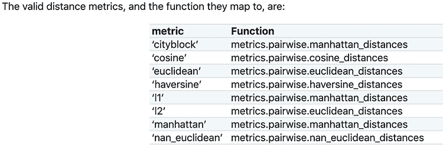

图 13.10 显示 scikit-learn 文档中有效距离度量实现的屏幕截图

幸运的是，数学为你提供了一条出路。如果你的向量已经归一化，它们的 Tanimoto 相似度可以用欧几里得和余弦度量来代替。这是因为这三个度量都与归一化点积非常密切相关。让我们来看看为什么是这样的情况。

### 13.2.2 使用单位向量点积在相关性指标之间进行转换

单位向量点积将多种比较度量类型统一起来。我们刚刚看到 `tanimoto_similarity(u1, u2)` 是 `u1 @ u2` 的直接函数。实际上，单位向量之间的欧几里得距离也是 `u1 @ u2` 的函数。证明 `euclidean(u1, u2)` 等于 `(2 - 2* u1 @ u2) ** 0.5` 并不难。此外，线性单位向量之间的角度同样依赖于 `u1 @ u2`。这些关系在图 13.11 中得到了说明。

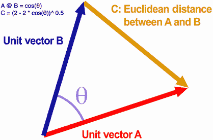

图 13.11 两个单位向量 A 和 B。向量之间的角度等于 θ。向量的点积等于余弦(θ)。C 代表向量之间的欧几里得距离，等于 (2 – 2 * 余弦(θ))0.5。

几何上，两个单位向量的点积等于它们之间角度的余弦值。由于其与余弦值的等价性，两个单位向量的点积通常被称为 *余弦相似度*。给定余弦相似度 `cs`，我们可以通过运行 `(2 – 2 * cs) ** 0.5` 或 `cs / (2 – cs)` 分别将其转换为欧几里得距离或 Tanimoto 相似度。

注意：余弦函数是三角学中一个非常重要的函数。它将两条线之间的角度映射到-1 到 1 之间的值。如果两条线指向相同方向，则它们之间的角度为 0，该角度的余弦值为 1。如果两条线指向相反方向，则它们之间的角度为 180 度，该角度的余弦值为-1。给定一对向量`v1`和`v2`，我们可以通过运行`(v1 / norm(v1)) @ (v2 / norm(v2))`来计算它们的余弦相似度。然后我们可以将那个结果输入到反余弦函数`np.arccos`中，以测量向量之间的角度。

列表 13.31 说明了在 Tanimoto 相似度、余弦相似度和欧几里得距离之间进行转换是多么容易。我们计算查询向量和我们的每个单位标题向量之间的 Tanimoto 相似度。随后将 Tanimoto 相似度转换为余弦相似度，然后将余弦相似度转换为欧几里得距离。

注意：此外，我们还利用余弦相似度来计算向量之间的角度。我们这样做是为了强调余弦度量如何反映线段之间的角度。

列表 13.31 在单位向量度量之间进行转换

```
unit_vector_names = ['Normalized Title A vector', 'Title B Vector']
u1 = unit_query_vector

for unit_vector_name, u2 in zip(unit_vector_names, unit_title_vectors):
    similarity = normalized_tanimoto(u1, u2)
    cosine_similarity  = 2 * similarity / (1 + similarity)       ❶
    assert cosine_similarity == u1 @ u2
    angle = np.arccos(cosine_similarity)
    euclidean_distance = (2 - 2 * cosine_similarity) ** 0.5
    assert round(euclidean_distance, 10) == round(euclidean(u1, u2), 10)
    measurements = {'Tanimoto similarity': similarity,
                    'cosine similarity': cosine_similarity,
                    'Euclidean distance': euclidean_distance,
                    'angle': np.degrees(angle)}

    print("We are comparing Normalized Query Vector and "
           f"{unit_vector_name}")
    for measurement_type, value in measurements.items():
        output = f"The {measurement_type} between vectors is {value:.4f}"
        if measurement_type == 'angle':
            output += ' degrees\n'

        print(output)

We are comparing Normalized Query Vector and Normalized Title A vector
The Tanimoto similarity between vectors is 1.0000
The cosine similarity between vectors is 1.0000
The Euclidean distance between vectors is 0.0000
The angle between vectors is 0.0000 degrees

We are comparing Normalized Query Vector and Title B Vector
The Tanimoto similarity between vectors is 0.5469
The cosine similarity between vectors is 0.7071
The Euclidean distance between vectors is 0.7654
The angle between vectors is 45.0000 degrees
```

❶ `normalized_tanimoto`是`cosine_similarity`的一个函数。使用基本的代数，我们可以反转该函数以求解`cosine_similarity`。

标准化向量的 Tanimoto 相似度可以转换为其他相似度或距离度量。这有以下好处：

+   将 Tanimoto 相似度替换为欧几里得距离允许我们在文本数据上执行 K-means 聚类。我们将在第十五部分中讨论文本的 K-means 聚类。

+   将 Tanimoto 相似度替换为余弦相似度简化了我们的计算需求。所有计算都简化为基本的点积运算。

注意：NLP 从业者通常使用余弦相似度而不是 Tanimoto 相似度。研究表明，从长远来看，Tanimoto 相似度比余弦相似度更准确。然而，在许多实际应用中，这两种相似度是可以互换的。

常见的单位向量比较度量

+   `u1 @ u2`—单位向量`u1`和`u2`之间角度的余弦值

+   `(u1 @ u2) / (2 - u1 @ u2)`—单位向量`u1`和`u2`之间的 Tanimoto 相似度

+   `(2 - 2 * u1 @ u2) ** 0.5`—单位向量`u1`和`u2`之间的欧几里得距离

向量归一化允许我们在多个比较度量之间进行切换。归一化的其他好处包括：

+   *消除文本长度作为区分信号*—这使我们能够比较内容相似的长文本和短文本。

+   *更有效地计算 Tanimoto 相似度*—只需要一个点积运算。

+   *更有效地计算每对向量之间的相似度*—这被称为*全对全*相似度。

最后一个好处尚未讨论。然而，我们将很快了解到，可以使用 *矩阵乘法* 精巧地计算跨文本相似度表。在数学中，矩阵乘法将点积从一维向量推广到二维数组。推广的点积导致高效地计算所有文本对之间的相似度。

## 13.3 矩阵乘法用于高效相似度计算

当分析以 *海螺* 为中心的文本时，我们逐个比较每个文本对。如果我们不是逐个比较，而是将所有成对相似度可视化在一个表中会怎样？行和列将对应于单个文本，而元素将对应于 Tanimoto 相似度。这个表将为我们提供所有文本之间关系的鸟瞰图。我们最终将了解 `text2` 是否比 `text1` 或 `text3` 更相似。

让我们生成一个归一化 Tanimoto 相似度表，使用图 13.12 中概述的过程。我们首先将先前预计算的 `tf_vectors` 列表中的 TF 向量进行归一化。然后我们遍历每一对向量并计算它们的 Tanimoto 相似度。我们将相似度存储在一个二维 `similarities` 数组中，其中 `similarities[i][j]` 等于第 *i* 个文本和第 *j* 个文本之间的相似度。最后，我们使用热图（图 13.13）可视化 `similarities` 数组。

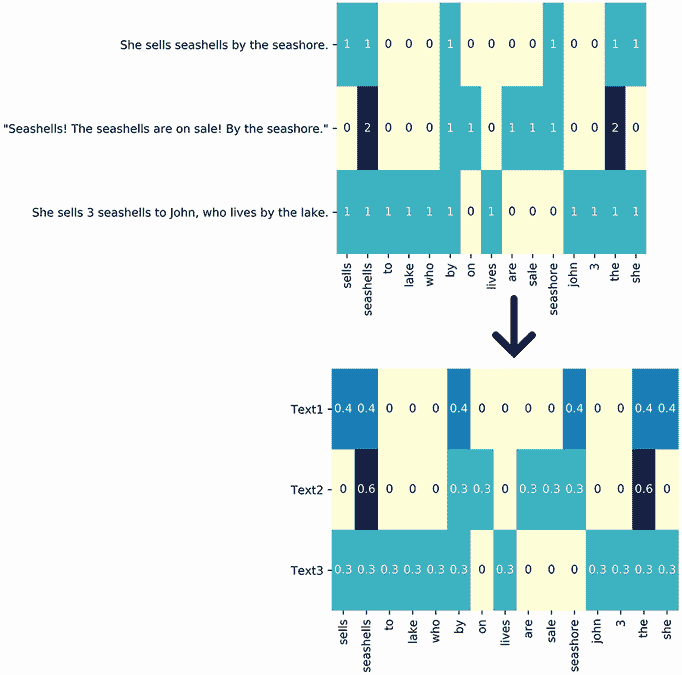

图 13.12 将我们的三个文本转换为归一化矩阵。初始文本出现在左上角。这些文本共享 15 个独特的词汇。我们使用词汇将文本转换为词频矩阵，该矩阵位于右上角。其三行对应于三个文本，其 15 列跟踪每个文本中每个词的出现次数。我们通过将每行除以其幅度来归一化这些计数。归一化产生了位于右下角的矩阵。归一化矩阵中任意两行的点积等于对应文本之间的余弦相似度。随后，运行 `cos` `/` `(2` `-` `cos`) 将余弦相似度转换为 Tanimoto 相似度。

列表 13.32 计算归一化 Tanimoto 相似度表

```
num_texts = len(tf_vectors)
similarities = np.array([[0.0] * num_texts for _ in range(num_texts)])    ❶
unit_vectors = np.array([vector / norm(vector) for vector in tf_vectors])
for i, vector_a in enumerate(unit_vectors):
    for j, vector_b in enumerate(unit_vectors):
        similarities[i][j] = normalized_tanimoto(vector_a, vector_b)

labels = ['Text 1', 'Text 2', 'Text 3']
sns.heatmap(similarities,  cmap='YlGnBu', annot=True,
            xticklabels=labels, yticklabels=labels)
plt.yticks(rotation=0)
plt.show()
```

❶ 创建一个只包含零的二维数组。我们可以通过运行 `np.zeros((num_texts, num_texts))` 来更高效地创建这个数组。我们将这个空数组填充为文本之间的相似度。

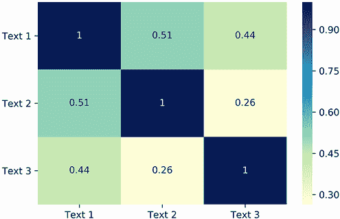

图 13.13 显示了文本对之间的归一化 Tanimoto 相似度表。表的对角线表示每个文本与其自身之间的相似度。不出所料，这个相似度为 1。忽略对角线，我们看到文本 1 和 2 之间的相似度最高。同时，文本 2 和 3 之间的相似度最低。

看表格是有信息的。我们可以立即判断哪些文本对具有最高的相似度。然而，我们的表格计算依赖于低效的代码。以下计算是冗余的，可以被消除。

+   创建一个空的 3x3 数组

+   在所有成对向量组合上嵌套的 `for` 循环迭代

+   每个成对向量相似度的单独计算

我们可以使用矩阵乘法来清除这些操作。然而，首先我们需要介绍基本的矩阵运算。

### 13.3.1 基本矩阵运算

矩阵运算推动了数据科学许多子领域的发展，包括 NLP、网络分析和机器学习。因此，了解矩阵操作的基本知识对我们数据科学职业生涯至关重要。*矩阵*是一维向量的二维扩展。换句话说，矩阵只是一个数字表。根据这个定义，`similarities` 是一个矩阵，`unit_vectors` 也是一个矩阵。本书中讨论的大多数数值表也都是自然矩阵。

注意：每个矩阵都是一个数值表，但并非每个数值表都是矩阵。所有矩阵的行必须具有相等的长度。所有矩阵的列也是如此。因此，如果一个表格包含一个五元素列和一个七元素列，它就不是矩阵。

由于矩阵是表格，因此可以使用 Pandas 进行分析。相反，数值表可以使用 2D NumPy 数组处理。这两种矩阵表示都是有效的。事实上，Pandas DataFrames 和 NumPy 数组有时可以互换使用，因为它们共享某些属性。例如，`matrix.shape` 返回行和列的数量，无论 `matrix` 是 DataFrame 还是数组。同样，`matrix.T` 也会根据 `matrix` 类型转置行和列。让我们来确认一下。

列表 13.33 比较 Pandas 和 NumPy 矩阵属性

```
import pandas as pd

matrices = [unit_vectors, pd.DataFrame(unit_vectors)]
matrix_types = ['2D NumPy array', 'Pandas DataFrame']

for matrix_type, matrix in zip(matrix_types, matrices):
    row_count, column_count = matrix.shape
    print(f"Our {matrix_type} contains "
          f"{row_count} rows and {column_count} columns")
    assert (column_count, row_count) == matrix.T.shape       ❶

Our 2D NumPy array contains 3 rows and 15 columns
Our Pandas DataFrame contains 3 rows and 15 columns
```

❶ 转置矩阵会翻转行和列。

Pandas 和 NumPy 表结构相似。尽管如此，将矩阵存储在 2D NumPy 数组中有某些好处。一个直接的好处是 NumPy 集成了 Python 的内置算术运算符：我们可以在 NumPy 数组上直接运行基本的算术运算。

NumPy 矩阵算术运算

在自然语言处理（NLP）中，我们有时需要使用基本的算术运算修改矩阵。例如，如果我们希望根据文档的正文和标题来比较文档集合，我们假设标题相似度是正文相似度的一半，因为具有相似标题的文档很可能在主题上是相关的。因此，我们决定将标题相似度矩阵加倍，以便更好地权衡它与正文的相关性。

注意：标题与正文之间的这种相对重要性在新闻文章中尤其如此。两个标题相似的文章很可能指的是同一个新闻故事，即使它们的正文提供了对该故事的不同观点。衡量新闻文章相似度的一个良好启发式方法是计算 `2 * title_similarity + body_similarity`。

在 NumPy 中加倍矩阵的值非常容易。例如，我们可以通过运行 `2 * similarities` 来加倍我们的 `similarities` 矩阵。我们也可以通过运行 `similarities + similarities` 直接将 `similarities` 加到自身上。当然，这两个算术输出将是相等的。同时，运行 `similarities - similarities` 将返回一个全为 0 的矩阵。此外，运行 `similarities - similarities - 1` 将从每个零中减去 1。

注意：我们只是从 `similarities` 中减去 `similarities + 1` 来展示 NumPy 的算术灵活性。通常，除非我们真的需要一个全为 -1 的矩阵，否则没有有效的理由返回这个操作。

列表 13.34 NumPy 数组的加法和减法

```
double_similarities = 2 * similarities
np.array_equal(double_similarities, similarities + similarities)
zero_matrix = similarities - similarities
negative_1_matrix = similarities - similarities - 1

for i in range(similarities.shape[0]):
    for j in range(similarities.shape[1]):
        assert double_similarities[i][j] == 2 * similarities[i][j]
        assert zero_matrix[i][j] == 0
        assert negative_1_matrix[i][j] == -1
```

以同样的方式，我们可以对 NumPy 数组进行乘法和除法。运行 `similarities / similarities` 将将每个相似度除以自身，从而返回一个全为 1 的矩阵。同时，运行 `similarities * similarities` 将返回一个平方相似度值的矩阵。

列表 13.35 NumPy 数组的乘法和除法

```
squared_similarities = similarities * similarities
assert np.array_equal(squared_similarities, similarities ** 2)
ones_matrix = similarities / similarities

for i in range(similarities.shape[0]):
    for j in range(similarities.shape[1]):
        assert squared_similarities[i][j] == similarities[i][j] ** 2
        assert ones_matrix[i][j] == 1
```

矩阵算术使我们能够方便地在相似矩阵类型之间进行转换。例如，我们可以通过运行 `2 * similarities / (1 + similarities)` 将我们的 Tanimoto 矩阵转换为余弦相似度矩阵。因此，如果我们想比较 Tanimoto 相似度与更流行的余弦相似度，我们只需一行代码就能计算出第二个余弦矩阵。

列表 13.36 在矩阵相似度类型之间转换

```
cosine_similarities  = 2 * similarities / (1 + similarities)
for i in range(similarities.shape[0]):
    for j in range(similarities.shape[1]):
        cosine_sim = unit_vectors[i] @ unit_vectors[j]    ❶
        assert round(cosine_similarities[i][j],
                     15) == round(cosine_sim, 15)         ❷
```

❶ 确认余弦相似度等于实际的向量点积

❷ 由于浮点数错误而四舍五入结果

NumPy 2D 数组比 Pandas 提供了额外的优势。在 NumPy 中通过索引访问行和列要直接得多。

NumPy 矩阵的行和列操作

对于任何二维 `matrix` 数组，我们可以通过运行 `matrix[i]` 来访问索引为 `i` 的行。同样，我们可以通过运行 `matrix[:,j]` 来访问索引为 `j` 的列。让我们使用 NumPy 索引来打印 `unit_vectors` 和 `similarities` 的第一行和第一列。

列表 13.37 访问 NumPy 矩阵的行和列

```
for name, matrix in [('Similarities', similarities),
                     ('Unit Vectors', unit_vectors)]:
    print(f"Accessing rows and columns in the {name} Matrix.")
    row, column = matrix[0], matrix[:,0]
    print(f"Row at index 0 is:\n{row}")
    print(f"\nColumn at index 0 is:\n{column}\n")

Accessing rows and columns in the Similarities Matrix.
Row at index 0 is:
[1\.         0.51442439 0.44452044]

Column at index 0 is:
[1\.         0.51442439 0.44452044]

Accessing rows and columns in the Unit Vectors Matrix.
Row at index 0 is:
[0.40824829 0.40824829 0\.         0.40824829 0\.         0.
 0\.         0.40824829 0\.         0\.         0.40824829 0.
 0\.         0\.         0.40824829]

Column at index 0 is:
[0.40824829 0\.         0.30151134]
```

所有打印的行和列都是一维 NumPy 数组。给定两个数组，我们可以计算它们的点积，但只有当数组长度相同时。在我们的输出中，`similarities[0].size` 和 `unit_vectors[:,0].size` 都等于 3。因此，我们可以计算 `similarities` 的第一行和 `unit_vectors` 的第一列之间的点积。这种特定的行到列点积在我们的文本分析中并不有用，但它有助于说明我们轻松计算矩阵行和矩阵列之间点积的能力。稍后，我们将利用这种能力以极高的效率计算文本向量的相似度。

列表 13.38 计算行和列之间的点积

```
row = similarities[0]
column = unit_vectors[:,0]
dot_product = row @ column
print(f"The dot product between the row and column is: {dot_product:.4f}")
The dot product between the row and column is: 0.5423
```

同样地，我们可以在 `similarities` 的每一行和 `unit_vectors` 的每一列之间计算点积。让我们打印出所有可能点积的结果。

列表 13.39 计算所有行和列之间的点积

```
num_rows = similarities.shape[0]
num_columns = unit_vectors.shape[1]
for i in range(num_rows):
    for j in range(num_columns):
        row = similarities[i]
        column = unit_vectors[:,j]
        dot_product = row @ column
        print(f"The dot product between row {i} column {j} is: "
              f"{dot_product:.4f}")

The dot product between row 0 column 0 is: 0.5423
The dot product between row 0 column 1 is: 0.8276
The dot product between row 0 column 2 is: 0.1340
The dot product between row 0 column 3 is: 0.6850
The dot product between row 0 column 4 is: 0.1427
The dot product between row 0 column 5 is: 0.1340
The dot product between row 0 column 6 is: 0.1427
The dot product between row 0 column 7 is: 0.5423
The dot product between row 0 column 8 is: 0.1340
The dot product between row 0 column 9 is: 0.1340
The dot product between row 0 column 10 is: 0.8276
The dot product between row 0 column 11 is: 0.1340
The dot product between row 0 column 12 is: 0.1340
The dot product between row 0 column 13 is: 0.1427
The dot product between row 0 column 14 is: 0.5509
The dot product between row 1 column 0 is: 0.2897
The dot product between row 1 column 1 is: 0.8444
The dot product between row 1 column 2 is: 0.0797
The dot product between row 1 column 3 is: 0.5671
The dot product between row 1 column 4 is: 0.2774
The dot product between row 1 column 5 is: 0.0797
The dot product between row 1 column 6 is: 0.2774
The dot product between row 1 column 7 is: 0.2897
The dot product between row 1 column 8 is: 0.0797
The dot product between row 1 column 9 is: 0.0797
The dot product between row 1 column 10 is: 0.8444
The dot product between row 1 column 11 is: 0.0797
The dot product between row 1 column 12 is: 0.0797
The dot product between row 1 column 13 is: 0.2774
The dot product between row 1 column 14 is: 0.4874
The dot product between row 2 column 0 is: 0.4830
The dot product between row 2 column 1 is: 0.6296
The dot product between row 2 column 2 is: 0.3015
The dot product between row 2 column 3 is: 0.5563
The dot product between row 2 column 4 is: 0.0733
The dot product between row 2 column 5 is: 0.3015
The dot product between row 2 column 6 is: 0.0733
The dot product between row 2 column 7 is: 0.4830
The dot product between row 2 column 8 is: 0.3015
The dot product between row 2 column 9 is: 0.3015
The dot product between row 2 column 10 is: 0.6296
The dot product between row 2 column 11 is: 0.3015
The dot product between row 2 column 12 is: 0.3015
The dot product between row 2 column 13 is: 0.0733
The dot product between row 2 column 14 is: 0.2548
```

我们已经生成了 45 个点积：每个行和列组合一个。我们的打印输出过多。这些输出可以更简洁地存储在一个名为 `dot_products` 的表中，其中 `dot_products[i][j]` 等于 `similarities[i] @ unit_vectors[:,j]`。当然，根据定义，该表是一个矩阵。

列表 13.40 将所有行和列之间的点积存储在矩阵中

```
dot_products = np.zeros((num_rows, num_columns))     ❶
for i in range(num_rows):
    for j in range(num_columns):
        dot_products[i][j] = similarities[i] @ unit_vectors[:,j]

print(dot_products)

[[0.54227624 0.82762755 0.13402795 0.6849519  0.14267565 0.13402795
  0.14267565 0.54227624 0.13402795 0.13402795 0.82762755 0.13402795
  0.13402795 0.14267565 0.55092394]
 [0.28970812 0.84440831 0.07969524 0.56705821 0.2773501  0.07969524
  0.2773501  0.28970812 0.07969524 0.07969524 0.84440831 0.07969524
  0.07969524 0.2773501  0.48736297]
 [0.48298605 0.62960397 0.30151134 0.55629501 0.07330896 0.30151134
  0.07330896 0.48298605 0.30151134 0.30151134 0.62960397 0.30151134
  0.30151134 0.07330896 0.25478367]]
```

❶ 返回一个全为零的空数组

我们刚才执行的操作称为 *矩阵乘积*。它是向量点积到二维的推广。给定两个矩阵 `matrix_a` 和 `matrix_b`，我们可以通过计算 `matrix_c` 来计算它们的乘积，其中 `matrix_c[i][j]` 等于 `matrix_a[i] @ matrix_b[:,j]`（图 13.14）。矩阵乘积对于许多现代技术进步至关重要。它们为像 Google 这样的搜索引擎的排名算法提供动力，是训练自动驾驶汽车所使用技术的基石，也是现代自然语言处理的基础。矩阵乘积的实用性将很快显现出来，但首先我们必须更详细地讨论矩阵乘积操作。

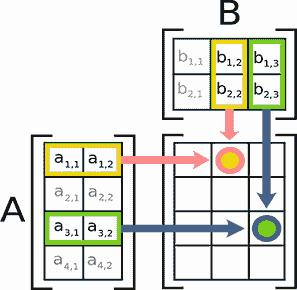

图 13.14 计算矩阵 A 和 B 的矩阵乘积。该操作输出一个新的矩阵。输出矩阵的第 *i* 行和第 *j* 列的每个元素等于 A 的第 *i* 行与 B 的第 *j* 列之间的点积。例如，输出矩阵的第一行第二列的元素等于 a[1,1] * b[1,2] + a[1,2] * b[2,2]。同时，输出矩阵的第三行第三列的元素等于 a[3,1] * b[1,3] + a[3,2] * b[2,3]。

NumPy 矩阵乘积

天真地，我们可以通过在`matrix_a`和`matrix_b`上运行嵌套的`for`循环来计算`matrix_c`。这种技术效率不高。方便的是，NumPy 的产品运算符`@`可以应用于二维矩阵以及一维数组。如果`matrix_a`和`matrix_b`都是 NumPy 数组，那么`matrix_c`等于`matrix_a @ matrix_b`。因此，`similarities`和`unit_vectors`的矩阵乘积等于`similarities @ unit_vectors`。让我们来验证一下。

列表 13.41 使用 NumPy 计算矩阵乘法

```
matrix_product = similarities @ unit_vectors
assert np.allclose(matrix_product, dot_products)   ❶
```

❶ 断言矩阵乘积的所有元素几乎与点积的所有元素完全相同。由于浮点数误差，结果存在微小差异。

如果我们翻转输入矩阵并运行`unit_vectors @ similarities`会发生什么？NumPy 将抛出一个错误！计算将取`unit_vectors`中的行和`similarities`中的列之间的向量点积，但这些行和列的长度不同。因此，计算是不可能的（图 13.15）。

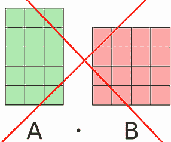

图 13.15 计算矩阵 A 和 B 的矩阵乘法的一个错误尝试。矩阵 A 的每一行有三个列，矩阵 B 的每一列有四个行。我们不能在三个元素的行和四个元素的列之间取点积。因此，运行`A` `@` `B`会导致错误。

列表 13.42 计算错误的矩阵乘法

```
try:
    matrix_product = unit_vectors @ similarities
except:
    print("We can't compute the matrix product")

We can't compute the matrix product
```

矩阵乘法是顺序相关的。`matrix_a @ matrix_b`的输出不一定与`matrix_b @ matrix_a`相同。换句话说，我们可以这样区分`matrix_a @ matrix_b`和`matrix_b @ matrix_a`：

+   `matrix_a @ matrix_b`是`matrix_a`和`matrix_b`的乘积。

+   `matrix_b @ matrix_a`是`matrix_b`和`matrix_a`的乘积。

在数学中，*乘积*和*乘法*这两个词经常可以互换。因此，计算矩阵乘法通常被称为*矩阵乘法*。这个名字如此普遍，以至于 NumPy 包含了一个`np.matmul`函数。`np.matmul (matrix_a, matrix_b)`的输出与`matrix_a @ matrix_b`相同。

列表 13.43 使用`matmul`运行矩阵乘法

```
matrix_product = np.matmul(similarities, unit_vectors)
assert np.array_equal(matrix_product,
                      similarities @ unit_vectors)
```

常见的 NumPy 矩阵操作

+   `matrix.shape`—返回一个包含矩阵行数和列数的元组。

+   `matrix.T`—返回一个行列互换的转置矩阵。

+   `matrix[i]`—返回矩阵中的第*i*行。

+   `matrix[:,j]`—返回矩阵中的第*j*列。

+   `k * matrix`—将矩阵的每个元素乘以常数`k`。

+   `matrix + k`—将常数`k`加到矩阵的每个元素上。

+   `matrix_a + matrix_b`—将`matrix_a`的每个元素加到`matrix_b`上。相当于对每个可能的`i`和`j`执行`matrix_c[i][j] = matrix_a[i][j] + matrix_b[i][j]`。

+   `matrix_a * matrix_b`—将`matrix_a`的每个元素与`matrix_b`的元素相乘。相当于对每个可能的`i`和`j`执行`matrix_c[i][j] = matrix_a[i][j] * matrix_b[i][j]`。

+   `matrix_a @ matrix_b`—返回`matrix_a`和`matrix_b`的矩阵乘积。相当于为每个可能的*i*和*j*执行`matrix_c[i][j] = matrix_a[i] @ matrix_b[;,j]`。

+   `np.matmult(matrix_a, matrix_b)`—返回`matrix_a`和`matrix_b`的矩阵乘积，不依赖于`@`运算符。

NumPy 允许我们执行矩阵乘法而不依赖于嵌套的`for`循环。这种改进不仅仅是外观上的。标准的 Python `for`循环设计用于运行通用数据列表；它们不是针对数字优化的。与此同时，NumPy 巧妙地优化了其数组迭代。因此，在 NumPy 中运行矩阵乘法时，速度会明显提高。

让我们比较 NumPy 和常规 Python（图 13.16）之间的矩阵乘积速度。列表 13.44 使用 NumPy 和 Python 的`for`循环绘制了不同大小矩阵的乘积速度。Python 内置的`time`模块被用来计时矩阵乘法。

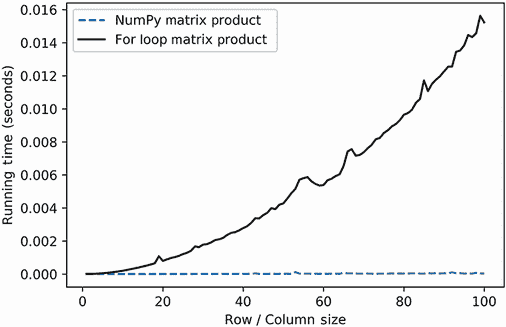

图 13.16 NumPy 和常规 Python 的矩阵大小与乘积运行时间的对比。NumPy 比常规 Python 快得多。

注意 运行时间将根据执行代码的机器的本地状态而波动。

列表 13.44 比较矩阵乘积运行时间

```
import time

numpy_run_times = []
for_loop_run_times = []

matrix_sizes = range(1, 101)
for size in matrix_sizes:
    matrix = np.ones((size, size))                       ❶

    start_time = time.time()                             ❷
    matrix @ matrix
    numpy_run_times.append(time.time() - start_time)     ❸

    start_time = time.time()
    for i in range(size):
        for j in range(size):
            matrix[i] @ matrix[:,j]

    for_loop_run_times.append(time.time() - start_time)  ❹

plt.plot(matrix_sizes, numpy_run_times,
         label='NumPy Matrix Product', linestyle='--')
plt.plot(matrix_sizes, for_loop_run_times,
         label='For-Loop Matrix Product', color='k')
plt.xlabel('Row / Column Size')
plt.ylabel('Running Time (Seconds)')
plt.legend()
plt.show()
```

❶ 创建一个大小为 1 到 100 的矩阵，每个元素都是 1

❷ 返回当前时间（以秒为单位）

❸ 将矩阵乘积速度存储在 NumPy 中

❹ 存储 Python 循环的矩阵乘积速度

当涉及到矩阵乘法时，NumPy 比基本的 Python 要高效得多。NumPy 的矩阵乘积代码运行效率更高，编写起来也更方便。我们现在将使用 NumPy 以最高效的方式计算所有文本之间的相似度。

### 13.3.2 计算所有向量的矩阵相似度

我们之前通过遍历`unit_vectors`矩阵来计算文本相似度。这个矩阵存储了我们三个贝壳文本的归一化 TF 向量。如果我们用`unit_vectors`乘以`unit_vectors.T`会发生什么？嗯，`unit_vectors.T`是`unit_vectors`的转置。因此，转置中的每一列`i`等于`unit_vectors`中的行`i`。计算`unit_vectors[i]`和`unit_vectors.T[:,i]`的点积将返回一个单位向量与其自身的余弦相似度，如图 13.17 所示。当然，这个相似度将等于 1。按照这个逻辑，`unit_vectors[i] @ unit_vectors[j].T`等于第*i*个和第*j*个向量之间的余弦相似度。因此，`unit_vectors @ unit_vectors.T`返回一个所有向量之间的余弦相似度矩阵。这个矩阵应该等于我们之前计算的`cosine_similarities`数组。让我们来验证一下。

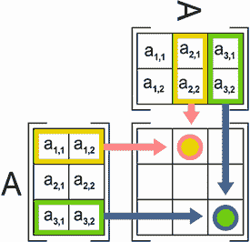

图 13.17 计算矩阵 A 与其转置 A 的点积。该操作输出一个新的矩阵。输出矩阵的第 *i* 行和第 *j* 列的每个元素等于 A 的第 *i* 行与 A 的第 *j* 列的点积。因此，输出矩阵的第三行和第三列的元素等于 A[2] 与其自身的点积。如果矩阵 A 是归一化的，那么这个点积将等于 1.0。

列表 13.45 从矩阵乘积中获取余弦值

```
cosine_matrix = unit_vectors @ unit_vectors.T
assert np.allclose(cosine_matrix, cosine_similarities)
```

`cosine_matrix` 中的每个元素等于两个向量文本之间角度的余弦值。这个余弦值可以转换成 Tanimoto 值，这通常反映了文本之间的词重叠和差异。使用 NumPy 算术运算，我们可以通过运行 `cosine_matrix / (2 - cosine_matrix)` 将 `cosine_matrix` 转换成一个 Tanimoto 相似度矩阵。

列表 13.46 将余弦值转换为 Tanimoto 矩阵

```
tanimoto_matrix = cosine_matrix / (2 - cosine_matrix)
assert np.allclose(tanimoto_matrix, similarities)
```

我们仅用两行代码就计算了所有的 Tanimoto 相似度。我们也可以通过直接将 `unit_vectors` 和 `unit_vectors.T` 输入到我们的 `normalized_tanimoto` 函数中来计算这些相似度。提醒一下，该函数执行以下操作：

1.  输入两个 NumPy 数组。它们的维度没有限制。

1.  将 `@` 运算符应用于 NumPy 数组。如果数组是矩阵，则操作返回矩阵乘积。

1.  使用算术运算来修改乘积。算术运算可以同样应用于数字和矩阵。

因此，`normalized_tanimoto(unit_vectors, unit_vectors.T)` 返回的输出等于 `tanimoto_matrix`。

列表 13.47 将矩阵输入到 `normalized_tanimoto`

```
output = normalized_tanimoto(unit_vectors, unit_vectors.T)
assert np.array_equal(output, tanimoto_matrix)
```

给定一个归一化 TF 向量矩阵，我们可以通过一行高效的代码计算它们的所有元素之间的相似度。

常见的归一化矩阵比较

+   `norm_matrix @ norm_matrix.T` — 返回所有元素之间的余弦相似度矩阵

+   `norm_matrix @ norm_matrix.T / (2 - norm_matrix @ norm_matrix.T)` — 返回所有元素之间的 Tanimoto 相似度矩阵

## 13.4 矩阵乘法的计算限制

矩阵乘法的速度由矩阵大小决定。NumPy 可能会优化速度，但即使是 NumPy 也有其限制。当我们计算实际的文本矩阵乘积时，这些限制变得明显。问题源于矩阵的列数，这取决于词汇表的大小。当开始比较非平凡文本时，词汇表中的总词数可能会失控。

以小说分析为例。平均小说包含大约 5,000 到 10,000 个独特的单词。例如，*《霍比特人》*包含 6,175 个独特的单词。而*《双城记》*包含 9,699 个独特的单词。两个小说之间的一些单词重叠；而另一些则不重叠。这两个小说共同拥有 12,138 个单词的词汇量。我们还可以加入第三部小说。加入*《汤姆·索亚历险记》*将词汇量扩大到 13,935 个单词。按照这个速度，再加入 27 部小说将词汇量扩大到大约 50,000 个单词。

假设 30 部小说需要一个包含 50,000 个单词的共享词汇表。此外，假设我们对 30 本书进行全对全相似度比较。计算这些相似度需要多少时间？让我们来看看！我们将创建一个 30 本书乘以 50,000 个单词的`book_matrix`。矩阵中的所有行都将进行归一化。然后我们将测量`normalized_tanimoto(book_matrix, book_matrix.T)`的运行时间。

注意：我们实验的目的是测试矩阵列数对运行时间的影响。在这里，实际的矩阵内容并不重要。因此，我们通过将所有单词计数设置为 1 来简化情况。因此，每行的归一化值等于`1 / 5000`。在现实世界的设置中，情况并非如此。另外，请注意，通过跟踪所有零值矩阵元素，可以优化运行时间。在这里，我们不考虑零值对矩阵乘法速度的影响。

列表 13.48 测量 30 部小说的全对全比较时间

```
vocabulary_size = 50000
normalized_vector = [1 / vocabulary_size] * vocabulary_size
book_count = 30

def measure_run_time(book_count):                               ❶
    book_matrix = np.array([normalized_vector] * book_count)
    start_time = time.time()
    normalized_tanimoto(book_matrix, book_matrix.T)
    return time.time() - start_time
run_time = measure_run_time(book_count)
print(f"It took {run_time:.4f} seconds to compute the similarities across a "
      f"{book_count}-book by {vocabulary_size}-word matrix")

It took 0.0051 seconds to compute the similarities across a 30-book by 50000-word matrix
```

❶ 该函数在 book_count-by-50,000 矩阵上计算运行时间。该函数在接下来的两个代码列表中重复使用。

相似度矩阵的计算大约需要 5 毫秒。这是一个合理的运行时间。随着分析书籍数量的增加，它是否会保持合理？让我们检查一下。我们将绘制从 30 到近 1,000（图 13.18）的多个书籍数量的运行时间。为了保持一致性，我们将词汇量保持在 50,000。

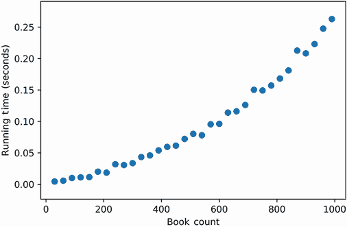

图 13.18 将书籍数量与文本比较的运行时间进行对比。运行时间呈二次增长。

列表 13.49 绘制书籍数量与运行时间的关系图

```
book_counts = range(30, 1000, 30)             ❶
run_times = [measure_run_time(book_count)
             for book_count in book_counts]
plt.scatter(book_counts, run_times)           ❷
plt.xlabel('Book Count')
plt.ylabel('Running Time (Seconds)')
plt.show()
```

❶ 我们不会对每个单个书籍数量进行采样——累积的运行时间会太慢。

❷ 生成散点图而不是曲线。图 13.18 将离散点拟合到连续的抛物线曲线。

相似度运行时间随着书籍数量的增加呈二次方增长。当书籍数量达到 1,000 本时，运行时间增加到大约 0.27 秒。这种延迟是可以容忍的。然而，如果我们进一步增加书籍数量，延迟就不再可以接受了。我们可以用简单的数学来证明这一点。我们绘制的曲线呈现出由 `y = n * (x ** 2)` 定义的抛物线形状。当 `x` 大约是 1,000 时，`y` 大约等于 `0.27`。因此，我们可以用方程 `y = (0.27 / (1000 ** 2)) * (x ** 2)` 来模拟我们的运行时间。让我们通过绘制方程输出和我们的预计算测量结果（图 13.19）来验证。这两个图表应该大部分重叠。

列表 13.50 使用二次曲线模拟运行时间

```
def y(x): return (0.27 / (1000 ** 2)) * (x ** 2)
plt.scatter(book_counts, run_times)
plt.plot(book_counts, y(np.array(book_counts)), c='k')
plt.xlabel('Book Count')
plt.ylabel('Running Time (Seconds)')
plt.show()
```

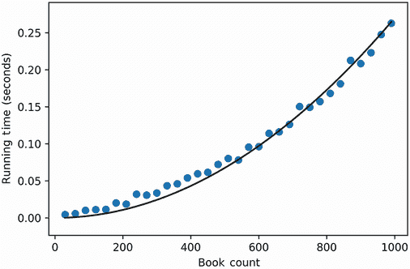

图 13.19 抛物线与运行时间的绘图。曲线的形状与运行时间散点图重叠。

我们绘制的方程与测量时间重叠。因此，我们可以使用这个方程来预测更大书籍比较的速度。让我们看看测量 300,000 本书之间的相似度需要多长时间。

注意，300,000 可能看起来是一个异常大的数字。然而，它反映了每年出版的 200,000 到 300,000 本英语小说。如果我们希望比较一年内出版的所有小说，我们需要乘以包含超过 200,000 行的矩阵。

列表 13.51 预测 300,000 本书的运行时间

```
book_count = 300000
run_time = y(book_count) / 3600                                            ❶
print(f"It will take {run_time} hours to compute all-by-all similarities "
      f"from a {book_count}-book by {vocabulary_size}-word matrix")

It will take 6.75 hours to compute all-by-all similarities from a 300000-book by 50000-word matrix
```

❶ 通过除以 3600 将秒转换为小时

比较 300,000 本书需要近 7 小时。这种时间延迟是不可接受的，尤其是在工业 NLP 系统中，这些系统旨在在几秒钟内处理数百万文本。我们需要以某种方式减少运行时间。一种方法是通过减少矩阵大小。

我们的矩阵太大，部分原因是列的大小。每一行包含 50,000 列，对应于 50,000 个单词。然而，在现实世界的设置中，并非所有单词的分布都是均匀的。虽然有些单词在小说中很常见，但其他单词可能只出现一次。例如，以长篇小说《白鲸》为例：其中 44%的单词只出现一次，之后再也没有使用过。有些单词在其他小说中很少出现。移除它们将降低列的大小。

在光谱的另一端是每个小说中都出现的常见单词。像 *the* 这样的单词在文本之间不提供区分信号。移除常见单词也会减少列的大小。

有可能系统地减少每个矩阵行的维度，从 50,000 减少到一个更合理的值。在下一节中，我们将介绍一系列降维技术，以缩小任何输入矩阵的形状。降低文本矩阵的维度可以大大降低常见 NLP 计算的运行时间。

## 摘要

+   我们可以使用 *Jaccard 相似度* 来比较文本。这个相似度指标等于两个文本之间共享的总独特单词的分数。

+   我们可以通过将我们的文本转换为 1 和 0 的二进制向量来计算 Jaccard 相似度。两个二进制文本向量的点积返回文本之间的共享词数。同时，文本向量与其自身的点积返回文本中的总词数。这些值足以计算 Jaccard 相似度。

+   **Tanimoto 相似度**将 Jaccard 推广到包括非二进制向量。这使得我们能够比较词频向量，这些向量被称为**TF 向量**。

+   **TF 向量相似度**过度依赖于文本大小。我们可以通过**归一化**来消除这种依赖。通过首先计算向量的**大小**，即向量到原点的距离，来归一化一个向量。将向量除以其大小产生一个归一化的单位向量。

+   单位向量的**大小**为 1。此外，Tanimoto 相似度部分依赖于向量大小。因此，如果仅对单位向量运行相似度函数，我们可以简化相似度函数。此外，单位向量相似度可以转换为其他常见指标，例如**余弦相似度**和距离。

+   我们可以使用**矩阵乘法**有效地计算所有对之间的相似度。矩阵只是一个数字的二维表。我们可以通过将每个矩阵行与矩阵列之间的成对点积相乘来相乘两个矩阵。如果我们用一个归一化矩阵乘以其转置，我们就会得到一个包含所有对余弦相似度的矩阵。使用 NumPy 的矩阵算术，我们将这些余弦相似度转换为 Tanimoto 相似度。

+   在 NumPy 中矩阵乘法比纯 Python 要快得多。然而，即使是 NumPy 也有其局限性。一旦矩阵变得过大，我们需要找到一种方法来减小其大小。
